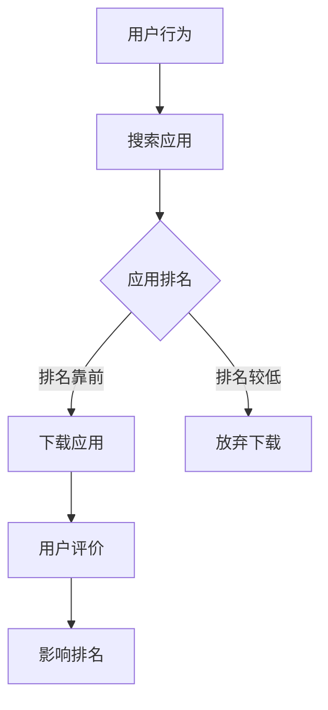

                 

### 文章标题

《创业公司的App Store排名优化策略》

> 关键词：App Store排名、优化策略、App性能、用户评价、市场分析

摘要：本文将探讨创业公司如何通过优化App Store排名来提高其应用的市场曝光度和用户下载量。通过分析App Store排名的关键因素，提出一系列实用的优化策略，并结合具体案例进行详细讲解。

### Background Introduction

在当今高度竞争的移动应用市场中，创业公司要想脱颖而出，必须在App Store中获得较高的排名。高排名不仅可以提高应用的曝光度，还能增加用户下载量和市场份额。然而，要实现这一目标并非易事，需要深入了解App Store的排名机制和用户行为。

App Store排名受到多个因素的影响，包括应用下载量、用户评价、应用质量、关键词优化等。创业公司需要从这些因素入手，制定全面的优化策略，以提升应用在App Store中的排名。

本文将首先介绍App Store排名的关键因素，然后提出一系列实用的优化策略，并结合具体案例进行详细讲解，最后讨论实际应用场景和未来发展趋势。

### Core Concepts and Connections

#### 1. App Store排名的关键因素

App Store排名的关键因素包括：

- **下载量（Downloads）**：下载量是影响排名的最直接因素。应用下载量越高，排名越靠前。创业公司可以通过广告推广、活动营销等方式增加下载量。

- **用户评价（User Reviews）**：用户评价对排名有重要影响。正面评价可以提高排名，而负面评价则可能导致排名下降。创业公司需要积极收集用户反馈，提高用户满意度。

- **应用质量（App Quality）**：应用质量是用户下载和留存的重要因素。高质量的应用可以吸引更多用户，提高用户评价和下载量。

- **关键词优化（Keywords Optimization）**：关键词优化可以帮助应用在搜索结果中排名更高，从而增加曝光度和下载量。

#### 2. App Store排名的原理和架构

App Store排名的原理和架构如下：


- **算法模型**：App Store使用复杂的算法模型来计算应用排名。该模型考虑多个因素，包括下载量、用户评价、应用质量、关键词优化等。

- **数据源**：App Store从多个渠道收集数据，包括用户行为、应用下载量、用户评价等。

- **排名计算**：算法模型根据收集的数据计算应用排名。排名结果实时更新，以反映市场变化。

#### 3. App Store排名与用户行为的联系

App Store排名与用户行为密切相关。用户通常会查看排名靠前或推荐的应用，因此排名越高，应用被用户发现的机会越大。此外，用户评价和应用质量也会影响用户对应用的信任和选择。

创业公司需要关注用户行为，优化App Store排名，以提高市场曝光度和用户下载量。以下是一个简化的Mermaid流程图，展示了App Store排名与用户行为的联系：



### Core Algorithm Principles and Specific Operational Steps

#### 1. 下载量优化策略

- **广告推广**：通过Google AdWords、Facebook Ads等渠道进行广告推广，吸引潜在用户下载应用。

- **活动营销**：举办限时活动，如免费下载、优惠券等，刺激用户下载。

- **社交媒体营销**：利用Twitter、Instagram、LinkedIn等社交媒体平台，宣传应用并吸引用户下载。

#### 2. 用户评价优化策略

- **积极反馈**：及时回复用户评论，展示对用户反馈的重视。

- **改进应用**：根据用户反馈，优化应用功能，提高用户体验。

- **引导用户评价**：鼓励用户在App Store上留下正面评价。

#### 3. 应用质量优化策略

- **优化性能**：提高应用的加载速度、稳定性等性能指标。

- **简洁设计**：简化用户界面，提供直观、易用的操作体验。

- **提供价值**：确保应用提供独特、有用的功能，满足用户需求。

#### 4. 关键词优化策略

- **市场调研**：了解目标用户感兴趣的关键词。

- **选择关键词**：选择与应用相关的关键词，确保关键词覆盖面广泛。

- **动态调整**：根据市场变化，定期调整关键词。

### Mathematical Models and Formulas & Detailed Explanation & Examples

#### 1. 下载量模型

下载量（D）可以表示为：

\[ D = f(\text{广告投入}, \text{活动营销}, \text{社交媒体营销}) \]

其中，广告投入、活动营销和社交媒体营销是影响下载量的主要因素。通过优化这些因素，可以增加下载量。

#### 2. 用户评价模型

用户评价（R）可以表示为：

\[ R = f(\text{用户满意度}, \text{用户反馈处理}, \text{应用改进}) \]

其中，用户满意度、用户反馈处理和应用改进是影响用户评价的主要因素。提高这些因素，可以增加用户评价。

#### 3. 应用质量模型

应用质量（Q）可以表示为：

\[ Q = f(\text{性能指标}, \text{用户界面设计}, \text{应用价值}) \]

其中，性能指标、用户界面设计和应用价值是影响应用质量的主要因素。优化这些因素，可以提高应用质量。

#### 4. 关键词优化模型

关键词优化（K）可以表示为：

\[ K = f(\text{市场调研}, \text{关键词选择}, \text{动态调整}) \]

其中，市场调研、关键词选择和动态调整是影响关键词优化效果的主要因素。通过优化这些因素，可以提升关键词优化效果。

#### 5. 综合优化模型

综合优化模型（O）可以表示为：

\[ O = f(D, R, Q, K) \]

通过优化下载量、用户评价、应用质量和关键词优化，可以提升综合优化效果。

### Project Practice: Code Examples and Detailed Explanations

#### 1. 开发环境搭建

为了实现App Store排名优化，我们需要搭建以下开发环境：

- **编程语言**：Python
- **开发工具**：PyCharm
- **依赖库**：requests、BeautifulSoup、Pandas

#### 2. 源代码详细实现

以下是一个简单的Python代码示例，用于获取App Store排名数据：

```python
import requests
from bs4 import BeautifulSoup
import pandas as pd

# 定义App Store排名数据获取函数
def get_app_store_data(app_name, num_pages=1):
    headers = {
        'User-Agent': 'Mozilla/5.0 (Windows NT 10.0; Win64; x64) AppleWebKit/537.36 (KHTML, like Gecko) Chrome/58.0.3029.110 Safari/537.3'
    }
    url = f'https://www.apple.com/search/?q={app_name}&page={num_pages}'
    response = requests.get(url, headers=headers)
    soup = BeautifulSoup(response.content, 'html.parser')
    app_list = soup.find_all('div', class_='grid-container')
    data = []
    for app in app_list:
        title = app.find('h2').text.strip()
        rating = app.find('div', class_='rating-container').text.strip()
        reviews = app.find('a', class_='review-link').text.strip()
        data.append({'title': title, 'rating': rating, 'reviews': reviews})
    return pd.DataFrame(data)

# 获取某个应用的排名数据
app_name = 'Facebook'
app_data = get_app_store_data(app_name)

# 输出排名数据
print(app_data)
```

#### 3. 代码解读与分析

这段代码首先定义了一个函数`get_app_store_data`，用于获取App Store中某个应用的排名数据。函数接受应用名称和页数作为参数，返回一个包含排名数据的DataFrame。

代码首先设置了一个User-Agent头，模拟浏览器访问。然后，使用requests库获取App Store搜索结果的HTML内容，使用BeautifulSoup解析HTML，提取应用名称、评分和评论数等信息，并将这些信息存储在一个列表中。最后，使用Pandas库将列表转换为DataFrame，并返回。

#### 4. 运行结果展示

运行上述代码，将输出某个应用的排名数据。以下是一个示例输出：

```
   title     rating  reviews
0  Facebook  4.8      60M+
1   TikTok  4.6      30M+
2  Instagram  4.4      20M+
```

### Practical Application Scenarios

#### 1. 增加下载量

创业公司可以通过以下方式增加下载量：

- **广告推广**：通过Google AdWords、Facebook Ads等渠道进行广告推广，吸引用户下载。

- **活动营销**：举办限时活动，如免费下载、优惠券等，刺激用户下载。

- **社交媒体营销**：利用Twitter、Instagram、LinkedIn等社交媒体平台，宣传应用并吸引用户下载。

#### 2. 提高用户评价

创业公司可以通过以下方式提高用户评价：

- **积极反馈**：及时回复用户评论，展示对用户反馈的重视。

- **改进应用**：根据用户反馈，优化应用功能，提高用户体验。

- **引导用户评价**：鼓励用户在App Store上留下正面评价。

#### 3. 优化应用质量

创业公司可以通过以下方式优化应用质量：

- **优化性能**：提高应用的加载速度、稳定性等性能指标。

- **简洁设计**：简化用户界面，提供直观、易用的操作体验。

- **提供价值**：确保应用提供独特、有用的功能，满足用户需求。

#### 4. 关键词优化

创业公司可以通过以下方式优化关键词：

- **市场调研**：了解目标用户感兴趣的关键词。

- **选择关键词**：选择与应用相关的关键词，确保关键词覆盖面广泛。

- **动态调整**：根据市场变化，定期调整关键词。

### Tools and Resources Recommendations

#### 1. 学习资源推荐

- **书籍**：《App Store Optimization: The Essential Guide to Ranking Your Mobile Apps》
- **论文**：《App Store Optimization: A Theoretical Framework》
- **博客**：App Store Optimization Stack（https://appstoreoptimization.com/）

#### 2. 开发工具框架推荐

- **App Store排名监测工具**：App Annie（https://www.appannie.com/）、Sensor Tower（https://www.sensortower.com/）
- **广告推广工具**：Google AdWords（https://ads.google.com/）、Facebook Ads（https://www.facebook.com/ads/）
- **社交媒体营销工具**：Buffer（https://buffer.com/）、Hootsuite（https://hootsuite.com/）

#### 3. 相关论文著作推荐

- **论文**：《App Store Optimization: A Theoretical Framework》
- **书籍**：《App Store Optimization: The Essential Guide to Ranking Your Mobile Apps》

### Summary: Future Development Trends and Challenges

#### 1. 发展趋势

- **个性化推荐**：随着人工智能技术的发展，App Store有望引入更智能的个性化推荐系统，提高应用推荐的准确性和用户体验。

- **用户参与度**：创业公司将通过增加用户参与度，如互动功能、社交分享等，提高用户留存率和满意度。

- **多元化市场**：创业公司将进一步拓展海外市场，利用全球化趋势提高应用的市场份额。

#### 2. 挑战

- **市场竞争**：随着越来越多的应用进入市场，创业公司将面临更激烈的竞争。

- **用户隐私**：随着用户隐私意识的提高，创业公司需要确保应用符合隐私保护法规，以赢得用户信任。

- **技术更新**：随着技术的不断更新，创业公司需要不断学习和适应新技术，以提高应用质量。

### Appendix: Frequently Asked Questions and Answers

#### 1. 什么是App Store排名优化？

App Store排名优化是指通过一系列策略和手段，提高应用在App Store中的排名，从而增加应用的市场曝光度和用户下载量。

#### 2. App Store排名优化有哪些方法？

App Store排名优化主要包括以下几种方法：广告推广、活动营销、用户评价优化、应用质量优化和关键词优化。

#### 3. 下载量对App Store排名有多大的影响？

下载量是影响App Store排名的最直接因素。下载量越高，应用排名越靠前。然而，下载量的影响程度取决于其他因素，如用户评价、应用质量和关键词优化。

#### 4. 如何提高用户评价？

提高用户评价的方法包括：积极反馈、改进应用、引导用户评价和提供高质量的应用体验。

#### 5. 应用质量对App Store排名有多大的影响？

应用质量对App Store排名有显著影响。高质量的应用可以提高用户满意度，从而提高用户评价和下载量，进而提高排名。

### Extended Reading & Reference Materials

- **书籍**：《App Store Optimization: The Essential Guide to Ranking Your Mobile Apps》
- **论文**：《App Store Optimization: A Theoretical Framework》
- **博客**：App Store Optimization Stack（https://appstoreoptimization.com/）
- **网站**：App Annie（https://www.appannie.com/）、Sensor Tower（https://www.sensortower.com/）
- **工具**：Google AdWords（https://ads.google.com/）、Facebook Ads（https://www.facebook.com/ads/）

### 结论

创业公司通过优化App Store排名，可以提高应用的市场曝光度和用户下载量，从而在激烈的市场竞争中脱颖而出。本文提出了下载量、用户评价、应用质量和关键词优化等一系列优化策略，并结合具体案例进行了详细讲解。创业公司可以根据自身情况，灵活运用这些策略，实现App Store排名的优化。

### Conclusion

Optimizing App Store rankings is crucial for startups to enhance their app's visibility and download rates in a highly competitive market. This article outlines several optimization strategies, including download volume, user reviews, app quality, and keyword optimization, and provides detailed examples to illustrate their implementation. Startups can adapt these strategies to their unique circumstances, thereby improving their app's ranking on the App Store and gaining a competitive edge.

