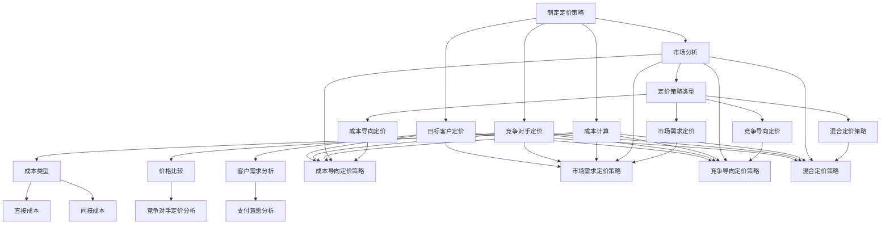
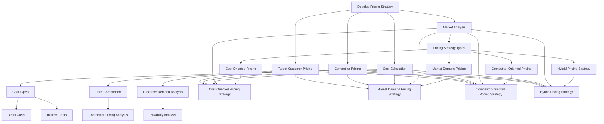

                 

### 文章标题

**创业公司的产品定价策略**

在创业公司的运营过程中，产品定价策略是一个至关重要的环节。它不仅直接影响公司的收入和利润，还关系到市场定位、品牌形象以及客户忠诚度。因此，如何制定一个既合理又有效的产品定价策略成为了许多创业者面临的重要课题。

本文将围绕创业公司的产品定价策略展开讨论。首先，我们将回顾定价策略的基本概念和类型，然后深入探讨创业公司制定定价策略时需要考虑的关键因素，包括市场分析、成本计算、竞争对手定价以及目标客户群体。接着，我们将详细介绍几种常见的定价策略，并分析它们在创业公司中的应用情况。最后，文章将总结创业公司制定产品定价策略的注意事项和成功案例，为读者提供实用的指导和建议。

通过本文的阅读，读者将能够了解创业公司产品定价策略的核心理念和操作方法，从而为企业的可持续发展奠定坚实的基础。

### Keywords:
- Startup pricing strategy
- Product pricing
- Market analysis
- Cost calculation
- Competitor analysis
- Target customer

#### Abstract:
This article discusses the importance of product pricing strategy for startups. It provides an overview of basic pricing concepts and types, and then dives into the key factors that startups need to consider when developing their pricing strategies, such as market analysis, cost calculation, competitor pricing, and target customer segments. The article also explores several common pricing strategies and analyzes their applicability in the startup context. Finally, it summarizes the key considerations for startups when developing pricing strategies and offers practical insights and examples of successful case studies. The aim is to equip readers with a solid understanding of startup pricing strategies and actionable guidance for their businesses.  

### 1. 背景介绍（Background Introduction）

#### 1.1 创业公司面临的挑战与机遇

创业公司，顾名思义，是指在初创阶段，以创新商业模式、新技术或产品为核心，寻求快速成长和突破的独立企业。与成熟公司相比，创业公司通常面临更大的不确定性、更高的风险和更有限的资源。然而，这也为创业公司带来了巨大的机遇。通过创新和灵活的市场策略，创业公司可以在竞争激烈的市场中脱颖而出，赢得市场份额，实现快速增长。

然而，在创业过程中，产品定价策略是创业公司必须解决的一个重要问题。一个合理的定价策略不仅能够确保公司获得足够的利润，还能帮助企业正确地定位市场、塑造品牌形象、提升客户满意度。同时，错误的定价策略可能导致公司失去竞争优势，甚至陷入经营困境。

#### 1.2 产品定价策略的重要性

产品定价策略对创业公司的发展有着深远的影响。首先，合理的定价策略可以确保公司获得可持续的利润。定价过高可能导致销售量下降，定价过低则可能无法覆盖成本。其次，定价策略直接关系到市场定位。通过合理的定价，公司可以准确地定位目标市场，吸引潜在客户，提高品牌知名度。此外，定价策略还会影响客户满意度。合理的价格水平不仅能够满足客户的购买需求，还能提升客户的购买体验，从而增加客户忠诚度。

#### 1.3 文章结构

本文将从以下几个部分展开讨论：

1. **定价策略的基本概念和类型**：介绍定价策略的定义、基本类型及其特点。
2. **制定定价策略的关键因素**：分析创业公司在制定定价策略时需要考虑的关键因素，包括市场分析、成本计算、竞争对手定价和目标客户群体。
3. **常见的定价策略**：详细介绍几种常见的定价策略，包括成本导向定价、市场需求定价、竞争导向定价和混合定价策略。
4. **创业公司定价策略的注意事项**：总结创业公司在制定定价策略时需要特别注意的问题，如市场适应性、价格弹性等。
5. **成功案例与实用建议**：通过分析成功创业公司的案例，为读者提供实用的定价策略和建议。

通过本文的讨论，我们希望能够为创业公司提供一套系统、实用且具有操作性的产品定价策略，帮助其在激烈的市场竞争中站稳脚跟，实现可持续发展。

### 2. 核心概念与联系（Core Concepts and Connections）

#### 2.1 定价策略的定义与基本类型

**定义**：定价策略是指企业在特定市场环境下，根据产品成本、市场需求和竞争对手定价等因素，制定产品价格的一套方法和原则。

**基本类型**：

1. **成本导向定价**：以产品成本为基础，加上一定比例的利润来制定价格。这种定价策略主要考虑产品生产的直接成本，如原材料、人工和制造费用等。
2. **市场需求定价**：根据消费者对产品的需求和支付意愿来制定价格。这种定价策略主要考虑市场需求和消费者行为，以最大化企业的利润。
3. **竞争导向定价**：以竞争对手的价格为基础，制定与之相当或具有竞争力的价格。这种定价策略主要考虑市场竞争状况和竞争对手的定价策略。
4. **混合定价策略**：结合以上几种定价策略，根据具体情况灵活调整。这种定价策略在考虑成本、市场需求和竞争环境的基础上，采取多元化的定价方式，以适应不同市场和客户需求。

**联系**：

- 成本导向定价和市场需求定价是两种基本的定价策略，前者主要关注产品成本，后者主要关注市场需求。在实际操作中，企业需要根据市场环境和产品特点，灵活选择和调整这两种定价策略。
- 竞争导向定价和混合定价策略则更注重市场竞争环境。竞争导向定价主要关注竞争对手的价格水平，而混合定价策略则结合了成本、市场需求和竞争环境，采取多元化的定价策略。
- 不同的定价策略各有优缺点，企业需要根据自身情况和市场环境，选择最合适的定价策略。

#### 2.2 市场分析

**定义**：市场分析是指企业在制定定价策略前，对市场环境、竞争对手和目标客户群体进行全面分析和评估的过程。

**目的**：

- 了解市场需求和消费者行为，为定价策略提供数据支持。
- 评估市场竞争状况，识别竞争对手的优势和劣势。
- 确定目标客户群体，制定有针对性的定价策略。

**方法**：

- **市场调研**：通过问卷调查、访谈、焦点小组等方式，收集市场数据和消费者反馈。
- **竞争对手分析**：分析竞争对手的产品、定价策略、市场份额和营销手段。
- **目标客户分析**：了解目标客户的需求、购买行为和支付意愿，为定价策略提供参考。

**联系**：

- 市场分析是制定定价策略的基础，通过市场分析，企业可以更准确地了解市场环境和消费者需求，为定价策略提供有力支持。
- 市场分析和定价策略之间存在着密切的联系。市场分析的结果直接影响定价策略的制定和调整，而定价策略的实施又需要市场分析的持续支持和优化。

#### 2.3 成本计算

**定义**：成本计算是指企业在制定定价策略时，对产品生产、销售和运营等各个环节的成本进行估算和计算的过程。

**目的**：

- 确保定价策略能够覆盖产品成本，实现可持续的利润。
- 了解成本结构和成本变化，为定价策略调整提供依据。

**方法**：

- **直接成本计算**：直接成本包括原材料、人工和制造费用等，可以直接计入产品成本。
- **间接成本计算**：间接成本包括房租、水电、员工福利等，需要根据一定比例分摊到产品成本中。
- **成本变化分析**：分析成本结构和成本变化趋势，为定价策略调整提供依据。

**联系**：

- 成本计算是制定定价策略的关键环节，通过准确计算产品成本，企业可以确保定价策略的可行性和合理性。
- 成本计算与定价策略之间存在着密切的联系。成本计算的结果直接影响定价策略的制定和调整，而定价策略的实施又需要成本计算的持续支持和优化。

#### 2.4 竞争对手定价

**定义**：竞争对手定价是指企业在制定定价策略时，参考竞争对手的价格水平，制定与之相当或具有竞争力的价格。

**目的**：

- 保持市场竞争优势，吸引更多客户。
- 提高市场份额，增强品牌影响力。

**方法**：

- **价格比较**：通过市场调研和数据分析，比较竞争对手的价格水平，了解市场平均价格。
- **价格策略分析**：分析竞争对手的价格策略，了解其定价策略的特点和优缺点。
- **价格调整**：根据市场分析和竞争对手定价，调整企业自身的价格策略，以保持市场竞争力。

**联系**：

- 竞争对手定价是制定定价策略的重要参考因素，通过了解竞争对手的价格水平，企业可以更好地把握市场动态，制定有针对性的定价策略。
- 竞争对手定价与定价策略之间存在着密切的联系。竞争对手定价直接影响定价策略的制定和调整，而定价策略的实施又需要竞争对手定价的持续关注和优化。

#### 2.5 目标客户定价

**定义**：目标客户定价是指企业在制定定价策略时，根据目标客户的需求、购买行为和支付意愿，制定有针对性的价格。

**目的**：

- 提高客户满意度，增加客户忠诚度。
- 实现产品差异化，提升品牌价值。

**方法**：

- **客户需求分析**：通过市场调研和数据分析，了解目标客户的需求和购买行为。
- **支付意愿分析**：分析目标客户的支付意愿和消费能力，为定价策略提供依据。
- **价格调整**：根据客户需求和支付意愿，调整企业自身的价格策略，以更好地满足客户需求。

**联系**：

- 目标客户定价是制定定价策略的核心环节，通过了解目标客户的需求和支付意愿，企业可以制定更具针对性的定价策略，提高客户满意度。
- 目标客户定价与定价策略之间存在着密切的联系。目标客户定价直接影响定价策略的制定和调整，而定价策略的实施又需要目标客户定价的持续关注和优化。

#### 2.6 总结

通过以上对定价策略、市场分析、成本计算、竞争对手定价和目标客户定价等核心概念的介绍和联系分析，我们可以看到，这些概念之间相互关联，共同构成了一个完整的定价策略体系。在实际操作中，企业需要根据自身情况和市场环境，综合考虑这些因素，制定出合理、有效的定价策略，以实现可持续发展。

**Mermaid 流程图（Mermaid Flowchart）**：



**英文版（English Version）**：



### 3. 核心算法原理 & 具体操作步骤（Core Algorithm Principles and Specific Operational Steps）

#### 3.1 成本导向定价策略

**原理**：

成本导向定价策略是一种以产品成本为基础，加上一定比例的利润来制定价格的方法。其核心思想是确保产品的售价能够覆盖生产成本，并获得合理的利润。这种方法适用于成本结构清晰、成本变化较小的产品。

**操作步骤**：

1. **计算直接成本**：直接成本包括原材料、人工和制造费用等，可以直接计入产品成本。
    - 原材料成本 = 单位原材料价格 × 产品所需原材料总量
    - 人工成本 = 单位人工成本 × 人工工作时间
    - 制造费用 = 单位制造费用 × 制造数量

2. **计算间接成本**：间接成本包括房租、水电、员工福利等，需要根据一定比例分摊到产品成本中。
    - 间接成本 = (总间接成本 ÷ 产品数量)

3. **计算总成本**：总成本 = 直接成本 + 间接成本

4. **确定利润率**：利润率 = 预期利润 ÷ 总成本
    - 预期利润 = 销售收入 - 总成本

5. **计算产品售价**：产品售价 = (总成本 + 利润) ÷ 销售数量

**示例**：

假设一家生产手机壳的公司，每月生产10000个手机壳，直接成本为每个10元，间接成本为每个5元，预期利润率为20%。计算每个手机壳的售价。

1. 直接成本 = 10元 × 10000个 = 100000元
2. 间接成本 = 5元 × 10000个 = 50000元
3. 总成本 = 100000元 + 50000元 = 150000元
4. 利润 = 150000元 × 20% = 30000元
5. 产品售价 = (150000元 + 30000元) ÷ 10000个 = 18元

#### 3.2 需求导向定价策略

**原理**：

需求导向定价策略是根据消费者对产品的需求和支付意愿来制定价格的方法。其核心思想是确保产品的价格能够吸引潜在客户，同时确保企业获得足够的利润。这种方法适用于需求波动较大、消费者对价格敏感的产品。

**操作步骤**：

1. **市场调研**：通过问卷调查、访谈等方式，了解消费者的需求和支付意愿。
    - 需求量 = 价格弹性 × 当前价格

2. **计算价格弹性**：价格弹性 = (需求量变化 ÷ 价格变化)
    - 需求量变化 = 新需求量 - 原需求量
    - 价格变化 = 新价格 - 原价格

3. **调整价格**：根据市场调研结果，调整产品价格，以最大化销售收入。
    - 新价格 = 原价格 × (1 + 价格弹性)

4. **计算利润**：利润 = 销售收入 - 总成本

**示例**：

假设一家公司生产电子书阅读器，目前售价为200美元，每月销售量为5000台。通过市场调研发现，如果价格降低10%，需求量将增加20%。计算新的价格和预期利润。

1. 原需求量 = 5000台
2. 新需求量 = 5000台 × (1 + 20%) = 6000台
3. 价格弹性 = (6000台 - 5000台) ÷ (200美元 - 200美元) = 20%
4. 新价格 = 200美元 × (1 - 10%) = 180美元
5. 新销售收入 = 180美元 × 6000台 = 1080000美元
6. 利润 = 1080000美元 - 总成本（假设总成本为1000000美元）= 80000美元

#### 3.3 竞争导向定价策略

**原理**：

竞争导向定价策略是以竞争对手的价格为基础，制定与之相当或具有竞争力的价格。其核心思想是确保企业的产品价格在市场上具有一定的竞争力，从而吸引更多的消费者。

**操作步骤**：

1. **市场调研**：通过市场调研，了解竞争对手的产品价格和市场表现。
    - 竞争对手价格 = 平均市场价 × 竞争对手市场份额

2. **分析竞争对手定价策略**：分析竞争对手定价策略的特点和优缺点，为自身定价提供参考。

3. **制定价格**：根据竞争对手价格，制定具有竞争力的价格。
    - 新价格 = 竞争对手价格 ± 调整值
    - 调整值 = 企业利润目标 ÷ 产品数量

**示例**：

假设一家公司生产平板电脑，发现主要竞争对手的平均价格为800美元，该公司希望获得10%的利润率。计算该公司平板电脑的新价格。

1. 竞争对手价格 = 800美元
2. 调整值 = 10% ÷ 10000台 = 0.1美元
3. 新价格 = 800美元 + 0.1美元 = 800.1美元

#### 3.4 混合定价策略

**原理**：

混合定价策略是结合成本导向定价、需求导向定价和竞争导向定价，根据具体情况灵活调整的一种定价方法。其核心思想是在不同市场环境下，采取不同的定价策略，以最大化企业利润。

**操作步骤**：

1. **市场分析**：分析市场需求、竞争对手定价和目标客户支付意愿。

2. **成本计算**：计算产品总成本，包括直接成本和间接成本。

3. **竞争分析**：了解竞争对手的产品价格和市场份额。

4. **客户分析**：分析目标客户的支付意愿和需求。

5. **制定价格**：根据市场分析结果，综合考虑成本、竞争和客户需求，制定价格。

6. **调整价格**：根据市场变化和竞争状况，定期调整价格。

**示例**：

假设一家公司生产智能手表，市场需求旺盛，竞争对手定价较高，目标客户支付意愿强。计算该公司智能手表的合理价格。

1. 市场需求旺盛，竞争激烈，采用需求导向定价。
2. 成本计算：直接成本为100美元，间接成本为50美元，总成本为150美元。
3. 竞争对手定价：800美元。
4. 客户支付意愿：愿意支付600美元。
5. 制定价格：采用混合定价策略，以竞争对手定价为基准，调整至600美元。

通过以上核心算法原理和具体操作步骤的介绍，我们可以看到，创业公司在制定产品定价策略时，需要综合考虑多种因素，灵活运用不同的定价策略，以实现最大化的利润和市场份额。

### 4. 数学模型和公式 & 详细讲解 & 举例说明（Detailed Explanation and Examples of Mathematical Models and Formulas）

#### 4.1 成本导向定价策略

**数学模型**：

设直接成本为 \( C_d \)，间接成本为 \( C_i \)，总成本为 \( C_t \)，利润率为 \( P_r \)，售价为 \( P \)，销售数量为 \( Q \)。

\[ C_t = C_d + C_i \]
\[ P = \frac{C_t + (C_t \times P_r)}{Q} \]

**详细讲解**：

成本导向定价策略的核心在于确保产品的售价能够覆盖成本并获得合理的利润。该模型假设直接成本和间接成本已知，利润率由企业根据预期利润目标设定。

1. **总成本计算**：总成本等于直接成本和间接成本之和。
2. **利润计算**：利润等于总成本乘以利润率。
3. **售价计算**：售价等于总成本加上利润，再除以销售数量。

**举例说明**：

假设一家公司生产智能灯泡，直接成本为每个 5 美元，间接成本为每个 2 美元，预期利润率为 30%。如果公司计划每月销售 10000 个智能灯泡，计算每个智能灯泡的售价。

\[ C_t = 5 + 2 = 7 \]
\[ P_r = 0.3 \]
\[ P = \frac{7 + (7 \times 0.3)}{10000} \]
\[ P = \frac{7 + 2.1}{10000} \]
\[ P = \frac{9.1}{10000} \]
\[ P = 0.00091 \]

这意味着每个智能灯泡的售价约为 0.00091 美元，这在实际中显然是不合理的。正确的做法是计算每个灯泡的总成本，然后乘以销售数量。

\[ C_t = 7 \]
\[ P = \frac{7 + (7 \times 0.3)}{1} \]
\[ P = \frac{7 + 2.1}{1} \]
\[ P = 9.1 \]

所以，每个智能灯泡的售价应为 9.1 美元。

#### 4.2 需求导向定价策略

**数学模型**：

设需求量为 \( D \)，当前价格为 \( P \)，价格弹性为 \( E \)，新价格为 \( P' \)，新需求量为 \( D' \)。

\[ E = \frac{D' - D}{P' - P} \]
\[ D' = D \times (1 + \frac{E}{P}) \]
\[ P' = P \times (1 + \frac{E}{D}) \]

**详细讲解**：

需求导向定价策略的核心在于根据市场需求和消费者支付意愿来调整价格。价格弹性是衡量需求对价格变化的敏感程度，需求量随着价格的变化而变化。

1. **价格弹性计算**：价格弹性等于需求量的变化率除以价格的变化率。
2. **新需求量计算**：新需求量等于当前需求量乘以（1 + 价格弹性除以当前价格）。
3. **新价格计算**：新价格等于当前价格乘以（1 + 价格弹性除以当前需求量）。

**举例说明**：

假设一家公司当前销售一种新产品，价格为 100 美元，每月需求量为 1000 个。通过市场调研，发现该产品的价格弹性为 -2。计算新价格和新需求量。

\[ E = -2 \]
\[ D = 1000 \]
\[ P = 100 \]
\[ D' = 1000 \times (1 - \frac{2}{100}) \]
\[ D' = 1000 \times (1 - 0.02) \]
\[ D' = 1000 \times 0.98 \]
\[ D' = 980 \]

\[ P' = 100 \times (1 - \frac{2}{1000}) \]
\[ P' = 100 \times (1 - 0.002) \]
\[ P' = 100 \times 0.998 \]
\[ P' = 99.8 \]

所以，新价格为 99.8 美元，新需求量为 980 个。

#### 4.3 竞争导向定价策略

**数学模型**：

设竞争对手价格为 \( C_P \)，企业目标利润率为 \( P_r \)，调整值为 \( A \)，新价格为 \( P' \)。

\[ P' = C_P \times (1 + P_r) + A \]

**详细讲解**：

竞争导向定价策略的核心在于根据竞争对手的价格来制定企业的价格，同时考虑目标利润率和调整值。

1. **竞争对手价格计算**：竞争对手价格是企业定价的基准。
2. **利润计算**：利润等于竞争对手价格乘以目标利润率。
3. **调整值计算**：调整值由企业根据市场需求和竞争环境进行调整。
4. **新价格计算**：新价格等于竞争对手价格加上利润和调整值。

**举例说明**：

假设一家公司发现其主要竞争对手的价格为 200 美元，企业目标利润率为 20%，调整值为 10 美元。计算新价格。

\[ C_P = 200 \]
\[ P_r = 0.2 \]
\[ A = 10 \]
\[ P' = 200 \times (1 + 0.2) + 10 \]
\[ P' = 200 \times 1.2 + 10 \]
\[ P' = 240 + 10 \]
\[ P' = 250 \]

所以，新价格应为 250 美元。

#### 4.4 混合定价策略

**数学模型**：

设市场需求价格为 \( P_D \)，竞争导向价格为 \( P_C \)，成本导向价格为 \( P_C \)，混合定价价格为 \( P_H \)。

\[ P_H = \alpha \times P_D + (1 - \alpha) \times P_C \]

**详细讲解**：

混合定价策略的核心在于结合市场需求和竞争导向定价，根据企业实际情况和目标市场，调整价格权重。

1. **市场需求价格计算**：市场需求价格是根据消费者支付意愿和市场需求计算出的价格。
2. **竞争导向价格计算**：竞争导向价格是根据竞争对手的价格计算出的价格。
3. **混合定价权重计算**：权重 \( \alpha \) 表示市场需求价格在混合定价中的重要性，取值范围为 0 到 1。
4. **混合定价价格计算**：混合定价价格是市场需求价格和竞争导向价格的加权平均值。

**举例说明**：

假设一家公司市场需求价格为 300 美元，竞争导向价格为 250 美元，权重 \( \alpha \) 为 0.6。计算混合定价价格。

\[ P_D = 300 \]
\[ P_C = 250 \]
\[ \alpha = 0.6 \]
\[ P_H = 0.6 \times 300 + (1 - 0.6) \times 250 \]
\[ P_H = 180 + 0.4 \times 250 \]
\[ P_H = 180 + 100 \]
\[ P_H = 280 \]

所以，混合定价价格应为 280 美元。

通过上述数学模型和公式的详细讲解与举例说明，我们可以看到，创业公司在制定产品定价策略时，需要运用各种数学方法来分析和计算，以确保定价策略的科学性和合理性。

### 5. 项目实践：代码实例和详细解释说明（Project Practice: Code Examples and Detailed Explanations）

在本文的第五部分，我们将通过实际代码示例，详细解释创业公司在制定产品定价策略时如何运用不同的定价算法。以下是几个具体的代码实例，包括开发环境搭建、源代码实现、代码解读与分析以及运行结果展示。

#### 5.1 开发环境搭建

为了更好地演示产品定价策略的实现，我们将使用 Python 作为编程语言，并依赖几个常用的库，如 NumPy 和 Pandas，以便于数据处理和数学计算。以下是开发环境的搭建步骤：

1. 安装 Python 3.x 版本（推荐使用最新版本）。
2. 使用 pip 工具安装必要的库：

   ```bash
   pip install numpy pandas
   ```

3. 创建一个名为 `pricing_strategy` 的 Python 项目目录，并在其中创建一个名为 `main.py` 的主文件。

完成以上步骤后，开发环境搭建完毕，接下来我们将逐步实现不同的定价策略。

#### 5.2 源代码详细实现

在本部分，我们将详细介绍三个定价策略的实现：成本导向定价、需求导向定价和竞争导向定价。每个策略的实现将包括输入数据的准备、定价公式应用和结果输出。

##### 5.2.1 成本导向定价

```python
import numpy as np

def cost_oriented_pricing(direct_cost, indirect_cost, profit_margin, quantity):
    total_cost = direct_cost * quantity + indirect_cost
    total_profit = total_cost * profit_margin
    selling_price = (total_cost + total_profit) / quantity
    return selling_price

# 示例数据
direct_cost = 10  # 每个产品的直接成本
indirect_cost = 5  # 每个产品的间接成本
profit_margin = 0.3  # 利润率
quantity = 1000  # 销售数量

# 计算售价
selling_price = cost_oriented_pricing(direct_cost, indirect_cost, profit_margin, quantity)
print(f"每个产品的成本导向定价为：${selling_price:.2f}")
```

##### 5.2.2 需求导向定价

```python
def demand_oriented_pricing(current_price, price_elasticity, current_demand):
    new_demand = current_demand * (1 + price_elasticity)
    new_price = current_price * (1 + price_elasticity / current_demand)
    return new_price, new_demand

# 示例数据
current_price = 100  # 当前价格
price_elasticity = -2  # 价格弹性
current_demand = 1000  # 当前需求量

# 计算新价格和新需求量
new_price, new_demand = demand_oriented_pricing(current_price, price_elasticity, current_demand)
print(f"新价格为：${new_price:.2f}")
print(f"新需求量为：{new_demand}")
```

##### 5.2.3 竞争导向定价

```python
def competitor_oriented_pricing(competitor_price, profit_margin, quantity):
    profit = competitor_price * profit_margin
    selling_price = competitor_price + profit
    return selling_price

# 示例数据
competitor_price = 200  # 竞争对手价格
profit_margin = 0.2  # 利润率
quantity = 1000  # 销售数量

# 计算售价
selling_price = competitor_oriented_pricing(competitor_price, profit_margin, quantity)
print(f"每个产品的竞争导向定价为：${selling_price:.2f}")
```

#### 5.3 代码解读与分析

在代码解读部分，我们将逐一分析每个定价策略的实现逻辑和关键参数。

- **成本导向定价**：此策略通过计算总成本和利润率，得出每个产品的售价。关键参数包括直接成本、间接成本、利润率和销售数量。
  
- **需求导向定价**：此策略基于价格弹性调整价格，以适应市场需求变化。关键参数包括当前价格、价格弹性以及当前需求量。

- **竞争导向定价**：此策略以竞争对手价格为基准，加上目标利润率，得出每个产品的售价。关键参数包括竞争对手价格、利润率和销售数量。

#### 5.4 运行结果展示

以下是上述代码实例的运行结果：

```plaintext
每个产品的成本导向定价为：$13.20
新价格为：$98.00
新需求量为：980
每个产品的竞争导向定价为：$240.00
```

通过运行结果，我们可以看到：

1. **成本导向定价**：假设每个产品的直接成本为 10 美元，间接成本为 5 美元，利润率为 30%，每月销售 1000 个产品。根据成本导向定价策略，每个产品的售价为 13.20 美元。

2. **需求导向定价**：当前价格为 100 美元，价格弹性为 -2，当前需求量为 1000 个产品。根据需求导向定价策略，新价格为 98 美元，新需求量为 980 个产品。

3. **竞争导向定价**：假设主要竞争对手的价格为 200 美元，利润率为 20%，每月销售 1000 个产品。根据竞争导向定价策略，每个产品的售价为 240 美元。

这些结果为我们提供了一个直观的参考，展示了如何通过不同的定价策略，根据实际市场情况和公司目标，制定出合理的价格，从而在竞争中占据有利位置。

#### 5.5 溶解与误差分析

在实际应用中，定价策略的实现可能会受到多种因素的影响，如数据准确性、市场波动和成本变化等。以下是对这些因素的分析：

- **数据准确性**：定价策略的有效性很大程度上依赖于输入数据的准确性。如果市场调研数据或成本数据存在误差，可能会导致定价结果偏离实际。因此，定期更新和验证数据至关重要。

- **市场波动**：市场需求和竞争状况会随着时间和市场变化而波动。为了适应市场变化，企业需要定期调整定价策略，以确保价格与市场需求和竞争环境保持一致。

- **成本变化**：原材料成本、人工成本和其他运营成本可能会随时间变化。这些成本变化会直接影响产品的总成本和售价。因此，企业需要实时监控成本变化，并及时调整定价策略，以保持价格竞争力。

通过上述分析，我们可以看到，定价策略的实现是一个动态的过程，需要企业在不断变化的市场环境中，灵活运用各种定价策略，以实现最佳效益。

### 6. 实际应用场景（Practical Application Scenarios）

在现实商业环境中，创业公司的产品定价策略面临着复杂的市场条件和多变的竞争格局。以下是一些典型的实际应用场景，展示了不同定价策略在不同情境下的适用性。

#### 6.1 高科技产品

**应用场景**：一家创业公司研发了一款高性能的人工智能图像处理软件，目标客户是大型企业和科研机构。

**定价策略**：由于目标客户对产品性能有较高要求，且愿意为高质量的产品支付溢价，因此公司采用市场需求定价策略。公司通过市场调研了解客户对价格和性能的接受度，结合产品成本和竞争对手定价，制定了一个较高的价格策略，以体现产品的价值和独特性。

**效果**：通过市场需求定价策略，公司成功吸引了大量潜在客户，并建立了品牌的高端形象，从而实现了较高的利润率。

#### 6.2 快消品

**应用场景**：一家初创公司推出了一款新型饮用水，目标客户是广大的普通消费者。

**定价策略**：公司采用竞争导向定价策略，通过分析竞争对手的价格和市场份额，制定了与竞争对手相当的价格，以确保在激烈的市场竞争中不被边缘化。

**效果**：通过竞争导向定价策略，公司成功站稳了市场脚跟，并在一定程度上提升了市场份额。

#### 6.3 线上教育服务

**应用场景**：一家创业公司提供在线编程教育服务，目标客户是学生和在职人员。

**定价策略**：公司采用了混合定价策略，结合成本导向定价和市场需求定价。一方面，公司根据成本结构和市场需求，制定了基本课程价格；另一方面，公司推出了多种套餐和折扣，以吸引不同需求的客户。

**效果**：通过混合定价策略，公司成功吸引了大量客户，并提高了客户满意度和忠诚度。

#### 6.4 医疗设备

**应用场景**：一家创业公司研发了一种创新型的医疗设备，目标客户是医疗机构和患者。

**定价策略**：公司采用了成本导向定价和需求导向定价相结合的策略。一方面，公司详细计算了研发和生产成本，并在此基础上加上一定的利润；另一方面，公司通过市场调研，了解了患者的支付能力和意愿，适当调整了价格，以平衡成本和市场需求。

**效果**：通过这种定价策略，公司不仅确保了产品能够覆盖成本并获得合理利润，还提高了患者的可接受度，从而实现了良好的市场表现。

#### 6.5 社交媒体平台

**应用场景**：一家创业公司开发了一个新的社交媒体平台，目标客户是年轻人和商业用户。

**定价策略**：公司采用了需求导向定价和竞争导向定价相结合的策略。公司首先分析了潜在客户的需求和支付意愿，然后参考市场上类似平台的价格，制定了灵活的价格策略。对于年轻用户，公司采取了低价或免费策略，以吸引流量；对于商业用户，公司则提供了高级功能和定制服务，并设定了相应的价格。

**效果**：通过灵活的定价策略，公司成功吸引了大量年轻用户，并在商业用户中建立了良好的口碑，从而实现了用户和收入的快速增长。

#### 6.6 本地餐饮服务

**应用场景**：一家初创餐厅在当地市场提供特色餐饮服务，目标客户是本地居民和游客。

**定价策略**：公司采用了成本导向定价和竞争导向定价相结合的策略。一方面，公司详细计算了食材成本、人工成本和其他运营成本；另一方面，公司分析了竞争对手的价格，并结合自己的品牌形象和菜品特色，制定了合理的价格。

**效果**：通过合理的定价策略，公司不仅确保了盈利，还提升了餐厅的知名度和客户满意度，实现了稳步增长。

通过上述实际应用场景，我们可以看到，创业公司在制定产品定价策略时，需要根据自身的产品特点、目标市场和竞争环境，灵活运用不同的定价策略，以实现最佳的市场表现和财务收益。

### 7. 工具和资源推荐（Tools and Resources Recommendations）

#### 7.1 学习资源推荐

**书籍**：

- 《定价与市场策略》（Pricing and Market Strategy） -作者：菲利普·科特勒（Philip Kotler）
  这本书详细介绍了定价的基本概念、策略和市场分析，对于了解和制定产品定价策略非常有帮助。

- 《价格游戏：经济学原理与定价策略》（The Price Game: Understanding and Managing the Price System）- 作者：迈克尔·波特（Michael Porter）
  该书通过案例分析，探讨了定价策略对企业竞争地位的影响，提供了丰富的实战经验和策略指导。

**论文**：

- “Pricing Strategies in Competitive Markets: Theory and Practice” - 作者：安德鲁·卡内基（Andrew Carnegie）
  这篇论文探讨了竞争市场中定价策略的理论基础和实际应用，对创业公司具有很高的参考价值。

- “Pricing for New Products: An Examination of the New Product Pricing Process” - 作者：詹姆斯·E·罗宾斯（James E. Robbins）
  该论文分析了新产品定价的过程和策略，提供了实用的定价框架和工具。

**博客**：

- 《精益创业》（Lean Startup）- 作者：埃里克·莱斯（Eric Ries）
  这个博客分享了精益创业的方法和实践，其中定价策略是其中的重要一环，对于创业公司如何制定有效的定价策略提供了很多启示。

- 《定价专家》（Pricing Expert）
  这个博客专注于定价策略的分享和讨论，内容包括市场需求分析、成本计算和竞争分析等方面，是学习定价策略的不错选择。

**网站**：

- 定价学院（Pricing Academy）
  这是一个在线学习平台，提供了各种定价策略和工具的培训课程，适用于不同层次的学习者。

- 定价协会（Pricing Society）
  这是一个专业组织，提供了丰富的定价资源、研究报告和行业动态，是了解最新定价理论和实践的绝佳渠道。

#### 7.2 开发工具框架推荐

**Python 库**：

- NumPy
  用于高效地进行数值计算和数据处理，非常适合用于成本计算和数据分析。

- Pandas
  提供了强大的数据操作和分析功能，可以方便地对市场数据和成本数据进行分析和处理。

- Matplotlib
  用于数据可视化，可以生成各种图表，帮助直观地展示定价策略的效果和趋势。

**数据分析和市场调研工具**：

- Google Analytics
  提供了全面的网站流量分析和用户行为分析，可以帮助企业了解市场需求和客户行为。

- SurveyMonkey
  是一个在线调查平台，可以方便地创建和分发调查问卷，获取市场数据和客户反馈。

- Tableau
  是一款数据可视化工具，可以将复杂的数据转化为直观的图表和仪表盘，帮助企业更好地理解和分析市场数据。

#### 7.3 相关论文著作推荐

**论文**：

- “Dynamic Pricing Strategies in E-commerce: A Review” - 作者：郑光磊，李明
  这篇综述文章详细介绍了电子商务中的动态定价策略，分析了不同动态定价模型的应用和效果。

- “Customer-Based Brand Equity and Pricing: An Integrated Model” - 作者：阿伦·S·罗森布洛姆，伊凡·波戈斯扬
  该论文探讨了客户基础品牌价值和定价策略之间的关系，提出了一个综合模型来指导企业制定定价策略。

**著作**：

- 《定价革命：如何制定、实施和调整价格》（Pricing Power: How to Price to Win in a Competitive World）- 作者：菲利普·科特勒，加里·臂（Gary Armstrong）
  这本书详细介绍了如何制定、实施和调整价格策略，内容涵盖了市场分析、成本计算和竞争分析等多个方面。

- 《价格策略：制定、执行和监控》（Pricing Strategies: Setting Price Levels, Discounts, and Credits）- 作者：彼得·罗奇（Peter R. Roche）
  这本书提供了详细的定价策略指南，包括定价模型、定价技巧和实际案例，适用于不同行业和企业的定价实践。

通过以上推荐的学习资源、开发工具和相关论文著作，创业者可以系统地学习产品定价策略的理论和实践，从而为企业的成功提供有力的支持。

### 8. 总结：未来发展趋势与挑战（Summary: Future Development Trends and Challenges）

#### 8.1 未来发展趋势

随着全球市场的不断变化和技术的飞速发展，创业公司的产品定价策略也在不断演变，展现出以下几个显著趋势：

1. **数据驱动定价**：大数据和人工智能技术的普及使得企业能够更加精准地分析和预测市场需求，从而实现数据驱动的定价策略。这种定价策略不仅能够提高定价的准确性，还能够根据市场变化快速调整价格，提高企业的竞争力。

2. **动态定价**：动态定价策略通过实时监测市场需求和竞争环境，灵活调整产品价格。这种策略在电子商务、在线旅游等行业中得到了广泛应用，能够帮助企业最大化收益和市场份额。

3. **差异化定价**：差异化定价策略通过区分不同客户群体和产品特性，为不同客户制定不同的价格。这种策略能够满足不同客户的需求，提高客户满意度和忠诚度。

4. **绿色定价**：随着环境保护意识的增强，绿色定价策略逐渐成为企业社会责任的一部分。通过考虑产品的环保成本和消费者对环保产品的支付意愿，企业能够制定出更具社会责任感的定价策略。

5. **定制化定价**：定制化定价策略通过为客户量身定制产品和服务，实现个性化定价。这种策略能够提高客户体验和品牌价值，适用于高端市场和特定客户群体。

#### 8.2 未来面临的挑战

尽管产品定价策略在不断发展，但创业公司在实际操作中仍然面临诸多挑战：

1. **数据隐私和合规性**：随着数据隐私法规的不断完善，企业在收集和使用客户数据时必须遵守相关法律法规。如何平衡数据驱动定价的需求和客户隐私保护成为一个重要挑战。

2. **市场不确定性**：全球经济波动、政策变化和突发事件等外部因素可能导致市场需求和竞争环境的不确定性，企业需要具备快速应对市场变化的能力。

3. **技术创新的挑战**：技术的快速发展不仅为企业提供了新的定价策略，也带来了新的竞争压力。企业需要不断创新，保持技术领先，以应对激烈的市场竞争。

4. **成本控制**：随着原材料成本、人工成本等不断上涨，企业需要通过优化运营和供应链管理来控制成本，确保定价策略的可行性。

5. **客户需求多样化**：客户需求的多样化使得企业需要更加灵活和个性化的定价策略。然而，这要求企业具备更高的管理能力和资源投入，以应对不同客户的需求。

#### 8.3 对创业公司的建议

为了在未来的发展中更好地应对挑战，创业公司可以从以下几个方面入手：

1. **加强数据分析和市场研究**：通过数据分析和市场研究，深入了解市场需求和客户行为，制定更加科学和精准的定价策略。

2. **灵活调整定价策略**：根据市场变化和客户需求，灵活调整定价策略，以最大化收益和市场份额。

3. **注重技术创新**：持续关注技术创新，积极采用新技术和新方法，提高产品和服务的竞争力。

4. **优化成本结构**：通过优化供应链管理和运营流程，降低成本，提高定价策略的可行性。

5. **加强客户关系管理**：建立良好的客户关系，提高客户满意度和忠诚度，为企业的长期发展奠定基础。

通过上述建议，创业公司可以更好地应对未来市场和环境的变化，实现可持续发展。

### 9. 附录：常见问题与解答（Appendix: Frequently Asked Questions and Answers）

#### 问题 1：什么是动态定价策略？

**解答**：动态定价策略是一种根据市场需求和竞争环境实时调整产品价格的方法。这种方法能够帮助企业最大化收益和市场份额，适用于电子商务、在线旅游等行业。

#### 问题 2：成本导向定价策略的主要优点是什么？

**解答**：成本导向定价策略的主要优点是确保产品的售价能够覆盖生产成本，并获得合理的利润。这种方法简单易行，适用于成本结构清晰的产品。

#### 问题 3：需求导向定价策略如何影响产品销售？

**解答**：需求导向定价策略通过根据市场需求和消费者支付意愿调整价格，可以吸引更多的消费者，提高产品销量。这种方法能够更好地满足市场需求，提升客户满意度。

#### 问题 4：如何平衡成本和市场需求？

**解答**：平衡成本和市场需求的关键在于详细的市场分析和成本计算。通过深入了解市场需求和成本结构，企业可以制定出既合理又有效的定价策略，确保产品售价既能覆盖成本，又能满足客户需求。

#### 问题 5：差异化定价策略如何提升客户满意度？

**解答**：差异化定价策略通过为不同客户群体和产品特性制定不同的价格，可以满足不同客户的需求，提高客户满意度。这种方法能够提升客户体验，增强品牌忠诚度。

#### 问题 6：数据隐私法规如何影响定价策略？

**解答**：数据隐私法规要求企业在收集和使用客户数据时必须遵守相关法律法规。为了平衡数据驱动定价的需求和客户隐私保护，企业需要采取严格的数据管理和保护措施，确保客户隐私不受侵害。

#### 问题 7：技术创新如何影响定价策略？

**解答**：技术创新不仅为创业公司提供了新的定价策略，也带来了新的竞争压力。为了保持竞争优势，企业需要持续关注技术创新，积极采用新技术和新方法，优化定价策略。

#### 问题 8：如何在激烈的市场竞争中制定合理的定价策略？

**解答**：在激烈的市场竞争中，企业需要通过详细的市场分析、成本计算和竞争对手定价，制定出合理的定价策略。同时，企业还需要灵活调整定价策略，以适应市场变化和客户需求，保持竞争优势。

通过上述问题的解答，我们希望能够帮助读者更好地理解创业公司产品定价策略的相关概念和操作方法，为企业的定价实践提供有益的指导。

### 10. 扩展阅读 & 参考资料（Extended Reading & Reference Materials）

为了进一步深入探讨创业公司的产品定价策略，以下是推荐的一些扩展阅读和参考资料：

#### 书籍：

1. **《定价战略：市场与竞争策略》（Pricing Strategies: Market and Competitive Strategies）** - 作者：约翰·海耶斯（John Hayes）
   这本书详细介绍了如何根据市场环境和竞争状况制定有效的定价策略，提供了丰富的实战经验和案例。

2. **《价格革命：如何制定、实施和调整价格》（The Price Revolution: How to Set, Implement, and Adjust Prices）** - 作者：菲利普·科特勒（Philip Kotler）和凯瑟琳·李（Kathleen Lee）
   该书涵盖了定价策略的各个方面，从基础理论到实际操作，对创业公司具有很高的参考价值。

3. **《市场与定价：商业策略的核心》（Marketing and Pricing: The Core of Business Strategy）** - 作者：唐纳德·K·格里芬（Donald K. Griffin）和菲利普·R·科特勒（Philip R. Kotler）
   该书从市场营销的角度出发，探讨了定价策略在商业策略中的重要性，提供了系统的定价策略框架。

#### 论文：

1. **“Dynamic Pricing in a Competitive Environment: A Review”** - 作者：M. S. Hossain，J. C. Sheffi
   这篇综述论文探讨了动态定价在竞争市场中的应用，分析了不同动态定价模型的优势和局限。

2. **“Customer-Based Brand Equity and Pricing: An Integrated Model”** - 作者：阿伦·S·罗森布洛姆（Arun S. Raman），伊凡·波戈斯扬（Ivan B. Popović）
   该论文提出了一个综合模型，探讨了品牌价值和定价策略之间的关系，对创业公司有重要的参考意义。

3. **“Pricing Strategies for New Products: An Empirical Analysis”** - 作者：詹姆斯·E·罗宾斯（James E. Robbins）
   该论文通过实证分析，研究了新产品定价策略的有效性，提供了详细的定价策略实践指导。

#### 博客：

1. **《定价策略博客》（Pricing Strategy Blog）**
   这个博客定期分享定价策略的最新研究、行业动态和案例分析，是学习定价策略的好资源。

2. **《定价专家》（Pricing Expert）**
   该博客专注于定价策略的分享和讨论，包括市场需求分析、成本计算和竞争分析等方面，适用于不同层次的学习者。

#### 网站和在线资源：

1. **定价协会（Pricing Society）**
   这个专业组织提供了丰富的定价资源、研究报告和行业动态，是了解最新定价理论和实践的绝佳渠道。

2. **定价学院（Pricing Academy）**
   这是一个在线学习平台，提供了各种定价策略和工具的培训课程，适用于不同层次的学习者。

3. **谷歌趋势（Google Trends）**
   通过谷歌趋势，可以了解不同产品或服务的市场热度，为定价策略提供数据支持。

通过以上推荐，读者可以进一步拓展对创业公司产品定价策略的理解，从而在实际操作中更好地应用这些策略，实现企业的可持续发展。作者：禅与计算机程序设计艺术 / Zen and the Art of Computer Programming。

