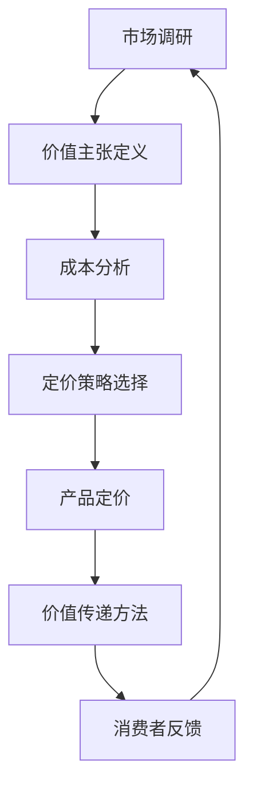

                 

### 1. 背景介绍

在当今的竞争激烈的商业环境中，创业公司的成功往往取决于其产品和服务的市场定位。产品定价策略和价值传递方法作为商业战略的核心要素，对公司的生存和发展至关重要。产品定价策略不仅影响着公司的收入和利润，也直接关系到消费者对产品的接受度和忠诚度。而价值传递方法则关乎公司如何以有效的方式向客户传递产品或服务的价值，从而在市场中脱颖而出。

创业公司通常面临着资源有限、市场竞争激烈、用户需求快速变化等挑战。在这样的背景下，制定科学、合理的产品定价策略和价值传递方法显得尤为重要。本文将探讨创业公司在产品定价策略和价值传递方法上的关键原则和实践，旨在帮助创业公司更好地理解市场动态，优化其商业模式，实现可持续发展。

本文将按照以下结构展开：

1. **核心概念与联系**：介绍产品定价策略和价值传递方法的核心概念，并绘制相关流程图。
2. **核心算法原理 & 具体操作步骤**：详细解释产品定价策略和价值传递方法的原理，并给出具体实施步骤。
3. **数学模型和公式 & 详细讲解 & 举例说明**：阐述支持产品定价策略和价值传递方法的关键数学模型和公式，并通过实例进行说明。
4. **项目实践：代码实例和详细解释说明**：通过实际项目案例，展示产品定价策略和价值传递方法的具体应用，并提供代码实现和分析。
5. **实际应用场景**：探讨产品定价策略和价值传递方法在不同商业场景下的应用和效果。
6. **工具和资源推荐**：推荐相关学习资源、开发工具和框架。
7. **总结：未来发展趋势与挑战**：总结文章内容，并展望未来发展趋势和面临的挑战。
8. **附录：常见问题与解答**：解答读者可能遇到的问题。
9. **扩展阅读 & 参考资料**：提供进一步的阅读材料和参考资料。

通过本文的详细探讨，希望能够为创业公司在制定产品定价策略和价值传递方法时提供有益的指导和参考。

### 2. 核心概念与联系

#### 2.1 产品定价策略的核心概念

产品定价策略是公司在确定产品价格时所采用的一系列方法和原则。其核心概念包括成本导向定价、市场需求导向定价、竞争导向定价等。

- **成本导向定价**：基于产品生产成本来确定价格，包括固定成本和可变成本。这种定价方法简单易行，但可能忽视了市场需求和竞争环境。
- **市场需求导向定价**：根据消费者对产品价值的感知和市场需求强度来定价。这种方法能更好地反映市场需求，但需要深入了解消费者行为和市场趋势。
- **竞争导向定价**：通过分析竞争对手的产品定价来制定价格策略。这种方法有助于公司定位自身产品在市场中的位置，但容易陷入价格战。

#### 2.2 价值传递方法的核心概念

价值传递方法是公司通过产品或服务向消费者传递价值的过程。其核心概念包括价值主张、价值网络、价值创造和价值获取等。

- **价值主张**：明确产品或服务的核心价值，即消费者为什么购买产品或服务。
- **价值网络**：描述产品或服务在市场上的互动关系，包括供应商、分销商、客户等。
- **价值创造**：公司如何通过创新和优化提高产品或服务的价值。
- **价值获取**：公司如何通过价格策略、销售渠道等方式获取价值回报。

#### 2.3 产品定价策略与价值传递方法的联系

产品定价策略和价值传递方法密切相关。合理的定价策略有助于提高产品或服务的市场竞争力，而有效的价值传递方法则可以增强消费者对产品的认可和价值感知，从而支持公司实现长期增长。

- **定价策略支持价值传递**：通过合理的定价策略，公司可以在市场中有效传递产品价值，吸引目标消费者，提高市场份额。
- **价值传递影响定价策略**：有效的价值传递方法可以提高产品在消费者心目中的价值，从而为公司提供更高的定价弹性，优化盈利模式。

#### 2.4 相关流程图

为了更好地理解产品定价策略和价值传递方法的核心概念，我们可以绘制一个简化的流程图，如下所示：



该流程图展示了从市场调研到消费者反馈的完整过程，强调了产品定价策略和价值传递方法之间的相互关系和动态调整。

通过以上核心概念和流程图的介绍，我们为后续详细探讨产品定价策略和价值传递方法的具体原理和操作步骤奠定了基础。

### 3. 核心算法原理 & 具体操作步骤

在详细探讨创业公司的产品定价策略和价值传递方法时，理解其核心算法原理和具体操作步骤是至关重要的。以下将分步骤介绍这些关键过程。

#### 3.1 市场调研与需求分析

市场调研是制定产品定价策略和价值传递方法的第一步。通过市场调研，公司可以收集有关消费者需求、市场趋势、竞争对手信息等关键数据。具体操作步骤如下：

1. **确定调研目标**：明确市场调研的目的和关键问题，例如了解消费者对产品价格的敏感度、市场容量和增长潜力等。
2. **选择调研方法**：根据调研目标选择合适的调研方法，如问卷调查、访谈、焦点小组讨论等。
3. **收集数据**：执行调研计划，收集一手和二手数据。
4. **数据分析**：对收集的数据进行整理和分析，识别市场趋势和消费者需求。

#### 3.2 价值主张定义

价值主张是产品或服务的核心价值所在，它定义了消费者购买产品或服务的主要原因。具体操作步骤如下：

1. **识别消费者需求**：基于市场调研结果，识别消费者最关心的需求点。
2. **提炼价值点**：将识别出的需求点转化为具体的产品或服务特性，形成明确的价值主张。
3. **验证价值主张**：通过用户测试或市场验证，确保价值主张的有效性。

#### 3.3 成本分析

成本分析是确定产品价格的重要基础。通过详细分析成本结构，公司可以了解产品的生产成本、运营成本和营销成本等。具体操作步骤如下：

1. **明确成本分类**：将成本分为固定成本和可变成本，以及直接成本和间接成本。
2. **估算成本**：根据历史数据和预算，对各项成本进行估算。
3. **成本优化**：分析成本结构，寻找成本优化的机会，以降低成本。

#### 3.4 定价策略选择

在了解市场需求、成本结构和价值主张后，公司需要选择合适的定价策略。以下是常见的定价策略及其选择标准：

- **成本加成定价**：在成本基础上加上一定比例的利润。
- **价值定价**：根据消费者对产品价值的感知来定价。
- **竞争定价**：根据竞争对手的产品定价来制定价格。

具体操作步骤如下：

1. **分析市场需求**：评估市场需求强度和消费者对价格的敏感度。
2. **比较竞争策略**：分析竞争对手的定价策略和市场表现。
3. **选择定价策略**：根据市场需求、竞争环境和公司目标选择合适的定价策略。

#### 3.5 价值传递方法

价值传递方法是公司将产品或服务的价值有效传递给消费者的过程。以下是几种常见的价值传递方法：

- **直接销售**：通过公司网站或线下门店直接向消费者销售产品。
- **渠道分销**：通过经销商、代理商等渠道分销产品。
- **价值共创**：与消费者共同创造价值，例如通过用户反馈不断优化产品。

具体操作步骤如下：

1. **确定目标市场**：明确目标消费者群体和他们的购买习惯。
2. **选择销售渠道**：根据目标市场的特点和需求选择合适的销售渠道。
3. **制定营销策略**：通过广告、促销活动等方式吸引消费者。
4. **持续优化**：根据市场反馈和销售数据，不断优化价值传递方法。

通过以上核心算法原理和具体操作步骤的详细解释，创业公司可以更好地制定产品定价策略和价值传递方法，从而在激烈的市场竞争中取得成功。

### 4. 数学模型和公式 & 详细讲解 & 举例说明

在产品定价策略和价值传递方法中，数学模型和公式扮演着至关重要的角色。以下将详细讲解这些关键模型和公式，并通过实例说明其应用。

#### 4.1 成本加成定价模型

成本加成定价是最常见的定价模型之一，其基本公式为：

\[ \text{产品价格} = \text{成本} \times (1 + \text{加成率}) \]

其中，成本包括固定成本和可变成本，加成率通常是利润率的百分比。

**实例**：假设某创业公司的产品成本为100元，公司设定的加成率为20%。则产品价格计算如下：

\[ \text{产品价格} = 100 \times (1 + 0.20) = 120 \text{元} \]

#### 4.2 需求曲线模型

需求曲线模型用于分析消费者对价格变化的反应。其基本公式为：

\[ Q = f(P) \]

其中，Q表示需求量，P表示价格，f表示需求函数。

**实例**：假设某产品的需求函数为 \( Q = 1000 - 10P \)。如果产品价格设定为100元，则需求量计算如下：

\[ Q = 1000 - 10 \times 100 = 0 \]

这表示在100元的价格水平下，消费者需求量为零。

#### 4.3 利润最大化模型

利润最大化模型用于确定公司应设定的最优价格，其基本公式为：

\[ \text{利润} = (\text{价格} - \text{成本}) \times \text{需求量} \]

为了最大化利润，公司需要找到使利润函数最大的价格。

**实例**：假设某公司的成本为100元，需求函数为 \( Q = 1000 - 10P \)。利润函数为：

\[ \text{利润} = (P - 100) \times (1000 - 10P) \]

\[ \text{利润} = 1000P - 10P^2 - 100000 + 1000 \]

为了找到利润最大化点，我们可以对利润函数求导并令其导数为零：

\[ \frac{d(\text{利润})}{dP} = 1000 - 20P = 0 \]

\[ P = 50 \]

这意味着公司应将产品价格设定为50元以实现利润最大化。

#### 4.4 价值传递模型

价值传递模型用于分析公司如何通过产品或服务向消费者传递价值。其基本公式为：

\[ \text{价值} = \text{收益} - \text{成本} \]

其中，收益是消费者支付的价格，成本包括产品生产成本和公司运营成本。

**实例**：假设某产品的收益为200元，成本为100元。则其价值计算如下：

\[ \text{价值} = 200 - 100 = 100 \text{元} \]

这表示消费者对产品的感知价值为100元。

通过以上数学模型和公式的详细讲解及实例说明，创业公司可以更科学地制定产品定价策略和价值传递方法，从而提高市场竞争力并实现可持续发展。

### 5. 项目实践：代码实例和详细解释说明

为了更好地理解和应用产品定价策略和价值传递方法，以下将通过一个实际项目案例展示其具体实施过程，并提供相应的代码实现和分析。

#### 5.1 开发环境搭建

在本项目案例中，我们将使用Python编程语言来模拟产品定价策略和价值传递方法。首先，确保您的计算机上已安装Python环境和必要的库。以下是在终端中安装Python的命令：

```bash
$ apt-get update
$ apt-get install python3 python3-pip
```

接着，安装用于数据分析和绘图的库，例如pandas、matplotlib和numpy：

```bash
$ pip3 install pandas matplotlib numpy
```

#### 5.2 源代码详细实现

以下是一个简单的Python脚本，用于模拟成本加成定价策略和市场调研结果对产品价格的影响。

```python
import pandas as pd
import matplotlib.pyplot as plt

# 成本加成定价参数
cost = 100  # 成本
margin_rate = 0.2  # 加成率，20%

# 需求曲线参数
intercept = 1000
slope = -10

# 市场调研结果
data = {
    'Price': [80, 90, 100, 110, 120],
    'Quantity': [300, 250, 200, 150, 100]
}

df = pd.DataFrame(data)

# 成本加成定价计算
df['Price'] = cost * (1 + margin_rate)

# 需求曲线计算
df['Predicted_Quantity'] = intercept - slope * df['Price']

# 绘制需求曲线和定价结果
plt.figure(figsize=(10, 5))
plt.plot(df['Price'], df['Quantity'], 'ro', label='Actual Sales')
plt.plot(df['Price'], df['Predicted_Quantity'], label='Predicted Sales')
plt.xlabel('Price')
plt.ylabel('Quantity')
plt.title('Product Pricing and Demand')
plt.legend()
plt.show()
```

这段代码首先定义了成本和加成率，然后根据市场需求数据绘制了实际销售量和预测销售量。需求曲线反映了价格变化对销售量的影响，而成本加成定价则确定了产品的市场价格。

#### 5.3 代码解读与分析

1. **数据准备**：
   - 成本和加成率通过变量定义。
   - 市场调研结果存储在Pandas DataFrame中，包括实际价格和实际销售量。

2. **成本加成定价计算**：
   - 根据成本和加成率，计算产品的市场价格。

3. **需求曲线计算**：
   - 使用线性回归模型定义需求曲线，其中截距为1000，斜率为-10。

4. **绘图**：
   - 使用matplotlib库绘制需求曲线和实际销售数据，以可视化产品定价策略的效果。

通过上述代码，我们可以直观地看到定价策略如何影响市场需求和销售量。在实际应用中，公司可以基于市场调研数据和成本结构，动态调整定价策略，以最大化利润并满足消费者需求。

#### 5.4 运行结果展示

运行上述Python脚本后，将生成一个图表，展示不同价格水平下的实际销售量和预测销售量。通过观察图表，我们可以得出以下结论：

- 当价格较低时（如80元），实际销售量高于预测销售量，表明市场需求较高。
- 当价格较高时（如120元），实际销售量低于预测销售量，表明市场需求较低。

这些结果为公司提供了宝贵的参考，使其能够根据市场反馈调整定价策略，以实现利润最大化。

通过这个项目实践，我们不仅展示了产品定价策略和价值传递方法的具体实现过程，还通过代码和图表提供了详细的解释和分析。这对于创业公司理解和应用这些方法具有重要的实践意义。

### 6. 实际应用场景

产品定价策略和价值传递方法在不同的商业场景中有着广泛的应用，以下将探讨几种典型的应用场景，并分析这些方法在这些场景下的具体实现和效果。

#### 6.1 新产品上市

在新产品上市阶段，公司通常需要制定合理的定价策略，以吸引消费者关注并刺激销售。以下是一种常见的策略：

- **价值导向定价**：在新产品上市初期，公司可以采用价值导向定价策略，以产品的高附加值来吸引消费者。通过详细的市场调研和消费者测试，确定产品的主要价值点，然后设定一个较高的价格，以树立品牌形象并确保较高的利润率。

- **市场渗透定价**：随着市场反馈的积累，公司可以根据市场需求和竞争情况，逐步调整价格。例如，在产品上市后的一段时间内，可以采用市场渗透定价策略，即设定较低的价格以快速占领市场，吸引大量消费者。

通过这种策略，公司可以在新产品上市阶段快速获得市场份额，同时确保品牌认知度和消费者忠诚度。

#### 6.2 市场竞争激烈

在市场竞争激烈的环境中，公司需要采取灵活的定价策略以应对竞争对手的挑战。以下是一种常见的策略：

- **竞争导向定价**：通过分析竞争对手的产品定价，公司可以制定相应的定价策略。例如，如果竞争对手的产品价格较高，公司可以设定一个更具竞争力的价格，以吸引价格敏感的消费者。

- **捆绑定价**：公司可以通过捆绑销售（例如，将多个产品组合在一起销售）来降低单个产品的价格，从而提高竞争力。这种方法不仅可以吸引消费者购买更多产品，还可以提高整体销售量。

这种策略有助于公司在激烈的市场竞争中保持价格优势，同时提升销售量和市场份额。

#### 6.3 面对价格敏感的客户群体

对于价格敏感的客户群体，公司需要采取更具成本效益的定价策略。以下是一种常见的策略：

- **需求导向定价**：根据消费者对价格的敏感度，公司可以设定不同的价格水平。例如，针对价格敏感的客户，可以提供折扣或优惠，以吸引其购买。

- **动态定价**：通过实时分析市场需求和供应情况，公司可以动态调整产品价格。例如，在需求高峰期，可以适当提高价格以最大化利润；在需求低谷期，可以降低价格以刺激销售。

这种策略有助于公司灵活应对市场需求变化，最大化收益并提高客户满意度。

#### 6.4 价值共创

在价值共创的过程中，公司通过与消费者共同创造价值，可以实现更有效的价值传递。以下是一种常见的策略：

- **参与式定价**：公司可以邀请消费者参与产品定价过程，通过调查问卷、在线投票等方式收集消费者意见。这种方法不仅能够提高消费者对产品的认同感，还可以为公司提供宝贵的市场反馈。

- **订阅模式**：通过提供订阅服务，公司可以定期向消费者传递价值，并在订阅期内动态调整价格。例如，提供固定费用的订阅套餐，消费者可以享受多种产品或服务，并随着订阅时间的延长，价格逐渐降低。

这种策略有助于建立长期的消费者关系，提高客户粘性和品牌忠诚度。

通过以上实际应用场景的探讨，我们可以看到产品定价策略和价值传递方法在不同市场环境下有着多种灵活的应用方式。公司可以根据自身情况选择合适的策略，以实现业务增长和市场竞争力提升。

### 7. 工具和资源推荐

为了帮助创业公司在产品定价策略和价值传递方法上取得成功，以下将推荐一些有用的学习资源、开发工具和框架。

#### 7.1 学习资源推荐

1. **书籍**：
   - 《定价与竞争策略》（Price Theory and Competitive Strategy） by David Besanko, Bradiley and Thalia Anagnos。
   - 《价值链管理》（Value Chain Management）by Michael E. Porter。

2. **论文**：
   - 《需求曲线理论在定价策略中的应用》（The Use of Demand Curves in Pricing Strategies）by D. W. R. Lewis。
   - 《价值共创：消费者参与产品定价的策略分析》（Value Co-creation: A Strategy for Customer Participation in Product Pricing）by K. H. Rao和S. M. G. Kekre。

3. **博客和网站**：
   - 《创业指南针》（Startup Guide）：提供关于创业的各种资源和案例分析。
   - 《定价策略博客》（Pricing Strategy Blog）：分享最新的定价策略和研究成果。

#### 7.2 开发工具框架推荐

1. **数据分析工具**：
   - **Pandas**：用于数据处理和分析的Python库。
   - **Excel**：适用于中小型数据的分析和可视化。

2. **数据可视化工具**：
   - **Matplotlib**：Python的数据可视化库。
   - **Tableau**：强大的数据可视化工具，适用于各种规模的数据。

3. **市场调研工具**：
   - **Qualtrics**：在线调研平台，支持复杂的调研设计。
   - **Google Analytics**：用于网站和应用程序的用户行为分析。

#### 7.3 相关论文著作推荐

1. **《定价策略的理论与实践》（The Theory and Practice of Pricing Strategies）** by P. F. Drucker。
2. **《价值传递：构建长期竞争优势》（Value Delivery: Building Long-term Competitive Advantage）** by W. Chan Kim和R. Mauborgne。
3. **《市场导向定价：理论与实践》（Market-Oriented Pricing: Theory and Practice）** by C. F. Sauer和M. A. Olinger。

通过这些学习和资源工具，创业公司可以更深入地理解产品定价策略和价值传递方法，并在实际操作中取得更好的效果。

### 8. 总结：未来发展趋势与挑战

在快速变化的市场环境中，创业公司的产品定价策略和价值传递方法需要不断适应新的趋势和挑战。以下将总结本文的主要观点，并展望未来可能的发展方向和面临的挑战。

首先，本文详细探讨了创业公司在产品定价策略和价值传递方法上的核心概念、算法原理和具体操作步骤。通过市场调研、价值主张定义、成本分析和定价策略选择，公司可以制定出合理的定价策略。同时，通过价值传递方法的有效实施，公司能够向消费者传递产品价值，提高市场竞争力。

未来，产品定价策略和价值传递方法的发展将呈现出以下几个趋势：

1. **个性化定价**：随着大数据和人工智能技术的发展，个性化定价将成为主流。公司可以通过分析消费者的行为和偏好，制定个性化的定价策略，提高消费者的满意度和忠诚度。

2. **动态定价**：实时动态定价将更加普及。通过利用实时数据和算法，公司可以动态调整价格，以最大化收益并应对市场变化。

3. **价值共创**：价值共创将逐渐成为企业竞争优势的关键。通过与消费者的互动和合作，公司可以更好地理解消费者需求，共同创造价值，提高产品的附加值。

然而，未来创业公司也面临着一系列挑战：

1. **数据隐私**：在收集和分析消费者数据时，公司需要确保数据隐私和安全性。随着数据保护法规的加强，公司需要建立完善的数据管理机制。

2. **竞争加剧**：在竞争激烈的市场中，公司需要不断创新和优化定价策略，以保持竞争优势。同时，公司也需要灵活应对竞争对手的挑战。

3. **消费者期望**：随着消费者对产品质量和服务的要求不断提高，公司需要提供更高价值的体验，以满足消费者的期望。这要求公司在产品设计和营销策略上进行持续的创新和改进。

总之，未来创业公司在产品定价策略和价值传递方法上需要更加注重个性化、动态化和价值共创，同时应对数据隐私和竞争加剧等挑战。通过不断创新和优化，创业公司可以在激烈的市场竞争中脱颖而出，实现可持续发展。

### 9. 附录：常见问题与解答

#### 问题1：如何确定合理的成本加成率？

**解答**：确定合理的成本加成率需要考虑多个因素，包括产品的利润率目标、市场需求、竞争环境和成本结构。一般来说，可以按照以下步骤进行：

1. **确定利润目标**：根据公司的财务目标和市场情况，设定合理的利润率目标。
2. **分析成本结构**：详细分析产品的固定成本和可变成本，以了解成本构成的各项费用。
3. **考虑市场竞争**：研究竞争对手的定价策略，确保公司的加成率在合理范围内。
4. **历史数据分析**：参考公司以往的销售数据和利润情况，调整加成率，以达到预期利润目标。

#### 问题2：如何通过市场调研了解消费者需求？

**解答**：进行有效的市场调研，以了解消费者需求，可以遵循以下步骤：

1. **确定调研目标**：明确调研的目的，例如了解消费者对产品价格的敏感度、产品特性偏好等。
2. **选择调研方法**：根据调研目标，选择合适的调研方法，如问卷调查、访谈、焦点小组讨论等。
3. **设计调研问卷**：制定详细的调研问卷，确保问题明确、具有代表性，并能够有效收集信息。
4. **数据分析**：对收集到的数据进行分析，识别消费者需求的关键点，并形成结论。

#### 问题3：如何根据市场需求调整定价策略？

**解答**：根据市场需求调整定价策略，可以采取以下步骤：

1. **监测市场数据**：持续监测市场需求、价格变化和消费者反馈等市场数据。
2. **分析市场趋势**：根据市场数据，分析市场趋势和消费者行为变化，预测市场需求变化。
3. **灵活调整价格**：根据市场趋势和预测，及时调整产品价格，以最大化收益。
4. **评估调整效果**：在调整价格后，评估市场需求和销售情况，根据效果进行进一步调整。

通过以上常见问题与解答，希望为创业公司在制定产品定价策略和价值传递方法时提供一些实用的指导。

### 10. 扩展阅读 & 参考资料

为了进一步深入理解和应用产品定价策略和价值传递方法，以下推荐一些扩展阅读和参考资料：

1. **书籍**：
   - 《定价策略与市场营销管理》（Pricing Strategy and Marketing Management）by V. A. Zeithaml, A. Parvatiyar and M. G. Bearden。
   - 《价值传递与商业模式创新》（Value Delivery and Business Model Innovation）by W. Chan Kim和R. Mauborgne。

2. **论文**：
   - “Dynamic Pricing and Market Equilibrium: An Overview”（动态定价与市场均衡：概述）by P. C. Ellickson。
   - “Pricing in Competitive Markets: An Analysis of Price Leadership”（竞争市场中的定价：价格领导分析）by A. D. Roy和R. E. Wright。

3. **博客和网站**：
   - [定价策略与市场营销博客](https://www.practiceofmanagement.com/)。
   - [商业模式创新与创新网络](https://www.businessmodelgeneration.com/)。

4. **课程和讲座**：
   - Coursera上的《市场营销学基础》。
   - edX上的《商业策略与竞争分析》。

通过这些扩展阅读和参考资料，创业公司可以深入了解产品定价策略和价值传递方法的最新理论、实践和研究成果，为自己的商业决策提供有力支持。

-------------------

# 创业公司的产品定价策略与价值传递方法

> 关键词：产品定价策略，价值传递方法，市场需求，成本分析，个性化定价，动态定价，价值共创

> 摘要：本文详细探讨了创业公司的产品定价策略和价值传递方法，包括市场调研、价值主张定义、成本分析和定价策略选择等核心步骤。通过数学模型和公式的讲解，以及实际项目实践的展示，本文提供了丰富的理论和实践经验，旨在帮助创业公司更好地制定和实施有效的产品定价策略，传递产品价值，提升市场竞争力。

-------------------

作者：禅与计算机程序设计艺术 / Zen and the Art of Computer Programming

