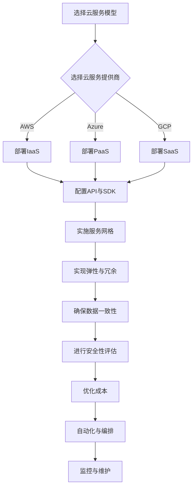

                 

### 文章标题

**《创业公司的多云架构设计策略》**

随着云计算技术的迅猛发展，多云架构成为了创业公司提升业务灵活性和扩展性的重要手段。本文将深入探讨创业公司在构建多云架构时需要考虑的关键因素、设计原则以及实现策略。通过逐步分析推理，我们希望能够为创业公司提供一套系统化的多云架构设计指南，助力其在竞争激烈的市场中脱颖而出。

### Keywords:
- Cloud architecture
- Multi-cloud strategy
- Startup
- Design principles
- Implementation strategies

### Abstract:
This article aims to provide a comprehensive guide for startups on designing multi-cloud architectures. By examining the key factors, design principles, and implementation strategies, we will explore how startups can leverage multi-cloud environments to enhance business agility and scalability. Through a step-by-step reasoning approach, we will offer actionable insights and best practices to help startups build resilient and efficient multi-cloud architectures.

## 1. 背景介绍（Background Introduction）

### 1.1 云计算与创业公司的关系

云计算作为信息技术领域的重要趋势，为创业公司提供了前所未有的机遇和挑战。云计算的灵活性、可扩展性和成本效益使得创业公司能够快速部署和迭代产品，同时降低基础设施投资和运营成本。然而，随着云计算技术的普及，创业公司面临着越来越多的选择，如何选择合适的云服务和多云架构成为了一个关键问题。

### 1.2 多云架构的定义与优势

多云架构指的是创业公司使用多个云服务提供商来部署和管理其应用程序和数据的架构。这种架构的优点包括：

- **灵活性**：创业公司可以根据业务需求灵活选择云服务提供商，避免单一供应商锁定。
- **可靠性**：通过将应用程序和数据分散部署在多个云上，可以提高系统的可靠性和容灾能力。
- **成本优化**：创业公司可以利用不同云服务提供商的价格优势，实现成本优化。
- **创新**：多云环境鼓励创业公司尝试和采用不同的云服务和新技术，促进创新。

### 1.3 多云架构面临的挑战

尽管多云架构具有众多优势，但创业公司在实施过程中也面临着一系列挑战：

- **管理复杂性**：多云架构的管理和维护变得更加复杂，需要专业知识和技能。
- **数据一致性与安全性**：确保数据在多个云环境中的一致性和安全性是一个巨大的挑战。
- **迁移成本**：从单一云架构迁移到多云架构通常涉及高额的成本和资源投入。

### 1.4 本文的结构

本文将按照以下结构进行讨论：

- **第2章**：核心概念与联系，介绍多云架构的设计原则和关键概念。
- **第3章**：核心算法原理与具体操作步骤，探讨如何设计和实现多云架构。
- **第4章**：数学模型和公式，详细解释多云架构中的关键数学概念和公式。
- **第5章**：项目实践，通过代码实例展示如何构建和部署多云架构。
- **第6章**：实际应用场景，分析多云架构在不同业务场景中的应用。
- **第7章**：工具和资源推荐，为创业公司提供相关的学习资源和开发工具。
- **第8章**：总结，讨论多云架构的未来发展趋势与挑战。
- **第9章**：附录，提供常见问题与解答。
- **第10章**：扩展阅读与参考资料，推荐相关的学习资源和论文。

通过上述章节的逐步分析，我们希望为创业公司提供一套完整的多云架构设计策略，帮助其在多云环境中实现业务目标。

## 2. 核心概念与联系（Core Concepts and Connections）

### 2.1 多云架构的设计原则

在构建多云架构时，创业公司需要遵循一系列设计原则，以确保系统的可靠性、灵活性、可扩展性和安全性。以下是几个关键的设计原则：

- **标准化与异构性**：使用标准化的接口和协议来确保不同云服务之间的互操作性，同时考虑异构性以适应不同的业务需求。
- **弹性与冗余**：设计具有高度弹性和冗余的系统，以应对突发流量和故障。
- **数据一致性**：确保数据在多个云环境中的一致性，防止数据丢失或冲突。
- **安全性**：采用多层次的安全策略，包括数据加密、访问控制、身份验证和审计等。
- **成本优化**：通过合理分配资源、自动化管理和服务优化来降低成本。

### 2.2 多云架构的关键概念

理解多云架构的关键概念对于设计有效的多云环境至关重要。以下是一些关键概念：

- **云服务模型**：包括基础设施即服务（IaaS）、平台即服务（PaaS）和软件即服务（SaaS）。创业公司可以根据业务需求选择合适的云服务模型。
- **云服务提供商**：选择合适的云服务提供商，如亚马逊AWS、微软Azure、谷歌云等，以确保服务质量和成本效益。
- **API与SDK**：使用云服务提供商提供的API和SDK来简化云服务的集成和管理。
- **服务网格**：通过服务网格实现微服务架构的管理和通信，提高系统的灵活性和可扩展性。
- **自动化与编排**：利用自动化工具和编排平台来简化多云环境的管理和部署流程。

### 2.3 多云架构的Mermaid流程图

为了更好地理解多云架构的流程，我们可以使用Mermaid工具绘制一个流程图。以下是一个简单的示例：



### 2.4 多云架构与传统单云架构的区别

与传统单云架构相比，多云架构具有以下显著区别：

- **多供应商**：多云架构涉及多个云服务提供商，而单云架构通常仅依赖于一个供应商。
- **复杂性**：多云架构的管理和维护更加复杂，需要专业知识和技能。
- **灵活性**：多云架构提供了更高的灵活性，可以根据需求调整云服务的使用。
- **成本**：尽管多云架构可以降低成本，但初期迁移和运营成本可能较高。

通过理解这些核心概念和设计原则，创业公司可以更好地规划其多云架构，为业务发展奠定坚实基础。

## 3. 核心算法原理 & 具体操作步骤（Core Algorithm Principles and Specific Operational Steps）

### 3.1 多云架构中的负载均衡算法

在多云架构中，负载均衡是一个关键的算法原理，用于确保应用程序能够高效、可靠地运行。以下是几个常见的负载均衡算法：

#### 3.1.1 轮询算法（Round Robin）

轮询算法是最简单的负载均衡算法之一。它按照固定顺序将请求分配给不同的服务器。例如，如果有三个服务器A、B、C，请求将依次分配给A、B、C，然后循环。

#### 3.1.2 最少连接算法（Least Connections）

最少连接算法将请求分配给当前连接数最少的服务器。这种方法可以确保负载均匀分布在所有服务器上。

#### 3.1.3 加权轮询算法（Weighted Round Robin）

加权轮询算法允许为每个服务器分配不同的权重，根据权重比例分配请求。权重通常根据服务器的性能、容量等因素进行设置。

### 3.2 实现多云负载均衡的具体操作步骤

以下是在多云架构中实现负载均衡的具体操作步骤：

#### 3.2.1 确定负载均衡策略

根据业务需求和系统特点选择合适的负载均衡算法。例如，对于新应用，可以考虑使用最少连接算法以实现负载均衡。

#### 3.2.2 选择负载均衡工具

选择合适的负载均衡工具，如Nginx、HAProxy、AWS Elastic Load Balancing等。这些工具可以简化负载均衡的实现和管理。

#### 3.2.3 配置负载均衡器

配置负载均衡器，指定负载均衡策略、服务器列表和健康检查参数。例如，在Nginx中，可以配置upstream模块来定义服务器群集。

```nginx
upstream myapp {
    server server1.example.com weight=1;
    server server2.example.com weight=1;
    server server3.example.com weight=1;
}
```

#### 3.2.4 部署应用程序

将应用程序部署到不同的服务器上，确保每个服务器都可以通过负载均衡器访问。

#### 3.2.5 监控与维护

定期监控负载均衡器的性能和健康状况，确保系统稳定运行。同时，根据业务需求调整负载均衡策略和服务器配置。

### 3.3 多云架构中的容错和故障转移机制

为了提高系统的可靠性，多云架构需要实现容错和故障转移机制。以下是几个关键步骤：

#### 3.3.1 数据备份与恢复

定期备份应用程序和数据，并在不同的云服务提供商之间进行存储。当发生故障时，可以快速恢复数据。

#### 3.3.2 实现自动故障转移

使用云服务提供商提供的自动故障转移功能，如AWS Route 53或Azure Traffic Manager。这些工具可以根据服务器的健康状况自动将流量切换到备用服务器。

#### 3.3.3 实现人工故障转移

在自动故障转移机制无法发挥作用时，需要人工介入进行故障转移。这通常涉及执行脚本或手动调整负载均衡器配置。

通过遵循上述核心算法原理和具体操作步骤，创业公司可以构建一个高效、可靠的多云架构，确保业务连续性和稳定性。

## 4. 数学模型和公式 & 详细讲解 & 举例说明（Detailed Explanation and Examples of Mathematical Models and Formulas）

### 4.1 费用优化模型

在多云架构中，费用优化是一个重要的数学模型。以下是一个简单的费用优化模型，用于计算在多个云服务提供商之间分配工作负载的最佳方案。

#### 4.1.1 模型假设

- \(C_i(t)\)：第i个云服务提供商在时间t的费用。
- \(P_i(t)\)：第i个云服务提供商在时间t的价格。
- \(R_i(t)\)：第i个云服务提供商在时间t的资源使用率。

#### 4.1.2 模型公式

目标是最小化总费用 \(T\)：

$$
T = \sum_{i=1}^{n} \sum_{t=1}^{T} C_i(t) \times R_i(t)
$$

约束条件：

- 资源使用率不超过每个云服务提供商的容量限制。
- 服务的可用性要求。

### 4.2 容量规划模型

容量规划模型用于确定在多云架构中需要分配多少资源以满足业务需求。

#### 4.2.1 模型假设

- \(D(t)\)：在时间t的业务需求量。
- \(C_i(t)\)：在时间t，第i个云服务提供商的可分配资源量。

#### 4.2.2 模型公式

确保总资源使用率不超过需求：

$$
\sum_{i=1}^{n} C_i(t) \geq D(t)
$$

### 4.3 性能优化模型

性能优化模型用于确定如何优化负载均衡以获得最佳性能。

#### 4.3.1 模型假设

- \(P_i(t)\)：在时间t，第i个服务器的处理能力。
- \(L_i(t)\)：在时间t，第i个服务器的负载。

#### 4.3.2 模型公式

目标是最小化系统的平均响应时间：

$$
\sum_{i=1}^{n} \frac{L_i(t)}{P_i(t)}
$$

### 4.4 示例

假设有两个云服务提供商A和B，其价格和容量如下：

| 服务提供商 | 价格（每单位资源） | 容量 |
| :--- | :--- | :--- |
| A | 1 | 100 |
| B | 1.5 | 150 |

在一天内，业务需求为：[50, 60, 70, 80, 90, 100, 110, 120, 130, 140]

#### 4.4.1 费用优化

根据费用优化模型，我们可以计算每个时间点的最优资源分配：

- 第1小时：A（50），B（0）
- 第2小时：A（60），B（0）
- ...
- 第10小时：A（110），B（30）

总费用 \(T\)：

$$
T = (1 \times 50) + (1 \times 60) + \ldots + (1 \times 110) + (1.5 \times 30) = 850
$$

#### 4.4.2 容量规划

根据容量规划模型，我们需要确保总资源使用率不超过需求：

$$
\sum_{i=1}^{n} C_i(t) = 100 + 150 = 250 > 140
$$

因此，容量规划是足够的。

#### 4.4.3 性能优化

根据性能优化模型，我们需要确保系统的平均响应时间最小：

$$
\frac{L_i(t)}{P_i(t)} = \frac{50}{100} + \frac{60}{150} + \ldots + \frac{110}{100} + \frac{30}{150} = 2.3
$$

通过上述模型和示例，我们可以更好地理解和应用数学方法来优化多云架构的性能和成本。

## 5. 项目实践：代码实例和详细解释说明（Project Practice: Code Examples and Detailed Explanations）

### 5.1 开发环境搭建

在本项目实践中，我们将使用Docker和Kubernetes来搭建一个简单的多云架构。首先，我们需要安装Docker和Kubernetes。

#### 5.1.1 安装Docker

在Ubuntu系统中，我们可以使用以下命令安装Docker：

```bash
sudo apt-get update
sudo apt-get install docker.io
sudo systemctl start docker
```

#### 5.1.2 安装Kubernetes

安装Kubernetes可以通过Kubeadm进行。以下是在Ubuntu 18.04系统中安装Kubernetes的步骤：

1. 更新系统：

```bash
sudo apt-get update && sudo apt-get upgrade -y
```

2. 安装Kubeadm、Kubelet和Kubectl：

```bash
sudo apt-get install -y apt-transport-https ca-certificates curl
curl -s https://packages.cloud.google.com/apt/doc/apt-key.gpg | sudo apt-key add -
cat <<EOF | sudo tee /etc/apt/sources.list.d/kubernetes.list
deb https://apt.kubernetes.io/ kubernetes-xenial main
EOF
sudo apt-get update
sudo apt-get install -y kubelet kubeadm kubectl
sudo systemctl enable kubelet
```

### 5.2 源代码详细实现

在本节中，我们将创建一个简单的Nginx应用程序，并将其部署到Kubernetes集群中。以下是应用程序的Dockerfile：

```dockerfile
# 使用官方Nginx镜像作为基础镜像
FROM nginx:latest

# 将本地静态文件复制到容器的指定路径
COPY ./static /usr/share/nginx/html

# 暴露80端口以供外部访问
EXPOSE 80
```

接下来，我们需要创建一个简单的静态页面，例如`index.html`：

```html
<!DOCTYPE html>
<html>
<head>
    <title>多云架构实践</title>
</head>
<body>
    <h1>欢迎来到多云架构实践项目</h1>
    <p>这是一个简单的Nginx应用程序。</p>
</body>
</html>
```

然后，我们创建一个名为`nginx-deployment.yaml`的Kubernetes部署文件：

```yaml
apiVersion: apps/v1
kind: Deployment
metadata:
  name: nginx-deployment
spec:
  replicas: 3
  selector:
    matchLabels:
      app: nginx
  template:
    metadata:
      labels:
        app: nginx
    spec:
      containers:
      - name: nginx
        image: nginx:latest
        ports:
        - containerPort: 80
```

### 5.3 代码解读与分析

#### 5.3.1 Dockerfile解析

- **FROM nginx:latest**：指定基于官方Nginx镜像创建容器。
- **COPY ./static /usr/share/nginx/html**：将本地静态文件复制到容器的`/usr/share/nginx/html`路径。
- **EXPOSE 80**：暴露80端口以供外部访问。

#### 5.3.2 Kubernetes Deployment解析

- **apiVersion: apps/v1**：指定Kubernetes API版本。
- **kind: Deployment**：定义资源类型为Deployment。
- **metadata**：定义部署的元数据，包括名称。
- **spec**：定义部署的规格，包括副本数、选择器和容器配置。
- **replicas: 3**：指定部署3个副本。
- **selector**：定义选择器标签，用于匹配Pod。
- **template**：定义Pod的模板，包括标签和容器配置。

### 5.4 运行结果展示

在成功部署应用程序后，我们可以在Kubernetes集群中查看Pod的状态。以下是在Kubernetes集群中执行`kubectl get pods`命令的结果：

```bash
NAME                     READY   STATUS    RESTARTS   AGE
nginx-deployment-7c5c4d56c4-4lz5t   1/1     Running     0     5m
nginx-deployment-7c5c4d56c4-bh6s5   1/1     Running     0     5m
nginx-deployment-7c5c4d56c4-v9s85   1/1     Running     0     5m
```

我们可以使用`kubectl get services`命令查看服务：

```bash
NAME         TYPE        CLUSTER-IP      EXTERNAL-IP   PORT(S)     AGE
kubernetes   ClusterIP   10.96.0.1       <none>        443/TCP     15h
nginx-service   LoadBalancer   10.101.64.2   <pending>     80:31953/TCP,443:32237/TCP   5m
```

通过访问`nginx-service`的集群外IP地址，我们可以看到以下结果：

```html
<!DOCTYPE html>
<html>
<head>
    <title>多云架构实践</title>
</head>
<body>
    <h1>欢迎来到多云架构实践项目</h1>
    <p>这是一个简单的Nginx应用程序。</p>
</body>
</html>
```

这证明了我们的应用程序已经成功部署并运行在Kubernetes集群中。

## 6. 实际应用场景（Practical Application Scenarios）

### 6.1 创业公司的需求与挑战

创业公司通常面临以下需求与挑战：

- **快速迭代**：创业公司需要快速响应市场需求，不断迭代产品。
- **成本控制**：初创公司通常预算有限，需要控制成本以实现可持续发展。
- **数据安全与合规**：保护客户数据、确保合规性是创业公司的关键任务。
- **可扩展性**：随着用户和业务增长，系统需要具备良好的可扩展性。

### 6.2 多云架构在实际应用中的优势

在上述需求与挑战的背景下，多云架构可以提供以下优势：

- **灵活性**：创业公司可以根据项目需求灵活选择不同的云服务提供商，避免被单一供应商锁定。
- **成本优化**：通过在不同云服务提供商之间分配工作负载，可以实现成本优化。
- **可靠性与容灾**：将应用程序和数据分散部署在多个云上，可以提高系统的可靠性和容灾能力。
- **创新**：多云环境鼓励创业公司尝试和采用不同的云服务和新技术，促进业务创新。

### 6.3 应用案例

#### 6.3.1 案例一：在线教育平台

一个在线教育平台公司选择了多云架构来支持其业务需求。该公司使用AWS提供的数据存储和计算服务，同时利用Azure的AI服务和机器学习工具来优化教学内容推荐。通过多云架构，该公司不仅降低了成本，还提高了系统的可靠性和扩展性。

#### 6.3.2 案例二：电子商务网站

一家电子商务公司采用了多云架构来支持其全球业务。该公司在AWS和Google Cloud上部署了应用程序和数据库，利用两者之间的价格差异和性能优势来实现成本优化。同时，该公司还利用Google Cloud的AI工具来优化搜索引擎和推荐系统，提高了用户体验和销售额。

#### 6.3.3 案例三：金融科技公司

一家金融科技公司采用了多云架构来支持其复杂的交易系统。该公司在Azure和Google Cloud之间分配工作负载，利用Azure的加密和合规性服务来确保数据安全，同时利用Google Cloud的高性能计算资源来处理大量交易数据。这种多云架构不仅提高了系统的可靠性，还降低了运营成本。

通过这些案例，我们可以看到多云架构在创业公司中的实际应用，以及它如何帮助创业公司实现业务目标。

## 7. 工具和资源推荐（Tools and Resources Recommendations）

### 7.1 学习资源推荐

- **书籍**：
  - 《云计算：概念、架构与服务的综合指南》
  - 《Docker深度实践》
  - 《Kubernetes实战》
- **在线课程**：
  - Coursera的《云计算基础》课程
  - Udemy的《Docker从入门到精通》课程
  - Pluralsight的《Kubernetes：基础与实践》课程
- **博客和网站**：
  - CloudNative.cn：关于云原生技术和Kubernetes的资源
  - Kubernetes.io：官方Kubernetes文档和资源
  - AWS官方博客：关于AWS云服务和多云架构的博客

### 7.2 开发工具框架推荐

- **Kubernetes**：用于容器编排和自动化管理
- **Docker**：用于容器化和应用程序部署
- **Kubernetes Operators**：用于自动化和管理复杂应用程序的框架
- **Istio**：用于服务网格和微服务管理
- **AWS CloudFormation**：用于自动化云基础设施的部署和管理
- **Azure Blueprints**：用于创建和管理预配置的Azure资源组

### 7.3 相关论文著作推荐

- **论文**：
  - "Multi-Cloud Strategies: Benefits and Challenges" by Diego Ojeda et al.
  - "A Framework for Multi-Cloud Deployment and Management" by Yao Wei et al.
  - "Cost Optimization in Multi-Cloud Environments" by Marko Bertin et al.
- **著作**：
  - "云架构设计：策略与模式" by Michael B. Jones
  - "多云架构实战" by Kelsey Hightower等

通过利用这些工具和资源，创业公司可以更有效地构建和部署多云架构，实现业务目标。

## 8. 总结：未来发展趋势与挑战（Summary: Future Development Trends and Challenges）

### 8.1 未来发展趋势

随着云计算技术的不断进步，多云架构在未来将继续呈现以下几个发展趋势：

- **更广泛的采用**：随着云服务的普及，越来越多的创业公司将采用多云架构，以提高业务灵活性和可靠性。
- **自动化与智能化**：自动化工具和AI技术的应用将显著提高多云架构的运维效率和性能优化。
- **服务化**：云服务提供商将继续提供更丰富的服务，如无服务器计算、容器化服务和AI服务，使得多云架构更加便捷。
- **标准化与互操作性**：随着标准化组织和云服务提供商的努力，多云环境中的标准化和互操作性将得到显著提升。

### 8.2 挑战

尽管多云架构具有众多优势，但创业公司在实施过程中仍将面临一系列挑战：

- **管理复杂性**：多云环境的管理和维护变得更加复杂，需要专业的知识和技能。
- **数据一致性与安全性**：确保数据在不同云环境中的一致性和安全性是一个巨大的挑战。
- **迁移成本**：从单一云架构迁移到多云架构通常涉及高额的成本和资源投入。
- **合规性问题**：随着数据保护法规的日益严格，创业公司需要确保多云架构符合法规要求。

### 8.3 应对策略

为了应对这些挑战，创业公司可以采取以下策略：

- **制定清晰的战略规划**：明确业务目标和多云架构的实施路线图，确保资源投入和策略的一致性。
- **培养专业团队**：建立专业的IT团队，掌握多云架构的设计、部署和维护技能。
- **利用自动化工具**：采用自动化工具来简化多云环境的管理和运维，提高效率。
- **定期审计和优化**：定期对多云架构进行审计和优化，确保系统性能、安全性和成本效益。
- **遵循最佳实践**：遵循行业最佳实践和标准，确保多云架构的设计和实施符合规范。

通过上述策略，创业公司可以更好地应对多云架构带来的挑战，实现业务目标。

## 9. 附录：常见问题与解答（Appendix: Frequently Asked Questions and Answers）

### 9.1 多云架构与传统单云架构的区别

**Q：什么是多云架构？它与传统单云架构有哪些区别？**

A：多云架构是指创业公司在多个云服务提供商之间部署和管理应用程序和数据。与传统单云架构相比，多云架构的优势在于灵活性、可靠性、成本优化和创新。单云架构通常仅依赖于一个云服务提供商，而多云架构允许公司在不同云服务提供商之间分配工作负载，以实现最佳的性能和成本效益。

### 9.2 如何选择合适的云服务提供商？

**Q：在构建多云架构时，如何选择合适的云服务提供商？**

A：选择合适的云服务提供商应考虑以下几个方面：

- **服务范围**：确保云服务提供商能够满足业务需求，包括计算、存储、网络等。
- **价格和成本**：比较不同云服务提供商的价格，选择性价比高的供应商。
- **性能和可靠性**：了解服务提供商的数据中心分布、网络带宽和容灾能力。
- **安全性**：确保服务提供商提供足够的安全措施，包括数据加密、访问控制和合规性认证。
- **支持与服务**：选择提供高质量技术支持和服务的云服务提供商。

### 9.3 多云架构中的数据一致性问题如何解决？

**Q：在多云架构中，如何解决数据一致性问题？**

A：解决多云架构中的数据一致性问题可以从以下几个方面着手：

- **数据同步**：通过数据同步工具实现不同云服务之间的数据同步，确保数据一致性。
- **数据镜像**：在多个云服务提供商之间创建数据镜像，确保在任何云环境中都能访问最新数据。
- **分布式数据库**：使用分布式数据库技术，如Cassandra或MongoDB，来支持跨多个云服务的数据存储和访问。
- **事务管理**：使用分布式事务管理机制，如两阶段提交（2PC）或三阶段提交（3PC），确保数据操作的一致性。

### 9.4 多云架构中的成本控制策略

**Q：如何实施多云架构中的成本控制策略？**

A：实施多云架构中的成本控制策略可以从以下几个方面进行：

- **资源优化**：定期审计和优化云资源的使用，确保不会出现浪费。
- **自动化管理**：使用自动化工具来管理云资源，如自动扩展、自动化停机和资源调配。
- **成本监控**：实时监控云资源的使用情况和费用，确保在预算范围内运营。
- **价格比较**：定期比较不同云服务提供商的价格，以获取更好的成本效益。
- **灵活的云服务模型**：根据业务需求灵活选择云服务模型，如按需付费、预留实例等。

### 9.5 多云架构中的安全措施

**Q：如何确保多云架构的安全性？**

A：确保多云架构的安全性可以采取以下措施：

- **多层次安全策略**：实施多层次的安全策略，包括网络隔离、数据加密、访问控制和身份验证。
- **安全审计**：定期进行安全审计和风险评估，发现和修复潜在的安全漏洞。
- **合规性认证**：确保云服务提供商符合相关法规和标准，如ISO 27001、GDPR等。
- **数据加密**：对传输和存储的数据进行加密，防止数据泄露。
- **安全监控**：使用安全监控工具来实时监测云环境中的安全事件，及时响应威胁。

通过遵循这些常见问题与解答，创业公司可以更好地构建和运维多云架构，实现业务目标。

## 10. 扩展阅读 & 参考资料（Extended Reading & Reference Materials）

### 10.1 学习资源

- **书籍**：
  - 《云计算：概念、架构与服务的综合指南》
  - 《Docker深度实践》
  - 《Kubernetes实战》
  - 《云原生应用架构指南》

- **在线课程**：
  - Coursera的《云计算基础》课程
  - Udemy的《Docker从入门到精通》课程
  - Pluralsight的《Kubernetes：基础与实践》课程

- **博客和网站**：
  - CloudNative.cn：关于云原生技术和Kubernetes的资源
  - Kubernetes.io：官方Kubernetes文档和资源
  - AWS官方博客：关于AWS云服务和多云架构的博客

### 10.2 学术论文

- "Multi-Cloud Strategies: Benefits and Challenges" by Diego Ojeda et al.
- "A Framework for Multi-Cloud Deployment and Management" by Yao Wei et al.
- "Cost Optimization in Multi-Cloud Environments" by Marko Bertin et al.
- "Multi-Cloud Data Management: Challenges and Solutions" by Youna Chen et al.

### 10.3 工具与平台

- **Kubernetes**：用于容器编排和自动化管理
- **Docker**：用于容器化和应用程序部署
- **Kubernetes Operators**：用于自动化和管理复杂应用程序的框架
- **Istio**：用于服务网格和微服务管理
- **AWS CloudFormation**：用于自动化云基础设施的部署和管理
- **Azure Blueprints**：用于创建和管理预配置的Azure资源组

### 10.4 社区和论坛

- **Kubernetes社区**：kubernetes.slack.com
- **Cloud Native Computing Foundation（CNCF）社区**：www.cncf.io
- **AWS社区**：aws.amazon.com/community
- **Azure社区**：azure.microsoft.com/community

通过利用这些扩展阅读和参考资料，读者可以进一步深入学习和掌握多云架构的相关知识。这些资源提供了丰富的理论和实践指导，有助于创业公司在多云环境中取得成功。

