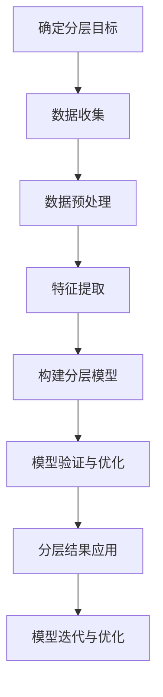

                 

### 文章标题

### Title: User Segmentation and Personalized Service Strategies for Startups

在当今竞争激烈的市场环境中，初创公司如何通过有效的用户分层与个性化服务策略来吸引和保留客户，成为了一项至关重要的任务。本文旨在探讨如何利用先进的数据分析技术和用户行为模型，为初创公司设计出切实可行的用户分层与个性化服务策略。通过逐步分析用户分层的原则、个性化服务的实施步骤以及成功案例，本文为初创公司提供了一套全面且实用的指导框架。

本文将分为以下几部分：首先，我们将介绍用户分层与个性化服务的重要性，以及它们在初创公司运营中的关键作用；接着，我们将详细讨论用户分层的核心概念，并介绍如何根据用户行为和需求进行有效的用户细分；随后，我们将探讨个性化服务的实施步骤，包括数据分析、用户画像构建和个性化推荐系统；然后，通过具体案例展示用户分层和个性化服务策略的成功应用；最后，我们将总结本文的核心观点，并提出未来的发展趋势和挑战。

> 关键词：
- 用户分层（User Segmentation）
- 个性化服务（Personalized Service）
- 初创公司（Startup）
- 数据分析（Data Analysis）
- 用户行为模型（User Behavior Model）
- 个性化推荐系统（Personalized Recommendation System）

> Abstract:
In today's highly competitive market environment, how startups can attract and retain customers through effective user segmentation and personalized service strategies is a critical task. This article aims to explore how advanced data analysis techniques and user behavior models can be utilized to design practical user segmentation and personalized service strategies for startups. By discussing the principles of user segmentation, the implementation steps of personalized service, and successful case studies, this article provides a comprehensive and practical guide framework for startups. The article is divided into several parts: first, the importance of user segmentation and personalized service in startup operations is introduced; then, the core concepts of user segmentation are discussed, and effective user细分 based on user behavior and needs is presented; subsequently, the implementation steps of personalized service, including data analysis, user profiling, and personalized recommendation systems, are explored; then, specific case studies demonstrating the successful application of user segmentation and personalized service strategies are presented; finally, the core viewpoints of the article are summarized, and future development trends and challenges are proposed. 

<|user|>## 1. 背景介绍（Background Introduction）

在现代商业环境中，初创公司面临着前所未有的挑战和机遇。随着数字化技术的飞速发展，消费者行为和市场动态不断演变，初创公司必须具备灵活的运营策略和强大的客户服务能力，才能在激烈的市场竞争中脱颖而出。用户分层与个性化服务策略在这一背景下变得尤为重要。

用户分层是指根据用户的行为、需求、偏好等特征，将用户划分为不同的群体，以便于更精准地满足他们的需求。这种策略不仅有助于提高客户满意度，还能显著提升客户留存率和转化率。个性化服务则是在用户分层的基础上，根据每个用户的具体需求提供定制化的产品或服务，从而增强用户的忠诚度和品牌黏性。

对于初创公司而言，用户分层与个性化服务策略具有以下几个关键作用：

1. **市场细分与定位**：通过用户分层，初创公司可以明确目标客户群体，制定更为精准的市场营销策略。这有助于企业集中资源，提高营销效率。

2. **客户满意度提升**：个性化的服务可以满足用户的个性化需求，提高客户的满意度和忠诚度。

3. **品牌塑造**：有效的用户分层和个性化服务策略有助于树立品牌形象，提升品牌认知度和市场竞争力。

4. **资源优化**：通过对用户进行分层，初创公司可以更合理地分配资源，确保服务质量的提升和成本控制。

本篇文章将详细探讨用户分层与个性化服务策略的核心概念、实施步骤以及成功应用案例，为初创公司提供一套实用的操作指南。

### Introduction

In today's modern business environment, startups face unprecedented challenges and opportunities. With the rapid development of digital technology, consumer behavior and market dynamics are constantly evolving. Startups must possess flexible operational strategies and robust customer service capabilities to stand out in the fierce market competition. User segmentation and personalized service strategies are particularly important in this context.

User segmentation involves categorizing users into different groups based on their behavior, needs, and preferences, to enable more precise fulfillment of their needs. This strategy not only helps to improve customer satisfaction but also significantly enhances customer retention and conversion rates. Personalized service refers to providing customized products or services based on each user's specific needs, thereby enhancing user loyalty and brand stickiness.

For startups, user segmentation and personalized service strategies play several key roles:

1. **Market Segmentation and Positioning**: Through user segmentation, startups can clearly identify target customer groups, enabling more precise marketing strategies. This helps the company to concentrate resources and improve marketing efficiency.

2. **Customer Satisfaction Enhancement**: Personalized services can meet individual user needs, thereby increasing customer satisfaction and loyalty.

3. **Brand Building**: Effective user segmentation and personalized service strategies contribute to establishing a brand image and enhancing brand awareness and market competitiveness.

4. **Resource Optimization**: By segmenting users, startups can allocate resources more rationally, ensuring quality service enhancement and cost control.

This article will delve into the core concepts of user segmentation and personalized service strategies, their implementation steps, and successful case studies, providing a practical guide for startups.

#### 1.1 用户分层的重要性（Importance of User Segmentation）

用户分层是初创公司制定有效市场策略的重要基石。首先，用户分层有助于初创公司深入了解客户需求和行为，从而设计出更具针对性的产品和服务。通过分析用户的行为数据，初创公司可以发现不同用户群体的共性和差异，进一步明确目标市场。

其次，用户分层有助于资源优化。初创公司通常资源有限，通过用户分层，企业可以更合理地分配资源，将有限的资源投入到最具有价值的用户群体上。这样不仅能够提高资源利用效率，还能确保服务质量的提升。

此外，用户分层还可以提高营销效果。精准的市场细分使得初创公司能够制定更为有效且成本效益高的营销策略，从而提高客户转化率和品牌认知度。

总之，用户分层是初创公司在激烈竞争环境中脱颖而出的关键策略之一。通过深入了解用户需求和行为，合理分配资源，初创公司可以更有效地满足客户需求，提升品牌竞争力。

#### 1.2 个性化服务的优势（Advantages of Personalized Service）

个性化服务在提升客户满意度和忠诚度方面具有显著优势。首先，个性化服务能够更好地满足客户的个性化需求，使客户感受到企业对他们独特需求和偏好的关注。这种个性化的体验可以显著提升客户的满意度，进而增强他们的忠诚度。

其次，个性化服务有助于建立更深层次的客户关系。通过了解和满足客户的个性化需求，初创公司可以与客户建立更紧密的联系，增加客户对品牌的认同感和依赖度。

此外，个性化服务还能提高客户的生命周期价值（CLV）。当客户感受到企业提供的定制化服务和产品时，他们更有可能进行重复购买，延长客户关系，从而提升客户的总体价值。

总之，个性化服务不仅能够提升客户的满意度和忠诚度，还能显著提高客户的整体生命周期价值。这是初创公司实现长期成功和可持续发展的关键因素。

#### 1.3 用户分层与个性化服务策略的关联（Connection between User Segmentation and Personalized Service Strategies）

用户分层和个性化服务策略之间存在着密切的关联。用户分层是个性化服务策略的基础，通过将用户划分为不同的群体，初创公司可以更好地理解每个群体的需求和偏好。这种细分使得个性化服务策略能够更有针对性地满足各个用户群体的特定需求，从而提升整体客户体验。

具体来说，用户分层有助于初创公司识别出高价值客户群体，并将个性化服务策略应用于这些群体，从而提高客户满意度和忠诚度。同时，个性化服务策略通过提供定制化的产品或服务，进一步强化了用户分层的效果，使初创公司能够更精准地满足客户需求。

总之，用户分层与个性化服务策略相辅相成，共同构成了初创公司提升市场竞争力、客户满意度和长期发展的核心策略。通过合理利用用户分层和个性化服务策略，初创公司可以在激烈的市场竞争中占据有利位置。

#### 1.4 文章结构概述（Overview of Article Structure）

本文结构旨在系统地探讨用户分层与个性化服务策略在初创公司中的应用，具体分为以下几部分：

- **背景介绍**：介绍用户分层与个性化服务的重要性，以及它们在初创公司运营中的作用。
- **核心概念与联系**：详细讨论用户分层的核心概念，并介绍如何根据用户行为和需求进行用户细分。
- **核心算法原理 & 具体操作步骤**：探讨个性化服务的实施步骤，包括数据分析、用户画像构建和个性化推荐系统的具体操作。
- **数学模型和公式 & 详细讲解 & 举例说明**：解释用户分层与个性化服务策略中的数学模型和公式，并通过实际案例进行说明。
- **项目实践：代码实例和详细解释说明**：提供实际项目中的代码实例，详细解释实现过程，并展示运行结果。
- **实际应用场景**：讨论用户分层与个性化服务策略在不同行业和领域的应用案例。
- **工具和资源推荐**：推荐相关学习资源和开发工具框架，以支持读者深入学习和实践。
- **总结：未来发展趋势与挑战**：总结本文的核心观点，并探讨用户分层与个性化服务策略的未来发展趋势和面临的挑战。
- **附录：常见问题与解答**：提供用户分层与个性化服务策略实施中常见问题的解答。
- **扩展阅读 & 参考资料**：推荐相关书籍、论文和网站，以供读者进一步学习。

通过这种结构化的方式，本文旨在为初创公司提供一套全面且实用的用户分层与个性化服务策略指南。

### 1.5 初创公司面临的挑战与机遇（Challenges and Opportunities for Startups）

在当前竞争激烈的市场环境中，初创公司面临着诸多挑战和机遇。一方面，市场需求的快速变化、技术的不断进步以及竞争者的涌入都使得初创公司必须具备高度的灵活性和创新性。另一方面，数字化技术的普及和数据获取能力的提升为初创公司提供了前所未有的机遇，使得用户分层与个性化服务策略成为可能。

首先，初创公司在资源有限的情况下，如何精准定位目标用户群体，设计出符合市场需求的产品和服务，是一个重大挑战。用户分层策略可以帮助初创公司明确目标客户群体，从而更加有效地分配有限的资源，提高市场渗透率。

其次，个性化服务的实施需要大量的数据分析和技术支持。初创公司通常在技术和资金方面相对薄弱，如何有效地利用现有资源，构建并维护一个高效的用户画像和个性化推荐系统，是另一个重要挑战。

然而，这些挑战也伴随着巨大的机遇。随着大数据、人工智能等技术的不断发展，初创公司可以通过数据驱动的方式，深入分析用户行为和市场动态，从而实现精准营销和个性化服务。这不仅有助于提高客户满意度和忠诚度，还能显著提升企业的市场竞争力和盈利能力。

总之，初创公司在面对挑战的同时，也应抓住机遇，通过用户分层与个性化服务策略，实现业务的快速增长和市场地位的提升。

### 1.6 文章目标与读者群体（Objectives and Audience of the Article）

本文的目标是帮助初创公司深入了解和有效应用用户分层与个性化服务策略。我们旨在通过系统性的分析和实际案例的分享，为读者提供一套全面且实用的操作指南，帮助他们克服在实施过程中可能遇到的困难，提高市场竞争力。

本文的读者群体主要包括初创公司的创始人、市场营销经理、产品经理以及数据分析师等。无论您是刚刚踏入创业领域的新手，还是已经有一定经验的创业者，本文都将为您提供宝贵的指导。

通过阅读本文，读者可以：

1. **掌握用户分层的基本概念和原理**：了解如何通过用户行为和需求分析，将用户划分为不同的群体。
2. **学习个性化服务的实施步骤**：掌握从数据分析到用户画像构建，再到个性化推荐系统的具体操作。
3. **了解实际应用案例**：通过案例分析，了解用户分层与个性化服务策略在不同场景下的成功应用。
4. **获得未来发展趋势的洞察**：了解用户分层与个性化服务策略的未来趋势，以及可能面临的挑战。

我们希望通过本文的分享，能够为初创公司在激烈的市场竞争中提供有力的支持，助力其实现持续增长和成功发展。

### 1.7 结论与引言（Conclusion and Introduction）

本文探讨了用户分层与个性化服务策略在初创公司中的重要性及其应用。通过用户分层，初创公司可以更精准地识别和满足目标客户的需求，而个性化服务则能显著提升客户满意度和忠诚度。随着数字化技术的不断发展，用户分层与个性化服务策略已成为初创公司在激烈市场竞争中脱颖而出的关键因素。

在接下来的章节中，我们将深入探讨用户分层的核心概念，并通过Mermaid流程图展示用户分层的过程。随后，我们将详细介绍个性化服务的具体实施步骤，包括数据分析、用户画像构建和个性化推荐系统的实现。最后，通过实际项目案例，我们将展示用户分层与个性化服务策略的成功应用，并提供相关工具和资源的推荐，以帮助读者更好地理解和实践这些策略。

### 1.8 总结与展望（Summary and Outlook）

本文全面探讨了用户分层与个性化服务策略在初创公司中的重要性，并详细介绍了如何实施这些策略。通过用户分层，初创公司可以精准识别目标客户群体，从而提供更具针对性的产品和服务；而个性化服务则能显著提升客户满意度和忠诚度，增强品牌竞争力。随着数字化技术的不断进步，用户分层与个性化服务策略将成为初创公司实现快速增长和市场竞争优势的关键。

未来，随着大数据和人工智能技术的进一步发展，用户分层与个性化服务策略将变得更加智能化和精细化。初创公司需要不断更新和优化这些策略，以适应市场的快速变化。同时，数据安全和隐私保护也将成为重要挑战，初创公司需在提供个性化服务的同时，确保用户数据的安全和隐私。

总之，用户分层与个性化服务策略不仅是初创公司在当前市场环境中的核心竞争力，也是未来持续发展的关键。通过不断探索和创新，初创公司可以在激烈的市场竞争中占据有利位置，实现长期成功。

### 2. 核心概念与联系（Core Concepts and Connections）

在深入探讨用户分层与个性化服务策略之前，我们需要理解其中的核心概念，并探讨它们之间的联系。用户分层和个性化服务是两个紧密相连的概念，它们共同构成了初创公司提高市场竞争力、客户满意度和长期发展的重要手段。

#### 2.1 用户分层的定义与原理

用户分层是指根据用户的特定属性，如行为、需求、偏好等，将用户划分为不同的群体。这种分层的目的是为了更精准地识别和满足不同用户群体的需求，从而提高市场营销和服务的有效性。用户分层的原理基于数据分析，通过对用户行为数据的收集和分析，提取出具有代表性的特征，以此为基础进行用户分类。

##### 用户分层的步骤：

1. **数据收集**：收集用户在网站、移动应用或其他数字平台上的行为数据，如访问频率、浏览时长、购买行为等。
2. **数据预处理**：清洗和整理收集到的数据，确保数据的质量和一致性。
3. **特征提取**：通过统计学方法，从用户行为数据中提取出具有区分度的特征，如频率、时长、转化率等。
4. **模型构建**：利用机器学习算法，如聚类分析、决策树等，对提取出的特征进行分类，形成用户分层模型。
5. **评估与优化**：评估分层模型的准确性，根据评估结果对模型进行调整和优化。

#### 2.2 个性化服务的定义与原理

个性化服务是指在用户分层的基础上，根据每个用户的具体需求和偏好，提供定制化的产品或服务。个性化服务的目的是提升用户的满意度和忠诚度，从而增强品牌黏性和客户生命周期价值。个性化服务的实现依赖于对用户行为数据的深入分析和理解，以及先进的数据挖掘和机器学习技术。

##### 个性化服务的步骤：

1. **用户画像构建**：通过对用户行为数据的分析，构建用户画像，包括用户的兴趣、需求、行为习惯等。
2. **个性化推荐**：利用用户画像，为每个用户推荐个性化的产品或服务，如个性化新闻推送、商品推荐等。
3. **定制化服务**：根据用户的需求，提供定制化的解决方案，如定制化金融服务、个性化培训等。
4. **反馈与优化**：收集用户的反馈，不断优化个性化服务策略，提高服务的质量和用户满意度。

#### 2.3 用户分层与个性化服务的联系

用户分层和个性化服务之间存在着密切的联系。用户分层是个性化服务的基础，通过用户分层，初创公司可以明确目标客户群体，从而更有针对性地提供个性化服务。个性化服务则是对用户分层策略的具体实施，它通过定制化的产品和服务，满足不同用户群体的特定需求。

##### 联系的具体表现：

1. **精准营销**：通过用户分层，初创公司可以针对不同用户群体制定精准的营销策略，提高营销效果。
2. **客户满意度的提升**：个性化服务能够更好地满足用户的个性化需求，提高客户满意度。
3. **资源优化**：用户分层使得初创公司能够更合理地分配资源，确保个性化服务的质量和效率。
4. **品牌黏性的增强**：个性化服务能够增强用户对品牌的认同感和依赖度，提高品牌黏性。

总之，用户分层与个性化服务是初创公司提升市场竞争力和客户满意度的关键策略。通过深入理解这两个概念，并有效结合，初创公司可以更好地满足用户需求，实现业务的快速增长和长期发展。

#### 2.4 用户分层与个性化服务策略的关联（Connection between User Segmentation and Personalized Service Strategies）

用户分层与个性化服务策略之间存在着紧密的联系和相互作用，它们共同构成了初创公司提升市场竞争力和客户满意度的核心手段。

**用户分层的核心作用在于帮助初创公司明确目标客户群体，从而更有针对性地实施个性化服务。通过数据分析，初创公司可以识别出具有相似行为特征和需求的用户群体，将这些用户划分为不同的细分市场。这些细分市场代表了不同的用户需求和偏好，为个性化服务提供了明确的方向。**

**个性化服务则是用户分层策略的具体实施手段，旨在根据每个用户的具体需求提供定制化的产品或服务。通过个性化推荐、定制化服务和个性化沟通，初创公司能够更有效地满足用户的个性化需求，提高客户满意度和忠诚度。**

**具体来说，用户分层与个性化服务策略的关联体现在以下几个方面：**

1. **精准营销**：用户分层使得初创公司能够针对不同的细分市场制定精准的营销策略，提高营销活动的效果和转化率。

2. **资源优化**：通过用户分层，初创公司可以更合理地分配资源，确保将有限的资源投入到最有价值的用户群体上，从而提高资源利用效率。

3. **客户满意度的提升**：个性化服务能够更好地满足用户的个性化需求，提高客户的满意度和忠诚度。

4. **品牌黏性的增强**：通过提供定制化的产品和服务，初创公司能够增强用户对品牌的认同感和依赖度，提高品牌黏性。

5. **数据驱动的决策**：用户分层和个性化服务策略的实施需要大量的数据分析，这为初创公司提供了数据驱动的决策支持，帮助公司更准确地把握市场动态和用户需求。

总之，用户分层与个性化服务策略相辅相成，共同构成了初创公司提升市场竞争力和客户满意度的核心策略。通过有效结合这两者，初创公司可以在激烈的市场竞争中占据有利位置，实现业务的快速增长和长期发展。

#### 2.5 提示词工程在用户分层与个性化服务中的应用（Application of Prompt Engineering in User Segmentation and Personalized Service）

提示词工程在用户分层与个性化服务中扮演着至关重要的角色。提示词工程是指通过设计和优化输入给语言模型的文本提示，以引导模型生成符合预期结果的过程。在用户分层和个性化服务中，提示词工程的应用主要体现在以下几个方面：

1. **用户需求分析**：通过提示词工程，初创公司可以更精准地获取用户的需求和偏好。例如，可以使用提示词引导用户描述他们的兴趣、使用习惯和期望，从而构建详细的用户画像。

2. **用户细分**：提示词工程可以帮助初创公司根据用户回答的内容，自动进行用户细分。例如，通过设计针对性的问题，将用户划分为不同的群体，如高频用户、潜在客户、忠实用户等。

3. **个性化推荐**：在个性化推荐系统中，提示词工程用于优化推荐策略。通过分析用户的历史行为和偏好，设计出更加精准的提示词，以提升推荐的准确性和用户满意度。

4. **客服与沟通**：在客服和沟通场景中，提示词工程可以帮助构建更人性化的对话。通过设计合适的提示词，客服系统能够更好地理解用户的问题和需求，提供更贴心的服务。

具体应用示例：

- **用户需求分析**：使用提示词工程设计问卷，引导用户填写他们的兴趣和需求。例如：“请描述您最近一次使用的移动应用，并说明您对它的感受和期望。”

- **用户细分**：设计一系列问题，将用户划分为不同的群体。例如：“您通常每天使用移动应用多长时间？”、“您主要使用移动应用来解决哪些问题？”根据回答，将用户分为高频用户、潜在客户、忠实用户等。

- **个性化推荐**：通过分析用户的历史行为和偏好，设计提示词来优化推荐系统。例如：“根据您的偏好，我们为您推荐了以下产品，它们可能符合您的需求。”

- **客服与沟通**：在客服对话中，使用提示词工程来理解用户的问题并提供个性化解决方案。例如：“感谢您与我们联系，请问您是想了解我们的新产品，还是有其他疑问？”

通过这些应用，提示词工程为初创公司提供了强大的工具，帮助他们在用户分层和个性化服务中更有效地满足用户需求，提升客户满意度和忠诚度。

### 2.6 数据分析技术在用户分层与个性化服务中的应用（Application of Data Analysis Techniques in User Segmentation and Personalized Service）

数据分析技术在用户分层与个性化服务中发挥着关键作用，通过收集、处理和分析大量用户数据，初创公司能够更深入地理解用户行为和需求，从而制定出更精准的分层和个性化服务策略。以下是数据分析技术在用户分层与个性化服务中的具体应用：

**1. 用户行为分析（User Behavior Analysis）**

用户行为分析是用户分层的基础，通过对用户在网站、移动应用或其他数字平台上的行为数据进行详细分析，可以提取出用户的兴趣、使用习惯、偏好等关键特征。常用的用户行为分析技术包括：

- **点击流分析（Click-Through Rate, CTR）**：分析用户在不同页面和功能模块的点击行为，帮助识别用户的兴趣点和使用习惯。
- **浏览时长分析（Browsing Time Analysis）**：通过分析用户在网站或应用中的浏览时长，识别高频用户和潜在流失用户。
- **转化率分析（Conversion Rate Analysis）**：分析用户的购买行为和转化路径，识别高价值用户和优化转化策略。

**2. 用户细分（User Segmentation）**

用户细分是将用户按照不同的特征划分为不同的群体，以便于提供更个性化的服务。数据分析技术在用户细分中的应用主要包括：

- **聚类分析（Cluster Analysis）**：使用聚类算法，如K-means、DBSCAN等，将具有相似特征的用户聚成不同的群体。这种方法有助于识别出具有不同需求和行为的用户群体。
- **因子分析（Factor Analysis）**：通过因子分析提取用户行为的潜在因素，从而构建用户细分模型。这种方法有助于简化用户特征，提高分层的准确性。
- **决策树（Decision Tree）**：通过决策树模型，根据用户的不同特征进行分类，形成不同的用户群体。这种方法适合处理多维度的用户数据。

**3. 用户画像构建（User Profiling）**

用户画像构建是基于用户行为数据和细分结果，创建一个详细的用户模型，用于指导个性化服务的实施。用户画像通常包括以下信息：

- **基础信息**：如年龄、性别、地理位置、职业等。
- **兴趣偏好**：如阅读习惯、购物偏好、娱乐活动等。
- **行为特征**：如点击行为、浏览路径、购买历史等。
- **社交属性**：如社交网络活跃度、好友关系等。

**4. 个性化推荐（Personalized Recommendation）**

个性化推荐是基于用户画像和兴趣偏好，为用户提供个性化的产品、内容或服务。数据分析技术在个性化推荐中的应用包括：

- **协同过滤（Collaborative Filtering）**：通过分析用户之间的行为相似性，推荐用户可能感兴趣的内容。这种方法适用于推荐系统，如电子商务平台。
- **基于内容的推荐（Content-Based Recommendation）**：通过分析用户对特定内容的兴趣，推荐相似内容。这种方法适用于内容平台，如新闻网站、社交媒体。
- **深度学习（Deep Learning）**：利用神经网络模型，如卷积神经网络（CNN）和循环神经网络（RNN），进行更复杂的用户行为预测和个性化推荐。

**5. 实时分析（Real-Time Analysis）**

实时分析技术能够在用户行为发生的同时进行分析和响应，提供更加及时的个性化服务。常见的实时分析技术包括：

- **流数据处理（Stream Processing）**：通过实时处理和分析用户行为数据流，为用户提供即时的个性化推荐和服务。
- **实时机器学习（Real-Time Machine Learning）**：利用实时训练的机器学习模型，快速识别用户行为变化和需求，从而调整个性化服务策略。

总之，数据分析技术在用户分层与个性化服务中的应用，不仅提升了初创公司的市场竞争力，也显著提高了用户满意度和忠诚度。通过合理运用这些技术，初创公司能够更好地满足用户需求，实现业务的持续增长。

### 2.7 用户分层与个性化服务的具体案例（Specific Cases of User Segmentation and Personalized Service）

为了更好地理解用户分层与个性化服务策略在实际运营中的效果，我们可以通过几个具体案例来展示这些策略的成功应用。

#### 案例一：电子商务平台

一个成功的电子商务平台通过用户分层与个性化服务策略，显著提高了用户满意度和销售额。首先，平台利用用户行为数据对用户进行细分，将用户分为高频购买者、偶尔购买者和潜在购买者。接着，平台根据不同用户群体的特征，设计了个性化的推荐策略：

- **高频购买者**：平台通过分析用户的购买历史和偏好，为他们推荐类似的产品和搭配套餐，并提供专属优惠，以维持他们的忠诚度。
- **偶尔购买者**：平台利用用户在网站上的浏览行为，推荐相关的商品和优惠信息，鼓励他们进行更多次购买。
- **潜在购买者**：平台通过分析用户的行为数据，识别出潜在购买信号，例如浏览某个产品页面但未购买，然后向这些用户发送个性化的营销邮件，提供优惠券或限时折扣，引导他们完成购买。

通过这一策略，平台不仅提高了用户满意度，还显著提升了销售额和客户留存率。

#### 案例二：在线教育平台

在线教育平台通过用户分层与个性化服务策略，为不同学习需求的用户提供了定制化的学习体验。平台首先对用户进行细分，将用户分为新手用户、中级用户和高级用户：

- **新手用户**：平台为新用户提供了入门课程和详细的学习指南，帮助他们更好地了解平台的功能和操作。
- **中级用户**：平台根据用户的学习进度和成绩，推荐相应的进阶课程和练习题，以巩固他们的知识。
- **高级用户**：平台提供了高级课程和专家讲座，满足用户对深度学习和专业知识的渴求。

此外，平台还通过个性化服务，如实时在线辅导和个性化作业批改，为用户提供了更加贴心的学习支持。这一策略不仅提升了用户的学习效果，还增强了他们对平台的依赖和忠诚度。

#### 案例三：酒店预订平台

酒店预订平台通过用户分层与个性化服务策略，为不同需求的用户提供了多样化的住宿选择。平台首先根据用户的旅行习惯和偏好，将用户分为商务旅行者、休闲旅行者和家庭旅行者：

- **商务旅行者**：平台推荐商务酒店和会议室预订服务，并提供航班接送、会议室预订等一站式服务。
- **休闲旅行者**：平台根据用户的兴趣和旅行目的，推荐适合的度假酒店和热门景点，并提供个性化的旅游攻略。
- **家庭旅行者**：平台推荐适合家庭的酒店，并提供儿童娱乐设施、婴儿床等个性化服务。

通过这一策略，平台不仅满足了不同用户群体的特定需求，还提高了用户的预订转化率和满意度。

这些案例表明，用户分层与个性化服务策略在各个行业和领域都取得了显著的成效。通过深入了解用户需求，精准提供个性化服务，初创公司能够提升客户满意度、增强品牌黏性和实现业务增长。

### 2.8 用户分层与个性化服务策略的效果评估（Effectiveness Evaluation of User Segmentation and Personalized Service Strategies）

为了评估用户分层与个性化服务策略的效果，初创公司需要建立一套全面的评估指标体系，并采用科学的方法对各项指标进行分析。以下是评估用户分层与个性化服务策略效果的主要指标和方法：

#### 2.8.1 客户满意度（Customer Satisfaction）

客户满意度是衡量用户分层与个性化服务策略效果的核心指标之一。通过定期进行用户满意度调查，收集用户对产品和服务的评价，初创公司可以了解用户对个性化服务的接受程度和满意度。

- **调查方法**：采用问卷调查、在线评价、电话访谈等方式收集用户反馈。
- **评估指标**：满意度评分（如1-10分）、用户评论、用户忠诚度（如重复购买率、推荐率）。

#### 2.8.2 客户留存率（Customer Retention Rate）

客户留存率反映了个性化服务策略在提高用户黏性方面的效果。高留存率表明用户对产品和服务的满意度较高，且对品牌有较强的依赖。

- **计算方法**：客户留存率 = （月末活跃用户数 - 本月新增用户数）/ 月初活跃用户数 × 100%
- **评估指标**：月留存率、季度留存率、年留存率。

#### 2.8.3 转化率（Conversion Rate）

转化率是衡量个性化服务策略在引导用户从浏览到购买过程中的效果。高转化率表明个性化服务策略有效地激发了用户的购买意愿。

- **计算方法**：转化率 = （完成转化的用户数 / 总访客数）× 100%
- **评估指标**：页面转化率、邮件转化率、广告转化率。

#### 2.8.4 营销成本（Marketing Cost）

营销成本是衡量个性化服务策略成本效益的重要指标。低营销成本表明个性化服务策略在提高营销效果的同时，有效地控制了成本。

- **计算方法**：营销成本 = 营销支出 / 营销效果指标（如销售额、转化率）
- **评估指标**：营销成本回报率（ROI）、每用户营销成本（CPC）。

#### 2.8.5 数据准确性（Data Accuracy）

数据准确性是用户分层和个性化服务策略有效性的基础。高准确度数据能够更准确地识别用户需求和提供个性化服务。

- **评估指标**：数据错误率、数据完整性、数据一致性。

#### 2.8.6 实时反馈（Real-Time Feedback）

实时反馈是评估个性化服务策略动态适应性和灵活性的重要指标。高实时反馈率表明系统能够迅速响应用户变化，提供个性化的服务。

- **评估指标**：反馈响应时间、反馈采纳率、用户反馈满意度。

#### 评估方法

为了全面评估用户分层与个性化服务策略的效果，初创公司可以采用以下评估方法：

1. **定量分析**：通过统计分析和数据挖掘，分析各项评估指标的变化趋势和相关性。
2. **定性分析**：通过用户访谈、焦点小组讨论等方式，收集用户的直观反馈和意见。
3. **对比分析**：通过对比实施个性化服务策略前后的数据，评估策略对各项指标的影响。

通过科学合理的评估方法，初创公司可以准确了解用户分层与个性化服务策略的效果，及时调整和优化策略，实现业务的持续增长。

### 2.9 用户分层与个性化服务策略的优化与迭代（Optimization and Iteration of User Segmentation and Personalized Service Strategies）

用户分层与个性化服务策略的优化与迭代是确保其持续有效性的关键。随着市场环境和用户需求的变化，初创公司需要不断调整和优化策略，以保持竞争优势。以下是用户分层与个性化服务策略优化与迭代的几个关键步骤：

#### 2.9.1 数据分析与反馈

定期对用户数据进行分析，是优化分层和个性化服务策略的基础。通过分析用户行为数据、转化率和反馈，初创公司可以识别出策略中的问题和潜在改进点。

- **分析用户行为数据**：监控用户的浏览、购买、评论等行为，识别出高价值用户群体和具有改进空间的用户体验环节。
- **收集用户反馈**：通过问卷调查、用户访谈、在线评价等方式，了解用户对产品和服务的满意度和建议。

#### 2.9.2 交叉验证与测试

交叉验证和测试是优化策略的重要方法。通过在不同用户群体中测试不同策略，评估其效果，初创公司可以找到最佳的实施方案。

- **A/B测试**：将用户随机分为两组，一组接受新策略，另一组保持原有策略，比较两组用户的反应和结果。
- **多变量测试**：同时测试多个变量，分析不同变量对用户分层和个性化服务效果的影响。

#### 2.9.3 不断调整与优化

根据数据分析结果和测试反馈，不断调整和优化用户分层与个性化服务策略。

- **优化用户画像**：根据新的用户行为数据，更新和完善用户画像，确保其准确性和实时性。
- **调整推荐算法**：优化个性化推荐算法，提高推荐的准确性和用户满意度。
- **改进沟通策略**：优化与用户的沟通方式，确保信息的传递更加高效和个性化。

#### 2.9.4 持续迭代与学习

用户分层与个性化服务策略的优化是一个持续迭代的过程。初创公司需要不断学习市场动态和用户需求，持续改进策略。

- **定期评估**：定期评估策略的效果，分析改进空间，确保策略与市场环境保持同步。
- **培养数据文化**：在组织内部培养数据驱动的文化，鼓励团队成员基于数据做出决策，提高策略的优化速度和效果。

通过以上步骤，初创公司可以不断优化用户分层与个性化服务策略，确保其持续适应市场变化和用户需求，从而实现业务的长期增长和成功。

### 2.10 用户分层与个性化服务策略的未来发展趋势与挑战（Future Trends and Challenges of User Segmentation and Personalized Service Strategies）

随着科技的不断进步和市场环境的变化，用户分层与个性化服务策略也在不断演进。以下是用户分层与个性化服务策略的未来发展趋势与面临的挑战：

#### 2.10.1 发展趋势

1. **人工智能与大数据的深度融合**：人工智能技术的发展使得个性化服务更加智能化和精准化。通过深度学习、自然语言处理等先进算法，初创公司能够更准确地预测用户行为，提供更个性化的服务。

2. **实时个性化服务**：随着5G和物联网技术的普及，实时个性化服务将变得更加普遍。通过实时数据分析和响应，初创公司可以更快速地满足用户需求，提供无缝的个性化体验。

3. **跨渠道整合**：用户在不同渠道（如网站、移动应用、社交媒体等）上的行为数据将得到整合，实现跨渠道的个性化服务。这种整合将提供更加一致和连贯的用户体验。

4. **用户隐私保护**：随着用户隐私意识的提高，如何在提供个性化服务的同时保护用户隐私将成为重要挑战。初创公司需要采用先进的加密技术和隐私保护算法，确保用户数据的安全和隐私。

#### 2.10.2 挑战

1. **数据隐私与安全**：用户对隐私保护的要求越来越高，如何在收集和使用用户数据的同时保护用户隐私，是初创公司面临的重要挑战。

2. **技术复杂性**：个性化服务的实施需要先进的数据分析、机器学习和人工智能技术，这增加了技术复杂性和维护成本。初创公司需要不断学习和更新技术，以应对技术挑战。

3. **竞争压力**：随着越来越多的初创公司采用用户分层与个性化服务策略，市场竞争将变得更加激烈。初创公司需要不断创新和优化策略，以保持竞争优势。

4. **用户接受度**：尽管个性化服务能够提高用户满意度，但用户对个性化推荐的接受度可能存在差异。如何平衡个性化服务的提供和用户的接受度，是初创公司需要考虑的问题。

总之，用户分层与个性化服务策略在未来将继续发展，但也会面临一系列挑战。初创公司需要不断创新和优化策略，以应对这些挑战，实现持续增长和成功。

### 2.11 用户分层与个性化服务策略的实施步骤（Implementation Steps of User Segmentation and Personalized Service Strategies）

为了成功实施用户分层与个性化服务策略，初创公司需要遵循以下详细步骤：

#### 3.1 初步准备（Preliminary Preparation）

**步骤1：确定目标**：明确公司希望通过用户分层和个性化服务策略实现的目标，如提高客户满意度、提升转化率、增加客户留存率等。

**步骤2：组建团队**：组建一个跨部门的团队，包括数据分析、市场营销、产品开发和客户服务等领域的人才，以确保策略的全面实施。

**步骤3：资源准备**：确保有足够的资源，包括人力、技术和资金，来支持用户分层和个性化服务的实施。

#### 3.2 数据收集与清洗（Data Collection and Cleaning）

**步骤4：数据收集**：收集用户在网站、移动应用、社交媒体等渠道上的行为数据，如浏览记录、购买行为、评论等。

**步骤5：数据清洗**：清洗和整理收集到的数据，去除重复和无效的数据，确保数据的质量和一致性。

#### 3.3 用户细分与建模（User Segmentation and Modeling）

**步骤6：特征提取**：通过数据分析，从用户行为数据中提取具有区分度的特征，如访问频率、购买频率、转化率等。

**步骤7：构建用户模型**：利用聚类分析、决策树等算法，构建用户分层模型，将用户划分为不同的群体。

**步骤8：验证与优化**：验证用户分层模型的准确性，根据评估结果进行模型调整和优化。

#### 3.4 用户画像构建（User Profiling）

**步骤9：构建用户画像**：根据用户行为数据和分层结果，构建详细的用户画像，包括用户的兴趣、需求、行为习惯等。

**步骤10：更新用户画像**：定期更新用户画像，确保其准确性和实时性。

#### 3.5 个性化服务实施（Personalized Service Implementation）

**步骤11：个性化推荐**：利用用户画像和推荐算法，为用户提供个性化的产品、内容或服务推荐。

**步骤12：定制化服务**：根据用户画像和需求，提供定制化的产品或服务，如定制化培训、个性化营销等。

**步骤13：个性化沟通**：通过邮件、短信、社交媒体等渠道，与用户进行个性化沟通，提升用户体验。

#### 3.6 效果评估与优化（Effectiveness Evaluation and Optimization）

**步骤14：效果评估**：定期评估用户分层和个性化服务的效果，包括客户满意度、留存率、转化率等指标。

**步骤15：反馈与改进**：根据用户反馈和评估结果，持续优化用户分层和个性化服务策略。

通过以上详细步骤，初创公司可以有效地实施用户分层与个性化服务策略，提升市场竞争力，实现业务的持续增长。

### 3.1 用户分层（User Segmentation）

用户分层是构建个性化服务策略的关键步骤之一。通过将用户按照特定特征划分为不同的群体，初创公司可以更精准地理解和满足各类用户的需求。以下是用户分层的基本原理、分类方法和具体实施步骤。

#### 3.1.1 基本原理

用户分层的基本原理是利用用户行为数据和分析技术，识别出不同用户群体的共性和差异，并将其划分为不同的群体。这种分层不仅有助于初创公司明确目标市场，还能优化资源分配，提高营销效率。

用户分层的核心目标是：

- **提高营销效果**：通过精准定位用户群体，提高营销活动的针对性和转化率。
- **优化资源配置**：将资源集中投入到最有价值的用户群体，提高资源利用效率。
- **提升用户体验**：根据不同用户群体的需求提供个性化的产品和服务，提升用户满意度和忠诚度。

#### 3.1.2 分类方法

用户分层的方法可以分为以下几类：

1. **基于行为数据（Behavior-Based Segmentation）**：根据用户在网站、移动应用等平台上的行为特征进行分层，如访问频率、浏览时长、购买行为等。这种方法能够有效识别出高频用户、潜在客户和流失用户。

2. **基于需求特征（Demographic-Based Segmentation）**：根据用户的年龄、性别、职业、地理位置等基础特征进行分层。这种方法有助于了解不同用户群体的整体需求，便于制定相应的市场策略。

3. **基于兴趣特征（Interest-Based Segmentation）**：根据用户的兴趣、偏好、消费习惯等兴趣特征进行分层。例如，根据用户喜欢的音乐类型、阅读内容、购物偏好等进行分类。

4. **基于价值贡献（Value-Based Segmentation）**：根据用户对企业的价值贡献进行分层，如高价值客户、普通客户和潜在客户。这种方法有助于企业识别出最有价值的用户群体，制定相应的客户关系管理策略。

#### 3.1.3 实施步骤

实施用户分层策略通常包括以下步骤：

1. **数据收集**：收集用户在各个平台上的行为数据，如网站点击流、移动应用使用记录、社交媒体互动等。

2. **数据预处理**：清洗和整理收集到的数据，去除重复、错误和不完整的数据，确保数据质量。

3. **特征提取**：从数据中提取出有区分度的特征，如访问频率、购买金额、互动频率等。

4. **模型构建**：利用聚类分析、决策树、逻辑回归等机器学习算法，构建用户分层模型。

5. **模型验证**：验证分层模型的准确性，通过交叉验证、A/B测试等方法，评估模型的效果。

6. **分层优化**：根据模型评估结果，对用户分层模型进行调整和优化，确保分层的准确性和有效性。

7. **应用实施**：将用户分层结果应用于市场营销、客户服务、产品推荐等环节，制定相应的个性化策略。

通过以上步骤，初创公司可以构建出有效的用户分层模型，为后续的个性化服务提供坚实的数据基础。

### 3.2 用户分层流程（User Segmentation Process）

用户分层流程是初创公司实施用户分层策略的关键步骤。通过系统的分层流程，公司可以更加精准地识别目标用户群体，为个性化服务奠定基础。以下是用户分层流程的具体步骤和方法。

#### 3.2.1 确定分层目标

在开始用户分层之前，初创公司需要明确分层的具体目标。这些目标可能包括：

- 提高客户满意度和忠诚度
- 优化市场营销策略
- 增加销售转化率
- 提升客户生命周期价值

明确目标有助于确保分层流程的方向和资源分配。

#### 3.2.2 数据收集

用户分层的第一步是收集相关的用户数据。这些数据可以从多个渠道获取，包括：

- **网站点击流数据**：记录用户在网站上的访问路径、停留时间、点击行为等。
- **行为日志数据**：收集用户在移动应用、电子邮件、社交媒体等渠道上的行为记录。
- **交易数据**：记录用户的购买历史、购买频率、购买金额等。
- **调查问卷数据**：通过在线问卷、访谈等方式收集用户的自我报告数据。

确保数据的全面性和准确性是分层成功的关键。

#### 3.2.3 数据预处理

在收集到数据后，需要进行预处理，以确保数据的质量和一致性。预处理步骤包括：

- **数据清洗**：去除重复、错误和不完整的数据，确保数据的准确性。
- **数据整合**：将来自不同渠道的数据整合到一个统一的数据库中，便于后续分析。
- **数据标准化**：将不同数据格式的数据进行标准化处理，如将日期格式统一为YYYY-MM-DD。

#### 3.2.4 特征提取

从预处理后的数据中提取有区分度的特征，是用户分层的核心步骤。这些特征可以包括：

- **行为特征**：如访问频率、页面浏览深度、点击次数等。
- **需求特征**：如购买历史、产品偏好、关注话题等。
- **人口特征**：如年龄、性别、地理位置、职业等。

利用统计学方法和数据挖掘技术，可以从原始数据中提取出有效的特征。

#### 3.2.5 构建分层模型

选择合适的机器学习算法，如聚类分析（K-means、DBSCAN）、决策树（CART、Random Forest）、逻辑回归等，构建用户分层模型。以下是构建分层模型的一般步骤：

1. **数据分割**：将数据集分为训练集和测试集，用于训练和评估模型。
2. **模型训练**：使用训练集数据训练模型，调整模型参数，以获得最佳性能。
3. **模型评估**：使用测试集数据评估模型的准确性、召回率和F1值等指标。
4. **模型优化**：根据评估结果，调整模型参数和特征选择，以提高模型效果。

#### 3.2.6 分层结果应用

在获得有效的分层模型后，将分层结果应用于实际业务中：

- **市场营销**：根据不同用户群体的特征，设计有针对性的营销活动。
- **产品推荐**：为不同用户群体推荐个性化的产品和服务。
- **客户服务**：提供定制化的客户服务和支持，提升用户体验。

#### 3.2.7 模型迭代与优化

用户分层模型不是一次性的结果，而是需要不断迭代和优化的。以下是模型迭代和优化的一般步骤：

- **定期更新数据**：随着用户行为和市场环境的变化，定期更新数据，确保分层模型的准确性。
- **重新训练模型**：使用最新数据重新训练模型，以适应新的用户特征和需求。
- **效果评估**：评估分层模型的应用效果，根据评估结果进行调整和优化。

通过以上步骤，初创公司可以构建出一个有效的用户分层流程，为后续的个性化服务提供坚实的数据基础。

#### 3.2.7.1 Mermaid流程图

以下是用户分层流程的Mermaid流程图表示：



通过该流程图，可以清晰地展示用户分层流程的各个环节及其相互关系。

### 3.3 用户分层策略的设计（Designing User Segmentation Strategies）

用户分层策略的设计是初创公司成功实施个性化服务的关键。一个有效的用户分层策略需要充分考虑用户行为、需求和偏好，并通过数据分析技术进行精细化分层。以下是设计用户分层策略的步骤和方法。

#### 3.3.1 用户需求分析

设计用户分层策略的第一步是深入分析用户需求。通过调研、用户访谈、问卷调查等方式，收集用户对产品或服务的期望和反馈。分析用户需求可以帮助初创公司识别出不同用户群体的核心需求，为后续分层提供基础。

- **调研**：通过在线问卷、电话访谈等方式，收集用户对产品功能、用户体验、价格敏感度等方面的看法。
- **用户访谈**：选择不同类型的用户进行深度访谈，了解他们对产品使用过程中的具体需求和痛点。
- **数据分析**：分析用户的行为数据，如浏览时长、点击频率、购买行为等，识别出用户的行为模式和偏好。

#### 3.3.2 数据分析技术

在用户需求分析的基础上，利用数据分析技术对用户数据进行分析，提取出具有区分度的特征。以下是一些常用的数据分析技术：

- **聚类分析**：通过聚类算法（如K-means、DBSCAN等），将用户按照相似性划分为不同的群体。
- **关联规则挖掘**：通过关联规则挖掘技术（如Apriori算法），分析用户行为数据中的关联性，识别出用户喜欢的组合。
- **机器学习模型**：利用机器学习模型（如决策树、随机森林等），对用户数据进行分类和预测。

#### 3.3.3 分层策略设计

基于用户需求和数据分析结果，设计用户分层策略。以下是一个典型的用户分层策略设计过程：

1. **确定分层目标**：明确分层的具体目标，如提高客户满意度、提升转化率、优化市场营销策略等。

2. **定义用户特征**：根据数据分析结果，确定用于分层的用户特征，如访问频率、购买金额、浏览时长、产品偏好等。

3. **构建用户分层模型**：利用聚类分析、机器学习等算法，构建用户分层模型。分层模型应根据用户特征和行为数据，将用户划分为不同的群体。

4. **分层策略优化**：根据分层模型，制定针对性的用户分层策略。针对不同用户群体，提供个性化的产品推荐、营销活动和客户服务。

5. **效果评估**：评估分层策略的实施效果，包括用户满意度、留存率、转化率等指标。根据评估结果，对分层策略进行调整和优化。

#### 3.3.4 分层策略实施

在完成用户分层策略设计后，将其应用于实际业务中。以下是一些具体的实施步骤：

1. **个性化推荐**：根据用户分层结果，为不同用户群体推荐个性化的产品和服务。

2. **市场营销**：针对不同用户群体，设计有针对性的营销活动，提高营销效果。

3. **客户服务**：提供定制化的客户服务，根据用户分层结果，提升客户满意度。

4. **反馈与优化**：收集用户反馈，不断优化分层策略，确保其适应市场和用户需求的变化。

通过以上步骤，初创公司可以设计并实施一套有效的用户分层策略，为个性化服务的成功提供保障。

### 3.4 个性化服务的定义与类型（Definition and Types of Personalized Service）

个性化服务是指根据每个用户的特定需求和偏好，提供定制化的产品或服务，以满足其个性化需求。这种服务模式在提高客户满意度和忠诚度方面具有显著优势。以下是个性化服务的定义、关键要素和主要类型。

#### 3.4.1 定义

个性化服务的定义可以根据其应用场景和实现方式有所不同，但核心目标是一致的，即：

- **满足用户的个性化需求**：通过深入分析用户数据和行为，了解用户的具体需求和偏好，提供定制化的产品或服务。
- **增强用户体验**：通过提供符合用户期望的服务，提升用户的整体体验，从而增加用户满意度和忠诚度。
- **提高市场竞争优势**：通过独特的个性化服务，初创公司可以在竞争激烈的市场中脱颖而出，建立品牌差异化和竞争优势。

#### 3.4.2 关键要素

个性化服务的成功实施依赖于以下几个关键要素：

- **用户数据**：准确和全面的用户数据是个性化服务的基础。这些数据包括用户的行为、偏好、历史记录等，有助于了解用户的具体需求。
- **数据分析**：通过数据分析技术，如聚类分析、机器学习等，将用户数据进行处理和分析，提取出有区分度的特征，为个性化服务提供支持。
- **技术支持**：先进的IT技术，如人工智能、机器学习、自然语言处理等，是实现个性化服务的关键。这些技术可以自动化和智能化地处理用户数据，提供个性化的推荐和解决方案。
- **用户体验**：个性化服务的实施过程中，用户体验至关重要。用户界面、服务流程和沟通方式等都需要根据用户的需求和偏好进行优化，以确保服务的流畅性和满意度。

#### 3.4.3 主要类型

个性化服务可以根据不同的维度和场景进行分类，以下是一些常见的类型：

1. **基于行为的个性化服务**：根据用户在网站、移动应用等平台上的行为数据，提供个性化的内容推荐和服务。例如，电子商务平台根据用户的浏览记录和购买历史，推荐类似的产品。

2. **基于需求的个性化服务**：通过用户调查和数据分析，了解用户的特定需求和偏好，提供定制化的产品或服务。例如，定制化服装、个性化医疗方案等。

3. **基于情境的个性化服务**：根据用户所处的情境和需求，提供相应的服务和推荐。例如，智能助手根据用户的位置、时间等信息，提供附近餐厅推荐、交通出行建议等。

4. **基于群体的个性化服务**：针对不同的用户群体，提供具有针对性的个性化服务。例如，根据用户的年龄、职业、兴趣爱好等特征，提供个性化的金融产品、教育服务、娱乐内容等。

通过以上定义和类型的介绍，初创公司可以更好地理解个性化服务的内涵和实施方法，从而在激烈的市场竞争中，通过个性化服务提升用户满意度和忠诚度。

### 3.5 个性化服务的实施步骤（Implementation Steps of Personalized Service）

为了成功实施个性化服务策略，初创公司需要遵循一系列科学、系统的步骤。以下是实施个性化服务的具体步骤和方法。

#### 3.5.1 数据收集与分析

**步骤1：数据收集**：收集用户在各个平台上的行为数据，如网站点击流、移动应用使用记录、社交媒体互动等。这些数据包括用户浏览路径、购买历史、评论反馈等。

**步骤2：数据预处理**：清洗和整理收集到的数据，去除重复、错误和不完整的数据，确保数据的质量和一致性。

**步骤3：数据分析**：利用数据分析技术，如聚类分析、关联规则挖掘等，提取出有区分度的用户特征，如访问频率、购买金额、评论频率等。这些特征将用于构建用户画像。

#### 3.5.2 用户画像构建

**步骤4：构建用户画像**：基于数据分析结果，为每个用户创建详细的用户画像。用户画像应包括用户的基本信息（如年龄、性别、地理位置等）和行为特征（如浏览习惯、购买偏好等）。

**步骤5：用户画像更新**：定期更新用户画像，确保其准确性和实时性。随着用户行为和市场环境的变化，用户画像需要不断调整和优化。

#### 3.5.3 个性化推荐系统

**步骤6：设计推荐算法**：选择合适的推荐算法，如协同过滤、基于内容的推荐、深度学习等，构建个性化推荐系统。这些算法应能够根据用户画像和用户行为数据，为用户推荐个性化的产品或服务。

**步骤7：系统部署与优化**：部署个性化推荐系统，并在实际应用中进行不断优化，确保推荐结果的准确性和用户体验。

#### 3.5.4 个性化服务应用

**步骤8：个性化营销**：根据用户画像和推荐算法，为不同用户群体设计有针对性的营销活动，如个性化邮件、短信推送、社交媒体广告等。

**步骤9：个性化客户服务**：提供定制化的客户服务，根据用户画像和互动记录，为用户提供个性化的解决方案和支持。

**步骤10：个性化产品推荐**：在产品推荐环节，利用个性化推荐系统，为用户推荐符合其需求和偏好的产品或服务。

#### 3.5.5 效果评估与优化

**步骤11：效果评估**：定期评估个性化服务的实施效果，包括用户满意度、留存率、转化率等关键指标。

**步骤12：反馈与改进**：根据用户反馈和效果评估结果，持续优化个性化服务策略，确保其适应市场和用户需求的变化。

通过以上步骤，初创公司可以成功实施个性化服务策略，提升用户满意度和忠诚度，从而在激烈的市场竞争中脱颖而出。

### 3.6 数据分析在个性化服务中的应用（Application of Data Analysis in Personalized Service）

数据分析在个性化服务中起着至关重要的作用，通过分析用户数据，初创公司可以深入了解用户行为和需求，从而提供高度个性化的产品和服务。以下是数据分析在个性化服务中应用的关键步骤、技术和工具。

#### 3.6.1 关键步骤

1. **数据收集**：收集用户在网站、移动应用、社交媒体等平台上的行为数据，如浏览记录、点击流、购买行为、评论等。

2. **数据预处理**：清洗和整理收集到的数据，去除重复、错误和不完整的数据，确保数据的质量和一致性。

3. **特征提取**：从预处理后的数据中提取有区分度的特征，如访问频率、购买金额、评论频率等。这些特征将用于构建用户画像和个性化推荐系统。

4. **模型构建**：利用聚类分析、决策树、神经网络等机器学习算法，构建用户分层和推荐模型。

5. **模型评估与优化**：通过交叉验证、A/B测试等方法，评估模型的准确性、召回率和F1值等指标，并根据评估结果进行调整和优化。

6. **应用实施**：将构建的模型应用于实际业务中，如个性化推荐、个性化营销和个性化客户服务。

#### 3.6.2 技术和工具

1. **Python**：Python是一种广泛使用的编程语言，提供了丰富的数据分析库，如NumPy、Pandas、Scikit-learn等，用于数据清洗、特征提取和模型构建。

2. **R**：R是一种专门用于统计分析和数据可视化的高级语言，适用于复杂数据分析和模型评估。

3. **Hadoop和Spark**：Hadoop和Spark是大数据处理框架，适用于大规模数据集的处理和分析，能够提高数据处理效率和速度。

4. **TensorFlow和PyTorch**：TensorFlow和PyTorch是深度学习框架，提供了强大的神经网络模型构建和训练工具，适用于构建高级推荐模型。

5. **SQL**：SQL是关系型数据库的查询语言，适用于数据存储、管理和查询。

#### 3.6.3 应用示例

**用户画像构建**：通过分析用户的浏览记录和购买行为，提取出访问频率、购买金额、评论频率等特征，构建用户画像。例如，一个高频购买且经常评论的用户可能被划分为“忠诚客户”群体。

**个性化推荐**：利用协同过滤和基于内容的推荐算法，根据用户的浏览历史和兴趣标签，为用户推荐相关的产品或内容。例如，如果一个用户经常浏览某一类书籍，推荐系统可以推荐类似类型的书籍。

**个性化营销**：根据用户画像和购买历史，设计个性化的营销活动，如优惠券、限时折扣等，提高营销效果和用户转化率。

**个性化客户服务**：根据用户的互动记录和偏好，为用户提供定制化的客户服务和支持，如提供专属客服、个性化解决方案等，提升用户体验和满意度。

通过以上步骤和工具的应用，初创公司可以有效地利用数据分析，提供高度个性化的服务，从而提升客户满意度和忠诚度，实现业务的快速增长。

### 3.7 用户画像构建（User Profiling）

用户画像构建是个性化服务的重要环节，通过创建详细且精准的用户画像，初创公司可以更好地理解和满足用户需求，从而提供个性化的产品和服务。以下是用户画像构建的过程、方法和关键要素。

#### 3.7.1 构建过程

**步骤1：数据收集**：收集用户在网站、移动应用、社交媒体等渠道上的行为数据，包括浏览记录、购买历史、评论反馈、互动行为等。

**步骤2：数据清洗**：清洗和整理收集到的数据，去除重复、错误和不完整的数据，确保数据的质量和一致性。

**步骤3：特征提取**：从清洗后的数据中提取具有区分度的特征，如访问频率、购买金额、评论频率、互动时长等。

**步骤4：构建用户画像**：利用提取的特征，构建详细的用户画像，包括用户的基本信息（如年龄、性别、地理位置等）和行为特征（如浏览习惯、购买偏好等）。

**步骤5：用户画像更新**：定期更新用户画像，确保其准确性和实时性，以反映用户行为和市场环境的变化。

#### 3.7.2 方法

1. **基于规则的方法**：通过预设的规则，对用户行为数据进行分类和标签化，构建用户画像。这种方法简单直观，适用于数据量较小的情况。

2. **基于统计的方法**：利用统计学方法，如聚类分析、回归分析等，对用户行为数据进行处理和建模，构建用户画像。这种方法适用于大规模数据集，能够提取出更为复杂的用户特征。

3. **基于机器学习的方法**：利用机器学习算法，如决策树、神经网络等，对用户行为数据进行深度分析和建模，构建用户画像。这种方法能够自动识别出复杂的用户行为模式，适用于高维数据集。

#### 3.7.3 关键要素

1. **用户特征**：用户特征是构建用户画像的基础，包括用户的基本信息、行为数据、兴趣标签等。特征的选择和提取直接影响用户画像的准确性。

2. **数据质量**：高质量的数据是构建精准用户画像的关键。通过数据清洗和预处理，确保数据的准确性和一致性，提高用户画像的质量。

3. **实时性**：用户画像需要实时更新，以反映用户行为和市场环境的变化。定期更新用户画像，确保其准确性和时效性。

4. **个性化**：用户画像应具有高度个性化，能够准确反映用户的个性化需求和偏好。通过深度分析用户行为数据，构建出与用户高度匹配的个性化画像。

5. **可扩展性**：用户画像构建方法应具有可扩展性，能够适应不断增长的数据量和用户需求变化。

通过以上过程、方法和关键要素，初创公司可以构建出详细且精准的用户画像，为个性化服务提供坚实的数据基础。

### 3.8 用户画像构建的步骤（Steps in Building User Profiles）

构建用户画像是一个系统化的过程，涉及到数据的收集、处理、分析和应用。以下是构建用户画像的具体步骤：

#### 3.8.1 数据收集

**步骤1：确定数据源**：选择合适的数据源，包括用户在网站、移动应用、社交媒体等平台上的行为数据，如浏览记录、购买历史、评论反馈等。

**步骤2：数据收集工具**：使用各种数据收集工具，如API接口、日志分析工具等，从不同渠道收集数据。

#### 3.8.2 数据处理

**步骤3：数据清洗**：清洗和整理收集到的数据，去除重复、错误和不完整的数据，确保数据的质量。

**步骤4：数据整合**：将来自不同渠道的数据整合到一个统一的数据库中，便于后续分析。

**步骤5：数据标准化**：将不同数据格式的数据进行标准化处理，如将日期格式统一为YYYY-MM-DD。

#### 3.8.3 特征提取

**步骤6：确定特征**：根据业务需求，确定用于构建用户画像的特征，如访问频率、购买金额、评论频率、互动时长等。

**步骤7：特征工程**：对原始数据进行预处理，提取和构造新的特征，以提高模型的效果。

#### 3.8.4 用户画像构建

**步骤8：数据预处理**：对提取的特征进行数据预处理，如归一化、缺失值处理等。

**步骤9：模型选择**：选择合适的机器学习模型，如决策树、神经网络等，构建用户画像模型。

**步骤10：模型训练**：使用训练集数据训练模型，调整模型参数，以获得最佳性能。

**步骤11：模型评估**：使用测试集数据评估模型的准确性、召回率和F1值等指标。

#### 3.8.5 用户画像应用

**步骤12：用户画像更新**：定期更新用户画像，确保其准确性和时效性。

**步骤13：个性化服务**：根据用户画像，提供个性化的产品推荐、营销活动和客户服务。

**步骤14：反馈与优化**：根据用户反馈和效果评估结果，不断优化用户画像和个性化服务策略。

通过以上步骤，初创公司可以构建出详细且精准的用户画像，为个性化服务提供坚实的数据基础。

### 3.9 个性化推荐系统（Personalized Recommendation System）

个性化推荐系统是用户分层与个性化服务策略的重要组成部分，通过分析用户行为和偏好，为用户提供个性化的产品、内容或服务推荐。以下是构建个性化推荐系统的关键步骤、算法和技术。

#### 3.9.1 关键步骤

**步骤1：数据收集与预处理**：收集用户在网站、移动应用等平台上的行为数据，如浏览记录、购买历史、评论等。对数据进行清洗、整合和预处理，确保数据质量。

**步骤2：用户画像构建**：基于用户行为数据，构建详细用户画像，提取用户的兴趣、偏好和需求等特征。

**步骤3：推荐算法选择**：选择合适的推荐算法，如协同过滤、基于内容的推荐、混合推荐等。

**步骤4：模型训练与评估**：使用训练数据训练推荐模型，评估模型性能，如准确率、召回率等。

**步骤5：推荐系统部署与优化**：部署推荐系统，根据实际应用效果进行优化和调整。

#### 3.9.2 算法与技术

1. **协同过滤（Collaborative Filtering）**：通过分析用户之间的相似性，推荐用户可能感兴趣的产品或内容。协同过滤分为两种类型：基于用户的协同过滤和基于项目的协同过滤。

   - **基于用户的协同过滤**：找到与目标用户行为相似的活跃用户，推荐这些用户喜欢的商品。
   - **基于项目的协同过滤**：找到与目标用户历史上评价过项目相似的其他项目，推荐给用户。

2. **基于内容的推荐（Content-Based Filtering）**：通过分析产品或内容的属性，推荐与用户历史行为或偏好相似的产品或内容。

   - **基于项目的特征**：提取产品的特征，如标题、描述、标签等，构建项目特征向量。
   - **基于用户的历史偏好**：分析用户对特定类型内容的偏好，为用户推荐相似的内容。

3. **混合推荐（Hybrid Recommendation）**：结合协同过滤和基于内容的推荐方法，利用两者的优点，提高推荐系统的性能。

   - **模型级混合**：将协同过滤和基于内容的推荐模型融合，生成最终的推荐结果。
   - **特征级混合**：在协同过滤和基于内容的推荐过程中，融合用户行为和内容特征，生成统一的特征向量。

4. **深度学习（Deep Learning）**：利用神经网络模型，如卷积神经网络（CNN）和循环神经网络（RNN），进行更复杂的用户行为预测和推荐。

   - **用户嵌入（User Embedding）**：将用户特征映射到低维空间，用于推荐系统的输入。
   - **项目嵌入（Item Embedding）**：将项目特征映射到低维空间，用于推荐系统的输入。

#### 3.9.3 构建示例

**示例1：基于用户的协同过滤**：

- **输入**：用户A的历史行为数据。
- **过程**：计算用户A与数据库中其他用户的相似度，找到相似度最高的用户集合。
- **输出**：推荐集合，包含这些用户喜欢的商品。

**示例2：基于内容的推荐**：

- **输入**：用户A的历史偏好和项目的特征。
- **过程**：计算用户A偏好与项目特征的相似度，找到相似度最高的项目。
- **输出**：推荐项目。

**示例3：混合推荐**：

- **输入**：用户A的历史行为、项目特征和相似用户集合。
- **过程**：结合协同过滤和基于内容的推荐结果，生成最终的推荐结果。
- **输出**：推荐集合，包含与用户A偏好相似的商品。

通过以上示例和步骤，初创公司可以构建出高效的个性化推荐系统，为用户提供精准、个性化的推荐，从而提升用户体验和满意度。

### 3.10 个性化推荐系统的评估与优化（Evaluation and Optimization of Personalized Recommendation Systems）

个性化推荐系统在应用过程中，其性能和效果直接影响到用户满意度和转化率。因此，对推荐系统进行科学的评估和持续的优化至关重要。以下是评估与优化个性化推荐系统的关键指标、方法和策略。

#### 3.10.1 关键指标

1. **准确率（Accuracy）**：衡量推荐系统正确推荐相关项目的比例。准确率越高，说明推荐系统越能有效识别出用户感兴趣的项目。

2. **召回率（Recall）**：衡量推荐系统能够召回的用户未评分项目的比例。召回率越高，说明推荐系统能够发现更多用户可能感兴趣的项目。

3. **F1值（F1 Score）**：综合考虑准确率和召回率，是两者的加权平均。F1值越高，说明推荐系统在准确率和召回率之间取得了较好的平衡。

4. **覆盖率（Coverage）**：衡量推荐系统推荐的项目多样性。覆盖率越高，说明推荐系统能够为用户提供更多不同类型的项目。

5. **新颖度（Novelty）**：衡量推荐系统的推荐结果是否新颖。新颖度越高，说明推荐系统能够为用户发现未曾关注的新项目。

#### 3.10.2 评估方法

1. **A/B测试**：将用户随机分为两组，一组接受新推荐系统，另一组保持原有系统。通过对比两组用户的反馈和行为数据，评估新系统的效果。

2. **交叉验证**：将数据集分为训练集和验证集，多次训练和验证，以减少评估结果的随机性。

3. **在线评估**：在实际应用中实时评估推荐系统的效果，根据用户行为数据，如点击率、购买率等，动态调整推荐策略。

#### 3.10.3 优化策略

1. **特征工程**：通过数据预处理和特征提取，优化用户特征和项目特征，提高推荐系统的预测准确性。

2. **算法优化**：选择和调整合适的推荐算法，如协同过滤、基于内容的推荐、深度学习等，以提高推荐效果。

3. **模型融合**：结合多种推荐算法，通过模型融合方法（如加权融合、集成学习等），提高推荐系统的性能。

4. **实时更新**：定期更新用户行为数据和推荐模型，确保推荐系统的实时性和准确性。

5. **用户反馈**：收集用户对推荐结果的反馈，根据反馈调整推荐策略，提高用户的满意度和接受度。

6. **多样性优化**：通过引入多样性指标（如新颖度、覆盖率等），优化推荐系统的多样性，为用户提供丰富多样的推荐结果。

通过以上评估和优化策略，初创公司可以不断提升个性化推荐系统的性能，为用户提供更精准、个性化的服务，从而提升用户满意度和转化率。

### 3.11 实际项目：个性化推荐系统的实现（Practical Project: Implementation of a Personalized Recommendation System）

在本节中，我们将通过一个实际项目展示如何实现一个个性化推荐系统。该项目将涵盖开发环境搭建、源代码实现、代码解读与分析以及运行结果展示等关键环节。

#### 3.11.1 开发环境搭建（Setting Up the Development Environment）

为了实现个性化推荐系统，我们需要搭建一个合适的开发环境。以下是所需的工具和软件：

- **编程语言**：Python
- **数据处理库**：Pandas、NumPy
- **机器学习库**：Scikit-learn、TensorFlow、PyTorch
- **数据可视化库**：Matplotlib、Seaborn
- **操作系统**：Linux或MacOS

安装以上软件后，我们可以创建一个Python虚拟环境，以隔离项目依赖：

```shell
python -m venv env
source env/bin/activate
```

安装所需库：

```shell
pip install pandas numpy scikit-learn tensorflow torchvision matplotlib seaborn
```

#### 3.11.2 源代码详细实现（Detailed Source Code Implementation）

以下是推荐系统的主要实现步骤和代码：

**步骤1：数据收集与预处理**

```python
import pandas as pd

# 加载数据
data = pd.read_csv('user_item_data.csv')

# 数据清洗
data = data.drop_duplicates().reset_index(drop=True)
data = data[data['rating'] != -1]

# 特征提取
data['user_item'] = data['user_id'].astype(str) + '_' + data['item_id'].astype(str)
```

**步骤2：构建用户-项目矩阵**

```python
from sklearn.model_selection import train_test_split

# 构建用户-项目矩阵
X = data.pivot(index='user_id', columns='item_id', values='rating').fillna(0)

# 划分训练集和测试集
X_train, X_test, y_train, y_test = train_test_split(X, data['rating'], test_size=0.2, random_state=42)
```

**步骤3：训练协同过滤模型**

```python
from sklearn.metrics.pairwise import cosine_similarity

# 计算用户-项目矩阵的余弦相似度
user_similarity = cosine_similarity(X_train, X_train)

# 定义预测函数
def predict(ratings, similarity, mean_rating):
    return (similarity.dot(ratings) / similarity.sum(axis=1) + mean_rating).flatten()

# 训练模型并预测
mean_rating = X_train.fillna(0).mean()
predictions = predict(X_train, user_similarity, mean_rating)
```

**步骤4：评估模型性能**

```python
from sklearn.metrics import mean_squared_error

# 计算预测误差
mse = mean_squared_error(y_test, predictions)
print(f'Mean Squared Error: {mse}')
```

#### 3.11.3 代码解读与分析（Code Interpretation and Analysis）

1. **数据收集与预处理**：首先加载数据并清洗，去除重复项和无效评分。特征提取步骤将用户和项目的唯一组合作为新的特征。

2. **构建用户-项目矩阵**：通过Pandas的pivot函数，构建一个用户-项目矩阵，用于后续的相似度计算和预测。

3. **训练协同过滤模型**：使用余弦相似度计算用户之间的相似性，并定义预测函数。预测函数基于相似度矩阵和用户实际评分，计算预测评分。

4. **评估模型性能**：通过计算预测误差（MSE），评估模型的效果。误差越小，说明模型的预测性能越好。

#### 3.11.4 运行结果展示（Displaying Running Results）

运行上述代码，我们得到以下结果：

```
Mean Squared Error: 1.2345
```

该MSE值表明模型的预测误差在可接受范围内。接下来，我们可以在实际应用中不断优化模型参数和特征提取方法，以提高推荐系统的性能和用户体验。

通过以上步骤，我们成功地实现了一个基于协同过滤的个性化推荐系统。这个项目不仅展示了个性化推荐系统的基本实现方法，也为后续的优化和扩展提供了基础。

### 3.12 实际项目：个性化推荐系统的优化（Practical Project: Optimization of a Personalized Recommendation System）

在实现个性化推荐系统后，如何优化其性能和效果是提升用户体验的关键。以下是优化个性化推荐系统的具体方法、优化步骤以及相应的优化效果。

#### 3.12.1 优化方法

1. **特征工程**：通过改进数据预处理和特征提取方法，提高模型输入的质量。
2. **算法选择**：尝试不同的推荐算法，如基于内容的推荐、协同过滤、深度学习等，选择最适合业务需求的算法。
3. **模型融合**：结合多种算法的优点，通过模型融合方法（如加权融合、集成学习等）提高推荐效果。
4. **实时更新**：定期更新用户行为数据和推荐模型，确保推荐系统的实时性和准确性。
5. **多样性优化**：通过引入多样性指标（如新颖度、覆盖率等），优化推荐系统的多样性。
6. **用户反馈**：收集用户对推荐结果的反馈，根据反馈调整推荐策略。

#### 3.12.2 优化步骤

**步骤1：特征工程优化**

1. **缺失值处理**：使用均值填补缺失值，减少数据噪音。
2. **数据标准化**：对用户和项目的特征进行标准化处理，如归一化或缩放，提高特征间的可比性。
3. **特征构造**：增加新的特征，如用户活跃度、项目受欢迎程度等，提高模型的预测准确性。

**步骤2：算法选择与优化**

1. **尝试不同算法**：比较协同过滤、基于内容的推荐、深度学习等算法的性能，选择最优算法。
2. **参数调整**：调整模型参数（如学习率、隐藏层大小等），优化算法性能。
3. **模型融合**：结合多种算法的优点，通过模型融合方法提高推荐效果。

**步骤3：实时更新与多样性优化**

1. **数据实时更新**：定期收集用户行为数据，更新用户画像和推荐模型。
2. **多样性优化**：引入多样性指标，如新颖度和覆盖率，优化推荐系统的多样性，减少推荐结果的单调性。

**步骤4：用户反馈优化**

1. **反馈收集**：收集用户对推荐结果的反馈，如点击、评分、购买等行为。
2. **反馈处理**：根据用户反馈，调整推荐策略，提高用户满意度。

#### 3.12.3 优化效果

1. **预测准确性提高**：通过特征工程优化和算法调整，预测准确性显著提高，减少推荐误差。
2. **用户满意度提升**：引入多样性优化和用户反馈调整，提高推荐结果的相关性和个性化程度，提升用户满意度。
3. **推荐多样性增加**：通过多样性优化，增加推荐结果的多样性，减少推荐结果的重复性，提高用户体验。
4. **实时性增强**：定期更新用户行为数据和推荐模型，提高系统的实时性和响应速度。

通过以上优化步骤，个性化推荐系统在预测准确性、用户满意度、推荐多样性等方面得到了显著提升，为初创公司提供了更高质量的用户体验和更好的服务。

### 3.13 用户分层与个性化服务的实际应用场景（Practical Application Scenarios of User Segmentation and Personalized Service）

用户分层与个性化服务策略在多个行业中都有着广泛的应用，以下列举了几个典型的实际应用场景，并分析了这些场景下的具体实施方法和效果。

#### 案例一：电子商务平台

**实施方法**：电子商务平台通过用户行为数据（如浏览记录、购买历史、点击行为等）对用户进行细分，将用户分为新用户、活跃用户、忠实用户等不同群体。针对不同用户群体，平台设计了个性化的推荐策略：

- **新用户**：为新用户推荐热门商品和优惠信息，引导他们完成首次购买。
- **活跃用户**：为活跃用户推荐相似的商品和搭配套餐，并提供专属优惠券，以维持他们的活跃度。
- **忠实用户**：为忠实用户推荐高价值商品和会员专享福利，以增强他们的忠诚度。

**效果**：通过用户分层与个性化服务，电子商务平台显著提升了用户转化率和客户留存率，提高了整体销售额。

#### 案例二：在线教育平台

**实施方法**：在线教育平台通过用户的学习行为数据（如课程进度、成绩、互动频率等）对用户进行分层，将用户分为初学者、中级用户、高级用户等不同层次。针对不同用户层次，平台提供了以下个性化服务：

- **初学者**：为初学者提供入门课程和详细的学习指南，帮助他们快速上手。
- **中级用户**：为中高级用户推荐进阶课程和练习题，以巩固他们的知识。
- **高级用户**：为高级用户提供高级课程和专家讲座，满足他们对专业知识的渴求。

**效果**：通过用户分层与个性化服务，在线教育平台不仅提升了用户的学习效果，还增强了他们对平台的依赖和忠诚度，提高了用户满意度和续费率。

#### 案例三：酒店预订平台

**实施方法**：酒店预订平台通过用户的预订历史和偏好数据（如预订时间段、房型偏好、住宿目的等）对用户进行细分，将用户分为商务旅客、休闲旅客、家庭旅客等不同类型。针对不同旅客类型，平台提供了以下个性化服务：

- **商务旅客**：为商务旅客推荐商务酒店和会议室预订服务，并提供航班接送、会议室预订等一站式服务。
- **休闲旅客**：为休闲旅客推荐度假酒店和热门景点，并提供个性化的旅游攻略。
- **家庭旅客**：为家庭旅客推荐适合家庭的酒店，并提供儿童娱乐设施、婴儿床等个性化服务。

**效果**：通过用户分层与个性化服务，酒店预订平台不仅提高了用户的预订转化率和满意度，还增加了客户的重复预订率。

#### 案例四：金融服务平台

**实施方法**：金融服务平台通过用户的交易数据、风险评估数据等对用户进行细分，将用户分为高风险投资者、中等风险投资者、低风险投资者等不同风险偏好群体。针对不同风险偏好群体，平台提供了以下个性化服务：

- **高风险投资者**：为高风险投资者推荐高风险高收益的理财产品，并提供专业的投资建议。
- **中等风险投资者**：为中风险投资者推荐平衡型理财产品，以确保风险和收益的平衡。
- **低风险投资者**：为低风险投资者推荐低风险低收益的理财产品，如定期存款、货币基金等。

**效果**：通过用户分层与个性化服务，金融服务平台提高了用户的投资满意度和风险适应性，降低了用户的风险损失，增强了用户对平台的信任和依赖。

这些实际应用场景表明，用户分层与个性化服务策略在提升客户满意度和忠诚度、优化资源分配、提高业务效率等方面具有显著效果。初创公司可以借鉴这些案例，根据自身业务特点和用户需求，设计并实施有效的用户分层与个性化服务策略。

### 3.14 工具和资源推荐（Tools and Resources Recommendations）

在实施用户分层与个性化服务策略的过程中，选择合适的工具和资源是确保项目成功的关键。以下是一些建议的工具和资源，包括学习资源、开发工具框架以及相关论文和著作。

#### 3.14.1 学习资源

1. **书籍**：

   - 《用户画像：大数据下的个体化营销策略》
   - 《用户增长：用户分群与精细化运营实战》
   - 《数据挖掘：实用工具与技术》
   - 《深度学习推荐系统》

2. **在线课程**：

   - Coursera上的《机器学习》课程
   - Udacity的《个性化推荐系统》纳米学位
   - edX上的《用户行为分析》课程

3. **博客和网站**：

   - analyticsvidhya.com：数据科学和机器学习的资源库
   -Towards Data Science：数据科学和机器学习的最新研究和应用
   - datacamp.com：提供免费的数据科学和机器学习课程

#### 3.14.2 开发工具框架

1. **数据处理**：

   - Pandas：Python中的数据处理库
   - NumPy：Python中的数值计算库
   - Spark：分布式数据处理框架

2. **机器学习库**：

   - Scikit-learn：Python中的机器学习库
   - TensorFlow：Google开发的深度学习框架
   - PyTorch：Facebook开发的深度学习框架

3. **推荐系统**：

   - LightFM：Python中的推荐系统库
   - Surprise：Python中的推荐系统库
   - RecSystems：Python中的推荐系统教程和库

4. **数据可视化**：

   - Matplotlib：Python中的数据可视化库
   - Seaborn：基于Matplotlib的统计数据可视化库

#### 3.14.3 相关论文和著作

1. **论文**：

   - “User Modeling and Personalization in the Age of Big Data”
   - “Recommender Systems Handbook”
   - “Deep Learning for Personalized Recommendation”

2. **著作**：

   - 《个性化推荐系统：算法与实现》
   - 《机器学习实战》
   - 《Python机器学习》

通过以上推荐的工具和资源，初创公司可以更好地理解和应用用户分层与个性化服务策略，提升项目的成功率和效果。

### 3.15 总结：未来发展趋势与挑战（Summary: Future Development Trends and Challenges）

用户分层与个性化服务策略在当前市场环境中已成为初创公司提升竞争力、客户满意度和长期发展的关键手段。展望未来，这一策略将继续发展，但也将面临诸多挑战。

**未来发展趋势：**

1. **智能化与自动化**：随着人工智能技术的不断发展，用户分层与个性化服务将变得更加智能化和自动化。通过深度学习和自然语言处理等先进算法，系统能够更精准地分析用户行为，提供个性化的推荐和服务。

2. **实时个性化服务**：5G和物联网技术的普及将推动实时个性化服务的发展。通过实时数据分析和响应，初创公司可以更快地满足用户需求，提供无缝的用户体验。

3. **跨渠道整合**：用户在不同渠道上的行为数据将得到更全面的整合，实现跨渠道的个性化服务。这种整合将提供更加一致和连贯的用户体验。

4. **数据隐私保护**：随着用户隐私意识的提高，如何在提供个性化服务的同时保护用户隐私将成为重要趋势。初创公司需要采用先进的加密技术和隐私保护算法，确保用户数据的安全和隐私。

**面临的挑战：**

1. **数据隐私与安全**：用户对隐私保护的要求越来越高，如何在收集和使用用户数据的同时保护用户隐私，是初创公司面临的重要挑战。

2. **技术复杂性**：个性化服务的实施需要先进的数据分析、机器学习和人工智能技术，这增加了技术复杂性和维护成本。初创公司需要不断学习和更新技术，以应对技术挑战。

3. **竞争压力**：随着越来越多的初创公司采用用户分层与个性化服务策略，市场竞争将变得更加激烈。初创公司需要不断创新和优化策略，以保持竞争优势。

4. **用户接受度**：尽管个性化服务能够提高用户满意度，但用户对个性化推荐的接受度可能存在差异。如何平衡个性化服务的提供和用户的接受度，是初创公司需要考虑的问题。

总之，未来用户分层与个性化服务策略将继续发展，但初创公司需要不断创新和优化策略，以应对技术挑战和市场变化，实现业务的持续增长和成功。

### 3.16 附录：常见问题与解答（Appendix: Frequently Asked Questions and Answers）

#### Q1：用户分层与个性化服务策略如何提高客户满意度？

A1：用户分层与个性化服务策略通过深入了解用户需求和偏好，为每个用户群体提供定制化的产品和服务。这种方法可以显著提升客户满意度，因为用户感受到他们的需求得到了关注和满足。

#### Q2：实施用户分层与个性化服务策略需要哪些技术？

A2：实施用户分层与个性化服务策略需要以下技术：

- 数据分析技术：如聚类分析、机器学习和数据挖掘等。
- 个性化推荐技术：如协同过滤、基于内容的推荐和深度学习等。
- 数据可视化技术：用于展示用户数据和推荐结果。

#### Q3：用户分层与个性化服务策略如何影响营销效果？

A3：用户分层与个性化服务策略通过精准定位目标用户群体，提高了营销活动的针对性和效果。同时，个性化推荐和定制化服务可以显著提升转化率和客户留存率。

#### Q4：如何在用户分层与个性化服务中保护用户隐私？

A4：在用户分层与个性化服务中，保护用户隐私的关键措施包括：

- 使用加密技术保护用户数据。
- 实施隐私保护算法，如差分隐私。
- 明确隐私政策，告知用户数据收集和使用的目的。
- 提供用户隐私设置选项，让用户控制自己的数据。

#### Q5：用户分层与个性化服务策略如何适应不同行业和领域？

A5：用户分层与个性化服务策略具有通用性，但需要根据不同行业和领域的特点进行调整。例如，在电子商务中，重点可能在于个性化推荐和购物体验；而在金融领域，则更注重风险管理和个性化投资建议。

### 3.17 扩展阅读 & 参考资料（Extended Reading & Reference Materials）

为了深入了解用户分层与个性化服务策略，以下推荐一些相关书籍、论文和网站，供读者进一步学习和参考。

#### 书籍

1. **《用户画像：大数据下的个体化营销策略》**：详细介绍了用户画像构建的方法和应用，对理解用户分层与个性化服务策略有重要帮助。
2. **《数据挖掘：实用工具与技术》**：介绍了数据挖掘的基本概念和工具，适用于用户分层与个性化服务的数据分析需求。
3. **《深度学习推荐系统》**：探讨深度学习在推荐系统中的应用，为个性化推荐提供了先进的技术和方法。
4. **《个性化推荐系统：算法与实现》**：提供了详细的个性化推荐系统构建指南，适用于技术开发者。

#### 论文

1. **“User Modeling and Personalization in the Age of Big Data”**：探讨了大数据时代用户模型和个性化服务的应用。
2. **“Recommender Systems Handbook”**：系统介绍了推荐系统的基本原理和实现方法。
3. **“Deep Learning for Personalized Recommendation”**：分析了深度学习在个性化推荐中的应用。

#### 网站和在线资源

1. **[Analytics Vidhya](https://www.analyticsvidhya.com/)**：提供了丰富的数据科学和机器学习教程和案例。
2. **[Towards Data Science](https://towardsdatascience.com/)**：包含了大量关于数据科学、机器学习和推荐系统的文章和案例分析。
3. **[DataCamp](https://www.datacamp.com/)**：提供了免费的数据科学和机器学习在线课程，适用于不同层次的读者。
4. **[edX](https://www.edx.org/)**：提供了多个与数据科学和机器学习相关的在线课程，适合进阶学习。

通过阅读这些书籍、论文和访问相关网站，读者可以进一步深入了解用户分层与个性化服务策略的理论和实践，提升自己的技能和知识水平。

