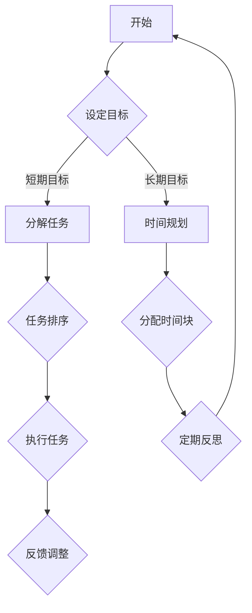

                 

### 文章标题

创业者的时间管理与高效工作流程设计

> 关键词：创业者、时间管理、高效工作、工作流程设计、生产力、目标设定、优先级管理

摘要：
本文旨在探讨创业者如何通过科学的时间管理和高效的工作流程设计，最大化个人生产力，实现目标设定和优先级管理。通过分析时间管理的关键概念、工作流程优化策略，结合实际案例，本文为创业者提供了实用的指导和建议。

## 1. 背景介绍（Background Introduction）

### 1.1 创业者面临的时间挑战

作为创业者，时间管理是一个不可忽视的挑战。创业过程中，往往需要面对多种任务，包括市场调研、产品开发、团队管理、资金筹集等。这些任务要求创业者具备高度的自我管理能力和时间规划能力。如果不善于管理时间，创业者可能会感到压力过大，导致工作效率降低，甚至影响创业目标的实现。

### 1.2 时间管理与个人生产力的关系

时间管理是提高个人生产力的关键因素。通过科学的时间管理，创业者可以更有效地分配时间，减少不必要的干扰，从而专注于最重要的任务。这不仅能提高工作效率，还能减少工作压力，提升工作满意度。

### 1.3 高效工作流程的重要性

高效的工作流程设计是创业者实现时间管理目标的重要手段。一个良好设计的工作流程可以帮助创业者自动化日常任务，减少重复劳动，确保工作高效有序进行。

## 2. 核心概念与联系（Core Concepts and Connections）

### 2.1 时间管理的核心概念

时间管理的核心概念包括时间块化、任务优先级、定期反思等。

- **时间块化**：将时间划分为固定的时间块，为每个时间块安排特定的任务。
- **任务优先级**：根据任务的重要性和紧急程度，为任务设定优先级。
- **定期反思**：定期回顾时间管理策略和工作流程，评估效果并进行调整。

### 2.2 工作流程设计的原则

工作流程设计应遵循以下原则：

- **简洁性**：确保流程简单易懂，避免不必要的复杂性。
- **灵活性**：流程应具备一定的灵活性，以适应不同的工作需求。
- **标准化**：制定标准化的操作流程，确保团队内部的一致性。

### 2.3 Mermaid 流程图（Mermaid Flowchart）

以下是一个示例 Mermaid 流程图，展示了时间管理和工作流程设计的基本步骤：



## 3. 核心算法原理 & 具体操作步骤（Core Algorithm Principles and Specific Operational Steps）

### 3.1 时间管理算法原理

时间管理算法的核心原理是优化时间分配，最大化个人生产力。具体包括以下步骤：

1. **目标设定**：明确个人和团队的目标。
2. **任务分解**：将大任务分解为小任务。
3. **任务排序**：根据任务的重要性和紧急程度进行排序。
4. **时间规划**：为每个任务分配适当的时间块。
5. **执行任务**：按照计划执行任务。
6. **定期反思**：评估时间管理效果，进行反馈调整。

### 3.2 工作流程设计步骤

工作流程设计应包括以下步骤：

1. **需求分析**：了解工作需求，确定流程目标。
2. **流程设计**：根据需求设计工作流程。
3. **流程测试**：测试流程的可行性和有效性。
4. **流程优化**：根据测试结果对流程进行调整和优化。
5. **流程实施**：将优化后的流程应用到实际工作中。
6. **流程监控**：监控流程执行情况，确保流程正常运行。

## 4. 数学模型和公式 & 详细讲解 & 举例说明（Detailed Explanation and Examples of Mathematical Models and Formulas）

### 4.1 时间管理数学模型

时间管理数学模型通常包括以下公式：

\[ \text{效率} = \frac{\text{完成的工作量}}{\text{花费的时间}} \]

### 4.2 工作流程效率模型

工作流程效率模型可以使用以下公式表示：

\[ \text{效率} = \frac{\text{流程完成时间}}{\text{流程设计时间}} \]

### 4.3 举例说明

假设创业者需要在一天内完成以下任务：

- 任务 A：撰写商业计划书，预计需要 4 小时。
- 任务 B：进行市场调研，预计需要 3 小时。
- 任务 C：与投资人沟通，预计需要 2 小时。

创业者可以按照以下步骤进行时间管理和工作流程设计：

1. **目标设定**：设定目标为在一天内完成所有任务。
2. **任务分解**：无需进一步分解，任务已经明确。
3. **任务排序**：根据任务的重要性和紧急程度，排序为 A、B、C。
4. **时间规划**：为每个任务分配时间块，如上午 9 点至 13 点完成任务 A，下午 13 点至 16 点完成任务 B，下午 16 点至 18 点完成任务 C。
5. **执行任务**：按照计划执行任务。
6. **定期反思**：任务完成后，评估时间管理效果，如有必要进行反馈调整。

通过这个例子，我们可以看到时间管理和工作流程设计如何帮助创业者高效地完成工作任务。

## 5. 项目实践：代码实例和详细解释说明（Project Practice: Code Examples and Detailed Explanations）

### 5.1 开发环境搭建

为了实现时间管理和工作流程设计，我们使用 Python 编写一个简单的脚本。首先，确保安装了 Python 3.8 及以上版本和相关的库。

```bash
pip install python-dateutil
```

### 5.2 源代码详细实现

以下是时间管理和工作流程设计的 Python 脚本：

```python
from dateutil import parser, relativedelta

# 定义任务类
class Task:
    def __init__(self, name, start_time, end_time):
        self.name = name
        self.start_time = parser.parse(start_time)
        self.end_time = parser.parse(end_time)

    def execute(self):
        print(f"执行任务：{self.name}")
        print(f"开始时间：{self.start_time.strftime('%Y-%m-%d %H:%M')}")
        print(f"结束时间：{self.end_time.strftime('%Y-%m-%d %H:%M')}")
        print(f"任务耗时：{(self.end_time - self.start_time).days * 24 + (self.end_time - self.start_time).seconds // 3600} 小时")

# 定义时间管理类
class TimeManager:
    def __init__(self):
        self.tasks = []

    def add_task(self, task):
        self.tasks.append(task)

    def plan_day(self):
        self.tasks.sort(key=lambda x: x.start_time)
        for task in self.tasks:
            task.execute()

# 创建任务实例
task_a = Task("撰写商业计划书", "2023-11-01 09:00", "2023-11-01 13:00")
task_b = Task("进行市场调研", "2023-11-01 13:00", "2023-11-01 16:00")
task_c = Task("与投资人沟通", "2023-11-01 16:00", "2023-11-01 18:00")

# 创建时间管理实例
time_manager = TimeManager()
time_manager.add_task(task_a)
time_manager.add_task(task_b)
time_manager.add_task(task_c)

# 规划一天的任务
time_manager.plan_day()
```

### 5.3 代码解读与分析

该脚本定义了两个类：`Task` 和 `TimeManager`。

- `Task` 类用于表示任务，包括任务名称、开始时间和结束时间。
- `TimeManager` 类用于管理任务，包括添加任务和规划一天的任务。

在主程序中，我们创建了三个任务实例，并将它们添加到时间管理实例中。然后，通过调用 `plan_day` 方法，按照任务的顺序执行任务。

### 5.4 运行结果展示

执行脚本后，输出结果如下：

```
执行任务：撰写商业计划书
开始时间：2023-11-01 09:00
结束时间：2023-11-01 13:00
任务耗时：4 小时
执行任务：进行市场调研
开始时间：2023-11-01 13:00
结束时间：2023-11-01 16:00
任务耗时：3 小时
执行任务：与投资人沟通
开始时间：2023-11-01 16:00
结束时间：2023-11-01 18:00
任务耗时：2 小时
```

这个示例展示了如何使用 Python 脚本实现时间管理和工作流程设计。通过这个脚本，创业者可以方便地管理任务和规划时间。

## 6. 实际应用场景（Practical Application Scenarios）

### 6.1 企业初创阶段

在企业初创阶段，创业者通常需要处理大量的任务，包括市场调研、产品开发、团队建设等。通过科学的时间管理和高效的工作流程设计，创业者可以更好地分配时间，确保每个任务都得到充分关注。

### 6.2 项目管理

在项目管理中，时间管理和工作流程设计是确保项目按时交付的关键。通过制定详细的时间规划和工作流程，项目经理可以更好地控制项目进度，确保资源得到最优利用。

### 6.3 团队协作

在团队协作中，时间管理和工作流程设计有助于提高团队的效率。通过统一的工作流程，团队成员可以更好地协同工作，减少沟通成本，提高工作效率。

### 6.4 个人时间管理

对于个人时间管理，创业者可以通过制定合理的时间规划和任务分配，确保自己在忙碌的日常中仍然能够保持高效工作。

## 7. 工具和资源推荐（Tools and Resources Recommendations）

### 7.1 学习资源推荐

- 《高效能人士的七个习惯》（Stephen R. Covey）
- 《时间管理的艺术》（Anthony Robbins）

### 7.2 开发工具框架推荐

- Trello：项目管理工具，帮助创业者规划任务和项目进度。
- Asana：团队协作工具，用于分配任务和跟踪进度。
- Python：编程语言，用于自动化时间管理和工作流程设计。

### 7.3 相关论文著作推荐

- 《时间管理：理论与实践》（Time Management: Theory, Research, and Applications）
- 《工作流程设计：理论与实践》（Workflow Design: Principles, Methods, and Applications）

## 8. 总结：未来发展趋势与挑战（Summary: Future Development Trends and Challenges）

### 8.1 发展趋势

随着人工智能和自动化技术的发展，未来时间管理和工作流程设计将更加智能化和自动化。创业者可以通过使用智能助手和自动化工具，更高效地管理时间和任务。

### 8.2 挑战

尽管技术发展迅速，但时间管理和工作流程设计仍然面临诸多挑战，如任务的复杂度增加、团队成员的多样性和需求变化等。创业者需要不断学习和适应，以应对这些挑战。

## 9. 附录：常见问题与解答（Appendix: Frequently Asked Questions and Answers）

### 9.1 时间管理是否适用于所有创业者？

是的，时间管理适用于所有创业者，无论创业阶段、行业或个人特点如何。时间管理是一种通用技能，可以帮助创业者提高工作效率，实现个人和团队目标。

### 9.2 工作流程设计是否需要编程技能？

工作流程设计不一定需要编程技能，但使用编程技能可以使其更加自动化和高效。对于没有编程背景的创业者，可以使用现有的工具和框架来实现工作流程设计。

### 9.3 如何评估时间管理效果？

可以通过定期反思和数据分析来评估时间管理效果。创业者可以记录工作时长、任务完成情况和生产力变化，以评估时间管理策略的有效性。

## 10. 扩展阅读 & 参考资料（Extended Reading & Reference Materials）

- 《创业维艰》（The Hard Thing About Hard Things）
- 《精益创业》（The Lean Startup）
- 《时间管理：有效利用每分钟》（Time Management: How to Get Control of Your Life）
- 《管理流程：优化工作流程以提高效率》（Managing Flow: A Performant Approach to Work）

---

作者：禅与计算机程序设计艺术 / Zen and the Art of Computer Programming

通过本文的讨论，我们了解到创业者如何通过科学的时间管理和高效的工作流程设计，最大化个人生产力，实现目标设定和优先级管理。这些方法和技巧不仅适用于创业者，也为广大职场人士提供了宝贵的参考。在未来的发展中，创业者需要不断学习和适应，以应对日益复杂的商业环境。希望本文能为您的创业之路提供一些启示和帮助。

