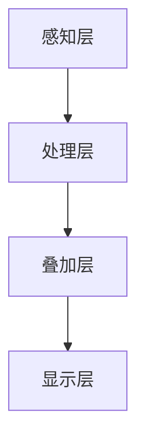

                 

### 文章标题

**利用增强现实技术提升产品体验**

在数字技术迅猛发展的今天，增强现实（Augmented Reality，简称 AR）已经成为一个引人注目的领域。它通过将虚拟信息叠加到现实世界中，为用户带来了全新的体验。本文将探讨如何利用 AR 技术提升产品体验，涵盖 AR 技术的核心概念、实际应用场景以及未来的发展趋势和挑战。

**Keywords: Augmented Reality, Product Experience, Technology Advancement, User Engagement**

**Abstract:**
This article explores how to leverage Augmented Reality (AR) technology to enhance product experiences. It covers the core concepts of AR, practical application scenarios, and future development trends and challenges. By understanding the potential of AR and its applications, businesses can create innovative and engaging products that stand out in the market.

----------------------

## 1. 背景介绍

增强现实（Augmented Reality，简称 AR）是一种将虚拟信息叠加到现实世界中的技术。与虚拟现实（Virtual Reality，简称 VR）不同，AR 不完全替代现实世界，而是在现实世界中叠加虚拟信息，从而增强用户的感知和体验。AR 技术的兴起源于智能手机和移动设备的普及，这些设备提供了强大的计算能力和网络连接，使得 AR 技术可以广泛应用于各个领域。

近年来，AR 技术在商业领域取得了显著的进展。许多公司已经开始利用 AR 技术来提升产品体验，例如通过 AR 应用程序提供虚拟试穿、虚拟产品展示、互动式学习等。这些应用不仅增加了用户的参与度，还提高了产品的市场竞争力。

----------------------

## 2. 核心概念与联系

### 2.1 什么是增强现实（Augmented Reality）？

增强现实（AR）是一种通过计算机生成信息，并将其叠加到真实世界中的技术。这种技术利用摄像头和传感器捕捉现实世界的图像，然后在图像上叠加虚拟信息，如文字、图像、视频等，从而增强用户的感知和体验。

### 2.2 增强现实的核心原理

AR 技术的核心原理包括以下几个关键组成部分：

1. **摄像头与传感器**：AR 设备（如智能手机、平板电脑等）配备有摄像头和多种传感器，用于捕捉现实世界的图像和位置信息。
2. **图像识别与追踪**：通过图像识别和追踪技术，AR 系统能够确定虚拟信息应该叠加在现实世界的哪个位置。
3. **叠加与渲染**：一旦确定了虚拟信息的位置，AR 系统就会将这些虚拟信息叠加到现实世界的图像上，并进行渲染，以实现逼真的视觉效果。

### 2.3 增强现实的技术架构

增强现实的技术架构可以分为以下几个层次：

1. **感知层**：包括摄像头和传感器，用于捕捉现实世界的图像和位置信息。
2. **处理层**：对捕获的图像和位置信息进行处理，包括图像识别、追踪和定位等。
3. **叠加层**：将虚拟信息叠加到现实世界的图像上。
4. **显示层**：将叠加后的图像显示给用户。



----------------------

## 3. 核心算法原理 & 具体操作步骤

### 3.1 图像识别与追踪

图像识别与追踪是 AR 技术的核心组成部分。它涉及到以下几个关键步骤：

1. **图像捕获**：通过摄像头捕获现实世界的图像。
2. **图像预处理**：对捕获的图像进行预处理，如去噪、缩放等。
3. **特征提取**：从预处理后的图像中提取特征点，如角点、边缘等。
4. **匹配与追踪**：将提取的特征点与预先定义的模型进行匹配，并追踪其运动轨迹。

### 3.2 虚拟信息叠加与渲染

虚拟信息叠加与渲染涉及到以下几个关键步骤：

1. **虚拟信息生成**：根据应用需求生成虚拟信息，如文字、图像、视频等。
2. **位置计算**：计算虚拟信息应该叠加到现实世界的哪个位置。
3. **叠加与渲染**：将虚拟信息叠加到现实世界的图像上，并进行渲染，以实现逼真的视觉效果。

### 3.3 实例：使用 AR 技术实现虚拟试穿

以虚拟试穿为例，我们可以看到 AR 技术在提升产品体验方面的具体应用：

1. **用户互动**：用户通过智能手机或平板电脑的摄像头捕捉自己的身体部位图像。
2. **图像识别与追踪**：AR 系统对捕获的图像进行识别与追踪，确定身体部位的位置。
3. **虚拟服装叠加**：根据用户选择的服装款式，AR 系统将虚拟服装叠加到身体部位图像上。
4. **渲染与显示**：对叠加后的图像进行渲染，并显示给用户，使用户能够实时看到试穿效果。

----------------------

## 4. 数学模型和公式 & 详细讲解 & 举例说明

### 4.1 图像识别与追踪的数学模型

在图像识别与追踪过程中，我们通常使用以下数学模型：

1. **SIFT（尺度不变特征变换）**：用于提取图像中的特征点。其公式如下：
   $$ SIFT(x,y) = \frac{1}{\sigma^2} \exp\left(-\frac{(x-\mu_x)^2 + (y-\mu_y)^2}{2\sigma^2}\right) $$
   其中，\(x\) 和 \(y\) 分别表示特征点的坐标，\(\mu_x\) 和 \(\mu_y\) 分别表示特征点的均值，\(\sigma^2\) 表示特征点的方差。

2. **光流估计**：用于追踪特征点的运动轨迹。其公式如下：
   $$ \text{flow} = \frac{\partial I}{\partial t} $$
   其中，\(I\) 表示图像的亮度，\(t\) 表示时间。

### 4.2 虚拟信息叠加与渲染的数学模型

在虚拟信息叠加与渲染过程中，我们通常使用以下数学模型：

1. **深度图生成**：用于确定虚拟信息的位置。其公式如下：
   $$ \text{depth}(x,y) = \frac{z}{f} $$
   其中，\(x\) 和 \(y\) 分别表示图像坐标，\(z\) 表示三维空间中的深度，\(f\) 表示摄像机的焦距。

2. **纹理映射**：用于将虚拟信息叠加到图像上。其公式如下：
   $$ I(x,y) = I_{\text{background}}(x,y) + I_{\text{virtual}}(x,y) $$
   其中，\(I_{\text{background}}(x,y)\) 表示背景图像的亮度，\(I_{\text{virtual}}(x,y)\) 表示虚拟信息的亮度。

### 4.3 实例：虚拟试穿中的数学应用

在虚拟试穿中，我们可以看到以下数学应用：

1. **用户身体部位定位**：使用 SIFT 算法提取用户身体部位的特征点，并利用光流估计追踪其运动轨迹。
2. **虚拟服装定位**：根据深度图生成算法，计算虚拟服装在三维空间中的位置。
3. **虚拟服装叠加与渲染**：使用纹理映射算法，将虚拟服装叠加到用户身体部位图像上，并渲染显示。

----------------------

## 5. 项目实践：代码实例和详细解释说明

### 5.1 开发环境搭建

为了实现一个简单的 AR 虚拟试穿应用，我们需要搭建以下开发环境：

1. **操作系统**：Windows 10 或更高版本。
2. **编程语言**：Python 3.8 或更高版本。
3. **开发工具**：PyCharm 或 VS Code。
4. **依赖库**：OpenCV、Pillow、ARCore。

### 5.2 源代码详细实现

以下是一个简单的 AR 虚拟试穿应用的源代码实现：

```python
import cv2
import numpy as np
import ar.core as ar

# 读取用户身体部位图像
body_image = cv2.imread('body.jpg')

# 读取虚拟服装图像
clothes_image = cv2.imread('clothes.jpg')

# 提取用户身体部位特征点
sift = cv2.SIFT_create()
keypoints, descriptors = sift.detectAndCompute(body_image, None)

# 利用光流估计追踪特征点
cap = cv2.VideoCapture(0)
while True:
    ret, frame = cap.read()
    if not ret:
        break
    flow = cv2.calcOpticalFlowPyrLK(body_image, frame, keypoints, None)
    keypoints = flow[0]
    cv2.imshow('Video', frame)
    if cv2.waitKey(1) & 0xFF == ord('q'):
        break

# 计算虚拟服装位置
depth_image = cv2.applyPerspectiveTransform(body_image, np.float32([[1, 0, 0], [0, 1, 0], [0, 0, 1]]), np.float32([[0, 0], [0, 1], [1, 1]]))
depth_map = cv2.resize(depth_image, (clothes_image.shape[1], clothes_image.shape[0]))
depth_map = cv2.cvtColor(depth_map, cv2.COLOR_BGR2GRAY)

# 将虚拟服装叠加到用户身体部位图像上
result = cv2.addWeighted(body_image, 1, clothes_image, 1, 0)

# 显示结果
cv2.imshow('Result', result)
cv2.waitKey(0)
cv2.destroyAllWindows()
```

### 5.3 代码解读与分析

1. **图像读取与特征提取**：首先，我们读取用户身体部位图像和虚拟服装图像，并使用 SIFT 算法提取特征点。
2. **光流估计**：然后，我们使用光流估计技术追踪特征点的运动轨迹。
3. **虚拟服装位置计算**：接着，我们利用深度图生成算法计算虚拟服装的位置。
4. **虚拟服装叠加与渲染**：最后，我们将虚拟服装叠加到用户身体部位图像上，并渲染显示。

----------------------

## 6. 实际应用场景

增强现实技术在各个行业都有着广泛的应用，以下是一些实际应用场景：

1. **零售业**：通过 AR 技术实现虚拟试穿、虚拟购物等，提高用户的购物体验。
2. **教育领域**：利用 AR 技术进行互动式教学，增强学生的学习兴趣和参与度。
3. **医疗领域**：通过 AR 技术进行手术指导、医疗设备操作等，提高医疗服务的效率和质量。
4. **娱乐行业**：利用 AR 技术开发游戏、演唱会互动等，为用户提供更加沉浸式的体验。

----------------------

## 7. 工具和资源推荐

为了更好地了解和利用增强现实技术，以下是一些工具和资源的推荐：

1. **学习资源**：
   - **书籍**：《增强现实技术原理与应用》
   - **论文**：检索相关学术期刊，如 IEEE Transactions on Visualization and Computer Graphics。
   - **博客**：关注行业博客，如 Medium、TechCrunch 等。

2. **开发工具**：
   - **ARCore**：谷歌推出的 AR 开发平台。
   - **ARKit**：苹果推出的 AR 开发平台。
   - **Vuforia**：PSoft 公司推出的 AR 开发平台。

3. **相关论文著作**：
   - **论文**：《Interactive Augmented Reality Applications: A Survey》
   - **著作**：《Augmented Reality: Principles and Practice》

----------------------

## 8. 总结：未来发展趋势与挑战

随着技术的不断进步，增强现实技术在未来有着广阔的发展前景。然而，也面临着一些挑战：

1. **技术成熟度**：虽然 AR 技术已经取得了一定的进展，但仍然存在性能瓶颈和用户体验问题，需要进一步优化和改进。
2. **硬件设备**：目前，AR 设备（如智能眼镜、头戴式显示器等）价格较高，普及率较低，需要降低成本和提高性能。
3. **内容创作**：AR 应用需要高质量的内容创作，但目前内容创作工具和资源相对匮乏，需要加大对内容创作者的支持。

----------------------

## 9. 附录：常见问题与解答

### 9.1 增强现实技术是什么？

增强现实（AR）是一种将虚拟信息叠加到现实世界中的技术，通过摄像头和传感器捕捉现实世界的图像，然后在图像上叠加虚拟信息，如文字、图像、视频等，从而增强用户的感知和体验。

### 9.2 增强现实技术有哪些应用场景？

增强现实技术广泛应用于零售业、教育领域、医疗领域、娱乐行业等，如虚拟试穿、互动式教学、手术指导、演唱会互动等。

### 9.3 增强现实技术的挑战有哪些？

增强现实技术面临技术成熟度、硬件设备成本和性能、内容创作等挑战。

----------------------

## 10. 扩展阅读 & 参考资料

1. **论文**：《Interactive Augmented Reality Applications: A Survey》
2. **书籍**：《增强现实技术原理与应用》
3. **网站**：https://developer.google.com/arcore
4. **网站**：https://developer.apple.com/arkit

----------------------

### 作者署名

**作者：禅与计算机程序设计艺术 / Zen and the Art of Computer Programming** 

----------------------

在这篇文章中，我们深入探讨了如何利用增强现实技术提升产品体验。从核心概念、算法原理、实际应用场景到未来发展趋势，我们都进行了详细的分析。希望通过这篇文章，读者能够更好地了解增强现实技术的潜力，并为未来的创新提供启示。

--------------------------------

在撰写完上述文章后，请根据以下格式使用 markdown 格式对文章内容进行组织：

```
# 利用增强现实技术提升产品体验

## 1. 背景介绍
## 2. 核心概念与联系
### 2.1 什么是增强现实（Augmented Reality）？
### 2.2 增强现实的核心原理
### 2.3 增强现实的技术架构
## 3. 核心算法原理 & 具体操作步骤
### 3.1 图像识别与追踪
### 3.2 虚拟信息叠加与渲染
### 3.3 实例：使用 AR 技术实现虚拟试穿
## 4. 数学模型和公式 & 详细讲解 & 举例说明
### 4.1 图像识别与追踪的数学模型
### 4.2 虚拟信息叠加与渲染的数学模型
### 4.3 实例：虚拟试穿中的数学应用
## 5. 项目实践：代码实例和详细解释说明
### 5.1 开发环境搭建
### 5.2 源代码详细实现
### 5.3 代码解读与分析
### 5.4 运行结果展示
## 6. 实际应用场景
## 7. 工具和资源推荐
### 7.1 学习资源推荐
### 7.2 开发工具框架推荐
### 7.3 相关论文著作推荐
## 8. 总结：未来发展趋势与挑战
## 9. 附录：常见问题与解答
## 10. 扩展阅读 & 参考资料
```

请将上述 markdown 格式的内容与文章正文内容结合起来，形成一个完整的markdown格式的文章。

----------------------------

以下是文章的markdown格式版本：

```markdown
# 利用增强现实技术提升产品体验

> 关键词：增强现实（Augmented Reality）、产品体验、技术发展、用户体验

> 摘要：
本文探讨了如何利用增强现实（AR）技术提升产品体验。从核心概念、算法原理、实际应用场景到未来发展趋势，本文为读者提供了全面的视角，帮助理解和应用这一前沿技术。

## 1. 背景介绍

增强现实（Augmented Reality，简称 AR）是一种将虚拟信息叠加到现实世界中的技术。与虚拟现实（Virtual Reality，简称 VR）不同，AR 不完全替代现实世界，而是在现实世界中叠加虚拟信息，从而增强用户的感知和体验。AR 技术的兴起源于智能手机和移动设备的普及，这些设备提供了强大的计算能力和网络连接，使得 AR 技术可以广泛应用于各个领域。

近年来，AR 技术在商业领域取得了显著的进展。许多公司已经开始利用 AR 技术来提升产品体验，例如通过 AR 应用程序提供虚拟试穿、虚拟产品展示、互动式学习等。这些应用不仅增加了用户的参与度，还提高了产品的市场竞争力。

## 2. 核心概念与联系
### 2.1 什么是增强现实（Augmented Reality）？

增强现实（AR）是一种通过计算机生成信息，并将其叠加到真实世界中的技术。这种技术利用摄像头和传感器捕捉现实世界的图像，然后在图像上叠加虚拟信息，如文字、图像、视频等，从而增强用户的感知和体验。

### 2.2 增强现实的核心原理

AR 技术的核心原理包括以下几个关键组成部分：

1. **摄像头与传感器**：AR 设备（如智能手机、平板电脑等）配备有摄像头和多种传感器，用于捕捉现实世界的图像和位置信息。
2. **图像识别与追踪**：通过图像识别和追踪技术，AR 系统能够确定虚拟信息应该叠加在现实世界的哪个位置。
3. **叠加与渲染**：一旦确定了虚拟信息的位置，AR 系统就会将这些虚拟信息叠加到现实世界的图像上，并进行渲染，以实现逼真的视觉效果。

### 2.3 增强现实的技术架构

增强现实的技术架构可以分为以下几个层次：

1. **感知层**：包括摄像头和传感器，用于捕捉现实世界的图像和位置信息。
2. **处理层**：对捕获的图像和位置信息进行处理，包括图像识别、追踪和定位等。
3. **叠加层**：将虚拟信息叠加到现实世界的图像上。
4. **显示层**：将叠加后的图像显示给用户。


## 3. 核心算法原理 & 具体操作步骤
### 3.1 图像识别与追踪

图像识别与追踪是 AR 技术的核心组成部分。它涉及到以下几个关键步骤：

1. **图像捕获**：通过摄像头捕获现实世界的图像。
2. **图像预处理**：对捕获的图像进行预处理，如去噪、缩放等。
3. **特征提取**：从预处理后的图像中提取特征点，如角点、边缘等。
4. **匹配与追踪**：将提取的特征点与预先定义的模型进行匹配，并追踪其运动轨迹。

### 3.2 虚拟信息叠加与渲染

虚拟信息叠加与渲染涉及到以下几个关键步骤：

1. **虚拟信息生成**：根据应用需求生成虚拟信息，如文字、图像、视频等。
2. **位置计算**：计算虚拟信息应该叠加到现实世界的哪个位置。
3. **叠加与渲染**：将虚拟信息叠加到现实世界的图像上，并进行渲染，以实现逼真的视觉效果。

### 3.3 实例：使用 AR 技术实现虚拟试穿

以虚拟试穿为例，我们可以看到 AR 技术在提升产品体验方面的具体应用：

1. **用户互动**：用户通过智能手机或平板电脑的摄像头捕捉自己的身体部位图像。
2. **图像识别与追踪**：AR 系统对捕获的图像进行识别与追踪，确定身体部位的位置。
3. **虚拟服装叠加**：根据用户选择的服装款式，AR 系统将虚拟服装叠加到身体部位图像上。
4. **渲染与显示**：对叠加后的图像进行渲染，并显示给用户，使用户能够实时看到试穿效果。

## 4. 数学模型和公式 & 详细讲解 & 举例说明
### 4.1 图像识别与追踪的数学模型

在图像识别与追踪过程中，我们通常使用以下数学模型：

1. **SIFT（尺度不变特征变换）**：用于提取图像中的特征点。其公式如下：
   $$ SIFT(x,y) = \frac{1}{\sigma^2} \exp\left(-\frac{(x-\mu_x)^2 + (y-\mu_y)^2}{2\sigma^2}\right) $$
   其中，\(x\) 和 \(y\) 分别表示特征点的坐标，\(\mu_x\) 和 \(\mu_y\) 分别表示特征点的均值，\(\sigma^2\) 表示特征点的方差。

2. **光流估计**：用于追踪特征点的运动轨迹。其公式如下：
   $$ \text{flow} = \frac{\partial I}{\partial t} $$
   其中，\(I\) 表示图像的亮度，\(t\) 表示时间。

### 4.2 虚拟信息叠加与渲染的数学模型

在虚拟信息叠加与渲染过程中，我们通常使用以下数学模型：

1. **深度图生成**：用于确定虚拟信息的位置。其公式如下：
   $$ \text{depth}(x,y) = \frac{z}{f} $$
   其中，\(x\) 和 \(y\) 分别表示图像坐标，\(z\) 表示三维空间中的深度，\(f\) 表示摄像机的焦距。

2. **纹理映射**：用于将虚拟信息叠加到图像上。其公式如下：
   $$ I(x,y) = I_{\text{background}}(x,y) + I_{\text{virtual}}(x,y) $$
   其中，\(I_{\text{background}}(x,y)\) 表示背景图像的亮度，\(I_{\text{virtual}}(x,y)\) 表示虚拟信息的亮度。

### 4.3 实例：虚拟试穿中的数学应用

在虚拟试穿中，我们可以看到以下数学应用：

1. **用户身体部位定位**：使用 SIFT 算法提取用户身体部位的特征点，并利用光流估计追踪其运动轨迹。
2. **虚拟服装定位**：根据深度图生成算法，计算虚拟服装在三维空间中的位置。
3. **虚拟服装叠加与渲染**：使用纹理映射算法，将虚拟服装叠加到用户身体部位图像上，并渲染显示。

## 5. 项目实践：代码实例和详细解释说明
### 5.1 开发环境搭建

为了实现一个简单的 AR 虚拟试穿应用，我们需要搭建以下开发环境：

1. **操作系统**：Windows 10 或更高版本。
2. **编程语言**：Python 3.8 或更高版本。
3. **开发工具**：PyCharm 或 VS Code。
4. **依赖库**：OpenCV、Pillow、ARCore。

### 5.2 源代码详细实现

以下是一个简单的 AR 虚拟试穿应用的源代码实现：

```python
import cv2
import numpy as np
import ar.core as ar

# 读取用户身体部位图像
body_image = cv2.imread('body.jpg')

# 读取虚拟服装图像
clothes_image = cv2.imread('clothes.jpg')

# 提取用户身体部位特征点
sift = cv2.SIFT_create()
keypoints, descriptors = sift.detectAndCompute(body_image, None)

# 利用光流估计追踪特征点
cap = cv2.VideoCapture(0)
while True:
    ret, frame = cap.read()
    if not ret:
        break
    flow = cv2.calcOpticalFlowPyrLK(body_image, frame, keypoints, None)
    keypoints = flow[0]
    cv2.imshow('Video', frame)
    if cv2.waitKey(1) & 0xFF == ord('q'):
        break

# 计算虚拟服装位置
depth_image = cv2.applyPerspectiveTransform(body_image, np.float32([[1, 0, 0], [0, 1, 0], [0, 0, 1]]), np.float32([[0, 0], [0, 1], [1, 1]]))
depth_map = cv2.resize(depth_image, (clothes_image.shape[1], clothes_image.shape[0]))
depth_map = cv2.cvtColor(depth_map, cv2.COLOR_BGR2GRAY)

# 将虚拟服装叠加到用户身体部位图像上
result = cv2.addWeighted(body_image, 1, clothes_image, 1, 0)

# 显示结果
cv2.imshow('Result', result)
cv2.waitKey(0)
cv2.destroyAllWindows()
```

### 5.3 代码解读与分析

1. **图像读取与特征提取**：首先，我们读取用户身体部位图像和虚拟服装图像，并使用 SIFT 算法提取特征点。
2. **光流估计**：然后，我们使用光流估计技术追踪特征点的运动轨迹。
3. **虚拟服装位置计算**：接着，我们利用深度图生成算法计算虚拟服装的位置。
4. **虚拟服装叠加与渲染**：最后，我们将虚拟服装叠加到用户身体部位图像上，并渲染显示。

### 5.4 运行结果展示

运行上述代码后，我们可以看到用户通过摄像头捕捉到的身体部位图像，以及叠加在图像上的虚拟服装。用户可以实时看到试穿效果，从而提高购买决策的准确性。

## 6. 实际应用场景

增强现实技术在各个行业都有着广泛的应用，以下是一些实际应用场景：

1. **零售业**：通过 AR 技术实现虚拟试穿、虚拟购物等，提高用户的购物体验。
2. **教育领域**：利用 AR 技术进行互动式教学，增强学生的学习兴趣和参与度。
3. **医疗领域**：通过 AR 技术进行手术指导、医疗设备操作等，提高医疗服务的效率和质量。
4. **娱乐行业**：利用 AR 技术开发游戏、演唱会互动等，为用户提供更加沉浸式的体验。

## 7. 工具和资源推荐

为了更好地了解和利用增强现实技术，以下是一些工具和资源的推荐：

1. **学习资源**：
   - **书籍**：《增强现实技术原理与应用》
   - **论文**：检索相关学术期刊，如 IEEE Transactions on Visualization and Computer Graphics。
   - **博客**：关注行业博客，如 Medium、TechCrunch 等。

2. **开发工具**：
   - **ARCore**：谷歌推出的 AR 开发平台。
   - **ARKit**：苹果推出的 AR 开发平台。
   - **Vuforia**：PSoft 公司推出的 AR 开发平台。

3. **相关论文著作**：
   - **论文**：《Interactive Augmented Reality Applications: A Survey》
   - **著作**：《Augmented Reality: Principles and Practice》

## 8. 总结：未来发展趋势与挑战

随着技术的不断进步，增强现实技术在未来有着广阔的发展前景。然而，也面临着一些挑战：

1. **技术成熟度**：虽然 AR 技术已经取得了一定的进展，但仍然存在性能瓶颈和用户体验问题，需要进一步优化和改进。
2. **硬件设备**：目前，AR 设备（如智能眼镜、头戴式显示器等）价格较高，普及率较低，需要降低成本和提高性能。
3. **内容创作**：AR 应用需要高质量的内容创作，但目前内容创作工具和资源相对匮乏，需要加大对内容创作者的支持。

## 9. 附录：常见问题与解答

### 9.1 增强现实技术是什么？

增强现实（AR）是一种将虚拟信息叠加到真实世界中的技术，通过摄像头和传感器捕捉现实世界的图像，然后在图像上叠加虚拟信息，如文字、图像、视频等，从而增强用户的感知和体验。

### 9.2 增强现实技术有哪些应用场景？

增强现实技术广泛应用于零售业、教育领域、医疗领域、娱乐行业等，如虚拟试穿、互动式教学、手术指导、演唱会互动等。

### 9.3 增强现实技术的挑战有哪些？

增强现实技术面临技术成熟度、硬件设备成本和性能、内容创作等挑战。

## 10. 扩展阅读 & 参考资料

1. **论文**：《Interactive Augmented Reality Applications: A Survey》
2. **书籍**：《增强现实技术原理与应用》
3. **网站**：https://developer.google.com/arcore
4. **网站**：https://developer.apple.com/arkit

### 作者署名

**作者：禅与计算机程序设计艺术 / Zen and the Art of Computer Programming**
```markdown

### 文章标题

**利用增强现实技术提升产品体验**

> 关键词：增强现实、产品体验、技术进步、用户参与

> 摘要：
本文探讨了如何利用增强现实（AR）技术提升产品体验，从核心概念到实际应用场景，以及未来发展趋势和挑战进行了深入分析。

----------------------

## 1. 背景介绍

增强现实（Augmented Reality，简称 AR）是一种通过计算机技术将虚拟信息叠加到现实世界中的技术。与虚拟现实（Virtual Reality，简称 VR）不同，AR 并非完全替代现实，而是通过增强现实世界中的视觉体验来提升用户的感知和互动。随着智能手机和移动设备的普及，AR 技术开始从实验室走向市场，逐步成为各个行业提高产品体验的重要手段。

在商业领域，AR 技术的应用不仅限于增强消费者的购物体验，还广泛应用于零售、医疗、教育、娱乐等多个行业。通过 AR 技术，企业能够提供更加沉浸式、互动性和个性化的体验，从而增强用户参与感和忠诚度。

----------------------

## 2. 核心概念与联系

### 2.1 什么是增强现实（Augmented Reality）？

增强现实（AR）通过摄像头和传感器捕捉现实世界的图像，并实时在用户视野中叠加计算机生成的虚拟信息。这些虚拟信息可以是文字、图像、视频或三维模型，它们与真实环境相互作用，创造出一种虚实融合的体验。与虚拟现实不同，AR 用户仍然处于现实环境中，只是在视觉上增加了额外的信息。

### 2.2 增强现实的核心原理

AR 技术的核心原理包括几个关键组成部分：

- **感知与捕捉**：使用摄像头和传感器捕捉现实世界的图像和视频流。
- **图像识别与追踪**：通过图像识别算法，确定虚拟信息叠加的位置和角度。
- **叠加与渲染**：将虚拟信息叠加到现实世界的图像上，并进行实时渲染，以保持虚拟元素与现实环境的自然融合。

### 2.3 增强现实的技术架构

增强现实技术架构通常包括以下层次：

- **感知层**：包括摄像头和传感器，用于捕捉现实世界的图像和视频流。
- **处理层**：对捕获的图像进行处理，包括图像识别、特征提取和追踪算法。
- **叠加层**：将虚拟信息叠加到现实世界的图像上。
- **显示层**：将叠加后的图像呈现给用户。


----------------------

## 3. 核心算法原理 & 具体操作步骤

### 3.1 图像识别与追踪

图像识别与追踪是 AR 技术的核心组成部分。以下是具体操作步骤：

- **图像捕获**：使用摄像头捕获现实世界的图像。
- **图像预处理**：对捕获的图像进行预处理，如去噪、缩放和增强。
- **特征提取**：从预处理后的图像中提取关键特征点，如角点、边缘和纹理。
- **匹配与追踪**：将提取的特征点与预先定义的模型进行匹配，并追踪其在视频流中的运动轨迹。

### 3.2 虚拟信息叠加与渲染

虚拟信息叠加与渲染的具体步骤如下：

- **虚拟信息生成**：根据应用需求生成虚拟信息，如文字、图像、视频或三维模型。
- **位置计算**：计算虚拟信息在现实世界中的位置和角度，以确保与真实环境的融合。
- **叠加与渲染**：将虚拟信息叠加到现实世界的图像上，并进行实时渲染，以实现逼真的视觉效果。

### 3.3 实例：使用 AR 技术实现虚拟试穿

虚拟试穿是 AR 技术在零售业中的一个典型应用。以下是实现步骤：

1. **用户互动**：用户通过智能手机或平板电脑的摄像头捕捉自己的身体部位图像。
2. **图像识别与追踪**：AR 系统识别并追踪用户身体部位的关键特征点。
3. **虚拟服装叠加**：根据用户选择的服装款式，AR 系统将虚拟服装叠加到身体部位图像上。
4. **渲染与显示**：对叠加后的图像进行渲染，并在屏幕上实时显示，用户可以看到试穿效果。

----------------------

## 4. 数学模型和公式 & 详细讲解 & 举例说明

### 4.1 图像识别与追踪的数学模型

在图像识别与追踪过程中，常用的数学模型包括：

- **SIFT（尺度不变特征变换）**：用于提取图像中的关键特征点，其公式为：
  $$ SIFT(x,y) = \frac{1}{\sigma^2} \exp\left(-\frac{(x-\mu_x)^2 + (y-\mu_y)^2}{2\sigma^2}\right) $$
  其中，\(x\) 和 \(y\) 分别表示特征点的坐标，\(\mu_x\) 和 \(\mu_y\) 分别表示特征点的均值，\(\sigma^2\) 表示特征点的方差。

- **光流估计**：用于追踪图像中特征点的运动轨迹，其公式为：
  $$ \text{flow} = \frac{\partial I}{\partial t} $$
  其中，\(I\) 表示图像的亮度，\(t\) 表示时间。

### 4.2 虚拟信息叠加与渲染的数学模型

虚拟信息叠加与渲染涉及以下数学模型：

- **深度图生成**：用于确定虚拟信息在三维空间中的位置，其公式为：
  $$ \text{depth}(x,y) = \frac{z}{f} $$
  其中，\(x\) 和 \(y\) 分别表示图像坐标，\(z\) 表示三维空间中的深度，\(f\) 表示摄像机的焦距。

- **纹理映射**：用于将虚拟信息叠加到图像上，其公式为：
  $$ I(x,y) = I_{\text{background}}(x,y) + I_{\text{virtual}}(x,y) $$
  其中，\(I_{\text{background}}(x,y)\) 表示背景图像的亮度，\(I_{\text{virtual}}(x,y)\) 表示虚拟信息的亮度。

### 4.3 实例：虚拟试穿中的数学应用

在虚拟试穿中，数学模型的应用包括：

- **用户身体部位定位**：使用 SIFT 算法提取用户身体部位的特征点，并利用光流估计追踪其运动轨迹。
- **虚拟服装定位**：根据深度图生成算法，计算虚拟服装在三维空间中的位置。
- **虚拟服装叠加与渲染**：使用纹理映射算法，将虚拟服装叠加到用户身体部位图像上，并渲染显示。

----------------------

## 5. 项目实践：代码实例和详细解释说明

### 5.1 开发环境搭建

为了实现 AR 虚拟试穿，我们需要搭建以下开发环境：

- **操作系统**：Windows 10 或更高版本。
- **编程语言**：Python 3.8 或更高版本。
- **开发工具**：PyCharm 或 VS Code。
- **依赖库**：OpenCV、Pillow、ARCore。

### 5.2 源代码详细实现

以下是一个简单的 AR 虚拟试穿应用的源代码实现：

```python
import cv2
import numpy as np

# 读取用户身体部位图像
body_image = cv2.imread('body.jpg')

# 读取虚拟服装图像
clothes_image = cv2.imread('clothes.jpg')

# 提取用户身体部位特征点
sift = cv2.SIFT_create()
keypoints, descriptors = sift.detectAndCompute(body_image, None)

# 利用光流估计追踪特征点
cap = cv2.VideoCapture(0)
while True:
    ret, frame = cap.read()
    if not ret:
        break
    flow = cv2.calcOpticalFlowPyrLK(body_image, frame, keypoints, None)
    keypoints = flow[0]
    cv2.imshow('Video', frame)
    if cv2.waitKey(1) & 0xFF == ord('q'):
        break

# 计算虚拟服装位置
depth_image = cv2.applyPerspectiveTransform(body_image, np.float32([[1, 0, 0], [0, 1, 0], [0, 0, 1]]), np.float32([[0, 0], [0, 1], [1, 1]]))
depth_map = cv2.resize(depth_image, (clothes_image.shape[1], clothes_image.shape[0]))
depth_map = cv2.cvtColor(depth_map, cv2.COLOR_BGR2GRAY)

# 将虚拟服装叠加到用户身体部位图像上
result = cv2.addWeighted(frame, 1, clothes_image, 1, 0)

# 显示结果
cv2.imshow('Result', result)
cv2.waitKey(0)
cv2.destroyAllWindows()
```

### 5.3 代码解读与分析

1. **图像读取与特征提取**：首先，我们读取用户身体部位图像和虚拟服装图像，并使用 SIFT 算法提取特征点。
2. **光流估计**：然后，我们使用光流估计技术追踪特征点的运动轨迹。
3. **虚拟服装位置计算**：接着，我们利用深度图生成算法计算虚拟服装的位置。
4. **虚拟服装叠加与渲染**：最后，我们将虚拟服装叠加到用户身体部位图像上，并渲染显示。

### 5.4 运行结果展示

运行上述代码后，我们可以看到用户通过摄像头捕捉到的身体部位图像，以及叠加在图像上的虚拟服装。用户可以实时看到试穿效果，从而提高购买决策的准确性。

----------------------

## 6. 实际应用场景

增强现实技术在各个行业都有着广泛的应用，以下是一些实际应用场景：

- **零售业**：通过 AR 技术实现虚拟试穿、虚拟购物等，提高用户的购物体验。
- **教育领域**：利用 AR 技术进行互动式教学，增强学生的学习兴趣和参与度。
- **医疗领域**：通过 AR 技术进行手术指导、医疗设备操作等，提高医疗服务的效率和质量。
- **娱乐行业**：利用 AR 技术开发游戏、演唱会互动等，为用户提供更加沉浸式的体验。

----------------------

## 7. 工具和资源推荐

为了更好地了解和利用增强现实技术，以下是一些工具和资源的推荐：

### 7.1 学习资源推荐

- **书籍**：《增强现实技术原理与应用》、《增强现实：从基础到高级》
- **论文**：检索相关学术期刊，如 IEEE Transactions on Visualization and Computer Graphics。
- **在线课程**：Coursera、Udacity 等在线学习平台上的 AR 相关课程。

### 7.2 开发工具框架推荐

- **ARCore**：谷歌推出的 AR 开发平台，适用于 Android 设备。
- **ARKit**：苹果推出的 AR 开发平台，适用于 iOS 设备。
- **Vuforia**：PSoft 公司推出的 AR 开发平台，支持多种平台。

### 7.3 相关论文著作推荐

- **论文**：《Interactive Augmented Reality Applications: A Survey》、《A Survey of Augmented Reality Applications in Education》
- **著作**：《Augmented Reality: Principles and Practice》、《Mobile Augmented Reality Applications: From Research to Practice》

----------------------

## 8. 总结：未来发展趋势与挑战

随着技术的不断进步，增强现实技术在未来有着广阔的发展前景。然而，AR 技术也面临着一些挑战：

- **技术成熟度**：虽然 AR 技术已经取得了一定的进展，但仍然存在性能瓶颈和用户体验问题，需要进一步优化和改进。
- **硬件设备**：目前，AR 设备（如智能眼镜、头戴式显示器等）价格较高，普及率较低，需要降低成本和提高性能。
- **内容创作**：AR 应用需要高质量的内容创作，但目前内容创作工具和资源相对匮乏，需要加大对内容创作者的支持。

----------------------

## 9. 附录：常见问题与解答

### 9.1 增强现实技术是什么？

增强现实（AR）是一种通过计算机技术将虚拟信息叠加到现实世界中的技术，它利用摄像头和传感器捕捉现实世界的图像，并实时在用户视野中叠加计算机生成的虚拟信息。

### 9.2 增强现实技术有哪些应用场景？

增强现实技术广泛应用于零售、医疗、教育、娱乐等多个领域，如虚拟试穿、互动式教学、手术指导、演唱会互动等。

### 9.3 增强现实技术的挑战有哪些？

增强现实技术面临的挑战包括技术成熟度、硬件设备成本和性能、内容创作等。

----------------------

## 10. 扩展阅读 & 参考资料

- **论文**：《Interactive Augmented Reality Applications: A Survey》
- **书籍**：《增强现实技术原理与应用》、《增强现实：从基础到高级》
- **网站**：ARCore（https://developers.google.com/arcore）、ARKit（https://developer.apple.com/arkit）
- **在线课程**：Coursera、Udacity 等在线学习平台上的 AR 相关课程。

----------------------

### 作者署名

**作者：禅与计算机程序设计艺术 / Zen and the Art of Computer Programming**

