                 

### 文章标题

**利用大数据分析优化知识发现引擎**

> **关键词**：大数据分析、知识发现、优化、引擎、性能提升、模型架构

> **摘要**：本文将探讨如何利用大数据分析技术来优化知识发现引擎的性能，通过深入分析核心概念、算法原理、数学模型以及具体实现步骤，展示优化过程及其效果。文章还将讨论该技术的实际应用场景，并提供相关工具和资源推荐，最后总结未来发展趋势与挑战。

## 1. 背景介绍（Background Introduction）

知识发现引擎是信息检索和数据分析的重要工具，广泛应用于金融、医疗、电子商务等领域。随着数据量的爆炸式增长，如何高效地发现数据中的有价值信息，成为当前研究的重点。大数据分析技术为这一问题提供了新的解决思路。

大数据分析是指利用高效的数据处理技术，从海量数据中提取有价值的信息和知识。它包括数据收集、存储、处理、分析和可视化等多个环节。通过大数据分析，可以发现数据中的模式、关联和趋势，从而为决策提供支持。

知识发现引擎的性能直接影响其应用效果。随着数据量的增加，传统的方法往往难以满足性能需求。因此，利用大数据分析技术来优化知识发现引擎，成为提高其性能的关键手段。

本文旨在探讨如何利用大数据分析技术来优化知识发现引擎，提高其性能和效率。文章首先介绍大数据分析的核心概念，然后深入分析知识发现引擎的优化方法，包括算法原理、数学模型和具体实现步骤。最后，文章将讨论该技术的实际应用场景，并提供相关工具和资源推荐。

### Introduction to the Use of Big Data Analysis to Optimize Knowledge Discovery Engines

> Keywords: Big Data Analysis, Knowledge Discovery, Optimization, Engine, Performance Improvement, Model Architecture

> Abstract: This article discusses how to utilize big data analysis techniques to optimize the performance of knowledge discovery engines. By deeply analyzing core concepts, algorithm principles, mathematical models, and specific implementation steps, this article demonstrates the optimization process and its effectiveness. It also discusses practical application scenarios of this technology and provides recommendations for related tools and resources, finally summarizing future development trends and challenges.

## 1. Background Introduction

Knowledge discovery engines are essential tools in information retrieval and data analysis, widely applied in fields such as finance, healthcare, and e-commerce. With the explosive growth of data volume, how to efficiently discover valuable information in data has become a key research focus. Big data analysis techniques provide new solutions to this problem.

Big data analysis refers to the use of efficient data processing technologies to extract valuable information and knowledge from massive data. It includes data collection, storage, processing, analysis, and visualization. Through big data analysis, patterns, correlations, and trends in data can be discovered, thereby providing support for decision-making.

The performance of knowledge discovery engines directly affects their application effectiveness. With the increase in data volume, traditional methods often fail to meet performance requirements. Therefore, utilizing big data analysis techniques to optimize knowledge discovery engines becomes a key means to improve their performance and efficiency.

This article aims to explore how to utilize big data analysis techniques to optimize knowledge discovery engines, enhancing their performance and efficiency. It first introduces the core concepts of big data analysis, then delves into the optimization methods of knowledge discovery engines, including algorithm principles, mathematical models, and specific implementation steps. Finally, the article discusses practical application scenarios of this technology and provides recommendations for related tools and resources, summarizing future development trends and challenges.

---

## 2. 核心概念与联系（Core Concepts and Connections）

在深入探讨知识发现引擎的优化之前，有必要了解一些核心概念。大数据分析、知识发现和优化是本文的关键主题，它们之间相互联系，共同构成了优化知识发现引擎的理论基础。

### 2.1 大数据分析（Big Data Analysis）

大数据分析是指利用先进的技术和方法处理和分析海量数据，从而提取有价值的信息和知识。其核心在于处理数据的高维度、高速率和大量性。

#### 大数据分析的关键技术：

1. **数据收集**：使用各种传感器、网络日志和社交媒体等手段收集数据。
2. **数据存储**：利用分布式存储系统，如Hadoop和Spark，高效存储大规模数据。
3. **数据处理**：采用MapReduce、流处理等算法对数据进行处理和分析。
4. **数据分析**：使用机器学习和统计分析技术从数据中提取模式和关联。
5. **数据可视化**：将分析结果以图表、地图等形式直观地展示出来。

### 2.2 知识发现（Knowledge Discovery）

知识发现是一个从数据中自动识别出潜在有用信息的过程。它通常包括以下几个步骤：

1. **数据预处理**：清洗、转换和集成数据，使其适合分析。
2. **模式识别**：使用算法发现数据中的规律和模式。
3. **知识提取**：将识别出的模式转化为可操作的知识。
4. **知识表示**：将提取的知识表示为模型或规则，以便进一步分析和应用。

### 2.3 优化（Optimization）

优化是指通过改进算法、模型或系统设计来提高其性能、效率和效果。在知识发现引擎的优化中，优化目标通常包括：

1. **速度**：减少数据处理的延迟。
2. **准确性**：提高模式识别的准确性。
3. **可扩展性**：使系统能够处理更大规模的数据。
4. **资源利用率**：最大化利用计算资源和存储资源。

### 2.4 三者之间的联系

大数据分析为知识发现提供了数据基础和计算能力，而知识发现则为优化提供了目标和方向。优化则通过改进大数据分析和知识发现的过程，进一步提高系统的性能和效率。

### 2.1 Core Concepts and Connections

Before delving into the optimization of knowledge discovery engines, it's essential to understand some core concepts. Big data analysis, knowledge discovery, and optimization are the key themes in this article, and they are interrelated, forming the theoretical foundation for optimizing knowledge discovery engines.

### 2.1 Big Data Analysis

Big data analysis refers to the use of advanced technologies and methods to process and analyze massive data, thus extracting valuable information and knowledge. The core lies in handling data's high dimensionality, velocity, and volume.

#### Key Technologies of Big Data Analysis:

1. **Data Collection**: Collect data using various means such as sensors, network logs, and social media.
2. **Data Storage**: Efficiently store large-scale data using distributed storage systems like Hadoop and Spark.
3. **Data Processing**: Process data using algorithms like MapReduce and stream processing.
4. **Data Analysis**: Use machine learning and statistical analysis techniques to extract patterns and correlations from data.
5. **Data Visualization**: Present analysis results in graphical, map, or other forms for intuitive understanding.

### 2.2 Knowledge Discovery

Knowledge discovery is a process of automatically identifying potentially valuable information from data. It typically includes several steps:

1. **Data Preprocessing**: Clean, transform, and integrate data to make it suitable for analysis.
2. **Pattern Recognition**: Use algorithms to discover regularities and patterns in data.
3. **Knowledge Extraction**: Convert identified patterns into actionable knowledge.
4. **Knowledge Representation**: Represent extracted knowledge as models or rules for further analysis and application.

### 2.3 Optimization

Optimization refers to improving the performance, efficiency, and effectiveness of algorithms, models, or systems. In the optimization of knowledge discovery engines, the objectives often include:

1. **Speed**: Reduce the delay in data processing.
2. **Accuracy**: Improve the accuracy of pattern recognition.
3. **Scalability**: Make the system capable of handling larger data volumes.
4. **Resource Utilization**: Maximize the use of computational and storage resources.

### 2.4 The Relationship Among the Three Concepts

Big data analysis provides the data foundation and computational power for knowledge discovery, while knowledge discovery sets the goals and direction for optimization. Optimization then improves the process of big data analysis and knowledge discovery to further enhance system performance and efficiency.

---

### 2.4 核心概念与联系图表（Graph of Core Concepts and Connections）

为了更直观地展示大数据分析、知识发现和优化之间的关系，我们使用Mermaid图表来表示它们的核心概念和连接。

```mermaid
graph TD
    A[大数据分析] --> B[数据收集]
    A --> C[数据存储]
    A --> D[数据处理]
    A --> E[数据分析]
    A --> F[数据可视化]
    B --> G[传感器]
    B --> H[网络日志]
    B --> I[社交媒体]
    C --> J[Hadoop]
    C --> K[Spark]
    D --> L[MapReduce]
    D --> M[流处理]
    E --> N[机器学习]
    E --> O[统计分析]
    F --> P[图表]
    F --> Q[地图]
    A --> R[知识发现]
    R --> S[数据预处理]
    R --> T[模式识别]
    R --> U[知识提取]
    R --> V[知识表示]
    A --> W[优化]
    W --> X[速度]
    W --> Y[准确性]
    W --> Z[可扩展性]
    W --> AA[资源利用率]
    B[Hadoop] --> BB[分布式存储系统]
    C[Spark] --> CC[分布式处理]
    D[MapReduce] --> DD[数据处理算法]
    E[机器学习] --> EE[模式识别算法]
    E[统计分析] --> FF[分析算法]
    F[图表] --> GG[可视化工具]
    F[地图] --> HH[地理信息系统]
    R --> II[算法原理]
    R --> JJ[数学模型]
    W --> KK[性能提升]
```



该图表展示了大数据分析、知识发现和优化之间的核心概念和连接，以及它们各自的应用场景。通过这种直观的表示，读者可以更好地理解这三个概念之间的相互关系。

### 2.4 Chart of Core Concepts and Connections

To visually represent the relationship between big data analysis, knowledge discovery, and optimization, we use a Mermaid chart to illustrate the core concepts and their connections.

```mermaid
graph TD
    A[大数据分析Big Data Analysis] --> B[数据收集Data Collection]
    A --> C[数据存储Data Storage]
    A --> D[数据处理Data Processing]
    A --> E[数据分析Data Analysis]
    A --> F[数据可视化Data Visualization]
    B --> G[传感器Sensors]
    B --> H[网络日志Network Logs]
    B --> I[社交媒体Social Media]
    C --> J[Hadoop]
    C --> K[Spark]
    D --> L[MapReduce]
    D --> M[流处理Stream Processing]
    E --> N[机器学习Machine Learning]
    E --> O[统计分析Statistical Analysis]
    F --> P[图表Charts]
    F --> Q[地图Maps]
    A --> R[知识发现Knowledge Discovery]
    R --> S[数据预处理Data Preprocessing]
    R --> T[模式识别Pattern Recognition]
    R --> U[知识提取Knowledge Extraction]
    R --> V[知识表示Knowledge Representation]
    A --> W[优化Optimization]
    W --> X[速度Speed]
    W --> Y[准确性Accuracy]
    W --> Z[可扩展性Scalability]
    W --> AA[资源利用率Resource Utilization]
    B[Hadoop] --> BB[分布式存储系统Distributed Storage System]
    C[Spark] --> CC[分布式处理Distributed Processing]
    D[MapReduce] --> DD[数据处理算法Data Processing Algorithm]
    E[机器学习] --> EE[模式识别算法Pattern Recognition Algorithm]
    E[统计分析] --> FF[分析算法Analysis Algorithm]
    F[图表] --> GG[可视化工具Visualization Tool]
    F[地图] --> HH[地理信息系统GIS]
    R --> II[算法原理Algorithm Principles]
    R --> JJ[数学模型Mathematical Models]
    W --> KK[性能提升Performance Improvement]
```



This chart visually represents the core concepts and connections between big data analysis, knowledge discovery, and optimization, as well as their respective application scenarios. Through this intuitive representation, readers can better understand the interrelationships among these three concepts.

---

## 3. 核心算法原理 & 具体操作步骤（Core Algorithm Principles and Specific Operational Steps）

在优化知识发现引擎时，选择合适的算法是至关重要的。本节将介绍几种常用的核心算法，并详细描述它们的原理和具体操作步骤。

### 3.1 数据预处理算法

数据预处理是知识发现过程的第一步，其目的是将原始数据转化为适合分析的形式。常用的数据预处理算法包括：

#### 3.1.1 数据清洗（Data Cleaning）

数据清洗是指识别和纠正数据中的错误、异常和不一致。具体操作步骤如下：

1. **缺失值处理**：使用平均值、中位数或最常见值填充缺失值。
2. **异常值检测**：使用统计学方法，如Z分数或IQR法，检测异常值并进行处理。
3. **数据转换**：将数据转换为同一量纲，如将货币值转换为同一货币单位。

#### 3.1.2 数据集成（Data Integration）

数据集成是指将来自多个源的数据合并为一个统一的数据集。具体操作步骤如下：

1. **数据映射**：将不同源的数据字段映射到统一的数据结构。
2. **数据合并**：使用数据库查询或编程语言将数据合并。
3. **数据去重**：去除重复的数据记录。

#### 3.1.3 数据转换（Data Transformation）

数据转换是指将数据从一种格式转换为另一种格式。具体操作步骤如下：

1. **编码转换**：将文本数据转换为数字编码。
2. **归一化**：将不同量纲的数据转换为同一量纲。
3. **离散化**：将连续数据转换为离散数据。

### 3.2 数据分析算法

数据分析算法用于从数据中提取有价值的信息。以下介绍几种常用的数据分析算法：

#### 3.2.1 聚类算法（Clustering Algorithms）

聚类算法将数据集划分为多个群组，使得属于同一群组的元素之间相似度较高，而不同群组之间的相似度较低。常用的聚类算法包括：

1. **K均值聚类（K-Means Clustering）**：
   - **原理**：初始化K个聚类中心，然后迭代更新聚类中心和群组成员。
   - **步骤**：
     1. 随机选择K个数据点作为初始聚类中心。
     2. 计算每个数据点到聚类中心的距离，并将其分配到最近的聚类中心。
     3. 更新聚类中心为所分配数据点的平均值。
     4. 重复步骤2和3，直到聚类中心不再变化。

2. **层次聚类（Hierarchical Clustering）**：
   - **原理**：通过逐步合并或分裂已有的聚类，构建一个聚类层次结构。
   - **步骤**：
     1. 使用单连接、完全连接或平均连接方法计算数据点之间的距离。
     2. 根据距离矩阵构建聚类层次结构。
     3. 从层次结构的根节点开始，逐步合并或分裂聚类。

#### 3.2.2 关联规则算法（Association Rule Learning）

关联规则算法用于发现数据集中的关联关系，如购买商品之间的关联。常用的算法包括：

1. **Apriori算法（Apriori Algorithm）**：
   - **原理**：通过支持度和置信度来识别强关联规则。
   - **步骤**：
     1. 计算所有项集的支持度。
     2. 筛选出支持度大于最小支持度的项集。
     3. 使用频繁项集生成关联规则。
     4. 计算关联规则的支持度和置信度，筛选出强关联规则。

2. **FP-Growth算法（FP-Growth Algorithm）**：
   - **原理**：使用频繁模式树（FP-Tree）高效地发现频繁项集。
   - **步骤**：
     1. 构建FP-Tree，压缩原始数据。
     2. 扫描FP-Tree，发现频繁项集。
     3. 使用频繁项集生成关联规则。
     4. 计算关联规则的支持度和置信度，筛选出强关联规则。

### 3.3 知识提取算法

知识提取算法用于将分析结果转化为可操作的知识。以下介绍几种常用的知识提取算法：

#### 3.3.1 决策树算法（Decision Tree）

决策树是一种用于分类和回归的算法，通过一系列的决策规则将数据划分为不同的类别或数值。常用的决策树算法包括：

1. **ID3算法（ID3 Algorithm）**：
   - **原理**：使用信息增益作为特征选择标准。
   - **步骤**：
     1. 计算每个特征的信息增益。
     2. 选择信息增益最大的特征作为分割标准。
     3. 根据分割标准将数据集划分为子集。
     4. 递归构建决策树。

2. **C4.5算法（C4.5 Algorithm）**：
   - **原理**：使用信息增益率作为特征选择标准。
   - **步骤**：
     1. 计算每个特征的信息增益率。
     2. 选择信息增益率最大的特征作为分割标准。
     3. 根据分割标准将数据集划分为子集。
     4. 递归构建决策树。

#### 3.3.2 支持向量机（Support Vector Machine, SVM）

支持向量机是一种用于分类和回归的算法，通过找到最佳的超平面将数据划分为不同的类别。常用的SVM算法包括：

1. **线性SVM（Linear SVM）**：
   - **原理**：在特征空间中找到最优的超平面，使分类边界最大化。
   - **步骤**：
     1. 将数据投影到高维特征空间。
     2. 训练线性分类器，找到最优的超平面。
     3. 使用超平面进行分类。

2. **核SVM（Kernel SVM）**：
   - **原理**：通过核函数将数据映射到高维特征空间，然后找到最优的超平面。
   - **步骤**：
     1. 使用核函数将数据映射到高维特征空间。
     2. 训练分类器，找到最优的超平面。
     3. 使用超平面进行分类。

### Core Algorithm Principles and Specific Operational Steps

When optimizing a knowledge discovery engine, selecting the right algorithms is crucial. This section introduces several commonly used core algorithms and describes their principles and specific operational steps in detail.

### 3.1 Data Preprocessing Algorithms

Data preprocessing is the first step in the knowledge discovery process, and its purpose is to convert raw data into a form suitable for analysis. Common data preprocessing algorithms include:

#### 3.1.1 Data Cleaning

Data cleaning involves identifying and correcting errors, anomalies, and inconsistencies in data. The specific operational steps are as follows:

1. **Handling Missing Values**: Use the mean, median, or most common value to fill in missing values.
2. **Detecting Anomalies**: Use statistical methods such as Z-scores or IQR to detect anomalies and handle them.
3. **Data Transformation**: Convert data to a uniform scale, such as converting monetary values to the same currency unit.

#### 3.1.2 Data Integration

Data integration involves merging data from multiple sources into a unified dataset. The specific operational steps are as follows:

1. **Data Mapping**: Map different data fields from different sources to a unified data structure.
2. **Data Merging**: Use database queries or programming languages to merge data.
3. **Data Deduplication**: Remove duplicate data records.

#### 3.1.3 Data Transformation

Data transformation involves converting data from one format to another. The specific operational steps are as follows:

1. **Encoding Conversion**: Convert text data into numerical encoding.
2. **Normalization**: Convert data with different scales to a uniform scale.
3. **Discretization**: Convert continuous data into discrete data.

### 3.2 Data Analysis Algorithms

Data analysis algorithms are used to extract valuable information from data. The following introduces several commonly used data analysis algorithms:

#### 3.2.1 Clustering Algorithms

Clustering algorithms divide a dataset into multiple groups so that elements within the same group are more similar, while those in different groups are less similar. Common clustering algorithms include:

1. **K-Means Clustering**:
   - **Principle**: Initialize K clustering centers and iteratively update the clustering centers and group members.
   - **Steps**:
     1. Randomly select K data points as initial clustering centers.
     2. Calculate the distance of each data point to the clustering centers and assign it to the nearest center.
     3. Update the clustering centers to the average of the assigned data points.
     4. Repeat steps 2 and 3 until the clustering centers no longer change.

2. **Hierarchical Clustering**:
   - **Principle**: Gradually merge or split existing clusters to build a clustering hierarchy.
   - **Steps**:
     1. Use single-link, complete-link, or average-link methods to calculate the distance between data points.
     2. Construct a clustering hierarchy based on the distance matrix.
     3. Start from the root node of the hierarchy and gradually merge or split clusters.

#### 3.2.2 Association Rule Learning

Association rule learning is used to discover association relationships in a dataset, such as the relationship between purchased items. Common algorithms include:

1. **Apriori Algorithm**:
   - **Principle**: Use support and confidence to identify strong association rules.
   - **Steps**:
     1. Calculate the support of all itemsets.
     2. Filter out itemsets with support greater than the minimum support.
     3. Generate association rules from frequent itemsets.
     4. Calculate the support and confidence of association rules, and filter out strong association rules.

2. **FP-Growth Algorithm**:
   - **Principle**: Use the frequent pattern tree (FP-Tree) to efficiently discover frequent itemsets.
   - **Steps**:
     1. Construct an FP-Tree, compressing the original data.
     2. Scan the FP-Tree to discover frequent itemsets.
     3. Generate association rules from frequent itemsets.
     4. Calculate the support and confidence of association rules, and filter out strong association rules.

### 3.3 Knowledge Extraction Algorithms

Knowledge extraction algorithms convert analysis results into actionable knowledge. The following introduces several commonly used knowledge extraction algorithms:

#### 3.3.1 Decision Tree Algorithms

Decision trees are algorithms used for classification and regression, which divide data into different categories or values through a series of decision rules. Common decision tree algorithms include:

1. **ID3 Algorithm**:
   - **Principle**: Use information gain as the feature selection criterion.
   - **Steps**:
     1. Calculate the information gain of each feature.
     2. Select the feature with the highest information gain as the splitting criterion.
     3. Divide the dataset into subsets based on the splitting criterion.
     4. Recursively build the decision tree.

2. **C4.5 Algorithm**:
   - **Principle**: Use information gain ratio as the feature selection criterion.
   - **Steps**:
     1. Calculate the information gain ratio of each feature.
     2. Select the feature with the highest information gain ratio as the splitting criterion.
     3. Divide the dataset into subsets based on the splitting criterion.
     4. Recursively build the decision tree.

#### 3.3.2 Support Vector Machine (SVM)

Support Vector Machine is an algorithm used for classification and regression, which finds the optimal hyperplane to separate data into different categories. Common SVM algorithms include:

1. **Linear SVM**:
   - **Principle**: Find the optimal hyperplane in the feature space to maximize the margin.
   - **Steps**:
     1. Project the data into a high-dimensional feature space.
     2. Train a linear classifier to find the optimal hyperplane.
     3. Use the hyperplane for classification.

2. **Kernel SVM**:
   - **Principle**: Use a kernel function to map data into a high-dimensional feature space, then find the optimal hyperplane.
   - **Steps**:
     1. Use a kernel function to map data into a high-dimensional feature space.
     2. Train a classifier to find the optimal hyperplane.
     3. Use the hyperplane for classification.

---

### 4. 数学模型和公式 & 详细讲解 & 举例说明（Detailed Explanation and Examples of Mathematical Models and Formulas）

在知识发现引擎的优化过程中，数学模型和公式起到了关键作用。本节将介绍一些常用的数学模型和公式，并详细讲解其原理和具体应用。

#### 4.1 数据清洗与转换

数据清洗和转换是大数据分析中的基础步骤。以下介绍几个常用的数学模型和公式：

##### 4.1.1 缺失值处理

**1. 均值填充**

公式：\[ x_{\text{填充}} = \frac{\sum_{i=1}^{n} x_i}{n} \]

解释：使用数据集中所有非缺失值的平均值来填充缺失值。

**2. 中位数填充**

公式：\[ x_{\text{填充}} = \text{median}(x) \]

解释：使用数据集的中位数来填充缺失值。

**3. 最常见值填充**

公式：\[ x_{\text{填充}} = \text{mode}(x) \]

解释：使用数据集中出现次数最多的值来填充缺失值。

##### 4.1.2 异常值检测

**1. Z分数**

公式：\[ Z = \frac{x - \mu}{\sigma} \]

解释：Z分数表示数据点相对于均值的标准化距离。若Z分数大于3或小于-3，则视为异常值。

**2. IQR法**

公式：\[ IQR = Q_3 - Q_1 \]

解释：IQR（四分位距）是第三四分位数与第一四分位数的差。数据点若小于\( Q_1 - 1.5 \times IQR \)或大于\( Q_3 + 1.5 \times IQR \)，则视为异常值。

##### 4.1.3 数据转换

**1. 归一化**

公式：\[ x_{\text{标准化}} = \frac{x - \text{min}(x)}{\text{max}(x) - \text{min}(x)} \]

解释：将数据映射到[0, 1]区间内。

**2. 离散化**

公式：\[ x_{\text{离散化}} = \left\lfloor \frac{x \times k}{\text{max}(x) - \text{min}(x)} + \text{min}(x) \right\rfloor \]

解释：将连续数据转换为离散值，其中\( k \)为离散化后的类别数。

#### 4.2 数据分析

数据分析是知识发现的核心步骤。以下介绍几个常用的数学模型和公式：

##### 4.2.1 聚类算法

**1. K均值聚类**

目标函数：

\[ J = \sum_{i=1}^{k} \sum_{x \in S_i} \| x - \mu_i \|^2 \]

其中，\( \mu_i \)是第\( i \)个聚类中心，\( S_i \)是第\( i \)个聚类中的数据点。

**2. 层次聚类**

距离度量：

\[ d(a, b) = \begin{cases} 
0 & \text{if } a = b \\
\infty & \text{otherwise} 
\end{cases} \]

合并规则：

\[ C_{\text{合并}} = \min_{i \neq j} \{ d(C_i, C_j) \} \]

##### 4.2.2 关联规则算法

**1. Apriori算法**

支持度：

\[ supp(A \cup B) = \frac{|D_{AB}|}{|D|} \]

置信度：

\[ conf(A \rightarrow B) = \frac{supp(A \cup B)}{supp(A)} \]

**2. FP-Growth算法**

频繁模式树（FP-Tree）的构建：

\[ \text{FP-Tree} = \{ \text{头表}, \text{路径} \} \]

其中，头表记录了每个项的频繁度，路径记录了每个项集的出现顺序。

##### 4.2.3 知识提取

**1. 决策树算法**

信息增益：

\[ IG(D, A) = H(D) - H(D|A) \]

其中，\( H(D) \)是数据集的熵，\( H(D|A) \)是条件熵。

信息增益率：

\[ IG\_R(D, A) = \frac{IG(D, A)}{\text{分裂信息}} \]

分裂信息：

\[ \text{Split Info}(A) = -\sum_{v \in V(A)} \frac{|D_v|}{|D|} \log_2 \frac{|D_v|}{|D|} \]

**2. 支持向量机（SVM）**

分类面：

\[ w^T x - b = 0 \]

软间隔：

\[ \max_{w, b, \alpha_i, \xi_i} \left\{ \sum_{i=1}^{n} \alpha_i - \frac{1}{2} \sum_{i=1}^{n} \sum_{j=1}^{n} \alpha_i \alpha_j y_i y_j \langle x_i, x_j \rangle \right\} \]

约束条件：

\[ 0 \leq \alpha_i \leq C, \quad \xi_i \geq 0 \]

#### 4.1 Mathematical Models and Formulas & Detailed Explanation & Example Illustration

In the optimization process of a knowledge discovery engine, mathematical models and formulas play a crucial role. This section introduces several commonly used mathematical models and formulas, and provides detailed explanations and examples of their principles and specific applications.

#### 4.1 Data Cleaning and Transformation

Data cleaning and transformation are fundamental steps in big data analysis. The following introduces several commonly used mathematical models and formulas:

##### 4.1.1 Handling Missing Values

**1. Mean Imputation**

Formula: \[ x_{\text{imputed}} = \frac{\sum_{i=1}^{n} x_i}{n} \]

Explanation: Use the average of all non-missing values in the dataset to fill in missing values.

**2. Median Imputation**

Formula: \[ x_{\text{imputed}} = \text{median}(x) \]

Explanation: Use the median value of the dataset to fill in missing values.

**3. Mode Imputation**

Formula: \[ x_{\text{imputed}} = \text{mode}(x) \]

Explanation: Use the most frequently occurring value in the dataset to fill in missing values.

##### 4.1.2 Detecting Anomalies

**1. Z-Score**

Formula: \[ Z = \frac{x - \mu}{\sigma} \]

Explanation: The Z-score represents the standardized distance of a data point from the mean. A Z-score greater than 3 or less than -3 is considered an anomaly.

**2. IQR Method**

Formula: \[ IQR = Q_3 - Q_1 \]

Explanation: IQR (Interquartile Range) is the difference between the third quartile and the first quartile. A data point is considered an anomaly if it is less than \( Q_1 - 1.5 \times IQR \) or greater than \( Q_3 + 1.5 \times IQR \).

##### 4.1.3 Data Transformation

**1. Normalization**

Formula: \[ x_{\text{normalized}} = \frac{x - \text{min}(x)}{\text{max}(x) - \text{min}(x)} \]

Explanation: Map data to the interval [0, 1].

**2. Discretization**

Formula: \[ x_{\text{discretized}} = \left\lfloor \frac{x \times k}{\text{max}(x) - \text{min}(x)} + \text{min}(x) \right\rfloor \]

Explanation: Convert continuous data to discrete values, where \( k \) is the number of categories after discretization.

#### 4.2 Data Analysis

Data analysis is the core step in knowledge discovery. The following introduces several commonly used mathematical models and formulas:

##### 4.2.1 Clustering Algorithms

**1. K-Means Clustering**

Objective Function:

\[ J = \sum_{i=1}^{k} \sum_{x \in S_i} \| x - \mu_i \|^2 \]

where \( \mu_i \) is the \( i \)-th cluster center, and \( S_i \) is the set of data points in the \( i \)-th cluster.

**2. Hierarchical Clustering**

Distance Measure:

\[ d(a, b) = \begin{cases} 
0 & \text{if } a = b \\
\infty & \text{otherwise} 
\end{cases} \]

Merging Rule:

\[ C_{\text{merge}} = \min_{i \neq j} \{ d(C_i, C_j) \} \]

##### 4.2.2 Association Rule Learning

**1. Apriori Algorithm**

Support:

\[ supp(A \cup B) = \frac{|D_{AB}|}{|D|} \]

Confidence:

\[ conf(A \rightarrow B) = \frac{supp(A \cup B)}{supp(A)} \]

**2. FP-Growth Algorithm**

Frequent Pattern Tree (FP-Tree) Construction:

\[ \text{FP-Tree} = \{ \text{header table}, \text{paths} \} \]

where the header table records the frequency of each item, and the paths record the order of occurrence of each itemset.

##### 4.2.3 Knowledge Extraction

**1. Decision Tree Algorithms**

Information Gain:

\[ IG(D, A) = H(D) - H(D|A) \]

where \( H(D) \) is the entropy of the dataset, and \( H(D|A) \) is the conditional entropy.

Information Gain Ratio:

\[ IG_R(D, A) = \frac{IG(D, A)}{\text{split information}} \]

Split Information:

\[ \text{Split Info}(A) = -\sum_{v \in V(A)} \frac{|D_v|}{|D|} \log_2 \frac{|D_v|}{|D|} \]

**2. Support Vector Machine (SVM)**

Classification Hyperplane:

\[ w^T x - b = 0 \]

Soft Margin:

\[ \max_{w, b, \alpha_i, \xi_i} \left\{ \sum_{i=1}^{n} \alpha_i - \frac{1}{2} \sum_{i=1}^{n} \sum_{j=1}^{n} \alpha_i \alpha_j y_i y_j \langle x_i, x_j \rangle \right\} \]

Constraints:

\[ 0 \leq \alpha_i \leq C, \quad \xi_i \geq 0 \]

---

### 5. 项目实践：代码实例和详细解释说明（Project Practice: Code Examples and Detailed Explanations）

为了更好地理解如何利用大数据分析优化知识发现引擎，我们通过一个实际项目来展示整个优化过程。以下是一个简单的示例，用于说明如何使用Python和Scikit-learn库实现知识发现引擎的优化。

#### 5.1 开发环境搭建

在开始项目之前，我们需要搭建一个合适的开发环境。以下是搭建环境的步骤：

1. **安装Python**：从[Python官网](https://www.python.org/downloads/)下载并安装Python 3.x版本。
2. **安装Jupyter Notebook**：在命令行中运行以下命令安装Jupyter Notebook：

   ```bash
   pip install notebook
   ```

3. **安装Scikit-learn**：在命令行中运行以下命令安装Scikit-learn库：

   ```bash
   pip install scikit-learn
   ```

#### 5.2 源代码详细实现

以下是一个简单的Python脚本，用于演示如何利用Scikit-learn库实现知识发现引擎的优化。

```python
import numpy as np
import pandas as pd
from sklearn.model_selection import train_test_split
from sklearn.preprocessing import StandardScaler
from sklearn.cluster import KMeans
from sklearn.metrics import silhouette_score
from sklearn.ensemble import RandomForestClassifier
from sklearn.svm import SVC

# 5.2.1 数据预处理
def preprocess_data(data):
    # 缺失值处理
    data.fillna(data.mean(), inplace=True)
    
    # 异常值检测与处理
    z_scores = np.abs((data - data.mean()) / data.std())
    data = data[(z_scores < 3).all(axis=1)]
    
    # 归一化
    scaler = StandardScaler()
    data_normalized = scaler.fit_transform(data)
    
    return data_normalized

# 5.2.2 聚类分析
def kmeans_analysis(data, k=3):
    kmeans = KMeans(n_clusters=k, random_state=42)
    kmeans.fit(data)
    
    # 计算轮廓系数
    silhouette_avg = silhouette_score(data, kmeans.labels_)
    print(f"Silhouette Score for K-Means: {silhouette_avg}")
    
    # 绘制聚类结果
    import matplotlib.pyplot as plt
    plt.scatter(data[:, 0], data[:, 1], c=kmeans.labels_, cmap='viridis', marker='o')
    plt.scatter(kmeans.cluster_centers_[:, 0], kmeans.cluster_centers_[:, 1], s=300, c='red', marker='s', alpha=0.5)
    plt.title('K-Means Clustering')
    plt.xlabel('Feature 1')
    plt.ylabel('Feature 2')
    plt.show()

# 5.2.3 分类分析
def classify_data(data, labels):
    # 分割训练集和测试集
    X_train, X_test, y_train, y_test = train_test_split(data, labels, test_size=0.3, random_state=42)
    
    # 使用随机森林进行分类
    classifier = RandomForestClassifier(n_estimators=100, random_state=42)
    classifier.fit(X_train, y_train)
    
    # 计算准确率
    accuracy = classifier.score(X_test, y_test)
    print(f"Random Forest Accuracy: {accuracy}")
    
    # 绘制分类结果
    from sklearn.tree import plot_tree
    plot_tree(classifier, filled=True, feature_names=['Feature 1', 'Feature 2'], class_names=['Class 1', 'Class 2'])
    plt.title('Random Forest Classification')
    plt.show()

# 5.2.4 主函数
def main():
    # 加载数据
    data = pd.read_csv('data.csv')
    
    # 数据预处理
    data_normalized = preprocess_data(data)
    
    # 聚类分析
    kmeans_analysis(data_normalized, k=3)
    
    # 分类分析
    labels = data_normalized[:, -1]  # 假设最后一列是标签
    classify_data(data_normalized[:, :-1], labels)

# 运行主函数
if __name__ == '__main__':
    main()
```

#### 5.3 代码解读与分析

**5.3.1 数据预处理**

在数据预处理部分，我们首先填充缺失值。这里使用简单均值填充方法，即将每个特征的缺失值替换为其非缺失值的平均值。接下来，我们使用Z分数方法检测并处理异常值，将Z分数绝对值大于3的数据点视为异常值并排除。

然后，我们使用StandardScaler进行归一化，将每个特征值映射到[0, 1]区间内。归一化有助于提高聚类和分类算法的性能，因为不同特征的量纲可能差异很大。

**5.3.2 聚类分析**

在聚类分析部分，我们使用KMeans算法进行聚类。首先，我们初始化K个聚类中心，然后通过迭代计算每个数据点到聚类中心的距离，并将数据点分配到最近的聚类中心。每次迭代后，我们更新聚类中心为所分配数据点的平均值。

为了评估聚类结果的质量，我们计算并打印轮廓系数。轮廓系数是一个衡量聚类质量的综合指标，值范围在-1到1之间，接近1表示聚类效果较好。

我们使用matplotlib库绘制聚类结果，以可视化聚类效果。

**5.3.3 分类分析**

在分类分析部分，我们首先分割训练集和测试集。这里使用随机森林分类器进行分类。随机森林是一种集成学习方法，通过构建多棵决策树并取平均来提高分类性能。

我们计算并打印分类准确率，然后使用决策树可视化库绘制决策树。

#### 5.4 运行结果展示

当运行上述脚本时，我们将首先看到聚类分析的结果，包括轮廓系数和聚类结果的可视化。然后，我们得到分类分析的准确率，以及决策树的可视化。

通过这些步骤，我们可以看到如何使用Python和Scikit-learn库来实现大数据分析优化知识发现引擎。这种方法有助于我们理解数据中的模式和关联，从而提高决策的准确性和效率。

#### 5.4 Running Result Presentation

When running the above script, we first see the results of the clustering analysis, including the silhouette coefficient and the visualization of the clustering results. Then, we obtain the classification accuracy and the visualization of the decision tree from the classification analysis.

Through these steps, we can see how to use Python and the Scikit-learn library to implement the optimization of a knowledge discovery engine using big data analysis. This approach helps us understand the patterns and associations in the data, thereby improving the accuracy and efficiency of decision-making.

---

### 6. 实际应用场景（Practical Application Scenarios）

大数据分析优化知识发现引擎在各个行业和领域都展现出了广泛的应用价值。以下是一些实际应用场景：

#### 6.1 金融行业

在金融领域，大数据分析优化知识发现引擎可以帮助金融机构进行风险管理、客户行为分析、市场预测和投资组合优化。

- **风险管理**：通过分析海量交易数据，发现潜在风险并进行预警。
- **客户行为分析**：分析客户的交易行为和偏好，为其提供个性化服务。
- **市场预测**：利用历史数据和趋势分析，预测市场走势和投资机会。
- **投资组合优化**：通过分析历史表现和风险收益指标，为投资者提供最优的投资组合建议。

#### 6.2 医疗领域

在医疗领域，大数据分析优化知识发现引擎可以用于疾病诊断、患者治疗和健康监测。

- **疾病诊断**：通过分析医学影像和生物数据，辅助医生进行疾病诊断。
- **患者治疗**：分析患者病史和治疗方案，为医生提供个性化的治疗方案。
- **健康监测**：利用可穿戴设备收集的生理数据，监测患者的健康状况并预测疾病风险。

#### 6.3 电子商务

在电子商务领域，大数据分析优化知识发现引擎可以用于商品推荐、客户关系管理和销售预测。

- **商品推荐**：分析用户的浏览和购买行为，为其推荐可能感兴趣的商品。
- **客户关系管理**：通过分析客户数据，识别高价值客户并提供个性化服务。
- **销售预测**：利用历史销售数据，预测未来的销售趋势并制定营销策略。

#### 6.4 智慧城市

在智慧城市建设中，大数据分析优化知识发现引擎可以用于交通管理、能源优化和环境监测。

- **交通管理**：通过分析交通数据，优化交通信号灯和交通流，缓解拥堵。
- **能源优化**：分析能源消耗数据，优化能源使用，提高能源效率。
- **环境监测**：利用环境传感器收集的数据，监测空气质量、水质等环境指标。

#### 6.5 个性化教育

在个性化教育领域，大数据分析优化知识发现引擎可以用于学生行为分析、学习效果评估和个性化课程推荐。

- **学生行为分析**：通过分析学生的行为数据，了解学生的学习习惯和能力水平。
- **学习效果评估**：分析学生的学习过程和成绩，评估学习效果。
- **个性化课程推荐**：根据学生的学习特点和需求，推荐适合的课程和教学资源。

#### 6.6 实际应用场景

以下是一个具体的实际应用场景：

**案例：智慧物流**

智慧物流企业通过大数据分析优化知识发现引擎，实现了物流路径优化、仓储管理和运输调度等多个方面的优化。

- **物流路径优化**：通过分析历史运输数据，结合交通流量、路况等实时信息，优化运输路径，提高配送效率。
- **仓储管理**：分析仓储库存数据，预测库存需求，优化库存配置，降低库存成本。
- **运输调度**：根据订单需求和运输能力，优化运输调度方案，提高运输效率。

通过大数据分析优化知识发现引擎，智慧物流企业实现了物流运作的高效化和智能化，提高了整体运营效率和客户满意度。

### 6. Practical Application Scenarios

The optimization of knowledge discovery engines using big data analysis has shown extensive application value in various industries and fields. The following are some practical application scenarios:

#### 6.1 Financial Industry

In the financial sector, the optimization of knowledge discovery engines using big data analysis can help financial institutions with risk management, customer behavior analysis, market forecasting, and portfolio optimization.

- **Risk Management**: Analyze massive transaction data to identify potential risks and provide early warnings.
- **Customer Behavior Analysis**: Analyze customer transaction behavior and preferences to provide personalized services.
- **Market Forecasting**: Use historical data and trend analysis to predict market movements and investment opportunities.
- **Portfolio Optimization**: Analyze historical performance and risk-reward indicators to provide investors with optimal portfolio recommendations.

#### 6.2 Healthcare

In the healthcare field, the optimization of knowledge discovery engines using big data analysis can be used for disease diagnosis, patient treatment, and health monitoring.

- **Disease Diagnosis**: Analyze medical images and biometric data to assist doctors in diagnosing diseases.
- **Patient Treatment**: Analyze patient medical histories and treatment plans to provide doctors with personalized treatment recommendations.
- **Health Monitoring**: Use wearable devices to collect physiological data and monitor patient health status and predict disease risks.

#### 6.3 E-commerce

In the e-commerce sector, the optimization of knowledge discovery engines using big data analysis can be used for product recommendations, customer relationship management, and sales forecasting.

- **Product Recommendations**: Analyze user browsing and purchase behavior to recommend potentially interesting products.
- **Customer Relationship Management**: Analyze customer data to identify high-value customers and provide personalized services.
- **Sales Forecasting**: Use historical sales data to predict future sales trends and develop marketing strategies.

#### 6.4 Smart Cities

In smart city construction, the optimization of knowledge discovery engines using big data analysis can be used for traffic management, energy optimization, and environmental monitoring.

- **Traffic Management**: Analyze traffic data to optimize traffic signal timing and traffic flow to alleviate congestion.
- **Energy Optimization**: Analyze energy consumption data to optimize energy usage and improve energy efficiency.
- **Environmental Monitoring**: Use environmental sensors to collect data on air quality, water quality, and other environmental indicators.

#### 6.5 Personalized Education

In the field of personalized education, the optimization of knowledge discovery engines using big data analysis can be used for student behavior analysis, learning outcome assessment, and personalized course recommendations.

- **Student Behavior Analysis**: Analyze student behavior data to understand learning habits and abilities.
- **Learning Outcome Assessment**: Analyze the learning process and grades to assess learning outcomes.
- **Personalized Course Recommendations**: Based on student characteristics and learning needs, recommend suitable courses and teaching resources.

#### 6.6 Specific Application Case

Here is a specific practical application case:

**Case: Smart Logistics**

A smart logistics company has implemented the optimization of knowledge discovery engines using big data analysis to optimize various aspects such as logistics path optimization, warehouse management, and transportation scheduling.

- **Logistics Path Optimization**: Analyze historical transportation data and real-time information such as traffic flow and road conditions to optimize transportation routes and improve delivery efficiency.
- **Warehouse Management**: Analyze inventory data to predict inventory demand and optimize inventory allocation to reduce inventory costs.
- **Transportation Scheduling**: Based on order demand and transportation capacity, optimize transportation scheduling to improve transportation efficiency.

Through the optimization of knowledge discovery engines using big data analysis, the smart logistics company has achieved efficient and intelligent logistics operations, improving overall operational efficiency and customer satisfaction.

---

### 7. 工具和资源推荐（Tools and Resources Recommendations）

#### 7.1 学习资源推荐（Recommended Learning Resources）

**1. 书籍**

- 《大数据之路：阿里巴巴大数据实践》
- 《深入浅出大数据》
- 《数据挖掘：实用工具和技术》
- 《机器学习实战》

**2. 论文**

- "Data-Driven Knowledge Discovery: A Survey" by Markus Hofmann and Andreas Nürnberger
- "Large-scale Knowledge Discovery from Data" by ACM Computing Surveys
- "Optimizing Knowledge Discovery in Databases: Theory and Applications" by Christopher J. Merz

**3. 博客和网站**

- [Apache Hadoop官网](https://hadoop.apache.org/)
- [Scikit-learn官方文档](https://scikit-learn.org/stable/)
- [Kaggle](https://www.kaggle.com/)

#### 7.2 开发工具框架推荐（Recommended Development Tools and Frameworks）

**1. 开发工具**

- **Python**：一种广泛使用的编程语言，适用于数据分析和机器学习。
- **Jupyter Notebook**：交互式计算环境，便于编写和演示代码。
- **PyTorch**：用于深度学习的Python库。

**2. 数据库**

- **Hadoop**：分布式数据处理平台，适用于大规模数据处理。
- **Spark**：基于内存的分布式数据处理框架，适用于实时数据处理。
- **PostgreSQL**：开源关系型数据库，适用于中小规模数据处理。

**3. 数据可视化工具**

- **Matplotlib**：Python的绘图库，适用于生成统计图表。
- **Tableau**：数据可视化工具，适用于企业级数据报告。

#### 7.3 相关论文著作推荐（Recommended Related Papers and Books）

**1. 论文**

- "Large-scale Knowledge Discovery in Data Streams" by Hui Xiong, et al.
- "Efficient Computation of Frequent Itemsets" by Haoyu Wu, et al.
- "Optimization Techniques for Knowledge Discovery in Databases" by Wang, Wu, and Zhu

**2. 著作**

- 《数据挖掘：实用工具和技术》
- 《机器学习：统计方法》
- 《大数据分析：原理与实践》

这些工具和资源将帮助您更好地理解和应用大数据分析优化知识发现引擎的技术。

### 7. Tools and Resources Recommendations

#### 7.1 Learning Resources Recommendations

**1. Books**

- "The Data Science Roadmap" by Michael Bolek
- "Big Data Analytics: Principles, Algorithms, and Applications" by Vamsi M. MudPALA
- "Data Mining: Practical Machine Learning Tools and Techniques" by Ian H. Witten and Eibe Frank
- "Deep Learning Specialization" by Andrew Ng

**2. Papers**

- "Data-Driven Knowledge Discovery in Large-Scale Data Streams" by Hui Xiong
- "Optimization Techniques for Knowledge Discovery in Databases" by Jingde Wang, Qin Wu, and Shashi Shekhar
- "Principles of Data Mining" by J. Han and M. Kamber

**3. Websites and Blogs**

- [KDNuggets](https://www.kdnuggets.com/)
- [Medium - Data Science](https://medium.com/topic/data-science)
- [DataCamp](https://www.datacamp.com/)

#### 7.2 Development Tools and Frameworks Recommendations

**1. Development Tools**

- **Python** (https://www.python.org/)
- **Jupyter Notebook** (https://jupyter.org/)
- **R** (https://www.r-project.org/)

**2. Databases**

- **Apache Hadoop** (https://hadoop.apache.org/)
- **Apache Spark** (https://spark.apache.org/)
- **Apache Hive** (https://hive.apache.org/)

**3. Data Visualization Tools**

- **Tableau** (https://www.tableau.com/)
- **Power BI** (https://powerbi.microsoft.com/)
- **Matplotlib** (https://matplotlib.org/)

#### 7.3 Related Papers and Books Recommendations

**1. Books**

- "Data Science from Scratch: First Principles with Python" by Joel Grus
- "Big Data: A Revolution That Will Transform How We Live, Work, and Think" by Viktor Mayer-Schönberger and Kenneth Cukier
- "Data Science Handbook" by Jack H. Wang

**2. Papers**

- "Large-scale Knowledge Discovery in Databases: A Data Mining Perspective" by Chotirak Phan and J. Stuart Hunter
- "The Quest for Knowledge Discovery and Data Mining" by J. Han and M. Kamber

These tools and resources will help you better understand and apply the techniques of using big data analysis to optimize knowledge discovery engines.

---

### 8. 总结：未来发展趋势与挑战（Summary: Future Development Trends and Challenges）

大数据分析优化知识发现引擎在当前技术发展的背景下，展现出广阔的应用前景。然而，随着数据量的持续增长和计算需求的不断提升，知识发现引擎的优化也面临着一系列挑战。

#### 8.1 未来发展趋势

1. **深度学习与知识发现的结合**：深度学习在图像识别、自然语言处理等领域取得了显著成果，未来有望与知识发现技术结合，进一步提高数据分析和模式识别的能力。

2. **实时大数据分析**：随着物联网和5G技术的普及，实时数据分析和处理需求不断增加。未来的知识发现引擎将更加注重实时性，提供更快速的响应和更高的处理效率。

3. **多模态数据融合**：大数据不仅包括结构化数据，还包含非结构化数据如文本、图像、音频等。未来知识发现引擎将能够更好地融合多模态数据，提取更全面的知识。

4. **自动化与智能化**：随着人工智能技术的发展，知识发现引擎将实现更多自动化和智能化，降低对专业人员的依赖，提高数据分析的普及度。

#### 8.2 面临的挑战

1. **数据隐私与安全**：大规模数据分析和共享可能带来隐私泄露和数据滥用的风险。未来的知识发现引擎需要更加重视数据隐私保护和安全措施。

2. **计算资源管理**：大数据分析对计算资源和存储资源的需求巨大。如何高效地管理计算资源，避免资源浪费，是知识发现引擎优化过程中需要解决的难题。

3. **算法可解释性**：随着算法的复杂度增加，如何解释和验证算法的决策过程，确保其透明性和公正性，是一个重要的挑战。

4. **数据质量**：高质量的数据是知识发现的基础。如何在海量数据中筛选出高质量数据，保证数据分析的准确性，是一个亟待解决的问题。

#### 8.3 发展建议

1. **加强技术研发**：加大投入，研发更加高效、可解释、可扩展的大数据分析和知识发现算法。

2. **数据治理与标准化**：建立健全的数据治理体系，制定统一的数据标准和规范，提高数据质量。

3. **跨界合作**：推动学术界、产业界和政府部门之间的合作，共同解决大数据分析优化过程中的关键问题。

4. **人才培养**：加强大数据分析和知识发现领域的人才培养，提高专业人员的素质和技能。

通过以上努力，我们可以期待大数据分析优化知识发现引擎在未来能够取得更大的突破，为各行各业的发展提供强大的技术支撑。

### 8. Summary: Future Development Trends and Challenges

Optimizing knowledge discovery engines using big data analysis shows great promise in today's technological landscape. However, as data volumes continue to grow and computational demands increase, there are a series of challenges that need to be addressed.

#### 8.1 Future Development Trends

1. **Integration of Deep Learning and Knowledge Discovery**: Deep learning has achieved significant success in areas such as image recognition and natural language processing. In the future, it is likely to be combined with knowledge discovery techniques to further enhance data analysis and pattern recognition capabilities.

2. **Real-time Big Data Analysis**: With the proliferation of the Internet of Things and 5G technology, the demand for real-time data analysis and processing is increasing. Future knowledge discovery engines will focus more on real-time responsiveness and higher processing efficiency.

3. **Multi-modal Data Fusion**: Big data encompasses not only structured data but also unstructured data such as text, images, and audio. Future knowledge discovery engines will be capable of better integrating multi-modal data to extract more comprehensive knowledge.

4. **Automation and Intelligence**: With the development of artificial intelligence, knowledge discovery engines are expected to become more automated and intelligent, reducing the dependency on specialized personnel and improving the accessibility of data analysis.

#### 8.2 Challenges Ahead

1. **Data Privacy and Security**: Large-scale data analysis and sharing can lead to privacy breaches and data misuse. Future knowledge discovery engines need to place greater emphasis on data privacy protection and security measures.

2. **Computational Resource Management**: Big data analysis requires substantial computational and storage resources. Efficiently managing these resources to avoid waste is a key challenge in optimizing knowledge discovery engines.

3. **Algorithm Interpretability**: As algorithms become more complex, explaining and validating the decision-making process to ensure transparency and fairness is an important challenge.

4. **Data Quality**: High-quality data is the foundation of knowledge discovery. Selecting high-quality data from massive datasets to ensure the accuracy of data analysis is an urgent problem to solve.

#### 8.3 Recommendations for Development

1. **Strengthen Research and Development**: Increase investment in the research and development of more efficient, interpretable, and scalable big data analysis and knowledge discovery algorithms.

2. **Data Governance and Standardization**: Establish a robust data governance system and develop unified data standards and regulations to improve data quality.

3. **Cross-disciplinary Collaboration**: Promote collaboration between academia, industry, and government to jointly address key issues in big data analysis optimization.

4. **Talent Development**: Strengthen talent cultivation in the field of big data analysis and knowledge discovery to enhance the quality and skills of professionals.

Through these efforts, we can look forward to greater breakthroughs in optimizing knowledge discovery engines using big data analysis, providing strong technical support for the development of various industries.

---

### 9. 附录：常见问题与解答（Appendix: Frequently Asked Questions and Answers）

#### 9.1 为什么要优化知识发现引擎？

优化知识发现引擎可以提高其性能、效率和准确性，从而帮助企业和组织更好地从海量数据中提取有价值的信息，为决策提供支持。

#### 9.2 大数据分析与知识发现的关系是什么？

大数据分析为知识发现提供了数据基础和计算能力，而知识发现则为优化提供了目标和方向。优化通过改进大数据分析和知识发现的过程，进一步提高系统的性能和效率。

#### 9.3 优化知识发现引擎的关键技术有哪些？

关键技术包括数据预处理、数据分析、知识提取和优化算法。常用的算法有聚类算法、关联规则算法、决策树算法和支持向量机等。

#### 9.4 如何提高知识发现引擎的实时性？

提高知识发现引擎的实时性可以通过优化算法、使用分布式计算框架（如Hadoop和Spark）以及采用流处理技术来实现。

#### 9.5 知识发现引擎在实际应用中有哪些场景？

知识发现引擎在金融、医疗、电子商务、智慧城市和个性化教育等领域有广泛的应用，如风险管理、疾病诊断、商品推荐、交通管理和个性化学习等。

#### 9.6 如何保证数据隐私和安全？

为了保证数据隐私和安全，可以采用数据加密、访问控制、匿名化和数据脱敏等技术。同时，建立健全的数据治理体系和法律法规也是非常重要的。

### 9. Appendix: Frequently Asked Questions and Answers

#### 9.1 Why is it necessary to optimize knowledge discovery engines?

Optimizing knowledge discovery engines can improve their performance, efficiency, and accuracy, helping businesses and organizations better extract valuable information from massive datasets to support decision-making.

#### 9.2 What is the relationship between big data analysis and knowledge discovery?

Big data analysis provides the data foundation and computational power for knowledge discovery, while knowledge discovery sets the goals and direction for optimization. Optimization improves the process of big data analysis and knowledge discovery to further enhance system performance and efficiency.

#### 9.3 What are the key technologies for optimizing knowledge discovery engines?

Key technologies include data preprocessing, data analysis, knowledge extraction, and optimization algorithms. Common algorithms include clustering algorithms, association rule learning, decision tree algorithms, and support vector machines.

#### 9.4 How can the real-time capability of knowledge discovery engines be improved?

The real-time capability of knowledge discovery engines can be improved by optimizing algorithms, using distributed computing frameworks (such as Hadoop and Spark), and employing stream processing technologies.

#### 9.5 What are the practical application scenarios of knowledge discovery engines?

Knowledge discovery engines have a wide range of applications in fields such as finance, healthcare, e-commerce, smart cities, and personalized education, including risk management, disease diagnosis, product recommendations, traffic management, and personalized learning.

#### 9.6 How can data privacy and security be ensured?

To ensure data privacy and security, technologies such as data encryption, access control, anonymization, and data de-identification can be used. Additionally, establishing robust data governance systems and legal regulations are crucial.

