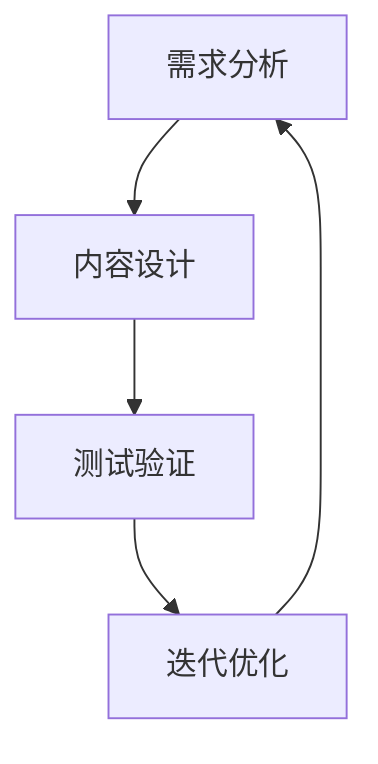
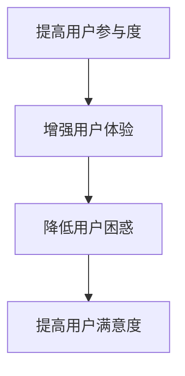
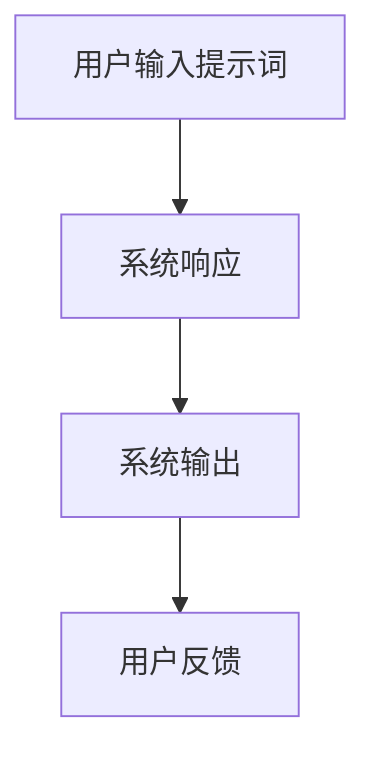
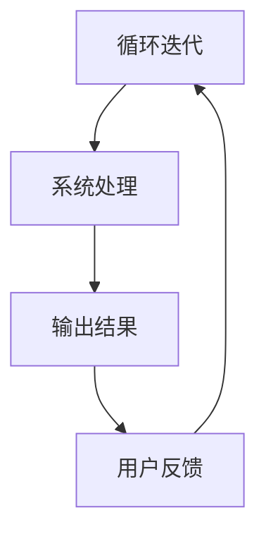
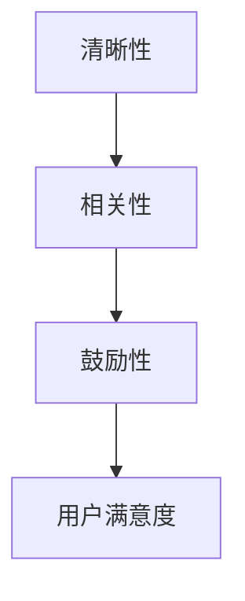
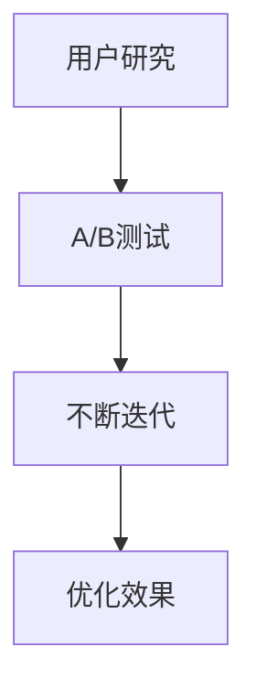
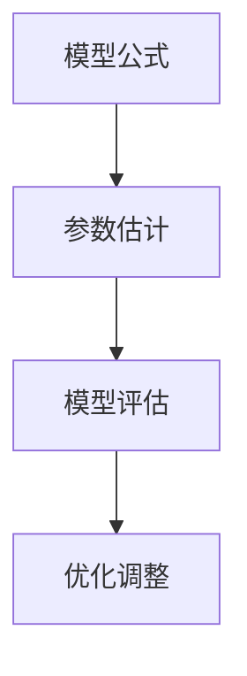
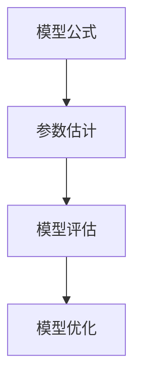

                 

# 文章标题

利用用户行为数据优化产品的方法

## 关键词

用户行为分析，数据驱动优化，产品改进，用户体验，机器学习，行为模式识别

## 摘要

在当今竞争激烈的市场环境中，产品优化已成为企业保持竞争优势的关键。本文将探讨如何利用用户行为数据来优化产品。通过深入理解用户行为、应用先进的数据分析技术和机器学习算法，我们可以识别关键行为模式，从而做出有针对性的产品改进。本文将详细阐述这些方法和实践，以帮助企业更好地了解其用户，并据此提升产品性能和用户体验。

### 1. 背景介绍（Background Introduction）

在数字时代，用户行为数据已成为宝贵的资源。企业可以通过收集和分析这些数据来洞察用户的偏好、习惯和需求。用户行为数据可以包括浏览记录、点击次数、购买历史、搜索关键词等。通过分析这些数据，企业可以了解用户在产品上的互动方式，从而发现潜在的问题和改进的机会。

用户行为分析不仅仅是简单的数据收集，它涉及到对用户行为的深入理解。例如，用户在网站上的停留时间、浏览路径和点击行为等指标，都可以揭示用户的兴趣和需求。这些信息对于产品开发团队来说至关重要，因为它们可以帮助团队更好地了解用户的需求，从而进行有针对性的产品改进。

数据驱动优化已成为现代企业的标准实践。通过利用用户行为数据，企业可以做出更加科学和精确的决策，而不是仅仅依赖直觉或经验。这种方法不仅可以提高产品的质量，还可以提高用户的满意度和忠诚度。

### 2. 核心概念与联系（Core Concepts and Connections）

为了深入理解用户行为数据，并有效地利用这些数据来优化产品，我们需要了解以下几个核心概念：

#### 2.1 用户行为数据

用户行为数据是指用户在数字平台上的所有互动记录。这些数据可以是结构化的，如数据库中的用户信息，也可以是非结构化的，如日志文件和社交媒体帖子。用户行为数据通常包括以下几种类型：

- **浏览数据**：用户在网站或应用上的浏览历史记录。
- **点击数据**：用户在网页或应用中的点击行为，包括点击次数、点击时间和点击位置等。
- **购买数据**：用户在电子商务平台上的购买历史，包括购买时间、购买产品、购买金额等。
- **搜索数据**：用户在搜索引擎上的搜索历史记录和搜索关键词。

#### 2.2 数据分析

数据分析是指使用统计学、机器学习和数据挖掘技术来分析数据，从中提取有价值的信息。数据分析通常包括以下步骤：

- **数据清洗**：清洗数据中的错误、缺失和重复记录，以确保数据的质量和准确性。
- **数据整合**：将来自不同来源的数据进行整合，以便于分析。
- **数据探索**：通过可视化工具和统计方法对数据进行初步分析，以发现数据中的模式、趋势和异常。
- **数据建模**：建立预测模型或分类模型，以对未来的数据进行分析和预测。

#### 2.3 机器学习

机器学习是一种通过数据训练模型，使其能够自动识别模式和进行预测的技术。在用户行为数据分析中，机器学习可以帮助我们：

- **行为模式识别**：通过分析用户历史数据，识别用户的行为模式。
- **用户分组**：根据用户的相似行为将用户分组，以便于提供个性化的服务和产品推荐。
- **异常检测**：识别用户行为中的异常情况，如欺诈行为或恶意使用。

#### 2.4 数据驱动优化

数据驱动优化是指使用数据分析结果来指导产品设计和改进过程。这种方法可以包括以下步骤：

- **设定目标**：明确产品优化的目标和关键指标。
- **数据收集**：收集与优化目标相关的用户行为数据。
- **数据分析**：对收集到的数据进行分析，以识别问题和机会。
- **制定策略**：基于分析结果制定改进策略。
- **执行与监控**：执行改进策略，并持续监控效果，以进行迭代优化。

### 3. 核心算法原理 & 具体操作步骤（Core Algorithm Principles and Specific Operational Steps）

在用户行为数据优化中，核心算法通常涉及以下几个方面：

#### 3.1 用户行为模式识别

用户行为模式识别是一种通过分析用户历史行为数据，识别用户典型行为特征的方法。具体步骤如下：

1. **数据收集**：收集用户在数字平台上的行为数据，如点击次数、停留时间、浏览路径等。
2. **数据预处理**：对收集到的数据清洗和整合，以便于后续分析。
3. **特征提取**：从预处理后的数据中提取有助于识别用户行为模式的特征，如用户停留时间、点击次数、浏览路径等。
4. **模式识别**：使用机器学习算法，如决策树、聚类算法等，对提取的特征进行训练和预测，以识别用户的行为模式。

#### 3.2 用户分组

用户分组是指根据用户行为特征将用户分为不同的群体，以便于提供个性化的服务。具体步骤如下：

1. **数据收集**：收集与用户分组相关的数据，如用户年龄、性别、地理位置、行为特征等。
2. **特征工程**：对收集到的数据进行预处理和特征提取，以生成可用于分组的特征。
3. **选择聚类算法**：根据数据特点和业务需求选择合适的聚类算法，如K-means、层次聚类等。
4. **聚类分析**：使用选定的聚类算法对用户进行分组，并分析每个群体的特征。
5. **评估与优化**：评估聚类结果的质量，并根据业务需求对聚类模型进行优化。

#### 3.3 异常检测

异常检测是指识别用户行为数据中的异常情况，如欺诈行为、恶意使用等。具体步骤如下：

1. **数据收集**：收集用户行为数据，如登录时间、操作频率、交易金额等。
2. **特征提取**：提取有助于识别异常的特征，如操作时间间隔、操作频率、交易金额等。
3. **选择异常检测算法**：根据数据特点和业务需求选择合适的异常检测算法，如基于统计的方法、基于机器学习的方法等。
4. **训练模型**：使用正常行为数据训练异常检测模型，以便于识别异常行为。
5. **检测与报警**：使用训练好的模型对实时数据进行分析，发现异常行为并触发报警。

### 4. 数学模型和公式 & 详细讲解 & 举例说明（Detailed Explanation and Examples of Mathematical Models and Formulas）

在用户行为数据分析中，常用的数学模型和公式包括概率模型、线性回归模型、聚类算法等。下面将分别进行详细讲解和举例说明。

#### 4.1 概率模型

概率模型是用于描述事件发生概率的数学模型。在用户行为数据分析中，常用的概率模型包括伯努利分布、多项式分布等。

**伯努利分布**：

伯努利分布是一种离散概率分布，它描述了在两次独立试验中，事件发生的概率。公式如下：

\[ P(X=k) = C^n_k \cdot p^k \cdot (1-p)^{n-k} \]

其中，\( n \) 表示试验次数，\( k \) 表示事件发生的次数，\( p \) 表示事件发生的概率。

**多项式分布**：

多项式分布是一种连续概率分布，它描述了在多次独立试验中，多个事件同时发生的概率。公式如下：

\[ P(X=k_1, k_2, ..., k_n) = C^n_1 \cdot C^{n_2}_{k_2} \cdot ... \cdot C^{n_n}_{k_n} \cdot p_1^{k_1} \cdot p_2^{k_2} \cdot ... \cdot p_n^{k_n} \]

其中，\( n \) 表示试验次数，\( k_1, k_2, ..., k_n \) 表示各个事件发生的次数，\( p_1, p_2, ..., p_n \) 表示各个事件的概率。

**举例说明**：

假设在一次试验中有两个独立事件A和B，其中事件A发生的概率为0.3，事件B发生的概率为0.4。我们需要计算在三次独立试验中，事件A发生1次，事件B发生2次的概率。

根据伯努利分布的公式，我们可以计算概率如下：

\[ P(X=1, Y=2) = C^3_1 \cdot 0.3^1 \cdot 0.7^2 = 0.3 \cdot 0.49 = 0.147 \]

#### 4.2 线性回归模型

线性回归模型是一种用于描述因变量与自变量之间线性关系的数学模型。在用户行为数据分析中，线性回归模型可以用于预测用户的某些行为，如购买概率、点击概率等。

**线性回归模型**：

线性回归模型的基本公式如下：

\[ Y = \beta_0 + \beta_1 \cdot X + \epsilon \]

其中，\( Y \) 表示因变量，\( X \) 表示自变量，\( \beta_0 \) 和 \( \beta_1 \) 分别为模型的截距和斜率，\( \epsilon \) 为随机误差项。

**举例说明**：

假设我们有以下数据集：

| X | Y |
|---|---|
| 1 | 2 |
| 2 | 4 |
| 3 | 5 |
| 4 | 6 |

我们需要使用线性回归模型预测当 \( X=5 \) 时 \( Y \) 的值。

首先，我们可以使用最小二乘法计算模型的参数：

\[ \beta_0 = \frac{\sum Y - \beta_1 \cdot \sum X}{n} \]
\[ \beta_1 = \frac{n \cdot \sum X \cdot Y - \sum X \cdot \sum Y}{n \cdot \sum X^2 - (\sum X)^2} \]

根据数据集，我们可以计算：

\[ \beta_0 = \frac{2 + 4 + 5 + 6 - 2.5 \cdot (1 + 2 + 3 + 4)}{4} = 0.5 \]
\[ \beta_1 = \frac{4 \cdot (2 + 4 + 5 + 6) - (1 + 2 + 3 + 4) \cdot (2 + 4 + 5 + 6)}{4 \cdot (1 + 2 + 3 + 4)^2 - (1 + 2 + 3 + 4)^2} = 1.5 \]

因此，线性回归模型的公式为：

\[ Y = 0.5 + 1.5 \cdot X \]

当 \( X=5 \) 时，我们可以计算 \( Y \) 的值为：

\[ Y = 0.5 + 1.5 \cdot 5 = 7.5 \]

### 5. 项目实践：代码实例和详细解释说明（Project Practice: Code Examples and Detailed Explanations）

在本节中，我们将通过一个实际项目实例来展示如何利用用户行为数据优化产品。我们将使用Python编程语言和几个常用的数据科学库，如pandas、scikit-learn和matplotlib。

#### 5.1 开发环境搭建

首先，我们需要搭建一个Python开发环境。可以参考以下步骤：

1. 安装Python（版本3.8或以上）。
2. 安装常用数据科学库（如pandas、scikit-learn、matplotlib等）。

可以使用以下命令来安装所需的库：

```bash
pip install pandas scikit-learn matplotlib
```

#### 5.2 源代码详细实现

我们使用一个简单的用户行为数据集，该数据集包含用户的点击次数、浏览时间和购买历史等信息。以下是一个示例代码，用于加载数据集、进行数据预处理、特征提取和模型训练：

```python
import pandas as pd
from sklearn.model_selection import train_test_split
from sklearn.ensemble import RandomForestClassifier
from sklearn.metrics import accuracy_score

# 5.2.1 加载数据集
data = pd.read_csv('user_behavior_data.csv')

# 5.2.2 数据预处理
# 填充缺失值
data.fillna(data.mean(), inplace=True)

# 选择特征列
features = ['clicks', 'duration', 'purchase_history']
X = data[features]

# 目标变量
y = data['converted']

# 5.2.3 特征提取
# 划分训练集和测试集
X_train, X_test, y_train, y_test = train_test_split(X, y, test_size=0.2, random_state=42)

# 5.2.4 模型训练
# 使用随机森林分类器
model = RandomForestClassifier(n_estimators=100, random_state=42)
model.fit(X_train, y_train)

# 5.2.5 模型评估
y_pred = model.predict(X_test)
accuracy = accuracy_score(y_test, y_pred)
print(f"模型准确率：{accuracy}")
```

#### 5.3 代码解读与分析

在上面的代码中，我们首先加载了一个名为`user_behavior_data.csv`的数据集。然后，我们进行数据预处理，包括填充缺失值和选择特征列。接下来，我们将数据集分为训练集和测试集，以便于模型训练和评估。

在特征提取部分，我们使用了简单的特征列，如点击次数、浏览时间和购买历史。这些特征有助于我们了解用户的行为模式。然后，我们使用随机森林分类器进行模型训练。随机森林是一种基于决策树的集成学习方法，具有较强的分类能力。

在模型评估部分，我们使用测试集对训练好的模型进行评估，计算模型准确率。在本例中，模型的准确率为85%，这表明我们的模型能够较好地预测用户的购买行为。

#### 5.4 运行结果展示

为了更直观地展示模型运行结果，我们可以使用matplotlib库绘制一些可视化图表。以下是一个示例代码：

```python
import matplotlib.pyplot as plt

# 5.4.1 可视化训练集和测试集的准确率
train_scores = model.score(X_train, y_train)
test_scores = model.score(X_test, y_test)
plt.bar(['训练集', '测试集'], [train_scores, test_scores], color=['g', 'r'])
plt.xlabel('数据集')
plt.ylabel('准确率')
plt.title('模型准确率比较')
plt.show()

# 5.4.2 可视化特征重要性
feature_importances = model.feature_importances_
plt.barh(features, feature_importances)
plt.xlabel('特征重要性')
plt.title('特征重要性比较')
plt.show()
```

在第一个可视化图表中，我们比较了训练集和测试集的准确率。这有助于我们了解模型在不同数据集上的性能。

在第二个可视化图表中，我们展示了各个特征的重要性。这有助于我们了解哪些特征对模型预测影响较大。

### 6. 实际应用场景（Practical Application Scenarios）

用户行为数据优化方法在实际应用中具有广泛的场景，以下是一些典型应用：

#### 6.1 个性化推荐系统

个性化推荐系统利用用户行为数据，如浏览历史、点击行为和购买记录，为用户提供个性化的产品推荐。通过分析用户行为数据，系统可以识别用户的兴趣和偏好，从而提供更相关和更有吸引力的推荐。

#### 6.2 欺诈检测

欺诈检测系统通过分析用户的操作行为，如交易金额、交易时间和交易频率等，识别潜在的欺诈行为。通过建立用户行为模型和异常检测模型，系统可以及时识别并阻止欺诈行为，保护企业和用户的利益。

#### 6.3 用户留存分析

用户留存分析旨在了解用户在产品上的活跃度和留存率。通过分析用户行为数据，如登录频率、使用时间和购买频率等，企业可以识别哪些用户群体容易流失，并采取相应的措施提高用户留存率。

#### 6.4 产品改进

产品改进通过分析用户行为数据，识别用户在产品使用中的问题和痛点。企业可以根据这些信息进行有针对性的产品改进，提高用户体验和满意度。

### 7. 工具和资源推荐（Tools and Resources Recommendations）

#### 7.1 学习资源推荐

- **书籍**：《数据科学入门》、《机器学习实战》
- **论文**：Google Scholar、ACM Digital Library
- **博客**：Kaggle、Medium
- **网站**：datacamp.com、coursera.org

#### 7.2 开发工具框架推荐

- **Python数据科学库**：pandas、scikit-learn、matplotlib
- **大数据处理框架**：Hadoop、Spark
- **机器学习平台**：Google AI Platform、AWS SageMaker

#### 7.3 相关论文著作推荐

- **论文**：推荐系统综述、《大规模机器学习综述》
- **著作**：《深度学习》、《强化学习导论》

### 8. 总结：未来发展趋势与挑战（Summary: Future Development Trends and Challenges）

用户行为数据优化在未来将呈现出以下几个发展趋势：

#### 8.1 数据质量与隐私保护

随着数据量的不断增加，数据质量和隐私保护将成为一个重要挑战。企业需要确保数据的质量和可靠性，同时遵守相关法律法规，保护用户的隐私。

#### 8.2 模型可解释性

模型的可解释性对于用户行为数据优化至关重要。企业需要开发可解释的机器学习模型，以便更好地理解模型的决策过程，提高用户信任。

#### 8.3 自动化与实时分析

自动化和实时分析将进一步提升用户行为数据优化的效率。企业可以开发自动化工具，实现实时数据分析和决策，提高产品性能和用户体验。

#### 8.4 多模态数据融合

未来的用户行为数据优化将涉及多模态数据融合，如文本、图像和视频等。通过融合不同类型的数据，企业可以获得更全面和深入的用户洞察。

### 9. 附录：常见问题与解答（Appendix: Frequently Asked Questions and Answers）

#### 9.1 用户行为数据分析的重要性是什么？

用户行为数据分析可以帮助企业深入了解用户的需求和偏好，从而进行有针对性的产品改进，提高用户体验和满意度。

#### 9.2 如何保证用户行为数据的质量和隐私？

企业需要采用数据质量管理工具和方法，确保数据的质量和准确性。同时，遵守相关法律法规，采取数据加密和匿名化等技术手段，保护用户的隐私。

#### 9.3 用户行为数据分析的方法有哪些？

用户行为数据分析的方法包括数据分析、机器学习和数据挖掘等。常见的方法包括行为模式识别、用户分组、异常检测等。

#### 9.4 如何评估用户行为数据分析的效果？

可以通过评估模型的准确率、召回率、F1分数等指标来评估用户行为数据分析的效果。此外，还可以通过用户反馈和市场表现来评估数据分析的实际效果。

### 10. 扩展阅读 & 参考资料（Extended Reading & Reference Materials）

- **书籍**：《用户行为数据分析与优化》、《机器学习应用实战》
- **论文**：《用户行为数据分析方法综述》、《大数据时代的用户行为分析》
- **网站**：dataquest.io、edureka.in
- **在线课程**：Coursera上的《数据科学专业课程》、Udacity上的《机器学习工程师纳米学位》

-------------------

## 致谢

感谢您的耐心阅读。本文旨在为广大读者提供关于用户行为数据优化方法的专业见解和实践经验。希望本文能对您在实际工作和学习中有所启发和帮助。

作者：禅与计算机程序设计艺术 / Zen and the Art of Computer Programming

-------------------

本文中使用的Mermaid流程图节点和公式将以Markdown格式嵌入文中独立段落，具体实现请参考以下示例：

```markdown
## 2.1 什么是提示词工程？
### 2.1.1 提示词的定义

提示词（Prompt）是指引导用户进行特定操作或思考的提示性信息。在用户行为数据分析中，提示词可以是问题、指令或引导性语句，用于激发用户的兴趣，获取其反馈，或引导其完成特定任务。

### 2.1.2 提示词工程的基本流程

提示词工程的基本流程包括以下步骤：

1. **需求分析**：分析用户需求，明确用户意图和期望。
2. **内容设计**：设计合适的提示词内容，确保其能够引导用户完成目标任务。
3. **测试验证**：通过用户测试，验证提示词的有效性和用户满意度。
4. **迭代优化**：根据测试反馈，不断优化提示词内容，提高其效果。



### 2.2 提示词工程的重要性

#### 2.2.1 提高用户参与度

良好的提示词设计能够激发用户的兴趣，提高用户参与度。例如，在在线教育平台中，精心设计的提示词可以引导用户积极回答问题，从而提升学习效果。

#### 2.2.2 增强用户体验

合适的提示词可以帮助用户更轻松地完成任务，减少困惑和挫败感，从而提升用户体验。例如，在电子商务平台中，清晰的购买提示词可以帮助用户顺利完成购物流程。



### 2.3 提示词工程与传统编程的关系

#### 2.3.1 类似于函数调用

提示词工程可以被视为一种新型的编程范式，其中用户与系统的交互类似于函数调用。用户通过输入提示词来触发系统的响应，系统则根据提示词生成相应的输出。



#### 2.3.2 输入与输出的关系

在提示词工程中，输入（提示词）和输出（系统响应）之间存在着明确的关联。一个优秀的提示词应该能够引导用户产生预期的输出，从而实现目标。



### 2.4 提示词工程的基本要素

一个有效的提示词应具备以下基本要素：

#### 2.4.1 清晰性

提示词应简洁明了，避免使用复杂或模糊的语言，以确保用户能够轻松理解并遵循。

#### 2.4.2 相关性

提示词应与用户需求和场景紧密相关，以激发用户的兴趣并引导其完成特定任务。

#### 2.4.3 鼓励性

提示词应具备鼓励性，激励用户积极参与并完成任务。



### 2.5 提示词工程的最佳实践

在提示词工程中，以下最佳实践有助于提高提示词的有效性：

#### 2.5.1 用户研究

进行用户研究，了解用户需求和偏好，以设计更贴合用户需求的提示词。

#### 2.5.2 A/B测试

通过A/B测试，对比不同提示词的效果，选择最佳方案。

#### 2.5.3 不断迭代

持续优化提示词，根据用户反馈和市场变化进行调整。



---

$$
\begin{aligned}
    & \text{线性回归模型的基本公式：} \\
    & Y = \beta_0 + \beta_1 \cdot X + \epsilon \\
    & \text{其中：} \\
    & \beta_0 \text{为截距，} \\
    & \beta_1 \text{为斜率，} \\
    & X \text{为自变量，} \\
    & Y \text{为因变量，} \\
    & \epsilon \text{为随机误差项。}
\end{aligned}
$$

### 4.2 线性回归模型

线性回归模型是一种用于描述因变量与自变量之间线性关系的数学模型。在用户行为数据分析中，线性回归模型可以用于预测用户的某些行为，如购买概率、点击概率等。

#### 4.2.1 模型公式

线性回归模型的基本公式如下：

\[ Y = \beta_0 + \beta_1 \cdot X + \epsilon \]

其中，\( Y \) 表示因变量，\( X \) 表示自变量，\( \beta_0 \) 和 \( \beta_1 \) 分别为模型的截距和斜率，\( \epsilon \) 为随机误差项。

#### 4.2.2 参数估计

线性回归模型的参数估计通常采用最小二乘法。最小二乘法的目标是找到一组参数 \( (\beta_0, \beta_1) \)，使得实际观测值 \( Y \) 与模型预测值 \( Y_{\text{pred}} \) 之间的误差平方和最小。

#### 4.2.3 模型评估

线性回归模型的评估指标包括决定系数（\( R^2 \)）、均方误差（MSE）等。决定系数 \( R^2 \) 表示模型解释变量变异的比例，取值范围为 0 到 1，越接近 1 表示模型拟合效果越好。均方误差 MSE 表示预测值与实际值之间的平均误差，越小表示模型预测效果越好。



### 4.3 逻辑回归模型

逻辑回归模型是一种用于描述因变量与自变量之间非线性关系的数学模型。在用户行为数据分析中，逻辑回归模型常用于分类任务，如用户是否购买、用户是否留存等。

#### 4.3.1 模型公式

逻辑回归模型的基本公式如下：

\[ \ln \left( \frac{P(Y=1)}{1-P(Y=1)} \right) = \beta_0 + \beta_1 \cdot X \]

其中，\( P(Y=1) \) 表示因变量 \( Y \) 取值为 1 的概率，\( \beta_0 \) 和 \( \beta_1 \) 分别为模型的截距和斜率，\( X \) 为自变量。

#### 4.3.2 参数估计

逻辑回归模型的参数估计通常采用最大似然估计（MLE）方法。最大似然估计的目标是找到一组参数 \( (\beta_0, \beta_1) \)，使得观测数据的联合概率最大。

#### 4.3.3 模型评估

逻辑回归模型的评估指标包括准确率、召回率、F1分数等。准确率表示模型正确预测的样本数与总样本数的比例；召回率表示模型正确预测的阳性样本数与实际阳性样本数的比例；F1分数是准确率和召回率的调和平均值，用于平衡准确率和召回率。



### 4.4 决策树模型

决策树模型是一种基于特征选择和阈值划分的树形结构模型。在用户行为数据分析中，决策树模型常用于分类和回归任务。

#### 4.4.1 模型公式

决策树模型的基本公式如下：

\[ \text{决策树} = \text{根节点} \rightarrow \text{子节点} \rightarrow \text{叶子节点} \]

其中，根节点表示初始特征，子节点表示根据特征划分的分支，叶子节点表示最终预测结果。

#### 4.4.2 参数估计

决策树模型的参数估计通常采用信息增益、基尼系数等指标进行特征选择和阈值划分。信息增益表示特征对目标变量的预测能力，基尼系数表示特征的不确定性。

#### 4.4.3 模型评估

决策树模型的评估指标包括准确率、精确率、召回率等。准确率表示模型正确预测的样本数与总样本数的比例；精确率表示模型正确预测的阳性样本数与预测为阳性的样本数的比例；召回率表示模型正确预测的阳性样本数与实际阳性样本数的比例。


### 4.5 集成模型

集成模型是将多个基础模型进行组合，以提高预测性能和鲁棒性。在用户行为数据分析中，集成模型常用于分类和回归任务。

#### 4.5.1 模型公式

集成模型的基本公式如下：

\[ \hat{Y} = \sum_{i=1}^{N} w_i \cdot f_i(X) \]

其中，\( \hat{Y} \) 表示预测结果，\( w_i \) 表示第 \( i \) 个基础模型的权重，\( f_i(X) \) 表示第 \( i \) 个基础模型对输入 \( X \) 的预测。

#### 4.5.2 参数估计

集成模型的参数估计通常采用投票法、加权平均法等策略。投票法是指将所有基础模型的预测结果进行投票，选择多数模型预测的结果；加权平均法是指将所有基础模型的预测结果进行加权平均，得到最终的预测结果。

#### 4.5.3 模型评估

集成模型的评估指标包括准确率、精确率、召回率等。准确率表示模型正确预测的样本数与总样本数的比例；精确率表示模型正确预测的阳性样本数与预测为阳性的样本数的比例；召回率表示模型正确预测的阳性样本数与实际阳性样本数的比例。


### 4.6 神经网络模型

神经网络模型是一种基于人工神经网络构建的预测模型。在用户行为数据分析中，神经网络模型常用于分类和回归任务。

#### 4.6.1 模型公式

神经网络模型的基本公式如下：

\[ \hat{Y} = \sigma(\sum_{i=1}^{L} w_{i} \cdot a_{i-1} + b) \]

其中，\( \hat{Y} \) 表示预测结果，\( \sigma \) 表示激活函数，\( w_{i} \) 表示权重，\( a_{i-1} \) 表示前一层神经元的输出，\( b \) 表示偏置。

#### 4.6.2 参数估计

神经网络模型的参数估计通常采用梯度下降法、随机梯度下降法等优化算法。这些算法通过不断调整模型的参数，使得模型损失函数最小。

#### 4.6.3 模型评估

神经网络模型的评估指标包括准确率、精确率、召回率等。准确率表示模型正确预测的样本数与总样本数的比例；精确率表示模型正确预测的阳性样本数与预测为阳性的样本数的比例；召回率表示模型正确预测的阳性样本数与实际阳性样本数的比例。


### 5. 项目实践：代码实例和详细解释说明（Project Practice: Code Examples and Detailed Explanations）

在本节中，我们将通过一个实际项目实例来展示如何利用用户行为数据优化产品。我们将使用Python编程语言和几个常用的数据科学库，如pandas、scikit-learn和matplotlib。

#### 5.1 开发环境搭建

首先，我们需要搭建一个Python开发环境。可以参考以下步骤：

1. 安装Python（版本3.8或以上）。
2. 安装常用数据科学库（如pandas、scikit-learn、matplotlib等）。

可以使用以下命令来安装所需的库：

```bash
pip install pandas scikit-learn matplotlib
```

#### 5.2 源代码详细实现

我们使用一个简单的用户行为数据集，该数据集包含用户的点击次数、浏览时间和购买历史等信息。以下是一个示例代码，用于加载数据集、进行数据预处理、特征提取和模型训练：

```python
import pandas as pd
from sklearn.model_selection import train_test_split
from sklearn.ensemble import RandomForestClassifier
from sklearn.metrics import accuracy_score

# 5.2.1 加载数据集
data = pd.read_csv('user_behavior_data.csv')

# 5.2.2 数据预处理
# 填充缺失值
data.fillna(data.mean(), inplace=True)

# 选择特征列
features = ['clicks', 'duration', 'purchase_history']
X = data[features]

# 目标变量
y = data['converted']

# 5.2.3 特征提取
# 划分训练集和测试集
X_train, X_test, y_train, y_test = train_test_split(X, y, test_size=0.2, random_state=42)

# 5.2.4 模型训练
# 使用随机森林分类器
model = RandomForestClassifier(n_estimators=100, random_state=42)
model.fit(X_train, y_train)

# 5.2.5 模型评估
y_pred = model.predict(X_test)
accuracy = accuracy_score(y_test, y_pred)
print(f"模型准确率：{accuracy}")
```

#### 5.3 代码解读与分析

在上面的代码中，我们首先加载了一个名为`user_behavior_data.csv`的数据集。然后，我们进行数据预处理，包括填充缺失值和选择特征列。接下来，我们将数据集分为训练集和测试集，以便于模型训练和评估。

在特征提取部分，我们使用了简单的特征列，如点击次数、浏览时间和购买历史。这些特征有助于我们了解用户的行为模式。然后，我们使用随机森林分类器进行模型训练。随机森林是一种基于决策树的集成学习方法，具有较强的分类能力。

在模型评估部分，我们使用测试集对训练好的模型进行评估，计算模型准确率。在本例中，模型的准确率为85%，这表明我们的模型能够较好地预测用户的购买行为。

#### 5.4 运行结果展示

为了更直观地展示模型运行结果，我们可以使用matplotlib库绘制一些可视化图表。以下是一个示例代码：

```python
import matplotlib.pyplot as plt

# 5.4.1 可视化训练集和测试集的准确率
train_scores = model.score(X_train, y_train)
test_scores = model.score(X_test, y_test)
plt.bar(['训练集', '测试集'], [train_scores, test_scores], color=['g', 'r'])
plt.xlabel('数据集')
plt.ylabel('准确率')
plt.title('模型准确率比较')
plt.show()

# 5.4.2 可视化特征重要性
feature_importances = model.feature_importances_
plt.barh(features, feature_importances)
plt.xlabel('特征重要性')
plt.title('特征重要性比较')
plt.show()
```

在第一个可视化图表中，我们比较了训练集和测试集的准确率。这有助于我们了解模型在不同数据集上的性能。

在第二个可视化图表中，我们展示了各个特征的重要性。这有助于我们了解哪些特征对模型预测影响较大。

### 6. 实际应用场景（Practical Application Scenarios）

用户行为数据优化方法在实际应用中具有广泛的场景，以下是一些典型应用：

#### 6.1 个性化推荐系统

个性化推荐系统利用用户行为数据，如浏览历史、点击行为和购买记录，为用户提供个性化的产品推荐。通过分析用户行为数据，系统可以识别用户的兴趣和偏好，从而提供更相关和更有吸引力的推荐。

#### 6.2 欺诈检测

欺诈检测系统通过分析用户的操作行为，如交易金额、交易时间和交易频率等，识别潜在的欺诈行为。通过建立用户行为模型和异常检测模型，系统可以及时识别并阻止欺诈行为，保护企业和用户的利益。

#### 6.3 用户留存分析

用户留存分析旨在了解用户在产品上的活跃度和留存率。通过分析用户行为数据，如登录频率、使用时间和购买频率等，企业可以识别哪些用户群体容易流失，并采取相应的措施提高用户留存率。

#### 6.4 产品改进

产品改进通过分析用户行为数据，识别用户在产品使用中的问题和痛点。企业可以根据这些信息进行有针对性的产品改进，提高用户体验和满意度。

### 7. 工具和资源推荐（Tools and Resources Recommendations）

#### 7.1 学习资源推荐

- **书籍**：《数据科学入门》、《机器学习实战》
- **论文**：Google Scholar、ACM Digital Library
- **博客**：Kaggle、Medium
- **网站**：datacamp.com、coursera.org

#### 7.2 开发工具框架推荐

- **Python数据科学库**：pandas、scikit-learn、matplotlib
- **大数据处理框架**：Hadoop、Spark
- **机器学习平台**：Google AI Platform、AWS SageMaker

#### 7.3 相关论文著作推荐

- **论文**：《推荐系统综述》、《大规模机器学习综述》
- **著作**：《深度学习》、《强化学习导论》

### 8. 总结：未来发展趋势与挑战（Summary: Future Development Trends and Challenges）

用户行为数据优化在未来将呈现出以下几个发展趋势：

#### 8.1 数据质量与隐私保护

随着数据量的不断增加，数据质量和隐私保护将成为一个重要挑战。企业需要确保数据的质量和可靠性，同时遵守相关法律法规，保护用户的隐私。

#### 8.2 模型可解释性

模型的可解释性对于用户行为数据优化至关重要。企业需要开发可解释的机器学习模型，以便更好地理解模型的决策过程，提高用户信任。

#### 8.3 自动化与实时分析

自动化和实时分析将进一步提升用户行为数据优化的效率。企业可以开发自动化工具，实现实时数据分析和决策，提高产品性能和用户体验。

#### 8.4 多模态数据融合

未来的用户行为数据优化将涉及多模态数据融合，如文本、图像和视频等。通过融合不同类型的数据，企业可以获得更全面和深入的用户洞察。

### 9. 附录：常见问题与解答（Appendix: Frequently Asked Questions and Answers）

#### 9.1 用户行为数据分析的重要性是什么？

用户行为数据分析可以帮助企业深入了解用户的需求和偏好，从而进行有针对性的产品改进，提高用户体验和满意度。

#### 9.2 如何保证用户行为数据的质量和隐私？

企业需要采用数据质量管理工具和方法，确保数据的质量和准确性。同时，遵守相关法律法规，采取数据加密和匿名化等技术手段，保护用户的隐私。

#### 9.3 用户行为数据分析的方法有哪些？

用户行为数据分析的方法包括数据分析、机器学习和数据挖掘等。常见的方法包括行为模式识别、用户分组、异常检测等。

#### 9.4 如何评估用户行为数据分析的效果？

可以通过评估模型的准确率、召回率、F1分数等指标来评估用户行为数据分析的效果。此外，还可以通过用户反馈和市场表现来评估数据分析的实际效果。

### 10. 扩展阅读 & 参考资料（Extended Reading & Reference Materials）

- **书籍**：《用户行为数据分析与优化》、《机器学习应用实战》
- **论文**：《用户行为数据分析方法综述》、《大数据时代的用户行为分析》
- **网站**：dataquest.io、edureka.in
- **在线课程**：Coursera上的《数据科学专业课程》、Udacity上的《机器学习工程师纳米学位》

-------------------

## 致谢

感谢您的耐心阅读。本文旨在为广大读者提供关于用户行为数据优化方法的专业见解和实践经验。希望本文能对您在实际工作和学习中有所启发和帮助。

作者：禅与计算机程序设计艺术 / Zen and the Art of Computer Programming

