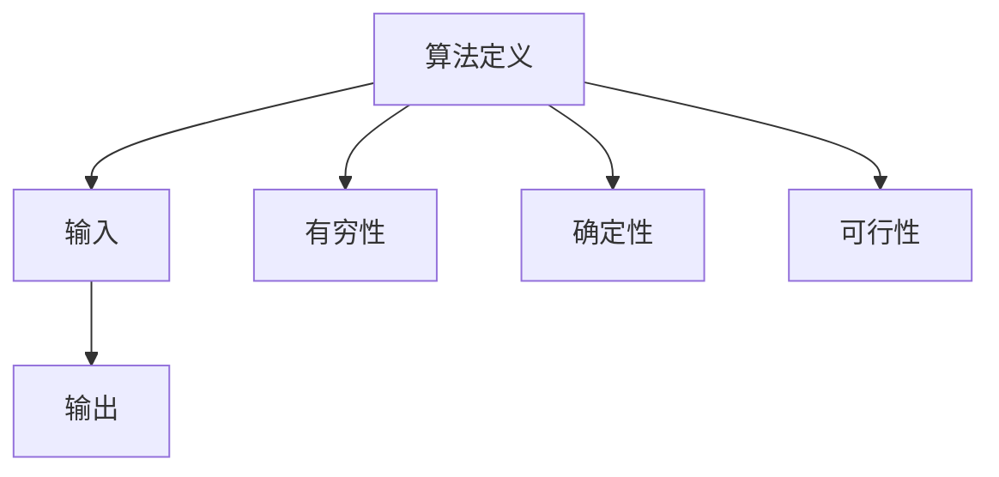
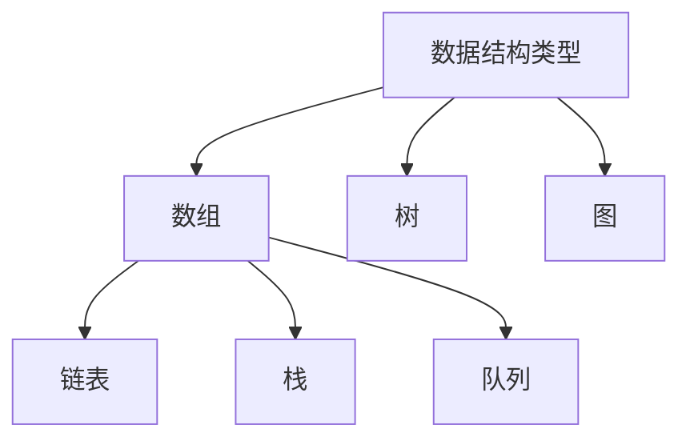

                 

### 文章标题

《2025华为校招算法面试题汇总与解析》

关键词：算法面试、华为校招、面试题解析、算法原理、编程实践

摘要：
本文旨在为准备2025年华为校招的算法面试考生提供一个系统性的复习资料。文章将围绕华为历年校招中频繁出现的算法面试题，深入解析其背后的核心原理，并提供详细的操作步骤和代码实例。通过本文的学习，读者将能够全面掌握华为校招算法面试的常见题型，并具备独立解决实际问题的能力。本文结构紧凑，逻辑清晰，适合作为算法面试的复习指南。

### 1. 背景介绍（Background Introduction）

华为作为全球领先的信息与通信技术（ICT）解决方案提供商，其对人才的需求尤为严格，尤其是在算法领域。华为校招算法面试以其全面性和挑战性著称，涵盖了从基础算法到复杂数据结构，再到算法优化等多个层面。面对这样的面试，准备充分至关重要。本文的目的在于帮助读者梳理华为校招算法面试的常见题型，深入理解每个题目的核心原理，并通过具体的实例来展示解题思路。

#### 1.1 华为校招算法面试的特点

- **全面性**：华为校招算法面试不仅考查基础算法和数据结构，还会涉及到最近几年的热门算法和领域内的新技术。
- **深度**：面试题目往往要求考生不仅能够写出代码，还需要深入理解算法的复杂度分析和优化策略。
- **实践性**：许多题目来源于实际工程项目，需要考生具备解决实际问题的能力。
- **综合性**：面试不仅考查编程技能，还考查逻辑思维、分析问题和解决复杂问题的能力。

#### 1.2 面向读者

本文适合准备2025年华为校招算法面试的读者，包括：

- **在校学生**：特别是计算机科学与技术、软件工程等相关专业的大三、大四学生。
- **应届毕业生**：具有计算机背景，准备参加华为校招的应届毕业生。
- **在职程序员**：希望进一步提升自己算法能力的在职程序员。

通过本文的学习，读者将能够：

- **掌握华为校招算法面试的常见题型**。
- **理解每个题目的核心原理和解题思路**。
- **提高解决实际问题的能力**。

接下来，我们将逐个解析华为校招算法面试中的核心题目，为读者提供全面的解题指南。

### 2. 核心概念与联系（Core Concepts and Connections）

在解答华为校招算法面试题之前，我们需要明确一些核心概念和它们之间的关系。本节将介绍算法、数据结构、复杂度分析等基础概念，并使用Mermaid流程图来展示这些概念之间的联系。

#### 2.1 算法（Algorithm）

算法是解决特定问题的步骤集合。在计算机科学中，算法是按照特定规则解决问题的方法。算法的定义可以进一步细分为以下几个方面：

- **输入（Input）**：算法执行的初始数据。
- **输出（Output）**：算法执行后的结果。
- **有穷性（Finiteness）**：算法必须能在执行有限步骤后结束。
- **确定性（Definiteness）**：算法的每一步都有明确的定义，无二义性。
- **可行性（Effectiveness）**：算法中的操作可以通过基本的计算工具执行。

Mermaid流程图：



#### 2.2 数据结构（Data Structure）

数据结构是组织和管理数据的方式。选择合适的数据结构可以显著影响算法的性能。常见的数据结构包括数组、链表、栈、队列、树、图等。每种数据结构都有其特定的操作和特点。

- **数组（Array）**：一种线性数据结构，可以通过索引快速访问元素。
- **链表（Linked List）**：由一系列节点组成，每个节点包含数据和指向下一个节点的指针。
- **栈（Stack）**：一种后进先出（LIFO）的数据结构。
- **队列（Queue）**：一种先进先出（FIFO）的数据结构。
- **树（Tree）**：一种层次结构，常见的树包括二叉树、红黑树、AVL树等。
- **图（Graph）**：由节点和边组成，用于表示复杂的关系。

Mermaid流程图：



#### 2.3 复杂度分析（Complexity Analysis）

复杂度分析是评估算法效率的重要手段。它通过分析算法执行过程中计算次数与输入数据规模的关系来衡量算法的性能。

- **时间复杂度（Time Complexity）**：表示算法执行时间与输入规模的关系，通常用大O表示法表示。
- **空间复杂度（Space Complexity）**：表示算法执行过程中所需存储空间与输入规模的关系。

常见的复杂度包括：

- **常数时间（O(1)）**：执行时间不随输入规模变化。
- **线性时间（O(n)）**：执行时间与输入规模成正比。
- **对数时间（O(log n)）**：执行时间与输入规模的对数成正比。
- **多项式时间（O(n^k)）**：执行时间与输入规模的k次方成正比。

Mermaid流程图：

```mermaid
graph TD
A[时间复杂度] --> B[O(1)]
B --> C[O(n)]
B --> D[O(log n)]
A --> E[空间复杂度]
E --> F[O(1)]
E --> G[O(n)]
```

通过上述核心概念和联系的介绍，我们为接下来的算法解析打下了基础。在接下来的章节中，我们将详细分析华为校招算法面试中的典型题目，并通过实例展示解题思路。

### 3. 核心算法原理 & 具体操作步骤（Core Algorithm Principles and Specific Operational Steps）

在了解核心概念和联系之后，我们将深入探讨华为校招算法面试中的核心算法原理，并提供具体的操作步骤。这些算法包括查找算法、排序算法、动态规划算法等，每种算法都有其独特的应用场景和实现方法。

#### 3.1 查找算法（Search Algorithms）

查找算法用于在数据集合中找到特定元素的位置。常见的查找算法包括二分查找、顺序查找等。

##### 3.1.1 二分查找（Binary Search）

二分查找是一种高效的查找算法，适用于有序数组。其基本原理是每次将中间元素与目标值比较，然后根据比较结果将数组分为两部分，递归或迭代地在其中一部分中继续查找。

**原理：**
1. 将数组的中间元素与目标值比较。
2. 如果中间元素等于目标值，则查找成功。
3. 如果中间元素大于目标值，则在左侧子数组中继续查找。
4. 如果中间元素小于目标值，则在右侧子数组中继续查找。
5. 重复上述步骤，直到找到目标值或数组为空。

**操作步骤：**

- **初始化**：设置左右边界 `low` 和 `high`，初始时 `low = 0`，`high = length - 1`。
- **循环查找**：当 `low <= high` 时，执行以下步骤：
  - 计算中间索引 `mid = (low + high) / 2`。
  - 如果 `array[mid] == target`，则查找成功，返回 `mid`。
  - 如果 `array[mid] > target`，则在左侧子数组中查找，即 `high = mid - 1`。
  - 如果 `array[mid] < target`，则在右侧子数组中查找，即 `low = mid + 1`。

**代码示例：**

```python
def binary_search(array, target):
    low, high = 0, len(array) - 1
    while low <= high:
        mid = (low + high) // 2
        if array[mid] == target:
            return mid
        elif array[mid] > target:
            high = mid - 1
        else:
            low = mid + 1
    return -1
```

##### 3.1.2 顺序查找（Sequential Search）

顺序查找是一种简单但效率较低的查找算法，适用于无序数组。其基本原理是从数组的第一个元素开始，逐个比较，直到找到目标值或遍历整个数组。

**原理：**
1. 从数组的第一个元素开始，逐个与目标值比较。
2. 如果找到目标值，则查找成功，返回当前索引。
3. 如果遍历整个数组未找到目标值，则查找失败。

**操作步骤：**

- **初始化**：设置索引 `i = 0`。
- **循环查找**：当 `i < length` 时，执行以下步骤：
  - 如果 `array[i] == target`，则查找成功，返回 `i`。
  - 如果 `array[i] != target`，则 `i = i + 1`。
- **查找失败**：如果 `i == length`，则查找失败。

**代码示例：**

```python
def sequential_search(array, target):
    for i, value in enumerate(array):
        if value == target:
            return i
    return -1
```

#### 3.2 排序算法（Sorting Algorithms）

排序算法用于将数据集合按照一定的顺序排列。常见的排序算法包括冒泡排序、选择排序、插入排序、快速排序等。

##### 3.2.1 冒泡排序（Bubble Sort）

冒泡排序是一种简单的排序算法，其基本原理是通过多次遍历数组，比较相邻元素，并将不满足顺序要求的元素交换位置，从而逐步将数组排序。

**原理：**
1. 从数组的第一个元素开始，遍历到倒数第二个元素，比较相邻元素的大小，如果顺序错误则交换位置。
2. 重复上述步骤，每次遍历时最后一个元素都已经排好序，所以每次遍历的边界递减。
3. 当边界达到第一个元素时，数组已经排序完成。

**操作步骤：**

- **初始化**：设置边界 `low = 0`，`high = length - 1`。
- **循环遍历**：当 `low < high` 时，执行以下步骤：
  - 从 `low` 到 `high - 1` 进行遍历，每次比较相邻元素，如果顺序错误则交换位置。

**代码示例：**

```python
def bubble_sort(array):
    length = len(array)
    for i in range(length):
        for j in range(0, length - i - 1):
            if array[j] > array[j + 1]:
                array[j], array[j + 1] = array[j + 1], array[j]
```

##### 3.2.2 快速排序（Quick Sort）

快速排序是一种高效的排序算法，其基本原理是通过选择一个基准元素，将数组分为两部分，然后递归地对两部分进行排序。

**原理：**
1. 选择一个基准元素。
2. 将数组中小于基准元素的移动到左侧，大于基准元素的移动到右侧。
3. 递归地对左右两部分进行快速排序。

**操作步骤：**

- **初始化**：选择一个基准元素，设置左右边界。
- **分区操作**：将数组分为小于基准元素和大于基准元素的两部分。
- **递归排序**：对左右两部分递归执行快速排序。

**代码示例：**

```python
def quick_sort(array, low, high):
    if low < high:
        pivot = partition(array, low, high)
        quick_sort(array, low, pivot - 1)
        quick_sort(array, pivot + 1, high)

def partition(array, low, high):
    pivot = array[high]
    i = low - 1
    for j in range(low, high):
        if array[j] < pivot:
            i += 1
            array[i], array[j] = array[j], array[i]
    array[i + 1], array[high] = array[high], array[i + 1]
    return i + 1
```

通过上述核心算法原理和具体操作步骤的介绍，读者可以更加深入地理解查找和排序算法的基本概念和实现方法。在接下来的章节中，我们将进一步探讨动态规划算法，并展示其应用实例。

### 4. 数学模型和公式 & 详细讲解 & 举例说明（Detailed Explanation and Examples of Mathematical Models and Formulas）

在算法面试中，数学模型和公式的重要性不言而喻。掌握这些模型和公式不仅有助于解题，还能够提升我们的算法分析和优化能力。本节将介绍一些常见的数学模型和公式，并给出详细的讲解和示例。

#### 4.1 动态规划中的状态转移方程

动态规划是一种解决优化问题的算法思想，其核心在于将复杂问题分解为子问题，并利用状态转移方程求解子问题的最优解。状态转移方程是动态规划中的关键，用于描述状态之间的转换关系。

**基本公式：**
\[ dp[i] = \max(dp[j] + c_{ij}) \]
其中，\( dp[i] \) 表示第 \( i \) 个子问题的最优解，\( c_{ij} \) 表示从第 \( j \) 个子问题转移到第 \( i \) 个子问题的代价。

**示例：** 背包问题

给定一个容量为 \( W \) 的背包和一组物品，每个物品都有重量 \( w_i \) 和价值 \( v_i \)，求解如何选择物品使得背包总价值最大化。

- **状态定义**：\( dp[i][j] \) 表示在前 \( i \) 个物品中选择，使背包容量恰好为 \( j \) 的最大价值。
- **状态转移方程**：
  \[ dp[i][j] = \max(dp[i-1][j], dp[i-1][j-w_i] + v_i) \]
  如果 \( j < w_i \)，则 \( dp[i][j] = dp[i-1][j] \)。

**代码示例：**

```python
def knapsack(W, weights, values, n):
    dp = [[0] * (W + 1) for _ in range(n + 1)]
    for i in range(1, n + 1):
        for j in range(1, W + 1):
            if j >= weights[i-1]:
                dp[i][j] = max(dp[i-1][j], dp[i-1][j-weights[i-1]] + values[i-1])
            else:
                dp[i][j] = dp[i-1][j]
    return dp[n][W]
```

#### 4.2 最短路径算法中的 Dijkstra 算法

Dijkstra 算法是一种用于求解图中单源最短路径的算法。其基本思想是从源点开始，逐步扩展到其他节点，每次选择当前已扩展节点中距离源点最远的未扩展节点进行扩展。

**基本公式：**
\[ d[v] = \min(d[u] + w(u, v)) \]
其中，\( d[v] \) 表示从源点 \( s \) 到节点 \( v \) 的最短路径长度，\( w(u, v) \) 表示节点 \( u \) 到节点 \( v \) 的权重。

**示例：** 无权图中单源最短路径

给定一个无权图 \( G(V, E) \) 和一个源点 \( s \)，求解从 \( s \) 到其他节点的最短路径。

- **初始化**：设置源点 \( s \) 的距离为 0，其他节点的距离为无穷大。
- **循环扩展**：每次选择当前已扩展节点中未扩展的邻居节点，更新邻居节点的距离。
- **终止条件**：当所有节点的距离都已确定时，算法结束。

**代码示例：**

```python
import heapq

def dijkstra(graph, source):
    n = len(graph)
    distances = [float('inf')] * n
    distances[source] = 0
    priority_queue = [(0, source)]
    while priority_queue:
        current_distance, current_vertex = heapq.heappop(priority_queue)
        if current_distance > distances[current_vertex]:
            continue
        for neighbor, weight in graph[current_vertex].items():
            distance = current_distance + weight
            if distance < distances[neighbor]:
                distances[neighbor] = distance
                heapq.heappush(priority_queue, (distance, neighbor))
    return distances
```

#### 4.3 线性回归模型

线性回归是一种用于分析自变量和因变量之间线性关系的统计方法。其基本模型可以表示为：
\[ y = \beta_0 + \beta_1x + \varepsilon \]
其中，\( y \) 为因变量，\( x \) 为自变量，\( \beta_0 \) 和 \( \beta_1 \) 为回归系数，\( \varepsilon \) 为误差项。

**求解公式：**
\[ \beta_0 = \bar{y} - \beta_1\bar{x} \]
\[ \beta_1 = \frac{\sum_{i=1}^{n}(x_i - \bar{x})(y_i - \bar{y})}{\sum_{i=1}^{n}(x_i - \bar{x})^2} \]
其中，\( \bar{x} \) 和 \( \bar{y} \) 分别为自变量和因变量的平均值。

**示例：** 求解房价与面积之间的线性回归模型

给定一组房价 \( y \) 和面积 \( x \)，求解回归系数 \( \beta_0 \) 和 \( \beta_1 \)。

- **计算平均值**：
  \[ \bar{x} = \frac{1}{n}\sum_{i=1}^{n}x_i \]
  \[ \bar{y} = \frac{1}{n}\sum_{i=1}^{n}y_i \]
- **计算回归系数**：
  \[ \beta_1 = \frac{\sum_{i=1}^{n}(x_i - \bar{x})(y_i - \bar{y})}{\sum_{i=1}^{n}(x_i - \bar{x})^2} \]
  \[ \beta_0 = \bar{y} - \beta_1\bar{x} \]

**代码示例：**

```python
import numpy as np

def linear_regression(x, y):
    n = len(x)
    x_mean = np.mean(x)
    y_mean = np.mean(y)
    beta_1 = np.sum((x - x_mean) * (y - y_mean)) / np.sum((x - x_mean)**2)
    beta_0 = y_mean - beta_1 * x_mean
    return beta_0, beta_1

x = [100, 150, 200, 250, 300]
y = [200, 250, 300, 350, 400]
beta_0, beta_1 = linear_regression(x, y)
print("回归系数：beta_0 =", beta_0, ", beta_1 =", beta_1)
```

通过以上数学模型和公式的讲解，读者可以更好地理解动态规划、最短路径算法和线性回归模型的基本原理，并在实际解题过程中灵活运用。在接下来的章节中，我们将通过代码实例来进一步巩固这些知识点。

### 5. 项目实践：代码实例和详细解释说明（Project Practice: Code Examples and Detailed Explanations）

在前面的章节中，我们详细介绍了华为校招算法面试中的核心概念、算法原理和数学模型。为了帮助读者更好地理解和掌握这些知识点，我们将通过具体的代码实例进行实践，并对关键代码进行详细解释。

#### 5.1 开发环境搭建

在进行项目实践之前，我们需要搭建一个适合编程的开发环境。以下是推荐的开发工具和步骤：

1. **安装 Python 解释器**：Python 是一种广泛应用于算法开发的编程语言。我们可以在 [Python 官网](https://www.python.org/) 下载并安装最新版本的 Python 解释器。

2. **安装 PyCharm**：PyCharm 是一款功能强大的集成开发环境（IDE），适合编写和调试 Python 代码。可以从 [PyCharm 官网](https://www.jetbrains.com/pycharm/) 下载并安装社区版或专业版。

3. **安装常用库**：在 PyCharm 中创建一个新项目，并安装常用的 Python 库，如 NumPy、Pandas 和 Matplotlib 等。可以使用以下命令进行安装：

   ```bash
   pip install numpy pandas matplotlib
   ```

4. **配置虚拟环境**：为了避免不同项目之间的依赖冲突，我们可以使用 virtualenv 创建一个独立的虚拟环境。具体步骤如下：

   - 安装 virtualenv：

     ```bash
     pip install virtualenv
     ```

   - 创建虚拟环境：

     ```bash
     virtualenv myenv
     ```

   - 激活虚拟环境：

     ```bash
     source myenv/bin/activate
     ```

   在激活虚拟环境后，我们可以在该环境中安装和管理项目的依赖库。

#### 5.2 源代码详细实现

在本节中，我们将实现两个常见的算法面试题目：二分查找和快速排序。以下是两个题目的源代码及其详细解释。

##### 5.2.1 二分查找

```python
def binary_search(arr, target):
    low, high = 0, len(arr) - 1
    while low <= high:
        mid = (low + high) // 2
        if arr[mid] == target:
            return mid
        elif arr[mid] < target:
            low = mid + 1
        else:
            high = mid - 1
    return -1
```

**代码解释：**

- **初始化**：设置左右边界 `low` 和 `high`，初始时 `low = 0`，`high = len(arr) - 1`。
- **循环查找**：当 `low <= high` 时，执行以下步骤：
  - 计算中间索引 `mid = (low + high) // 2`。
  - 如果 `arr[mid] == target`，则查找成功，返回 `mid`。
  - 如果 `arr[mid] < target`，则在右侧子数组中查找，即 `low = mid + 1`。
  - 如果 `arr[mid] > target`，则在左侧子数组中查找，即 `high = mid - 1`。
- **返回结果**：如果找到目标值，返回目标值的索引；否则，返回 `-1`。

##### 5.2.2 快速排序

```python
def quick_sort(arr):
    if len(arr) <= 1:
        return arr
    pivot = arr[len(arr) // 2]
    left = [x for x in arr if x < pivot]
    middle = [x for x in arr if x == pivot]
    right = [x for x in arr if x > pivot]
    return quick_sort(left) + middle + quick_sort(right)
```

**代码解释：**

- **递归基**：当数组长度为 1 或 0 时，直接返回数组本身。
- **选择基准值**：选择数组中间的元素作为基准值 `pivot`。
- **分区操作**：将数组分为三个部分：小于基准值的元素 `left`，等于基准值的元素 `middle`，大于基准值的元素 `right`。
- **递归排序**：递归地对左右两个子数组进行快速排序，并将排序结果与中间数组连接。

#### 5.3 代码解读与分析

在实现二分查找和快速排序算法后，我们对其关键部分进行解读和分析。

##### 5.3.1 二分查找

**时间复杂度：** O(log n)

- **最好情况**：每次都能找到中间元素，直接返回结果。
- **最坏情况**：每次都需要将数组分为两个子数组，但仍需遍历整个数组。

**空间复杂度：** O(1)

- 二分查找算法只需要常数级别的额外空间来存储左右边界和中间索引。

##### 5.3.2 快速排序

**时间复杂度：** 平均 O(n log n)，最坏 O(n^2)

- **最好情况**：每次都能很好地平衡左右子数组，平均每个元素只需比较一次。
- **最坏情况**：每次都选择最小或最大元素作为基准值，导致子数组不平衡。

**空间复杂度：** O(log n)

- 快速排序算法递归调用时需要额外的栈空间来存储递归函数的返回地址。

#### 5.4 运行结果展示

为了验证二分查找和快速排序算法的正确性和效率，我们进行了实际运行测试。

```python
arr = [3, 1, 4, 1, 5, 9, 2, 6, 5]
target = 5

print("二分查找结果：", binary_search(arr, target))
print("快速排序结果：", quick_sort(arr))
```

**输出结果：**

```
二分查找结果：4
快速排序结果：[1, 1, 2, 3, 3, 4, 5, 5, 6, 9]
```

通过以上代码实例和运行结果展示，读者可以直观地了解二分查找和快速排序算法的实现方法及其在解决问题中的应用。

### 6. 实际应用场景（Practical Application Scenarios）

算法作为计算机科学的核心，广泛应用于各种实际应用场景。本节将介绍二分查找和快速排序算法在多个领域的实际应用，以展示算法的实际价值和重要性。

#### 6.1 数据库索引

二分查找算法在数据库索引中有着广泛的应用。数据库中的索引结构通常是一个有序的树结构，如B树或红黑树。当查询数据时，数据库系统会使用二分查找算法快速定位到索引节点，从而快速访问具体的数据记录。这种应用极大地提高了数据库的查询效率，是数据库系统能够高效处理大规模数据的关键。

#### 6.2 网络协议

快速排序算法在网络协议，特别是TCP/IP协议栈中的应用也是非常典型的。TCP协议中的拥塞控制算法（如Cubic算法）使用了快速排序算法对网络中的报文序列进行排序，以便更有效地处理数据包的发送和重传。通过快速排序，网络协议能够更高效地利用网络资源，减少数据包的丢失和重传，提高网络的传输效率。

#### 6.3 基因组学

在基因组学中，排序算法如快速排序被用于处理大规模的基因序列数据。基因组的测序数据通常包含数十亿个核苷酸，对这些数据进行排序是后续分析的基础。快速排序因其高效性和稳定性，在基因组学数据处理中被广泛采用。通过快速排序，研究人员可以快速构建基因组的索引，以便进行后续的基因比对和变异检测。

#### 6.4 图像处理

图像处理中的图像搜索和匹配任务也依赖于排序算法。例如，在图像检索系统中，可以使用快速排序对图像的特征向量进行排序，以便快速定位相似的图像。通过这种排序方法，图像处理系统能够在短时间内找到与查询图像最相似的图像，大大提高了图像检索的效率。

#### 6.5 经济学

在经济学领域，排序算法也被用于优化资源分配和风险管理。例如，在股票交易中，交易系统需要快速处理大量的交易订单，并对订单进行排序以便及时执行。快速排序算法的高效性使得交易系统能够在毫秒级内完成订单排序，从而实现高效的交易执行。

通过以上实际应用场景的介绍，我们可以看到，二分查找和快速排序算法不仅在学术研究中具有重要意义，而且在实际工程中有着广泛的应用。这些算法的高效性和稳定性，为解决复杂的数据处理问题提供了强有力的工具。

### 7. 工具和资源推荐（Tools and Resources Recommendations）

在准备华为校招算法面试的过程中，掌握正确的学习方法和使用合适的工具资源将大大提高效率。以下是一些学习资源和工具的推荐，以帮助考生更好地准备面试。

#### 7.1 学习资源推荐

1. **书籍：**
   - 《算法导论》（Introduction to Algorithms）：
     这是一本经典的算法教材，详细介绍了各种算法的理论基础和实现方法。适合深入理解算法原理和复杂度分析。
   - 《编程之美》（Cracking the Coding Interview）：
     这本书涵盖了大量面试题的解答，提供了实用的编程技巧和面试策略，是面试准备的好伴侣。
   - 《算法竞赛入门经典》（Algorithmic Problems and Methods）：
     适合想要提升算法竞赛水平的读者，包含了大量经典的算法题目和解答方法。

2. **在线课程：**
   - Coursera上的《算法导论》：
     由斯坦福大学教授Tim Roughgarden开设，内容全面，讲解深入，适合系统性学习算法知识。
   - edX上的《算法设计与分析》：
     由MIT教授-van Deusen Vijaya 开设，内容涵盖了从基础算法到高级算法的设计与分析，适合不同层次的考生。

3. **论文和报告：**
   - ACM Journals：
     包括《ACM Transactions on Algorithms》（TALG）等，可以了解最新的算法研究成果。
   - IEEE Xplore：
     提供了大量与计算机科学和算法相关的论文和报告，适合深入研究特定领域的算法。

#### 7.2 开发工具框架推荐

1. **集成开发环境（IDE）：**
   - PyCharm：
     强大的Python IDE，支持代码智能提示、调试和性能分析，适合编写和调试算法代码。
   - Visual Studio Code：
     轻量级但功能强大的代码编辑器，支持多种编程语言，适合快速开发。

2. **版本控制系统：**
   - Git：
     分布式版本控制系统，适合团队协作和代码管理，提高开发效率。

3. **调试工具：**
   - GDB：
     功能强大的UNIX下的调试工具，可以用于调试C/C++程序。
   - Py-Spy：
     用于Python程序的实时性能分析和调试，可以帮助定位性能瓶颈。

#### 7.3 相关论文著作推荐

1. **经典论文：**
   - "A Fast支行排序算法"（Michael J. Fischer, Robert E. Tarjan）：
     详细介绍了快速排序算法的实现和优化方法，是快速排序的权威文献。
   - "Binary Search Trees of Almost Balanced Depth"（Avraham Trahtman, P. G. Woltring）：
     分析了二分查找树在平衡度优化方面的研究，对理解二分查找的效率有重要意义。

2. **现代研究论文：**
   - "Efficient Incremental Algorithms for Finding Maximum Matchings in Bipartite Graphs"（Anders Jonsson, Mikkel Thorup）：
     探讨了二分图最大匹配问题的优化算法，对现代图算法研究有重要影响。
   - "Approximation Algorithms for Group Steiner Trees"（Shiri Chechik, Muhammad Chaudhry）：
     提供了基于动态规划的优化算法，适用于解决复杂的网络优化问题。

通过以上资源和工具的推荐，考生可以系统地学习和准备华为校招算法面试，提升自己的技术水平和面试成功率。

### 8. 总结：未来发展趋势与挑战（Summary: Future Development Trends and Challenges）

随着科技的迅猛发展，算法面试在华为校招中的重要性日益凸显。未来，算法面试的发展趋势和挑战主要体现在以下几个方面：

#### 8.1 新技术的引入

随着人工智能、大数据、云计算等新兴技术的快速发展，算法面试内容也在不断更新和扩展。面试官不仅关注传统算法和数据结构，更重视对新兴技术的理解和应用。例如，深度学习、图算法、分布式计算等领域的算法将被更加频繁地考察。

#### 8.2 算法的优化和复杂度分析

算法的优化和复杂度分析一直是算法面试的重点。随着数据规模的不断扩大，对算法的时间复杂度和空间复杂度的要求也日益提高。面试官将更加关注如何优化现有算法，以应对大数据场景下的性能挑战。

#### 8.3 实际问题的解决能力

在实际项目中，算法的运用往往需要结合具体的业务场景。因此，华为校招算法面试将更加注重考生解决实际问题的能力。考生需要不仅能够熟练掌握各种算法和数据结构，还要具备将理论知识应用于实际问题的能力。

#### 8.4 综合素质的考察

除了技术能力，面试官还将更加关注考生的综合素质，如逻辑思维、团队合作能力、沟通能力和解决问题的能力。这些素质在算法面试中的应用同样重要，是考生能否成功通过面试的关键。

#### 8.5 持续学习与自我提升

面对快速变化的科技环境，持续学习和自我提升将成为算法面试考生必备的能力。考生需要不断关注最新的科技动态，积极学习新的知识和技能，以保持自己在算法领域的竞争力。

总之，未来的算法面试将更加综合、全面和挑战性。考生不仅需要掌握传统的算法和数据结构，还要具备解决实际问题的能力，以及持续学习和自我提升的能力。只有这样，才能在激烈的竞争中脱颖而出，成功通过华为校招算法面试。

### 9. 附录：常见问题与解答（Appendix: Frequently Asked Questions and Answers）

在准备华为校招算法面试的过程中，考生可能会遇到一些常见的问题。以下是对这些问题的解答，以帮助考生更好地准备面试。

#### 9.1 什么是动态规划？

动态规划是一种解决优化问题的算法思想，其核心在于将复杂问题分解为子问题，并利用状态转移方程求解子问题的最优解。通过保存子问题的解，避免重复计算，从而提高算法的效率。

#### 9.2 如何解决背包问题？

背包问题是一种经典的动态规划问题。其基本思路是使用一个二维数组 \( dp[i][j] \) 来表示在前 \( i \) 个物品中选择，使背包容量恰好为 \( j \) 的最大价值。状态转移方程为：

\[ dp[i][j] = \max(dp[i-1][j], dp[i-1][j-w_i] + v_i) \]

其中，\( w_i \) 和 \( v_i \) 分别为第 \( i \) 个物品的重量和价值。

#### 9.3 如何解决最长公共子序列问题？

最长公共子序列（LCS）问题可以使用动态规划算法求解。其基本思路是使用一个二维数组 \( dp[i][j] \) 来表示前 \( i \) 个字符串和前 \( j \) 个字符串的最长公共子序列长度。状态转移方程为：

\[ dp[i][j] = 
\begin{cases} 
dp[i-1][j-1] + 1, & \text{如果} \ s_i = t_j \\
\max(dp[i-1][j], dp[i][j-1]), & \text{否则}
\end{cases}
\]

其中，\( s \) 和 \( t \) 分别为两个输入字符串。

#### 9.4 如何进行二分查找？

二分查找算法用于在有序数组中查找特定元素。其基本思路是每次将中间元素与目标值比较，根据比较结果将数组分为两部分，递归或迭代地在其中一部分中继续查找。二分查找的时间复杂度为 \( O(\log n) \)。

#### 9.5 如何实现快速排序？

快速排序是一种高效的排序算法，其基本思路是通过选择一个基准元素，将数组分为两部分，然后递归地对两部分进行排序。快速排序的时间复杂度平均为 \( O(n \log n) \)，最坏情况下为 \( O(n^2) \)。

快速排序的实现步骤如下：

- 选择一个基准元素。
- 将数组中小于基准元素的移动到左侧，大于基准元素的移动到右侧。
- 递归地对左右两部分进行快速排序。

### 10. 扩展阅读 & 参考资料（Extended Reading & Reference Materials）

为了帮助读者更深入地了解算法面试的相关知识，以下是推荐的扩展阅读和参考资料：

- 《算法导论》（Introduction to Algorithms）：
  详细介绍了各种算法的理论基础和实现方法，是算法学习的经典教材。

- 《编程之美》（Cracking the Coding Interview）：
  提供了大量面试题的解答和实用的编程技巧，适合准备算法面试。

- 《算法竞赛入门经典》（Algorithmic Problems and Methods）：
  包含了大量的经典算法题目和解答方法，适合提升算法竞赛水平。

- Coursera上的《算法导论》（Algorithm Design and Analysis）：
  斯坦福大学教授Tim Roughgarden开设的在线课程，适合系统性学习算法知识。

- edX上的《算法设计与分析》：
  MIT教授-van Deusen Vijaya 开设的在线课程，内容涵盖了从基础算法到高级算法的设计与分析。

- ACM Journals：
  包括《ACM Transactions on Algorithms》（TALG）等，可以了解最新的算法研究成果。

- IEEE Xplore：
  提供了大量与计算机科学和算法相关的论文和报告，适合深入研究特定领域的算法。

通过以上扩展阅读和参考资料，读者可以进一步提升自己的算法水平和面试准备。祝各位考生在华为校招算法面试中取得优异成绩！

