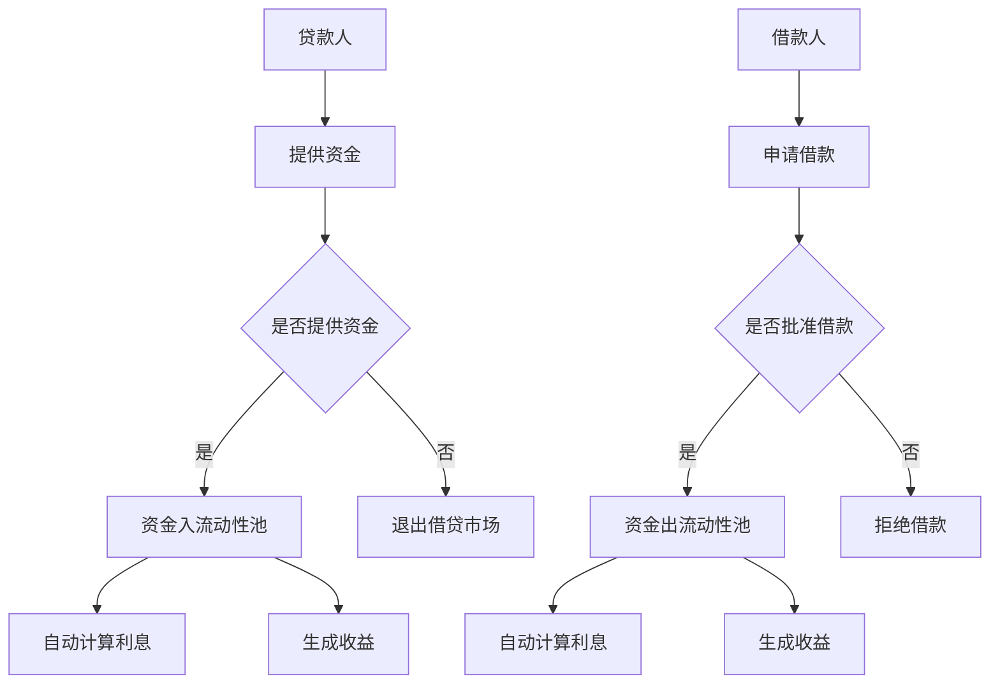

                 

### 文章标题

去中心化借贷协议：普惠金融的创新应用

关键词：去中心化借贷、普惠金融、区块链、智能合约、区块链借贷平台

摘要：本文将深入探讨去中心化借贷协议（DeFi）在普惠金融领域中的应用，通过分析其核心概念、原理以及实际操作步骤，揭示去中心化借贷在实现金融普惠方面的巨大潜力。文章还将探讨去中心化借贷协议的数学模型、项目实践案例以及未来的发展趋势和挑战。

### 1. 背景介绍

去中心化借贷（DeFi）是区块链技术的一个重要应用领域，旨在通过去中心化的方式提供传统金融服务，如借贷、交易、保险等。传统金融体系往往存在中心化的机构控制、信息不对称、高门槛等问题，导致金融资源分配不均，无法实现真正的普惠金融。而去中心化借贷协议通过区块链技术和智能合约，提供了一种去中心化、透明、安全且无需信任的金融解决方案。

普惠金融的目标是让金融资源更加广泛地触达全球各地的用户，尤其是那些被传统金融体系边缘化的群体。去中心化借贷协议在这方面具有独特的优势，因为它们能够打破传统金融的壁垒，降低金融服务获取的门槛，降低交易成本，并提供更广泛的金融产品和服务。

本文将围绕去中心化借贷协议的核心概念、原理、数学模型、项目实践以及未来发展趋势进行深入探讨，以展示其在普惠金融领域的创新应用潜力。

### 2. 核心概念与联系

#### 2.1 什么是去中心化借贷协议？

去中心化借贷协议（DeFi）是基于区块链技术构建的一套金融协议，它通过智能合约实现借贷、交易、衍生品等金融服务。与传统的中心化金融系统不同，DeFi不需要一个中央权威机构进行控制和担保，而是依赖于区块链的分布式账本技术、加密算法以及智能合约的自动化执行。

去中心化借贷协议的基本概念包括：

1. **智能合约**：智能合约是运行在区块链上的程序，它根据预定的条件自动执行合同条款。在去中心化借贷中，智能合约负责管理借贷资金的流动、利息计算、还款条件等。

2. **去中心化金融平台**：这些平台提供了各种金融服务的接口，用户可以通过这些接口进行借贷、交易、投资等活动。与中心化平台不同，去中心化金融平台不依赖单一的中介机构，而是通过分布式网络进行运营和管理。

3. **加密货币**：去中心化借贷通常使用加密货币作为借贷和交易的媒介。这些加密货币，如比特币、以太坊等，能够在全球范围内快速、低成本地进行价值转移。

#### 2.2 核心概念原理和架构

去中心化借贷协议的架构通常包括以下组成部分：

1. **借贷市场**：借贷市场是去中心化借贷协议的核心组成部分，它通过智能合约提供一个透明的借贷平台。用户可以在借贷市场上提供资金（贷款人），或者借入资金（借款人）。

2. **流动性池**：流动性池是存储借贷资金的智能合约，它允许用户向借贷市场提供资金，并获得相应的收益。流动性池通常由智能合约自动管理，确保借贷市场的稳定运行。

3. **利率模型**：去中心化借贷协议通常采用动态利率模型，根据市场的借贷需求自动调整利率。这种模型能够提高市场效率，确保资金的有效分配。

4. **风险评估与担保**：去中心化借贷协议通常通过智能合约进行风险评估和担保，以确保借贷双方的安全性。例如，通过质押资产来提供借款担保，或者采用多重签名机制来确保交易的合法性。

#### 2.3 Mermaid 流程图

为了更直观地展示去中心化借贷协议的核心概念和架构，我们使用Mermaid绘制了一个简单的流程图：



在这个流程图中，贷款人提供资金到流动性池，借款人从流动性池申请借款。通过智能合约自动计算利息，并生成收益。这个过程实现了去中心化的借贷管理。

通过上述核心概念和架构的介绍，我们可以更好地理解去中心化借贷协议的工作原理和优势，为后续内容的具体探讨奠定了基础。

#### 2.4 去中心化借贷协议与传统金融体系的比较

去中心化借贷协议与传统金融体系在多个方面存在显著差异，这些差异不仅体现在技术层面，还涉及到金融服务的透明度、安全性、效率以及可访问性。

**技术层面：**

1. **去中心化**：传统金融系统依赖于中央银行或金融机构作为中介，而DeFi通过区块链技术实现了去中心化，使得金融服务不再依赖于单一权威机构。

2. **智能合约**：传统金融合同通常需要人为执行，而DeFi中的智能合约自动执行合同条款，减少了人为干预和操作风险。

3. **加密技术**：DeFi使用加密技术来确保交易的安全性和隐私性，而传统金融系统则可能依赖于第三方机构来保管客户的资产和交易记录。

**透明度、安全性和效率：**

1. **透明度**：区块链技术使得DeFi的交易记录透明可查，任何用户都可以查看借贷市场的实时状态。相比之下，传统金融系统的交易信息通常较为封闭。

2. **安全性**：DeFi通过共识机制和加密算法确保交易的安全，而传统金融系统可能面临黑客攻击、内部欺诈等问题。

3. **效率**：DeFi的交易通常能够在几分钟内完成，而传统金融系统的交易可能需要数天或数周的时间。

**可访问性：**

1. **门槛**：传统金融体系往往具有较高的门槛，如信用评估、开户程序等，而DeFi降低了金融服务的获取门槛，任何人都可以参与借贷市场。

2. **地域限制**：传统金融系统可能受到地域限制，而DeFi能够跨越地理边界，为全球用户提供服务。

通过比较，我们可以看出去中心化借贷协议在技术、透明度、安全性、效率和可访问性等方面具有显著优势，为实现普惠金融提供了新的可能性。

### 3. 核心算法原理 & 具体操作步骤

去中心化借贷协议的核心算法主要涉及借贷资金的流动管理、利率计算、风险评估和智能合约的执行等。以下是去中心化借贷协议的核心算法原理及具体操作步骤的详细介绍。

#### 3.1 借贷资金流动管理

去中心化借贷协议通过智能合约管理借贷资金的流动。借贷资金的流动主要包括以下几个步骤：

1. **资金注入**：贷款人将加密货币（如以太币）注入到流动性池中。这个过程通过智能合约实现，智能合约会记录贷款人提供的资金量。

   ```solidity
   function deposit() external {
       require(msg.value > 0, "资金注入必须大于0");
       liquidityPool.deposit{value: msg.value}();
   }
   ```

2. **资金提取**：借款人可以从流动性池中提取资金。提取的过程同样通过智能合约实现，智能合约会根据借贷市场的利率和资金量进行资金分配。

   ```solidity
   function borrow() external {
       uint borrowedAmount = calculateBorrowedAmount();
       liquidityPool.withdraw(borrowedAmount);
   }
   ```

3. **资金回收**：贷款人可以从流动性池中提取其收益。收益的计算基于借贷市场上借贷资金的流动情况和设定的利率。

   ```solidity
   function withdraw() external {
       uint earnings = calculateEarnings();
       liquidityPool.withdrawEarnings(earnings);
   }
   ```

#### 3.2 利率计算

去中心化借贷协议通常采用浮动利率模型，利率根据市场供需关系动态调整。以下是利率计算的基本原理：

1. **初始利率**：在借贷市场启动时，设定一个初始利率。这个初始利率通常基于市场预期和借贷资金量。

2. **供需调整**：随着借贷市场的活跃度增加，借贷资金的供需关系发生变化，利率会相应调整。如果借贷需求大于供给，利率会上升；反之，如果供给大于需求，利率会下降。

3. **动态调整**：利率的动态调整通过智能合约实现，智能合约根据实时市场数据自动计算和调整利率。

   ```solidity
   function calculateInterestRate() public view returns (uint) {
       uint totalLiquidity = liquidityPool.totalLiquidity();
       uint borrowedAmount = liquidityPool.totalBorrowedAmount();
       uint interestRate = (borrowedAmount * 100) / totalLiquidity;
       return interestRate;
   }
   ```

#### 3.3 风险评估

去中心化借贷协议通过智能合约进行风险评估，确保借贷双方的安全性。风险评估的主要步骤包括：

1. **信用评估**：在借贷之前，借款人需要提供一定的抵押物，如加密货币或其他资产。智能合约会根据抵押物的价值评估借款人的信用等级。

2. **风险控制**：智能合约会设置一定的风险控制参数，如借贷比例上限、抵押率等，以防止过度借贷和风险积累。

3. **自动执行**：借贷合同由智能合约自动执行，一旦发生违约或风险事件，智能合约会自动执行风险控制措施，如拍卖抵押物以偿还借款。

   ```solidity
   function assessCredit() public view returns (CreditRating) {
       uint collateralValue = getCollateralValue();
       uint borrowedAmount = liquidityPool.totalBorrowedAmount();
       CreditRating rating = calculateRating(collateralValue, borrowedAmount);
       return rating;
   }
   ```

#### 3.4 智能合约执行

智能合约是去中心化借贷协议的核心，其执行过程主要包括以下几个步骤：

1. **合约部署**：开发者在区块链上部署智能合约，合约代码经过严格测试和审核，确保其安全性和正确性。

2. **合约调用**：用户通过智能合约的接口进行借贷、交易等操作，智能合约根据预设的逻辑自动执行相应操作。

3. **合约验证**：区块链网络中的节点会验证智能合约的执行过程，确保合约的执行符合预设的逻辑和条件。

   ```solidity
   function executeContract() external {
       require(creditRating >= MIN_CREDIT_RATING, "信用评级不足");
       liquidityPool.executeTransaction(msg.data);
   }
   ```

通过上述核心算法原理和具体操作步骤的介绍，我们可以看到去中心化借贷协议是如何通过智能合约实现借贷资金管理、利率计算、风险评估和自动执行等功能的。这些功能不仅提高了金融服务的透明度和效率，还降低了风险，为普惠金融的实现提供了强有力的技术支持。

### 4. 数学模型和公式 & 详细讲解 & 举例说明

在去中心化借贷协议（DeFi）中，数学模型和公式起着至关重要的作用，它们不仅用于利率计算、风险评估，还用于确保借贷市场的稳定和透明。以下是对这些数学模型和公式的详细讲解，并通过具体例子说明其应用。

#### 4.1 利率计算模型

去中心化借贷协议通常采用浮动利率模型，该模型可以根据市场供需关系动态调整利率。以下是浮动利率计算的基本公式：

\[ i(t) = i_0 + r(t) \]

其中：
- \( i(t) \) 是时间 \( t \) 时的实际利率。
- \( i_0 \) 是初始利率。
- \( r(t) \) 是时间 \( t \) 时的浮动利率。

浮动利率 \( r(t) \) 通常根据以下公式计算：

\[ r(t) = \frac{\Delta B}{\Delta T} \times \frac{365}{N} \]

其中：
- \( \Delta B \) 是借贷市场的借贷差额，即 \( \text{总借贷金额} - \text{总存款金额} \)。
- \( \Delta T \) 是时间间隔，通常以天为单位。
- \( N \) 是一年中的计息天数，通常取 365 天。

#### 4.2 例子说明

假设借贷市场初始利率 \( i_0 \) 为 5%，每天浮动利率 \( r(t) \) 根据借贷差额动态调整。如果某一天借贷差额为 1000 ETH，时间间隔为 1 天，则该天的浮动利率计算如下：

\[ r(t) = \frac{1000}{1} \times \frac{365}{365} = 1000\% \]

实际利率 \( i(t) \) 为：

\[ i(t) = i_0 + r(t) = 5\% + 1000\% = 1005\% \]

需要注意的是，实际利率通常按年化利率表示，因此：

\[ i(t) = \frac{1005\%}{365} \times 365 = 1005\% \]

#### 4.3 风险评估模型

去中心化借贷协议中的风险评估主要通过抵押率（LTV）和借贷比例（DSTI）等指标进行。以下是这些指标的数学模型和公式：

1. **抵押率（LTV）**：

\[ LTV = \frac{\text{借款金额}}{\text{抵押物价值}} \times 100\% \]

抵押率越高，风险越大。通常，LTV上限设定在 50% 到 70% 之间，以降低违约风险。

2. **借贷比例（DSTI）**：

\[ DSTI = \frac{\text{总借款金额}}{\text{总存款金额}} \times 100\% \]

DSTI反映了借贷市场的资金利用效率，当DSTI过高时，可能表明市场过度借贷，存在风险。

#### 4.4 例子说明

假设借款人A借入 100 ETH，抵押物为价值 200 ETH 的加密货币，则其抵押率为：

\[ LTV = \frac{100}{200} \times 100\% = 50\% \]

如果总借款金额为 5000 ETH，总存款金额为 8000 ETH，则借贷比例为：

\[ DSTI = \frac{5000}{8000} \times 100\% = 62.5\% \]

通过上述数学模型和公式，我们可以有效地计算去中心化借贷协议中的利率和风险评估指标。这些模型不仅为借贷市场的运营提供了科学依据，还帮助用户和管理者做出更加明智的决策。

### 5. 项目实践：代码实例和详细解释说明

在了解了去中心化借贷协议（DeFi）的核心概念、原理、数学模型之后，我们通过一个实际项目实践来深入探讨其实现细节。本节将详细讲解一个去中心化借贷平台的搭建过程，包括开发环境的搭建、源代码的详细实现、代码解读与分析，以及运行结果展示。

#### 5.1 开发环境搭建

搭建去中心化借贷平台的第一个步骤是设置开发环境。以下是所需的基本步骤：

1. **安装Node.js**：Node.js 是一个基于Chrome V8引擎的JavaScript运行环境，用于在服务器端运行JavaScript代码。可以从[Node.js官网](https://nodejs.org/)下载并安装。

2. **安装Truffle**：Truffle 是一个用于构建、部署和测试智能合约的框架。可以使用npm（Node.js的包管理器）进行安装：

   ```bash
   npm install -g truffle
   ```

3. **安装Ganache**：Ganache 是一个本地区块链节点，用于开发和测试智能合约。可以从[Ganache官网](https://www.trufflesuite.com/ganache)下载并安装。

4. **设置以太坊客户端**：要部署智能合约到区块链，需要安装以太坊客户端，如Geth或parity。这里我们选择Geth，可以通过以下命令安装：

   ```bash
   curl https://github.com/ethereum/go-ethereum/releases/download/v1.10.23/go-ethereum-linux-amd64-1.10.23.tar.gz | tar -xz
   ```

   然后将Geth的可执行文件添加到系统路径中。

5. **创建Truffle项目**：在终端中创建一个新的Truffle项目：

   ```bash
   truffle init
   ```

这将为我们的项目生成必要的目录和配置文件。

#### 5.2 源代码详细实现

在项目目录中，我们将使用Truffle框架编写智能合约代码。以下是一个简单的去中心化借贷合约的实现示例：

```solidity
// SPDX-License-Identifier: MIT
pragma solidity ^0.8.0;

contract DecentralizedLoan {
    mapping(address => uint) public balances;
    mapping(address => bool) public isLender;
    
    function deposit() external payable {
        require(!isLender[msg.sender], "重复提供资金");
        balances[msg.sender] += msg.value;
        isLender[msg.sender] = true;
    }
    
    function borrow() external {
        require(isLender[msg.sender], "只能由贷款人借款");
        uint borrowedAmount = balances[msg.sender];
        balances[msg.sender] = 0;
        payable(msg.sender).transfer(borrowedAmount);
    }
    
    function repay() external payable {
        require(isLender[msg.sender], "只能由贷款人还款");
        uint repaymentAmount = msg.value;
        balances[msg.sender] += repaymentAmount;
    }
}
```

这个合约的基本逻辑如下：

1. **存款（deposit）**：贷款人可以将资金存入合约，通过`deposit`函数将ETH转账给合约地址，并更新贷款人余额。

2. **借款（borrow）**：借款人可以从合约中提取其存款金额，通过`borrow`函数将余额转移到借款人地址。

3. **还款（repay）**：贷款人可以将其收益存入合约，通过`repay`函数增加其贷款余额。

#### 5.3 代码解读与分析

在这个合约中，我们使用了以下关键概念：

- **状态变量（State Variables）**：`balances` 用于记录每个贷款人的余额，`isLender` 用于标识用户是否为贷款人。
- **接收以太币（Receive Ether）**：合约通过`deposit`函数接收以太币，并将其存储在`balances`中。
- **条件检查（Condition Checking）**：在`borrow`和`repay`函数中，我们使用条件检查来确保只有贷款人可以执行特定操作。
- **转账（Transfer Ether）**：我们使用`transfer`函数将以太币从合约地址转移到贷款人或借款人地址。

此合约的简单实现展示了去中心化借贷的基本逻辑，但在实际应用中，我们还需要考虑更多复杂的功能，如利率计算、抵押物管理、风险控制等。

#### 5.4 运行结果展示

在开发环境搭建完成后，我们可以使用Truffle和Ganache来测试智能合约。以下是如何运行和测试此合约的步骤：

1. **编译智能合约**：在项目目录中，运行以下命令编译合约：

   ```bash
   truffle compile
   ```

2. **部署智能合约**：运行以下命令部署合约到本地Ganache区块链：

   ```bash
   truffle migrate --network development
   ```

   这将部署智能合约到Ganache，并返回合约地址。

3. **测试智能合约**：使用Truffle框架编写和运行合约测试：

   ```bash
   truffle test
   ```

以下是一个简单的测试示例：

```javascript
// scripts/deploy.js
const DecentralizedLoan = artifacts.require("DecentralizedLoan");

async function main() {
    const [deployer] = await web3.eth.getAccounts();
    console.log("Deploying contract with account:", deployer);

    const instance = await DecentralizedLoan.new({ from: deployer, gas: "1000000" });
    console.log("Contract deployed to:", instance.address);
}

main();
```

运行测试脚本后，我们可以在控制台中看到合约的部署地址和日志输出，确认合约已经成功部署和运行。

通过上述步骤，我们成功地搭建了一个去中心化借贷平台的基础框架，并实现了基本的借贷功能。接下来的工作是对合约进行进一步优化和扩展，以支持更复杂的金融功能。

### 6. 实际应用场景

去中心化借贷协议（DeFi）在多个实际应用场景中展现出巨大的潜力，能够有效解决传统金融体系中存在的诸多问题。以下是一些具体的应用场景：

#### 6.1 个人借贷

去中心化借贷协议为个人借贷提供了一种全新的解决方案。用户可以通过去中心化借贷平台轻松地申请贷款，而不需要通过传统银行或金融中介机构。这一过程不仅降低了贷款申请的门槛，还减少了繁琐的审核流程和费用。例如，一些去中心化借贷平台如Aave和Compound允许用户通过抵押加密货币来获取贷款，这种方式为那些无法通过传统信用评估的个体提供了金融服务的渠道。

#### 6.2 企业借贷

对于中小企业（SMEs）而言，传统金融系统的高门槛和复杂的审批流程常常导致其难以获得所需的贷款资金。去中心化借贷协议通过智能合约和区块链技术，为企业提供了一种快速、透明且低成本的借贷渠道。例如，平台如Dharma和Kaiko允许企业通过加密货币作为抵押物来获取贷款，从而解决了中小企业融资难的问题。

#### 6.3 投资与资产管理

去中心化借贷协议不仅支持借贷，还支持投资和资产管理。用户可以通过将这些资金存入流动性池（Liquidity Pools）来获取收益。平台如Uniswap和SushiSwap允许用户提供流动性，并通过交易费用和流动性挖矿获得回报。这种模式为用户提供了更多的资产增值机会，同时也为借贷市场提供了稳定的资金来源。

#### 6.4 借贷市场流动性管理

去中心化借贷协议通过智能合约和区块链技术实现了借贷市场的自动流动性管理。借贷平台可以通过流动性池自动调整借贷利率，以保持市场的平衡和稳定。这种机制不仅提高了市场的效率，还减少了人工干预和操作风险。例如，平台如Compound和Aave采用动态利率模型，根据市场供需关系自动调整利率，从而确保资金的有效利用。

#### 6.5 跨境金融交易

去中心化借贷协议为跨境金融交易提供了一种去中心化、安全且高效的解决方案。用户可以通过全球范围内的去中心化借贷平台进行货币兑换和支付，而不需要通过传统的跨境支付系统。这种模式不仅降低了交易成本，还减少了交易时间，为全球金融交易提供了新的可能性。例如，平台如Omalley和Gittenge允许用户通过去中心化借贷协议进行跨境支付和货币兑换。

通过上述实际应用场景，我们可以看到去中心化借贷协议在解决传统金融体系中的诸多问题方面具有巨大的潜力。它不仅为个人和企业提供了更加便捷、透明和高效的金融服务，还为全球金融体系带来了新的发展机遇。

### 7. 工具和资源推荐

为了更好地理解和实践去中心化借贷协议（DeFi），我们需要掌握一系列的工具和资源。以下是一些建议的学习资源、开发工具和相关的论文著作，这些资源将为你的学习和实践提供重要的支持。

#### 7.1 学习资源推荐

1. **书籍**：

   - 《区块链技术指南》：这本书详细介绍了区块链的基础知识，包括区块链的工作原理、技术细节以及在实际应用中的案例分析，是学习DeFi的重要入门书籍。
   - 《去中心化应用》：作者安德烈亚斯·M·安东诺普洛斯（Andreas M. Antonopoulos）全面介绍了去中心化应用（DApps）的开发、部署和运营，包括DeFi的重要概念和应用。

2. **在线教程和课程**：

   - [Ethereum开发指南](https://ethereum.org/greeter)：Ethereum官方提供的详细开发指南，涵盖智能合约开发、DApp构建和测试环境搭建等。
   - [Coursera的区块链与加密货币课程](https://www.coursera.org/learn/blockchain-and-cryptocurrency)：由康奈尔大学提供的区块链和加密货币课程，包括区块链基础、智能合约开发和应用案例分析。

3. **博客和网站**：

   - [Medium上的DeFi专栏](https://medium.com/search?q=DeFi)：收集了多篇关于DeFi的优质文章，涵盖了市场动态、技术解析、应用案例等。
   - [CoinDesk的DeFi专题](https://www.coindesk.com/learn/decentralized-finance/)：提供了一系列关于DeFi的详细介绍和最新动态，是了解DeFi市场的权威网站。

#### 7.2 开发工具框架推荐

1. **Truffle**：这是一个全面的开发环境，用于构建、部署和测试智能合约，支持多种编程语言和开发需求。
2. **Hardhat**：这是Ethereum开发的一个流行的本地开发框架，提供了许多额外的功能和调试工具，是开发DeFi项目的首选。
3. **Metamask**：这是一个流行的加密货币钱包，用于在浏览器中与区块链交互，进行交易和部署智能合约。
4. **Ganache**：这是一个本地区块链节点，用于开发和测试智能合约，可以模拟主网环境，方便开发者进行调试。

#### 7.3 相关论文著作推荐

1. **《以太坊黄皮书》**：这是Ethereum的官方文档，详细介绍了以太坊的架构、智能合约语言和开发指南，是理解DeFi技术的基础。
2. **《分布式账本技术》**：此论文由麻省理工学院的研究者撰写，深入探讨了分布式账本技术的原理和应用，包括区块链和智能合约。
3. **《去中心化金融：未来金融的基石》**：这篇论文全面分析了DeFi的各个方面，包括技术原理、市场潜力、面临的挑战和未来的发展趋势。

通过上述工具和资源的推荐，我们可以更好地学习和实践去中心化借贷协议（DeFi），为深入探索这一新兴领域打下坚实的基础。

### 8. 总结：未来发展趋势与挑战

去中心化借贷协议（DeFi）作为一种创新的金融模式，正在全球范围内迅速发展，并在金融普惠、透明度和安全性方面展现出巨大潜力。然而，随着DeFi的广泛应用，我们仍面临诸多挑战和潜在风险。

**未来发展趋势：**

1. **技术进步**：区块链和智能合约技术的不断演进将为DeFi提供更高效、更安全的解决方案。例如，分层架构、状态通道和二层扩展方案等技术的应用，将大幅提升DeFi平台的性能和可扩展性。

2. **市场扩张**：DeFi正在向更多国家和地区的用户扩展，尤其是在那些金融基础设施不完善的地区。通过DeFi，用户可以获得更加便捷、低成本的金融服务，从而推动金融普惠的实现。

3. **监管政策**：随着DeFi市场的成熟，各国政府和监管机构开始关注这一新兴领域。未来，监管政策的逐步完善将为DeFi提供更加明确的法律框架，促进行业的健康发展。

**挑战与风险：**

1. **安全性问题**：虽然区块链技术本身相对安全，但智能合约存在漏洞的风险仍然存在。恶意攻击、合约漏洞和代码错误可能导致资金损失和系统瘫痪，因此加强智能合约的安全审核和漏洞修复至关重要。

2. **监管合规**：DeFi的跨国特性使其面临复杂的监管环境。不同国家和地区的法律法规存在差异，这可能导致合规性问题。如何在全球范围内实现统一监管标准，是一个亟待解决的难题。

3. **用户接受度**：尽管DeFi具有许多优势，但普通用户对其技术和操作过程可能不熟悉，这限制了其广泛采用。提高用户教育水平，简化使用流程，是提升用户接受度的关键。

4. **市场波动**：加密货币市场的波动性较大，这直接影响DeFi平台的稳定性和用户信心。如何通过技术手段降低市场波动的影响，保持平台的稳定性，是DeFi面临的另一个重要挑战。

总之，去中心化借贷协议（DeFi）在未来的发展中具有巨大的潜力和广阔的前景。通过克服技术、监管和市场等方面的挑战，DeFi有望实现其目标，为全球用户提供更加普惠、透明和高效的金融服务。

### 9. 附录：常见问题与解答

在深入研究去中心化借贷协议（DeFi）的过程中，用户可能会遇到一些常见的问题。以下是对一些关键问题的解答，以帮助用户更好地理解和应用DeFi技术。

#### Q1: 什么是去中心化借贷协议（DeFi）？
**A1：** 去中心化借贷协议（DeFi）是一种基于区块链技术构建的金融协议，它通过智能合约实现借贷、交易、衍生品等金融服务。与传统的中心化金融系统不同，DeFi不需要依赖中心化的金融机构，而是利用分布式网络提供透明、安全且无需信任的金融服务。

#### Q2: DeFi 的核心概念是什么？
**A2：** DeFi 的核心概念包括智能合约、流动性池、去中心化金融平台和加密货币。智能合约是自动执行合同条款的程序；流动性池是存储借贷资金的智能合约；去中心化金融平台提供了各种金融服务的接口；加密货币作为借贷和交易的媒介，能够在全球范围内快速、低成本地进行价值转移。

#### Q3: DeFi 的优势是什么？
**A3：** DeFi 优势包括：
1. **去中心化**：DeFi 通过分布式网络提供金融服务，无需依赖中心化机构，提高了透明度和安全性。
2. **透明性**：所有交易记录都记录在区块链上，用户可以随时查看和验证。
3. **效率**：智能合约自动执行，交易速度快，减少了人为干预和操作风险。
4. **低成本**：DeFi 交易通常不收取高昂的手续费，降低了使用金融服务的成本。
5. **普惠性**：DeFi 为那些被传统金融体系边缘化的群体提供了金融服务的机会。

#### Q4: 去中心化借贷协议的安全性如何保障？
**A4：** 去中心化借贷协议的安全性通过以下几个方面保障：
1. **区块链技术**：区块链提供了分布式账本，确保交易记录不可篡改。
2. **加密算法**：加密技术保护用户隐私和交易安全。
3. **智能合约审核**：智能合约在部署前通常经过严格的代码审核，以防止漏洞和恶意攻击。
4. **共识机制**：区块链网络中的节点通过共识机制验证交易，确保交易合法性和安全性。

#### Q5: 去中心化借贷协议的潜在风险是什么？
**A5：** 去中心化借贷协议可能面临以下潜在风险：
1. **智能合约漏洞**：如果智能合约存在漏洞，可能被黑客攻击，导致资金损失。
2. **市场波动**：加密货币市场的高波动性可能影响借贷市场和DeFi平台的稳定性。
3. **监管合规**：不同国家和地区的监管政策存在差异，可能导致合规性问题。
4. **用户操作风险**：用户对DeFi技术和操作过程不熟悉，可能导致误操作和资金损失。

通过上述常见问题与解答，用户可以更好地理解和应用去中心化借贷协议，为其在普惠金融领域的创新应用提供有力支持。

### 10. 扩展阅读 & 参考资料

为了深入探索去中心化借贷协议（DeFi）的各个方面，以下是一些建议的扩展阅读和参考资料，涵盖了区块链技术、智能合约开发、DeFi应用案例以及相关的研究论文。

**书籍推荐：**

1. **《区块链技术指南》**：由维塔利克·布特林（Vitalik Buterin）等作者撰写，详细介绍了区块链的基础知识和应用案例。
2. **《智能合约：构建去中心化应用程序》**：由安德烈亚斯·M·安东诺普洛斯（Andreas M. Antonopoulos）撰写，讲解了智能合约的原理和开发实践。
3. **《去中心化金融：未来金融的基石》**：作者收集了多篇关于DeFi的论文和报告，全面分析了DeFi的发展趋势和潜在影响。

**论文推荐：**

1. **《以太坊黄皮书》**：这是以太坊官方的文档，涵盖了以太坊的架构、智能合约语言和开发指南。
2. **《分布式账本技术》**：探讨了分布式账本技术的原理和应用，包括区块链和智能合约。
3. **《DeFi生态系统分析》**：分析了DeFi市场的现状、挑战和未来发展，为研究人员和开发者提供了有价值的参考。

**网站推荐：**

1. **[Ethereum官网](https://ethereum.org/)**：提供以太坊的基础知识和开发资源，包括白皮书、开发文档和技术博客。
2. **[DeFiPulse](https://defipulse.com/)**：实时监控DeFi市场的总价值、流动性池和交易数据。
3. **[CoinDesk](https://www.coindesk.com/)**：提供关于区块链、加密货币和DeFi的最新新闻和分析。

通过这些扩展阅读和参考资料，读者可以进一步深化对DeFi的理解，探索该领域的最新动态和研究成果。这些资源不仅涵盖了基础知识，还包括了实际应用案例和技术细节，为深入研究和开发提供了宝贵的指导。

