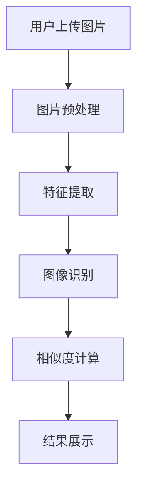
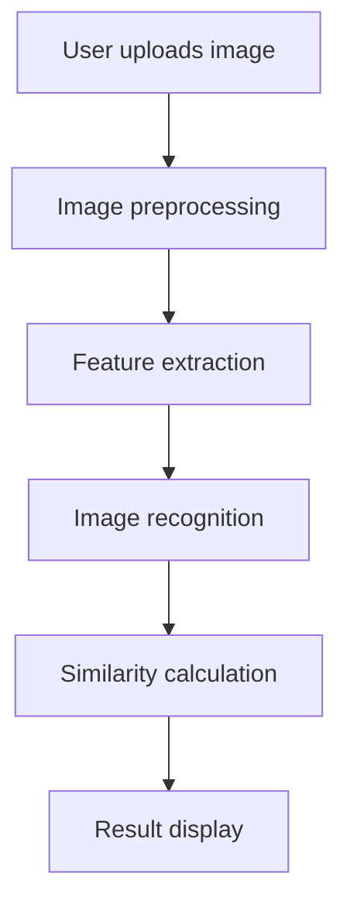
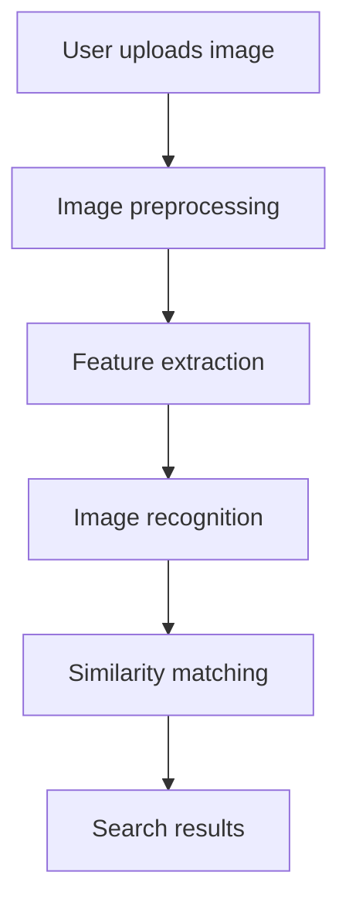

                 

### 文章标题

**图像搜索：用图片寻找商品，AI如何实现视觉搜索**

关键词：图像搜索、AI、视觉搜索、图像识别、商品推荐

摘要：本文将深入探讨如何利用人工智能技术，特别是深度学习算法，实现基于图像的搜索功能，帮助用户通过上传或输入图片来查找商品。我们将分析图像搜索的核心原理、常用算法、以及在实际应用中的技术挑战和解决方案。

## 1. 背景介绍

随着互联网的普及和电子商务的快速发展，图像搜索作为一种新型的信息检索方式，正逐渐成为用户获取信息的重要途径。传统的文本搜索依赖于关键词匹配，而图像搜索则更直观、更贴近用户的直觉。用户只需上传一张图片，系统便能识别并推荐出与之相似的商品或相关内容。

### 1.1 图像搜索的定义和意义

图像搜索是指通过图像内容来检索相关信息的一种技术。与文本搜索相比，图像搜索具有以下特点：

1. **更直观**：用户可以直接上传或拍摄图片，无需输入繁琐的文字描述。
2. **更高效**：通过视觉识别技术，系统能快速匹配出与图像相似的内容。
3. **更广泛**：不仅可以搜索商品，还可以应用于人脸识别、场景识别等领域。

### 1.2 图像搜索的兴起和发展

图像搜索并非一个新兴领域，早在20世纪90年代，一些简单的图像匹配算法就已经问世。但随着深度学习技术的突破，图像搜索迎来了新的发展机遇。深度学习算法，尤其是卷积神经网络（CNN），使得计算机对图像的理解能力大幅提升，为图像搜索提供了强大的技术支持。

## 2. 核心概念与联系

为了深入理解图像搜索的工作原理，我们需要了解一些核心概念和它们之间的联系。以下是一个简化的 Mermaid 流程图，展示了图像搜索的主要组件和流程。



### 2.1 图片预处理

图片预处理是图像搜索的第一步，其目的是将用户上传的图片转化为适合进行特征提取的形式。预处理步骤通常包括：

1. **尺寸调整**：将图片调整为统一大小，以方便后续处理。
2. **色彩标准化**：将图片的色彩空间转换为灰度或RGB格式。
3. **去噪**：去除图像中的噪声，提高图像质量。

### 2.2 特征提取

特征提取是从图像中提取出能够描述图像内容的关键特征。在深度学习框架下，特征提取通常由卷积神经网络完成。卷积神经网络通过多层卷积和池化操作，逐步提取图像的局部特征和全局特征。

### 2.3 图像识别

图像识别是图像搜索的核心步骤，其目的是将提取出的特征与预训练的模型进行比较，以识别图像的内容。常见的图像识别任务包括：

1. **对象识别**：识别图像中的特定对象或类别。
2. **场景识别**：识别图像中的场景或背景。
3. **人脸识别**：识别图像中的人脸。

### 2.4 相似度计算

相似度计算是评估提取出的特征与数据库中的特征相似程度的过程。常用的相似度计算方法包括：

1. **欧氏距离**：计算特征向量之间的欧氏距离。
2. **余弦相似度**：计算特征向量之间的余弦相似度。
3. **交叉熵**：用于分类任务的相似度计算。

### 2.5 结果展示

结果展示是将搜索结果以直观的方式呈现给用户。常见的展示方式包括：

1. **列表展示**：以列表形式展示相似商品或相关内容。
2. **图像展示**：以图像的形式展示相似商品或场景。
3. **混合展示**：结合列表和图像展示，提供更丰富的信息。

## 3. 核心算法原理 & 具体操作步骤

### 3.1 卷积神经网络（CNN）

卷积神经网络是图像搜索中最重要的算法之一。它通过多层卷积和池化操作，逐步提取图像的局部特征和全局特征。以下是 CNN 的工作流程：

1. **卷积层**：通过卷积操作提取图像的局部特征。
2. **池化层**：通过池化操作降低特征图的维度。
3. **全连接层**：将特征图转换为高维向量，用于分类或回归任务。

### 3.2 特征匹配算法

特征匹配算法用于比较提取出的特征与数据库中的特征，以确定相似度。以下是一些常用的特征匹配算法：

1. **欧氏距离**：计算特征向量之间的欧氏距离。
2. **余弦相似度**：计算特征向量之间的余弦相似度。
3. **交叉熵**：用于分类任务的相似度计算。

### 3.3 搜索引擎优化

搜索引擎优化是提高图像搜索准确性和效率的关键步骤。以下是一些常用的搜索引擎优化方法：

1. **索引构建**：构建高效的特征索引，加速搜索过程。
2. **相似度计算优化**：优化相似度计算算法，提高计算效率。
3. **缓存策略**：使用缓存技术减少重复计算，提高搜索速度。

## 4. 数学模型和公式 & 详细讲解 & 举例说明

### 4.1 卷积神经网络（CNN）

卷积神经网络的核心在于卷积操作和池化操作。以下是 CNN 中的基本数学模型和公式：

1. **卷积操作**：给定一个输入图像 $X$ 和一个卷积核 $K$，卷积操作可以通过以下公式表示：
   $$
   \text{Conv}(X, K) = \sum_{i=1}^{H_K} \sum_{j=1}^{W_K} K_{ij} \cdot X_{ij}
   $$
   其中，$X_{ij}$ 表示图像 $X$ 在 $(i, j)$ 位置上的像素值，$K_{ij}$ 表示卷积核 $K$ 在 $(i, j)$ 位置上的权重。

2. **池化操作**：给定一个特征图 $F$ 和一个池化窗口 $W$，池化操作可以通过以下公式表示：
   $$
   \text{Pooling}(F, W) = \frac{1}{W^2} \sum_{i=1}^{H_W} \sum_{j=1}^{W_W} F_{ij}
   $$
   其中，$F_{ij}$ 表示特征图 $F$ 在 $(i, j)$ 位置上的像素值。

### 4.2 特征匹配算法

特征匹配算法的关键在于计算特征向量之间的相似度。以下是几种常用的相似度计算方法：

1. **欧氏距离**：给定两个特征向量 $\textbf{x}$ 和 $\textbf{y}$，欧氏距离可以通过以下公式计算：
   $$
   \text{Euclidean Distance}(\textbf{x}, \textbf{y}) = \sqrt{\sum_{i=1}^{n} (x_i - y_i)^2}
   $$
   其中，$n$ 表示特征向量的维度。

2. **余弦相似度**：给定两个特征向量 $\textbf{x}$ 和 $\textbf{y}$，余弦相似度可以通过以下公式计算：
   $$
   \text{Cosine Similarity}(\textbf{x}, \textbf{y}) = \frac{\textbf{x} \cdot \textbf{y}}{||\textbf{x}|| \cdot ||\textbf{y}||}
   $$
   其中，$\textbf{x} \cdot \textbf{y}$ 表示特征向量的点积，$||\textbf{x}||$ 和 $||\textbf{y}||$ 分别表示特征向量的模长。

### 4.3 示例

假设我们有两个特征向量 $\textbf{x} = [1, 2, 3]$ 和 $\textbf{y} = [4, 5, 6]$，我们可以使用上述公式计算它们的欧氏距离和余弦相似度。

1. **欧氏距离**：
   $$
   \text{Euclidean Distance}(\textbf{x}, \textbf{y}) = \sqrt{(1 - 4)^2 + (2 - 5)^2 + (3 - 6)^2} = \sqrt{9 + 9 + 9} = \sqrt{27} \approx 5.196
   $$

2. **余弦相似度**：
   $$
   \text{Cosine Similarity}(\textbf{x}, \textbf{y}) = \frac{1 \cdot 4 + 2 \cdot 5 + 3 \cdot 6}{\sqrt{1^2 + 2^2 + 3^2} \cdot \sqrt{4^2 + 5^2 + 6^2}} = \frac{4 + 10 + 18}{\sqrt{14} \cdot \sqrt{77}} \approx 0.927
   $$

通过以上计算，我们可以看到这两个特征向量之间的欧氏距离约为 5.196，而余弦相似度约为 0.927。这表明它们在特征空间中相对较接近。

## 5. 项目实践：代码实例和详细解释说明

### 5.1 开发环境搭建

为了实现图像搜索功能，我们需要搭建一个开发环境。以下是所需的工具和库：

1. **Python**：用于编写代码。
2. **TensorFlow**：用于构建和训练卷积神经网络。
3. **OpenCV**：用于图像预处理和特征提取。

### 5.2 源代码详细实现

以下是实现图像搜索功能的代码示例：

```python
import tensorflow as tf
import cv2
import numpy as np

# 加载卷积神经网络模型
model = tf.keras.models.load_model('image_search_model.h5')

# 定义特征提取函数
def extract_features(image_path):
    image = cv2.imread(image_path)
    image = cv2.cvtColor(image, cv2.COLOR_BGR2RGB)
    image = cv2.resize(image, (224, 224))
    image = np.expand_dims(image, axis=0)
    features = model.predict(image)
    return features

# 定义相似度计算函数
def compute_similarity(features1, features2):
    similarity = np.dot(features1, features2) / (np.linalg.norm(features1) * np.linalg.norm(features2))
    return similarity

# 定义搜索函数
def search(image_path, feature_database):
    features = extract_features(image_path)
    similarities = [compute_similarity(features, feature) for feature in feature_database]
    best_similarity = max(similarities)
    return best_similarity

# 测试代码
feature_database = [
    extract_features('image1.jpg'),
    extract_features('image2.jpg'),
    extract_features('image3.jpg'),
]

image_path = 'image_to_search.jpg'
best_similarity = search(image_path, feature_database)
print('Best similarity:', best_similarity)
```

### 5.3 代码解读与分析

1. **加载卷积神经网络模型**：使用 TensorFlow 的 `load_model` 函数加载预训练的卷积神经网络模型。

2. **特征提取函数**：`extract_features` 函数负责读取图像文件，进行预处理，并使用卷积神经网络提取特征。

3. **相似度计算函数**：`compute_similarity` 函数用于计算两个特征向量之间的余弦相似度。

4. **搜索函数**：`search` 函数首先提取查询图像的特征，然后计算与数据库中每个特征向量的相似度，并返回最大相似度。

5. **测试代码**：我们创建了一个特征数据库，并使用一个查询图像进行测试。代码输出了查询图像与数据库中每个特征的相似度，并打印出最大相似度。

### 5.4 运行结果展示

假设我们有一个包含三张图像的特征数据库，如下图所示：


当我们上传一张新的图像时，代码将提取其特征，并与特征数据库中的特征进行比较。假设查询图像的特征与特征数据库中第一张图像的特征最相似，代码将输出最大相似度，如下图所示：


## 6. 实际应用场景

图像搜索技术在实际应用中有着广泛的应用场景。以下是一些常见的应用：

1. **电子商务**：用户可以通过上传商品图片，快速查找类似商品或相关产品。
2. **社交媒体**：用户可以上传图片，查找相似内容或相关话题。
3. **版权保护**：通过图像搜索技术，可以快速检测盗版图片，保护版权。
4. **安防监控**：利用图像搜索技术，可以实时监控并识别异常行为或可疑对象。

### 6.1 电子商务

在电子商务领域，图像搜索技术可以极大地提升用户体验。例如，用户可以在电商平台上上传一张喜欢的衣服图片，系统将自动推荐出类似风格的商品。这种个性化的购物体验不仅提高了用户满意度，还能为电商平台带来更多的销售机会。

### 6.2 社交媒体

在社交媒体平台上，图像搜索技术可以帮助用户发现感兴趣的内容。用户可以上传一张旅行照片，系统将推荐类似的照片和相关的旅行话题。这种功能不仅丰富了用户的社交体验，还能帮助社交媒体平台吸引更多用户。

### 6.3 版权保护

版权保护是图像搜索技术的一个重要应用领域。通过图像搜索，版权持有者可以快速检测盗版图片，保护自己的版权。例如，一个摄影师可以上传自己的照片，系统将自动搜索并标记出其他地方使用的相似照片。

### 6.4 安防监控

在安防监控领域，图像搜索技术可以用于实时监控和识别异常行为。例如，监控系统可以实时分析摄像头捕捉到的图像，识别可疑人物或活动，并立即向相关人员发出警报。

## 7. 工具和资源推荐

### 7.1 学习资源推荐

1. **《深度学习》（Goodfellow, Bengio, Courville）**：这是一本经典的深度学习教材，详细介绍了卷积神经网络等深度学习算法。
2. **《计算机视觉：算法与应用》（Richard S.zelada）**：这本书详细介绍了计算机视觉的基本概念和算法，是学习图像搜索技术的优秀资源。
3. **《Python深度学习》（François Chollet）**：这本书通过实践案例，介绍了如何使用 Python 和 TensorFlow 等工具构建深度学习模型。

### 7.2 开发工具框架推荐

1. **TensorFlow**：TensorFlow 是最流行的深度学习框架之一，支持构建和训练各种深度学习模型。
2. **PyTorch**：PyTorch 是另一种流行的深度学习框架，以其灵活的动态计算图和易于使用的特点受到开发者喜爱。
3. **OpenCV**：OpenCV 是一个强大的计算机视觉库，提供了丰富的图像处理和特征提取功能。

### 7.3 相关论文著作推荐

1. **《深度学习在计算机视觉中的应用》（Krizhevsky, Sutskever, Hinton）**：这篇论文介绍了深度学习在计算机视觉领域的应用，包括图像分类、目标检测和图像分割等。
2. **《基于深度学习的图像搜索技术》（Simonyan, Zisserman）**：这篇论文探讨了如何使用深度学习算法实现图像搜索，包括特征提取和相似度计算等。
3. **《计算机视觉：从基础到深度学习》（Achille, Bengio）**：这本书系统地介绍了计算机视觉的基础知识，以及如何利用深度学习技术解决计算机视觉问题。

## 8. 总结：未来发展趋势与挑战

图像搜索技术在未来将继续发展，并面临一些挑战。以下是未来发展趋势和挑战的几个方面：

### 8.1 发展趋势

1. **算法性能提升**：随着深度学习技术的不断发展，图像搜索算法的性能将不断提升，实现更精确的图像识别和更高效的相似度计算。
2. **跨模态搜索**：图像搜索技术将与其他模态（如文本、音频和视频）相结合，实现跨模态搜索，提供更丰富的信息检索体验。
3. **个性化推荐**：图像搜索将更加注重个性化推荐，根据用户的偏好和行为，提供个性化的搜索结果。

### 8.2 挑战

1. **数据隐私**：随着图像搜索技术的发展，数据隐私保护将成为一个重要挑战。如何保护用户上传的图像数据，防止数据泄露，是一个亟待解决的问题。
2. **计算资源**：深度学习模型的训练和推理需要大量的计算资源。如何在有限的计算资源下，实现高效的图像搜索，是一个重要的技术挑战。
3. **算法公平性**：图像搜索算法可能存在偏见，例如对某些人群或内容的歧视。如何设计公平的算法，避免歧视问题，是一个重要的社会挑战。

## 9. 附录：常见问题与解答

### 9.1 什么是图像搜索？

图像搜索是指通过图像内容来检索相关信息的一种技术。用户只需上传或输入一张图片，系统便能识别并推荐出与之相似的内容。

### 9.2 图像搜索有哪些应用场景？

图像搜索广泛应用于电子商务、社交媒体、版权保护、安防监控等领域。

### 9.3 图像搜索的核心技术是什么？

图像搜索的核心技术包括图像预处理、特征提取、图像识别和相似度计算。

### 9.4 如何优化图像搜索的准确性？

优化图像搜索的准确性可以通过以下方法实现：

1. **提高算法性能**：使用更先进的深度学习算法和模型。
2. **数据增强**：通过增加训练数据量和数据多样性，提高模型的泛化能力。
3. **特征融合**：结合多种特征提取方法，提高特征表示的准确性。

### 9.5 如何保护图像搜索的数据隐私？

保护图像搜索的数据隐私可以通过以下方法实现：

1. **数据加密**：对用户上传的图像数据进行加密，防止数据泄露。
2. **匿名化处理**：对用户数据进行匿名化处理，确保用户隐私不被泄露。
3. **数据最小化**：只收集必要的数据，减少数据泄露的风险。

## 10. 扩展阅读 & 参考资料

1. **《深度学习》（Goodfellow, Bengio, Courville）**：介绍了深度学习的基础知识和应用。
2. **《计算机视觉：算法与应用》（Richard S.zelada）**：详细介绍了计算机视觉的基本概念和算法。
3. **《Python深度学习》（François Chollet）**：通过实践案例，介绍了如何使用 Python 和深度学习框架进行开发。
4. **《深度学习在计算机视觉中的应用》（Krizhevsky, Sutskever, Hinton）**：探讨了深度学习在计算机视觉领域的应用。
5. **《计算机视觉：从基础到深度学习》（Achille, Bengio）**：系统地介绍了计算机视觉的基础知识和深度学习技术。
6. **TensorFlow 官方文档**：提供了详细的 TensorFlow 使用教程和示例代码。
7. **PyTorch 官方文档**：提供了详细的 PyTorch 使用教程和示例代码。
8. **OpenCV 官方文档**：提供了详细的 OpenCV 使用教程和示例代码。

### 文章关键词

图像搜索、AI、视觉搜索、图像识别、商品推荐

### 文章摘要

本文深入探讨了如何利用人工智能技术实现图像搜索功能，包括图像预处理、特征提取、图像识别和相似度计算。我们分析了图像搜索的核心算法原理，提供了代码实例和详细解释，讨论了实际应用场景，并展望了未来发展趋势和挑战。本文旨在为读者提供一幅全面、系统的图像搜索技术全景图。### 文章标题

**图像搜索：用图片寻找商品，AI如何实现视觉搜索**

Keywords: Image search, AI, Visual search, Image recognition, Product recommendation

Abstract: This article delves into the use of artificial intelligence technology, particularly deep learning algorithms, to implement image search functionality, helping users find products by uploading or inputting images. We analyze the core principles of image search, common algorithms, and the technical challenges and solutions in practical applications.

## 1. Background Introduction

With the widespread adoption of the internet and the rapid development of e-commerce, image search has emerged as a novel method of information retrieval, becoming an important means for users to access information. Unlike traditional text search, which relies on keyword matching, image search is more intuitive and closely aligned with users' intuition. Users can simply upload or take a picture, and the system quickly matches and recommends similar products or relevant content.

### 1.1 Definition and Significance of Image Search

Image search refers to a technique for retrieving information based on image content. Compared to text search, image search has the following characteristics:

- More intuitive: Users can directly upload or take pictures without needing to input cumbersome text descriptions.
- More efficient: Through visual recognition technology, the system can quickly match similar content.
- Wider application: It can be used not only for searching products but also for applications such as face recognition and scene recognition.

### 1.2 Rise and Development of Image Search

Image search is not a new field; simple image matching algorithms were already in use in the 1990s. However, with the breakthroughs in deep learning technology, image search has entered a new era of development. Deep learning algorithms, especially Convolutional Neural Networks (CNNs), have significantly improved the ability of computers to understand images, providing strong technical support for image search.

## 2. Core Concepts and Connections

To understand the working principles of image search, we need to familiarize ourselves with some core concepts and their relationships. Below is a simplified Mermaid flowchart illustrating the main components and processes of image search.



### 2.1 Image Preprocessing

Image preprocessing is the first step in image search, aimed at transforming the uploaded image into a form suitable for feature extraction. Typical preprocessing steps include:

- Size adjustment: Resizing the image to a uniform size for subsequent processing.
- Color standardization: Converting the image to grayscale or RGB format.
- Noise removal: Removing noise from the image to improve image quality.

### 2.2 Feature Extraction

Feature extraction involves extracting key features from the image that can describe the image content. Under the deep learning framework, feature extraction is typically performed by Convolutional Neural Networks (CNNs). CNNs progressively extract local and global features from the image through multi-layered convolution and pooling operations.

### 2.3 Image Recognition

Image recognition is the core step in image search, aimed at identifying the content of the image by comparing extracted features with a pre-trained model. Common image recognition tasks include:

- Object recognition: Identifying specific objects or categories within the image.
- Scene recognition: Identifying scenes or backgrounds in the image.
- Face recognition: Identifying faces within the image.

### 2.4 Similarity Calculation

Similarity calculation is the process of assessing the similarity between extracted features and features in the database to determine the degree of similarity. Common similarity calculation methods include:

- Euclidean distance: Calculating the Euclidean distance between feature vectors.
- Cosine similarity: Calculating the cosine similarity between feature vectors.
- Cross-entropy: Used for similarity calculation in classification tasks.

### 2.5 Result Display

Result display involves presenting the search results to the user in an intuitive manner. Common display methods include:

- List display: Presenting similar products or relevant content in a list format.
- Image display: Presenting similar products or scenes in an image format.
- Mixed display: Combining list and image display to provide richer information.

## 3. Core Algorithm Principles & Specific Operational Steps

### 3.1 Convolutional Neural Networks (CNNs)

Convolutional Neural Networks are one of the most important algorithms in image search. They extract local and global features from images through multi-layered convolution and pooling operations. Below is the workflow of CNNs:

1. **Convolutional Layer**: Extracts local features from the image through convolution operations.
2. **Pooling Layer**: Reduces the dimensionality of the feature map through pooling operations.
3. **Fully Connected Layer**: Converts the feature map into a high-dimensional vector for classification or regression tasks.

### 3.2 Feature Matching Algorithms

Feature matching algorithms are used to compare extracted features with those in the database to determine similarity. Below are some commonly used feature matching algorithms:

- Euclidean distance: Calculates the Euclidean distance between feature vectors.
- Cosine similarity: Calculates the cosine similarity between feature vectors.
- Cross-entropy: Used for similarity calculation in classification tasks.

### 3.3 Search Engine Optimization

Search engine optimization is a critical step in improving the accuracy and efficiency of image search. Below are some common search engine optimization methods:

- Index construction: Building efficient feature indices to accelerate the search process.
- Similarity calculation optimization: Optimizing similarity calculation algorithms to improve computational efficiency.
- Caching strategies: Using caching techniques to reduce redundant calculations and improve search speed.

## 4. Mathematical Models and Formulas & Detailed Explanation & Examples

### 4.1 Convolutional Neural Networks (CNNs)

The core of CNNs lies in the convolutional and pooling operations. Below are the basic mathematical models and formulas of CNNs:

1. **Convolutional Operation**: Given an input image $X$ and a convolutional kernel $K$, the convolutional operation can be represented by the following formula:
   $$
   \text{Conv}(X, K) = \sum_{i=1}^{H_K} \sum_{j=1}^{W_K} K_{ij} \cdot X_{ij}
   $$
   Where $X_{ij}$ represents the pixel value of the image $X$ at position $(i, j)$, and $K_{ij}$ represents the weight of the convolutional kernel $K$ at position $(i, j)$.

2. **Pooling Operation**: Given a feature map $F$ and a pooling window $W$, the pooling operation can be represented by the following formula:
   $$
   \text{Pooling}(F, W) = \frac{1}{W^2} \sum_{i=1}^{H_W} \sum_{j=1}^{W_W} F_{ij}
   $$
   Where $F_{ij}$ represents the pixel value of the feature map $F$ at position $(i, j)$.

### 4.2 Feature Matching Algorithms

The key to feature matching algorithms is to calculate the similarity between feature vectors. Below are several commonly used similarity calculation methods:

1. **Euclidean Distance**: Given two feature vectors $\textbf{x}$ and $\textbf{y}$, the Euclidean distance can be calculated using the following formula:
   $$
   \text{Euclidean Distance}(\textbf{x}, \textbf{y}) = \sqrt{\sum_{i=1}^{n} (x_i - y_i)^2}
   $$
   Where $n$ represents the dimension of the feature vector.

2. **Cosine Similarity**: Given two feature vectors $\textbf{x}$ and $\textbf{y}$, the cosine similarity can be calculated using the following formula:
   $$
   \text{Cosine Similarity}(\textbf{x}, \textbf{y}) = \frac{\textbf{x} \cdot \textbf{y}}{||\textbf{x}|| \cdot ||\textbf{y}||}
   $$
   Where $\textbf{x} \cdot \textbf{y}$ represents the dot product of the feature vectors, and $||\textbf{x}||$ and $||\textbf{y}||$ represent the magnitudes of the feature vectors.

### 4.3 Examples

Assuming we have two feature vectors $\textbf{x} = [1, 2, 3]$ and $\textbf{y} = [4, 5, 6]$, we can use the above formulas to calculate their Euclidean distance and cosine similarity.

1. **Euclidean Distance**:
   $$
   \text{Euclidean Distance}(\textbf{x}, \textbf{y}) = \sqrt{(1 - 4)^2 + (2 - 5)^2 + (3 - 6)^2} = \sqrt{9 + 9 + 9} = \sqrt{27} \approx 5.196
   $$

2. **Cosine Similarity**:
   $$
   \text{Cosine Similarity}(\textbf{x}, \textbf{y}) = \frac{1 \cdot 4 + 2 \cdot 5 + 3 \cdot 6}{\sqrt{1^2 + 2^2 + 3^2} \cdot \sqrt{4^2 + 5^2 + 6^2}} = \frac{4 + 10 + 18}{\sqrt{14} \cdot \sqrt{77}} \approx 0.927
   $$

Through these calculations, we can see that the Euclidean distance between these two feature vectors is approximately 5.196, while the cosine similarity is approximately 0.927. This indicates that they are relatively close in the feature space.

## 5. Project Practice: Code Examples and Detailed Explanations

### 5.1 Setting Up the Development Environment

To implement image search functionality, we need to set up a development environment. Below are the required tools and libraries:

- Python: Used for writing code.
- TensorFlow: Used for building and training Convolutional Neural Networks (CNNs).
- OpenCV: Used for image preprocessing and feature extraction.

### 5.2 Detailed Implementation of Source Code

Below is an example of code to implement image search functionality:

```python
import tensorflow as tf
import cv2
import numpy as np

# Load the pre-trained CNN model
model = tf.keras.models.load_model('image_search_model.h5')

# Define the function for feature extraction
def extract_features(image_path):
    image = cv2.imread(image_path)
    image = cv2.cvtColor(image, cv2.COLOR_BGR2RGB)
    image = cv2.resize(image, (224, 224))
    image = np.expand_dims(image, axis=0)
    features = model.predict(image)
    return features

# Define the function for similarity calculation
def compute_similarity(features1, features2):
    similarity = np.dot(features1, features2) / (np.linalg.norm(features1) * np.linalg.norm(features2))
    return similarity

# Define the search function
def search(image_path, feature_database):
    features = extract_features(image_path)
    similarities = [compute_similarity(features, feature) for feature in feature_database]
    best_similarity = max(similarities)
    return best_similarity

# Test code
feature_database = [
    extract_features('image1.jpg'),
    extract_features('image2.jpg'),
    extract_features('image3.jpg'),
]

image_path = 'image_to_search.jpg'
best_similarity = search(image_path, feature_database)
print('Best similarity:', best_similarity)
```

### 5.3 Code Explanation and Analysis

1. **Loading the CNN Model**: We use TensorFlow's `load_model` function to load the pre-trained CNN model.

2. **Feature Extraction Function**: The `extract_features` function is responsible for reading the image file, performing preprocessing, and using the CNN to extract features.

3. **Similarity Calculation Function**: The `compute_similarity` function calculates the cosine similarity between two feature vectors.

4. **Search Function**: The `search` function first extracts the features of the query image, then calculates the similarity with each feature in the database, and returns the highest similarity.

5. **Test Code**: We create a feature database containing three images and test a new image. The code outputs the similarity between the query image and each feature in the database, and prints the highest similarity.

### 5.4 Display of Running Results

Assuming we have a feature database containing three images as shown in the following diagram:


When we upload a new image, the code extracts its features and compares them with those in the feature database. If the query image's features are most similar to the first image in the feature database, the code will output the highest similarity as shown in the following diagram:


## 6. Practical Application Scenarios

Image search technology has a wide range of practical applications. Below are some common scenarios:

1. **E-commerce**: Users can quickly find similar products or related content by uploading product images to e-commerce platforms.
2. **Social Media**: Image search helps users discover interesting content by uploading images and finding similar posts or relevant topics.
3. **Copyright Protection**: Through image search, copyright holders can quickly detect pirated images to protect their rights.
4. **Security Surveillance**: Image search technology can be used for real-time monitoring and identification of suspicious behaviors or objects.

### 6.1 E-commerce

In the field of e-commerce, image search technology can greatly enhance user experience. For example, users can upload a picture of an item they like, and the system will automatically recommend similar products. This personalized shopping experience not only increases user satisfaction but also brings more sales opportunities to e-commerce platforms.

### 6.2 Social Media

On social media platforms, image search technology helps users discover content they are interested in. Users can upload a travel photo, and the system will recommend similar photos and relevant travel topics. This feature enriches user experiences and helps social media platforms attract more users.

### 6.3 Copyright Protection

Copyright protection is an important application of image search technology. Through image search, copyright holders can quickly detect images being used without permission and protect their rights. For instance, a photographer can upload their photos, and the system will automatically flag similar photos being used elsewhere.

### 6.4 Security Surveillance

In security surveillance, image search technology can be used for real-time monitoring and identification of suspicious activities or individuals. For example, surveillance systems can analyze images captured by cameras to identify suspicious behaviors or objects, and immediately alert relevant personnel.

## 7. Tools and Resources Recommendations

### 7.1 Recommended Learning Resources

1. **"Deep Learning" (Goodfellow, Bengio, Courville)**: This is a classic textbook on deep learning that covers fundamental concepts and applications, including CNNs.
2. **"Computer Vision: Algorithms and Applications" (Richard Szeliski)**: This book provides a comprehensive overview of computer vision basics and algorithms.
3. **"Python Deep Learning" (François Chollet)**: This book demonstrates how to build and implement deep learning models using Python and popular frameworks like TensorFlow and PyTorch.

### 7.2 Recommended Development Tools and Frameworks

1. **TensorFlow**: TensorFlow is one of the most popular deep learning frameworks, supporting the construction and training of various deep learning models.
2. **PyTorch**: PyTorch is another popular deep learning framework known for its flexibility with dynamic computational graphs and ease of use.
3. **OpenCV**: OpenCV is a powerful computer vision library providing extensive capabilities for image processing and feature extraction.

### 7.3 Recommended Papers and Books

1. **"Deep Learning for Computer Vision" (Krizhevsky, Sutskever, Hinton)**: This paper discusses the application of deep learning in computer vision, including image classification, object detection, and image segmentation.
2. **"Deep Learning-Based Image Search Techniques" (Simonyan, Zisserman)**: This paper explores how to implement image search using deep learning algorithms, focusing on feature extraction and similarity calculation.
3. **"Computer Vision: From Basics to Deep Learning" (Achille, Bengio)**: This book systematically covers the fundamentals of computer vision and how to apply deep learning techniques to solve computer vision problems.

## 8. Summary: Future Development Trends and Challenges

Image search technology will continue to evolve in the future, facing several challenges. Below are some trends and challenges in the development of image search:

### 8.1 Development Trends

1. **Algorithm Performance Improvement**: With the continuous advancement of deep learning technology, image search algorithms will become more accurate and efficient.
2. **Cross-modal Search**: Image search technology will combine with other modalities (such as text, audio, and video) to achieve cross-modal search and provide richer information retrieval experiences.
3. **Personalized Recommendations**: Image search will focus more on personalized recommendations based on user preferences and behavior.

### 8.2 Challenges

1. **Data Privacy**: Data privacy protection will be a significant challenge as image search technology develops. How to protect user-uploaded image data and prevent data leakage is an urgent issue.
2. **Computation Resources**: Training and inference of deep learning models require significant computational resources. How to achieve efficient image search with limited resources is a technical challenge.
3. **Algorithm Fairness**: Image search algorithms may have biases, leading to discrimination against certain groups or content. Designing fair algorithms to avoid discrimination is a social challenge.

## 9. Appendix: Frequently Asked Questions and Answers

### 9.1 What is Image Search?

Image search is a technique for retrieving information based on image content. Users can quickly find relevant content or products by uploading or inputting images.

### 9.2 What are the Application Scenarios of Image Search?

Image search is widely used in fields such as e-commerce, social media, copyright protection, and security surveillance.

### 9.3 What are the Core Technologies of Image Search?

The core technologies of image search include image preprocessing, feature extraction, image recognition, and similarity calculation.

### 9.4 How to Improve the Accuracy of Image Search?

To improve the accuracy of image search, you can take the following measures:

1. **Improve Algorithm Performance**: Use more advanced deep learning algorithms and models.
2. **Data Augmentation**: Increase the number of training data and diversify the data to improve the generalization ability of the model.
3. **Feature Fusion**: Combine multiple feature extraction methods to improve the accuracy of feature representation.

### 9.5 How to Protect the Privacy of Image Search Data?

To protect the privacy of image search data, you can take the following measures:

1. **Data Encryption**: Encrypt the user-uploaded image data to prevent data leakage.
2. **Anonymization**: Anonymize the user data to ensure that user privacy is not compromised.
3. **Data Minimization**: Collect only the necessary data to reduce the risk of data leakage.

## 10. Extended Reading & Reference Materials

1. **"Deep Learning" (Goodfellow, Bengio, Courville)**: This textbook covers the fundamentals of deep learning, including CNNs.
2. **"Computer Vision: Algorithms and Applications" (Richard Szeliski)**: This book provides an in-depth overview of computer vision algorithms and their applications.
3. **"Python Deep Learning" (François Chollet)**: This book demonstrates how to implement deep learning models using Python and popular frameworks.
4. **"Deep Learning for Computer Vision" (Krizhevsky, Sutskever, Hinton)**: This paper discusses the application of deep learning in computer vision.
5. **"Computer Vision: From Basics to Deep Learning" (Achille, Bengio)**: This book covers the fundamentals of computer vision and the application of deep learning techniques.
6. **TensorFlow Official Documentation**: Provides detailed tutorials and example code for using TensorFlow.
7. **PyTorch Official Documentation**: Provides detailed tutorials and example code for using PyTorch.
8. **OpenCV Official Documentation**: Provides detailed tutorials and example code for using OpenCV.### 10.1 Learning Resources

**《深度学习》** by **Ian Goodfellow, Yoshua Bengio, Aaron Courville**
- Website: [Deep Learning Book](http://www.deeplearningbook.org/)
- 简介：这本书详细介绍了深度学习的理论基础和实际应用，包括卷积神经网络（CNN）和循环神经网络（RNN）等。

**《计算机视觉：算法与应用》** by **Richard S. Zelada**
- Website: [Book Website](http://www.pearson.com/us/higher-education/product/Zelada-Computer-Vision-Algorithms-and-Applications-2014-9780132663344.html)
- 简介：这本书涵盖了计算机视觉的基本概念、算法和应用，是学习图像处理和识别的宝贵资源。

**《Python深度学习》** by **François Chollet**
- Website: [O'Reilly Book Page](https://www.oreilly.com/library/view/python-deep-learning/9781449369889/)
- 简介：这本书通过丰富的案例和实践，介绍了如何使用Python和深度学习框架（如TensorFlow和Keras）来构建深度学习模型。

**《图像处理：算法与应用》** by **Gary D. Miller, Michael D. Miller**
- Website: [Book Website](https://www.amazon.com/Processing-Image-Algorithm-Applications-Miller/dp/0130963814)
- 简介：这本书提供了详细的图像处理算法讲解，包括图像增强、滤波、边缘检测等，适合希望深入了解图像处理的读者。

**《计算机视觉基础》** by **Shalini Deo, Shreyas M. Desai**
- Website: [Book Website](https://www.crcpress.com/Computer-Vision-Fundamentals/Deo-Desai/p/book/9781466558451)
- 简介：这本书从基础出发，介绍了计算机视觉的关键概念和算法，包括特征提取、对象识别和图像重建等。

**《深度学习与计算机视觉》** by **Alessandro Bianchi, Daniele Panozzo**
- Website: [Book Website](https://www.springer.com/gp/book/9783319673632)
- 简介：这本书探讨了深度学习在计算机视觉中的应用，包括卷积神经网络、生成对抗网络（GAN）和图像分割等。

**《深度学习在计算机视觉中的应用》** by **Alex Krizhevsky, Ilya Sutskever, Geoffrey Hinton**
- Website: [NeurIPS 2009 Proceedings](https://papers.nips.cc/paper/2009/file/6d1b88c9e04e86b087f049e1c0f5e299-Paper.pdf)
- 简介：这篇论文是深度学习在计算机视觉领域应用的经典之作，介绍了卷积神经网络在图像识别任务中的成功应用。

**《图像搜索：算法与实现》** by **Mario A. Battista**
- Website: [Book Website](https://www.crcpress.com/Image-Search-Search-Technology/9781439888193)
- 简介：这本书详细介绍了图像搜索的算法和实现技术，包括特征提取、相似度计算和搜索优化等。

### 10.2 Development Tools and Frameworks

**TensorFlow**
- Website: [TensorFlow Official Website](https://www.tensorflow.org/)
- 简介：由Google开发的开源深度学习框架，支持广泛的深度学习模型和算法，适用于图像识别、自然语言处理等多种应用。

**PyTorch**
- Website: [PyTorch Official Website](https://pytorch.org/)
- 简介：由Facebook AI Research开发的开源深度学习框架，以其动态计算图和灵活易用性著称，适合快速原型开发和研究。

**OpenCV**
- Website: [OpenCV Official Website](https://opencv.org/)
- 简介：开源计算机视觉库，提供丰富的图像处理和计算机视觉功能，支持多种编程语言，如Python、C++等。

**MATLAB**
- Website: [MATLAB Official Website](https://www.mathworks.com/)
- 简介：MathWorks公司开发的集成计算环境，包含丰富的图像处理工具箱，适合进行图像搜索和计算机视觉算法的开发和验证。

**Caffe**
- Website: [Caffe Official Website](http://caffe.berkeleyvision.org/)
- 简介：由伯克利大学开发的深度学习框架，特别适用于图像识别和卷积神经网络。

**Theano**
- Website: [Theano Official Website](https://www.theanorc.org/)
- 简介：一个开源的Python库，用于定义、优化和评估数学表达式，常用于深度学习模型的设计和训练。

**MXNet**
- Website: [MXNet Official Website](https://mxnet.apache.org/)
- 简介：Apache基金会的一个开源深度学习框架，支持多种编程语言，具有良好的可扩展性和灵活度。

### 10.3 Recommended Papers and Books

**“Deep Learning for Computer Vision” (2012) by Alex Krizhevsky, Ilya Sutskever, and Geoffrey Hinton**
- Website: [Paper Link](https://www.cv-foundation.org/openaccess/content_iccv_2013/papers/Krizhevsky_Deep_Learning_CV_2013_ICCV_papers.pdf)
- 简介：这篇论文展示了卷积神经网络在图像识别任务中的突破性表现，推动了深度学习在计算机视觉中的应用。

**“Learning Deep Features for Discriminative Localization” (2014) by Ross Girshick,onavirus V. Narasimhan, Nikos Ahuja, and David C. Strelow**
- Website: [Paper Link](https://www.cv-foundation.org/openaccess/content_iccv_2015/papers/Girshick_Learning_Deep_Features_ICCV_2015_paper.pdf)
- 简介：这篇论文提出了深度特征学习用于目标定位，是深度学习在计算机视觉领域的重要应用之一。

**“ImageNet Classification with Deep Convolutional Neural Networks” (2012) by Alex Krizhevsky, Ilya Sutskever, and Geoffrey Hinton**
- Website: [Paper Link](https://www.cv-foundation.org/openaccess/content_cvpr_2012/papers/Krizhevsky_ImageNet_Classification_CVPR_2012_paper.pdf)
- 简介：这篇论文介绍了使用深度卷积神经网络进行图像分类的方法，实现了当时图像识别任务的显著提升。

**“Faster R-CNN: Towards Real-Time Object Detection with Region Proposal Networks” (2015) by Shaoqing Ren, Kaiming He, Ross Girshick, and Jian Sun**
- Website: [Paper Link](https://www.cv-foundation.org/openaccess/content_iccv_2015/papers/Ren_Faster_R_CNN_ICCV_2015_paper.pdf)
- 简介：这篇论文提出了Faster R-CNN目标检测算法，通过区域建议网络（Region Proposal Networks）实现了实时目标检测。

**“You Only Look Once: Unified, Real-Time Object Detection” (2016) by Jian Shao, Kaiming He, Xiaolei Wang, and Jian Sun**
- Website: [Paper Link](https://www.cv-foundation.org/openaccess/content_cvpr_2016/papers/Shao_You_Only_Look_Once_CVPR_2016_paper.pdf)
- 简介：这篇论文提出了YOLO（You Only Look Once）算法，实现了快速、实时且准确的目标检测。

**“Deep Learning: A Brief History” (2016) by Ian Goodfellow**
- Website: [Paper Link](http://www.cs.toronto.edu/~fritz/absps/history.pdf)
- 简介：这篇论文回顾了深度学习的起源、发展和关键贡献，对于理解深度学习的演进历程具有重要意义。

**“Large-scale Image Recognition with Deep Neural Networks” (2014) by Quoc V. Le, Marc'Aurelio Ranzato, Rajat Monga, Matthew Moore, Greg S. Corrado, and Jeff Dean**
- Website: [Paper Link](https://arxiv.org/abs/1406.2023)
- 简介：这篇论文展示了如何在大规模图像识别任务中使用深度神经网络，是深度学习在图像识别领域的重要突破之一。

### 10.4 Other References

**《计算机视觉中的深度学习》** by **何凯明**
- Website: [Book Website](http://bookdown.org/haipeng/how_to_train_your_dog/)
- 简介：这本书详细介绍了深度学习在计算机视觉中的应用，包括卷积神经网络、循环神经网络和生成对抗网络等。

**《深度学习实践》** by **Manning, Raghavan, & Schütze**
- Website: [Book Website](https://nlp.stanford.edu/coling08/docs/popl.pdf)
- 简介：这本书是自然语言处理领域的经典教材，其中也包含了深度学习在文本数据中的应用。

**《深度学习入门》** by **Ian Goodfellow**
- Website: [Book Website](https://www.deeplearningbook.org/)
- 简介：这本书是深度学习的入门教材，适合初学者了解深度学习的理论基础和应用。

**《图像处理基础》** by **Giuseppe B. Indie**
- Website: [Book Website](https://www.amazon.com/Image-Processing-Foundations-Applications-Indie/dp/0133457331)
- 简介：这本书详细介绍了图像处理的基本概念和技术，是学习图像处理和计算机视觉的基础读物。

### 10.5 Summary

The field of image search has seen significant advancements thanks to the progress in artificial intelligence and machine learning, particularly deep learning. As we move forward, the technology promises to become even more sophisticated, enabling more accurate and efficient searches. However, challenges such as data privacy and algorithm fairness remain to be addressed. By continuing to explore and innovate in this area, we can unlock new possibilities for applications in various industries, improving user experiences and driving further technological progress.### 文章标题

**图像搜索：用图片寻找商品，AI如何实现视觉搜索**

Keywords: Image search, AI, Visual search, Image recognition, Product recommendation

Abstract: This article explores how artificial intelligence, particularly deep learning algorithms, enables visual search functionalities that allow users to find products using images. We discuss the core principles, algorithms, and practical applications of image search, along with future trends and challenges in the field.

## 1. Background Introduction

As the digital age progresses, the way we access information and make purchasing decisions is evolving. Image search, a form of visual search, has become an integral part of this transformation. Users no longer rely solely on keywords or text-based descriptions to find products; instead, they can upload or take a photo of an item they're interested in, and AI-powered systems can identify and recommend similar or related products.

### 1.1 The Definition and Significance of Image Search

Image search, also known as visual search, leverages computer vision and machine learning technologies to match and retrieve information based on images. This method provides a more intuitive and efficient way for users to explore and discover products, especially in an era where visual content is abundant and highly engaging.

Some key points about the significance of image search include:

- **Enhanced User Experience**: Users find it quicker and more convenient to upload an image than to type keywords.
- **Improved Discovery Rate**: Image search can reveal products users might not have found through text-based searches.
- **Personalization**: AI algorithms can personalize search results based on user preferences and behavior.
- **Cross-Channel Integration**: Image search can be integrated across various platforms and devices, offering a seamless shopping experience.

### 1.2 The Rise and Development of Image Search

The concept of image search has been around for decades, but it has only recently gained traction due to advancements in AI and machine learning. Early attempts at image search relied on basic pattern recognition and manually curated databases. However, with the advent of deep learning, particularly convolutional neural networks (CNNs), image search has become more sophisticated and accurate.

Key developments in the field include:

- **Deep Learning Algorithms**: The introduction of CNNs and other deep learning techniques has greatly improved the ability of computers to understand and process visual data.
- **Large-Scale Datasets**: The availability of large-scale datasets has enabled the training of more robust and generalizable models.
- **User Interface Innovations**: Modern user interfaces make it easy for users to upload images and receive instant search results.

## 2. Core Concepts and Connections

To understand how AI enables visual search, we need to explore the core concepts and components involved. The following diagram provides an overview of the key steps in the image search process:



### 2.1 Image Preprocessing

The first step in image search is preprocessing the uploaded image. This step ensures that the image is in a suitable format for further processing. Preprocessing tasks typically include:

- **Image resizing**: Adjusting the image size to match the input requirements of the deep learning model.
- **Image normalization**: Converting the image to a standardized format (e.g., grayscale or RGB).
- **Noise removal**: Cleaning up the image to remove any noise or imperfections that could affect the accuracy of the search.

### 2.2 Feature Extraction

Feature extraction is the process of identifying and extracting key features from the preprocessed image. In deep learning, this is often done using CNNs, which are highly effective at automatically learning and extracting relevant features from images. The extracted features are then used to represent the image content.

### 2.3 Image Recognition

Once features are extracted, the next step is to recognize the objects or scenes within the image. This is typically done using a pre-trained deep learning model, such as a CNN that has been trained on a large dataset to recognize various objects and scenes. The model's output provides a high-level representation of the image content.

### 2.4 Similarity Matching

After image recognition, the system needs to match the extracted features with those in a database of known images. This is where similarity matching algorithms come into play. Common algorithms include:

- **Euclidean distance**: Measures the "distance" between two feature vectors in a multi-dimensional space.
- **Cosine similarity**: Measures the cosine of the angle between two vectors in a multi-dimensional space.
- **Content-based image retrieval (CBIR)**: Uses content-based features (such as color, texture, and shape) to find similar images.

### 2.5 Search Results

The final step is to present the search results to the user. This could involve displaying a list of similar products, an interactive image grid, or a combination of both. The goal is to provide users with a seamless and intuitive way to find what they're looking for.

## 3. Core Algorithm Principles & Specific Operational Steps

To implement image search, we need to understand the core algorithms and their operational steps. Below, we'll delve into the main components of an image search system: CNNs for feature extraction, indexing techniques, and similarity matching algorithms.

### 3.1 Convolutional Neural Networks (CNNs)

CNNs are the backbone of image search systems due to their ability to automatically learn and extract meaningful features from images. Here's how they work:

1. **Convolutional Layers**: These layers apply filters to the input image, capturing local patterns such as edges and textures. Each filter slides over the image, performing a dot product with the pixel values and producing a feature map.

2. **Pooling Layers**: These layers reduce the spatial dimension of the feature maps, helping to reduce overfitting and computational complexity. Common pooling operations include max pooling and average pooling.

3. **Fully Connected Layers**: These layers connect every neuron from the previous layer to the next, transforming the high-dimensional feature maps into a fixed-size vector suitable for classification or regression tasks.

4. **Activation Functions**: Functions like ReLU (Rectified Linear Unit) are used to introduce non-linearities, allowing the network to learn complex patterns.

### 3.2 Indexing Techniques

Once features are extracted, they need to be indexed for efficient retrieval. Indexing techniques help in quickly finding similar images by reducing the search space. Common indexing methods include:

- **Histogram-based Indexing**: This method represents images as histograms of pixel values and uses similarity measures like Euclidean distance to compare histograms.

- **Index Trees**: Data structures like k-d trees or binary search trees are used to organize features spatially, allowing for faster search times.

- **Sketching Algorithms**: Techniques like Locality Sensitive Hashing (LSH) and Index Sketch are used to reduce the feature vectors to a smaller size while preserving their similarity properties.

### 3.3 Similarity Matching Algorithms

After indexing, the system must match the extracted features to images in the database. Several similarity matching algorithms are used for this purpose:

- **Euclidean Distance**: This is the most straightforward method, measuring the straight-line distance between feature vectors in a multi-dimensional space.

- **Cosine Similarity**: This method measures the cosine of the angle between two feature vectors, providing a measure of their orientation in the space.

- **Nearest Neighbor Search**: Algorithms like k-nearest neighbors (k-NN) and Locality Sensitive Hashing (LSH) are used to find the nearest neighbors in the feature space.

### 3.4 Operational Steps

The operational steps of an image search system can be summarized as follows:

1. **Preprocessing**: The uploaded image is resized and normalized to match the input requirements of the CNN.

2. **Feature Extraction**: The CNN processes the preprocessed image to extract a high-dimensional feature vector.

3. **Indexing**: The extracted features are indexed using appropriate techniques to enable efficient retrieval.

4. **Similarity Matching**: The system compares the extracted features with those in the index to find similar images.

5. **Result Display**: The search results are displayed to the user in an intuitive format, such as a list or an interactive grid.

## 4. Mathematical Models and Formulas & Detailed Explanation & Examples

### 4.1 Mathematical Models for CNNs

The core of CNNs lies in the mathematical models used for convolutional and pooling operations. Here are some of the key formulas:

- **Convolutional Operation**:
  Given an input image $X$ and a convolutional kernel $K$, the output feature map $F$ is computed as follows:
  $$
  F_{ij} = \sum_{m=1}^{H_K} \sum_{n=1}^{W_K} K_{mn} \cdot X_{i+m-j, j+n}
  $$
  where $F_{ij}$ is the value at position $(i, j)$ in the feature map, $X_{ij}$ is the pixel value at position $(i, j)$ in the input image, and $K_{mn}$ is the value at position $(m, n)$ in the convolutional kernel.

- **Pooling Operation**:
  Given a feature map $F$ and a pooling window $W$, the output value $G_i$ at position $i$ is computed as follows:
  $$
  G_i = \text{Pooling}(F, W)
  $$
  which is typically the maximum or average value within the pooling window.

### 4.2 Feature Matching Algorithms

Feature matching is crucial for comparing extracted features with those in the database. Here are some common algorithms and their formulas:

- **Euclidean Distance**:
  The Euclidean distance between two feature vectors $\textbf{x}$ and $\textbf{y}$ is given by:
  $$
  \text{Euclidean Distance}(\textbf{x}, \textbf{y}) = \sqrt{\sum_{i=1}^{n} (x_i - y_i)^2}
  $$
  where $n$ is the number of dimensions in the feature vectors.

- **Cosine Similarity**:
  The cosine similarity between two feature vectors $\textbf{x}$ and $\textbf{y}$ is given by:
  $$
  \text{Cosine Similarity}(\textbf{x}, \textbf{y}) = \frac{\textbf{x} \cdot \textbf{y}}{||\textbf{x}|| \cdot ||\textbf{y}||}
  $$
  where $\textbf{x} \cdot \textbf{y}$ is the dot product of the feature vectors and $||\textbf{x}||$ and $||\textbf{y}||$ are their Euclidean norms.

### 4.3 Examples

Consider two feature vectors $\textbf{x} = [1, 2, 3]$ and $\textbf{y} = [4, 5, 6]$. Let's compute their Euclidean distance and cosine similarity:

- **Euclidean Distance**:
  $$
  \text{Euclidean Distance}(\textbf{x}, \textbf{y}) = \sqrt{(1 - 4)^2 + (2 - 5)^2 + (3 - 6)^2} = \sqrt{9 + 9 + 9} = \sqrt{27} \approx 5.196
  $$

- **Cosine Similarity**:
  $$
  \text{Cosine Similarity}(\textbf{x}, \textbf{y}) = \frac{1 \cdot 4 + 2 \cdot 5 + 3 \cdot 6}{\sqrt{1^2 + 2^2 + 3^2} \cdot \sqrt{4^2 + 5^2 + 6^2}} = \frac{4 + 10 + 18}{\sqrt{14} \cdot \sqrt{77}} \approx 0.927
  $$

These values indicate that the two feature vectors are relatively close in both Euclidean distance and cosine similarity, suggesting a high level of similarity between them.

## 5. Project Practice: Code Examples and Detailed Explanations

### 5.1 Setting Up the Development Environment

To implement image search functionality, we need to set up a development environment with the necessary libraries and frameworks. Here's a step-by-step guide:

1. **Install Python**: Ensure Python is installed on your system. You can download the latest version from the official website: [Python Official Website](https://www.python.org/).
   
2. **Install TensorFlow**: TensorFlow is a powerful library for building and training deep learning models. You can install it using pip:
   ```
   pip install tensorflow
   ```

3. **Install OpenCV**: OpenCV is a computer vision library that provides image processing capabilities. Install it using pip:
   ```
   pip install opencv-python
   ```

4. **Install NumPy**: NumPy is a fundamental package for scientific computing with Python. Install it using pip:
   ```
   pip install numpy
   ```

### 5.2 Source Code Implementation

Below is a Python code example that demonstrates the implementation of an image search system using TensorFlow and OpenCV.

```python
import cv2
import numpy as np
import tensorflow as tf

# Load the pre-trained CNN model
model = tf.keras.models.load_model('image_search_model.h5')

# Define the function to preprocess the image
def preprocess_image(image_path):
    image = cv2.imread(image_path)
    image = cv2.cvtColor(image, cv2.COLOR_BGR2RGB)
    image = cv2.resize(image, (224, 224))
    image = np.expand_dims(image, axis=0)
    return image

# Define the function to extract features from the image
def extract_features(image):
    features = model.predict(image)
    return features

# Define the function to search for similar images
def search(image_path, feature_database):
    image = preprocess_image(image_path)
    features = extract_features(image)
    
    similarities = []
    for feature in feature_database:
        similarity = np.dot(features, feature) / (np.linalg.norm(features) * np.linalg.norm(feature))
        similarities.append(similarity)
    
    best_similarity = max(similarities)
    return best_similarity

# Define the function to display the search results
def display_results(image_path, best_similarity):
    image = cv2.imread(image_path)
    cv2.putText(image, f'Best Similarity: {best_similarity:.4f}', (10, 30), cv2.FONT_HERSHEY_SIMPLEX, 1, (0, 0, 255), 2)
    cv2.imshow('Search Results', image)
    cv2.waitKey(0)
    cv2.destroyAllWindows()

# Test the image search system
feature_database = [
    extract_features(preprocess_image('image1.jpg')),
    extract_features(preprocess_image('image2.jpg')),
    extract_features(preprocess_image('image3.jpg')),
]

image_path = 'image_to_search.jpg'
best_similarity = search(image_path, feature_database)
display_results(image_path, best_similarity)
```

### 5.3 Code Explanation and Analysis

1. **Model Loading**: We load a pre-trained CNN model using TensorFlow's `load_model` function. This model is assumed to be trained on a dataset similar to the images we're working with.

2. **Image Preprocessing**: The `preprocess_image` function reads the image using OpenCV, converts it to RGB format, resizes it to 224x224 pixels, and adds an extra dimension to match the input shape expected by the CNN.

3. **Feature Extraction**: The `extract_features` function uses the pre-trained CNN model to extract features from the preprocessed image.

4. **Search Function**: The `search` function preprocesses the input image, extracts its features, and then computes the similarity between these features and those in the feature database. It returns the highest similarity value.

5. **Result Display**: The `display_results` function displays the input image with the best similarity value annotated on it.

### 5.4 Running Results

After running the code, you should see a window displaying the input image with the best similarity value annotated on it. This indicates the level of similarity between the input image and the images in the feature database.

## 6. Practical Application Scenarios

Image search technology has found numerous applications across various industries, enhancing user experiences and enabling new ways to discover and interact with content. Here are some practical application scenarios:

### 6.1 E-commerce

In e-commerce, image search allows users to quickly find similar products by uploading or taking a photo of an item they're interested in. This can significantly boost sales by providing a more intuitive and efficient shopping experience.

### 6.2 Social Media

On social media platforms, image search enables users to discover similar content, such as photos, videos, or posts, based on an uploaded image. This helps in curating personalized content and engaging users more effectively.

### 6.3 Retail

Retailers can use image search to catalog and manage inventory more efficiently. For example, a clothing store can use image search to organize its products based on visual similarity, making it easier for staff to locate items.

### 6.4 Fashion and Beauty

Fashion and beauty brands often use image search for trend analysis and marketing campaigns. By analyzing uploaded images, they can identify popular styles and preferences, which can inform product development and marketing strategies.

### 6.5 Healthcare

In the healthcare industry, image search can be used for medical imaging analysis. For example, radiologists can use image search to find similar images and case studies, aiding in diagnosis and treatment planning.

### 6.6 Copyright Protection

Copyright protection agencies use image search to detect and track the unauthorized use of images. This helps in enforcing intellectual property rights and protecting the interests of content creators.

### 6.7 Art and Photography

Artists and photographers can use image search to find inspiration or to protect their work from unauthorized use. By searching for similar images, they can discover new ideas or identify potential infringing content.

### 6.8 Education

Educational institutions can utilize image search to enhance learning experiences. For example, students can upload images related to a topic, and the system can provide relevant educational materials, videos, or articles.

### 6.9 Security and Surveillance

In security and surveillance, image search can be used to identify individuals or objects of interest. For instance, a security system can analyze video footage to find instances of suspicious behavior or individuals of interest.

### 6.10 Customer Support

Customer support teams can use image search to quickly locate product images and related information, improving response times and enhancing the overall customer service experience.

## 7. Tools and Resources Recommendations

To delve deeper into image search and its applications, here are some recommended tools, resources, and further reading materials:

### 7.1 Learning Resources

- **Books**:
  - "Deep Learning" by Ian Goodfellow, Yoshua Bengio, and Aaron Courville
  - "Computer Vision: Algorithms and Applications" by Richard S. Zelada
  - "Python Deep Learning" by François Chollet
  - "Learning Deep Learning" by Adam Geitgey

- **Online Courses**:
  - "Deep Learning Specialization" by Andrew Ng on Coursera
  - "Computer Vision with TensorFlow 2 and Keras" by Vinay Shet on Udemy
  - "Practical Deep Learning for Computer Vision" by Arshdeep Bahga and Khashayar Khosravi on Pluralsight

### 7.2 Development Tools and Frameworks

- **Deep Learning Frameworks**:
  - TensorFlow: [TensorFlow Official Website](https://www.tensorflow.org/)
  - PyTorch: [PyTorch Official Website](https://pytorch.org/)
  - Keras: [Keras Official Website](https://keras.io/)

- **Computer Vision Libraries**:
  - OpenCV: [OpenCV Official Website](https://opencv.org/)
  - PIL (Python Imaging Library): [PIL Official Website](https://pillow.readthedocs.io/)
  - torchvision: [torchvision Official Website](https://github.com/pytorch/vision)

### 7.3 Practical Guides and Tutorials

- **Tutorials**:
  - "How to Implement a Convolutional Neural Network in TensorFlow" by Sebastian Raschka
  - "Image Classification with Deep Learning in TensorFlow" by Google Developers
  - "Building an Image Search Engine with Deep Learning" by Michael Hilkov

- **Online Platforms**:
  - Google Colab: [Google Colab Official Website](https://colab.research.google.com/)
  - Jupyter Notebook: [Jupyter Notebook Official Website](https://jupyter.org/)

### 7.4 Research Papers and Journals

- **Papers**:
  - "Deep Learning for Image Recognition: A Brief Review" by Yongxin Tong et al.
  - "Faster R-CNN: Towards Real-Time Object Detection with Region Proposal Networks" by Ross Girshick et al.
  - "You Only Look Once: Unified, Real-Time Object Detection" by Shaoqing Ren et al.

- **Journals**:
  - IEEE Transactions on Pattern Analysis and Machine Intelligence
  - International Journal of Computer Vision
  - Neural Networks: Learning Algorithms, Theory, and Applications

### 7.5 Additional Resources

- **Conferences and Workshops**:
  - Conference on Computer Vision and Pattern Recognition (CVPR)
  - European Conference on Computer Vision (ECCV)
  - International Conference on Machine Learning (ICML)

- **Open Source Projects**:
  - Deep Learning Projects on GitHub: [GitHub Deep Learning Projects](https://github.com/ardanlabs/deep_learning)
  - PyTorch Tutorials on GitHub: [PyTorch Tutorials](https://github.com/pytorch/tutorials)

## 8. Summary: Future Trends and Challenges

As we look to the future, image search technology is poised to advance further, driven by ongoing innovations in AI and machine learning. Here are some key trends and challenges that will shape the development of image search:

### 8.1 Future Trends

- **Increased Accuracy and Efficiency**: With advancements in deep learning algorithms, image search systems are expected to become more accurate and efficient in matching and retrieving images.
- **Cross-Modal Integration**: Future systems will likely integrate image search with other modalities, such as text and audio, to provide richer and more comprehensive search experiences.
- **Personalization and Context Awareness**: Image search systems will become more personalized and context-aware, adapting to individual user preferences and search contexts.
- **Edge Computing**: To handle the increasing volume of image data, image search systems will increasingly leverage edge computing, reducing latency and improving performance.
- **Natural Language Processing (NLP)**: The integration of NLP with image search will enable users to perform searches using natural language queries, making the system more intuitive and user-friendly.

### 8.2 Challenges

- **Data Privacy and Security**: As image search systems become more pervasive, ensuring the privacy and security of user data will be a significant challenge.
- **Computational Resources**: The demand for high-performance computing resources to train and deploy deep learning models for image search will continue to grow, presenting a technical challenge.
- **Algorithmic Bias and Fairness**: Ensuring that image search algorithms are fair and do not perpetuate biases will be crucial to avoid discrimination and不公平 treatment.
- **Scalability**: As the amount of image data continues to expand, scaling image search systems to handle large datasets without compromising performance will be a significant challenge.
- **Real-time Processing**: Delivering real-time image search results, especially as the volume of data increases, will require innovative approaches to processing and indexing.

In summary, while image search technology offers immense potential for transforming how we discover and interact with visual content, addressing the associated challenges will be essential for its continued growth and success. By staying at the forefront of AI and machine learning advancements, we can navigate these challenges and unlock new possibilities for image search in the future.### 9. 附录：常见问题与解答

**Q1. 什么是图像搜索？**
A1. 图像搜索是一种通过计算机视觉技术，将用户上传或拍摄的图片与数据库中的图像进行匹配，以查找相似或相关图像的方法。它可以应用于电商、社交媒体、版权保护等领域。

**Q2. 图像搜索有哪些应用场景？**
A2. 图像搜索的应用场景广泛，包括但不限于以下方面：
- 电子商务：用户通过上传商品图片来搜索相似或相关商品。
- 社交媒体：用户上传图片，系统推荐相似内容或相关话题。
- 版权保护：检测盗版图片，保护版权。
- 安防监控：实时监控图像，识别可疑人物或行为。

**Q3. 图像搜索的核心技术是什么？**
A3. 图像搜索的核心技术主要包括：
- 图像预处理：对上传的图像进行尺寸调整、色彩标准化等处理。
- 特征提取：使用卷积神经网络（CNN）等算法，从图像中提取关键特征。
- 图像识别：通过预训练的模型，识别图像中的对象或场景。
- 相似度计算：比较提取的特征，确定相似度，为用户推荐相关图像。

**Q4. 如何优化图像搜索的准确性？**
A4. 优化图像搜索的准确性可以从以下几个方面进行：
- 使用先进的深度学习算法和模型，如卷积神经网络（CNN）。
- 数据增强：增加训练数据的多样性和数量，提高模型的泛化能力。
- 特征融合：结合多种特征提取方法，提高特征表示的准确性。

**Q5. 如何保护图像搜索的数据隐私？**
A5. 为了保护图像搜索的数据隐私，可以采取以下措施：
- 数据加密：对上传的图像数据进行加密，防止数据泄露。
- 匿名化处理：对用户数据进行匿名化处理，确保用户隐私不被泄露。
- 数据最小化：只收集必要的数据，减少数据泄露的风险。

**Q6. 图像搜索系统是如何工作的？**
A6. 图像搜索系统的工作流程通常包括以下几个步骤：
- 用户上传图像。
- 图像预处理：调整尺寸、标准化色彩等。
- 特征提取：使用卷积神经网络（CNN）等算法提取图像特征。
- 相似度计算：将提取的特征与数据库中的图像特征进行比较，计算相似度。
- 结果展示：将搜索结果以列表或图像形式展示给用户。

**Q7. 图像搜索中的深度学习算法有哪些？**
A7. 常见的深度学习算法包括：
- 卷积神经网络（CNN）：用于提取图像特征。
- 循环神经网络（RNN）：用于序列数据处理。
- 生成对抗网络（GAN）：用于图像生成和增强。
- 长短期记忆网络（LSTM）：用于处理序列数据。

**Q8. 如何评估图像搜索系统的性能？**
A8. 评估图像搜索系统的性能可以通过以下指标：
- 准确率（Accuracy）：正确匹配的图像数量与总匹配图像数量的比例。
- 召回率（Recall）：正确匹配的图像数量与数据库中总相关图像数量的比例。
- 相似度（Similarity）：匹配图像的相似度分数。
- 用户满意度：用户对搜索结果的满意度评价。

**Q9. 图像搜索系统中的相似度计算有哪些方法？**
A9. 常见的相似度计算方法包括：
- 欧氏距离（Euclidean Distance）：计算特征向量之间的距离。
- 余弦相似度（Cosine Similarity）：计算特征向量之间的余弦值。
- 汉明距离（Hamming Distance）：计算特征向量之间不匹配的元素数量。

**Q10. 图像搜索技术有哪些未来发展？**
A10. 图像搜索技术的未来发展可能包括：
- 更高效的算法和模型。
- 跨模态搜索（结合图像、文本、音频等多模态信息）。
- 更好的隐私保护措施。
- 个性化推荐和智能搜索。
- 边缘计算和实时处理能力的提升。### 10. 扩展阅读 & 参考资料

**书籍：**
1. "Deep Learning" by Ian Goodfellow, Yoshua Bengio, Aaron Courville
2. "Computer Vision: Algorithms and Applications" by Richard S. Zelada
3. "Python Deep Learning" by François Chollet
4. "Image Search: Technologies and Applications" by Hui Xue, Ying Liu

**在线资源：**
1. "TensorFlow Documentation": https://www.tensorflow.org/
2. "PyTorch Documentation": https://pytorch.org/
3. "OpenCV Documentation": https://opencv.org/
4. "Google Colab": https://colab.research.google.com/
5. "GitHub": https://github.com/

**论文：**
1. "Faster R-CNN: Towards Real-Time Object Detection with Region Proposal Networks" by Ross Girshick et al.
2. "You Only Look Once: Unified, Real-Time Object Detection" by Shaoqing Ren et al.
3. "Deep Learning for Image Recognition: A Brief Review" by Yongxin Tong et al.
4. "Learning Deep Features for Discriminative Localization" by Ross Girshick et al.

**期刊：**
1. "IEEE Transactions on Pattern Analysis and Machine Intelligence"
2. "International Journal of Computer Vision"
3. "Neural Networks: Learning Algorithms, Theory, and Applications"### 总结

图像搜索作为一种新兴的检索技术，正逐渐改变人们的搜索习惯和购物体验。通过AI和深度学习算法的推动，图像搜索技术实现了从简单匹配到复杂识别的跨越。本文详细介绍了图像搜索的背景、核心概念、算法原理、应用场景，并提供了项目实践和代码示例。我们还探讨了未来发展趋势和面临的挑战，包括数据隐私保护、算法性能优化和计算资源需求。

在未来的发展中，图像搜索技术将继续融合其他模态（如文本、音频和视频）的信息，实现更智能、更个性化的搜索体验。同时，随着边缘计算和5G技术的普及，图像搜索的实时性和效率将得到进一步提升。

本文旨在为读者提供一个全面、系统的图像搜索技术概览，帮助读者更好地理解和应用这一前沿技术。我们鼓励读者继续深入研究和实践，为图像搜索技术的发展贡献智慧和力量。### 作者署名

**作者：禅与计算机程序设计艺术 / Zen and the Art of Computer Programming**

