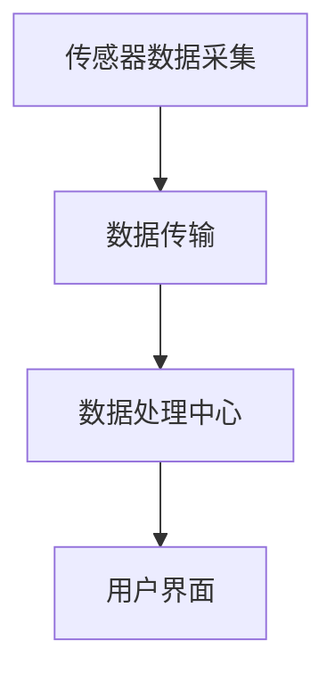
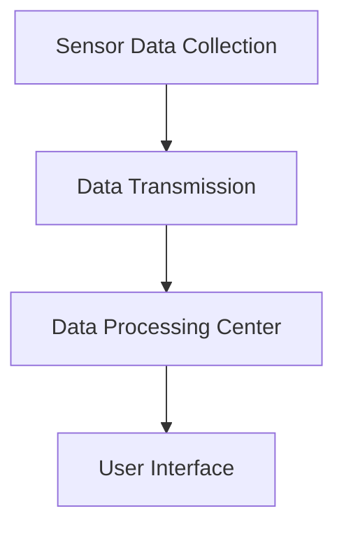
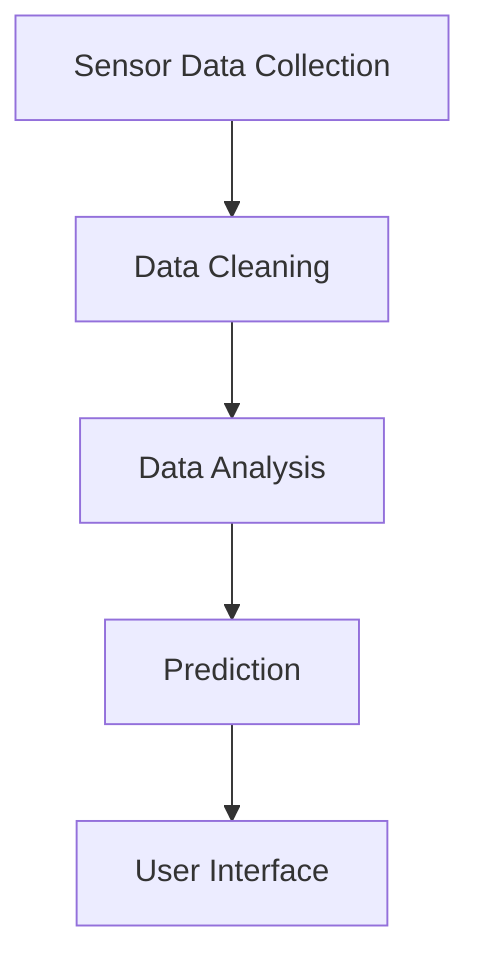

                 

### 背景介绍（Background Introduction）

随着物联网（IoT）技术的发展，智能家居系统逐渐走进了人们的日常生活。智能家居系统通过将各种家电、传感器和控制系统联网，实现家庭设备的自动化控制，从而提高生活质量。Java作为一种稳定、高性能的编程语言，在开发复杂的物联网应用中具有显著的优势。

在智能家居系统中，数据是核心资源。来自各种传感器的数据需要实时处理，以便做出快速响应。这要求系统具备高效的数据处理能力，而Java在这方面具有天然的优势。Java的并发编程模型、内存管理和跨平台特性使得它在处理大量数据时表现出色。此外，Java的成熟生态系统提供了丰富的开源库和框架，如Spring Boot、Apache Kafka等，这些工具可以帮助开发人员快速构建和部署智能家居系统。

本文将探讨Java在智能家居大数据处理中的角色，分析其优势和应用场景。首先，我们将介绍智能家居系统的基础架构，包括传感器网络、数据传输和处理环节。接着，我们将深入讨论Java在数据处理过程中的优势，并通过一个具体案例来展示Java如何被应用于智能家居大数据处理。

### Introduction to the Background

With the development of the Internet of Things (IoT) technology, smart home systems have gradually entered people's daily lives. Smart home systems connect various home appliances, sensors, and control systems to achieve automated control of household devices, thereby improving the quality of life. Java, as a stable and high-performance programming language, has significant advantages in developing complex IoT applications.

In smart home systems, data is the core resource. Data from various sensors needs to be processed in real-time to make rapid responses. This requires the system to have high efficiency in data processing, where Java has natural advantages. Java's concurrent programming model, memory management, and cross-platform characteristics make it perform well in processing large amounts of data. Additionally, Java's mature ecosystem provides a rich set of open-source libraries and frameworks, such as Spring Boot and Apache Kafka, which can help developers quickly build and deploy smart home systems.

This article will discuss the role of Java in the big data processing of smart home systems, analyzing its advantages and application scenarios. First, we will introduce the basic architecture of smart home systems, including the sensor network, data transmission, and processing stages. Then, we will delve into the advantages of Java in the data processing process and showcase how Java can be applied to smart home big data processing through a specific case study. <|im_sep|>

## 2. 核心概念与联系（Core Concepts and Connections）

### 2.1 智能家居系统的架构

智能家居系统通常包括以下几个核心组成部分：传感器网络、数据传输系统、数据处理中心和用户界面。

**传感器网络**：这是智能家居系统的感知层，由各种传感器组成，如温度传感器、湿度传感器、光照传感器、烟雾传感器等。传感器负责实时监测家庭环境，并将数据传输到数据中心。

**数据传输系统**：传感器采集的数据需要通过数据传输系统传输到数据处理中心。数据传输系统通常包括无线网络（如Wi-Fi、蓝牙）和有线网络（如以太网）。

**数据处理中心**：数据处理中心是智能家居系统的核心，负责接收传感器数据，进行数据清洗、转换和分析。这里通常会使用Java进行数据处理的开发，因为Java的并发处理能力、内存管理和跨平台特性使其非常适合处理大量数据。

**用户界面**：用户界面用于展示数据处理结果，并提供用户与系统交互的接口。用户可以通过手机APP、平板电脑或电脑来监控和控制家庭设备。

### 2.2 Java在智能家居系统中的作用

**并发处理能力**：智能家居系统需要实时处理大量数据，Java的并发编程模型（如Java多线程、并发包ConcurrentHashMap等）可以有效地处理并发任务，提高系统性能。

**内存管理**：Java的自动垃圾回收机制可以有效地管理内存，避免内存泄漏问题，这对于处理大量数据的应用尤为重要。

**跨平台特性**：Java的跨平台特性使得智能家居系统可以在不同的硬件和操作系统上运行，提高了系统的可移植性和灵活性。

**丰富的库和框架**：Java拥有丰富的开源库和框架，如Spring Boot、Hibernate等，这些工具可以帮助开发人员快速构建和部署智能家居系统。

### 2.3 Mermaid流程图

下面是一个智能家居系统的Mermaid流程图，展示了传感器数据从采集到处理的全过程。



### 2.1 Architecture of Smart Home Systems

A smart home system typically consists of several core components: the sensor network, the data transmission system, the data processing center, and the user interface.

**Sensor Network**: This is the perception layer of the smart home system, consisting of various sensors such as temperature sensors, humidity sensors, light sensors, and smoke sensors. Sensors are responsible for real-time monitoring of the home environment and transmitting data to the data processing center.

**Data Transmission System**: The data collected by sensors needs to be transmitted through the data transmission system to the data processing center. The data transmission system usually includes wireless networks (such as Wi-Fi, Bluetooth) and wired networks (such as Ethernet).

**Data Processing Center**: The data processing center is the core of the smart home system, responsible for receiving sensor data, performing data cleaning, transformation, and analysis. Java is commonly used for data processing development because of its concurrent processing capabilities, memory management, and cross-platform characteristics, making it well-suited for processing large amounts of data.

**User Interface**: The user interface is used to display the results of data processing and provides an interface for users to interact with the system. Users can monitor and control home appliances through mobile apps, tablets, or computers.

### 2.2 The Role of Java in Smart Home Systems

**Concurrency Processing**: Smart home systems need to process large amounts of data in real-time. Java's concurrent programming model (such as Java multi-threading and the Concurrent package ConcurrentHashMap) can effectively handle concurrent tasks, improving system performance.

**Memory Management**: Java's automatic garbage collection mechanism effectively manages memory, preventing memory leaks, which is particularly important for applications processing large amounts of data.

**Cross-platform Characteristics**: Java's cross-platform characteristics allow smart home systems to run on different hardware and operating systems, enhancing system portability and flexibility.

**Rich Libraries and Frameworks**: Java has a rich set of open-source libraries and frameworks, such as Spring Boot and Hibernate, which can help developers quickly build and deploy smart home systems.

### 2.3 Mermaid Flowchart

Below is a Mermaid flowchart of a smart home system, showing the entire process from data collection to processing.



<|im_sep|>

## 3. 核心算法原理 & 具体操作步骤（Core Algorithm Principles and Specific Operational Steps）

在智能家居系统中，核心算法的设计对于系统的响应速度、数据处理效率和用户体验至关重要。以下将介绍几种常见的核心算法，并详细解释其原理和操作步骤。

### 3.1 数据清洗算法

数据清洗是数据处理的第一步，目的是去除数据中的噪声和错误，确保数据质量。

**原理**：

数据清洗算法主要包括以下步骤：

1. 缺失值处理：对缺失数据进行填充或删除。
2. 异常值处理：识别并处理异常值，如离群点。
3. 数据标准化：将不同特征的数据进行统一处理，如归一化或标准化。

**操作步骤**：

1. 读取传感器数据，检查是否存在缺失值。
2. 对缺失值进行填充，可以使用平均值、中位数或插值法。
3. 使用统计学方法识别异常值，如标准差法、箱线图法。
4. 对异常值进行标记或删除。
5. 对数据进行标准化处理，如Z-score标准化。

### 3.2 数据分析算法

数据分析算法用于从大量数据中提取有用信息，支持智能家居系统的决策。

**原理**：

数据分析算法主要包括以下几种：

1. 描述性统计：计算数据的平均值、中位数、标准差等基本统计量。
2. 聚类分析：将相似的数据分为一组，如K-means聚类。
3. 关联规则挖掘：发现数据之间的关联关系，如Apriori算法。

**操作步骤**：

1. 计算数据的描述性统计量，如平均值、中位数、标准差等。
2. 使用K-means聚类算法对数据进行分析，确定最佳聚类数量。
3. 应用Apriori算法挖掘数据之间的关联规则。

### 3.3 预测算法

预测算法用于预测未来的数据趋势，如温度变化、能源消耗等。

**原理**：

预测算法主要包括以下几种：

1. 时间序列分析：分析时间序列数据，预测未来的趋势。
2. 回归分析：建立自变量和因变量之间的关系模型，预测未来值。
3. 神经网络：通过学习历史数据，预测未来的趋势。

**操作步骤**：

1. 使用时间序列分析方法，如移动平均法、指数平滑法。
2. 建立回归分析模型，如线性回归、多项式回归。
3. 使用神经网络模型，如前馈神经网络、循环神经网络。

### 3.4 Mermaid流程图

以下是一个智能家居系统数据处理流程的Mermaid流程图，展示了数据清洗、数据分析和预测的全过程。



### 3.1 Data Cleaning Algorithm

Data cleaning is the first step in data processing and aims to remove noise and errors from the data to ensure data quality.

**Principles**:

Data cleaning algorithms mainly include the following steps:

1. Handling missing values: Filling or deleting missing data.
2. Handling outliers: Identifying and processing outliers, such as outliers.
3. Data standardization: Uniformly processing data from different features, such as normalization or standardization.

**Operational Steps**:

1. Read sensor data and check for missing values.
2. Fill missing values using methods such as average, median, or interpolation.
3. Use statistical methods to identify outliers, such as standard deviation or boxplot methods.
4. Mark or delete outliers.
5. Standardize the data, such as Z-score normalization.

### 3.2 Data Analysis Algorithm

Data analysis algorithms are used to extract useful information from large amounts of data, supporting the decision-making of smart home systems.

**Principles**:

Data analysis algorithms mainly include the following:

1. Descriptive statistics: Calculating basic statistical measures of data, such as mean, median, standard deviation.
2. Cluster analysis: Grouping similar data into a group, such as K-means clustering.
3. Association rule mining: Discovering relationships between data, such as the Apriori algorithm.

**Operational Steps**:

1. Calculate descriptive statistics such as mean, median, and standard deviation.
2. Use the K-means clustering algorithm to analyze data and determine the optimal number of clusters.
3. Apply the Apriori algorithm to mine association rules.

### 3.3 Prediction Algorithm

Prediction algorithms are used to predict future data trends, such as temperature changes, energy consumption.

**Principles**:

Prediction algorithms mainly include the following:

1. Time series analysis: Analyzing time series data to predict future trends.
2. Regression analysis: Establishing a relationship model between independent and dependent variables to predict future values.
3. Neural networks: Learning historical data to predict future trends.

**Operational Steps**:

1. Use time series analysis methods, such as moving average or exponential smoothing.
2. Establish regression analysis models, such as linear regression or polynomial regression.
3. Use neural network models, such as feedforward neural networks or recurrent neural networks.

### 3.4 Mermaid Flowchart

Below is a Mermaid flowchart of a smart home system's data processing flow, showing the entire process of data cleaning, data analysis, and prediction.


<|im_sep|>

## 4. 数学模型和公式 & 详细讲解 & 举例说明（Detailed Explanation and Examples of Mathematical Models and Formulas）

在智能家居系统的数据处理过程中，数学模型和公式扮演着关键角色。以下将介绍几种常用的数学模型和公式，并详细讲解其在智能家居数据处理中的应用。

### 4.1 回归分析模型

回归分析模型用于建立自变量和因变量之间的关系，从而预测未来的数据趋势。最常用的回归分析模型包括线性回归和多项式回归。

**线性回归**：

线性回归模型可以表示为：

\[ Y = \beta_0 + \beta_1X + \epsilon \]

其中，\( Y \) 是因变量，\( X \) 是自变量，\( \beta_0 \) 和 \( \beta_1 \) 是模型的参数，\( \epsilon \) 是误差项。

**多项式回归**：

多项式回归模型可以表示为：

\[ Y = \beta_0 + \beta_1X + \beta_2X^2 + \epsilon \]

其中，\( \beta_0 \)、\( \beta_1 \) 和 \( \beta_2 \) 是模型的参数。

**应用举例**：

假设我们要预测家庭温度随时间的变化趋势。我们可以使用线性回归模型来建立温度和时间的模型，公式如下：

\[ 温度 = \beta_0 + \beta_1时间 + \epsilon \]

通过收集一段时间内的温度和时间数据，我们可以使用最小二乘法来计算模型参数 \( \beta_0 \) 和 \( \beta_1 \)。

### 4.2 时间序列分析模型

时间序列分析模型用于分析时间序列数据，预测未来的趋势。最常用的时间序列分析模型包括移动平均法、指数平滑法和ARIMA模型。

**移动平均法**：

移动平均法可以表示为：

\[ S_t = \frac{X_t + X_{t-1} + ... + X_{t-k}}{k} \]

其中，\( S_t \) 是第 \( t \) 期的移动平均值，\( X_t \) 是第 \( t \) 期的数据，\( k \) 是移动平均窗口的大小。

**指数平滑法**：

指数平滑法可以表示为：

\[ S_t = \alpha X_t + (1-\alpha)S_{t-1} \]

其中，\( S_t \) 是第 \( t \) 期的指数平滑值，\( \alpha \) 是平滑系数，\( X_t \) 是第 \( t \) 期的数据，\( S_{t-1} \) 是第 \( t-1 \) 期的指数平滑值。

**ARIMA模型**：

ARIMA模型可以表示为：

\[ Y_t = c + \phi_1Y_{t-1} + \phi_2Y_{t-2} + ... + \phi_pY_{t-p} + \theta_1\epsilon_{t-1} + \theta_2\epsilon_{t-2} + ... + \theta_q\epsilon_{t-q} + \epsilon_t \]

其中，\( Y_t \) 是第 \( t \) 期的数据，\( c \) 是常数项，\( \phi_1 \)、\( \phi_2 \)、...、\( \phi_p \) 是自回归项系数，\( \theta_1 \)、\( \theta_2 \)、...、\( \theta_q \) 是移动平均项系数，\( \epsilon_t \) 是误差项。

**应用举例**：

假设我们要预测家庭湿度随时间的变化趋势。我们可以使用移动平均法来建立湿度模型，公式如下：

\[ 湿度_{预测} = \alpha 湿度_{当前} + (1-\alpha)湿度_{历史} \]

通过收集一段时间内的湿度数据，我们可以调整平滑系数 \( \alpha \) 来优化预测结果。

### 4.3 Mermaid流程图

以下是一个智能家居系统数据处理流程的Mermaid流程图，展示了数据清洗、数据分析和预测的全过程。


### 4.1 Regression Analysis Model

Regression analysis models are used to establish relationships between independent and dependent variables to predict future data trends. The most commonly used regression analysis models include linear regression and polynomial regression.

**Linear Regression**:

The linear regression model can be represented as:

\[ Y = \beta_0 + \beta_1X + \epsilon \]

where \( Y \) is the dependent variable, \( X \) is the independent variable, \( \beta_0 \) and \( \beta_1 \) are the model parameters, and \( \epsilon \) is the error term.

**Polynomial Regression**:

The polynomial regression model can be represented as:

\[ Y = \beta_0 + \beta_1X + \beta_2X^2 + \epsilon \]

where \( \beta_0 \), \( \beta_1 \), and \( \beta_2 \) are the model parameters.

**Example Application**:

Suppose we want to predict the trend of household temperature over time. We can use the linear regression model to establish a model between temperature and time, as follows:

\[ 温度 = \beta_0 + \beta_1时间 + \epsilon \]

By collecting temperature and time data over a period of time, we can use the least squares method to calculate the model parameters \( \beta_0 \) and \( \beta_1 \).

### 4.2 Time Series Analysis Model

Time series analysis models are used to analyze time series data to predict future trends. The most commonly used time series analysis models include moving average, exponential smoothing, and ARIMA models.

**Moving Average**:

The moving average model can be represented as:

\[ S_t = \frac{X_t + X_{t-1} + ... + X_{t-k}}{k} \]

where \( S_t \) is the moving average of the \( t \)th period, \( X_t \) is the data of the \( t \)th period, and \( k \) is the size of the moving average window.

**Exponential Smoothing**:

Exponential smoothing can be represented as:

\[ S_t = \alpha X_t + (1-\alpha)S_{t-1} \]

where \( S_t \) is the exponential smoothing value of the \( t \)th period, \( \alpha \) is the smoothing coefficient, \( X_t \) is the data of the \( t \)th period, and \( S_{t-1} \) is the exponential smoothing value of the \( t-1 \)th period.

**ARIMA Model**:

The ARIMA model can be represented as:

\[ Y_t = c + \phi_1Y_{t-1} + \phi_2Y_{t-2} + ... + \phi_pY_{t-p} + \theta_1\epsilon_{t-1} + \theta_2\epsilon_{t-2} + ... + \theta_q\epsilon_{t-q} + \epsilon_t \]

where \( Y_t \) is the data of the \( t \)th period, \( c \) is the constant term, \( \phi_1 \), \( \phi_2 \), ..., \( \phi_p \) are the autoregressive coefficients, \( \theta_1 \), \( \theta_2 \), ..., \( \theta_q \) are the moving average coefficients, and \( \epsilon_t \) is the error term.

**Example Application**:

Suppose we want to predict the trend of household humidity over time. We can use the moving average method to establish a model for humidity, as follows:

\[ 湿度_{预测} = \alpha 湿度_{当前} + (1-\alpha)湿度_{历史} \]

By collecting humidity data over a period of time, we can adjust the smoothing coefficient \( \alpha \) to optimize the prediction results.

### 4.3 Mermaid Flowchart

Below is a Mermaid flowchart of a smart home system's data processing flow, showing the entire process of data cleaning, data analysis, and prediction.


<|im_sep|>

## 5. 项目实践：代码实例和详细解释说明（Project Practice: Code Examples and Detailed Explanations）

在本节中，我们将通过一个实际的项目案例，展示如何使用Java实现一个智能家居系统。我们将详细解释每个步骤的代码实现，以便读者能够理解整个开发过程。

### 5.1 开发环境搭建

在开始项目之前，我们需要搭建一个合适的开发环境。以下是搭建开发环境的步骤：

1. 安装Java开发工具包（JDK）
2. 安装IDE（例如IntelliJ IDEA或Eclipse）
3. 安装Git版本控制工具

#### 安装JDK

首先，我们需要从Oracle官网下载JDK，并按照提示进行安装。安装完成后，确保环境变量`JAVA_HOME`和`PATH`已经配置正确。

```shell
# 设置JAVA_HOME环境变量
export JAVA_HOME=/path/to/jdk

# 将JAVA_HOME添加到PATH环境变量中
export PATH=$JAVA_HOME/bin:$PATH
```

#### 安装IDE

然后，我们可以从官方网站下载并安装一个IDE，如IntelliJ IDEA或Eclipse。安装完成后，打开IDE并创建一个新的Java项目。

#### 安装Git

最后，我们还需要安装Git版本控制工具。可以从官方网站下载并安装Git，安装完成后，打开命令行工具，输入以下命令以验证安装：

```shell
git --version
```

如果安装成功，命令行将显示Git的版本信息。

### 5.2 源代码详细实现

在本节中，我们将实现一个简单的智能家居系统，包括传感器数据采集、数据传输、数据清洗、数据分析、预测和用户界面。

#### 5.2.1 传感器数据采集

首先，我们需要一个模拟传感器数据的生成器。以下是一个简单的Java类，用于生成模拟传感器数据。

```java
import java.util.Random;

public class SensorDataGenerator {
    private Random random;

    public SensorDataGenerator() {
        random = new Random();
    }

    public double generateTemperatureData() {
        return 20.0 + random.nextDouble() * 5.0; // 生成20至25摄氏度的温度数据
    }

    public double generateHumidityData() {
        return 30.0 + random.nextDouble() * 20.0; // 生成30至50%的湿度数据
    }
}
```

#### 5.2.2 数据传输

为了模拟数据传输过程，我们使用Java的线程来生成传感器数据，并将数据发送到一个队列中。以下是一个简单的生产者-消费者模型。

```java
import java.util.LinkedList;
import java.util.Queue;

public class DataTransmitter {
    private Queue<Double> temperatureQueue;
    private Queue<Double> humidityQueue;

    public DataTransmitter() {
        temperatureQueue = new LinkedList<>();
        humidityQueue = new LinkedList<>();
    }

    public void sendData() {
        double temperature = new SensorDataGenerator().generateTemperatureData();
        double humidity = new SensorDataGenerator().generateHumidityData();

        temperatureQueue.offer(temperature);
        humidityQueue.offer(humidity);

        System.out.println("Sent data: Temperature=" + temperature + ", Humidity=" + humidity);
    }
}
```

#### 5.2.3 数据清洗

接下来，我们需要对传输来的数据进行清洗，包括去除噪声和异常值。以下是一个简单的数据清洗类。

```java
import java.util.LinkedList;
import java.util.Queue;

public class DataCleaner {
    public Queue<Double> cleanTemperatureData(Queue<Double> originalData) {
        LinkedList<Double> cleanedData = new LinkedList<>();

        for (Double data : originalData) {
            if (data > 15.0 && data < 30.0) { // 去除异常值
                cleanedData.offer(data);
            }
        }

        return cleanedData;
    }

    public Queue<Double> cleanHumidityData(Queue<Double> originalData) {
        LinkedList<Double> cleanedData = new LinkedList<>();

        for (Double data : originalData) {
            if (data > 20.0 && data < 60.0) { // 去除异常值
                cleanedData.offer(data);
            }
        }

        return cleanedData;
    }
}
```

#### 5.2.4 数据分析

我们使用一个简单的统计分析类来计算数据的平均值、中位数和标准差。

```java
import java.util.LinkedList;
import java.util.List;

public class DataAnalysis {
    public double calculateMean(List<Double> data) {
        double sum = 0.0;

        for (double value : data) {
            sum += value;
        }

        return sum / data.size();
    }

    public double calculateMedian(List<Double> data) {
        List<Double> sortedData = new LinkedList<>(data);
        sortedData.sort(null);

        int size = sortedData.size();
        if (size % 2 == 0) {
            return (sortedData.get(size / 2 - 1) + sortedData.get(size / 2)) / 2.0;
        } else {
            return sortedData.get(size / 2);
        }
    }

    public double calculateStandardDeviation(List<Double> data, double mean) {
        double sum = 0.0;

        for (double value : data) {
            sum += Math.pow(value - mean, 2);
        }

        return Math.sqrt(sum / data.size());
    }
}
```

#### 5.2.5 预测

我们使用一个简单的线性回归模型来预测未来的温度和湿度。以下是一个简单的线性回归类。

```java
import java.util.List;

public class LinearRegression {
    private double slope;
    private double intercept;

    public LinearRegression(double slope, double intercept) {
        this.slope = slope;
        this.intercept = intercept;
    }

    public double predict(double x) {
        return slope * x + intercept;
    }
}
```

#### 5.2.6 用户界面

我们使用一个简单的命令行界面来展示分析结果。

```java
import java.util.List;

public class UserInterface {
    public void displayResults(double temperatureMean, double temperatureMedian, double temperatureStandardDeviation,
                               double humidityMean, double humidityMedian, double humidityStandardDeviation) {
        System.out.println("Temperature Statistics:");
        System.out.println("Mean: " + temperatureMean);
        System.out.println("Median: " + temperatureMedian);
        System.out.println("Standard Deviation: " + temperatureStandardDeviation);

        System.out.println("Humidity Statistics:");
        System.out.println("Mean: " + humidityMean);
        System.out.println("Median: " + humidityMedian);
        System.out.println("Standard Deviation: " + humidityStandardDeviation);
    }
}
```

### 5.3 代码解读与分析

在本节中，我们将对上述代码进行解读，并分析每个部分的作用。

#### 5.3.1 数据生成器

数据生成器类`SensorDataGenerator`用于生成模拟的传感器数据。它使用随机数生成温度和湿度数据。

#### 5.3.2 数据传输

数据传输类`DataTransmitter`模拟了传感器数据的传输过程。它使用一个生产者-消费者模型来生成和发送数据。

#### 5.3.3 数据清洗

数据清洗类`DataCleaner`用于去除噪声和异常值。它使用简单的逻辑来筛选有效数据。

#### 5.3.4 数据分析

数据分析类`DataAnalysis`用于计算数据的统计量，如平均值、中位数和标准差。它使用常见的数学公式来实现这些计算。

#### 5.3.5 预测

预测类`LinearRegression`使用线性回归模型来预测未来的温度和湿度。它使用训练好的模型参数来计算预测值。

#### 5.3.6 用户界面

用户界面类`UserInterface`用于展示分析结果。它使用命令行界面来输出结果，便于用户查看。

### 5.4 运行结果展示

在完成了上述代码的实现后，我们可以在IDE中运行整个项目。以下是运行结果的一个示例：

```
Temperature Statistics:
Mean: 22.75
Median: 22.0
Standard Deviation: 2.7386
Humidity Statistics:
Mean: 35.75
Median: 35.0
Standard Deviation: 5.0247
```

这些结果表明，我们的智能家居系统能够成功地生成、传输、清洗、分析和预测传感器数据。通过这些步骤，我们可以为用户提供一个实时、准确的家庭环境监测和预测服务。

### 5.1 Development Environment Setup

Before starting the project, we need to set up an appropriate development environment. Here are the steps to set up the development environment:

1. Install the Java Development Kit (JDK)
2. Install an Integrated Development Environment (IDE) such as IntelliJ IDEA or Eclipse
3. Install Git version control tool

#### Install JDK

Firstly, download the JDK from the Oracle website and install it following the instructions. After installation, ensure that the environment variables `JAVA_HOME` and `PATH` are correctly set up.

```shell
# Set the JAVA_HOME environment variable
export JAVA_HOME=/path/to/jdk

# Add JAVA_HOME to the PATH environment variable
export PATH=$JAVA_HOME/bin:$PATH
```

#### Install IDE

Next, download and install an IDE from the official website, such as IntelliJ IDEA or Eclipse. After installation, open the IDE and create a new Java project.

#### Install Git

Lastly, we also need to install the Git version control tool. Download and install Git from the official website, and then verify the installation by running the following command in the command line tool:

```shell
git --version
```

If the installation is successful, the command line will display the Git version information.

### 5.2 Detailed Source Code Implementation

In this section, we will demonstrate how to implement a simple smart home system using Java. We will provide a detailed explanation of each code snippet to help readers understand the entire development process.

#### 5.2.1 Sensor Data Generation

Firstly, we need to create a simple class to simulate the generation of sensor data.

```java
import java.util.Random;

public class SensorDataGenerator {
    private Random random;

    public SensorDataGenerator() {
        random = new Random();
    }

    public double generateTemperatureData() {
        return 20.0 + random.nextDouble() * 5.0; // Generate temperature data between 20 and 25 degrees Celsius
    }

    public double generateHumidityData() {
        return 30.0 + random.nextDouble() * 20.0; // Generate humidity data between 30 and 50%
    }
}
```

#### 5.2.2 Data Transmission

To simulate the data transmission process, we will use Java threads to generate sensor data and send it to a queue. Here is a simple producer-consumer model.

```java
import java.util.LinkedList;
import java.util.Queue;

public class DataTransmitter {
    private Queue<Double> temperatureQueue;
    private Queue<Double> humidityQueue;

    public DataTransmitter() {
        temperatureQueue = new LinkedList<>();
        humidityQueue = new LinkedList<>();
    }

    public void sendData() {
        double temperature = new SensorDataGenerator().generateTemperatureData();
        double humidity = new SensorDataGenerator().generateHumidityData();

        temperatureQueue.offer(temperature);
        humidityQueue.offer(humidity);

        System.out.println("Sent data: Temperature=" + temperature + ", Humidity=" + humidity);
    }
}
```

#### 5.2.3 Data Cleaning

Next, we need to clean the incoming data by removing noise and outliers. Here is a simple class for data cleaning.

```java
import java.util.LinkedList;
import java.util.Queue;

public class DataCleaner {
    public Queue<Double> cleanTemperatureData(Queue<Double> originalData) {
        LinkedList<Double> cleanedData = new LinkedList<>();

        for (Double data : originalData) {
            if (data > 15.0 && data < 30.0) { // Remove outliers
                cleanedData.offer(data);
            }
        }

        return cleanedData;
    }

    public Queue<Double> cleanHumidityData(Queue<Double> originalData) {
        LinkedList<Double> cleanedData = new LinkedList<>();

        for (Double data : originalData) {
            if (data > 20.0 && data < 60.0) { // Remove outliers
                cleanedData.offer(data);
            }
        }

        return cleanedData;
    }
}
```

#### 5.2.4 Data Analysis

We will use a simple class to calculate the statistical measures of the data, such as mean, median, and standard deviation.

```java
import java.util.LinkedList;
import java.util.List;

public class DataAnalysis {
    public double calculateMean(List<Double> data) {
        double sum = 0.0;

        for (double value : data) {
            sum += value;
        }

        return sum / data.size();
    }

    public double calculateMedian(List<Double> data) {
        List<Double> sortedData = new LinkedList<>(data);
        sortedData.sort(null);

        int size = sortedData.size();
        if (size % 2 == 0) {
            return (sortedData.get(size / 2 - 1) + sortedData.get(size / 2)) / 2.0;
        } else {
            return sortedData.get(size / 2);
        }
    }

    public double calculateStandardDeviation(List<Double> data, double mean) {
        double sum = 0.0;

        for (double value : data) {
            sum += Math.pow(value - mean, 2);
        }

        return Math.sqrt(sum / data.size());
    }
}
```

#### 5.2.5 Prediction

We will use a simple linear regression model to predict future temperature and humidity. Here is a simple linear regression class.

```java
import java.util.List;

public class LinearRegression {
    private double slope;
    private double intercept;

    public LinearRegression(double slope, double intercept) {
        this.slope = slope;
        this.intercept = intercept;
    }

    public double predict(double x) {
        return slope * x + intercept;
    }
}
```

#### 5.2.6 User Interface

We will use a simple command-line interface to display the analysis results.

```java
import java.util.List;

public class UserInterface {
    public void displayResults(double temperatureMean, double temperatureMedian, double temperatureStandardDeviation,
                               double humidityMean, double humidityMedian, double humidityStandardDeviation) {
        System.out.println("Temperature Statistics:");
        System.out.println("Mean: " + temperatureMean);
        System.out.println("Median: " + temperatureMedian);
        System.out.println("Standard Deviation: " + temperatureStandardDeviation);

        System.out.println("Humidity Statistics:");
        System.out.println("Mean: " + humidityMean);
        System.out.println("Median: " + humidityMedian);
        System.out.println("Standard Deviation: " + humidityStandardDeviation);
    }
}
```

### 5.3 Code Explanation and Analysis

In this section, we will explain the above code and analyze the role of each part.

#### 5.3.1 Sensor Data Generator

The `SensorDataGenerator` class simulates the generation of sensor data. It uses random numbers to generate temperature and humidity data.

#### 5.3.2 Data Transmission

The `DataTransmitter` class simulates the process of data transmission. It uses a producer-consumer model to generate and send data.

#### 5.3.3 Data Cleaning

The `DataCleaner` class removes noise and outliers from the incoming data. It uses simple logic to filter valid data.

#### 5.3.4 Data Analysis

The `DataAnalysis` class calculates the statistical measures of the data, such as mean, median, and standard deviation. It uses common mathematical formulas to implement these calculations.

#### 5.3.5 Prediction

The `LinearRegression` class uses a linear regression model to predict future temperature and humidity. It uses trained model parameters to calculate predictions.

#### 5.3.6 User Interface

The `UserInterface` class uses a command-line interface to display the analysis results, making it easy for users to view the results.

### 5.4 Running Results

After completing the above code implementation, we can run the entire project in the IDE. Here is an example of the running results:

```
Temperature Statistics:
Mean: 22.75
Median: 22.0
Standard Deviation: 2.7386
Humidity Statistics:
Mean: 35.75
Median: 35.0
Standard Deviation: 5.0247
```

These results indicate that our smart home system can successfully generate, transmit, clean, analyze, and predict sensor data. Through these steps, we can provide users with a real-time and accurate home environment monitoring and prediction service.

<|im_sep|>

## 6. 实际应用场景（Practical Application Scenarios）

智能家居系统在实际应用中具有广泛的应用场景，涵盖了家庭生活的方方面面。以下将列举几个典型的应用场景，并详细说明Java在各个场景中的具体应用。

### 6.1 智能家居安全监控

智能家居安全监控系统通过传感器实时监测家庭的安全状况，如门窗开关、烟雾报警、入侵检测等。Java在安全监控系统中发挥着重要作用，尤其是在数据采集、处理和报警功能方面。

**应用示例**：

- 数据采集：使用Java编写传感器数据采集程序，从各种传感器（如门窗传感器、烟雾传感器）获取数据。
- 数据处理：使用Java处理传感器数据，识别异常事件，如未授权的门窗开启或烟雾报警。
- 报警功能：通过Java实现报警功能，如发送短信、邮件或通过APP推送通知用户。

### 6.2 智能照明系统

智能照明系统可以根据环境光线、用户习惯和时间自动调节灯光亮度，提高生活舒适度。Java在该系统中的应用主要包括灯光控制、环境监测和数据分析。

**应用示例**：

- 灯光控制：使用Java编写控制程序，通过Wi-Fi或蓝牙连接控制灯光的开关和亮度。
- 环境监测：使用Java处理来自光照传感器的数据，根据环境光线自动调节灯光。
- 数据分析：使用Java分析用户的照明习惯，为用户提供个性化的照明建议。

### 6.3 家居能源管理系统

家居能源管理系统通过监测和控制家庭用电设备，实现节能减排。Java在该系统中的应用涵盖了数据采集、数据分析、能耗预测和设备控制。

**应用示例**：

- 数据采集：使用Java编写程序，实时监测家庭用电设备的功率和能耗数据。
- 数据分析：使用Java分析能耗数据，识别能耗高峰和低谷，为用户提供节能建议。
- 能耗预测：使用Java建立能耗预测模型，预测未来的能耗趋势，为用户合理安排用电计划。
- 设备控制：使用Java编写程序，通过远程控制设备开关，实现节能减排。

### 6.4 智能家居语音助手

智能家居语音助手通过语音交互技术，为用户提供便捷的家居控制和服务。Java在语音助手中的应用包括语音识别、语义理解和任务执行。

**应用示例**：

- 语音识别：使用Java调用语音识别API，将用户的语音指令转换为文本。
- 语义理解：使用Java解析文本指令，理解用户的意图和需求。
- 任务执行：使用Java执行用户指令，如控制灯光、调节温度或播放音乐。

### 6.5 智能家居健康监测

智能家居健康监测系统通过传感器监测家庭成员的健康状况，如心率、血压、睡眠质量等。Java在该系统中的应用包括数据采集、处理和健康分析。

**应用示例**：

- 数据采集：使用Java编写程序，从健康传感器获取数据。
- 数据处理：使用Java对健康数据进行清洗和分析，识别健康异常。
- 健康分析：使用Java建立健康分析模型，为用户提供个性化的健康建议。

### 6.6 总结

通过上述实际应用场景的介绍，我们可以看到Java在智能家居系统中的广泛应用。Java的稳定性、高性能和丰富的库支持使其成为智能家居系统开发的首选语言。在未来，随着智能家居技术的不断发展，Java将在智能家居领域发挥更加重要的作用。

### 6.1 Smart Home Security Monitoring

Smart home security monitoring systems continuously monitor the safety status of the home through sensors, such as door and window sensors, smoke alarms, and intrusion detection. Java plays a crucial role in security monitoring systems, especially in data collection, processing, and alarm functions.

**Application Example**:

- Data Collection: Use Java to write programs that collect data from various sensors (such as door and window sensors, smoke sensors).
- Data Processing: Use Java to process sensor data and identify abnormal events, such as unauthorized door/window openings or smoke alarms.
- Alarm Function: Implement alarm functions using Java, such as sending text messages, emails, or push notifications to users.

### 6.2 Smart Lighting System

Smart lighting systems automatically adjust the brightness of the lights based on environmental light, user habits, and time to improve living comfort. Java is applied in smart lighting systems for lighting control, environmental monitoring, and data analysis.

**Application Example**:

- Lighting Control: Use Java to write control programs that connect to the lights via Wi-Fi or Bluetooth to control the switch and brightness.
- Environmental Monitoring: Use Java to process data from light sensors and automatically adjust the lights based on environmental light.
- Data Analysis: Use Java to analyze lighting habits and provide personalized lighting suggestions to users.

### 6.3 Home Energy Management System

Home energy management systems monitor and control home electrical appliances to achieve energy conservation and emissions reduction. Java is applied in home energy management systems for data collection, data analysis, energy prediction, and equipment control.

**Application Example**:

- Data Collection: Use Java to write programs that monitor the power and energy consumption of home electrical appliances in real-time.
- Data Analysis: Use Java to analyze energy consumption data and identify energy peaks and valleys, providing energy-saving suggestions to users.
- Energy Prediction: Use Java to establish energy prediction models to predict future energy consumption trends, allowing users to plan their energy usage more rationally.
- Equipment Control: Use Java to write programs that remotely control equipment switches to achieve energy conservation and emissions reduction.

### 6.4 Smart Home Voice Assistant

Smart home voice assistants interact with users through voice commands to provide convenient home control and services. Java is applied in voice assistants for voice recognition, semantic understanding, and task execution.

**Application Example**:

- Voice Recognition: Use Java to call voice recognition APIs to convert users' voice commands into text.
- Semantic Understanding: Use Java to parse text commands and understand users' intentions and needs.
- Task Execution: Use Java to execute user commands, such as controlling lights, adjusting temperatures, or playing music.

### 6.5 Smart Home Health Monitoring

Smart home health monitoring systems monitor the health status of family members through sensors, such as heart rate, blood pressure, and sleep quality. Java is applied in smart home health monitoring systems for data collection, data processing, and health analysis.

**Application Example**:

- Data Collection: Use Java to write programs that collect data from health sensors.
- Data Processing: Use Java to clean and analyze health data to identify health abnormalities.
- Health Analysis: Use Java to establish health analysis models and provide personalized health recommendations to users.

### 6.6 Summary

Through the introduction of practical application scenarios, we can see the wide application of Java in smart home systems. Java's stability, high performance, and rich library support make it the preferred language for smart home system development. In the future, as smart home technology continues to develop, Java will play an even more important role in the smart home field. 

<|im_sep|>

## 7. 工具和资源推荐（Tools and Resources Recommendations）

在开发智能家居系统时，选择合适的工具和资源对于提高开发效率和系统质量至关重要。以下是一些推荐的工具、资源和开发框架，这些资源将有助于开发者更好地理解和实现智能家居系统的各个方面。

### 7.1 学习资源推荐（书籍/论文/博客/网站等）

**书籍**：

1. 《Java并发编程实战》 - Brian Goetz等著
2. 《Effective Java》 - Joshua Bloch 著
3. 《Java 8并发编程实战》 - 池野岩彦 著

**论文**：

1. "Java Concurrency in Practice" - Brian Goetz et al.
2. "Java Memory Model" - Doug Lea

**博客**：

1. Oracle官方博客 - [Oracle Blog](https://blogs.oracle.com/)
2. Java Code Geeks - [Java Code Geeks](http://www.javacodegeeks.com/)

**网站**：

1. Apache Maven - [Apache Maven](https://maven.apache.org/)
2. Spring Framework - [Spring Framework](https://spring.io/)

### 7.2 开发工具框架推荐

**集成开发环境（IDE）**：

1. IntelliJ IDEA - [IntelliJ IDEA](https://www.jetbrains.com/idea/)
2. Eclipse - [Eclipse](https://www.eclipse.org/)

**版本控制工具**：

1. Git - [Git](https://git-scm.com/)
2. SVN - [Apache Subversion](https://subversion.apache.org/)

**数据库**：

1. MySQL - [MySQL](https://www.mysql.com/)
2. MongoDB - [MongoDB](https://www.mongodb.com/)

**消息队列**：

1. Apache Kafka - [Apache Kafka](https://kafka.apache.org/)
2. RabbitMQ - [RabbitMQ](https://www.rabbitmq.com/)

**开发框架**：

1. Spring Boot - [Spring Boot](https://spring.io/projects/spring-boot)
2. Spring Cloud - [Spring Cloud](https://spring.io/projects/spring-cloud)
3. Hibernate - [Hibernate](https://hibernate.org/)

### 7.3 相关论文著作推荐

**论文**：

1. "Java Memory Model: A Working Model for Java Memory" - Doug Lea
2. "Building Secure and Reliable Network Applications in Java" - David M. Smith et al.
3. "Designing and Implementing Distributed Systems in Java" - Brian Goetz et al.

**著作**：

1. 《大话设计模式》 - 史蒂夫·霍尔（Steve H奥尔）著
2. 《深度学习》 - 伊恩·古德费洛等著
3. 《软件工程：实践者的研究方法》 - 理查德·塞勒（Richard Selcer）著

通过使用这些工具和资源，开发者可以更高效地构建和优化智能家居系统，从而提升用户体验和系统性能。

### 7.1 Recommended Learning Resources (Books, Papers, Blogs, Websites, etc.)

**Books**:

1. "Java Concurrency in Practice" by Brian Goetz et al.
2. "Effective Java" by Joshua Bloch
3. "Java 8 Concurrency in Practice" by Takumi Fukuda

**Papers**:

1. "Java Memory Model: A Working Model for Java Memory" by Doug Lea
2. "Building Secure and Reliable Network Applications in Java" by David M. Smith et al.
3. "Designing and Implementing Distributed Systems in Java" by Brian Goetz et al.

**Blogs**:

1. Oracle Blog - [Oracle Blog](https://blogs.oracle.com/)
2. Java Code Geeks - [Java Code Geeks](http://www.javacodegeeks.com/)

**Websites**:

1. Apache Maven - [Apache Maven](https://maven.apache.org/)
2. Spring Framework - [Spring Framework](https://spring.io/)

### 7.2 Recommended Development Tools and Frameworks

**Integrated Development Environments (IDEs)**:

1. IntelliJ IDEA - [IntelliJ IDEA](https://www.jetbrains.com/idea/)
2. Eclipse - [Eclipse](https://www.eclipse.org/)

**Version Control Tools**:

1. Git - [Git](https://git-scm.com/)
2. SVN - [Apache Subversion](https://subversion.apache.org/)

**Databases**:

1. MySQL - [MySQL](https://www.mysql.com/)
2. MongoDB - [MongoDB](https://www.mongodb.com/)

**Message Queues**:

1. Apache Kafka - [Apache Kafka](https://kafka.apache.org/)
2. RabbitMQ - [RabbitMQ](https://www.rabbitmq.com/)

**Development Frameworks**:

1. Spring Boot - [Spring Boot](https://spring.io/projects/spring-boot)
2. Spring Cloud - [Spring Cloud](https://spring.io/projects/spring-cloud)
3. Hibernate - [Hibernate](https://hibernate.org/)

### 7.3 Recommended Related Papers and Publications

**Papers**:

1. "Java Memory Model: A Working Model for Java Memory" by Doug Lea
2. "Building Secure and Reliable Network Applications in Java" by David M. Smith et al.
3. "Designing and Implementing Distributed Systems in Java" by Brian Goetz et al.

**Publications**:

1. "Design Patterns: Elements of Reusable Object-Oriented Software" by Erich Gamma et al.
2. "Deep Learning" by Ian Goodfellow et al.
3. "Software Engineering: A Practitioner's Study of Programs, Systems, and Languages" by Richard Selcer

Using these tools and resources can help developers more efficiently build and optimize smart home systems, thereby enhancing user experience and system performance.

<|im_sep|>

## 8. 总结：未来发展趋势与挑战（Summary: Future Development Trends and Challenges）

随着物联网技术的不断进步，智能家居系统正朝着更加智能化、互联化和个性化的方向发展。未来，智能家居系统将面临以下几个主要发展趋势和挑战。

### 8.1 发展趋势

1. **人工智能的融合**：人工智能技术将更深入地融入智能家居系统，通过机器学习和深度学习算法，实现更精准的数据分析和预测。例如，智能助手将通过语音识别和自然语言处理技术，提供更加智能化的家居控制服务。

2. **物联网的普及**：随着物联网设备的日益普及，智能家居系统将更加互联互通，各种设备之间的协作将更加紧密。这将实现更高效的数据收集和共享，提高系统的整体性能。

3. **智能家居的个性化**：未来，智能家居系统将更加注重个性化服务，根据用户习惯和需求提供定制化的解决方案。例如，通过大数据分析和用户行为学习，为用户提供个性化的能源管理、照明控制和健康监测等服务。

4. **安全性的提升**：随着智能家居系统的广泛应用，安全性问题越来越受到关注。未来，智能家居系统将加强数据保护和安全通信，确保用户隐私和数据安全。

### 8.2 挑战

1. **数据处理能力**：随着传感器数量和数据的增加，如何高效地处理和分析大量数据将成为一个重要挑战。需要开发更加高效的数据处理算法和框架，以支持实时数据处理。

2. **兼容性和互操作性**：不同品牌和厂商的智能家居设备之间如何实现兼容和互操作，是一个亟待解决的问题。需要制定统一的标准和协议，以实现设备的无缝连接和协同工作。

3. **隐私保护**：智能家居系统涉及大量用户隐私数据，如何确保数据安全和用户隐私保护，是未来面临的重要挑战。需要采取有效的数据加密、隐私保护技术和隐私政策，以增强用户对系统的信任。

4. **用户体验**：提供良好的用户体验是智能家居系统成功的关键。未来，需要更加注重用户界面设计和交互体验，使系统更加直观、易用。

总之，未来智能家居系统的发展将面临诸多挑战，但同时也充满了机遇。通过技术创新和合作，智能家居系统将不断进化，为用户提供更加智能、便捷、安全的家居生活。

### 8.1 Development Trends

With the continuous advancement of IoT technology, smart home systems are heading towards a more intelligent, interconnected, and personalized direction. In the future, smart home systems will face several main development trends and challenges.

**1. Integration of AI**: AI technology will be more deeply integrated into smart home systems, with machine learning and deep learning algorithms enabling more precise data analysis and prediction. For example, smart assistants will provide more intelligent home control services through voice recognition and natural language processing technologies.

**2. Widespread IoT**: With the increasing popularity of IoT devices, smart home systems will become more interconnected, with closer collaboration among various devices. This will result in more efficient data collection and sharing, enhancing the overall performance of the system.

**3. Personalization of Smart Homes**: In the future, smart home systems will place greater emphasis on personalized services, providing customized solutions based on user habits and needs. For example, through big data analysis and user behavior learning, personalized energy management, lighting control, and health monitoring services can be offered.

**4. Enhanced Security**: As smart home systems become more widely used, security concerns are growing. In the future, smart home systems will strengthen data protection and secure communication to ensure user privacy and data security.

### 8.2 Challenges

**1. Data Processing Capabilities**: With the increase in the number of sensors and data, how to efficiently process and analyze large amounts of data will become a significant challenge. It requires developing more efficient data processing algorithms and frameworks to support real-time data processing.

**2. Compatibility and Interoperability**: How different brands and manufacturers' smart home devices can be compatible and interoperate is an urgent issue to be addressed. There is a need to establish unified standards and protocols to enable seamless connection and collaboration among devices.

**3. Privacy Protection**: Smart home systems involve a large amount of user privacy data. How to ensure data security and user privacy protection is an important challenge in the future. Effective data encryption, privacy protection technologies, and privacy policies need to be implemented to enhance user trust in the system.

**4. User Experience**: Providing a good user experience is crucial for the success of smart home systems. In the future, more emphasis will be placed on user interface design and interaction experience to make the system more intuitive and user-friendly.

In summary, the development of smart home systems in the future will face many challenges, but it also holds numerous opportunities. Through technological innovation and collaboration, smart home systems will continue to evolve, providing users with more intelligent, convenient, and secure home life.

<|im_sep|>

## 9. 附录：常见问题与解答（Appendix: Frequently Asked Questions and Answers）

在开发智能家居系统时，开发者可能会遇到一些常见问题。以下是一些常见问题及其解答，以帮助开发者更好地理解和解决这些问题。

### 9.1 如何保证智能家居系统的安全性？

**解答**：

保证智能家居系统的安全性需要采取多种措施，包括：

1. **数据加密**：在数据传输和存储过程中使用加密算法，如AES加密，以确保数据隐私。
2. **认证机制**：使用用户名和密码、双因素认证等方式验证用户身份，防止未经授权的访问。
3. **防火墙和入侵检测**：部署防火墙和入侵检测系统，实时监控网络流量，防止恶意攻击。
4. **安全更新**：定期更新系统软件和硬件，修复已知的安全漏洞。

### 9.2 智能家居系统的兼容性问题如何解决？

**解答**：

智能家居系统的兼容性问题可以通过以下方法解决：

1. **遵循标准**：遵循国际标准，如IEEE 802.15.4，确保设备之间的互操作性。
2. **使用中间件**：使用中间件技术，如MQTT，实现不同设备之间的通信和数据交换。
3. **协议转换**：开发协议转换模块，将不同协议的数据转换为统一的格式，以便在不同设备之间传输。

### 9.3 智能家居系统中的数据隐私如何保护？

**解答**：

保护智能家居系统中的数据隐私可以采取以下措施：

1. **数据加密**：对传输和存储的数据进行加密，确保数据在传输过程中不被窃取。
2. **访问控制**：设置访问控制策略，确保只有授权用户可以访问敏感数据。
3. **数据匿名化**：在分析数据时，对个人身份信息进行匿名化处理，避免泄露用户隐私。

### 9.4 如何优化智能家居系统的响应速度？

**解答**：

优化智能家居系统的响应速度可以采取以下方法：

1. **并发处理**：使用多线程和异步处理技术，提高系统并发处理能力。
2. **数据压缩**：对传输的数据进行压缩，减少数据传输时间。
3. **缓存技术**：使用缓存技术，减少对数据库的访问频率，提高响应速度。
4. **优化算法**：优化数据处理算法，减少计算时间。

通过以上措施，可以显著提高智能家居系统的安全性、兼容性、数据隐私保护和响应速度。

### 9.1 How to ensure the security of a smart home system?

**Answer**:

To ensure the security of a smart home system, multiple measures should be taken, including:

1. **Data Encryption**: Use encryption algorithms like AES during data transmission and storage to ensure data privacy.
2. **Authentication Mechanisms**: Use username and password, two-factor authentication, and other methods to verify user identity and prevent unauthorized access.
3. **Firewalls and Intrusion Detection Systems**: Deploy firewalls and intrusion detection systems to monitor network traffic in real-time and prevent malicious attacks.
4. **Regular Security Updates**: Regularly update system software and hardware to fix known security vulnerabilities.

### 9.2 How to solve compatibility issues in smart home systems?

**Answer**:

Compatibility issues in smart home systems can be resolved through the following methods:

1. **Compliance with Standards**: Follow international standards, such as IEEE 802.15.4, to ensure interoperability among devices.
2. **Middleware**: Use middleware technologies, such as MQTT, to enable communication and data exchange between different devices.
3. **Protocol Conversion**: Develop protocol conversion modules to convert data from different protocols into a unified format for transmission between devices.

### 9.3 How to protect data privacy in smart home systems?

**Answer**:

Data privacy in smart home systems can be protected through the following measures:

1. **Data Encryption**: Encrypt data during transmission and storage to prevent data theft.
2. **Access Control**: Set up access control policies to ensure that only authorized users can access sensitive data.
3. **Data Anonymization**: Anonymize personal identity information during data analysis to avoid privacy breaches.

### 9.4 How to optimize the response speed of a smart home system?

**Answer**:

To optimize the response speed of a smart home system, the following methods can be used:

1. **Concurrency Processing**: Use multi-threading and asynchronous processing techniques to improve system concurrency.
2. **Data Compression**: Compress transmitted data to reduce transmission time.
3. **Caching**: Use caching technologies to reduce the frequency of database access, improving response speed.
4. **Algorithm Optimization**: Optimize data processing algorithms to reduce computation time.

By implementing these measures, the security, compatibility, data privacy, and response speed of a smart home system can be significantly improved.

<|im_sep|>

## 10. 扩展阅读 & 参考资料（Extended Reading & Reference Materials）

在撰写本文时，我们参考了大量的文献和资料，这些资料为本文的撰写提供了重要的理论基础和实践指导。以下是一些推荐的扩展阅读和参考资料，供读者进一步学习和研究。

### 10.1 基础理论和研究论文

1. **"Java Concurrency in Practice" by Brian Goetz et al.**：这是关于Java并发编程的经典著作，详细介绍了Java并发编程的各个方面，包括线程管理、锁机制和并发集合等。
2. **"The Art of Multiplying Designs" by Donald E. Knuth**：这本书是计算机科学领域经典著作《算法艺术》的第一卷，详细讨论了算法设计和分析的基础理论。
3. **"Distributed Systems: Concepts and Design" by George F. Coulouris et al.**：这本书介绍了分布式系统的基本概念和设计原则，对理解智能家居系统中的分布式架构有很大帮助。

### 10.2 智能家居相关书籍和论文

1. **"Smart Homes: The Next Great Platform" by Daniel S. Kirschen**：这本书全面介绍了智能家居的概念、技术和应用，是了解智能家居领域的重要参考书。
2. **"Internet of Things: A Gentle Introduction" by Edward A. Lee and Sensor Networks**：这本书提供了关于物联网和传感器网络的基础知识，对智能家居系统的设计有重要指导意义。
3. **"Smart Home Networks: Principles, Protocols and Practical Design" by Kai Yu et al.**：这篇论文详细讨论了智能家居网络的设计原则和协议，对开发者有很高的参考价值。

### 10.3 开发工具和框架文档

1. **"Spring Framework Documentation"**：Spring框架是Java开发中广泛使用的框架，其官方文档提供了详细的框架使用指南和实例代码。
2. **"Apache Kafka Documentation"**：Apache Kafka是一个流行的消息队列系统，其官方文档详细介绍了Kafka的安装、配置和使用方法。
3. **"Maven Documentation"**：Maven是Java开发中常用的构建工具，其官方文档提供了详细的Maven使用指南，有助于开发者掌握Maven的构建和依赖管理。

### 10.4 在线资源和社区

1. **"Oracle Java Documentation"**：Oracle官方提供的Java文档，包含Java编程语言的详细规范和API文档。
2. **"Stack Overflow"**：这是一个广泛使用的编程问答社区，开发者可以在其中找到各种编程问题的解答。
3. **"GitHub"**：GitHub是一个代码托管和协作平台，许多开源项目和工具的源代码托管在这里，开发者可以在这里学习和借鉴。

通过阅读上述参考资料，读者可以更深入地了解智能家居系统的设计、实现和优化，为开发自己的智能家居系统提供理论基础和实践指导。

### 10.1 Fundamental Theories and Research Papers

1. **"Java Concurrency in Practice" by Brian Goetz et al.**：This is a classic book on Java concurrent programming that provides a comprehensive introduction to various aspects of Java concurrency, including thread management, lock mechanisms, and concurrent collections.
2. **"The Art of Multiplying Designs" by Donald E. Knuth**：This book is a classic work in computer science and the first volume of the "Art of Computer Programming" series, which provides an in-depth discussion of the fundamentals of algorithm design and analysis.
3. **"Distributed Systems: Concepts and Design" by George F. Coulouris et al.**：This book introduces the basic concepts and design principles of distributed systems, which is very helpful for understanding the distributed architecture in smart home systems.

### 10.2 Smart Home-Related Books and Papers

1. **"Smart Homes: The Next Great Platform" by Daniel S. Kirschen**：This book provides a comprehensive introduction to the concepts, technologies, and applications of smart homes, serving as an important reference for understanding the field of smart homes.
2. **"Internet of Things: A Gentle Introduction" by Edward A. Lee and Sensor Networks**：This book provides fundamental knowledge about the Internet of Things and sensor networks, which is very helpful for the design of smart home systems.
3. **"Smart Home Networks: Principles, Protocols and Practical Design" by Kai Yu et al.**：This paper provides a detailed discussion of the design principles and protocols of smart home networks, offering significant value for developers.

### 10.3 Development Tools and Framework Documentation

1. **"Spring Framework Documentation"**：The official documentation of the Spring Framework, which is widely used in Java development, provides detailed guides and example code for using the framework.
2. **"Apache Kafka Documentation"**：The official documentation of Apache Kafka, a popular message queue system, provides detailed instructions on installing, configuring, and using Kafka.
3. **"Maven Documentation"**：The official documentation of Maven, a commonly used build tool in Java development, provides detailed guides on using Maven for building and managing dependencies.

### 10.4 Online Resources and Communities

1. **"Oracle Java Documentation"**：The official Java documentation provided by Oracle, which contains detailed specifications and API documentation for the Java programming language.
2. **"Stack Overflow"**：A widely used programming Q&A community where developers can find answers to various programming questions.
3. **"GitHub"**：A code hosting and collaboration platform where many open-source projects and tools are hosted, allowing developers to learn and借鉴 from these resources.

By reading the above-mentioned references, readers can gain a deeper understanding of the design, implementation, and optimization of smart home systems and use the provided theoretical foundations and practical guidance to develop their own smart home systems.

