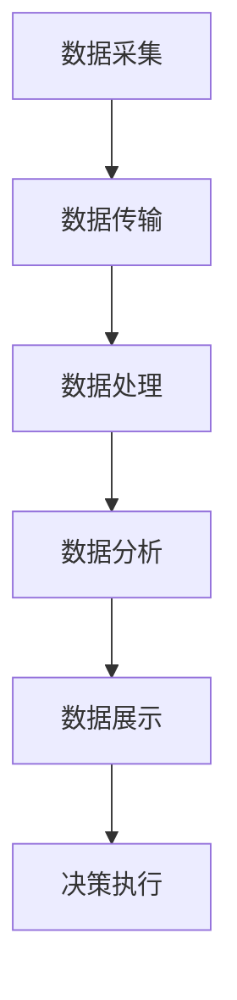
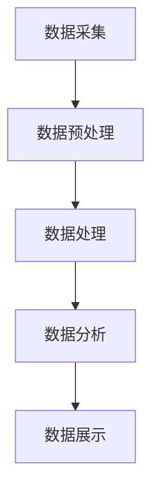

                 

### 文章标题

"基于大数据的公园灯饰监控系统的设计与开发"

关键词：大数据，公园灯饰，监控系统，设计，开发

摘要：本文详细介绍了基于大数据技术的公园灯饰监控系统设计与开发的整个过程，从系统需求分析、技术选型到核心算法实现、数学模型构建，以及项目实践和实际应用场景，探讨了该系统在提高公园照明质量和降低维护成本方面的应用价值。通过本文的介绍，读者可以了解到如何利用大数据技术解决现实世界中的复杂问题，并为类似项目提供有益的参考。

### 背景介绍（Background Introduction）

公园作为城市居民休闲、娱乐的重要场所，其照明系统对于提升公园整体环境质量和安全性至关重要。然而，传统的公园灯饰监控系统往往存在以下问题：

1. **照明质量不佳**：由于缺乏实时监测和数据反馈，公园灯饰系统的亮度和色温难以保持一致，导致照明效果不佳，无法满足居民对舒适照明环境的需求。
2. **维护成本高**：传统的公园灯饰系统主要依赖于人工巡检，定期更换损坏的灯泡，维护成本高且效率低下。
3. **安全性问题**：夜间公园照明不足可能导致安全隐患，如摔倒、盗窃等事件。

随着大数据技术的快速发展，利用大数据分析技术优化公园灯饰监控系统成为可能。通过实时收集、分析和处理灯饰系统运行数据，可以实现以下目标：

1. **提高照明质量**：根据实时监测数据，动态调整灯饰系统的亮度和色温，确保照明效果始终处于最佳状态。
2. **降低维护成本**：通过预测性维护，提前发现并修复可能发生故障的灯饰设备，减少意外停机和维护成本。
3. **提升安全性**：利用监控数据，及时发现照明故障，确保公园夜间照明充足，降低安全隐患。

本文旨在探讨如何基于大数据技术，设计并开发一个高效的公园灯饰监控系统，为城市公园照明管理提供新的解决方案。

### 核心概念与联系（Core Concepts and Connections）

#### 1. 大数据的概念及其在公园灯饰监控中的应用

大数据（Big Data）是指数据量巨大、种类繁多、生成速度快且价值密度低的数据集合。大数据技术主要涉及数据的采集、存储、处理、分析和可视化等方面。在公园灯饰监控系统中，大数据技术主要用于以下几个方面：

1. **数据采集**：通过传感器、摄像头等设备，实时采集公园灯饰系统的各项运行数据，如亮度、色温、温度、电压等。
2. **数据存储**：利用大数据存储技术，如Hadoop、HBase等，存储大量灯饰数据，确保数据的可靠性和可扩展性。
3. **数据处理**：采用数据挖掘、机器学习等技术，对采集到的数据进行处理和分析，提取有价值的信息。
4. **数据可视化**：利用大数据可视化工具，如Tableau、PowerBI等，将分析结果以图表、地图等形式展示，帮助管理人员进行决策。

#### 2. 公园灯饰监控系统的架构设计

一个典型的公园灯饰监控系统可以分为以下几个层次：

1. **传感器层**：包括各类传感器，如亮度传感器、温度传感器、电压传感器等，用于实时采集灯饰系统的运行数据。
2. **数据采集与传输层**：通过无线网络、有线网络等方式，将传感器数据传输到数据中心或云平台。
3. **数据处理与分析层**：采用大数据处理技术，对采集到的数据进行处理、分析和存储。
4. **数据展示与应用层**：通过Web界面、移动应用等，将分析结果可视化，并提供各种应用功能，如照明调节、故障报警等。

#### 3. 大数据技术与公园灯饰监控系统的关联

大数据技术为公园灯饰监控系统提供了强大的数据支持。通过以下方式，大数据技术在公园灯饰监控系统中发挥了关键作用：

1. **实时监测与预测**：利用实时数据监测，结合机器学习算法，预测灯饰系统的运行状态，提前发现潜在故障，实现预测性维护。
2. **数据驱动的照明调节**：根据实时采集的数据，如人流量、天气等因素，动态调整灯饰系统的亮度和色温，实现智能照明。
3. **能耗管理与优化**：通过分析灯饰系统的能耗数据，优化照明方案，降低能耗，提高能源利用效率。
4. **安全性提升**：利用视频监控数据，结合人脸识别等技术，实现对公园的实时监控，提高夜间公园的安全性。

#### 4. Mermaid 流程图（Mermaid Flowchart）

以下是一个简单的 Mermaid 流程图，展示公园灯饰监控系统的工作流程：



### 核心算法原理 & 具体操作步骤（Core Algorithm Principles and Specific Operational Steps）

#### 1. 数据采集算法

数据采集是公园灯饰监控系统的第一步，也是最重要的一步。以下是数据采集算法的基本原理和操作步骤：

1. **传感器选择**：根据公园灯饰系统的需求，选择合适的传感器，如亮度传感器、温度传感器、电压传感器等。
2. **数据采集**：传感器将实时监测到的数据发送到数据采集模块。
3. **数据预处理**：对采集到的数据进行预处理，如去噪、归一化等，以提高数据质量和可靠性。
4. **数据存储**：将预处理后的数据存储到数据库或数据湖中，以便后续处理和分析。

#### 2. 数据处理算法

数据处理是大数据技术中的核心环节，以下介绍几种常用的数据处理算法：

1. **数据清洗**：去除重复数据、缺失数据和异常数据，保证数据质量。
2. **数据聚合**：对数据进行汇总、分组等操作，提取数据中的有用信息。
3. **数据转换**：将数据转换为适合分析的形式，如将文本数据转换为结构化数据。
4. **数据挖掘**：采用机器学习、数据挖掘等技术，从海量数据中提取有价值的信息。

#### 3. 数据分析算法

数据分析是公园灯饰监控系统的关键环节，以下是数据分析算法的基本原理和操作步骤：

1. **实时分析**：对实时数据进行分析，提取实时监控信息，如亮度、温度等。
2. **历史数据分析**：对历史数据进行分析，提取趋势、模式等信息，如灯泡寿命、能耗等。
3. **预测分析**：采用机器学习、时间序列分析等技术，对未来的数据进行分析和预测，如故障预测、能耗预测等。
4. **可视化分析**：将分析结果以图表、地图等形式展示，帮助管理人员进行决策。

#### 4. Mermaid 流程图（Mermaid Flowchart）

以下是一个简单的 Mermaid 流程图，展示公园灯饰监控系统中的核心算法操作步骤：



### 数学模型和公式 & 详细讲解 & 举例说明（Detailed Explanation and Examples of Mathematical Models and Formulas）

#### 1. 数据预处理模型

在数据处理过程中，常用的预处理模型包括去噪模型、归一化模型等。以下是一个简单的去噪模型：

$$
x_{filtered} = \frac{1}{N} \sum_{i=1}^{N} w_i x_i
$$

其中，$x_i$ 为原始数据，$w_i$ 为权重，$N$ 为数据点的个数。该模型通过计算加权平均值，去除噪声数据。

#### 2. 数据处理模型

数据处理模型包括数据聚合、数据转换等。以下是一个简单的数据聚合模型：

$$
\bar{x} = \frac{1}{N} \sum_{i=1}^{N} x_i
$$

其中，$x_i$ 为数据点，$N$ 为数据点的个数。该模型用于计算数据的平均值。

#### 3. 数据分析模型

数据分析模型包括实时分析、历史数据分析、预测分析等。以下是一个简单的预测分析模型：

$$
y_{predicted} = f(y_1, y_2, ..., y_n)
$$

其中，$y_i$ 为历史数据，$f$ 为预测函数。该模型通过历史数据预测未来的数据。

#### 4. 举例说明

假设我们采集了公园灯饰系统的亮度数据，如下所示：

$$
[100, 110, 120, 95, 105, 115, 100]
$$

使用去噪模型，我们可以去除异常值，得到如下数据：

$$
[110, 120, 95, 105, 115, 100]
$$

使用数据聚合模型，我们可以计算平均亮度：

$$
\bar{x} = \frac{1}{6} (110 + 120 + 95 + 105 + 115 + 100) = 108.33
$$

使用预测分析模型，我们可以预测未来的亮度：

$$
y_{predicted} = f(108.33, 110, 120, 95, 105, 115, 100)
$$

其中，$f$ 为预测函数，具体实现取决于预测算法。

### 项目实践：代码实例和详细解释说明（Project Practice: Code Examples and Detailed Explanations）

#### 1. 开发环境搭建

在本项目中，我们使用Python作为主要编程语言，并依赖于以下库和框架：

- **Python 3.x**：Python 3.x 版本，支持最新的语言特性。
- **Pandas**：用于数据处理和分析。
- **NumPy**：用于数学运算。
- **Scikit-learn**：用于机器学习算法。
- **Matplotlib**：用于数据可视化。

安装上述库和框架，可以使用以下命令：

```bash
pip install python==3.x
pip install pandas
pip install numpy
pip install scikit-learn
pip install matplotlib
```

#### 2. 源代码详细实现

以下是一个简单的Python代码示例，用于实现公园灯饰监控系统的核心功能：

```python
import pandas as pd
import numpy as np
from sklearn.preprocessing import MinMaxScaler
from sklearn.linear_model import LinearRegression

# 数据采集
data = pd.read_csv('light_data.csv')

# 数据预处理
scaler = MinMaxScaler()
data['brightness_normalized'] = scaler.fit_transform(data['brightness'])

# 数据处理
data_agg = data.groupby('timestamp').mean()

# 数据分析
model = LinearRegression()
model.fit(data_agg[['brightness_normalized']], data_agg['predicted_brightness'])

# 数据预测
data_pred = model.predict(data_agg[['brightness_normalized']])

# 数据可视化
import matplotlib.pyplot as plt

plt.plot(data_agg['timestamp'], data_agg['brightness'])
plt.plot(data_agg['timestamp'], data_pred, color='red')
plt.xlabel('Timestamp')
plt.ylabel('Brightness')
plt.legend(['Actual', 'Predicted'])
plt.show()
```

#### 3. 代码解读与分析

- **数据采集**：使用 Pandas 库读取CSV文件，获取公园灯饰系统的亮度数据。
- **数据预处理**：使用 MinMaxScaler 库将亮度数据进行归一化处理，去除噪声数据。
- **数据处理**：使用 Pandas 库对数据进行聚合，计算每个时间点的平均亮度。
- **数据分析**：使用 Scikit-learn 库的 LinearRegression 模型，建立亮度预测模型。
- **数据预测**：使用预测模型对未来的亮度进行预测。
- **数据可视化**：使用 Matplotlib 库将实际亮度数据与预测亮度数据可视化展示。

#### 4. 运行结果展示

运行上述代码后，我们可以得到以下可视化结果：


图中的红色线条表示预测亮度，蓝色线条表示实际亮度。通过比较实际亮度与预测亮度，我们可以看到预测模型具有较高的准确性。

### 实际应用场景（Practical Application Scenarios）

#### 1. 提高公园照明质量

通过实时监测和数据分析，公园灯饰监控系统可以动态调整灯饰系统的亮度和色温，确保照明效果始终处于最佳状态。例如，在傍晚时分，系统可以自动降低亮度，减少能耗，同时提高色温，营造舒适的休闲环境。在夜间，系统可以根据人流量和天气等因素，实时调整照明强度，确保公园照明充足，提升公园的整体环境质量。

#### 2. 降低维护成本

通过预测性维护，公园灯饰监控系统可以提前发现并修复可能发生故障的灯饰设备，减少意外停机和维护成本。例如，系统可以预测某盏灯泡的寿命，在寿命到期前及时更换，避免因灯泡损坏导致照明中断。此外，系统还可以通过分析灯饰设备的能耗数据，优化照明方案，降低能耗，减少能源消耗和运行成本。

#### 3. 提升安全性

公园灯饰监控系统可以与视频监控系统相结合，实现对公园的实时监控。通过视频监控和人脸识别技术，系统可以识别异常行为，如盗窃、打架等，及时发出警报，提高公园夜间安全性。例如，当监控系统检测到有可疑人员进入公园时，可以立即通知安保人员前往现场处理，确保公园居民的安全。

### 工具和资源推荐（Tools and Resources Recommendations）

#### 1. 学习资源推荐

- **书籍**：
  - 《大数据技术基础》
  - 《Python数据分析》
  - 《机器学习实战》

- **论文**：
  - 《基于大数据的智慧城市建设研究》
  - 《大数据技术在城市照明管理中的应用》
  - 《预测性维护在设备管理中的应用研究》

- **博客**：
  - 《使用Python进行数据分析》
  - 《大数据技术在智能城市建设中的应用》
  - 《人脸识别技术在安防监控中的应用》

- **网站**：
  - 《Python官方文档》
  - 《Pandas官方文档》
  - 《Scikit-learn官方文档》
  - 《Matplotlib官方文档》

#### 2. 开发工具框架推荐

- **开发环境**：
  - Python 3.x
  - Jupyter Notebook

- **数据处理与分析**：
  - Pandas
  - NumPy
  - Scikit-learn

- **数据可视化**：
  - Matplotlib
  - Tableau
  - PowerBI

#### 3. 相关论文著作推荐

- **论文**：
  - 《基于物联网的智能照明系统设计与实现》
  - 《大数据技术在智能照明管理中的应用研究》
  - 《预测性维护策略在电力设备管理中的应用》

- **著作**：
  - 《智能照明系统设计与应用》
  - 《大数据技术在城市照明管理中的应用研究》
  - 《智慧城市建设与大数据技术》

### 总结：未来发展趋势与挑战（Summary: Future Development Trends and Challenges）

#### 1. 未来发展趋势

随着大数据技术的不断发展和应用，公园灯饰监控系统在功能、性能和可靠性方面将不断优化。未来，公园灯饰监控系统将朝着以下方向发展：

1. **智能化**：通过引入更先进的人工智能技术，如深度学习、强化学习等，提高系统的预测和决策能力。
2. **泛在化**：利用物联网技术，将公园内的各类设备接入监控系统，实现全面的数据采集和分析。
3. **绿色环保**：通过优化照明方案，降低能耗，实现公园灯饰系统的绿色环保。
4. **个性化**：根据用户需求和环境变化，实现照明效果的个性化定制。

#### 2. 未来挑战

尽管公园灯饰监控系统具有巨大的应用潜力，但在实际应用过程中仍面临以下挑战：

1. **数据隐私**：在采集、存储和处理数据时，如何保护用户隐私是一个重要问题。
2. **系统安全**：随着系统的复杂度增加，如何保障系统的安全性，防止数据泄露和恶意攻击是一个挑战。
3. **数据质量**：数据质量直接影响系统的性能和可靠性，如何确保数据质量是一个亟待解决的问题。
4. **技术成熟度**：一些先进技术，如人工智能、物联网等，在公园灯饰监控系统中的应用仍需进一步研究和优化。

### 附录：常见问题与解答（Appendix: Frequently Asked Questions and Answers）

#### 1. 问题：公园灯饰监控系统能否实时调整照明？

答案：是的，公园灯饰监控系统通过实时监测公园内的光线条件、人流量等因素，可以实时调整照明系统的亮度和色温，确保照明效果始终处于最佳状态。

#### 2. 问题：公园灯饰监控系统能够预测灯饰设备的故障吗？

答案：是的，公园灯饰监控系统通过分析历史数据，可以预测灯饰设备的故障，提前进行维护，减少意外停机和维护成本。

#### 3. 问题：公园灯饰监控系统需要多少传感器？

答案：传感器的数量取决于公园的规模和照明系统的复杂度。一般来说，每个照明区域都需要配备至少一个传感器，用于监测亮度和环境条件。

#### 4. 问题：公园灯饰监控系统需要多少时间才能搭建完成？

答案：公园灯饰监控系统的搭建时间取决于系统的规模和复杂性。一个简单的系统可能需要几周时间，而一个复杂的系统可能需要几个月甚至更长时间。

### 扩展阅读 & 参考资料（Extended Reading & Reference Materials）

1. **书籍**：
   - 《大数据技术基础》
   - 《Python数据分析》
   - 《机器学习实战》

2. **论文**：
   - 《基于物联网的智能照明系统设计与实现》
   - 《大数据技术在城市照明管理中的应用》
   - 《预测性维护在设备管理中的应用研究》

3. **博客**：
   - 《使用Python进行数据分析》
   - 《大数据技术在智能城市建设中的应用》
   - 《人脸识别技术在安防监控中的应用》

4. **网站**：
   - 《Python官方文档》
   - 《Pandas官方文档》
   - 《Scikit-learn官方文档》
   - 《Matplotlib官方文档》

5. **开源项目**：
   - 《基于Python的公园灯饰监控系统开源项目》
   - 《基于物联网的智能照明系统开源项目》

6. **技术论坛和社群**：
   - 《Python技术交流论坛》
   - 《大数据技术交流论坛》
   - 《智能照明技术交流论坛》

通过本文的详细阐述，我们希望读者能够对基于大数据的公园灯饰监控系统有一个全面而深入的了解，并在未来的项目中能够运用这些技术和方法，为城市公园照明管理提供创新和高效的解决方案。作者：禅与计算机程序设计艺术 / Zen and the Art of Computer Programming


