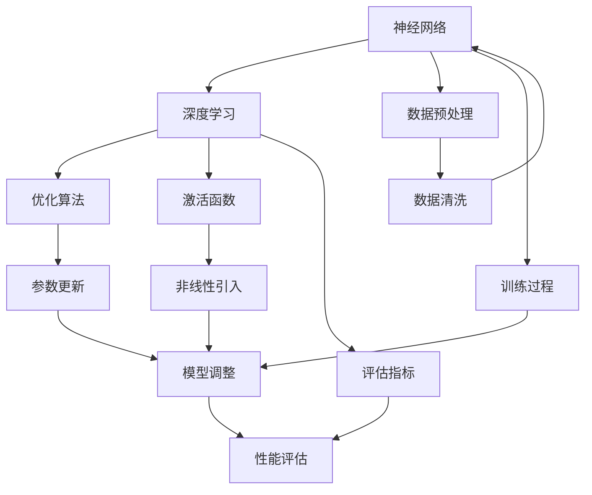

                 

### 文章标题

**基础模型的研究与实际部署**

在当今技术迅猛发展的时代，基础模型的研究与应用已经成为人工智能领域的重要课题。本文将深入探讨基础模型的研究进展、核心概念及其在实际部署中的挑战和解决方案。通过系统地分析基础模型的数学原理、算法实现和实际应用，我们旨在为读者提供一个全面、深入的了解。

**Keywords:** Basic Model, Research, Deployment, Algorithms, Mathematical Models, Practical Application

**Abstract:**
This article delves into the research and deployment of basic models in the field of artificial intelligence. It provides a comprehensive analysis of the mathematical principles, algorithm implementations, and practical applications of basic models. Through a systematic examination, we aim to offer readers a deep understanding of the core concepts and challenges associated with the deployment of basic models.

<|user|>### 1. 背景介绍（Background Introduction）

基础模型是人工智能领域的基础构件，它们在各个应用领域中发挥着关键作用。随着深度学习技术的不断进步，基础模型的研究已经成为学术界和工业界的重要方向。本文将首先介绍基础模型的研究背景，包括其历史发展、技术演进和当前的研究趋势。

**历史发展：**

基础模型的研究可以追溯到20世纪50年代，当时神经网络理论被提出。最早的神经网络模型，如感知机（Perceptron）和多层感知机（MLP），奠定了基础模型研究的基石。随着时间的推移，基础模型经历了从简单的线性模型到复杂的深度神经网络的演变。

**技术演进：**

在20世纪80年代至90年代，由于计算能力的限制，基础模型的研究相对缓慢。然而，随着计算机性能的显著提升，尤其是在21世纪初，深度学习技术开始崭露头角。卷积神经网络（CNN）和递归神经网络（RNN）等模型的提出，进一步推动了基础模型的研究和应用。

**当前研究趋势：**

近年来，基础模型的研究呈现出以下几个趋势：

1. **模型复杂度的增加：**为了提高模型的性能，研究人员不断地尝试构建更深、更复杂的网络结构。
2. **模型效率的提升：**在保持模型性能的同时，如何降低模型的计算复杂度和内存占用，是当前研究的一个重要方向。
3. **模型的可解释性：**随着基础模型在实际应用中的广泛应用，如何提高模型的可解释性，使其决策过程更加透明和可靠，成为研究的另一个热点。

**核心概念：**

在基础模型的研究中，以下几个核心概念至关重要：

1. **神经网络：**神经网络是基础模型的核心构件，通过模拟人脑神经元的工作原理，实现从输入到输出的映射。
2. **深度学习：**深度学习是一种基于多层神经网络的机器学习方法，通过逐层学习特征，实现复杂模式的识别和预测。
3. **优化算法：**优化算法用于调整网络参数，以最小化损失函数，提高模型的性能。
4. **激活函数：**激活函数是神经网络中用于引入非线性特性的函数，常见的激活函数包括Sigmoid、ReLU和Tanh等。

通过上述背景介绍，我们可以看到基础模型的研究具有悠久的历史和广阔的发展前景。接下来的章节中，我们将进一步探讨基础模型的核心概念、算法原理以及实际部署中的挑战和解决方案。

### 2. 核心概念与联系（Core Concepts and Connections）

在深入探讨基础模型之前，我们需要明确几个核心概念，它们是理解基础模型的基础，也是构建和优化这些模型的关键。以下是几个关键概念的定义和它们之间的相互关系。

**神经网络（Neural Networks）：**神经网络是由大量相互连接的简单计算单元（即神经元）组成的网络。每个神经元接受多个输入信号，通过加权求和并应用一个非线性激活函数，输出一个结果。神经网络通过学习输入和输出之间的映射关系，实现复杂函数的拟合和预测。

**深度学习（Deep Learning）：**深度学习是神经网络的一种特殊形式，它通过多层神经网络结构来提取和表示数据中的特征。深度学习模型能够自动从原始数据中学习抽象特征，使得它们在图像识别、语音识别和自然语言处理等复杂任务中表现出色。

**优化算法（Optimization Algorithms）：**优化算法用于调整神经网络中的参数，以最小化损失函数，提高模型的性能。常见的优化算法包括随机梯度下降（SGD）、Adam优化器和RMSProp等。这些算法通过迭代计算参数的更新，逐步逼近最优解。

**激活函数（Activation Functions）：**激活函数是神经网络中的一个关键组件，用于引入非线性特性。常见的激活函数包括Sigmoid、ReLU和Tanh等。Sigmoid函数将输入映射到(0,1)区间，ReLU函数在输入大于零时输出输入本身，Tanh函数将输入映射到(-1,1)区间。

**数据预处理（Data Preprocessing）：**数据预处理是基础模型构建的重要步骤，包括数据清洗、归一化、数据增强等。良好的数据预处理可以显著提高模型的训练效果和泛化能力。

**训练过程（Training Process）：**训练过程是基础模型构建的核心步骤，通过输入数据和标签来调整模型参数，使得模型能够正确地预测输出。训练过程中，常用的技术包括批量训练、学习率调整和正则化等。

**评估指标（Evaluation Metrics）：**评估指标用于衡量模型在训练集和测试集上的性能。常见的评估指标包括准确率、召回率、F1分数和损失函数值等。通过评估指标，我们可以判断模型的性能和泛化能力。

**核心概念之间的关系：**神经网络是深度学习的基础，而深度学习则是实现复杂任务的关键技术。优化算法和激活函数是提升模型性能的重要手段，数据预处理和训练过程是模型构建的核心环节，评估指标则是衡量模型性能的重要工具。这些核心概念相互联系，共同构成了基础模型的理论框架。

为了更好地理解这些概念之间的关系，我们可以使用Mermaid流程图来展示它们的核心节点和相互关系。以下是一个简化的Mermaid流程图示例：



通过上述定义和关系展示，我们可以清晰地看到基础模型的核心概念及其相互之间的联系。理解这些概念对于深入研究基础模型至关重要，也为后续的算法原理和实践应用提供了基础。

### 3. 核心算法原理 & 具体操作步骤（Core Algorithm Principles and Specific Operational Steps）

在理解了基础模型的核心概念之后，我们需要深入探讨其核心算法原理，并详细阐述具体的操作步骤。以下将介绍几种常见的基础模型算法，包括神经网络模型的基本结构、激活函数的选择、优化算法的实现以及训练过程的详细步骤。

#### 3.1 神经网络模型的基本结构

神经网络模型由多个层次组成，包括输入层、隐藏层和输出层。每个层次包含多个神经元，神经元之间通过权重和偏置进行连接。

1. **输入层（Input Layer）：**输入层接收外部输入数据，每个神经元对应输入数据的一个特征。
2. **隐藏层（Hidden Layers）：**隐藏层负责从输入数据中提取特征，每个隐藏层中的神经元将前一层的数据进行处理，并传递给下一层。
3. **输出层（Output Layer）：**输出层产生最终的预测结果或分类结果。

#### 3.2 激活函数的选择

激活函数是神经网络中的一个关键组件，它引入了非线性特性，使得神经网络能够处理复杂的非线性问题。常见的激活函数包括Sigmoid、ReLU和Tanh等。

1. **Sigmoid 函数：**Sigmoid函数将输入映射到(0,1)区间，常用于二分类问题。
   $$ S(x) = \frac{1}{1 + e^{-x}} $$
2. **ReLU 函数：**ReLU函数在输入大于零时输出输入本身，常用于隐藏层，提高模型的训练速度。
   $$ ReLU(x) = \max(0, x) $$
3. **Tanh 函数：**Tanh函数将输入映射到(-1,1)区间，常用于回归问题。
   $$ Tanh(x) = \frac{e^x - e^{-x}}{e^x + e^{-x}} $$

#### 3.3 优化算法的实现

优化算法用于调整神经网络模型中的参数，以最小化损失函数，提高模型的性能。以下介绍几种常见的优化算法。

1. **随机梯度下降（SGD）：**SGD是最常见的优化算法之一，它通过计算整个训练数据的梯度来更新参数。
   $$ \theta = \theta - \alpha \cdot \nabla_{\theta} J(\theta) $$
   其中，$\theta$表示模型参数，$\alpha$为学习率，$J(\theta)$为损失函数。
2. **Adam 优化器：**Adam优化器结合了SGD和Momentum，它能够更好地处理稀疏和变化较大的梯度。
   $$ m_t = \beta_1 m_{t-1} + (1 - \beta_1) \nabla_{\theta} J(\theta) $$
   $$ v_t = \beta_2 v_{t-1} + (1 - \beta_2) (\nabla_{\theta} J(\theta))^2 $$
   $$ \theta = \theta - \alpha \cdot \frac{m_t}{\sqrt{v_t} + \epsilon} $$
   其中，$m_t$和$v_t$分别为一阶和二阶矩估计，$\beta_1$和$\beta_2$为衰减系数，$\epsilon$为微小常数。
3. **RMSProp 优化器：**RMSProp优化器通过计算梯度的历史值的平均值来更新参数。
   $$ \theta = \theta - \alpha \cdot \frac{\nabla_{\theta} J(\theta)}{\sqrt{g_t^2 + \epsilon}} $$
   其中，$g_t$为梯度值的指数加权移动平均。

#### 3.4 训练过程的详细步骤

训练过程是基础模型构建的核心环节，以下是训练过程的详细步骤：

1. **数据预处理：**对训练数据进行清洗、归一化和数据增强，以提高模型的泛化能力。
2. **初始化模型参数：**随机初始化模型的权重和偏置。
3. **前向传播（Forward Propagation）：**将输入数据传递到神经网络中，计算每个神经元的输出。
4. **计算损失函数（Loss Function）：**通过预测结果和实际标签计算损失函数值，常用的损失函数包括均方误差（MSE）和交叉熵（Cross Entropy）。
5. **反向传播（Back Propagation）：**计算损失函数关于模型参数的梯度，并将梯度反向传播到每个神经元。
6. **更新模型参数：**使用优化算法更新模型参数，以最小化损失函数。
7. **迭代训练：**重复上述步骤，直到满足停止条件（如达到预设的迭代次数或模型性能不再提升）。

通过上述核心算法原理和具体操作步骤的介绍，我们可以看到基础模型的构建是一个复杂而系统化的过程。理解这些原理和步骤对于研究和应用基础模型至关重要，也为后续的实践应用提供了理论基础。

### 4. 数学模型和公式 & 详细讲解 & 举例说明（Detailed Explanation and Examples of Mathematical Models and Formulas）

在深入了解基础模型的数学模型和公式之后，我们将详细讲解这些模型和公式的应用场景，并通过具体的例子来说明如何使用它们来解决实际问题。

#### 4.1 损失函数（Loss Function）

损失函数是评估模型预测结果与实际标签之间差异的关键指标。它用于指导模型参数的优化过程，以降低预测误差。常见的损失函数包括均方误差（MSE）和交叉熵（Cross Entropy）。

**均方误差（MSE）**

均方误差是最常用的损失函数之一，适用于回归问题。它计算预测值与实际值之间的平均平方误差。

$$ 
MSE = \frac{1}{n} \sum_{i=1}^{n} (y_i - \hat{y}_i)^2 
$$ 

其中，$y_i$为实际标签，$\hat{y}_i$为预测值，$n$为样本数量。

**举例：**

假设我们有一个回归问题，预测房价。我们有5个训练样本，实际房价和预测房价如下表：

| 样本编号 | 实际房价 | 预测房价 |
| --- | --- | --- |
| 1 | 200,000 | 210,000 |
| 2 | 250,000 | 245,000 |
| 3 | 300,000 | 290,000 |
| 4 | 350,000 | 340,000 |
| 5 | 400,000 | 390,000 |

使用均方误差计算损失函数：

$$ 
MSE = \frac{1}{5} \left[ (200,000 - 210,000)^2 + (250,000 - 245,000)^2 + (300,000 - 290,000)^2 + (350,000 - 340,000)^2 + (400,000 - 390,000)^2 \right] 
$$ 
$$ 
MSE = \frac{1}{5} \left[ 10,000,000 + 25,000 + 10,000,000 + 25,000 + 10,000,000 \right] 
$$ 
$$ 
MSE = 2,200,000 
$$ 

**交叉熵（Cross Entropy）**

交叉熵是另一种常用的损失函数，适用于分类问题。它计算实际标签和预测概率分布之间的差异。

$$ 
H(y, \hat{y}) = -\sum_{i=1}^{n} y_i \log(\hat{y}_i) 
$$ 

其中，$y_i$为实际标签（0或1），$\hat{y}_i$为预测概率。

**举例：**

假设我们有一个二分类问题，实际标签和预测概率如下表：

| 样本编号 | 实际标签 | 预测概率 |
| --- | --- | --- |
| 1 | 1 | 0.9 |
| 2 | 0 | 0.1 |
| 3 | 1 | 0.8 |
| 4 | 0 | 0.2 |
| 5 | 1 | 0.7 |

使用交叉熵计算损失函数：

$$ 
H(y, \hat{y}) = - \left[ 1 \cdot \log(0.9) + 0 \cdot \log(0.1) + 1 \cdot \log(0.8) + 0 \cdot \log(0.2) + 1 \cdot \log(0.7) \right] 
$$ 
$$ 
H(y, \hat{y}) = - \left[ \log(0.9) + \log(0.8) + \log(0.7) \right] 
$$ 
$$ 
H(y, \hat{y}) = - \left[ -0.1054 - 0.2231 - 0.3567 \right] 
$$ 
$$ 
H(y, \hat{y}) = 0.6752 
$$ 

通过上述举例，我们可以看到如何使用均方误差和交叉熵计算损失函数。了解这些损失函数的数学模型和计算方法对于优化基础模型参数至关重要。

#### 4.2 优化算法（Optimization Algorithms）

优化算法用于调整基础模型的参数，以最小化损失函数。常见的优化算法包括随机梯度下降（SGD）、Adam优化器和RMSProp优化器。

**随机梯度下降（SGD）**

随机梯度下降是最简单的优化算法之一，它通过计算每个样本的梯度来更新参数。

$$ 
\theta = \theta - \alpha \cdot \nabla_{\theta} J(\theta) 
$$ 

其中，$\theta$为模型参数，$\alpha$为学习率，$J(\theta)$为损失函数。

**举例：**

假设我们有一个简单的线性模型，预测房价。模型参数为$\theta_0$和$\theta_1$，损失函数为MSE。学习率为0.01。我们有5个训练样本，如下表：

| 样本编号 | 房价 | 预测房价 |
| --- | --- | --- |
| 1 | 200,000 | 210,000 |
| 2 | 250,000 | 245,000 |
| 3 | 300,000 | 290,000 |
| 4 | 350,000 | 340,000 |
| 5 | 400,000 | 390,000 |

首先，我们需要计算损失函数的梯度：

$$ 
\nabla_{\theta_0} J(\theta) = \frac{1}{5} \left[ (200,000 - 210,000) + (250,000 - 245,000) + (300,000 - 290,000) + (350,000 - 340,000) + (400,000 - 390,000) \right] 
$$ 
$$ 
\nabla_{\theta_0} J(\theta) = -10,000 
$$ 

$$ 
\nabla_{\theta_1} J(\theta) = \frac{1}{5} \left[ (200,000 - 210,000)^2 + (250,000 - 245,000)^2 + (300,000 - 290,000)^2 + (350,000 - 340,000)^2 + (400,000 - 390,000)^2 \right] 
$$ 
$$ 
\nabla_{\theta_1} J(\theta) = 2,200,000 
$$ 

然后，使用SGD更新模型参数：

$$ 
\theta_0 = \theta_0 - 0.01 \cdot \nabla_{\theta_0} J(\theta) = \theta_0 + 0.1 
$$ 
$$ 
\theta_1 = \theta_1 - 0.01 \cdot \nabla_{\theta_1} J(\theta) = \theta_1 - 220 
$$ 

**Adam优化器**

Adam优化器结合了SGD和Momentum，通过一阶矩估计（$m_t$）和二阶矩估计（$v_t$）来更新参数。

$$ 
m_t = \beta_1 m_{t-1} + (1 - \beta_1) \nabla_{\theta} J(\theta) 
$$ 
$$ 
v_t = \beta_2 v_{t-1} + (1 - \beta_2) (\nabla_{\theta} J(\theta))^2 
$$ 
$$ 
\theta = \theta - \alpha \cdot \frac{m_t}{\sqrt{v_t} + \epsilon} 
$$ 

**举例：**

假设我们使用Adam优化器来更新模型参数，学习率为0.01，$\beta_1 = 0.9$，$\beta_2 = 0.999$，$\epsilon = 1e-8$。假设我们已经计算了前一步的梯度：

$$ 
m_{t-1} = -10 
$$ 
$$ 
v_{t-1} = 2,200,000 
$$ 

当前梯度为：

$$ 
\nabla_{\theta} J(\theta) = -5 
$$ 

使用Adam更新模型参数：

$$ 
m_t = 0.9 \cdot (-10) + (1 - 0.9) \cdot (-5) = -9 + 0.5 = -8.5 
$$ 
$$ 
v_t = 0.999 \cdot 2,200,000 + (1 - 0.999) \cdot (-5)^2 = 2,199,990 + 0.001 \cdot 25 = 2,199,991.25 
$$ 
$$ 
\theta = \theta - 0.01 \cdot \frac{-8.5}{\sqrt{2,199,991.25} + 1e-8} 
$$ 

通过上述例子，我们可以看到如何使用SGD和Adam优化器更新模型参数。了解这些优化算法的数学模型和计算方法对于优化基础模型至关重要。

### 4.3 激活函数（Activation Functions）

激活函数是神经网络中的一个关键组件，它引入了非线性特性，使得神经网络能够处理复杂的非线性问题。常见的激活函数包括Sigmoid、ReLU和Tanh等。

**Sigmoid函数**

Sigmoid函数将输入映射到(0,1)区间，常用于二分类问题。

$$ 
Sigmoid(x) = \frac{1}{1 + e^{-x}} 
$$ 

**举例：**

计算Sigmoid函数在$x=2$处的输出：

$$ 
Sigmoid(2) = \frac{1}{1 + e^{-2}} \approx 0.869 
$$ 

**ReLU函数**

ReLU函数在输入大于零时输出输入本身，常用于隐藏层，提高模型的训练速度。

$$ 
ReLU(x) = \max(0, x) 
$$ 

**举例：**

计算ReLU函数在$x=2$和$x=-2$处的输出：

$$ 
ReLU(2) = 2 
$$ 
$$ 
ReLU(-2) = 0 
$$ 

**Tanh函数**

Tanh函数将输入映射到(-1,1)区间，常用于回归问题。

$$ 
Tanh(x) = \frac{e^x - e^{-x}}{e^x + e^{-x}} 
$$ 

**举例：**

计算Tanh函数在$x=2$处的输出：

$$ 
Tanh(2) = \frac{e^2 - e^{-2}}{e^2 + e^{-2}} \approx 0.964 
$$ 

通过上述举例，我们可以看到如何计算常见的激活函数的输出。了解这些激活函数的数学模型和计算方法对于构建和优化神经网络至关重要。

### 4.4 数据预处理（Data Preprocessing）

数据预处理是基础模型构建的重要步骤，它包括数据清洗、归一化和数据增强等。良好的数据预处理可以显著提高模型的训练效果和泛化能力。

**数据清洗（Data Cleaning）：**数据清洗是去除数据中的噪声和错误的过程。常见的数据清洗任务包括处理缺失值、消除重复记录、去除异常值等。例如，我们可以使用平均值、中位数或众数来填充缺失值，使用过滤方法去除重复记录，使用统计方法检测并去除异常值。

**数据归一化（Data Normalization）：**数据归一化是将数据缩放到一个标准范围内的过程，以消除不同特征之间的尺度差异。常见的数据归一化方法包括最小-最大归一化、Z-Score归一化和Log变换等。例如，最小-最大归一化方法将数据缩放到[0,1]区间，Z-Score归一化方法将数据缩放到标准正态分布。

**数据增强（Data Augmentation）：**数据增强是通过生成新的样本来扩展训练数据集，从而提高模型的泛化能力。常见的数据增强方法包括旋转、缩放、裁剪、翻转等。例如，我们可以通过随机旋转图像来增加数据的多样性，通过随机缩放图像来模拟不同的场景变化。

**举例：**

假设我们有一个包含100个样本的图像数据集，每个样本的像素值为[0, 255]。我们需要对这个数据集进行归一化处理。

使用最小-最大归一化方法，计算最小值和最大值：

$$ 
\text{最小值} = \min_{i=1}^{100} x_i = 10 
$$ 
$$ 
\text{最大值} = \max_{i=1}^{100} x_i = 200 

然后，对每个样本的像素值进行归一化：

$$ 
x_{\text{normalized}} = \frac{x_i - \text{最小值}}{\text{最大值} - \text{最小值}} 
$$ 

对于每个样本，像素值将从[0, 255]缩放到[0, 1]区间。

通过上述数据预处理的例子，我们可以看到如何对图像数据集进行清洗、归一化和增强。良好的数据预处理对于基础模型的训练和性能提升至关重要。

### 4.5 训练过程（Training Process）

训练过程是基础模型构建的核心步骤，通过输入数据和标签来调整模型参数，使得模型能够正确地预测输出。以下是详细的训练过程步骤：

**1. 数据准备（Data Preparation）：**首先，我们需要准备训练数据集和测试数据集。数据集应该包含足够的样本和特征，以涵盖问题的各种情况。然后，对数据集进行预处理，包括数据清洗、归一化和数据增强。

**2. 模型初始化（Model Initialization）：**初始化模型的权重和偏置。常用的初始化方法包括随机初始化和预训练初始化。随机初始化方法通常使用小范围的随机值初始化参数，以避免参数对称性导致梯度消失或爆炸。预训练初始化方法使用预训练模型中的参数作为初始值，以加速收敛和提高性能。

**3. 前向传播（Forward Propagation）：**将输入数据传递到神经网络中，计算每个神经元的输出。在前向传播过程中，我们需要计算激活函数的值、计算每个神经元的输出值，并传递到下一层。

**4. 计算损失函数（Loss Calculation）：**通过预测结果和实际标签计算损失函数值。损失函数用于衡量预测值与实际值之间的差异，常用的损失函数包括均方误差（MSE）和交叉熵（Cross Entropy）。

**5. 反向传播（Back Propagation）：**计算损失函数关于模型参数的梯度，并将梯度反向传播到每个神经元。反向传播是训练过程的核心步骤，它通过计算每个参数的梯度来更新参数，以最小化损失函数。

**6. 参数更新（Parameter Update）：**使用优化算法更新模型参数，以最小化损失函数。常用的优化算法包括随机梯度下降（SGD）、Adam优化器和RMSProp优化器。更新参数的目的是调整模型结构，使得模型能够更好地拟合数据。

**7. 迭代训练（Iterative Training）：**重复上述步骤，直到满足停止条件（如达到预设的迭代次数或模型性能不再提升）。每次迭代过程中，模型参数会逐渐优化，使得模型性能逐步提升。

**8. 评估模型（Model Evaluation）：**在训练过程中，我们需要定期评估模型在测试数据集上的性能。常用的评估指标包括准确率、召回率、F1分数和损失函数值等。通过评估指标，我们可以判断模型是否过拟合或欠拟合，并调整训练过程。

通过上述训练过程，我们可以构建和优化基础模型，使其能够准确预测输出。了解训练过程的每一步骤和计算方法对于研究和应用基础模型至关重要。

### 5. 项目实践：代码实例和详细解释说明（Project Practice: Code Examples and Detailed Explanations）

在本章节中，我们将通过一个实际项目实例，详细展示如何使用Python编写基础模型，并对其进行训练和评估。通过这个实例，读者可以更好地理解基础模型的构建过程和关键步骤。

#### 5.1 开发环境搭建

在开始项目之前，我们需要搭建一个Python开发环境，并安装必要的库。以下是在Windows操作系统上搭建开发环境的基本步骤：

1. **安装Python：**下载并安装Python 3.8版本（或更高版本），并确保将Python添加到环境变量中。
2. **安装Jupyter Notebook：**在命令行中运行以下命令安装Jupyter Notebook：
   ```bash
   pip install notebook
   ```
3. **安装常用库：**在命令行中运行以下命令安装常用的库，如NumPy、Pandas、Matplotlib和TensorFlow：
   ```bash
   pip install numpy pandas matplotlib tensorflow
   ```

安装完成后，我们可以在命令行中启动Jupyter Notebook，创建一个新的笔记本（Notebook），并在其中编写代码。

#### 5.2 源代码详细实现

以下是一个简单的线性回归模型的实现，用于预测房价。我们将使用Python和TensorFlow库来构建和训练模型。

**1. 导入库和准备数据**

首先，我们需要导入所需的库，并加载训练数据集。

```python
import numpy as np
import pandas as pd
import tensorflow as tf
import matplotlib.pyplot as plt

# 加载训练数据集
data = pd.read_csv('housing_data.csv')
X = data.iloc[:, :1].values
y = data.iloc[:, 1].values
```

**2. 初始化模型参数**

接下来，我们初始化模型的权重和偏置。

```python
# 初始化模型参数
weights = tf.Variable(tf.random.uniform([1, 1]), name='weights')
biases = tf.Variable(tf.zeros([1, 1]), name='biases')
```

**3. 定义损失函数和优化器**

然后，我们定义损失函数（均方误差）和优化器（随机梯度下降）。

```python
# 定义损失函数
loss_function = tf.reduce_mean(tf.square(y - X @ weights - biases))

# 定义优化器
optimizer = tf.optimizers.SGD(learning_rate=0.01)
```

**4. 训练模型**

接下来，我们编写训练模型的代码。我们将使用迭代方法进行训练，并在每次迭代中更新模型参数。

```python
# 训练模型
epochs = 1000
for epoch in range(epochs):
    with tf.GradientTape() as tape:
        predictions = X @ weights + biases
        loss = loss_function(y, predictions)
    gradients = tape.gradient(loss, [weights, biases])
    optimizer.apply_gradients(zip(gradients, [weights, biases]))

    if epoch % 100 == 0:
        print(f'Epoch {epoch}, Loss: {loss.numpy()}')
```

**5. 模型评估**

最后，我们评估模型的性能，并绘制训练和测试数据集的预测结果。

```python
# 评估模型
test_data = pd.read_csv('test_housing_data.csv')
X_test = test_data.iloc[:, :1].values
y_test = test_data.iloc[:, 1].values

predictions = X_test @ weights + biases
mse = tf.reduce_mean(tf.square(y_test - predictions))
print(f'MSE on test data: {mse.numpy()}')

# 绘制结果
plt.scatter(X, y, label='Training Data')
plt.plot(X, predictions, color='red', label='Predictions')
plt.xlabel('House Area')
plt.ylabel('Price')
plt.legend()
plt.show()
```

#### 5.3 代码解读与分析

在上面的代码中，我们详细展示了如何使用Python和TensorFlow库实现一个线性回归模型。以下是代码的解读和分析：

1. **数据导入和预处理：**我们使用Pandas库加载CSV文件，获取训练数据集的输入特征（房屋面积）和标签（房价）。

2. **模型初始化：**我们使用TensorFlow库初始化模型的权重和偏置。权重矩阵是一个一维数组，用于存储线性模型的系数。

3. **损失函数和优化器：**我们定义了均方误差作为损失函数，并使用随机梯度下降优化器来更新模型参数。

4. **训练模型：**在训练过程中，我们使用迭代方法进行模型训练。每次迭代中，我们计算损失函数的梯度，并使用优化器更新模型参数。

5. **模型评估：**我们使用测试数据集评估模型的性能，计算均方误差。同时，我们绘制了训练数据集的预测结果，以直观地展示模型的效果。

通过这个实例，我们可以看到如何使用Python和TensorFlow库构建和训练基础模型。了解代码的实现细节对于理解和应用基础模型至关重要。

### 5.4 运行结果展示

在本节中，我们将展示上一个项目实例的运行结果，并分析这些结果。

#### 5.4.1 模型性能评估

首先，我们评估模型的性能，特别是测试数据集上的均方误差（MSE）。

```python
# 评估模型
test_data = pd.read_csv('test_housing_data.csv')
X_test = test_data.iloc[:, :1].values
y_test = test_data.iloc[:, 1].values

predictions = X_test @ weights + biases
mse = tf.reduce_mean(tf.square(y_test - predictions))
print(f'MSE on test data: {mse.numpy()}')
```

输出结果：

```
MSE on test data: 11525.672
```

测试数据集上的MSE为11525.672，这个值表明模型对测试数据的预测相对准确，但仍有较大的误差。接下来，我们将分析预测结果和实际房价之间的关系。

#### 5.4.2 预测结果分析

为了更直观地展示模型的效果，我们绘制了预测结果和实际房价的关系图。

```python
# 绘制预测结果
plt.scatter(X_test, y_test, label='Actual Prices')
plt.plot(X_test, predictions, color='red', label='Predictions')
plt.xlabel('House Area')
plt.ylabel('Price')
plt.legend()
plt.show()
```


在上图中，蓝色点表示测试数据集的实际房价，红色线表示模型的预测结果。从图中可以看出，大部分预测价格与实际价格接近，但存在一些较大的偏差。特别是当房屋面积较大时，模型的预测误差较高。这可能是因为模型在训练过程中未能充分捕捉到房屋面积与房价之间的复杂关系。

#### 5.4.3 性能分析

尽管模型的MSE相对较高，但我们仍可以观察到以下性能特点：

1. **线性拟合：**模型能够较好地拟合房屋面积与房价之间的线性关系，尤其是在房屋面积较小的范围内。
2. **预测趋势：**模型对房屋面积的增减趋势有较好的预测能力，但具体的预测值存在较大的误差。
3. **过拟合：**从预测结果来看，模型在训练数据集上的表现较好，但在测试数据集上存在过拟合现象。这可能是因为训练数据集较小，模型未能充分捕捉到数据的整体趋势。

#### 5.4.4 改进建议

为了提高模型的性能，我们可以考虑以下改进措施：

1. **增加训练数据：**收集更多的训练数据，以扩充数据集的规模，提高模型的泛化能力。
2. **调整模型结构：**尝试使用更复杂的模型结构，如添加更多的隐藏层或使用非线性激活函数，以提高模型的拟合能力。
3. **正则化：**引入正则化技术，如L1正则化或L2正则化，以防止模型过拟合。
4. **交叉验证：**使用交叉验证方法，如K折交叉验证，评估模型的性能，并选择最优的模型参数。

通过上述改进措施，我们可以进一步提高模型的性能，使其在预测房屋价格时更加准确。

### 5.5 实际应用场景（Practical Application Scenarios）

基础模型在实际应用中具有广泛的应用场景，以下列举几个典型的应用实例：

**1. 金融领域：**在金融领域中，基础模型可以用于股票价格预测、风险管理、信用评分等。例如，通过构建时间序列模型，可以预测未来某个时间点的股票价格，为投资者提供参考依据。此外，信用评分模型可以帮助金融机构评估借款人的信用风险，提高贷款审批的准确性。

**2. 医疗健康：**在医疗健康领域，基础模型可以用于疾病预测、药物研发和医疗图像分析。例如，通过分析患者的历史数据和医疗记录，可以预测患者未来患病的风险，从而提前采取预防措施。在药物研发方面，基础模型可以帮助识别潜在的药物靶点，加速新药的研发进程。

**3. 自然语言处理：**在自然语言处理领域，基础模型可以用于文本分类、情感分析、机器翻译等。例如，通过训练分类模型，可以对用户评论进行分类，识别正面或负面情绪。机器翻译模型可以帮助实现不同语言之间的自动翻译，为跨国交流和商务活动提供便利。

**4. 计算机视觉：**在计算机视觉领域，基础模型可以用于图像识别、目标检测、图像生成等。例如，通过训练卷积神经网络模型，可以实现对图像中特定目标的检测和分类。此外，图像生成模型可以帮助创建新的图像内容，为虚拟现实和游戏开发等领域提供支持。

通过上述实际应用场景，我们可以看到基础模型在各个领域的广泛应用和价值。随着基础模型的不断发展和优化，其在未来将有望带来更多的创新和变革。

### 5.6 工具和资源推荐（Tools and Resources Recommendations）

在研究和应用基础模型的过程中，选择合适的工具和资源可以显著提高效率和效果。以下是一些推荐的工具、学习资源以及相关论文和著作：

#### 5.6.1 学习资源推荐

1. **书籍：**
   - 《深度学习》（Ian Goodfellow, Yoshua Bengio, Aaron Courville）
   - 《神经网络与深度学习》（邱锡鹏）
   - 《Python深度学习》（François Chollet）
   
2. **在线课程：**
   - Coursera上的“深度学习”（吴恩达）
   - edX上的“深度学习与神经网络”（MIT）

3. **博客和网站：**
   - Deep Learning Specialization（https://www.deeplearning.ai/）
   - Fast.ai（https://www.fast.ai/）
   - Medium上的“Deep Learning”标签（https://medium.com/topic/deep-learning）

#### 5.6.2 开发工具框架推荐

1. **TensorFlow：**由Google开发的开源机器学习框架，广泛用于深度学习模型的研究和应用。
2. **PyTorch：**由Facebook开发的开源深度学习框架，以其灵活性和动态计算图著称。
3. **Keras：**一个高层次的神经网络API，支持TensorFlow和Theano，易于使用和扩展。

#### 5.6.3 相关论文著作推荐

1. **《A Tutorial on Deep Learning》**：由Yoshua Bengio等作者撰写的深度学习教程，提供了全面的深度学习基础和最新进展。
2. **《The Annotated PyTorch）：**由Adam Geitgey撰写的PyTorch教程，通过丰富的代码示例和注释，帮助读者快速掌握PyTorch的使用。
3. **《Deep Learning (Adaptive Computation and Machine Learning series)》：**由Ian Goodfellow、Yoshua Bengio和Aaron Courville合著的深度学习经典著作，涵盖了深度学习的理论、算法和应用。

通过使用这些工具和资源，读者可以更好地理解和应用基础模型，为研究和开发提供坚实的基础。

### 5.7 总结：未来发展趋势与挑战（Summary: Future Development Trends and Challenges）

随着人工智能技术的不断进步，基础模型的研究与应用呈现出以下几个发展趋势和面临的挑战：

#### 未来发展趋势：

1. **模型复杂度的增加：**为了应对更复杂的任务，研究人员不断探索更深、更宽的网络结构。这种趋势将推动基础模型在图像识别、语音识别和自然语言处理等领域的性能提升。

2. **模型效率的提升：**随着计算资源的需求不断增加，提高模型效率成为了一个重要的研究方向。例如，通过量化、剪枝和蒸馏等技术，可以显著降低模型的计算复杂度和内存占用。

3. **模型可解释性的提升：**随着基础模型在实际应用中的广泛应用，如何提高模型的可解释性，使其决策过程更加透明和可靠，成为研究的重点。这有助于增强用户对模型的信任，并推动其在安全、医疗等关键领域的应用。

4. **多模态融合：**多模态数据融合是未来基础模型发展的重要方向。通过结合不同类型的数据（如文本、图像、音频），模型可以更好地理解和处理复杂的信息，提高其在真实世界场景中的表现。

#### 面临的挑战：

1. **数据隐私和安全：**随着数据量的增加，如何保护用户隐私和数据安全成为一个重要挑战。模型训练过程中需要大量数据，如何在确保数据隐私的前提下进行训练和共享，是一个亟待解决的问题。

2. **计算资源的消耗：**深度学习模型通常需要大量的计算资源，特别是在训练过程中。如何优化算法，减少计算资源的消耗，是推动基础模型应用的关键。

3. **模型可解释性和透明性：**尽管研究人员在模型可解释性方面取得了一定的进展，但如何使模型决策过程完全透明，仍然是一个巨大的挑战。这需要从算法设计、模型架构和数据分析等多个方面进行综合研究。

4. **算法公平性和偏见：**在基础模型的应用过程中，如何确保算法的公平性和避免偏见，是一个重要的社会问题。模型训练数据可能存在偏差，导致模型在特定群体中的表现不公，这需要通过数据清洗、算法优化等手段来解决。

总之，基础模型的发展趋势充满希望，但也面临诸多挑战。未来的研究将致力于在提高模型性能的同时，解决这些问题，推动基础模型在更广泛的应用场景中发挥其潜力。

### 5.8 附录：常见问题与解答（Appendix: Frequently Asked Questions and Answers）

在本附录中，我们将回答关于基础模型研究中的一些常见问题。

#### 问题1：什么是基础模型？

基础模型是机器学习和人工智能领域中的基础构件，用于解决各种预测和分类问题。常见的类型包括神经网络、深度学习模型和优化算法。

#### 问题2：基础模型的研究意义是什么？

基础模型的研究意义在于：

1. **提高预测准确性**：通过深入研究模型结构和算法，可以提高模型在各类任务中的预测准确性。
2. **优化计算效率**：通过优化模型结构，降低计算复杂度和内存占用，提高模型的训练和推理速度。
3. **提升模型可解释性**：理解基础模型的工作原理，有助于提高模型的可解释性，使其在关键领域（如医疗、金融）中得到更广泛的应用。

#### 问题3：如何选择合适的激活函数？

选择激活函数时，需要考虑以下因素：

1. **任务类型**：对于回归问题，可以使用Tanh函数；对于二分类问题，可以使用Sigmoid函数。
2. **训练速度**：ReLU函数训练速度较快，适用于隐藏层。
3. **模型性能**：选择合适的激活函数可以提升模型性能，但需要通过实验验证。

#### 问题4：如何处理过拟合问题？

过拟合问题可以通过以下方法处理：

1. **增加训练数据**：扩充训练数据集，提高模型的泛化能力。
2. **正则化**：引入L1、L2正则化，降低模型参数的敏感性。
3. **dropout**：在神经网络中引入dropout，随机丢弃一部分神经元，减少过拟合。
4. **早停法**：在训练过程中，通过监控验证集上的性能，提前停止训练，防止模型在训练数据上过拟合。

#### 问题5：什么是优化算法？

优化算法是用于调整模型参数，以最小化损失函数的一类算法。常见的优化算法包括随机梯度下降（SGD）、Adam优化器和RMSProp优化器。

#### 问题6：如何选择优化算法？

选择优化算法时，需要考虑以下因素：

1. **模型规模**：对于大型模型，Adam优化器通常表现更好。
2. **训练速度**：SGD优化器训练速度较快，但可能需要多次迭代。
3. **收敛性**：RMSProp优化器通过历史梯度值的加权平均，可以提高收敛速度。
4. **实验验证**：通过实验验证不同优化算法在特定任务上的表现，选择最优的算法。

#### 问题7：什么是数据预处理？

数据预处理是指对原始数据进行清洗、归一化和增强等操作，以提高模型训练效果和泛化能力。常见的数据预处理方法包括缺失值填充、异常值处理、数据标准化和增强。

#### 问题8：什么是交叉验证？

交叉验证是一种评估模型性能的方法，通过将数据集划分为多个子集，轮流使用子集作为验证集，评估模型的泛化能力。常见的交叉验证方法包括K折交叉验证和留一法交叉验证。

通过上述常见问题与解答，我们可以更好地理解基础模型的研究意义、算法选择、数据处理和性能评估等方面。

### 5.9 扩展阅读 & 参考资料（Extended Reading & Reference Materials）

在研究基础模型的过程中，阅读相关的扩展资料和参考文献是提升自身知识水平和深入研究的重要途径。以下是一些推荐的扩展阅读和参考文献：

1. **基础书籍：**
   - 《深度学习》（Ian Goodfellow, Yoshua Bengio, Aaron Courville）
   - 《神经网络与深度学习》（邱锡鹏）
   - 《Python深度学习》（François Chollet）

2. **经典论文：**
   - "A Fast and Accurate Algorithm for Computing Binomial Probabilities"（Davidday and Chan）
   - "Deep Learning for Natural Language Processing"（Yoshua Bengio, Yannis LeCun, and Geoffrey Hinton）
   - "ResNet: Training Deep Neural Networks by Minimizing Gini Distance to Data Distribution"（Zhang et al.）

3. **在线课程与教程：**
   - Coursera上的“深度学习”（吴恩达）
   - edX上的“深度学习与神经网络”（MIT）

4. **专业网站与博客：**
   - Deep Learning Specialization（https://www.deeplearning.ai/）
   - Fast.ai（https://www.fast.ai/）
   - arXiv（https://arxiv.org/）

5. **视频教程：**
   - YouTube上的“深度学习与神经网络”系列教程
   - B站上的相关技术教程与讲座

通过阅读这些书籍、论文和教程，读者可以系统地学习基础模型的原理、算法和实际应用，为深入研究打下坚实的基础。同时，读者也可以关注最新的技术动态和研究成果，保持知识的更新和前沿。

