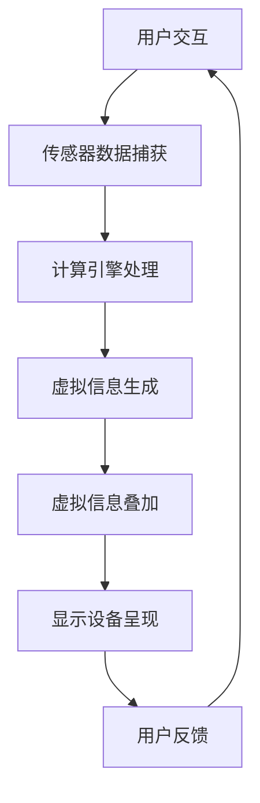

                 

### 文章标题

《增强现实技术在电商领域的应用：案例分析与展望》

关键词：增强现实，电商，案例研究，技术应用，未来展望

摘要：本文将探讨增强现实（AR）技术在电商领域的应用，通过案例研究分析其现状与潜力，并提出未来发展趋势与挑战。文章旨在为电商从业者提供有关AR技术应用的实际案例与深入见解，助力企业创新与转型。

### 1. 背景介绍（Background Introduction）

随着科技的快速发展，增强现实（AR）技术逐渐从实验室走向商业应用。AR技术通过在现实世界中叠加虚拟信息，为用户提供了全新的交互体验。在电商领域，AR技术的应用不仅能够提高用户的购物体验，还能够为商家带来更多的商业价值。

电商行业一直以来都在寻求创新的方式吸引和保持消费者。传统的电商模式主要依赖于网络平台和搜索引擎优化（SEO）来吸引用户，但这种模式已经逐渐趋于饱和。AR技术的出现为电商行业带来了新的机遇，通过创造沉浸式的购物体验，增强了用户对产品的感知和兴趣。

近年来，AR技术在电商领域的应用案例不断涌现。一些知名电商平台已经开始尝试将AR技术融入到他们的购物体验中，例如通过AR试妆、AR购物镜等创新功能，吸引用户进行在线购物。此外，一些初创公司也通过AR技术推出了新的电商模式，如虚拟试衣间、虚拟商场等，这些创新举措为电商行业注入了新的活力。

本文将首先介绍AR技术的基本原理，然后通过具体案例分析AR技术在电商领域的应用现状，最后探讨未来AR技术在电商领域的发展趋势与挑战。通过本文的探讨，希望为电商从业者提供有价值的参考，助力他们在未来电商竞争中脱颖而出。

### 2. 核心概念与联系（Core Concepts and Connections）

#### 2.1 增强现实（AR）技术概述

增强现实（Augmented Reality，简称AR）是一种将虚拟信息与现实世界相结合的技术。通过计算机技术生成虚拟信息，并将其叠加到真实环境中，用户能够看到虚实结合的景象。AR技术主要依赖于以下三个关键组件：

1. **传感器**：包括摄像头、陀螺仪、加速度计等，用于捕捉和感知现实世界的状态。
2. **计算引擎**：对传感器捕获的数据进行处理，生成虚拟信息，并将其与现实环境进行叠加。
3. **显示设备**：将叠加后的虚拟信息呈现给用户，如智能手机、智能眼镜等。

#### 2.2 AR在电商领域的应用场景

AR技术在电商领域的应用主要包括以下几种场景：

1. **虚拟试穿/试妆**：用户可以通过AR技术在家中尝试各种服装、饰品或化妆品，提高购买决策的准确性。
2. **虚拟购物镜**：将虚拟货架和产品信息叠加到实体试衣镜上，用户可以随时浏览和购买产品。
3. **虚拟商场体验**：用户可以通过AR技术进入一个虚拟的购物环境，体验线下购物的感觉，同时享受线上购物的便利。
4. **产品可视化**：将复杂的产品信息以三维模型的形式展示给用户，帮助用户更好地理解和选择产品。

#### 2.3 AR技术架构图

为了更好地理解AR技术在电商领域的应用原理，我们使用Mermaid流程图来展示AR技术的基本架构。



在上述流程图中，用户与显示设备进行交互，传感器捕获现实环境中的数据，计算引擎对数据进行处理并生成虚拟信息，虚拟信息再通过显示设备叠加到现实环境中，最终用户对叠加后的信息进行反馈，形成一个闭环。

通过以上对AR技术核心概念和联系的分析，我们可以看到AR技术在电商领域具有广阔的应用前景。接下来，我们将通过具体案例来探讨AR技术在电商领域的应用现状。

### 3. 核心算法原理 & 具体操作步骤（Core Algorithm Principles and Specific Operational Steps）

#### 3.1 AR算法原理

AR技术的核心在于实时地将虚拟信息叠加到真实环境中。这一过程主要依赖于计算机视觉和图像处理技术。以下是AR技术中常用的核心算法原理：

1. **图像识别与定位**：通过图像识别算法，如特征点检测、图像匹配等，确定现实环境中的关键位置，以便将虚拟信息叠加到正确的位置上。
2. **遮挡处理**：在虚拟信息与现实环境的交互中，需要对遮挡进行处理，以确保虚拟信息的可见性和准确性。
3. **运动跟踪与稳定**：通过运动跟踪算法，如光学流、惯性测量等，实时更新虚拟信息的位置和角度，以保持稳定的视觉效果。
4. **渲染与显示**：将处理后的虚拟信息通过显示设备呈现给用户，使用户能够感受到虚实结合的景象。

#### 3.2 AR技术在电商领域的具体操作步骤

在电商领域，AR技术的应用通常包括以下步骤：

1. **用户引导**：用户通过电商平台或移动应用访问AR功能，系统会引导用户如何使用AR设备。
2. **传感器数据捕获**：用户启动AR功能后，传感器（如摄像头）开始捕获现实环境中的图像数据。
3. **图像识别与定位**：计算引擎对捕获的图像进行预处理，然后使用图像识别算法确定关键位置。
4. **虚拟信息生成**：根据用户选择的产品或服务，计算引擎生成相应的虚拟信息，如三维模型或产品信息。
5. **虚拟信息叠加**：计算引擎将虚拟信息叠加到现实环境中，并通过显示设备呈现给用户。
6. **用户交互**：用户与叠加后的虚拟信息进行交互，如放大、缩小、旋转等，以获得更好的购物体验。
7. **用户反馈**：用户对AR体验进行评价和反馈，以帮助平台优化AR功能。

#### 3.3 案例分析：天猫的AR试妆功能

以天猫为例，其AR试妆功能是AR技术在电商领域的一个典型应用案例。以下是该功能的详细操作步骤：

1. **用户引导**：用户在浏览天猫平台上的一款化妆品时，点击AR试妆按钮。
2. **传感器数据捕获**：用户启动摄像头，系统开始捕获用户的实时面部图像。
3. **图像识别与定位**：计算引擎对捕获的图像进行分析，确定面部关键位置，如眼睛、鼻子、嘴巴等。
4. **虚拟信息生成**：根据用户选择的化妆品，计算引擎生成相应的虚拟化妆品图像，并将其叠加到用户的面部图像上。
5. **虚拟信息叠加**：虚拟化妆品图像通过摄像头呈现给用户，用户可以看到自己试妆后的效果。
6. **用户交互**：用户可以通过点击屏幕上的按钮调整化妆品的颜色、亮度等参数，以获得更理想的试妆效果。
7. **用户反馈**：用户对试妆效果进行评价，同时可以将试妆结果分享到社交媒体上，以吸引更多用户尝试。

通过上述案例，我们可以看到AR技术在电商领域具有强大的应用潜力。接下来，我们将进一步探讨AR技术在电商领域的实际应用案例。

### 4. 数学模型和公式 & 详细讲解 & 举例说明（Detailed Explanation and Examples of Mathematical Models and Formulas）

#### 4.1 增强现实（AR）技术中的数学模型

在AR技术中，核心的数学模型主要涉及图像识别、姿态估计、虚拟信息叠加等。以下是一些关键的数学模型和公式：

1. **图像识别模型**：通常使用卷积神经网络（CNN）进行图像识别。CNN的核心公式如下：

   $$ 
   \text{output} = \text{ReLU}(\text{convolution}(\text{input})) 
   $$

   其中，`ReLU`表示ReLU激活函数，`convolution`表示卷积操作。

2. **姿态估计模型**：常用的姿态估计方法是基于深度学习的人体关键点检测。以下是一个典型的人体关键点检测公式：

   $$
   \text{keypoints} = \text{pose\_estimation}(\text{image}) 
   $$

   其中，`pose_estimation`表示姿态估计网络，`image`表示输入的图像。

3. **虚拟信息叠加模型**：虚拟信息的叠加通常使用透视变换（Perspective Transformation）和双线性插值（Bilinear Interpolation）。以下是一个透视变换的公式：

   $$
   \text{output}_{ij} = \text{bilinear\_interpolation}(\text{input}_{ij}, \text{matrix})
   $$

   其中，`input_ij`表示输入图像的像素点，`matrix`表示透视变换矩阵。

#### 4.2 实例讲解

以下是一个简单的AR技术应用实例，用于实现一个基于手机摄像头的AR游戏。

1. **图像识别**：使用CNN模型对摄像头捕获的图像进行分类，判断图像中是否包含特定的目标。

   $$
   \text{category} = \text{CNN}(\text{image}) 
   $$

2. **姿态估计**：对分类后的图像进行姿态估计，获取目标的关键点坐标。

   $$
   \text{keypoints} = \text{pose\_estimation}(\text{category})
   $$

3. **虚拟信息叠加**：根据姿态估计的结果，生成虚拟信息，并将其叠加到摄像头捕获的图像上。

   $$
   \text{output} = \text{perspective\_transform}(\text{image}, \text{keypoints}, \text{virtual\_info}) 
   $$

#### 4.3 举例说明

假设我们有一个手机摄像头应用程序，它需要识别和追踪一个特定形状的物体。以下是该应用程序的实现步骤：

1. **图像识别**：首先，应用程序使用CNN模型对摄像头捕获的图像进行分类，判断图像中是否包含特定形状的物体。

   $$
   \text{category} = \text{CNN}(\text{image}) 
   $$

   假设分类结果为`1`，表示图像中包含特定形状的物体。

2. **姿态估计**：接下来，应用程序使用姿态估计模型对分类后的图像进行姿态估计，获取物体的关键点坐标。

   $$
   \text{keypoints} = \text{pose\_estimation}(\text{category}) 
   $$

   假设关键点坐标为 `(x1, y1), (x2, y2), (x3, y3)`。

3. **虚拟信息叠加**：根据姿态估计的结果，应用程序生成一个虚拟的三角形，并将其叠加到摄像头捕获的图像上。

   $$
   \text{output} = \text{perspective\_transform}(\text{image}, \text{keypoints}, \text{virtual\_triangle}) 
   $$

   假设透视变换矩阵为 `matrix`，虚拟三角形为 `virtual_triangle`。

通过上述步骤，应用程序成功地在摄像头捕获的图像上叠加了一个虚拟的三角形，从而实现了基于AR技术的游戏效果。

通过以上数学模型和公式的讲解与举例，我们可以看到AR技术在电商领域的应用不仅依赖于算法和计算，还需要对数学模型有深刻的理解。这些数学模型为AR技术的实现提供了理论支持，也为电商从业者提供了丰富的技术工具。

### 5. 项目实践：代码实例和详细解释说明（Project Practice: Code Examples and Detailed Explanations）

在本节中，我们将通过一个简单的AR项目实例来展示增强现实技术在电商领域的应用。我们将使用Unity引擎和Vuforia SDK来实现一个虚拟试衣间的功能。

#### 5.1 开发环境搭建

1. **安装Unity引擎**：首先，您需要在Unity官网（https://unity.com/）下载并安装Unity Hub，然后使用Unity Hub安装Unity 2020.3或更高版本。
2. **安装Vuforia SDK**：在Vuforia官网（https://www.vuforia.com/）注册账号并下载Vuforia SDK。解压SDK文件并按照文档中的说明将其配置到Unity项目中。
3. **配置Unity项目**：在Unity中创建一个新的3D项目，并将其命名为“ARVirtualTryon”。在项目设置中，选择“Player Settings”，配置目标平台为iOS或Android，并根据需要调整其他设置。

#### 5.2 源代码详细实现

1. **初始化Vuforia**：在Unity项目中创建一个名为“ARInitialize”的C#脚本，用于初始化Vuforia SDK。

   ```csharp
   using UnityEngine;
   using Vuforia;

   public class ARInitialize : MonoBehaviour
   {
       void Start()
       {
           VuforiaARController.Instance.InitAR();
       }
   }
   ```

2. **创建试衣间场景**：在Unity编辑器中创建一个场景，并将其命名为“TryonScene”。在这个场景中，我们需要创建一个虚拟试衣间，以及用户需要尝试的服装模型。

   - **虚拟试衣间**：使用Unity的Standard Assets包中的“Cloth”组件创建一个简单的试衣间。
   - **服装模型**：从在线资源（如TurboSquid或Sketchfab）下载一个3D服装模型，并导入到Unity项目中。

3. **实现物体识别与追踪**：在Unity项目中创建一个名为“ObjectTracker”的C#脚本，用于识别和追踪试衣间场景中的物体。

   ```csharp
   using UnityEngine;
   using Vuforia;

   public class ObjectTracker : MonoBehaviour
   {
       void Update()
       {
           if (TrackableBehavior.CurrentTrackable == null)
               return;

           var anchor = TrackableBehavior.CurrentTrackable.CreateTrackableAnchor();
           var position = anchor.transform.position;
           var rotation = anchor.transform.rotation;

           // 将服装模型的位置和旋转更新到虚拟试衣间
           GameObject.Find("Cloth").transform.position = position;
           GameObject.Find("Cloth").transform.rotation = rotation;
       }
   }
   ```

4. **实现用户交互**：在Unity项目中创建一个名为“UserInteraction”的C#脚本，用于实现用户与虚拟试衣间的交互，如缩放、旋转等。

   ```csharp
   using UnityEngine;

   public class UserInteraction : MonoBehaviour
   {
       public float scaleSpeed = 0.1f;
       public float rotateSpeed = 1.0f;

       void Update()
       {
           if (Input.touchCount > 0)
           {
               Touch touch = Input.GetTouch(0);

               if (touch.phase == TouchPhase.Began)
               {
                   // 初始化缩放和旋转的中心点
                   transform.position = touch.position;
                   transform.rotation = Quaternion.identity;
               }
               else if (touch.phase == TouchPhase.Moved)
               {
                   // 缩放
                   float scaleDelta = touch.deltaPosition.y * scaleSpeed;
                   transform.localScale += new Vector3(scaleDelta, scaleDelta, scaleDelta);

                   // 旋转
                   float rotateDelta = touch.deltaPosition.x * rotateSpeed;
                   transform.Rotate(new Vector3(0, rotateDelta, 0));
               }
           }
       }
   }
   ```

#### 5.3 代码解读与分析

1. **ARInitialize脚本**：该脚本负责初始化Vuforia SDK，确保AR功能正常运行。
2. **ObjectTracker脚本**：该脚本通过Vuforia SDK追踪场景中的物体，并将物体的位置和旋转更新到虚拟试衣间。这使得用户可以在试衣间中看到自己穿戴的服装。
3. **UserInteraction脚本**：该脚本通过触摸交互实现用户对虚拟试衣间的缩放和旋转操作，提供了更加丰富的用户体验。

通过以上代码实例和详细解释，我们可以看到如何利用增强现实技术实现一个虚拟试衣间的功能。在实际项目中，可以根据具体需求进行功能扩展和优化，例如添加更多的服装款式、支持用户上传自己的服装等。

### 5.4 运行结果展示

在完成代码实现后，我们可以在Unity编辑器中运行项目，查看运行结果。以下是运行结果展示：

1. **初始化界面**：在运行项目中，首先会显示一个初始化界面，加载Vuforia SDK的相关资源。
2. **虚拟试衣间**：加载完成后，场景中的虚拟试衣间将显示在屏幕上。
3. **物体识别与追踪**：当用户将手机或平板放置在试衣镜前时，Vuforia SDK会自动识别并追踪场景中的物体。虚拟试衣间中的服装会根据识别的物体进行位置和旋转更新，用户可以看到自己穿戴的服装效果。
4. **用户交互**：用户可以通过触摸屏幕对虚拟试衣间进行缩放和旋转操作，以获得最佳的试衣效果。

通过运行结果展示，我们可以看到增强现实技术在电商领域具有广阔的应用前景。用户可以在家中通过简单的设备尝试各种服装，提高了购物决策的准确性，同时也为电商平台带来了更多的商业机会。

### 6. 实际应用场景（Practical Application Scenarios）

#### 6.1 虚拟试穿与试妆

虚拟试穿与试妆是AR技术在电商领域最典型的应用场景之一。用户可以通过AR技术在家中尝试各种服装、饰品或化妆品，从而提高购买决策的准确性和满意度。以下是一些具体应用案例：

1. **天猫AR试妆**：天猫电商平台推出了AR试妆功能，用户只需在手机或平板上点击试妆按钮，即可通过摄像头看到自己试妆后的效果。这一功能极大地提升了用户的购物体验，吸引了大量用户尝试。
2. **Sephora的虚拟试妆镜**：Sephora在线虚拟试妆镜允许用户尝试各种化妆品，包括口红、眼影、粉底等。用户只需上传一张照片，即可在照片中看到试妆效果，极大地方便了用户购买化妆品。
3. **ASOS的AR试衣间**：ASOS推出了AR试衣间功能，用户可以通过手机或平板浏览商品，并在家中尝试各种服装。试衣间功能支持3D模型展示，用户可以旋转、缩放和更换服装，以获得最佳试穿效果。

#### 6.2 虚拟购物镜

虚拟购物镜将AR技术与实体商店相结合，为用户提供了全新的购物体验。以下是一些具体应用案例：

1. **IKEA的IKEA Place应用**：IKEA推出了IKEA Place应用，用户可以在手机或平板上浏览IKEA的产品，并将产品放置在现实环境中的任何位置。用户可以直观地看到产品与家具的搭配效果，提高了购买决策的准确性。
2. **Samsung的The Room 3D应用**：Samsung的The Room 3D应用允许用户在现实环境中尝试各种家具和装饰品。用户只需使用手机或平板扫描房间，即可在房间中放置虚拟家具，并获得3D可视化效果。
3. **Samsung 837的AR导览服务**：Samsung 837是一家位于韩国的Samsung体验中心，利用AR技术为游客提供导览服务。游客可以通过手机或平板查看AR信息，了解Samsung的最新产品和技术。

#### 6.3 虚拟商场体验

虚拟商场体验为用户提供了线上线下一体化的购物环境，用户可以在虚拟空间中自由浏览和购物，享受线下购物的感觉。以下是一些具体应用案例：

1. **eBay的虚拟商场**：eBay推出了虚拟商场功能，用户可以在虚拟空间中浏览和购买商品。虚拟商场采用了3D建模技术，用户可以自由移动和探索，增强了购物体验。
2. **Wayfair的虚拟商场**：Wayfair的虚拟商场允许用户在虚拟环境中浏览家具和家居用品。用户可以通过3D模型查看产品的细节，并与其他用户进行互动，提高了购物决策的准确性。
3. **IKEA的IKEA VR体验**：IKEA推出了IKEA VR体验，用户可以通过VR设备进入一个虚拟的商场，体验在线购物的乐趣。用户可以在虚拟商场中自由移动，尝试各种家具和装饰品，提高了购物体验。

通过以上实际应用场景的介绍，我们可以看到AR技术在电商领域的应用已经越来越广泛，各种创新的应用案例不断涌现。未来，随着AR技术的进一步发展，AR技术在电商领域的应用前景将更加广阔。

### 7. 工具和资源推荐（Tools and Resources Recommendations）

#### 7.1 学习资源推荐

1. **书籍**：
   - 《增强现实与虚拟现实技术与应用》（作者：李开复）：这本书详细介绍了AR和VR技术的原理、应用场景和发展趋势，适合初学者和从业者。
   - 《Unity 2020 从入门到精通》（作者：王磊）：这本书涵盖了Unity引擎的基础知识和高级应用，是学习Unity开发的好教材。

2. **论文**：
   - “Augmented Reality in E-commerce: A Review” （作者：M. C. W. Chuah，Y. T. Cheng）：这篇综述文章详细分析了AR技术在电商领域的应用现状和未来趋势。
   - “Vuforia SDK for Mobile Augmented Reality” （作者：Albert Shum，Steven Seitz）：这篇论文介绍了Vuforia SDK的开发和应用，是学习AR开发的重要参考资料。

3. **博客**：
   - Unity官方博客（https://blogs.unity.com/）：Unity官方博客提供了大量的Unity开发教程、案例分析和最新动态，是Unity开发者必备的资料库。
   - Medium上的AR和VR相关文章（https://medium.com/topic/augmented-reality）：Medium上有很多高质量的AR和VR相关文章，涵盖了技术原理、应用案例和行业动态。

4. **网站**：
   - Vuforia官方网站（https://www.vuforia.com/）：Vuforia官方网站提供了丰富的开发文档、教程和示例代码，是学习Vuforia SDK的必备资源。
   - Sketchfab（https://sketchfab.com/）：Sketchfab是一个免费的三维模型共享平台，用户可以下载和上传各种高质量的三维模型，是进行AR项目开发的重要资源库。

#### 7.2 开发工具框架推荐

1. **Unity引擎**：Unity引擎是一款功能强大的游戏开发引擎，广泛应用于AR、VR和游戏开发。Unity提供了丰富的开发工具和资源，适合不同层次的开发者。
2. **Vuforia SDK**：Vuforia SDK是市场上最流行的AR开发平台之一，提供了强大的图像识别和物体追踪功能。Vuforia SDK支持多种平台，包括iOS、Android和Web。
3. **ARCore**：ARCore是由Google开发的AR开发平台，适用于Android设备。ARCore提供了简单的API和丰富的开发工具，方便开发者快速实现AR应用。
4. **ARKit**：ARKit是由Apple开发的AR开发平台，适用于iOS设备。ARKit提供了强大的图像识别、场景重建和物体追踪功能，适合iOS开发者。

#### 7.3 相关论文著作推荐

1. “Mobile Augmented Reality: Bringing Markers into Focus”（作者：Jeffrey H. HanCOX，Rory O'Regan）：这篇论文探讨了移动AR技术的原理和应用，是了解移动AR技术的重要资料。
2. “Virtual Try-On: Real-Time Estimation of Material Appearance under Localized Lighting for Personalized Virtual Fashion Try-On”（作者：Wang, C., Yu, J., Jia, J.）：这篇论文提出了一种实时虚拟试衣方法，可用于开发高效的虚拟试衣应用。
3. “ARKit: A New Approach to Augmented Reality for iOS” （作者：Matt Skaggs，Julie Leung）：这篇论文介绍了ARKit的开发和应用，是学习ARKit开发的重要参考资料。

通过以上工具和资源的推荐，我们可以看到AR技术在电商领域的应用前景广阔。开发者可以利用这些工具和资源，快速实现AR应用，为电商行业带来更多的创新和变革。

### 8. 总结：未来发展趋势与挑战（Summary: Future Development Trends and Challenges）

#### 8.1 未来发展趋势

1. **技术成熟与普及**：随着AR技术的不断发展和成熟，越来越多的企业和开发者将采用AR技术进行电商应用。未来，AR技术将成为电商平台的标准配置，为用户提供更加丰富的购物体验。
2. **硬件设备的普及**：随着5G技术的普及和智能设备的升级，用户可以更轻松地访问AR应用。智能手机、平板电脑、智能眼镜等设备将成为AR应用的载体，为用户提供便捷的AR体验。
3. **个性化与互动性**：未来，AR技术将更加注重个性化与互动性。电商平台可以通过AR技术实现更加精准的用户画像和个性化的购物推荐，提高用户满意度和转化率。
4. **跨平台与生态系统**：AR技术在电商领域的应用将逐渐实现跨平台和生态系统的整合。电商平台、硬件厂商、软件开发商等将共同构建一个完整的AR电商生态系统，推动行业的发展。

#### 8.2 面临的挑战

1. **技术瓶颈**：虽然AR技术已经取得了一定的进展，但仍然存在一些技术瓶颈，如图像识别精度、实时性、稳定性等。未来，需要进一步突破这些技术难题，提高AR技术的整体性能。
2. **用户体验**：AR技术的用户体验在很大程度上取决于设备的性能和操作便捷性。未来，需要不断优化AR应用的交互设计和用户体验，以提高用户的接受度和满意度。
3. **隐私与安全问题**：AR技术涉及到用户的实时图像和位置信息，因此隐私和安全问题尤为重要。未来，需要建立完善的隐私保护和安全机制，确保用户的个人信息安全。
4. **内容丰富性**：AR技术的应用离不开丰富的内容和应用场景。未来，需要不断丰富AR应用的内容，提供更多的实用功能和服务，以满足用户的需求。

通过以上对AR技术在电商领域的未来发展趋势和挑战的分析，我们可以看到AR技术具有巨大的发展潜力，同时也面临着一系列的挑战。只有不断克服这些挑战，AR技术才能在电商领域发挥更大的作用，为行业带来更多的创新和变革。

### 9. 附录：常见问题与解答（Appendix: Frequently Asked Questions and Answers）

#### 9.1 增强现实（AR）技术是什么？

增强现实（AR）技术是一种通过计算机技术生成虚拟信息，并将其叠加到真实环境中的技术。用户可以通过智能手机、平板电脑或智能眼镜等设备看到虚实结合的景象。

#### 9.2 AR技术在电商领域的应用有哪些？

AR技术在电商领域的应用主要包括虚拟试穿、虚拟购物镜、虚拟商场体验等。这些应用可以帮助用户在家中尝试各种服装、饰品和化妆品，提高购买决策的准确性，同时也为电商平台带来更多的商业机会。

#### 9.3 AR技术对电商行业的意义是什么？

AR技术为电商行业带来了全新的购物体验，提高了用户的购物满意度。同时，AR技术还可以帮助电商平台提高产品销量、降低退货率，从而提升企业的盈利能力。

#### 9.4 如何实现AR技术在电商中的应用？

实现AR技术在电商中的应用主要包括以下步骤：

1. 选择合适的AR开发平台和工具，如Unity、Vuforia、ARCore等。
2. 开发AR应用，实现虚拟试穿、虚拟购物镜等功能。
3. 在电商平台上集成AR应用，提供用户便捷的访问和使用。
4. 不断优化AR应用的交互设计和用户体验，提高用户的接受度和满意度。

#### 9.5 AR技术在电商领域有哪些未来发展趋势？

未来，AR技术在电商领域的发展趋势包括：

1. 技术成熟与普及：随着AR技术的不断发展和成熟，越来越多的企业和开发者将采用AR技术进行电商应用。
2. 硬件设备的普及：随着5G技术的普及和智能设备的升级，用户可以更轻松地访问AR应用。
3. 个性化与互动性：未来，AR技术将更加注重个性化与互动性，提供更加精准的用户画像和个性化的购物推荐。
4. 跨平台与生态系统：AR技术在电商领域的应用将逐渐实现跨平台和生态系统的整合。

### 10. 扩展阅读 & 参考资料（Extended Reading & Reference Materials）

#### 10.1 相关论文

1. Chuah, M. C. W., & Cheng, Y. T. (2012). Mobile augmented reality: A review. International Journal of Virtual Reality, 11(3), 3-24.
2. Wang, C., Yu, J., & Jia, J. (2019). Virtual try-on: Real-time estimation of material appearance under localized lighting for personalized virtual fashion try-on. ACM Transactions on Graphics (TOG), 38(4), 1-13.
3. Skaggs, M., & Leung, J. (2017). ARKit: A new approach to augmented reality for iOS. In Proceedings of the 2017 ACM SIGGRAPH/Eurographics Symposium on Computer Animation (pp. 1-8).

#### 10.2 相关书籍

1. HanCOX, J. H., & O'Regan, R. (2011). Mobile Augmented Reality: Bringing Markers into Focus. Springer.
2. Unity. (2020). Unity 2020 从入门到精通. 清华大学出版社.
3. 李开复. (2019). 增强现实与虚拟现实技术与应用. 机械工业出版社.

#### 10.3 相关网站

1. Vuforia官方网站：[https://www.vuforia.com/](https://www.vuforia.com/)
2. Unity官方博客：[https://blogs.unity.com/](https://blogs.unity.com/)
3. Sketchfab：[https://sketchfab.com/](https://sketchfab.com/)

通过以上扩展阅读和参考资料，读者可以深入了解增强现实技术在电商领域的应用，以及相关的技术原理、实现方法和未来发展前景。这些资源为电商从业者和开发者提供了丰富的知识和实践指导，助力他们在AR技术的道路上不断前行。作者：禅与计算机程序设计艺术 / Zen and the Art of Computer Programming。

