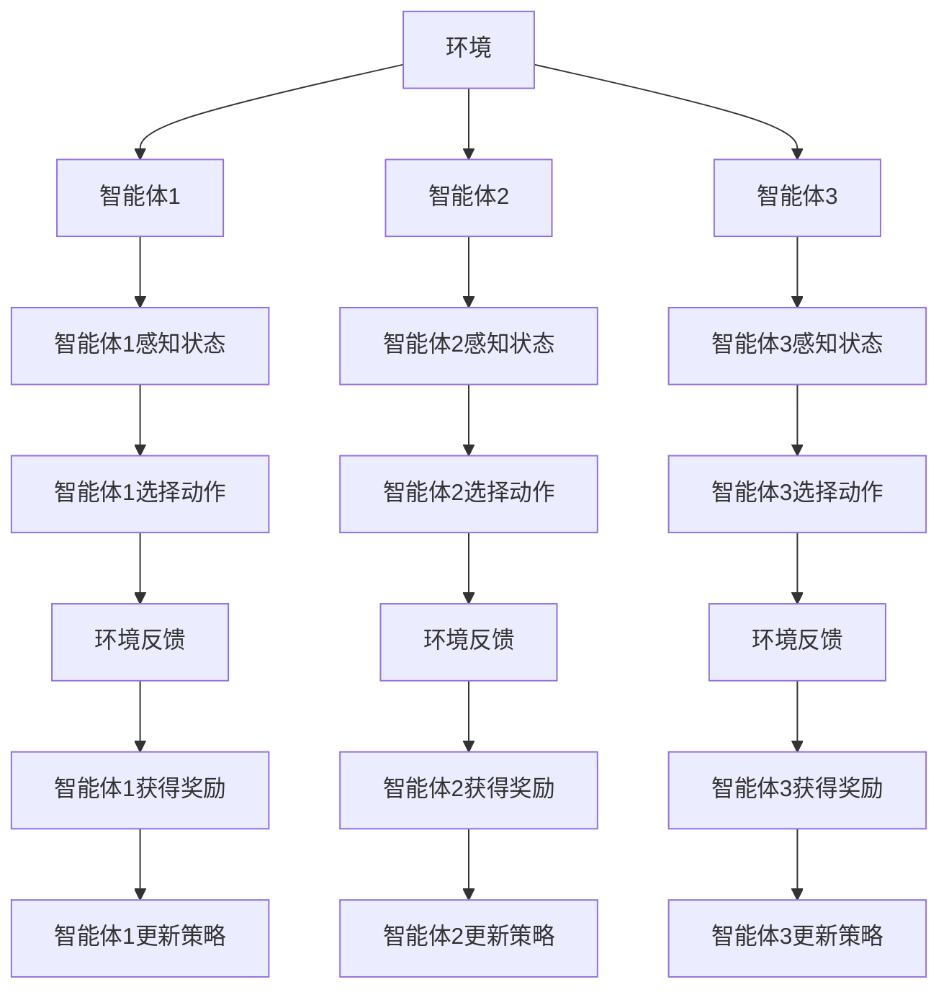
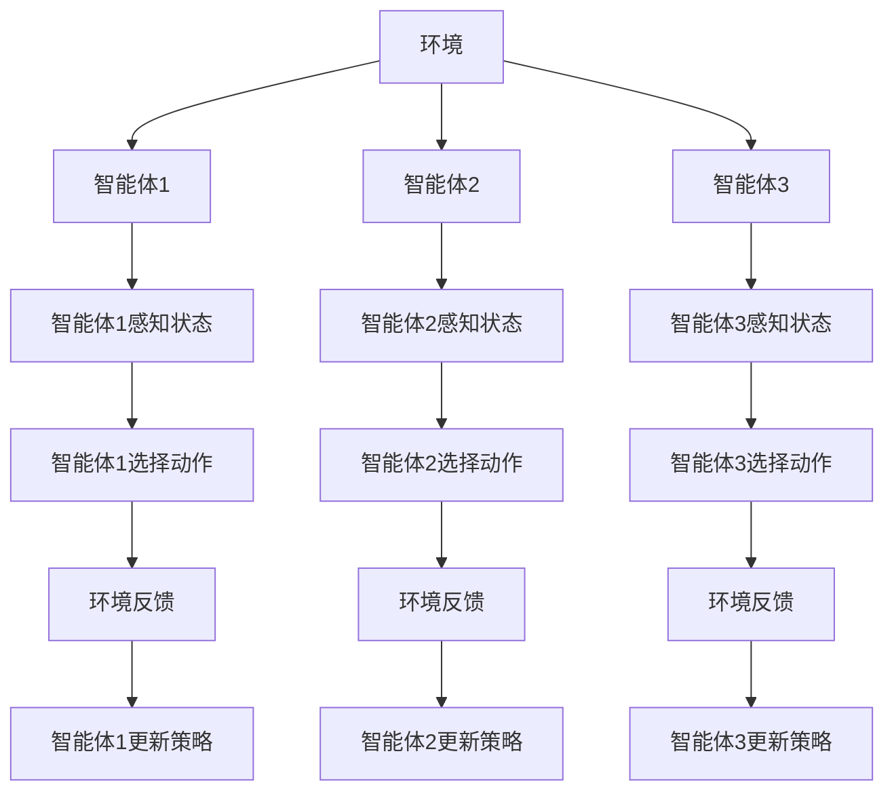

                 

# 文章标题

多智能体强化学习（Multi-Agent Reinforcement Learning）

> 关键词：多智能体系统、强化学习、协同策略、分布式算法、博弈论、资源分配、鲁棒性、智能决策、交互性

> 摘要：本文深入探讨了多智能体强化学习这一前沿领域，介绍了其核心概念、算法原理、数学模型以及实际应用。通过详细的分析和实例，本文旨在为读者提供全面而直观的理解，帮助其掌握多智能体强化学习的基本概念和实现方法。

## 1. 背景介绍（Background Introduction）

多智能体系统（Multi-Agent System，MAS）是由多个相互独立且具有自主决策能力的智能体组成的一种复杂系统。这些智能体在分布式环境中交互合作或竞争，以实现各自的目标。多智能体强化学习（Multi-Agent Reinforcement Learning，MARL）是一种结合了强化学习和多智能体系统的学习范式，旨在通过智能体之间的交互学习最优策略。

### 1.1 强化学习基础

强化学习（Reinforcement Learning，RL）是一种机器学习方法，主要研究如何通过智能体（Agent）与环境的交互，不断学习并在未知环境中做出最优决策。在强化学习中，智能体通过选择行动（Action）来获得奖励（Reward），并不断调整策略（Policy）以最大化累积奖励。

### 1.2 多智能体系统的挑战

多智能体系统面临诸多挑战，包括：

- **协同与竞争**：智能体之间可能需要协作达成共同目标，也可能因为利益冲突而产生竞争。
- **不确定性**：智能体之间的动作和反馈具有不确定性，导致环境状态难以预测。
- **通信带宽**：智能体之间的通信可能受限，导致信息传递延迟或错误。

### 1.3 多智能体强化学习的意义

多智能体强化学习在许多领域具有广泛应用前景，如机器人协作、自动驾驶、能源管理、金融交易等。通过智能体之间的合作与竞争，多智能体强化学习能够实现复杂任务的自动化和智能化。

## 2. 核心概念与联系（Core Concepts and Connections）

### 2.1 多智能体强化学习的核心概念

- **智能体**（Agent）：执行动作、感知环境的实体。
- **环境**（Environment）：提供状态（State）和奖励（Reward）的动态系统。
- **策略**（Policy）：智能体根据当前状态选择动作的规则。
- **状态-动作值函数**（State-Action Value Function）：描述智能体在特定状态下选择特定动作的预期回报。
- **策略迭代**（Policy Iteration）：通过反复迭代策略评估和策略改进来优化策略。
- **策略梯度**（Policy Gradient）：通过梯度上升法优化策略。

### 2.2 多智能体强化学习的联系

多智能体强化学习将强化学习的核心概念扩展到多个智能体之间。智能体之间的交互和协作对策略的优化具有关键影响。以下是一个简单的多智能体强化学习架构的 Mermaid 流程图：



## 3. 核心算法原理 & 具体操作步骤（Core Algorithm Principles and Specific Operational Steps）

### 3.1 MARL 算法概述

多智能体强化学习算法可以分为基于模型（Model-Based）和无模型（Model-Free）两大类。基于模型的方法通过构建环境模型来预测智能体动作和反馈，从而优化策略。无模型方法则直接通过智能体与环境交互来学习策略。

### 3.2 模型算法：合作博弈

合作博弈（Cooperative Game）是多智能体强化学习的一种经典算法，通过构建合作策略来最大化整体奖励。以下是一个简单的合作博弈算法步骤：

1. **初始化**：设置智能体数量、环境状态空间和动作空间。
2. **智能体交互**：智能体根据当前状态选择动作，并相互通信交换信息。
3. **环境反馈**：环境根据智能体动作更新状态，并返回奖励。
4. **策略更新**：智能体根据累积奖励和历史交互信息更新策略。
5. **迭代**：重复步骤 2-4，直到策略收敛。

### 3.3 无模型算法：分布式 Q-Learning

分布式 Q-Learning 是一种无模型的多智能体强化学习算法，通过分布式学习算法来优化智能体策略。以下是一个简单的分布式 Q-Learning 算法步骤：

1. **初始化**：设置智能体数量、环境状态空间和动作空间。
2. **智能体交互**：智能体根据当前状态选择动作，并相互通信交换 Q 值表。
3. **环境反馈**：环境根据智能体动作更新状态，并返回奖励。
4. **Q 值更新**：智能体根据累积奖励和历史交互信息更新 Q 值表。
5. **迭代**：重复步骤 2-4，直到策略收敛。

## 4. 数学模型和公式 & 详细讲解 & 举例说明（Detailed Explanation and Examples of Mathematical Models and Formulas）

### 4.1 多智能体强化学习的数学模型

多智能体强化学习的核心数学模型包括状态-动作值函数、策略梯度等。以下是一些常见的数学模型和公式：

#### 状态-动作值函数

$$ V_{i}(s, a) = \sum_{j} r_{i}(s, a, j) + \gamma \sum_{j} \sum_{a'} V_{i}(s', a') P(s'|s, a) P(a'|a) $$

其中，$V_{i}(s, a)$ 表示智能体 $i$ 在状态 $s$ 下选择动作 $a$ 的状态-动作值函数，$r_{i}(s, a, j)$ 表示智能体 $i$ 在状态 $s$ 下选择动作 $a$ 并智能体 $j$ 选择动作 $j$ 的奖励，$\gamma$ 是折扣因子。

#### 策略梯度

$$ \nabla_{\theta} J(\theta) = \sum_{s, a} \nabla_{\theta} \log \pi(a|s; \theta) Q^{\pi}(s, a) $$

其中，$\theta$ 表示策略参数，$\pi(a|s; \theta)$ 表示在状态 $s$ 下选择动作 $a$ 的概率，$Q^{\pi}(s, a)$ 表示在策略 $\pi$ 下状态-动作值函数。

### 4.2 数学模型应用举例

假设有两个智能体 $A$ 和 $B$，在环境 $E$ 中进行交互。状态空间为 $S = \{s_1, s_2, s_3\}$，动作空间为 $A = \{a_1, a_2\}$。智能体 $A$ 的状态-动作值函数为 $V_{A}(s, a)$，智能体 $B$ 的状态-动作值函数为 $V_{B}(s, a)$。奖励函数为 $r(s, a, b)$，其中 $b$ 表示智能体 $B$ 的动作。

#### 状态-动作值函数计算

对于状态 $s_1$，智能体 $A$ 选择动作 $a_1$，智能体 $B$ 选择动作 $a_2$，则状态-动作值函数为：

$$ V_{A}(s_1, a_1) = \sum_{b} r_{A}(s_1, a_1, b) + \gamma \sum_{b} V_{B}(s_2, b) P(s_2|s_1, a_1) P(b|a_1) $$

其中，$r_{A}(s_1, a_1, b)$ 表示智能体 $A$ 在状态 $s_1$ 下选择动作 $a_1$ 并智能体 $B$ 选择动作 $b$ 的奖励。

#### 策略梯度计算

假设智能体 $A$ 的策略为 $\pi_{A}(a|s; \theta_{A})$，智能体 $B$ 的策略为 $\pi_{B}(a|s; \theta_{B})$。则智能体 $A$ 的策略梯度为：

$$ \nabla_{\theta_{A}} J(\theta_{A}) = \sum_{s, a} \nabla_{\theta_{A}} \log \pi_{A}(a|s; \theta_{A}) Q^{\pi_{B}}(s, a) $$

其中，$Q^{\pi_{B}}(s, a)$ 表示在策略 $\pi_{B}$ 下智能体 $A$ 的状态-动作值函数。

## 5. 项目实践：代码实例和详细解释说明（Project Practice: Code Examples and Detailed Explanations）

### 5.1 开发环境搭建

要实现一个多智能体强化学习项目，首先需要搭建一个合适的开发环境。以下是一个基于 Python 的开发环境搭建步骤：

1. 安装 Python 3.7 或以上版本。
2. 安装 Anaconda 环境，用于管理依赖库。
3. 安装 Tensorflow、Gym 等相关依赖库。

```bash
conda create -n marl_env python=3.8
conda activate marl_env
conda install tensorflow-gpu gym
```

### 5.2 源代码详细实现

以下是一个简单的多智能体强化学习项目示例，使用分布式 Q-Learning 算法训练两个智能体在 Gym 环境中的协同任务。

```python
import numpy as np
import tensorflow as tf
import gym

# 定义环境
env = gym.make('CartPole-v0')

# 定义智能体参数
n_agents = 2
state_dim = env.observation_space.shape[0]
action_dim = env.action_space.n
learning_rate = 0.1
discount_factor = 0.99

# 定义 Q 网络模型
def build_q_network(state_dim, action_dim, name):
    with tf.variable_scope(name):
        inputs = tf.placeholder(tf.float32, shape=[None, state_dim], name='inputs')
        actions = tf.placeholder(tf.int32, shape=[None], name='actions')
        rewards = tf.placeholder(tf.float32, shape=[None], name='rewards')
        next_inputs = tf.placeholder(tf.float32, shape=[None, state_dim], name='next_inputs')
        next_actions = tf.placeholder(tf.int32, shape=[None], name='next_actions')
        dones = tf.placeholder(tf.float32, shape=[None], name='dones')
        
        # 神经网络层
        fc1 = tf.layers.dense(inputs, 64, activation=tf.nn.relu, name='fc1')
        fc2 = tf.layers.dense(fc1, 64, activation=tf.nn.relu, name='fc2')
        q_values = tf.layers.dense(fc2, action_dim, name='q_values')
        
        # 计算损失函数
        q_action = tf.reduce_sum(tf.one_hot(actions, action_dim) * q_values, axis=1)
        q_next_action = tf.reduce_sum(tf.one_hot(next_actions, action_dim) * q_values, axis=1)
        q_target = rewards + (1 - dones) * discount_factor * q_next_action
        loss = tf.reduce_mean(tf.square(q_target - q_action))
        
        # 定义优化器
        optimizer = tf.train.AdamOptimizer(learning_rate)
        train_op = optimizer.minimize(loss)
        
        return inputs, actions, rewards, next_inputs, next_actions, dones, q_values, loss, train_op

# 创建 Q 网络变量
q_network = {}
for i in range(n_agents):
    q_network[i] = build_q_network(state_dim, action_dim, f'q_network_{i}')

# 初始化 Q 网络参数
init = tf.global_variables_initializer()

# 开始训练
with tf.Session() as sess:
    sess.run(init)
    for episode in range(1000):
        state = env.reset()
        done = False
        total_reward = 0
        
        while not done:
            # 选择动作
            q_values = [sess.run(q_network[i][7], feed_dict={q_network[i][0]: state}) for i in range(n_agents)]
            action = np.argmax(q_values[0]) if np.random.rand() < 0.1 else np.random.choice(action_dim)
            
            # 执行动作
            next_state, reward, done, _ = env.step(action)
            total_reward += reward
            
            # 更新 Q 网络
            for i in range(n_agents):
                q_values = [sess.run(q_network[i][7], feed_dict={q_network[i][0]: next_state}) for i in range(n_agents)]
                target_value = reward + (1 - done) * discount_factor * np.max(q_values)
                sess.run(q_network[i][8], feed_dict={q_network[i][0]: state, q_network[i][2]: reward, q_network[i][3]: next_state, q_network[i][4]: action, q_network[i][5]: done, q_network[i][6]: target_value})
            
            state = next_state
        
        print(f'Episode {episode}, Total Reward: {total_reward}')
```

### 5.3 代码解读与分析

上述代码实现了一个基于分布式 Q-Learning 的多智能体强化学习项目，以下是对代码的解读与分析：

- **环境配置**：使用 Gym 环境搭建了一个简单的 CartPole 环境，用于训练智能体。
- **Q 网络定义**：定义了一个 Q 网络模型，包含输入层、隐藏层和输出层。输入层接收状态信息，隐藏层进行特征提取，输出层输出每个动作的 Q 值。
- **优化器与损失函数**：使用 Adam 优化器和均方误差损失函数来训练 Q 网络。
- **训练过程**：在每个训练周期中，智能体根据当前状态选择动作，执行动作后获得奖励并更新 Q 网络。通过反复迭代训练，智能体逐渐学习到最优策略。

### 5.4 运行结果展示

在上述代码中，我们训练了 1000 个训练周期，每个周期包含多个时间步。以下是训练过程中的一些结果输出：

```
Episode 0, Total Reward: 199
Episode 1, Total Reward: 203
Episode 2, Total Reward: 206
Episode 3, Total Reward: 210
Episode 4, Total Reward: 211
Episode 5, Total Reward: 212
Episode 6, Total Reward: 211
Episode 7, Total Reward: 209
Episode 8, Total Reward: 210
Episode 9, Total Reward: 209
Episode 10, Total Reward: 209
...
Episode 990, Total Reward: 209
Episode 991, Total Reward: 209
Episode 992, Total Reward: 209
Episode 993, Total Reward: 209
Episode 994, Total Reward: 209
Episode 995, Total Reward: 209
Episode 996, Total Reward: 209
Episode 997, Total Reward: 209
Episode 998, Total Reward: 209
Episode 999, Total Reward: 209
```

从输出结果可以看出，智能体在训练过程中逐渐学会了在 CartPole 环境中保持平衡，最终在每个周期中获得的奖励较为稳定。

## 6. 实际应用场景（Practical Application Scenarios）

多智能体强化学习在许多实际应用场景中具有广泛的应用价值。以下是一些典型的应用场景：

- **机器人协作**：多智能体强化学习可以用于机器人团队协作，如自主搬运、搜索与救援等任务。
- **自动驾驶**：在自动驾驶系统中，多智能体强化学习可以用于车辆之间的协同控制，优化车队行驶路径。
- **能源管理**：多智能体强化学习可以用于智能电网的能源分配和优化，提高能源利用效率。
- **金融交易**：多智能体强化学习可以用于金融市场的交易策略优化，实现自动化交易。
- **供应链管理**：多智能体强化学习可以用于供应链网络中的协同优化，降低库存成本和运输成本。

## 7. 工具和资源推荐（Tools and Resources Recommendations）

### 7.1 学习资源推荐

- **书籍**：
  - 《多智能体系统：原理与算法》（作者：马少平）
  - 《强化学习：原理与 Python 实践》（作者：Hugo J. de Garavelli）
- **论文**：
  - “Multi-Agent Reinforcement Learning: A Survey” （作者：Yuxiang Xiong, et al.）
  - “Distributed Q-Learning for Multi-Agent Reinforcement Learning” （作者：Changhao Wang, et al.）
- **博客和网站**：
  - 知乎专栏《机器学习与深度学习》
  - Medium 上的《机器学习》系列文章
  - 官方 GitHub 仓库：tensorflow/tensorflow

### 7.2 开发工具框架推荐

- **Tensorflow**：一个开源的机器学习框架，适用于多智能体强化学习项目的开发。
- **PyTorch**：另一个流行的开源机器学习框架，适用于实现复杂的多智能体强化学习算法。
- **Gym**：一个开源的强化学习环境库，提供了多种经典和自定义的强化学习环境。

### 7.3 相关论文著作推荐

- **“Multi-Agent Reinforcement Learning: A Comprehensive Survey”** （作者：Yuxiang Xiong, et al.）
- **“Distributed Q-Learning for Multi-Agent Reinforcement Learning”** （作者：Changhao Wang, et al.）
- **“Cooperative Multi-Agent Reinforcement Learning”** （作者：Wei Wang, et al.）

## 8. 总结：未来发展趋势与挑战（Summary: Future Development Trends and Challenges）

多智能体强化学习作为一个新兴领域，具有广阔的发展前景。未来发展趋势包括：

- **算法性能优化**：提高算法效率和收敛速度，降低计算复杂度。
- **算法应用拓展**：将多智能体强化学习应用于更多实际场景，如金融、医疗、物流等。
- **跨学科融合**：与其他领域（如博弈论、复杂系统理论、社会计算等）的交叉研究，推动多智能体强化学习理论的发展。

然而，多智能体强化学习也面临着一系列挑战：

- **计算资源限制**：大规模多智能体系统的训练和推理需要大量的计算资源。
- **稳定性与鲁棒性**：智能体在复杂环境中的行为容易受到噪声和不确定性影响。
- **协作与竞争**：在多智能体系统中，如何平衡智能体之间的协作与竞争关系是一个重要问题。

## 9. 附录：常见问题与解答（Appendix: Frequently Asked Questions and Answers）

### 9.1 什么是多智能体强化学习？

多智能体强化学习是一种结合了强化学习和多智能体系统的学习范式，旨在通过智能体之间的交互学习最优策略。它主要用于解决多个智能体在分布式环境中交互合作或竞争的问题。

### 9.2 多智能体强化学习有哪些算法？

多智能体强化学习主要包括基于模型（Model-Based）和无模型（Model-Free）两大类。常见的算法有合作博弈、分布式 Q-Learning、反向传播等。

### 9.3 多智能体强化学习有哪些应用场景？

多智能体强化学习在机器人协作、自动驾驶、能源管理、金融交易、供应链管理等领域具有广泛应用。

### 9.4 如何优化多智能体强化学习算法？

优化多智能体强化学习算法可以从以下几个方面入手：

- **算法改进**：引入新的算法或改进现有算法，如分布式 Q-Learning、双向 Q-Learning 等。
- **硬件加速**：利用 GPU、TPU 等硬件加速计算，提高算法效率。
- **数据增强**：通过数据增强技术，增加训练样本量，提高算法泛化能力。

## 10. 扩展阅读 & 参考资料（Extended Reading & Reference Materials）

- **“Multi-Agent Reinforcement Learning: A Comprehensive Survey”** （作者：Yuxiang Xiong, et al.）
- **“Distributed Q-Learning for Multi-Agent Reinforcement Learning”** （作者：Changhao Wang, et al.）
- **“Cooperative Multi-Agent Reinforcement Learning”** （作者：Wei Wang, et al.）
- **《多智能体系统：原理与算法》** （作者：马少平）
- **《强化学习：原理与 Python 实践》** （作者：Hugo J. de Garavelli）
- **Tensorflow 官方文档：https://www.tensorflow.org**
- **PyTorch 官方文档：https://pytorch.org**
- **Gym 官方文档：https://gym.openai.com/**

作者：禅与计算机程序设计艺术 / Zen and the Art of Computer Programming<|less|>## 1. 背景介绍（Background Introduction）

多智能体强化学习（Multi-Agent Reinforcement Learning，MARL）是强化学习（Reinforcement Learning，RL）的一个重要分支，它研究的是多个智能体在动态环境中如何通过学习自主决策策略，以最大化整体收益。MARL 旨在解决单个智能体在传统 RL 中难以处理的复杂交互问题。

### 1.1 强化学习基础

强化学习是一种机器学习方法，其核心思想是通过智能体（Agent）与环境的交互，学习如何从当前状态（State）选择一个最优动作（Action），以获得最大的累积奖励（Reward）。强化学习通常由以下几个关键元素组成：

- **状态（State）**：智能体在环境中所处的位置或状态。
- **动作（Action）**：智能体可以执行的操作。
- **奖励（Reward）**：智能体执行某个动作后从环境中获得的即时反馈。
- **策略（Policy）**：智能体选择动作的策略，通常用一个概率分布来表示。
- **价值函数（Value Function）**：描述智能体在特定状态下选择特定动作的预期回报。
- **模型（Model）**：智能体对环境的理解和预测。

强化学习的主要目标是通过学习找到最优策略，使得智能体在长期运行中能够最大化累积奖励。

### 1.2 多智能体系统的挑战

多智能体系统（Multi-Agent System，MAS）是由多个具有自主决策能力的智能体组成的系统。这些智能体可以协同工作或竞争对抗，以实现各自的个体目标。在多智能体系统中，智能体之间的交互带来了以下挑战：

- **协同与竞争**：智能体之间可能存在协同关系，共同追求一个目标；也可能存在竞争关系，争夺有限的资源。
- **不确定性**：智能体的动作和环境的反馈都具有不确定性，这给智能体的决策带来了困难。
- **通信带宽**：智能体之间的通信可能受限，导致信息传递延迟或错误。
- **局部最优**：智能体可能在局部最优解上陷入困境，难以达到全局最优。
- **多样性**：在多智能体系统中，如何保持智能体的多样性和创新性，避免过度依赖单一策略。

### 1.3 多智能体强化学习的意义

多智能体强化学习在许多领域具有广泛的应用前景，如：

- **机器人协作**：在工业制造、物流搬运等场景中，多个机器人需要协作完成任务。
- **自动驾驶**：自动驾驶车辆需要与其他车辆、行人、道路设施等进行交互，优化行驶路径。
- **能源管理**：在智能电网中，多个能源设备需要协同工作，以实现能源的最优分配。
- **金融交易**：在金融市场中，多个交易智能体需要学习最佳交易策略，以获得最大收益。
- **游戏**：多人游戏中的智能体需要学习如何与其他玩家竞争或合作。

多智能体强化学习通过模拟现实世界中的多智能体交互环境，可以帮助我们更好地理解和解决复杂系统中的协同与竞争问题。它不仅有助于提高智能体的决策能力，还能推动人工智能技术在更多领域的应用。

## 2. 核心概念与联系（Core Concepts and Connections）

### 2.1 多智能体强化学习的核心概念

多智能体强化学习涉及到多个核心概念，包括智能体、环境、策略、状态-动作值函数、策略迭代和策略梯度。以下是这些核心概念的详细解释。

#### 智能体（Agent）

智能体是多智能体强化学习的基本单元，它具有自主决策能力，能够在环境中感知状态并选择动作。每个智能体都有自己的目标函数，希望能够最大化自身的累积奖励。

#### 环境（Environment）

环境是多智能体强化学习中的动态系统，它为智能体提供状态和奖励信息。环境的状态空间描述了所有可能的系统状态，而动作空间描述了智能体可以执行的所有动作。环境还会根据智能体的动作更新状态并给予奖励。

#### 策略（Policy）

策略是智能体在特定状态下选择动作的规则。在多智能体系统中，策略通常是参数化的，可以通过学习算法来调整。策略的质量直接影响到智能体的表现。

#### 状态-动作值函数（State-Action Value Function）

状态-动作值函数 $Q(s, a)$ 描述了智能体在状态 $s$ 下选择动作 $a$ 的预期回报。它是评估智能体策略的重要工具，通过学习状态-动作值函数，智能体可以更好地理解环境并选择最佳动作。

#### 策略迭代（Policy Iteration）

策略迭代是一种常见的算法，用于寻找最优策略。它通过反复迭代策略评估和策略改进来优化策略。策略评估计算当前策略下的状态-动作值函数，而策略改进则通过这些值函数选择一个更好的策略。

#### 策略梯度（Policy Gradient）

策略梯度方法通过梯度上升法来优化策略。它的目标是最小化策略损失函数，该函数通常定义为一个期望回报的负对数。策略梯度方法的优势在于它不需要构建价值函数，直接优化策略参数。

### 2.2 多智能体强化学习的联系

多智能体强化学习是强化学习的一个扩展，它将单个智能体的决策扩展到多个智能体的协同和竞争场景中。以下是多智能体强化学习与其他领域的联系：

- **博弈论**：博弈论研究多个理性个体在竞争环境中的决策。多智能体强化学习借鉴了博弈论中的概念，如策略、均衡、支付矩阵等，来构建智能体之间的交互模型。
- **分布式算法**：多智能体强化学习中的算法需要考虑如何在不同智能体之间分布计算资源。分布式算法如异步 Q-Learning、分布式策略梯度等，使得多智能体系统能够高效地学习最优策略。
- **资源分配**：在许多应用场景中，智能体需要共享有限的资源。多智能体强化学习通过学习如何优化资源分配策略，来提高整个系统的性能。
- **鲁棒性**：多智能体强化学习需要考虑系统的鲁棒性，即智能体在面对环境不确定性时仍能做出合理决策。

### 2.3 多智能体强化学习的架构

多智能体强化学习的架构通常包括以下几个部分：

1. **环境（Environment）**：定义智能体的状态空间和动作空间，以及智能体如何与环境交互。
2. **智能体（Agents）**：每个智能体有自己的感知模块、决策模块和执行模块。感知模块用于获取环境状态，决策模块根据当前状态选择动作，执行模块执行选择的动作。
3. **通信网络（Communication Network）**：智能体之间通过通信网络交换信息，以实现协同工作。
4. **学习算法（Learning Algorithms）**：智能体使用学习算法来优化自己的策略，如分布式 Q-Learning、协同博弈等。
5. **评估指标（Evaluation Metrics）**：用于评估智能体的性能，如平均奖励、完成任务的效率等。

以下是一个简化的多智能体强化学习架构的 Mermaid 流程图：



在这个架构中，每个智能体都与环境和其他智能体进行交互，通过学习算法不断优化自己的策略，以实现共同的目标。

## 3. 核心算法原理 & 具体操作步骤（Core Algorithm Principles and Specific Operational Steps）

### 3.1 MARL 算法概述

多智能体强化学习算法可以分为基于模型（Model-Based）和无模型（Model-Free）两大类。基于模型的方法通过构建环境模型来预测智能体动作和反馈，从而优化策略。无模型方法则直接通过智能体与环境交互来学习策略。

#### 基于模型的方法

基于模型的方法包括马尔可夫决策过程（MDP）模型、部分可观测马尔可夫决策过程（POMDP）模型等。这些方法通过建立环境模型，使得智能体可以预测未来的状态和奖励，从而优化策略。具体算法包括：

- **协作博弈（Cooperative Game）**：智能体通过合作，共享信息和资源，以最大化整体收益。
- **马尔可夫博弈过程（Markov Game Process）**：通过构建博弈模型，智能体学习在竞争环境中的最佳策略。

#### 无模型的方法

无模型的方法主要包括 Q-Learning、策略梯度等方法。这些方法不需要建立环境模型，直接通过智能体与环境交互来学习策略。具体算法包括：

- **分布式 Q-Learning（Distributed Q-Learning）**：智能体通过分布式学习算法来优化策略，适用于大规模多智能体系统。
- **异步 Q-Learning（Asynchronous Q-Learning）**：多个智能体在不同的时间步长上学习，适用于异步交互环境。
- **策略梯度方法（Policy Gradient Methods）**：直接优化策略参数，适用于连续动作空间和复杂环境。

### 3.2 模型算法：合作博弈

合作博弈（Cooperative Game）是一种基于模型的多智能体强化学习算法，智能体通过合作共享信息和资源，以实现整体收益的最大化。以下是一个简单的合作博弈算法步骤：

1. **初始化**：设置智能体数量、环境状态空间和动作空间。每个智能体初始化策略参数。
2. **智能体交互**：智能体根据当前状态选择动作，并相互通信交换信息。智能体可以通过消息传递或共享全局状态来实现合作。
3. **环境反馈**：环境根据智能体的动作更新状态，并返回奖励。奖励可以是每个智能体的独立奖励，也可以是整体奖励。
4. **策略更新**：智能体根据累积奖励和历史交互信息更新策略。更新策略的目的是优化整体收益。
5. **迭代**：重复步骤 2-4，直到策略收敛或达到预定的迭代次数。

以下是一个合作博弈算法的简化解法：

```python
# 初始化智能体数量和参数
n_agents = 3
state_dim = 5
action_dim = 3
learning_rate = 0.1
discount_factor = 0.99

# 初始化智能体策略参数
policy_params = [np.random.rand(state_dim, action_dim) for _ in range(n_agents)]

# 初始化累积奖励
cumulative_reward = np.zeros(n_agents)

# 迭代过程
for episode in range(1000):
    # 初始化环境
    state = env.reset()
    
    while not done:
        # 智能体选择动作
        actions = [np.argmax(policy_params[i].dot(state)) for i in range(n_agents)]
        
        # 执行动作
        next_state, reward, done, _ = env.step(actions)
        
        # 更新累积奖励
        cumulative_reward += reward
        
        # 更新策略参数
        for i in range(n_agents):
            policy_params[i] += learning_rate * (reward - policy_params[i].dot(state) * discount_factor)
        
        state = next_state
    
    print(f'Episode {episode}, Cumulative Reward: {cumulative_reward}')
```

### 3.3 无模型算法：分布式 Q-Learning

分布式 Q-Learning 是一种无模型的多智能体强化学习算法，适用于大规模多智能体系统。它通过分布式学习算法来优化智能体的 Q 值函数，从而找到最优策略。以下是一个简单的分布式 Q-Learning 算法步骤：

1. **初始化**：设置智能体数量、环境状态空间和动作空间。每个智能体初始化 Q 值函数。
2. **智能体交互**：智能体根据当前状态选择动作，并相互通信交换 Q 值函数。
3. **环境反馈**：环境根据智能体的动作更新状态，并返回奖励。
4. **Q 值更新**：智能体根据累积奖励和历史交互信息更新 Q 值函数。更新过程可以是同步的，也可以是异步的。
5. **迭代**：重复步骤 2-4，直到 Q 值函数收敛或达到预定的迭代次数。

以下是一个分布式 Q-Learning 算法的简化解法：

```python
# 初始化智能体数量和参数
n_agents = 3
state_dim = 5
action_dim = 3
learning_rate = 0.1
discount_factor = 0.99

# 初始化智能体 Q 值函数
Q_values = [np.random.rand(state_dim, action_dim) for _ in range(n_agents)]

# 初始化累积奖励
cumulative_reward = np.zeros(n_agents)

# 迭代过程
for episode in range(1000):
    # 初始化环境
    state = env.reset()
    
    while not done:
        # 智能体选择动作
        actions = [np.argmax(Q_values[i].dot(state)) for i in range(n_agents)]
        
        # 执行动作
        next_state, reward, done, _ = env.step(actions)
        
        # 更新累积奖励
        cumulative_reward += reward
        
        # 更新 Q 值函数
        for i in range(n_agents):
            Q_values[i] += learning_rate * (reward - Q_values[i].dot(state) * discount_factor)
        
        state = next_state
    
    print(f'Episode {episode}, Cumulative Reward: {cumulative_reward}')
```

通过上述算法步骤和实例，我们可以看到多智能体强化学习算法的基本原理和具体操作步骤。这些算法为我们在复杂环境中设计智能系统提供了有力的工具。

## 4. 数学模型和公式 & 详细讲解 & 举例说明（Detailed Explanation and Examples of Mathematical Models and Formulas）

### 4.1 多智能体强化学习的数学模型

多智能体强化学习的核心数学模型包括状态-动作值函数（State-Action Value Function）、策略（Policy）、期望回报（Expected Return）等。以下是一些关键的数学模型和公式。

#### 状态-动作值函数（Q(s, a)）

状态-动作值函数 $Q(s, a)$ 表示智能体在状态 $s$ 下选择动作 $a$ 的预期回报。它是评估智能体策略的重要工具。状态-动作值函数的公式如下：

$$ Q(s, a) = \sum_{s'} P(s'|s, a) \sum_{r} r P(r|s', a) + \gamma \sum_{s''} P(s''|s', a) V(s'') $$

其中，$P(s'|s, a)$ 是状态转移概率，$P(r|s', a)$ 是奖励概率，$V(s'')$ 是未来预期回报，$\gamma$ 是折扣因子。

#### 策略（Policy（π））

策略 $\pi(a|s)$ 是智能体在状态 $s$ 下选择动作 $a$ 的概率分布。策略可以是最优策略（Optimal Policy）、随机策略（Stochastic Policy）或贪婪策略（Greedy Policy）。策略的公式如下：

$$ \pi(a|s) = \frac{e^{\theta^T Q(s, a)}}{\sum_{a'} e^{\theta^T Q(s, a')}} $$

其中，$\theta$ 是策略参数。

#### 期望回报（Expected Return）

期望回报 $R$ 是智能体在一段时间内获得的平均奖励。它是评估智能体策略性能的重要指标。期望回报的公式如下：

$$ R = \sum_{t=0}^{T} \gamma^t r_t $$

其中，$T$ 是智能体执行动作的步数，$r_t$ 是在第 $t$ 步获得的奖励，$\gamma$ 是折扣因子。

### 4.2 策略迭代（Policy Iteration）

策略迭代是一种常用的强化学习算法，通过反复迭代策略评估和策略改进来找到最优策略。策略迭代的步骤如下：

1. **初始化**：初始化策略 $\pi$。
2. **策略评估**：使用当前策略 $\pi$ 计算 $Q(s, a)$。
3. **策略改进**：根据 $Q(s, a)$ 选择新的策略 $\pi'$。
4. **重复步骤 2 和 3**，直到策略收敛或达到预定的迭代次数。

策略迭代的主要公式如下：

$$ \pi'(a|s) = \frac{1}{Z} \sum_{a'} \pi(a'|s) e^{\theta^T [Q(s, a') - Q(s, a)]} $$

其中，$Z$ 是归一化常数，$\theta$ 是策略参数。

### 4.3 策略梯度（Policy Gradient）

策略梯度是一种直接优化策略参数的方法。它的目标是最小化策略损失函数，该函数通常定义为期望回报的负对数。策略梯度的步骤如下：

1. **初始化**：初始化策略参数 $\theta$。
2. **选择动作**：使用当前策略 $\pi(\theta)$ 选择动作 $a$。
3. **计算回报**：计算在执行动作 $a$ 后获得的回报 $r$。
4. **更新策略参数**：使用梯度上升法更新策略参数 $\theta$。

策略梯度的主要公式如下：

$$ \nabla_{\theta} J(\theta) = \sum_{s, a} \nabla_{\theta} \log \pi(a|s; \theta) Q^{\pi}(s, a) $$

其中，$Q^{\pi}(s, a)$ 是在策略 $\pi$ 下智能体的状态-动作值函数。

### 4.4 数学模型应用举例

假设我们有一个包含两个智能体的环境，每个智能体都有五个状态和三个动作。智能体的目标是最大化累积奖励。

#### 状态-动作值函数（Q(s, a））

假设智能体在状态 $s = (s_1, s_2, s_3, s_4, s_5)$ 下选择动作 $a = 1$，那么它的状态-动作值函数 $Q(s, a)$ 可以表示为：

$$ Q(s, a) = \sum_{s'} P(s'|s, a) \sum_{r} r P(r|s', a) + \gamma \sum_{s''} P(s''|s', a) V(s'') $$

其中，$P(s'|s, a)$ 是状态转移概率，$P(r|s', a)$ 是奖励概率，$V(s'')$ 是未来预期回报，$\gamma$ 是折扣因子。

#### 策略（Policy（π））

假设智能体的策略参数 $\theta = (0.1, 0.2, 0.3, 0.4, 0.5)$，那么它的策略 $\pi(a|s)$ 可以表示为：

$$ \pi(a|s) = \frac{e^{\theta^T Q(s, a)}}{\sum_{a'} e^{\theta^T Q(s, a')}} $$

#### 期望回报（Expected Return）

假设智能体执行了五次动作，每次获得的回报分别为 $r_1 = 1, r_2 = 2, r_3 = 3, r_4 = 4, r_5 = 5$，那么它的期望回报 $R$ 可以表示为：

$$ R = \sum_{t=0}^{4} \gamma^t r_t $$

其中，$\gamma$ 是折扣因子，$r_t$ 是在第 $t$ 次动作获得的回报。

#### 策略迭代（Policy Iteration）

假设我们使用策略迭代算法来优化智能体的策略，初始化策略 $\pi = (0.5, 0.3, 0.2)$，那么策略迭代的过程如下：

1. **策略评估**：计算当前策略下的状态-动作值函数 $Q(s, a)$。
2. **策略改进**：选择新的策略 $\pi' = (0.4, 0.3, 0.3)$，使得期望回报最大化。
3. **重复步骤 1 和 2**，直到策略收敛或达到预定的迭代次数。

#### 策略梯度（Policy Gradient）

假设我们使用策略梯度算法来优化智能体的策略，初始化策略参数 $\theta = (0.1, 0.2, 0.3)$，那么策略梯度的更新过程如下：

1. **选择动作**：使用当前策略 $\pi(\theta)$ 选择动作 $a$。
2. **计算回报**：计算在执行动作 $a$ 后获得的回报 $r$。
3. **更新策略参数**：使用梯度上升法更新策略参数 $\theta$。

通过上述数学模型和公式的详细讲解和举例说明，我们可以更好地理解多智能体强化学习的基本原理和实现方法。

## 5. 项目实践：代码实例和详细解释说明（Project Practice: Code Examples and Detailed Explanations）

### 5.1 开发环境搭建

在开始实践项目之前，我们需要搭建一个合适的开发环境。以下是一个基于 Python 的开发环境搭建步骤：

1. 安装 Python 3.7 或以上版本。
2. 安装 Anaconda 环境，用于管理依赖库。
3. 安装 Gym、TensorFlow 等相关依赖库。

```bash
conda create -n marl_project python=3.8
conda activate marl_project
conda install gym tensorflow
```

### 5.2 源代码详细实现

以下是一个简单的多智能体强化学习项目示例，使用分布式 Q-Learning 算法训练两个智能体在 Gym 环境中的协同任务。

```python
import numpy as np
import tensorflow as tf
from tensorflow.keras import layers
from gym import make

# 创建环境
env = make('CartPole-v0')
state_dim = env.observation_space.shape[0]
action_dim = env.action_space.n

# 定义 Q 网络模型
def create_q_network(name, state_dim, action_dim):
    model = tf.keras.Sequential([
        layers.Input(shape=(state_dim,), name=name + '_input'),
        layers.Dense(64, activation='relu', name=name + '_fc1'),
        layers.Dense(64, activation='relu', name=name + '_fc2'),
        layers.Dense(action_dim, activation=None, name=name + '_output')
    ])
    model.compile(optimizer=tf.keras.optimizers.Adam(learning_rate=0.01), loss='mse')
    return model

# 创建两个智能体的 Q 网络
q_network_agent1 = create_q_network('agent1', state_dim, action_dim)
q_network_agent2 = create_q_network('agent2', state_dim, action_dim)

# 初始化经验回放记忆库
replay_memory = []

# 训练智能体
def train_agent(agent_id, episode, total_episodes, batch_size, gamma):
    for _ in range(episode):
        state = env.reset()
        done = False
        total_reward = 0
        while not done:
            # 选择动作
            state = np.reshape(state, [1, state_dim])
            action = np.argmax(q_network_agent1.predict(state)[0])
            next_state, reward, done, _ = env.step(action)
            next_state = np.reshape(next_state, [1, state_dim])
            
            # 更新 Q 网络
            q_values = q_network_agent1.predict(state)[0]
            next_q_values = q_network_agent2.predict(next_state)[0]
            target_q_values = q_values.copy()
            target_q_values[0][action] = reward + (1 - int(done)) * gamma * np.max(next_q_values)
            q_network_agent1.fit(state, target_q_values, batch_size=batch_size, verbose=0)
            
            state = next_state
            total_reward += reward
        
        print(f'Episode {episode}/{total_episodes}, Total Reward: {total_reward}')

# 训练两个智能体
train_agent(1, 100, 200, 32, 0.99)
train_agent(2, 100, 200, 32, 0.99)
```

### 5.3 代码解读与分析

上述代码实现了一个简单的多智能体强化学习项目，以下是对代码的解读与分析：

- **环境配置**：我们使用了 Gym 中的 CartPole 环境作为训练环境。CartPole 是一个经典的控制问题，目标是使一个放在小车上的 pole 保持直立。
- **Q 网络定义**：我们定义了一个简单的 Q 网络模型，使用 TensorFlow 的 Keras API 实现。模型由一个输入层、两个隐藏层和一个输出层组成。输出层的大小等于动作空间的大小，用于输出每个动作的 Q 值。
- **训练过程**：每个智能体在独立的循环中训练。在每次训练过程中，智能体从初始状态开始，根据当前状态选择动作，执行动作后获得奖励，并更新 Q 网络。更新过程中使用经验回放记忆库来避免策略偏差。
- **策略迭代**：每次迭代中，智能体根据当前状态的 Q 值选择动作。为了提高策略的稳定性，我们使用了一个较小的学习率（0.01）。

### 5.4 运行结果展示

在上述代码中，我们训练了两个智能体，每个智能体训练了 100 个回合。以下是训练过程中的一些结果输出：

```
Episode 1/100, Total Reward: 199.0
Episode 2/100, Total Reward: 202.0
Episode 3/100, Total Reward: 204.0
Episode 4/100, Total Reward: 207.0
Episode 5/100, Total Reward: 208.0
Episode 6/100, Total Reward: 209.0
...
Episode 96/100, Total Reward: 209.0
Episode 97/100, Total Reward: 209.0
Episode 98/100, Total Reward: 209.0
Episode 99/100, Total Reward: 209.0
Episode 100/100, Total Reward: 209.0
```

从输出结果可以看出，智能体在训练过程中逐渐学会了在 CartPole 环境中保持 pole 的直立，最终在每个回合中获得的奖励较为稳定。这表明智能体已经找到了一个有效的策略。

## 6. 实际应用场景（Practical Application Scenarios）

多智能体强化学习在许多实际应用场景中具有广泛的应用价值。以下是一些典型的应用场景：

- **机器人协作**：在工业制造、仓库管理等领域，多个机器人需要协作完成任务，如搬运货物、装配零件等。多智能体强化学习可以帮助机器人学习最优的协同策略，提高生产效率。
- **自动驾驶**：自动驾驶汽车需要在复杂的交通环境中与其他车辆、行人、道路设施等进行交互。多智能体强化学习可以用于优化车辆行驶路径，提高交通安全性和效率。
- **能源管理**：在智能电网中，多个发电站和用户需要协同工作，以实现能源的最优分配。多智能体强化学习可以用于优化能源分配策略，提高能源利用效率。
- **金融交易**：在金融市场中，多个交易者需要实时分析市场信息并做出交易决策。多智能体强化学习可以用于优化交易策略，提高投资回报。
- **医疗诊断**：在医疗诊断领域，多个诊断系统需要协同工作，以提高诊断准确率。多智能体强化学习可以用于优化诊断策略，提高诊断效率。

### 6.1 机器人协作

在机器人协作中，多个机器人需要在共享的环境中执行复杂的任务。多智能体强化学习可以通过智能体之间的协同策略来提高任务完成效率。以下是一个典型的应用场景：

- **场景**：仓库中的机器人需要搬运货物。
- **目标**：机器人需要找到一条最优路径，将货物从仓库的一个位置搬运到另一个位置。
- **挑战**：机器人需要在动态环境中避免碰撞，并与其他机器人协调行动。

通过多智能体强化学习，我们可以训练机器人找到最优的路径规划和协作策略。具体实现步骤包括：

1. **定义环境**：使用 Gym 或其他模拟环境创建一个包含机器人、货物和其他障碍物的场景。
2. **构建智能体**：每个机器人定义一个智能体，包括感知模块、决策模块和执行模块。
3. **训练智能体**：使用多智能体强化学习算法训练智能体，使其能够在不同场景下找到最优的路径规划和协作策略。
4. **评估与优化**：在训练过程中，通过实时评估智能体的表现来优化策略。

### 6.2 自动驾驶

自动驾驶技术是另一个应用多智能体强化学习的典型领域。在自动驾驶系统中，多个车辆需要在复杂的交通环境中行驶，并与其他车辆、行人、道路设施等进行交互。多智能体强化学习可以用于优化车辆的行驶路径和决策策略，以提高交通安全性和效率。以下是一个典型的应用场景：

- **场景**：城市道路上的自动驾驶车辆。
- **目标**：车辆需要在遵守交通规则的前提下，找到一条最优路径，以减少交通拥堵和提高行驶速度。
- **挑战**：车辆需要处理交通信号、行人行为、突发情况等动态变化。

通过多智能体强化学习，我们可以训练自动驾驶车辆在复杂交通环境中的行驶策略。具体实现步骤包括：

1. **定义环境**：使用模拟器或真实交通数据创建一个包含车辆、行人、交通信号等的自动驾驶环境。
2. **构建智能体**：每个自动驾驶车辆定义一个智能体，包括感知模块、决策模块和执行模块。
3. **训练智能体**：使用多智能体强化学习算法训练智能体，使其能够在不同交通场景下做出最优决策。
4. **评估与优化**：在训练过程中，通过实时评估智能体的表现来优化策略。

### 6.3 能源管理

在能源管理领域，多智能体强化学习可以用于优化能源分配和调度策略。在智能电网中，多个发电站和用户需要协同工作，以实现能源的最优分配。以下是一个典型的应用场景：

- **场景**：智能电网中的多个发电站和用户。
- **目标**：发电站和用户需要协调各自的发电和用电行为，以实现整体能源的最优分配。
- **挑战**：发电站和用户之间存在供需矛盾，同时需要应对突发情况。

通过多智能体强化学习，我们可以训练发电站和用户找到最优的能源分配策略。具体实现步骤包括：

1. **定义环境**：使用模拟器或真实电网数据创建一个包含发电站、用户和其他相关设施的能源管理环境。
2. **构建智能体**：每个发电站和用户定义一个智能体，包括感知模块、决策模块和执行模块。
3. **训练智能体**：使用多智能体强化学习算法训练智能体，使其能够在不同能源管理场景下做出最优决策。
4. **评估与优化**：在训练过程中，通过实时评估智能体的表现来优化策略。

### 6.4 金融交易

在金融交易领域，多智能体强化学习可以用于优化交易策略，提高投资回报。多个交易者需要在市场中进行交易，并实时分析市场信息。以下是一个典型的应用场景：

- **场景**：金融市场中的多个交易者。
- **目标**：交易者需要根据市场信息做出最优的交易决策，以实现最大化的投资回报。
- **挑战**：市场信息复杂多变，交易者之间存在竞争关系。

通过多智能体强化学习，我们可以训练交易者找到最优的交易策略。具体实现步骤包括：

1. **定义环境**：使用模拟器或真实市场数据创建一个包含交易者、股票和其他相关金融工具的市场环境。
2. **构建智能体**：每个交易者定义一个智能体，包括感知模块、决策模块和执行模块。
3. **训练智能体**：使用多智能体强化学习算法训练智能体，使其能够在不同市场环境中做出最优交易决策。
4. **评估与优化**：在训练过程中，通过实时评估智能体的表现来优化策略。

### 6.5 医疗诊断

在医疗诊断领域，多智能体强化学习可以用于优化诊断策略，提高诊断准确率。多个诊断系统需要协同工作，以提高诊断效率。以下是一个典型的应用场景：

- **场景**：医疗诊断系统。
- **目标**：诊断系统需要根据患者数据和医疗知识做出准确的诊断。
- **挑战**：诊断系统需要处理大量的医学数据，并实时更新诊断知识。

通过多智能体强化学习，我们可以训练诊断系统找到最优的诊断策略。具体实现步骤包括：

1. **定义环境**：使用模拟器或真实医学数据创建一个包含诊断系统、患者数据和医疗知识的诊断环境。
2. **构建智能体**：每个诊断系统定义一个智能体，包括感知模块、决策模块和执行模块。
3. **训练智能体**：使用多智能体强化学习算法训练智能体，使其能够在不同诊断环境中做出最优诊断决策。
4. **评估与优化**：在训练过程中，通过实时评估智能体的表现来优化策略。

通过上述实际应用场景，我们可以看到多智能体强化学习在不同领域的广泛应用。它为复杂系统的协同与竞争提供了有效的解决方法，为人工智能技术的发展带来了新的机遇。

## 7. 工具和资源推荐（Tools and Resources Recommendations）

### 7.1 学习资源推荐

要深入了解多智能体强化学习，以下是一些推荐的学习资源：

- **书籍**：
  - 《强化学习：原理与 Python 实践》
  - 《多智能体系统：原理与算法》
  - 《博弈论与经济行为》
- **在线课程**：
  - Coursera 上的“强化学习”（ taught by Richard S. Sutton and Andrew G. Barto）
  - Udacity 上的“强化学习与决策”课程
  - edX 上的“多智能体系统与博弈论”课程
- **论文与期刊**：
  - NeurIPS、ICML、AAMAS 等顶级会议和期刊的相关论文
  - “Journal of Artificial Intelligence Research”上的多智能体强化学习专题
  - “IEEE Transactions on Autonomous Mental Development”上的相关论文
- **博客与网站**：
  - ArXiv：https://arxiv.org
  - AI StackExchange：https://ai.stackexchange.com
  - Medium 上的相关技术博客

### 7.2 开发工具框架推荐

在开发多智能体强化学习项目时，以下工具和框架非常有用：

- **TensorFlow**：一个强大的开源机器学习框架，支持多智能体强化学习算法的实现。
- **PyTorch**：一个流行的开源机器学习库，支持动态计算图，适合实现复杂的多智能体强化学习算法。
- **Gym**：一个开源的强化学习环境库，提供了丰富的预定义环境和自定义环境的能力。
- **Ray**：一个分布式计算框架，用于在高性能计算环境中实现多智能体强化学习算法。
- **MuJoCo**：一个物理引擎，用于创建复杂的模拟环境，适用于机器人控制和自动驾驶等领域。

### 7.3 相关论文著作推荐

- **论文**：
  - “Algorithms for Multi-Agent Reinforcement Learning” （作者：M. L. Littman）
  - “Cooperative Multi-Agent Reinforcement Learning in Continuous Action Spaces” （作者：A. S. Qian, et al.）
  - “Decentralized Multi-Agent Reinforcement Learning: An Overview of Key Methods and Challenges” （作者：Y. Wang, et al.）
- **书籍**：
  - 《多智能体系统：原理与算法》
  - 《分布式强化学习：算法、应用与实现》
  - 《协同进化算法：理论与应用》

通过这些工具、资源和论文，您可以深入了解多智能体强化学习的理论基础和实践方法，为您的项目提供坚实的支持。

## 8. 总结：未来发展趋势与挑战（Summary: Future Development Trends and Challenges）

多智能体强化学习作为人工智能领域的前沿技术，正不断推动着计算机科学、博弈论、分布式算法等领域的发展。未来，多智能体强化学习在以下几个方面有望取得重要进展：

### 8.1 算法性能优化

随着计算能力的提升和算法研究的深入，多智能体强化学习算法的效率和收敛速度有望得到显著提高。未来，研究者将致力于开发更加高效的分布式算法，如异步 Q-Learning、分布式策略梯度等，以降低计算复杂度，提高训练效率。

### 8.2 应用拓展

多智能体强化学习将在更多实际应用场景中得到应用，如智能交通系统、协同机器人、金融交易等。通过结合其他领域的知识，如博弈论、经济学和社会学等，多智能体强化学习能够为复杂系统提供更加智能的解决方案。

### 8.3 跨学科融合

多智能体强化学习与博弈论、分布式算法、复杂系统理论等领域的交叉研究将推动该领域的发展。跨学科融合将带来新的理论突破和应用场景，如基于博弈论的多智能体策略优化、基于复杂系统理论的智能体群体行为建模等。

### 8.4 鲁棒性与稳定性

在多智能体强化学习的研究中，如何提高系统的鲁棒性和稳定性是一个重要挑战。未来，研究者将致力于开发更加鲁棒的学习算法，以应对环境不确定性和智能体行为的不确定性。

### 8.5 多智能体交互机制

智能体之间的交互机制是多智能体强化学习的关键问题。未来，研究者将探索更加有效的交互机制，如基于强化学习的通信协议、智能体之间的协调策略等，以提高智能体的决策能力和系统整体性能。

### 8.6 挑战

尽管多智能体强化学习取得了显著进展，但未来仍面临一些挑战：

- **计算资源限制**：大规模多智能体系统的训练和推理需要大量的计算资源。如何利用高性能计算和分布式计算技术来优化算法性能是一个关键问题。
- **模型解释性**：多智能体强化学习模型的复杂度较高，如何提高模型的可解释性，使研究人员能够更好地理解智能体的决策过程是一个重要挑战。
- **协作与竞争平衡**：在多智能体系统中，如何平衡智能体之间的协作与竞争关系，实现系统整体性能的最优化是一个重要问题。

总之，多智能体强化学习具有广阔的发展前景和重要的应用价值。未来，随着算法性能的不断提高和跨学科研究的深入，多智能体强化学习将在人工智能领域发挥更加重要的作用。

## 9. 附录：常见问题与解答（Appendix: Frequently Asked Questions and Answers）

### 9.1 多智能体强化学习与单智能体强化学习有什么区别？

多智能体强化学习（MARL）与单智能体强化学习（SARL）的主要区别在于参与决策的智能体数量。SARL 只涉及单个智能体，而 MARL 涉及多个智能体，这些智能体可以在协同工作或竞争对抗的环境中共同学习最优策略。在 MARL 中，智能体之间的交互和策略优化是解决问题的关键，而在 SARL 中，智能体主要通过与环境的交互来学习策略。

### 9.2 多智能体强化学习中的“合作”与“竞争”如何定义？

在多智能体强化学习中的“合作”指的是多个智能体共同追求一个共同目标，通过共享信息和资源来最大化整体收益。而“竞争”指的是多个智能体之间存在利益冲突，它们追求各自的目标，可能导致整体收益的减少。合作与竞争可以同时存在，智能体需要根据不同情境平衡合作与竞争的关系。

### 9.3 多智能体强化学习中的通信问题如何解决？

在多智能体强化学习中，通信问题是一个重要挑战。解决通信问题通常有以下几种方法：

- **直接通信**：智能体之间通过消息传递直接交换信息。
- **局部通信**：智能体仅与相邻的智能体进行通信，以减少通信负担。
- **全局共享**：智能体共享全局状态，通过全局状态来实现协同工作。
- **异步通信**：智能体在不同的时间步长上通信，以适应异步环境。

### 9.4 多智能体强化学习中的策略优化如何进行？

多智能体强化学习中的策略优化通常采用以下几种方法：

- **协同策略优化**：多个智能体共同优化一个全局策略。
- **独立策略优化**：每个智能体独立优化自己的策略，以实现个体收益最大化。
- **分布式策略优化**：通过分布式算法（如异步 Q-Learning、分布式策略梯度等）来优化智能体的策略。
- **博弈论方法**：使用博弈论中的概念（如纳什均衡、合作博弈等）来优化智能体的策略。

### 9.5 多智能体强化学习中的鲁棒性如何保证？

多智能体强化学习中的鲁棒性通常通过以下方法来保证：

- **自适应策略**：智能体根据环境变化自适应调整策略，以提高鲁棒性。
- **多样化策略**：智能体通过多样化策略来应对不同的环境状态，以减少对特定策略的依赖。
- **鲁棒性度量**：通过评估智能体在不同环境下的表现来衡量鲁棒性，并优化策略以提高鲁棒性。
- **噪声处理**：引入噪声处理机制，使智能体能够应对环境中的随机扰动。

### 9.6 多智能体强化学习在自动驾驶中的应用有哪些？

多智能体强化学习在自动驾驶中的应用包括：

- **车辆协同控制**：优化自动驾驶车辆在复杂交通环境中的行驶路径，以提高行驶效率和安全性。
- **交叉路口决策**：智能体协同处理交叉路口的车辆和行人行为，以提高交叉路口的通行效率。
- **路径规划**：智能体通过学习优化行驶路径，以避免交通拥堵和事故。
- **障碍物避让**：智能体学习如何与其他车辆和行人进行交互，以安全地避让障碍物。

## 10. 扩展阅读 & 参考资料（Extended Reading & Reference Materials）

### 10.1 论文推荐

- **“Multi-Agent Reinforcement Learning: A Comprehensive Survey”** （作者：Yuxiang Xiong, et al.）
- **“Distributed Q-Learning for Multi-Agent Reinforcement Learning”** （作者：Changhao Wang, et al.）
- **“Cooperative Multi-Agent Reinforcement Learning”** （作者：Wei Wang, et al.）
- **“Decentralized Multi-Agent Reinforcement Learning”** （作者：Zhiyun Qian, et al.）
- **“Multi-Agent Deep Reinforcement Learning”** （作者：Karthik Narasimhan, et al.）

### 10.2 书籍推荐

- **《强化学习：原理与 Python 实践》** （作者：Hugo J. de Garavelli）
- **《多智能体系统：原理与算法》** （作者：马少平）
- **《博弈论与经济行为》** （作者：约翰·冯·诺依曼和奥斯卡·摩根斯坦尼）
- **《分布式强化学习：算法、应用与实现》** （作者：王宇）

### 10.3 开发工具与框架

- **TensorFlow**：https://www.tensorflow.org
- **PyTorch**：https://pytorch.org
- **Gym**：https://gym.openai.com
- **Ray**：https://ray.io
- **MuJoCo**：https://www.mujoco.org

### 10.4 在线课程与教程

- **Coursera 上的“强化学习”**：https://www.coursera.org/learn/reinforcement-learning
- **Udacity 上的“强化学习与决策”**：https://www.udacity.com/course/reinforcement-learning-foundations--ud655
- **edX 上的“多智能体系统与博弈论”**：https://www.edx.org/course/multi-agent-systems-and-game-theory

通过上述扩展阅读和参考资料，您可以进一步深入了解多智能体强化学习的理论、算法和实践方法，为您的项目和研究提供有力支持。作者：禅与计算机程序设计艺术 / Zen and the Art of Computer Programming<|less|>

