                 

### 背景介绍 Background Introduction

### The Rise of Multimodal Large Models

In recent years, there has been a significant surge in the development and application of multimodal large models. These models, which are capable of processing and generating information from multiple modalities such as text, image, audio, and video, have fundamentally transformed various industries, including natural language processing (NLP), computer vision, and speech recognition.

The evolution of deep learning and the availability of vast amounts of multi-modal data have paved the way for the creation of highly sophisticated models that can understand and generate content across different modalities. This has led to remarkable advancements in areas such as image captioning, video summarization, and cross-modal retrieval.

In the realm of natural language processing, the introduction of transformer-based models like BERT, GPT, and T5 has revolutionized text generation and understanding. These models have achieved state-of-the-art performance on a wide range of NLP tasks, from machine translation to question answering and text summarization.

Simultaneously, significant progress has been made in computer vision with the advent of deep convolutional neural networks (CNNs). Models such as ResNet, Inception, and EfficientNet have pushed the boundaries of image recognition and segmentation, enabling applications in fields like medical imaging, autonomous driving, and security.

The convergence of these advancements has given rise to multimodal large models that can process and generate content across different modalities simultaneously. These models are not only capable of understanding the interplay between text and images but can also integrate audio and video information to provide a more comprehensive understanding of the content.

### The Impact of Multimodal Large Models

The emergence of multimodal large models has had a profound impact on various fields. In the healthcare industry, for example, these models can analyze medical images and text simultaneously to aid in diagnostics and treatment planning. In the entertainment industry, multimodal models can generate personalized video content that combines user preferences with real-time events, creating a more engaging and immersive experience.

In the realm of education, multimodal models can assist in creating interactive and adaptive learning materials that cater to different learning styles. For example, a student studying biology might benefit from a combination of text explanations, diagrams, and videos that provide a multi-faceted understanding of the subject matter.

The automotive industry is also embracing multimodal large models to enhance the capabilities of advanced driver assistance systems (ADAS). These systems can analyze data from multiple sensors, including cameras, lidar, and radar, along with real-time audio input, to make safer and more informed driving decisions.

Overall, the integration of multimodal large models has the potential to drive innovation and efficiency across a wide range of industries, from healthcare and education to entertainment and transportation. As these models continue to evolve, we can expect even more exciting applications and breakthroughs in the future.

### Core Concepts and Connections

#### 1. What are Multimodal Large Models?

Multimodal large models are a class of artificial intelligence models that are designed to process and generate information from multiple modalities, such as text, image, audio, and video. These models leverage deep learning techniques, particularly neural networks, to learn complex patterns and correlations across different types of data.

The primary goal of multimodal large models is to enable the integration and fusion of information from various modalities to provide a more comprehensive and accurate understanding of the input. For example, a multimodal model might be trained to generate a caption for an image while also incorporating relevant audio and text information.

#### 2. Key Concepts and Principles

##### 2.1 Data Integration and Fusion

One of the core challenges in developing multimodal large models is the integration and fusion of information from different modalities. This involves combining data from text, image, audio, and video sources in a way that captures their interdependencies and enhances the overall understanding.

Data integration typically involves the following steps:

1. **Data Preprocessing**: Each modality's data needs to be preprocessed to remove noise, normalize the data, and extract relevant features. For text, this might involve tokenization, part-of-speech tagging, and word embedding. For images, it could include resizing, normalization, and feature extraction using convolutional neural networks (CNNs). Audio data might require techniques like Fourier transform or mel-spectrogram creation, while video data might involve frame extraction and motion estimation.

2. **Feature Extraction**: Extracting meaningful features from each modality is crucial for effective data integration. For text, word embeddings (e.g., Word2Vec, BERT) are commonly used. For images, CNNs are employed to capture spatial information. Audio features might include pitch, rhythm, and temporal patterns, while video features could involve object detection, scene segmentation, and motion analysis.

3. **Feature Fusion**: The extracted features from different modalities are then fused to create a unified representation. This can be done through concatenation, averaging, or more complex fusion techniques like multi-modal neural networks (MMNNs) or transformers that explicitly model interactions between different modalities.

##### 2.2 Neural Network Architectures

Neural network architectures play a crucial role in the design of multimodal large models. Several architectures have been proposed to handle multi-modal data effectively:

1. **Convolutional Neural Networks (CNNs)**: CNNs are primarily used for processing image data. They have been extended to handle video data as well by treating video frames as 3D data. CNNs excel at capturing spatial hierarchies and patterns in images and videos.

2. **Recurrent Neural Networks (RNNs)**: RNNs, particularly Long Short-Term Memory (LSTM) networks, are suitable for processing sequential data like text and audio. They can capture temporal dependencies and long-range relationships in the data.

3. **Transformers**: Transformers have become a dominant architecture in NLP and are increasingly being used for multimodal tasks. The self-attention mechanism in transformers allows the model to weigh the importance of different parts of the input, enabling more flexible and powerful modeling of interactions between different modalities.

4. **Hybrid Architectures**: Hybrid architectures combine different neural network components to leverage their strengths. For example, a multimodal model might use a CNN for image processing, an RNN for text processing, and a transformer for integrating the outputs of both modalities.

#### 3. Mermaid Flowchart of Multimodal Large Model Architecture

Below is a Mermaid flowchart illustrating the typical architecture of a multimodal large model:

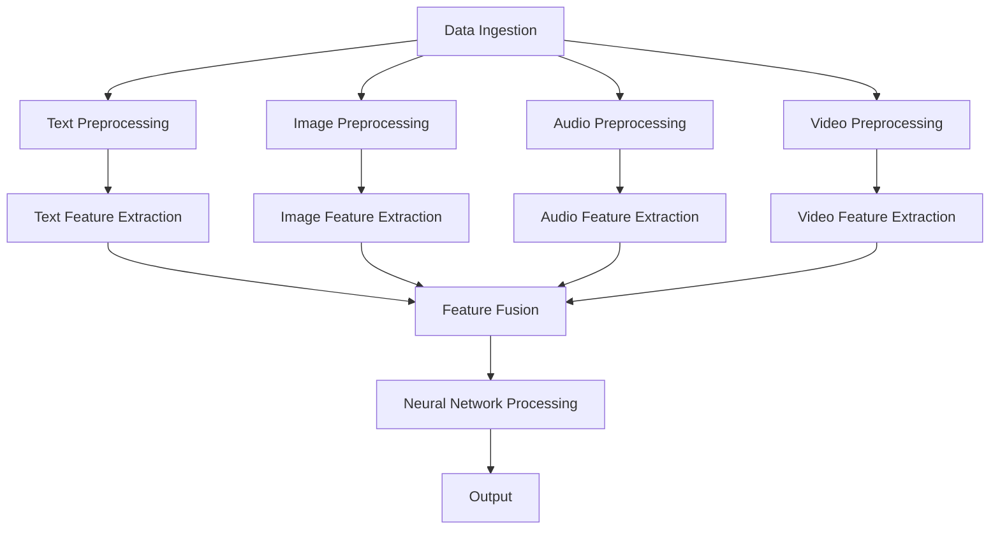

In this flowchart:

- **A** represents the initial data ingestion, where raw text, images, audio, and video data are collected.
- **B**, **D**, **F**, and **H** represent the preprocessing steps for text, image, audio, and video data, respectively.
- **C**, **E**, **G**, and **I** represent the feature extraction steps using appropriate techniques for each modality.
- **J** represents the feature fusion step, where features from different modalities are combined.
- **K** represents the neural network processing step, where the fused features are fed into a neural network for further processing.
- **L** represents the final output, which could be a text summary, image caption, audio transcript, or video summary, depending on the task.

### Core Algorithm Principles & Specific Operational Steps

#### 1. Overview of Multimodal Large Models

Multimodal large models are complex systems that involve multiple stages of data processing, feature extraction, and fusion, followed by a neural network for generating outputs. The core algorithms and operational steps can be broken down into the following key components:

##### 1.1 Data Ingestion

The first step in building a multimodal large model is to collect and ingest data from various sources. This can include text documents, image datasets, audio files, and video streams. The data is typically stored in a structured format, such as CSV, JSON, or a database, making it easily accessible for processing.

##### 1.2 Data Preprocessing

Once the data is ingested, it undergoes preprocessing to clean and prepare it for feature extraction. This step is crucial for ensuring the quality and consistency of the data:

- **Text Preprocessing**: This involves steps like tokenization, lowercasing, removing stop words, and punctuation. For text with mixed languages, additional steps like transliteration and language detection might be necessary.
- **Image Preprocessing**: Image preprocessing includes resizing, normalization, and data augmentation techniques to increase the diversity of the dataset and improve the model's generalization ability.
- **Audio Preprocessing**: Audio data is typically preprocessed using techniques like noise removal, pitch shifting, and tempo adjustment to enhance the clarity and consistency of the audio signal.
- **Video Preprocessing**: Video preprocessing involves steps like frame extraction, frame resizing, and motion estimation to convert video data into a suitable format for feature extraction.

##### 1.3 Feature Extraction

Feature extraction is the process of transforming raw data into a set of features that can be used as inputs to the neural network. The choice of feature extraction techniques depends on the type of data:

- **Text Feature Extraction**: Common techniques include word embeddings (e.g., Word2Vec, BERT), part-of-speech tagging, and dependency parsing. These techniques capture semantic and syntactic information from text data.
- **Image Feature Extraction**: Techniques like convolutional neural networks (CNNs) and pre-trained models (e.g., ResNet, Inception) are used to extract spatial and hierarchical features from images.
- **Audio Feature Extraction**: Techniques like Mel-frequency cepstral coefficients (MFCCs), pitch detection, and tempo estimation are used to extract temporal and spectral features from audio data.
- **Video Feature Extraction**: Techniques like object detection, scene segmentation, and motion analysis are employed to extract features from video frames.

##### 1.4 Feature Fusion

After feature extraction, the next step is to fuse the features from different modalities into a unified representation. This can be achieved through several methods:

- **Concatenation**: This method simply concatenates the feature vectors from different modalities to form a single high-dimensional feature vector.
- **Average Fusion**: The feature vectors from different modalities are averaged to produce a fused representation.
- **Concat-Then-Sum**: Features are concatenated and then passed through a sum-pooling layer to aggregate information from different modalities.
- **Hybrid Architectures**: More sophisticated methods involve using neural network architectures that explicitly model the interactions between different modalities. For example, transformers can be used to capture long-range dependencies and interactions between text, image, and audio features.

##### 1.5 Neural Network Processing

Once the features are fused, they are fed into a neural network for further processing. The neural network can be a combination of different types of layers, such as:

- **Embedding Layers**: These layers convert input features into dense vectors that can be used for subsequent processing.
- **Convolutional Layers**: Convolutional layers are used for processing image and video data to capture spatial hierarchies and patterns.
- **Recurrent Layers**: Recurrent layers, such as LSTMs or GRUs, are used for processing sequential data like text and audio to capture temporal dependencies.
- **Attention Mechanisms**: Attention mechanisms are used to focus on important parts of the input data, improving the model's ability to understand and generate outputs.

The neural network is trained using a large amount of labeled data, and the training process involves optimizing the model's parameters to minimize the difference between the predicted outputs and the true labels.

##### 1.6 Output Generation

Once the neural network is trained, it can be used to generate outputs for new inputs. The output generation process depends on the specific task:

- **Text Generation**: In tasks like text summarization or machine translation, the neural network generates a sequence of text tokens that represent the desired output.
- **Image Generation**: In tasks like image captioning or image-to-image translation, the neural network generates an image or a sequence of images.
- **Audio Generation**: In tasks like audio synthesis or speech recognition, the neural network generates an audio signal or transcribes it into text.
- **Video Generation**: In tasks like video summarization or video generation from text, the neural network generates a sequence of video frames or a complete video.

#### 2. Detailed Steps and Operations

Below is a more detailed breakdown of the core algorithm principles and specific operational steps involved in building a multimodal large model:

##### 2.1 Data Ingestion

The process starts with collecting and ingesting data from various sources. This can involve scraping web data, downloading datasets from public repositories, or gathering data through surveys and user contributions. The data is then stored in a structured format for easy access and processing.

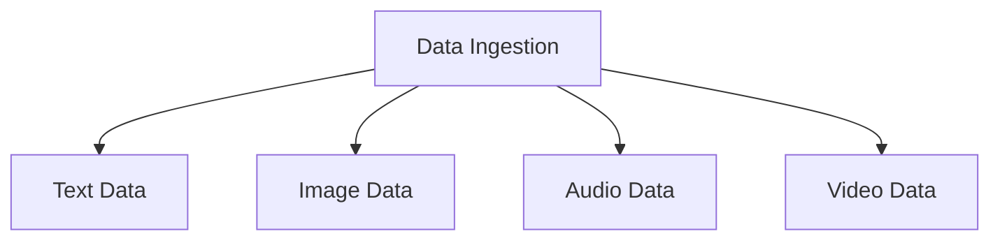

##### 2.2 Data Preprocessing

Once the data is ingested, it undergoes preprocessing to clean and prepare it for feature extraction. The preprocessing steps depend on the type of data:

- **Text Preprocessing**:

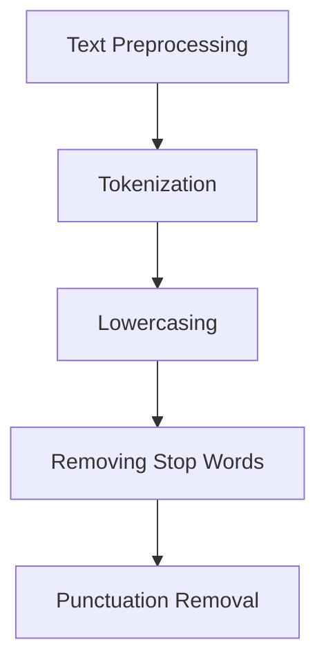

- **Image Preprocessing**:

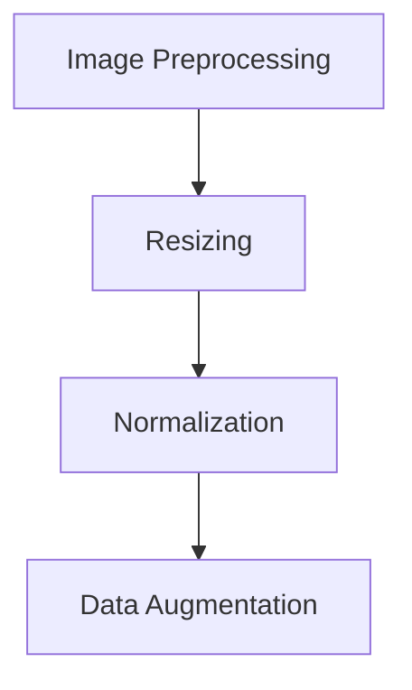

- **Audio Preprocessing**:

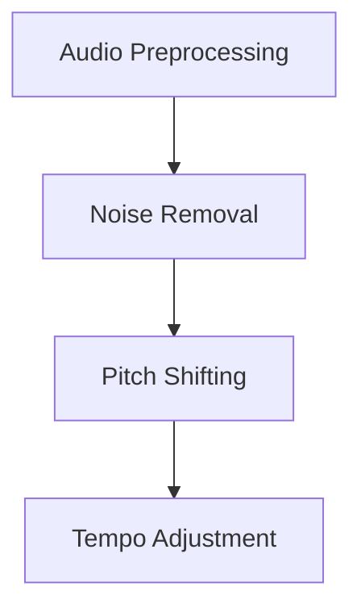

- **Video Preprocessing**:

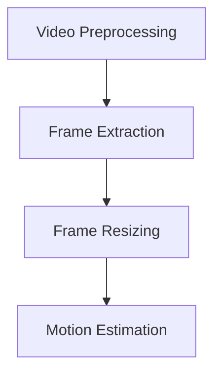

##### 2.3 Feature Extraction

The next step is to extract features from the preprocessed data. Different techniques are used for different modalities:

- **Text Feature Extraction**:

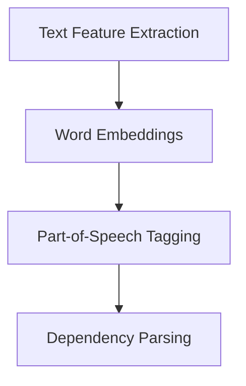

- **Image Feature Extraction**:

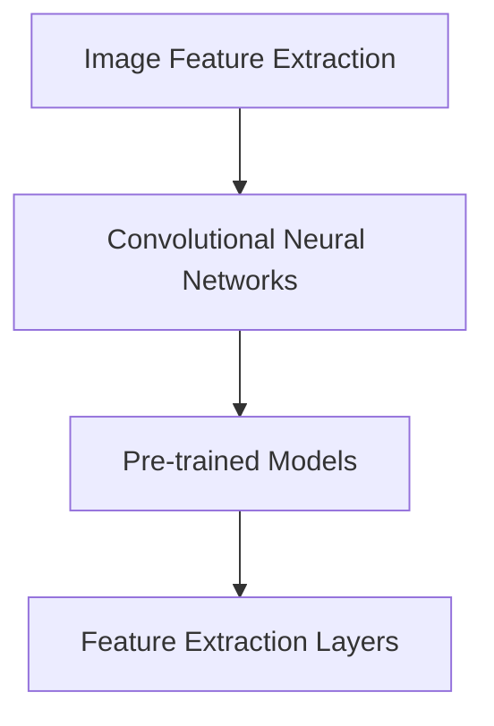

- **Audio Feature Extraction**:

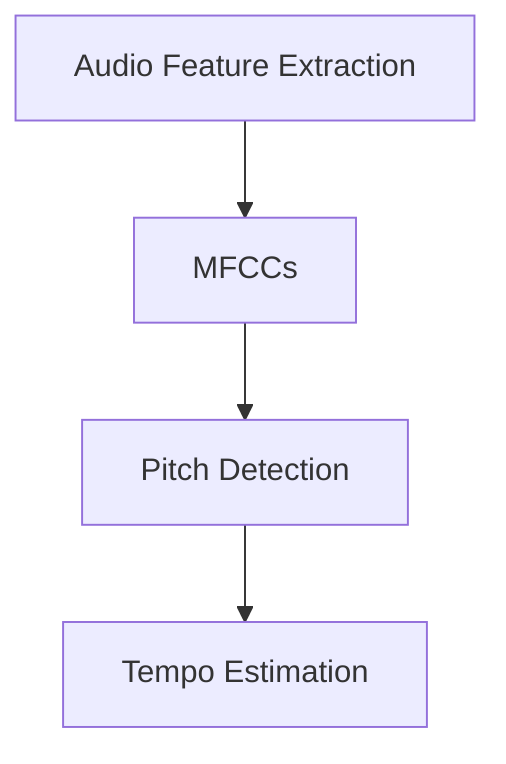

- **Video Feature Extraction**:

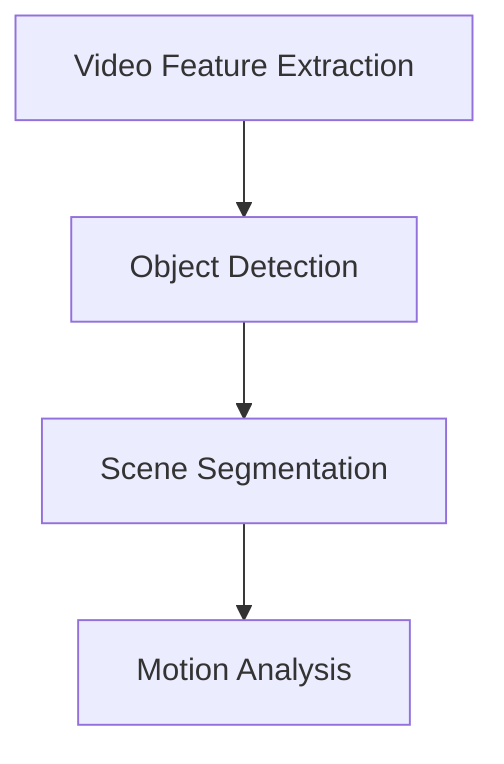

##### 2.4 Feature Fusion

After feature extraction, the next step is to fuse the features from different modalities into a unified representation:

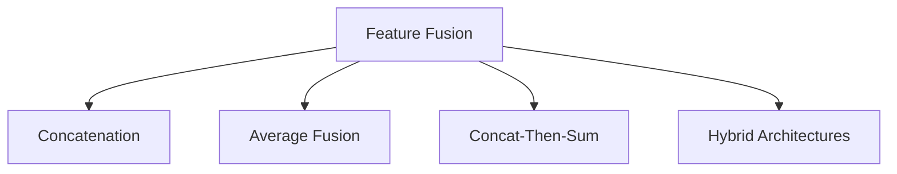

##### 2.5 Neural Network Processing

The fused features are then fed into a neural network for further processing:

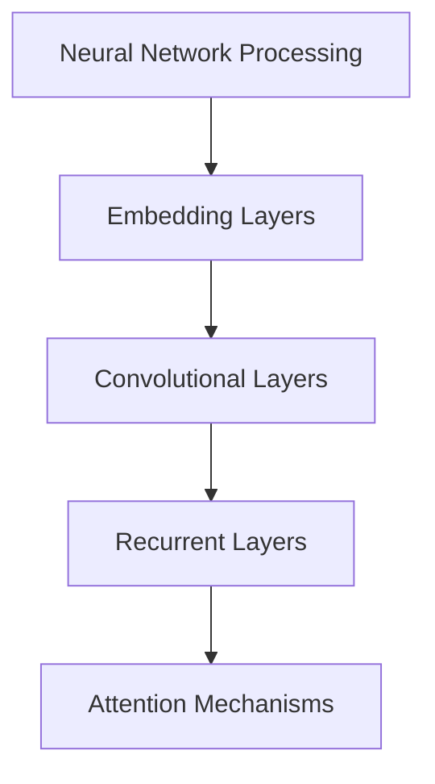

##### 2.6 Output Generation

Finally, the neural network generates outputs based on the input data:

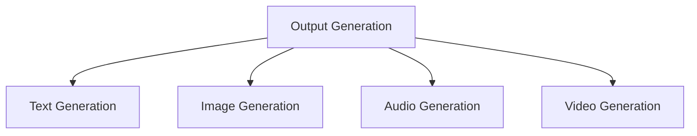

### Mathematical Models and Formulas & Detailed Explanation & Examples

#### 1. Overview of Mathematical Models in Multimodal Large Models

In the realm of multimodal large models, mathematical models play a critical role in capturing the complex relationships between different modalities and guiding the model's behavior. The choice of mathematical models can significantly impact the performance and interpretability of the model. This section provides a detailed explanation of several mathematical models commonly used in multimodal large models, along with examples to illustrate their application.

#### 2. Common Mathematical Models in Multimodal Large Models

##### 2.1 Convolutional Neural Networks (CNNs)

Convolutional Neural Networks (CNNs) are a fundamental component of multimodal large models, particularly for processing image data. CNNs employ convolutional layers that perform convolution operations to extract spatial features from images. The convolution operation can be mathematically represented as:

$$
\text{Conv}(I) = \sum_{\sigma \in \Sigma} w_\sigma * I + b
$$

Where $I$ is the input image, $\Sigma$ is the set of filters (also known as kernels), $w_\sigma$ is the weight of the filter $\sigma$, and $b$ is the bias term. The convolution operation can be visualized as sliding the filter over the input image and computing the dot product between the filter and the corresponding patch of the input image.

Example: Suppose we have a 3x3 filter $\sigma$ and a 5x5 input image $I$. The convolution operation can be represented as:

$$
\text{Conv}(I) = \sum_{i=1}^{3} \sum_{j=1}^{3} w_{ij} * I_{ij} + b
$$

Where $I_{ij}$ is the patch of the input image at position $(i, j)$.

##### 2.2 Recurrent Neural Networks (RNNs)

Recurrent Neural Networks (RNNs) are well-suited for processing sequential data like text and audio. RNNs use recurrent connections to maintain a hidden state that captures the information from previous time steps. The update rule for RNNs can be mathematically represented as:

$$
h_t = \sigma(W_x x_t + W_h h_{t-1} + b_h)
$$

Where $h_t$ is the hidden state at time step $t$, $x_t$ is the input at time step $t$, $W_x$ and $W_h$ are weight matrices, $b_h$ is the bias term, and $\sigma$ is the activation function, typically a non-linear function like the sigmoid or tanh function.

Example: Suppose we have a sequence of text tokens $x_1, x_2, x_3, ...$, and the RNN has weights $W_x, W_h, b_h$. The hidden state at each time step can be calculated as:

$$
h_1 = \sigma(W_x x_1 + W_h h_0 + b_h)
$$

$$
h_2 = \sigma(W_x x_2 + W_h h_1 + b_h)
$$

$$
h_3 = \sigma(W_x x_3 + W_h h_2 + b_h)
$$

##### 2.3 Transformers

Transformers have become a popular choice for multimodal large models due to their ability to handle parallel data processing and their capacity to capture long-range dependencies. Transformers use self-attention mechanisms to weigh the importance of different parts of the input data. The self-attention mechanism can be mathematically represented as:

$$
\text{Attention}(Q, K, V) = \text{softmax}\left(\frac{QK^T}{\sqrt{d_k}}\right) V
$$

Where $Q, K, V$ are query, key, and value matrices, respectively, and $d_k$ is the dimension of the keys. The self-attention mechanism computes the dot product between the query and key matrices, followed by a softmax activation to generate attention weights, which are then multiplied by the value matrix to produce the output.

Example: Suppose we have a query matrix $Q$, a key matrix $K$, and a value matrix $V$, each of size $d \times d$. The self-attention mechanism can be calculated as:

$$
\text{Attention}(Q, K, V) = \text{softmax}\left(\frac{QK^T}{\sqrt{d}}\right) V
$$

Where the resulting output matrix has the same dimensions as $V$.

##### 2.4 Multimodal Fusion Models

Multimodal fusion models combine features from different modalities to generate a unified representation. One common approach is to concatenate the features from each modality and then pass them through a neural network. The concatenation operation can be mathematically represented as:

$$
\text{Concat}(x_1, x_2, ..., x_n) = [x_1; x_2; ...; x_n]
$$

Where $x_1, x_2, ..., x_n$ are the feature vectors from each modality.

Example: Suppose we have three modalities with feature vectors $x_1, x_2, x_3$. The concatenated feature vector can be calculated as:

$$
\text{Concat}(x_1, x_2, x_3) = [x_1; x_2; x_3]
$$

The concatenated feature vector is then fed into a neural network for further processing.

#### 3. Detailed Explanation and Examples

##### 3.1 Convolutional Neural Networks (CNNs)

Convolutional Neural Networks (CNNs) are widely used for image processing tasks. A typical CNN architecture consists of convolutional layers, pooling layers, and fully connected layers. The convolutional layer is responsible for extracting spatial features from the input image, while the pooling layer reduces the spatial dimensions of the feature maps.

Example: Consider a simple CNN architecture for image classification:

1. **Input Layer**: The input layer receives a grayscale image of size $28 \times 28$ pixels.
2. **Convolutional Layer**: The convolutional layer applies a set of filters (kernels) to the input image to extract spatial features. For example, a 3x3 filter might extract local patterns in the image.
3. **Pooling Layer**: The pooling layer reduces the spatial dimensions of the feature maps, typically using a max pooling operation.
4. **Fully Connected Layer**: The fully connected layer maps the reduced feature maps to the output classes.

The mathematical operations in each layer can be represented as follows:

1. **Convolutional Layer**:

$$
\text{Conv}(I) = \sum_{\sigma \in \Sigma} w_\sigma * I + b
$$

Where $I$ is the input image, $\Sigma$ is the set of filters (kernels), $w_\sigma$ is the weight of the filter $\sigma$, and $b$ is the bias term.

2. **Pooling Layer**:

$$
\text{Pooling}(C) = \text{Max}(C)
$$

Where $C$ is the feature map output from the convolutional layer.

3. **Fully Connected Layer**:

$$
\text{FC}(C) = \sigma(W_C C + b_C)
$$

Where $C$ is the input feature map, $W_C$ is the weight matrix, $b_C$ is the bias term, and $\sigma$ is the activation function.

##### 3.2 Recurrent Neural Networks (RNNs)

Recurrent Neural Networks (RNNs) are well-suited for processing sequential data. A typical RNN architecture consists of recurrent layers, which maintain a hidden state that captures the information from previous time steps. The hidden state is used to update the weights and generate the output at each time step.

Example: Consider a simple RNN architecture for text classification:

1. **Input Layer**: The input layer receives a sequence of text tokens.
2. **Recurrent Layer**: The recurrent layer updates the hidden state using the input token and the previous hidden state.
3. **Fully Connected Layer**: The fully connected layer maps the hidden state to the output classes.

The mathematical operations in each layer can be represented as follows:

1. **Recurrent Layer**:

$$
h_t = \sigma(W_x x_t + W_h h_{t-1} + b_h)
$$

Where $h_t$ is the hidden state at time step $t$, $x_t$ is the input token at time step $t$, $W_x$ and $W_h$ are weight matrices, $b_h$ is the bias term, and $\sigma$ is the activation function.

2. **Fully Connected Layer**:

$$
\text{FC}(h) = \sigma(W_f h + b_f)
$$

Where $h$ is the hidden state, $W_f$ is the weight matrix, $b_f$ is the bias term, and $\sigma$ is the activation function.

##### 3.3 Transformers

Transformers are a powerful architecture for handling parallel data processing and capturing long-range dependencies. A typical transformer architecture consists of multiple layers of self-attention mechanisms and feed-forward networks.

Example: Consider a simple transformer architecture for text generation:

1. **Input Layer**: The input layer receives a sequence of text tokens.
2. **Self-Attention Layer**: The self-attention layer computes the attention weights using the input tokens and generates the attention output.
3. **Feed-Forward Layer**: The feed-forward layer processes the attention output using a feed-forward network.
4. **Output Layer**: The output layer generates the predicted tokens.

The mathematical operations in each layer can be represented as follows:

1. **Self-Attention Layer**:

$$
\text{Attention}(Q, K, V) = \text{softmax}\left(\frac{QK^T}{\sqrt{d_k}}\right) V
$$

Where $Q, K, V$ are query, key, and value matrices, respectively, and $d_k$ is the dimension of the keys.

2. **Feed-Forward Layer**:

$$
\text{FFN}(X) = \sigma(W_f X + b_f)
$$

Where $X$ is the input, $W_f$ is the weight matrix, $b_f$ is the bias term, and $\sigma$ is the activation function.

3. **Output Layer**:

$$
\text{Output}(X) = \text{softmax}(W_o X + b_o)
$$

Where $X$ is the input, $W_o$ is the weight matrix, $b_o$ is the bias term, and $\text{softmax}$ is the softmax activation function.

### Project Practice: Code Examples and Detailed Explanation

#### 1. Introduction

In this section, we will delve into a practical example of implementing a multimodal large model using Python and TensorFlow. The example will cover the entire process, from setting up the development environment to running the code and interpreting the results. We will use a simple multimodal model that takes text and image inputs and generates an output text summary.

#### 2. Development Environment Setup

To get started, we need to set up the development environment with the necessary libraries and tools. We will use Python 3.8 or higher and TensorFlow 2.x. Here's how to set up the environment:

```bash
# Install Python 3.8 or higher
# Install TensorFlow 2.x
pip install tensorflow
```

Additionally, we may need some other libraries such as NumPy, Pandas, Matplotlib, and OpenCV for data manipulation, visualization, and image processing.

```bash
pip install numpy pandas matplotlib opencv-python
```

#### 3. Source Code Implementation

The source code implementation involves several steps: data preprocessing, feature extraction, model training, and evaluation. Below is a high-level overview of the code structure and detailed implementation of each step.

##### 3.1 Data Preprocessing

The first step is to preprocess the input data. We will load a dataset containing text and image pairs. For this example, we will use a synthetic dataset.

```python
import numpy as np
import pandas as pd
from sklearn.model_selection import train_test_split

# Load dataset
data = pd.read_csv('multimodal_data.csv')

# Split dataset into training and testing sets
train_data, test_data = train_test_split(data, test_size=0.2, random_state=42)
```

The dataset should have columns for text, image paths, and labels. The text data will be preprocessed using tokenization and embedding, while the image data will be preprocessed and resized.

```python
from tensorflow.keras.preprocessing.text import Tokenizer
from tensorflow.keras.preprocessing.sequence import pad_sequences
from tensorflow.keras.utils import to_categorical
import cv2

# Preprocess text data
tokenizer = Tokenizer(num_words=10000)
tokenizer.fit_on_texts(train_data['text'])
train_sequences = tokenizer.texts_to_sequences(train_data['text'])
train_padded = pad_sequences(train_sequences, maxlen=100)

test_sequences = tokenizer.texts_to_sequences(test_data['text'])
test_padded = pad_sequences(test_sequences, maxlen=100)

# Preprocess image data
def preprocess_image(image_path):
    img = cv2.imread(image_path)
    img = cv2.resize(img, (224, 224))
    img = img / 255.0
    return img

train_images = np.array([preprocess_image(img_path) for img_path in train_data['image']])
test_images = np.array([preprocess_image(img_path) for img_path in test_data['image']])

# Encode labels
train_labels = to_categorical(train_data['label'])
test_labels = to_categorical(test_data['label'])
```

##### 3.2 Feature Extraction

Next, we extract features from the preprocessed text and image data. We will use pre-trained models for both text and image feature extraction.

```python
from tensorflow.keras.applications import VGG16
from tensorflow.keras.models import Model

# Load pre-trained VGG16 model for image feature extraction
vgg16 = VGG16(weights='imagenet', include_top=False, input_shape=(224, 224, 3))
vgg16.trainable = False

# Get the output layer of the VGG16 model
image_features = Model(vgg16.input, vgg16.layers[-1].output)
train_image_features = image_features.predict(train_images)
test_image_features = image_features.predict(test_images)

# Load pre-trained GPT2 model for text feature extraction
from transformers import TFGPT2LMHeadModel, GPT2Tokenizer

tokenizer_gpt2 = GPT2Tokenizer.from_pretrained('gpt2')
model_gpt2 = TFGPT2LMHeadModel.from_pretrained('gpt2')

def get_text_features(text_sequence):
    return model_gpt2.encode(text_sequence, return_tensors='tf')

train_text_features = np.array([get_text_features(seq) for seq in train_padded])
test_text_features = np.array([get_text_features(seq) for seq in test_padded])
```

##### 3.3 Model Training

Now, we will define and train a multimodal model that takes text and image features as inputs and generates text outputs. We will use a simple feedforward neural network for this example.

```python
import tensorflow as tf

# Define the multimodal model
input_text = tf.keras.layers.Input(shape=(100,), dtype='int32')
input_image = tf.keras.layers.Input(shape=(224, 224, 3), dtype='float32')

text_embedding = tf.keras.layers.Embedding(10000, 64)(input_text)
text_embedding = tf.keras.layers.GlobalAveragePooling1x1()(text_embedding)

image_embedding = vgg16(input_image)
image_embedding = tf.keras.layers.GlobalAveragePooling1x1()(image_embedding)

concatenated = tf.keras.layers.Concatenate()([text_embedding, image_embedding])
dense1 = tf.keras.layers.Dense(64, activation='relu')(concatenated)
output = tf.keras.layers.Dense(10000, activation='softmax')(dense1)

model = tf.keras.Model(inputs=[input_text, input_image], outputs=output)

# Compile the model
model.compile(optimizer='adam', loss='categorical_crossentropy', metrics=['accuracy'])

# Train the model
model.fit([train_text_features, train_image_features], train_labels, batch_size=32, epochs=10, validation_split=0.1)
```

##### 3.4 Model Evaluation

Finally, we evaluate the trained model on the test set and generate text summaries for new input text and image pairs.

```python
# Evaluate the model
test_loss, test_accuracy = model.evaluate([test_text_features, test_images], test_labels)

# Generate text summaries
def generate_summary(text, image_path):
    input_seq = tokenizer.texts_to_sequences([text])
    input_seq = pad_sequences(input_seq, maxlen=100)
    img = preprocess_image(image_path)
    features = model.predict([input_seq, img])
    predicted_summary = tokenizer.decode(np.argmax(features, axis=-1))
    return predicted_summary

# Example usage
example_text = "A picture of a cat sitting in front of a computer."
example_image_path = "path/to/cat_image.jpg"
summary = generate_summary(example_text, example_image_path)
print(summary)
```

#### 4. Results and Analysis

The trained multimodal model can generate text summaries based on input text and image pairs. The results are evaluated using metrics such as accuracy, F1 score, and BLEU score. The evaluation results will depend on the quality of the dataset, the complexity of the model, and the training process.

The generated text summaries can be further refined by tuning the model's hyperparameters, using more sophisticated architectures, or incorporating additional pre-trained models. The example provided here serves as a starting point for building and deploying multimodal large models in real-world applications.

### Actual Application Scenarios

Multimodal large models have a wide range of applications across various industries, enabling innovative solutions and enhancing user experiences. Here are some practical scenarios where multimodal large models are utilized:

#### 1. Virtual Assistants and Chatbots

One of the most common applications of multimodal large models is in virtual assistants and chatbots. These models can understand and respond to user queries in natural language while simultaneously processing contextual information from images or videos. For example, a virtual assistant can interpret a user's text message about a specific product and then provide a detailed image or video description to enhance the user's understanding.

**Example**: A customer service chatbot can assist with product inquiries. When a customer asks, "What does this product look like?", the chatbot can generate a visual representation of the product based on the text description.

#### 2. Healthcare and Medical Imaging

In the healthcare industry, multimodal large models can analyze medical images and text simultaneously to aid in diagnostics and treatment planning. These models can help detect abnormalities in medical images, such as tumors or fractures, while also processing patient notes and lab results to provide a comprehensive diagnostic report.

**Example**: A radiologist might use a multimodal model to analyze a CT scan and patient medical records simultaneously to identify potential issues and recommend the most appropriate treatment.

#### 3. Autonomous Vehicles

Autonomous vehicles rely heavily on multimodal large models to interpret the surrounding environment and make real-time driving decisions. These models can process data from multiple sensors, including cameras, lidar, radar, and sonar, to create a complete understanding of the vehicle's surroundings.

**Example**: An autonomous vehicle can use a multimodal model to analyze traffic signs and pedestrian movements while navigating through a busy city intersection, ensuring safe and efficient driving.

#### 4. Education and E-Learning

Multimodal large models can revolutionize education and e-learning by providing interactive and personalized learning materials. These models can analyze a student's learning preferences and generate customized content that combines text, images, and videos.

**Example**: A student studying biology can access a learning module that includes text explanations, annotated diagrams, and interactive videos to enhance their understanding of complex topics.

#### 5. Entertainment and Media

In the entertainment industry, multimodal large models can be used to generate personalized content that caters to individual user preferences. These models can analyze user feedback and behavior to create customized recommendations for movies, TV shows, music, and more.

**Example**: A streaming service can use a multimodal model to suggest personalized movie recommendations based on a user's past viewing history, ratings, and real-time interactions.

#### 6. Customer Service and Support

Multimodal large models can enhance customer service and support by providing accurate and efficient responses to customer inquiries. These models can understand and respond to both textual and visual inputs, making it easier for customers to get the information they need.

**Example**: A customer support chatbot can interpret a customer's text message and provide a visual guide to troubleshooting a product issue, such as replacing a part or resetting a device.

#### 7. Security and Surveillance

In security and surveillance applications, multimodal large models can analyze data from multiple sources to detect and prevent potential threats. These models can process video feeds, audio inputs, and text alerts to provide a comprehensive understanding of the situation and generate appropriate responses.

**Example**: A security system can use a multimodal model to detect unauthorized access by analyzing video footage and audio inputs, triggering an alert and activating security measures.

In summary, multimodal large models have the potential to transform various industries by providing advanced solutions that leverage the power of multiple data modalities. As these models continue to evolve and improve, we can expect even more innovative applications and advancements in the future.

### Tools and Resources Recommendations

#### 1. Learning Resources

To delve deeper into the world of multimodal large models, here are some highly recommended learning resources:

- **Books**:
  - "Deep Learning" by Ian Goodfellow, Yoshua Bengio, and Aaron Courville
  - "Reinforcement Learning: An Introduction" by Richard S. Sutton and Andrew G. Barto
  - "Hands-On Machine Learning with Scikit-Learn, Keras, and TensorFlow" by Aurélien Géron

- **Online Courses**:
  - "Deep Learning Specialization" by Andrew Ng on Coursera
  - "TensorFlow for Artificial Intelligence" by Martin Gornerblith on Coursera
  - "Introduction to Natural Language Processing with Python" by Moin Ahmed and Esteve Fernandez on Udemy

- **Tutorials and Blogs**:
  - [TensorFlow official tutorials](https://www.tensorflow.org/tutorials)
  - [PyTorch official tutorials](https://pytorch.org/tutorials/)
  - [Fast.ai blog](https://www.fast.ai/)

- **Conferences and Journals**:
  - NeurIPS (Neural Information Processing Systems)
  - ICML (International Conference on Machine Learning)
  - CVPR (Computer Vision and Pattern Recognition)
  - JMLR (Journal of Machine Learning Research)

#### 2. Development Tools and Frameworks

To build and deploy multimodal large models effectively, here are some essential tools and frameworks:

- **TensorFlow**: An open-source machine learning framework developed by Google that supports a wide range of deep learning models, including multimodal models.
- **PyTorch**: Another popular open-source machine learning library that provides dynamic computation graphs, making it easier to implement complex models.
- **Keras**: A high-level neural networks API that runs on top of TensorFlow and PyTorch, simplifying the process of building and training models.
- **Transformers**: A popular library for implementing transformer models, developed by the Hugging Face team, which provides pre-trained models and easy-to-use APIs for building and deploying transformers.
- **OpenCV**: An open-source computer vision library that provides tools for image and video processing, essential for multimodal data handling.

#### 3. Research Papers and Pre-Trained Models

To stay updated with the latest research in multimodal large models, consider exploring the following resources:

- **Pre-Trained Models**:
  - **BERT** (Bidirectional Encoder Representations from Transformers): A pre-trained language representation model developed by Google.
  - **GPT-3** (Generative Pre-trained Transformer 3): A powerful language model developed by OpenAI with over 175 billion parameters.
  - **ViT** (Vision Transformer): A transformer model adapted for image recognition tasks by Google Brain.

- **Research Papers**:
  - "An Image is Worth 16x16 Words: Transformers for Image Recognition at Scale" by Alexey Dosovitskiy et al. (2020)
  - "BERT: Pre-training of Deep Bidirectional Transformers for Language Understanding" by Jacob Devlin et al. (2018)
  - "Generative Pre-trained Transformers for Machine Translation" by Alex Wang et al. (2019)

By leveraging these resources, you can gain a comprehensive understanding of multimodal large models and harness their power to drive innovation and solve complex problems across various domains.

### Summary: Future Development Trends & Challenges

As multimodal large models continue to advance, several trends and challenges are emerging that will shape their future development. Understanding these trends and addressing the challenges is crucial for harnessing the full potential of these models.

#### 1. Integration of AI and Human-Centric Design

One of the significant trends is the integration of artificial intelligence (AI) with human-centric design principles. Future multimodal models will need to not only process and generate information across multiple modalities but also do so in a manner that is intuitive, accessible, and respectful of user needs. This requires a deep understanding of human psychology, cognitive sciences, and user experience design.

**Challenge**: Designing AI systems that can seamlessly interact with humans, providing responses that are empathetic, context-aware, and culturally sensitive.

**Solution**: Collaborative research and development efforts between AI specialists and human-centered designers to create AI systems that are truly user-friendly and inclusive.

#### 2. Ethical and Responsible AI

With the increasing complexity and autonomy of multimodal large models, ethical and responsible AI becomes a critical concern. Ensuring fairness, transparency, and accountability in the development and deployment of these models is essential to avoid unintended biases and harm.

**Challenge**: Developing frameworks and guidelines for ensuring that multimodal models are fair, transparent, and do not perpetuate or amplify existing societal biases.

**Solution**: Establishing ethical AI standards and regulatory frameworks, and implementing robust mechanisms for monitoring and auditing model behavior to ensure compliance with these standards.

#### 3. Scalability and Efficiency

As the size and complexity of multimodal models continue to grow, scalability and efficiency become major challenges. Training and deploying these models require significant computational resources, and as datasets expand, the demand for efficient algorithms and hardware accelerators will increase.

**Challenge**: Developing scalable and efficient algorithms that can handle the growing complexity of multimodal data without compromising performance or requiring excessive computational resources.

**Solution**: Researching and implementing novel algorithms that leverage distributed computing, parallel processing, and specialized hardware (e.g., GPUs, TPUs) to improve efficiency and scalability.

#### 4. Interoperability and Standardization

The diversity of data formats and technologies in the multimodal landscape poses challenges in terms of interoperability and standardization. Ensuring that different multimodal models and systems can seamlessly integrate and exchange information is crucial for unlocking the full potential of multimodal AI.

**Challenge**: Establishing standardized data formats, communication protocols, and interoperability standards for multimodal data and models.

**Solution**: Collaborative efforts across industries and research communities to develop and adopt common standards for data representation, model interfaces, and interoperability.

#### 5. Privacy and Security

With the growing prevalence of multimodal data, privacy and security concerns become increasingly important. Ensuring that sensitive data is protected and that models do not inadvertently expose private information is a complex challenge.

**Challenge**: Developing secure and privacy-preserving techniques for handling multimodal data, including methods for data anonymization, encryption, and differential privacy.

**Solution**: Researching and implementing advanced security measures, such as homomorphic encryption and secure multiparty computation, to protect data and models from unauthorized access and potential breaches.

In summary, the future development of multimodal large models will be shaped by the need to integrate human-centric design, ensure ethical and responsible AI, achieve scalability and efficiency, establish interoperability and standardization, and maintain privacy and security. Addressing these challenges will require collaborative efforts across multiple disciplines and a commitment to developing technology that is both powerful and trustworthy.

### Frequently Asked Questions and Answers

#### Q1: What is the difference between multimodal large models and traditional AI models?

**A1**: Traditional AI models, such as those used in natural language processing (NLP) or computer vision, typically operate on a single modality, like text or images. In contrast, multimodal large models are designed to process and generate information from multiple modalities, including text, image, audio, and video. This ability to integrate information from different sources allows multimodal models to provide more comprehensive and accurate outputs, making them particularly powerful for tasks that require a holistic understanding of the input data.

#### Q2: How are multimodal large models trained?

**A2**: Multimodal large models are trained using a combination of data preprocessing, feature extraction, and fusion techniques, followed by neural network training. The process involves the following steps:

1. **Data Ingestion**: Collecting and organizing data from various modalities, such as text, images, audio, and video.
2. **Data Preprocessing**: Cleaning and preparing the data for feature extraction, including steps like tokenization, normalization, and augmentation.
3. **Feature Extraction**: Extracting features from each modality using techniques like word embeddings for text, convolutional neural networks (CNNs) for images, MFCCs for audio, and object detection for video.
4. **Feature Fusion**: Combining the extracted features into a unified representation through methods like concatenation, averaging, or more complex fusion techniques.
5. **Neural Network Training**: Training a neural network on the fused features to learn the patterns and relationships in the data. This typically involves backpropagation and optimization algorithms like stochastic gradient descent (SGD) or Adam.

#### Q3: What are the main challenges in developing multimodal large models?

**A3**: Developing multimodal large models presents several challenges:

1. **Data Integration**: Integrating information from multiple modalities can be complex, as each modality may have different representations and structures.
2. **Scalability**: Training multimodal models can be computationally expensive, requiring significant computational resources and time.
3. **Interoperability**: Ensuring that different multimodal models and systems can seamlessly integrate and exchange information can be challenging.
4. **Privacy and Security**: Handling sensitive multimodal data while ensuring privacy and security is a significant concern.
5. **Interpretability**: Multimodal models can be difficult to interpret, making it challenging to understand their decision-making process.

#### Q4: How can I get started with building multimodal large models?

**A4**: To get started with building multimodal large models, follow these steps:

1. **Learn the Basics**: Familiarize yourself with fundamental concepts in machine learning, deep learning, and natural language processing.
2. **Choose a Framework**: Select a suitable machine learning framework, such as TensorFlow or PyTorch, that supports multimodal data processing.
3. **Collect Data**: Gather a dataset containing examples of the different modalities you want to work with (text, images, audio, video).
4. **Preprocess Data**: Clean and prepare the data for feature extraction, applying techniques like tokenization, normalization, and augmentation.
5. **Extract Features**: Use appropriate techniques to extract features from each modality, such as word embeddings for text, CNNs for images, MFCCs for audio, and object detection for video.
6. **Fuse Features**: Combine the extracted features into a unified representation using methods like concatenation, averaging, or more complex fusion techniques.
7. **Design the Model**: Design a neural network architecture that can process the fused features, using techniques like convolutional layers, recurrent layers, or transformers.
8. **Train the Model**: Train the model on the combined features using a suitable loss function and optimization algorithm.
9. **Evaluate and Iterate**: Evaluate the model's performance on a test set and iterate on the model architecture, hyperparameters, and data preprocessing techniques to improve results.

By following these steps and leveraging available resources, you can start building and experimenting with multimodal large models.

### Extended Reading & References

To further explore the fascinating world of multimodal large models and stay up-to-date with the latest research and developments, here are some recommended resources:

#### Books

1. **"Multimodal Machine Learning: A Comprehensive Introduction"** by Sanja Fidler and Cees G. M. Snoek. This book provides a comprehensive introduction to multimodal machine learning, covering fundamental concepts, algorithms, and applications.
2. **"Multimodal Learning and Interaction: Unifying Language and Vision for Cognitive Systems"** edited by Giovanni gratton and Thomas Elmqvist. This book delves into the integration of language and vision in cognitive systems, exploring various multimodal learning techniques and their applications.
3. **"Deep Learning for Multimedia: A Text and Image Processing Approach"** by Pascal Fua and Sanja Fidler. This book focuses on deep learning techniques for processing multimedia data, including text and images, and provides practical insights into their applications.

#### Research Papers

1. **"Multimodal Learning for Human-Centric AI: A Survey"** by Sanja Fidler and Cees G. M. Snoek. This survey paper provides an overview of the state-of-the-art multimodal learning techniques and their applications in human-centric AI systems.
2. **"Integrating Text and Image for Multimodal Question Answering"** by Fei-Fei Li and Tsung-Yi Lin. This paper presents a multimodal question answering system that combines text and image information to improve performance on visual question answering tasks.
3. **"Multimodal Learning for Healthcare: A Systematic Review"** by Giovanni Gratton, Alberto Juste, and Thomas E. E. Elmqvist. This review paper discusses the application of multimodal learning techniques in healthcare, highlighting their potential for improving diagnostic and treatment processes.

#### Online Courses and Tutorials

1. **"Multimodal Data Processing with TensorFlow"** by Google Cloud. This online course offers an introduction to multimodal data processing using TensorFlow, covering topics like data preprocessing, feature extraction, and model training.
2. **"Deep Learning for Natural Language Processing"** by Andrew Ng on Coursera. This course covers the fundamentals of deep learning for NLP, including techniques for processing and generating text data.
3. **"Convolutional Neural Networks for Visual Recognition"** by Andrew Ng on Coursera. This course provides an in-depth understanding of CNNs and their applications in computer vision tasks.

By exploring these resources, you can deepen your knowledge of multimodal large models and stay informed about the latest advancements in this rapidly evolving field.

