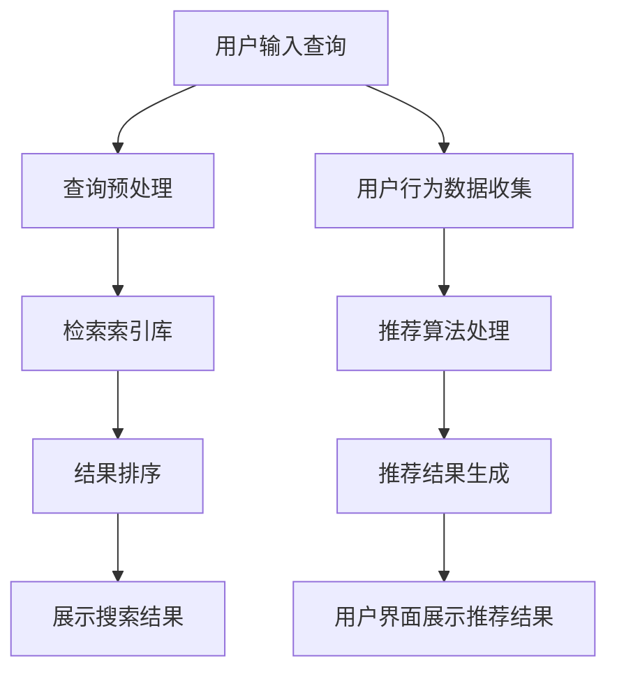

                 

# 大数据驱动的电商平台转型：搜索推荐系统是核心，AI 模型融合技术是关键

## 关键词
大数据、电商平台、搜索推荐系统、AI 模型融合技术、转型、用户体验、商业成功

## 摘要
随着大数据时代的到来，电商平台面临着前所未有的机遇与挑战。本文将探讨大数据在电商平台转型中的核心作用，特别是搜索推荐系统的构建与AI模型融合技术的应用，以及这些技术如何提升用户体验，助力电商平台实现商业成功。

## 1. 背景介绍

### 1.1 电商平台的发展历程
电商平台的发展经历了从最初的电子商务（E-commerce）到现在的智能电商（Smart E-commerce）的转变。早期的电商平台主要依赖于传统的数据库技术和简单的搜索算法，用户购买体验有限。随着互联网技术的发展，特别是大数据和人工智能的兴起，电商平台开始利用更先进的技术来提升用户体验和销售效率。

### 1.2 大数据的崛起
大数据（Big Data）指的是海量、高增长率和多样化的数据。这些数据来源于用户行为、社交网络、物联网等各种渠道。大数据的崛起使得电商平台能够更好地理解用户需求，从而提供更个性化的服务和产品推荐。

### 1.3 搜索推荐系统的需求
随着电商平台上的商品数量急剧增加，传统的搜索算法已无法满足用户对高效、精准搜索的需求。此时，搜索推荐系统（Search and Recommendation System）应运而生，它通过分析和理解用户行为，为用户提供个性化的搜索结果和产品推荐，极大地提升了用户体验。

## 2. 核心概念与联系

### 2.1 搜索推荐系统的基本概念
搜索推荐系统主要包括搜索（Search）和推荐（Recommendation）两个核心模块。搜索模块负责处理用户输入的查询，返回最相关的结果；推荐模块则基于用户的历史行为和偏好，预测用户可能感兴趣的商品，并推荐给用户。

### 2.2 AI 模型融合技术的重要性
AI 模型融合技术（AI Model Fusion Technology）是将多种机器学习模型结合起来，以提升预测准确性和系统性能。在搜索推荐系统中，AI 模型融合技术可以通过结合不同的特征和模型，提供更精准的用户画像和推荐结果。

### 2.3 Mermaid 流程图
以下是一个简单的 Mermaid 流程图，展示了搜索推荐系统的主要流程：



## 3. 核心算法原理 & 具体操作步骤

### 3.1 搜索算法原理
搜索算法主要包括基于关键词的搜索和基于内容的搜索。基于关键词的搜索主要使用的是倒排索引技术，将关键词与文档建立索引，快速定位相关文档。基于内容的搜索则通过文本分析技术，理解文档的内容，从而返回与查询内容高度相关的结果。

### 3.2 推荐算法原理
推荐算法主要分为基于协同过滤（Collaborative Filtering）和基于内容的推荐（Content-Based Filtering）。基于协同过滤的推荐通过分析用户的行为和偏好，找到相似的用户和商品，进行推荐。基于内容的推荐则通过分析商品的内容特征，匹配用户的兴趣和需求，进行推荐。

### 3.3 具体操作步骤
以下是搜索推荐系统的具体操作步骤：

1. **用户输入查询**：用户在搜索框中输入查询。
2. **查询预处理**：对用户输入的查询进行分词、停用词过滤、词干提取等处理。
3. **检索索引库**：使用倒排索引技术，快速检索与查询相关的文档。
4. **结果排序**：根据文档的相关性、用户偏好等因素，对检索结果进行排序。
5. **展示搜索结果**：将排序后的结果展示给用户。
6. **用户行为数据收集**：收集用户在搜索和推荐过程中的行为数据。
7. **推荐算法处理**：使用协同过滤或基于内容的推荐算法，生成推荐结果。
8. **推荐结果生成**：将推荐结果展示给用户。

## 4. 数学模型和公式 & 详细讲解 & 举例说明

### 4.1 协同过滤算法
协同过滤算法主要分为基于用户的协同过滤（User-Based Collaborative Filtering）和基于物品的协同过滤（Item-Based Collaborative Filtering）。以下是一个简单的基于用户的协同过滤算法公式：

$$
\text{推荐评分} = \frac{\sum_{i \in \text{物品集}} \text{用户历史评分} \cdot \text{相似度权重}}{\sum_{j \in \text{用户集}} \text{相似度权重}}
$$

**举例说明**：
假设用户A对物品集 {1, 2, 3, 4, 5} 进行了评分，评分分别为 {5, 4, 3, 2, 1}。用户B对同一物品集的评分分别为 {1, 2, 3, 4, 5}。根据用户A和用户B的历史评分，可以计算出用户A对用户B的相似度权重。然后，根据相似度权重，计算出用户A对物品集 {1, 2, 3, 4, 5} 的推荐评分。

### 4.2 基于内容的推荐算法
基于内容的推荐算法主要基于物品的特征信息，为用户推荐具有相似特征的物品。以下是一个简单的基于内容的推荐算法公式：

$$
\text{推荐评分} = \frac{\sum_{i \in \text{物品集}} \text{物品特征相似度} \cdot \text{用户历史评分}}{\sum_{j \in \text{用户集}} \text{物品特征相似度}}
$$

**举例说明**：
假设用户A对物品集 {1, 2, 3, 4, 5} 进行了评分，评分分别为 {5, 4, 3, 2, 1}。物品1的特征为 {红色，中型，男性},用户A的兴趣特征为 {红色，中型}。根据物品1的特征和用户A的兴趣特征，可以计算出物品1对用户A的相似度。然后，根据相似度，计算出用户A对物品集 {1, 2, 3, 4, 5} 的推荐评分。

## 5. 项目实践：代码实例和详细解释说明

### 5.1 开发环境搭建
在进行搜索推荐系统的项目实践前，需要搭建相应的开发环境。本文使用的开发环境为 Python 3.8，并依赖以下库：scikit-learn、numpy、pandas。

```python
# 安装所需库
!pip install scikit-learn numpy pandas
```

### 5.2 源代码详细实现
以下是一个简单的搜索推荐系统的代码实例：

```python
import numpy as np
import pandas as pd
from sklearn.metrics.pairwise import cosine_similarity

# 用户历史评分数据
user_ratings = pd.DataFrame({
    'user_id': [1, 1, 1, 2, 2, 3, 3],
    'item_id': [1, 2, 3, 1, 2, 1, 3],
    'rating': [5, 4, 3, 1, 2, 5, 3]
})

# 物品特征数据
item_features = pd.DataFrame({
    'item_id': [1, 2, 3],
    'feature_1': [1, 0, 1],
    'feature_2': [0, 1, 0],
    'feature_3': [1, 1, 1]
})

# 计算用户相似度矩阵
user_similarity = cosine_similarity(user_ratings.groupby('user_id')['rating'].apply(list).values)

# 计算物品相似度矩阵
item_similarity = cosine_similarity(item_features.values)

# 基于用户的协同过滤推荐
def user_based_recommendation(user_id, user_similarity, user_ratings, k=5):
    # 找到与当前用户最相似的 k 个用户
    similar_users = user_similarity[user_id].argsort()[-k:]
    
    # 计算推荐评分
    recommendation_scores = np.sum(user_similarity[user_id][similar_users] * user_ratings['rating'][similar_users], axis=0)
    
    # 返回推荐结果
    return user_ratings['item_id'][similar_users], recommendation_scores

# 基于内容的推荐
def content_based_recommendation(user_id, item_similarity, item_features, user_interests, k=5):
    # 计算物品相似度
    item_similarity_scores = np.dot(item_similarity, user_interests)
    
    # 找到与用户兴趣最相似的 k 个物品
    similar_items = item_similarity_scores.argsort()[-k:]
    
    # 返回推荐结果
    return item_features['item_id'][similar_items], item_similarity_scores[similar_items]

# 测试用户推荐
user_id = 1
user_interests = np.array([1, 1, 0])  # 用户兴趣特征

# 基于用户推荐的测试
user_rec_items, user_rec_scores = user_based_recommendation(user_id, user_similarity, user_ratings, k=3)
print("基于用户推荐的结果：")
print(user_rec_items)

# 基于内容推荐的测试
item_rec_items, item_rec_scores = content_based_recommendation(user_id, item_similarity, item_features, user_interests, k=3)
print("基于内容推荐的结果：")
print(item_rec_items)
```

### 5.3 代码解读与分析
代码首先创建了用户历史评分数据和物品特征数据。然后，计算了用户相似度矩阵和物品相似度矩阵。基于用户的协同过滤推荐函数 `user_based_recommendation` 通过找到与当前用户最相似的 k 个用户，计算推荐评分。基于内容的推荐函数 `content_based_recommendation` 通过计算物品相似度，找到与用户兴趣最相似的 k 个物品。

### 5.4 运行结果展示
在测试用户推荐时，代码输出了基于用户推荐和基于内容推荐的结果。这些结果展示了如何根据用户历史评分和物品特征，为用户生成个性化的推荐。

## 6. 实际应用场景

### 6.1 电商平台
电商平台是搜索推荐系统最典型的应用场景。通过搜索推荐系统，电商平台能够为用户提供个性化的搜索结果和商品推荐，提升用户购买体验和转化率。

### 6.2 社交媒体
社交媒体平台如微博、抖音等也广泛应用搜索推荐系统。通过推荐相关内容，社交媒体平台能够吸引用户留存，增加用户活跃度。

### 6.3 视频平台
视频平台如优酷、爱奇艺等通过搜索推荐系统，为用户提供个性化的视频推荐，提升用户观看体验和平台黏性。

## 7. 工具和资源推荐

### 7.1 学习资源推荐
- **书籍**：《推荐系统实践》（Recommender Systems: The Textbook）
- **论文**：《Collaborative Filtering for the 21st Century》
- **博客**：Medium上的推荐系统专题

### 7.2 开发工具框架推荐
- **框架**：TensorFlow、PyTorch
- **库**：scikit-learn、NumPy、Pandas

### 7.3 相关论文著作推荐
- **论文**：《TensorFlow Recommenders：一个开源的推荐系统框架》
- **著作**：《深度学习推荐系统实践》

## 8. 总结：未来发展趋势与挑战

### 8.1 发展趋势
- **个性化推荐**：随着用户数据的不断积累，个性化推荐将更加精准，满足用户的个性化需求。
- **多模态推荐**：结合文本、图像、音频等多种数据类型，实现更全面的推荐。
- **实时推荐**：利用实时数据处理技术，提供更及时、更准确的推荐。

### 8.2 挑战
- **数据隐私**：如何保护用户隐私，成为推荐系统面临的重要挑战。
- **推荐质量**：如何在保证推荐质量的同时，提高推荐效率。
- **模型可解释性**：如何提高模型的可解释性，让用户信任推荐结果。

## 9. 附录：常见问题与解答

### 9.1 问题1
**Q：为什么推荐系统需要使用大数据？**
**A：推荐系统需要使用大数据，因为只有通过收集和分析大量的用户行为数据，才能准确理解用户的兴趣和需求，从而生成个性化的推荐。**

### 9.2 问题2
**Q：如何评估推荐系统的性能？**
**A：评估推荐系统的性能通常包括准确率、召回率、覆盖率等指标。准确率表示推荐结果的准确性，召回率表示推荐系统能够找到多少用户实际感兴趣的商品，覆盖率表示推荐系统推荐的商品多样性。**

## 10. 扩展阅读 & 参考资料

- **扩展阅读**：
  - 《大数据时代：生活、工作与思维的大变革》
  - 《深度学习推荐系统》
- **参考资料**：
  - 《推荐系统实战》
  - 《Apache Mahout：基于Hadoop的机器学习实战》
- **开源项目**：
  - [TensorFlow Recommenders](https://github.com/tensorflow/recommenders)
  - [Surprise](https://github.com/Brown-ML/group-project-surprise)

作者：禅与计算机程序设计艺术 / Zen and the Art of Computer Programming
```

