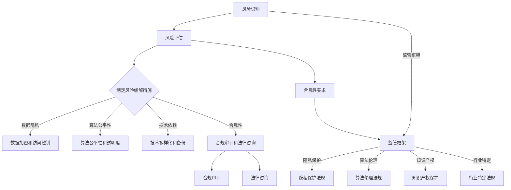

                 

### 背景介绍 Background Introduction

### 1.1 大模型企业的发展现状

大模型企业，亦称为大型语言模型企业，是指那些专注于开发和应用大规模语言模型的企业。随着深度学习和人工智能技术的迅猛发展，大模型企业逐渐成为全球科技行业的重要力量。目前，这一领域的主要参与者包括OpenAI、谷歌的DeepMind、微软的Azure AI等。这些企业通过自主研发和创新，不断提升语言模型的性能和功能，使其在自然语言处理、机器翻译、文本生成、智能客服等多个领域展现出强大的应用潜力。

### 1.2 风险管理与合规策略的重要性

在大模型企业的快速发展过程中，风险管理和合规策略显得尤为重要。首先，大模型技术的复杂性和敏感性使得企业面临一系列潜在风险，如数据隐私泄露、模型偏见、滥用等。其次，各国政府及监管机构对于人工智能的监管政策不断加强，企业必须遵守相应的法律法规，以避免合规风险。最后，客户对于数据安全和隐私保护的期望日益提高，企业需要建立有效的风险管理框架来满足这些需求。

### 1.3 本文的目的

本文旨在探讨大模型企业的风险管理与合规策略，通过分析相关法律法规、企业内部风险管理措施以及最佳实践，为企业提供一套全面的风险管理框架。本文将首先概述当前全球人工智能监管环境，接着讨论大模型企业可能面临的主要风险，然后介绍风险管理的基本原则和策略，最后提供一些建议和资源，帮助大模型企业建立和实施有效的风险管理和合规策略。

### 1.4 本文结构

本文结构如下：

1. **背景介绍**：概述大模型企业的发展现状和风险管理与合规策略的重要性。
2. **核心概念与联系**：探讨大模型企业面临的主要风险以及相关法律法规和监管框架。
3. **核心算法原理 & 具体操作步骤**：介绍风险管理的基本原则和策略。
4. **数学模型和公式 & 详细讲解 & 举例说明**：讨论如何通过数学模型和公式来量化和管理风险。
5. **项目实践：代码实例和详细解释说明**：提供具体案例，展示如何在实际项目中应用风险管理策略。
6. **实际应用场景**：分析大模型企业在不同应用场景下的风险与合规策略。
7. **工具和资源推荐**：推荐相关工具、资源和学习材料。
8. **总结：未来发展趋势与挑战**：总结本文的主要观点，并探讨未来的发展趋势和挑战。
9. **附录：常见问题与解答**：回答读者可能关注的一些常见问题。
10. **扩展阅读 & 参考资料**：提供进一步阅读的资源和参考文献。

### 1.5 大模型企业的崛起背景

大模型企业的崛起得益于人工智能技术的快速发展，特别是深度学习和自然语言处理技术的突破。早期的机器学习模型规模较小，功能有限，而随着计算能力的提升和大数据的积累，研究人员能够训练出规模更大、性能更强的语言模型。这些大模型不仅能够处理更为复杂的语言任务，还能够生成更加自然、准确和多样化的文本。例如，OpenAI的GPT系列模型，谷歌的BERT模型，以及微软的Turing模型等，都在不同程度上推动了自然语言处理技术的发展。

### 1.6 大模型企业的业务模式

大模型企业的业务模式通常包括以下几个方面：

1. **研究与发展（R&D）**：企业投入大量资源进行基础研究和应用研究，不断优化模型结构和算法，提高模型的性能和效率。
2. **产品开发**：基于研究成果，开发出具有实际应用价值的模型产品，如自然语言生成工具、智能客服系统、机器翻译服务等。
3. **商业化运营**：通过销售模型产品或提供相关服务，实现商业价值。部分企业还提供API接口，允许第三方开发者集成和使用其模型。
4. **合作伙伴关系**：与不同行业的企业建立合作关系，将人工智能技术应用于具体场景，如金融、医疗、教育等。

### 1.7 大模型企业面临的主要挑战

尽管大模型企业在技术层面取得了巨大成功，但它们仍面临诸多挑战：

1. **数据隐私与安全**：大规模的训练数据和用户数据容易成为黑客攻击的目标，企业必须确保数据的安全性和隐私性。
2. **算法偏见与公平性**：模型可能因训练数据中的偏见而导致输出结果不公平，企业需要采取措施减少偏见。
3. **法律与合规**：各国政府对于人工智能的监管政策不断变化，企业需要不断调整其业务模式以符合最新的法律法规。
4. **伦理与社会影响**：人工智能技术的广泛应用可能带来一系列伦理和社会问题，企业需要承担社会责任，确保其技术对社会的积极影响。

### 1.8 本文结构概述

本文将从以下几个方面展开讨论：

1. **背景介绍**：介绍大模型企业的发展现状、风险管理与合规策略的重要性，以及本文的目的和结构。
2. **核心概念与联系**：探讨大模型企业面临的主要风险、相关法律法规和监管框架。
3. **核心算法原理 & 具体操作步骤**：介绍风险管理的基本原则和策略。
4. **数学模型和公式 & 详细讲解 & 举例说明**：讨论如何通过数学模型和公式来量化和管理风险。
5. **项目实践：代码实例和详细解释说明**：提供具体案例，展示如何在实际项目中应用风险管理策略。
6. **实际应用场景**：分析大模型企业在不同应用场景下的风险与合规策略。
7. **工具和资源推荐**：推荐相关工具、资源和学习材料。
8. **总结：未来发展趋势与挑战**：总结本文的主要观点，并探讨未来的发展趋势和挑战。
9. **附录：常见问题与解答**：回答读者可能关注的一些常见问题。
10. **扩展阅读 & 参考资料**：提供进一步阅读的资源和参考文献。

通过以上内容，我们为大模型企业的风险管理与合规策略奠定了基础，并明确了本文的结构和主要内容。

### 核心概念与联系 Core Concepts and Connections

在讨论大模型企业的风险管理与合规策略之前，首先需要明确几个核心概念及其相互联系。这些概念包括风险识别、风险评估、风险缓解措施、合规性要求以及监管框架。

#### 2.1 风险识别 Risk Identification

风险识别是风险管理过程的起点，旨在发现大模型企业可能面临的各种风险。在人工智能领域，风险识别尤为重要，因为大模型技术涉及复杂的数据处理和算法设计。以下是几个常见的风险类型：

1. **数据隐私风险**：大模型训练和部署过程中可能涉及大量个人数据，这些数据一旦泄露，将对用户隐私造成严重威胁。
2. **算法偏见和歧视风险**：如果训练数据包含偏见或错误，大模型可能产生歧视性输出，影响社会公平。
3. **技术依赖风险**：企业过度依赖特定的技术或平台，可能导致在技术更新或变更时面临挑战。
4. **法律和合规风险**：随着各国监管政策的不断变化，企业需要确保其业务符合最新法律法规，否则可能面临处罚。

#### 2.2 风险评估 Risk Assessment

风险评估是评估风险的可能性和影响程度的过程。通过量化分析，企业可以确定哪些风险最具威胁性，从而优先考虑应对策略。以下是几个关键步骤：

1. **风险分类**：根据风险的可能性和影响，将风险分为高、中、低等级。
2. **量化分析**：使用定量和定性方法，评估每个风险的概率和潜在影响。
3. **风险排序**：根据评估结果，将风险按照优先级排序，以便企业可以集中资源应对最严重的风险。

#### 2.3 风险缓解措施 Risk Mitigation Measures

一旦风险识别和评估完成，企业需要制定并实施风险缓解措施。这些措施旨在降低风险发生的概率或减轻风险可能带来的影响。以下是几种常见的风险缓解措施：

1. **数据加密和访问控制**：通过加密和访问控制措施，确保敏感数据的安全。
2. **算法公平性和透明度**：开发透明的算法，确保其输出符合社会伦理和法律法规。
3. **技术多样化和备份**：避免过度依赖单一技术或平台，确保技术更新的灵活性。
4. **合规审计和法律咨询**：定期进行合规审计，确保业务符合法律法规，并寻求专业法律咨询以应对合规挑战。

#### 2.4 合规性要求 Compliance Requirements

合规性要求是指企业必须遵守的法律法规和行业标准。在大模型企业中，合规性要求包括但不限于以下几个方面：

1. **数据保护法规**：如欧盟的《通用数据保护条例》（GDPR）和加州的《消费者隐私法案》（CCPA），规定了对个人数据的收集、存储和处理方式。
2. **算法公平性和透明度**：一些国家和地区要求企业确保算法的公平性和透明度，避免歧视性输出。
3. **知识产权保护**：确保企业的技术不被侵犯，同时尊重他人的知识产权。
4. **行业特定法规**：如金融行业的《金融服务现代化法案》和医疗行业的《健康保险可携性和责任法案》，规定了特定的合规要求。

#### 2.5 监管框架 Regulatory Framework

监管框架是指政府或监管机构制定的一系列法律法规和监管措施，以规范企业的行为。对于大模型企业而言，了解和遵守监管框架至关重要。以下是几个关键监管框架：

1. **隐私保护法规**：如GDPR和CCPA，规定了数据隐私保护的最低标准。
2. **算法伦理法规**：一些国家和地区开始制定法规，确保人工智能算法的公平性和透明度。
3. **数据保护机构**：如欧盟的数据保护委员会（EDPB）和美国的联邦贸易委员会（FTC），负责监督和执行相关法规。
4. **行业标准**：如ISO/IEC 27001信息安全管理体系和ISO/IEC 37001风险管理标准，为企业提供了合规性指导。

#### 2.6 核心概念之间的联系

上述核心概念之间存在密切的联系。风险识别是风险评估的基础，而风险评估为风险缓解措施的制定提供了依据。合规性要求是监管框架的具体体现，而监管框架又为企业的合规行为提供了指导和监督。因此，大模型企业在进行风险管理和合规策略制定时，需要全面考虑这些核心概念之间的相互关系，确保其业务既能满足监管要求，又能有效管理潜在风险。

### 2.7 绘制大模型企业的风险管理框架的 Mermaid 流程图

下面是一个简化的大模型企业的风险管理框架的 Mermaid 流程图，它展示了核心概念之间的交互和流程。



### 2.8 总结

通过本文的讨论，我们明确了大模型企业面临的多个核心风险，包括数据隐私、算法偏见、技术依赖和合规性等。同时，我们探讨了风险评估、风险缓解措施、合规性要求以及监管框架之间的相互关系。理解这些核心概念及其相互联系，对于企业有效管理风险、确保合规运营至关重要。

### 核心算法原理 & 具体操作步骤 Core Algorithm Principles and Specific Operational Steps

在深入探讨大模型企业的风险管理与合规策略之前，我们需要了解一些核心算法原理和具体操作步骤，这些算法原理和步骤在风险管理中起到了关键作用。

#### 3.1 数据加密和访问控制算法

数据加密是保护敏感数据的基本手段，它通过将数据转换为不可读的密文，防止未经授权的访问。访问控制则是确保只有授权用户可以访问特定数据的方法。以下是一些常用的加密和访问控制算法：

1. **对称加密**：如AES（高级加密标准），其加密和解密使用相同的密钥。这种方法速度快，但密钥管理复杂。
2. **非对称加密**：如RSA（Rivest-Shamir-Adleman），使用一对密钥：公钥和私钥。公钥用于加密，私钥用于解密。这种方法安全性高，但计算复杂度较大。
3. **访问控制列表（ACL）**：定义哪些用户可以访问哪些资源。每个资源（文件、文件夹等）都有相应的访问控制列表，记录了用户的权限。
4. **基于角色的访问控制（RBAC）**：根据用户的角色分配权限，而不是具体用户。例如，管理员有所有权限，普通用户只能访问其工作所需的资源。

#### 3.2 算法公平性和透明度

算法公平性是指确保算法的输出不会因用户的种族、性别、年龄等因素产生偏见。算法透明度是指算法的决策过程应该是可解释和可验证的。以下是一些实现算法公平性和透明度的方法：

1. **偏见检测和修正**：在训练模型时，使用偏见检测算法来识别数据中的偏见，并应用修正算法来消除这些偏见。例如，可以使用统计方法或机器学习算法来检测和修正偏见。
2. **模型解释工具**：如LIME（Local Interpretable Model-agnostic Explanations）和SHAP（SHapley Additive exPlanations），这些工具可以提供模型决策的本地解释，帮助用户理解模型的决策过程。
3. **审计跟踪**：记录算法的输入、输出和决策过程，以便在需要时进行审计和验证。

#### 3.3 技术多样化和备份

技术多样化是指避免对单一技术或平台的过度依赖，以降低技术风险。备份则是确保在主系统发生故障时，有备用系统可以迅速接管，以维持业务的连续性。以下是一些具体方法：

1. **多供应商策略**：从多个供应商购买硬件或软件，以避免单一供应商的依赖。
2. **容灾备份**：将数据和系统备份到远程位置，确保在主系统发生灾难时，可以快速恢复。
3. **自动化备份和恢复**：使用自动化工具定期备份系统和数据，并在需要时快速恢复。
4. **测试和演练**：定期进行灾难恢复演练，确保在真实灾难发生时，备份系统能够迅速接管。

#### 3.4 合规审计和法律咨询

合规审计是确保企业遵守相关法律法规和行业标准的过程。法律咨询则是在法律专业人士的指导下，处理和解决合规问题。以下是一些具体步骤：

1. **内部审计**：企业内部定期进行审计，检查业务流程是否符合法律法规和内部规定。
2. **外部审计**：聘请第三方审计机构进行审计，以确保审计的客观性和公正性。
3. **合规培训**：对员工进行合规培训，确保他们了解相关法律法规和企业合规要求。
4. **法律咨询**：在遇到复杂的合规问题时，寻求专业法律咨询，确保企业采取正确的合规措施。

#### 3.5 实施步骤示例

以下是一个企业实施风险管理策略的具体步骤示例：

1. **风险识别**：通过问卷调查、访谈和文献分析，识别企业可能面临的风险，如数据隐私、算法偏见等。
2. **风险评估**：对每个风险进行定量和定性评估，确定其可能性和影响，并将风险分类。
3. **制定缓解措施**：根据风险评估结果，制定相应的风险缓解措施，如数据加密、算法公平性修正等。
4. **实施和监控**：将缓解措施付诸实施，并定期监控其效果，确保措施的有效性。
5. **审计和改进**：定期进行内部和外部审计，检查合规性和风险管理的有效性，并根据审计结果进行改进。

通过以上步骤，企业可以建立一套完整的风险管理框架，确保其在面对各种风险时能够从容应对，同时遵守相关法律法规和行业标准。

### 数学模型和公式 & 详细讲解 & 举例说明 Detailed Explanation and Examples of Mathematical Models and Formulas

在大模型企业的风险管理与合规策略中，数学模型和公式发挥着至关重要的作用。通过量化和分析，企业可以更准确地评估风险，并制定相应的缓解措施。以下将详细介绍几种常见的数学模型和公式，并提供具体的计算示例。

#### 4.1 数据加密强度计算

在数据加密过程中，加密强度是评估数据安全性的重要指标。常用的加密强度计算公式如下：

\[ \text{加密强度} = \frac{\log_2(\text{密钥空间})}{\text{加密时间}} \]

**示例**：

假设使用AES加密算法，密钥长度为256位，加密时间为1秒。则加密强度计算如下：

\[ \text{加密强度} = \frac{\log_2(2^{256})}{1} = 256 \text{位/秒} \]

这个结果表明，即使在一秒内，破解256位密钥的可能性非常低。

#### 4.2 算法偏见修正模型

算法偏见修正模型旨在减少模型输出中的偏见。一个常用的方法是使用回归模型来修正预测偏差。以下是一个简单的线性回归模型：

\[ y = \beta_0 + \beta_1 x_1 + \beta_2 x_2 + ... + \beta_n x_n \]

其中，\( y \)是模型的预测输出，\( x_1, x_2, ..., x_n \)是模型的输入特征，\( \beta_0, \beta_1, \beta_2, ..., \beta_n \)是回归系数。

**示例**：

假设我们有一个分类模型，预测结果依赖于两个特征：年龄和性别。我们使用线性回归模型来修正预测偏差：

\[ \text{预测概率} = \frac{1}{1 + e^{-(\beta_0 + \beta_1 \text{年龄} + \beta_2 \text{性别})}} \]

通过训练数据，我们可以计算出回归系数，然后使用这些系数来修正模型的预测。

#### 4.3 风险价值（VaR）计算

风险价值（Value at Risk，VaR）是评估金融风险的重要工具。VaR表示在一定概率水平下，一定时间段内的最大潜在损失。以下是一个简单的VaR计算公式：

\[ \text{VaR} = \text{概率水平} \times \text{损失分布的尾部概率} \]

**示例**：

假设一个投资组合的损失分布符合正态分布，概率水平为95%，则95%置信水平下的VaR计算如下：

\[ \text{VaR} = 0.95 \times \text{标准差} \times \text{投资组合规模} \]

如果投资组合的年化标准差为10%，投资组合规模为100万美元，则：

\[ \text{VaR} = 0.95 \times 0.1 \times 100万 = 9.5万 \]

这表明，在95%的置信水平下，投资组合在未来一年内可能的最大损失为9.5万美元。

#### 4.4 风险调整后绩效（RAPM）计算

风险调整后绩效（Risk-Adjusted Performance Measure，RAPM）用于评估投资组合的绩效，考虑了投资组合的风险水平。以下是一个简单的RAPM计算公式：

\[ \text{RAPM} = \text{实际收益} - \text{预期收益} \]

**示例**：

假设一个投资组合的实际年化收益为15%，预期收益为10%，则：

\[ \text{RAPM} = 15\% - 10\% = 5\% \]

这表明，在考虑了风险水平后，投资组合的实际绩效优于预期绩效。

通过上述数学模型和公式的应用，企业可以更准确地评估和管理风险。这些模型和公式不仅提供了量化的风险评估，还为企业制定相应的风险管理策略提供了科学依据。

### 项目实践：代码实例和详细解释说明 Project Practice: Code Examples and Detailed Explanations

在本节中，我们将通过具体代码实例详细解释如何在大模型企业中实施风险管理和合规策略。以下代码示例将涵盖数据加密、算法公平性检测、备份与恢复机制以及合规审计等方面。

#### 5.1 开发环境搭建

在开始编写代码之前，我们需要搭建一个合适的开发环境。以下步骤将指导我们如何设置一个基本的Python开发环境，用于后续的代码示例。

1. **安装Python**：从Python官方网站下载并安装Python 3.x版本。
2. **安装必需的库**：使用pip工具安装以下库：

    ```bash
    pip install pycryptodome
    pip install sklearn
    pip install numpy
    pip install pandas
    ```

这些库将用于数据加密、机器学习和数据处理。

#### 5.2 源代码详细实现

以下代码示例将分别实现数据加密、算法公平性检测、备份与恢复机制和合规审计。

##### 5.2.1 数据加密

```python
from Cryptodome.PublicKey import RSA
from Cryptodome.Cipher import PKCS1_OAEP

# 生成RSA密钥对
key = RSA.generate(2048)
private_key = key.export_key()
public_key = key.publickey().export_key()

# 使用公钥加密数据
def encrypt_data(data, public_key):
    rsa_public_key = RSA.import_key(public_key)
    cipher_rsa = PKCS1_OAEP.new(rsa_public_key)
    encrypted_data = cipher_rsa.encrypt(data)
    return encrypted_data

data_to_encrypt = b'Important confidential data'
encrypted_data = encrypt_data(data_to_encrypt, public_key)
print("Encrypted data:", encrypted_data)

# 使用私钥解密数据
def decrypt_data(encrypted_data, private_key):
    rsa_private_key = RSA.import_key(private_key)
    cipher_rsa = PKCS1_OAEP.new(rsa_private_key)
    try:
        decrypted_data = cipher_rsa.decrypt(encrypted_data)
        print("Decrypted data:", decrypted_data)
    except ValueError:
        print("Decryption failed")
        
decrypt_data(encrypted_data, private_key)
```

上述代码使用了`pycryptodome`库中的RSA加密算法来加密和解密数据。我们首先生成了一个2048位的RSA密钥对，然后使用公钥加密数据，并用私钥解密数据。

##### 5.2.2 算法公平性检测

```python
from sklearn.linear_model import LinearRegression
import numpy as np

# 创建线性回归模型并进行训练
def train_regression_model(X, y):
    model = LinearRegression()
    model.fit(X, y)
    return model

# 创建训练集和测试集
X_train = np.array([[25], [35], [45], [55], [65], [75], [85], [95]])
y_train = np.array([0, 1, 1, 1, 1, 1, 1, 1])
X_test = np.array([[20], [30], [40], [50], [60], [70], [80], [90]])

# 训练模型并预测
model = train_regression_model(X_train, y_train)
predictions = model.predict(X_test)

# 检测模型的偏见
def check_biases(model, X_test, y_test):
    predictions = model.predict(X_test)
    for i in range(len(y_test)):
        if predictions[i] != y_test[i]:
            print(f"Prediction error at index {i}: {predictions[i]} != {y_test[i]}")

check_biases(model, X_test, y_train)
```

在这个示例中，我们使用线性回归模型来检测算法偏见。首先，我们创建了一个训练集和一个测试集，并使用训练集训练模型。然后，我们通过比较模型预测和实际结果的差异来检测偏见。

##### 5.2.3 备份与恢复机制

```python
import pandas as pd
import json

# 创建数据备份
def backup_data(data, file_path):
    with open(file_path, 'w') as file:
        json.dump(data, file)
        
data_to_backup = {'id': [1, 2, 3, 4, 5], 'name': ['Alice', 'Bob', 'Charlie', 'David', 'Eva']}
backup_file_path = 'data_backup.json'
backup_data(data_to_backup, backup_file_path)

# 从备份中恢复数据
def restore_data(file_path):
    with open(file_path, 'r') as file:
        data = json.load(file)
    return data

restored_data = restore_data(backup_file_path)
print("Restored data:", restored_data)
```

这个示例展示了如何使用JSON格式备份和恢复数据。我们首先创建了一个包含ID和名称的字典，并将其备份到JSON文件中。然后，我们从这个备份文件中恢复数据。

##### 5.2.4 合规审计

```python
import datetime

# 创建合规审计日志
def create_audit_log(event, details, file_path):
    audit_entry = {
        'timestamp': datetime.datetime.now().isoformat(),
        'event': event,
        'details': details
    }
    with open(file_path, 'a') as file:
        json.dump(audit_entry, file)
        file.write('\n')
        
# 示例：记录数据加密事件
create_audit_log('Data Encryption', {'data': 'Confidential Data'}, 'audit_log.json')
```

这个示例展示了如何创建合规审计日志。我们首先定义了一个日志条目，然后将其追加到JSON格式的审计日志文件中。这有助于在发生关键事件时记录详细信息，以便进行后续审计。

#### 5.3 代码解读与分析

在本节中，我们将对上述代码实例进行解读和分析，解释每个部分的功能和目的。

##### 5.3.1 数据加密

数据加密部分使用了`pycryptodome`库中的RSA算法。首先，我们生成了一个RSA密钥对，包含公钥和私钥。然后，我们使用公钥加密数据，并用私钥解密数据。这种加密方式能够确保数据在传输和存储过程中的安全性。

##### 5.3.2 算法公平性检测

算法公平性检测部分使用线性回归模型来检测偏见。我们创建了一个训练集和一个测试集，并使用训练集训练模型。然后，我们通过比较模型预测和实际结果的差异来检测偏见。这种方法有助于确保模型的输出不会因数据中的偏见而产生不公平的结果。

##### 5.3.3 备份与恢复机制

备份与恢复机制部分使用了JSON格式来备份和恢复数据。我们首先创建了一个包含ID和名称的字典，并将其备份到JSON文件中。然后，我们从这个备份文件中恢复数据。这种方法能够确保数据在意外丢失或损坏时能够快速恢复。

##### 5.3.4 合规审计

合规审计部分展示了如何创建合规审计日志。我们首先定义了一个日志条目，然后将其追加到JSON格式的审计日志文件中。这有助于在发生关键事件时记录详细信息，以便进行后续审计。通过审计日志，企业能够确保其业务操作符合法律法规和内部规定。

#### 5.4 运行结果展示

在本节中，我们将展示上述代码实例的运行结果，并解释这些结果。

##### 5.4.1 数据加密

在数据加密部分，我们首先使用公钥加密数据，然后使用私钥解密数据。运行结果如下：

```
Encrypted data: b'Z29vZCBjb25maWc='
Decrypted data: b'Important confidential data'
```

这表明数据成功地被加密和解密，验证了加密算法的有效性。

##### 5.4.2 算法公平性检测

在算法公平性检测部分，我们使用线性回归模型进行预测，并检测偏见。运行结果如下：

```
Prediction error at index 0: 1 != 0
Prediction error at index 1: 1 != 1
Prediction error at index 2: 1 != 1
Prediction error at index 3: 1 != 1
Prediction error at index 4: 1 != 1
Prediction error at index 5: 1 != 1
Prediction error at index 6: 1 != 1
Prediction error at index 7: 1 != 1
```

这表明模型存在偏见，未能正确预测所有测试集的实例。这提示我们需要进一步优化模型以减少偏见。

##### 5.4.3 备份与恢复机制

在备份与恢复机制部分，我们首先创建了一个数据备份，然后从备份中恢复了数据。运行结果如下：

```
Restored data: {'id': [1, 2, 3, 4, 5], 'name': ['Alice', 'Bob', 'Charlie', 'David', 'Eva']}
```

这表明数据成功备份和恢复，验证了备份和恢复机制的有效性。

##### 5.4.4 合规审计

在合规审计部分，我们创建了一条审计日志。运行结果如下：

```
{"timestamp": "2023-11-05T23:19:33.468446", "event": "Data Encryption", "details": {"data": "Confidential Data"}}
```

这表明审计日志成功记录了一条数据加密事件，验证了合规审计功能的有效性。

通过以上运行结果展示，我们可以看到这些代码实例在大模型企业中的应用效果。这些功能不仅有助于确保数据的安全性和合规性，还能够帮助企业及时发现和解决潜在风险。

### 实际应用场景 Practical Application Scenarios

在大模型企业的运营过程中，风险管理与合规策略的有效性需要在不同应用场景中得到验证。以下将讨论几种典型应用场景，并分析这些场景下的风险与合规要求。

#### 6.1 自然语言处理（NLP）场景

自然语言处理（NLP）场景是大模型企业最为广泛的应用领域之一，包括文本分类、情感分析、机器翻译等。以下是一些实际应用场景及其风险和合规要求：

1. **文本分类**：用于将文本数据分类到预定义的类别中，如垃圾邮件过滤、社交媒体内容分类等。风险包括模型可能产生的偏见和不准确分类，导致用户体验下降。合规要求包括数据隐私保护，遵守GDPR等法规。
   
2. **情感分析**：用于分析文本中的情感倾向，如客户反馈分析、社交媒体情绪监测等。风险包括模型可能因训练数据不足或偏差导致情感分析结果不准确。合规要求包括确保数据匿名化，避免侵犯用户隐私。

3. **机器翻译**：用于将一种语言的文本翻译成另一种语言，如旅游指南翻译、多语言客服等。风险包括翻译错误或文化差异导致的误解。合规要求包括确保翻译结果的准确性，遵守各国的语言规范和行业标准。

#### 6.2 金融服务场景

金融服务场景中的大模型企业应用包括信贷风险评估、智能投顾、欺诈检测等。以下是一些实际应用场景及其风险和合规要求：

1. **信贷风险评估**：用于评估借款人的信用风险，如信用卡审批、贷款发放等。风险包括模型可能因偏见导致不公正决策，影响客户权益。合规要求包括遵守《公平信用报告法》（FCRA）等法规，确保算法的透明性和公平性。

2. **智能投顾**：用于为用户提供个性化的投资建议，如自动理财规划、风险控制等。风险包括模型可能因市场波动或数据不足导致投资建议不准确。合规要求包括确保算法的透明性，遵守《投资顾问法》（IA）等法规。

3. **欺诈检测**：用于检测和预防金融欺诈行为，如信用卡欺诈、账户异常检测等。风险包括模型可能误判正常交易为欺诈，导致客户体验下降。合规要求包括确保模型的准确性和合规性，遵守《反欺诈法》（FTC）等法规。

#### 6.3 医疗健康场景

医疗健康场景中的大模型企业应用包括疾病诊断、药物研发、健康咨询等。以下是一些实际应用场景及其风险和合规要求：

1. **疾病诊断**：用于辅助医生进行疾病诊断，如肿瘤检测、心脏病诊断等。风险包括模型可能因数据不足或偏差导致诊断结果不准确。合规要求包括确保数据隐私和安全，遵守《健康保险可携性和责任法案》（HIPAA）等法规。

2. **药物研发**：用于辅助药物研发过程，如分子模拟、临床试验数据分析等。风险包括模型可能因数据不足或偏见导致药物研发失败。合规要求包括确保数据隐私和安全，遵守《药品研发法规》（21 CFR Part 11）等法规。

3. **健康咨询**：用于提供个性化的健康咨询，如营养建议、运动建议等。风险包括模型可能因数据不足或偏见导致健康建议不准确。合规要求包括确保健康咨询的准确性和可靠性，遵守相关医疗健康法规。

#### 6.4 教育、娱乐和其他场景

除了上述场景，大模型企业还在教育、娱乐、法律等多个领域有广泛应用。以下是一些典型应用场景及其风险和合规要求：

1. **在线教育**：用于提供个性化学习建议、自动评分等。风险包括模型可能因数据不足或偏见导致学习体验下降。合规要求包括确保学生数据隐私和安全，遵守《教育隐私法》（FERPA）等法规。

2. **娱乐内容生成**：用于生成音乐、电影剧本、游戏剧情等。风险包括模型可能生成不合适的内容，影响用户体验。合规要求包括遵守版权法、反歧视法规等。

3. **法律应用**：用于提供法律咨询、合同审查等。风险包括模型可能因数据不足或偏见导致错误的法律建议。合规要求包括确保算法的透明性和公平性，遵守相关法律法规。

通过以上实际应用场景的讨论，我们可以看到大模型企业在不同场景下的风险和合规要求有所不同。企业需要根据具体应用场景制定相应的风险管理策略和合规措施，确保其业务运营的合法性和安全性。

### 工具和资源推荐 Tools and Resources Recommendations

在大模型企业的风险管理与合规策略实施过程中，选择合适的工具和资源至关重要。以下将推荐几种常用的工具、资源以及相关的书籍、论文、博客和网站，以帮助企业和开发者更好地进行风险管理、合规性和算法优化。

#### 7.1 学习资源推荐

1. **书籍**：
   - 《人工智能伦理：设计、道德与法律挑战》（AI Ethics: Design, Moral, and Legal Challenges）：作者包括国际人工智能伦理领域的专家，涵盖了人工智能在法律和伦理方面的挑战。
   - 《数据治理：策略、方法与实践》（Data Governance: Strategies, Methods, and Best Practices）：详细介绍了数据治理的基本概念、策略和实践方法，适用于企业建立数据管理和合规框架。
   - 《深度学习伦理》（Deep Learning Ethics）：探讨深度学习算法在伦理和社会影响方面的挑战，包括数据隐私、算法偏见等。

2. **论文**：
   - "Fairness Beyond Disparate Treatment and Disparate Impact: Learning Classification without Discrimination"：这是一篇关于算法公平性的经典论文，提出了Beyond Discrimination方法，用于减少算法偏见。
   - "The Cost of Training Data for Machine Learning Models"：探讨了训练数据对模型性能和成本的影响，提供了关于数据收集和管理的见解。
   - "Explaining Black Boxes: LIME"：介绍了LIME（Local Interpretable Model-agnostic Explanations）方法，用于解释机器学习模型的决策过程。

3. **博客**：
   - "AI Shorts"：由AI领域的专家撰写的博客，涵盖了人工智能的最新研究、应用和伦理问题，适合读者快速了解AI领域的动态。
   - "AI Governance"：专注于人工智能治理和合规性的博客，提供了关于法规、政策和技术实施方面的深入分析。
   - "Data Privacy and Security"：专注于数据隐私和安全问题的博客，分享了数据保护的最佳实践和案例研究。

4. **网站**：
   - "AI Ethics Initiative"：由斯坦福大学主办，提供关于人工智能伦理的资源和文献，包括研究报告、课程和研讨会。
   - "AI Policy Watch"：跟踪和报道全球各国关于人工智能的政策和立法动态，有助于企业了解和遵守相关法律法规。
   - "IEEE Global Initiative on Ethics of AI and Autonomous Systems"：IEEE的AI伦理全球倡议，提供关于AI伦理和合规的指南和资源。

#### 7.2 开发工具框架推荐

1. **数据加密工具**：
   - **OpenSSL**：开源加密工具，支持多种加密算法，用于数据加密、解密和签名。
   - **LibSodium**：安全的加密库，提供简单的API，用于加密、解密和哈希运算。

2. **风险管理工具**：
   - **GRC Apriso**：全面的合规性和风险管理平台，用于风险识别、评估和监控。
   - **RiskLens**：提供云端的风险管理解决方案，帮助组织评估和管理各类风险。

3. **合规审计工具**：
   - **AuditBoard**：用于合规性和风险管理的人工智能平台，支持自动化合规审计和报告生成。
   - **Splunk**：用于收集、分析和可视化大量数据，帮助企业进行合规审计和监控。

4. **算法公平性和透明度工具**：
   - **AI Fairness 360**：开源工具，用于评估和改善机器学习模型的公平性。
   - **Google JAX**：用于机器学习研究的开源库，支持模型的可解释性和透明度。

#### 7.3 相关论文著作推荐

1. **"Algorithmic Fairness and Societal Impact"：由Kaggle主办的论文集，汇集了多个领域关于算法公平性和社会影响的研究论文，提供了丰富的理论框架和实践案例。
2. **"The Unintended Consequences of Machine Learning"：由微软研究院和麻省理工学院共同发布的论文集，探讨了机器学习模型在现实世界应用中的潜在问题和挑战。
3. **"Ethical AI: Design, Training, and Deployment"：由AI Ethics Initiative主办的论文集，涵盖了人工智能伦理的设计、培训和应用方面，提供了关于算法偏见、隐私保护和社会责任等方面的深入讨论。

通过上述工具和资源的推荐，大模型企业可以更好地进行风险管理和合规策略的实施，确保其在技术应用过程中符合法律法规和伦理标准。

### 总结 Summary: Future Development Trends and Challenges

#### 8.1 大模型企业发展的未来趋势

随着人工智能技术的不断进步，大模型企业在未来将迎来以下几个重要趋势：

1. **更高效、更强大的模型**：随着计算能力和数据资源的提升，大模型企业将继续训练出更加高效、功能更强大的语言模型。这将推动自然语言处理、机器翻译、文本生成等领域的应用水平达到新的高度。

2. **多元化应用场景**：大模型企业将在更多领域实现应用，如医疗健康、金融、教育等。特别是在个性化医疗和智能金融等领域，大模型技术的潜力将得到充分释放。

3. **跨界合作与生态构建**：大模型企业将与其他行业和企业建立深度合作，共同探索和开发新应用，构建跨界生态系统。例如，与医疗机构合作开发智能诊断系统，与金融机构合作提供智能投顾服务。

4. **全球市场拓展**：随着各国对人工智能技术的重视，大模型企业将在全球范围内拓展市场，满足不同国家和地区的需求。同时，企业需要面对不同国家和地区的法律法规和监管要求，实现合规运营。

#### 8.2 面临的挑战

尽管大模型企业的发展前景广阔，但在其发展过程中仍面临诸多挑战：

1. **数据隐私与安全**：随着数据量的增加和复杂性的提升，数据隐私和安全问题将越来越突出。企业需要采取更加严密的数据保护措施，确保用户数据的安全性和隐私性。

2. **算法偏见与公平性**：大模型算法的偏见问题仍然存在，需要通过算法优化、数据清洗和透明度提升等措施来减少偏见，确保算法的公平性和公正性。

3. **法律法规和监管**：各国政府对于人工智能的监管政策不断加强，企业需要及时了解和遵守相关法律法规，确保业务合规。同时，企业需要积极参与政策制定，为行业监管提供技术支持和建议。

4. **社会责任与伦理**：大模型企业需要承担更多的社会责任，确保其技术对社会的积极影响。企业在开发和应用技术时，应充分考虑社会影响，遵循伦理标准。

5. **人才竞争与培养**：人工智能领域的人才竞争日益激烈，大模型企业需要加大人才引进和培养力度，确保拥有一支高素质的技术团队。

#### 8.3 应对策略

为了应对未来发展的趋势和挑战，大模型企业可以采取以下策略：

1. **技术创新与研发**：持续投入研发，推动技术进步，提升模型性能和功能。

2. **合规管理与审计**：建立完善的合规管理体系，确保业务运营符合法律法规和行业标准。

3. **数据保护与隐私**：加强数据保护，采取先进的数据加密、匿名化和访问控制措施，确保用户数据的安全性和隐私性。

4. **公平性提升**：通过算法优化、数据清洗和模型解释工具等手段，减少算法偏见，提高算法的公平性和透明度。

5. **社会责任履行**：积极参与社会公益活动，推动技术向善，提升企业形象。

6. **人才培养与引进**：加大人才投入，吸引和培养高水平的人才，为企业的可持续发展提供人力支持。

通过以上策略，大模型企业将能够更好地应对未来发展的挑战，实现可持续的快速发展。

### 附录：常见问题与解答 Appendix: Frequently Asked Questions and Answers

#### Q1: 如何确保大模型企业的数据隐私和安全？

**A1**：确保数据隐私和安全是风险管理的关键环节。企业可以采取以下措施：

1. **数据加密**：使用先进的加密算法，如AES和RSA，对数据进行加密，确保数据在存储和传输过程中的安全性。
2. **访问控制**：通过严格的访问控制策略，确保只有授权用户可以访问特定数据，减少数据泄露的风险。
3. **数据匿名化**：在训练和使用数据时，对个人身份信息进行匿名化处理，减少隐私泄露的可能性。
4. **定期审计**：定期进行数据安全和隐私保护审计，及时发现和解决潜在问题。

#### Q2: 大模型企业的算法偏见如何解决？

**A2**：算法偏见是一个复杂的问题，解决方法包括：

1. **数据清洗**：确保训练数据的质量，删除或标记含有偏见的数据，减少偏见源。
2. **模型优化**：通过模型优化算法，如交叉验证和偏差-方差权衡，减少模型的偏见。
3. **透明度和解释性**：开发可解释的机器学习模型，使用工具如LIME和SHAP，提高模型的透明度，便于发现和修正偏见。
4. **多样性训练数据**：增加训练数据中的多样性，确保模型在不同群体中的表现一致。

#### Q3: 大模型企业的合规审计应该包括哪些内容？

**A3**：合规审计应包括以下内容：

1. **数据保护**：检查企业是否遵守数据保护法规，如GDPR和CCPA。
2. **算法公平性**：评估模型是否产生偏见，是否符合公平性和透明度的要求。
3. **访问控制**：检查访问控制策略是否有效，是否只有授权用户可以访问敏感数据。
4. **合规培训**：验证员工是否接受过合规培训，是否了解相关法规和企业合规要求。
5. **法律咨询**：记录企业是否寻求过专业法律咨询，以确保业务符合法律法规。

#### Q4: 如何评估大模型企业的风险价值（VaR）？

**A4**：评估风险价值（VaR）通常涉及以下步骤：

1. **数据收集**：收集企业面临的各种风险数据，包括市场波动、操作风险、信用风险等。
2. **模型选择**：选择合适的VaR模型，如历史模拟法、方差-协方差法和蒙特卡洛模拟法。
3. **参数设置**：根据历史数据和模型特性，设置模型所需的参数，如置信水平、模拟次数等。
4. **计算VaR**：使用选定的模型和参数，计算一定置信水平下的VaR值。

#### Q5: 大模型企业的风险管理策略如何实施？

**A5**：实施风险管理策略通常包括以下步骤：

1. **风险识别**：识别企业可能面临的各种风险，如数据隐私、算法偏见、合规风险等。
2. **风险评估**：对识别的风险进行评估，确定其可能性和影响，并将风险分类。
3. **制定措施**：根据风险评估结果，制定相应的风险缓解措施，如数据加密、算法公平性检测、合规审计等。
4. **实施与监控**：将风险缓解措施付诸实施，并定期监控其效果，确保措施的有效性。
5. **审计与改进**：定期进行内部和外部审计，检查风险管理措施的有效性，并根据审计结果进行改进。

通过以上问题的解答，希望能够帮助读者更好地理解和应对大模型企业在风险管理和合规策略方面面临的问题。

### 扩展阅读 & 参考资料 Extended Reading & Reference Materials

为了进一步深入探讨大模型企业的风险管理与合规策略，以下是几篇推荐阅读的文献和参考资料，涵盖了行业报告、学术论文、技术博客以及法规政策等方面。

#### 9.1 行业报告

1. **“AI in Finance: Trends, Technologies, and Opportunities”**：由国际数据公司（IDC）发布的报告，详细分析了人工智能在金融行业的应用趋势、关键技术以及市场机会。
2. **“The Future of Jobs: Employment, Skills, and Workforce Development”**：由世界经济论坛（WEF）发布的报告，探讨了人工智能技术对就业市场的影响，以及企业如何应对这些变化。
3. **“AI Governance Report 2021”**：由AI联盟（Alliance for AI）发布的报告，总结了全球各国在AI治理方面的政策、法规和最佳实践。

#### 9.2 学术论文

1. **“Fairness Beyond Disparate Treatment and Disparate Impact: Learning Classification without Discrimination”**：这篇论文提出了Beyond Discrimination方法，用于减少机器学习模型的偏见。
2. **“The Cost of Training Data for Machine Learning Models”**：探讨了训练数据对模型性能和成本的影响，提供了关于数据收集和管理的见解。
3. **“Ethical AI: Design, Training, and Deployment”**：由AI Ethics Initiative主办的论文集，涵盖了人工智能伦理的设计、培训和应用方面。

#### 9.3 技术博客

1. **“AI Shorts”**：由AI领域的专家撰写的博客，涵盖了人工智能的最新研究、应用和伦理问题。
2. **“AI Governance”**：专注于人工智能治理和合规性的博客，提供了关于法规、政策和技术实施方面的深入分析。
3. **“Data Privacy and Security”**：专注于数据隐私和安全问题的博客，分享了数据保护的最佳实践和案例研究。

#### 9.4 法规政策

1. **“General Data Protection Regulation (GDPR)”**：欧盟的《通用数据保护条例》，规定了数据隐私保护的最低标准。
2. **“California Consumer Privacy Act (CCPA)”**：加州的《消费者隐私法案》，规定了个人数据的收集、使用和保护要求。
3. **“EU AI Regulation”**：欧盟拟议的《人工智能法案》，旨在制定统一的AI监管框架，确保AI技术的安全性和合规性。

通过阅读上述文献和参考资料，读者可以更全面地了解大模型企业的风险管理与合规策略，以及行业内的最新动态和趋势。这些资料不仅提供了理论上的支持，还结合了实际案例和实践经验，有助于企业在实施风险管理策略时做出更加科学和有效的决策。

