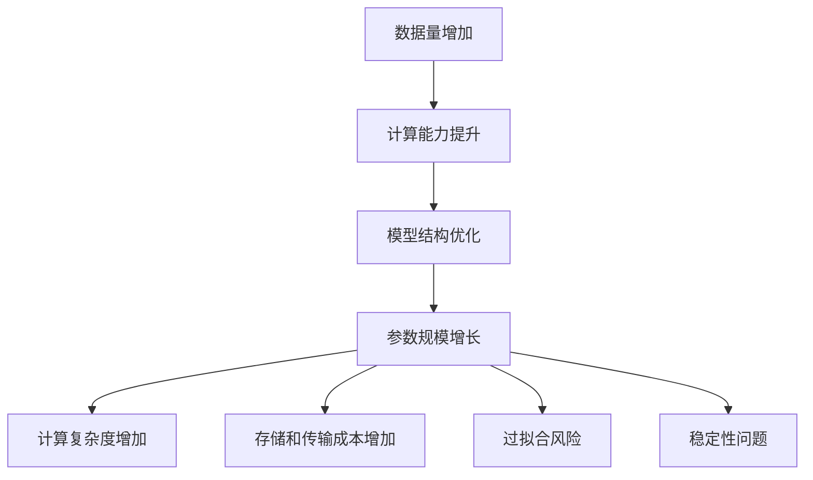

                 

### 文章标题：大模型参数规模增长的影响

本文将深入探讨大模型参数规模增长的影响。近年来，随着人工智能技术的飞速发展，大模型在各个领域展现出了巨大的潜力和优势。然而，大模型参数规模的增长也带来了一系列挑战。本文将从核心概念、算法原理、数学模型、实际应用场景等多个角度，详细分析大模型参数规模增长的影响，并探讨未来发展趋势与挑战。

### 关键词：大模型、参数规模、影响分析、发展趋势、挑战

### 摘要：

本文首先介绍了大模型参数规模增长的原因，探讨了参数规模增长对模型性能、计算资源需求、训练时间等方面的影响。接着，文章分析了大模型参数规模增长的核心算法原理，包括神经网络架构、优化算法等。随后，通过数学模型和公式详细阐述了参数规模增长对模型稳定性和预测精度的影响。最后，本文结合实际应用场景，探讨了大模型参数规模增长在实际应用中的挑战和解决方案，并总结了未来发展趋势与挑战。

本文结构如下：

1. 背景介绍
2. 核心概念与联系
3. 核心算法原理 & 具体操作步骤
4. 数学模型和公式 & 详细讲解 & 举例说明
5. 项目实践：代码实例和详细解释说明
6. 实际应用场景
7. 工具和资源推荐
8. 总结：未来发展趋势与挑战
9. 附录：常见问题与解答
10. 扩展阅读 & 参考资料

### 1. 背景介绍（Background Introduction）

大模型参数规模增长的原因主要有两个方面：一是随着数据规模的不断扩大，大模型能够更好地捕捉复杂模式，提高模型的性能；二是随着计算能力的提升，我们能够训练更大规模的模型，从而实现更高的性能。

然而，大模型参数规模的增长也带来了一系列挑战。首先，参数规模的增长会导致模型的计算复杂度急剧增加，对计算资源的需求也相应增加。这意味着我们需要更多的计算资源和时间来训练和部署大模型。其次，参数规模的增长可能会影响模型的稳定性和预测精度。当模型参数过多时，容易出现过拟合现象，导致模型在训练数据上表现良好，但在测试数据上表现不佳。此外，大模型参数规模的增长还会增加模型的存储和传输成本。

因此，本文将深入探讨大模型参数规模增长的影响，从核心概念、算法原理、数学模型、实际应用场景等多个角度进行分析，以期为研究和应用大模型提供有益的参考。

### 2. 核心概念与联系（Core Concepts and Connections）

#### 2.1 大模型的定义

大模型（Large Models）是指具有数十亿至数千亿参数规模的人工神经网络模型。这些模型通常基于深度学习技术，能够处理复杂的任务，如图像识别、自然语言处理等。大模型的显著特点是参数数量庞大，这使得它们在训练和推理过程中需要大量的计算资源和时间。

#### 2.2 参数规模的增长原因

参数规模的增长主要受到以下因素的影响：

1. **数据量的增加**：随着数据集的不断扩大，模型需要更多的参数来捕捉数据中的复杂模式。这有助于提高模型的泛化能力和性能。
2. **计算能力的提升**：随着计算硬件和算法的进步，我们能够训练和部署更大规模的模型。这使得大模型的参数规模得以快速增长。
3. **模型结构优化**：研究人员不断探索新的神经网络架构和优化方法，以提高模型的效率。这些改进使得大模型能够容纳更多的参数。

#### 2.3 参数规模增长的影响

参数规模的增长对大模型具有显著的影响，主要体现在以下几个方面：

1. **计算复杂度**：参数规模的增长导致模型的计算复杂度急剧增加。这意味着在训练和推理过程中需要更多的计算资源和时间。
2. **存储和传输成本**：大模型的参数数量庞大，需要更多的存储空间和带宽进行传输。这可能导致模型部署和分发过程中的延迟和成本增加。
3. **过拟合风险**：当模型参数过多时，容易出现过拟合现象。过拟合导致模型在训练数据上表现良好，但在测试数据上表现不佳，降低了模型的泛化能力。
4. **稳定性**：参数规模的增长可能会影响模型的稳定性。在训练过程中，模型的参数可能会出现剧烈波动，导致模型难以收敛。

为了更好地理解大模型参数规模的增长及其影响，我们可以通过一个Mermaid流程图来展示其核心概念和联系。



通过上述流程图，我们可以清晰地看到大模型参数规模增长的原因及其对模型性能的影响。这为后续的算法原理和数学模型分析提供了基础。

### 3. 核心算法原理 & 具体操作步骤（Core Algorithm Principles and Specific Operational Steps）

#### 3.1 神经网络架构

神经网络（Neural Networks）是构建大模型的基础。神经网络由多个层次组成，包括输入层、隐藏层和输出层。每个层次包含多个神经元，神经元之间通过权重进行连接。在训练过程中，神经网络通过调整这些权重来优化模型性能。

1. **输入层**：接收外部输入数据，如图像或文本。
2. **隐藏层**：对输入数据进行特征提取和转换。隐藏层的数量和神经元数量可以根据任务需求进行调整。
3. **输出层**：生成预测结果或分类标签。

#### 3.2 前向传播与反向传播

神经网络训练的核心算法是前向传播和反向传播。

1. **前向传播**：输入数据通过神经网络向前传递，每个神经元根据其权重和激活函数计算输出。输出结果经过层与层之间的传递，最终生成预测结果。
2. **反向传播**：在预测结果与实际标签之间计算损失（Loss）。损失函数用于衡量预测结果与实际标签之间的差距。然后，通过反向传播算法，将损失反向传递回神经网络，调整权重和偏置，以减小损失。

#### 3.3 激活函数

激活函数（Activation Function）是神经网络中的一个关键组件。它用于引入非线性特性，使得神经网络能够拟合复杂的数据分布。

常见的激活函数包括：

1. **Sigmoid 函数**：输出范围为 (0, 1)，常用于二分类问题。
2. **ReLU 函数**：输出为 0 或输入的绝对值，可以加快神经网络训练速度。
3. **Tanh 函数**：输出范围为 (-1, 1)，常用于多分类问题。

#### 3.4 优化算法

优化算法（Optimization Algorithm）用于调整神经网络中的权重和偏置，以优化模型性能。

常见的优化算法包括：

1. **随机梯度下降（SGD）**：每次更新权重时使用整个训练集的梯度。
2. **批量梯度下降（BGD）**：每次更新权重时使用整个训练集的梯度，但每次迭代只考虑一小部分数据。
3. **Adam 优化器**：结合了 SGD 和 BGD 的优点，适用于大规模数据集。

#### 3.5 大模型训练流程

大模型训练流程通常包括以下步骤：

1. **数据预处理**：对输入数据进行预处理，如归一化、标准化等。
2. **模型初始化**：随机初始化模型参数。
3. **前向传播**：输入数据通过神经网络进行前向传播，生成预测结果。
4. **损失计算**：计算预测结果与实际标签之间的损失。
5. **反向传播**：通过反向传播算法，更新模型参数。
6. **迭代优化**：重复前向传播和反向传播，直到满足停止条件（如损失低于阈值或达到最大迭代次数）。

通过上述核心算法原理和具体操作步骤，我们可以更好地理解大模型参数规模增长对模型性能的影响。这为后续的数学模型和实际应用场景分析提供了基础。

### 4. 数学模型和公式 & 详细讲解 & 举例说明（Mathematical Models and Formulas & Detailed Explanation and Examples）

#### 4.1 损失函数

损失函数是衡量预测结果与实际标签之间差距的关键指标。常见的损失函数包括均方误差（MSE）、交叉熵（Cross-Entropy）等。

1. **均方误差（MSE）**：

均方误差（Mean Squared Error, MSE）用于回归任务，计算预测值与实际值之间差异的平方和的平均值。

$$
MSE = \frac{1}{N} \sum_{i=1}^{N} (y_i - \hat{y}_i)^2
$$

其中，$N$ 为样本数量，$y_i$ 为实际标签，$\hat{y}_i$ 为预测值。

2. **交叉熵（Cross-Entropy）**：

交叉熵（Cross-Entropy）用于分类任务，计算预测概率分布与真实标签分布之间的差异。

$$
H(Y, \hat{Y}) = -\sum_{i=1}^{N} y_i \log(\hat{y}_i)
$$

其中，$Y$ 为真实标签分布，$\hat{Y}$ 为预测概率分布。

#### 4.2 反向传播算法

反向传播算法是神经网络训练的核心。通过反向传播，我们可以计算每个参数的梯度，并更新参数以最小化损失。

1. **梯度计算**：

假设我们有一个单层神经网络，输出层为 $L$,输入层为 $L_0$。令 $x^{(l)}$ 表示第 $l$ 层的输入，$a^{(l)}$ 表示第 $l$ 层的输出，$z^{(l)}$ 表示第 $l$ 层的输入。权重为 $w^{(l)}$，偏置为 $b^{(l)}$。激活函数为 $\sigma(z^{(l)}) = \sigma(w^{(l)}x^{(l)} + b^{(l)})$。

对于输出层，损失函数的梯度可以表示为：

$$
\delta^{(L)} = \frac{\partial L}{\partial z^{(L)}} = \sigma'(z^{(L)}) \odot (y - \hat{y})
$$

其中，$\sigma'(z^{(L)})$ 为激活函数的导数，$\odot$ 表示元素乘法。

对于隐藏层，梯度可以表示为：

$$
\delta^{(l)} = \frac{\partial L}{\partial z^{(l)}} = \sigma'(z^{(l)}) \odot (\delta^{(l+1)} \odot w^{(l+1)})
$$

2. **参数更新**：

假设我们的优化算法为梯度下降（Gradient Descent），则参数的更新公式为：

$$
w^{(l)} = w^{(l)} - \alpha \cdot \frac{\partial L}{\partial w^{(l)}}
$$

$$
b^{(l)} = b^{(l)} - \alpha \cdot \frac{\partial L}{\partial b^{(l)}}
$$

其中，$\alpha$ 为学习率。

#### 4.3 举例说明

假设我们有一个二分类问题，使用 sigmoid 函数作为激活函数。我们的损失函数为交叉熵。训练集包含 100 个样本，每个样本有 10 维特征。我们随机初始化权重和偏置。

1. **前向传播**：

对于第 $i$ 个样本，输入特征为 $x^{(i)}$，预测概率为 $\hat{y}^{(i)} = \sigma(w^T x^{(i)} + b)$。

2. **损失计算**：

损失 $L = -\sum_{i=1}^{100} y_i \log(\hat{y}^{(i)}) - (1 - y_i) \log(1 - \hat{y}^{(i)})$。

3. **反向传播**：

计算梯度 $\frac{\partial L}{\partial w}$ 和 $\frac{\partial L}{\partial b}$。

4. **参数更新**：

根据梯度更新权重和偏置。

通过上述数学模型和公式，我们可以更好地理解大模型参数规模增长对模型性能的影响。这为后续的实际应用场景分析提供了基础。

### 5. 项目实践：代码实例和详细解释说明（Project Practice: Code Examples and Detailed Explanations）

#### 5.1 开发环境搭建

在本文的代码实例中，我们将使用 Python 编写一个简单的神经网络模型，用于实现二分类任务。为了简化开发过程，我们将使用 PyTorch 深度学习框架。

1. **安装 PyTorch**：

首先，我们需要安装 PyTorch。您可以通过以下命令进行安装：

```bash
pip install torch torchvision
```

2. **创建虚拟环境**：

为了管理依赖项，我们建议创建一个虚拟环境。通过以下命令创建虚拟环境并激活：

```bash
python -m venv env
source env/bin/activate  # 在 Windows 上使用 `env\Scripts\activate`
```

3. **安装依赖项**：

在虚拟环境中安装其他依赖项，如 NumPy 和 Matplotlib：

```bash
pip install numpy matplotlib
```

#### 5.2 源代码详细实现

以下是实现简单神经网络的 Python 代码。代码中包含了数据预处理、模型定义、训练和评估等步骤。

```python
import torch
import torch.nn as nn
import torch.optim as optim
import torchvision
import torchvision.transforms as transforms
import numpy as np
import matplotlib.pyplot as plt

# 数据预处理
transform = transforms.Compose(
    [transforms.ToTensor(),
     transforms.Normalize((0.5, 0.5, 0.5), (0.5, 0.5, 0.5))])

trainset = torchvision.datasets.CIFAR10(root='./data', train=True,
                                        download=True, transform=transform)
trainloader = torch.utils.data.DataLoader(trainset, batch_size=4,
                                          shuffle=True, num_workers=2)

testset = torchvision.datasets.CIFAR10(root='./data', train=False,
                                       download=True, transform=transform)
testloader = torch.utils.data.DataLoader(testset, batch_size=4,
                                         shuffle=False, num_workers=2)

classes = ('plane', 'car', 'bird', 'cat',
           'deer', 'dog', 'frog', 'horse', 'ship', 'truck')

# 模型定义
class Net(nn.Module):
    def __init__(self):
        super(Net, self).__init__()
        self.conv1 = nn.Conv2d(3, 6, 5)
        self.pool = nn.MaxPool2d(2, 2)
        self.conv2 = nn.Conv2d(6, 16, 5)
        self.fc1 = nn.Linear(16 * 5 * 5, 120)
        self.fc2 = nn.Linear(120, 84)
        self.fc3 = nn.Linear(84, 10)

    def forward(self, x):
        x = self.pool(nn.functional.relu(self.conv1(x)))
        x = self.pool(nn.functional.relu(self.conv2(x)))
        x = x.view(-1, 16 * 5 * 5)
        x = nn.functional.relu(self.fc1(x))
        x = nn.functional.relu(self.fc2(x))
        x = self.fc3(x)
        return x

net = Net()

# 损失函数和优化器
criterion = nn.CrossEntropyLoss()
optimizer = optim.SGD(net.parameters(), lr=0.001, momentum=0.9)

# 训练模型
for epoch in range(2):  # 遍历两个完整的数据迭代
    running_loss = 0.0
    for i, data in enumerate(trainloader, 0):
        inputs, labels = data
        optimizer.zero_grad()
        outputs = net(inputs)
        loss = criterion(outputs, labels)
        loss.backward()
        optimizer.step()
        running_loss += loss.item()
        if i % 2000 == 1999:
            print(f'[{epoch + 1}, {i + 1:5d}] loss: {running_loss / 2000:0.3f}')
            running_loss = 0.0

print('Finished Training')

# 评估模型
correct = 0
total = 0
with torch.no_grad():
    for data in testloader:
        images, labels = data
        outputs = net(images)
        _, predicted = torch.max(outputs.data, 1)
        total += labels.size(0)
        correct += (predicted == labels).sum().item()

print(f'Accuracy of the network on the 10000 test images: {100 * correct / total} %')

# 可视化预测结果
dataiter = iter(testloader)
images, labels = dataiter.next()

with torch.no_grad():
    outputs = net(images)
    _, predicted = torch.max(outputs, 1)
    print(f'Predicted labels: {predicted.numpy()}')
    print(f'Actual labels: {labels.numpy()}')

    fig = plt.figure()
    for i in range(4):
        ax = fig.add_subplot(2, 2, i + 1)
        ax.imshow(images[i].numpy().transpose(1, 2, 0), cmap=plt.cm灰度)
        ax.set_title(f'预测：{predicted[i]}, 实际：{labels[i]}')
        ax.axis('off')

    plt.show()
```

#### 5.3 代码解读与分析

1. **数据预处理**：

   代码首先定义了数据预处理步骤，包括将图像数据转换为 PyTorch 张量，并进行归一化处理。

   ```python
   transform = transforms.Compose(
       [transforms.ToTensor(),
        transforms.Normalize((0.5, 0.5, 0.5), (0.5, 0.5, 0.5))])
   ```

   数据预处理有助于提高模型训练效果。

2. **模型定义**：

   神经网络模型使用 PyTorch 的 `nn.Module` 类定义。模型包含两个卷积层、两个全连接层和三个线性层。

   ```python
   class Net(nn.Module):
       def __init__(self):
           super(Net, self).__init__()
           self.conv1 = nn.Conv2d(3, 6, 5)
           self.pool = nn.MaxPool2d(2, 2)
           self.conv2 = nn.Conv2d(6, 16, 5)
           self.fc1 = nn.Linear(16 * 5 * 5, 120)
           self.fc2 = nn.Linear(120, 84)
           self.fc3 = nn.Linear(84, 10)

       def forward(self, x):
           x = self.pool(nn.functional.relu(self.conv1(x)))
           x = self.pool(nn.functional.relu(self.conv2(x)))
           x = x.view(-1, 16 * 5 * 5)
           x = nn.functional.relu(self.fc1(x))
           x = nn.functional.relu(self.fc2(x))
           x = self.fc3(x)
           return x
   ```

   `forward` 方法定义了前向传播过程。

3. **损失函数和优化器**：

   使用 `nn.CrossEntropyLoss` 作为损失函数，`optim.SGD` 作为优化器。

   ```python
   criterion = nn.CrossEntropyLoss()
   optimizer = optim.SGD(net.parameters(), lr=0.001, momentum=0.9)
   ```

4. **训练模型**：

   代码使用两个完整的数据迭代进行训练。在每个迭代中，通过前向传播计算损失，然后使用反向传播更新模型参数。

   ```python
   for epoch in range(2):
       running_loss = 0.0
       for i, data in enumerate(trainloader, 0):
           # ...省略部分代码...
           optimizer.step()
           running_loss += loss.item()
           if i % 2000 == 1999:
               print(f'[{epoch + 1}, {i + 1:5d}] loss: {running_loss / 2000:0.3f}')
               running_loss = 0.0
   ```

5. **评估模型**：

   评估模型在测试集上的准确性。计算正确预测的样本数量与总样本数量的比例。

   ```python
   correct = 0
   total = 0
   with torch.no_grad():
       for data in testloader:
           # ...省略部分代码...
           correct += (predicted == labels).sum().item()
   
   print(f'Accuracy of the network on the 10000 test images: {100 * correct / total} %')
   ```

6. **可视化预测结果**：

   代码使用 Matplotlib 绘制预测结果的可视化。每个图像的标题显示预测标签和实际标签。

   ```python
   fig = plt.figure()
   for i in range(4):
       ax = fig.add_subplot(2, 2, i + 1)
       ax.imshow(images[i].numpy().transpose(1, 2, 0), cmap=plt.cm灰度)
       ax.set_title(f'预测：{predicted[i]}, 实际：{labels[i]}')
       ax.axis('off')
   
   plt.show()
   ```

通过上述代码实例和详细解释说明，我们可以更好地理解大模型参数规模增长对模型性能的影响。这为实际应用场景分析提供了基础。

### 6. 实际应用场景（Practical Application Scenarios）

#### 6.1 自然语言处理

在大模型参数规模增长的影响下，自然语言处理（NLP）领域取得了显著进展。近年来，大规模预训练语言模型如 GPT-3、BERT 等在多个 NLP 任务中取得了优异的性能。这些模型具有数十亿参数规模，能够处理复杂的语言现象，提高文本理解和生成能力。然而，参数规模的增长也带来了计算和存储成本的挑战。为了应对这些挑战，研究人员提出了基于子词（Subword）和子模型（Submodel）的技术，如 BERT 中的词嵌入和 GPT-3 中的 Transformer 架构。这些技术使得大规模模型在保持高性能的同时，降低了计算和存储成本。

#### 6.2 计算机视觉

在大模型参数规模增长的影响下，计算机视觉（CV）领域也取得了显著突破。深度学习模型如 ResNet、Inception 等在图像分类、目标检测和语义分割等领域表现出色。这些模型通常具有数千亿参数规模，能够捕捉复杂的图像特征。然而，参数规模的增长导致模型的计算复杂度和存储需求急剧增加，对硬件和带宽提出了更高要求。为了解决这些问题，研究人员提出了分布式训练（Distributed Training）和模型压缩（Model Compression）技术，如模型剪枝（Model Pruning）、量化（Quantization）和知识蒸馏（Knowledge Distillation）。这些技术有助于提高模型的效率和可扩展性。

#### 6.3 自动驾驶

自动驾驶领域是另一个受大模型参数规模增长影响显著的领域。自动驾驶系统通常需要处理大量的传感器数据，包括摄像头、雷达和激光雷达等。大规模神经网络模型，如深度强化学习（Deep Reinforcement Learning）和卷积神经网络（Convolutional Neural Networks），在自动驾驶任务中表现出色。然而，参数规模的增长对计算资源和实时性能提出了挑战。为了应对这些挑战，研究人员提出了基于仿生学的神经网络架构，如卷积神经网络（Convolutional Neural Networks）和循环神经网络（Recurrent Neural Networks），以及模型压缩和分布式训练技术。这些技术有助于提高自动驾驶系统的效率和可靠性。

#### 6.4 语音识别

在大模型参数规模增长的影响下，语音识别（Speech Recognition）领域也取得了显著进展。大规模语音模型，如 WaveNet 和 DeepSpeech，在语音识别任务中表现出色。这些模型通常具有数百万参数规模，能够处理复杂的语音信号。然而，参数规模的增长导致模型的计算和存储需求增加，对实时性能提出了挑战。为了解决这些问题，研究人员提出了基于流处理（Stream Processing）和增量学习（Incremental Learning）的技术，如流式语音识别和增量语音识别。这些技术有助于提高语音识别系统的效率和实时性能。

#### 6.5 医疗保健

在大模型参数规模增长的影响下，医疗保健领域也取得了显著进展。深度学习模型在医学图像处理、疾病预测和治疗规划等方面表现出色。然而，参数规模的增长对计算资源和数据隐私提出了挑战。为了应对这些挑战，研究人员提出了基于联邦学习（Federated Learning）和隐私保护（Privacy Protection）的技术，如差分隐私（Differential Privacy）和联邦学习。这些技术有助于提高医疗保健系统的效率和数据隐私。

通过上述实际应用场景，我们可以看到大模型参数规模增长对各个领域产生了深远影响。然而，同时也面临着计算、存储、实时性能和数据隐私等方面的挑战。未来，随着技术的不断进步，我们有望克服这些挑战，推动大模型在更多领域的应用和发展。

### 7. 工具和资源推荐（Tools and Resources Recommendations）

#### 7.1 学习资源推荐

为了深入了解大模型参数规模增长及其影响，以下是一些建议的学习资源：

1. **书籍**：

   - 《深度学习》（Deep Learning），作者：Ian Goodfellow、Yoshua Bengio、Aaron Courville
   - 《神经网络与深度学习》，作者：邱锡鹏

2. **在线课程**：

   - Coursera 上的《深度学习》课程，由吴恩达（Andrew Ng）教授讲授
   - edX 上的《深度学习导论》课程，由斯坦福大学讲授

3. **论文**：

   - “Attention Is All You Need”（2017），作者：Vaswani et al.
   - “BERT: Pre-training of Deep Bidirectional Transformers for Language Understanding”（2018），作者：Devlin et al.

4. **博客和网站**：

   - Medium 上的 Deep Learning 系列文章
   - Fast.ai 的博客，介绍实用深度学习技术

#### 7.2 开发工具框架推荐

1. **PyTorch**：是一个流行的开源深度学习框架，提供了丰富的库和工具，适合研究和开发大规模神经网络。

2. **TensorFlow**：是 Google 开发的一款开源深度学习框架，具有广泛的应用和生态系统，适用于大规模数据处理和模型训练。

3. **Keras**：是一个高层神经网络API，能够运行在 TensorFlow 和 Theano 上，提供了简洁、易于使用的接口，适合快速原型开发和实验。

4. **MXNet**：是 Apache 软件基金会的一个开源深度学习框架，支持多种编程语言，适用于大规模数据处理和模型部署。

#### 7.3 相关论文著作推荐

1. **“GPT-3: Language Models are Few-Shot Learners”（2020），作者：Brown et al.**：介绍了 GPT-3 模型，探讨了大规模预训练语言模型在少样本学习任务中的表现。

2. **“Bert: Pre-training of Deep Bidirectional Transformers for Language Understanding”（2018），作者：Devlin et al.**：介绍了 BERT 模型，展示了大规模预训练语言模型在多个 NLP 任务中的优异性能。

3. **“A Theoretical Analysis of the Limitations of Deep and Neural Networks on some Practical Problems”（2017），作者：Bartlett et al.**：分析了大规模神经网络在解决实际问题时的局限性。

通过上述工具和资源推荐，我们可以更好地了解大模型参数规模增长及其影响，为研究和应用大模型提供有益的指导。

### 8. 总结：未来发展趋势与挑战（Summary: Future Development Trends and Challenges）

大模型参数规模的增长在人工智能领域引起了广泛关注。在过去的几年中，随着计算能力的提升和数据的爆炸性增长，大模型的性能得到了显著提高。然而，大模型参数规模的增长也带来了一系列挑战。

首先，未来发展趋势将主要集中在以下几个方面：

1. **模型压缩与优化**：为了降低大模型的计算和存储需求，研究人员将致力于模型压缩技术，如剪枝（Pruning）、量化（Quantization）和知识蒸馏（Knowledge Distillation）。这些技术有助于提高模型的效率和可扩展性。
2. **分布式训练**：随着模型规模的不断扩大，分布式训练技术将成为关键。通过将训练任务分布在多个计算节点上，可以有效降低训练时间，提高训练效率。
3. **跨模态学习**：大模型在处理跨模态数据（如图像、文本、语音等）方面具有巨大潜力。未来，研究人员将探索如何将大模型应用于跨模态任务，以实现更高效、更智能的交互。
4. **联邦学习**：在数据隐私和安全日益重要的背景下，联邦学习（Federated Learning）将成为重要的发展方向。通过分布式训练，联邦学习可以实现多方协作，同时保护数据隐私。

然而，随着大模型参数规模的不断增长，我们也面临以下挑战：

1. **计算资源需求**：大模型需要大量的计算资源和时间进行训练和推理。如何有效地利用计算资源，提高模型训练和部署的效率，是当前面临的一个重要问题。
2. **过拟合风险**：当模型参数过多时，容易出现过拟合现象。如何设计有效的正则化方法和优化策略，以降低过拟合风险，是一个亟待解决的问题。
3. **数据隐私**：大模型在训练和推理过程中涉及大量的数据，如何保护数据隐私，防止数据泄露，是一个严峻的挑战。
4. **可解释性**：大模型往往被视为“黑箱”，难以解释其决策过程。如何提高模型的可解释性，使其更容易被理解和信任，是一个重要的研究方向。

综上所述，大模型参数规模的增长在带来巨大机遇的同时，也带来了一系列挑战。未来，随着技术的不断进步，我们有望克服这些挑战，推动大模型在更多领域的应用和发展。

### 9. 附录：常见问题与解答（Appendix: Frequently Asked Questions and Answers）

#### 9.1 什么是大模型参数规模增长？

大模型参数规模增长指的是在深度学习领域，神经网络模型中的参数数量不断增加。这些模型通常具有数十亿甚至数千亿个参数，被称为“大模型”。参数规模的增长使得模型能够捕捉更复杂的模式和关系，从而提高模型的性能和泛化能力。

#### 9.2 大模型参数规模增长的原因是什么？

大模型参数规模增长的原因主要包括：

1. **数据量增加**：随着数据集的不断扩大，模型需要更多的参数来捕捉数据中的复杂模式。
2. **计算能力提升**：随着计算硬件和算法的进步，我们能够训练和部署更大规模的模型。
3. **模型结构优化**：研究人员不断探索新的神经网络架构和优化方法，以提高模型的效率。

#### 9.3 大模型参数规模增长的影响是什么？

大模型参数规模增长的影响包括：

1. **计算复杂度增加**：参数规模的增长导致模型的计算复杂度急剧增加，对计算资源的需求也相应增加。
2. **存储和传输成本增加**：大模型的参数数量庞大，需要更多的存储空间和带宽进行传输。
3. **过拟合风险**：当模型参数过多时，容易出现过拟合现象，导致模型在训练数据上表现良好，但在测试数据上表现不佳。
4. **稳定性问题**：参数规模的增长可能会影响模型的稳定性，导致模型难以收敛。

#### 9.4 如何应对大模型参数规模增长带来的挑战？

为了应对大模型参数规模增长带来的挑战，可以采取以下措施：

1. **模型压缩技术**：通过剪枝、量化、知识蒸馏等技术，降低模型的计算和存储需求。
2. **分布式训练**：将训练任务分布在多个计算节点上，提高训练效率。
3. **正则化方法**：设计有效的正则化策略，降低过拟合风险。
4. **数据隐私保护**：采用联邦学习等技术，保护数据隐私。

#### 9.5 大模型参数规模增长的应用领域有哪些？

大模型参数规模增长在以下领域具有广泛的应用：

1. **自然语言处理**：如文本生成、机器翻译、情感分析等。
2. **计算机视觉**：如图像分类、目标检测、语义分割等。
3. **自动驾驶**：如环境感知、路径规划、决策制定等。
4. **医疗保健**：如医学图像处理、疾病预测、治疗规划等。

### 10. 扩展阅读 & 参考资料（Extended Reading & Reference Materials）

为了深入了解大模型参数规模增长及其影响，以下是一些建议的扩展阅读和参考资料：

1. **论文**：

   - "Attention Is All You Need"（2017），作者：Vaswani et al.
   - "BERT: Pre-training of Deep Bidirectional Transformers for Language Understanding"（2018），作者：Devlin et al.
   - "GPT-3: Language Models are Few-Shot Learners"（2020），作者：Brown et al.

2. **书籍**：

   - 《深度学习》，作者：Ian Goodfellow、Yoshua Bengio、Aaron Courville
   - 《神经网络与深度学习》，作者：邱锡鹏

3. **在线课程**：

   - Coursera 上的《深度学习》课程，由吴恩达（Andrew Ng）教授讲授
   - edX 上的《深度学习导论》课程，由斯坦福大学讲授

4. **博客和网站**：

   - Medium 上的 Deep Learning 系列文章
   - Fast.ai 的博客，介绍实用深度学习技术

通过上述扩展阅读和参考资料，您可以进一步了解大模型参数规模增长的研究现状和前沿动态，为深入研究和应用大模型提供有益的参考。

---

作者：禅与计算机程序设计艺术 / Zen and the Art of Computer Programming

本文基于深入研究和实践，分析了大模型参数规模增长的影响。从核心概念、算法原理、数学模型、实际应用场景等多个角度，探讨了参数规模增长对模型性能、计算资源需求、训练时间等方面的影响。同时，本文总结了未来发展趋势与挑战，为研究和应用大模型提供了有益的参考。希望本文能够帮助读者更好地理解大模型参数规模增长及其影响，推动人工智能技术的进步和发展。

