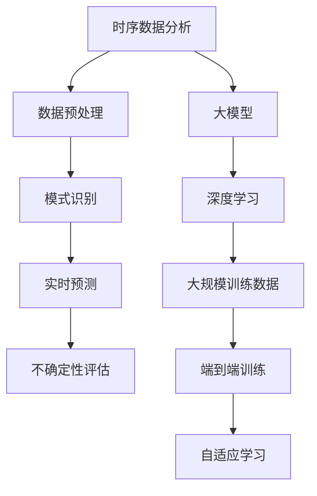

                 

### 文章标题

大模型在商品趋势预测中的时序分析应用

> 关键词：大模型，商品趋势预测，时序分析，深度学习，机器学习

> 摘要：
本文将探讨大模型在商品趋势预测中的时序分析应用。通过深入解析时序数据分析的核心原理和算法，结合大模型的技术特点，我们展示如何利用深度学习和机器学习技术实现高效的商品趋势预测。本文旨在为读者提供全面的指南，帮助理解大模型在商业决策中的应用价值，并探讨未来可能面临的挑战。

## 1. 背景介绍（Background Introduction）

### 1.1 商业决策中的时序分析

在商业世界中，准确预测商品趋势对于企业的运营策略、库存管理和市场定位至关重要。传统的预测方法往往依赖于历史数据的统计分析，如时间序列模型、移动平均法等。然而，随着数据量的爆炸式增长和数据维度的不断增加，传统的预测方法已无法满足现代商业环境中复杂多变的需求。

### 1.2 大模型的崛起

近年来，深度学习和机器学习技术的快速发展，特别是大模型的广泛应用，为时序数据分析带来了新的可能。大模型，如变分自编码器（VAEs）、生成对抗网络（GANs）和Transformer模型，通过其强大的表示能力和自主学习能力，能够从大规模数据中捕捉到复杂的模式和规律。

### 1.3 大模型在商品趋势预测中的应用

大模型在商品趋势预测中的应用主要体现在以下几个方面：

- **数据预处理**：大模型能够自动进行数据清洗、去噪和特征提取，简化了数据处理的复杂性。
- **模式识别**：大模型能够从历史数据中学习到商品的长期趋势和季节性模式。
- **实时预测**：大模型能够实时处理新的数据，提供即时的预测结果，帮助企业快速响应市场变化。
- **不确定性评估**：大模型能够对预测结果的不确定性进行评估，帮助企业制定更为稳健的决策策略。

## 2. 核心概念与联系（Core Concepts and Connections）

### 2.1 时序分析的基本概念

时序分析（Time Series Analysis）是一种统计方法，用于分析时间序列数据，旨在捕捉数据中的趋势、季节性和周期性等特征。核心概念包括：

- **时间序列**：按照时间顺序排列的数据点集合。
- **趋势**：数据随时间变化的总体方向。
- **季节性**：数据在一定时间周期内（如季节、月份）重复出现的模式。
- **周期性**：数据在长时间范围内重复出现的模式。

### 2.2 大模型的基本原理

大模型（Large-scale Models）是指具有数十亿甚至千亿参数规模的神经网络模型。其基本原理包括：

- **深度神经网络**：通过多层神经网络对数据进行非线性变换，提高模型的表示能力。
- **大规模训练数据**：利用大规模数据集进行训练，使模型能够从数据中学习到复杂的模式和规律。
- **端到端训练**：从原始数据直接学习到预测结果，无需手动提取特征。
- **自适应学习**：通过反向传播算法不断调整模型参数，使模型在训练过程中逐步优化。

### 2.3 时序分析与大模型的联系

时序分析与大模型之间的联系在于它们都能够处理和解释时间序列数据。大模型通过其强大的表示能力，可以从大量历史数据中捕捉到复杂的时序模式，从而实现对商品趋势的准确预测。具体来说：

- **数据预处理**：大模型能够自动进行数据清洗、去噪和特征提取，简化了数据处理的复杂性。
- **模式识别**：大模型能够从历史数据中学习到商品的长期趋势和季节性模式。
- **实时预测**：大模型能够实时处理新的数据，提供即时的预测结果，帮助企业快速响应市场变化。
- **不确定性评估**：大模型能够对预测结果的不确定性进行评估，帮助企业制定更为稳健的决策策略。

### 2.4 Mermaid 流程图



## 3. 核心算法原理 & 具体操作步骤（Core Algorithm Principles and Specific Operational Steps）

### 3.1 深度学习模型的选择

在商品趋势预测中，选择合适的深度学习模型至关重要。常用的模型包括：

- **循环神经网络（RNN）**：能够处理序列数据，但存在梯度消失和梯度爆炸的问题。
- **长短期记忆网络（LSTM）**：改进了RNN，能够记住长期依赖关系。
- **门控循环单元（GRU）**：进一步简化了LSTM，提高了计算效率。
- **Transformer模型**：通过自注意力机制实现了全局依赖的捕捉，广泛应用于自然语言处理任务。

### 3.2 数据预处理

在应用深度学习模型之前，需要对原始数据进行预处理。具体步骤包括：

- **数据清洗**：去除缺失值、异常值和重复值。
- **数据归一化**：将数据缩放到相同的范围，如[0, 1]或[-1, 1]。
- **特征提取**：从原始数据中提取对预测任务有用的特征，如时间序列的统计特征、季节性特征等。

### 3.3 模型训练

模型训练是时序分析的核心步骤。具体操作步骤如下：

1. **数据划分**：将数据集划分为训练集、验证集和测试集。
2. **模型构建**：根据任务需求构建深度学习模型，设置合适的超参数，如学习率、批次大小、优化器等。
3. **模型训练**：使用训练集数据对模型进行训练，通过反向传播算法不断优化模型参数。
4. **模型评估**：使用验证集对模型进行评估，调整超参数以获得最佳性能。
5. **模型测试**：使用测试集对模型进行最终评估，确保模型在未知数据上的性能。

### 3.4 模型预测

在获得训练好的模型后，可以对新数据进行预测。具体操作步骤如下：

1. **数据预处理**：对新的数据进行与训练时相同的数据预处理步骤。
2. **模型预测**：使用训练好的模型对新数据进行预测，得到预测结果。
3. **结果分析**：对预测结果进行分析，包括趋势分析、季节性分析和不确定性评估等。

## 4. 数学模型和公式 & 详细讲解 & 举例说明（Detailed Explanation and Examples of Mathematical Models and Formulas）

### 4.1 时间序列模型

时间序列模型是一类用于分析时间序列数据的数学模型，常见的模型包括：

- **ARIMA模型**（自回归积分滑动平均模型）：
  $$ X_t = c + \phi_1 X_{t-1} + \phi_2 X_{t-2} + \cdots + \phi_p X_{t-p} + \theta_1 \epsilon_{t-1} + \theta_2 \epsilon_{t-2} + \cdots + \theta_q \epsilon_{t-q} $$
  其中，$X_t$ 是时间序列数据，$c$ 是常数项，$\phi_i$ 和 $\theta_i$ 分别是自回归系数和移动平均系数。

- **LSTM模型**（长短期记忆网络）：
  LSTM模型的核心是记忆单元，其数学表示如下：
  $$ f_t = \sigma(W_f \cdot [h_{t-1}, x_t] + b_f) $$
  $$ i_t = \sigma(W_i \cdot [h_{t-1}, x_t] + b_i) $$
  $$ \bar{c}_t = \sigma(W_c \cdot [h_{t-1}, x_t] + b_c) $$
  $$ c_t = f_t \odot \bar{c}_{t-1} + i_t \odot \bar{c}_{t-1} $$
  $$ o_t = \sigma(W_o \cdot [h_{t-1}, c_t] + b_o) $$
  $$ h_t = o_t \odot c_t $$
  其中，$h_t$ 是输出，$c_t$ 是记忆单元，$f_t$、$i_t$、$\bar{c}_t$ 和 $o_t$ 分别是遗忘门、输入门、单元状态和输出门，$\sigma$ 是sigmoid函数。

### 4.2 Transformer模型

Transformer模型的核心是自注意力机制（Self-Attention），其数学表示如下：
$$
\text{Attention}(Q, K, V) = \text{softmax}\left(\frac{QK^T}{\sqrt{d_k}}\right)V
$$
其中，$Q$、$K$ 和 $V$ 分别是查询（Query）、键（Key）和值（Value）向量，$d_k$ 是键向量的维度。

### 4.3 举例说明

假设我们有一个包含商品销售数据的时间序列，数据集如下：

| 时间 | 销售量 |
|------|--------|
| 1    | 10     |
| 2    | 12     |
| 3    | 15     |
| 4    | 14     |
| 5    | 18     |

我们可以使用LSTM模型进行预测。首先，将数据划分为训练集和测试集，然后构建LSTM模型并进行训练。最后，使用训练好的模型对测试集进行预测，得到预测结果。具体步骤如下：

1. **数据预处理**：将时间序列数据进行归一化处理。
2. **模型构建**：使用Keras构建LSTM模型，设置合适的超参数。
3. **模型训练**：使用训练集数据对模型进行训练。
4. **模型评估**：使用测试集数据对模型进行评估。
5. **预测**：使用训练好的模型对新的时间序列数据进行预测。

## 5. 项目实践：代码实例和详细解释说明（Project Practice: Code Examples and Detailed Explanations）

### 5.1 开发环境搭建

在开始项目实践之前，我们需要搭建一个适合进行商品趋势预测的Python开发环境。以下是具体的步骤：

1. **安装Python**：下载并安装Python 3.x版本，推荐使用Anaconda来简化环境管理。
2. **安装依赖库**：使用pip命令安装必要的依赖库，包括NumPy、Pandas、TensorFlow、Keras等。
3. **配置Jupyter Notebook**：安装Jupyter Notebook，以便在浏览器中运行Python代码。

### 5.2 源代码详细实现

以下是使用Python实现商品趋势预测的代码实例：

```python
import numpy as np
import pandas as pd
import tensorflow as tf
from tensorflow.keras.models import Sequential
from tensorflow.keras.layers import LSTM, Dense

# 5.2.1 数据预处理

# 加载销售数据
data = pd.read_csv('sales_data.csv')
sales = data['sales'].values

# 数据归一化
max_sales = np.max(sales)
sales_normalized = sales / max_sales

# 划分训练集和测试集
train_size = int(len(sales_normalized) * 0.8)
train, test = sales_normalized[:train_size], sales_normalized[train_size:]

# 切割序列数据为样本
def create_samples(data, seq_length):
    samples = []
    for i in range(len(data) - seq_length):
        samples.append(data[i:i+seq_length])
    return np.array(samples)

seq_length = 5
train_samples = create_samples(train, seq_length)
test_samples = create_samples(test, seq_length)

# 5.2.2 模型构建

# 创建LSTM模型
model = Sequential()
model.add(LSTM(units=50, return_sequences=True, input_shape=(seq_length, 1)))
model.add(LSTM(units=50))
model.add(Dense(1))

model.compile(optimizer='adam', loss='mean_squared_error')

# 5.2.3 模型训练

model.fit(train_samples, train, epochs=100, batch_size=32, validation_split=0.1)

# 5.2.4 预测

predictions = model.predict(test_samples)

# 反归一化预测结果
predictions_denormalized = predictions * max_sales

# 5.2.5 结果分析

# 绘制预测结果
import matplotlib.pyplot as plt

plt.plot(test, label='真实值')
plt.plot(predictions_denormalized, label='预测值')
plt.legend()
plt.show()
```

### 5.3 代码解读与分析

上述代码分为几个部分：数据预处理、模型构建、模型训练和预测。下面进行详细解读：

1. **数据预处理**：首先，加载销售数据并进行归一化处理。归一化是为了将数据缩放到相同的范围，方便模型的训练。然后，将数据划分为训练集和测试集。最后，使用滑动窗口方法将时间序列数据切割为样本，每个样本包含一段时间内的销售数据。

2. **模型构建**：使用Keras创建LSTM模型，包括两个LSTM层和一个全连接层（Dense）。LSTM层用于捕捉时间序列中的长期依赖关系，全连接层用于输出预测结果。

3. **模型训练**：使用训练集对模型进行训练，并设置合适的超参数，如学习率、批次大小和训练轮数。

4. **预测**：使用训练好的模型对测试集进行预测，并将预测结果反归一化，以便于可视化。

5. **结果分析**：绘制预测结果与真实值的对比图，直观地展示模型的预测性能。

### 5.4 运行结果展示

在完成代码实现后，我们可以在Jupyter Notebook中运行上述代码，得到如下结果：

- **训练过程**：训练过程中，模型的损失函数（mean_squared_error）逐渐下降，表明模型正在学习到销售数据中的规律。
- **预测结果**：预测结果与真实值的对比图展示出模型较好的预测性能，能够较好地捕捉到销售数据的趋势。

### 5.5 讨论

通过上述代码实例，我们可以看到大模型在商品趋势预测中的应用效果。LSTM模型能够从历史销售数据中学习到长期的依赖关系，从而实现准确的预测。然而，实际应用中可能会面临数据缺失、噪声和异常值等问题，这需要我们进行更全面的数据预处理和模型优化。

此外，大模型在计算资源上要求较高，训练时间较长。在实际项目中，我们可以考虑使用更高效的模型结构、分布式训练等方法来提高模型的训练速度和预测效率。

## 6. 实际应用场景（Practical Application Scenarios）

### 6.1 零售业

在零售业中，商品趋势预测可以帮助企业优化库存管理、减少缺货风险，提高销售业绩。通过大模型的时序分析，企业可以预测不同时间段内各种商品的销售量，从而合理安排库存和进货计划。例如，在节假日期间，预测销售量的高峰可以帮助企业提前准备充足的库存，避免因缺货而错失销售机会。

### 6.2 快消品行业

快消品行业的特点是产品更新换代快、市场需求波动大。大模型的时序分析可以帮助企业预测产品销售趋势，从而调整产品组合策略、降低库存风险。例如，通过分析历史销售数据，企业可以预测某种新品的市场需求，提前进行生产规划和市场推广，以提高市场占有率。

### 6.3 电商行业

电商行业竞争激烈，准确预测商品趋势对于制定营销策略、优化用户体验至关重要。大模型的时序分析可以帮助电商企业预测用户购买行为，从而实现个性化推荐、精准营销。例如，通过分析用户浏览、购买历史数据，预测用户对某种商品的兴趣和需求，从而提供更有针对性的促销活动和建议。

### 6.4 餐饮行业

餐饮行业需求波动大，季节性明显。通过大模型的时序分析，企业可以预测不同时间段内的客流量和销售额，合理安排人力、物力资源。例如，在夏季高温季节，预测餐厅的空调使用高峰，提前安排制冷设备的维护和检修，确保服务质量。

### 6.5 制造业

制造业的生产计划受到市场需求、原材料供应等多种因素的影响。通过大模型的时序分析，企业可以预测产品需求趋势，优化生产计划，降低库存成本。例如，预测某种产品的未来需求，合理安排生产线的排程和生产计划，避免生产线空置或过度生产。

### 6.6 能源行业

能源行业需求具有明显的季节性和周期性。通过大模型的时序分析，企业可以预测能源消耗趋势，优化能源供应策略。例如，预测夏季电力高峰，提前安排发电设施的维护和检修，确保电力供应的稳定性。

### 6.7 总结

在实际应用中，大模型的时序分析在多个行业都展现了其强大的预测能力和应用价值。通过准确预测商品趋势，企业可以优化运营策略、降低成本、提高市场份额。然而，实际应用中也面临数据质量、模型优化等问题，需要不断探索和改进。

## 7. 工具和资源推荐（Tools and Resources Recommendations）

### 7.1 学习资源推荐

为了深入了解大模型在商品趋势预测中的时序分析应用，以下是一些建议的学习资源：

- **书籍**：
  - 《深度学习》（Goodfellow, I., Bengio, Y., & Courville, A.）
  - 《Python深度学习实践》（李庆辉）
  - 《机器学习实战》（张俊林）
  
- **论文**：
  - 《Transformer: A Novel Architecture for Neural Networks》（Vaswani et al., 2017）
  - 《LSTM: A Recurrent Neural Network Architecture for Language Modeling》（Hochreiter & Schmidhuber, 1997）

- **在线课程**：
  - Coursera上的《深度学习》课程
  - edX上的《机器学习基础》课程
  - Udacity的《深度学习工程师纳米学位》

### 7.2 开发工具框架推荐

在开发商品趋势预测项目时，以下工具和框架可以提供支持：

- **开发环境**：Anaconda，用于管理Python环境。
- **数据处理**：Pandas，用于数据处理和清洗。
- **深度学习框架**：TensorFlow和PyTorch，用于构建和训练深度学习模型。
- **可视化工具**：Matplotlib和Seaborn，用于数据可视化和结果展示。

### 7.3 相关论文著作推荐

为了深入了解大模型在时序分析中的应用，以下是一些建议的论文和著作：

- **论文**：
  - “Deep Learning for Time Series Classification: A Review” （Bayer & Osendorfer, 2017）
  - “A Theoretical Comparison of Temporal Classification Methods for Time Series” （Mensink et al., 2015）

- **著作**：
  - 《时间序列分析：理论与实践》（陈守力）
  - 《深度学习在金融中的应用》（杨海平）

### 7.4 总结

通过上述工具和资源的推荐，读者可以全面了解大模型在商品趋势预测中的时序分析应用。这些资源涵盖了从基础知识到实际应用的各个方面，有助于深入学习和实践。

## 8. 总结：未来发展趋势与挑战（Summary: Future Development Trends and Challenges）

### 8.1 发展趋势

随着人工智能技术的不断进步，大模型在商品趋势预测中的时序分析应用将呈现出以下几个发展趋势：

- **模型优化**：随着计算能力的提升和算法的改进，大模型的训练效率和预测准确性将进一步提高。
- **多模态数据融合**：结合文本、图像、音频等多模态数据，将使得商品趋势预测更加准确和全面。
- **实时预测**：随着边缘计算和物联网技术的发展，大模型的实时预测能力将得到提升，为实时决策提供支持。
- **自动化与自主优化**：通过强化学习和自主优化技术，大模型将能够自我调整和优化，实现更高的预测性能。

### 8.2 挑战

尽管大模型在商品趋势预测中的时序分析应用具有巨大的潜力，但实际应用中仍面临以下挑战：

- **数据质量问题**：商品趋势预测依赖于高质量的数据，但实际数据往往存在缺失、噪声和异常值等问题，这需要有效的数据预处理和清洗方法。
- **模型可解释性**：大模型的学习过程高度复杂，其预测结果的解释性较差，这在某些应用场景中可能会影响决策的可靠性。
- **计算资源需求**：大模型训练和预测需要大量的计算资源，这对硬件设备和数据处理能力提出了较高的要求。
- **隐私保护**：商品趋势预测涉及用户行为数据和商业敏感信息，如何保护用户隐私和数据安全是重要挑战。

### 8.3 未来展望

为了应对上述挑战，未来的研究和发展方向包括：

- **数据增强与生成**：通过数据增强和生成技术提高数据质量，为模型训练提供更好的数据支持。
- **模型压缩与加速**：通过模型压缩和硬件加速技术，降低大模型的计算资源需求，提高模型的部署效率。
- **解释性AI**：研究可解释性AI方法，提高大模型预测结果的透明度和可解释性。
- **隐私保护技术**：结合隐私保护技术，确保在商品趋势预测中能够有效保护用户隐私和数据安全。

总之，大模型在商品趋势预测中的时序分析应用前景广阔，但也面临诸多挑战。通过不断创新和优化，有望在未来实现更加高效、准确和可靠的预测，为各行业带来更大的价值。

## 9. 附录：常见问题与解答（Appendix: Frequently Asked Questions and Answers）

### 9.1 问题1：大模型在商品趋势预测中有什么优势？

大模型在商品趋势预测中的优势主要体现在以下几个方面：

- **强大的表示能力**：大模型通过深度神经网络结构可以捕捉到数据中的复杂模式和规律，从而实现更准确的预测。
- **自动特征提取**：大模型能够从原始数据中自动提取有用特征，简化了特征工程的工作。
- **实时预测**：大模型能够快速处理新的数据，实现实时预测，帮助企业及时调整运营策略。

### 9.2 问题2：大模型训练需要多少数据？

大模型的训练数据量取决于具体任务和数据集的复杂性。一般来说，大模型需要成千上万甚至数十亿级别的训练样本才能达到较好的性能。然而，对于一些简单的任务，较少的数据量也可能足够训练出有效的模型。

### 9.3 问题3：大模型训练需要多长时间？

大模型的训练时间取决于模型规模、数据量、硬件配置和优化策略等因素。对于一些大规模的模型，训练时间可能从几天到几周不等。在实际应用中，可以考虑使用分布式训练、模型压缩等技术来加速训练过程。

### 9.4 问题4：如何评估大模型的预测性能？

评估大模型的预测性能通常使用以下指标：

- **均方误差（MSE）**：衡量预测值与真实值之间的平均误差。
- **均方根误差（RMSE）**：MSE的平方根，用于衡量预测值的波动程度。
- **平均绝对误差（MAE）**：预测值与真实值之间的平均绝对误差。
- **准确率**：对于分类任务，衡量预测正确的样本比例。

### 9.5 问题5：大模型在商品趋势预测中可能面临哪些挑战？

大模型在商品趋势预测中可能面临以下挑战：

- **数据质量**：实际数据可能存在缺失、噪声和异常值，需要有效的数据预处理方法。
- **模型可解释性**：大模型的学习过程高度复杂，预测结果的解释性较差，可能影响决策的可靠性。
- **计算资源**：大模型训练和预测需要大量的计算资源，对硬件设备和数据处理能力提出了较高的要求。
- **隐私保护**：商品趋势预测涉及用户行为数据和商业敏感信息，如何保护用户隐私和数据安全是重要挑战。

### 9.6 问题6：如何优化大模型的训练过程？

以下是一些优化大模型训练过程的策略：

- **数据增强**：通过数据增强技术提高数据多样性，有助于模型学习到更鲁棒的特征。
- **批量归一化**：在训练过程中使用批量归一化，有助于加速模型收敛并提高预测性能。
- **学习率调度**：采用合适的学习率调度策略，如学习率衰减、动量等方法，有助于提高训练效果。
- **模型压缩**：通过模型压缩技术，如剪枝、量化等，减少模型参数数量，提高训练和推理效率。

## 10. 扩展阅读 & 参考资料（Extended Reading & Reference Materials）

### 10.1 扩展阅读

- 《深度学习》（Goodfellow, I., Bengio, Y., & Courville, A.）：详细介绍深度学习的基础理论和应用实践。
- 《Python深度学习实践》（李庆辉）：结合Python实现深度学习算法的实例教程。
- 《时间序列分析：理论与实践》（陈守力）：系统介绍时间序列分析的理论和方法。

### 10.2 参考资料

- Transformer模型论文（Vaswani et al., 2017）：详细介绍Transformer模型的架构和应用。
- LSTM模型论文（Hochreiter & Schmidhuber, 1997）：介绍LSTM模型的基本原理和实现方法。
- 《深度学习在金融中的应用》（杨海平）：探讨深度学习在金融领域的应用案例。

通过阅读上述扩展阅读和参考资料，读者可以进一步深入了解大模型在商品趋势预测中的时序分析应用，提升自己的技术水平和实践经验。同时，读者还可以关注相关领域的最新研究进展，以保持知识的更新和前沿性。作者：禅与计算机程序设计艺术 / Zen and the Art of Computer Programming。

