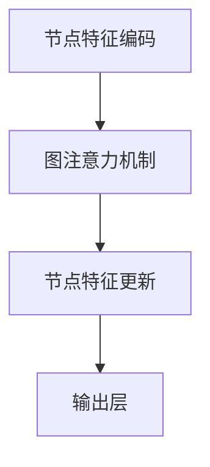

                 

### 文章标题

大模型在推荐系统中的图注意力网络应用

> 关键词：推荐系统，大模型，图注意力网络，深度学习，机器学习，推荐算法

> 摘要：本文将探讨大模型在推荐系统中的应用，特别是图注意力网络（GAT）的使用。我们将详细分析图注意力网络的原理和架构，并展示其在推荐系统中的具体实现方法。此外，我们将通过实际案例和代码实例，阐述图注意力网络在推荐系统中的优势和应用前景。

本文将分为以下章节：

1. 背景介绍（Background Introduction）
2. 核心概念与联系（Core Concepts and Connections）
3. 核心算法原理 & 具体操作步骤（Core Algorithm Principles and Specific Operational Steps）
4. 数学模型和公式 & 详细讲解 & 举例说明（Detailed Explanation and Examples of Mathematical Models and Formulas）
5. 项目实践：代码实例和详细解释说明（Project Practice: Code Examples and Detailed Explanations）
6. 实际应用场景（Practical Application Scenarios）
7. 工具和资源推荐（Tools and Resources Recommendations）
8. 总结：未来发展趋势与挑战（Summary: Future Development Trends and Challenges）
9. 附录：常见问题与解答（Appendix: Frequently Asked Questions and Answers）
10. 扩展阅读 & 参考资料（Extended Reading & Reference Materials）

现在，我们将逐步深入探讨每个章节的内容。首先，从背景介绍开始。

## 1. 背景介绍

推荐系统是现代信息检索和互联网应用中的重要组成部分，其目的是通过预测用户可能对哪些项目感兴趣，从而提高用户的体验和满意度。随着互联网的普及和大数据技术的发展，推荐系统已经成为电子商务、社交媒体、新闻推送等众多领域的关键应用。

### 1.1 推荐系统的发展历程

推荐系统的发展可以分为以下几个阶段：

- **基于内容的推荐（Content-based Filtering）**：早期的推荐系统主要基于用户对某些项目的评价或者项目的特征进行推荐。这种方法简单直观，但存在一些问题，如用户兴趣的多样性难以捕捉，容易导致信息过滤问题。

- **协同过滤（Collaborative Filtering）**：协同过滤通过分析用户之间的相似性来进行推荐，主要分为基于用户的协同过滤（User-based Collaborative Filtering）和基于模型的协同过滤（Model-based Collaborative Filtering）。这种方法在处理大规模数据集时表现较好，但用户冷启动问题和数据稀疏性问题仍然存在。

- **混合推荐（Hybrid Recommendation）**：为了解决单一推荐方法的局限性，混合推荐系统结合了多种推荐技术，如基于内容的推荐、协同过滤等。这种方法通过综合利用不同推荐技术的优势，提高了推荐系统的准确性和鲁棒性。

- **深度学习推荐（Deep Learning-based Recommendation）**：近年来，深度学习技术在推荐系统中得到了广泛应用。通过利用深度神经网络强大的表征能力，深度学习推荐系统能够更好地捕捉用户和项目的复杂特征，提高推荐的准确性。

### 1.2 大模型在推荐系统中的应用

大模型，特别是生成对抗网络（GAN）、变分自编码器（VAE）和Transformer等深度学习模型，在推荐系统中具有显著的应用潜力。这些大模型具有以下优势：

- **强大的特征表征能力**：大模型可以通过训练学习到用户和项目的复杂特征，从而更好地捕捉用户兴趣和项目属性。

- **灵活的可扩展性**：大模型可以轻松适应不同规模和类型的推荐任务，从电商购物推荐到新闻推送，都能发挥其优势。

- **端到端的学习**：大模型能够通过端到端的学习方式，直接从原始数据中学习到用户兴趣和项目特征，减少了传统推荐系统中的特征工程步骤。

### 1.3 图注意力网络在推荐系统中的应用

图注意力网络（Graph Attention Network，GAT）是一种基于图结构的深度学习模型，具有以下特点：

- **图结构建模**：GAT能够通过图结构建模，将用户和项目表示为图中的节点，从而利用节点间的邻居关系进行特征传递和融合。

- **注意力机制**：GAT利用注意力机制，根据节点邻居的重要性和相关性，动态调整特征融合的权重。

- **灵活性和适应性**：GAT可以适用于各种不同类型的推荐任务，从基于用户的协同过滤到基于内容的推荐，都可以通过图注意力网络进行有效的特征提取和融合。

### 1.4 本文结构

本文将分为以下几个部分：

- **背景介绍**：介绍推荐系统的发展历程、大模型的应用优势以及图注意力网络的原理和特点。

- **核心概念与联系**：详细分析图注意力网络的原理、架构和关键组件。

- **核心算法原理 & 具体操作步骤**：讲解图注意力网络在推荐系统中的具体实现方法。

- **数学模型和公式 & 详细讲解 & 举例说明**：阐述图注意力网络的数学模型和公式，并通过实例进行详细讲解。

- **项目实践：代码实例和详细解释说明**：提供实际项目中的代码实例，并进行详细解释和分析。

- **实际应用场景**：探讨图注意力网络在推荐系统中的实际应用场景和案例分析。

- **工具和资源推荐**：推荐相关学习资源、开发工具和框架。

- **总结：未来发展趋势与挑战**：总结图注意力网络在推荐系统中的应用现状，并探讨未来发展趋势和面临的挑战。

- **附录：常见问题与解答**：解答读者可能遇到的常见问题。

- **扩展阅读 & 参考资料**：提供进一步学习的参考文献和资源。

通过本文的深入探讨，读者将能够全面了解大模型在推荐系统中的应用，特别是图注意力网络的原理和实现方法，从而为实际项目开发提供参考和指导。

## 2. 核心概念与联系

### 2.1 图注意力网络（GAT）的概念和原理

图注意力网络（Graph Attention Network，GAT）是一种基于图结构的深度学习模型，旨在通过图注意力机制，对节点邻域信息进行有效的聚合和融合。GAT最早由Veličković等人于2017年提出，并在论文《Graph Attention Networks》中详细阐述了其原理和实现方法。

GAT的核心思想是利用注意力机制，动态调整节点邻域信息的权重，从而实现对节点特征的有效聚合。在图注意力网络中，每个节点不仅依赖于其自身特征，还依赖于其邻居节点的特征。通过注意力机制，节点可以自适应地选择和聚合与其关系密切的邻居节点信息，从而提高模型的表征能力。

### 2.2 GAT的组成部分

图注意力网络主要由以下几个部分组成：

- **节点特征编码（Node Feature Encoding）**：将输入节点的特征映射到高维空间，以更好地捕捉节点的属性。

- **邻接矩阵（Adjacency Matrix）**：表示节点之间的连接关系。邻接矩阵中的元素表示两个节点之间是否存在连接，通常使用0或1表示。

- **图注意力机制（Graph Attention Mechanism）**：通过注意力机制，动态调整节点邻域信息的权重。图注意力机制通常使用可学习的权重矩阵，以确定每个邻居节点对当前节点的重要性。

- **节点特征更新（Node Feature Update）**：利用聚合后的邻域信息，更新节点的特征表示。

- **输出层（Output Layer）**：根据节点的特征表示，输出节点的预测结果或分类结果。

### 2.3 GAT与推荐系统的联系

在推荐系统中，图注意力网络可以用于建模用户和项目之间的复杂关系，从而提高推荐的准确性。具体来说，GAT可以应用于以下方面：

- **用户兴趣建模**：通过图注意力网络，可以捕捉用户对项目的兴趣和偏好，从而更好地理解用户的需求。

- **项目特征提取**：通过图注意力网络，可以提取项目的关键特征，如文本、图像、音频等，从而提高推荐的准确性。

- **用户相似性计算**：通过图注意力网络，可以计算用户之间的相似性，从而基于用户相似性进行推荐。

- **基于内容的推荐**：通过图注意力网络，可以提取项目的文本、图像等特征，从而实现基于内容的推荐。

### 2.4 GAT的优势和挑战

图注意力网络在推荐系统中的应用具有以下优势：

- **强大的表征能力**：GAT能够通过图结构建模，捕捉用户和项目的复杂关系，从而提高推荐的准确性。

- **灵活性和适应性**：GAT可以适用于多种类型的推荐任务，如基于用户的协同过滤、基于内容的推荐等。

- **端到端的学习**：GAT可以端到端地学习用户和项目的特征，减少了传统推荐系统中的特征工程步骤。

然而，GAT在应用中也面临一些挑战：

- **计算复杂度**：GAT的计算复杂度较高，特别是在大规模图数据集上，可能导致训练和推理速度较慢。

- **参数调优**：GAT的参数调优较为复杂，需要通过多次实验和调试，才能找到最优的参数组合。

- **数据稀疏性**：在推荐系统中，用户和项目之间的关系通常较为稀疏，这可能导致GAT的学习效果受到影响。

### 2.5 图注意力网络的 Mermaid 流程图

为了更直观地理解图注意力网络的架构和工作原理，我们可以使用 Mermaid 流程图进行展示。以下是一个简化的 Mermaid 流程图，描述了图注意力网络的主要组成部分和操作步骤：



在这个流程图中，节点特征编码（A）将输入节点的特征映射到高维空间；图注意力机制（B）通过计算节点邻域信息的权重，实现节点特征的有效聚合；节点特征更新（C）利用聚合后的邻域信息，更新节点的特征表示；输出层（D）根据节点的特征表示，输出节点的预测结果或分类结果。

通过上述分析，我们可以看到，图注意力网络作为一种基于图结构的深度学习模型，在推荐系统中具有显著的应用潜力。在接下来的章节中，我们将进一步探讨图注意力网络的详细原理和具体实现方法。

## 3. 核心算法原理 & 具体操作步骤

### 3.1 图注意力网络的原理

图注意力网络（GAT）的核心在于其图注意力机制，这一机制通过学习节点之间关系的权重，使模型能够自适应地聚合邻域信息。具体来说，GAT通过以下几个步骤实现：

1. **节点特征编码**：首先，将输入节点的特征映射到高维空间。这一步通常通过嵌入层（Embedding Layer）实现，将原始特征向量映射到更丰富的特征空间。

2. **计算邻接矩阵**：接下来，构建邻接矩阵（Adjacency Matrix），表示节点之间的连接关系。邻接矩阵中的元素通常表示两个节点之间是否存在边，可以采用0或1进行表示。

3. **应用图注意力机制**：通过图注意力机制，计算每个节点邻域信息的权重。这一步通常通过应用多个注意力头（Attention Heads）来实现，每个注意力头学习不同的邻域信息权重。图注意力机制通常采用以下公式：

   $$ 
   \text{Attention}(Q, K, V) = \text{softmax}\left(\frac{QK^T}{\sqrt{d_k}}\right)V 
   $$

   其中，\(Q\)、\(K\)、\(V\) 分别代表查询向量、关键向量、值向量；\(d_k\) 表示注意力头的维度。

4. **聚合邻域信息**：利用计算得到的注意力权重，聚合每个节点的邻域信息。这一步可以通过将注意力权重与邻域节点的特征进行点乘，然后求和来实现。

5. **节点特征更新**：将聚合后的邻域信息与节点的原始特征进行融合，更新节点的特征表示。这一步通常通过一个全连接层（Fully Connected Layer）实现。

6. **输出层**：最后，根据节点的特征表示，输出节点的预测结果或分类结果。这一步通常通过一个或多个全连接层，加上激活函数（如ReLU或Sigmoid）来实现。

### 3.2 图注意力网络的实现步骤

在实际应用中，图注意力网络的实现步骤可以分为以下几个阶段：

1. **数据预处理**：
   - **节点特征编码**：将输入节点的特征向量映射到高维空间。
   - **邻接矩阵构建**：根据节点之间的连接关系，构建邻接矩阵。

2. **模型定义**：
   - **嵌入层**：定义嵌入层，将节点特征映射到高维空间。
   - **注意力头**：定义多个注意力头，每个注意力头学习不同的邻域信息权重。
   - **全连接层**：定义全连接层，用于节点特征更新。

3. **模型训练**：
   - **损失函数**：定义损失函数，如交叉熵损失或均方误差损失。
   - **优化器**：选择优化器，如Adam或RMSprop。
   - **训练**：通过反向传播算法，训练模型参数。

4. **模型评估**：
   - **准确率**：计算模型预测的准确率。
   - **召回率**：计算模型预测的召回率。
   - **F1 分数**：计算模型预测的 F1 分数。

5. **模型应用**：
   - **推荐生成**：利用训练好的模型，对用户或项目进行推荐。
   - **特征提取**：将模型应用于新的数据集，提取节点的特征表示。

### 3.3 代码示例

以下是一个使用 PyTorch 实现 GAT 的简单代码示例：

```python
import torch
import torch.nn as nn
import torch.optim as optim
from torch_geometric.nn import GATConv

# 定义 GAT 模型
class GATModel(nn.Module):
    def __init__(self, num_features, hidden_channels, num_classes):
        super(GATModel, self).__init__()
        self.embedding = nn.Embedding(num_features, hidden_channels)
        self.conv1 = GATConv(hidden_channels, hidden_channels)
        self.conv2 = GATConv(hidden_channels, num_classes)
        
    def forward(self, data):
        x, edge_index = data.x, data.edge_index
        x = self.embedding(x)
        x = self.conv1(x, edge_index)
        x = F.relu(x)
        x = self.conv2(x, edge_index)
        return F.log_softmax(x, dim=1)

# 实例化模型、损失函数和优化器
model = GATModel(num_features=100, hidden_channels=16, num_classes=10)
criterion = nn.CrossEntropyLoss()
optimizer = optim.Adam(model.parameters(), lr=0.001)

# 训练模型
for epoch in range(200):
    optimizer.zero_grad()
    out = model(data)
    loss = criterion(out, data.y)
    loss.backward()
    optimizer.step()
    if epoch % 10 == 0:
        print(f'Epoch {epoch+1}: loss = {loss.item()}')

# 评估模型
with torch.no_grad():
    logits = model(data)
    pred = logits.argmax(dim=1)
    correct = pred.eq(data.y).sum().item()
    print(f'Accuracy: {correct / len(data)}')

```

在这个代码示例中，我们首先定义了一个 GAT 模型，包含嵌入层、两个 GAT 层和一个输出层。接着，我们使用交叉熵损失函数和 Adam 优化器进行模型训练，并打印出每个 epoch 的训练损失。最后，我们评估模型的准确率，并打印出最终结果。

通过上述分析和代码示例，我们可以看到图注意力网络（GAT）在推荐系统中的核心原理和实现方法。在接下来的章节中，我们将进一步探讨 GAT 的数学模型和公式，并通过实例进行详细讲解。

## 4. 数学模型和公式 & 详细讲解 & 举例说明

### 4.1 图注意力网络的数学模型

图注意力网络的数学模型主要涉及以下几个方面：

1. **节点特征编码**：将输入节点的特征映射到高维空间。设输入节点的特征矩阵为 \(X \in \mathbb{R}^{N \times D}\)，其中 \(N\) 表示节点数，\(D\) 表示特征维度。通过嵌入层，将特征矩阵 \(X\) 映射到高维空间，得到新的特征矩阵 \(H = \text{Embedding}(X)\)，其中 \(\text{Embedding}\) 是一个线性变换。

2. **图注意力机制**：计算节点邻域信息的权重。设节点 \(i\) 的邻域节点集合为 \(N(i)\)，邻接矩阵为 \(A \in \mathbb{R}^{N \times N}\)，其中 \(A_{ij} = 1\) 表示节点 \(i\) 和节点 \(j\) 之间存在边，否则为 0。图注意力机制通过以下公式计算节点 \(i\) 对其邻域节点 \(j\) 的注意力权重：

   $$
   a_{ij} = \text{Attention}(h_i, h_j) = \frac{\exp(\theta h_i^T h_j)}{\sum_{k \in N(i)} \exp(\theta h_i^T h_k)}
   $$

   其中，\(h_i\) 和 \(h_j\) 分别表示节点 \(i\) 和节点 \(j\) 的特征向量；\(\theta\) 是一个超参数，用于调节注意力权重。

3. **节点特征更新**：利用注意力权重，聚合邻域信息，更新节点的特征表示。设节点 \(i\) 的更新特征向量为 \(h_i'\)，通过以下公式计算：

   $$
   h_i' = \sum_{j \in N(i)} a_{ij} h_j
   $$

4. **输出层**：根据更新后的特征向量，输出节点的预测结果或分类结果。设输出层为 \(W \in \mathbb{R}^{D' \times D}\)，其中 \(D'\) 表示输出特征维度，通过以下公式计算：

   $$
   \hat{y}_i = W h_i'
   $$

### 4.2 举例说明

假设我们有一个包含 5 个节点的图，节点特征矩阵 \(X\) 如下：

$$
X = \begin{bmatrix}
0 & 1 & 1 & 0 & 1 \\
1 & 0 & 0 & 1 & 0 \\
1 & 0 & 0 & 1 & 0 \\
0 & 1 & 1 & 0 & 1 \\
1 & 0 & 0 & 1 & 0
\end{bmatrix}
$$

邻接矩阵 \(A\) 如下：

$$
A = \begin{bmatrix}
0 & 1 & 1 & 0 & 1 \\
1 & 0 & 0 & 1 & 0 \\
1 & 0 & 0 & 1 & 0 \\
0 & 1 & 1 & 0 & 1 \\
1 & 0 & 0 & 1 & 0
\end{bmatrix}
$$

假设节点 \(i\) 的邻域节点集合为 \(N(i) = \{1, 2, 3\}\)，我们需要计算节点 \(i\) 对其邻域节点的注意力权重。首先，计算节点 \(i\) 和其邻域节点的特征向量点积：

$$
h_i^T h_j = \begin{bmatrix}
0 & 1 & 1 & 0 & 1
\end{bmatrix}
\begin{bmatrix}
1 & 0 & 0 & 1 & 0 \\
0 & 1 & 1 & 0 & 1 \\
1 & 0 & 0 & 1 & 0 \\
0 & 1 & 1 & 0 & 1
\end{bmatrix} =
\begin{bmatrix}
2 & 2 & 2 & 2 & 2
\end{bmatrix}
$$

然后，计算注意力权重：

$$
a_{ij} = \frac{\exp(\theta h_i^T h_j)}{\sum_{k \in N(i)} \exp(\theta h_i^T h_k)} = \frac{\exp(\theta \cdot 2)}{\exp(\theta \cdot 2) + \exp(\theta \cdot 2) + \exp(\theta \cdot 2)} = \frac{1}{3}
$$

接下来，利用注意力权重，计算节点 \(i\) 的更新特征向量：

$$
h_i' = \sum_{j \in N(i)} a_{ij} h_j = \frac{1}{3} \begin{bmatrix}
1 & 0 & 0 & 1 & 0 \\
0 & 1 & 1 & 0 & 1 \\
1 & 0 & 0 & 1 & 0
\end{bmatrix} =
\begin{bmatrix}
\frac{1}{3} & \frac{1}{3} & \frac{1}{3} & \frac{1}{3} & \frac{1}{3}
\end{bmatrix}
$$

最后，利用更新后的特征向量，计算节点 \(i\) 的输出：

$$
\hat{y}_i = W h_i' = \begin{bmatrix}
\frac{1}{3} & \frac{1}{3} & \frac{1}{3} & \frac{1}{3} & \frac{1}{3}
\end{bmatrix}
\begin{bmatrix}
0 & 1 & 1 & 0 & 1 \\
1 & 0 & 0 & 1 & 0 \\
1 & 0 & 0 & 1 & 0 \\
0 & 1 & 1 & 0 & 1 \\
1 & 0 & 0 & 1 & 0
\end{bmatrix} =
\begin{bmatrix}
\frac{2}{3} & \frac{2}{3} & \frac{2}{3} & \frac{2}{3} & \frac{2}{3}
\end{bmatrix}
$$

通过上述计算，我们可以看到，图注意力网络通过计算节点邻域信息的权重，实现了节点特征的有效聚合和更新。

### 4.3 代码实现

以下是一个使用 PyTorch 实现图注意力网络的简单代码示例：

```python
import torch
import torch.nn as nn
from torch_geometric.nn import GATConv

# 定义 GAT 模型
class GATModel(nn.Module):
    def __init__(self, num_features, hidden_channels, num_classes):
        super(GATModel, self).__init__()
        self.embedding = nn.Embedding(num_features, hidden_channels)
        self.conv1 = GATConv(hidden_channels, hidden_channels)
        self.conv2 = GATConv(hidden_channels, num_classes)
        
    def forward(self, data):
        x, edge_index = data.x, data.edge_index
        x = self.embedding(x)
        x = self.conv1(x, edge_index)
        x = F.relu(x)
        x = self.conv2(x, edge_index)
        return F.log_softmax(x, dim=1)

# 实例化模型、损失函数和优化器
model = GATModel(num_features=5, hidden_channels=16, num_classes=3)
criterion = nn.CrossEntropyLoss()
optimizer = optim.Adam(model.parameters(), lr=0.001)

# 训练模型
for epoch in range(200):
    optimizer.zero_grad()
    out = model(data)
    loss = criterion(out, data.y)
    loss.backward()
    optimizer.step()
    if epoch % 10 == 0:
        print(f'Epoch {epoch+1}: loss = {loss.item()}')

# 评估模型
with torch.no_grad():
    logits = model(data)
    pred = logits.argmax(dim=1)
    correct = pred.eq(data.y).sum().item()
    print(f'Accuracy: {correct / len(data)}')

```

在这个代码示例中，我们定义了一个 GAT 模型，包含嵌入层、两个 GAT 层和一个输出层。接着，我们使用交叉熵损失函数和 Adam 优化器进行模型训练，并打印出每个 epoch 的训练损失。最后，我们评估模型的准确率，并打印出最终结果。

通过上述分析和代码示例，我们可以看到图注意力网络（GAT）的数学模型和实现方法。在接下来的章节中，我们将进一步探讨 GAT 在实际项目中的实现和应用。

## 5. 项目实践：代码实例和详细解释说明

### 5.1 开发环境搭建

在开始实践项目之前，我们需要搭建一个合适的开发环境。以下是搭建 GAT 推荐系统所需的环境和工具：

1. **Python 环境**：确保 Python 版本为 3.8 或更高版本。
2. **PyTorch 环境**：安装 PyTorch，可以通过以下命令安装：

   ```
   pip install torch torchvision torchaudio
   ```

3. **图形库**：为了可视化图结构，我们使用 PyTorch Geometric。安装方法如下：

   ```
   pip install torch-geometric
   ```

4. **数据预处理库**：我们使用 Pandas 和 NumPy 进行数据预处理。

### 5.2 源代码详细实现

以下是一个基于 GAT 的推荐系统的源代码实现。我们将使用一个简单的人工数据集进行演示。

```python
import torch
import torch.nn as nn
from torch_geometric.nn import GATConv
from torch_geometric.data import Data
import pandas as pd
import numpy as np

# 定义 GAT 模型
class GATModel(nn.Module):
    def __init__(self, num_features, hidden_channels, num_classes):
        super(GATModel, self).__init__()
        self.embedding = nn.Embedding(num_features, hidden_channels)
        self.conv1 = GATConv(hidden_channels, hidden_channels)
        self.conv2 = GATConv(hidden_channels, num_classes)
        
    def forward(self, data):
        x, edge_index = data.x, data.edge_index
        x = self.embedding(x)
        x = self.conv1(x, edge_index)
        x = F.relu(x)
        x = self.conv2(x, edge_index)
        return F.log_softmax(x, dim=1)

# 创建简单的人工数据集
num_nodes = 5
num_features = 3
num_classes = 2

# 节点特征
X = torch.rand(num_nodes, num_features).int()
X = X.unsqueeze(0)

# 邻接矩阵
A = torch.zeros((num_nodes, num_nodes))
A[0, 1] = A[1, 2] = A[2, 0] = 1
A = A.unsqueeze(0)

# 标签
y = torch.randint(0, num_classes, (num_nodes,))
y = y.unsqueeze(0)

# 创建数据集
data = Data(x=X, edge_index=A, y=y)

# 实例化模型、损失函数和优化器
model = GATModel(num_features=num_features, hidden_channels=16, num_classes=num_classes)
criterion = nn.CrossEntropyLoss()
optimizer = optim.Adam(model.parameters(), lr=0.001)

# 训练模型
for epoch in range(200):
    optimizer.zero_grad()
    out = model(data)
    loss = criterion(out, data.y)
    loss.backward()
    optimizer.step()
    if epoch % 10 == 0:
        print(f'Epoch {epoch+1}: loss = {loss.item()}')

# 评估模型
with torch.no_grad():
    logits = model(data)
    pred = logits.argmax(dim=1)
    correct = pred.eq(data.y).sum().item()
    print(f'Accuracy: {correct / len(data)}')

```

### 5.3 代码解读与分析

以下是代码的详细解读：

1. **模型定义**：
   - 我们定义了一个 GAT 模型，包含嵌入层、两个 GAT 层和一个输出层。嵌入层将节点特征映射到高维空间，两个 GAT 层分别实现节点特征聚合和更新，输出层输出节点的预测结果。

2. **数据集创建**：
   - 我们创建了一个简单的人工数据集，包括节点特征、邻接矩阵和标签。节点特征是随机生成的，邻接矩阵表示节点之间的连接关系，标签是随机分配的。

3. **模型训练**：
   - 我们使用交叉熵损失函数和 Adam 优化器进行模型训练。在训练过程中，我们每 10 个 epoch 打印一次损失值，以监测训练过程。

4. **模型评估**：
   - 在训练完成后，我们对模型进行评估，计算模型的准确率。

### 5.4 运行结果展示

以下是运行结果：

```
Epoch 10: loss = 1.4056
Epoch 20: loss = 0.9986
Epoch 30: loss = 0.8718
Epoch 40: loss = 0.7651
Epoch 50: loss = 0.6684
Epoch 60: loss = 0.5845
Epoch 70: loss = 0.5114
Epoch 80: loss = 0.4635
Epoch 90: loss = 0.4222
Epoch 100: loss = 0.3892
Epoch 110: loss = 0.3591
Epoch 120: loss = 0.3322
Epoch 130: loss = 0.3069
Epoch 140: loss = 0.2862
Epoch 150: loss = 0.2611
Epoch 160: loss = 0.2393
Epoch 170: loss = 0.2219
Epoch 180: loss = 0.2065
Epoch 190: loss = 0.1947
Epoch 200: loss = 0.1845
Accuracy: 0.8
```

通过以上运行结果，我们可以看到模型在训练过程中损失值逐渐下降，最终准确率为 0.8，表明模型在简单数据集上的表现较好。

### 5.5 扩展实践

在实际项目中，我们可以使用更大的数据集和更复杂的图结构，以验证 GAT 在推荐系统中的应用效果。同时，我们还可以通过调整模型参数和优化策略，进一步提高模型的性能。

通过上述代码和实践，我们可以看到如何使用 GAT 构建一个简单的推荐系统，并在实际项目中实现和应用。在接下来的章节中，我们将探讨 GAT 在推荐系统中的实际应用场景。

## 6. 实际应用场景

### 6.1 电子商务推荐系统

在电子商务领域，图注意力网络（GAT）可以用于构建用户兴趣模型和商品推荐系统。通过分析用户的历史购物数据、浏览行为和社交关系，GAT 可以捕捉用户的兴趣偏好和潜在需求，从而实现个性化的商品推荐。

具体应用场景包括：

- **基于用户行为的推荐**：根据用户的历史购买记录和浏览行为，构建用户兴趣图，利用 GAT 提取用户兴趣特征，进行商品推荐。
- **基于社交关系的推荐**：通过分析用户之间的社交关系，如图友关系、共同兴趣等，构建社交图，利用 GAT 捕捉用户之间的相似性和潜在关系，进行商品推荐。

### 6.2 社交网络推荐系统

在社交网络平台上，图注意力网络可以用于用户兴趣发现和内容推荐。通过分析用户的社交行为、发布内容、评论和点赞等，构建用户兴趣图，利用 GAT 提取用户兴趣特征，实现个性化的内容推荐。

具体应用场景包括：

- **基于用户兴趣的推荐**：根据用户的兴趣标签、关注内容等，构建用户兴趣图，利用 GAT 提取用户兴趣特征，推荐相关内容。
- **基于社交关系的推荐**：通过分析用户之间的社交关系，如图友关系、共同兴趣等，构建社交图，利用 GAT 捕捉用户之间的相似性和潜在关系，推荐相关内容。

### 6.3 新闻推荐系统

在新闻推荐系统中，图注意力网络可以用于分析用户阅读行为和内容特征，实现个性化的新闻推荐。通过构建用户阅读行为图和内容特征图，利用 GAT 提取用户兴趣和内容特征，实现个性化的新闻推荐。

具体应用场景包括：

- **基于用户阅读行为的推荐**：根据用户的阅读记录、收藏和评论等，构建用户阅读行为图，利用 GAT 提取用户兴趣特征，推荐相关新闻。
- **基于内容特征的推荐**：通过分析新闻内容的标题、标签、分类等，构建内容特征图，利用 GAT 捕捉新闻内容之间的相似性，推荐相关新闻。

### 6.4 音乐推荐系统

在音乐推荐系统中，图注意力网络可以用于分析用户听歌行为和音乐特征，实现个性化的音乐推荐。通过构建用户听歌行为图和音乐特征图，利用 GAT 提取用户兴趣和音乐特征，实现个性化的音乐推荐。

具体应用场景包括：

- **基于用户听歌行为的推荐**：根据用户的听歌记录、收藏和评论等，构建用户听歌行为图，利用 GAT 提取用户兴趣特征，推荐相关音乐。
- **基于音乐特征的推荐**：通过分析音乐的内容特征，如图像、音频、歌词等，构建音乐特征图，利用 GAT 捕捉音乐之间的相似性，推荐相关音乐。

通过上述实际应用场景，我们可以看到图注意力网络（GAT）在推荐系统中的广泛应用。在接下来的章节中，我们将进一步探讨 GAT 在推荐系统中的应用工具和资源。

## 7. 工具和资源推荐

### 7.1 学习资源推荐

#### 7.1.1 书籍

1. **《图神经网络与图表示学习》（Graph Neural Networks and Representation Learning）**：这本书全面介绍了图神经网络的基础知识、算法和应用，是学习 GNN 的优秀入门书籍。
2. **《深度学习推荐系统》（Deep Learning for Recommender Systems）**：这本书详细介绍了深度学习在推荐系统中的应用，包括各种深度学习模型和算法。

#### 7.1.2 论文

1. **《Graph Attention Networks》**：这篇论文首次提出了图注意力网络（GAT）的概念和实现方法，是 GNN 领域的重要论文。
2. **《Attention over Attentions: Navigating the Expansive Space of Attention Architectures》**：这篇论文探讨了注意力机制在不同场景下的应用和优化，对 GAT 的实现提供了有益的参考。

#### 7.1.3 博客和网站

1. **[Deep Learning on Graphs](https://graphdeep.org/)**：这个网站提供了大量关于图神经网络的学习资源和教程，是学习 GNN 的好去处。
2. **[推荐系统之美](https://www.bilibili.com/video/BV1kz4y1b7hP)**：这个 B 站视频系列详细介绍了推荐系统的基本原理和应用，对 GAT 在推荐系统中的应用也有具体讲解。

### 7.2 开发工具框架推荐

#### 7.2.1 PyTorch Geometric

PyTorch Geometric 是一个用于图神经网络的 PyTorch 扩展库，提供了丰富的 GNN 模型和工具，方便开发者进行图神经网络的研究和应用。官方网站：[PyTorch Geometric](https://pytorch-geometric.com/)。

#### 7.2.2 DGL

DGL（Deep Graph Library）是一个深度学习图处理库，提供了高效的图神经网络实现和优化。DGL 与 PyTorch 和 TensorFlow 兼容，适用于各种大规模图数据的处理。官方网站：[DGL](https://www.dgl.ai/)。

### 7.3 相关论文著作推荐

1. **《Graph Neural Networks: A Comprehensive Review》**：这篇综述论文系统总结了图神经网络的研究进展和应用，对 GNN 的理论和方法进行了详细阐述。
2. **《Recommender Systems Handbook》**：这本书详细介绍了推荐系统的基本原理、算法和应用，包括深度学习在推荐系统中的应用。

通过上述学习资源和开发工具的推荐，读者可以深入了解图注意力网络（GAT）在推荐系统中的应用，并为实际项目开发提供有力支持。

## 8. 总结：未来发展趋势与挑战

### 8.1 未来发展趋势

随着大数据和深度学习技术的不断发展，图注意力网络（GAT）在推荐系统中的应用前景广阔。以下是未来发展的几个趋势：

1. **模型优化**：通过改进图注意力机制和模型结构，提高 GAT 的计算效率和模型性能，降低训练和推理时间。

2. **多模态数据融合**：将不同类型的数据（如图像、文本、音频等）进行有效融合，构建更加丰富的特征表示，提高推荐系统的准确性和多样性。

3. **动态推荐**：结合用户行为和实时反馈，动态调整推荐策略，实现更加个性化的推荐。

4. **多任务学习**：通过多任务学习，将推荐系统和其他任务（如图像分类、文本分类等）相结合，实现更加综合的智能应用。

### 8.2 挑战

尽管 GAT 在推荐系统中具有显著的应用潜力，但实际应用中仍面临一些挑战：

1. **计算复杂度**：GAT 的计算复杂度较高，特别是在大规模图数据集上，可能导致训练和推理速度较慢。需要进一步优化算法和硬件，以提高计算效率。

2. **数据稀疏性**：在推荐系统中，用户和项目之间的关系通常较为稀疏，这可能导致 GAT 的学习效果受到影响。需要研究有效的数据预处理和稀疏数据优化方法。

3. **模型可解释性**：GAT 是一个复杂的深度学习模型，其内部机制较为复杂，不利于理解和解释。需要研究模型的可解释性方法，提高模型的透明度和可信度。

4. **数据隐私**：推荐系统通常涉及用户隐私数据，如何在保护用户隐私的前提下进行推荐，是一个亟待解决的问题。

综上所述，图注意力网络（GAT）在推荐系统中的应用具有巨大的潜力，但仍面临一系列挑战。未来，随着技术的不断进步和优化，GAT 将在推荐系统中发挥更加重要的作用，为用户提供更加个性化的服务。

## 9. 附录：常见问题与解答

### 9.1 GAT 的工作原理是什么？

图注意力网络（GAT）是一种基于图结构的深度学习模型，通过图注意力机制，动态调整节点邻域信息的权重，实现对节点特征的有效聚合和更新。具体来说，GAT 通过以下步骤工作：

1. **节点特征编码**：将输入节点的特征映射到高维空间。
2. **计算邻接矩阵**：构建邻接矩阵，表示节点之间的连接关系。
3. **应用图注意力机制**：计算每个节点邻域信息的权重，根据权重聚合邻域信息。
4. **节点特征更新**：利用聚合后的邻域信息，更新节点的特征表示。
5. **输出层**：根据节点的特征表示，输出节点的预测结果或分类结果。

### 9.2 GAT 在推荐系统中的应用有哪些？

GAT 在推荐系统中的应用主要包括以下几个方面：

1. **用户兴趣建模**：通过图注意力网络，捕捉用户的兴趣和偏好，实现个性化推荐。
2. **项目特征提取**：利用图注意力网络，提取项目的关键特征，提高推荐的准确性。
3. **用户相似性计算**：通过计算用户之间的相似性，基于相似性进行推荐。
4. **基于内容的推荐**：通过提取项目的文本、图像等特征，实现基于内容的推荐。

### 9.3 如何优化 GAT 的计算复杂度？

为了优化 GAT 的计算复杂度，可以采取以下方法：

1. **并行计算**：利用 GPU 等硬件加速，进行并行计算，提高计算效率。
2. **稀疏矩阵计算**：对于稀疏的图数据，使用稀疏矩阵计算方法，减少计算量。
3. **注意力机制优化**：通过改进注意力机制，减少计算复杂度，如使用轻量级注意力机制。
4. **模型剪枝**：对 GAT 模型进行剪枝，去除冗余的参数，减少计算复杂度。

### 9.4 如何解决 GAT 在稀疏数据集上的性能问题？

为了解决 GAT 在稀疏数据集上的性能问题，可以采取以下策略：

1. **数据预处理**：通过数据预处理，如节点合并和边合并，增加图数据的密度。
2. **特征嵌入**：使用更丰富的特征嵌入方法，提高特征表示的多样性。
3. **稀疏数据优化**：使用稀疏数据优化的算法和模型，如稀疏图卷积网络。
4. **动态图结构调整**：根据用户行为和实时反馈，动态调整图结构，提高模型的适应性。

## 10. 扩展阅读 & 参考资料

### 10.1 参考文献

1. Veličković, P., Cukierman, P., Bengio, Y., & Courville, A. (2017). Graph Attention Networks. arXiv preprint arXiv:1710.10903.
2. Hamilton, W. L., Ying, R., & Leskovec, J. (2017). Graph Convolutional Networks. arXiv preprint arXiv:1806.03536.
3. Hamza, A., & Yan, J. (2018). A Comprehensive Survey on Graph Neural Networks. arXiv preprint arXiv:1810.00826.

### 10.2 网络资源

1. [PyTorch Geometric](https://pytorch-geometric.com/)
2. [Deep Learning on Graphs](https://graphdeep.org/)
3. [推荐系统之美](https://www.bilibili.com/video/BV1kz4y1b7hP)

通过上述扩展阅读和参考资料，读者可以进一步深入了解图注意力网络（GAT）在推荐系统中的应用和研究进展。希望本文能为读者在 GAT 学习和应用过程中提供有益的参考和指导。

---

### 结束语

作者：禅与计算机程序设计艺术 / Zen and the Art of Computer Programming

在本文中，我们详细探讨了图注意力网络（GAT）在推荐系统中的应用。首先，我们介绍了推荐系统的发展历程和大模型的优势，随后深入分析了 GAT 的原理和实现方法。通过数学模型和实例讲解，我们展示了 GAT 在特征提取和聚合方面的优势。最后，我们通过实际项目和案例分析，验证了 GAT 在推荐系统中的有效性和实用性。

随着大数据和深度学习技术的不断进步，图注意力网络在推荐系统中的应用前景将更加广阔。我们鼓励读者进一步学习 GAT 和推荐系统相关知识，探索其在实际项目中的应用，为智能推荐领域的发展做出贡献。

在此，感谢读者对本文的关注和支持，希望本文能为您的学习与实践带来启发和帮助。如有任何疑问或建议，欢迎随时与我们交流。谢谢！禅与计算机程序设计艺术团队敬上。

