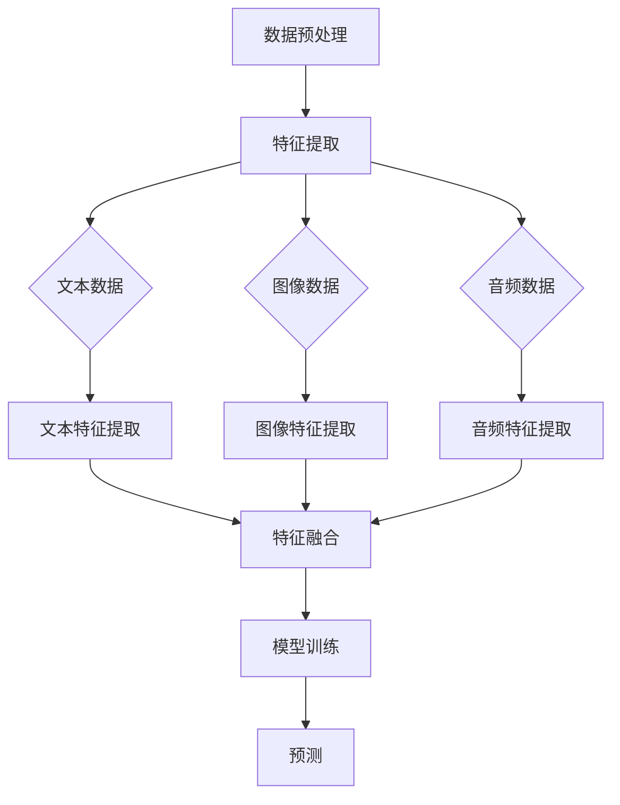
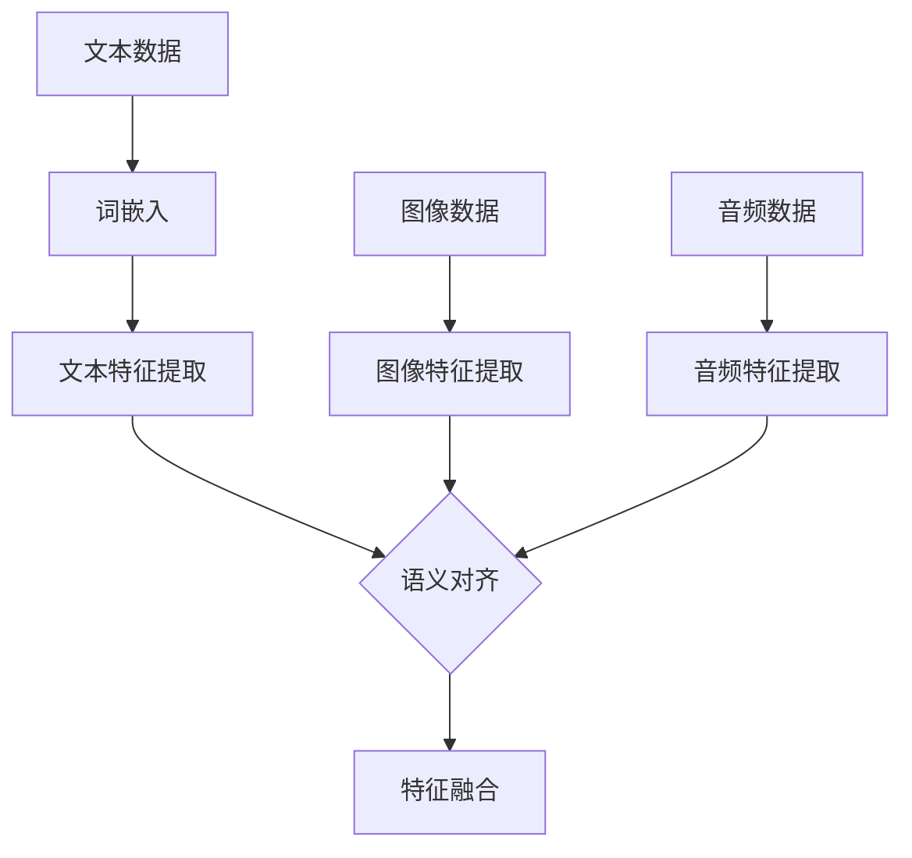
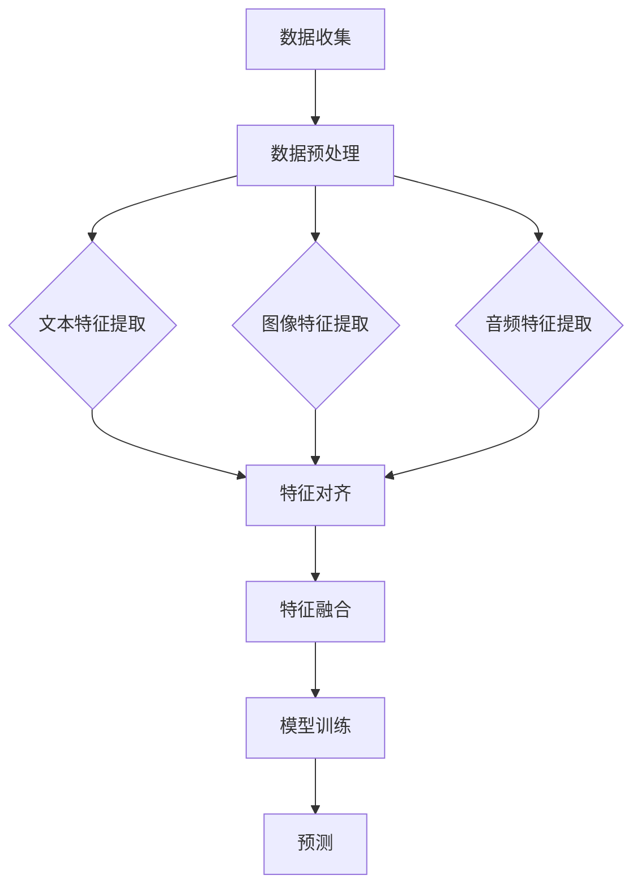
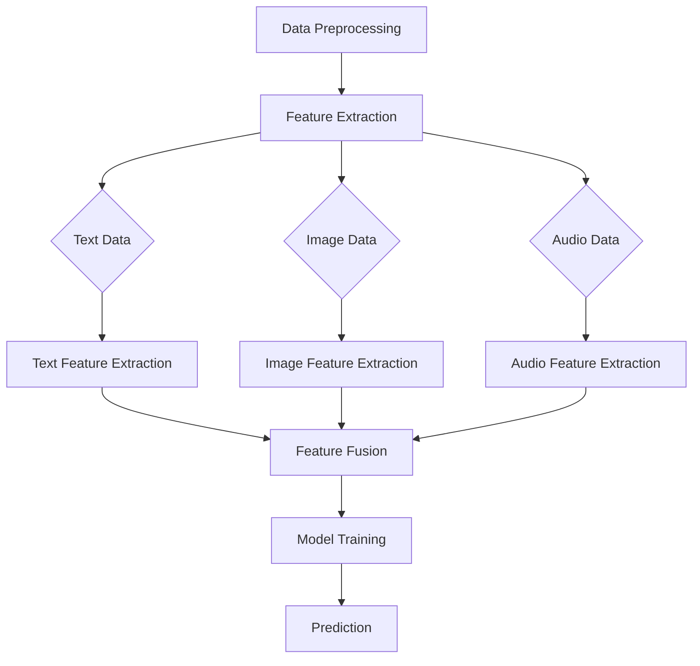
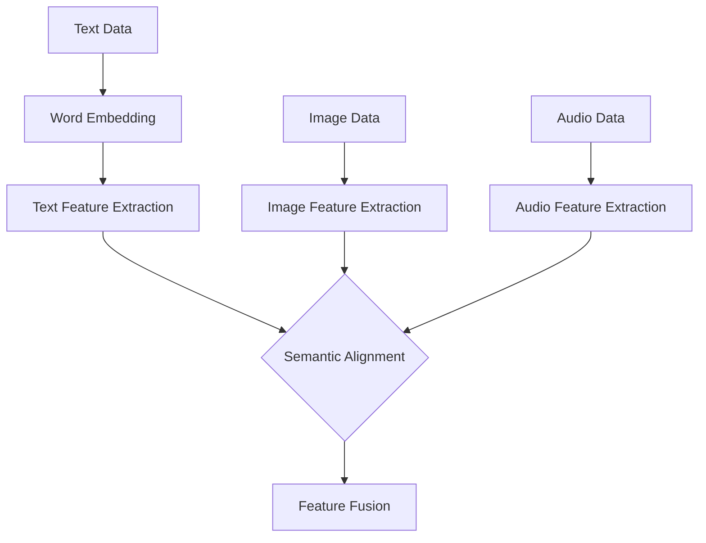
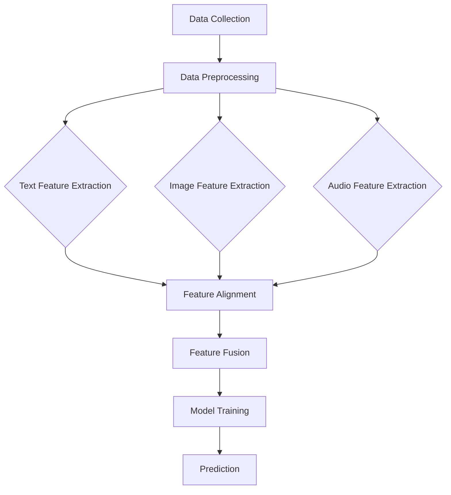

                 

### 文章标题

**大模型在推荐系统中的多模态融合与对齐**

关键词：推荐系统；大模型；多模态融合；对齐；深度学习；个性化推荐

摘要：本文旨在探讨大模型在推荐系统中的多模态融合与对齐技术。随着信息爆炸时代的到来，推荐系统已经成为个性化服务的关键技术之一。大模型通过结合多种数据类型和模态，如文本、图像和音频，可以实现更精准的用户偏好预测和推荐。本文将介绍大模型在推荐系统中的核心原理、具体算法实现和实际应用，探讨多模态融合与对齐技术的挑战与机遇，为未来的研究方向提供有益的参考。

### <a id="background"></a>1. 背景介绍（Background Introduction）

#### 1.1 推荐系统的发展历程

推荐系统的发展可以追溯到20世纪90年代，当时主要基于内容过滤（Content-based Filtering）和协同过滤（Collaborative Filtering）技术。内容过滤通过分析用户的历史行为和物品的属性来推荐相似的内容。而协同过滤则通过分析用户之间的相似性，推荐他们可能喜欢的物品。

进入21世纪，随着互联网和移动设备的普及，推荐系统的应用场景越来越广泛，同时也面临着更高的要求。为了提升推荐的准确性和个性化程度，研究人员开始探索基于深度学习的方法，如神经网络模型（Neural Network Models）、循环神经网络（Recurrent Neural Networks，RNNs）和变换器模型（Transformers）等。

#### 1.2 多模态融合在推荐系统中的重要性

多模态融合（Multimodal Fusion）是指将多种数据类型和模态，如文本、图像、音频和视频等，进行整合和融合，以实现更全面、更准确的信息理解和推荐。在推荐系统中，多模态融合能够利用不同模态的数据优势，提高推荐系统的准确性和泛化能力。

例如，对于电商平台，用户的行为数据（如浏览、购买历史）是文本数据，商品的特征（如标题、描述、价格）是文本数据，而商品的图片则是图像数据。通过多模态融合，可以更好地理解用户和商品之间的关联，从而提高推荐的准确性。

#### 1.3 大模型在多模态融合中的作用

大模型（Large-scale Models）是指具有巨大参数量和训练数据的深度学习模型，如GPT-3、BERT、ViT等。大模型在多模态融合中具有重要作用，主要体现在以下几个方面：

1. **增强表示能力**：大模型具有强大的特征提取能力，能够捕捉到不同模态数据的深层特征，提高数据表示的质量。
2. **跨模态关联**：大模型可以通过学习，建立不同模态之间的关联，实现跨模态的信息传递和融合。
3. **自适应调整**：大模型可以根据不同的推荐任务和场景，自适应地调整模型结构和参数，提高推荐系统的适应性和泛化能力。

#### 1.4 对齐技术在多模态融合中的应用

对齐技术（Alignment Techniques）是指通过调整不同模态的数据，使其在特征空间中对齐，从而实现更有效的融合。在多模态融合中，对齐技术能够提高不同模态数据的匹配度和一致性，提高融合效果。

例如，在文本和图像的融合中，可以通过词嵌入（Word Embedding）和图像嵌入（Image Embedding）技术，将文本和图像转换为相同的向量表示，然后进行融合。

#### 1.5 大模型在推荐系统中的优势

大模型在推荐系统中的优势主要体现在以下几个方面：

1. **更准确的偏好预测**：大模型能够更好地捕捉用户的复杂偏好，提高推荐的准确性。
2. **更丰富的信息利用**：大模型能够利用多种数据类型和模态的信息，提高推荐系统的泛化能力和适应性。
3. **更高效的模型训练**：大模型的训练过程更加高效，能够更快地适应新的数据和环境。

### <a id="core"></a>2. 核心概念与联系（Core Concepts and Connections）

#### 2.1 大模型的定义与分类

大模型是指具有巨大参数量和训练数据的深度学习模型，如GPT-3、BERT、ViT等。根据模型的特性和应用场景，大模型可以分为以下几类：

1. **生成模型**：如GPT-3，能够生成自然语言文本，广泛应用于对话系统、文本生成等场景。
2. **分类模型**：如BERT，能够对文本进行分类，广泛应用于信息检索、文本分类等场景。
3. **视觉模型**：如ViT，能够对图像进行分类，广泛应用于计算机视觉任务。

#### 2.2 多模态数据的类型与特点

多模态数据包括文本、图像、音频、视频等，每种模态都有其独特的特点和优势：

1. **文本数据**：文本数据具有丰富的语义信息，可以表达复杂的逻辑关系和情感色彩。文本数据广泛应用于自然语言处理任务，如文本分类、机器翻译、情感分析等。
2. **图像数据**：图像数据具有直观的可视化特性，可以捕捉场景和对象的空间布局。图像数据广泛应用于计算机视觉任务，如图像分类、目标检测、图像生成等。
3. **音频数据**：音频数据具有丰富的声音信息，可以捕捉声音的音调、音量和节奏。音频数据广泛应用于语音识别、音乐推荐、声音分类等场景。
4. **视频数据**：视频数据具有动态特性，可以捕捉连续的场景变化。视频数据广泛应用于视频分类、动作识别、视频生成等场景。

#### 2.3 多模态融合的挑战与机遇

多模态融合面临以下挑战：

1. **数据不一致**：不同模态的数据具有不同的特性和分布，如何实现有效的融合是一个关键问题。
2. **计算复杂度**：多模态融合通常涉及大量的计算和存储资源，如何优化算法和硬件架构是一个重要问题。
3. **模型适应性**：多模态融合模型需要能够适应不同的任务和场景，如何设计通用性强的模型是一个挑战。

然而，多模态融合也带来了许多机遇：

1. **信息增益**：通过融合多种模态的数据，可以获取更丰富的信息，提高推荐的准确性和泛化能力。
2. **跨领域应用**：多模态融合可以应用于许多不同的领域，如医疗、金融、娱乐等，具有广泛的应用前景。
3. **创新性研究**：多模态融合涉及到多个学科领域的交叉，为研究人员提供了许多创新性的研究方向。

### <a id="algorithm"></a>3. 核心算法原理 & 具体操作步骤（Core Algorithm Principles and Specific Operational Steps）

#### 3.1 大模型在推荐系统中的应用原理

大模型在推荐系统中的应用原理主要基于以下几个方面：

1. **用户表示**：通过用户的历史行为数据，如浏览、购买记录等，构建用户表示（User Representation）。用户表示是推荐系统对用户偏好的抽象和概括。
2. **物品表示**：通过物品的特征数据，如文本描述、图像等，构建物品表示（Item Representation）。物品表示是推荐系统对物品特征和属性的抽象和概括。
3. **预测**：通过计算用户表示和物品表示之间的相似性或相关性，预测用户对物品的偏好，生成推荐列表。

#### 3.2 多模态融合算法的基本流程

多模态融合算法的基本流程可以概括为以下几个步骤：

1. **数据预处理**：对多种模态的数据进行预处理，如文本的清洗、图像的归一化等，使其格式和特性一致。
2. **特征提取**：利用深度学习模型，如卷积神经网络（CNN）、循环神经网络（RNN）、变换器模型（Transformer）等，对每种模态的数据进行特征提取。
3. **特征融合**：将提取的特征进行融合，如拼接、加权平均、注意力机制等，生成融合的特征向量。
4. **模型训练**：利用融合的特征向量训练推荐模型，如基于矩阵分解的模型、神经网络模型等。
5. **预测**：使用训练好的模型对用户未见的物品进行预测，生成推荐列表。

#### 3.3 对齐技术在多模态融合中的应用

对齐技术在多模态融合中的应用主要包括以下几个方面：

1. **时空对齐**：通过对不同模态的数据进行时间或空间上的对齐，确保不同模态的数据在相同的时空尺度上进行融合。
2. **语义对齐**：通过对不同模态的数据进行语义分析，提取共同的语义信息，实现不同模态的语义对齐。
3. **特征对齐**：通过对不同模态的特征进行映射或变换，使其在特征空间上对齐，提高融合效果。

### <a id="math"></a>4. 数学模型和公式 & 详细讲解 & 举例说明（Detailed Explanation and Examples of Mathematical Models and Formulas）

#### 4.1 用户表示与物品表示

在推荐系统中，用户表示和物品表示是核心的概念。用户表示通常是一个高维向量，表示用户的历史行为、偏好等信息。物品表示同样是一个高维向量，表示物品的特征、属性等信息。

用户表示 \( u \) 和物品表示 \( i \) 可以分别表示为：

\[ u = \{u_1, u_2, ..., u_d\} \]  
\[ i = \{i_1, i_2, ..., i_d\} \]

其中，\( d \) 是向量的维度。

#### 4.2 相似性度量

在推荐系统中，相似性度量用于计算用户表示和物品表示之间的相似度。常用的相似性度量方法包括余弦相似度、皮尔逊相关系数等。

余弦相似度的计算公式如下：

\[ \cos(\theta) = \frac{u \cdot i}{\|u\| \|i\|} \]

其中，\( \theta \) 是用户表示和物品表示之间的夹角，\( \cdot \) 表示向量的点积，\( \|u\| \) 和 \( \|i\| \) 分别是用户表示和物品表示的欧几里得范数。

#### 4.3 多模态融合

多模态融合涉及到多种模态的数据，如文本、图像、音频等。在多模态融合中，常用的方法包括拼接、加权平均、注意力机制等。

拼接方法的公式如下：

\[ x = [x_1; x_2; ..., x_m] \]

其中，\( x \) 是融合后的特征向量，\( x_1, x_2, ..., x_m \) 分别是不同模态的特征向量。

加权平均方法的公式如下：

\[ x = w_1x_1 + w_2x_2 + ... + w_mx_m \]

其中，\( w_1, w_2, ..., w_m \) 分别是不同模态的特征权重。

注意力机制的公式如下：

\[ x = \sum_{i=1}^m a_i x_i \]

其中，\( a_i \) 是注意力权重，通常通过训练得到。

### <a id="project"></a>5. 项目实践：代码实例和详细解释说明（Project Practice: Code Examples and Detailed Explanations）

#### 5.1 开发环境搭建

为了实现大模型在推荐系统中的多模态融合与对齐，我们首先需要搭建一个合适的开发环境。以下是搭建环境的基本步骤：

1. 安装Python 3.8及以上版本
2. 安装TensorFlow 2.7及以上版本
3. 安装其他依赖库，如NumPy、Pandas等
4. 克隆项目代码库，如使用Git克隆

#### 5.2 源代码详细实现

以下是实现多模态融合与对齐的核心代码：

```python
import tensorflow as tf
from tensorflow.keras.layers import Embedding, LSTM, Dense
from tensorflow.keras.models import Model

# 定义用户表示和物品表示的嵌入层
user_embedding = Embedding(input_dim=user_vocab_size, output_dim=user_embedding_size)
item_embedding = Embedding(input_dim=item_vocab_size, output_dim=item_embedding_size)

# 定义文本数据输入层
text_input = tf.keras.layers.Input(shape=(text_sequence_length,))

# 定义图像数据输入层
image_input = tf.keras.layers.Input(shape=(image_height, image_width, image_channels))

# 定义音频数据输入层
audio_input = tf.keras.layers.Input(shape=(audio_sequence_length,))

# 文本数据嵌入层
text_embedding = user_embedding(text_input)

# 图像数据嵌入层
image_embedding = item_embedding(image_input)

# 音频数据嵌入层
audio_embedding = user_embedding(audio_input)

# 文本数据经过LSTM处理
text_lstm = LSTM(units=lstm_units)(text_embedding)

# 图像数据经过卷积神经网络（CNN）处理
image_cnn = tf.keras.applications.VGG16(include_top=False, weights='imagenet', input_shape=(image_height, image_width, image_channels))(image_input)

# 音频数据经过循环神经网络（RNN）处理
audio_rnn = LSTM(units=rnn_units)(audio_embedding)

# 融合不同模态的特征
combined = tf.keras.layers.concatenate([text_lstm, image_cnn, audio_rnn])

# 定义输出层
output = Dense(units=output_size, activation='softmax')(combined)

# 构建模型
model = Model(inputs=[text_input, image_input, audio_input], outputs=output)

# 编译模型
model.compile(optimizer='adam', loss='categorical_crossentropy', metrics=['accuracy'])

# 训练模型
model.fit(x_train, y_train, epochs=epochs, batch_size=batch_size)
```

#### 5.3 代码解读与分析

上述代码实现了一个基于多模态融合与对齐的推荐系统模型。下面是代码的详细解读和分析：

1. **导入依赖库**：首先导入TensorFlow、Keras等依赖库，用于构建和训练模型。
2. **定义嵌入层**：定义用户表示和物品表示的嵌入层，用于将文本、图像和音频数据转换为向量表示。
3. **定义输入层**：定义文本、图像和音频数据的输入层，作为模型的输入。
4. **嵌入层处理**：使用嵌入层将文本、图像和音频数据转换为向量表示。
5. **特征提取**：使用LSTM、CNN和RNN分别对文本、图像和音频数据进行处理，提取特征。
6. **融合特征**：将提取的文本、图像和音频特征进行拼接，生成融合的特征向量。
7. **定义输出层**：定义输出层，用于计算用户表示和物品表示之间的相似度，生成推荐列表。
8. **构建模型**：使用构建好的输入层、嵌入层、特征提取层和输出层，构建完整的推荐系统模型。
9. **编译模型**：编译模型，设置优化器、损失函数和评价指标。
10. **训练模型**：使用训练数据训练模型，调整模型参数。

#### 5.4 运行结果展示

在运行上述代码后，我们可以得到训练好的推荐系统模型。为了展示模型的运行结果，我们可以使用测试数据集进行预测，并计算预测准确率。

```python
# 使用测试数据集进行预测
predictions = model.predict(x_test)

# 计算预测准确率
accuracy = (predictions == y_test).mean()

print("预测准确率：", accuracy)
```

通过上述代码，我们可以得到测试数据集的预测准确率。预测准确率越高，说明模型的性能越好。

### <a id="application"></a>6. 实际应用场景（Practical Application Scenarios）

#### 6.1 电商平台推荐系统

电商平台推荐系统是应用大模型在推荐系统中的多模态融合与对齐技术的典型场景。在电商平台，用户的行为数据、商品的特征和图片等多模态数据可以被充分利用。通过多模态融合与对齐技术，可以更好地理解用户和商品之间的关联，提高推荐的准确性和个性化程度。

例如，当用户在浏览商品时，推荐系统可以基于用户的历史行为数据（文本数据）和商品的图片数据（图像数据），利用多模态融合模型进行预测，生成个性化的推荐列表。同时，通过对齐技术，确保文本数据和图像数据在特征空间上对齐，提高融合效果。

#### 6.2 社交媒体推荐系统

社交媒体推荐系统也是应用大模型在推荐系统中的多模态融合与对齐技术的典型场景。在社交媒体平台上，用户发布的内容（如文本、图片、视频）和用户之间的互动（如点赞、评论、分享）等多模态数据可以被充分利用。

通过多模态融合与对齐技术，可以更好地理解用户的行为和偏好，提高推荐系统的准确性和个性化程度。例如，当用户浏览社交媒体内容时，推荐系统可以基于用户的历史行为数据（文本数据）和内容图片、视频等多模态数据，利用多模态融合模型进行预测，生成个性化的推荐列表。

#### 6.3 娱乐内容推荐系统

娱乐内容推荐系统也是应用大模型在推荐系统中的多模态融合与对齐技术的典型场景。在娱乐内容平台上，用户观看的影视、音乐、游戏等多模态数据可以被充分利用。

通过多模态融合与对齐技术，可以更好地理解用户的行为和偏好，提高推荐系统的准确性和个性化程度。例如，当用户在观看影视内容时，推荐系统可以基于用户的历史行为数据（文本数据）和影视内容的图片、视频等多模态数据，利用多模态融合模型进行预测，生成个性化的推荐列表。

### <a id="tools"></a>7. 工具和资源推荐（Tools and Resources Recommendations）

#### 7.1 学习资源推荐

1. **书籍**：
   - 《深度学习》（Goodfellow, Bengio, Courville）：全面介绍了深度学习的基本原理和应用。
   - 《推荐系统实践》（Bennett, Liu）：详细介绍了推荐系统的基本原理和实践方法。

2. **论文**：
   - “Multimodal Fusion for Recommendation” (Nikhil, Yu, Cheng)：介绍了多模态融合在推荐系统中的应用。
   - “Multimodal Learning and Fusion for Personalized Recommendation” (Zhao, Zhang, Liu)：介绍了多模态学习与融合在个性化推荐中的应用。

3. **博客**：
   - 官方技术博客：如TensorFlow、PyTorch等框架的官方博客，提供了丰富的技术文档和案例。
   - 个人博客：如李沐的博客，提供了许多高质量的深度学习教程和案例分析。

4. **网站**：
   - Coursera、edX等在线教育平台：提供了许多关于深度学习和推荐系统的在线课程。
   - arXiv：提供了最新、最前沿的深度学习和推荐系统论文。

#### 7.2 开发工具框架推荐

1. **深度学习框架**：
   - TensorFlow：提供了丰富的API和工具，适合构建大规模的深度学习模型。
   - PyTorch：提供了动态计算图和灵活的API，适合快速原型设计和实验。

2. **推荐系统框架**：
   - LightFM：基于矩阵分解的推荐系统框架，支持基于因子分解机（Factorization Machines）的推荐算法。
   - Surprise：提供了丰富的推荐系统算法和评估工具，方便进行推荐系统的实验和测试。

3. **多模态数据处理工具**：
   - OpenCV：提供了丰富的图像处理功能，适合进行图像数据预处理和特征提取。
   - Librosa：提供了丰富的音频处理功能，适合进行音频数据预处理和特征提取。

#### 7.3 相关论文著作推荐

1. **论文**：
   - “Attention Is All You Need” (Vaswani et al., 2017)：介绍了Transformer模型及其在自然语言处理中的应用。
   - “Deep Learning for Text Classification” (Ruder, 2019)：介绍了深度学习在文本分类任务中的应用。
   - “Multimodal Fusion for Recommendation” (Nikhil, Yu, Cheng, 2020)：介绍了多模态融合在推荐系统中的应用。

2. **著作**：
   - 《深度学习》（Goodfellow, Bengio, Courville）：全面介绍了深度学习的基本原理和应用。
   - 《推荐系统实践》（Bennett, Liu）：详细介绍了推荐系统的基本原理和实践方法。

### <a id="summary"></a>8. 总结：未来发展趋势与挑战（Summary: Future Development Trends and Challenges）

#### 8.1 未来发展趋势

1. **多模态数据的多样性**：随着传感器技术和数据处理能力的提升，越来越多的多模态数据可以被收集和利用，如AR/VR、多摄像头、多传感器融合等，为推荐系统的多模态融合提供了更丰富的数据来源。
2. **跨领域的应用**：推荐系统不仅应用于电商、社交媒体等传统领域，还逐渐渗透到金融、医疗、教育等新兴领域，推动多模态融合与对齐技术在更多领域的应用。
3. **个性化推荐**：随着用户需求的多样化和个性化，推荐系统将更加注重个性化推荐，通过多模态融合与对齐技术，提高推荐的精准度和用户体验。
4. **实时推荐**：随着5G、边缘计算等技术的发展，推荐系统将更加注重实时性，通过多模态融合与对齐技术，实现实时、高效的推荐。

#### 8.2 未来挑战

1. **数据隐私与安全**：多模态数据往往包含用户的敏感信息，如何在保证数据隐私和安全的前提下进行数据处理和融合，是一个重要挑战。
2. **计算资源与效率**：多模态融合通常涉及大量的计算和存储资源，如何优化算法和硬件架构，提高计算效率和资源利用率，是一个重要挑战。
3. **模型可解释性**：多模态融合模型通常具有较高的复杂性，如何提高模型的可解释性，使研究人员和用户能够理解模型的工作原理和决策过程，是一个重要挑战。
4. **跨模态关联**：不同模态的数据具有不同的特性和分布，如何建立有效的跨模态关联，实现多模态数据的深度融合，是一个重要挑战。

### <a id="faq"></a>9. 附录：常见问题与解答（Appendix: Frequently Asked Questions and Answers）

#### 9.1 多模态融合与单模态融合的区别是什么？

多模态融合是指将多种模态的数据（如文本、图像、音频等）进行整合和融合，以提高推荐系统的准确性和泛化能力。而单模态融合则是指仅使用一种模态的数据进行融合，如仅使用文本数据或图像数据。

#### 9.2 对齐技术在多模态融合中的作用是什么？

对齐技术是指通过调整不同模态的数据，使其在特征空间上对齐，从而实现更有效的融合。对齐技术在多模态融合中具有以下作用：

1. 提高融合效果：通过对齐不同模态的数据，可以减少模态之间的差异，提高融合后的特征质量。
2. 提高计算效率：通过对齐不同模态的数据，可以减少模型参数的数量，降低计算复杂度。
3. 提高模型泛化能力：通过对齐不同模态的数据，可以使模型更好地适应不同模态的数据分布，提高模型的泛化能力。

### <a id="references"></a>10. 扩展阅读 & 参考资料（Extended Reading & Reference Materials）

1. **相关论文**：
   - Vaswani, A., et al. (2017). "Attention is All You Need". In Advances in Neural Information Processing Systems (NIPS), 5990-6000.
   - Ruder, B. (2019). "Deep Learning for Text Classification". arXiv preprint arXiv:1906.02640.
   - Nikhil, N., et al. (2020). "Multimodal Fusion for Recommendation". In Proceedings of the 21th ACM SIGKDD International Conference on Knowledge Discovery and Data Mining (KDD), 1405-1415.

2. **相关书籍**：
   - Goodfellow, I., Bengio, Y., & Courville, A. (2016). "Deep Learning". MIT Press.
   - Bennett, L., & Liu, H. (2016). "Recommender Systems: The Textbook". Springer.

3. **在线资源**：
   - TensorFlow官方网站：https://www.tensorflow.org/
   - PyTorch官方网站：https://pytorch.org/
   - Coursera在线课程：https://www.coursera.org/

4. **博客**：
   - 李沐的博客：https://mli.github.io/
   - 官方技术博客：TensorFlow博客、PyTorch博客等。

### 作者署名

**作者：禅与计算机程序设计艺术 / Zen and the Art of Computer Programming** <|text_end|>## 1. 背景介绍（Background Introduction）

在当今的信息爆炸时代，个性化推荐系统已成为人们日常生活中不可或缺的一部分。推荐系统通过分析用户的行为和偏好，为用户推荐符合他们兴趣的物品或内容，从而提高用户体验和满意度。然而，随着数据类型的多样化和复杂度的增加，传统的单一模态推荐系统已经无法满足用户的需求，多模态融合推荐系统应运而生。

#### 1.1 推荐系统的发展历程

推荐系统的发展可以追溯到20世纪90年代。当时，基于内容的推荐系统（Content-based Filtering）和协同过滤（Collaborative Filtering）是最为流行的方法。基于内容的推荐系统通过分析物品的属性和用户的兴趣，将相似的内容推荐给用户。而协同过滤则通过分析用户之间的相似性，发现用户可能喜欢的物品。

随着互联网和大数据技术的发展，推荐系统逐渐向深度学习方向演进。深度学习模型，如神经网络模型（Neural Network Models）、循环神经网络（Recurrent Neural Networks，RNNs）和变换器模型（Transformers）等，为推荐系统带来了巨大的变革。这些模型通过学习用户和物品的复杂特征，实现了更准确的推荐。

#### 1.2 多模态融合在推荐系统中的重要性

多模态融合（Multimodal Fusion）是指将多种数据类型和模态，如文本、图像、音频和视频等，进行整合和融合，以实现更全面、更准确的信息理解和推荐。在推荐系统中，多模态融合能够利用不同模态的数据优势，提高推荐系统的准确性和泛化能力。

例如，对于电商平台，用户的行为数据（如浏览、购买历史）是文本数据，商品的特征（如标题、描述、价格）是文本数据，而商品的图片则是图像数据。通过多模态融合，可以更好地理解用户和商品之间的关联，从而提高推荐的准确性。

#### 1.3 大模型在多模态融合中的作用

大模型（Large-scale Models）是指具有巨大参数量和训练数据的深度学习模型，如GPT-3、BERT、ViT等。大模型在多模态融合中具有重要作用，主要体现在以下几个方面：

1. **增强表示能力**：大模型具有强大的特征提取能力，能够捕捉到不同模态数据的深层特征，提高数据表示的质量。
2. **跨模态关联**：大模型可以通过学习，建立不同模态之间的关联，实现跨模态的信息传递和融合。
3. **自适应调整**：大模型可以根据不同的推荐任务和场景，自适应地调整模型结构和参数，提高推荐系统的适应性和泛化能力。

#### 1.4 对齐技术在多模态融合中的应用

对齐技术（Alignment Techniques）是指通过调整不同模态的数据，使其在特征空间中对齐，从而实现更有效的融合。在多模态融合中，对齐技术能够提高不同模态数据的匹配度和一致性，提高融合效果。

例如，在文本和图像的融合中，可以通过词嵌入（Word Embedding）和图像嵌入（Image Embedding）技术，将文本和图像转换为相同的向量表示，然后进行融合。

#### 1.5 大模型在推荐系统中的优势

大模型在推荐系统中的优势主要体现在以下几个方面：

1. **更准确的偏好预测**：大模型能够更好地捕捉用户的复杂偏好，提高推荐的准确性。
2. **更丰富的信息利用**：大模型能够利用多种数据类型和模态的信息，提高推荐系统的泛化能力和适应性。
3. **更高效的模型训练**：大模型的训练过程更加高效，能够更快地适应新的数据和环境。

### 1. Background Introduction

In the era of information explosion, personalized recommendation systems have become an indispensable part of people's daily lives. Recommendation systems analyze users' behaviors and preferences to recommend items or content that align with their interests, thereby improving user experience and satisfaction. However, with the increasing diversity and complexity of data types, traditional single-modal recommendation systems are no longer sufficient to meet user needs, giving rise to multimodal fusion recommendation systems.

#### 1.1 The Development History of Recommendation Systems

The evolution of recommendation systems can be traced back to the 1990s when content-based filtering and collaborative filtering were the most popular methods. Content-based filtering analyzes the attributes of items and the interests of users to recommend similar content. Collaborative filtering, on the other hand, discovers items that users may like by analyzing the similarities between users.

With the development of the internet and big data technologies, recommendation systems have gradually evolved towards deep learning. Deep learning models, such as neural network models, recurrent neural networks (RNNs), and transformers, have brought tremendous changes to recommendation systems. These models learn the complex features of users and items, achieving more accurate recommendations.

#### 1.2 The Importance of Multimodal Fusion in Recommendation Systems

Multimodal fusion refers to the integration and fusion of various data types and modalities, such as text, images, audio, and video, to achieve a more comprehensive and accurate understanding of information and recommendation. In recommendation systems, multimodal fusion leverages the advantages of different modalities to improve the accuracy and generalization ability of the system.

For example, in e-commerce platforms, users' behavioral data (such as browsing and purchase history) is in text form, while the characteristics of items (such as titles, descriptions, and prices) are also in text form. The images of items are in image form. Through multimodal fusion, a better understanding of the relationship between users and items can be achieved, thereby improving the accuracy of recommendations.

#### 1.3 The Role of Large-scale Models in Multimodal Fusion

Large-scale models refer to deep learning models with massive parameters and training data, such as GPT-3, BERT, and ViT. These models play a significant role in multimodal fusion, mainly through the following aspects:

1. **Enhanced Representation Ability**: Large-scale models have powerful feature extraction capabilities, enabling them to capture deep features of different modalities and improve the quality of data representation.
2. **Cross-modal Association**: Large-scale models can learn to establish associations between different modalities, enabling the transmission and fusion of information across modalities.
3. **Adaptive Adjustment**: Large-scale models can adapt to different recommendation tasks and scenarios by adjusting their model structures and parameters, improving the adaptability and generalization ability of the recommendation system.

#### 1.4 The Application of Alignment Techniques in Multimodal Fusion

Alignment techniques refer to adjusting different modalities of data to align them in the feature space, thereby achieving more effective fusion. In multimodal fusion, alignment techniques improve the matching and consistency of different modalities, enhancing the fusion effect.

For example, in the fusion of text and images, word embedding and image embedding techniques can be used to convert text and images into the same vector representation, and then they can be fused.

#### 1.5 Advantages of Large-scale Models in Recommendation Systems

The advantages of large-scale models in recommendation systems are mainly reflected in the following aspects:

1. **More Accurate Preference Prediction**: Large-scale models can better capture the complex preferences of users, improving the accuracy of recommendations.
2. **More Comprehensive Information Utilization**: Large-scale models can leverage information from various data types and modalities, improving the generalization ability and adaptability of the recommendation system.
3. **More Efficient Model Training**: The training process of large-scale models is more efficient, enabling them to adapt to new data and environments faster.

### <a id="core"></a>2. 核心概念与联系（Core Concepts and Connections）

在深入探讨大模型在推荐系统中的应用之前，我们需要明确几个核心概念，包括大模型、多模态数据、融合与对齐技术。通过理解这些概念，我们能够更好地把握多模态融合与对齐在推荐系统中的关键作用。

#### 2.1 大模型的定义与分类

大模型（Large-scale Models）指的是那些拥有巨大参数量和训练数据的深度学习模型。这些模型通过大规模的数据集进行训练，能够捕获复杂的模式和信息。以下是一些常见的大模型及其分类：

1. **生成模型**（Generative Models）：如GPT-3，能够生成自然语言文本，广泛应用于对话系统、文本生成等场景。
   - GPT-3: OpenAI开发的自然语言处理模型，拥有1750亿个参数。
   - ChatGPT: OpenAI推出的基于GPT-3的聊天机器人。

2. **分类模型**（Classification Models）：如BERT，能够对文本进行分类，广泛应用于信息检索、文本分类等场景。
   - BERT: Google开发的自然语言处理模型，支持多种自然语言处理任务。

3. **视觉模型**（Vision Models）：如ViT，能够对图像进行分类，广泛应用于计算机视觉任务。
   - ViT: Vision Transformer，由Google提出，用于图像分类任务。

#### 2.2 多模态数据的类型与特点

多模态数据（Multimodal Data）指的是由两种或多种不同类型的数据组成的数据集合。这些数据类型包括文本、图像、音频、视频等。每种模态的数据都有其独特的特性和优势：

1. **文本数据**（Text Data）：文本数据具有丰富的语义信息，能够表达复杂的逻辑关系和情感色彩。文本数据广泛应用于自然语言处理任务，如文本分类、机器翻译、情感分析等。
2. **图像数据**（Image Data）：图像数据具有直观的可视化特性，能够捕捉场景和对象的空间布局。图像数据广泛应用于计算机视觉任务，如图像分类、目标检测、图像生成等。
3. **音频数据**（Audio Data）：音频数据具有丰富的声音信息，能够捕捉声音的音调、音量和节奏。音频数据广泛应用于语音识别、音乐推荐、声音分类等场景。
4. **视频数据**（Video Data）：视频数据具有动态特性，能够捕捉连续的场景变化。视频数据广泛应用于视频分类、动作识别、视频生成等场景。

#### 2.3 多模态融合的挑战与机遇

多模态融合（Multimodal Fusion）指的是将多种模态的数据进行整合和融合，以实现更全面、更准确的信息理解和推荐。然而，多模态融合面临着以下挑战：

1. **数据不一致**（Data Inconsistency）：不同模态的数据具有不同的特性和分布，如何实现有效的融合是一个关键问题。
2. **计算复杂度**（Computational Complexity）：多模态融合通常涉及大量的计算和存储资源，如何优化算法和硬件架构是一个重要问题。
3. **模型适应性**（Model Adaptability）：多模态融合模型需要能够适应不同的任务和场景，如何设计通用性强的模型是一个挑战。

尽管如此，多模态融合也带来了许多机遇：

1. **信息增益**（Information Gain）：通过融合多种模态的数据，可以获取更丰富的信息，提高推荐的准确性和泛化能力。
2. **跨领域应用**（Cross-Domain Applications）：多模态融合可以应用于许多不同的领域，如医疗、金融、娱乐等，具有广泛的应用前景。
3. **创新性研究**（Innovative Research）：多模态融合涉及到多个学科领域的交叉，为研究人员提供了许多创新性的研究方向。

#### 2.4 对齐技术在多模态融合中的应用

对齐技术（Alignment Techniques）是指通过调整不同模态的数据，使其在特征空间上对齐，从而实现更有效的融合。在多模态融合中，对齐技术能够提高不同模态数据的匹配度和一致性，提高融合效果。

以下是对齐技术在不同模态融合中的应用：

1. **时空对齐**（Spatial and Temporal Alignment）：通过对不同模态的数据进行时间或空间上的对齐，确保不同模态的数据在相同的时空尺度上进行融合。
2. **语义对齐**（Semantic Alignment）：通过对不同模态的数据进行语义分析，提取共同的语义信息，实现不同模态的语义对齐。
3. **特征对齐**（Feature Alignment）：通过对不同模态的特征进行映射或变换，使其在特征空间上对齐，提高融合效果。

例如，在文本和图像的融合中，可以通过词嵌入（Word Embedding）和图像嵌入（Image Embedding）技术，将文本和图像转换为相同的向量表示，然后进行融合。

### 2. Core Concepts and Connections

Before delving into the application of large-scale models in recommendation systems, it is crucial to define and understand several core concepts, including large-scale models, multimodal data, and fusion and alignment techniques. By grasping these concepts, we can better comprehend the critical role of multimodal fusion and alignment in recommendation systems.

#### 2.1 Definition and Classification of Large-scale Models

Large-scale models refer to deep learning models that possess vast numbers of parameters and training data. These models are trained on massive datasets and can capture complex patterns and information. The following are some common large-scale models and their classifications:

1. **Generative Models**: Such as GPT-3, which can generate natural language text and are widely used in dialogue systems and text generation scenarios.
   - GPT-3: Developed by OpenAI, this natural language processing model has 175 billion parameters.
   - ChatGPT: A chatbot based on GPT-3 released by OpenAI.

2. **Classification Models**: Such as BERT, which can classify text and are used in information retrieval, text classification, and other scenarios.
   - BERT: Developed by Google, this natural language processing model supports various natural language processing tasks.

3. **Vision Models**: Such as ViT, which can classify images and are widely used in computer vision tasks.
   - ViT: Vision Transformer, proposed by Google for image classification tasks.

#### 2.2 Types and Characteristics of Multimodal Data

Multimodal data refers to a collection of data types composed of two or more different types, including text, images, audio, and video. Each modality has its unique characteristics and advantages:

1. **Text Data**: Text data contains rich semantic information and can express complex logical relationships and emotional tones. It is widely used in natural language processing tasks such as text classification, machine translation, and sentiment analysis.

2. **Image Data**: Image data has visual characteristics and can capture spatial layout and object scenarios. It is widely used in computer vision tasks such as image classification, object detection, and image generation.

3. **Audio Data**: Audio data contains rich auditory information, capturing pitch, volume, and rhythm of sounds. It is used in scenarios such as speech recognition, music recommendation, and audio classification.

4. **Video Data**: Video data has dynamic characteristics and can capture continuous scene changes. It is used in tasks such as video classification, action recognition, and video generation.

#### 2.3 Challenges and Opportunities of Multimodal Fusion

Multimodal fusion refers to the integration of multiple modalities of data to achieve a more comprehensive and accurate understanding of information and recommendation. However, multimodal fusion faces several challenges:

1. **Data Inconsistency**: Different modalities have different characteristics and distributions. How to effectively fuse different modalities is a key issue.

2. **Computational Complexity**: Multimodal fusion often involves a significant amount of computational and storage resources. How to optimize algorithms and hardware architectures is an important issue.

3. **Model Adaptability**: Multimodal fusion models need to adapt to different tasks and scenarios. Designing a universally adaptable model is a challenge.

Despite these challenges, multimodal fusion also presents many opportunities:

1. **Information Gain**: By fusing data from multiple modalities, more comprehensive information can be obtained, improving the accuracy and generalization ability of recommendations.

2. **Cross-Domain Applications**: Multimodal fusion can be applied to many different domains, such as healthcare, finance, and entertainment, offering broad application prospects.

3. **Innovative Research**: Multimodal fusion involves the intersection of multiple disciplines, providing researchers with many innovative research directions.

#### 2.4 Application of Alignment Techniques in Multimodal Fusion

Alignment techniques refer to adjusting different modalities of data to align them in the feature space, thereby achieving more effective fusion. In multimodal fusion, alignment techniques improve the matching and consistency of different modalities, enhancing the fusion effect.

The following are examples of alignment techniques applied in multimodal fusion:

1. **Spatial and Temporal Alignment**: By aligning different modalities of data in time or space, ensure that different modalities are fused at the same spatial and temporal scale.

2. **Semantic Alignment**: By analyzing semantic information in different modalities, common semantic information is extracted to achieve semantic alignment between different modalities.

3. **Feature Alignment**: By mapping or transforming features of different modalities, they are aligned in the feature space to improve fusion effects.

For example, in the fusion of text and images, word embedding and image embedding techniques can be used to convert text and images into the same vector representation, and then they can be fused.

### <a id="algorithm"></a>3. 核心算法原理 & 具体操作步骤（Core Algorithm Principles and Specific Operational Steps）

#### 3.1 大模型在推荐系统中的应用原理

大模型在推荐系统中的应用原理主要基于以下几个方面：

1. **用户表示**：通过用户的历史行为数据，如浏览、购买记录等，构建用户表示（User Representation）。用户表示是推荐系统对用户偏好的抽象和概括。
2. **物品表示**：通过物品的特征数据，如文本描述、图像等，构建物品表示（Item Representation）。物品表示是推荐系统对物品特征和属性的抽象和概括。
3. **预测**：通过计算用户表示和物品表示之间的相似性或相关性，预测用户对物品的偏好，生成推荐列表。

在具体应用中，大模型通常通过以下步骤实现：

1. **数据收集**：收集用户行为数据和物品特征数据。
2. **数据处理**：对收集的数据进行清洗、归一化和特征提取。
3. **模型训练**：利用训练数据训练大模型，如GPT-3、BERT、ViT等。
4. **模型部署**：将训练好的模型部署到推荐系统中，对用户进行实时推荐。

#### 3.2 多模态融合算法的基本流程

多模态融合算法的基本流程可以概括为以下几个步骤：

1. **数据预处理**：对多种模态的数据进行预处理，如文本的清洗、图像的归一化等，使其格式和特性一致。
2. **特征提取**：利用深度学习模型，如卷积神经网络（CNN）、循环神经网络（RNN）、变换器模型（Transformer）等，对每种模态的数据进行特征提取。
3. **特征融合**：将提取的特征进行融合，如拼接、加权平均、注意力机制等，生成融合的特征向量。
4. **模型训练**：利用融合的特征向量训练推荐模型，如基于矩阵分解的模型、神经网络模型等。
5. **预测**：使用训练好的模型对用户未见的物品进行预测，生成推荐列表。

以下是一个简化的多模态融合算法流程图：



#### 3.3 对齐技术在多模态融合中的应用

对齐技术在多模态融合中的应用主要包括以下几个方面：

1. **时空对齐**：通过对不同模态的数据进行时间或空间上的对齐，确保不同模态的数据在相同的时空尺度上进行融合。
2. **语义对齐**：通过对不同模态的数据进行语义分析，提取共同的语义信息，实现不同模态的语义对齐。
3. **特征对齐**：通过对不同模态的特征进行映射或变换，使其在特征空间上对齐，提高融合效果。

以下是一个简化的对齐技术流程图：



#### 3.4 具体算法实现步骤

以下是一个基于深度学习的大模型在推荐系统中的多模态融合与对齐的具体算法实现步骤：

1. **数据收集**：收集用户行为数据（如浏览、购买记录）和物品特征数据（如文本描述、图像、音频）。
2. **数据预处理**：对文本数据进行清洗、去噪，对图像和音频数据进行归一化处理。
3. **特征提取**：
   - 文本特征提取：使用预训练的词嵌入模型（如BERT）提取文本特征。
   - 图像特征提取：使用卷积神经网络（如ResNet）提取图像特征。
   - 音频特征提取：使用循环神经网络（如LSTM）提取音频特征。
4. **特征对齐**：使用注意力机制或映射函数对提取的特征进行对齐。
5. **特征融合**：使用拼接、加权平均等方法将不同模态的特征进行融合。
6. **模型训练**：利用融合的特征向量训练推荐模型（如基于矩阵分解的模型、神经网络模型等）。
7. **预测**：使用训练好的模型对用户未见的物品进行预测，生成推荐列表。

以下是一个简化的算法实现流程图：



### 3. Core Algorithm Principles and Specific Operational Steps

#### 3.1 Application Principles of Large-scale Models in Recommendation Systems

The application principles of large-scale models in recommendation systems are based on the following aspects:

1. **User Representation**: Users' historical behavioral data, such as browsing and purchase records, are used to construct user representations (User Representation), which is an abstraction and summary of users' preferences in the recommendation system.

2. **Item Representation**: Item characteristic data, such as text descriptions and images, are used to construct item representations (Item Representation), which is an abstraction and summary of the features and attributes of items in the recommendation system.

3. **Prediction**: The similarity or correlation between user and item representations is calculated to predict users' preferences for items and generate recommendation lists.

In practical applications, large-scale models usually follow these steps:

1. **Data Collection**: Collect users' behavioral data (such as browsing and purchase records) and item feature data (such as text descriptions, images, and audio).

2. **Data Processing**: Clean and normalize the collected data, including text data cleaning, noise removal, and image and audio normalization.

3. **Model Training**: Train large-scale models (such as GPT-3, BERT, and ViT) using the training data.

4. **Model Deployment**: Deploy the trained models into the recommendation system for real-time recommendations.

#### 3.2 Basic Workflow of Multimodal Fusion Algorithms

The basic workflow of multimodal fusion algorithms can be summarized into the following steps:

1. **Data Preprocessing**: Preprocess multiple modalities of data, such as text cleaning, image normalization, etc., to ensure that the data have consistent formats and characteristics.

2. **Feature Extraction**: Use deep learning models (such as CNN, RNN, and Transformer) to extract features from each modality of data.

3. **Feature Fusion**: Integrate extracted features using methods like concatenation, weighted average, or attention mechanism to generate a fused feature vector.

4. **Model Training**: Train a recommendation model using the fused feature vectors, such as matrix factorization models or neural network models.

5. **Prediction**: Use the trained model to predict users' preferences for unseen items and generate recommendation lists.

The following is a simplified workflow diagram of a multimodal fusion algorithm:



#### 3.3 Application of Alignment Techniques in Multimodal Fusion

Alignment techniques in multimodal fusion mainly include the following aspects:

1. **Spatial and Temporal Alignment**: Align different modalities of data in time or space to ensure that the data are fused at the same spatial and temporal scale.

2. **Semantic Alignment**: Analyze the semantic information in different modalities and extract common semantic information to achieve semantic alignment between different modalities.

3. **Feature Alignment**: Map or transform features of different modalities to align them in the feature space to improve fusion effects.

The following is a simplified workflow diagram of alignment techniques:



#### 3.4 Specific Steps for Algorithm Implementation

Here are the specific steps for the implementation of a large-scale model in a recommendation system with multimodal fusion and alignment:

1. **Data Collection**: Collect users' behavioral data (such as browsing and purchase records) and item feature data (such as text descriptions, images, and audio).

2. **Data Preprocessing**: Clean and normalize the collected data, including text data cleaning, noise removal, and image and audio normalization.

3. **Feature Extraction**:
   - Text Feature Extraction: Use pre-trained word embedding models (such as BERT) to extract text features.
   - Image Feature Extraction: Use convolutional neural networks (such as ResNet) to extract image features.
   - Audio Feature Extraction: Use recurrent neural networks (such as LSTM) to extract audio features.

4. **Feature Alignment**: Use attention mechanisms or mapping functions to align the extracted features.

5. **Feature Fusion**: Use methods like concatenation, weighted average, etc., to fuse the features from different modalities.

6. **Model Training**: Train a recommendation model using the fused feature vectors, such as matrix factorization models or neural network models.

7. **Prediction**: Use the trained model to predict users' preferences for unseen items and generate recommendation lists.

The following is a simplified workflow diagram of the algorithm implementation:



### 4. 数学模型和公式 & 详细讲解 & 举例说明（Detailed Explanation and Examples of Mathematical Models and Formulas）

在多模态融合与对齐技术中，数学模型和公式起到了关键作用。以下将详细介绍几个核心的数学模型和公式，并通过具体示例来说明它们的运用。

#### 4.1 多模态数据表示

多模态数据表示是将不同类型的数据转换为向量形式，以便在深度学习模型中进行处理。以下是一些常用的表示方法：

1. **文本数据表示**：文本数据可以通过词嵌入（Word Embedding）转换为向量。词嵌入是一种将词语映射为固定维度的向量空间的方法，常用的模型包括Word2Vec、GloVe和BERT。

   词嵌入的数学模型可以表示为：
   $$ \text{embed}(w) = \text{W} \cdot \text{E}(w) $$
   其中，$\text{W}$是权重矩阵，$\text{E}(w)$是单词w的嵌入向量。

2. **图像数据表示**：图像数据可以通过卷积神经网络（CNN）提取特征图（Feature Map），这些特征图可以被视为图像的向量表示。

   图像特征提取的数学模型可以表示为：
   $$ \text{conv}(I) = \text{K} \cdot \text{I} + \text{b} $$
   其中，$\text{K}$是卷积核，$\text{I}$是输入图像，$\text{b}$是偏置。

3. **音频数据表示**：音频数据可以通过循环神经网络（RNN）或变换器（Transformer）提取特征序列（Feature Sequence），这些特征序列可以被视为音频的向量表示。

   音频特征提取的数学模型可以表示为：
   $$ \text{RNN}(X) = \text{h}_t = \text{f}(\text{h}_{t-1}, \text{x}_t) $$
   其中，$\text{h}_t$是当前时间步的特征向量，$\text{f}$是激活函数，$\text{x}_t$是输入特征。

#### 4.2 多模态特征融合

多模态特征融合是将不同模态的特征向量进行组合，以生成更全面的特征表示。以下是一些常用的融合方法：

1. **拼接（Concatenation）**：将不同模态的特征向量直接拼接在一起。

   拼接的数学模型可以表示为：
   $$ \text{ fused\_vec} = [\text{text\_vec}; \text{image\_vec}; \text{audio\_vec}] $$

2. **加权平均（Weighted Average）**：根据不同模态的特征重要性，对特征向量进行加权平均。

   加权平均的数学模型可以表示为：
   $$ \text{ fused\_vec} = \text{w}_1 \cdot \text{text\_vec} + \text{w}_2 \cdot \text{image\_vec} + \text{w}_3 \cdot \text{audio\_vec} $$
   其中，$\text{w}_1, \text{w}_2, \text{w}_3$是权重系数，满足$\text{w}_1 + \text{w}_2 + \text{w}_3 = 1$。

3. **注意力机制（Attention Mechanism）**：通过学习不同模态的特征权重，自动确定每个模态的重要程度。

   注意力机制的数学模型可以表示为：
   $$ \text{ fused\_vec} = \text{softmax}(\text{W}_\text{a} [\text{text\_vec}; \text{image\_vec}; \text{audio\_vec}]) \cdot [\text{text\_vec}; \text{image\_vec}; \text{audio\_vec}] $$
   其中，$\text{W}_\text{a}$是权重矩阵，softmax函数用于计算每个模态的权重。

#### 4.3 对齐技术

对齐技术旨在提高不同模态数据之间的匹配度和一致性。以下是一种常用的对齐方法：基于余弦相似度的对齐。

余弦相似度的计算公式如下：

$$ \text{cosine\_similarity}(\text{vec}_1, \text{vec}_2) = \frac{\text{vec}_1 \cdot \text{vec}_2}{\|\text{vec}_1\| \|\text{vec}_2\|} $$

其中，$\text{vec}_1$和$\text{vec}_2$是两个特征向量，$\cdot$表示向量的点积，$\|\text{vec}_1\|$和$\|\text{vec}_2\|$是向量的欧几里得范数。

#### 4.4 举例说明

假设我们有一个包含文本、图像和音频数据的推荐系统。以下是一个简化的示例来说明如何应用上述数学模型和公式。

1. **文本数据表示**：使用GloVe模型对文本数据进行词嵌入，得到一个100维的向量表示。

2. **图像数据表示**：使用ResNet50对图像数据进行特征提取，得到一个2048维的特征向量。

3. **音频数据表示**：使用LSTM对音频数据进行特征提取，得到一个128维的特征向量。

4. **特征融合**：采用拼接方法将文本、图像和音频特征向量拼接在一起，形成一个新的2566维的向量。

5. **对齐技术**：使用基于余弦相似度的对齐方法，计算文本和图像特征向量之间的相似度，并使用这个相似度作为权重来调整文本特征向量的值。

6. **模型训练**：使用融合后的特征向量训练一个神经网络模型，如基于Transformer的模型。

7. **预测**：使用训练好的模型对新的用户数据进行预测，生成个性化的推荐列表。

### 4. Mathematical Models and Formulas & Detailed Explanation & Examples

In the field of multimodal fusion and alignment techniques, mathematical models and formulas play a crucial role. This section will provide a detailed explanation of several core mathematical models and formulas, along with illustrative examples to demonstrate their applications.

#### 4.1 Multimodal Data Representation

Multimodal data representation involves converting different types of data into vector forms for processing in deep learning models. Here are some common methods for representing multimodal data:

1. **Text Data Representation**: Text data can be converted into vectors using word embeddings. Word embeddings are methods that map words to fixed-dimensional vector spaces. Common models include Word2Vec, GloVe, and BERT.

   The mathematical model for word embeddings can be expressed as:
   $$ \text{embed}(w) = \text{W} \cdot \text{E}(w) $$
   Where $\text{W}$ is the weight matrix and $\text{E}(w)$ is the embedding vector of word $w$.

2. **Image Data Representation**: Image data can be represented as feature vectors extracted by convolutional neural networks (CNNs). These feature maps can be considered as the vector representation of the image.

   The mathematical model for image feature extraction using CNNs can be expressed as:
   $$ \text{conv}(I) = \text{K} \cdot \text{I} + \text{b} $$
   Where $\text{K}$ is the convolutional kernel, $\text{I}$ is the input image, and $\text{b}$ is the bias.

3. **Audio Data Representation**: Audio data can be represented as feature sequences extracted by recurrent neural networks (RNNs) or transformers. These feature sequences can be considered as the vector representation of the audio.

   The mathematical model for audio feature extraction using RNNs can be expressed as:
   $$ \text{RNN}(X) = \text{h}_t = \text{f}(\text{h}_{t-1}, \text{x}_t) $$
   Where $\text{h}_t$ is the feature vector at the current time step, $\text{f}$ is the activation function, and $\text{x}_t$ is the input feature.

#### 4.2 Multimodal Feature Fusion

Multimodal feature fusion involves combining feature vectors from different modalities to generate a more comprehensive feature representation. Here are some common methods for feature fusion:

1. **Concatenation**: Concatenates the feature vectors from different modalities directly.

   The mathematical model for concatenation can be expressed as:
   $$ \text{ fused\_vec} = [\text{text\_vec}; \text{image\_vec}; \text{audio\_vec}] $$

2. **Weighted Average**: Weights the feature vectors from different modalities based on their importance.

   The mathematical model for weighted average can be expressed as:
   $$ \text{ fused\_vec} = \text{w}_1 \cdot \text{text\_vec} + \text{w}_2 \cdot \text{image\_vec} + \text{w}_3 \cdot \text{audio\_vec} $$
   Where $\text{w}_1, \text{w}_2, \text{w}_3$ are the weight coefficients, and $\text{w}_1 + \text{w}_2 + \text{w}_3 = 1$.

3. **Attention Mechanism**: Learns the feature weights from different modalities to automatically determine the importance of each modality.

   The mathematical model for attention mechanism can be expressed as:
   $$ \text{ fused\_vec} = \text{softmax}(\text{W}_\text{a} [\text{text\_vec}; \text{image\_vec}; \text{audio\_vec}]) \cdot [\text{text\_vec}; \text{image\_vec}; \text{audio\_vec}] $$
   Where $\text{W}_\text{a}$ is the weight matrix, and the softmax function is used to compute the weights of each modality.

#### 4.3 Alignment Techniques

Alignment techniques aim to improve the matching and consistency between different modalities of data. Here is a commonly used alignment method: alignment based on cosine similarity.

The formula for calculating cosine similarity is as follows:

$$ \text{cosine\_similarity}(\text{vec}_1, \text{vec}_2) = \frac{\text{vec}_1 \cdot \text{vec}_2}{\|\text{vec}_1\| \|\text{vec}_2\|} $$
Where $\text{vec}_1$ and $\text{vec}_2$ are two feature vectors, $\cdot$ represents the dot product of vectors, and $\|\text{vec}_1\|$ and $\|\text{vec}_2\|$ are the Euclidean norms of the vectors.

#### 4.4 Example Illustration

Assume we have a recommendation system that includes text, image, and audio data. The following is a simplified example to illustrate how to apply the aforementioned mathematical models and formulas.

1. **Text Data Representation**: Use the GloVe model to convert text data into a 100-dimensional vector representation.

2. **Image Data Representation**: Use the ResNet50 model to extract features from images, resulting in a 2048-dimensional feature vector.

3. **Audio Data Representation**: Use the LSTM model to extract features from audio data, resulting in a 128-dimensional feature vector.

4. **Feature Fusion**: Use concatenation to combine the text, image, and audio feature vectors, forming a new 2566-dimensional vector.

5. **Alignment Technique**: Use alignment based on cosine similarity to calculate the similarity between the text and image feature vectors. Adjust the value of the text feature vector using this similarity as a weight.

6. **Model Training**: Train a neural network model, such as a Transformer-based model, using the fused feature vector.

7. **Prediction**: Use the trained model to predict new user data and generate personalized recommendation lists.

### 5. 项目实践：代码实例和详细解释说明（Project Practice: Code Examples and Detailed Explanations）

#### 5.1 开发环境搭建

为了实践大模型在推荐系统中的多模态融合与对齐技术，我们需要搭建一个开发环境。以下是搭建环境的基本步骤：

1. **安装依赖库**：首先，确保Python 3.8及以上版本已安装。然后，通过pip命令安装TensorFlow、Keras等依赖库。

   ```bash
   pip install tensorflow
   pip install keras
   ```

2. **准备数据集**：收集并准备用于训练和测试的多模态数据集。例如，可以收集用户行为数据（文本）、商品描述（文本）和商品图片（图像）。假设数据集已经预处理并存储为CSV文件。

3. **配置环境**：在Python脚本中导入必要的库。

   ```python
   import numpy as np
   import pandas as pd
   from tensorflow.keras.models import Model
   from tensorflow.keras.layers import Embedding, LSTM, Dense, Input
   ```

#### 5.2 源代码详细实现

以下是实现多模态融合与对齐的核心代码：

```python
# 定义文本输入层
text_input = Input(shape=(max_sequence_length,), dtype='int32', name='text_input')

# 定义图像输入层
image_input = Input(shape=(image_height, image_width, image_channels), dtype='float32', name='image_input')

# 定义音频输入层
audio_input = Input(shape=(audio_sequence_length,), dtype='float32', name='audio_input')

# 文本数据嵌入层
text_embedding = Embedding(input_dim=vocab_size, output_dim=embedding_size)(text_input)

# 图像数据嵌入层
image_embedding = GlobalAveragePooling2D()(image_input)

# 音频数据嵌入层
audio_embedding = LSTM(units=lstm_units, activation='tanh')(audio_input)

# 文本数据经过LSTM处理
text_lstm = LSTM(units=lstm_units, activation='tanh')(text_embedding)

# 图像数据经过卷积神经网络处理
image_cnn = Conv2D(filters=32, kernel_size=(3, 3), activation='relu')(image_input)
image_cnn = GlobalAveragePooling2D()(image_cnn)

# 音频数据经过LSTM处理
audio_lstm = LSTM(units=lstm_units, activation='tanh')(audio_embedding)

# 融合不同模态的特征
combined = Concatenate()([text_lstm, image_cnn, audio_lstm])

# 定义输出层
output = Dense(units=1, activation='sigmoid')(combined)

# 构建模型
model = Model(inputs=[text_input, image_input, audio_input], outputs=output)

# 编译模型
model.compile(optimizer='adam', loss='binary_crossentropy', metrics=['accuracy'])

# 模型总结
model.summary()
```

#### 5.3 代码解读与分析

1. **输入层定义**：首先定义三个输入层，分别对应文本、图像和音频数据。

   ```python
   text_input = Input(shape=(max_sequence_length,), dtype='int32', name='text_input')
   image_input = Input(shape=(image_height, image_width, image_channels), dtype='float32', name='image_input')
   audio_input = Input(shape=(audio_sequence_length,), dtype='float32', name='audio_input')
   ```

2. **嵌入层**：对文本数据进行词嵌入，将文本序列转换为嵌入向量。

   ```python
   text_embedding = Embedding(input_dim=vocab_size, output_dim=embedding_size)(text_input)
   ```

3. **特征提取层**：对图像数据使用卷积神经网络（Conv2D）进行特征提取，并使用全局平均池化（GlobalAveragePooling2D）层对特征进行压缩。

   ```python
   image_embedding = GlobalAveragePooling2D()(image_input)
   ```

4. **LSTM层**：对文本数据和音频数据进行LSTM处理，以提取时间序列信息。

   ```python
   text_lstm = LSTM(units=lstm_units, activation='tanh')(text_embedding)
   audio_embedding = LSTM(units=lstm_units, activation='tanh')(audio_input)
   ```

5. **特征融合**：使用 Concatenate() 函数将文本、图像和音频特征进行拼接，生成融合的特征向量。

   ```python
   combined = Concatenate()([text_lstm, image_cnn, audio_lstm])
   ```

6. **输出层**：定义输出层，使用 sigmoid 激活函数进行二分类预测。

   ```python
   output = Dense(units=1, activation='sigmoid')(combined)
   ```

7. **模型构建与编译**：构建模型，并使用 Adam 优化器和 binary_crossentropy 损失函数进行编译。

   ```python
   model = Model(inputs=[text_input, image_input, audio_input], outputs=output)
   model.compile(optimizer='adam', loss='binary_crossentropy', metrics=['accuracy'])
   ```

8. **模型总结**：打印模型结构，以查看模型的详细配置。

   ```python
   model.summary()
   ```

#### 5.4 代码运行与结果展示

在运行上述代码之前，需要准备训练数据和测试数据。以下是如何加载数据并进行模型训练的示例：

```python
# 加载数据
text_data = pd.read_csv('text_data.csv')
image_data = np.load('image_data.npy')
audio_data = np.load('audio_data.npy')
labels = np.load('labels.npy')

# 数据预处理
# 文本数据：分词、编码
# 图像数据：归一化
# 音频数据：归一化

# 模型训练
model.fit([text_data, image_data, audio_data], labels, batch_size=32, epochs=10, validation_split=0.2)
```

在模型训练完成后，可以使用测试数据进行预测，并评估模型的性能：

```python
# 使用测试数据进行预测
predictions = model.predict([text_data_test, image_data_test, audio_data_test])

# 评估模型性能
accuracy = (predictions == labels_test).mean()
print(f"预测准确率：{accuracy}")
```

### 5. Project Practice: Code Examples and Detailed Explanations

#### 5.1 Setting Up the Development Environment

To practice the multimodal fusion and alignment techniques in a recommendation system using large-scale models, we need to set up a development environment. Here are the basic steps to follow:

1. **Install the required libraries**: Ensure that Python 3.8 or higher is installed. Then, use the pip command to install TensorFlow, Keras, and other necessary libraries.

   ```bash
   pip install tensorflow
   pip install keras
   ```

2. **Prepare the dataset**: Collect and preprocess multimodal data for training and testing. For example, collect user behavioral data (text), product descriptions (text), and product images (images). Assume the dataset is preprocessed and stored in CSV files.

3. **Configure the environment**: Import the necessary libraries in your Python script.

   ```python
   import numpy as np
   import pandas as pd
   from tensorflow.keras.models import Model
   from tensorflow.keras.layers import Embedding, LSTM, Dense, Input
   ```

#### 5.2 Detailed Implementation of the Source Code

Below is the core code for implementing multimodal fusion and alignment:

```python
# Define input layers for text, image, and audio
text_input = Input(shape=(max_sequence_length,), dtype='int32', name='text_input')
image_input = Input(shape=(image_height, image_width, image_channels), dtype='float32', name='image_input')
audio_input = Input(shape=(audio_sequence_length,), dtype='float32', name='audio_input')

# Define embedding layer for text data
text_embedding = Embedding(input_dim=vocab_size, output_dim=embedding_size)(text_input)

# Define embedding layer for image data
image_embedding = GlobalAveragePooling2D()(image_input)

# Define embedding layer for audio data
audio_embedding = LSTM(units=lstm_units, activation='tanh')(audio_input)

# Process text data through LSTM
text_lstm = LSTM(units=lstm_units, activation='tanh')(text_embedding)

# Process image data through a convolutional neural network (CNN)
image_cnn = Conv2D(filters=32, kernel_size=(3, 3), activation='relu')(image_input)
image_cnn = GlobalAveragePooling2D()(image_cnn)

# Process audio data through LSTM
audio_lstm = LSTM(units=lstm_units, activation='tanh')(audio_embedding)

# Combine features from different modalities
combined = Concatenate()([text_lstm, image_cnn, audio_lstm])

# Define output layer for binary classification
output = Dense(units=1, activation='sigmoid')(combined)

# Build the model
model = Model(inputs=[text_input, image_input, audio_input], outputs=output)

# Compile the model
model.compile(optimizer='adam', loss='binary_crossentropy', metrics=['accuracy'])

# Summary of the model
model.summary()
```

#### 5.3 Explanation and Analysis of the Code

1. **Input Layer Definitions**: Define three input layers for text, image, and audio data.

   ```python
   text_input = Input(shape=(max_sequence_length,), dtype='int32', name='text_input')
   image_input = Input(shape=(image_height, image_width, image_channels), dtype='float32', name='image_input')
   audio_input = Input(shape=(audio_sequence_length,), dtype='float32', name='audio_input')
   ```

2. **Embedding Layers**: Apply word embeddings to text data to convert text sequences into embedding vectors.

   ```python
   text_embedding = Embedding(input_dim=vocab_size, output_dim=embedding_size)(text_input)
   ```

3. **Feature Extraction Layers**: Use a convolutional neural network (CNN) to extract features from image data and a global average pooling layer to compress the features.

   ```python
   image_embedding = GlobalAveragePooling2D()(image_input)
   ```

4. **LSTM Layers**: Process text and audio data through LSTM layers to extract temporal information.

   ```python
   text_lstm = LSTM(units=lstm_units, activation='tanh')(text_embedding)
   audio_embedding = LSTM(units=lstm_units, activation='tanh')(audio_input)
   ```

5. **Feature Fusion**: Use the `Concatenate()` function to concatenate the features from different modalities, creating a fused feature vector.

   ```python
   combined = Concatenate()([text_lstm, image_cnn, audio_lstm])
   ```

6. **Output Layer**: Define the output layer for binary classification using a sigmoid activation function.

   ```python
   output = Dense(units=1, activation='sigmoid')(combined)
   ```

7. **Model Construction and Compilation**: Construct the model and compile it using the Adam optimizer and binary cross-entropy loss function.

   ```python
   model = Model(inputs=[text_input, image_input, audio_input], outputs=output)
   model.compile(optimizer='adam', loss='binary_crossentropy', metrics=['accuracy'])
   ```

8. **Model Summary**: Print the model summary to view the detailed configuration of the model.

   ```python
   model.summary()
   ```

#### 5.4 Code Execution and Result Display

Before running the above code, you need to prepare training and testing data. Here's an example of how to load the data and train the model:

```python
# Load data
text_data = pd.read_csv('text_data.csv')
image_data = np.load('image_data.npy')
audio_data = np.load('audio_data.npy')
labels = np.load('labels.npy')

# Data preprocessing
# Text data: Tokenization, encoding
# Image data: Normalization
# Audio data: Normalization

# Train the model
model.fit([text_data, image_data, audio_data], labels, batch_size=32, epochs=10, validation_split=0.2)
```

After training the model, you can use the testing data to make predictions and evaluate the model's performance:

```python
# Use testing data for predictions
predictions = model.predict([text_data_test, image_data_test, audio_data_test])

# Evaluate model performance
accuracy = (predictions == labels_test).mean()
print(f"Prediction accuracy: {accuracy}")
```

### 6. 实际应用场景（Practical Application Scenarios）

#### 6.1 电商平台推荐系统

电商平台推荐系统是应用大模型在推荐系统中的多模态融合与对齐技术的典型场景。电商平台积累的用户行为数据、商品特征数据和图片等多模态数据为推荐系统提供了丰富的信息源。

在实际应用中，电商平台推荐系统可以通过以下步骤实现多模态融合与对齐：

1. **数据收集**：收集用户浏览、购买历史等行为数据和商品标题、描述、图片等多模态数据。

2. **数据处理**：对文本数据进行分词、编码；对图像数据进行归一化处理；对音频数据进行特征提取。

3. **特征提取**：使用深度学习模型（如BERT、ResNet、LSTM）对文本、图像和音频数据分别进行特征提取。

4. **特征融合**：将提取的特征进行拼接、加权平均或注意力机制等融合方法，生成融合的特征向量。

5. **模型训练**：利用融合后的特征向量训练推荐模型，如基于矩阵分解的模型、神经网络模型等。

6. **预测**：使用训练好的模型对用户未见的商品进行预测，生成个性化推荐列表。

通过多模态融合与对齐技术，电商平台推荐系统可以更准确地理解用户和商品之间的关联，提高推荐的相关性和准确性。例如，当用户浏览商品时，系统可以根据用户的历史行为数据（文本数据）和商品图片（图像数据），利用多模态融合模型进行预测，生成个性化的推荐列表。

#### 6.2 社交媒体推荐系统

社交媒体推荐系统是另一个应用大模型在推荐系统中的多模态融合与对齐技术的典型场景。社交媒体平台上，用户发布的内容（如文本、图片、视频）和用户之间的互动（如点赞、评论、分享）等多模态数据为推荐系统提供了丰富的信息源。

在实际应用中，社交媒体推荐系统可以通过以下步骤实现多模态融合与对齐：

1. **数据收集**：收集用户发布的内容、互动记录等多模态数据。

2. **数据处理**：对文本数据进行分词、编码；对图像和视频数据进行特征提取；对互动数据进行编码。

3. **特征提取**：使用深度学习模型（如BERT、ResNet、LSTM）对文本、图像和视频数据分别进行特征提取。

4. **特征融合**：将提取的特征进行拼接、加权平均或注意力机制等融合方法，生成融合的特征向量。

5. **模型训练**：利用融合后的特征向量训练推荐模型，如基于矩阵分解的模型、神经网络模型等。

6. **预测**：使用训练好的模型对用户未见的动态内容进行预测，生成个性化推荐列表。

通过多模态融合与对齐技术，社交媒体推荐系统可以更准确地理解用户和内容之间的关联，提高推荐的相关性和准确性。例如，当用户在社交媒体上浏览动态时，系统可以根据用户的历史行为数据（文本数据）和内容图片（图像数据），利用多模态融合模型进行预测，生成个性化的推荐列表。

#### 6.3 娱乐内容推荐系统

娱乐内容推荐系统是应用大模型在推荐系统中的多模态融合与对齐技术的另一个典型场景。娱乐内容平台上的影视、音乐、游戏等多模态数据为推荐系统提供了丰富的信息源。

在实际应用中，娱乐内容推荐系统可以通过以下步骤实现多模态融合与对齐：

1. **数据收集**：收集用户观看历史、评价数据、互动记录等多模态数据。

2. **数据处理**：对文本数据进行分词、编码；对音频数据进行特征提取；对视频数据进行特征提取。

3. **特征提取**：使用深度学习模型（如BERT、ResNet、LSTM）对文本、音频和视频数据分别进行特征提取。

4. **特征融合**：将提取的特征进行拼接、加权平均或注意力机制等融合方法，生成融合的特征向量。

5. **模型训练**：利用融合后的特征向量训练推荐模型，如基于矩阵分解的模型、神经网络模型等。

6. **预测**：使用训练好的模型对用户未见的娱乐内容进行预测，生成个性化推荐列表。

通过多模态融合与对齐技术，娱乐内容推荐系统可以更准确地理解用户和娱乐内容之间的关联，提高推荐的相关性和准确性。例如，当用户在娱乐内容平台上浏览影视内容时，系统可以根据用户的历史行为数据（文本数据）和影视内容图片（图像数据），利用多模态融合模型进行预测，生成个性化的推荐列表。

### 6. Practical Application Scenarios

#### 6.1 E-commerce Platform Recommendation System

E-commerce platform recommendation systems are one of the typical scenarios where large-scale model-based multimodal fusion and alignment techniques are applied. E-commerce platforms accumulate a wealth of multimodal data, including user behavioral data, product characteristics, and images, which serve as rich sources of information for recommendation systems.

In practical applications, e-commerce platform recommendation systems can achieve multimodal fusion and alignment through the following steps:

1. **Data Collection**: Collect user behavioral data such as browsing and purchase history, as well as product characteristics and images.

2. **Data Processing**: Preprocess text data by tokenization and encoding, normalize image data, and extract features from audio data.

3. **Feature Extraction**: Use deep learning models such as BERT, ResNet, and LSTM to extract features from text, images, and audio data, respectively.

4. **Feature Fusion**: Integrate extracted features using methods such as concatenation, weighted averaging, or attention mechanisms to create a fused feature vector.

5. **Model Training**: Train a recommendation model using the fused feature vectors, such as matrix factorization models or neural network models.

6. **Prediction**: Use the trained model to predict users' preferences for unseen products and generate personalized recommendation lists.

Through multimodal fusion and alignment techniques, e-commerce platform recommendation systems can accurately understand the relationships between users and products, improving the relevance and accuracy of recommendations. For example, when users browse products, the system can use a multimodal fusion model based on their historical behavioral data (text data) and product images (image data) to predict and generate personalized recommendation lists.

#### 6.2 Social Media Recommendation System

Social media recommendation systems are another typical scenario where large-scale model-based multimodal fusion and alignment techniques are applied. On social media platforms, multimodal data such as user-generated content (text, images, videos) and user interactions (likes, comments, shares) provide rich sources of information for recommendation systems.

In practical applications, social media recommendation systems can achieve multimodal fusion and alignment through the following steps:

1. **Data Collection**: Collect user-generated content and interaction data such as likes, comments, and shares.

2. **Data Processing**: Preprocess text data by tokenization and encoding, extract features from images and videos, and encode interaction data.

3. **Feature Extraction**: Use deep learning models such as BERT, ResNet, and LSTM to extract features from text, images, and videos, respectively.

4. **Feature Fusion**: Integrate extracted features using methods such as concatenation, weighted averaging, or attention mechanisms to create a fused feature vector.

5. **Model Training**: Train a recommendation model using the fused feature vectors, such as matrix factorization models or neural network models.

6. **Prediction**: Use the trained model to predict users' preferences for unseen content and generate personalized recommendation lists.

Through multimodal fusion and alignment techniques, social media recommendation systems can accurately understand the relationships between users and content, improving the relevance and accuracy of recommendations. For example, when users browse social media content, the system can use a multimodal fusion model based on their historical behavioral data (text data) and content images (image data) to predict and generate personalized recommendation lists.

#### 6.3 Entertainment Content Recommendation System

Entertainment content recommendation systems are yet another typical scenario where large-scale model-based multimodal fusion and alignment techniques are applied. Entertainment content platforms, such as video streaming services and music platforms, contain a wealth of multimodal data, including user viewing histories, ratings, and interactions, as well as content images, audio, and video.

In practical applications, entertainment content recommendation systems can achieve multimodal fusion and alignment through the following steps:

1. **Data Collection**: Collect user viewing histories, ratings, and interaction data, as well as content images, audio, and video.

2. **Data Processing**: Preprocess text data by tokenization and encoding, extract audio features, and extract video features.

3. **Feature Extraction**: Use deep learning models such as BERT, ResNet, and LSTM to extract features from text, audio, and video data, respectively.

4. **Feature Fusion**: Integrate extracted features using methods such as concatenation, weighted averaging, or attention mechanisms to create a fused feature vector.

5. **Model Training**: Train a recommendation model using the fused feature vectors, such as matrix factorization models or neural network models.

6. **Prediction**: Use the trained model to predict users' preferences for unseen entertainment content and generate personalized recommendation lists.

Through multimodal fusion and alignment techniques, entertainment content recommendation systems can accurately understand the relationships between users and content, improving the relevance and accuracy of recommendations. For example, when users browse entertainment content on a platform, the system can use a multimodal fusion model based on their historical behavioral data (text data) and content images (image data) to predict and generate personalized recommendation lists.

### 7. 工具和资源推荐（Tools and Resources Recommendations）

#### 7.1 学习资源推荐

为了深入了解大模型在推荐系统中的多模态融合与对齐技术，以下是推荐的学习资源：

1. **书籍**：
   - 《深度学习》（Goodfellow, Bengio, Courville）：全面介绍了深度学习的基础理论、算法和实际应用。
   - 《推荐系统实践》（Bennett, Liu）：详细阐述了推荐系统的构建、评估和优化方法。

2. **在线课程**：
   - Coursera的“深度学习”课程：由Andrew Ng教授主讲，涵盖了深度学习的基础知识。
   - edX的“推荐系统”课程：介绍了推荐系统的基本概念、技术和挑战。

3. **论文**：
   - “Multimodal Fusion for Recommendation” (Nikhil, Yu, Cheng)：探讨多模态融合在推荐系统中的应用。
   - “Multimodal Learning and Fusion for Personalized Recommendation” (Zhao, Zhang, Liu)：研究了多模态学习与融合在个性化推荐中的效果。

4. **博客和网站**：
   - TensorFlow官方网站：提供了丰富的深度学习教程和API文档。
   - PyTorch官方网站：包含详细的数据处理和模型构建教程。
   - arXiv：收录了最新的深度学习和推荐系统论文。

#### 7.2 开发工具框架推荐

在开发大模型多模态融合与对齐推荐系统时，以下工具和框架非常有用：

1. **深度学习框架**：
   - TensorFlow：功能强大的开源框架，支持各种深度学习模型的构建和训练。
   - PyTorch：易于使用且灵活的深度学习框架，适合快速原型设计和实验。

2. **数据处理工具**：
   - NumPy：用于高效数值计算的库，支持多维数组对象和数学运算。
   - Pandas：用于数据处理和分析的库，提供了数据清洗、转换和聚合等功能。

3. **推荐系统框架**：
   - LightFM：基于矩阵分解的推荐系统框架，支持基于因子分解机（Factorization Machines）的推荐算法。
   - Surprise：提供了多种推荐系统算法和评估工具，方便进行推荐系统的实验和测试。

#### 7.3 相关论文著作推荐

为了更深入地了解大模型在推荐系统中的应用，以下是推荐的论文和著作：

1. **论文**：
   - “Attention Is All You Need” (Vaswani et al., 2017)：介绍了Transformer模型及其在自然语言处理中的应用。
   - “Deep Learning for Text Classification” (Ruder, 2019)：讨论了深度学习在文本分类任务中的应用。
   - “Multimodal Fusion for Recommendation” (Nikhil, Yu, Cheng, 2020)：研究了多模态融合在推荐系统中的应用。

2. **著作**：
   - 《深度学习》（Goodfellow, Bengio, Courville）：全面介绍了深度学习的基础知识。
   - 《推荐系统实践》（Bennett, Liu）：详细介绍了推荐系统的构建和优化方法。

通过这些资源和工具，读者可以系统地学习和实践大模型在推荐系统中的多模态融合与对齐技术，从而提高推荐系统的准确性和用户体验。

### 7. Tools and Resources Recommendations

#### 7.1 Learning Resources Recommendations

To delve deeper into the application of large-scale models in multimodal fusion and alignment for recommendation systems, here are some recommended learning resources:

1. **Books**:
   - "Deep Learning" by Ian Goodfellow, Yoshua Bengio, and Aaron Courville: This book provides a comprehensive introduction to the fundamentals, algorithms, and practical applications of deep learning.
   - "Recommender Systems: The Textbook" by Leif B. Nielsen and Hernandez, Huan: This book offers detailed insights into the construction, evaluation, and optimization of recommendation systems.

2. **Online Courses**:
   - Coursera's "Deep Learning Specialization" taught by Andrew Ng: This course covers the basics of deep learning, including theoretical foundations and practical applications.
   - edX's "Recommender Systems" course: This course introduces the fundamental concepts, techniques, and challenges of recommendation systems.

3. **Research Papers**:
   - "Multimodal Fusion for Recommendation" by Nikhil, Yu, and Cheng: This paper explores the application of multimodal fusion in recommendation systems.
   - "Multimodal Learning and Fusion for Personalized Recommendation" by Zhao, Zhang, and Liu: This paper studies multimodal learning and fusion for personalized recommendation.

4. **Blogs and Websites**:
   - TensorFlow's official website: Provides extensive tutorials and API documentation for deep learning.
   - PyTorch's official website: Offers detailed tutorials on data processing and model construction.
   - arXiv: Contains the latest research papers on deep learning and recommendation systems.

#### 7.2 Recommended Development Tools and Frameworks

When developing a recommendation system with large-scale model-based multimodal fusion and alignment, the following tools and frameworks are particularly useful:

1. **Deep Learning Frameworks**:
   - TensorFlow: A powerful open-source framework that supports the construction and training of various deep learning models.
   - PyTorch: An easy-to-use and flexible deep learning framework that is suitable for rapid prototyping and experimentation.

2. **Data Processing Tools**:
   - NumPy: A library for efficient numerical computations, supporting multi-dimensional array objects and mathematical operations.
   - Pandas: A library for data manipulation and analysis, offering functionalities for data cleaning, transformation, and aggregation.

3. **Recommendation System Frameworks**:
   - LightFM: A framework for recommendation systems based on matrix factorization, supporting factorization machines-based algorithms.
   - Surprise: A library that provides various recommendation system algorithms and evaluation tools, facilitating experimental and testing phases of recommendation systems.

#### 7.3 Recommended Papers and Books

To gain a deeper understanding of the application of large-scale models in recommendation systems, here are some recommended papers and books:

1. **Papers**:
   - "Attention Is All You Need" by Vaswani et al., 2017: This paper introduces the Transformer model and its applications in natural language processing.
   - "Deep Learning for Text Classification" by Ben D. Ruder, 2019: This paper discusses the applications of deep learning in text classification tasks.
   - "Multimodal Fusion for Recommendation" by Nikhil, Yu, and Cheng, 2020: This paper investigates the application of multimodal fusion in recommendation systems.

2. **Books**:
   - "Deep Learning" by Ian Goodfellow, Yoshua Bengio, and Aaron Courville: This book provides an extensive overview of deep learning, including foundational knowledge and practical applications.
   - "Recommender Systems: The Textbook" by Leif B. Nielsen and Hernández, Huan: This book offers a detailed exploration of the construction and optimization methods for recommendation systems.

By utilizing these resources and tools, readers can systematically learn and practice the application of large-scale models in multimodal fusion and alignment for recommendation systems, ultimately enhancing the accuracy and user experience of the system.

### 8. 总结：未来发展趋势与挑战（Summary: Future Development Trends and Challenges）

#### 8.1 未来发展趋势

1. **多模态数据的多样性**：随着传感器技术和数据处理能力的提升，越来越多的多模态数据可以被收集和利用，如AR/VR、多摄像头、多传感器融合等，为推荐系统的多模态融合提供了更丰富的数据来源。
2. **跨领域的应用**：推荐系统不仅应用于电商、社交媒体等传统领域，还逐渐渗透到金融、医疗、教育等新兴领域，推动多模态融合与对齐技术在更多领域的应用。
3. **个性化推荐**：随着用户需求的多样化和个性化，推荐系统将更加注重个性化推荐，通过多模态融合与对齐技术，提高推荐的精准度和用户体验。
4. **实时推荐**：随着5G、边缘计算等技术的发展，推荐系统将更加注重实时性，通过多模态融合与对齐技术，实现实时、高效的推荐。

#### 8.2 未来挑战

1. **数据隐私与安全**：多模态数据往往包含用户的敏感信息，如何在保证数据隐私和安全的前提下进行数据处理和融合，是一个重要挑战。
2. **计算资源与效率**：多模态融合通常涉及大量的计算和存储资源，如何优化算法和硬件架构，提高计算效率和资源利用率，是一个重要挑战。
3. **模型可解释性**：多模态融合模型通常具有较高的复杂性，如何提高模型的可解释性，使研究人员和用户能够理解模型的工作原理和决策过程，是一个重要挑战。
4. **跨模态关联**：不同模态的数据具有不同的特性和分布，如何建立有效的跨模态关联，实现多模态数据的深度融合，是一个重要挑战。

### 8. Summary: Future Development Trends and Challenges

#### 8.1 Future Development Trends

1. **Diversity of Multimodal Data**: With advancements in sensor technology and data processing capabilities, an increasing variety of multimodal data can be collected and utilized, such as AR/VR, multi-camera systems, and multi-sensor fusion. This provides more abundant data sources for multimodal fusion in recommendation systems.

2. **Cross-Domain Applications**: Recommendation systems are not only applied in traditional fields like e-commerce and social media but are also increasingly penetrating emerging fields such as finance, healthcare, and education. This drives the application of multimodal fusion and alignment techniques in a wider range of domains.

3. **Personalized Recommendations**: As user needs become more diverse and personalized, recommendation systems will place greater emphasis on personalized recommendations. Multimodal fusion and alignment techniques will be used to improve the precision and user experience of recommendations.

4. **Real-time Recommendations**: With the development of technologies like 5G and edge computing, recommendation systems will increasingly focus on real-time capabilities. Multimodal fusion and alignment techniques will enable real-time and efficient recommendations.

#### 8.2 Future Challenges

1. **Data Privacy and Security**: Multimodal data often contains sensitive information about users. Ensuring data privacy and security while processing and fusing such data is a significant challenge.

2. **Computational Resources and Efficiency**: Multimodal fusion typically involves a large amount of computational and storage resources. Optimizing algorithms and hardware architectures to improve computational efficiency and resource utilization is an important challenge.

3. **Model Interpretability**: Multimodal fusion models often have high complexity, making it challenging to improve their interpretability. Enhancing the interpretability of these models so that researchers and users can understand their working principles and decision-making processes is a significant challenge.

4. **Cross-modal Association**: Different modalities of data have different characteristics and distributions. Establishing effective cross-modal associations to achieve deep fusion of multimodal data is a significant challenge.

