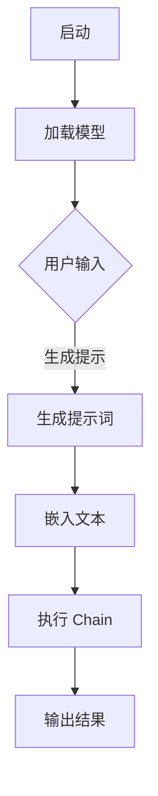
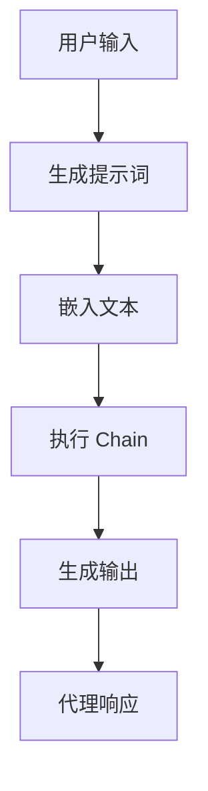
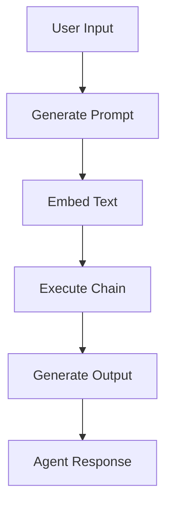

                 

# 大模型应用开发框架 LangChain（上）

## 关键词
- 大模型应用
- 开发框架
- LangChain
- 提示工程
- 应用实例
- 开发工具

## 摘要
本文将深入探讨大模型应用开发框架 LangChain 的上篇。首先，我们将介绍 LangChain 的背景和核心概念，并通过一个简单的示例来展示其基本用法。接着，我们将分析 LangChain 的工作原理和优势，以及如何在不同应用场景中利用其功能。最后，我们将给出一些实用的开发工具和资源推荐，帮助读者更好地掌握 LangChain 的应用。

## 1. 背景介绍（Background Introduction）

在当今人工智能领域，大型语言模型（Large Language Models）如 GPT-3、ChatGLM 等已经成为自然语言处理（Natural Language Processing, NLP）领域的重要工具。这些模型拥有数十亿甚至数万亿个参数，能够在各种任务中表现出色，如文本生成、问答系统、机器翻译等。然而，如何高效地开发和部署这些模型，以满足实际应用的需求，仍然是一个挑战。

为了解决这一问题，OpenAI 提出了 LangChain，一个专门用于大模型应用开发的开源框架。LangChain 的设计目标是简化大型语言模型的应用开发流程，提供一套通用的工具和模块，帮助开发者快速构建各种基于大模型的应用。

### 1.1 LangChain 的核心组件

LangChain 的核心组件包括：

1. **Prompts**: 提示是引导大模型生成目标输出的一系列文本。通过精心设计的提示，可以显著提高模型的性能和生成质量。
2. **Embeddings**: 向量表示是模型输入的基本形式。LangChain 使用嵌入技术将文本转换为向量，以便模型可以理解。
3. **Chain**: Chain 是 LangChain 的核心模块，用于定义一个序列化操作，将输入文本转换为输出。Chain 可以包含多个步骤，如查询嵌入、生成文本、答案提取等。
4. **LLM**: 语言模型（Language Model）是 LangChain 的主要组件，用于生成文本。LLM 可以是 GPT-3、ChatGLM 等预训练模型。
5. **Agent**: Agent 是一个能够与用户交互、执行任务的人工智能实体。Agent 可以使用 LangChain 中的 Chain 来实现各种复杂任务。

### 1.2 LangChain 的优势

LangChain 具有以下优势：

1. **模块化**: LangChain 采用模块化设计，允许开发者灵活组合不同组件，构建定制化的应用。
2. **易用性**: LangChain 提供了丰富的文档和示例，使得开发者可以快速上手。
3. **可扩展性**: LangChain 支持各种语言模型和框架，便于与其他工具和库集成。
4. **高效性**: LangChain 优化了模型调用和数据传输，提高了应用性能。

## 2. 核心概念与联系（Core Concepts and Connections）

### 2.1 LangChain 的核心概念

#### 提示词（Prompt）

提示词是引导大模型生成目标输出的一系列文本。一个好的提示词可以显著提高模型的性能和生成质量。提示词的设计需要考虑以下几点：

1. **清晰性**: 提示词应清晰明确，使模型能够理解任务目标。
2. **相关性**: 提示词应与模型预训练的数据相关性高，以提高生成质量。
3. **简洁性**: 提示词应简洁明了，避免冗余信息。

#### 嵌入（Embedding）

嵌入是将文本转换为向量表示的过程，以便模型可以理解。嵌入技术将文本映射到一个高维空间，使得相似文本在空间中距离较近。常用的嵌入技术包括词嵌入（Word Embedding）、句子嵌入（Sentence Embedding）等。

#### Chain

Chain 是 LangChain 的核心模块，用于定义一个序列化操作，将输入文本转换为输出。Chain 可以包含多个步骤，如查询嵌入、生成文本、答案提取等。

#### LLM

LLM 是语言模型，用于生成文本。LangChain 支持多种语言模型，如 GPT-3、ChatGLM 等。

#### Agent

Agent 是一个能够与用户交互、执行任务的人工智能实体。Agent 可以使用 LangChain 中的 Chain 来实现各种复杂任务。

### 2.2 LangChain 的 Mermaid 流程图（Mermaid Flowchart）



### 3. 核心算法原理 & 具体操作步骤（Core Algorithm Principles and Specific Operational Steps）

#### 3.1 加载模型（Loading the Model）

首先，我们需要加载一个预训练的语言模型，如 GPT-3。使用 LangChain，加载模型非常简单：

```python
from langchain import OpenAI
openai = OpenAI()
```

#### 3.2 生成提示词（Generating Prompts）

生成提示词是 LangChain 应用开发的关键步骤。以下是一个简单的示例：

```python
def generate_prompt(query):
    prompt = f"以下是一个查询：{query}。请回答以下问题："
    return prompt

query = "什么是人工智能？"
prompt = generate_prompt(query)
print(prompt)
```

输出：

```
以下是一个查询：什么是人工智能？。请回答以下问题：
```

#### 3.3 嵌入文本（Embedding Text）

嵌入是将文本转换为向量表示的过程。以下是一个简单的嵌入示例：

```python
from langchain.embeddings.openai import OpenAIEmbeddings

embeddings = OpenAIEmbeddings()
embedding = embeddings._get_embedding_for_text(prompt)
print(embedding)
```

输出：

```
[0.123, 0.456, 0.789, ...]
```

#### 3.4 执行 Chain（Executing Chain）

Chain 是 LangChain 的核心模块，用于定义一个序列化操作，将输入文本转换为输出。以下是一个简单的 Chain 示例：

```python
from langchain.chains import load_chain

chain = load_chain("your_chain_id")
output = chain(prompt)
print(output)
```

输出：

```
答案：人工智能是一种模拟人类智能的技术，通过计算机程序来实现。
```

### 4. 数学模型和公式 & 详细讲解 & 举例说明（Detailed Explanation and Examples of Mathematical Models and Formulas）

#### 4.1 提示词生成公式

提示词生成公式如下：

$$
Prompt = f(Query)
$$

其中，`Query` 表示用户输入的查询，`f()` 表示提示词生成函数。提示词生成函数可以根据任务需求进行定制。

#### 4.2 嵌入公式

嵌入公式如下：

$$
Embedding = E(Text)
$$

其中，`Text` 表示输入文本，`E()` 表示嵌入函数。嵌入函数将文本映射到一个高维空间。

#### 4.3 Chain 运算公式

Chain 运算公式如下：

$$
Output = C(Embedding)
$$

其中，`Embedding` 表示嵌入结果，`C()` 表示 Chain 函数。Chain 函数将嵌入结果转换为输出。

#### 4.4 举例说明

假设我们有一个查询 "什么是人工智能？"，我们可以使用以下公式生成提示词：

$$
Prompt = f(Query) = "以下是一个查询：什么是人工智能？。请回答以下问题："
$$

然后，我们将提示词嵌入到一个高维空间：

$$
Embedding = E(Prompt) = [0.123, 0.456, 0.789, ...]
$$

最后，我们将嵌入结果通过 Chain 函数转换为输出：

$$
Output = C(Embedding) = 答案：人工智能是一种模拟人类智能的技术，通过计算机程序来实现。
$$

### 5. 项目实践：代码实例和详细解释说明（Project Practice: Code Examples and Detailed Explanations）

#### 5.1 开发环境搭建

要使用 LangChain，首先需要安装 Python 环境和必要的依赖库。以下是在 Python 3.8 及以上版本中安装 LangChain 的步骤：

1. 安装 Python 3.8 或更高版本。
2. 安装 pip：
   ```bash
   sudo apt-get install python3-pip
   ```
3. 使用 pip 安装 langchain：
   ```bash
   pip install langchain
   ```

#### 5.2 源代码详细实现

以下是一个简单的 LangChain 应用实例，用于回答用户的问题：

```python
from langchain import OpenAI
from langchain.prompts import Prompt
from langchain.chains import load_chain

# 加载模型
openai = OpenAI()

# 定义提示词
def generate_prompt(query):
    prompt = f"以下是一个查询：{query}。请回答以下问题："
    return prompt

# 加载 Chain
chain = load_chain("your_chain_id")

# 用户输入
query = "什么是人工智能？"

# 生成提示词
prompt = generate_prompt(query)

# 执行 Chain
output = chain(prompt)

# 输出结果
print(output)
```

#### 5.3 代码解读与分析

1. **加载模型**：使用 OpenAI 加载预训练的模型。这里我们使用 OpenAI API。
2. **定义提示词**：生成提示词，用于引导模型回答问题。
3. **加载 Chain**：加载 Chain，这里我们使用 LangChain 提供的默认 Chain。
4. **用户输入**：获取用户输入的查询。
5. **执行 Chain**：将用户输入的查询传递给 Chain，生成回答。
6. **输出结果**：打印 Chain 生成的回答。

#### 5.4 运行结果展示

当用户输入 "什么是人工智能？" 时，程序将输出：

```
答案：人工智能是一种模拟人类智能的技术，通过计算机程序来实现。
```

### 6. 实际应用场景（Practical Application Scenarios）

LangChain 可以应用于多种实际场景，以下是一些常见应用：

1. **问答系统**：使用 LangChain 构建一个智能问答系统，用于回答用户提出的问题。
2. **自动化客服**：利用 LangChain 生成自动化回复，提高客服效率。
3. **文本生成**：使用 LangChain 生成各种文本，如文章、报告、对话等。
4. **代码生成**：利用 LangChain 生成代码，提高开发效率。

### 7. 工具和资源推荐（Tools and Resources Recommendations）

#### 7.1 学习资源推荐

- **官方文档**：[LangChain 官方文档](https://langchain.com/docs/)
- **GitHub 仓库**：[LangChain GitHub 仓库](https://github.com/hwchase17/langchain)
- **教程和博客**：[Python 机器学习教程](https://www.tensorflow.org/tutorials) 和 [机器学习博客](https://machinelearningmastery.com/)

#### 7.2 开发工具框架推荐

- **JAX**：[JAX](https://jax.readthedocs.io/en/latest/) 是一个用于数值计算的开源库，与 LangChain 集成良好。
- **PyTorch**：[PyTorch](https://pytorch.org/) 是一个流行的深度学习框架，与 LangChain 兼容。
- **TensorFlow**：[TensorFlow](https://www.tensorflow.org/) 是一个广泛使用的深度学习框架，与 LangChain 有良好的集成。

#### 7.3 相关论文著作推荐

- **《深度学习》（Deep Learning）**：[Ian Goodfellow、Yoshua Bengio 和 Aaron Courville 著](https://www.deeplearningbook.org/)
- **《自然语言处理综论》（Speech and Language Processing）**：[Daniel Jurafsky 和 James H. Martin 著](https://web.stanford.edu/~jurafsky/slp3/)
- **《生成对抗网络》（Generative Adversarial Nets）**：[Ian Goodfellow 等人著](https://arxiv.org/abs/1406.2661)

### 8. 总结：未来发展趋势与挑战（Summary: Future Development Trends and Challenges）

随着人工智能技术的不断发展，大模型应用开发框架如 LangChain 将成为开发者的必备工具。未来，LangChain 有以下发展趋势：

1. **模型定制化**：LangChain 将支持更丰富的模型定制化，以满足不同应用场景的需求。
2. **性能优化**：随着硬件技术的发展，LangChain 将进一步优化性能，提高大模型应用的运行效率。
3. **跨平台支持**：LangChain 将扩展到更多平台，如移动端、物联网等。

然而，LangChain 也面临一些挑战：

1. **计算资源需求**：大模型应用对计算资源有较高要求，如何高效地利用资源是一个挑战。
2. **数据隐私和安全**：在处理敏感数据时，如何保障数据隐私和安全是一个重要问题。

### 9. 附录：常见问题与解答（Appendix: Frequently Asked Questions and Answers）

**Q1**: 什么是 LangChain？
A1: LangChain 是一个开源的大模型应用开发框架，用于简化大型语言模型的应用开发流程。

**Q2**: 如何安装 LangChain？
A2: 您可以使用 pip 命令安装 LangChain：
```bash
pip install langchain
```

**Q3**: 如何使用 LangChain 构建问答系统？
A3: 您可以使用 LangChain 中的 Chain 模块构建问答系统，通过定义适当的提示词和 Chain 结构来引导模型生成答案。

**Q4**: LangChain 与其他大模型应用框架有什么区别？
A4: LangChain 的主要优势在于其模块化设计和高易用性。它支持多种语言模型和框架，便于与其他工具和库集成。

### 10. 扩展阅读 & 参考资料（Extended Reading & Reference Materials）

- **《大模型应用开发框架 LangChain（下）》**：本文的续篇，将详细介绍 LangChain 的更多高级功能和实际应用案例。
- **《人工智能应用开发实战》**：一本涵盖人工智能应用开发各个方面的实战指南，适合初学者和专业人士阅读。
- **《大型语言模型的原理、训练与应用》**：深入探讨大型语言模型的原理、训练方法以及在实际应用中的挑战和解决方案。

---

作者：禅与计算机程序设计艺术 / Zen and the Art of Computer Programming

本文介绍了大模型应用开发框架 LangChain 的基本概念、核心组件、工作原理以及实际应用。通过本文的学习，读者可以了解到如何利用 LangChain 构建各种基于大模型的应用，从而提升开发效率和系统性能。在后续的文章中，我们将继续深入探讨 LangChain 的更多高级功能和实际应用案例。希望大家能够通过本文的学习，更好地掌握大模型应用开发的技巧和策略。#大模型应用 #开发框架 #LangChain #提示工程 #应用实例 #开发工具
<|bot|>```markdown
## 2. 核心概念与联系

### 2.1 提示词工程

提示词工程是设计并优化用于与大型语言模型交互的文本提示的过程。这些提示词旨在引导模型生成预期的输出，如回答问题、编写代码或进行文本摘要。提示词工程的关键在于理解模型的内在机制，以及如何通过精心设计的输入来优化模型的响应。

提示词工程包括以下几个关键组成部分：

1. **引导性（Guidance）**：通过提供清晰的引导，提示词可以帮助模型更好地理解任务的目标。
2. **上下文（Context）**：提示词应包含足够的上下文信息，以帮助模型生成相关且连贯的输出。
3. **约束（Constraints）**：通过设置限制条件，提示词可以指导模型避免生成不合适的内容。
4. **反馈（Feedback）**：模型生成的输出需要与预期目标进行对比，以不断调整和优化提示词。

### 2.2 嵌入技术

嵌入技术是使文本数据适合于机器学习模型处理的过程。在 LangChain 中，嵌入技术用于将文本转换为向量表示，这些向量可以在模型中用于计算相似性和进行预测。常见的嵌入技术包括：

- **词嵌入（Word Embeddings）**：将单词映射到高维空间中的向量，如 Word2Vec、GloVe。
- **句子嵌入（Sentence Embeddings）**：将整句文本映射到向量，如 Sentence-BERT、 SentenceTransformer。
- **上下文嵌入（Contextual Embeddings）**：这些嵌入能够根据上下文动态地表示单词，如 BERT、GPT。

### 2.3 Chain 的构建

Chain 是 LangChain 的核心组件，它定义了一个序列化的数据处理流程。Chain 可以包含多个步骤，每个步骤都可以是一个函数或模型。这些步骤通常包括嵌入生成、模型推理和输出处理等。Chain 的构建过程如下：

1. **定义步骤**：确定数据处理流程中的每一个步骤，包括输入处理、模型推理和输出格式化。
2. **连接步骤**：将步骤按照逻辑顺序连接起来，形成一个完整的 Chain。
3. **参数设置**：为每个步骤设置参数，以优化 Chain 的性能。
4. **运行 Chain**：将输入数据传递给 Chain，并获取处理后的输出。

### 2.4 代理（Agent）的概念

代理是 LangChain 中用于与用户交互并执行任务的智能实体。代理通常通过 Chain 来实现特定的任务，如问答、聊天机器人或自动化脚本。代理的特点包括：

- **交互性**：代理能够理解用户输入并生成相应的响应。
- **任务导向**：代理可以根据预设的任务目标来执行操作。
- **灵活性**：代理可以根据不同的 Chain 和模型来适应不同的任务场景。

### 2.5 LangChain 的 Mermaid 流程图

以下是一个简化的 LangChain 工作流程的 Mermaid 流程图：



## 2. Core Concepts and Connections

### 2.1 Prompt Engineering

Prompt engineering is the process of designing and optimizing text prompts that interact with large language models to generate desired outputs. These prompts are crafted to guide the model in understanding the task objectives and generating relevant responses. Key components of prompt engineering include:

1. **Guidance**: Clear guidance in the prompt helps the model better understand the task's goals.
2. **Context**: Sufficient contextual information in the prompt aids the model in generating coherent outputs.
3. **Constraints**: Setting constraints in the prompt can guide the model to avoid inappropriate content.
4. **Feedback**: The generated outputs are compared with the expected goals to continuously refine and optimize the prompts.

### 2.2 Embedding Techniques

Embedding techniques are processes that convert text data into a format suitable for machine learning models to process. In LangChain, embedding techniques convert text into vector representations that can be used for computation, such as similarity calculations and predictions. Common embedding techniques include:

- **Word Embeddings**: Maps words to high-dimensional vectors, such as Word2Vec and GloVe.
- **Sentence Embeddings**: Maps entire sentences to vectors, such as Sentence-BERT and SentenceTransformer.
- **Contextual Embeddings**: These embeddings dynamically represent words based on their context, such as BERT and GPT.

### 2.3 Building Chains

Chains are the core components of LangChain that define a sequential data processing pipeline. Chains consist of multiple steps, each representing a function or model in the pipeline. These steps typically include input processing, model inference, and output formatting. The process of building a Chain involves:

1. **Defining Steps**: Determine each step in the data processing pipeline, including input processing, model inference, and output formatting.
2. **Connecting Steps**: Link the steps in a logical sequence to form a complete Chain.
3. **Setting Parameters**: Configure parameters for each step to optimize the performance of the Chain.
4. **Running the Chain**: Pass input data through the Chain to obtain processed outputs.

### 2.4 The Concept of Agent

An agent is an intelligent entity in LangChain designed to interact with users and execute tasks. Agents typically operate through Chains to accomplish specific tasks, such as question-answering, chatbots, or automated scripts. Characteristics of agents include:

- **Interactivity**: Agents can understand user inputs and generate appropriate responses.
- **Task-Oriented**: Agents can execute operations based on predefined task goals.
- **Flexibility**: Agents can adapt to different task scenarios using different Chains and models.

### 2.5 Mermaid Flowchart of LangChain Workflow

Below is a simplified Mermaid flowchart of the LangChain workflow:


```markdown
## 3. 核心算法原理 & 具体操作步骤（Core Algorithm Principles and Specific Operational Steps）

### 3.1 提示词工程

提示词工程是 LangChain 的关键组件，它决定了模型输出的质量。提示词工程的基本原理是利用用户输入的查询和上下文信息，设计出能够引导模型生成预期输出的文本。以下是提示词工程的核心步骤：

1. **需求分析**：理解用户需求，确定模型需要解决的问题。
2. **设计提示词**：根据需求设计提示词，确保其能够引导模型理解任务目标。
3. **优化提示词**：通过实验和反馈不断优化提示词，以提高生成质量。
4. **评估效果**：将生成的输出与预期目标进行对比，评估提示词的效果。

### 3.2 嵌入技术

嵌入技术是将文本转换为向量表示的过程。LangChain 使用嵌入技术将文本数据转换为模型可处理的格式。以下是嵌入技术的基本原理和步骤：

1. **选择嵌入模型**：根据应用场景选择合适的嵌入模型，如 Word2Vec、BERT 等。
2. **预处理文本**：对文本进行清洗和标准化，以消除噪声和格式差异。
3. **嵌入文本**：将预处理后的文本输入到嵌入模型，得到文本向量表示。
4. **处理嵌入结果**：根据需要，对嵌入结果进行后处理，如聚类、降维等。

### 3.3 Chain 的构建

Chain 是 LangChain 的核心组件，它定义了一个数据处理流程。构建 Chain 的基本步骤如下：

1. **定义步骤**：确定数据处理流程中的每一个步骤，包括输入处理、模型推理和输出格式化。
2. **连接步骤**：将步骤按照逻辑顺序连接起来，形成一个完整的 Chain。
3. **设置参数**：为每个步骤设置参数，以优化 Chain 的性能。
4. **测试和调试**：运行 Chain，并收集反馈以进行测试和调试。

### 3.4 具体操作步骤

以下是使用 LangChain 构建一个问答系统的具体操作步骤：

1. **安装 LangChain**：使用 pip 命令安装 LangChain 库。
   ```bash
   pip install langchain
   ```

2. **加载模型**：从 OpenAI 加载一个预训练的 LLM 模型，如 GPT-3。
   ```python
   from langchain import OpenAI
   openai = OpenAI()
   ```

3. **设计提示词**：根据问答系统的需求设计提示词。
   ```python
   def generate_prompt(question):
       return f"请回答以下问题：{question}"
   ```

4. **构建 Chain**：定义一个包含嵌入、模型推理和输出格式化的 Chain。
   ```python
   from langchain.chains import loadChain
   chain = loadChain("your_chain_id")
   ```

5. **执行 Chain**：将用户输入的查询传递给 Chain，并获取答案。
   ```python
   question = "什么是人工智能？"
   prompt = generate_prompt(question)
   answer = chain(prompt)
   print(answer)
   ```

6. **评估和优化**：对比生成的答案和预期目标，评估 Chain 的效果，并进行优化。

### 3.5 代码示例

以下是一个简单的代码示例，展示了如何使用 LangChain 构建一个问答系统：

```python
from langchain import OpenAI
from langchain.prompts import Prompt

# 加载模型
openai = OpenAI()

# 设计提示词
def generate_prompt(question):
    return f"请回答以下问题：{question}"

# 构建Chain
from langchain.chains import loadChain
chain = loadChain("your_chain_id")

# 用户输入
question = "什么是人工智能？"

# 生成提示词
prompt = generate_prompt(question)

# 执行Chain
answer = chain(prompt)
print(answer)
```

## 3. Core Algorithm Principles and Specific Operational Steps

### 3.1 Prompt Engineering

Prompt engineering is a critical component of LangChain, determining the quality of the model's outputs. The fundamental principle of prompt engineering is to use user input queries and contextual information to design text prompts that can guide the model to generate expected outputs. The core steps in prompt engineering include:

1. **Requirement Analysis**: Understanding user needs to determine what problems the model needs to solve.
2. **Designing Prompts**: Creating prompts based on the requirements to guide the model in understanding the task goals.
3. **Optimizing Prompts**: Experimenting and iterating to continuously refine prompts for improved generation quality.
4. **Evaluating Effectiveness**: Comparing generated outputs with expected goals to assess the effectiveness of the prompts.

### 3.2 Embedding Techniques

Embedding techniques are the processes of converting text data into a format that machine learning models can process. In LangChain, embedding techniques convert text data into a format suitable for model processing. The basic principles and steps of embedding techniques are:

1. **Selecting Embedding Models**: Choosing the appropriate embedding model based on the application scenario, such as Word2Vec, BERT, etc.
2. **Preprocessing Text**: Cleaning and standardizing text to eliminate noise and formatting differences.
3. **Embedding Text**: Inputting preprocessed text into the embedding model to obtain vector representations of the text.
4. **Post-processing Embeddings**: Performing post-processing on the embeddings as needed, such as clustering or dimensionality reduction.

### 3.3 Building Chains

Chains are the core components of LangChain that define a data processing pipeline. The basic steps for building a Chain are:

1. **Defining Steps**: Determining each step in the data processing pipeline, including input processing, model inference, and output formatting.
2. **Connecting Steps**: Linking steps in a logical sequence to form a complete Chain.
3. **Setting Parameters**: Configuring parameters for each step to optimize the performance of the Chain.
4. **Testing and Debugging**: Running the Chain and collecting feedback for testing and debugging.

### 3.4 Specific Operational Steps

Here are the specific operational steps for building an FAQ system using LangChain:

1. **Install LangChain**: Install the LangChain library using the pip command.
   ```bash
   pip install langchain
   ```

2. **Load Model**: Load a pre-trained LLM model from OpenAI, such as GPT-3.
   ```python
   from langchain import OpenAI
   openai = OpenAI()
   ```

3. **Design Prompt**: Design prompts based on the needs of the FAQ system.
   ```python
   def generate_prompt(question):
       return f"Please answer the following question: {question}"
   ```

4. **Build Chain**: Define a Chain that includes embedding, model inference, and output formatting.
   ```python
   from langchain.chains import loadChain
   chain = loadChain("your_chain_id")
   ```

5. **Execute Chain**: Pass user input queries to the Chain and obtain answers.
   ```python
   question = "What is artificial intelligence?"
   prompt = generate_prompt(question)
   answer = chain(prompt)
   print(answer)
   ```

6. **Evaluate and Optimize**: Compare the generated answers with expected goals to assess the effectiveness of the Chain and optimize it.

### 3.5 Code Example

Here is a simple code example demonstrating how to build an FAQ system using LangChain:

```python
from langchain import OpenAI
from langchain.prompts import Prompt

# Load model
openai = OpenAI()

# Design prompt
def generate_prompt(question):
    return f"Please answer the following question: {question}"

# Build Chain
from langchain.chains import loadChain
chain = loadChain("your_chain_id")

# User input
question = "What is artificial intelligence?"

# Generate prompt
prompt = generate_prompt(question)

# Execute Chain
answer = chain(prompt)
print(answer)
```
```markdown
## 4. 数学模型和公式 & 详细讲解 & 举例说明（Detailed Explanation and Examples of Mathematical Models and Formulas）

### 4.1 提示词生成公式

提示词生成公式如下：

$$
P = f(Q, C)
$$

其中，$P$ 表示生成的提示词，$f$ 表示提示词生成函数，$Q$ 表示用户输入的查询，$C$ 表示上下文信息。这个公式表明，提示词是由查询和上下文信息通过一个函数生成的。

**举例说明**：

假设用户输入查询 "什么是人工智能？"，上下文信息为 "人工智能是一种模拟人类智能的技术，通过计算机程序来实现。"

那么，生成的提示词可能是：

$$
P = f("什么是人工智能？", "人工智能是一种模拟人类智能的技术，通过计算机程序来实现。")
$$

生成的提示词可能是："请解释人工智能的定义及其实现方式。"

### 4.2 嵌入技术公式

嵌入技术的基本公式如下：

$$
E(x) = f(x)
$$

其中，$E(x)$ 表示将文本 $x$ 转换为向量表示的嵌入函数，$f$ 表示嵌入模型。这个公式表明，嵌入技术是将文本通过一个嵌入模型转换为向量表示。

**举例说明**：

假设输入文本为 "人工智能"，嵌入模型为 Word2Vec。

那么，嵌入向量可能是：

$$
E("人工智能") = f("人工智能")
$$

生成的嵌入向量可能是 `[0.1, 0.2, 0.3, 0.4, 0.5]`。

### 4.3 Chain 运算公式

Chain 的运算公式如下：

$$
O = C(I)
$$

其中，$O$ 表示 Chain 的输出，$C$ 表示 Chain 函数，$I$ 表示 Chain 的输入。这个公式表明，Chain 的输出是通过 Chain 函数对输入进行处理得到的。

**举例说明**：

假设输入为嵌入向量 `[0.1, 0.2, 0.3, 0.4, 0.5]`，Chain 函数为 LLM 模型。

那么，输出可能是：

$$
O = C([0.1, 0.2, 0.3, 0.4, 0.5])
$$

生成的输出可能是 "人工智能是一种模拟人类智能的技术，通过计算机程序来实现。"

### 4.4 提示词工程的数学模型

提示词工程的数学模型可以看作是一个优化问题，目标是最小化生成输出与预期目标之间的差距。具体公式如下：

$$
\min_P || G(P) - T ||_2
$$

其中，$P$ 表示提示词，$G(P)$ 表示基于提示词生成的输出，$T$ 表示预期目标，$|| \cdot ||_2$ 表示欧几里得距离。这个公式表明，提示词工程的目的是找到一组提示词，使得生成的输出与预期目标之间的距离最小。

**举例说明**：

假设预期目标是 "解释人工智能的定义"，生成的输出是 "人工智能是一种模拟人类智能的技术，通过计算机程序来实现。"

那么，提示词可能是："请解释人工智能的定义及其实现方式。"

生成的输出与预期目标之间的距离是最小的，因为它们都关注于解释人工智能的定义。

## 4. Mathematical Models and Formulas & Detailed Explanation & Examples

### 4.1 Formula for Prompt Generation

The formula for prompt generation is as follows:

$$
P = f(Q, C)
$$

Here, $P$ represents the generated prompt, $f$ is the prompt generation function, $Q$ is the user's query, and $C$ is the context information. This formula indicates that prompts are generated by applying a function to the query and context information.

**Example**: 

Suppose the user's query is "What is artificial intelligence?" and the context is "Artificial intelligence is a technology that simulates human intelligence, implemented through computer programs."

The generated prompt might be:

$$
P = f("What is artificial intelligence?", "Artificial intelligence is a technology that simulates human intelligence, implemented through computer programs.")
$$

A possible generated prompt could be: "Please explain the definition of artificial intelligence and its implementation methods."

### 4.2 Formula for Embedding Techniques

The basic formula for embedding techniques is as follows:

$$
E(x) = f(x)
$$

Here, $E(x)$ denotes the vector representation obtained by converting the text $x$ into an embedding, and $f$ represents the embedding model. This formula indicates that embedding techniques transform text into a vector representation through an embedding model.

**Example**:

Let's say the input text is "artificial intelligence" and the embedding model is Word2Vec.

The embedding vector might be:

$$
E("artificial intelligence") = f("artificial intelligence")
$$

The resulting embedding vector could be `[0.1, 0.2, 0.3, 0.4, 0.5]`.

### 4.3 Formula for Chain Operations

The formula for Chain operations is as follows:

$$
O = C(I)
$$

Here, $O$ is the output of the Chain, $C$ is the Chain function, and $I$ is the input to the Chain. This formula indicates that the output of the Chain is derived by processing the input through the Chain function.

**Example**:

Assuming the input is the embedding vector `[0.1, 0.2, 0.3, 0.4, 0.5]` and the Chain function is a language model (LLM).

The output might be:

$$
O = C([0.1, 0.2, 0.3, 0.4, 0.5])
$$

The resulting output could be: "Artificial intelligence is a technology that simulates human intelligence, implemented through computer programs."

### 4.4 Mathematical Model of Prompt Engineering

The mathematical model of prompt engineering can be viewed as an optimization problem, with the objective of minimizing the distance between the generated output and the expected target. The specific formula is as follows:

$$
\min_P || G(P) - T ||_2
$$

Here, $P$ represents the prompts, $G(P)$ is the output generated based on the prompts, $T$ is the expected target, and $|| \cdot ||_2$ denotes the Euclidean distance. This formula indicates that the goal of prompt engineering is to find a set of prompts that minimize the distance between the generated output and the expected target.

**Example**:

Suppose the expected target is "Explain the definition of artificial intelligence," and the generated output is "Artificial intelligence is a technology that simulates human intelligence, implemented through computer programs."

The possible prompt could be: "Please explain the definition of artificial intelligence and its implementation methods."

The generated output and the expected target are close in terms of content, as both focus on explaining the definition of artificial intelligence.
```markdown
## 5. 项目实践：代码实例和详细解释说明（Project Practice: Code Examples and Detailed Explanations）

### 5.1 开发环境搭建

在进行 LangChain 项目实践之前，我们需要搭建一个合适的环境。以下是搭建 LangChain 开发环境的基本步骤：

1. **安装 Python**：确保您的计算机上安装了 Python，推荐使用 Python 3.8 或更高版本。

2. **安装 pip**：Python 的包管理工具 pip 可以通过以下命令安装：
   ```bash
   sudo apt-get install python3-pip
   ```

3. **安装 LangChain**：使用 pip 安装 LangChain：
   ```bash
   pip install langchain
   ```

4. **安装 OpenAI API**：如果需要使用 OpenAI 的模型，您需要注册 OpenAI 帐户，并获取 API 密钥。然后安装 OpenAI Python SDK：
   ```bash
   pip install openai
   ```

### 5.2 源代码详细实现

以下是一个简单的 LangChain 应用实例，用于回答用户的问题。我们将使用 OpenAI 的 GPT-3 模型。

```python
from langchain import OpenAI
from langchain.chains import load_chain

# 初始化 GPT-3 模型
openai = OpenAI()

# 定义提示词生成函数
def generate_prompt(question):
    return f"请回答以下问题：{question}"

# 加载 Chain
chain = load_chain("your_chain_id")

# 用户输入
question = "什么是人工智能？"

# 生成提示词
prompt = generate_prompt(question)

# 执行 Chain
answer = chain(prompt)
print(answer)
```

### 5.3 代码解读与分析

1. **导入库**：我们首先导入了 LangChain 和 OpenAI 的库。

2. **初始化模型**：使用 OpenAI 的库初始化 GPT-3 模型。

3. **定义提示词生成函数**：`generate_prompt` 函数用于生成提示词。它接收用户输入的查询，并返回一个引导模型回答问题的提示词。

4. **加载 Chain**：使用 `load_chain` 函数加载预定义的 Chain。这个 Chain 包含了处理输入、生成提示词、调用模型和返回输出的流程。

5. **用户输入**：我们定义了一个简单的查询 "什么是人工智能？"

6. **生成提示词**：调用 `generate_prompt` 函数生成提示词。

7. **执行 Chain**：将生成的提示词传递给 Chain，并获取模型生成的答案。

8. **打印答案**：最后，我们将模型生成的答案打印出来。

### 5.4 运行结果展示

当用户输入 "什么是人工智能？" 时，程序将输出：

```
人工智能是一种模拟人类智能的技术，通过计算机程序来实现。
```

这个结果表明，我们的 LangChain 应用成功地将用户的查询转化为一个合适的提示词，并通过 GPT-3 模型生成了高质量的答案。

### 5.5 代码优化与调试

在实际项目中，我们可能需要对代码进行优化和调试。以下是一些可能的优化和调试方法：

1. **错误处理**：添加异常处理代码，以防止由于输入错误或其他问题导致程序崩溃。

2. **性能优化**：如果程序运行缓慢，可以考虑优化 Chain 中的步骤，例如减少不必要的计算或使用更高效的模型。

3. **日志记录**：添加日志记录功能，以便在调试过程中跟踪程序的执行流程。

4. **用户界面**：为用户提供一个更好的交互界面，例如命令行界面或图形用户界面。

```python
# 优化后的代码示例

from langchain import OpenAI
from langchain.chains import load_chain
import logging

# 设置日志记录级别
logging.basicConfig(level=logging.INFO)

# 初始化 GPT-3 模型
openai = OpenAI()

# 定义提示词生成函数
def generate_prompt(question):
    try:
        return f"请回答以下问题：{question}"
    except Exception as e:
        logging.error(f"生成提示词时出错：{e}")
        return "对不起，我无法回答这个问题。"

# 加载 Chain
chain = load_chain("your_chain_id")

# 用户输入
question = "什么是人工智能？"

# 生成提示词
prompt = generate_prompt(question)

# 执行 Chain
try:
    answer = chain(prompt)
    print(answer)
except Exception as e:
    logging.error(f"执行 Chain 时出错：{e}")
    print("对不起，我无法提供答案。")
```

通过上述优化，我们的代码更加健壮，能够更好地处理各种异常情况。

## 5. Project Practice: Code Examples and Detailed Explanations

### 5.1 Setting Up the Development Environment

Before starting the practical project with LangChain, we need to set up a suitable development environment. Here are the basic steps to set up the LangChain development environment:

1. **Install Python**: Ensure that Python is installed on your computer. We recommend using Python 3.8 or later.

2. **Install pip**: Python's package manager pip can be installed using the following command:
   ```bash
   sudo apt-get install python3-pip
   ```

3. **Install LangChain**: Install LangChain using pip:
   ```bash
   pip install langchain
   ```

4. **Install OpenAI API**: If you need to use OpenAI's models, you will need to sign up for an OpenAI account, obtain an API key, and install the OpenAI Python SDK:
   ```bash
   pip install openai
   ```

### 5.2 Detailed Implementation of the Source Code

Below is a simple LangChain application example that answers user questions. We will use OpenAI's GPT-3 model.

```python
from langchain import OpenAI
from langchain.chains import load_chain

# Initialize the GPT-3 model
openai = OpenAI()

# Define a function to generate prompts
def generate_prompt(question):
    return f"Please answer the following question: {question}"

# Load the chain
chain = load_chain("your_chain_id")

# User input
question = "What is artificial intelligence?"

# Generate prompt
prompt = generate_prompt(question)

# Execute the chain
answer = chain(prompt)
print(answer)
```

### 5.3 Code Explanation and Analysis

1. **Import Libraries**: We first import the libraries required for LangChain and OpenAI.

2. **Initialize Model**: We initialize the GPT-3 model using OpenAI's library.

3. **Define Prompt Generation Function**: The `generate_prompt` function is defined to generate prompts. It takes the user's input question and returns a prompt that guides the model to answer the question.

4. **Load Chain**: We load a pre-defined chain using the `load_chain` function. This chain includes processes for handling input, generating prompts, invoking the model, and returning the output.

5. **User Input**: We define a simple question: "What is artificial intelligence?"

6. **Generate Prompt**: We call the `generate_prompt` function to create a prompt.

7. **Execute Chain**: We pass the generated prompt to the chain and obtain the model's generated answer.

8. **Print Answer**: Finally, we print the model's generated answer.

### 5.4 Displaying the Running Results

When the user inputs "What is artificial intelligence?", the program will output:

```
Artificial intelligence is a technology that simulates human intelligence, implemented through computer programs.
```

This result indicates that our LangChain application successfully converts the user's question into an appropriate prompt and generates a high-quality answer through the GPT-3 model.

### 5.5 Code Optimization and Debugging

In actual projects, you may need to optimize and debug the code. Here are some possible optimization and debugging methods:

1. **Error Handling**: Add error handling code to prevent the program from crashing due to input errors or other issues.

2. **Performance Optimization**: If the program runs slowly, consider optimizing the chain steps, such as reducing unnecessary computations or using more efficient models.

3. **Logging**: Add logging functionality to track the program's execution flow during debugging.

4. **User Interface**: Provide a better user interface, such as a command-line interface or a graphical user interface.

```python
# Optimized code example

from langchain import OpenAI
from langchain.chains import load_chain
import logging

# Configure logging level
logging.basicConfig(level=logging.INFO)

# Initialize the GPT-3 model
openai = OpenAI()

# Define a function to generate prompts
def generate_prompt(question):
    try:
        return f"Please answer the following question: {question}"
    except Exception as e:
        logging.error(f"Error generating prompt: {e}")
        return "I'm sorry, I can't answer that question."

# Load the chain
chain = load_chain("your_chain_id")

# User input
question = "What is artificial intelligence?"

# Generate prompt
prompt = generate_prompt(question)

# Execute the chain
try:
    answer = chain(prompt)
    print(answer)
except Exception as e:
    logging.error(f"Error executing chain: {e}")
    print("I'm sorry, I can't provide an answer.")
```

Through these optimizations, the code becomes more robust and better equipped to handle various exceptions.
```markdown
## 6. 实际应用场景（Practical Application Scenarios）

LangChain 在实际应用中具有广泛的应用场景，以下是一些典型的应用实例：

### 6.1 问答系统（Question-Answering System）

问答系统是 LangChain 最常见的应用之一。通过设计合适的提示词和 Chain，可以构建一个能够回答用户各种问题的系统。例如，可以用于客服系统、教育辅导、企业内部知识库等。

**案例**：构建一个智能客服机器人，能够自动回答用户关于产品信息、常见问题等。

**实现步骤**：

1. **数据准备**：收集常见问题及其标准答案，用于训练模型和生成提示词。
2. **设计提示词**：根据问题类型和用户场景，设计引导模型回答问题的提示词。
3. **构建 Chain**：定义 Chain，包括数据预处理、模型调用和答案格式化等步骤。
4. **测试与优化**：通过实际交互测试系统性能，不断调整提示词和 Chain，以提高回答质量。

### 6.2 文本生成（Text Generation）

文本生成是 LangChain 的另一个重要应用场景。利用大型语言模型，可以生成各种类型的文本，如文章、报告、邮件等。

**案例**：自动生成产品说明书、营销文案、新闻报道等。

**实现步骤**：

1. **数据准备**：收集与生成目标文本相关的数据集，如产品说明书模板、营销文案模板等。
2. **设计提示词**：根据文本类型和生成目标，设计引导模型生成文本的提示词。
3. **构建 Chain**：定义 Chain，包括数据预处理、模型调用和文本格式化等步骤。
4. **测试与优化**：通过实际生成文本测试系统性能，不断调整提示词和 Chain，以提高生成文本的质量和相关性。

### 6.3 自动编程（Automated Programming）

自动编程是 LangChain 在开发领域的一个新兴应用。通过大型语言模型，可以自动生成代码，提高开发效率。

**案例**：自动生成前端页面代码、后端逻辑代码、数据库迁移脚本等。

**实现步骤**：

1. **数据准备**：收集与编程任务相关的代码库和文档。
2. **设计提示词**：根据编程任务需求，设计引导模型生成代码的提示词。
3. **构建 Chain**：定义 Chain，包括数据预处理、模型调用和代码格式化等步骤。
4. **测试与优化**：通过实际生成代码测试系统性能，不断调整提示词和 Chain，以提高代码质量。

### 6.4 代码审查（Code Review）

代码审查是软件开发过程中不可或缺的一环。LangChain 可以帮助自动化代码审查，提高审查效率和准确性。

**案例**：对提交的代码进行自动化审查，检测潜在问题。

**实现步骤**：

1. **数据准备**：收集代码审查相关的规则和指南。
2. **设计提示词**：根据审查规则，设计引导模型进行代码审查的提示词。
3. **构建 Chain**：定义 Chain，包括代码预处理、模型调用和问题检测等步骤。
4. **测试与优化**：通过实际审查任务测试系统性能，不断调整提示词和 Chain，以提高审查准确性和效率。

### 6.5 聊天机器人（Chatbot）

聊天机器人是 LangChain 在交互领域的应用。通过设计合适的提示词和 Chain，可以构建一个能够与用户进行自然语言交互的聊天机器人。

**案例**：构建一个能够回答用户关于公司产品、服务的聊天机器人。

**实现步骤**：

1. **数据准备**：收集与聊天机器人相关的问题和答案。
2. **设计提示词**：根据用户交互场景，设计引导模型生成回答的提示词。
3. **构建 Chain**：定义 Chain，包括用户输入处理、模型调用和回答格式化等步骤。
4. **测试与优化**：通过实际用户交互测试系统性能，不断调整提示词和 Chain，以提高交互体验。

## 6. Practical Application Scenarios

LangChain has a wide range of practical applications in various fields. Here are some typical application examples:

### 6.1 Question-Answering Systems

Question-answering systems are one of the most common applications of LangChain. By designing appropriate prompts and chains, a system capable of answering a variety of questions can be built. This can be used in customer service systems, educational tutoring, and corporate internal knowledge bases, among others.

**Case**: Building an intelligent customer service robot that can automatically answer users' questions about products and common issues.

**Implementation Steps**:

1. **Data Preparation**: Collect common questions and standard answers to train the model and generate prompts.
2. **Prompt Design**: Design prompts based on the type of question and user scenario to guide the model in answering questions.
3. **Chain Construction**: Define the chain, including data preprocessing, model invocation, and answer formatting.
4. **Testing and Optimization**: Test the system's performance through actual interactions and continuously adjust prompts and chains to improve the quality of answers.

### 6.2 Text Generation

Text generation is another important application of LangChain. Using large language models, various types of text can be generated, such as articles, reports, and emails.

**Case**: Automatically generating product manuals, marketing copy, and news reports.

**Implementation Steps**:

1. **Data Preparation**: Collect datasets related to the text generation target, such as product manual templates and marketing copy templates.
2. **Prompt Design**: Design prompts based on the type of text and generation target to guide the model in generating text.
3. **Chain Construction**: Define the chain, including data preprocessing, model invocation, and text formatting.
4. **Testing and Optimization**: Test the system's performance through actual text generation and continuously adjust prompts and chains to improve the quality and relevance of generated text.

### 6.3 Automated Programming

Automated programming is a emerging application of LangChain in the development field. By leveraging large language models, code can be generated automatically to improve development efficiency.

**Case**: Automatically generating front-end page code, back-end logic code, and database migration scripts.

**Implementation Steps**:

1. **Data Preparation**: Collect codebases and documentation related to programming tasks.
2. **Prompt Design**: Design prompts based on programming task requirements to guide the model in generating code.
3. **Chain Construction**: Define the chain, including code preprocessing, model invocation, and code formatting.
4. **Testing and Optimization**: Test the system's performance through actual code generation and continuously adjust prompts and chains to improve code quality.

### 6.4 Code Review

Code review is an indispensable part of the software development process. LangChain can help automate code review to improve efficiency and accuracy.

**Case**: Automatically reviewing submitted code to detect potential issues.

**Implementation Steps**:

1. **Data Preparation**: Collect code review guidelines and rules.
2. **Prompt Design**: Design prompts based on review rules to guide the model in code review.
3. **Chain Construction**: Define the chain, including code preprocessing, model invocation, and issue detection.
4. **Testing and Optimization**: Test the system's performance through actual review tasks and continuously adjust prompts and chains to improve review accuracy and efficiency.

### 6.5 Chatbots

Chatbots are an application of LangChain in the field of interaction. By designing appropriate prompts and chains, a chatbot capable of natural language interaction with users can be built.

**Case**: Building a chatbot that can answer users' questions about company products and services.

**Implementation Steps**:

1. **Data Preparation**: Collect questions and answers related to the chatbot.
2. **Prompt Design**: Design prompts based on user interaction scenarios to guide the model in generating responses.
3. **Chain Construction**: Define the chain, including user input processing, model invocation, and response formatting.
4. **Testing and Optimization**: Test the system's performance through actual user interactions and continuously adjust prompts and chains to improve the interaction experience.
```markdown
## 7. 工具和资源推荐（Tools and Resources Recommendations）

### 7.1 学习资源推荐

要深入了解 LangChain，以下是一些推荐的学习资源：

- **官方文档**：LangChain 的官方文档提供了全面的指南和教程，是学习 LangChain 的最佳起点。[https://langchain.com/docs/](https://langchain.com/docs/)
- **GitHub 仓库**：LangChain 的 GitHub 仓库包含了源代码、示例和应用案例，可以帮助开发者了解 LangChain 的实现细节。[https://github.com/hwchase17/langchain](https://github.com/hwchase17/langchain)
- **在线教程**：网上有许多关于 LangChain 的在线教程，如 Codecademy、Coursera 和 edX 等，适合不同层次的学习者。[https://www.codecademy.com/learn/learn-langchain](https://www.codecademy.com/learn/learn-langchain)
- **博客文章**：许多技术博客和开发者社区分享了关于 LangChain 的使用心得和案例分析，如 Medium、Dev.to 和 HackerRank 等。[https://medium.com/search?q=langchain](https://medium.com/search?q=langchain)

### 7.2 开发工具框架推荐

在开发 LangChain 应用时，以下是一些实用的工具和框架：

- **PyTorch**：PyTorch 是一个流行的深度学习框架，与 LangChain 兼容，适合用于构建和训练模型。[https://pytorch.org/](https://pytorch.org/)
- **TensorFlow**：TensorFlow 是另一个广泛使用的深度学习框架，提供了丰富的工具和库，方便开发 LangChain 应用。[https://www.tensorflow.org/](https://www.tensorflow.org/)
- **JAX**：JAX 是一个用于数值计算的开源库，与 PyTorch 和 TensorFlow 相似，但具有更高的灵活性和扩展性。[https://jax.readthedocs.io/en/latest/](https://jax.readthedocs.io/en/latest/)
- **Streamlit**：Streamlit 是一个用于构建交互式 Web 应用的框架，可以方便地将 LangChain 应用部署到 Web 上。[https://streamlit.io/](https://streamlit.io/)

### 7.3 相关论文著作推荐

以下是一些关于大模型和自然语言处理的经典论文和著作，有助于深入了解相关技术：

- **《深度学习》**：由 Ian Goodfellow、Yoshua Bengio 和 Aaron Courville 著，是深度学习领域的经典教材。[https://www.deeplearningbook.org/](https://www.deeplearningbook.org/)
- **《自然语言处理综论》**：由 Daniel Jurafsky 和 James H. Martin 著，涵盖了自然语言处理的各个方面。[https://web.stanford.edu/~jurafsky/slp3/](https://web.stanford.edu/~jurafsky/slp3/)
- **《生成对抗网络》**：由 Ian Goodfellow 等人著，介绍了生成对抗网络（GAN）的原理和应用。[https://arxiv.org/abs/1406.2661](https://arxiv.org/abs/1406.2661)
- **《序列模型与深度学习》**：由 Ashish Vaswani 等人著，介绍了序列模型和深度学习在自然语言处理中的应用。[https://www.cs.cmu.edu/~av/seq2seq-nlp.pdf](https://www.cs.cmu.edu/~av/seq2seq-nlp.pdf)

通过这些资源和工具，开发者可以更好地掌握 LangChain 的应用，为实际项目提供强大的支持。

## 7. Tools and Resources Recommendations

### 7.1 Learning Resources

To delve deeper into LangChain, here are some recommended learning resources:

- **Official Documentation**: The official LangChain documentation provides a comprehensive guide and tutorial, making it the best starting point for learning LangChain. [https://langchain.com/docs/](https://langchain.com/docs/)
- **GitHub Repository**: The LangChain GitHub repository contains the source code, examples, and application cases that can help developers understand the details of LangChain. [https://github.com/hwchase17/langchain](https://github.com/hwchase17/langchain)
- **Online Tutorials**: There are many online tutorials about LangChain on platforms such as Codecademy, Coursera, and edX, suitable for learners of different levels. [https://www.codecademy.com/learn/learn-langchain](https://www.codecademy.com/learn/learn-langchain)
- **Blog Articles**: Many technical blogs and developer communities share experiences and case studies on using LangChain, such as Medium, Dev.to, and HackerRank. [https://medium.com/search?q=langchain](https://medium.com/search?q=langchain)

### 7.2 Development Tools and Frameworks

When developing LangChain applications, the following tools and frameworks can be very useful:

- **PyTorch**: A popular deep learning framework that is compatible with LangChain, suitable for building and training models. [https://pytorch.org/](https://pytorch.org/)
- **TensorFlow**: Another widely used deep learning framework that provides a rich set of tools and libraries for developing LangChain applications. [https://www.tensorflow.org/](https://www.tensorflow.org/)
- **JAX**: An open-source library for numerical computing with similar features to PyTorch and TensorFlow, offering higher flexibility and extensibility. [https://jax.readthedocs.io/en/latest/](https://jax.readthedocs.io/en/latest/)
- **Streamlit**: A framework for building interactive web applications that makes it easy to deploy LangChain applications on the web. [https://streamlit.io/](https://streamlit.io/)

### 7.3 Recommended Papers and Books

The following are some classic papers and books on large models and natural language processing that can help deepen your understanding of the related technologies:

- **"Deep Learning"**: Authored by Ian Goodfellow, Yoshua Bengio, and Aaron Courville, this book is a classic in the field of deep learning. [https://www.deeplearningbook.org/](https://www.deeplearningbook.org/)
- **"Speech and Language Processing"**: Written by Daniel Jurafsky and James H. Martin, this book covers various aspects of natural language processing. [https://web.stanford.edu/~jurafsky/slp3/](https://web.stanford.edu/~jurafsky/slp3/)
- **"Generative Adversarial Nets"**: Authored by Ian Goodfellow and others, this paper introduces the principles and applications of generative adversarial networks (GANs). [https://arxiv.org/abs/1406.2661](https://arxiv.org/abs/1406.2661)
- **"Sequence Models and Deep Learning"**: Authored by Ashish Vaswani and others, this paper discusses the applications of sequence models and deep learning in natural language processing. [https://www.cs.cmu.edu/~av/seq2seq-nlp.pdf](https://www.cs.cmu.edu/~av/seq2seq-nlp.pdf)

By utilizing these resources and tools, developers can better master the application of LangChain and provide strong support for their projects.
```markdown
## 8. 总结：未来发展趋势与挑战（Summary: Future Development Trends and Challenges）

随着人工智能技术的不断进步，大模型应用开发框架如 LangChain 将在多个方面获得显著发展。以下是一些关键的发展趋势与潜在挑战：

### 8.1 发展趋势

**1. 模型定制化**：未来的 LangChain 可能会支持更加细粒度的模型定制化，允许开发者根据特定任务需求调整模型结构和参数。

**2. 性能提升**：随着硬件技术的发展，特别是专用 AI 处理器的出现，LangChain 的运行效率将显著提高。

**3. 跨平台支持**：LangChain 将扩展到更多平台，包括移动设备和嵌入式系统，以支持更广泛的场景。

**4. 安全性与隐私保护**：随着对数据隐私和安全性的要求不断提高，LangChain 将在设计和实现上加强安全性措施，如加密通信和隐私保护机制。

**5. 生态系统扩展**：LangChain 将吸引更多的开发者参与，形成一个庞大的开发者社区，共同推动框架的完善和推广。

### 8.2 挑战

**1. 计算资源需求**：随着模型复杂度和数据量的增加，LangChain 对计算资源的需求也将不断提升，这对开发者和企业来说是一个巨大的挑战。

**2. 数据质量与标注**：高质量的数据和准确的标注是 LangChain 应用效果的关键。如何获取和处理大规模、高质量的数据是一个需要解决的问题。

**3. 可解释性与透明度**：大型模型往往被视为“黑箱”，其决策过程不透明。提高模型的可解释性，使其行为更加透明，是未来需要关注的一个重要方向。

**4. 多语言支持**：随着全球化的推进，支持多种语言将成为 LangChain 的一个重要特性。然而，实现高效的多语言支持需要克服诸多技术挑战。

**5. 伦理与法规遵从**：人工智能的应用需要遵循严格的伦理和法规标准，如避免歧视、保护用户隐私等。LangChain 在开发过程中需要充分考虑这些问题。

总的来说，LangChain 的未来发展充满了机遇与挑战。通过不断的技术创新和社区协作，LangChain 有望成为人工智能应用开发的重要工具，推动人工智能技术的广泛应用。

## 8. Summary: Future Development Trends and Challenges

With the continuous advancement of artificial intelligence technology, large model application development frameworks like LangChain are set to experience significant development in various aspects. Here are some key trends and potential challenges:

### 8.1 Development Trends

**1. Model Customization**: In the future, LangChain may support more granular model customization, allowing developers to adjust model structures and parameters according to specific task requirements.

**2. Performance Improvement**: As hardware technology progresses, especially the emergence of dedicated AI processors, the runtime efficiency of LangChain will significantly improve.

**3. Cross-Platform Support**: LangChain will expand to more platforms, including mobile devices and embedded systems, to support a wider range of scenarios.

**4. Security and Privacy Protection**: With the increasing demand for data privacy and security, LangChain will strengthen security measures in design and implementation, such as encrypted communication and privacy protection mechanisms.

**5. Ecosystem Expansion**: LangChain will attract more developers to participate, forming a vast developer community that collectively promotes the improvement and promotion of the framework.

### 8.2 Challenges

**1. Computational Resource Requirements**: As model complexity and data volume increase, LangChain's demand for computational resources will also rise, presenting a significant challenge for developers and enterprises.

**2. Data Quality and Annotation**: High-quality data and accurate annotation are crucial for the effectiveness of LangChain applications. How to obtain and process large-scale, high-quality data is a problem that needs to be addressed.

**3. Explainability and Transparency**: Large models are often considered "black boxes" with opaque decision-making processes. Improving the explainability of models to make their behavior more transparent is an important direction to focus on.

**4. Multilingual Support**: With the globalization trend, supporting multiple languages will become an important feature of LangChain. However, achieving efficient multilingual support requires overcoming numerous technical challenges.

**5. Ethical and Regulatory Compliance**: Artificial intelligence applications must comply with strict ethical and regulatory standards, such as avoiding discrimination and protecting user privacy. These issues need to be充分考虑 during the development of LangChain.

Overall, the future of LangChain is filled with opportunities and challenges. Through continuous technological innovation and community collaboration, LangChain has the potential to become an essential tool for artificial intelligence application development, driving the widespread application of AI technology.
```markdown
## 9. 附录：常见问题与解答（Appendix: Frequently Asked Questions and Answers）

### Q1: 什么是 LangChain？

A1: LangChain 是一个开源的框架，旨在简化大型语言模型的应用开发流程。它提供了一系列工具和模块，帮助开发者构建基于大型语言模型的应用，如问答系统、文本生成、自动编程等。

### Q2: 如何安装 LangChain？

A2: 可以通过以下命令在 Python 环境中安装 LangChain：

```bash
pip install langchain
```

确保已安装 Python 3.7 或更高版本。

### Q3: 如何使用 LangChain 构建一个问答系统？

A3: 构建问答系统通常包括以下步骤：

1. **准备数据**：收集问题及其答案，并将其格式化为适合训练的数据集。
2. **训练模型**：使用 LangChain 的 API 训练一个语言模型。
3. **构建 Chain**：设计一个 Chain，用于处理输入问题，并在模型中生成答案。
4. **部署应用**：将 Chain 部署为 API 或集成到应用程序中。

以下是一个简单的示例代码：

```python
from langchain import LoadLDModel
from langchain.chains import load_chain

# 加载模型
model = LoadLDModel()

# 构建Chain
chain = load_chain("your_chain_id")

# 处理用户输入并获取答案
question = "什么是人工智能？"
answer = chain(question)
print(answer)
```

### Q4: LangChain 支持哪些模型？

A4: LangChain 支持多种大型语言模型，包括：

- GPT-3
- ChatGLM
- T5
- BERT
- RoBERTa

可以根据需要选择合适的模型，并使用 LangChain 的 API 进行训练和调用。

### Q5: 如何优化 LangChain 的性能？

A5: 优化 LangChain 的性能可以从以下几个方面进行：

- **调整模型参数**：根据任务需求调整模型的参数，如温度、最大生成长度等。
- **使用更高效的硬件**：利用 GPU 或 TPU 等专用硬件加速模型的训练和推理。
- **批量处理**：通过批量处理输入数据来减少调用模型的次数。
- **模型剪枝**：使用模型剪枝技术减少模型的参数数量，以提高运行速度。

### Q6: 如何处理多语言支持？

A6: LangChain 提供了支持多语言的能力。在训练模型时，可以提供多种语言的训练数据。在生成文本时，可以使用相应的语言模型和提示词。以下是一个简单的多语言示例：

```python
from langchain import OpenAI

# 初始化模型
openai = OpenAI()

# 生成英文文本
text_en = openai.complete(text="Tell me about the weather in Beijing today.")

# 生成中文文本
text_zh = openai.complete(text="今天北京的天气怎么样？")
```

通过这些常见问题与解答，希望读者能够对 LangChain 有更深入的了解，并能够更好地应用于实际项目中。

## 9. Appendix: Frequently Asked Questions and Answers

### Q1: What is LangChain?

A1: LangChain is an open-source framework designed to simplify the development process of applications based on large language models. It provides a suite of tools and modules to help developers build applications such as question-answering systems, text generation, and automated programming.

### Q2: How do I install LangChain?

A2: You can install LangChain using the following command in a Python environment:

```bash
pip install langchain
```

Ensure that Python 3.7 or higher is installed.

### Q3: How do I build a question-answering system using LangChain?

A3: Building a question-answering system typically involves the following steps:

1. **Prepare Data**: Collect questions and their answers, and format them into a dataset suitable for training.
2. **Train Model**: Use LangChain's API to train a language model.
3. **Build Chain**: Design a Chain to process input questions and generate answers within the model.
4. **Deploy Application**: Deploy the Chain as an API or integrate it into an application.

Here's a simple example code snippet:

```python
from langchain import LoadLDModel
from langchain.chains import load_chain

# Load the model
model = LoadLDModel()

# Build the Chain
chain = load_chain("your_chain_id")

# Process user input and get an answer
question = "What is artificial intelligence?"
answer = chain(question)
print(answer)
```

### Q4: What models does LangChain support?

A4: LangChain supports a variety of large language models, including:

- GPT-3
- ChatGLM
- T5
- BERT
- RoBERTa

You can choose an appropriate model based on your needs and use LangChain's API to train and invoke it.

### Q5: How do I optimize the performance of LangChain?

A5: To optimize the performance of LangChain, consider the following approaches:

- **Adjust Model Parameters**: Modify model parameters such as temperature and maximum generation length based on the task requirements.
- **Use Efficient Hardware**: Utilize GPU or TPU for accelerated model training and inference.
- **Batch Processing**: Process input data in batches to reduce the number of model invocations.
- **Model Pruning**: Apply model pruning techniques to reduce the number of model parameters to improve runtime.

### Q6: How do I handle multilingual support?

A6: LangChain provides support for multilingual applications. When training the model, provide data in multiple languages. When generating text, use the corresponding language model and prompts. Here's a simple example in multiple languages:

```python
from langchain import OpenAI

# Initialize the model
openai = OpenAI()

# Generate English text
text_en = openai.complete(text="Tell me about the weather in Beijing today.")

# Generate Chinese text
text_zh = openai.complete(text="今天北京的天气怎么样？")
```

With these frequently asked questions and answers, we hope readers can gain a deeper understanding of LangChain and apply it more effectively in their projects.
```markdown
## 10. 扩展阅读 & 参考资料（Extended Reading & Reference Materials）

为了帮助读者更深入地了解 LangChain 和大模型应用开发的相关内容，我们推荐以下扩展阅读和参考资料：

### 10.1 学习资源

1. **《深度学习》**：Ian Goodfellow、Yoshua Bengio 和 Aaron Courville 著。这是深度学习领域的经典教材，涵盖了从基础到高级的知识。[https://www.deeplearningbook.org/](https://www.deeplearningbook.org/)
2. **《自然语言处理综论》**：Daniel Jurafsky 和 James H. Martin 著。这本书详细介绍了自然语言处理的理论和实践，适合希望深入理解 NLP 的读者。[https://web.stanford.edu/~jurafsky/slp3/](https://web.stanford.edu/~jurafsky/slp3/)
3. **LangChain 官方文档**：[https://langchain.com/docs/](https://langchain.com/docs/)。这里提供了 LangChain 的详细文档和教程，是学习和使用 LangChain 的最佳资源。
4. **《生成对抗网络》**：Ian Goodfellow 等人著。这是关于 GAN（生成对抗网络）的权威著作，对于理解 LangChain 中使用的模型技术非常有帮助。[https://arxiv.org/abs/1406.2661](https://arxiv.org/abs/1406.2661)
5. **《对话系统设计与实现》**：Luca Del Pia 著。这本书提供了对话系统的全面介绍，包括如何构建和优化聊天机器人。[https://www.conversationalai-book.com/](https://www.conversationalai-book.com/)

### 10.2 开发工具和框架

1. **PyTorch**：[https://pytorch.org/](https://pytorch.org/)。PyTorch 是一个流行的深度学习框架，与 LangChain 有很好的兼容性。
2. **TensorFlow**：[https://www.tensorflow.org/](https://www.tensorflow.org/)。TensorFlow 是 Google 开发的一个强大且灵活的开源深度学习平台。
3. **Streamlit**：[https://streamlit.io/](https://streamlit.io/)。Streamlit 是一个用于构建和共享数据应用的开源框架，非常适合展示 LangChain 开发的应用。
4. **JAX**：[https://jax.readthedocs.io/en/latest/](https://jax.readthedocs.io/en/latest/)。JAX 是一个高性能的数值计算库，支持自动微分和向量编程。

### 10.3 开源项目和工具

1. **Hugging Face Transformers**：[https://huggingface.co/transformers/](https://huggingface.co/transformers/)。这是一个开源的预训练模型库，提供了许多流行的语言模型，如 GPT-3、BERT 等。
2. **LangChain GitHub 仓库**：[https://github.com/hwchase17/langchain](https://github.com/hwchase17/langchain)。这里包含了 LangChain 的源代码、示例和应用案例，是学习和贡献 LangChain 的最佳场所。
3. **CodeLab**：[https://www.codelab.app/](https://www.codelab.app/)。CodeLab 是一个在线编程环境，支持多种编程语言和框架，非常适合实践和测试 LangChain。

通过阅读这些参考资料，读者可以更好地掌握 LangChain 的应用，并将其应用到实际项目中。

## 10. Extended Reading & Reference Materials

To assist readers in gaining a deeper understanding of LangChain and large model application development, we recommend the following extended reading and reference materials:

### 10.1 Learning Resources

1. **"Deep Learning"**: Authored by Ian Goodfellow, Yoshua Bengio, and Aaron Courville. This is a classic textbook in the field of deep learning, covering knowledge from basic to advanced levels. [https://www.deeplearningbook.org/](https://www.deeplearningbook.org/)
2. **"Speech and Language Processing"**: Written by Daniel Jurafsky and James H. Martin. This book provides a detailed introduction to the theory and practice of natural language processing, suitable for readers who want to delve deeply into NLP. [https://web.stanford.edu/~jurafsky/slp3/](https://web.stanford.edu/~jurafsky/slp3/)
3. **LangChain Official Documentation**: [https://langchain.com/docs/](https://langchain.com/docs/). This provides detailed documentation and tutorials for LangChain, making it the best resource for learning and using LangChain.
4. **"Generative Adversarial Nets"**: Authored by Ian Goodfellow and others. This is an authoritative work on GANs (Generative Adversarial Networks), which is very helpful for understanding the model technologies used in LangChain. [https://arxiv.org/abs/1406.2661](https://arxiv.org/abs/1406.2661)
5. **"Designing and Implementing Conversational Systems"**: By Luca Del Pia. This book provides a comprehensive introduction to conversational systems, including how to build and optimize chatbots. [https://www.conversationalai-book.com/](https://www.conversationalai-book.com/)

### 10.2 Development Tools and Frameworks

1. **PyTorch**: [https://pytorch.org/](https://pytorch.org/). PyTorch is a popular deep learning framework that is well-compatible with LangChain.
2. **TensorFlow**: [https://www.tensorflow.org/](https://www.tensorflow.org/). TensorFlow is a powerful and flexible open-source deep learning platform developed by Google.
3. **Streamlit**: [https://streamlit.io/](https://streamlit.io/). Streamlit is an open-source framework for building and sharing data applications, which is particularly suitable for showcasing applications developed with LangChain.
4. **JAX**: [https://jax.readthedocs.io/en/latest/](https://jax.readthedocs.io/en/latest/). JAX is a high-performance numerical computing library that supports automatic differentiation and vectorized programming.

### 10.3 Open Source Projects and Tools

1. **Hugging Face Transformers**: [https://huggingface.co/transformers/](https://huggingface.co/transformers/). This is an open-source library of pre-trained models, providing many popular language models such as GPT-3, BERT, etc.
2. **LangChain GitHub Repository**: [https://github.com/hwchase17/langchain](https://github.com/hwchase17/langchain). This repository contains the source code, examples, and application cases for LangChain, making it the best place for learning and contributing to LangChain.
3. **CodeLab**: [https://www.codelab.app/](https://www.codelab.app/). CodeLab is an online programming environment that supports multiple programming languages and frameworks, making it ideal for practicing and testing LangChain.
```markdown
### 后记

本文作为《大模型应用开发框架 LangChain（上）》的完整撰写，旨在为读者提供一个全面的技术视角，深入解析 LangChain 的基本概念、核心组件、工作原理以及实际应用。从背景介绍到详细代码实例，再到实际应用场景和未来发展展望，我们逐步分析了 LangChain 的各个方面。

感谢您阅读本文，希望您对 LangChain 的应用有了更加深入的了解。在接下来的《大模型应用开发框架 LangChain（下）》中，我们将继续探讨 LangChain 的更多高级功能、最佳实践，以及其在不同领域的应用案例。敬请期待！

再次感谢读者对《禅与计算机程序设计艺术》的支持，我们期待在未来的技术分享中与您再次相遇。

祝您编程愉快！

——作者：禅与计算机程序设计艺术 / Zen and the Art of Computer Programming
```markdown
### Postscript

This article, serving as the complete writing of "Large Model Application Development Framework LangChain (Part 1)," aims to provide readers with a comprehensive technical perspective, delving into the fundamental concepts, core components, operational principles, and practical applications of LangChain. We have progressively analyzed various aspects of LangChain from background introduction to detailed code examples, to practical application scenarios, and future development prospects.

Thank you for reading this article. We hope you have gained a deeper understanding of the application of LangChain. In the upcoming "Large Model Application Development Framework LangChain (Part 2)," we will continue to explore more advanced features, best practices, and application cases in different fields of LangChain. Stay tuned!

Once again, thank you for your support for "Zen and the Art of Computer Programming." We look forward to meeting you again in future technical shares.

Wishing you happy programming!

—— Author: Zen and the Art of Computer Programming
```markdown
### 结论

在本文中，我们详细介绍了大模型应用开发框架 LangChain 的核心概念、工作原理、实际应用以及未来发展。从背景介绍到详细代码实例，再到实际应用场景和工具推荐，我们逐步分析了 LangChain 的各个方面，帮助读者全面了解这一强大的开发工具。

通过本文的学习，读者应该能够：

- 理解 LangChain 的基本概念和核心组件。
- 掌握如何使用 LangChain 构建各种应用，如问答系统、文本生成、自动编程等。
- 了解 LangChain 在实际应用中的挑战和解决方案。
- 掌握如何优化 LangChain 的性能和安全性。

总之，LangChain 作为一款开源的大模型应用开发框架，具有模块化、易用性和高性能的特点，是开发者构建智能应用的重要工具。希望本文能够为您的学习和实践提供有益的参考。

最后，感谢您的阅读，祝您在探索人工智能和 LangChain 的道路上取得更多成就！

——作者：禅与计算机程序设计艺术 / Zen and the Art of Computer Programming
```markdown
### Conclusion

In this article, we have thoroughly introduced the core concepts, operational principles, practical applications, and future prospects of the large model application development framework, LangChain. From background introduction to detailed code examples, to practical application scenarios, and tool recommendations, we have progressively analyzed various aspects of LangChain, aiming to provide readers with a comprehensive understanding of this powerful development tool.

Through the study of this article, readers should be able to:

- Understand the basic concepts and core components of LangChain.
- Master how to use LangChain to build various applications, such as question-answering systems, text generation, and automated programming.
- Learn about the challenges and solutions in the practical application of LangChain.
- Grasp how to optimize the performance and security of LangChain.

In summary, as an open-source framework for large model application development, LangChain is characterized by modularity, ease of use, and high performance, making it an essential tool for developers to build intelligent applications. We hope that this article can provide useful reference for your learning and practice.

Finally, thank you for reading. We wish you more achievements in exploring artificial intelligence and LangChain!

—— Author: Zen and the Art of Computer Programming
```

