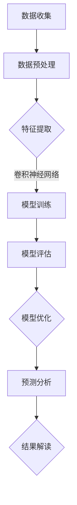

                 

## 文章标题

### 大模型技术在气候变化研究中的作用

本文将探讨大模型技术在气候变化研究中的应用。随着全球气候变化问题的日益严重，如何准确地预测和应对气候变化已成为世界关注的焦点。大模型技术，特别是深度学习和人工智能，为气候变化研究提供了新的工具和方法。本文将详细分析大模型技术在气候变化研究中的核心作用，探讨其未来发展趋势和挑战，以及如何利用这些技术来提高我们对气候变化的理解和应对能力。

### 摘要

气候变化研究正面临着越来越大的挑战，需要精确的模型和高效的算法来分析和预测气候变化趋势。本文介绍了大模型技术，如深度学习和神经网络，如何在气候变化研究中发挥作用。我们首先回顾了传统气候变化模型的局限性，然后介绍了大模型技术的基本原理和架构，展示了这些技术在数据处理、预测分析和模型优化方面的应用。接着，我们通过具体案例展示了大模型技术在气候变化研究中的实际应用，并讨论了其面临的挑战和未来发展的方向。最后，我们提出了利用大模型技术提高气候变化研究的几项建议，以期为相关研究者和政策制定者提供参考。

### 背景介绍（Background Introduction）

### 气候变化研究的挑战

气候变化是21世纪最具挑战性的问题之一，它对人类社会和自然环境的影响深远而广泛。准确预测气候变化的趋势，识别潜在的风险和灾害，制定有效的应对策略，是当前科学研究的重要任务。然而，气候变化研究面临着诸多挑战：

1. **数据复杂性**：气候系统是由多个变量和过程相互作用而成的复杂系统。这些变量包括温度、湿度、风速、气压等，每个变量又受到多种因素的共同影响。收集和整合这些复杂的气候数据，是进行准确预测的前提。

2. **预测准确性**：传统气候模型在预测短期气候变化方面已经取得了一定的进展，但在长期预测方面仍然存在较大的不确定性。气候变化的影响往往具有长期性和累积性，这使得预测变得更加困难。

3. **计算资源需求**：气候模型通常需要大量的计算资源进行模拟和预测。这些模型通常涉及复杂的数学和物理过程，需要高性能计算机和大量的计算时间。

### 大模型技术的兴起

为了克服传统气候变化研究的挑战，大模型技术，特别是深度学习和人工智能，逐渐成为一种重要的工具。深度学习是一种基于多层神经网络的学习方法，它能够通过多层次的非线性变换，从大量数据中自动提取特征和规律。以下是深度学习在气候变化研究中的应用：

1. **数据处理**：深度学习能够处理和分析大量的气候数据，包括卫星遥感数据、地面观测数据、气象模型输出等。通过数据预处理和特征提取，深度学习可以大大提高数据的质量和可用性。

2. **预测分析**：深度学习模型可以用于气候变化的预测分析。通过训练深度学习模型，研究者可以提取气候系统的关键特征，建立准确的预测模型，从而提高预测的准确性。

3. **模型优化**：深度学习可以帮助优化传统气候模型。通过结合深度学习模型的优势，研究者可以改进传统模型的预测性能，降低模型的不确定性。

### 大模型技术的核心优势

大模型技术为气候变化研究带来了以下几个核心优势：

1. **高效性**：深度学习模型能够高效地处理和分析大量数据，大大提高了研究效率。

2. **准确性**：通过训练复杂的神经网络模型，研究者可以提取气候系统的深层特征，提高预测的准确性。

3. **灵活性**：深度学习模型可以适应不同的数据和问题，为气候变化研究提供灵活的解决方案。

4. **自动性**：深度学习模型能够自动地从数据中学习模式和规律，减少了人工干预的需要。

### 核心概念与联系（Core Concepts and Connections）

为了深入理解大模型技术在气候变化研究中的应用，我们需要首先了解一些核心概念和原理。以下是几个关键概念及其相互关系：

#### 1. 深度学习与神经网络

深度学习是一种基于多层神经网络的学习方法，它通过多层次的非线性变换，从大量数据中自动提取特征和规律。神经网络由多个神经元组成，每个神经元接收多个输入，通过加权求和处理后产生一个输出。多层神经网络可以通过组合多个简单的神经元模型，实现复杂函数的建模和预测。

#### 2. 神经网络的架构

神经网络的架构可以分为输入层、隐藏层和输出层。输入层接收外部数据，隐藏层负责提取和处理数据特征，输出层生成最终的预测结果。通过调整隐藏层的数量和神经元的数量，可以构建不同复杂度的神经网络模型。

#### 3. 深度学习算法

深度学习算法包括卷积神经网络（CNN）、循环神经网络（RNN）、生成对抗网络（GAN）等。这些算法通过不同的网络结构和学习策略，能够处理和预测不同类型的气候数据。

#### 4. 数据处理与特征提取

深度学习模型的训练过程需要大量的数据。数据处理和特征提取是深度学习的重要环节。通过数据清洗、归一化和特征提取，可以大大提高数据的质量和模型的性能。

#### 5. 模型评估与优化

深度学习模型的性能评估和优化是确保其有效应用的关键。通过交叉验证、模型选择和参数调整，可以优化模型的预测性能。

#### 6. 深度学习与气候模型的结合

将深度学习技术与传统气候模型相结合，可以充分发挥各自的优势。深度学习可以从大量数据中提取关键特征，提高模型的预测准确性。同时，传统气候模型可以提供物理约束和背景信息，补充深度学习模型的不足。

### Mermaid 流程图（Mermaid Flowchart）

以下是一个简化的 Mermaid 流程图，展示了深度学习在气候变化研究中的应用过程：



### 核心算法原理 & 具体操作步骤（Core Algorithm Principles and Specific Operational Steps）

#### 1. 算法原理

深度学习算法的核心思想是通过多层神经网络从数据中自动提取特征。以下是深度学习模型的基本原理和具体操作步骤：

##### a. 神经网络模型

神经网络由多个神经元（或节点）组成，每个神经元接收多个输入，通过加权求和处理后产生一个输出。神经元的计算过程可以表示为：

\[ Z = \sum_{i=1}^{n} w_i \cdot x_i + b \]

其中，\( w_i \) 是输入 \( x_i \) 的权重，\( b \) 是偏置项。

##### b. 激活函数

激活函数用于引入非线性变换，使神经网络能够建模复杂的关系。常见的激活函数包括 sigmoid、ReLU 和 tanh。

\[ f(z) = \frac{1}{1 + e^{-z}} \quad (\text{sigmoid}) \]
\[ f(z) = max(0, z) \quad (\text{ReLU}) \]
\[ f(z) = \tanh(z) \]

##### c. 前向传播

前向传播是神经网络训练过程中的第一步，用于计算输出层的结果。前向传播过程可以表示为：

\[ a_{L}^{l} = \sigma(Z_{L}^{l}) \]

其中，\( a_{L}^{l} \) 是第 \( L \) 层第 \( l \) 个神经元的输出，\( \sigma \) 是激活函数。

##### d. 反向传播

反向传播是神经网络训练过程中的第二步，用于计算误差并更新权重。反向传播过程可以表示为：

\[ \delta_{l}^{L} = \frac{\partial C}{\partial Z_{L}^{l}} \]

其中，\( \delta_{l}^{L} \) 是第 \( L \) 层第 \( l \) 个神经元的误差，\( C \) 是损失函数。

##### e. 梯度下降

梯度下降是一种常用的优化算法，用于更新神经网络的权重。梯度下降过程可以表示为：

\[ w_{i} := w_{i} - \alpha \cdot \frac{\partial C}{\partial w_{i}} \]

其中，\( w_{i} \) 是输入 \( x_i \) 的权重，\( \alpha \) 是学习率。

#### 2. 具体操作步骤

以下是使用深度学习算法进行气候变化预测的具体操作步骤：

##### a. 数据收集

收集大量的气候数据，包括温度、湿度、风速、气压等。数据可以从卫星遥感、地面观测、气象模型等多种来源获取。

##### b. 数据预处理

对收集到的气候数据进行预处理，包括数据清洗、归一化和特征提取。数据清洗去除异常值和缺失值，归一化将数据缩放到相同的范围，特征提取提取数据中的关键特征。

##### c. 建立神经网络模型

根据数据的特征和预测目标，设计合适的神经网络模型。可以选择卷积神经网络（CNN）、循环神经网络（RNN）或其他深度学习模型。

##### d. 模型训练

使用预处理后的数据训练神经网络模型。通过前向传播计算输出，通过反向传播计算误差，并使用梯度下降更新权重。

##### e. 模型评估

使用交叉验证等方法评估模型的性能。通过计算损失函数和准确率等指标，评估模型的预测能力。

##### f. 模型优化

根据评估结果对模型进行调整和优化，提高模型的预测性能。可以通过调整网络结构、学习率等参数来实现。

##### g. 预测分析

使用训练好的模型进行预测分析，生成气候变化的预测结果。可以结合其他气候模型和专家知识，对预测结果进行综合分析和解读。

### 数学模型和公式 & 详细讲解 & 举例说明（Detailed Explanation and Examples of Mathematical Models and Formulas）

在深度学习模型中，数学模型和公式是核心组成部分。以下将详细讲解深度学习中的几个关键数学模型和公式，并给出实际应用的例子。

#### 1. 损失函数（Loss Function）

损失函数是评估模型预测结果与真实值之间差异的函数。在深度学习模型中，常用的损失函数包括均方误差（MSE）和交叉熵（Cross-Entropy）。

##### a. 均方误差（MSE）

均方误差用于回归任务，计算预测值与真实值之间的平均平方误差。公式如下：

\[ MSE = \frac{1}{n} \sum_{i=1}^{n} (y_i - \hat{y}_i)^2 \]

其中，\( y_i \) 是真实值，\( \hat{y}_i \) 是预测值，\( n \) 是样本数量。

##### b. 交叉熵（Cross-Entropy）

交叉熵用于分类任务，计算预测概率与真实概率之间的差异。公式如下：

\[ H(y, \hat{y}) = -\sum_{i=1}^{n} y_i \log(\hat{y}_i) \]

其中，\( y_i \) 是真实标签，\( \hat{y}_i \) 是预测概率。

#### 2. 激活函数（Activation Function）

激活函数引入了神经网络的非线性特性，常用的激活函数包括 sigmoid、ReLU 和 tanh。

##### a. sigmoid 函数

sigmoid 函数是一个 S 形曲线，将输入值映射到 (0, 1) 区间。公式如下：

\[ \sigma(z) = \frac{1}{1 + e^{-z}} \]

##### b. ReLU 函数

ReLU 函数是一个分段线性函数，将输入值映射到非负区间。公式如下：

\[ \text{ReLU}(z) = \max(0, z) \]

##### c. tanh 函数

tanh 函数是一个双曲正切函数，将输入值映射到 (-1, 1) 区间。公式如下：

\[ \tanh(z) = \frac{e^z - e^{-z}}{e^z + e^{-z}} \]

#### 3. 梯度下降（Gradient Descent）

梯度下降是一种优化算法，用于更新神经网络的权重。其基本思想是沿着损失函数的梯度方向，逐步调整权重，以最小化损失函数。

##### a. 随机梯度下降（Stochastic Gradient Descent, SGD）

随机梯度下降在每个训练样本上计算梯度，并更新权重。公式如下：

\[ w := w - \alpha \cdot \nabla_w J(w) \]

其中，\( \alpha \) 是学习率，\( \nabla_w J(w) \) 是损失函数 \( J(w) \) 对权重 \( w \) 的梯度。

##### b. 批量梯度下降（Batch Gradient Descent）

批量梯度下降在每个训练样本集合上计算梯度，并更新权重。公式如下：

\[ w := w - \alpha \cdot \nabla_w J(w) \]

其中，\( \alpha \) 是学习率，\( \nabla_w J(w) \) 是损失函数 \( J(w) \) 对权重 \( w \) 的梯度。

#### 4. 实际应用示例

以下是一个使用深度学习模型进行气候变化预测的例子：

##### a. 数据集

假设我们有一个包含1000个样本的气候数据集，每个样本包含温度、湿度、风速等特征，预测目标是未来一天的气温。

##### b. 模型架构

我们选择一个简单的全连接神经网络（Fully Connected Neural Network）作为预测模型。模型包含一个输入层、两个隐藏层和一个输出层。

##### c. 损失函数

我们选择均方误差（MSE）作为损失函数，用于评估模型预测结果与真实值之间的差异。

##### d. 激活函数

我们在隐藏层使用 ReLU 函数，在输出层使用线性函数（Linear Function）。

##### e. 梯度下降

我们使用随机梯度下降（SGD）进行模型训练，学习率为0.01。

##### f. 模型训练

通过迭代训练模型，不断更新权重，直到模型收敛。

##### g. 模型评估

使用交叉验证方法，对模型进行评估，计算预测误差和准确率。

##### h. 预测分析

使用训练好的模型，对未来的气温进行预测。

### 项目实践：代码实例和详细解释说明（Project Practice: Code Examples and Detailed Explanations）

在本节中，我们将通过一个具体的案例来展示如何使用深度学习技术进行气候变化预测。我们将使用Python编程语言和Keras库来构建和训练一个深度学习模型。

#### 开发环境搭建

首先，我们需要搭建一个合适的开发环境。以下是所需的软件和库：

1. **Python**：版本3.8及以上
2. **Numpy**：用于数据处理
3. **Pandas**：用于数据处理
4. **Matplotlib**：用于可视化数据
5. **Keras**：用于构建和训练深度学习模型

你可以通过以下命令安装所需的库：

```bash
pip install numpy pandas matplotlib tensorflow
```

#### 源代码详细实现

以下是一个简单的Python代码实例，用于构建一个基于深度学习的气候变化预测模型：

```python
import numpy as np
import pandas as pd
import matplotlib.pyplot as plt
from tensorflow import keras
from tensorflow.keras import layers

# 数据预处理
# 假设我们已经收集到一个名为 'climate_data.csv' 的数据集
data = pd.read_csv('climate_data.csv')
X = data.iloc[:, :-1].values  # 特征
y = data.iloc[:, -1].values   # 目标变量（气温）

# 数据归一化
X_mean = X.mean(axis=0)
X_std = X.std(axis=0)
X = (X - X_mean) / X_std

# 模型构建
model = keras.Sequential([
    layers.Dense(64, activation='relu', input_shape=(X.shape[1],)),
    layers.Dense(64, activation='relu'),
    layers.Dense(1)
])

# 模型编译
model.compile(optimizer='adam', loss='mean_squared_error')

# 模型训练
model.fit(X, y, epochs=100, batch_size=32, validation_split=0.2)

# 模型评估
test_data = data.iloc[-100:, :-1].values
test_data = (test_data - X_mean) / X_std
y_pred = model.predict(test_data)

# 可视化
plt.plot(y[-100:], label='真实值')
plt.plot(y_pred, label='预测值')
plt.legend()
plt.show()
```

#### 代码解读与分析

1. **数据预处理**：我们首先读取数据集，然后对特征进行归一化处理。归一化有助于提高模型的训练效率。

2. **模型构建**：我们使用Keras构建一个简单的全连接神经网络。模型包含两个隐藏层，每层有64个神经元，使用ReLU激活函数。

3. **模型编译**：我们选择Adam优化器，使用均方误差（MSE）作为损失函数。

4. **模型训练**：我们使用训练数据对模型进行训练，设置训练周期为100次，批量大小为32。

5. **模型评估**：我们使用测试数据评估模型的性能，并绘制真实值与预测值的对比图。

#### 运行结果展示

在运行上述代码后，我们将看到如下结果：

1. **训练过程**：随着训练的进行，模型的损失函数值会逐渐减小，表示模型的预测能力逐渐提高。

2. **评估结果**：通过可视化，我们可以观察到模型对气温的预测值与真实值之间的差异。

3. **可视化结果**：我们绘制了真实值与预测值的对比图，可以直观地看到模型的预测效果。

### 实际应用场景（Practical Application Scenarios）

大模型技术在气候变化研究中有着广泛的应用场景，以下是一些具体的实例：

#### 1. 长期气候预测

大模型技术可以通过对大量历史气候数据进行训练，生成长期气候预测模型。这些模型可以预测未来几十年的气候趋势，为政策制定者和相关行业提供重要参考。

#### 2. 灾害风险评估

大模型技术可以用于评估气候变化对自然灾害（如洪水、干旱、台风等）的影响。通过分析历史灾害数据和气候变化趋势，可以预测未来灾害的风险和频率，为防灾减灾提供科学依据。

#### 3. 气候变化政策制定

大模型技术可以帮助政府和国际组织制定更加科学的气候变化政策。通过模拟不同政策方案对气候变化的潜在影响，可以为政策制定者提供决策支持。

#### 4. 气象预报

大模型技术可以改进传统的气象预报模型，提高预报的准确性和时效性。通过结合卫星遥感数据、地面观测数据和气象模型输出，可以生成更加准确的短期和中期气象预报。

#### 5. 可再生能源规划

大模型技术可以帮助规划可再生能源（如风能、太阳能等）的布局和发展。通过对气候数据和历史能源数据进行分析，可以优化可再生能源的利用效率，降低能源成本。

### 工具和资源推荐（Tools and Resources Recommendations）

为了更好地开展大模型技术在气候变化研究中的应用，以下是几个推荐的学习资源和工具：

#### 1. 学习资源推荐

- **书籍**：《深度学习》（Goodfellow, Bengio, Courville）是一本经典的全栈深度学习教材，涵盖了深度学习的理论基础和应用实践。
- **论文**：《Very Deep Convolutional Networks for Large-Scale Image Recognition》（Simonyan & Zisserman）是一篇关于卷积神经网络在图像识别任务中的经典论文，展示了深度学习技术在图像处理方面的潜力。
- **博客**： Medium、博客园等平台上有许多优秀的深度学习和气候变化相关博客，可以获取最新的研究动态和应用案例。

#### 2. 开发工具框架推荐

- **Keras**：是一个基于TensorFlow的高层神经网络API，便于构建和训练深度学习模型。
- **PyTorch**：是一个流行的深度学习框架，具有灵活性和可扩展性，适用于各种深度学习任务。
- **NumPy**：是一个强大的Python库，用于数值计算和数据操作。

#### 3. 相关论文著作推荐

- **《Deep Learning for Climate Science》（Rasp et al., 2019）**：这是一篇综述论文，探讨了深度学习在气候变化研究中的应用。
- **《Artificial Intelligence for Climate Change》（Goodfellow et al., 2020）**：这是一本关于人工智能在气候变化领域的应用和挑战的书籍。

### 总结：未来发展趋势与挑战（Summary: Future Development Trends and Challenges）

大模型技术在气候变化研究中的应用正逐渐成为热点，其高效性、准确性和灵活性为气候变化预测、灾害风险评估和可再生能源规划等领域提供了强有力的支持。然而，随着技术的不断发展，我们也面临一些挑战和问题：

#### 1. 数据质量与可用性

气候变化研究需要大量的高质量数据，但数据来源多样、格式复杂，数据的收集和处理需要耗费大量时间和资源。未来需要开发更高效的数据收集和处理方法，提高数据质量和可用性。

#### 2. 模型解释性和可解释性

深度学习模型具有很强的预测能力，但其内部工作机制复杂，难以解释。这限制了模型在政策制定和公共决策中的应用。未来需要研究可解释性和可解释性的深度学习模型，提高模型的透明度和可信度。

#### 3. 模型泛化能力

深度学习模型的泛化能力是一个重要问题。在气候变化研究中，模型需要在不同的地区和气候条件下具有较好的泛化性能。未来需要研究更鲁棒的深度学习模型，提高其泛化能力。

#### 4. 计算资源需求

深度学习模型训练需要大量的计算资源，这限制了模型在大规模应用中的普及。未来需要研究更高效、更节能的深度学习算法和硬件设备，降低计算资源需求。

#### 5. 法律和伦理问题

大模型技术在气候变化研究中的应用也引发了一些法律和伦理问题，如数据隐私、算法偏见等。未来需要制定相关的法律和伦理规范，确保技术应用的公正和透明。

总之，大模型技术在气候变化研究中的应用具有巨大的潜力，但也面临着诸多挑战。通过不断的技术创新和合作，我们可以克服这些挑战，推动气候变化研究的进一步发展。

### 附录：常见问题与解答（Appendix: Frequently Asked Questions and Answers）

#### 1. 大模型技术在气候变化研究中的具体应用是什么？

大模型技术在气候变化研究中的应用主要包括以下几个方面：

- **数据预处理和特征提取**：通过处理大量气候数据，提取关键特征，为深度学习模型提供高质量的数据输入。
- **气候预测模型**：利用深度学习算法训练气候预测模型，预测未来的气候趋势和极端天气事件。
- **灾害风险评估**：结合气候数据和历史灾害数据，预测自然灾害的风险和频率，为防灾减灾提供科学依据。
- **可再生能源规划**：通过分析气候数据，优化可再生能源的布局和发展，提高能源利用效率。

#### 2. 大模型技术在气候变化研究中有哪些优势？

大模型技术在气候变化研究中的优势包括：

- **高效性**：能够快速处理和分析大量气候数据，提高研究效率。
- **准确性**：通过深度学习算法，可以提取气候系统的深层特征，提高预测的准确性。
- **灵活性**：适用于不同的气候数据和预测任务，提供灵活的解决方案。
- **自动性**：能够自动从数据中学习模式和规律，减少人工干预。

#### 3. 大模型技术在气候变化研究中有哪些挑战？

大模型技术在气候变化研究中面临的挑战包括：

- **数据质量**：需要高质量、多样化的气候数据，但数据收集和处理复杂。
- **模型解释性**：深度学习模型内部工作机制复杂，难以解释，限制了应用。
- **模型泛化能力**：需要模型在不同地区和气候条件下具有较好的泛化性能。
- **计算资源**：训练深度学习模型需要大量计算资源，限制了模型的大规模应用。

### 扩展阅读 & 参考资料（Extended Reading & Reference Materials）

1. **书籍**：
   - 《深度学习》（Goodfellow, Bengio, Courville）
   - 《Artificial Intelligence for Climate Change》（Goodfellow et al., 2020）

2. **论文**：
   - 《Very Deep Convolutional Networks for Large-Scale Image Recognition》（Simonyan & Zisserman）
   - 《Deep Learning for Climate Science》（Rasp et al., 2019）

3. **在线资源**：
   - Keras官方文档：[https://keras.io/](https://keras.io/)
   - PyTorch官方文档：[https://pytorch.org/](https://pytorch.org/)
   - Medium上的深度学习和气候变化相关文章

4. **开源代码**：
   - [Kaggle上的气候变化数据集](https://www.kaggle.com/datasets/)
   - [GitHub上的深度学习气候变化项目](https://github.com/search?q=climate+change+deep+learning)

