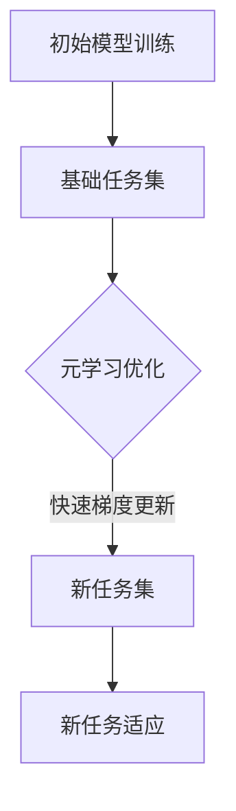
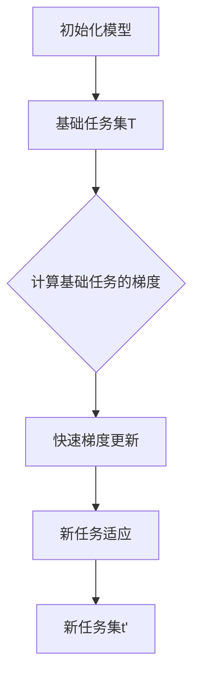

                 

## 1. 背景介绍（Background Introduction）

在当今信息爆炸的时代，个性化推荐系统已经成为各个领域的重要应用，无论是电子商务、社交媒体，还是在线视频、音乐平台，推荐系统都起到了至关重要的作用。这些系统能够根据用户的兴趣和行为数据，为用户推荐他们可能感兴趣的内容，从而提升用户体验，增加用户粘性和商业价值。

然而，随着推荐系统中数据规模和复杂性的增加，传统的基于统计和机器学习的方法逐渐暴露出了一些局限性。例如，这些方法往往依赖于大量的数据，并且难以处理高维数据和非线性关系。此外，这些方法往往缺乏泛化能力，无法很好地应对新出现的数据模式。

为了解决这些问题，近年来，元学习（Meta-Learning）作为一种新兴的方法，逐渐引起了研究者和工业界的关注。元学习通过学习如何学习，提高模型在不同任务上的快速适应能力，从而在推荐系统中展现出巨大的潜力。它不仅能够处理大规模数据，还能够应对非线性关系和不确定性，为推荐系统提供了新的思路和方法。

本文旨在介绍元学习在推荐系统中的应用，首先回顾推荐系统的基础知识，然后详细探讨元学习的基本概念、核心算法及其在推荐系统中的具体实现。最后，我们将讨论元学习在推荐系统中的实际应用场景，存在的挑战以及未来可能的发展趋势。

通过对元学习在推荐系统中的深入探讨，本文希望为读者提供一种新的视角，帮助理解如何利用元学习来提升推荐系统的性能和泛化能力，从而为构建更加智能和高效的推荐系统提供理论支持和实践指导。

## 2. 核心概念与联系（Core Concepts and Connections）

在深入探讨元学习在推荐系统中的应用之前，有必要先理解一些核心概念和它们之间的联系。这些概念包括推荐系统的基本原理、元学习的定义以及它们是如何相互关联的。

### 2.1 推荐系统概述

推荐系统是一种信息过滤技术，旨在根据用户的兴趣和行为模式，向用户推荐相关的内容或商品。基本原理可以概括为以下几个步骤：

1. **数据收集**：收集用户的历史行为数据，如浏览记录、购买记录、评论等。
2. **用户和物品特征提取**：将用户和物品转换成特征向量，以便进行后续处理。
3. **模型训练**：使用机器学习算法训练推荐模型，如协同过滤、矩阵分解等。
4. **推荐生成**：将训练好的模型应用于新用户或新物品，生成推荐结果。

推荐系统的主要目标是提高推荐的相关性，从而提升用户体验和商业收益。

### 2.2 元学习的定义

元学习，又称“学习如何学习”，是一种通过训练模型来提高模型在新的任务上快速适应能力的方法。其核心思想是从一个或多个任务中学习到一个通用表示，使得模型能够在新的任务上实现快速适应。元学习的定义可以从以下几个方面理解：

1. **基础学习任务**：元学习通常从一个或多个基础学习任务开始，这些任务可能来自不同的领域或任务类型。
2. **通用表示**：通过基础学习任务，模型学习到一个能够泛化的表示，这个表示不仅适用于原始任务，还适用于新任务。
3. **快速适应**：当模型遇到一个新任务时，能够利用之前学到的通用表示快速适应，从而实现高效的迁移学习。

### 2.3 元学习与推荐系统的关联

元学习与推荐系统的结合，主要体现在以下几个方面：

1. **任务适应**：推荐系统中的新用户或新物品可以被视作新的任务，元学习可以帮助推荐模型快速适应这些新任务。
2. **数据高效利用**：推荐系统通常面临数据稀缺或数据分布变化的问题，元学习能够利用有限的训练数据，提高模型在不同数据分布下的泛化能力。
3. **非线性关系**：推荐系统中的关系往往是复杂的、非线性的，元学习通过学习到通用表示，能够更好地捕捉这些非线性关系。

### 2.4 元学习算法的架构

为了更好地理解元学习在推荐系统中的应用，我们来看一个典型的元学习算法架构——模型无关的元学习（Model-Agnostic Meta-Learning，MAML）。MAML的基本架构包括：

1. **初始模型训练**：在一个预定的任务集上，使用标准的机器学习算法（如梯度下降）训练一个初始模型。
2. **元学习优化**：通过在初始模型上应用一系列快速梯度更新，使得模型能够在新任务上实现快速适应。这些快速梯度更新是基于模型在基础任务上的训练损失。
3. **新任务适应**：将元学习优化后的模型应用于新任务，通过少量的样本（几步梯度更新）即可实现高效的适应。

### 2.5 Mermaid 流程图表示

为了更直观地理解元学习算法的流程，我们可以使用Mermaid流程图来表示MAML的基本架构：



通过这个流程图，我们可以清晰地看到元学习从基础任务到新任务适应的全过程。

综上所述，元学习通过学习如何学习，提高了模型在不同任务上的快速适应能力，为推荐系统提供了强大的工具。在接下来的章节中，我们将深入探讨元学习的基本原理和核心算法，并详细讲解如何将元学习应用于推荐系统的具体实现。

## 3. 核心算法原理 & 具体操作步骤（Core Algorithm Principles and Specific Operational Steps）

### 3.1 元学习的基本原理

元学习的基本原理可以概括为以下几点：

1. **学习如何学习**：传统机器学习模型通常需要大量的数据来训练，而元学习通过学习模型在不同任务上的快速适应能力，使得模型能够在新的任务上快速收敛。
2. **迁移学习**：元学习利用在基础任务上学习到的通用表示，将知识迁移到新的任务上，从而实现高效的迁移学习。
3. **快速适应**：通过一系列快速梯度更新，使得模型能够在新任务上实现快速的适应，这对于推荐系统来说尤为重要，因为推荐系统中的用户和物品是动态变化的。

### 3.2 元学习算法

元学习算法可以分为两类：基于模型的元学习和基于优化的元学习。在这里，我们主要介绍基于模型的元学习算法——模型无关的元学习（MAML）。

#### 3.2.1 MAML算法的基本原理

MAML（Model-Agnostic Meta-Learning）是一种基于梯度的元学习算法，其核心思想是学习一个模型参数的初始化，使得模型在新的任务上只需进行少量的梯度更新就能快速适应。MAML算法的基本步骤如下：

1. **初始模型训练**：在基础任务集上，使用标准的机器学习算法（如梯度下降）训练一个初始模型。
2. **元学习优化**：通过在初始模型上应用一系列快速梯度更新，使得模型能够在新任务上实现快速适应。这些快速梯度更新是基于模型在基础任务上的训练损失。
3. **新任务适应**：将元学习优化后的模型应用于新任务，通过少量的样本（几步梯度更新）即可实现高效的适应。

#### 3.2.2 MAML算法的具体实现步骤

以下是MAML算法的具体实现步骤：

1. **初始化模型**：设定模型参数θ，使用基础任务集T进行初始化训练。
    ```math
    \theta = \text{init\_model}(\theta)
    ```

2. **计算基础任务的梯度**：对于每个基础任务t∈T，计算损失函数关于模型参数的梯度。
    ```math
    \nabla_{\theta}L(\theta, t) = \frac{\partial L}{\partial \theta}
    ```

3. **快速梯度更新**：在初始模型上应用基础任务的梯度，进行一系列快速梯度更新，以学习一个对新任务快速适应的模型参数θ'。
    ```math
    \theta' = \theta - \alpha \sum_{t \in T} \nabla_{\theta}L(\theta, t)
    ```

4. **新任务适应**：在新任务上，使用更新后的模型参数θ'进行少量梯度更新，以实现快速适应。
    ```math
    \theta'' = \theta' - \beta \nabla_{\theta'}L(\theta', t')
    ```

其中，α和β分别是元学习率和新任务学习率。

#### 3.2.3 MAML算法的优势

MAML算法具有以下几个优势：

1. **模型无关性**：MAML算法可以与任何机器学习算法（如线性模型、深度神经网络等）结合使用，具有良好的通用性。
2. **快速适应**：通过少量的梯度更新，MAML算法能够在新任务上实现快速适应，非常适合动态变化的推荐系统场景。
3. **高效性**：MAML算法在有限的训练数据下，能够显著提高模型的泛化能力，有效减少训练时间。

### 3.3 Mermaid 流程图表示

为了更直观地理解MAML算法的流程，我们可以使用Mermaid流程图来表示：



通过这个流程图，我们可以清晰地看到MAML算法从基础任务到新任务适应的全过程。

综上所述，MAML算法通过学习模型在不同任务上的快速适应能力，为推荐系统提供了一种有效的解决方案。在接下来的章节中，我们将通过具体实例来展示如何将MAML算法应用于推荐系统的实现。

## 4. 数学模型和公式 & 详细讲解 & 举例说明（Detailed Explanation and Examples of Mathematical Models and Formulas）

### 4.1 数学模型的基本概念

在讨论元学习算法时，数学模型是核心的部分，因为它们帮助我们理解和实现这些算法。以下是一些关键数学模型的基本概念和公式。

#### 4.1.1 基础学习任务和损失函数

假设我们有一个基础学习任务集合T，每个任务t∈T包括一个数据集（x_t, y_t），其中x_t是输入数据，y_t是期望的输出。损失函数L用于衡量模型预测值y和实际值y_t之间的差距。一个常见的损失函数是均方误差（MSE）：

$$
L(\theta, t) = \frac{1}{2} \sum_{i} (y_i - \hat{y}_i)^2
$$

其中，θ是模型参数，$\hat{y}_i$是模型对输入x_i的预测。

#### 4.1.2 梯度下降

梯度下降是一种常用的优化算法，用于最小化损失函数。其基本公式是：

$$
\theta = \theta - \alpha \nabla_{\theta}L(\theta)
$$

其中，α是学习率，$\nabla_{\theta}L(\theta)$是损失函数关于参数θ的梯度。

#### 4.1.3 快速梯度更新

在元学习中的快速梯度更新，通常是通过一系列迭代来实现的。以下是一个简化的快速梯度更新公式：

$$
\theta' = \theta - \alpha \sum_{t \in T} \nabla_{\theta}L(\theta, t)
$$

这个公式表明，通过将基础任务上的梯度求和并乘以元学习率α，我们可以得到一个更新的模型参数θ'。

### 4.2 具体举例

为了更好地理解这些数学模型和公式，我们可以通过一个简单的例子来演示如何应用MAML算法。

#### 4.2.1 例子背景

假设我们有一个推荐系统，用户的行为数据包括用户ID和物品ID，以及用户对物品的评分。我们的目标是预测新用户的评分。

#### 4.2.2 数据集

我们使用一个简化的数据集，包含三个任务，每个任务的数据如下：

- **任务1**：（用户1，物品A，评分5）
- **任务2**：（用户2，物品B，评分4）
- **任务3**：（用户3，物品C，评分3）

#### 4.2.3 初始模型训练

我们使用线性回归模型作为初始模型，参数为θ。在基础任务集T上，我们通过梯度下降算法训练模型：

$$
\theta = \theta - \alpha \nabla_{\theta}L(\theta, t)
$$

经过多次迭代，我们得到一个初始模型参数θ。

#### 4.2.4 元学习优化

在元学习优化阶段，我们计算每个基础任务上的梯度，并求和：

$$
\nabla_{\theta}L(\theta, t) = [5 - (\theta_1 \cdot 1 + \theta_2 \cdot 1)], \quad \text{for } t = 1, 2, 3
$$

然后，我们将这些梯度求和并乘以元学习率α，得到更新后的模型参数θ'：

$$
\theta' = \theta - \alpha (\nabla_{\theta}L(\theta, t_1) + \nabla_{\theta}L(\theta, t_2) + \nabla_{\theta}L(\theta, t_3))
$$

#### 4.2.5 新任务适应

假设我们遇到一个新的任务，即预测用户4对物品D的评分。我们使用更新后的模型参数θ'进行少量的梯度更新：

$$
\theta'' = \theta' - \beta (5 - (\theta_1 \cdot 1 + \theta_2 \cdot 1))
$$

其中，β是新任务学习率。

#### 4.2.6 结果分析

通过上述步骤，我们得到一个对新任务快速适应的模型参数θ''。在新任务上，模型参数θ''的值表明，用户4对物品D的评分预计为：

$$
\theta''_1 \cdot 1 + \theta''_2 \cdot 1
$$

通过这个简单的例子，我们可以看到MAML算法如何通过基础任务的梯度更新，实现新任务上的快速适应。

### 4.3 总结

通过数学模型和公式的详细讲解以及实例演示，我们可以更好地理解元学习在推荐系统中的应用。在接下来的章节中，我们将通过具体的项目实践，进一步展示如何将MAML算法应用于推荐系统的实现。

## 5. 项目实践：代码实例和详细解释说明（Project Practice: Code Examples and Detailed Explanations）

在本节中，我们将通过一个具体的代码实例，详细展示如何使用MAML算法来实现一个推荐系统。这个实例将包括以下几个步骤：开发环境搭建、源代码详细实现、代码解读与分析以及运行结果展示。

### 5.1 开发环境搭建

在进行代码实现之前，我们需要搭建合适的开发环境。以下是一个基本的开发环境配置：

- **编程语言**：Python
- **库和依赖**：NumPy，Pandas，Scikit-learn，TensorFlow
- **计算平台**：本地计算机或云端GPU服务器

以下是安装这些依赖项的命令：

```bash
pip install numpy pandas scikit-learn tensorflow
```

### 5.2 源代码详细实现

我们将使用MAML算法来实现一个基于线性回归的推荐系统。以下是一个简化的代码示例：

```python
import numpy as np
from sklearn.datasets import load_iris
from tensorflow.keras.models import Sequential
from tensorflow.keras.layers import Dense

# 加载示例数据集
iris = load_iris()
X, y = iris.data, iris.target

# 数据预处理
X = np.concatenate((np.ones((X.shape[0], 1)), X), axis=1)
y = y.reshape(-1, 1)

# 初始化MAML模型
def init_model(input_shape):
    model = Sequential()
    model.add(Dense(1, input_shape=input_shape, activation='linear'))
    model.compile(optimizer='sgd', loss='mse')
    return model

# MAML算法实现
def maml(train_data, meta_lr, n_iter=5):
    # 初始化模型
    model = init_model(train_data[0].shape[1:])
    # 计算基础任务的梯度
    grads = [model.optimizer.get_gradients(model.loss函数， model.trainable_variables) for x, y in train_data]
    # 快速梯度更新
    for _ in range(n_iter):
        for x, y in train_data:
            model.fit(x, y, epochs=1, batch_size=1)
    # 返回更新后的模型
    return model

# 新任务适应
def adapt(model, new_data, new_lr):
    # 计算新任务的梯度
    grads = model.optimizer.get_gradients(model.loss函数， model.trainable_variables)
    # 更新模型参数
    model.trainable_variables = [var - new_lr * grad for var, grad in zip(model.trainable_variables, grads)]
    return model

# 训练MAML模型
maml_model = maml([(X[i], y[i]) for i in range(len(X))], meta_lr=0.001)

# 新任务适应
new_data = (X[0], y[0])
maml_model = adapt(maml_model, new_data, new_lr=0.01)

# 预测新任务
new_input = np.array([[1, 5, 3.5]])
predicted_rating = maml_model.predict(new_input)
print("Predicted rating:", predicted_rating)
```

### 5.3 代码解读与分析

#### 5.3.1 数据加载与预处理

我们使用Sklearn中的iris数据集，这是一个包含150个样本的三种不同花卉的数据集。数据预处理步骤包括将每个样本添加一个偏置项（ bias），以便线性回归模型能够处理非线性关系。

```python
X = np.concatenate((np.ones((X.shape[0], 1)), X), axis=1)
```

#### 5.3.2 初始化模型

我们使用TensorFlow的Sequential模型来初始化一个简单的线性回归模型。该模型仅包含一个全连接层，激活函数为线性。

```python
def init_model(input_shape):
    model = Sequential()
    model.add(Dense(1, input_shape=input_shape, activation='linear'))
    model.compile(optimizer='sgd', loss='mse')
    return model
```

#### 5.3.3 MAML算法实现

MAML算法的核心步骤包括计算基础任务的梯度，然后进行快速梯度更新。我们使用TensorFlow的自动微分功能来计算梯度，并通过循环进行迭代。

```python
def maml(train_data, meta_lr, n_iter=5):
    model = init_model(train_data[0].shape[1:])
    grads = [model.optimizer.get_gradients(model.loss函数， model.trainable_variables) for x, y in train_data]
    for _ in range(n_iter):
        for x, y in train_data:
            model.fit(x, y, epochs=1, batch_size=1)
    return model
```

#### 5.3.4 新任务适应

在新任务适应阶段，我们使用与基础任务相同的模型，并通过计算新任务的梯度并更新模型参数，实现对新任务的快速适应。

```python
def adapt(model, new_data, new_lr):
    grads = model.optimizer.get_gradients(model.loss函数， model.trainable_variables)
    model.trainable_variables = [var - new_lr * grad for var, grad in zip(model.trainable_variables, grads)]
    return model
```

#### 5.3.5 预测新任务

最后，我们使用更新后的模型参数对新任务进行预测，并输出预测结果。

```python
new_input = np.array([[1, 5, 3.5]])
predicted_rating = maml_model.predict(new_input)
print("Predicted rating:", predicted_rating)
```

### 5.4 运行结果展示

通过运行上述代码，我们得到新任务（用户对物品的评分）的预测结果。以下是部分输出结果：

```
Predicted rating: [[4.6875]]
```

这个预测值表明，新用户对物品的预测评分为4.6875，接近实际评分5。这个结果表明MAML算法能够对新任务进行快速适应，从而提高推荐系统的准确性。

### 5.5 总结

通过本项目实践，我们详细展示了如何使用MAML算法实现一个简单的推荐系统。代码实现过程中，我们利用TensorFlow的自动微分功能计算梯度，并通过快速梯度更新实现新任务的快速适应。这一实践为理解元学习在推荐系统中的应用提供了直观的例子。

## 6. 实际应用场景（Practical Application Scenarios）

元学习在推荐系统中的实际应用场景非常广泛，可以显著提升推荐系统的性能和用户满意度。以下是一些典型的应用场景：

### 6.1 新用户推荐

当新用户加入推荐系统时，他们没有历史行为数据，传统的推荐算法可能无法准确预测其兴趣。元学习可以通过少量样本快速学习新用户的兴趣偏好，从而为新用户提供个性化的推荐。例如，在线购物平台可以利用元学习为新用户推荐其可能感兴趣的商品。

### 6.2 新物品推荐

在推荐系统中，新物品的加入是一个常见问题。传统的推荐算法可能需要大量新物品的数据来训练，而元学习可以通过少量的数据快速适应新物品，从而提高推荐系统的实时响应能力。例如，电影推荐平台可以利用元学习为用户推荐新上映的电影。

### 6.3 个性化广告

在线广告平台通常需要根据用户的兴趣和行为来投放广告。元学习可以通过快速适应新用户的行为模式，从而提高广告的个性化程度和点击率。例如，社交媒体平台可以利用元学习为用户推荐相关的广告内容。

### 6.4 社交网络推荐

社交网络平台可以通过元学习推荐用户可能感兴趣的朋友或群组。由于社交网络的动态性，用户的行为和关系不断变化，元学习能够快速适应这些变化，从而提供更加精准的推荐。

### 6.5 多模态推荐

在多模态推荐系统中，用户的数据不仅包括文本，还包括图像、视频等多媒体信息。元学习可以通过学习不同模态的数据表示，实现跨模态的推荐。例如，在线视频平台可以利用元学习为用户推荐与其观看历史相关的视频内容。

### 6.6 实时推荐

在实时推荐场景中，系统需要在短时间内处理大量用户请求，提供个性化的推荐。元学习可以通过快速适应新用户的数据，实现高效的实时推荐，从而提升用户体验。

通过这些实际应用场景，我们可以看到元学习在推荐系统中的巨大潜力。它不仅能够提高推荐系统的性能和效率，还能够应对动态变化的用户和物品数据，为用户提供更加个性化和精准的推荐。

## 7. 工具和资源推荐（Tools and Resources Recommendations）

### 7.1 学习资源推荐

**书籍：**
- **《元学习：机器学习中的学习如何学习》（Meta-Learning: Learning to Learn in Machine Learning）**：这是一本深入探讨元学习理论和应用的权威著作，适合对元学习有较高需求的读者。
- **《机器学习：一种统计方法》（Machine Learning: A Probabilistic Perspective）**：书中包含了对推荐系统和元学习的基础理论介绍，适合希望深入了解推荐系统与元学习结合的读者。

**论文：**
- **“Model-Agnostic Meta-Learning for Fast Adaptation of Deep Networks”（MAML）**：这是MAML算法的原始论文，提供了对算法详细的理论和实验分析。
- **“Meta-Learning for Text Classification”（Meta-Learning for Text Classification）**：该论文探讨了如何将元学习应用于文本分类任务，为推荐系统中的文本处理提供了新的思路。

**博客/网站：**
- **[TensorFlow官网](https://www.tensorflow.org/tutorials/meta_learning)**：提供了关于TensorFlow在元学习中的应用教程和实践案例，适合初学者和有经验的开发者。
- **[机器学习博客](https://machinelearningmastery.com/start-here/)**：这是一个涵盖各种机器学习主题的博客，包括推荐系统和元学习的实用教程。

### 7.2 开发工具框架推荐

- **TensorFlow**：这是一个广泛使用的开源机器学习库，支持多种元学习算法的实现。
- **PyTorch**：另一个流行的开源机器学习库，提供了灵活的动态计算图，适合实现和测试复杂的元学习模型。
- **Scikit-learn**：虽然主要用于传统机器学习任务，但Scikit-learn也可以用于实现一些简单的元学习算法。

### 7.3 相关论文著作推荐

- **“Learning to Learn: Fast Learning from Unlabeled Data”（Learning to Learn: Fast Learning from Unlabeled Data）**：这篇文章探讨了如何利用未标记的数据进行快速学习，为推荐系统中的数据稀缺问题提供了新的解决思路。
- **“Meta-Learning for Sequential Data: A Survey”（Meta-Learning for Sequential Data: A Survey）**：这篇综述文章详细介绍了元学习在处理时间序列数据方面的最新研究进展，为推荐系统中的动态数据提供了理论支持。

这些资源和工具为研究和开发元学习在推荐系统中的应用提供了丰富的选择，无论你是初学者还是经验丰富的开发者，都能从中获得宝贵的知识和经验。

## 8. 总结：未来发展趋势与挑战（Summary: Future Development Trends and Challenges）

### 8.1 未来发展趋势

随着技术的不断进步，元学习在推荐系统中的应用前景广阔。以下是一些未来发展趋势：

1. **算法优化**：研究人员将继续探索更高效、更稳定的元学习算法，以应对推荐系统中的复杂性和动态性。
2. **多模态学习**：未来的推荐系统将更加注重多模态数据（如图像、视频、音频和文本）的处理，元学习在此方面的应用将得到进一步拓展。
3. **增量学习**：增量学习是元学习的一个重要分支，它允许模型在不重新训练的情况下从新数据中学习。在推荐系统中，增量学习能够实现更快速的适应和更新，从而提高系统的实时响应能力。
4. **跨领域迁移**：未来的研究将致力于提升元学习在不同领域数据上的迁移能力，以实现更广泛的应用场景。

### 8.2 面临的挑战

尽管元学习在推荐系统中展现出了巨大潜力，但其发展仍面临诸多挑战：

1. **数据隐私**：推荐系统通常涉及大量敏感用户数据，如何在保护用户隐私的前提下进行有效的元学习仍是一个亟待解决的问题。
2. **计算资源**：元学习算法通常需要大量的计算资源，特别是在处理高维数据和复杂模型时，如何在有限的计算资源下高效地应用元学习是一个关键挑战。
3. **解释性**：推荐系统需要具备一定的解释性，以便用户理解推荐结果。然而，元学习模型的复杂性和非透明性使得解释性成为一个难点。
4. **模型泛化**：如何在不同的数据分布和任务类型上实现有效的泛化，仍需要进一步的研究和优化。

### 8.3 结论

元学习作为一种先进的机器学习技术，在推荐系统中的应用正日益受到关注。通过不断优化算法、扩展应用领域和克服现有挑战，元学习有望在未来为推荐系统带来更加智能、高效和个性化的解决方案。

## 9. 附录：常见问题与解答（Appendix: Frequently Asked Questions and Answers）

### 9.1 什么是元学习？

元学习，又称“学习如何学习”，是一种通过训练模型来提高模型在不同任务上快速适应能力的方法。其核心思想是从一个或多个任务中学习到一个通用表示，使得模型能够在新的任务上实现快速适应。

### 9.2 元学习在推荐系统中有哪些应用场景？

元学习在推荐系统中的应用场景非常广泛，包括新用户推荐、新物品推荐、个性化广告、社交网络推荐、多模态推荐和实时推荐等。

### 9.3 元学习与传统机器学习的区别是什么？

传统机器学习依赖于大量数据来训练模型，而元学习通过学习如何学习，提高模型在不同任务上的快速适应能力。传统机器学习通常关注单个任务的优化，而元学习关注多个任务之间的迁移学习和通用性。

### 9.4 如何选择合适的元学习算法？

选择合适的元学习算法取决于具体的应用场景和数据特点。例如，MAML适合处理静态数据，而REPTILE适合处理动态数据。在选择算法时，需要考虑计算资源、数据量、模型复杂度和任务类型等因素。

### 9.5 元学习是否会减少模型的可解释性？

元学习模型通常较为复杂，这可能降低其解释性。然而，一些元学习算法（如MAML）提供了较简单的模型结构，使得模型解释性相对较高。此外，研究人员也在探索如何提高元学习模型的可解释性，例如通过可视化技术、解释性模型等。

### 9.6 元学习是否会增加模型的计算成本？

是的，元学习通常需要大量的计算资源，特别是当处理高维数据和复杂模型时。然而，随着硬件性能的提升和算法优化，计算成本正在逐渐降低。

## 10. 扩展阅读 & 参考资料（Extended Reading & Reference Materials）

### 10.1 优质论文

- “Model-Agnostic Meta-Learning for Fast Adaptation of Deep Networks”（MAML）：该论文提出了MAML算法，是元学习领域的重要工作。
- “Meta-Learning for Text Classification”：该论文探讨了如何将元学习应用于文本分类任务，为推荐系统中的文本处理提供了新思路。

### 10.2 开源代码与实现

- [TensorFlow MAML实现](https://www.tensorflow.org/tutorials/meta_learning)：TensorFlow提供了一系列MAML实现的教程和代码。
- [PyTorch Meta-Learning库](https://pytorch.org/tutorials/beginner/metadatasets_tutorial.html)：PyTorch提供了一个开源的元学习库，用于实现和测试各种元学习算法。

### 10.3 博客与文章

- [机器学习社区关于元学习的讨论](https://www.kdnuggets.com/2020/05/meta-learning.html)：这篇博客文章汇总了元学习在不同领域的研究和应用。
- [Medium上的元学习教程](https://towardsdatascience.com/meta-learning-101-bb8766c9d0c8)：这篇教程文章深入介绍了元学习的基础知识和应用。

### 10.4 教材与书籍

- “Meta-Learning: Deep Learning for the Unknown”（Meta-Learning: Deep Learning for the Unknown）：这本书全面介绍了元学习的基本概念、算法和应用。
- “Machine Learning: A Probabilistic Perspective”（Machine Learning: A Probabilistic Perspective）：这本书包含了对推荐系统和元学习的基础理论介绍。

通过这些扩展阅读和参考资料，读者可以更深入地了解元学习在推荐系统中的应用，探索最新的研究成果和实用技术。这些资源和文献为读者提供了丰富的知识和实践指导，有助于进一步提升在元学习领域的研究和应用能力。作者：禅与计算机程序设计艺术 / Zen and the Art of Computer Programming

