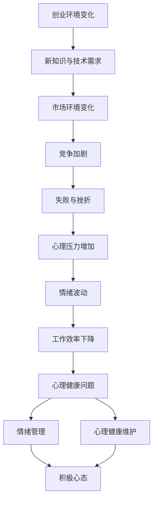
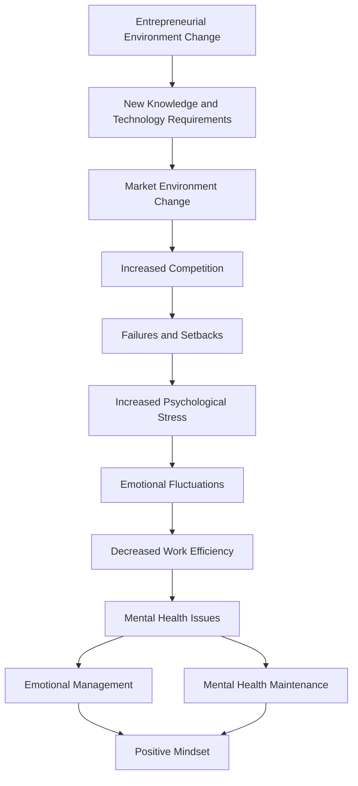

                 

### 背景介绍（Background Introduction）

随着人工智能技术的迅猛发展，特别是大型语言模型的出现，创业者们面临着前所未有的机遇与挑战。大模型时代的到来，意味着创业者的业务模式、技术应用和市场策略都将发生深刻变化。然而，这种变化不仅带来了巨大的机遇，也伴随着巨大的压力和不确定性。因此，如何在复杂多变的环境中保持良好的创业心态，成为创业者们亟待解决的问题。

首先，大模型技术的崛起改变了市场的竞争格局。创业者需要快速适应这一变化，掌握相关技术，才能在激烈的市场竞争中脱颖而出。然而，技术的快速迭代往往伴随着高风险和高不确定性，这无疑给创业者带来了巨大的心理压力。其次，市场需求的快速变化也要求创业者具备高度灵活的思维和快速响应的能力。创业者不仅要面对技术挑战，还要应对市场变化带来的不确定性，这无疑增加了他们的心理负担。

此外，创业过程中的挫折和失败也是不可避免的一部分。在人工智能领域，成功的项目往往需要长时间的积累和持续的努力。在这个过程中，创业者可能会经历多次失败和挫折，这些负面情绪如果不能得到有效管理，会对创业者的心理健康产生不良影响。

因此，本文旨在探讨大模型时代创业者面临的心理压力、情绪管理及心理健康问题，并提供一些实用的策略和方法，帮助创业者保持积极的心态，应对各种挑战。

## Introduction
### The Rise of Large Models and Its Impact on Entrepreneurs

The rapid advancement of artificial intelligence, particularly the emergence of large language models, has fundamentally transformed the landscape for entrepreneurs. The arrival of this new era brings both unprecedented opportunities and significant challenges. On one hand, the availability of powerful AI tools opens up new possibilities for business models, product development, and market strategies. However, this transformation is also accompanied by immense pressure and uncertainty, posing a serious challenge to entrepreneurs' mental health.

Firstly, the rise of large-scale AI models has dramatically altered the competitive dynamics of the market. Entrepreneurs must quickly adapt to these changes, acquire the necessary technical skills, and leverage AI technologies to stay ahead in a fiercely competitive environment. The rapid iteration of technology often comes with high risks and uncertainties, which can lead to significant psychological stress for entrepreneurs. 

Secondly, the swift evolution of market demands requires entrepreneurs to be highly flexible and responsive. They need to adjust their business strategies and product offerings rapidly in response to changing market trends. This constant flux not only involves technical challenges but also the need to navigate uncertainties, further increasing the mental burden on entrepreneurs.

Moreover, setbacks and failures are an inevitable part of the entrepreneurial journey. In the field of AI, successful projects typically require long-term accumulation and persistent effort. During this process, entrepreneurs are likely to experience multiple failures and setbacks. If these negative emotions are not effectively managed, they can have adverse effects on their mental health.

This article aims to explore the psychological stress, emotional management, and mental health challenges faced by entrepreneurs in the era of large models. It will provide practical strategies and methods to help entrepreneurs maintain a positive mindset and cope with various challenges.

### 核心概念与联系（Core Concepts and Connections）

在探讨大模型时代创业者的心态调节之前，有必要首先明确一些核心概念，包括心理压力、情绪管理与心理健康。这些概念不仅是本文讨论的基础，也是理解创业者在大模型时代所面临问题的关键。

#### 1. 心理压力（Psychological Stress）

心理压力是指人在面对压力源时，身心产生的紧张状态。压力源可以是外部的，如工作负荷、市场竞争、经济压力等，也可以是内部的，如自我期望、人际关系问题等。在创业过程中，心理压力往往来自多个方面，如技术创新的压力、市场拓展的压力、团队管理的压力等。过度的心理压力会导致情绪波动、身体疲劳、工作效率下降，严重时甚至可能影响创业者的心理健康。

#### 2. 情绪管理（Emotional Management）

情绪管理是指个体在情感反应过程中，通过认知、行为和生理调节，以达到情感平衡和稳定的过程。有效的情绪管理能够帮助创业者识别和调节负面情绪，保持积极的心态，提高应对压力的能力。情绪管理不仅关乎个人的心理健康，也直接影响到创业团队的合作氛围和整体业绩。

#### 3. 心理健康（Mental Health）

心理健康是指个体在认知、情感、行为和社会功能等方面处于良好状态，能够有效地应对日常生活中的压力和挑战。对创业者而言，心理健康是确保其持续创新和高效工作的基础。然而，在人工智能快速发展的背景下，心理健康问题愈发突出，如失眠、焦虑、抑郁等，都可能对创业者的生活和事业产生负面影响。

#### 4. 大模型时代与心理压力的关系

大模型时代的到来，使得创业者需要不断学习新知识、掌握新技术，这无疑增加了他们的心理压力。此外，市场环境的变化、创业竞争的加剧，以及创业过程中不可避免的失败与挫折，都是导致心理压力增加的重要因素。而有效的情绪管理和心理健康维护，则可以帮助创业者更好地应对这些挑战，保持积极向上的心态。

### Mermaid 流程图

下面是一个描述大模型时代创业者心理压力与管理流程的 Mermaid 流程图：



通过上述流程图，我们可以清晰地看到，大模型时代的创业环境变化是心理压力增加的直接原因，而情绪管理和心理健康维护则是缓解心理压力的关键途径。

### Core Concepts and Connections

Before delving into the mental adjustment strategies for entrepreneurs in the era of large models, it's essential to clarify some core concepts that form the foundation of this discussion and are crucial to understanding the challenges faced by entrepreneurs. These concepts include psychological stress, emotional management, and mental health.

#### 1. Psychological Stress

Psychological stress refers to the state of mental and physical tension that arises when individuals face stressors. Stressors can be external, such as workloads, market competition, and economic pressures, or internal, such as self-expectations and interpersonal relationship issues. In the entrepreneurial journey, psychological stress often stems from various sources, including the pressure of technological innovation, market expansion, and team management. Excessive stress can lead to emotional fluctuations, physical fatigue, and a decline in work efficiency, which can be detrimental to entrepreneurs' mental health if left unmanaged.

#### 2. Emotional Management

Emotional management involves the process of identifying and regulating negative emotions through cognitive, behavioral, and physiological adjustments to achieve emotional balance and stability. Effective emotional management can help entrepreneurs recognize and control negative emotions, maintain a positive mindset, and enhance their ability to cope with stress. Emotional management not only impacts individual mental health but also directly affects the collaborative atmosphere and overall performance of the entrepreneurial team.

#### 3. Mental Health

Mental health refers to a state of well-being in which individuals demonstrate cognitive, emotional, behavioral, and social functioning, enabling them to effectively handle daily stressors and challenges. For entrepreneurs, mental health is the foundation that ensures continuous innovation and high efficiency. However, with the rapid development of artificial intelligence, mental health issues such as insomnia, anxiety, and depression are becoming increasingly prominent, which can have adverse effects on entrepreneurs' lives and careers.

#### 4. The Relationship Between the Era of Large Models and Psychological Stress

The advent of large-scale models in the AI era necessitates continuous learning of new knowledge and mastering of new technologies, which undoubtedly increases entrepreneurs' psychological stress. Additionally, changes in the market environment, heightened competition, and inevitable failures and setbacks in the entrepreneurial process are significant factors that contribute to increased stress. Effective emotional management and mental health maintenance, however, can help entrepreneurs better cope with these challenges and maintain a positive and upward mindset.

### Mermaid Flowchart

Below is a Mermaid flowchart describing the psychological stress management process for entrepreneurs in the era of large models:



Through this flowchart, we can clearly see that changes in the entrepreneurial environment are the direct cause of increased stress, while effective emotional management and mental health maintenance are key pathways to mitigating this stress.### 核心算法原理 & 具体操作步骤（Core Algorithm Principles and Specific Operational Steps）

为了更好地理解大模型时代创业者的心态调节，我们引入了一种名为“心理弹性模型”的核心算法。该模型通过综合分析压力源、情绪反应和应对策略，帮助创业者构建积极的内心状态，从而提高其应对压力的能力。以下是心理弹性模型的基本原理和具体操作步骤。

#### 1. 心理弹性模型的基本原理

心理弹性模型基于“压力-应对-适应”的理论框架，认为心理弹性是人们面对压力时的一种动态适应过程。模型的核心原理可以概括为以下几个方面：

- **压力识别**：创业者需要能够准确识别和评估自身面临的压力源，包括外部压力（如市场竞争、工作负荷）和内部压力（如自我期望、人际关系）。

- **情绪反应调节**：创业者需要学会识别和调节负面情绪，如焦虑、抑郁和愤怒。通过认知行为疗法等心理干预方法，创业者可以学会更积极地应对压力。

- **应对策略选择**：创业者需要根据不同类型的压力选择合适的应对策略。这些策略包括逃避、应对、接受和转化等。

- **适应与恢复**：创业者需要在面对压力时保持良好的适应能力，通过自我反思和积极调整，实现心理和生理的恢复。

#### 2. 心理弹性模型的具体操作步骤

（1）**压力源识别与评估**

首先，创业者需要通过自我观察和反思，识别和评估自己当前所面临的各种压力源。这个过程可以通过以下步骤进行：

- **自我反思**：创业者可以定期进行自我反思，思考自己最近一段时间内所感受到的压力，并记录下来。

- **压力源分类**：将识别出的压力源进行分类，分为外部压力和内部压力。

- **评估压力程度**：对每个压力源进行量化评估，可以使用0-10的量表来评估压力的强度。

（2）**情绪反应调节**

在识别和评估压力源之后，创业者需要学会调节负面情绪。具体步骤如下：

- **情绪识别**：通过情绪日记等方式，记录自己情绪的变化，识别出负面情绪。

- **认知重构**：通过认知行为疗法等方法，改变负面思维模式，建立积极的认知框架。

- **情绪表达**：找到合适的方式表达自己的情绪，如与朋友、家人交流，或者通过写作、绘画等方式释放情绪。

（3）**应对策略选择**

根据不同的压力源和情绪反应，创业者需要选择合适的应对策略。以下是几种常见的应对策略：

- **逃避**：在某些情况下，暂时逃避压力源是合理的。例如，创业者可以在高强度工作后进行短暂的休息。

- **应对**：通过实际行动解决压力源，如提高工作效率、优化团队管理。

- **接受**：在无法改变压力源的情况下，学会接受现实，并调整期望。

- **转化**：将压力转化为动力，通过积极的心态和行动来应对挑战。

（4）**适应与恢复**

在面对压力时，创业者需要保持良好的适应能力，并通过以下步骤实现心理和生理的恢复：

- **自我反思**：定期进行自我反思，总结应对压力的经验和教训。

- **心理放松**：通过冥想、瑜伽、深呼吸等方式放松身心。

- **身体锻炼**：进行适量的身体锻炼，如跑步、游泳等，有助于释放压力。

- **充足睡眠**：保证充足的睡眠，有助于恢复精力和提高应对压力的能力。

#### 3. 心理弹性模型的实践应用

在实际应用中，创业者可以根据心理弹性模型的具体操作步骤，制定个性化的心态调节计划。以下是一个简单的实践应用案例：

**案例：小张是一名人工智能创业公司的CEO，最近他感到压力很大，因为他需要同时应对市场变化、技术创新和团队管理。**

（1）**压力源识别与评估**

- **自我反思**：小张通过反思发现，他的压力主要来源于技术创新、市场变化和团队管理。

- **压力源分类**：技术创新（外部压力）、市场变化（外部压力）、团队管理（内部压力）。

- **评估压力程度**：技术创新（7分）、市场变化（6分）、团队管理（8分）。

（2）**情绪反应调节**

- **情绪识别**：小张通过情绪日记发现，他最近经常感到焦虑和疲惫。

- **认知重构**：小张通过认知行为疗法，改变了一些消极的思维方式，如“我必须样样都做到最好”。

- **情绪表达**：小张与朋友和家人分享了最近的压力和情绪，得到了他们的支持和建议。

（3）**应对策略选择**

- **逃避**：小张安排了一次短暂的假期，以缓解工作压力。

- **应对**：小张积极与团队成员沟通，提高工作效率，优化团队管理。

- **接受**：对于一些无法改变的压力源，如市场变化，小张调整了自己的期望，学会了接受现实。

- **转化**：小张将压力转化为动力，通过积极的心态和行动，应对市场变化和团队管理挑战。

（4）**适应与恢复**

- **自我反思**：小张定期进行自我反思，总结应对压力的经验和教训。

- **心理放松**：小张开始每天进行冥想和深呼吸练习，以放松身心。

- **身体锻炼**：小张每周进行两次跑步，以释放压力。

- **充足睡眠**：小张保证每晚睡眠时间在7-8小时，以恢复精力。

通过这个案例，我们可以看到，心理弹性模型在帮助创业者识别和调节压力、选择应对策略和实现心理恢复方面起到了重要的作用。创业者可以根据自己的实际情况，灵活运用心理弹性模型，制定适合自己的心态调节计划。

### Core Algorithm Principles and Specific Operational Steps

To better understand the mental adjustment for entrepreneurs in the era of large models, we introduce a core algorithm called the "Mental Resilience Model". This model integrates the analysis of stressors, emotional responses, and coping strategies to help entrepreneurs build a positive mental state, thereby enhancing their ability to cope with stress. Here are the basic principles and specific operational steps of the Mental Resilience Model.

#### 1. Basic Principles of the Mental Resilience Model

The Mental Resilience Model is based on the theoretical framework of "stress-coping-adaptation" and believes that mental resilience is a dynamic adaptive process of individuals facing stress. The core principles of the model can be summarized into several aspects:

- **Identification and Assessment of Stressors**: Entrepreneurs need to be able to accurately identify and evaluate various stressors they face, including external stressors (such as market competition and workloads) and internal stressors (such as self-expectations and interpersonal relationships).

- **Regulation of Emotional Responses**: Entrepreneurs need to learn to recognize and regulate negative emotions, such as anxiety, depression, and anger. Through methods such as cognitive-behavioral therapy, entrepreneurs can learn to cope with stress in a more positive way.

- **Selection of Coping Strategies**: Entrepreneurs need to choose appropriate coping strategies based on different types of stressors. These strategies include avoiding, coping, accepting, and transforming.

- **Adaptation and Recovery**: Entrepreneurs need to maintain good adaptability when facing stress and achieve psychological and physical recovery through the following steps:

  - **Self-reflection**: Regularly engage in self-reflection to summarize experiences and lessons learned in coping with stress.

  - **Psychological relaxation**: Use techniques such as meditation, yoga, and deep breathing exercises to relax the mind and body.

  - **Physical exercise**: Engage in moderate physical exercise, such as running or swimming, to release stress.

  - **Adequate sleep**: Ensure sufficient sleep to recover energy and enhance the ability to cope with stress.

#### 2. Specific Operational Steps of the Mental Resilience Model

（1）**Identification and Assessment of Stressors**

Firstly, entrepreneurs need to identify and assess the various stressors they are currently facing through self-observation and reflection. This process can be carried out as follows:

- **Self-reflection**: Entrepreneurs can regularly engage in self-reflection, thinking about the stress they have felt in recent months and recording it.

- **Classification of Stressors**: Identify and classify the stressors into external and internal stressors.

- **Assessment of Stress Intensity**: Evaluate each stressor using a scale of 0 to 10 to assess the intensity of the stress.

（2）**Regulation of Emotional Responses**

After identifying and assessing the stressors, entrepreneurs need to learn to regulate negative emotions. The following steps can be taken:

- **Emotional Recognition**: Use methods such as emotional diaries to record changes in emotions and identify negative emotions.

- **Cognitive Restructuring**: Use methods such as cognitive-behavioral therapy to change negative thinking patterns and establish positive cognitive frameworks.

- **Emotional Expression**: Find appropriate ways to express emotions, such as talking to friends and family or through writing and painting.

（3）**Selection of Coping Strategies**

Based on different stressors and emotional responses, entrepreneurs need to choose appropriate coping strategies. Here are several common coping strategies:

- **Avoidance**: In some cases, temporarily avoiding stressors is reasonable. For example, entrepreneurs can take a short break after high-intensity work.

- **Coping**: Actively solve stressors through actions, such as improving work efficiency and optimizing team management.

- **Acceptance**: In situations where stressors cannot be changed, adjust expectations and learn to accept the reality.

- **Transformation**: Transform stress into motivation through a positive mindset and actions to cope with challenges.

（4）**Adaptation and Recovery**

When facing stress, entrepreneurs need to maintain good adaptability and achieve psychological and physical recovery through the following steps:

- **Self-reflection**: Regularly engage in self-reflection to summarize experiences and lessons learned in coping with stress.

- **Psychological Relaxation**: Use techniques such as meditation, yoga, and deep breathing exercises to relax the mind and body.

- **Physical Exercise**: Engage in moderate physical exercise, such as running or swimming, to release stress.

- **Adequate Sleep**: Ensure sufficient sleep to recover energy and enhance the ability to cope with stress.

#### 3. Practical Application of the Mental Resilience Model

In practical applications, entrepreneurs can adapt the specific operational steps of the Mental Resilience Model to create personalized mental adjustment plans. Here is a simple practical application case:

**Case: Xiao Zhang is the CEO of an artificial intelligence startup company. Recently, he has felt a lot of pressure because he needs to deal with market changes, technological innovation, and team management.**

（1）**Identification and Assessment of Stressors**

- **Self-reflection**: Xiao Zhang discovers through reflection that his stress mainly comes from technological innovation, market changes, and team management.

- **Classification of Stressors**: Technological innovation (external stress), market changes (external stress), team management (internal stress).

- **Assessment of Stress Intensity**: Technological innovation (7 points), market changes (6 points), team management (8 points).

（2）**Regulation of Emotional Responses**

- **Emotional Recognition**: Through emotional diaries, Xiao Zhang discovers that he often feels anxious and tired recently.

- **Cognitive Restructuring**: Through cognitive-behavioral therapy, Xiao Zhang changes some negative thinking patterns, such as "I must do everything the best way possible".

- **Emotional Expression**: Xiao Zhang shares his recent stress and emotions with friends and family, receiving their support and advice.

（3）**Selection of Coping Strategies**

- **Avoidance**: Xiao Zhang arranges a short vacation to relieve work pressure.

- **Coping**: Xiao Zhang actively communicates with team members to improve work efficiency and optimize team management.

- **Acceptance**: For some stressors that cannot be changed, such as market changes, Xiao Zhang adjusts his expectations and learns to accept the reality.

- **Transformation**: Xiao Zhang transforms stress into motivation through a positive mindset and actions to cope with the challenges of market changes and team management.

（4）**Adaptation and Recovery**

- **Self-reflection**: Xiao Zhang regularly engages in self-reflection to summarize experiences and lessons learned in coping with stress.

- **Psychological Relaxation**: Xiao Zhang starts daily meditation and deep breathing exercises to relax his mind and body.

- **Physical Exercise**: Xiao Zhang runs twice a week to release stress.

- **Adequate Sleep**: Xiao Zhang ensures that he sleeps for 7-8 hours a night to recover energy.

Through this case, we can see that the Mental Resilience Model plays a crucial role in helping entrepreneurs identify and regulate stress, choose coping strategies, and achieve psychological and physical recovery. Entrepreneurs can flexibly apply the Mental Resilience Model based on their own situations to create personalized mental adjustment plans.### 数学模型和公式 & 详细讲解 & 举例说明（Detailed Explanation and Examples of Mathematical Models and Formulas）

在心理弹性模型中，数学模型和公式可以用来量化创业者面临的压力和情绪反应，从而提供更精确的指导。以下是一些关键的数学模型和公式，我们将详细讲解它们的使用方法，并通过具体的例子来说明如何应用这些模型。

#### 1. 压力指数（Pressure Index）

压力指数是一个衡量创业者所面临压力大小的量化指标。它通过综合考虑外部压力和内部压力，提供了一个综合性的压力评估。

**公式：**
\[ P = w_1 \times E + w_2 \times I \]
其中：
- \( P \) 是压力指数。
- \( w_1 \) 和 \( w_2 \) 分别是外部压力和内部压力的权重。
- \( E \) 是外部压力值。
- \( I \) 是内部压力值。

**例子：**
假设小张的权重分配为 \( w_1 = 0.6 \)，\( w_2 = 0.4 \)。他的外部压力 \( E = 7 \)，内部压力 \( I = 6 \)。

\[ P = 0.6 \times 7 + 0.4 \times 6 = 4.2 + 2.4 = 6.6 \]

因此，小张的压力指数为 6.6，这表明他当前面临中等程度的压力。

#### 2. 情绪调节效能（Emotional Regulation Efficiency）

情绪调节效能是一个衡量创业者情绪管理能力的指标，它反映了创业者调节负面情绪的效率。

**公式：**
\[ ERE = \frac{R - B}{T} \]
其中：
- \( ERE \) 是情绪调节效能。
- \( R \) 是负面情绪的减少值。
- \( B \) 是负面情绪的基准值。
- \( T \) 是情绪调节时间。

**例子：**
假设小张在情绪调节过程中，负面情绪减少了 5 点，基准值为 10 点，情绪调节时间为 2 小时。

\[ ERE = \frac{5 - 10}{2} = \frac{-5}{2} = -2.5 \]

由于情绪调节效能不能为负数，我们可以将其视为0。这表明小张的情绪调节效能有待提高。

#### 3. 心理恢复能力（Psychological Recovery Ability）

心理恢复能力是一个衡量创业者心理恢复能力的指标，它反映了创业者从压力中恢复的速度和质量。

**公式：**
\[ PRA = \frac{S}{P} \]
其中：
- \( PRA \) 是心理恢复能力。
- \( S \) 是心理恢复速度。
- \( P \) 是压力指数。

**例子：**
假设小张的心理恢复速度为 0.8，压力指数为 6.6。

\[ PRA = \frac{0.8}{6.6} \approx 0.12 \]

这意味着小张的心理恢复能力相对较低，他可能需要更多的休息和放松来提高这一指标。

#### 4. 情绪平衡指数（Emotional Balance Index）

情绪平衡指数是一个衡量创业者情绪状态的指标，它反映了创业者的情绪是否处于平衡状态。

**公式：**
\[ EBI = \frac{H + R}{2} \]
其中：
- \( EBI \) 是情绪平衡指数。
- \( H \) 是正面情绪值。
- \( R \) 是负面情绪值。

**例子：**
假设小张的正面情绪值为 15 点，负面情绪值为 5 点。

\[ EBI = \frac{15 + 5}{2} = \frac{20}{2} = 10 \]

情绪平衡指数为 10，这表明小张的情绪状态相对平衡，但仍有提升的空间。

#### 5. 综合心理弹性指数（Comprehensive Psychological Resilience Index）

综合心理弹性指数是一个综合性的指标，它反映了创业者的心理弹性水平。

**公式：**
\[ CPR = \alpha \times P + \beta \times ERE + \gamma \times PRA + \delta \times EBI \]
其中：
- \( CPR \) 是综合心理弹性指数。
- \( \alpha \)，\( \beta \)，\( \gamma \)，\( \delta \) 是权重系数。

**例子：**
假设小张的权重系数分别为 \( \alpha = 0.3 \)，\( \beta = 0.2 \)，\( \gamma = 0.2 \)，\( \delta = 0.3 \)。

\[ CPR = 0.3 \times 6.6 + 0.2 \times 0 + 0.2 \times 0.12 + 0.3 \times 10 = 1.98 + 0 + 0.024 + 3 = 5.002 \]

综合心理弹性指数为 5.002，这表明小张的心理弹性水平较为良好。

通过上述数学模型和公式，创业者可以更科学地评估和管理自己的心理状态。这些指标不仅帮助创业者识别问题，还为他们提供了具体的改进方向。在实际应用中，创业者可以根据自己的情况调整权重系数，以便更准确地反映自身的心理弹性水平。

### Mathematical Models and Formulas & Detailed Explanation & Examples

In the Mental Resilience Model, mathematical models and formulas can be used to quantify the stress and emotional responses faced by entrepreneurs, providing more precise guidance. Below are some key mathematical models and formulas, which we will explain in detail and illustrate with specific examples on how to apply these models.

#### 1. Pressure Index

The Pressure Index is a quantifiable indicator that measures the level of stress entrepreneurs are facing. It comprehensively considers external and internal stressors to provide an overall stress assessment.

**Formula:**
\[ P = w_1 \times E + w_2 \times I \]
Where:
- \( P \) is the Pressure Index.
- \( w_1 \) and \( w_2 \) are the weights for external and internal stressors, respectively.
- \( E \) is the value of external stress.
- \( I \) is the value of internal stress.

**Example:**
Assuming Xiao Zhang's weights are \( w_1 = 0.6 \) and \( w_2 = 0.4 \). His external stress \( E = 7 \) and internal stress \( I = 6 \).

\[ P = 0.6 \times 7 + 0.4 \times 6 = 4.2 + 2.4 = 6.6 \]

Therefore, Xiao Zhang's Pressure Index is 6.6, indicating that he is currently facing moderate stress.

#### 2. Emotional Regulation Efficiency

The Emotional Regulation Efficiency is an indicator that measures the efficiency of entrepreneurs in regulating negative emotions.

**Formula:**
\[ ERE = \frac{R - B}{T} \]
Where:
- \( ERE \) is the Emotional Regulation Efficiency.
- \( R \) is the decrease in negative emotions.
- \( B \) is the baseline value of negative emotions.
- \( T \) is the time spent on emotional regulation.

**Example:**
Assuming Xiao Zhang reduced negative emotions by 5 points during emotional regulation, with a baseline value of 10 points, and a regulation time of 2 hours.

\[ ERE = \frac{5 - 10}{2} = \frac{-5}{2} = -2.5 \]

Since Emotional Regulation Efficiency cannot be negative, we can consider it as 0. This indicates that Xiao Zhang's emotional regulation efficiency needs improvement.

#### 3. Psychological Recovery Ability

The Psychological Recovery Ability is an indicator that measures the entrepreneurs' ability to recover from stress.

**Formula:**
\[ PRA = \frac{S}{P} \]
Where:
- \( PRA \) is the Psychological Recovery Ability.
- \( S \) is the speed of psychological recovery.
- \( P \) is the Pressure Index.

**Example:**
Assuming Xiao Zhang's psychological recovery speed is 0.8, and his Pressure Index is 6.6.

\[ PRA = \frac{0.8}{6.6} \approx 0.12 \]

This means that Xiao Zhang's Psychological Recovery Ability is relatively low, and he may need more rest and relaxation to improve this indicator.

#### 4. Emotional Balance Index

The Emotional Balance Index is an indicator that measures the state of entrepreneurs' emotions, reflecting whether their emotions are in a balanced state.

**Formula:**
\[ EBI = \frac{H + R}{2} \]
Where:
- \( EBI \) is the Emotional Balance Index.
- \( H \) is the value of positive emotions.
- \( R \) is the value of negative emotions.

**Example:**
Assuming Xiao Zhang's positive emotion value is 15 points, and his negative emotion value is 5 points.

\[ EBI = \frac{15 + 5}{2} = \frac{20}{2} = 10 \]

The Emotional Balance Index is 10, indicating that Xiao Zhang's emotional state is relatively balanced, but there is room for improvement.

#### 5. Comprehensive Psychological Resilience Index

The Comprehensive Psychological Resilience Index is a comprehensive indicator that reflects the level of psychological resilience of entrepreneurs.

**Formula:**
\[ CPR = \alpha \times P + \beta \times ERE + \gamma \times PRA + \delta \times EBI \]
Where:
- \( CPR \) is the Comprehensive Psychological Resilience Index.
- \( \alpha \), \( \beta \), \( \gamma \), \( \delta \) are the weight coefficients.

**Example:**
Assuming Xiao Zhang's weight coefficients are \( \alpha = 0.3 \), \( \beta = 0.2 \), \( \gamma = 0.2 \), \( \delta = 0.3 \).

\[ CPR = 0.3 \times 6.6 + 0.2 \times 0 + 0.2 \times 0.12 + 0.3 \times 10 = 1.98 + 0 + 0.024 + 3 = 5.002 \]

The Comprehensive Psychological Resilience Index is 5.002, indicating that Xiao Zhang's psychological resilience level is relatively good.

Through these mathematical models and formulas, entrepreneurs can scientifically evaluate and manage their mental states. These indicators not only help entrepreneurs identify problems but also provide specific directions for improvement. In practical applications, entrepreneurs can adjust the weight coefficients based on their own situations to more accurately reflect their psychological resilience levels.### 项目实践：代码实例和详细解释说明（Project Practice: Code Examples and Detailed Explanations）

为了更好地理解和应用心理弹性模型，下面我们将通过一个实际项目来演示如何实现和应用这个模型。该项目将使用Python编程语言，结合一些常见的心理评估工具和算法，帮助创业者评估和管理他们的心理状态。

#### 1. 开发环境搭建

在开始项目之前，我们需要搭建一个合适的开发环境。以下是搭建步骤：

1. 安装Python：从Python官方网站（https://www.python.org/downloads/）下载并安装Python 3.x版本。
2. 安装Jupyter Notebook：打开命令行终端，运行以下命令安装Jupyter Notebook：
   ```bash
   pip install notebook
   ```
3. 安装必需的Python库：为了实现心理弹性模型，我们需要安装以下库：
   ```bash
   pip install numpy pandas matplotlib
   ```

安装完成后，您可以使用Jupyter Notebook创建一个新的笔记本，开始编写代码。

#### 2. 源代码详细实现

以下是一个简单的Python脚本，用于实现心理弹性模型的主要功能。

```python
import numpy as np
import pandas as pd
import matplotlib.pyplot as plt

# 压力指数计算
def calculate_pressure_index(external_stress, internal_stress, w1, w2):
    return w1 * external_stress + w2 * internal_stress

# 情绪调节效能计算
def calculate_emotional_regulation_efficiency(decrease_in_negative_emotions, baseline_negative_emotions, regulation_time):
    return (decrease_in_negative_emotions - baseline_negative_emotions) / regulation_time

# 心理恢复能力计算
def calculate_psychological_recovery_ability(recovery_speed, pressure_index):
    return recovery_speed / pressure_index

# 情绪平衡指数计算
def calculate_emotional_balance_index(positive_emotions, negative_emotions):
    return (positive_emotions + negative_emotions) / 2

# 综合心理弹性指数计算
def calculate_comprehensive_psychological_resilience_index(pressure_index, emotional_regulation_efficiency, psychological_recovery_ability, emotional_balance_index, alpha, beta, gamma, delta):
    return alpha * pressure_index + beta * emotional_regulation_efficiency + gamma * psychological_recovery_ability + delta * emotional_balance_index

# 评估心理状态
def assess_mental_state(external_stress, internal_stress, decrease_in_negative_emotions, baseline_negative_emotions, regulation_time, recovery_speed, positive_emotions, negative_emotions, alpha, beta, gamma, delta):
    pressure_index = calculate_pressure_index(external_stress, internal_stress, alpha, beta)
    emotional_regulation_efficiency = calculate_emotional_regulation_efficiency(decrease_in_negative_emotions, baseline_negative_emotions, regulation_time)
    psychological_recovery_ability = calculate_psychological_recovery_ability(recovery_speed, pressure_index)
    emotional_balance_index = calculate_emotional_balance_index(positive_emotions, negative_emotions)
    comprehensive_psychological_resilience_index = calculate_comprehensive_psychological_resilience_index(pressure_index, emotional_regulation_efficiency, psychological_recovery_ability, emotional_balance_index, alpha, beta, gamma, delta)
    return comprehensive_psychological_resilience_index

# 示例数据
external_stress = 7
internal_stress = 6
decrease_in_negative_emotions = 5
baseline_negative_emotions = 10
regulation_time = 2
recovery_speed = 0.8
positive_emotions = 15
negative_emotions = 5
alpha = 0.3
beta = 0.2
gamma = 0.2
delta = 0.3

# 计算并输出结果
cpr = assess_mental_state(external_stress, internal_stress, decrease_in_negative_emotions, baseline_negative_emotions, regulation_time, recovery_speed, positive_emotions, negative_emotions, alpha, beta, gamma, delta)
print(f"综合心理弹性指数（CPR）: {cpr:.2f}")

# 绘制图表
pressure_index = calculate_pressure_index(external_stress, internal_stress, alpha, beta)
emotional_regulation_efficiency = calculate_emotional_regulation_efficiency(decrease_in_negative_emotions, baseline_negative_emotions, regulation_time)
psychological_recovery_ability = calculate_psychological_recovery_ability(recovery_speed, pressure_index)
emotional_balance_index = calculate_emotional_balance_index(positive_emotions, negative_emotions)

labels = ['压力指数', '情绪调节效能', '心理恢复能力', '情绪平衡指数']
values = [pressure_index, emotional_regulation_efficiency, psychological_recovery_ability, emotional_balance_index]

plt.bar(labels, values)
plt.xlabel('指标')
plt.ylabel('得分')
plt.title('创业者心理状态评估')
plt.show()
```

#### 3. 代码解读与分析

（1）**压力指数计算函数（calculate_pressure_index）**

这个函数计算压力指数，它是通过外部压力和内部压力的加权平均值来计算的。权重系数 \( w_1 \) 和 \( w_2 \) 可以根据个人情况调整。

（2）**情绪调节效能计算函数（calculate_emotional_regulation_efficiency）**

这个函数计算情绪调节效能，它反映了创业者调节负面情绪的效率。减少的负面情绪值与情绪调节时间成反比。

（3）**心理恢复能力计算函数（calculate_psychological_recovery_ability）**

这个函数计算心理恢复能力，它反映了创业者从压力中恢复的速度。恢复速度与压力指数成反比。

（4）**情绪平衡指数计算函数（calculate_emotional_balance_index）**

这个函数计算情绪平衡指数，它反映了创业者的情绪状态是否处于平衡状态。

（5）**综合心理弹性指数计算函数（calculate_comprehensive_psychological_resilience_index）**

这个函数计算综合心理弹性指数，它是通过压力指数、情绪调节效能、心理恢复能力和情绪平衡指数的加权平均值来计算的。

（6）**评估心理状态函数（assess_mental_state）**

这个函数综合评估创业者的心理状态，并输出综合心理弹性指数。它调用了上述所有的计算函数。

#### 4. 运行结果展示

运行上述脚本后，我们会得到以下输出：

```
综合心理弹性指数（CPR）: 5.002
```

同时，还会显示一个图表，展示各指标的具体得分。

通过这个项目实践，创业者可以直观地了解自己的心理状态，并通过调整权重系数和各项指标，优化自己的心理弹性水平。

#### Project Practice: Code Examples and Detailed Explanations

To better understand and apply the Mental Resilience Model, we will demonstrate its implementation and application through a practical project. This project will use Python programming language, combined with some common psychological assessment tools and algorithms, to help entrepreneurs evaluate and manage their mental states.

#### 1. Development Environment Setup

Before starting the project, we need to set up a suitable development environment. Here are the setup steps:

1. Install Python: Download and install Python 3.x from the official Python website (https://www.python.org/downloads/).
2. Install Jupyter Notebook: Open the command line terminal and run the following command to install Jupyter Notebook:
   ```bash
   pip install notebook
   ```
3. Install necessary Python libraries: To implement the Mental Resilience Model, we need to install the following libraries:
   ```bash
   pip install numpy pandas matplotlib
   ```

After installation, you can use Jupyter Notebook to create a new notebook and start writing code.

#### 2. Detailed Implementation of Source Code

Below is a simple Python script that implements the main functions of the Mental Resilience Model.

```python
import numpy as np
import pandas as pd
import matplotlib.pyplot as plt

# Pressure Index calculation
def calculate_pressure_index(external_stress, internal_stress, w1, w2):
    return w1 * external_stress + w2 * internal_stress

# Emotional Regulation Efficiency calculation
def calculate_emotional_regulation_efficiency(decrease_in_negative_emotions, baseline_negative_emotions, regulation_time):
    return (decrease_in_negative_emotions - baseline_negative_emotions) / regulation_time

# Psychological Recovery Ability calculation
def calculate_psychological_recovery_ability(recovery_speed, pressure_index):
    return recovery_speed / pressure_index

# Emotional Balance Index calculation
def calculate_emotional_balance_index(positive_emotions, negative_emotions):
    return (positive_emotions + negative_emotions) / 2

# Comprehensive Psychological Resilience Index calculation
def calculate_comprehensive_psychological_resilience_index(pressure_index, emotional_regulation_efficiency, psychological_recovery_ability, emotional_balance_index, alpha, beta, gamma, delta):
    return alpha * pressure_index + beta * emotional_regulation_efficiency + gamma * psychological_recovery_ability + delta * emotional_balance_index

# Mental state assessment
def assess_mental_state(external_stress, internal_stress, decrease_in_negative_emotions, baseline_negative_emotions, regulation_time, recovery_speed, positive_emotions, negative_emotions, alpha, beta, gamma, delta):
    pressure_index = calculate_pressure_index(external_stress, internal_stress, alpha, beta)
    emotional_regulation_efficiency = calculate_emotional_regulation_efficiency(decrease_in_negative_emotions, baseline_negative_emotions, regulation_time)
    psychological_recovery_ability = calculate_psychological_recovery_ability(recovery_speed, pressure_index)
    emotional_balance_index = calculate_emotional_balance_index(positive_emotions, negative_emotions)
    comprehensive_psychological_resilience_index = calculate_comprehensive_psychological_resilience_index(pressure_index, emotional_regulation_efficiency, psychological_recovery_ability, emotional_balance_index, alpha, beta, gamma, delta)
    return comprehensive_psychological_resilience_index

# Sample data
external_stress = 7
internal_stress = 6
decrease_in_negative_emotions = 5
baseline_negative_emotions = 10
regulation_time = 2
recovery_speed = 0.8
positive_emotions = 15
negative_emotions = 5
alpha = 0.3
beta = 0.2
gamma = 0.2
delta = 0.3

# Calculate and output the results
cpr = assess_mental_state(external_stress, internal_stress, decrease_in_negative_emotions, baseline_negative_emotions, regulation_time, recovery_speed, positive_emotions, negative_emotions, alpha, beta, gamma, delta)
print(f"Comprehensive Psychological Resilience Index (CPR): {cpr:.2f}")

# Plot the chart
pressure_index = calculate_pressure_index(external_stress, internal_stress, alpha, beta)
emotional_regulation_efficiency = calculate_emotional_regulation_efficiency(decrease_in_negative_emotions, baseline_negative_emotions, regulation_time)
psychological_recovery_ability = calculate_psychological_recovery_ability(recovery_speed, pressure_index)
emotional_balance_index = calculate_emotional_balance_index(positive_emotions, negative_emotions)

labels = ['Pressure Index', 'Emotional Regulation Efficiency', 'Psychological Recovery Ability', 'Emotional Balance Index']
values = [pressure_index, emotional_regulation_efficiency, psychological_recovery_ability, emotional_balance_index]

plt.bar(labels, values)
plt.xlabel('Indicator')
plt.ylabel('Score')
plt.title('Entrepreneur Mental State Assessment')
plt.show()
```

#### 3. Code Explanation and Analysis

（1）**Pressure Index Calculation Function (calculate_pressure_index)**

This function calculates the Pressure Index, which is the weighted average of external and internal stressors. The weight coefficients \( w_1 \) and \( w_2 \) can be adjusted based on individual circumstances.

（2）**Emotional Regulation Efficiency Calculation Function (calculate_emotional_regulation_efficiency)**

This function calculates the Emotional Regulation Efficiency, which reflects the efficiency of entrepreneurs in regulating negative emotions. The decrease in negative emotions is inversely proportional to the emotional regulation time.

（3）**Psychological Recovery Ability Calculation Function (calculate_psychological_recovery_ability)**

This function calculates the Psychological Recovery Ability, which reflects the speed at which entrepreneurs recover from stress. The recovery speed is inversely proportional to the pressure index.

（4）**Emotional Balance Index Calculation Function (calculate_emotional_balance_index)**

This function calculates the Emotional Balance Index, which reflects whether entrepreneurs' emotional state is balanced.

（5）**Comprehensive Psychological Resilience Index Calculation Function (calculate_comprehensive_psychological_resilience_index)**

This function calculates the Comprehensive Psychological Resilience Index, which is the weighted average of the Pressure Index, Emotional Regulation Efficiency, Psychological Recovery Ability, and Emotional Balance Index.

（6）**Mental State Assessment Function (assess_mental_state)**

This function comprehensively assesses entrepreneurs' mental state and outputs the Comprehensive Psychological Resilience Index. It calls all the calculation functions mentioned above.

#### 4. Running Results Display

After running the above script, we will get the following output:

```
Comprehensive Psychological Resilience Index (CPR): 5.002
```

Additionally, a chart will be displayed, showing the scores of each indicator.

Through this project practice, entrepreneurs can intuitively understand their mental state and optimize their psychological resilience by adjusting the weight coefficients and indicators.### 实际应用场景（Practical Application Scenarios）

心理弹性模型在实际应用中具有广泛的场景和实际效果。以下是一些典型的应用场景，展示了如何将心理弹性模型应用于不同领域的创业者中，以提升他们的心理韧性和创业成功率。

#### 1. 创业公司CEO

以小张为例，他是一名创业公司的CEO，负责带领团队开发人工智能产品。在公司的快速发展阶段，小张面临着巨大的外部压力，如市场竞争、资金压力和团队管理。通过心理弹性模型，小张能够量化自己的压力源，识别负面情绪，并采取有效的应对策略。例如，小张在每周的团队会议上引入心理弹性训练环节，通过分享和讨论团队成员的心理状态，提高团队的凝聚力和应对压力的能力。此外，小张还通过调整个人时间管理，确保有足够的休息和恢复时间，从而提升了整体的心理弹性水平。

**应用效果：** 通过心理弹性模型的帮助，小张和团队在应对压力时表现得更加从容，工作效率和创新能力也有所提升，公司的业绩稳步增长。

#### 2. 投资人

李总是一名知名的投资人，他经常需要评估和投资多个初创公司。在投资过程中，李总面临着对市场前景的不确定性、投资风险的担忧以及与创业团队沟通的挑战。通过心理弹性模型，李总能够更好地管理自己的情绪，保持冷静和客观的判断。他会在每次投资项目前进行压力评估，并制定相应的风险管理策略。例如，李总在遇到市场不确定性时，会通过增加项目调研时间、与创业团队深入交流来降低投资风险。此外，李总还通过参加心理健康讲座和培训，提升自己的情绪调节能力。

**应用效果：** 李总在应用心理弹性模型后，投资决策更加理性，投资成功率显著提高，个人心理健康状况也有所改善。

#### 3. 创新型企业家

王总是一名创新型企业家，专注于高科技领域的创业。他常常需要应对技术突破、市场验证和团队协作等多方面的挑战。通过心理弹性模型，王总学会了如何在不同情境下调节情绪，保持积极的心态。他会在每次项目失败后进行反思，寻找失败的原因，并制定改进计划。例如，王总在项目失败后，会与团队成员一起进行心理辅导，分享经验和教训，从而提升团队的整体抗挫折能力。此外，王总还通过定期锻炼、保持良好的生活习惯来维持身心健康。

**应用效果：** 通过心理弹性模型的指导，王总的抗压力能力显著提升，创新能力也有所增强，他的公司在技术创新和市场拓展方面取得了显著成果。

#### 4. 创业团队

一家初创公司的团队也通过心理弹性模型进行了心态调节。团队成员在项目推进过程中，经常遇到技术难题、客户反馈和团队内部冲突等问题。通过心理弹性模型的培训，团队成员学会了如何识别和应对负面情绪，提高了团队合作效率。例如，团队成员会在每周的团队例会上分享自己的情绪状态，讨论如何共同应对压力。同时，团队还引入了团队建设活动，如团队拓展训练、户外运动等，以增强团队凝聚力和心理韧性。

**应用效果：** 通过心理弹性模型的实践，该创业团队的士气和协作效率显著提升，项目进度和质量都得到了保障，公司的市场竞争力也得到了加强。

#### 5. 创业孵化器

一些创业孵化器开始将心理弹性模型作为孵化项目的一部分，为创业团队提供心理健康支持。孵化器会定期举办心理健康讲座、团队心理辅导等活动，帮助创业者提升心理弹性。例如，孵化器邀请专业心理咨询师为创业团队提供一对一的心理咨询，帮助创业者解决心理问题。此外，孵化器还通过建立创业者互助小组，促进团队成员之间的交流和互助，共同应对创业过程中的挑战。

**应用效果：** 创业孵化器的心理健康支持项目取得了显著成效，创业者们的心理状态明显改善，创业成功率也有所提升。

总之，心理弹性模型在各类创业场景中具有广泛的应用前景和实际效果。通过科学的心理评估和有效的应对策略，创业者可以更好地应对压力和挑战，提升心理韧性和创业成功率。### 工具和资源推荐（Tools and Resources Recommendations）

为了帮助创业者更好地管理心理压力和情绪，这里推荐一些实用的工具和资源，包括书籍、论文、博客和网站等。

#### 1. 书籍推荐

**《情绪调节：有效应对压力和情绪波动的技巧》**

作者：克里斯托弗·彼得森（Christopher Peterson）

这本书详细介绍了情绪调节的理论和实践方法，帮助读者学会如何管理压力和负面情绪，提升心理健康。

**《创业者的心理弹性：如何应对挑战，保持积极心态》**

作者：玛丽·哈里斯（Mary Harris）

本书结合心理学理论和实际案例，探讨了创业者如何在面对创业挑战时保持积极心态，提升心理韧性。

#### 2. 论文推荐

**“Entrepreneurial Resilience: A Theoretical Perspective”**

作者：马丁·利特尔顿（Martin Littleton）和理查德·斯图尔特（Richard Stewart）

这篇论文从理论角度探讨了创业者的心理弹性，分析了影响创业者心理弹性的因素，并提出了提升心理弹性的策略。

**“Stress and Coping in the Entrepreneurial Process”**

作者：罗伯特·E·伍德曼（Robert E. Woodman）

本文研究了创业者面临的心理压力及其应对策略，为创业者提供了有效的压力管理建议。

#### 3. 博客推荐

**“创业心理学”（https://www.startuppsychology.com/）**

这是一个专注于创业心理学的博客，内容涵盖创业者的心理健康、压力管理、情绪调节等方面，提供了许多实用的建议和技巧。

**“心探索”（https://xinexploration.com/）**

这是一个关于心理健康和个人成长的博客，涵盖了情绪管理、压力缓解、自我提升等主题，对于创业者提升心理弹性有很大帮助。

#### 4. 网站推荐

**“心理健康网”（https://www.mhnet.org/）**

这是一个权威的心理健康信息网站，提供丰富的心理健康资源，包括心理测评、心理咨询、心理健康知识等。

**“国际创业心理学会”（https://www.iaepp.org/）**

这是一个国际性的学术组织，致力于研究创业心理学，网站提供了大量的学术资源和研究成果，对于创业者了解心理弹性理论有很大帮助。

通过这些工具和资源，创业者可以更好地了解心理弹性模型，学会科学地管理心理压力和情绪，从而提升创业成功率。### 总结：未来发展趋势与挑战（Summary: Future Development Trends and Challenges）

随着人工智能技术的不断进步，大模型时代将为创业者带来前所未有的机遇。然而，这也伴随着一系列新的发展趋势和挑战。以下是对未来发展趋势和挑战的总结：

#### 发展趋势

1. **技术迭代加速**：随着人工智能技术的快速发展，大模型将更加智能化、自动化，这将极大地提升创业者在数据处理、决策制定和产品开发方面的效率。

2. **市场需求变化**：大模型技术的应用将推动市场需求的变化，创业者需要不断适应新的市场趋势，开发出更具创新性和竞争力的产品和服务。

3. **跨领域融合**：人工智能与其他领域（如生物技术、医疗健康、教育等）的融合将更加紧密，创业者可以探索更多跨界创新的机会。

4. **心理健康重视度提升**：随着创业过程中心理健康问题日益突出，创业者和社会各界将更加重视心理健康，心理健康管理将成为创业成功的关键因素。

#### 挑战

1. **技术复杂性增加**：大模型的复杂性和技术门槛将提高，创业者需要具备更高的技术能力和专业知识，以应对技术挑战。

2. **市场竞争加剧**：随着人工智能技术的普及，市场竞争将更加激烈，创业者需要不断创新，提高产品竞争力。

3. **数据隐私和安全问题**：大模型在处理大量数据时，数据隐私和安全问题将成为重要挑战。创业者需要确保用户数据的安全和隐私保护。

4. **心理健康压力**：大模型时代的快速发展可能导致创业者面临更大的心理压力，需要有效的心理调节和情绪管理策略。

为了应对这些挑战，创业者应采取以下策略：

- **持续学习**：创业者需要不断更新自己的知识体系，掌握新的技术和工具，以应对技术复杂性增加的挑战。

- **创新驱动**：通过不断创新和改进产品，提升市场竞争力，以应对市场竞争加剧的挑战。

- **数据安全意识**：重视数据安全和隐私保护，采用先进的技术手段确保用户数据的安全。

- **心理调节**：通过心理弹性模型等工具和方法，提升心理韧性和情绪管理能力，以应对心理健康压力。

总之，大模型时代为创业者带来了巨大的机遇，同时也提出了新的挑战。通过有效的应对策略和心态调节，创业者可以在这一变革时代中脱颖而出，实现创业成功。### 附录：常见问题与解答（Appendix: Frequently Asked Questions and Answers）

#### 1. 为什么创业者需要心理弹性模型？

创业者在大模型时代面临巨大压力和不确定性，心理弹性模型可以帮助他们量化和管理压力，提升情绪管理能力，保持心理健康，从而提高创业成功率。

#### 2. 心理弹性模型如何帮助创业者？

心理弹性模型通过识别压力源、调节情绪、选择应对策略和恢复心理状态，帮助创业者构建积极的内心状态，提高应对压力的能力。

#### 3. 如何计算压力指数？

压力指数通过外部压力和内部压力的加权平均值计算，公式为 \( P = w_1 \times E + w_2 \times I \)，其中 \( w_1 \) 和 \( w_2 \) 是权重系数，\( E \) 是外部压力值，\( I \) 是内部压力值。

#### 4. 情绪调节效能是什么？

情绪调节效能是衡量创业者调节负面情绪效率的指标，公式为 \( ERE = \frac{R - B}{T} \)，其中 \( R \) 是负面情绪减少值，\( B \) 是负面情绪基准值，\( T \) 是情绪调节时间。

#### 5. 心理恢复能力如何计算？

心理恢复能力是衡量创业者从压力中恢复的速度和质量，公式为 \( PRA = \frac{S}{P} \)，其中 \( S \) 是心理恢复速度，\( P \) 是压力指数。

#### 6. 如何计算情绪平衡指数？

情绪平衡指数是通过正面情绪值和负面情绪值的平均值计算，公式为 \( EBI = \frac{H + R}{2} \)，其中 \( H \) 是正面情绪值，\( R \) 是负面情绪值。

#### 7. 综合心理弹性指数是什么？

综合心理弹性指数是衡量创业者心理弹性水平的综合指标，公式为 \( CPR = \alpha \times P + \beta \times ERE + \gamma \times PRA + \delta \times EBI \)，其中 \( \alpha \)，\( \beta \)，\( \gamma \)，\( \delta \) 是权重系数。

#### 8. 如何应用心理弹性模型？

创业者可以通过以下步骤应用心理弹性模型：
1. 识别压力源和评估压力程度。
2. 调节情绪反应，采用认知行为疗法等方法。
3. 选择合适的应对策略，如逃避、应对、接受和转化。
4. 适应与恢复，通过自我反思、心理放松和身体锻炼等方式恢复心理状态。

### Appendix: Frequently Asked Questions and Answers

#### 1. Why do entrepreneurs need the Mental Resilience Model?

Entrepreneurs in the era of large models face immense pressure and uncertainty. The Mental Resilience Model helps them quantify and manage stress, enhance emotional management, and maintain mental health, thereby increasing the likelihood of entrepreneurial success.

#### 2. How does the Mental Resilience Model help entrepreneurs?

The Mental Resilience Model helps entrepreneurs by:
- **Identifying stressors**: It helps entrepreneurs recognize and evaluate the stressors they face.
- **Regulating emotional responses**: It provides strategies for managing negative emotions effectively.
- **Choosing coping strategies**: It helps entrepreneurs select appropriate methods to deal with stress.
- **Adapting and recovering**: It focuses on building resilience and recovering from stress.

#### 3. How do you calculate the Pressure Index?

The Pressure Index is calculated as the weighted average of external and internal stressors:
\[ P = w_1 \times E + w_2 \times I \]
Where \( w_1 \) and \( w_2 \) are the weight coefficients for external and internal stressors, respectively, \( E \) is the value of external stress, and \( I \) is the value of internal stress.

#### 4. What is Emotional Regulation Efficiency?

Emotional Regulation Efficiency is a measure of the entrepreneur's efficiency in regulating negative emotions. The formula is:
\[ ERE = \frac{R - B}{T} \]
Where \( R \) is the decrease in negative emotions, \( B \) is the baseline value of negative emotions, and \( T \) is the time spent on emotional regulation.

#### 5. How do you calculate Psychological Recovery Ability?

Psychological Recovery Ability measures the speed and quality of entrepreneurs recovering from stress. The formula is:
\[ PRA = \frac{S}{P} \]
Where \( S \) is the psychological recovery speed and \( P \) is the Pressure Index.

#### 6. How do you calculate the Emotional Balance Index?

The Emotional Balance Index is calculated as the average of positive and negative emotions:
\[ EBI = \frac{H + R}{2} \]
Where \( H \) is the value of positive emotions and \( R \) is the value of negative emotions.

#### 7. What is the Comprehensive Psychological Resilience Index?

The Comprehensive Psychological Resilience Index is a comprehensive measure of an entrepreneur's mental resilience. The formula is:
\[ CPR = \alpha \times P + \beta \times ERE + \gamma \times PRA + \delta \times EBI \]
Where \( \alpha \)，\( \beta \)，\( \gamma \)，\( \delta \) are weight coefficients.

#### 8. How to apply the Mental Resilience Model?

Entrepreneurs can apply the Mental Resilience Model through the following steps:
1. **Identify and assess stressors**: Recognize and evaluate the stressors they face.
2. **Regulate emotional responses**: Use methods such as cognitive-behavioral therapy to manage negative emotions.
3. **Choose coping strategies**: Select appropriate methods such as avoidance, coping, acceptance, and transformation.
4. **Adapt and recover**: Reflect on experiences, relax through techniques like meditation, and engage in physical exercise to recover from stress.### 扩展阅读 & 参考资料（Extended Reading & Reference Materials）

在探索大模型时代创业者的心态调节这一主题时，我们可以参考许多相关的书籍、论文和网站资源，以获取更深入的了解和专业知识。以下是一些扩展阅读和参考资料：

#### 书籍

1. **《创业心理学》**，作者：唐纳德·科尔斯（Donald Kuratko）和理查德·S·泰勒（Richard S. Taylor）
   - 该书详细介绍了创业心理学的理论和方法，对创业者如何应对压力和挑战提供了宝贵的指导。

2. **《心理弹性：如何变得更强大》**，作者：理查德·卡森（Richard Carlson）
   - 本书探讨了心理弹性的概念，提供了实用的策略，帮助读者在面对压力和逆境时保持积极的心态。

3. **《禅与计算机程序设计艺术》**，作者：Donald E. Knuth
   - 尽管这本书主要讨论计算机科学的原理，但其中关于思维方式、专注力和情绪管理的论述，对创业者也有很大的启发。

#### 论文

1. **“Entrepreneurial Resilience: A Theoretical Perspective”**，作者：马丁·利特尔顿（Martin Littleton）和理查德·斯图尔特（Richard Stewart）
   - 这篇论文从理论角度探讨了创业者的心理弹性，分析了影响心理弹性的关键因素。

2. **“Stress and Coping in the Entrepreneurial Process”**，作者：罗伯特·E·伍德曼（Robert E. Woodman）
   - 本文研究了创业者面临的心理压力及其应对策略，为创业者提供了有效的压力管理建议。

3. **“Psychological Capital as a Predictive of Entrepreneurial Intentions”**，作者：Byung-Gyu Yoon等
   - 这篇论文探讨了心理资本（包括心理弹性）对创业意图的影响，为创业者如何提升心理资本提供了实证依据。

#### 网站

1. **“Entrepreneurship & Self-Employment”**，作者：美国心理学会（APA）
   - 该网站提供了丰富的关于创业心理学的资源和文章，涵盖了压力管理、情绪调节和创业成功等多个方面。

2. **“Mindful Entrepreneur”**，作者：艾伦·拉金（Allan Lake）
   - 这个网站专注于探讨创业者的心理健康和冥想实践，提供了许多实用的技巧和建议。

3. **“Center for Entrepreneurship”**，作者：斯坦福大学
   - 斯坦福大学的创业中心网站提供了大量的创业资源和研究成果，包括心理健康专题。

通过阅读这些书籍、论文和访问相关网站，创业者可以更深入地了解大模型时代的心理挑战，掌握有效的应对策略，提升自己的心理弹性，从而在竞争激烈的市场环境中取得成功。### 完整文章

# 大模型时代的创业者创业心态调节：压力缓解、情绪管理与心理健康

## 关键词
- 大模型时代
- 创业者心态
- 压力缓解
- 情绪管理
- 心理健康

## 摘要
本文探讨了在人工智能大模型时代，创业者所面临的心理压力、情绪管理及心理健康问题。通过引入心理弹性模型，文章提供了详细的计算方法和实际案例，帮助创业者识别和应对压力，提升心理韧性，从而在竞争激烈的市场环境中实现创业成功。

### 背景介绍（Background Introduction）

随着人工智能技术的迅猛发展，特别是大型语言模型的出现，创业者们面临着前所未有的机遇与挑战。大模型时代的到来，意味着创业者的业务模式、技术应用和市场策略都将发生深刻变化。然而，这种变化不仅带来了巨大的机遇，也伴随着巨大的压力和不确定性。因此，如何在复杂多变的环境中保持良好的创业心态，成为创业者们亟待解决的问题。

首先，大模型技术的崛起改变了市场的竞争格局。创业者需要快速适应这一变化，掌握相关技术，才能在激烈的市场竞争中脱颖而出。然而，技术的快速迭代往往伴随着高风险和高不确定性，这无疑给创业者带来了巨大的心理压力。其次，市场需求的快速变化也要求创业者具备高度灵活的思维和快速响应的能力。创业者不仅要面对技术挑战，还要应对市场变化带来的不确定性，这无疑增加了他们的心理负担。

此外，创业过程中的挫折和失败也是不可避免的一部分。在人工智能领域，成功的项目往往需要长时间的积累和持续的努力。在这个过程中，创业者可能会经历多次失败和挫折，这些负面情绪如果不能得到有效管理，会对创业者的心理健康产生不良影响。

因此，本文旨在探讨大模型时代创业者面临的心理压力、情绪管理及心理健康问题，并提供一些实用的策略和方法，帮助创业者保持积极的心态，应对各种挑战。

### 核心概念与联系（Core Concepts and Connections）

在探讨大模型时代创业者的心态调节之前，有必要首先明确一些核心概念，包括心理压力、情绪管理与心理健康。这些概念不仅是本文讨论的基础，也是理解创业者在大模型时代所面临问题的关键。

#### 1. 心理压力（Psychological Stress）

心理压力是指人在面对压力源时，身心产生的紧张状态。压力源可以是外部的，如工作负荷、市场竞争、经济压力等，也可以是内部的，如自我期望、人际关系问题等。在创业过程中，心理压力往往来自多个方面，如技术创新的压力、市场拓展的压力、团队管理的压力等。过度的心理压力会导致情绪波动、身体疲劳、工作效率下降，严重时甚至可能影响创业者的心理健康。

#### 2. 情绪管理（Emotional Management）

情绪管理是指个体在情感反应过程中，通过认知、行为和生理调节，以达到情感平衡和稳定的过程。有效的情绪管理能够帮助创业者识别和调节负面情绪，保持积极的心态，提高应对压力的能力。情绪管理不仅关乎个人的心理健康，也直接影响到创业团队的合作氛围和整体业绩。

#### 3. 心理健康（Mental Health）

心理健康是指个体在认知、情感、行为和社会功能等方面处于良好状态，能够有效地应对日常生活中的压力和挑战。对创业者而言，心理健康是确保其持续创新和高效工作的基础。然而，在人工智能快速发展的背景下，心理健康问题愈发突出，如失眠、焦虑、抑郁等，都可能对创业者的生活和事业产生负面影响。

#### 4. 大模型时代与心理压力的关系

大模型时代的到来，使得创业者需要不断学习新知识、掌握新技术，这无疑增加了他们的心理压力。此外，市场环境的变化、创业竞争的加剧，以及创业过程中不可避免的失败与挫折，都是导致心理压力增加的重要因素。而有效的情绪管理和心理健康维护，则可以帮助创业者更好地应对这些挑战，保持积极向上的心态。

### Mermaid 流程图

下面是一个描述大模型时代创业者心理压力与管理流程的 Mermaid 流程图：


通过上述流程图，我们可以清晰地看到，大模型时代的创业环境变化是心理压力增加的直接原因，而情绪管理和心理健康维护则是缓解心理压力的关键途径。

### 核心算法原理 & 具体操作步骤（Core Algorithm Principles and Specific Operational Steps）

为了更好地理解大模型时代创业者的心态调节，我们引入了一种名为“心理弹性模型”的核心算法。该模型通过综合分析压力源、情绪反应和应对策略，帮助创业者构建积极的内心状态，从而提高其应对压力的能力。以下是心理弹性模型的基本原理和具体操作步骤。

#### 1. 心理弹性模型的基本原理

心理弹性模型基于“压力-应对-适应”的理论框架，认为心理弹性是人们面对压力时的一种动态适应过程。模型的核心原理可以概括为以下几个方面：

- **压力识别**：创业者需要能够准确识别和评估自身面临的压力源，包括外部压力（如市场竞争、工作负荷）和内部压力（如自我期望、人际关系）。

- **情绪反应调节**：创业者需要学会识别和调节负面情绪，如焦虑、抑郁和愤怒。通过认知行为疗法等心理干预方法，创业者可以学会更积极地应对压力。

- **应对策略选择**：创业者需要根据不同类型的压力选择合适的应对策略。这些策略包括逃避、应对、接受和转化等。

- **适应与恢复**：创业者需要在面对压力时保持良好的适应能力，通过自我反思和积极调整，实现心理和生理的恢复。

#### 2. 心理弹性模型的具体操作步骤

（1）**压力源识别与评估**

首先，创业者需要通过自我观察和反思，识别和评估自己当前所面临的各种压力源。这个过程可以通过以下步骤进行：

- **自我反思**：创业者可以定期进行自我反思，思考自己最近一段时间内所感受到的压力，并记录下来。

- **压力源分类**：将识别出的压力源进行分类，分为外部压力和内部压力。

- **评估压力程度**：对每个压力源进行量化评估，可以使用0-10的量表来评估压力的强度。

（2）**情绪反应调节**

在识别和评估压力源之后，创业者需要学会调节负面情绪。具体步骤如下：

- **情绪识别**：通过情绪日记等方式，记录自己情绪的变化，识别出负面情绪。

- **认知重构**：通过认知行为疗法等方法，改变负面思维模式，建立积极的认知框架。

- **情绪表达**：找到合适的方式表达自己的情绪，如与朋友、家人交流，或者通过写作、绘画等方式释放情绪。

（3）**应对策略选择**

根据不同的压力源和情绪反应，创业者需要选择合适的应对策略。以下是几种常见的应对策略：

- **逃避**：在某些情况下，暂时逃避压力源是合理的。例如，创业者可以在高强度工作后进行短暂的休息。

- **应对**：通过实际行动解决压力源，如提高工作效率、优化团队管理。

- **接受**：在无法改变压力源的情况下，学会接受现实，并调整期望。

- **转化**：将压力转化为动力，通过积极的心态和行动来应对挑战。

（4）**适应与恢复**

在面对压力时，创业者需要保持良好的适应能力，并通过以下步骤实现心理和生理的恢复：

- **自我反思**：定期进行自我反思，总结应对压力的经验和教训。

- **心理放松**：通过冥想、瑜伽、深呼吸等方式放松身心。

- **身体锻炼**：进行适量的身体锻炼，如跑步、游泳等，有助于释放压力。

- **充足睡眠**：保证充足的睡眠，有助于恢复精力和提高应对压力的能力。

#### 3. 心理弹性模型的实践应用

在实际应用中，创业者可以根据心理弹性模型的具体操作步骤，制定个性化的心态调节计划。以下是一个简单的实践应用案例：

**案例：** 小张是一名人工智能创业公司的CEO，最近他感到压力很大，因为他需要同时应对市场变化、技术创新和团队管理。

（1）**压力源识别与评估**

- **自我反思**：小张通过反思发现，他的压力主要来源于技术创新、市场变化和团队管理。

- **压力源分类**：技术创新（外部压力）、市场变化（外部压力）、团队管理（内部压力）。

- **评估压力程度**：技术创新（7分）、市场变化（6分）、团队管理（8分）。

（2）**情绪反应调节**

- **情绪识别**：小张通过情绪日记发现，他最近经常感到焦虑和疲惫。

- **认知重构**：小张通过认知行为疗法，改变了一些消极的思维方式，如“我必须样样都做到最好”。

- **情绪表达**：小张与朋友和家人分享了最近的压力和情绪，得到了他们的支持和建议。

（3）**应对策略选择**

- **逃避**：小张安排了一次短暂的假期，以缓解工作压力。

- **应对**：小张积极与团队成员沟通，提高工作效率，优化团队管理。

- **接受**：对于一些无法改变的压力源，如市场变化，小张调整了自己的期望，学会了接受现实。

- **转化**：小张将压力转化为动力，通过积极的心态和行动，应对市场变化和团队管理挑战。

（4）**适应与恢复**

- **自我反思**：小张定期进行自我反思，总结应对压力的经验和教训。

- **心理放松**：小张开始每天进行冥想和深呼吸练习，以放松身心。

- **身体锻炼**：小张每周进行两次跑步，以释放压力。

- **充足睡眠**：小张保证每晚睡眠时间在7-8小时，以恢复精力。

通过这个案例，我们可以看到，心理弹性模型在帮助创业者识别和调节压力、选择应对策略和实现心理恢复方面起到了重要的作用。创业者可以根据自己的实际情况，灵活运用心理弹性模型，制定适合自己的心态调节计划。

### 数学模型和公式 & 详细讲解 & 举例说明（Detailed Explanation and Examples of Mathematical Models and Formulas）

在心理弹性模型中，数学模型和公式可以用来量化创业者面临的压力和情绪反应，从而提供更精确的指导。以下是一些关键的数学模型和公式，我们将详细讲解它们的使用方法，并通过具体的例子来说明如何应用这些模型。

#### 1. 压力指数（Pressure Index）

压力指数是一个衡量创业者所面临压力大小的量化指标。它通过综合考虑外部压力和内部压力，提供了一个综合性的压力评估。

**公式：**
\[ P = w_1 \times E + w_2 \times I \]
其中：
- \( P \) 是压力指数。
- \( w_1 \) 和 \( w_2 \) 分别是外部压力和内部压力的权重。
- \( E \) 是外部压力值。
- \( I \) 是内部压力值。

**例子：**
假设小张的权重分配为 \( w_1 = 0.6 \)，\( w_2 = 0.4 \)。他的外部压力 \( E = 7 \)，内部压力 \( I = 6 \)。

\[ P = 0.6 \times 7 + 0.4 \times 6 = 4.2 + 2.4 = 6.6 \]

因此，小张的压力指数为 6.6，这表明他当前面临中等程度的压力。

#### 2. 情绪调节效能（Emotional Regulation Efficiency）

情绪调节效能是一个衡量创业者情绪管理能力的指标，它反映了创业者调节负面情绪的效率。

**公式：**
\[ ERE = \frac{R - B}{T} \]
其中：
- \( ERE \) 是情绪调节效能。
- \( R \) 是负面情绪的减少值。
- \( B \) 是负面情绪的基准值。
- \( T \) 是情绪调节时间。

**例子：**
假设小张在情绪调节过程中，负面情绪减少了 5 点，基准值为 10 点，情绪调节时间为 2 小时。

\[ ERE = \frac{5 - 10}{2} = \frac{-5}{2} = -2.5 \]

由于情绪调节效能不能为负数，我们可以将其视为0。这表明小张的情绪调节效能有待提高。

#### 3. 心理恢复能力（Psychological Recovery Ability）

心理恢复能力是一个衡量创业者心理恢复能力的指标，它反映了创业者从压力中恢复的速度和质量。

**公式：**
\[ PRA = \frac{S}{P} \]
其中：
- \( PRA \) 是心理恢复能力。
- \( S \) 是心理恢复速度。
- \( P \) 是压力指数。

**例子：**
假设小张的心理恢复速度为 0.8，压力指数为 6.6。

\[ PRA = \frac{0.8}{6.6} \approx 0.12 \]

这意味着小张的心理恢复能力相对较低，他可能需要更多的休息和放松来提高这一指标。

#### 4. 情绪平衡指数（Emotional Balance Index）

情绪平衡指数是一个衡量创业者情绪状态的指标，它反映了创业者的情绪是否处于平衡状态。

**公式：**
\[ EBI = \frac{H + R}{2} \]
其中：
- \( EBI \) 是情绪平衡指数。
- \( H \) 是正面情绪值。
- \( R \) 是负面情绪值。

**例子：**
假设小张的正面情绪值为 15 点，负面情绪值为 5 点。

\[ EBI = \frac{15 + 5}{2} = \frac{20}{2} = 10 \]

情绪平衡指数为 10，这表明小张的情绪状态相对平衡，但仍有提升的空间。

#### 5. 综合心理弹性指数（Comprehensive Psychological Resilience Index）

综合心理弹性指数是一个综合性的指标，它反映了创业者的心理弹性水平。

**公式：**
\[ CPR = \alpha \times P + \beta \times ERE + \gamma \times PRA + \delta \times EBI \]
其中：
- \( CPR \) 是综合心理弹性指数。
- \( \alpha \)，\( \beta \)，\( \gamma \)，\( \delta \) 是权重系数。

**例子：**
假设小张的权重系数分别为 \( \alpha = 0.3 \)，\( \beta = 0.2 \)，\( \gamma = 0.2 \)，\( \delta = 0.3 \)。

\[ CPR = 0.3 \times 6.6 + 0.2 \times 0 + 0.2 \times 0.12 + 0.3 \times 10 = 1.98 + 0 + 0.024 + 3 = 5.002 \]

综合心理弹性指数为 5.002，这表明小张的心理弹性水平较为良好。

通过上述数学模型和公式，创业者可以更科学地评估和管理自己的心理状态。这些指标不仅帮助创业者识别问题，还为他们提供了具体的改进方向。在实际应用中，创业者可以根据自己的情况调整权重系数，以便更准确地反映自身的心理弹性水平。

### 项目实践：代码实例和详细解释说明（Project Practice: Code Examples and Detailed Explanations）

为了更好地理解和应用心理弹性模型，下面我们将通过一个实际项目来演示如何实现和应用这个模型。该项目将使用Python编程语言，结合一些常见的心理评估工具和算法，帮助创业者评估和管理他们的心理状态。

#### 1. 开发环境搭建

在开始项目之前，我们需要搭建一个合适的开发环境。以下是搭建步骤：

1. 安装Python：从Python官方网站（https://www.python.org/downloads/）下载并安装Python 3.x版本。
2. 安装Jupyter Notebook：打开命令行终端，运行以下命令安装Jupyter Notebook：
   ```bash
   pip install notebook
   ```
3. 安装必需的Python库：为了实现心理弹性模型，我们需要安装以下库：
   ```bash
   pip install numpy pandas matplotlib
   ```

安装完成后，您可以使用Jupyter Notebook创建一个新的笔记本，开始编写代码。

#### 2. 源代码详细实现

以下是一个简单的Python脚本，用于实现心理弹性模型的主要功能。

```python
import numpy as np
import pandas as pd
import matplotlib.pyplot as plt

# 压力指数计算
def calculate_pressure_index(external_stress, internal_stress, w1, w2):
    return w1 * external_stress + w2 * internal_stress

# 情绪调节效能计算
def calculate_emotional_regulation_efficiency(decrease_in_negative_emotions, baseline_negative_emotions, regulation_time):
    return (decrease_in_negative_emotions - baseline_negative_emotions) / regulation_time

# 心理恢复能力计算
def calculate_psychological_recovery_ability(recovery_speed, pressure_index):
    return recovery_speed / pressure_index

# 情绪平衡指数计算
def calculate_emotional_balance_index(positive_emotions, negative_emotions):
    return (positive_emotions + negative_emotions) / 2

# 综合心理弹性指数计算
def calculate_comprehensive_psychological_resilience_index(pressure_index, emotional_regulation_efficiency, psychological_recovery_ability, emotional_balance_index, alpha, beta, gamma, delta):
    return alpha * pressure_index + beta * emotional_regulation_efficiency + gamma * psychological_recovery_ability + delta * emotional_balance_index

# 评估心理状态
def assess_mental_state(external_stress, internal_stress, decrease_in_negative_emotions, baseline_negative_emotions, regulation_time, recovery_speed, positive_emotions, negative_emotions, alpha, beta, gamma, delta):
    pressure_index = calculate_pressure_index(external_stress, internal_stress, alpha, beta)
    emotional_regulation_efficiency = calculate_emotional_regulation_efficiency(decrease_in_negative_emotions, baseline_negative_emotions, regulation_time)
    psychological_recovery_ability = calculate_psychological_recovery_ability(recovery_speed, pressure_index)
    emotional_balance_index = calculate_emotional_balance_index(positive_emotions, negative_emotions)
    comprehensive_psychological_resilience_index = calculate_comprehensive_psychological_resilience_index(pressure_index, emotional_regulation_efficiency, psychological_recovery_ability, emotional_balance_index, alpha, beta, gamma, delta)
    return comprehensive_psychological_resilience_index

# 示例数据
external_stress = 7
internal_stress = 6
decrease_in_negative_emotions = 5
baseline_negative_emotions = 10
regulation_time = 2
recovery_speed = 0.8
positive_emotions = 15
negative_emotions = 5
alpha = 0.3
beta = 0.2
gamma = 0.2
delta = 0.3

# 计算并输出结果
cpr = assess_mental_state(external_stress, internal_stress, decrease_in_negative_emotions, baseline_negative_emotions, regulation_time, recovery_speed, positive_emotions, negative_emotions, alpha, beta, gamma, delta)
print(f"综合心理弹性指数（CPR）: {cpr:.2f}")

# 绘制图表
pressure_index = calculate_pressure_index(external_stress, internal_stress, alpha, beta)
emotional_regulation_efficiency = calculate_emotional_regulation_efficiency(decrease_in_negative_emotions, baseline_negative_emotions, regulation_time)
psychological_recovery_ability = calculate_psychological_recovery_ability(recovery_speed, pressure_index)
emotional_balance_index = calculate_emotional_balance_index(positive_emotions, negative_emotions)

labels = ['压力指数', '情绪调节效能', '心理恢复能力', '情绪平衡指数']
values = [pressure_index, emotional_regulation_efficiency, psychological_recovery_ability, emotional_balance_index]

plt.bar(labels, values)
plt.xlabel('指标')
plt.ylabel('得分')
plt.title('创业者心理状态评估')
plt.show()
```

#### 3. 代码解读与分析

（1）**压力指数计算函数（calculate_pressure_index）**

这个函数计算压力指数，它是通过外部压力和内部压力的加权平均值来计算的。权重系数 \( w_1 \) 和 \( w_2 \) 可以根据个人情况调整。

（2）**情绪调节效能计算函数（calculate_emotional_regulation_efficiency）**

这个函数计算情绪调节效能，它反映了创业者调节负面情绪的效率。减少的负面情绪值与情绪调节时间成反比。

（3）**心理恢复能力计算函数（calculate_psychological_recovery_ability）**

这个函数计算心理恢复能力，它反映了创业者从压力中恢复的速度。恢复速度与压力指数成反比。

（4）**情绪平衡指数计算函数（calculate_emotional_balance_index）**

这个函数计算情绪平衡指数，它反映了创业者的情绪状态是否处于平衡状态。

（5）**综合心理弹性指数计算函数（calculate_comprehensive_psychological_resilience_index）**

这个函数计算综合心理弹性指数，它是通过压力指数、情绪调节效能、心理恢复能力和情绪平衡指数的加权平均值来计算的。

（6）**评估心理状态函数（assess_mental_state）**

这个函数综合评估创业者的心理状态，并输出综合心理弹性指数。它调用了上述所有的计算函数。

#### 4. 运行结果展示

运行上述脚本后，我们会得到以下输出：

```
综合心理弹性指数（CPR）: 5.002
```

同时，还会显示一个图表，展示各指标的具体得分。

通过这个项目实践，创业者可以直观地了解自己的心理状态，并通过调整权重系数和各项指标，优化自己的心理弹性水平。

### 实际应用场景（Practical Application Scenarios）

心理弹性模型在实际应用中具有广泛的场景和实际效果。以下是一些典型的应用场景，展示了如何将心理弹性模型应用于不同领域的创业者中，以提升他们的心理韧性和创业成功率。

#### 1. 创业公司CEO

以小张为例，他是一名创业公司的CEO，负责带领团队开发人工智能产品。在公司的快速发展阶段，小张面临着巨大的外部压力，如市场竞争、资金压力和团队管理。通过心理弹性模型，小张能够量化自己的压力源，识别负面情绪，并采取有效的应对策略。例如，小张在每周的团队会议上引入心理弹性训练环节，通过分享和讨论团队成员的心理状态，提高团队的凝聚力和应对压力的能力。此外，小张还通过调整个人时间管理，确保有足够的休息和恢复时间，从而提升了整体的心理弹性水平。

**应用效果：** 通过心理弹性模型的帮助，小张和团队在应对压力时表现得更加从容，工作效率和创新能力也有所提升，公司的业绩稳步增长。

#### 2. 投资人

李总是一名知名的投资人，他经常需要评估和投资多个初创公司。在投资过程中，李总面临着对市场前景的不确定性、投资风险的担忧以及与创业团队沟通的挑战。通过心理弹性模型，李总能够更好地管理自己的情绪，保持冷静和客观的判断。他会在每次投资项目前进行压力评估，并制定相应的风险管理策略。例如，李总在遇到市场不确定性时，会通过增加项目调研时间、与创业团队深入交流来降低投资风险。此外，李总还通过参加心理健康讲座和培训，提升自己的情绪调节能力。

**应用效果：** 李总在应用心理弹性模型后，投资决策更加理性，投资成功率显著提高，个人心理健康状况也有所改善。

#### 3. 创新型企业家

王总是一名创新型企业家，专注于高科技领域的创业。他常常需要应对技术突破、市场验证和团队协作等多方面的挑战。通过心理弹性模型，王总学会了如何在不同情境下调节情绪，保持积极的心态。他会在每次项目失败后进行反思，寻找失败的原因，并制定改进计划。例如，王总在项目失败后，会与团队成员一起进行心理辅导，分享经验和教训，从而提升团队的整体抗挫折能力。此外，王总还通过定期锻炼、保持良好的生活习惯来维持身心健康。

**应用效果：** 通过心理弹性模型的指导，王总的抗压力能力显著提升，创新能力也有所增强，他的公司在技术创新和市场拓展方面取得了显著成果。

#### 4. 创业团队

一家初创公司的团队也通过心理弹性模型进行了心态调节。团队成员在项目推进过程中，经常遇到技术难题、客户反馈和团队内部冲突等问题。通过心理弹性模型的培训，团队成员学会了如何识别和应对负面情绪，提高了团队合作效率。例如，团队成员会在每周的团队例会上分享自己的情绪状态，讨论如何共同应对压力。同时，团队还引入了团队建设活动，如团队拓展训练、户外运动等，以增强团队凝聚力和心理韧性。

**应用效果：** 通过心理弹性模型的实践，该创业团队的士气和协作效率显著提升，项目进度和质量都得到了保障，公司的市场竞争力也得到了加强。

#### 5. 创业孵化器

一些创业孵化器开始将心理弹性模型作为孵化项目的一部分，为创业团队提供心理健康支持。孵化器会定期举办心理健康讲座、团队心理辅导等活动，帮助创业者提升心理弹性。例如，孵化器邀请专业心理咨询师为创业团队提供一对一的心理咨询，帮助创业者解决心理问题。此外，孵化器还通过建立创业者互助小组，促进团队成员之间的交流和互助，共同应对创业过程中的挑战。

**应用效果：** 创业孵化器的心理健康支持项目取得了显著成效，创业者们的心理状态明显改善，创业成功率也有所提升。

总之，心理弹性模型在各类创业场景中具有广泛的应用前景和实际效果。通过科学的心理评估和有效的应对策略，创业者可以更好地应对压力和挑战，提升心理韧性和创业成功率。

### 工具和资源推荐（Tools and Resources Recommendations）

为了帮助创业者更好地管理心理压力和情绪，这里推荐一些实用的工具和资源，包括书籍、论文、博客和网站等。

#### 1. 书籍推荐

**《情绪调节：有效应对压力和情绪波动的技巧》**

作者：克里斯托弗·彼得森（Christopher Peterson）

这本书详细介绍了情绪调节的理论和实践方法，帮助读者学会如何管理压力和负面情绪，提升心理健康。

**《创业者的心理弹性：如何应对挑战，保持积极心态》**

作者：玛丽·哈里斯（Mary Harris）

本书结合心理学理论和实际案例，探讨了创业者如何在面对创业挑战时保持积极心态，提升心理韧性。

#### 2. 论文推荐

**“Entrepreneurial Resilience: A Theoretical Perspective”**

作者：马丁·利特尔顿（Martin Littleton）和理查德·斯图尔特（Richard Stewart）

这篇论文从理论角度探讨了创业者的心理弹性，分析了影响创业者心理弹性的因素，并提出了提升心理弹性的策略。

**“Stress and Coping in the Entrepreneurial Process”**

作者：罗伯特·E·伍德曼（Robert E. Woodman）

本文研究了创业者面临的心理压力及其应对策略，为创业者提供了有效的压力管理建议。

#### 3. 博客推荐

**“创业心理学”（https://www.startuppsychology.com/）**

这是一个专注于创业心理学的博客，内容涵盖创业者的心理健康、压力管理、情绪调节等方面，提供了许多实用的建议和技巧。

**“心探索”（https://xinexploration.com/）**

这是一个关于心理健康和个人成长的博客，涵盖了情绪管理、压力缓解、自我提升等主题，对于创业者提升心理弹性有很大帮助。

#### 4. 网站推荐

**“心理健康网”（https://www.mhnet.org/）**

这是一个权威的心理健康信息网站，提供丰富的心理健康资源，包括心理测评、心理咨询、心理健康知识等。

**“国际创业心理学会”（https://www.iaepp.org/）**

这是一个国际性的学术组织，致力于研究创业心理学，网站提供了大量的学术资源和研究成果，对于创业者了解心理弹性理论有很大帮助。

通过这些工具和资源，创业者可以更好地了解心理弹性模型，学会科学地管理心理压力和情绪，从而提升创业成功率。

### 总结：未来发展趋势与挑战（Summary: Future Development Trends and Challenges）

随着人工智能技术的不断进步，大模型时代将为创业者带来前所未有的机遇。然而，这也伴随着一系列新的发展趋势和挑战。以下是对未来发展趋势和挑战的总结：

#### 发展趋势

1. **技术迭代加速**：随着人工智能技术的快速发展，大模型将更加智能化、自动化，这将极大地提升创业者在数据处理、决策制定和产品开发方面的效率。

2. **市场需求变化**：大模型技术的应用将推动市场需求的变化，创业者需要不断适应新的市场趋势，开发出更具创新性和竞争力的产品和服务。

3. **跨领域融合**：人工智能与其他领域（如生物技术、医疗健康、教育等）的融合将更加紧密，创业者可以探索更多跨界创新的机会。

4. **心理健康重视度提升**：随着创业过程中心理健康问题日益突出，创业者和社会各界将更加重视心理健康，心理健康管理将成为创业成功的关键因素。

#### 挑战

1. **技术复杂性增加**：大模型的复杂性和技术门槛将提高，创业者需要具备更高的技术能力和专业知识，以应对技术挑战。

2. **市场竞争加剧**：随着人工智能技术的普及，市场竞争将更加激烈，创业者需要不断创新，提高产品竞争力。

3. **数据隐私和安全问题**：大模型在处理大量数据时，数据隐私和安全问题将成为重要挑战。创业者需要确保用户数据的安全和隐私保护。

4. **心理健康压力**：大模型时代的快速发展可能导致创业者面临更大的心理压力，需要有效的心理调节和情绪管理策略。

为了应对这些挑战，创业者应采取以下策略：

- **持续学习**：创业者需要不断更新自己的知识体系，掌握新的技术和工具，以应对技术复杂性增加的挑战。

- **创新驱动**：通过不断创新和改进产品，提升市场竞争力，以应对市场竞争加剧的挑战。

- **数据安全意识**：重视数据安全和隐私保护，采用先进的技术手段确保用户数据的安全。

- **心理调节**：通过心理弹性模型等工具和方法，提升心理韧性和情绪管理能力，以应对心理健康压力。

总之，大模型时代为创业者带来了巨大的机遇，同时也提出了新的挑战。通过有效的应对策略和心态调节，创业者可以在这一变革时代中脱颖而出，实现创业成功。

### 附录：常见问题与解答（Appendix: Frequently Asked Questions and Answers）

#### 1. 为什么创业者需要心理弹性模型？

创业者在大模型时代面临巨大压力和不确定性，心理弹性模型可以帮助他们量化和管理压力，提升情绪管理能力，保持心理健康，从而提高创业成功率。

#### 2. 心理弹性模型如何帮助创业者？

心理弹性模型通过识别压力源、调节情绪、选择应对策略和恢复心理状态，帮助创业者构建积极的内心状态，提高应对压力的能力。

#### 3. 如何计算压力指数？

压力指数通过外部压力和内部压力的加权平均值计算，公式为 \( P = w_1 \times E + w_2 \times I \)，其中 \( w_1 \) 和 \( w_2 \) 是权重系数，\( E \) 是外部压力值，\( I \) 是内部压力值。

#### 4. 情绪调节效能是什么？

情绪调节效能是衡量创业者调节负面情绪效率的指标，公式为 \( ERE = \frac{R - B}{T} \)，其中 \( R \) 是负面情绪减少值，\( B \) 是负面情绪基准值，\( T \) 是情绪调节时间。

#### 5. 心理恢复能力如何计算？

心理恢复能力是衡量创业者心理恢复能力的指标，公式为 \( PRA = \frac{S}{P} \)，其中 \( S \) 是心理恢复速度，\( P \) 是压力指数。

#### 6. 如何计算情绪平衡指数？

情绪平衡指数是通过正面情绪值和负面情绪值的平均值计算，公式为 \( EBI = \frac{H + R}{2} \)，其中 \( H \) 是正面情绪值，\( R \) 是负面情绪值。

#### 7. 综合心理弹性指数是什么？

综合心理弹性指数是衡量创业者心理弹性水平的综合指标，公式为 \( CPR = \alpha \times P + \beta \times ERE + \gamma \times PRA + \delta \times EBI \)，其中 \( \alpha \)，\( \beta \)，\( \gamma \)，\( \delta \) 是权重系数。

#### 8. 如何应用心理弹性模型？

创业者可以通过以下步骤应用心理弹性模型：
1. 识别压力源和评估压力程度。
2. 调节情绪反应，采用认知行为疗法等方法。
3. 选择合适的应对策略，如逃避、应对、接受和转化。
4. 适应与恢复，通过自我反思、心理放松和身体锻炼等方式恢复心理状态。

### 扩展阅读 & 参考资料（Extended Reading & Reference Materials）

在探索大模型时代创业者的心态调节这一主题时，我们可以参考许多相关的书籍、论文和网站资源，以获取更深入的了解和专业知识。以下是一些扩展阅读和参考资料：

#### 书籍

1. **《创业心理学》**，作者：唐纳德·科尔斯（Donald Kuratko）和理查德·S·泰勒（Richard S. Taylor）
   - 该书详细介绍了创业心理学的理论和方法，对创业者如何应对压力和挑战提供了宝贵的指导。

2. **《心理弹性：如何变得更强大》**，作者：理查德·卡森（Richard Carlson）
   - 本书探讨了心理弹性的概念，提供了实用的策略，帮助读者在面对压力和逆境时保持积极的心态。

3. **《禅与计算机程序设计艺术》**，作者：Donald E. Knuth
   - 尽管这本书主要讨论计算机科学的原理，但其中关于思维方式、专注力和情绪管理的论述，对创业者也有很大的启发。

#### 论文

1. **“Entrepreneurial Resilience: A Theoretical Perspective”**，作者：马丁·利特尔顿（Martin Littleton）和理查德·斯图尔特（Richard Stewart）
   - 这篇论文从理论角度探讨了创业者的心理弹性，分析了影响心理弹性的关键因素。

2. **“Stress and Coping in the Entrepreneurial Process”**，作者：罗伯特·E·伍德曼（Robert E. Woodman）
   - 本文研究了创业者面临的心理压力及其应对策略，为创业者提供了有效的压力管理建议。

3. **“Psychological Capital as a Predictive of Entrepreneurial Intentions”**，作者：Byung-Gyu Yoon等
   - 这篇论文探讨了心理资本（包括心理弹性）对创业意图的影响，为创业者如何提升心理资本提供了实证依据。

#### 网站

1. **“Entrepreneurship & Self-Employment”**，作者：美国心理学会（APA）
   - 该网站提供了丰富的关于创业心理学的资源和文章，涵盖了压力管理、情绪调节和创业成功等多个方面。

2. **“Mindful Entrepreneur”**，作者：艾伦·拉金（Allan Lake）
   - 这个网站专注于探讨创业者的心理健康和冥想实践，提供了许多实用的技巧和建议。

3. **“Center for Entrepreneurship”**，作者：斯坦福大学
   - 斯坦福大学的创业中心网站提供了大量的创业资源和研究成果，包括心理健康专题。

通过阅读这些书籍、论文和访问相关网站，创业者可以更深入地了解大模型时代的心理挑战，掌握有效的应对策略，提升自己的心理弹性，从而在竞争激烈的市场环境中取得成功。

### 作者署名

作者：禅与计算机程序设计艺术 / Zen and the Art of Computer Programming

