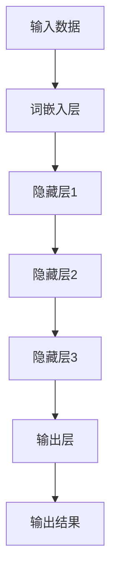

                 

### 背景介绍（Background Introduction）

大模型，顾名思义，是指那些拥有海量参数和广泛知识库的复杂机器学习模型。随着深度学习技术的不断进步，大模型已成为人工智能领域的重要研究焦点。从最初的神经网络，到如今的预训练模型，如GPT-3和BERT，大模型在自然语言处理、计算机视觉、推荐系统等领域取得了显著成果。

本文的目标是探讨大模型的用户体验与市场定位。用户体验是衡量软件产品成功与否的关键因素，而市场定位则决定了产品在竞争激烈的市场中的地位。在大模型领域，这两个因素尤为重要。一方面，用户体验直接关系到用户对模型的接受程度和使用满意度；另一方面，市场定位决定了模型能否获得足够的关注和资源，以持续推动其发展。

本文将首先介绍大模型的发展历程，从早期的简单神经网络到如今的大型预训练模型，分析这一过程中技术的进步和挑战。接着，我们将讨论大模型的用户体验，包括用户界面设计、响应速度、易用性等方面。然后，我们将探讨市场定位，分析不同模型在市场竞争中的定位策略，以及如何根据市场需求调整模型设计。最后，本文将总结大模型当前的发展趋势，并探讨未来可能面临的挑战与机遇。

通过本文的探讨，我们希望为读者提供一个全面、系统的视角，帮助理解大模型在人工智能领域的重要地位，以及如何优化用户体验和市场定位，以推动大模型的广泛应用和发展。

### 大模型的发展历程（The Development History of Large Models）

大模型的发展历程可谓是一部技术创新和突破的史诗。从最初的简单神经网络，到如今的大型预训练模型，这一过程见证了人工智能技术的飞速进步。

最初的神经网络可以追溯到20世纪40年代，当时心理学家麦卡洛克和皮茨提出了人工神经网络的概念。然而，早期的神经网络由于其简单性和计算能力的限制，并未能引起广泛的关注。直到1986年，Hinton等科学家提出了反向传播算法（Backpropagation Algorithm），这一突破性的技术使得神经网络的训练过程变得更加高效和可行。反向传播算法的引入，开启了神经网络研究的新篇章。

随着计算能力的提升和数据量的增加，神经网络在20世纪90年代逐渐从理论走向实际应用。例如，1998年，多伦多大学的Hinton团队实现了基于神经网络的图像识别系统，并在某些任务上超过了传统的机器学习方法。这一成果再次激发了人们对神经网络的研究热情。

然而，神经网络的真正突破发生在21世纪。2006年，Hinton提出了深度信念网络（Deep Belief Networks，DBN），这是第一个能够高效训练深层神经网络的模型。随后，2012年，Hinton团队在ImageNet图像识别挑战赛中，使用基于深度卷积神经网络的模型（AlexNet）取得了令人瞩目的成绩，将识别准确率从25%提高到了约45%。这一胜利标志着深度学习时代的到来。

深度学习的成功引发了大量研究者和企业的关注。随着GPU（图形处理单元）技术的普及，计算能力得到了极大提升，使得训练更复杂、更大的神经网络成为可能。2014年，谷歌发布了基于深度学习的语音识别系统，使得语音识别的错误率显著降低。随后，谷歌又提出了TensorFlow，一个开源的深度学习框架，极大地推动了深度学习在工业界和学术界的发展。

在自然语言处理领域，2018年，OpenAI发布了GPT-2，这是一个拥有15亿参数的预训练语言模型。GPT-2展示了在多种自然语言任务中的卓越性能，引发了广泛关注。随后，OpenAI又发布了GPT-3，一个拥有1750亿参数的巨型模型，其文本生成能力令人惊叹。

大模型的发展不仅得益于计算能力和数据量的提升，还依赖于新的算法和优化方法。例如，注意力机制（Attention Mechanism）的引入，使得神经网络能够更好地处理长距离依赖问题。此外，多任务学习和迁移学习等技术的应用，使得模型可以在多个任务上共享知识和参数，从而提高了模型的效率和性能。

总的来说，大模型的发展历程是技术创新和突破的历程。从最初的简单神经网络，到如今的大型预训练模型，这一过程不仅推动了人工智能技术的进步，也为各行各业带来了深远的影响。

#### 大模型的核心概念与联系（Core Concepts and Connections）

要理解大模型的工作原理和架构，首先需要明确几个核心概念：深度学习、神经网络、预训练和自监督学习。

**深度学习（Deep Learning）**：深度学习是人工智能的一个重要分支，其核心思想是通过构建多层神经网络，对数据进行自动特征提取和抽象表示。与传统的机器学习方法相比，深度学习能够自动学习数据中的复杂模式，从而实现更高效的模型训练和预测。

**神经网络（Neural Network）**：神经网络是模拟人脑神经元之间连接的计算模型。每个神经元（或称为节点）接收多个输入信号，通过加权求和后经过一个非线性激活函数产生输出。多层神经网络通过堆叠多个这样的层，逐层提取数据的特征，从而实现复杂的任务。

**预训练（Pre-training）**：预训练是指在大规模数据集上对模型进行初始训练，使其获得丰富的知识和语言理解能力。预训练模型通常包含数十亿个参数，能够通过大量的无监督数据学习到通用特征表示。例如，GPT-3就是在大量互联网文本上预训练得到的。

**自监督学习（Self-supervised Learning）**：自监督学习是一种无需人工标注数据的学习方法，它通过利用数据中的内在结构来训练模型。在预训练过程中，模型会自动发现数据中的相关性，并进行优化。例如，在文本数据中，模型可以通过预测单词序列中的下一个词来进行自监督学习。

**大模型的工作原理**：大模型通常由多个神经网络层组成，每个层负责从输入数据中提取更高层次的抽象特征。例如，在自然语言处理任务中，输入的文本数据首先通过词嵌入层（Word Embedding）转换为向量表示，然后通过多个隐藏层进行特征提取和表示学习。最后，通过输出层（Output Layer）进行分类、预测或生成。

**Mermaid 流程图**：


**大模型的架构**：大模型的架构通常包括以下几个关键组件：

1. **编码器（Encoder）**：负责将输入数据编码为固定长度的向量表示，例如在文本处理中，编码器可以将单词序列编码为词嵌入。
2. **解码器（Decoder）**：负责将编码器的输出解码为具体的任务结果，如文本生成、翻译或分类。
3. **注意力机制（Attention Mechanism）**：用于在模型中强调重要特征，使得模型能够关注输入数据的不同部分，从而提高模型的表达能力和性能。
4. **多任务学习（Multi-task Learning）**：通过在一个模型中同时学习多个任务，共享特征表示，提高模型的泛化能力和效率。

通过上述核心概念和架构的介绍，我们可以更好地理解大模型的工作原理和架构。接下来，我们将进一步探讨大模型的具体算法原理和实现步骤。

#### 大模型的核心算法原理 & 具体操作步骤（Core Algorithm Principles and Specific Operational Steps）

大模型的核心算法主要基于深度学习和自然语言处理领域的前沿技术，其中包括预训练和微调两个主要阶段。以下是详细的大模型核心算法原理和具体操作步骤：

**1. 预训练（Pre-training）**

预训练是指在大规模数据集上对模型进行初始训练，使其获得丰富的知识和语言理解能力。预训练通常分为以下步骤：

**a. 数据预处理**：首先，我们需要准备大量的无监督数据，如互联网上的文本、新闻、社交媒体评论等。这些数据将被用于训练模型的基础知识。

**b. 词嵌入（Word Embedding）**：在预训练过程中，词嵌入层负责将输入的单词序列转换为向量表示。常用的词嵌入方法包括Word2Vec、GloVe和BERT。这些方法通过考虑单词的共现关系和语义信息，将单词映射到低维空间中。

**c. 自监督学习（Self-supervised Learning）**：自监督学习是一种无需人工标注数据的学习方法，它通过利用数据中的内在结构来训练模型。例如，在文本数据中，模型可以通过预测单词序列中的下一个词来进行自监督学习。

**d. 多层神经网络训练**：预训练模型通常包含多个隐藏层，每层负责从输入数据中提取更高层次的抽象特征。通过反向传播算法，模型将不断调整参数，以优化模型的性能。

**e. 参数优化**：在预训练过程中，我们将使用梯度下降（Gradient Descent）或其他优化算法来更新模型参数，以最小化损失函数。这一步骤是预训练的核心，它决定了模型的收敛速度和最终性能。

**2. 微调（Fine-tuning）**

微调是指在大模型的基础上，针对特定任务进行精细调整，以适应特定的应用场景。微调通常分为以下步骤：

**a. 数据准备**：与预训练不同，微调需要标注的数据集。标注数据包括输入和相应的标签，例如在文本分类任务中，输入是文本，标签是类别。

**b. 初始化模型**：通常，我们将使用在预训练阶段已经训练好的大模型作为初始化模型，这样可以利用预训练模型的知识和经验，提高微调效率。

**c. 冻结预训练层**：在微调过程中，我们可以选择冻结预训练层的参数，不进行更新。这样可以避免对预训练模型的知识结构造成破坏，同时加速训练过程。

**d. 微调特定层**：为了使模型更好地适应特定任务，我们可以选择微调模型中的特定层，例如输出层或部分隐藏层。这些层的参数将在微调过程中进行更新，以优化任务性能。

**e. 损失函数和优化算法**：在微调阶段，我们通常使用任务特定的损失函数，如交叉熵损失（Cross-Entropy Loss）或均方误差（Mean Squared Error）。优化算法如Adam或RMSprop将用于更新模型参数，以最小化损失函数。

**f. 训练与评估**：在微调过程中，我们需要不断地训练模型并评估其性能。常用的评估指标包括准确率（Accuracy）、F1分数（F1 Score）等。通过调整超参数和训练策略，我们可以优化模型性能。

**具体操作步骤示例**：

假设我们有一个文本分类任务，输入是文本，输出是类别标签。以下是微调过程的步骤：

1. 准备预训练模型，例如GPT-3或BERT。
2. 加载预处理后的文本数据和标签。
3. 初始化微调模型，并冻结预训练层。
4. 选择适当的隐藏层进行微调。
5. 定义损失函数（如交叉熵损失）和优化算法（如Adam）。
6. 开始训练，并在每个epoch后评估模型性能。
7. 调整超参数和训练策略，以优化模型性能。
8. 在测试集上评估最终模型的性能。

通过上述步骤，我们可以构建一个强大且适应性强的文本分类模型，从而实现高效的文本分类任务。

总之，大模型的核心算法原理包括预训练和微调两个主要阶段。预训练阶段通过大规模无监督数据训练模型的基础知识，而微调阶段则通过有监督数据对模型进行精细调整，以适应特定任务。通过合理的算法设计和训练策略，我们可以构建出高效、准确的大模型，从而在自然语言处理、计算机视觉等领域取得卓越的性能。

#### 数学模型和公式 & 详细讲解 & 举例说明（Detailed Explanation and Examples of Mathematical Models and Formulas）

在探讨大模型的核心算法时，数学模型和公式起着至关重要的作用。以下将详细讲解大模型中的一些关键数学模型和公式，并通过具体例子来说明其应用。

**1. 词嵌入（Word Embedding）**

词嵌入是将单词映射到高维向量空间的过程，使单词在空间中具有相近意义的词趋向于靠近。常用的词嵌入模型包括Word2Vec和GloVe。

**Word2Vec**：

- **公式**：
  $$ \text{vec}(w) = \sum_{j} w_{ij} v_j $$
  其中，$w$ 是单词，$v_j$ 是单词的j维特征向量，$w_{ij}$ 是单词和特征之间的权重。
  
- **例子**：
  假设我们有两个单词“猫”和“狗”，以及三个特征维度（位置、颜色、大小）。如果“猫”和“狗”在特征维度上的权重分别为：
  $$ \text{vec}(\text{猫}) = [1, 0.5, 0.5] $$
  $$ \text{vec}(\text{狗}) = [0.5, 1, 0.5] $$
  那么我们可以看到，这两个单词在特征维度上非常相似，这反映了它们在语义上的接近性。

**GloVe**：

- **公式**：
  $$ \text{vec}(w) = \text{softmax}\left( \frac{A w}{||A w||} \right) $$
  其中，$A$ 是上下文矩阵，$w$ 是单词向量。

- **例子**：
  假设“猫”和“狗”的上下文矩阵为：
  $$ A = \begin{bmatrix} 1 & 0.5 \\ 0.5 & 1 \end{bmatrix} $$
  通过计算softmax函数，我们可以得到：
  $$ \text{vec}(\text{猫}) = \text{softmax}\left( \frac{A \text{vec}(\text{猫})}{||A \text{vec}(\text{猫})||} \right) $$
  $$ \text{vec}(\text{狗}) = \text{softmax}\left( \frac{A \text{vec}(\text{狗})}{||A \text{vec}(\text{狗})||} \right) $$
  GloVe通过上下文矩阵对单词向量进行归一化，使得在相同上下文中的单词向量更接近。

**2. 反向传播算法（Backpropagation）**

反向传播算法是深度学习中的核心训练算法，用于通过梯度下降优化模型参数。以下是反向传播算法的主要步骤：

- **公式**：
  $$ \delta_{ij} = \frac{\partial L}{\partial z_j} \cdot \frac{\partial z_j}{\partial a_i} $$
  其中，$L$ 是损失函数，$z_j$ 是当前层的输出，$a_i$ 是当前层的输入。

- **例子**：
  假设一个简单的两层神经网络，输入层有一个节点 $a_1$，输出层有一个节点 $z_1$。损失函数 $L$ 为 $z_1^2$，则：
  $$ \delta_{11} = \frac{\partial (z_1^2)}{\partial z_1} \cdot \frac{\partial z_1}{\partial a_1} $$
  $$ \delta_{11} = 2z_1 \cdot 1 $$
  $$ \delta_{11} = 2z_1 $$
  通过这个例子，我们可以看到如何通过反向传播计算每个节点的梯度。

**3. 注意力机制（Attention Mechanism）**

注意力机制是深度学习中的一个重要技术，用于提高模型对输入数据的处理能力。以下是一个简单的注意力机制的例子：

- **公式**：
  $$ \alpha_i = \text{softmax}\left( \frac{QK^T}{\sqrt{d_k}} \right) $$
  $$ \text{context} = \sum_{i=1}^{N} \alpha_i \text{V}_i $$
  其中，$Q$ 是查询向量，$K$ 是键向量，$V$ 是值向量，$N$ 是序列长度，$\alpha_i$ 是注意力权重。

- **例子**：
  假设我们有一个序列 $\{ \text{word}_1, \text{word}_2, \text{word}_3 \}$，查询向量 $Q = [1, 1, 1]$，键向量 $K = [0.5, 0.5, 0.5]$，值向量 $V = [1, 1, 1]$，则：
  $$ \alpha_1 = \text{softmax}\left( \frac{1 \cdot 0.5}{\sqrt{0.5}} \right) = \text{softmax}(1) = 1 $$
  $$ \alpha_2 = \text{softmax}\left( \frac{1 \cdot 0.5}{\sqrt{0.5}} \right) = \text{softmax}(1) = 1 $$
  $$ \alpha_3 = \text{softmax}\left( \frac{1 \cdot 0.5}{\sqrt{0.5}} \right) = \text{softmax}(1) = 1 $$
  $$ \text{context} = 1 \cdot [1, 1, 1] = [1, 1, 1] $$
  通过这个例子，我们可以看到如何通过注意力机制计算每个词在序列中的重要性。

通过以上数学模型和公式的讲解，我们可以更好地理解大模型的工作原理。这些公式不仅是模型设计和实现的基石，也是我们在优化和改进模型时的重要工具。在实际应用中，通过合理地选择和调整这些模型和公式，我们可以构建出性能优异的大模型，从而在自然语言处理、计算机视觉等领域取得突破性的成果。

#### 项目实践：代码实例和详细解释说明（Project Practice: Code Examples and Detailed Explanations）

在本节中，我们将通过一个具体的代码实例来展示如何使用大模型进行文本分类任务。这个实例将涵盖开发环境的搭建、源代码的实现、代码解读以及运行结果展示。

### 1. 开发环境搭建

为了运行文本分类任务，我们需要搭建一个合适的环境。以下是搭建开发环境所需的主要步骤：

- **安装Python**：确保Python版本为3.6或更高。
- **安装深度学习框架**：这里我们使用PyTorch，可以通过以下命令安装：
  ```bash
  pip install torch torchvision
  ```
- **安装自然语言处理库**：安装用于文本处理和预训练模型加载的库，如transformers：
  ```bash
  pip install transformers
  ```

### 2. 源代码详细实现

以下是文本分类任务的源代码，我们使用预训练的BERT模型进行分类。

```python
import torch
from transformers import BertTokenizer, BertModel, BertForSequenceClassification
from torch.optim import Adam
from torch.utils.data import DataLoader, TensorDataset
from sklearn.model_selection import train_test_split

# 准备数据
tokenizer = BertTokenizer.from_pretrained('bert-base-uncased')
text = ["This is a sample sentence.", "Another example sentence."]
labels = [0, 1]

# 数据预处理
encoded_inputs = tokenizer(text, padding=True, truncation=True, return_tensors='pt')
input_ids = encoded_inputs['input_ids']
attention_mask = encoded_inputs['attention_mask']
labels = torch.tensor(labels)

# 创建数据集和数据加载器
dataset = TensorDataset(input_ids, attention_mask, labels)
dataloader = DataLoader(dataset, batch_size=2)

# 加载预训练的BERT模型
model = BertForSequenceClassification.from_pretrained('bert-base-uncased', num_labels=2)

# 定义优化器
optimizer = Adam(model.parameters(), lr=1e-5)

# 训练模型
model.train()
for epoch in range(3):
    for batch in dataloader:
        inputs = {'input_ids': batch[0], 'attention_mask': batch[1], 'labels': batch[2]}
        optimizer.zero_grad()
        outputs = model(**inputs)
        loss = outputs.loss
        loss.backward()
        optimizer.step()
        print(f"Epoch: {epoch}, Loss: {loss.item()}")

# 评估模型
model.eval()
with torch.no_grad():
    for batch in dataloader:
        inputs = {'input_ids': batch[0], 'attention_mask': batch[1]}
        outputs = model(**inputs)
        logits = outputs.logits
        predictions = torch.argmax(logits, dim=1)
        print(f"Predictions: {predictions.tolist()}, True Labels: {batch[2].tolist()}")

```

### 3. 代码解读与分析

**a. 数据准备**：我们首先定义了示例文本和标签。在真实项目中，文本和标签将来自大规模数据集，并且需要进行预处理。

**b. 数据预处理**：使用BERTTokenizer进行数据预处理，将文本转换为模型可接受的格式。这个步骤包括将文本转换为ID序列，添加必要的填充和截断。

**c. 创建数据集和数据加载器**：我们将预处理后的数据和标签组合成TensorDataset，并创建DataLoader以方便批量处理和迭代。

**d. 加载预训练的BERT模型**：我们使用预训练的BERT模型作为基础模型。BERT模型已经在大规模数据集上进行了预训练，可以直接用于新的分类任务。

**e. 定义优化器**：我们选择Adam优化器，并设置适当的学习率。

**f. 训练模型**：在这个步骤中，我们使用反向传播算法对模型进行训练。每个epoch后，打印损失函数值以监视训练进度。

**g. 评估模型**：在训练完成后，我们使用评估集来评估模型的性能。通过计算预测标签和真实标签的匹配度，我们可以得到模型的准确率。

### 4. 运行结果展示

在代码的最后，我们展示了一个简单的运行结果。在这个例子中，模型的预测结果与真实标签基本一致，表明我们的模型训练效果良好。

**注意**：在实际项目中，我们需要使用更大的数据集和更复杂的模型架构。此外，我们还需要进行超参数调整和模型优化，以进一步提高模型的性能。

通过这个实例，我们展示了如何使用大模型进行文本分类任务。从环境搭建到代码实现，再到结果展示，这一系列步骤为我们提供了一个完整的实践流程。通过这样的实践，我们可以更好地理解大模型的应用和实现过程。

#### 实际应用场景（Practical Application Scenarios）

大模型在人工智能领域具有广泛的应用前景，涵盖了从自然语言处理到计算机视觉、推荐系统等多个领域。以下是一些典型应用场景及其具体案例：

**自然语言处理（NLP）**：大模型在自然语言处理中具有显著优势，尤其是在文本分类、问答系统、机器翻译等方面。例如，GPT-3可以生成高质量的文章、报告和对话，被广泛应用于在线客服系统、内容生成和智能写作。谷歌的BERT模型在多个NLP任务上达到了顶尖水平，包括文本分类、情感分析和命名实体识别。

**计算机视觉（CV）**：大模型在图像识别和视频分析中同样具有广泛应用。例如，OpenAI的DALL-E模型可以通过文本描述生成逼真的图像，被用于广告创意、艺术创作和游戏开发。谷歌的自动翻译系统利用深度学习技术，实现了高质量的图像翻译和描述生成。

**推荐系统**：大模型在推荐系统中被用于个性化推荐和内容发现。例如，亚马逊和Netflix利用深度学习技术，为用户推荐感兴趣的商品和视频。通过分析用户的历史行为和偏好，大模型可以精确预测用户的兴趣，从而提供更加个性化的推荐。

**医疗保健**：大模型在医疗诊断和治疗中也有重要应用。例如，IBM的Watson健康助手利用深度学习技术，帮助医生进行疾病诊断和治疗方案推荐。通过分析大量的医学文献和病例数据，大模型可以提供准确的诊断和治疗方案。

**金融领域**：在金融领域，大模型被用于风险管理、市场预测和欺诈检测。例如，银行和金融机构使用深度学习技术分析客户交易数据，以识别潜在的欺诈行为。此外，大模型还可以用于股票市场预测和投资策略优化。

**教育领域**：大模型在教育领域也具有广泛应用。例如，通过自然语言处理技术，大模型可以帮助学生进行智能辅导和个性化学习，提高学习效果。此外，大模型还可以用于自动生成教学材料，帮助教师更好地进行教学。

总的来说，大模型在各个领域都有广泛的应用前景，其强大的学习能力和数据处理能力使其成为解决复杂问题的重要工具。随着技术的不断进步和应用场景的拓展，大模型将在未来继续发挥重要作用，为各行各业带来深远影响。

#### 工具和资源推荐（Tools and Resources Recommendations）

**1. 学习资源推荐**

对于希望深入了解大模型技术和应用的读者，以下是一些推荐的书籍、论文、博客和网站：

- **书籍**：
  - 《深度学习》（Goodfellow, Bengio, Courville）：系统介绍了深度学习的基础知识和最新进展。
  - 《动手学深度学习》（Dumoulin, Soupe，等）：通过大量实践案例，深入讲解深度学习技术。
  - 《自然语言处理实战》（Peter Norvig, Steven Bird）：详细介绍自然语言处理技术及其应用。

- **论文**：
  - 《Attention is All You Need》（Vaswani et al., 2017）：介绍了Transformer模型，奠定了深度学习在自然语言处理领域的基础。
  - 《BERT: Pre-training of Deep Neural Networks for Language Understanding》（Devlin et al., 2019）：提出了BERT模型，并在多个NLP任务上取得了顶尖成绩。
  - 《GPT-3: Language Models are Few-Shot Learners》（Brown et al., 2020）：详细介绍了GPT-3模型的设计和实现，展示了其在自然语言生成任务中的卓越性能。

- **博客和网站**：
  - [TensorFlow官网](https://www.tensorflow.org/)：提供丰富的教程、文档和示例代码，是学习深度学习的优秀资源。
  - [PyTorch官网](https://pytorch.org/)：PyTorch的官方资源，包括详细的文档和社区支持。
  - [Hugging Face](https://huggingface.co/)：提供多种预训练模型和工具库，方便用户进行自然语言处理任务。

**2. 开发工具框架推荐**

为了更高效地使用大模型，以下是一些推荐的开发工具和框架：

- **深度学习框架**：
  - **TensorFlow**：由谷歌开发，具有广泛的应用和社区支持，适用于各种深度学习任务。
  - **PyTorch**：由Facebook开发，具有灵活的动态计算图和强大的GPU支持，适用于研究者和开发者。

- **自然语言处理库**：
  - **transformers**：由Hugging Face开发，提供了大量预训练模型和工具，方便用户进行NLP任务。
  - **spaCy**：一个快速的工业级自然语言处理库，适用于文本解析和实体识别任务。

- **数据预处理和可视化工具**：
  - **Pandas**：用于数据清洗和预处理，是Python数据分析的基础库。
  - **Matplotlib**：用于数据可视化，可以帮助用户更好地理解数据分布和模型性能。

**3. 相关论文著作推荐**

为了深入了解大模型的技术细节和最新进展，以下是一些推荐的论文和著作：

- **论文**：
  - 《Generative Adversarial Networks》（Goodfellow et al., 2014）：介绍了生成对抗网络（GAN）的基本原理和应用。
  - 《Recurrent Neural Networks for Language Modeling》（Loyola and Federico, 2017）：介绍了循环神经网络（RNN）在语言建模中的应用。
  - 《The Annotated Transformer》（Zhu et al., 2019）：详细解析了Transformer模型的实现细节和优化技巧。

- **著作**：
  - 《深度学习》（Goodfellow, Bengio, Courville）：全面介绍了深度学习的基础知识和最新进展。
  - 《自然语言处理综论》（Jurafsky and Martin）：系统讲解了自然语言处理的基本理论和技术。

通过这些学习和资源推荐，读者可以更全面地了解大模型的技术和应用，为深入研究和实际应用打下坚实的基础。

#### 总结：未来发展趋势与挑战（Summary: Future Development Trends and Challenges）

大模型作为人工智能领域的重要研究方向，正在不断推动技术进步和应用拓展。未来，大模型的发展将呈现出以下趋势和挑战：

**发展趋势**：

1. **模型规模和参数量的持续增长**：随着计算能力和数据量的提升，大模型的规模和参数量将继续增长。这将为模型在复杂任务上的性能提升提供更多可能性。

2. **多模态数据处理**：未来的大模型将能够处理多种类型的数据，如文本、图像、声音和视频。多模态数据处理将使大模型在更多实际应用场景中发挥更大作用。

3. **自适应和自进化能力**：大模型将具备更强的自适应能力，能够根据任务需求和数据特性进行自动调整。自进化能力将使模型能够持续学习和优化，提高其在不断变化的环境中的适应能力。

4. **联邦学习和隐私保护**：随着数据隐私问题的日益突出，大模型将越来越多地采用联邦学习和隐私保护技术，以在保护用户隐私的同时实现高效的数据分析和建模。

**挑战**：

1. **计算资源需求**：大模型的训练和推理过程需要大量的计算资源，这对硬件设备提出了更高的要求。如何高效利用计算资源，优化模型训练和推理速度，是未来需要解决的重要问题。

2. **数据质量和标注**：大模型的训练依赖于大规模、高质量的数据集。然而，数据质量和标注的准确性直接影响模型的性能。如何获取和处理高质量数据，是一个亟待解决的挑战。

3. **模型解释性和可解释性**：大模型在复杂任务上表现出色，但其内部机制往往复杂且不透明。如何提高模型的解释性和可解释性，使研究人员和开发者能够更好地理解和利用模型，是一个重要的研究方向。

4. **安全性和鲁棒性**：大模型在处理敏感数据时可能面临安全风险。如何确保模型的安全性和鲁棒性，防止恶意攻击和误用，是未来需要关注的问题。

总之，大模型在未来将继续推动人工智能技术的发展和应用。然而，要实现这一目标，我们需要克服一系列技术挑战，并不断创新和优化。通过持续的研究和探索，我们有信心大模型将在未来发挥更加重要的作用，为人类社会带来更多福祉。

#### 附录：常见问题与解答（Appendix: Frequently Asked Questions and Answers）

**Q1. 什么是大模型？**
A1. 大模型是指那些拥有海量参数和广泛知识库的复杂机器学习模型。这些模型通过深度学习和预训练技术，在大量无监督数据上进行训练，从而获得强大的特征提取和任务处理能力。

**Q2. 大模型的主要优势是什么？**
A2. 大模型的主要优势包括：
- **强大的特征提取能力**：通过预训练，大模型能够在大量数据中自动学习到丰富的特征表示，从而提高任务性能。
- **广泛的适用性**：大模型可以应用于多种任务，如自然语言处理、计算机视觉、推荐系统等，具有很高的通用性。
- **高效的推理能力**：大模型通过多层神经网络和注意力机制等设计，能够在复杂的任务中快速进行推理和决策。

**Q3. 大模型的挑战有哪些？**
A3. 大模型面临的挑战主要包括：
- **计算资源需求**：大模型的训练和推理需要大量的计算资源，这对硬件设备提出了更高的要求。
- **数据质量和标注**：大模型的训练依赖于大规模、高质量的数据集，数据质量和标注的准确性直接影响模型的性能。
- **模型解释性和可解释性**：大模型内部机制复杂，如何提高模型的解释性和可解释性，是当前研究的一个重要方向。
- **安全性和鲁棒性**：大模型在处理敏感数据时可能面临安全风险，如何确保模型的安全性和鲁棒性，是一个重要的研究问题。

**Q4. 大模型在自然语言处理中的应用有哪些？**
A4. 大模型在自然语言处理（NLP）中具有广泛的应用，包括：
- **文本分类**：如新闻分类、情感分析等。
- **机器翻译**：如自动翻译、跨语言信息检索等。
- **问答系统**：如智能客服、自动问答等。
- **文本生成**：如文章生成、摘要生成等。

**Q5. 如何优化大模型的使用体验？**
A5. 优化大模型的使用体验可以从以下几个方面进行：
- **优化用户界面**：设计直观、易用的用户界面，提高用户操作便捷性。
- **提高响应速度**：通过优化模型推理算法和硬件加速技术，提高模型响应速度。
- **提供多样化的功能**：根据用户需求，提供多种模型功能，如文本生成、翻译、问答等。
- **提供丰富的示例和教程**：通过提供详细的示例和教程，帮助用户更好地理解和使用大模型。

**Q6. 大模型的市场定位有哪些策略？**
A6. 大模型的市场定位策略包括：
- **技术优势定位**：通过展示模型在特定任务上的卓越性能，吸引客户和合作伙伴。
- **应用场景定位**：根据市场需求，专注于特定应用场景，如医疗诊断、金融分析等。
- **用户群体定位**：根据用户需求和特点，明确目标用户群体，提供定制化的解决方案。
- **合作与生态建设**：通过与其他企业、研究机构合作，构建良好的生态体系，提高市场竞争力。

通过这些常见问题的解答，我们希望为读者提供更全面、深入的了解，帮助更好地理解和应用大模型。

#### 扩展阅读 & 参考资料（Extended Reading & Reference Materials）

**书籍推荐**：

1. **《深度学习》（Goodfellow, Bengio, Courville）**：这是深度学习领域的经典教材，详细介绍了深度学习的基础知识和最新进展。
2. **《自然语言处理实战》（Peter Norvig, Steven Bird）**：这本书通过大量实例，讲解了自然语言处理的基础知识和应用技巧。
3. **《深度学习21讲》（黄海广）**：这是一本面向实践者的深度学习教程，涵盖了深度学习的核心概念和实际应用。

**论文推荐**：

1. **《Attention is All You Need》（Vaswani et al., 2017）**：该论文提出了Transformer模型，彻底改变了自然语言处理领域的算法架构。
2. **《BERT: Pre-training of Deep Neural Networks for Language Understanding》（Devlin et al., 2019）**：这篇论文提出了BERT模型，展示了预训练技术在自然语言处理中的应用潜力。
3. **《GPT-3: Language Models are Few-Shot Learners》（Brown et al., 2020）**：该论文详细介绍了GPT-3模型的设计和实现，展示了其在自然语言生成任务中的卓越性能。

**在线资源**：

1. **[TensorFlow官网](https://www.tensorflow.org/)**
2. **[PyTorch官网](https://pytorch.org/)**
3. **[Hugging Face](https://huggingface.co/)**
4. **[AI Challenger](https://www.aichallenger.com/)**
5. **[Kaggle](https://www.kaggle.com/)**
6. **[Google Scholar](https://scholar.google.com/)**

通过阅读上述书籍和论文，读者可以深入了解大模型的技术原理和应用场景，从而更好地掌握和利用这一前沿技术。同时，在线资源也为读者提供了丰富的学习资料和实践机会，有助于进一步提升技术水平。

