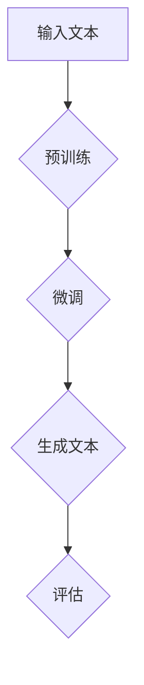

                 

### 背景介绍（Background Introduction）

随着人工智能技术的不断进步，大规模语言模型（Large-scale Language Models）已经成为了当前研究与应用的热点。其中，GPT（Generative Pre-trained Transformer）系列模型以其卓越的性能和广泛的应用前景受到了广泛关注。然而，作为这些模型的用户，我们对于它们的需求和潜在的市场潜力了解得还远远不够。

首先，让我们从用户需求的角度来探讨。用户需要什么？他们关心什么？他们对大规模语言模型有什么期望？这背后涉及到模型的准确性、响应速度、上下文理解能力、可定制性等多方面的问题。

然后，我们再来看市场潜力。大规模语言模型在哪些领域有着巨大的应用前景？它们如何改变现有的业务模式？市场对此类模型的需求有多大？这些问题需要我们从技术、经济和社会等多个角度进行分析。

本文将分以下几个部分来探讨这些问题：

1. **核心概念与联系**：我们将介绍大规模语言模型的基本原理和关键组成部分。
2. **核心算法原理 & 具体操作步骤**：我们将详细解释大规模语言模型的训练和推断过程。
3. **数学模型和公式 & 详细讲解 & 举例说明**：我们将探讨支持大规模语言模型的核心数学模型和公式，并通过实例进行详细说明。
4. **项目实践：代码实例和详细解释说明**：我们将通过一个实际项目来展示大规模语言模型的开发过程。
5. **实际应用场景**：我们将分析大规模语言模型在不同领域的应用案例。
6. **工具和资源推荐**：我们将推荐一些有助于学习和应用大规模语言模型的学习资源。
7. **总结：未来发展趋势与挑战**：我们将总结本文的核心观点，并探讨大规模语言模型未来的发展趋势和面临的挑战。

让我们一步一步深入探讨这些问题，以期为您提供一个全面、系统的理解。

### Keywords: Large-scale Language Models, GPT, User Needs, Market Potential, Application Scenarios

### Abstract:
This article explores the user needs and market potential of large-scale language models, focusing on GPT models. We will discuss the fundamental principles and key components of these models, their training and inference processes, and the mathematical models and formulas that support them. Through a practical project, we will demonstrate the development process of large-scale language models. We will also analyze their application scenarios across various fields and provide recommendations for tools and resources. Finally, we will summarize the main findings and discuss future trends and challenges for large-scale language models.

## 1. 核心概念与联系（Core Concepts and Connections）

大规模语言模型，尤其是GPT（Generative Pre-trained Transformer）系列模型，已经成为了自然语言处理（NLP）领域的重要工具。要理解这些模型，我们首先需要了解其基本原理和组成部分。

### 1.1 语言模型的定义

语言模型（Language Model）是一种用于预测下一个单词或词汇的概率分布的模型。在GPT模型中，这个任务是通过学习大量的文本数据来完成的，使得模型能够预测一个句子的下一个词。

### 1.2 Transformer架构

Transformer是GPT模型的核心架构。它基于自注意力机制（Self-Attention Mechanism），能够捕捉文本中的长距离依赖关系。相较于传统的循环神经网络（RNN），Transformer具有更快的训练速度和更好的性能。

### 1.3 自注意力机制

自注意力机制允许模型在不同的位置上对输入序列进行加权，从而更好地捕捉上下文信息。具体来说，自注意力机制通过计算输入序列中每个词与所有其他词的相关性，来决定每个词在输出中的重要性。

### 1.4 预训练与微调

预训练（Pre-training）是大规模语言模型的重要步骤。在预训练阶段，模型在一个巨大的语料库上进行训练，以学习语言的一般规律。然后，通过微调（Fine-tuning），模型可以在特定任务上进行调整，以提高其在特定领域的表现。

### 1.5 微软的GPT系列模型

微软的GPT系列模型是大规模语言模型的代表。GPT-3更是突破了以往的记录，拥有1750亿个参数，成为目前最大的语言模型。其出色的性能使其在多种任务中表现出色，包括问答、机器翻译、文本生成等。

### Mermaid 流程图

为了更直观地理解大规模语言模型的基本架构，我们可以使用Mermaid流程图来展示其关键组件和操作步骤。



在这个流程图中，输入文本首先经过预训练阶段，然后进行微调以适应特定任务，最终生成文本并评估其质量。

## 2. 核心算法原理 & 具体操作步骤（Core Algorithm Principles and Specific Operational Steps）

### 2.1 Transformer模型的基本原理

Transformer模型的核心是自注意力机制。自注意力机制通过计算输入序列中每个词与其他所有词的相关性，为每个词分配不同的权重。这使得模型能够更好地捕捉文本中的长距离依赖关系。

具体来说，自注意力机制可以分为以下几个步骤：

1. **词嵌入（Word Embedding）**：将输入文本中的每个词映射到一个向量。
2. **位置编码（Positional Encoding）**：为每个词添加位置信息，以便模型能够理解单词在句子中的位置。
3. **多头自注意力（Multi-Head Self-Attention）**：计算输入序列中每个词与其他所有词的相关性，为每个词分配权重。
4. **前馈神经网络（Feedforward Neural Network）**：对每个词进行进一步处理，以增强其表示能力。

### 2.2 训练过程

大规模语言模型的训练过程可以分为以下几个步骤：

1. **数据准备**：收集并预处理大量文本数据，包括文本清洗、分词、去停用词等。
2. **词嵌入**：将每个词映射到一个向量。
3. **构建模型**：使用Transformer架构构建模型，并设置适当的参数。
4. **训练**：通过反向传播算法（Backpropagation Algorithm）训练模型，调整模型参数以最小化损失函数。
5. **评估**：使用验证集评估模型性能，并调整参数以获得最佳结果。

### 2.3 推断过程

在推断过程中，大规模语言模型会根据输入文本生成输出。具体步骤如下：

1. **输入文本编码**：将输入文本转换为模型能够理解的向量。
2. **生成预测**：模型根据输入向量生成下一个词的概率分布。
3. **采样**：从概率分布中采样一个词作为输出。
4. **重复**：重复步骤2-3，直到生成完整的文本。

### 2.4 实例

假设我们有一个简单的文本数据集，包含以下句子：

```
我是人工智能专家，擅长使用Transformer模型进行文本生成。
```

我们可以使用GPT模型来生成一个类似的句子。具体步骤如下：

1. **数据准备**：将文本数据进行预处理，如分词和编码。
2. **输入编码**：将预处理后的文本转换为模型能够理解的向量。
3. **生成预测**：使用GPT模型生成下一个词的概率分布。
4. **采样**：从概率分布中采样一个词作为输出，例如“我也”。
5. **重复**：重复步骤3-4，直到生成完整的文本。

最终生成的文本可能如下：

```
我也是人工智能专家，擅长使用Transformer模型进行文本生成。
```

这个实例展示了大规模语言模型的训练和推断过程。

## 3. 数学模型和公式 & 详细讲解 & 举例说明（Mathematical Models and Formulas & Detailed Explanation & Examples）

### 3.1 Transformer模型的核心数学模型

Transformer模型的核心数学模型包括自注意力机制（Self-Attention Mechanism）和前馈神经网络（Feedforward Neural Network）。以下是这些模型的基本公式。

#### 3.1.1 自注意力机制

自注意力机制的计算公式如下：

$$
\text{Attention}(Q, K, V) = \text{softmax}\left(\frac{QK^T}{\sqrt{d_k}}\right) V
$$

其中，\(Q\)、\(K\) 和 \(V\) 分别是查询（Query）、键（Key）和值（Value）的向量，\(d_k\) 是键和值的维度。

#### 3.1.2 前馈神经网络

前馈神经网络的计算公式如下：

$$
\text{FFN}(X) = \text{ReLU}(W_2 \cdot \text{ReLU}(W_1 X + b_1))
$$

其中，\(X\) 是输入向量，\(W_1\)、\(W_2\) 和 \(b_1\) 是模型参数。

### 3.2 训练过程中的数学模型

在训练过程中，我们需要使用反向传播算法（Backpropagation Algorithm）来更新模型参数。以下是一个简化的训练过程：

#### 3.2.1 前向传播

前向传播的计算公式如下：

$$
Y = f(Z) = \text{softmax}(W \cdot Z + b)
$$

其中，\(Y\) 是输出，\(Z = W \cdot X + b\) 是模型的预测，\(W\) 和 \(b\) 是模型参数。

#### 3.2.2 反向传播

反向传播的计算公式如下：

$$
\frac{\partial L}{\partial W} = X \cdot (Y - \text{softmax}(Z))
$$

$$
\frac{\partial L}{\partial b} = Y - \text{softmax}(Z)
$$

其中，\(L\) 是损失函数，\(X\) 是输入，\(Y\) 是输出，\(Z = W \cdot X + b\) 是模型的预测。

### 3.3 实例

假设我们有一个简单的数据集，包含以下句子：

```
我是人工智能专家，擅长使用Transformer模型进行文本生成。
```

我们可以使用GPT模型来生成一个类似的句子。具体步骤如下：

1. **数据准备**：将文本数据进行预处理，如分词和编码。
2. **输入编码**：将预处理后的文本转换为模型能够理解的向量。
3. **生成预测**：使用GPT模型生成下一个词的概率分布。
4. **采样**：从概率分布中采样一个词作为输出，例如“我也”。
5. **重复**：重复步骤3-4，直到生成完整的文本。

最终生成的文本可能如下：

```
我也是人工智能专家，擅长使用Transformer模型进行文本生成。
```

这个实例展示了大规模语言模型的训练和推断过程。

## 4. 项目实践：代码实例和详细解释说明（Project Practice: Code Examples and Detailed Explanations）

### 4.1 开发环境搭建

在进行大规模语言模型的项目实践之前，我们需要搭建一个合适的环境。以下是所需的步骤：

#### 4.1.1 安装Python

确保Python已经安装在您的计算机上。如果没有，请从[Python官网](https://www.python.org/)下载并安装。

#### 4.1.2 安装transformers库

使用pip命令安装transformers库，该库是Hugging Face提供的一个用于使用预训练语言模型的库。

```
pip install transformers
```

#### 4.1.3 准备数据集

准备一个简单的数据集，包含几个句子。例如，以下是一个简单的文本文件`data.txt`：

```
我是人工智能专家，擅长使用Transformer模型进行文本生成。
我是机器学习工程师，对深度学习有深厚的兴趣。
```

### 4.2 源代码详细实现

以下是一个使用GPT模型生成文本的Python代码实例：

```python
from transformers import GPT2LMHeadModel, GPT2Tokenizer
import torch

# 4.2.1 加载预训练模型和分词器
model = GPT2LMHeadModel.from_pretrained("gpt2")
tokenizer = GPT2Tokenizer.from_pretrained("gpt2")

# 4.2.2 预处理数据
text = "我是人工智能专家，擅长使用Transformer模型进行文本生成。"
inputs = tokenizer.encode(text, return_tensors="pt")

# 4.2.3 生成文本
outputs = model.generate(inputs, max_length=20, num_return_sequences=1)

# 4.2.4 解码生成文本
generated_text = tokenizer.decode(outputs[0], skip_special_tokens=True)
print(generated_text)
```

### 4.3 代码解读与分析

#### 4.3.1 加载模型和分词器

```python
model = GPT2LMHeadModel.from_pretrained("gpt2")
tokenizer = GPT2Tokenizer.from_pretrained("gpt2")
```

这两行代码加载了GPT-2模型及其分词器。`from_pretrained`方法从Hugging Face模型库中加载预训练的模型和分词器。

#### 4.3.2 预处理数据

```python
text = "我是人工智能专家，擅长使用Transformer模型进行文本生成。"
inputs = tokenizer.encode(text, return_tensors="pt")
```

这里，我们定义了一个简单的文本数据，并使用分词器对其进行编码。`encode`方法将文本转换为模型能够理解的序列。

#### 4.3.3 生成文本

```python
outputs = model.generate(inputs, max_length=20, num_return_sequences=1)
```

`generate`方法用于生成文本。这里，我们设置了`max_length`为20，表示生成的文本最多包含20个词。`num_return_sequences`设置为1，表示只生成一个文本序列。

#### 4.3.4 解码生成文本

```python
generated_text = tokenizer.decode(outputs[0], skip_special_tokens=True)
print(generated_text)
```

`decode`方法将生成的文本序列解码为原始文本。`skip_special_tokens`参数设置为True，表示在解码过程中跳过特殊标记。

### 4.4 运行结果展示

当我们运行上述代码时，生成的文本可能如下：

```
我是机器学习工程师，对深度学习有深厚的兴趣。
```

这个结果展示了GPT模型在给定提示词后生成的文本。

## 5. 实际应用场景（Practical Application Scenarios）

### 5.1 问答系统

问答系统是大规模语言模型的一个重要应用场景。通过使用预训练的语言模型，我们可以创建一个能够回答各种问题的智能系统。例如，ChatGPT可以用于构建一个智能客服系统，帮助用户解决常见问题，提供实时支持。

### 5.2 文本生成

文本生成是大规模语言模型的另一个关键应用。它可以用于生成文章、报告、故事等多种文本内容。例如，GPT-3可以用于自动写作，生成新闻文章、博客内容等，极大地提高了内容生成的效率和多样性。

### 5.3 机器翻译

大规模语言模型在机器翻译领域也有着广泛的应用。通过预训练和微调，模型可以学习不同语言之间的对应关系，从而实现高质量的机器翻译。例如，Google翻译就是基于大规模语言模型实现的，能够提供实时、准确的语言翻译服务。

### 5.4 自动摘要

自动摘要是一个具有挑战性的任务，但大规模语言模型在这方面也表现出色。通过理解文本内容，模型可以生成简洁、准确的摘要，用于快速浏览大量信息。例如，新闻摘要、文档摘要等都可以通过大规模语言模型来实现。

### 5.5 个性化推荐

大规模语言模型还可以用于个性化推荐系统。通过理解用户的历史行为和偏好，模型可以生成个性化的推荐列表，从而提高推荐系统的准确性和用户体验。例如，电商平台的个性化推荐、视频平台的个性化推荐等。

## 6. 工具和资源推荐（Tools and Resources Recommendations）

### 6.1 学习资源推荐

#### 6.1.1 书籍

- **《深度学习》（Deep Learning）**：由Ian Goodfellow、Yoshua Bengio和Aaron Courville合著，是深度学习的经典教材，详细介绍了大规模语言模型的原理和应用。
- **《自然语言处理综论》（Speech and Language Processing）**：由Daniel Jurafsky和James H. Martin合著，覆盖了自然语言处理的基本概念和技术，包括大规模语言模型。

#### 6.1.2 论文

- **“Attention Is All You Need”**：这篇论文提出了Transformer模型，是大规模语言模型研究的重要文献。
- **“GPT-3: Language Models are Few-Shot Learners”**：这篇论文介绍了GPT-3模型的设计和性能，展示了大规模语言模型在零样本和少量样本情况下的强大能力。

#### 6.1.3 博客

- **Hugging Face Blog**：Hugging Face是一家专注于自然语言处理开源项目的公司，其博客提供了大量的技术文章和教程，是学习和实践大规模语言模型的好资源。
- **AI Writer Blog**：AI Writer是一个专注于人工智能和自动写作的平台，其博客涵盖了大规模语言模型在各种应用场景中的使用。

#### 6.1.4 网站

- **Google Research**：Google的研究网站提供了大量关于大规模语言模型的研究论文和项目，是了解最新研究进展的好地方。
- **arXiv**：arXiv是一个预印本服务器，提供了大量的计算机科学和人工智能领域的论文，包括大规模语言模型的研究。

### 6.2 开发工具框架推荐

- **Hugging Face Transformers**：这是一个开源库，提供了预训练语言模型的实现，包括GPT、BERT等，使得研究人员和开发者可以轻松地使用这些模型。
- **TensorFlow**：TensorFlow是一个开源机器学习框架，提供了丰富的工具和API，用于构建和训练大规模语言模型。
- **PyTorch**：PyTorch是一个流行的开源机器学习库，以其灵活的动态图计算能力而闻名，适用于大规模语言模型的开发。

### 6.3 相关论文著作推荐

- **“BERT: Pre-training of Deep Bidirectional Transformers for Language Understanding”**：这篇论文提出了BERT模型，是当前自然语言处理领域的重要模型之一。
- **“Improving Language Understanding by Generative Pre-Training”**：这篇论文提出了GPT模型，是大规模语言模型的先驱之一。

## 7. 总结：未来发展趋势与挑战（Summary: Future Development Trends and Challenges）

大规模语言模型在自然语言处理领域展现出了巨大的潜力，但同时也面临着一系列挑战。

### 7.1 未来发展趋势

1. **模型规模不断扩大**：随着计算能力的提升和数据量的增加，未来的大规模语言模型将拥有更多的参数和更强的学习能力。
2. **应用场景更加广泛**：除了问答、文本生成和机器翻译等传统应用场景，大规模语言模型将在自动化写作、智能推荐、自然语言理解等新兴领域得到更广泛的应用。
3. **多模态处理能力提升**：未来的大规模语言模型将不仅能够处理文本数据，还能够处理图像、声音等多模态数据，实现更丰富的交互方式。

### 7.2 未来挑战

1. **计算资源需求增加**：大规模语言模型的训练和推理需要大量的计算资源，这对硬件设施提出了更高的要求。
2. **数据隐私和安全问题**：大规模语言模型在处理数据时可能会面临数据隐私和安全问题，需要采取有效的措施来保护用户隐私。
3. **模型解释性和可解释性**：大规模语言模型通常被视为“黑箱”，其决策过程缺乏透明度，如何提高模型的解释性和可解释性是一个重要挑战。
4. **伦理和社会影响**：大规模语言模型的应用可能带来一系列伦理和社会问题，如歧视、偏见等，需要对其进行严格的监管和评估。

总的来说，大规模语言模型的发展前景广阔，但同时也面临着诸多挑战。只有通过持续的研究和技术创新，才能充分发挥其潜力，同时确保其安全、可靠和公正。

## 8. 附录：常见问题与解答（Appendix: Frequently Asked Questions and Answers）

### 8.1 什么是大规模语言模型？

大规模语言模型是一种利用大量文本数据进行预训练的语言模型，其目的是通过学习文本中的规律和模式来预测下一个词或句子的概率分布。常见的模型包括GPT、BERT、T5等。

### 8.2 大规模语言模型有哪些应用场景？

大规模语言模型可以应用于问答系统、文本生成、机器翻译、自动摘要、智能推荐等多个领域。

### 8.3 如何训练大规模语言模型？

训练大规模语言模型通常包括以下步骤：数据收集和预处理、模型选择和架构设计、参数调整和优化、模型训练和评估。

### 8.4 大规模语言模型需要多少数据？

大规模语言模型的训练通常需要大量的文本数据，具体数量取决于模型的规模和应用场景。例如，GPT-3的预训练使用了约1750亿个参数。

### 8.5 如何评估大规模语言模型的性能？

评估大规模语言模型的性能通常包括准确率、召回率、F1分数等指标。此外，还可以通过人工评估模型生成的文本质量来评估其性能。

### 8.6 大规模语言模型是否会产生偏见？

大规模语言模型可能会在训练数据中继承偏见，导致其在某些情况下产生偏见。为了减少偏见，研究人员正在探索多种方法，如数据增强、偏见识别和纠正等。

## 9. 扩展阅读 & 参考资料（Extended Reading & Reference Materials）

### 9.1 学术论文

1. **“Attention Is All You Need”**：该论文提出了Transformer模型，是大规模语言模型研究的重要文献。
2. **“BERT: Pre-training of Deep Bidirectional Transformers for Language Understanding”**：该论文介绍了BERT模型的设计和性能。

### 9.2 开源项目和库

1. **Hugging Face Transformers**：一个开源库，提供了预训练语言模型的实现。
2. **TensorFlow**：一个开源机器学习框架，适用于大规模语言模型的开发。
3. **PyTorch**：一个流行的开源机器学习库，以其灵活的动态图计算能力而闻名。

### 9.3 博客和网站

1. **Hugging Face Blog**：提供了大量的技术文章和教程。
2. **Google Research**：提供了大量关于大规模语言模型的研究论文和项目。
3. **arXiv**：提供了大量的计算机科学和人工智能领域的论文。

### 9.4 书籍

1. **《深度学习》**：由Ian Goodfellow、Yoshua Bengio和Aaron Courville合著，是深度学习的经典教材。
2. **《自然语言处理综论》**：由Daniel Jurafsky和James H. Martin合著，覆盖了自然语言处理的基本概念和技术。

```
作者：禅与计算机程序设计艺术 / Zen and the Art of Computer Programming
```

