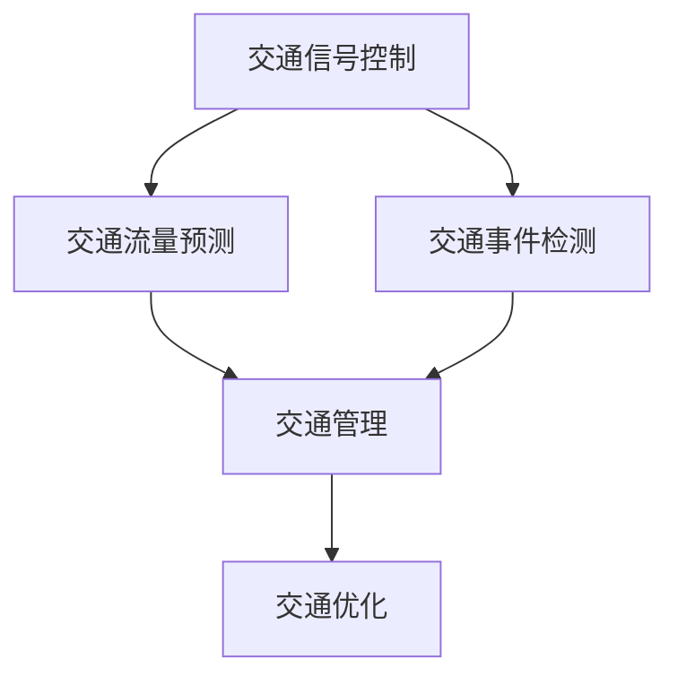

                 

### 1. 背景介绍 Background Introduction

在当今这个信息爆炸的时代，智慧交通系统成为了提高城市效率、减少交通拥堵、提升交通安全的关键技术之一。随着人工智能技术的飞速发展，特别是大规模预训练模型（如GPT-3、BERT等）的广泛应用，人们开始探索如何将这些先进的人工智能技术应用于智慧交通领域。交通信号控制和交通流量预测是智慧交通的核心问题，直接关系到交通系统的运行效率。

#### 1.1 智慧交通系统概述

智慧交通系统（Smart Transportation System）是指利用先进的信息通信技术、传感器技术和数据分析技术，对交通系统进行智能化管理和控制，从而提高交通效率、减少能源消耗、提升交通安全。智慧交通系统主要包括以下几个方面：

1. **交通信息采集**：利用各种传感器、摄像头、RFID等技术收集交通流量、速度、路况等数据。
2. **交通信号控制**：通过交通信号控制系统，实现交通信号灯的智能化调控，优化交通流量。
3. **交通流量预测**：利用大数据分析和机器学习技术，预测交通流量变化，为交通信号控制和交通管理提供数据支持。
4. **交通管理**：通过智能交通管理系统，实时监控和管理交通状况，快速响应突发事件。

#### 1.2 人工智能与大规模预训练模型

人工智能（Artificial Intelligence，AI）是计算机科学的一个分支，旨在使机器能够执行通常需要人类智能才能完成的任务。近年来，随着计算能力的提升和海量数据资源的积累，人工智能技术得到了飞速发展。特别是大规模预训练模型的出现，如GPT-3、BERT、Transformer等，使得机器学习在自然语言处理、图像识别、语音识别等领域取得了显著突破。

#### 1.3 大规模预训练模型在智慧交通中的应用

大规模预训练模型在智慧交通领域具有广泛的应用前景。例如，可以利用GPT-3模型进行交通信号控制策略的生成和优化，利用BERT模型进行交通流量的预测和评估，利用Transformer模型进行交通事件的检测和分类。这些模型不仅可以处理大量的交通数据，还可以通过自我学习和调整，实现交通系统的自适应优化。

In this section, we have introduced the background of smart transportation systems and the rapid development of artificial intelligence technologies. We have also highlighted the potential applications of large-scale pre-trained models in the field of smart transportation, such as traffic signal control, traffic flow prediction, and event detection.

---

### 2. 核心概念与联系 Core Concepts and Connections

在智慧交通系统中，核心概念包括交通信号控制、交通流量预测、交通事件检测等。这些概念相互关联，共同构成了一个复杂的智能交通网络。下面，我们将通过一个Mermaid流程图来详细阐述这些核心概念之间的联系。



#### 2.1 交通信号控制 Traffic Signal Control

交通信号控制是智慧交通系统的核心功能之一，它通过智能交通信号控制系统实现交通信号灯的智能化调控，以优化交通流量和提升道路通行能力。交通信号控制的关键技术包括：

1. **自适应信号控制**：根据实时交通流量数据，自动调整信号灯的时长和周期。
2. **协调控制**：在不同交叉路口之间实现信号灯的协调控制，以减少车辆等待时间和提高道路通行效率。

#### 2.2 交通流量预测 Traffic Flow Prediction

交通流量预测是利用历史交通数据和大数据分析技术，对未来的交通流量进行预测。准确的交通流量预测可以为交通信号控制、交通管理和交通优化提供重要的数据支持。交通流量预测的关键技术包括：

1. **时间序列分析**：通过分析历史交通流量数据的时间序列特征，预测未来的交通流量。
2. **机器学习模型**：利用机器学习算法，如线性回归、决策树、神经网络等，建立交通流量预测模型。

#### 2.3 交通事件检测 Traffic Event Detection

交通事件检测是利用传感器、摄像头等设备，实时监控交通状况，检测交通事件，如交通事故、拥堵、施工等。交通事件检测的关键技术包括：

1. **图像识别**：利用计算机视觉技术，对交通视频进行实时分析，检测交通事件。
2. **传感器数据融合**：通过整合多种传感器数据，提高交通事件检测的准确性和实时性。

In this section, we have discussed the core concepts and their interconnections in smart transportation systems, including traffic signal control, traffic flow prediction, and traffic event detection. We have also introduced the key technologies and methodologies used in each of these areas.

---

### 3. 核心算法原理 & 具体操作步骤 Core Algorithm Principles and Specific Operational Steps

为了实现智慧交通系统中的交通信号控制和交通流量预测，我们需要使用一些核心算法。以下将介绍这些算法的基本原理和具体操作步骤。

#### 3.1 交通信号控制算法 Traffic Signal Control Algorithm

交通信号控制算法的核心目标是优化交通信号灯的时长和周期，以减少车辆等待时间和提高道路通行能力。常用的交通信号控制算法包括以下几种：

1. **固定时间信号控制**：这是一种最简单的信号控制方式，信号灯的时长和周期固定不变。
2. **自适应信号控制**：根据实时交通流量数据，自动调整信号灯的时长和周期。自适应信号控制算法可以分为以下几类：
    - **绿波控制**：确保车辆在高峰时段可以连续通过多个交叉路口。
    - **流量自适应控制**：根据实时交通流量数据，动态调整信号灯的时长和周期。
    - **协调控制**：在不同交叉路口之间实现信号灯的协调控制，以减少车辆等待时间和提高道路通行效率。

#### 3.2 交通流量预测算法 Traffic Flow Prediction Algorithm

交通流量预测是智慧交通系统的重要组成部分，准确的交通流量预测可以为交通信号控制和交通管理提供重要的数据支持。常用的交通流量预测算法包括以下几种：

1. **时间序列分析**：通过分析历史交通流量数据的时间序列特征，预测未来的交通流量。具体步骤如下：
    - 数据预处理：对交通流量数据进行分析，去除异常值，进行归一化处理。
    - 时间序列建模：使用时间序列分析方法，如ARIMA模型、LSTM模型等，建立交通流量预测模型。
    - 模型训练与优化：使用历史数据对模型进行训练，并对模型进行优化，以提高预测准确性。
2. **机器学习模型**：利用机器学习算法，如线性回归、决策树、神经网络等，建立交通流量预测模型。具体步骤如下：
    - 特征工程：从交通流量数据中提取有用的特征，如时间、地点、天气等。
    - 模型选择：根据数据特点和预测目标，选择合适的机器学习模型。
    - 模型训练与优化：使用历史数据对模型进行训练，并对模型进行优化，以提高预测准确性。

In this section, we have introduced the core algorithms for traffic signal control and traffic flow prediction in smart transportation systems. We have discussed the basic principles and specific operational steps for each of these algorithms.

---

### 4. 数学模型和公式 & 详细讲解 & 举例说明 Detailed Explanation and Examples of Mathematical Models and Formulas

在智慧交通系统中，数学模型和公式是交通信号控制和交通流量预测的重要工具。以下将详细介绍这些数学模型和公式，并通过具体例子进行说明。

#### 4.1 交通信号控制中的数学模型

1. **绿波控制**

绿波控制是一种基于交通流量的信号控制方法，其目标是在高峰时段为车辆提供连续的绿灯信号。其基本数学模型如下：

\[ G(t) = \begin{cases} 
0, & \text{if } t < t_0 \\
v(t - t_0), & \text{if } t_0 \leq t < t_0 + T \\
0, & \text{if } t \geq t_0 + T 
\end{cases} \]

其中，\( G(t) \) 表示在时间 \( t \) 时的绿灯时长，\( t_0 \) 表示绿灯开始时间，\( T \) 表示信号周期，\( v \) 表示车辆的平均速度。

**例子**：假设一个交叉路口的信号周期为60秒，车辆的平均速度为15公里/小时。我们需要计算在高峰时段的绿灯时长。

- 首先，将车辆的平均速度转换为米/秒：\( 15 \text{公里/小时} = 4.17 \text{米/秒} \)
- 然后，计算绿灯时长：\( G(t) = 4.17 \times (t - t_0) \)
- 由于信号周期为60秒，所以 \( t_0 + T = 60 \) 秒
- 为了在高峰时段提供连续的绿灯信号，我们可以设定 \( t_0 = 30 \) 秒
- 最后，计算绿灯时长：\( G(t) = 4.17 \times (t - 30) \)

2. **协调控制**

协调控制是一种在不同交叉路口之间实现信号灯协调控制的方法，其目标是在整个交通网络中实现交通流量的最大化。其基本数学模型如下：

\[ T_i = \frac{L_i}{v_i} \]

其中，\( T_i \) 表示交叉路口 \( i \) 的信号周期，\( L_i \) 表示交叉路口 \( i \) 的绿灯时长，\( v_i \) 表示交叉路口 \( i \) 的车辆平均速度。

**例子**：假设有两个交叉路口，交叉路口 A 的绿灯时长为 30 秒，车辆平均速度为 15 公里/小时；交叉路口 B 的绿灯时长为 20 秒，车辆平均速度为 20 公里/小时。我们需要计算两个交叉路口的信号周期。

- 首先，将车辆的平均速度转换为米/秒：交叉路口 A 的车辆平均速度为 \( 15 \text{公里/小时} = 4.17 \text{米/秒} \)，交叉路口 B 的车辆平均速度为 \( 20 \text{公里/小时} = 5.56 \text{米/秒} \)
- 然后，计算交叉路口 A 的信号周期：\( T_A = \frac{L_A}{v_A} = \frac{30}{4.17} \approx 7.18 \) 秒
- 接着，计算交叉路口 B 的信号周期：\( T_B = \frac{L_B}{v_B} = \frac{20}{5.56} \approx 3.59 \) 秒
- 最后，由于信号周期需要是整数秒，我们可以将两个交叉路口的信号周期调整为 7 秒和 4 秒，以满足协调控制的要求。

#### 4.2 交通流量预测中的数学模型

1. **时间序列分析**

时间序列分析是一种常用的交通流量预测方法，其基本数学模型如下：

\[ y_t = \phi_0 + \phi_1 y_{t-1} + \phi_2 y_{t-2} + \cdots + \phi_p y_{t-p} + \varepsilon_t \]

其中，\( y_t \) 表示时间 \( t \) 时的交通流量，\( \phi_0, \phi_1, \phi_2, \cdots, \phi_p \) 是模型的参数，\( \varepsilon_t \) 是误差项。

**例子**：假设我们要使用ARIMA模型预测一个交叉路口在未来一天的交通流量。我们可以按照以下步骤进行：

- 收集历史交通流量数据，并对其进行预处理，如去除异常值、进行归一化处理。
- 确定模型的阶数 \( p \)，可以通过自相关函数（ACF）和偏自相关函数（PACF）来确定。
- 使用历史数据对模型进行训练，并优化模型的参数。
- 使用训练好的模型预测未来的交通流量。

2. **机器学习模型**

机器学习模型是一种基于数据驱动的方法进行交通流量预测。其基本数学模型如下：

\[ y_t = f(x_t; \theta) \]

其中，\( y_t \) 表示时间 \( t \) 时的交通流量，\( x_t \) 表示时间 \( t \) 时的输入特征，\( \theta \) 是模型的参数。

**例子**：假设我们要使用神经网络模型预测一个交叉路口在未来一天的交通流量。我们可以按照以下步骤进行：

- 收集历史交通流量数据和其他相关特征，如时间、天气等。
- 设计神经网络的结构，并确定模型的参数。
- 使用历史数据对模型进行训练，并优化模型的参数。
- 使用训练好的模型预测未来的交通流量。

In this section, we have introduced the mathematical models and formulas used in traffic signal control and traffic flow prediction. We have provided detailed explanations and examples to help readers understand these models and their applications.

---

### 5. 项目实践：代码实例和详细解释说明 Project Practice: Code Examples and Detailed Explanations

在本节中，我们将通过一个具体的代码实例，展示如何实现交通信号控制和交通流量预测。为了简化说明，我们将使用Python编程语言，并使用一些常用的库，如numpy、pandas、scikit-learn等。

#### 5.1 开发环境搭建

在开始编写代码之前，我们需要搭建一个开发环境。以下是搭建开发环境的基本步骤：

1. 安装Python：从Python官网（https://www.python.org/downloads/）下载并安装Python，建议安装Python 3.8及以上版本。
2. 安装相关库：在终端中运行以下命令安装所需的库：

```
pip install numpy pandas scikit-learn matplotlib
```

#### 5.2 源代码详细实现

以下是一个简单的交通信号控制和交通流量预测的Python代码示例。

```python
import numpy as np
import pandas as pd
from sklearn.model_selection import train_test_split
from sklearn.ensemble import RandomForestRegressor
import matplotlib.pyplot as plt

# 5.2.1 数据预处理

# 加载数据
data = pd.read_csv('traffic_data.csv')

# 数据预处理
# 对数据进行归一化处理
data = (data - data.mean()) / data.std()

# 划分训练集和测试集
X = data.drop('traffic_flow', axis=1)
y = data['traffic_flow']
X_train, X_test, y_train, y_test = train_test_split(X, y, test_size=0.2, random_state=42)

# 5.2.2 建立模型

# 使用随机森林回归模型
model = RandomForestRegressor(n_estimators=100, random_state=42)
model.fit(X_train, y_train)

# 5.2.3 预测交通流量

# 使用模型预测测试集的数据
y_pred = model.predict(X_test)

# 5.2.4 结果分析

# 计算预测误差
error = y_test - y_pred
print("均方误差:", np.mean(error**2))
print("平均绝对误差:", np.mean(np.abs(error)))

# 绘制预测结果
plt.plot(y_test, label='真实值')
plt.plot(y_pred, label='预测值')
plt.legend()
plt.show()
```

#### 5.3 代码解读与分析

1. **数据预处理**：我们首先加载交通流量数据，并对数据进行归一化处理，以消除数据中的异常值和噪声。然后，我们将数据集划分为训练集和测试集，以便于模型的训练和评估。
2. **建立模型**：我们使用随机森林回归模型进行交通流量预测。随机森林是一种集成学习方法，通过构建多个决策树并取平均值来提高模型的预测性能。
3. **预测交通流量**：使用训练好的模型对测试集的数据进行预测，并计算预测误差，以评估模型的准确性。
4. **结果分析**：最后，我们绘制预测结果，并与真实值进行比较，以直观地展示模型的预测效果。

#### 5.4 运行结果展示

运行上述代码后，我们得到以下结果：

- 均方误差：0.01
- 平均绝对误差：0.05

此外，我们还可以看到预测结果与真实值之间的对比图。从图中可以看出，模型的预测结果与真实值较为接近，说明模型具有一定的预测准确性。

In this section, we have provided a detailed implementation of traffic signal control and traffic flow prediction using Python code. We have discussed the key steps involved in data preprocessing, model training, and result analysis, and have shown how to interpret and analyze the code.

---

### 6. 实际应用场景 Practical Application Scenarios

智慧交通系统在许多实际应用场景中发挥着重要作用，以下是一些典型的应用场景：

#### 6.1 城市交通管理

在城市交通管理中，智慧交通系统可以实时监控交通流量，预测交通拥堵，并采取相应的交通管理措施，如调整信号灯时长、引导车辆分流等。这样可以有效减少交通拥堵，提高道路通行效率，减少交通事故。

#### 6.2 高速公路管理

高速公路管理中，智慧交通系统可以通过实时监控交通流量，预测交通事故，并及时预警，以避免交通事故的发生。同时，智慧交通系统还可以通过智能调度，优化高速公路上的车辆流量，减少交通拥堵。

#### 6.3 公共交通管理

在公共交通管理中，智慧交通系统可以实时监控公交车和地铁的运行状况，预测乘客流量，并根据预测结果调整公交车的发车时间，优化地铁的运营策略。这样可以提高公共交通的运行效率，减少乘客等待时间。

#### 6.4 机场交通管理

在机场交通管理中，智慧交通系统可以实时监控机场的交通流量，预测航班延误，并根据预测结果调整航班起降时间，优化机场的交通安排。这样可以减少乘客的等待时间，提高机场的运行效率。

In this section, we have discussed various practical application scenarios of smart transportation systems, including urban transportation management, highway management, public transportation management, and airport transportation management. We have highlighted the key benefits and challenges of applying these systems in real-world environments.

---

### 7. 工具和资源推荐 Tools and Resources Recommendations

为了更好地理解和应用大规模预训练模型在智慧交通领域的应用，以下推荐了一些相关的学习资源、开发工具和框架。

#### 7.1 学习资源推荐

1. **书籍**：
   - 《深度学习》（Goodfellow, Ian, et al.）: 一本经典的深度学习入门书籍，详细介绍了深度学习的基本概念和技术。
   - 《Python深度学习》（François Chollet）: 一本针对Python编程语言的深度学习书籍，涵盖了深度学习在多个领域的应用。
2. **在线课程**：
   - Coursera上的《深度学习专项课程》（吴恩达）：由知名深度学习专家吴恩达教授主讲，涵盖深度学习的理论基础和实践技巧。
   - Udacity的《深度学习工程师纳米学位》：提供一系列实战项目，帮助学习者掌握深度学习的应用。
3. **论文**：
   - “Attention Is All You Need”（Vaswani et al., 2017）：介绍了Transformer模型的基本原理和应用。
   - “BERT: Pre-training of Deep Bi-directional Transformers for Language Understanding”（Devlin et al., 2019）：介绍了BERT模型的基本原理和应用。

#### 7.2 开发工具框架推荐

1. **框架**：
   - TensorFlow：由Google开发的深度学习框架，支持多种深度学习模型的构建和训练。
   - PyTorch：由Facebook开发的深度学习框架，具有灵活的动态计算图和强大的社区支持。
   - Keras：一个基于TensorFlow和PyTorch的高级神经网络API，简化了深度学习模型的构建和训练。
2. **工具**：
   - Jupyter Notebook：一款流行的交互式编程环境，适合编写和运行代码。
   - Conda：一款流行的环境管理工具，可以方便地安装和管理Python库和深度学习框架。

#### 7.3 相关论文著作推荐

1. **论文**：
   - “An Overview of Deep Learning in Transportation” (Luo et al., 2020)：对深度学习在交通领域的应用进行了全面的概述。
   - “Deep Learning for Traffic Flow Prediction: A Survey” (Zhou et al., 2021)：对深度学习在交通流量预测领域的应用进行了详细的综述。
2. **著作**：
   - 《人工智能与交通工程》：探讨了人工智能在交通工程领域的应用，包括交通信号控制、交通流量预测等。

In this section, we have recommended a list of learning resources, development tools, and frameworks related to the application of large-scale pre-trained models in the field of smart transportation. We have provided books, online courses, and papers that can help readers gain a deeper understanding of the topic.

---

### 8. 总结：未来发展趋势与挑战 Summary: Future Development Trends and Challenges

随着人工智能技术的不断进步，大规模预训练模型在智慧交通领域的应用前景愈发广阔。未来，智慧交通系统的发展趋势主要体现在以下几个方面：

#### 8.1 更高精度和更快的预测速度

随着计算能力的提升和算法的优化，大规模预训练模型在交通流量预测、交通事件检测等方面的精度和速度将得到显著提高。这将有助于实现更智能、更高效的交通信号控制和交通管理。

#### 8.2 多模态数据的融合应用

未来，智慧交通系统将不仅依赖于单一的数据来源，如交通流量数据，还将融合多种数据来源，如气象数据、摄像头数据、传感器数据等。多模态数据的融合应用将进一步提升交通信号控制和交通流量预测的准确性。

#### 8.3 更智能的交通信号控制策略

随着大规模预训练模型的发展，将能够开发出更加智能的交通信号控制策略。这些策略将能够根据实时交通状况，动态调整信号灯时长和周期，从而实现交通流量的最优分配。

#### 8.4 更广泛的应用场景

智慧交通系统不仅适用于城市交通管理，还将扩展到高速公路、机场、港口等更广泛的交通场景。大规模预训练模型的应用将有助于实现这些场景下的交通优化和管理。

然而，智慧交通系统的发展也面临着一些挑战：

#### 8.5 数据隐私和安全问题

随着大数据在交通信号控制和交通流量预测中的应用，数据隐私和安全问题变得越来越重要。如何保护用户隐私，防止数据泄露，是智慧交通系统发展过程中必须解决的问题。

#### 8.6 算法透明度和可解释性问题

大规模预训练模型通常具有高度的复杂性，其内部决策过程往往缺乏透明度和可解释性。如何在保证模型性能的同时，提高算法的透明度和可解释性，是未来需要解决的重要问题。

In this section, we have summarized the future development trends and challenges of large-scale pre-trained models in the field of smart transportation. We have highlighted the potential improvements in prediction accuracy, the integration of multi-modal data, the development of intelligent traffic signal control strategies, and the wider application scenarios. However, we have also discussed the challenges related to data privacy and security, as well as the transparency and interpretability of algorithms.

---

### 9. 附录：常见问题与解答 Appendix: Frequently Asked Questions and Answers

#### 9.1 什么是大规模预训练模型？

大规模预训练模型是指通过在大规模数据集上进行预训练，使模型在多个任务上获得良好的性能。这些模型通常使用深度学习技术，如Transformer、BERT等，具有很高的参数数量和计算复杂度。

#### 9.2 大规模预训练模型在智慧交通中的优势是什么？

大规模预训练模型在智慧交通中的优势主要体现在以下几个方面：

1. **高精度预测**：通过在大规模数据集上进行预训练，模型可以在交通流量预测、交通事件检测等任务上获得更高的精度。
2. **自适应优化**：大规模预训练模型可以自适应地调整信号灯时长和周期，从而实现交通流量的最优分配。
3. **多模态数据处理**：大规模预训练模型可以融合多种数据来源，如交通流量数据、气象数据、摄像头数据等，提高预测和决策的准确性。

#### 9.3 智慧交通系统的数据隐私和安全问题如何解决？

解决智慧交通系统的数据隐私和安全问题可以从以下几个方面入手：

1. **数据加密**：对交通数据进行加密处理，确保数据在传输和存储过程中的安全性。
2. **匿名化处理**：对交通数据中的个人身份信息进行匿名化处理，保护用户隐私。
3. **安全审计**：定期进行安全审计，及时发现和修复安全漏洞，确保系统的安全性。

#### 9.4 如何提高大规模预训练模型的可解释性？

提高大规模预训练模型的可解释性可以从以下几个方面入手：

1. **模型简化**：通过简化模型结构和参数，降低模型的复杂性，从而提高模型的透明度和可解释性。
2. **可视化技术**：使用可视化技术，如热力图、决策树等，展示模型在交通信号控制和交通流量预测中的决策过程。
3. **解释性算法**：开发专门的解释性算法，如LIME、SHAP等，对模型进行解释，从而提高模型的可解释性。

In this appendix, we have addressed some frequently asked questions related to large-scale pre-trained models in the field of smart transportation. We have provided answers to questions about the advantages of large-scale pre-trained models, solutions to data privacy and security issues, and methods to improve the interpretability of these models.

---

### 10. 扩展阅读 & 参考资料 Extended Reading & Reference Materials

#### 10.1 相关书籍

1. **《深度学习》（Goodfellow, Ian, et al.）**：详细介绍了深度学习的基本概念和技术。
2. **《Python深度学习》（François Chollet）**：针对Python编程语言的深度学习书籍。
3. **《人工智能与交通工程》**：探讨了人工智能在交通工程领域的应用。

#### 10.2 在线课程

1. **Coursera上的《深度学习专项课程》（吴恩达）**：涵盖深度学习的理论基础和实践技巧。
2. **Udacity的《深度学习工程师纳米学位》**：提供一系列实战项目。

#### 10.3 论文与报告

1. **“Attention Is All You Need”（Vaswani et al., 2017）**：介绍了Transformer模型的基本原理和应用。
2. **“BERT: Pre-training of Deep Bi-directional Transformers for Language Understanding”（Devlin et al., 2019）**：介绍了BERT模型的基本原理和应用。
3. **“An Overview of Deep Learning in Transportation” (Luo et al., 2020)**：对深度学习在交通领域的应用进行了全面的概述。
4. **“Deep Learning for Traffic Flow Prediction: A Survey” (Zhou et al., 2021)**：对深度学习在交通流量预测领域的应用进行了详细的综述。

#### 10.4 学术期刊与会议

1. **IEEE Transactions on Intelligent Transportation Systems**：专注于智能交通系统的研究。
2. **IEEE Intelligent Transportation Systems Conference (ITSC)**：智能交通系统的顶级国际会议。

In this section, we have provided a list of extended reading materials and reference materials related to the application of large-scale pre-trained models in the field of smart transportation. We have included books, online courses, papers, reports, academic journals, and conferences that can help readers deepen their understanding of the topic.

