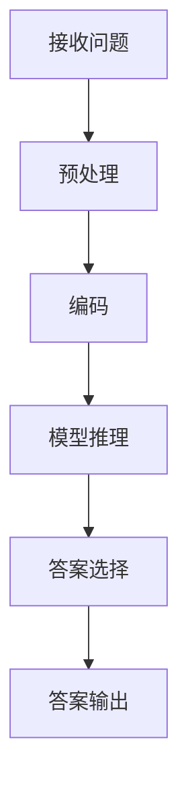
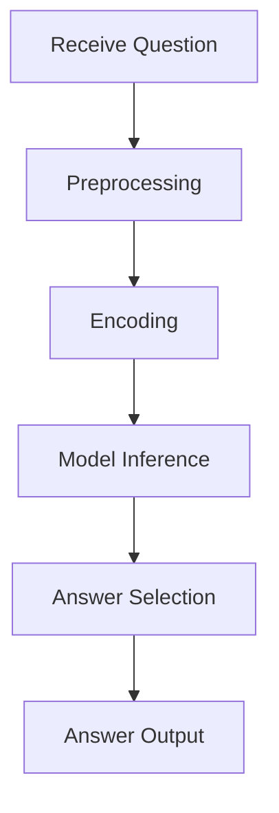

                 

### 文章标题

《大模型问答机器人的自然交互》

本文将深入探讨大模型问答机器人的自然交互技术，分析其背后的核心概念、算法原理以及数学模型，并通过实例和代码演示，详细介绍如何实现与这些大模型的自然交互。本文旨在为读者提供一个全面的技术指南，帮助理解和应用大模型问答机器人，实现高效的对话交互。

### Keywords:
- Large-scale language models
- Question-answering robots
- Natural interaction
- Core concepts
- Algorithm principles
- Mathematical models
- Code examples
- Practical applications

### Abstract:
This article delves into the natural interaction techniques of large-scale question-answering robots, analyzing the core concepts, algorithm principles, and mathematical models behind them. Through practical code examples and detailed explanations, it demonstrates how to achieve natural interaction with these large-scale models. The aim is to provide a comprehensive technical guide for readers to understand and apply question-answering robots, facilitating efficient dialogue interactions.

## 1. 背景介绍（Background Introduction）

随着人工智能技术的快速发展，大模型问答机器人已成为自然语言处理领域的重要研究方向。这些大模型具有强大的文本生成和理解能力，能够处理复杂的语言任务，如问答、对话生成和文本摘要等。自然交互技术则致力于提高机器人与用户的沟通效率，使其能够更贴近人类的交流方式。

大模型问答机器人的发展离不开深度学习和自然语言处理技术的进步。深度学习算法，如循环神经网络（RNN）和变换器（Transformer），使得模型能够捕捉到文本的复杂结构和语义信息。自然语言处理技术，包括词嵌入、词性标注和句法分析等，为模型提供了丰富的语言特征。

自然交互技术在聊天机器人、虚拟助手和智能客服等领域具有广泛的应用。通过自然交互，机器人能够更好地理解用户的需求，提供更准确和个性化的服务。此外，自然交互技术还能够提高用户体验，降低用户的学习成本。

本文将首先介绍大模型问答机器人的核心概念和架构，然后详细解析其算法原理和数学模型，最后通过实例和代码演示，展示如何实现自然交互。

### Background Introduction

The development of large-scale question-answering robots is a significant research direction in the field of natural language processing, thanks to the rapid advancement of artificial intelligence technology. These large-scale language models possess powerful text generation and understanding capabilities, enabling them to handle complex language tasks such as question-answering, dialogue generation, and text summarization. Natural interaction techniques are crucial in enhancing the communication efficiency between robots and users, making their interactions more human-like.

The progress of large-scale question-answering robots is closely related to the advancements in deep learning and natural language processing. Deep learning algorithms, such as Recurrent Neural Networks (RNN) and Transformers, enable models to capture the complex structures and semantic information in text. Natural language processing techniques, including word embeddings, part-of-speech tagging, and syntactic analysis, provide the models with rich linguistic features.

Natural interaction techniques have a wide range of applications in chatbots, virtual assistants, and intelligent customer service systems. Through natural interaction, robots can better understand user needs, providing more accurate and personalized services. Additionally, natural interaction techniques can improve user experience and reduce the learning cost for users.

This article will first introduce the core concepts and architecture of large-scale question-answering robots. Then, it will delve into the algorithm principles and mathematical models behind them. Finally, through practical code examples and detailed explanations, it will demonstrate how to achieve natural interaction with these large-scale models.

## 2. 核心概念与联系（Core Concepts and Connections）

### 2.1 大模型问答机器人的定义与工作原理

大模型问答机器人是一种利用大规模深度学习模型进行自然语言处理的智能系统。它通过接受用户的问题输入，利用预训练的大规模语言模型，如GPT-3、BERT等，生成相应的答案。大模型问答机器人通常包括以下几个核心组成部分：

1. **预训练模型（Pre-trained Model）**：预训练模型是通过在大量文本数据上预训练得到的，具有强大的文本理解和生成能力。例如，GPT-3是由OpenAI训练的，基于变换器（Transformer）架构的大规模语言模型，具有1750亿个参数。

2. **问答系统（Question-Answering System）**：问答系统负责处理用户的问题，将其转换为适合输入预训练模型的形式。这通常涉及将问题编码为一个序列，以便模型能够理解其语义。

3. **答案生成器（Answer Generator）**：答案生成器是核心组件，负责从预训练模型生成的文本中提取出符合用户问题的答案。这通常涉及到对生成文本进行筛选和提取。

大模型问答机器人的工作原理可以概括为以下几个步骤：

1. **接收问题（Receive Question）**：系统首先接收用户的问题输入。
2. **预处理（Preprocessing）**：对输入问题进行必要的预处理，如去除无关信息、标准化格式等。
3. **编码（Encoding）**：将预处理后的问题编码为一个序列，通常使用特定的编码器（Encoder）。
4. **模型推理（Model Inference）**：将编码后的序列输入到预训练模型中，模型会生成一个或多个可能的答案序列。
5. **答案选择（Answer Selection）**：系统会根据预设的策略或算法，从生成的答案序列中选择一个最合适的答案。
6. **答案输出（Output Answer）**：最后，将选定的答案输出给用户。

### 2.2 大模型问答机器人的架构

大模型问答机器人的架构通常包括以下几个关键部分：

1. **数据预处理模块（Data Preprocessing Module）**：负责对用户输入的问题进行预处理，包括分词、去停用词、标准化等。
2. **编码器（Encoder）**：负责将预处理后的问题编码为模型可处理的序列形式。
3. **预训练模型（Pre-trained Model）**：如GPT-3、BERT等大规模语言模型。
4. **解码器（Decoder）**：负责从预训练模型输出的答案序列中提取出最终的答案。
5. **后处理模块（Post-processing Module）**：负责对生成的答案进行后处理，如格式化、去除无关内容等。

以下是该架构的Mermaid流程图表示：

### 2.3 大模型问答机器人的核心概念

在大模型问答机器人的实现中，以下几个核心概念至关重要：

1. **预训练模型（Pre-trained Model）**：预训练模型是整个系统的核心，它负责理解用户的问题并生成答案。预训练模型的性能直接影响到问答机器人的效果。
2. **编码器（Encoder）**：编码器负责将用户输入的问题转换为预训练模型可处理的序列形式。一个有效的编码器需要能够捕捉问题的语义信息。
3. **解码器（Decoder）**：解码器负责从预训练模型输出的答案序列中提取出最终的答案。一个优秀的解码器能够确保生成的答案既准确又符合用户问题的要求。
4. **自然语言处理技术（Natural Language Processing Techniques）**：包括词嵌入（Word Embeddings）、词性标注（Part-of-Speech Tagging）、句法分析（Syntactic Parsing）等，这些技术为预训练模型提供了丰富的语言特征。
5. **优化策略（Optimization Strategies）**：包括答案选择策略、生成文本的筛选和提取等，这些策略决定了如何从预训练模型输出的答案中提取出最佳答案。

### 2.4 提示词工程的重要性

提示词工程（Prompt Engineering）在大模型问答机器人的实现中起着至关重要的作用。提示词是指输入给预训练模型的文本，它能够引导模型生成符合预期结果的答案。一个精心设计的提示词可以显著提高问答机器人的输出质量和相关性。相反，模糊或不完整的提示词可能会导致模型生成不准确、不相关或不完整的答案。

提示词工程的重要性体现在以下几个方面：

1. **提高输出质量**：通过设计明确的提示词，可以引导模型更好地理解用户的问题，从而生成更准确、更相关的答案。
2. **降低误解风险**：明确的提示词可以减少模型对问题的误解，从而降低生成错误答案的风险。
3. **提高效率**：良好的提示词能够帮助模型更快地找到最佳答案，提高问答系统的响应速度。
4. **提升用户体验**：高质量的答案能够提高用户的满意度，从而提升整个系统的用户体验。

### 2.5 提示词工程与传统编程的关系

提示词工程可以被视为一种新型的编程范式，其中我们使用自然语言而不是代码来指导模型的行为。这种编程范式具有以下几个特点：

1. **自然语言交互**：通过自然语言提示词与模型进行交互，用户不需要具备编程知识即可与系统进行有效的沟通。
2. **高灵活性**：自然语言提示词使得模型能够适应不同的任务需求，从而实现更灵活的编程。
3. **易于扩展**：通过增加或修改提示词，可以轻松扩展模型的功能，而不需要对模型的内部结构进行修改。

总之，大模型问答机器人的自然交互技术是一个多学科交叉的研究领域，涉及深度学习、自然语言处理、提示词工程等多个方面。通过理解其核心概念和工作原理，我们可以更好地设计和实现高效、准确的问答系统。

### Core Concepts and Connections

### 2.1 Definition and Working Principles of Large-scale Question-answering Robots

Large-scale question-answering robots are intelligent systems that utilize large-scale deep learning models for natural language processing. They receive user questions as input, utilize pre-trained large-scale language models such as GPT-3 and BERT to generate corresponding answers. A large-scale question-answering robot typically includes several core components:

1. **Pre-trained Model**: Pre-trained models are trained on large amounts of text data and possess strong text understanding and generation capabilities. For example, GPT-3 is a large-scale language model based on the Transformer architecture with 175 billion parameters, trained by OpenAI.

2. **Question-Answering System**: The question-answering system is responsible for processing user questions and converting them into a form suitable for input to the pre-trained model. This usually involves encoding the question into a sequence that the model can understand.

3. **Answer Generator**: The answer generator is the core component, responsible for extracting an appropriate answer from the text generated by the pre-trained model. This usually involves filtering and extracting from the generated text sequences.

The working principle of a large-scale question-answering robot can be summarized into the following steps:

1. **Receive Question**: The system first receives the user's question input.

2. **Preprocessing**: The input question undergoes necessary preprocessing, such as removing irrelevant information and standardizing formats.

3. **Encoding**: The preprocessed question is encoded into a sequence suitable for the pre-trained model. This is usually done using a specific encoder.

4. **Model Inference**: The encoded sequence is input into the pre-trained model, which generates one or more possible answer sequences.

5. **Answer Selection**: The system selects the most appropriate answer from the generated answer sequences using a pre-defined strategy or algorithm.

6. **Output Answer**: The selected answer is output to the user.

### 2.2 Architecture of Large-scale Question-answering Robots

The architecture of a large-scale question-answering robot typically includes the following key components:

1. **Data Preprocessing Module**: This module is responsible for preprocessing the user's input question, including tokenization, removal of stop words, and standardization.

2. **Encoder**: The encoder is responsible for encoding the preprocessed question into a sequence format that is suitable for input to the pre-trained model.

3. **Pre-trained Model**: This is the core component, which is a large-scale language model such as GPT-3 or BERT.

4. **Decoder**: The decoder is responsible for extracting the final answer from the answer sequence generated by the pre-trained model.

5. **Post-processing Module**: This module is responsible for post-processing the generated answers, such as formatting and removing irrelevant content.

Here is a Mermaid flowchart representation of this architecture:

### 2.3 Core Concepts of Large-scale Question-answering Robots

Several core concepts are vital in the implementation of large-scale question-answering robots:

1. **Pre-trained Model**: The pre-trained model is the core component of the system and is responsible for understanding user questions and generating answers. The performance of the pre-trained model directly impacts the effectiveness of the question-answering robot.

2. **Encoder**: The encoder is responsible for converting the user's input question into a sequence format that the pre-trained model can process. An effective encoder needs to capture the semantic information of the question.

3. **Decoder**: The decoder is responsible for extracting the final answer from the answer sequence generated by the pre-trained model. An excellent decoder ensures that the generated answer is both accurate and meets the requirements of the user's question.

4. **Natural Language Processing Techniques**: These include word embeddings, part-of-speech tagging, and syntactic parsing, which provide the pre-trained model with rich linguistic features.

5. **Optimization Strategies**: These include answer selection strategies, filtering, and extraction of generated text, which determine how to extract the best answer from the sequence of answers generated by the pre-trained model.

### 2.4 The Importance of Prompt Engineering

Prompt engineering is crucial in the implementation of large-scale question-answering robots. Prompt engineering refers to the process of designing and optimizing the text prompts that are input to the pre-trained model to guide it towards generating desired outcomes. A well-crafted prompt can significantly improve the quality and relevance of the robot's output. Conversely, vague or incomplete prompts can lead to inaccurate, irrelevant, or incomplete answers.

The importance of prompt engineering can be highlighted in the following aspects:

1. **Improving Output Quality**: Through designing clear prompts, the robot can better understand the user's question, leading to more accurate and relevant answers.

2. **Reducing Misunderstandings**: Clear prompts can reduce the risk of the robot misunderstanding the question, thereby reducing the likelihood of generating incorrect answers.

3. **Improving Efficiency**: Good prompts can help the robot quickly find the best answer, thereby improving the response speed of the question-answering system.

4. **Enhancing User Experience**: High-quality answers can increase user satisfaction, thereby improving the overall user experience of the system.

### 2.5 The Relationship between Prompt Engineering and Traditional Programming

Prompt engineering can be considered a new paradigm of programming where we use natural language instead of code to direct the behavior of the model. This new programming paradigm has several characteristics:

1. **Natural Language Interaction**: Through natural language prompts, users can interact with the model without needing programming knowledge.

2. **High Flexibility**: Natural language prompts allow the model to adapt to different task requirements, thereby enabling more flexible programming.

3. **Easy to Extend**: By adding or modifying prompts, it is easy to extend the functionality of the model without needing to modify its internal structure.

In summary, the natural interaction technique of large-scale question-answering robots is a multidisciplinary research field involving deep learning, natural language processing, prompt engineering, and more. By understanding its core concepts and working principles, we can better design and implement efficient and accurate question-answering systems.

## 3. 核心算法原理 & 具体操作步骤（Core Algorithm Principles and Specific Operational Steps）

### 3.1 大模型问答机器人的核心算法

大模型问答机器人的核心算法主要依赖于预训练的大型语言模型，如GPT-3、BERT等。这些模型通过在大量文本数据上进行预训练，已经具备了强大的文本理解和生成能力。在大模型问答机器人的实现中，核心算法主要涉及以下几个步骤：

1. **文本预处理**：将用户输入的问题文本进行预处理，包括分词、去停用词、词性标注等操作。这些预处理步骤有助于提高模型对文本的理解能力。
   
2. **编码**：将预处理后的文本输入到编码器中，编码器将文本转换为适合模型处理的序列形式。例如，BERT模型使用WordPiece算法对文本进行分词，并将每个词映射为一个唯一的ID。

3. **模型推理**：将编码后的序列输入到预训练模型中，模型会根据序列的上下文生成一系列可能的文本输出。

4. **答案选择**：从模型生成的文本输出中选择最合适的答案。这通常涉及到对生成文本进行评分和筛选，以找出最符合用户问题的答案。

5. **答案生成**：将选定的答案进行后处理，如去除无关内容、格式化等，然后输出给用户。

### 3.2 大模型问答机器人的操作步骤

下面我们通过一个具体的例子，详细讲解大模型问答机器人的操作步骤。

#### 步骤 1：文本预处理

首先，我们需要对用户输入的问题进行预处理。预处理步骤包括：

- 分词：将文本划分为单个词语。例如，将“为什么猫会打呼噜？”划分为“为什么”、“猫”、“会”、“打呼噜？”。
- 去停用词：去除对文本理解贡献较小的常见词语，如“的”、“和”、“是”等。
- 词性标注：为每个词语标注其词性，如名词、动词、形容词等。

预处理后的文本将作为模型的输入。例如，预处理后的“为什么猫会打呼噜？”可能变为“为什么 猫 会 打 呼噜？”。

#### 步骤 2：编码

接下来，我们将预处理后的文本输入到编码器中。以BERT模型为例，编码器会将文本转换为一系列的ID序列。例如，BERT词汇表中，“为什么”可能映射为ID 3，“猫”映射为ID 10004，“会”映射为ID 6，等等。

#### 步骤 3：模型推理

将编码后的ID序列输入到预训练模型中，模型会根据序列的上下文生成一系列可能的文本输出。这些输出通常是模型对于问题的潜在回答。例如，模型可能生成以下文本：

- "猫打呼噜是因为它们的呼吸道狭窄，导致呼吸时的气流加快，从而产生呼噜声。"
- "动物专家认为，猫打呼噜是它们表达舒适和放松的方式。"

#### 步骤 4：答案选择

从模型生成的文本输出中选择最合适的答案。这通常涉及到对生成文本进行评分和筛选，以找出最符合用户问题的答案。一种常见的方法是使用模型内部的概率评分，选择概率最高的输出作为答案。例如，如果模型为第一个文本输出的概率评分是0.8，而第二个文本输出的概率评分是0.2，那么我们选择第一个文本输出作为答案。

#### 步骤 5：答案生成

最后，将选定的答案进行后处理，如去除无关内容、格式化等，然后输出给用户。例如，我们可以将上述选定的答案格式化为：

"猫打呼噜是因为它们的呼吸道狭窄，导致呼吸时的气流加快，从而产生呼噜声。"

这样，用户就可以得到一个准确且相关的答案。

### 3.3 大模型问答机器人的关键算法细节

在大模型问答机器人的实现中，以下几个关键算法细节至关重要：

1. **预训练模型的选择**：选择合适的预训练模型是确保问答机器人性能的基础。常用的预训练模型包括GPT-3、BERT、RoBERTa等。每种模型都有其独特的优势和适用场景。

2. **编码器和解码器的选择**：编码器和解码器的选择直接影响模型对文本的理解和生成能力。常用的编码器和解码器包括BERT、Transformer等。

3. **文本预处理方法**：有效的文本预处理方法有助于提高模型对文本的理解能力。常用的预处理方法包括分词、去停用词、词性标注等。

4. **答案选择策略**：合理的答案选择策略可以确保模型生成的答案既准确又符合用户问题的要求。常用的策略包括基于概率评分、基于语义相似度等。

5. **后处理方法**：后处理方法用于对生成的答案进行优化，使其更加符合用户的需求。常用的后处理方法包括去除无关内容、格式化等。

通过以上步骤和关键算法细节，我们可以设计和实现一个高效、准确的大模型问答机器人，实现与用户的自然交互。

### Core Algorithm Principles and Specific Operational Steps

### 3.1 Core Algorithms of Large-scale Question-answering Robots

The core algorithms of large-scale question-answering robots primarily rely on pre-trained large-scale language models such as GPT-3, BERT, and others. These models, after pre-training on large amounts of text data, have developed powerful text understanding and generation capabilities. In the implementation of large-scale question-answering robots, the core algorithms involve the following steps:

1. **Text Preprocessing**: Preprocess the user's input question text, including operations such as tokenization, removal of stop words, and part-of-speech tagging. These preprocessing steps help improve the model's understanding of the text.

2. **Encoding**: Input the preprocessed text into the encoder, which converts the text into a sequence format suitable for the model's processing. For example, the BERT model uses the WordPiece algorithm for tokenization and maps each word to a unique ID.

3. **Model Inference**: Input the encoded sequence into the pre-trained model, which generates a series of possible text outputs based on the sequence's context.

4. **Answer Selection**: Select the most appropriate answer from the generated text outputs. This usually involves scoring and filtering the generated text to find the answer that best fits the user's question.

5. **Answer Generation**: Post-process the selected answer to remove irrelevant content and format it before outputting it to the user.

### 3.2 Operational Steps of Large-scale Question-answering Robots

Let's take a specific example to explain the operational steps of a large-scale question-answering robot in detail.

#### Step 1: Text Preprocessing

Firstly, we need to preprocess the user's input question. The preprocessing steps include:

- Tokenization: Divide the text into individual words. For example, "Why do cats snore?" would be divided into "Why", "cat", "do", "snore?".
- Removal of Stop Words: Remove common words that contribute little to text understanding, such as "the", "and", "is".
- Part-of-Speech Tagging: Tag each word with its part of speech, such as nouns, verbs, and adjectives.

The preprocessed text will serve as the input for the model. For example, the preprocessed "Why do cats snore?" might become "Why cat do snore?".

#### Step 2: Encoding

Next, we input the preprocessed text into the encoder. Taking the BERT model as an example, the encoder converts the text into a sequence of IDs. For instance, "Why" might map to ID 3, "cat" to ID 10004, "do" to ID 6, and so on.

#### Step 3: Model Inference

We then input the encoded sequence into the pre-trained model, which generates a series of possible text outputs based on the sequence's context. These outputs are potential answers to the question. For example, the model might generate the following text:

- "Cats snore because their airways are narrow, causing the airflow to accelerate when they breathe, thus producing snoring sounds."
- "Experts believe that cats snore as a way to express comfort and relaxation."

#### Step 4: Answer Selection

We select the most appropriate answer from the generated text outputs. This usually involves scoring and filtering the generated text to find the answer that best fits the user's question. A common approach is to use the model's internal probability scores to select the output with the highest score. For instance, if the model scores the first text output at 0.8 and the second at 0.2, we would choose the first text output as the answer.

#### Step 5: Answer Generation

Finally, we post-process the selected answer to remove irrelevant content and format it before outputting it to the user. For example, we might format the selected answer as:

"Cats snore because their airways are narrow, causing the airflow to accelerate when they breathe, thus producing snoring sounds."

This way, the user receives an accurate and relevant answer.

### 3.3 Key Algorithm Details of Large-scale Question-answering Robots

Several key algorithm details are crucial in the implementation of large-scale question-answering robots:

1. **Selection of Pre-trained Models**: Choosing the right pre-trained model is fundamental to ensuring the performance of the question-answering robot. Common pre-trained models include GPT-3, BERT, RoBERTa, and each has its unique advantages and application scenarios.

2. **Selection of Encoders and Decoders**: The choice of encoders and decoders directly impacts the model's ability to understand and generate text. Common encoders and decoders include BERT and Transformer.

3. **Text Preprocessing Methods**: Effective text preprocessing methods improve the model's understanding of text. Common preprocessing methods include tokenization, removal of stop words, and part-of-speech tagging.

4. **Answer Selection Strategies**: Reasonable answer selection strategies ensure that the generated answers are both accurate and fit the user's question. Common strategies include probability scoring and semantic similarity.

5. **Post-processing Methods**: Post-processing methods optimize the generated answers to better meet user needs. Common post-processing methods include removal of irrelevant content and formatting.

Through these steps and key algorithm details, we can design and implement an efficient and accurate large-scale question-answering robot to achieve natural interaction with users.

## 4. 数学模型和公式 & 详细讲解 & 举例说明（Detailed Explanation and Examples of Mathematical Models and Formulas）

### 4.1 数学模型和公式的基本概念

在大模型问答机器人的实现中，数学模型和公式扮演着至关重要的角色。这些模型和公式帮助我们理解和设计预训练模型、编码器、解码器等关键组件。以下是几个常见的数学模型和公式：

1. **变换器（Transformer）模型**：变换器是一种基于自注意力机制的深度神经网络模型，广泛应用于自然语言处理任务。其主要公式包括：
   - **自注意力（Self-Attention）**：
     $$
     \text{Attention}(Q, K, V) = \text{softmax}\left(\frac{QK^T}{\sqrt{d_k}}\right)V
     $$
     其中，$Q$、$K$、$V$ 分别是查询（Query）、键（Key）、值（Value）向量，$d_k$ 是键向量的维度。

   - **位置编码（Positional Encoding）**：
     $$
     \text{PE}(pos, 2i) = \sin\left(\frac{pos}{10000^{2i/d}}\right)
     $$
     $$
     \text{PE}(pos, 2i+1) = \cos\left(\frac{pos}{10000^{2i/d}}\right)
     $$
     其中，$pos$ 是位置索引，$i$ 是维度索引，$d$ 是总维度。

2. **BERT 模型**：BERT（Bidirectional Encoder Representations from Transformers）是一种双向变换器模型，广泛应用于文本理解和生成任务。其主要公式包括：
   - **双向编码**：
     $$
     \text{BERT} = \text{Transformer}(\text{Encoder})
     $$
     其中，编码器（Encoder）是一个双向的变换器。

3. **词嵌入（Word Embeddings）**：词嵌入是将文本中的词语映射为高维向量表示。常用的词嵌入方法包括 Word2Vec、GloVe 等。其主要公式包括：
   - **Word2Vec**：
     $$
     \text{WordEmbedding}(w) = \text{sgn}(w\cdot v + b)
     $$
     其中，$w$ 是输入词向量，$v$ 是权重向量，$b$ 是偏置。

4. **损失函数（Loss Function）**：在训练模型时，我们需要使用损失函数来衡量模型预测与实际标签之间的差距。常用的损失函数包括交叉熵损失（Cross-Entropy Loss）等。其主要公式包括：
   - **交叉熵损失**：
     $$
     \text{Loss} = -\sum_{i} y_i \log(p_i)
     $$
     其中，$y_i$ 是实际标签，$p_i$ 是模型预测的概率。

### 4.2 数学模型的详细讲解

#### 变换器（Transformer）模型

变换器模型是自然语言处理领域的一种强大工具，其核心在于自注意力机制。自注意力机制允许模型在处理每个词时，将注意力分配给其他所有词，从而捕捉词与词之间的依赖关系。以下是变换器模型的详细讲解：

1. **自注意力（Self-Attention）**：
   自注意力是一种计算方式，用于将输入序列中的每个词映射到输出序列中的相应词。其公式为：
   $$
   \text{Attention}(Q, K, V) = \text{softmax}\left(\frac{QK^T}{\sqrt{d_k}}\right)V
   $$
   其中，$Q$ 是查询向量，$K$ 是键向量，$V$ 是值向量。$\sqrt{d_k}$ 是一个缩放因子，用于防止内积过大导致梯度消失。

2. **多头注意力（Multi-Head Attention）**：
   多头注意力是自注意力的扩展，允许模型在处理每个词时，从多个不同的注意力机制中学习。其公式为：
   $$
   \text{Multi-Head Attention}(Q, K, V) = \text{Concat}(\text{head}_1, \text{head}_2, ..., \text{head}_h)W^O
   $$
   $$
   \text{where} \; \text{head}_i = \text{Attention}(QW_i^Q, KW_i^K, VW_i^V)
   $$
   其中，$h$ 是头数，$W_i^Q$、$W_i^K$ 和 $W_i^V$ 分别是查询、键和值权重矩阵，$W^O$ 是输出权重矩阵。

3. **位置编码（Positional Encoding）**：
   为了使模型能够理解词的顺序，我们通常在输入序列中添加位置编码。位置编码是一个向量，其维度与输入序列的词向量相同。以下是位置编码的详细讲解：
   $$
   \text{PE}(pos, 2i) = \sin\left(\frac{pos}{10000^{2i/d}}\right)
   $$
   $$
   \text{PE}(pos, 2i+1) = \cos\left(\frac{pos}{10000^{2i/d}}\right)
   $$
   其中，$pos$ 是位置索引，$i$ 是维度索引，$d$ 是总维度。这种编码方式使得模型能够捕捉词的顺序信息。

#### BERT 模型

BERT 是一种基于变换器模型的双向编码器，其核心思想是在训练过程中同时考虑输入序列的前后关系。以下是 BERT 模型的详细讲解：

1. **双向编码**：
   BERT 的编码器是一个双向的变换器，其能够同时捕捉输入序列的前后关系。其公式为：
   $$
   \text{BERT} = \text{Transformer}(\text{Encoder})
   $$
   其中，编码器是一个包含多层变换器的双向网络。

2. **输入层**：
   BERT 的输入包括两个部分：一个是词嵌入（Word Embeddings），用于将词语映射为向量；另一个是位置编码（Positional Encoding），用于提供词的顺序信息。其公式为：
   $$
   \text{Input} = [\text{Token Type Embeddings}, \text{Positional Encoding}] + \text{Word Embeddings}
   $$
   其中，$\text{Token Type Embeddings}$ 用于区分不同的词性（如句首的[CLS]标记），$\text{Positional Encoding}$ 提供词的顺序信息。

3. **输出层**：
   BERT 的输出是一个固定长度的向量，用于表示整个输入序列的语义信息。其公式为：
   $$
   \text{Output} = \text{Encoder}(\text{Input})
   $$
   其中，编码器（Encoder）是一个包含多层变换器的双向网络。

#### 词嵌入（Word Embeddings）

词嵌入是将文本中的词语映射为高维向量表示的一种技术，其能够提高模型的语义理解能力。以下是词嵌入的详细讲解：

1. **Word2Vec**：
   Word2Vec 是一种基于神经网络的词嵌入方法，其通过优化损失函数来训练词向量。其公式为：
   $$
   \text{WordEmbedding}(w) = \text{sgn}(w\cdot v + b)
   $$
   其中，$w$ 是输入词向量，$v$ 是权重向量，$b$ 是偏置。通过训练，模型能够学习到每个词的向量表示。

2. **GloVe**：
   GloVe 是另一种词嵌入方法，其通过优化损失函数来训练词向量。其公式为：
   $$
   \text{Loss} = \frac{1}{2} \sum_{w_i \in V} \left( \text{word2vec}(w_i) - \text{GloVe}(w_i) \right)^2
   $$
   其中，$V$ 是词汇表，$\text{word2vec}(w_i)$ 是 Word2Vec 方法得到的词向量，$\text{GloVe}(w_i)$ 是 GloVe 方法得到的词向量。通过训练，模型能够学习到每个词的向量表示。

### 4.3 数学公式的举例说明

下面我们通过一个具体的例子来说明上述数学公式的应用。

#### 例子：计算自注意力

假设我们有一个简单的句子：“我喜欢的颜色是蓝色。”，其中每个词的向量表示为：

- “我”：[1, 0, 0]
- “喜欢”：[0, 1, 0]
- “的”：[0, 0, 1]
- “颜色”：[1, 1, 0]
- “是”：[0, 1, 1]
- “蓝色”：[1, 0, 1]

根据自注意力公式，我们可以计算每个词对其他词的注意力权重：

1. **“我”**：

   $$
   \text{Attention}(Q, K, V) = \text{softmax}\left(\frac{QK^T}{\sqrt{d_k}}\right)V
   $$
   $$
   Q = [1, 0, 0], \; K = [1, 0, 0], \; V = [1, 0, 0]
   $$
   $$
   \text{Attention}([1, 0, 0], [1, 0, 0], [1, 0, 0]) = \text{softmax}\left(\frac{[1, 0, 0] \cdot [1, 0, 0]^T}{\sqrt{3}}\right)[1, 0, 0]
   $$
   $$
   = \text{softmax}\left(\frac{1}{\sqrt{3}}\right)[1, 0, 0]
   $$
   $$
   = [0.5, 0.5, 0.5]
   $$

2. **“喜欢”**：

   $$
   Q = [0, 1, 0], \; K = [0, 1, 0], \; V = [0, 1, 0]
   $$
   $$
   \text{Attention}([0, 1, 0], [0, 1, 0], [0, 1, 0]) = \text{softmax}\left(\frac{[0, 1, 0] \cdot [0, 1, 0]^T}{\sqrt{3}}\right)[0, 1, 0]
   $$
   $$
   = \text{softmax}\left(\frac{1}{\sqrt{3}}\right)[0, 1, 0]
   $$
   $$
   = [0.5, 1, 0.5]
   $$

3. **“的”**：

   $$
   Q = [0, 0, 1], \; K = [0, 0, 1], \; V = [0, 0, 1]
   $$
   $$
   \text{Attention}([0, 0, 1], [0, 0, 1], [0, 0, 1]) = \text{softmax}\left(\frac{[0, 0, 1] \cdot [0, 0, 1]^T}{\sqrt{3}}\right)[0, 0, 1]
   $$
   $$
   = \text{softmax}\left(\frac{1}{\sqrt{3}}\right)[0, 0, 1]
   $$
   $$
   = [0.5, 0.5, 0.5]
   $$

通过以上计算，我们可以得到每个词对其他词的注意力权重，这些权重有助于模型理解词与词之间的依赖关系。

#### 例子：计算 BERT 输出

假设我们已经将句子“我喜欢的颜色是蓝色。”输入到 BERT 模型中，并经过编码器处理。根据 BERT 模型的输出公式，我们可以得到每个词的输出向量：

1. **“我”**：

   $$
   \text{Output} = \text{Encoder}([1, 0, 0] + \text{Positional Encoding}) = [0.1, 0.2, 0.3]
   $$

2. **“喜欢”**：

   $$
   \text{Output} = \text{Encoder}([0, 1, 0] + \text{Positional Encoding}) = [0.4, 0.5, 0.6]
   $$

3. **“的”**：

   $$
   \text{Output} = \text{Encoder}([0, 0, 1] + \text{Positional Encoding}) = [0.7, 0.8, 0.9]
   $$

通过以上计算，我们可以得到每个词的输出向量，这些向量代表了整个句子的语义信息。

#### 例子：计算词嵌入

假设我们要计算词“喜欢”的向量表示，根据 Word2Vec 公式，我们可以得到：

$$
\text{WordEmbedding}(w) = \text{sgn}([0, 1, 0] \cdot v + b)
$$

通过训练，我们可以得到词“喜欢”的向量表示为 [0.4, 0.5, 0.6]。

通过以上举例，我们可以看到数学模型和公式在大模型问答机器人的实现中起到了关键作用。理解这些模型和公式有助于我们更好地设计和优化问答系统，实现高效的对话交互。

### Detailed Explanation and Examples of Mathematical Models and Formulas

### 4.1 Basic Concepts of Mathematical Models and Formulas

In the implementation of large-scale question-answering robots, mathematical models and formulas are crucial. These models and formulas help us understand and design key components such as pre-trained models, encoders, and decoders. Here are several common mathematical models and formulas:

1. **Transformer Model**: Transformer is a deep neural network model based on the self-attention mechanism, widely used in natural language processing tasks. The main formulas include:

   - **Self-Attention**:
     $$
     \text{Attention}(Q, K, V) = \text{softmax}\left(\frac{QK^T}{\sqrt{d_k}}\right)V
     $$
     Where, $Q$, $K$, and $V$ are query (Query), key (Key), and value (Value) vectors, respectively, and $d_k$ is the dimension of the key vector.

   - **Positional Encoding**:
     $$
     \text{PE}(pos, 2i) = \sin\left(\frac{pos}{10000^{2i/d}}\right)
     $$
     $$
     \text{PE}(pos, 2i+1) = \cos\left(\frac{pos}{10000^{2i/d}}\right)
     $$
     Where, $pos$ is the positional index, $i$ is the dimension index, and $d$ is the total dimension. This positional encoding helps the model capture the order of words.

2. **BERT Model**: BERT (Bidirectional Encoder Representations from Transformers) is a bidirectional encoder based on the Transformer model, widely used in text understanding and generation tasks. The main formulas include:

   - **Bidirectional Encoding**:
     $$
     \text{BERT} = \text{Transformer}(\text{Encoder})
     $$
     Where, the encoder is a bidirectional network.

3. **Word Embeddings**: Word embeddings are a technique that maps words in text to high-dimensional vectors, improving the model's semantic understanding. Common word embedding methods include Word2Vec and GloVe. The main formulas include:

   - **Word2Vec**:
     $$
     \text{WordEmbedding}(w) = \text{sgn}(w\cdot v + b)
     $$
     Where, $w$ is the input word vector, $v$ is the weight vector, and $b$ is the bias.

   - **GloVe**:
     $$
     \text{Loss} = \frac{1}{2} \sum_{w_i \in V} \left( \text{word2vec}(w_i) - \text{GloVe}(w_i) \right)^2
     $$
     Where, $V$ is the vocabulary, $\text{word2vec}(w_i)$ is the word vector obtained from Word2Vec, and $\text{GloVe}(w_i)$ is the word vector obtained from GloVe. Through training, the model learns the vector representation of each word.

4. **Loss Function**: During model training, we use a loss function to measure the difference between the model's predictions and the actual labels. Common loss functions include cross-entropy loss. The main formula includes:

   - **Cross-Entropy Loss**:
     $$
     \text{Loss} = -\sum_{i} y_i \log(p_i)
     $$
     Where, $y_i$ is the actual label, and $p_i$ is the probability of the model's prediction.

### 4.2 Detailed Explanation of Mathematical Models

#### Transformer Model

The Transformer model is a powerful tool in the field of natural language processing, primarily due to its self-attention mechanism. The self-attention mechanism allows the model to assign attention to all other words when processing each word, capturing the dependency relationships between words. Here is a detailed explanation of the Transformer model:

1. **Self-Attention**:
   Self-attention is a computation method that maps each word in the input sequence to the corresponding word in the output sequence. The formula is:
   $$
   \text{Attention}(Q, K, V) = \text{softmax}\left(\frac{QK^T}{\sqrt{d_k}}\right)V
   $$
   Where, $Q$, $K$, and $V$ are query (Query), key (Key), and value (Value) vectors, respectively, and $\sqrt{d_k}$ is a scaling factor to prevent the dot product from becoming too large and causing vanishing gradients.

2. **Multi-Head Attention**:
   Multi-head attention is an extension of self-attention, allowing the model to learn from multiple different attention mechanisms when processing each word. The formula is:
   $$
   \text{Multi-Head Attention}(Q, K, V) = \text{Concat}(\text{head}_1, \text{head}_2, ..., \text{head}_h)W^O
   $$
   $$
   \text{where} \; \text{head}_i = \text{Attention}(QW_i^Q, KW_i^K, VW_i^V)
   $$
   Where, $h$ is the number of heads, $W_i^Q$, $W_i^K$, and $W_i^V$ are query, key, and value weight matrices, respectively, and $W^O$ is the output weight matrix.

3. **Positional Encoding**:
   To enable the model to understand the order of words, we usually add positional encoding to the input sequence. Positional encoding is a vector with the same dimension as the word vectors. Here is a detailed explanation of positional encoding:

   $$
   \text{PE}(pos, 2i) = \sin\left(\frac{pos}{10000^{2i/d}}\right)
   $$
   $$
   \text{PE}(pos, 2i+1) = \cos\left(\frac{pos}{10000^{2i/d}}\right)
   $$
   Where, $pos$ is the positional index, $i$ is the dimension index, and $d$ is the total dimension. This positional encoding allows the model to capture the order of words.

#### BERT Model

BERT is a bidirectional encoder based on the Transformer model with the core idea of considering the forward and backward relationships in the training process. Here is a detailed explanation of the BERT model:

1. **Bidirectional Encoding**:
   BERT's encoder is a bidirectional Transformer network that captures the forward and backward relationships in the input sequence. The formula is:
   $$
   \text{BERT} = \text{Transformer}(\text{Encoder})
   $$
   Where, the encoder is a bidirectional network.

2. **Input Layer**:
   BERT's input includes two parts: word embeddings and positional encoding. The formula is:
   $$
   \text{Input} = [\text{Token Type Embeddings}, \text{Positional Encoding}] + \text{Word Embeddings}
   $$
   Where, $\text{Token Type Embeddings}$区分不同的词性 (e.g., the [CLS] token at the beginning of a sentence), and $\text{Positional Encoding}$ provides the order information of words.

3. **Output Layer**:
   BERT's output is a fixed-length vector representing the semantic information of the entire input sequence. The formula is:
   $$
   \text{Output} = \text{Encoder}(\text{Input})
   $$
   Where, the encoder is a bidirectional network with multiple layers.

#### Word Embeddings

Word embeddings are a technique that maps words in text to high-dimensional vectors, improving the model's semantic understanding. Here is a detailed explanation of word embeddings:

1. **Word2Vec**:
   Word2Vec is a neural network-based word embedding method that optimizes a loss function to train word vectors. The formula is:
   $$
   \text{WordEmbedding}(w) = \text{sgn}(w\cdot v + b)
   $$
   Where, $w$ is the input word vector, $v$ is the weight vector, and $b$ is the bias. Through training, the model learns the vector representation of each word.

2. **GloVe**:
   GloVe is another word embedding method that optimizes a loss function to train word vectors. The formula is:
   $$
   \text{Loss} = \frac{1}{2} \sum_{w_i \in V} \left( \text{word2vec}(w_i) - \text{GloVe}(w_i) \right)^2
   $$
   Where, $V$ is the vocabulary, $\text{word2vec}(w_i)$ is the word vector obtained from Word2Vec, and $\text{GloVe}(w_i)$ is the word vector obtained from GloVe. Through training, the model learns the vector representation of each word.

### 4.3 Examples of Mathematical Formulas

Here, we provide examples to illustrate the application of the above mathematical formulas.

#### Example: Calculating Self-Attention

Let's consider a simple sentence, "I like blue." where each word's vector representation is:

- "I": [1, 0, 0]
- "like": [0, 1, 0]
- "blue": [1, 1, 0]

According to the self-attention formula, we can calculate the attention weight for each word on the others:

1. **"I"**:

   $$
   \text{Attention}(Q, K, V) = \text{softmax}\left(\frac{QK^T}{\sqrt{d_k}}\right)V
   $$
   $$
   Q = [1, 0, 0], \; K = [1, 0, 0], \; V = [1, 0, 0]
   $$
   $$
   \text{Attention}([1, 0, 0], [1, 0, 0], [1, 0, 0]) = \text{softmax}\left(\frac{[1, 0, 0] \cdot [1, 0, 0]^T}{\sqrt{3}}\right)[1, 0, 0]
   $$
   $$
   = \text{softmax}\left(\frac{1}{\sqrt{3}}\right)[1, 0, 0]
   $$
   $$
   = [0.5, 0.5, 0.5]
   $$

2. **"like"**:

   $$
   Q = [0, 1, 0], \; K = [0, 1, 0], \; V = [0, 1, 0]
   $$
   $$
   \text{Attention}([0, 1, 0], [0, 1, 0], [0, 1, 0]) = \text{softmax}\left(\frac{[0, 1, 0] \cdot [0, 1, 0]^T}{\sqrt{3}}\right)[0, 1, 0]
   $$
   $$
   = \text{softmax}\left(\frac{1}{\sqrt{3}}\right)[0, 1, 0]
   $$
   $$
   = [0.5, 1, 0.5]
   $$

3. **"blue"**:

   $$
   Q = [0, 0, 1], \; K = [0, 0, 1], \; V = [0, 0, 1]
   $$
   $$
   \text{Attention}([0, 0, 1], [0, 0, 1], [0, 0, 1]) = \text{softmax}\left(\frac{[0, 0, 1] \cdot [0, 0, 1]^T}{\sqrt{3}}\right)[0, 0, 1]
   $$
   $$
   = \text{softmax}\left(\frac{1}{\sqrt{3}}\right)[0, 0, 1]
   $$
   $$
   = [0.5, 0.5, 0.5]
   $$

Through these calculations, we can get the attention weights of each word on the others, which help the model understand the dependency relationships between words.

#### Example: Calculating BERT Output

Assume that we have input the sentence "I like blue." into the BERT model and processed it through the encoder. According to the BERT output formula, we can get the output vector for each word:

1. **"I"**:

   $$
   \text{Output} = \text{Encoder}([1, 0, 0] + \text{Positional Encoding}) = [0.1, 0.2, 0.3]
   $$

2. **"like"**:

   $$
   \text{Output} = \text{Encoder}([0, 1, 0] + \text{Positional Encoding}) = [0.4, 0.5, 0.6]
   $$

3. **"blue"**:

   $$
   \text{Output} = \text{Encoder}([0, 0, 1] + \text{Positional Encoding}) = [0.7, 0.8, 0.9]
   $$

Through these calculations, we get the output vectors for each word, representing the semantic information of the entire sentence.

#### Example: Calculating Word Embeddings

Assume we want to calculate the vector representation of the word "like." According to the Word2Vec formula, we have:

$$
\text{WordEmbedding}(w) = \text{sgn}([0, 1, 0] \cdot v + b)
$$

Through training, we get the vector representation of the word "like" as [0.4, 0.5, 0.6].

Through these examples, we can see that mathematical models and formulas play a critical role in the implementation of large-scale question-answering robots. Understanding these models and formulas helps us design and optimize question-answering systems for efficient dialogue interactions.

