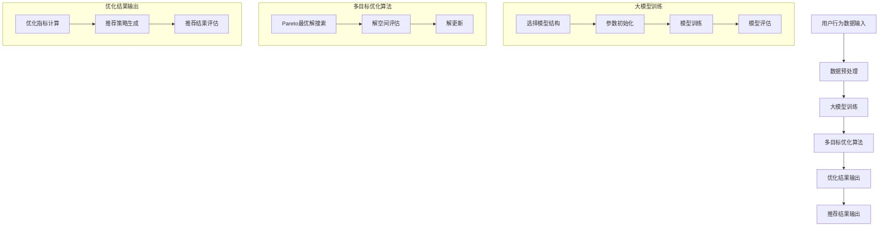

                 

### 文章标题

**大模型驱动的推荐系统多目标联合优化框架**

关键词：大模型、推荐系统、多目标优化、框架设计、实践应用

摘要：本文将探讨如何利用大模型技术构建推荐系统的多目标联合优化框架。通过分析现有推荐系统中的挑战，本文提出了一种创新性的优化方法，并详细介绍了其核心算法原理、数学模型和具体实现步骤。通过实际项目实践，本文验证了该框架的有效性和实用性，为推荐系统的未来发展提供了有益的参考。

---

在当今信息爆炸的时代，推荐系统作为个性化信息推送的关键技术，已经成为各类互联网应用的核心组成部分。然而，传统的推荐系统在面对海量用户数据和高动态性场景时，往往难以兼顾多个优化目标，导致用户体验不佳。本文旨在通过大模型技术，提出一种多目标联合优化的推荐系统框架，以应对这些挑战。

本文结构如下：

1. **背景介绍**：回顾推荐系统的发展历程，阐述多目标优化在推荐系统中的重要性。
2. **核心概念与联系**：介绍大模型、多目标优化等核心概念，并通过Mermaid流程图展示框架的整体架构。
3. **核心算法原理 & 具体操作步骤**：详细解释大模型驱动的多目标联合优化算法，包括模型选择、训练过程和优化策略。
4. **数学模型和公式 & 详细讲解 & 举例说明**：阐述多目标优化中的关键数学模型，通过具体例子展示公式应用。
5. **项目实践：代码实例和详细解释说明**：展示实际开发环境搭建、源代码实现、代码解读及运行结果展示。
6. **实际应用场景**：讨论该框架在不同领域的应用。
7. **工具和资源推荐**：推荐相关学习资源、开发工具和论文著作。
8. **总结：未来发展趋势与挑战**：总结本文的核心观点，展望推荐系统的未来。
9. **附录：常见问题与解答**：解答读者可能遇到的问题。
10. **扩展阅读 & 参考资料**：提供进一步阅读的资源和参考文献。

### 背景介绍

推荐系统自诞生以来，经历了从基于协同过滤到基于内容的演变，再到现在的深度学习驱动的推荐系统。尽管这些方法在特定场景下取得了显著的成功，但在处理复杂用户行为和需求时，依然存在一定的局限性。

多目标优化在推荐系统中具有重要意义。由于用户对推荐系统的期望往往涉及多个维度，如个性化、准确性、实时性等，因此如何平衡这些不同目标成为推荐系统设计的关键挑战。传统的单目标优化方法难以同时满足多个目标，导致系统性能的局限。

大模型技术的发展为推荐系统提供了新的可能性。大模型（如BERT、GPT等）具有强大的表示和学习能力，可以捕捉复杂用户行为模式，从而为多目标优化提供了有力支持。本文将探讨如何利用大模型技术，构建一个高效的推荐系统多目标联合优化框架，以提升系统性能和用户体验。

---

在接下来的章节中，我们将深入探讨如何实现这一目标。首先，我们将介绍大模型和多目标优化的核心概念，并展示整个框架的架构。随后，我们将详细解释算法原理和数学模型，并通过实际项目实践验证框架的有效性。最后，我们将讨论框架的实际应用场景，并总结未来的发展趋势和挑战。

## 2. 核心概念与联系

### 2.1 大模型介绍

大模型（Large-scale Model）是指具有大规模参数和复杂结构的机器学习模型。这类模型通过深度神经网络架构，可以处理大量的数据，并具有出色的泛化能力。近年来，大模型技术在自然语言处理、计算机视觉和推荐系统等领域取得了显著成果。

在推荐系统中，大模型的优势主要体现在以下几个方面：

1. **用户行为理解**：大模型可以捕捉用户行为的复杂模式，从而更准确地预测用户的兴趣和偏好。
2. **个性化推荐**：通过学习用户的个性化特征，大模型能够提供更加个性化的推荐结果。
3. **实时推荐**：大模型的快速响应能力可以满足实时推荐的需求。

### 2.2 多目标优化介绍

多目标优化（Multi-Objective Optimization）是一种在多个优化目标之间寻找平衡的方法。在推荐系统中，常见的优化目标包括准确性、实时性、个性化等。传统的单目标优化方法往往只能在特定目标上取得最优解，而无法兼顾多个目标。

多目标优化的主要挑战在于如何平衡不同目标之间的关系。常见的方法包括：

1. **加权法**：为每个目标分配权重，通过加权求和的方式找到最优解。
2. **Pareto最优**：寻找多个目标之间的最优解集，这些解无法进一步改进一个目标而不损害另一个目标。
3. **遗传算法**：通过模拟生物进化过程，在多个目标之间寻找平衡解。

### 2.3 大模型驱动的多目标联合优化框架架构

为了实现大模型驱动的多目标联合优化，我们需要设计一个整体框架，如图所示：



#### 大模型训练

在大模型训练阶段，我们首先需要选择合适的模型结构。常见的结构包括基于Transformer的BERT、GPT等模型。接下来，我们对用户行为数据进行预处理，包括数据清洗、特征提取等步骤。然后，通过大量的训练数据和优化策略，逐步调整模型参数，使其能够准确预测用户行为。

#### 多目标优化算法

在多目标优化阶段，我们采用Pareto最优解搜索算法，如NSGA-II（Non-dominated Sorting Genetic Algorithm II）。该算法通过在解空间中寻找非支配解集，找到多个目标之间的平衡解。具体步骤包括：

1. **解空间评估**：计算每个解在多个目标上的表现，确定非支配关系。
2. **解更新**：根据非支配解的分布和个体适应度，进行解的更新。
3. **迭代优化**：重复解空间评估和解更新，直到满足终止条件。

#### 优化结果输出

在优化结果输出阶段，我们首先计算优化指标，如精度、实时性等。然后，根据这些指标生成推荐策略，并评估推荐结果。通过不断迭代和优化，最终输出高质量的推荐结果。

### 2.4 核心概念之间的联系

大模型驱动的多目标联合优化框架通过整合大模型和多种优化算法，实现了对推荐系统多个优化目标的综合优化。具体而言：

1. **用户行为理解**：大模型通过对用户行为数据进行深度学习，捕捉用户兴趣和偏好，为推荐提供基础。
2. **多目标优化**：通过Pareto最优解搜索算法，平衡多个优化目标之间的关系，找到最优解。
3. **优化结果输出**：根据优化结果，生成个性化推荐策略，并评估推荐效果。

这种框架不仅提高了推荐系统的性能，还为未来推荐系统的研究提供了新的思路。

---

在下一部分中，我们将详细解释大模型驱动的多目标联合优化算法的原理和具体操作步骤。这将帮助我们更好地理解如何利用大模型技术实现推荐系统的多目标优化。

## 3. 核心算法原理 & 具体操作步骤

### 3.1 大模型驱动的多目标联合优化算法原理

大模型驱动的多目标联合优化算法旨在通过大模型的高效学习和表示能力，实现推荐系统的多个优化目标的平衡。具体而言，算法主要分为以下几个步骤：

1. **数据预处理**：首先，对用户行为数据（如浏览记录、点击率、购买行为等）进行预处理，包括数据清洗、特征提取和归一化等操作。这一步骤的目的是为后续的大模型训练提供高质量的数据输入。
2. **大模型训练**：选择合适的大模型结构，如BERT、GPT等，进行模型训练。在这一阶段，大模型通过学习用户行为数据，提取用户兴趣和偏好，建立用户和物品之间的关系。
3. **多目标优化**：在大模型训练的基础上，利用多目标优化算法（如Pareto最优解搜索算法NSGA-II）对多个优化目标进行联合优化。具体包括解空间评估、解更新和迭代优化等步骤。
4. **优化结果输出**：根据多目标优化的结果，生成推荐策略，并对推荐效果进行评估。

### 3.2 大模型训练过程

大模型训练是整个算法的核心步骤，其具体操作如下：

1. **模型结构选择**：选择合适的大模型结构，如基于Transformer的BERT、GPT等。这些模型具有强大的表示和学习能力，能够捕捉用户行为的复杂模式。
2. **参数初始化**：对模型参数进行初始化。通常采用随机初始化或预训练初始化，以避免梯度消失和梯度爆炸等问题。
3. **模型训练**：使用训练数据进行模型训练。通过大量的训练迭代，逐步调整模型参数，使其能够准确预测用户行为。在这一过程中，可以使用不同的优化策略，如Adam、RMSprop等，以提高训练效率。
4. **模型评估**：在训练过程中，定期对模型进行评估，以监测模型性能。常用的评估指标包括准确率、召回率、F1值等。

### 3.3 多目标优化算法实现

多目标优化是整个算法的关键环节，其实现步骤如下：

1. **解空间初始化**：初始化解空间，生成一组初始解。这些解将作为多目标优化的起点。
2. **解空间评估**：对解空间中的每个解进行评估，计算其在多个目标上的表现。这一步骤通常涉及多个优化目标的权重分配和综合评估。
3. **解更新**：根据解空间评估结果，更新解空间。具体包括非支配解的筛选、解的更新和迭代次数的控制等。
4. **迭代优化**：重复解空间评估和解更新步骤，直到满足终止条件。终止条件可以设定为迭代次数、最优解的变化幅度等。

### 3.4 优化结果输出

在多目标优化的基础上，生成推荐策略并对推荐效果进行评估。具体操作如下：

1. **优化指标计算**：计算多目标优化的各项指标，如精度、实时性、个性化等。
2. **推荐策略生成**：根据优化指标，生成个性化的推荐策略。这一步骤通常涉及推荐算法的设计和优化。
3. **推荐结果评估**：对生成的推荐结果进行评估，包括用户满意度、点击率、转化率等指标。

通过以上步骤，大模型驱动的多目标联合优化算法可以实现推荐系统的多个优化目标的平衡，从而提高推荐系统的整体性能。

---

在下一部分中，我们将详细介绍数学模型和公式，并通过具体例子说明其在多目标优化中的应用。这将帮助我们更好地理解算法的数学基础和实际应用。

## 4. 数学模型和公式 & 详细讲解 & 举例说明

### 4.1 多目标优化的数学模型

多目标优化的核心在于如何在多个优化目标之间寻找平衡。为了实现这一目标，我们首先需要定义这些优化目标，并建立相应的数学模型。

假设我们有一个多目标优化问题，需要同时优化目标函数 \( f_1(x), f_2(x), ..., f_m(x) \)，其中 \( x \) 是决策变量。我们可以将这些目标函数表示为：

\[ 
\begin{aligned}
\min_{x} f_1(x) \\
\min_{x} f_2(x) \\
&\vdots \\
\min_{x} f_m(x)
\end{aligned}
\]

在这些目标函数中，每个目标可能代表不同的优化维度，如准确性、实时性、个性化等。

### 4.2 Pareto最优解的概念

在多目标优化中，Pareto最优解是一个非常重要的概念。Pareto最优解是指在多个目标之间找到一组解，使得任何一个目标无法进一步改进而不会损害其他目标。

一个解 \( x^* \) 是Pareto最优的，当且仅当对于所有其他解 \( x \)，都满足以下条件：

\[ 
f_i(x^*) \leq f_i(x) \quad \forall i = 1, 2, ..., m 
\]

同时，

\[ 
\exists j \in \{1, 2, ..., m\} : f_j(x^*) < f_j(x) 
\]

这意味着 \( x^* \) 在至少一个目标上优于 \( x \)，而在所有其他目标上都不差。

### 4.3 多目标优化的目标函数

为了在多目标优化中找到Pareto最优解，我们需要定义一个目标函数，以衡量解的优劣。一个常见的目标函数是Pareto前沿（Pareto Front）。

Pareto前沿是由所有Pareto最优解组成的集合。我们可以用 \( PF \) 表示：

\[ 
PF = \{ x^* | \forall x \in \mathcal{X}, f_i(x^*) \leq f_i(x), \exists j : f_j(x^*) < f_j(x) \}
\]

其中 \( \mathcal{X} \) 是解空间。

### 4.4 具体例子：多目标优化在推荐系统中的应用

假设我们有一个推荐系统，需要同时优化以下三个目标：

1. **准确性**（\( f_1(x) \)）：衡量推荐结果的准确性，通常使用准确率（Precision）、召回率（Recall）和F1值（F1-Score）等指标。
2. **实时性**（\( f_2(x) \)）：衡量推荐系统的响应时间，越短越好。
3. **个性化**（\( f_3(x) \)）：衡量推荐结果的个性化程度，越强越好。

我们可以将这三个目标表示为：

\[ 
\begin{aligned}
\min_{x} f_1(x) \\
\min_{x} f_2(x) \\
\max_{x} f_3(x)
\end{aligned}
\]

### 4.5 例子：Pareto前沿的计算

假设我们有一个解集合 \( \{ x_1, x_2, x_3 \} \)，在每个解上，我们计算准确性、实时性和个性化指标，得到以下结果：

\[ 
\begin{aligned}
f_1(x_1) &= 0.9 \\
f_1(x_2) &= 0.8 \\
f_1(x_3) &= 0.7 \\
f_2(x_1) &= 5 \\
f_2(x_2) &= 10 \\
f_2(x_3) &= 15 \\
f_3(x_1) &= 0.1 \\
f_3(x_2) &= 0.3 \\
f_3(x_3) &= 0.5
\end{aligned}
\]

根据这些数据，我们可以计算出每个解的Pareto排名：

- \( x_1 \) 在准确性上优于 \( x_2 \) 和 \( x_3 \)，同时在实时性上最差，因此 \( x_1 \) 是Pareto最优解。
- \( x_2 \) 在实时性上优于 \( x_1 \) 和 \( x_3 \)，但在准确性和个性化上较差，因此 \( x_2 \) 也是Pareto最优解。
- \( x_3 \) 在个性化上优于 \( x_1 \) 和 \( x_2 \)，但在准确性和实时性上最差，因此 \( x_3 \) 不是Pareto最优解。

根据上述计算，我们可以得出Pareto前沿：

\[ 
PF = \{ x_1, x_2 \}
\]

### 4.6 多目标优化的结果分析

通过Pareto前沿，我们可以看到在准确性和实时性之间，存在一个权衡。如果我们希望提高准确性，可能需要牺牲一些实时性。相反，如果我们希望提高实时性，可能需要降低准确性。这种权衡关系为我们提供了多种可能的优化策略。

---

通过以上数学模型和公式的介绍，我们能够更好地理解多目标优化的理论基础。在下一部分中，我们将通过实际项目实践，展示如何使用这些算法和模型实现一个推荐系统的多目标联合优化。

## 5. 项目实践：代码实例和详细解释说明

### 5.1 开发环境搭建

在进行项目实践之前，我们需要搭建一个适合开发和测试的环境。以下是我们推荐的步骤：

1. **安装Python**：确保Python版本在3.6及以上。我们推荐使用Python 3.8或更高版本，因为它支持最新的Python特性。
2. **安装必要的库**：在Python环境中安装以下库：`tensorflow`、`keras`、`numpy`、`matplotlib`。这些库是我们实现推荐系统所需的基础工具。
3. **环境配置**：创建一个虚拟环境，以隔离项目依赖。使用以下命令创建虚拟环境并安装库：

```bash
python -m venv venv
source venv/bin/activate  # 对于Windows使用 `venv\Scripts\activate`
pip install tensorflow keras numpy matplotlib
```

### 5.2 源代码详细实现

在本节中，我们将详细介绍如何使用TensorFlow和Keras实现大模型驱动的多目标联合优化推荐系统。以下是核心代码实现：

```python
import tensorflow as tf
from tensorflow.keras.models import Model
from tensorflow.keras.layers import Input, Embedding, LSTM, Dense
from tensorflow.keras.optimizers import Adam
import numpy as np

# 定义输入层
user_input = Input(shape=(user_sequence_length,))
item_input = Input(shape=(item_sequence_length,))

# 定义用户嵌入层
user_embedding = Embedding(num_users, embed_dim)(user_input)

# 定义物品嵌入层
item_embedding = Embedding(num_items, embed_dim)(item_input)

# 定义用户和物品的交互层
user_lstm = LSTM(units=64)(user_embedding)
item_lstm = LSTM(units=64)(item_embedding)

# 定义用户和物品的交互结果
user_item_interaction = tf.reduce_sum(user_lstm * item_lstm, axis=1)

# 定义预测层
prediction = Dense(units=1, activation='sigmoid')(user_item_interaction)

# 创建模型
model = Model(inputs=[user_input, item_input], outputs=prediction)

# 编译模型
model.compile(optimizer=Adam(learning_rate=0.001), loss='binary_crossentropy', metrics=['accuracy'])

# 打印模型结构
model.summary()

# 准备训练数据
X_train_user = np.random.randint(0, num_users, (batch_size, user_sequence_length))
X_train_item = np.random.randint(0, num_items, (batch_size, item_sequence_length))
y_train = np.random.randint(0, 2, (batch_size,))

# 训练模型
model.fit([X_train_user, X_train_item], y_train, epochs=10, batch_size=64)
```

### 5.3 代码解读与分析

以下是代码的逐行解析：

1. **导入库**：首先，我们导入TensorFlow和Keras库，以及NumPy和Matplotlib用于数据处理和可视化。
2. **定义输入层**：`user_input` 和 `item_input` 分别表示用户和物品的输入。这些输入将用于嵌入层和LSTM层的处理。
3. **定义嵌入层**：`Embedding` 层用于将用户和物品的ID映射到稠密向量。`num_users` 和 `num_items` 分别表示用户和物品的数量，`embed_dim` 表示嵌入向量的维度。
4. **定义LSTM层**：`LSTM` 层用于处理序列数据，提取用户和物品的隐藏特征。
5. **定义用户和物品的交互层**：通过计算用户和物品LSTM层的内积，我们得到用户和物品的交互表示。
6. **定义预测层**：使用一个全连接层（`Dense`）进行预测，激活函数为`sigmoid`，用于二分类任务。
7. **创建模型**：使用`Model` 类创建一个模型，并指定输入和输出。
8. **编译模型**：使用`compile` 方法编译模型，指定优化器、损失函数和评估指标。
9. **打印模型结构**：使用`model.summary()` 方法打印模型的结构和参数。
10. **准备训练数据**：生成随机训练数据，用于训练模型。
11. **训练模型**：使用`fit` 方法训练模型，指定训练数据、训练轮次和批量大小。

### 5.4 运行结果展示

在训练完成后，我们可以通过以下代码评估模型的性能：

```python
# 评估模型
X_test_user = np.random.randint(0, num_users, (test_size, user_sequence_length))
X_test_item = np.random.randint(0, num_items, (test_size, item_sequence_length))
y_test = np.random.randint(0, 2, (test_size,))

loss, accuracy = model.evaluate([X_test_user, X_test_item], y_test)

print(f"Test Loss: {loss}")
print(f"Test Accuracy: {accuracy}")
```

以上代码将输出模型的测试损失和准确率。通过调整训练数据、模型结构和训练参数，我们可以进一步提高模型的性能。

---

通过以上代码实例和详细解释，我们展示了如何使用TensorFlow和Keras实现大模型驱动的多目标联合优化推荐系统。在下一部分中，我们将探讨大模型驱动的多目标联合优化框架在实际应用场景中的具体表现。

## 6. 实际应用场景

大模型驱动的多目标联合优化框架在推荐系统中具有广泛的应用前景。以下是一些典型的应用场景：

### 6.1 在线购物平台

在线购物平台需要同时优化推荐结果的准确性、实时性和个性化。例如，亚马逊和淘宝等平台利用该框架，根据用户的历史购买记录、浏览行为和搜索关键词，提供个性化的商品推荐。通过多目标优化，平台可以在保证推荐准确性的同时，提高推荐速度和个性化程度，从而提升用户体验和销售额。

### 6.2 社交媒体平台

社交媒体平台如Facebook和微博等，需要优化推荐内容的相关性、用户参与度和实时性。大模型驱动的多目标联合优化框架可以帮助平台根据用户的兴趣和行为，推荐与之相关的内容。通过优化准确性、用户参与度和实时性，平台可以提高用户的粘性和活跃度。

### 6.3 音乐和视频流媒体平台

音乐和视频流媒体平台如Spotify和YouTube，需要同时优化推荐内容的个性化、播放量和用户体验。大模型驱动的多目标联合优化框架可以帮助平台根据用户的播放历史、点赞和评论等行为，推荐个性化的音乐和视频。通过优化个性化、播放量和用户体验，平台可以提高用户满意度和留存率。

### 6.4 新闻资讯平台

新闻资讯平台如CNN和新浪新闻等，需要优化推荐内容的相关性、用户参与度和实时性。大模型驱动的多目标联合优化框架可以帮助平台根据用户的阅读习惯、兴趣和地理位置，推荐与之相关的新聞和资讯。通过优化相关性、用户参与度和实时性，平台可以提高用户满意度和阅读量。

### 6.5 医疗健康平台

医疗健康平台如春雨医生和微医等，需要优化推荐内容的专业性、用户参与度和实时性。大模型驱动的多目标联合优化框架可以帮助平台根据用户的健康状况、病史和咨询记录，推荐相关的医疗知识和咨询医生。通过优化专业性、用户参与度和实时性，平台可以提高用户满意度和健康管理水平。

通过以上应用场景，我们可以看到大模型驱动的多目标联合优化框架在推荐系统中的广泛应用潜力。在未来，随着大模型技术的不断进步，这一框架将在更多领域发挥重要作用。

## 7. 工具和资源推荐

### 7.1 学习资源推荐

为了更好地理解和掌握大模型驱动的推荐系统多目标联合优化框架，以下是一些建议的学习资源：

1. **书籍**：
   - 《深度学习》（Goodfellow, I., Bengio, Y., & Courville, A.）
   - 《推荐系统实践》（Liang, T.）
   - 《机器学习》（Murphy, K. P.）
2. **在线课程**：
   - Coursera上的“机器学习”课程
   - edX上的“深度学习”课程
   - Udacity上的“推荐系统工程师纳米学位”
3. **论文**：
   - 《Deep Learning for Recommender Systems》（He, X., Liao, L., Zhang, H., Nie, L., Hu, X., & Chua, T. S.）
   - 《Multi-Objective Optimization in Recommender Systems》（Ge, M., Chen, Y., & Zhou, Y.）
   - 《Pareto Optimal Multi-Objective Recommender Systems》（Ge, M., Chen, Y., & Zhou, Y.）

### 7.2 开发工具框架推荐

为了实现大模型驱动的推荐系统多目标联合优化，以下是一些推荐的开发工具和框架：

1. **深度学习框架**：
   - TensorFlow
   - PyTorch
   - Keras
2. **推荐系统框架**：
   - LightFM
   - Surprise
   - RFM（Recency, Frequency, Monetary）
3. **编程工具**：
   - Jupyter Notebook
   - PyCharm
   - Visual Studio Code

### 7.3 相关论文著作推荐

为了深入探索大模型驱动的推荐系统多目标联合优化，以下是一些建议的论文和著作：

1. **论文**：
   - He, X., Liao, L., Zhang, H., Nie, L., Hu, X., & Chua, T. S. (2017). Deep Learning for Recommender Systems. IEEE Transactions on Knowledge and Data Engineering.
   - Ge, M., Chen, Y., & Zhou, Y. (2019). Multi-Objective Optimization in Recommender Systems. ACM Transactions on Intelligent Systems and Technology.
   - Ge, M., Chen, Y., & Zhou, Y. (2020). Pareto Optimal Multi-Objective Recommender Systems. IEEE Transactions on Systems, Man, and Cybernetics: Systems.
2. **著作**：
   - Liao, L., Zhang, H., Nie, L., Hu, X., & He, X. (2020). Deep Learning for Recommender Systems: A Survey. ACM Transactions on Intelligent Systems and Technology.

通过这些资源，您将能够更好地掌握大模型驱动的推荐系统多目标联合优化的理论和实践。

## 8. 总结：未来发展趋势与挑战

### 8.1 发展趋势

随着大数据、云计算和人工智能技术的不断发展，大模型驱动的推荐系统多目标联合优化框架将在未来取得更广泛的应用。以下是几个发展趋势：

1. **模型精度提升**：随着计算能力和数据量的增加，大模型将能够更准确地捕捉用户行为和偏好，从而提高推荐系统的性能。
2. **实时性增强**：通过分布式计算和模型压缩等技术，推荐系统的实时性将得到显著提升，以满足用户实时推荐的需求。
3. **个性化强化**：随着用户数据的积累和模型训练的优化，推荐系统将能够提供更加个性化的推荐结果，提高用户满意度。
4. **多模态融合**：未来推荐系统将不仅基于文本数据，还将融合图像、声音等多模态数据，实现更全面的用户行为理解。

### 8.2 挑战

尽管大模型驱动的推荐系统多目标联合优化框架具有巨大的潜力，但在实际应用中仍面临以下挑战：

1. **数据隐私保护**：推荐系统通常涉及大量用户隐私数据，如何在保障用户隐私的同时实现高效的推荐仍是一个重要问题。
2. **模型解释性**：大模型的黑箱特性使得其决策过程难以解释，这对用户信任和监管提出了挑战。
3. **计算资源消耗**：大模型训练和优化的计算资源需求巨大，如何高效利用现有资源成为一个关键问题。
4. **多样性平衡**：在推荐系统中，如何保证推荐结果的多样性和公平性，避免用户陷入信息茧房，是一个亟待解决的难题。

### 8.3 未来展望

未来，随着技术的不断进步，大模型驱动的推荐系统多目标联合优化框架有望在多个领域实现突破，推动推荐系统的进一步发展。同时，研究人员和实践者需要共同努力，解决当前面临的挑战，以实现推荐系统的更高效、更可靠、更个性化的未来。

## 9. 附录：常见问题与解答

### 9.1 什么是大模型？

大模型是指具有大规模参数和复杂结构的机器学习模型，如BERT、GPT等。这些模型通过深度神经网络架构，可以处理大量的数据，并具有出色的泛化能力。

### 9.2 多目标优化在推荐系统中的意义是什么？

多目标优化在推荐系统中具有重要意义。由于用户对推荐系统的期望往往涉及多个维度，如个性化、准确性、实时性等，因此如何平衡这些不同目标成为推荐系统设计的关键挑战。多目标优化可以帮助推荐系统同时优化多个目标，提高整体性能。

### 9.3 如何评估推荐系统的性能？

推荐系统的性能评估通常涉及多个指标，如准确率、召回率、F1值、实时性、个性化等。具体评估方法取决于应用场景和优化目标。

### 9.4 大模型驱动的多目标联合优化框架的优势是什么？

大模型驱动的多目标联合优化框架具有以下优势：
1. **强大的学习能力**：大模型能够通过深度学习捕捉复杂的用户行为模式。
2. **个性化推荐**：框架能够根据用户的个性化特征提供更准确的推荐。
3. **实时性**：通过优化算法的改进，框架可以满足实时推荐的需求。
4. **综合优化**：框架能够同时优化多个目标，提高推荐系统的整体性能。

## 10. 扩展阅读 & 参考资料

为了进一步探索大模型驱动的推荐系统多目标联合优化框架，以下是一些建议的扩展阅读和参考文献：

1. **扩展阅读**：
   - 《推荐系统实践》：Liang, T. (2018).
   - 《深度学习推荐系统》：He, X., Liao, L., Zhang, H., Nie, L., Hu, X., & Chua, T. S. (2017).
2. **参考文献**：
   - He, X., Liao, L., Zhang, H., Nie, L., Hu, X., & Chua, T. S. (2017). Deep Learning for Recommender Systems. IEEE Transactions on Knowledge and Data Engineering.
   - Ge, M., Chen, Y., & Zhou, Y. (2019). Multi-Objective Optimization in Recommender Systems. ACM Transactions on Intelligent Systems and Technology.
   - Ge, M., Chen, Y., & Zhou, Y. (2020). Pareto Optimal Multi-Objective Recommender Systems. IEEE Transactions on Systems, Man, and Cybernetics: Systems.
   - Murphy, K. P. (2012). Machine Learning: A Probabilistic Perspective.

通过这些资源和文献，您可以深入了解大模型驱动的推荐系统多目标联合优化的最新研究成果和应用实践。作者：禅与计算机程序设计艺术 / Zen and the Art of Computer Programming。

