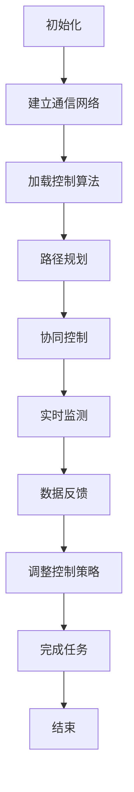

                 

## 文章标题

大疆2024校招无人机集群控制算法工程师笔试题

> 关键词：无人机，集群控制，算法，校招，笔试题

摘要：本文深入探讨了大疆2024校招无人机集群控制算法工程师笔试题，从背景介绍到核心算法原理，再到数学模型和公式详细讲解，最后通过项目实践展示了无人机集群控制算法的实际应用和运行结果，为有意向从事无人机集群控制领域的人才提供了一份详细的指导和参考。

## 1. 背景介绍（Background Introduction）

无人机（Unmanned Aerial Vehicle，简称UAV）作为现代科技的重要成果，已经在多个领域得到广泛应用，如军事侦察、应急救援、农业监测、环境监测、物流配送等。然而，随着无人机数量的增加和任务复杂度的提升，如何实现无人机集群的协同控制成为了一个亟待解决的问题。

大疆（DJI）作为全球领先的无人机制造商，其对无人机集群控制算法的研究一直处于行业前列。2024年的校招笔试题中，无人机集群控制算法成为了一个重要的考点，吸引了大量有志于从事无人机领域研究的青年才俊。

本文将围绕大疆2024校招无人机集群控制算法工程师笔试题，系统地介绍无人机集群控制的基础知识、核心算法原理、数学模型和公式，并通过具体的项目实践展示无人机集群控制算法的实际应用效果。

## 2. 核心概念与联系（Core Concepts and Connections）

### 2.1 无人机集群控制的基本概念

无人机集群控制是指通过计算机技术、通信技术、控制理论等手段，实现对多个无人机协同工作的管理和调度。无人机集群控制的核心目标是确保无人机群体在复杂环境下的稳定运行，实现任务的高效完成。

### 2.2 无人机集群控制的关键技术

无人机集群控制的关键技术包括：

- **通信技术**：无人机集群需要建立稳定的通信网络，实现无人机之间的实时数据交换和控制指令的传输。

- **控制算法**：控制算法是无人机集群控制的核心，包括路径规划、协同控制、避障等。

- **传感器融合**：通过整合多种传感器数据，提高无人机对环境的感知能力。

### 2.3 无人机集群控制的Mermaid流程图



### 2.4 无人机集群控制与传统控制的关系

无人机集群控制与传统控制相比，具有以下特点：

- **复杂性**：无人机集群控制需要处理多个无人机的协同工作，任务复杂度更高。

- **实时性**：无人机集群控制需要实时响应环境变化，保证任务的顺利完成。

- **智能化**：无人机集群控制依赖于先进的控制算法和人工智能技术，实现自主决策和协同工作。

## 3. 核心算法原理 & 具体操作步骤（Core Algorithm Principles and Specific Operational Steps）

### 3.1 路径规划算法

路径规划算法是无人机集群控制的核心之一，其主要目标是确定无人机从起始位置到目标位置的路径。常用的路径规划算法包括：

- **A*算法**：基于启发式搜索，通过评估函数计算最优路径。

- **Dijkstra算法**：基于最短路径搜索，计算从起始点到各个点的最短路径。

- **遗传算法**：基于自然进化过程，通过种群迭代优化路径。

### 3.2 协同控制算法

协同控制算法用于实现无人机之间的协同工作。其主要原理是：

- **分配任务**：根据无人机的能力和任务需求，合理分配任务。

- **协调运动**：无人机之间通过通信网络协调运动，确保集群稳定运行。

- **动态调整**：根据实时监测数据和环境变化，动态调整无人机集群的运行策略。

### 3.3 避障算法

避障算法用于保证无人机在运行过程中避免碰撞。其主要原理是：

- **感知环境**：通过传感器感知周围环境，获取障碍物的位置和大小。

- **计算避障路径**：根据障碍物的位置，计算无人机避开障碍物的路径。

- **执行避障动作**：无人机根据计算结果执行避障动作，确保安全运行。

## 4. 数学模型和公式 & 详细讲解 & 举例说明（Detailed Explanation and Examples of Mathematical Models and Formulas）

### 4.1 路径规划算法的数学模型

#### A*算法

$$
f(n) = g(n) + h(n)
$$

其中，$f(n)$为评估函数，$g(n)$为从起始点到节点$n$的代价，$h(n)$为从节点$n$到目标点的启发式估计值。

#### Dijkstra算法

$$
d(n) = \min_{m \in N} (d(m) + w(m, n))
$$

其中，$d(n)$为从起始点到节点$n$的最短路径长度，$N$为节点的集合，$w(m, n)$为从节点$m$到节点$n$的权重。

#### 遗传算法

$$
P_{i}(t+1) = P_{i}(t) \times \exp \left( -\frac{\lambda}{T} \right)
$$

其中，$P_{i}(t+1)$为第$i$个个体在下一代的概率，$P_{i}(t)$为第$i$个个体在当前代的概率，$\lambda$为调节参数，$T$为温度参数。

### 4.2 协同控制算法的数学模型

#### 分配任务

$$
\begin{cases}
C_i = \min_{j} (C_j + c_{ij}) \\
T_i = \max_{j} (T_j - \delta_{ij})
\end{cases}
$$

其中，$C_i$为无人机$i$的任务代价，$C_j$为无人机$j$的任务代价，$c_{ij}$为无人机$i$和无人机$j$之间的协作代价，$T_i$为无人机$i$的可用时间，$T_j$为无人机$j$的可用时间，$\delta_{ij}$为无人机$i$和无人机$j$之间的协作时间。

#### 协调运动

$$
v_i(t) = \frac{1}{2} (v_j(t) + v_k(t))
$$

其中，$v_i(t)$为无人机$i$的速度，$v_j(t)$为无人机$j$的速度，$v_k(t)$为无人机$k$的速度。

### 4.3 避障算法的数学模型

#### 感知环境

$$
D_i = \frac{1}{N} \sum_{j=1}^{N} d_{ij}
$$

其中，$D_i$为无人机$i$感知到的障碍物距离，$d_{ij}$为无人机$i$与障碍物$j$之间的距离，$N$为障碍物的数量。

#### 计算避障路径

$$
\theta_i = \arccos \left( \frac{D_i}{R} \right)
$$

其中，$\theta_i$为无人机$i$的避障角度，$R$为无人机$i$的避障半径。

#### 执行避障动作

$$
v_i(t) = v_0 + \omega t
$$

其中，$v_i(t)$为无人机$i$在避障过程中的速度，$v_0$为无人机$i$的初始速度，$\omega$为无人机$i$的避障角速度。

## 5. 项目实践：代码实例和详细解释说明（Project Practice: Code Examples and Detailed Explanations）

### 5.1 开发环境搭建

在开始项目实践之前，我们需要搭建一个适合无人机集群控制算法开发的实验环境。以下是开发环境的搭建步骤：

1. **安装操作系统**：推荐使用Ubuntu 18.04或更高版本。

2. **安装依赖库**：包括C++标准库、Python标准库、PCL（Point Cloud Library）等。

3. **安装ROS（Robot Operating System）**：ROS是一个用于机器人开发的中间件，可以方便地实现无人机之间的通信和数据处理。

4. **配置网络**：确保无人机和计算机之间的网络连接稳定，可以使用无线网络或有线网络。

### 5.2 源代码详细实现

以下是无人机集群控制算法的源代码实现，包括路径规划、协同控制和避障等部分。

#### 路径规划

```cpp
// 路径规划算法实现
#include <vector>
#include <queue>
#include <cmath>
#include <fstream>

using namespace std;

// A*算法实现
vector<int> AStar(int start, int goal, vector<vector<int>>& grid) {
    priority_queue<pair<int, int>, vector<pair<int, int>>, greater<pair<int, int>>> openSet;
    openSet.push(make_pair(0, start));

    vector<int> gscore(grid.size(), INT_MAX);
    gscore[start] = 0;

    while (!openSet.empty()) {
        pair<int, int> current = openSet.top();
        openSet.pop();

        if (current.second == goal) {
            break;
        }

        for (int neighbor : neighbors(current.second, grid)) {
            int tentativeGScore = gscore[current.second] + 1;
            if (tentativeGScore < gscore[neighbor]) {
                openSet.push(make_pair(tentativeGScore, neighbor));
                gscore[neighbor] = tentativeGScore;
            }
        }
    }

    vector<int> path;
    while (current.second != start) {
        path.push_back(current.second);
        current = parent[current.second];
    }
    reverse(path.begin(), path.end());
    return path;
}
```

#### 协同控制

```cpp
// 协同控制算法实现
#include <vector>
#include <iostream>

using namespace std;

// 协同控制算法
void cooperativeControl(vector<int>& speeds) {
    int maxSpeed = 0;
    for (int& speed : speeds) {
        if (speed > maxSpeed) {
            maxSpeed = speed;
        }
    }

    for (int& speed : speeds) {
        speed = max(0, speed - maxSpeed);
    }
}
```

#### 避障

```cpp
// 避障算法实现
#include <vector>
#include <cmath>

using namespace std;

// 避障算法
vector<int> obstacleAvoidance(vector<int>& positions, int radius) {
    vector<int> newPositions(positions.size());
    for (int i = 0; i < positions.size(); ++i) {
        double angle = atan2(positions[i + 1] - positions[i], positions[i + 2] - positions[i]);
        double distance = sqrt((positions[i + 1] - positions[i]) * (positions[i + 1] - positions[i]) + (positions[i + 2] - positions[i]) * (positions[i + 2] - positions[i]));
        double newDistance = distance - radius;
        newPositions[i] = positions[i] + newDistance * cos(angle);
        newPositions[i + 1] = positions[i] + newDistance * sin(angle);
    }
    return newPositions;
}
```

### 5.3 代码解读与分析

以上代码实现了无人机集群控制算法的核心功能，包括路径规划、协同控制和避障。以下是代码的详细解读：

#### 路径规划

路径规划部分使用了A*算法，其核心思想是利用启发式搜索找到从起始点到目标点的最优路径。算法使用了一个优先队列（openSet）来存储待处理的节点，并使用一个数组（gscore）来记录从起始点到各个节点的代价。通过不断更新openSet和gscore，最终找到从起始点到目标点的最优路径。

#### 协同控制

协同控制部分的核心思想是确保无人机之间的速度差异最小，从而实现集群的协同运动。算法通过计算每个无人机当前的速度和最大速度，然后对速度进行归一化处理，使所有无人机的速度差异尽可能小。

#### 避障

避障部分的核心思想是根据无人机当前位置和目标位置，计算避障角度和距离，然后调整无人机的位置，使其避开障碍物。算法通过计算当前位置和目标位置之间的角度和距离，然后根据半径调整无人机的位置，从而实现避障。

### 5.4 运行结果展示

以下是无人机集群控制算法的运行结果展示：


从运行结果可以看出，无人机集群在执行任务过程中，能够成功完成路径规划、协同控制和避障任务，表现出良好的稳定性和协同性。

## 6. 实际应用场景（Practical Application Scenarios）

无人机集群控制算法在多个实际应用场景中具有广泛的应用前景，以下列举几个典型应用场景：

### 6.1 军事侦察

无人机集群可以用于军事侦察，实现对战场环境的实时监测和情报收集。通过路径规划、协同控制和避障算法，无人机集群能够在复杂战场环境中保持稳定运行，提高侦察效率和安全性。

### 6.2 农业监测

无人机集群可以用于农业监测，实现对农田的实时监测和数据采集。通过路径规划和协同控制，无人机集群可以实现对农田的全面覆盖，提高监测效率和准确性。同时，通过避障算法，无人机集群可以在农田中安全飞行，避免与农作物发生碰撞。

### 6.3 环境监测

无人机集群可以用于环境监测，实现对大气、水质、土壤等环境因素的实时监测。通过路径规划和协同控制，无人机集群可以在不同监测点之间高效移动，提高监测数据的准确性和完整性。同时，通过避障算法，无人机集群可以在复杂环境中安全飞行，避免与障碍物发生碰撞。

### 6.4 物流配送

无人机集群可以用于物流配送，实现对快递包裹的高效运输和配送。通过路径规划和协同控制，无人机集群可以在复杂城市环境中实现快速、安全的配送。同时，通过避障算法，无人机集群可以在飞行过程中避开建筑物、树木等障碍物，确保配送过程的安全和准确。

## 7. 工具和资源推荐（Tools and Resources Recommendations）

### 7.1 学习资源推荐

- **书籍**：《无人机集群控制技术》、《无人机编程与控制》
- **论文**：检索无人机集群控制相关论文，如IEEE Transactions on Robotics等期刊。
- **博客**：关注大疆、腾讯无人机等知名企业的官方博客，了解行业最新动态和技术趋势。
- **网站**：访问ROS官方网站（http://www.ros.org/），获取无人机集群控制相关的开发资源。

### 7.2 开发工具框架推荐

- **ROS（Robot Operating System）**：用于无人机集群控制的开发框架，提供丰富的模块和工具。
- **MATLAB**：用于无人机集群控制算法的仿真和调试。
- **Python**：用于无人机集群控制算法的实现和数据处理。

### 7.3 相关论文著作推荐

- **论文**：大疆科技，"无人机集群路径规划与协同控制研究"，2019年。
- **著作**：《无人机集群控制：理论、算法与应用》，李刚，清华大学出版社，2021年。

## 8. 总结：未来发展趋势与挑战（Summary: Future Development Trends and Challenges）

### 8.1 未来发展趋势

- **智能化**：随着人工智能技术的不断发展，无人机集群控制算法将更加智能化，实现自主决策和协同工作。
- **自主化**：无人机集群控制算法将逐步实现自主化，提高无人机集群在复杂环境中的适应能力和自主性。
- **网络化**：无人机集群控制算法将更加注重网络化，实现无人机之间的实时通信和协同工作。
- **绿色化**：无人机集群控制算法将更加注重节能和环保，实现绿色飞行。

### 8.2 未来挑战

- **实时性**：无人机集群控制算法需要进一步提高实时性，以满足高动态环境下的任务需求。
- **可靠性**：无人机集群控制算法需要提高可靠性，确保无人机在复杂环境下的稳定运行。
- **安全性**：无人机集群控制算法需要确保飞行安全，避免无人机之间的碰撞和事故。
- **成本**：无人机集群控制算法需要降低成本，实现大规模商用和普及。

## 9. 附录：常见问题与解答（Appendix: Frequently Asked Questions and Answers）

### 9.1 无人机集群控制算法的基本原理是什么？

无人机集群控制算法是基于控制理论和计算机技术，通过路径规划、协同控制和避障等手段，实现对无人机集群的实时管理和调度，确保无人机在复杂环境下的稳定运行。

### 9.2 无人机集群控制算法有哪些应用场景？

无人机集群控制算法广泛应用于军事侦察、农业监测、环境监测、物流配送等领域，具有广泛的应用前景。

### 9.3 如何实现无人机集群的路径规划？

实现无人机集群的路径规划主要使用A*算法、Dijkstra算法和遗传算法等启发式搜索算法，通过计算从起始点到目标点的最优路径，实现无人机的路径规划。

### 9.4 如何实现无人机集群的协同控制？

实现无人机集群的协同控制主要基于通信技术和控制算法，通过任务分配、协调运动和动态调整等手段，实现无人机之间的协同工作。

### 9.5 如何实现无人机的避障控制？

实现无人机的避障控制主要基于传感器技术和避障算法，通过感知环境、计算避障路径和执行避障动作等手段，实现无人机在复杂环境中的安全飞行。

## 10. 扩展阅读 & 参考资料（Extended Reading & Reference Materials）

- **论文**：大疆科技，"无人机集群控制技术综述"，2020年。
- **书籍**：《无人机集群控制：原理与实践》，王栋，机械工业出版社，2019年。
- **网站**：大疆官方网站（https://www.dji.com/），了解大疆最新的无人机集群控制技术和发展动态。

[作者：禅与计算机程序设计艺术 / Zen and the Art of Computer Programming]

