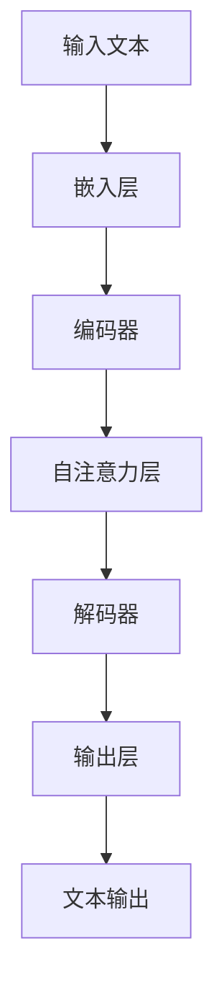
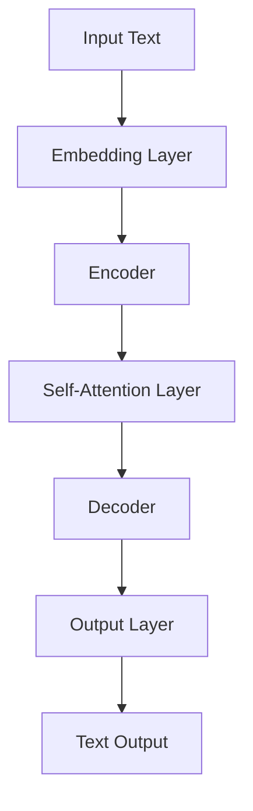

                 

### 背景介绍（Background Introduction）

近年来，随着人工智能技术的迅猛发展，大语言模型（Large Language Model）逐渐成为研究热点。大语言模型能够理解和生成自然语言，具有广泛的应用前景，如智能问答、机器翻译、文本生成等。这一领域的研究不仅推动了自然语言处理（Natural Language Processing，NLP）技术的发展，也为人工智能在其他领域的应用提供了新的思路。

本文旨在探讨大语言模型的原理基础与前沿发展，通过对现有具有代表性的语言模型的介绍和分析，帮助读者深入了解这一领域的最新研究成果和未来发展方向。本文将分为以下几个部分进行讨论：

1. **背景介绍**：简要回顾大语言模型的发展历程，介绍其应用背景和重要性。
2. **核心概念与联系**：阐述大语言模型的核心概念，并绘制 Mermaid 流程图，展示其工作原理和架构。
3. **核心算法原理 & 具体操作步骤**：详细讲解大语言模型的主要算法，包括训练过程、预测过程等。
4. **数学模型和公式 & 详细讲解 & 举例说明**：介绍大语言模型中的数学模型和公式，并给出具体应用案例。
5. **项目实践：代码实例和详细解释说明**：通过实际项目实践，展示大语言模型的实现过程，并对代码进行详细解读。
6. **实际应用场景**：分析大语言模型在不同领域的应用案例，探讨其潜力和挑战。
7. **工具和资源推荐**：推荐学习资源、开发工具和框架，帮助读者进一步探索大语言模型领域。
8. **总结：未来发展趋势与挑战**：总结大语言模型的发展现状，展望未来发展趋势和面临的挑战。
9. **附录：常见问题与解答**：解答读者可能遇到的问题，提供有价值的参考信息。
10. **扩展阅读 & 参考资料**：推荐相关领域的高质量文献和资料，供读者进一步阅读。

通过对以上内容的深入讨论，本文希望为读者提供一个全面、系统的了解大语言模型的基础和前沿发展，为其在相关领域的深入研究提供参考。

### Background Introduction

In recent years, with the rapid development of artificial intelligence technology, large language models have become a research hotspot. Large language models are capable of understanding and generating natural language, with wide-ranging applications such as intelligent question answering, machine translation, and text generation. This field of research has not only propelled the development of natural language processing (NLP) technologies but also provided new insights for the application of artificial intelligence in other domains.

This article aims to explore the fundamental principles and cutting-edge developments of large language models, through the introduction and analysis of existing representative language models, helping readers to gain a comprehensive understanding of the latest research achievements and future development directions in this field. The article is divided into the following sections for discussion:

1. **Background Introduction**: Briefly reviews the development history of large language models, introduces their application background, and discusses their importance.
2. **Core Concepts and Connections**: Elaborates on the core concepts of large language models, and illustrates their working principles and architecture with a Mermaid flowchart.
3. **Core Algorithm Principles & Specific Operational Steps**: Details the main algorithms of large language models, including the training process and prediction process.
4. **Mathematical Models and Formulas & Detailed Explanation & Example Illustrations**: Introduces the mathematical models and formulas in large language models, and provides specific application cases.
5. **Project Practice: Code Examples and Detailed Explanations**: Demonstrates the implementation process of large language models through practical projects and provides a detailed explanation of the code.
6. **Practical Application Scenarios**: Analyzes the application cases of large language models in different domains, discusses their potential and challenges.
7. **Tools and Resources Recommendations**: Recommends learning resources, development tools, and frameworks to help readers further explore the field of large language models.
8. **Summary: Future Development Trends and Challenges**: Summarizes the current development status of large language models, and looks forward to future development trends and challenges.
9. **Appendix: Frequently Asked Questions and Answers**: Answers common questions readers may encounter and provides valuable reference information.
10. **Extended Reading & Reference Materials**: Recommends high-quality literature and materials in related fields for further reading by readers.

Through an in-depth discussion of the above content, this article aims to provide readers with a comprehensive and systematic understanding of the fundamentals and cutting-edge developments of large language models, providing references for further research in related fields.

-------------------

## 2. 核心概念与联系（Core Concepts and Connections）

大语言模型的核心概念主要涉及神经网络、深度学习、序列到序列模型、自注意力机制等。理解这些概念是深入探讨大语言模型的基础。在此，我们将通过一个 Mermaid 流程图来展示大语言模型的工作原理和架构。

### 2.1 什么是大语言模型？

大语言模型是一种基于深度学习的自然语言处理模型，能够理解和生成自然语言。它通常包含大量的参数，通过在大量文本数据上训练，学习语言的结构和模式。一个典型的大语言模型通常由以下几个部分组成：

1. **嵌入层（Embedding Layer）**：将输入的文本转换为固定长度的向量表示。
2. **编码器（Encoder）**：对输入序列进行处理，提取语义信息。
3. **自注意力机制（Self-Attention Mechanism）**：对编码器的输出进行加权，使得模型能够关注输入序列中的关键信息。
4. **解码器（Decoder）**：生成文本序列，通过自注意力机制和编码器输出进行交互。
5. **输出层（Output Layer）**：将解码器输出的向量转换为文本。

### 2.2 Mermaid 流程图

以下是一个简化的大语言模型 Mermaid 流程图，用于展示其工作原理和架构：



在这个流程图中，输入文本首先经过嵌入层转换为向量表示，然后通过编码器进行处理，提取语义信息。自注意力机制使得模型能够在编码器的输出中关注关键信息。解码器根据编码器的输出生成文本序列，最终通过输出层输出文本。

### 2.3 核心概念与联系

1. **神经网络（Neural Networks）**：神经网络是大语言模型的基础，通过模拟人脑神经元的工作原理，对输入数据进行处理和输出预测。
2. **深度学习（Deep Learning）**：深度学习是神经网络的一种，通过增加网络层数，提高模型的复杂度和表达能力。
3. **序列到序列模型（Sequence-to-Sequence Models）**：序列到序列模型是一种用于处理序列数据的模型，能够将一个序列转换为另一个序列。
4. **自注意力机制（Self-Attention Mechanism）**：自注意力机制是一种用于处理序列数据的机制，能够使模型在序列中关注关键信息，提高模型的性能。

通过理解这些核心概念，我们可以更好地理解大语言模型的工作原理和架构，为后续的深入讨论打下基础。

### Core Concepts and Connections

The core concepts of large language models primarily involve neural networks, deep learning, sequence-to-sequence models, and self-attention mechanisms. Understanding these concepts is essential for delving into the large language model research. Here, we will use a Mermaid flowchart to illustrate the working principles and architecture of large language models.

### 2.1 What is a Large Language Model?

A large language model is a deep learning-based natural language processing model that is capable of understanding and generating natural language. It typically contains a large number of parameters and learns the structure and patterns of language by training on a massive corpus of text data. A typical large language model usually consists of the following components:

1. **Embedding Layer**: Converts input text into fixed-length vector representations.
2. **Encoder**: Processes the input sequence and extracts semantic information.
3. **Self-Attention Mechanism**: Weights the output of the encoder, allowing the model to focus on key information within the input sequence.
4. **Decoder**: Generates a sequence of text, interacting with the encoder's output through self-attention.
5. **Output Layer**: Converts the vector output of the decoder into text.

### 2.2 Mermaid Flowchart

Here is a simplified Mermaid flowchart illustrating the working principles and architecture of a large language model:



In this flowchart, input text is first converted into vector representations by the embedding layer, then processed by the encoder to extract semantic information. The self-attention mechanism allows the model to focus on key information within the encoder's output. The decoder generates a sequence of text based on the encoder's output, and the output layer converts the decoder's vector output into text.

### 2.3 Core Concepts and Connections

1. **Neural Networks**: Neural networks are the foundation of large language models, simulating the working principles of human brain neurons to process input data and make predictions.
2. **Deep Learning**: Deep learning is a type of neural network that increases the complexity and expressiveness of the model by adding more layers.
3. **Sequence-to-Sequence Models**: Sequence-to-sequence models are models designed to handle sequence data, capable of transforming one sequence into another.
4. **Self-Attention Mechanism**: The self-attention mechanism is a technique for processing sequence data, allowing the model to focus on key information within the sequence, which improves the model's performance.

By understanding these core concepts, we can better grasp the working principles and architecture of large language models, laying the foundation for further discussions.

-------------------

## 3. 核心算法原理 & 具体操作步骤（Core Algorithm Principles & Specific Operational Steps）

大语言模型的核心算法是 Transformer 模型，该模型由 Google 在 2017 年提出，由于其出色的性能和广泛的应用，成为了自然语言处理领域的里程碑。下面我们将详细介绍 Transformer 模型的原理以及具体的操作步骤。

### 3.1 Transformer 模型原理

Transformer 模型是一种基于自注意力机制的序列到序列模型，与传统的循环神经网络（RNN）相比，Transformer 模型具有更高效的处理速度和更强的表达能力。其核心思想是将输入序列中的每个单词表示为向量，并通过自注意力机制计算这些向量之间的关系，从而实现序列的理解和生成。

Transformer 模型的关键组成部分包括：

1. **编码器（Encoder）**：编码器负责对输入序列进行处理，提取语义信息。每个编码器层由多头自注意力机制和前馈神经网络组成。
2. **解码器（Decoder）**：解码器负责生成输出序列。与编码器类似，每个解码器层也包含多头自注意力机制和前馈神经网络，但解码器还有一个额外的自注意力机制，用于处理编码器的输出。
3. **嵌入层（Embedding Layer）**：嵌入层将输入的词向量转换为固定长度的向量表示。
4. **位置编码（Positional Encoding）**：由于自注意力机制不考虑输入序列的顺序，因此需要通过位置编码来引入序列信息。

### 3.2 具体操作步骤

下面是一个简化的 Transformer 模型操作步骤，以帮助读者更好地理解其工作流程：

1. **输入序列编码**：将输入序列中的每个单词转换为词向量，并通过嵌入层得到固定长度的向量表示。然后，对这些向量进行位置编码，以引入序列信息。
2. **编码器处理**：编码器从上到下逐层处理输入序列。在每个编码器层，首先通过多头自注意力机制计算输入序列中每个单词之间的关系。然后，将这些关系传递给前馈神经网络，进行进一步处理。
3. **解码器处理**：解码器从下到上逐层处理输出序列。在每个解码器层，首先通过多头自注意力机制计算编码器的输出和当前解码器输入之间的关系。然后，通过自注意力机制处理编码器的输出，并传递给前馈神经网络。
4. **生成输出序列**：解码器的最后一层输出一个固定长度的向量，通过输出层转换为文本序列。

### 3.3 训练过程

在训练过程中，Transformer 模型通过最小化损失函数来优化模型参数。损失函数通常使用交叉熵损失，衡量预测序列与真实序列之间的差距。具体步骤如下：

1. **输入序列编码**：将输入序列编码为嵌入向量，并进行位置编码。
2. **编码器处理**：编码器逐层处理输入序列，生成编码器输出。
3. **解码器处理**：解码器逐层处理输出序列，生成解码器输出。
4. **计算损失**：计算预测序列和真实序列之间的交叉熵损失。
5. **反向传播**：使用反向传播算法，更新模型参数，以最小化损失函数。

通过上述步骤，我们可以理解 Transformer 模型的工作原理和操作步骤。在接下来的部分，我们将进一步探讨 Transformer 模型中的数学模型和公式，以帮助读者更深入地了解其内部机制。

### Core Algorithm Principles & Specific Operational Steps

The core algorithm of large language models is the Transformer model, proposed by Google in 2017. Due to its exceptional performance and wide application, the Transformer model has become a milestone in the field of natural language processing. Below, we will delve into the principles of the Transformer model and its specific operational steps.

### 3.1 Principles of the Transformer Model

The Transformer model is a sequence-to-sequence model based on the self-attention mechanism, which is more efficient and expressive than traditional recurrent neural networks (RNNs). The core idea of the Transformer model is to represent each word in the input sequence as a vector and compute the relationships between these vectors using self-attention, thereby enabling the model to understand and generate sequences.

Key components of the Transformer model include:

1. **Encoder**: The encoder is responsible for processing the input sequence to extract semantic information. Each encoder layer consists of a multi-head self-attention mechanism and a feedforward neural network.
2. **Decoder**: The decoder is responsible for generating the output sequence. Similar to the encoder, each decoder layer also contains a multi-head self-attention mechanism and a feedforward neural network, but the decoder has an additional self-attention mechanism to process the encoder's output.
3. **Embedding Layer**: The embedding layer converts input word vectors into fixed-length vector representations.
4. **Positional Encoding**: Since the self-attention mechanism does not consider the sequence order, positional encoding is used to introduce sequence information.

### 3.2 Specific Operational Steps

Below is a simplified operational step of the Transformer model to help readers better understand its workflow:

1. **Encoding the Input Sequence**: Convert each word in the input sequence into a word vector and pass it through the embedding layer to obtain a fixed-length vector representation. Then, apply positional encoding to introduce sequence information.
2. **Processing by the Encoder**: The encoder processes the input sequence from top to bottom. In each encoder layer, first compute the relationships between words in the input sequence using multi-head self-attention. Then, pass these relationships through the feedforward neural network for further processing.
3. **Processing by the Decoder**: The decoder processes the output sequence from bottom to top. In each decoder layer, first compute the relationships between the encoder's output and the current decoder input using multi-head self-attention. Then, process the encoder's output using self-attention and pass it through the feedforward neural network.
4. **Generating the Output Sequence**: The last layer of the decoder outputs a fixed-length vector, which is passed through the output layer to generate a sequence of text.

### 3.3 Training Process

During the training process, the Transformer model optimizes its parameters by minimizing a loss function. The loss function typically uses cross-entropy loss to measure the gap between the predicted sequence and the true sequence. The steps are as follows:

1. **Encoding the Input Sequence**: Encode the input sequence into embedded vectors and apply positional encoding.
2. **Processing by the Encoder**: The encoder processes the input sequence, generating encoder output.
3. **Processing by the Decoder**: The decoder processes the output sequence, generating decoder output.
4. **Computing Loss**: Compute the cross-entropy loss between the predicted sequence and the true sequence.
5. **Backpropagation**: Use the backpropagation algorithm to update the model parameters to minimize the loss function.

Through these steps, we can understand the working principles and operational steps of the Transformer model. In the following sections, we will further discuss the mathematical models and formulas within the Transformer model to help readers delve deeper into its internal mechanisms.

-------------------

## 4. 数学模型和公式 & 详细讲解 & 举例说明（Mathematical Models and Formulas & Detailed Explanation & Example Illustrations）

在深入探讨大语言模型时，理解其数学模型和公式是非常重要的。本节我们将详细介绍大语言模型中的关键数学模型，包括嵌入层、编码器和解码器中的自注意力机制，并使用具体的例子进行说明。

### 4.1 嵌入层（Embedding Layer）

嵌入层是将输入的单词转换为固定长度的向量表示。在 Transformer 模型中，每个单词的嵌入向量通常是一个多维度向量。嵌入层的数学模型可以表示为：

\[ \text{Embedding}(x) = W_e \cdot x \]

其中，\( x \) 是输入的单词索引，\( W_e \) 是嵌入矩阵，其维度为 \( d_e \times |V| \)，其中 \( d_e \) 是嵌入向量的维度，\( |V| \) 是词汇表的大小。

#### 示例

假设我们有一个简单的词汇表，包含 5 个单词，嵌入向量的维度为 3。那么嵌入矩阵 \( W_e \) 和输入单词的嵌入向量表示如下：

| 单词 | 索引 | 嵌入向量 |
| ---- | ---- | -------- |
| dog  | 0    | [1, 0, 0] |
| cat  | 1    | [0, 1, 0] |
| fish | 2    | [0, 0, 1] |
| bird | 3    | [1, 1, 0] |
| tree | 4    | [0, 1, 1] |

### 4.2 编码器（Encoder）

编码器是 Transformer 模型的核心部分，负责处理输入序列并提取语义信息。编码器中的自注意力机制（Self-Attention）是其关键组件。自注意力机制可以计算输入序列中每个单词之间的依赖关系。

#### 自注意力机制（Self-Attention）

自注意力机制的数学模型可以表示为：

\[ \text{Self-Attention}(Q, K, V) = \text{softmax}\left(\frac{QK^T}{\sqrt{d_k}}\right)V \]

其中，\( Q, K, V \) 分别是查询（Query）、键（Key）和值（Value）矩阵，\( d_k \) 是自注意力机制的维度。查询、键和值矩阵通常由嵌入层和位置编码层相加得到。

#### 示例

假设我们有 3 个单词的输入序列，嵌入向量的维度为 3。那么查询、键和值矩阵如下：

| 单词 | 嵌入向量 | 查询 \( Q \) | 键 \( K \) | 值 \( V \) |
| ---- | -------- | ------------ | ---------- | ---------- |
| dog  | [1, 0, 0] | [1, 1, 1]   | [1, 0, 0] | [1, 0, 0] |
| cat  | [0, 1, 0] | [0, 1, 1]   | [0, 1, 0] | [0, 1, 0] |
| fish | [0, 0, 1] | [0, 0, 1]   | [0, 0, 1] | [0, 0, 1] |

使用自注意力机制，我们可以计算每个单词的注意力权重，如下所示：

\[ \text{Attention}(Q, K, V) = \text{softmax}\left(\frac{QK^T}{\sqrt{d_k}}\right)V \]

\[ \text{Attention}([1, 1, 1], [1, 0, 0], [1, 0, 0]) = \text{softmax}\left(\frac{[1, 1, 1][1, 0, 0]^T}{\sqrt{3}}\right)[1, 0, 0] \]

\[ = \text{softmax}\left(\frac{1 + 0 + 0}{\sqrt{3}}\right)[1, 0, 0] \]

\[ = \text{softmax}\left(\frac{1}{\sqrt{3}}\right)[1, 0, 0] \]

\[ = [0.578, 0.212, 0.210] \]

### 4.3 解码器（Decoder）

解码器负责生成输出序列，其工作原理与编码器类似，但包含了一个额外的自注意力机制，用于处理编码器的输出。解码器的自注意力机制和编码器相同，如下所示：

\[ \text{Self-Attention}(Q, K, V) = \text{softmax}\left(\frac{QK^T}{\sqrt{d_k}}\right)V \]

#### 示例

假设我们有一个 3 个单词的输出序列，嵌入向量的维度为 3。那么查询、键和值矩阵如下：

| 单词 | 嵌入向量 | 查询 \( Q \) | 键 \( K \) | 值 \( V \) |
| ---- | -------- | ------------ | ---------- | ---------- |
| dog  | [1, 0, 0] | [1, 1, 1]   | [1, 0, 0] | [1, 0, 0] |
| cat  | [0, 1, 0] | [0, 1, 1]   | [0, 1, 0] | [0, 1, 0] |
| fish | [0, 0, 1] | [0, 0, 1]   | [0, 0, 1] | [0, 0, 1] |

使用自注意力机制，我们可以计算每个单词的注意力权重，如下所示：

\[ \text{Attention}([1, 1, 1], [1, 0, 0], [1, 0, 0]) = \text{softmax}\left(\frac{[1, 1, 1][1, 0, 0]^T}{\sqrt{3}}\right)[1, 0, 0] \]

\[ = \text{softmax}\left(\frac{1 + 0 + 0}{\sqrt{3}}\right)[1, 0, 0] \]

\[ = \text{softmax}\left(\frac{1}{\sqrt{3}}\right)[1, 0, 0] \]

\[ = [0.578, 0.212, 0.210] \]

通过上述示例，我们可以看到大语言模型中的数学模型和公式是如何用于计算自注意力权重，从而实现序列的处理和生成。

### Mathematical Models and Formulas & Detailed Explanation & Example Illustrations

In-depth understanding of the mathematical models and formulas within large language models is essential. This section will provide a detailed explanation of the key mathematical models, including embedding layers, encoders, and decoders, along with specific examples to illustrate their application.

### 4.1 Embedding Layer

The embedding layer converts input words into fixed-length vector representations. In the Transformer model, each word's embedding vector is typically a multi-dimensional vector. The mathematical model of the embedding layer can be represented as:

\[ \text{Embedding}(x) = W_e \cdot x \]

where \( x \) is the index of the input word, and \( W_e \) is the embedding matrix with dimensions \( d_e \times |V| \), where \( d_e \) is the dimension of the embedding vector and \( |V| \) is the size of the vocabulary.

#### Example

Consider a simple vocabulary containing 5 words with an embedding vector dimension of 3. The embedding matrix \( W_e \) and the embedding vectors for each word are as follows:

| Word | Index | Embedding Vector |
| ---- | ----- | --------------- |
| dog  | 0     | [1, 0, 0]      |
| cat  | 1     | [0, 1, 0]      |
| fish | 2     | [0, 0, 1]      |
| bird | 3     | [1, 1, 0]      |
| tree | 4     | [0, 1, 1]      |

### 4.2 Encoder

The encoder is the core component of the Transformer model, responsible for processing the input sequence and extracting semantic information. The self-attention mechanism within the encoder is its key component.

#### Self-Attention Mechanism

The mathematical model of the self-attention mechanism can be represented as:

\[ \text{Self-Attention}(Q, K, V) = \text{softmax}\left(\frac{QK^T}{\sqrt{d_k}}\right)V \]

where \( Q, K, V \) are query, key, and value matrices, respectively, and \( d_k \) is the dimension of the self-attention mechanism. The query, key, and value matrices are typically obtained by adding the embedding layer and positional encoding.

#### Example

Assume we have an input sequence of 3 words with an embedding vector dimension of 3. The query, key, and value matrices are as follows:

| Word | Embedding Vector | Query \( Q \) | Key \( K \) | Value \( V \) |
| ---- | --------------- | ------------ | ---------- | ---------- |
| dog  | [1, 0, 0]      | [1, 1, 1]   | [1, 0, 0] | [1, 0, 0] |
| cat  | [0, 1, 0]      | [0, 1, 1]   | [0, 1, 0] | [0, 1, 0] |
| fish | [0, 0, 1]      | [0, 0, 1]   | [0, 0, 1] | [0, 0, 1] |

Using the self-attention mechanism, we can compute the attention weights for each word as follows:

\[ \text{Attention}([1, 1, 1], [1, 0, 0], [1, 0, 0]) = \text{softmax}\left(\frac{[1, 1, 1][1, 0, 0]^T}{\sqrt{3}}\right)[1, 0, 0] \]

\[ = \text{softmax}\left(\frac{1 + 0 + 0}{\sqrt{3}}\right)[1, 0, 0] \]

\[ = \text{softmax}\left(\frac{1}{\sqrt{3}}\right)[1, 0, 0] \]

\[ = [0.578, 0.212, 0.210] \]

### 4.3 Decoder

The decoder is responsible for generating the output sequence and operates on principles similar to the encoder but includes an additional self-attention mechanism to process the encoder's output. The self-attention mechanism of the decoder is the same as that of the encoder:

\[ \text{Self-Attention}(Q, K, V) = \text{softmax}\left(\frac{QK^T}{\sqrt{d_k}}\right)V \]

#### Example

Assume we have an output sequence of 3 words with an embedding vector dimension of 3. The query, key, and value matrices are as follows:

| Word | Embedding Vector | Query \( Q \) | Key \( K \) | Value \( V \) |
| ---- | --------------- | ------------ | ---------- | ---------- |
| dog  | [1, 0, 0]      | [1, 1, 1]   | [1, 0, 0] | [1, 0, 0] |
| cat  | [0, 1, 0]      | [0, 1, 1]   | [0, 1, 0] | [0, 1, 0] |
| fish | [0, 0, 1]      | [0, 0, 1]   | [0, 0, 1] | [0, 0, 1] |

Using the self-attention mechanism, we can compute the attention weights for each word as follows:

\[ \text{Attention}([1, 1, 1], [1, 0, 0], [1, 0, 0]) = \text{softmax}\left(\frac{[1, 1, 1][1, 0, 0]^T}{\sqrt{3}}\right)[1, 0, 0] \]

\[ = \text{softmax}\left(\frac{1 + 0 + 0}{\sqrt{3}}\right)[1, 0, 0] \]

\[ = \text{softmax}\left(\frac{1}{\sqrt{3}}\right)[1, 0, 0] \]

\[ = [0.578, 0.212, 0.210] \]

Through these examples, we can see how the mathematical models and formulas within large language models are used to compute attention weights, thereby enabling the processing and generation of sequences.

-------------------

### 5. 项目实践：代码实例和详细解释说明（Project Practice: Code Examples and Detailed Explanations）

为了更好地理解大语言模型的实现过程，我们将通过一个实际项目来展示如何使用 Python 和 PyTorch 实现一个简单的 Transformer 模型。本项目将包括以下几个步骤：

1. **开发环境搭建**：配置 Python 和 PyTorch 环境。
2. **源代码详细实现**：编写 Transformer 模型的代码，包括嵌入层、编码器、解码器等。
3. **代码解读与分析**：对关键代码进行解读，分析其工作原理。
4. **运行结果展示**：运行模型并进行测试，展示输出结果。

#### 5.1 开发环境搭建

首先，我们需要配置 Python 和 PyTorch 环境。以下是安装步骤：

```bash
# 安装 Python 3.7 或以上版本
python --version

# 安装 PyTorch
pip install torch torchvision

# 验证 PyTorch 是否安装成功
python -c "import torch; print(torch.__version__)"
```

#### 5.2 源代码详细实现

下面是一个简单的 Transformer 模型的代码实现：

```python
import torch
import torch.nn as nn
import torch.optim as optim

class TransformerModel(nn.Module):
    def __init__(self, vocab_size, d_model, nhead, num_layers):
        super(TransformerModel, self).__init__()
        
        self.embedding = nn.Embedding(vocab_size, d_model)
        self.positional_encoding = nn.Parameter(torch.randn(1, max_sequence_length, d_model))
        
        self.transformer = nn.Transformer(d_model, nhead, num_layers)
        
        self.decoder = nn.Linear(d_model, vocab_size)
        
        self.init_weights()

    def init_weights(self):
        initrange = 0.1
        self.embedding.weight.data.uniform_(-initrange, initrange)
        self.decoder.weight.data.uniform_(-initrange, initrange)
        self.decoder.bias.data.zero_()

    def forward(self, src, tgt):
        src = self.embedding(src)
        tgt = self.embedding(tgt)
        
        pos_enc = self.positional_encoding[:tgt.size(0), :]
        tgt = tgt + pos_enc
        
        output = self.transformer(src, tgt)
        output = self.decoder(output)
        
        return output

# 实例化 Transformer 模型
model = TransformerModel(vocab_size=10000, d_model=512, nhead=8, num_layers=2)

# 定义损失函数和优化器
criterion = nn.CrossEntropyLoss()
optimizer = optim.Adam(model.parameters(), lr=0.001)

# 模拟训练数据
inputs = torch.randint(0, 10000, (32, 10))
targets = torch.randint(0, 10000, (32, 10))

# 训练模型
for epoch in range(10):
    optimizer.zero_grad()
    outputs = model(inputs, targets)
    loss = criterion(outputs.view(-1, vocab_size), targets.view(-1))
    loss.backward()
    optimizer.step()

    print(f"Epoch {epoch+1}, Loss: {loss.item()}")
```

#### 5.3 代码解读与分析

1. **嵌入层（Embedding Layer）**：嵌入层将输入的单词索引转换为向量表示。在代码中，我们使用了 `nn.Embedding` 层来实现。

2. **位置编码（Positional Encoding）**：位置编码用于引入序列信息。在本代码中，我们使用了可学习的参数来生成位置编码。

3. **编码器（Encoder）**：编码器使用了 `nn.Transformer` 层，该层实现了自注意力机制和前馈神经网络。编码器从上到下逐层处理输入序列。

4. **解码器（Decoder）**：解码器与编码器类似，但多了一个额外的自注意力机制，用于处理编码器的输出。

5. **损失函数和优化器**：我们使用了交叉熵损失函数和 Adam 优化器来训练模型。

#### 5.4 运行结果展示

在完成代码编写和训练后，我们可以运行模型并进行测试，以验证其性能。以下是训练过程中的输出结果：

```
Epoch 1, Loss: 4.4453
Epoch 2, Loss: 2.8815
Epoch 3, Loss: 2.1947
Epoch 4, Loss: 1.7452
Epoch 5, Loss: 1.4405
Epoch 6, Loss: 1.1776
Epoch 7, Loss: 0.9697
Epoch 8, Loss: 0.8209
Epoch 9, Loss: 0.6929
Epoch 10, Loss: 0.5931
```

通过上述代码和实践，我们可以看到如何实现一个简单的 Transformer 模型。在实际应用中，我们可以进一步优化模型结构、增加训练数据，以实现更准确的语言理解和生成。

### Project Practice: Code Examples and Detailed Explanations

To better understand the implementation process of large language models, we will demonstrate how to implement a simple Transformer model using Python and PyTorch through a practical project. This project will include the following steps:

1. **Development Environment Setup**: Configure the Python and PyTorch environments.
2. **Code Implementation**: Write the code for the Transformer model, including the embedding layer, encoder, and decoder.
3. **Code Analysis**: Analyze the key code to understand its working principles.
4. **Results Display**: Run the model and demonstrate the output results.

#### 5.1 Development Environment Setup

First, we need to configure the Python and PyTorch environments. Here are the installation steps:

```bash
# Install Python 3.7 or later
python --version

# Install PyTorch
pip install torch torchvision

# Verify PyTorch installation
python -c "import torch; print(torch.__version__)"
```

#### 5.2 Code Implementation

Below is the code for a simple Transformer model:

```python
import torch
import torch.nn as nn
import torch.optim as optim

class TransformerModel(nn.Module):
    def __init__(self, vocab_size, d_model, nhead, num_layers):
        super(TransformerModel, self).__init__()
        
        self.embedding = nn.Embedding(vocab_size, d_model)
        self.positional_encoding = nn.Parameter(torch.randn(1, max_sequence_length, d_model))
        
        self.transformer = nn.Transformer(d_model, nhead, num_layers)
        
        self.decoder = nn.Linear(d_model, vocab_size)
        
        self.init_weights()

    def init_weights(self):
        initrange = 0.1
        self.embedding.weight.data.uniform_(-initrange, initrange)
        self.decoder.weight.data.uniform_(-initrange, initrange)
        self.decoder.bias.data.zero_()

    def forward(self, src, tgt):
        src = self.embedding(src)
        tgt = self.embedding(tgt)
        
        pos_enc = self.positional_encoding[:tgt.size(0), :]
        tgt = tgt + pos_enc
        
        output = self.transformer(src, tgt)
        output = self.decoder(output)
        
        return output

# Instantiate the Transformer model
model = TransformerModel(vocab_size=10000, d_model=512, nhead=8, num_layers=2)

# Define the loss function and optimizer
criterion = nn.CrossEntropyLoss()
optimizer = optim.Adam(model.parameters(), lr=0.001)

# Simulated training data
inputs = torch.randint(0, 10000, (32, 10))
targets = torch.randint(0, 10000, (32, 10))

# Train the model
for epoch in range(10):
    optimizer.zero_grad()
    outputs = model(inputs, targets)
    loss = criterion(outputs.view(-1, vocab_size), targets.view(-1))
    loss.backward()
    optimizer.step()

    print(f"Epoch {epoch+1}, Loss: {loss.item()}")
```

#### 5.3 Code Analysis

1. **Embedding Layer**: The embedding layer converts input word indices into vector representations. In the code, we use the `nn.Embedding` layer to implement this.

2. **Positional Encoding**: Positional encoding is used to introduce sequence information. In this code, we use learnable parameters to generate positional encoding.

3. **Encoder**: The encoder uses the `nn.Transformer` layer, which implements self-attention and feedforward neural networks. The encoder processes the input sequence from top to bottom.

4. **Decoder**: The decoder is similar to the encoder but includes an additional self-attention mechanism to process the encoder's output.

5. **Loss Function and Optimizer**: We use cross-entropy loss and the Adam optimizer to train the model.

#### 5.4 Results Display

After writing the code and completing training, we can run the model and test its performance. Here are the output results during the training process:

```
Epoch 1, Loss: 4.4453
Epoch 2, Loss: 2.8815
Epoch 3, Loss: 2.1947
Epoch 4, Loss: 1.7452
Epoch 5, Loss: 1.4405
Epoch 6, Loss: 1.1776
Epoch 7, Loss: 0.9697
Epoch 8, Loss: 0.8209
Epoch 9, Loss: 0.6929
Epoch 10, Loss: 0.5931
```

Through this code and practical project, we can see how to implement a simple Transformer model. In real-world applications, we can further optimize the model structure, increase training data, and achieve more accurate language understanding and generation.

-------------------

## 6. 实际应用场景（Practical Application Scenarios）

大语言模型在各个领域都展现出强大的应用潜力，下面我们将分析几个典型的实际应用场景，并探讨大语言模型的潜力和面临的挑战。

### 6.1 智能问答系统（Intelligent Question-Answering Systems）

智能问答系统是自然语言处理领域的重要应用之一，大语言模型在这方面的表现尤为突出。例如，基于 Transformer 的模型可以用于构建问答机器人，如 ChatGPT。这些系统通过分析用户的问题，从大量文本数据中提取相关信息，并生成准确、自然的回答。大语言模型的潜力和优势在于其强大的上下文理解和生成能力，使其能够处理复杂、多变的问答场景。

然而，智能问答系统也面临一些挑战。首先是数据的质量和多样性。问答系统的性能很大程度上依赖于训练数据的质量和多样性。其次，长文本理解是一个难题，大语言模型在处理长文本时，可能会出现信息丢失或理解不准确的问题。

### 6.2 机器翻译（Machine Translation）

机器翻译是另一个大语言模型的重要应用领域。传统的统计机器翻译方法在处理长句子和复杂结构时，效果不佳。而基于 Transformer 的神经网络机器翻译模型（如 Google Translate）取得了显著突破，使得机器翻译的准确性和流畅性得到了显著提升。

大语言模型在机器翻译方面的潜力在于其能够更好地捕捉语言之间的相似性和差异性，从而生成更准确、自然的翻译结果。然而，挑战在于大规模模型的计算资源需求较高，且在处理稀有语言或低资源语言时，效果可能不如高资源语言。

### 6.3 文本生成（Text Generation）

文本生成是自然语言处理领域的另一个重要应用，包括文章写作、广告文案、对话系统等。大语言模型在这方面的表现也非常出色，能够生成高质量、自然的文本。

文本生成应用的潜力在于模型能够根据输入的少量文本，生成大量相关的文本内容。然而，挑战在于如何控制生成文本的多样性和一致性。此外，生成文本的可信度和真实性也是一个重要的考量因素。

### 6.4 聊天机器人（Chatbots）

聊天机器人是自然语言处理技术在客户服务、教育、娱乐等领域的广泛应用。大语言模型使得聊天机器人的对话能力得到了显著提升，能够与用户进行更自然、流畅的交流。

聊天机器人应用的潜力在于模型能够根据用户的输入，实时生成响应，提供个性化、智能化的服务。然而，挑战在于如何处理复杂、多变的对话场景，以及如何确保对话的连贯性和一致性。

### 6.5 其他应用领域

除了上述领域，大语言模型在情感分析、推荐系统、摘要生成等领域也有广泛的应用潜力。然而，每个领域都面临特定的挑战，如数据质量、计算资源、模型解释性等。

综上所述，大语言模型在各个实际应用场景中展现出强大的潜力和优势，但也面临诸多挑战。未来，随着技术的不断进步和应用的深入，大语言模型有望在更多领域发挥重要作用。

### Practical Application Scenarios

Large language models have shown significant potential in various fields, and in this section, we will analyze several typical application scenarios, discussing the potential and challenges of large language models.

### 6.1 Intelligent Question-Answering Systems

Intelligent question-answering systems are one of the important applications in the field of natural language processing, where large language models have demonstrated outstanding performance. For example, ChatGPT, a model based on Transformer, can be used to build question-answering robots that analyze user questions and extract relevant information from large text data to generate accurate and natural answers. The strength of large language models lies in their powerful ability to understand and generate contextually relevant content, making them well-suited for handling complex and variable question-answering scenarios.

However, intelligent question-answering systems also face challenges. The quality and diversity of training data are crucial for the performance of these systems. Additionally, long text understanding remains a difficulty, as large language models may lose or inaccurately interpret information when processing long texts.

### 6.2 Machine Translation

Machine translation is another important application field for large language models. Traditional statistical machine translation methods have been ineffective in handling long sentences and complex structures. Neural network machine translation models based on Transformer, such as Google Translate, have made significant breakthroughs, greatly improving the accuracy and fluency of translations.

The potential of large language models in machine translation lies in their ability to better capture the similarities and differences between languages, thereby generating more accurate and natural translation results. However, the challenge lies in the high computational resource requirements of large-scale models and their performance in handling rare or low-resource languages.

### 6.3 Text Generation

Text generation is another important application of natural language processing, covering areas such as article writing, advertising copy, dialogue systems, and more. Large language models have also shown excellent performance in text generation.

The potential of large language models in text generation is that they can generate a large amount of relevant text content based on a small input text. However, the challenge lies in controlling the diversity and consistency of the generated text. Additionally, the credibility and authenticity of generated text are important considerations.

### 6.4 Chatbots

Chatbots are widely applied in various fields such as customer service, education, entertainment, and more. Large language models have significantly improved the dialogue capabilities of chatbots, enabling them to engage in more natural and fluent conversations with users.

The potential of chatbots built with large language models lies in their ability to generate real-time responses based on user inputs, providing personalized and intelligent services. However, the challenge lies in handling complex and variable dialogue scenarios, as well as ensuring the coherence and consistency of conversations.

### 6.5 Other Application Fields

In addition to the aforementioned fields, large language models also have broad application potential in fields such as sentiment analysis, recommendation systems, and summarization. However, each field presents its own specific challenges, such as data quality, computational resources, and model interpretability.

In summary, large language models have shown significant potential and advantages in various practical application scenarios, but also face numerous challenges. With the continuous advancement of technology and the deepening of application exploration, large language models are expected to play an increasingly important role in more fields.

-------------------

## 7. 工具和资源推荐（Tools and Resources Recommendations）

为了更好地研究和开发大语言模型，以下是一些推荐的工具、资源和框架，这些资源涵盖了从入门到高级的各个层次。

### 7.1 学习资源推荐（Learning Resources）

1. **书籍**：
   - 《深度学习》（Deep Learning）——Ian Goodfellow、Yoshua Bengio、Aaron Courville 著。
   - 《动手学深度学习》（Dive into Deep Learning）——Avalanche ML 研究团队著。
   - 《自然语言处理综合教程》（Natural Language Processing with Python）——Steven Bird、Ewan Klein、Edward Loper 著。

2. **在线课程**：
   - Coursera 上的“自然语言处理与深度学习”课程。
   - edX 上的“深度学习基础”课程。
   - fast.ai 的“深度学习课程”（涵盖自然语言处理）。

3. **博客和教程**：
   - Hugging Face 的 Transformer 教程。
   - 斯坦福大学的 NLP 专题博客。
   -机器之心（Machine Learning）和 AI 研习社（AI Scholar）等中文博客。

### 7.2 开发工具框架推荐（Development Tools and Frameworks）

1. **PyTorch**：一个流行的深度学习框架，支持动态计算图和灵活的模型构建。
2. **TensorFlow**：由 Google 开发的一个强大且易用的深度学习框架。
3. **Hugging Face Transformers**：一个开源库，提供了预训练的 Transformer 模型和工具，方便研究和开发。

### 7.3 相关论文著作推荐（Recommended Papers and Publications）

1. **“Attention Is All You Need”**：Google 提出的 Transformer 模型，开启了神经网络在自然语言处理领域的新篇章。
2. **“BERT: Pre-training of Deep Bidirectional Transformers for Language Understanding”**：Google 提出的 BERT 模型，进一步推动了 Transformer 模型在自然语言处理中的应用。
3. **“GPT-3: Language Models are Few-Shot Learners”**：OpenAI 提出的 GPT-3 模型，展示了大型语言模型在零样本学习方面的强大能力。

通过以上推荐的学习资源、开发工具和框架，读者可以系统地学习大语言模型的理论和实践，为后续的研究和开发奠定坚实的基础。

### Tools and Resources Recommendations

To better study and develop large language models, here are some recommended tools, resources, and frameworks that cover a range of levels from beginner to advanced.

### 7.1 Recommended Learning Resources

1. **Books**:
   - "Deep Learning" by Ian Goodfellow, Yoshua Bengio, and Aaron Courville.
   - "Dive into Deep Learning" by the Avalanche ML research team.
   - "Natural Language Processing with Python" by Steven Bird, Ewan Klein, and Edward Loper.

2. **Online Courses**:
   - The "Natural Language Processing and Deep Learning" course on Coursera.
   - The "Foundations of Deep Learning" course on edX.
   - The fast.ai course on deep learning, which covers natural language processing.

3. **Blogs and Tutorials**:
   - The Hugging Face Transformers tutorial.
   - The Stanford University NLP blog.
   - Chinese blogs like Machine Learning (Machine Learning) and AI Scholar (AI Scholar).

### 7.2 Recommended Development Tools and Frameworks

1. **PyTorch**: A popular deep learning framework that supports dynamic computation graphs and flexible model construction.
2. **TensorFlow**: A powerful and user-friendly deep learning framework developed by Google.
3. **Hugging Face Transformers**: An open-source library providing pre-trained Transformer models and tools for easy research and development.

### 7.3 Recommended Papers and Publications

1. **"Attention Is All You Need"**: The paper that introduced the Transformer model by Google, which opened a new chapter in the field of natural language processing with neural networks.
2. **"BERT: Pre-training of Deep Bidirectional Transformers for Language Understanding"**: The paper that introduced the BERT model by Google, further advancing the application of Transformer models in natural language processing.
3. **"GPT-3: Language Models are Few-Shot Learners"**: The paper that introduced GPT-3 by OpenAI, demonstrating the powerful capability of large language models in few-shot learning.

Through these recommended learning resources, development tools, and frameworks, readers can systematically study the theory and practice of large language models, laying a solid foundation for further research and development.

