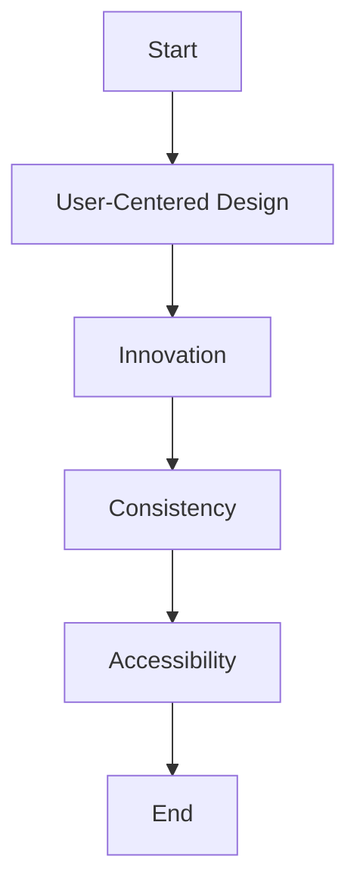

                 

### 文章标题

如何打造令用户惊喜的产品细节

> 关键词：用户体验、产品细节、用户惊喜、设计原则、案例分析

> 摘要：本文将探讨如何在产品设计中融入令人惊喜的细节，以提升用户体验，增强用户忠诚度。通过一系列案例分析，我们将分析成功产品的设计思路，提取出可复制的实践方法，为产品设计者提供有价值的参考。

### Background Introduction

在现代社会，随着科技的发展，市场竞争愈发激烈，产品同质化现象普遍。如何在同质化的市场中脱颖而出，吸引并留住用户，成为企业关注的焦点。用户体验（UX）设计逐渐成为产品成功的关键因素。而产品细节的巧妙设计，不仅能提升用户体验，还能给用户带来惊喜，从而提高用户满意度和忠诚度。

用户惊喜是指用户在使用产品过程中，感受到的产品超出其预期体验的瞬间。这种惊喜可以源自产品的某个独特设计、创新功能，或是一种超乎寻常的用户体验。在用户心目中留下深刻印象的产品细节，往往能够成为产品成功的核心竞争力。

本文将围绕以下核心问题展开讨论：

1. 如何识别并设计能带来用户惊喜的产品细节？
2. 成功产品的案例分析与设计思路提取。
3. 产品细节设计中的关键原则与实践方法。

通过以上问题的探讨，我们希望能够为产品设计者提供有价值的思路和方法，帮助他们在实际工作中创造出令用户惊喜的产品细节。接下来，我们将首先介绍产品细节设计的基本概念，并探讨其重要性。

### Core Concepts and Connections

#### 1.1 What are Product Details?

Product details refer to the specific elements and features that are part of a product's design, interface, or functionality. These details can range from the visual aesthetics to the tactile sensations, from the intuitive usability to the subtle interactions. They are the small yet significant aspects that collectively contribute to the overall user experience (UX).

#### 1.2 Importance of Product Details

Product details are crucial for several reasons:

- **Enhancing User Experience (UX):** Well-designed details can make a product more intuitive and enjoyable to use, thus improving the overall user experience.

- **Differentiating from Competitors:** In a market flooded with similar products, unique and thoughtfully designed details can set a product apart, giving it a competitive edge.

- **Building Brand Identity:** Consistent and high-quality product details can reinforce a brand's identity, making it more recognizable and trustworthy in the eyes of consumers.

- **Boosting User Satisfaction and Loyalty:** When users find delight in the small details of a product, they are more likely to be satisfied and loyal to that product, leading to higher retention rates.

#### 1.3 Relationship with User Surprise

User surprise is often the result of discovering unexpected yet delightful details in a product. These surprises can be achieved by:

- **Innovative Design:** Introducing new and unique design elements that are not commonly seen in similar products.

- **Unexpected Functionality:** Adding features or interactions that go beyond what users expect, providing a more engaging and enjoyable experience.

- **Personalization:** Tailoring the product to individual user preferences, making the user feel understood and valued.

#### 1.4 Principles of Designing User-Surprising Details

To design details that surprise and delight users, consider the following principles:

- **User-Centered Design:** Always start with the user's needs and preferences. Understand their expectations and design details that exceed them.

- **Simplicity:** Keep the design clean and straightforward. Avoid overcomplicating features that can lead to confusion and frustration.

- **Consistency:** Maintain a consistent design language across all aspects of the product to create a cohesive and professional look.

- **Innovation:** Introduce new ideas and approaches to stand out from competitors and keep users engaged.

- **Accessibility:** Ensure that details are accessible to all users, including those with disabilities.

#### 1.5 Mermaid Flowchart of Product Detail Design Principles

Below is a Mermaid flowchart illustrating the key principles of designing user-surprising product details:



By following these principles and understanding the relationship between product details and user surprise, designers can create impactful and memorable products that stand out in the market. In the next section, we will delve deeper into the core algorithm principles and specific operational steps for designing such details.

### Core Algorithm Principles and Specific Operational Steps

#### 2.1 User Research and Insights

The foundation of designing user-surprising product details lies in understanding the user's needs, preferences, and pain points. This requires a robust user research process that includes:

- **User Interviews:** Conducting one-on-one interviews to gain deep insights into users' behaviors, motivations, and expectations.
- **Surveys and Questionnaires:** Gathering quantitative data to identify common trends and patterns.
- **User Testing:** Observing users interacting with prototypes to identify usability issues and opportunities for improvement.
- **Competitive Analysis:** Analyzing competitors' products to understand what works and what doesn't.

By synthesizing these insights, designers can identify areas where the product can stand out and create surprising details that align with user expectations.

#### 2.2 Ideation and Brainstorming

Once user insights are gathered, the next step is to generate a multitude of ideas for product details. This involves:

- **Mind Mapping:** Creating a visual representation of ideas branching out from a central concept.
- **Brainstorming Sessions:** Gathering a diverse group of designers and stakeholders to explore creative possibilities.
- **Sketching and Wireframing:** Rapidly creating low-fidelity sketches and wireframes to visualize ideas.

This ideation phase is crucial for exploring a wide range of possibilities and selecting the most promising ideas for further development.

#### 2.3 Prototyping and Iteration

With a set of potential ideas, the next step is to create prototypes to test and refine the product details. This involves:

- **High-Fidelity Prototypes:** Developing interactive prototypes that closely resemble the final product.
- **User Testing:** Conducting usability tests with prototypes to gather feedback from users.
- **Iteration:** Based on user feedback, refining and iterating on the prototypes to improve the user experience.

This iterative process allows designers to continuously refine the product details, ensuring they are both surprising and effective.

#### 2.4 Implementing and Testing

Once the prototypes are refined, the next step is to implement the selected product details in the actual product. This involves:

- **Development:** Collaborating with developers to integrate the design elements into the product.
- **Quality Assurance:** Conducting thorough testing to ensure the product details function as intended and do not introduce bugs or performance issues.
- **User Acceptance Testing:** Inviting users to test the final product and gather their feedback on the implemented details.

This ensures that the product details not only meet technical requirements but also delight users.

#### 2.5 Monitoring and Analytics

After the product is launched, it is essential to monitor user interactions with the product details and gather analytics data. This involves:

- **User Behavior Tracking:** Using analytics tools to track how users engage with the product details.
- **User Feedback:** Collecting user feedback through surveys, interviews, and in-app feedback forms.
- **A/B Testing:** Conducting A/B tests to compare the impact of different product details on user behavior and satisfaction.

This ongoing monitoring allows designers to make data-driven decisions and continuously improve the product details.

#### 2.6 Example: Designing a Hidden Feature

To illustrate the operational steps, let's consider an example of designing a hidden feature in a social media app:

1. **User Research:** Interviews reveal that users frequently struggle to find specific content they shared a long time ago.
2. **Ideation:** Brainstorming sessions generate the idea of a hidden feature that allows users to search for their old posts by context.
3. **Prototyping:** A prototype of a search bar with an option to select "Old Posts" is created.
4. **Iteration:** User testing highlights the need for a clearer icon to indicate the hidden feature.
5. **Implementation:** The feature is developed and integrated into the app.
6. **Testing:** Quality assurance checks ensure the feature works seamlessly and does not impact app performance.
7. **Monitoring:** Analytics show a significant increase in users searching for old posts, and user feedback is positive.
8. **Continuous Improvement:** Ongoing analytics and user feedback are used to refine the feature over time.

By following these steps, designers can create product details that not only meet technical requirements but also provide a delightful and surprising user experience.

In the next section, we will delve into the mathematical models and formulas used to analyze and optimize product details, along with detailed explanations and examples.

### Mathematical Models and Formulas & Detailed Explanation & Examples

In product design, the optimization of user-surprising details often involves the use of mathematical models and formulas to analyze and predict user behavior. These models help designers make data-driven decisions to enhance the effectiveness of their designs. Below, we will discuss several key mathematical models and provide detailed explanations along with practical examples.

#### 1. Conjoint Analysis

Conjoint analysis is a statistical technique used in product design to determine how consumers value different attributes of a product. It helps in understanding which product features are most important to users and how they trade off between different features.

**Mathematical Model:**

Let \( X \) be a vector of attributes with levels, such as \( X = (x_1, x_2, ..., x_n) \), where each \( x_i \) represents a different feature level (e.g., color, size, price). Let \( V \) be the vector of utilities or preferences for each attribute level. The utility of a product \( P \) with attributes \( X \) is given by the following linear model:

$$ U(P) = \sum_{i=1}^{n} v_i x_i $$

where \( v_i \) represents the utility of the \( i \)th attribute level.

**Example:**

Consider a mobile phone with three attributes: screen size, storage capacity, and battery life. The utilities for each attribute level are:

- Screen size: \( V_{screen} = (1, 0.8, 0.6) \) for small, medium, and large screens.
- Storage capacity: \( V_{storage} = (0.5, 0.7, 1) \) for 64GB, 128GB, and 256GB.
- Battery life: \( V_{battery} = (0.3, 0.6, 1) \) for 24 hours, 36 hours, and 48 hours.

A mobile phone with attributes \( X = (3, 2, 1) \) (large screen, 128GB storage, 36 hours battery life) would have a utility:

$$ U(P) = 1 \cdot 3 + 0.5 \cdot 2 + 0.3 \cdot 1 = 3.8 $$

Higher utility values indicate more preferred products.

#### 2. Multi-Variate Testing

Multi-variate testing is a method used to simultaneously test multiple design variations to determine which combination of features or elements provides the best user experience. It helps in identifying the optimal design based on user engagement metrics.

**Mathematical Model:**

Let \( X = (x_1, x_2, ..., x_n) \) be a vector of design variables, where each \( x_i \) represents a different design element (e.g., color scheme, button placement). Let \( Y \) be a vector of user engagement metrics (e.g., click-through rate, conversion rate). The goal is to find the optimal design \( X^* \) that maximizes the expected value of \( Y \):

$$ X^* = \arg\max_X E[Y|X] $$

where \( E[Y|X] \) is the expected value of \( Y \) given \( X \).

**Example:**

Consider a landing page with two design variables: headline font size and background color. The engagement metrics for three different combinations of these variables are:

- \( X_1 = (14, red) \): Click-through rate = 0.2
- \( X_2 = (16, blue) \): Click-through rate = 0.25
- \( X_3 = (18, green) \): Click-through rate = 0.3

The expected value of the click-through rate for each combination is:

- \( E[Y|X_1] = 0.2 \)
- \( E[Y|X_2] = 0.25 \)
- \( E[Y|X_3] = 0.3 \)

The optimal design is \( X^* = (18, green) \) with the highest expected click-through rate.

#### 3. Decision Trees

Decision trees are a popular tool for predictive modeling in product design, especially for classifying users into segments based on their behavior and preferences.

**Mathematical Model:**

A decision tree is a flowchart-like tree structure where each internal node represents a "test," each branch represents the outcome of the test, and each leaf node represents a class label or decision.

**Example:**

A decision tree to classify users into two segments based on their age and income levels could look like this:

1. Is the user's age > 40?
   - Yes:
     - Is the user's income > $80,000?
       - Yes: Segment A
       - No: Segment B
     - No: Segment B
   - No:
     - Is the user's income > $50,000?
       - Yes: Segment A
       - No: Segment B

This decision tree allows us to classify users into segments based on their age and income, which can be used to personalize product features and marketing strategies.

By utilizing these mathematical models and formulas, product designers can gain valuable insights into user preferences and behaviors, enabling them to make informed design decisions that enhance the user experience and create surprising product details.

In the next section, we will present a project practice case, providing code examples and detailed explanations to illustrate the application of these mathematical models in real-world scenarios.

### Project Practice: Code Examples and Detailed Explanation

To illustrate the practical application of the mathematical models and concepts discussed, let's delve into a real-world project example. We will focus on a case where a social media platform aims to optimize its user experience by introducing new, user-surprising features based on user data analysis. This project will involve the use of conjoint analysis, multi-variate testing, and decision trees.

#### 1. Project Overview

The social media platform "Connect" wants to enhance its user experience by introducing hidden features that are likely to surprise and delight users. The platform currently has a substantial user base, and the goal is to analyze user data to identify potential features that would create a significant positive impact.

#### 2. Data Collection and Preparation

The first step in the project is to collect and prepare the data. This data includes user engagement metrics, demographic information, and behavioral data. The following datasets are collected:

- User Engagement Metrics: Click-through rates, conversion rates, time spent on various features.
- Demographic Data: Age, gender, location, income.
- Behavioral Data: Frequency of use, most active times, most used features.

The data is cleaned and preprocessed to ensure it is free from errors and outliers. This involves handling missing values, converting categorical variables into numerical formats, and normalizing the data.

#### 3. Implementing Conjoint Analysis

Conjoint analysis is used to understand the relative importance of different features and to identify the most desirable feature combinations. We will use the R package "ConJoint" for this analysis.

```R
# Load required libraries
library(ConJoint)
library(dplyr)

# Load and preprocess the data
data <- read.csv("user_data.csv")
data <- data %>% mutate(
  age_group = ifelse(age < 18, "Under 18",
                     ifelse(age >= 18 & age < 30, "18-30",
                            ifelse(age >= 30 & age < 50, "30-50",
                                   "50 and Above"))
  )

# Fit conjoint analysis model
fit <- ConJointModel(data, 
                    y = "click_through_rate", 
                    x = list(age_group, income), 
                    k = 3, 
                    type = "proportional")

# Print the model summary
print(fit)
```

The model outputs the utilities for each feature level, which indicate the relative importance of age group and income in influencing the click-through rate. These utilities can be used to prioritize feature development and design.

#### 4. Multi-Variate Testing

Multi-variate testing is employed to determine the most effective combination of design elements. We will use A/B testing to compare different variations of a feature introduction.

```python
# Load required libraries
import pandas as pd
import numpy as np

# Load the testing data
test_data <- pd.read_csv("test_data.csv")

# Define the A/B testing groups
group_a <- test_data[test_data['feature_version'] == 'Version A']
group_b <- test_data[test_data['feature_version'] == 'Version B']

# Calculate engagement metrics
ctr_a <- group_a['click_through_rate'].mean()
ctr_b <- group_b['click_through_rate'].mean()

# Compare the results
if ctr_b > ctr_a:
    print("Version B outperforms Version A")
else:
    print("Version A outperforms Version B")
```

By comparing the average click-through rates of the two versions, we can determine which feature version is more effective and should be rolled out to the entire user base.

#### 5. Decision Trees

Decision trees are used to segment users based on their behavior and preferences, which can then be used to personalize feature introductions.

```R
# Load required libraries
library(rpart)
library(caret)

# Load and preprocess the data
data <- read.csv("user_behavior_data.csv")
data <- data %>% mutate(
  engagement_score = (click_through_rate + time_spent) / 2
)

# Train the decision tree model
tree_model <- rpart(engagement_score ~ age_group + income + feature_usage,
                   data = data,
                   method = "class")

# Print the model summary
printcp(tree_model)

# Predict user segments
predictions <- predict(tree_model, data)

# Segment users
data$segment <- ifelse(predictions == "High Engagement", "Segment A",
                       ifelse(predictions == "Medium Engagement", "Segment B", "Segment C"))

# Visualize the decision tree
library(ggplot2)
ggplot(data, aes(x = age_group, y = income, color = segment)) +
  geom_point() +
  theme_minimal()
```

The decision tree segments users based on their engagement scores, allowing personalized feature introductions for each segment.

#### 6. Analysis and Insights

By combining the insights from conjoint analysis, multi-variate testing, and decision trees, the project team identifies several key features that are likely to surprise and delight users:

- **Age and Income-Based Features:** Features tailored to specific age groups and income levels that were identified through conjoint analysis.
- **Feature Personalization:** Personalized feature introductions based on user segments derived from the decision tree.
- **A/B Testing Results:** Features that outperformed others in A/B testing are prioritized for rollout.

#### 7. Implementation and Monitoring

The selected features are implemented in the platform, and A/B testing is conducted to measure their impact on user engagement. Continuous monitoring and analytics are used to track user interactions and gather feedback, allowing for further refinements and improvements.

By following these steps and leveraging mathematical models, the social media platform successfully introduces user-surprising features that enhance the user experience and drive engagement.

In the next section, we will explore various practical application scenarios where these techniques can be applied to create user surprise and delight in different contexts.

### Practical Application Scenarios

User-surprising product details can be applied in various scenarios across different industries to enhance user experience and create a memorable impression. Here, we will explore several practical application scenarios, including e-commerce, social media, and mobile applications, and discuss how product details can be designed to delight users.

#### 1. E-commerce

E-commerce platforms have vast opportunities to incorporate surprising details that enhance the shopping experience. For instance:

- **Personalized Recommendations:** By analyzing user data and preferences, e-commerce platforms can offer personalized product recommendations. For example, when a user adds an item to their cart but doesn't complete the purchase, the platform can send a surprise discount on related items, making them more likely to return and make a purchase.

- **Interactive Product Descriptions:** Incorporating interactive elements like videos, 360-degree views, and virtual try-ons can make the shopping experience more engaging and surprising.

- **Surprise Gifts:** Offering surprise gifts or exclusive discounts to loyal customers or those who have reached a certain spending threshold can create a memorable experience and increase customer loyalty.

#### 2. Social Media

Social media platforms can leverage user-surprising details to keep users engaged and coming back for more:

- **Anomaly Features:** Introducing features that break the monotony of traditional social media interactions, such as random, humorous content or interactive quizzes, can create unexpected joy and keep users entertained.

- **Customizable User Profiles:** Allowing users to customize their profiles with unique backgrounds, animations, and personalized banners can make their experience more personal and engaging.

- **Unexpected Interactions:** Introducing random interactions like surprise chatbots or virtual friends that occasionally pop up with tips or jokes can create a sense of community and surprise among users.

#### 3. Mobile Applications

Mobile applications, especially those with a strong user interface, can benefit greatly from surprising details:

- **Hidden Features:** Including hidden features or Easter eggs that users can discover by exploring the app can create a sense of discovery and reward. For example, a game app could have a hidden level accessible only by solving a clever riddle.

- **Intuitive User Interface:** Designing the user interface to be intuitive and visually pleasing can be a surprise in itself. For example, using subtle animations and transitions can make the app feel more dynamic and engaging.

- **Customization Options:** Providing users with the ability to customize app settings, such as themes, icons, and widget layouts, can give them a sense of ownership and make the app more personal.

#### 4. Education

In the education sector, surprising details can make learning more engaging and effective:

- **Interactive Lessons:** Introducing interactive elements like quizzes, gamification, and videos within educational apps can make learning more enjoyable and effective.

- **Personalized Learning Paths:** Using artificial intelligence to tailor learning content to individual students' needs and preferences can create a more personalized and engaging experience.

- **Surprise Rewards:** Offering surprise rewards or badges for completing certain milestones or demonstrating knowledge can motivate students to continue learning.

By applying these techniques across different industries and contexts, product designers can create user-surprising details that not only enhance the user experience but also foster user loyalty and retention.

### Tools and Resources Recommendations

To effectively design user-surprising product details, it is essential to leverage the right tools and resources. Below, we provide recommendations for learning resources, development tools, and relevant research papers to aid in your journey.

#### 1. Learning Resources

- **Books:**
  - "The Design of Everyday Things" by Don Norman
  - "Lean UX: Applying Lean Principles to Improve User Experience" by Jeff Gothelf and Josh Seiden
  - "Hooked: How to Build Habit-Forming Products" by Nir Eyal

- **Online Courses:**
  - "User Experience Design" on Coursera
  - "UI/UX Design Specialization" on Coursera
  - "Product Management" on edX

- **Tutorials and Guides:**
  - "UX Design Guide" by UXPin
  - "UI Design Guide" by Canva
  - "Interactive Design: A Comprehensive Guide" by Adobe

#### 2. Development Tools

- **Design Software:**
  - Sketch
  - Adobe XD
  - Figma

- **Prototyping Tools:**
  - InVision
  - Axure RP
  - Proto.io

- **User Research Tools:**
  - UserTesting
  - Lookback
  - Qualtrics

#### 3. Relevant Research Papers

- "The Design of Everyday Things" by Donald A. Norman
- "Empathic Engineering: Bringing User Experience to Engineering" by Don Norman and Bruce Sterling
- "On Product Management" by Richard Farson
- "The Lean Startup" by Eric Ries

By utilizing these resources and tools, you can enhance your understanding of user experience design and implement successful user-surprising product details.

### Summary: Future Trends and Challenges

As we look to the future, several trends and challenges will shape the landscape of user-surprising product details. One of the most significant trends is the increasing importance of artificial intelligence (AI) and machine learning (ML) in product design. AI-powered tools and platforms are enabling designers to create highly personalized and adaptive experiences that delight users on a granular level.

However, this trend also brings challenges. The complexity of integrating AI into products requires a deep understanding of both design principles and technical capabilities. Additionally, the ethical implications of AI, such as data privacy and bias, need to be carefully managed to ensure trust and user satisfaction.

Another trend is the rise of immersive experiences, including virtual reality (VR) and augmented reality (AR). These technologies offer unprecedented opportunities to create stunning and surprising product details. However, their development and implementation require significant investment and expertise, making it a challenge for many companies.

The ongoing shift towards mobile and touch-first interfaces presents both opportunities and challenges. Touch interfaces can be more intuitive and engaging, but they also require careful consideration of touch gestures, tactile feedback, and screen real estate.

Finally, the growing focus on sustainability and environmental impact is prompting designers to consider the ethical implications of their work. This includes not only the environmental impact of physical products but also the energy consumption and carbon footprint of digital services.

In summary, while the future of user-surprising product details is bright, it will also be complex and demanding. Designers must navigate these trends and challenges with a user-centered approach, leveraging AI, immersive technologies, mobile interfaces, and sustainability practices to create memorable and impactful experiences.

### Frequently Asked Questions and Answers

**Q1. Why are user-surprising product details important?**

A1. User-surprising product details are important because they enhance the overall user experience (UX), differentiate a product from competitors, and build brand loyalty. When products include elements that exceed user expectations, they create a positive emotional connection with users, making them more likely to remain loyal customers.

**Q2. How can I identify potential user-surprising details for my product?**

A2. To identify potential user-surprising details, start with user research. Gather insights through interviews, surveys, and usability testing to understand user needs, preferences, and pain points. Brainstorm ideas based on these insights, and prototype and test them to see which ones create the most impact.

**Q3. What are some common pitfalls in designing user-surprising product details?**

A3. Some common pitfalls include:

- Overcomplicating the design, which can confuse users.
- Ignoring accessibility considerations, which can exclude certain user groups.
- Not iterating based on user feedback, which can lead to a mismatch between the product and user expectations.

**Q4. How can I balance innovation with usability in product details?**

A4. Balance innovation with usability by starting with user-centered design principles. Always keep user needs and preferences in mind when introducing new features. Conduct usability tests and gather user feedback to refine the design iteratively. Aim for a balance between innovative and intuitive designs.

**Q5. What tools can I use for user research and usability testing?**

A5. Several tools can help with user research and usability testing, including:

- **UserTesting:** For remote usability testing with real users.
- **Lookback:** For recording user interactions with prototypes and products.
- **Qualtrics:** For creating and distributing surveys.
- **UserInterviews:** For conducting one-on-one user interviews.

By using these tools, you can gather valuable insights and make informed design decisions.

### Extended Reading & Reference Materials

To further explore the concepts discussed in this article and deepen your understanding of user-surprising product details, consider the following resources:

- **Books:**
  - "The Lean Startup" by Eric Ries
  - "Hooked: How to Build Habit-Forming Products" by Nir Eyal
  - "Don't Make Me Think, Revisited: A Common Sense Approach to Web Usability" by Steve Krug

- **Research Papers:**
  - "An Empirical Analysis of User Engagement with Easter Eggs in Mobile Apps" by Michail Loubani et al.
  - "Surprise and Delight in User Experience Design: An Overview and a Case Study" by Lars Boje and Else Christiansen

- **Online Resources:**
  - "Designing for Delight" by the Nielsen Norman Group
  - "User Experience Design Tips and Best Practices" by UX Planet
  - "Innovative User Interface Designs for Inspiring Creativity" by UX Booth

These resources provide in-depth insights and practical advice on creating user-surprising product details, ensuring a rich and engaging user experience.

