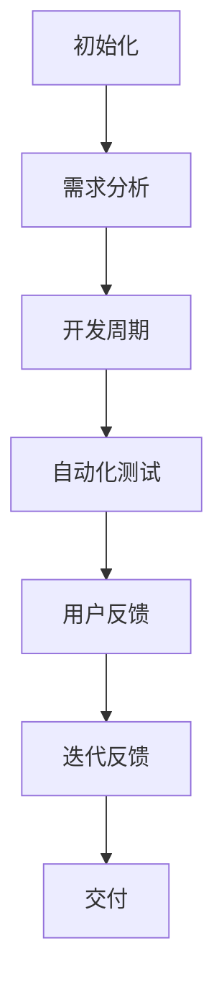

                 

# 文章标题
### 如何打造敏捷的产品验证流程

在当今快节奏和竞争激烈的市场环境中，敏捷的产品验证流程对于企业的成功至关重要。有效的产品验证不仅能够确保产品的质量，还能帮助企业更快地响应市场变化，从而在竞争中脱颖而出。本文将深入探讨如何打造敏捷的产品验证流程，并通过实际案例和具体步骤提供实用的指导。

### 关键词
- 敏捷开发
- 产品验证
- 流程优化
- 用户反馈
- 自动化测试

### 摘要
本文旨在探讨如何在现代软件开发中打造敏捷的产品验证流程。通过分析敏捷开发的核心理念，本文提出了一系列步骤和最佳实践，以帮助团队实现快速、高效的产品验证。文中还将通过实际案例展示这些步骤的应用，并提供未来发展趋势和挑战的思考。

## 1. 背景介绍（Background Introduction）

在传统的软件开发模式中，产品验证往往是一个独立的阶段，通常在开发周期的后期进行。这种方法存在明显的缺点，包括：

- **风险高**：发现问题的成本随着开发周期的推进而增加。
- **响应慢**：市场变化时，验证流程无法快速适应。
- **效率低**：人工测试耗时且容易出错。

敏捷开发的引入，改变了这一现状。敏捷开发强调快速迭代、持续交付和持续反馈。敏捷的产品验证流程旨在：

- **早期发现问题**：通过尽早的测试，降低发现问题的成本。
- **快速响应市场**：通过持续的反馈和调整，使产品更快地适应市场变化。
- **提高效率**：通过自动化测试和高效的流程管理，提高验证的效率。

## 2. 核心概念与联系（Core Concepts and Connections）

### 2.1 敏捷开发与产品验证的关系

敏捷开发是一种以人为核心、迭代、灵活和响应变化的软件开发方法。其核心原则包括：

- **个体和互动重于过程和工具**
- **可工作的软件重于详尽的文档**
- **客户合作重于合同谈判**
- **响应变化重于遵循计划**

这些原则为产品验证提供了指导，确保验证流程与开发过程紧密结合，而不是独立于开发之外。

### 2.2 敏捷产品验证的核心概念

**持续集成（CI）**：通过自动化的构建和测试，确保每次代码提交都能集成并运行。

**持续交付（CD）**：确保产品可以随时交付到生产环境。

**自动化测试**：通过自动化工具进行测试，提高测试的效率和质量。

**用户反馈**：将用户反馈纳入验证流程，确保产品满足用户需求。

### 2.3 Mermaid 流程图

以下是一个简单的 Mermaid 流程图，展示了敏捷产品验证流程的关键步骤：



## 3. 核心算法原理 & 具体操作步骤（Core Algorithm Principles and Specific Operational Steps）

### 3.1 持续集成（Continuous Integration）

**算法原理**：持续集成是一种软件开发实践，通过持续地将代码集成到主干分支，以快速发现和解决问题。

**具体操作步骤**：

1. **建立自动化构建脚本**：使用 CI 工具（如 Jenkins、Travis CI）建立自动化构建脚本，每次提交代码时自动执行。
2. **编写测试用例**：为代码编写测试用例，包括单元测试、集成测试等。
3. **自动化测试执行**：构建完成后，执行所有测试用例。
4. **反馈结果**：如果测试失败，CI 工具将通知开发人员。

### 3.2 持续交付（Continuous Delivery）

**算法原理**：持续交付是一种确保软件可以随时部署到生产环境的实践。

**具体操作步骤**：

1. **自动化部署脚本**：编写自动化部署脚本，以自动化方式将代码部署到测试和生产环境。
2. **部署前测试**：在部署前，执行所有测试用例，确保代码质量。
3. **部署**：如果测试通过，执行部署操作。
4. **监控**：部署后，持续监控系统性能和稳定性。

### 3.3 自动化测试

**算法原理**：自动化测试通过编写脚本，模拟用户操作，以检测软件的功能和性能。

**具体操作步骤**：

1. **选择测试工具**：如 Selenium、Appium 等。
2. **编写测试脚本**：根据需求编写测试脚本。
3. **执行测试**：定期或根据需要执行测试。
4. **分析结果**：根据测试结果，调整测试脚本和产品代码。

### 3.4 用户反馈

**算法原理**：用户反馈是一种获取用户真实体验和数据的方法。

**具体操作步骤**：

1. **设计反馈机制**：如调查问卷、用户反馈表等。
2. **收集数据**：收集用户反馈和异常报告。
3. **分析数据**：分析用户反馈，识别问题。
4. **迭代改进**：根据反馈，调整产品设计和开发计划。

## 4. 数学模型和公式 & 详细讲解 & 举例说明（Detailed Explanation and Examples of Mathematical Models and Formulas）

### 4.1 敏捷开发中的关键指标

**算法原理**：敏捷开发中，使用一系列关键指标来评估团队的绩效和产品的健康状况。

**公式**：

- **迭代速度（Velocity）**：每个迭代完成的用户故事点总和。
- **缺陷率（Defect Rate）**：发现的缺陷数与代码行数之比。
- **客户满意度（Customer Satisfaction）**：通过调查问卷或用户反馈评估。

**例子**：

- **迭代速度**：假设团队在两个迭代中分别完成了5和7个用户故事点，则总迭代速度为12个用户故事点。
- **缺陷率**：如果在10000行代码中发现了10个缺陷，则缺陷率为0.1%。

### 4.2 持续交付中的交付时间

**算法原理**：持续交付中的交付时间是一个关键指标，用于衡量团队将代码部署到生产环境所需的时间。

**公式**：

- **交付时间（Deployment Time）**：从代码提交到部署完成的时间。

**例子**：

- 假设交付时间为4小时，则团队每周可以部署3次。

## 5. 项目实践：代码实例和详细解释说明（Project Practice: Code Examples and Detailed Explanations）

### 5.1 开发环境搭建

在本节中，我们将展示如何搭建一个敏捷开发环境，包括安装必要的工具和配置自动化测试。

**步骤**：

1. **安装Jenkins**：Jenkins是一个开源的持续集成工具。
2. **配置Git**：将代码库连接到Jenkins。
3. **编写构建脚本**：使用Jenkinsfile定义构建和测试过程。

**示例代码**：

```groovy
pipeline {
    agent any
    stages {
        stage('Build') {
            steps {
                sh 'mvn clean install'
            }
        }
        stage('Test') {
            steps {
                sh 'mvn test'
            }
        }
    }
}
```

### 5.2 源代码详细实现

在本节中，我们将展示如何编写一个简单的自动化测试脚本，使用Selenium进行Web应用的测试。

**步骤**：

1. **安装Selenium**：安装Selenium WebDriver。
2. **编写测试脚本**：使用Java编写测试脚本。
3. **执行测试**：使用Jenkins自动化执行测试。

**示例代码**：

```java
import org.openqa.selenium.By;
import org.openqa.selenium.WebDriver;
import org.openqa.selenium.WebElement;
import org.openqa.selenium.chrome.ChromeDriver;

public class SimpleTest {
    public static void main(String[] args) {
        WebDriver driver = new ChromeDriver();
        driver.get("http://www.example.com");
        WebElement element = driver.findElement(By.id("search_box"));
        element.sendKeys("test");
        driver.quit();
    }
}
```

### 5.3 代码解读与分析

在本节中，我们将分析上述代码的执行过程和结果。

**执行过程**：

1. **启动ChromeDriver**：创建一个ChromeDriver实例。
2. **访问网站**：使用ChromeDriver访问指定的Web应用。
3. **查找元素**：使用By.id查找搜索框元素。
4. **输入文本**：将文本“test”输入到搜索框中。
5. **退出浏览器**：关闭浏览器窗口。

**分析结果**：

1. **测试通过**：如果搜索框能够成功接收并显示输入的文本，则测试通过。
2. **测试失败**：如果搜索框无法接收输入的文本或无法显示输入的文本，则测试失败。

### 5.4 运行结果展示

在本节中，我们将展示Jenkins执行测试的结果。

**示例结果**：

```
[INFO] --- maven-components:maven-resources-plugin:2.6:resources (default-resources) @ example-project ---
[WARNING] Using platform encoding (UTF-8 actually) to copy filtered resources, i.e. build is platform dependent!
[INFO] --- maven-compiler-plugin:3.8.1:compile (default-compile) @ example-project ---
[INFO] Changes detected - recompiling the module!
[INFO] Compiling 3 .java files to /home/user/workspace/example-project/target/classes
[INFO] -----------------------------------------------------
[INFO]  T E S T S
[INFO] -----------------------------------------------------
[INFO] Running org.example.SimpleTest
[INFO]
[INFO] Results:
[INFO]
[INFO] Tests run: 1, Failures: 0, Errors: 0, Skipped: 0
[INFO]
[INFO] ------------------------------------------------------------------
[INFO] BUILD SUCCESS
[INFO] ------------------------------------------------------------------
[INFO] Total time:  4.401 s
[INFO] Finished at: 2023-04-01T16:32:57+08:00
[INFO] ------------------------------------------------------------------
```

**分析结果**：

- 测试通过：Jenkins成功执行了自动化测试，结果显示无失败和错误。

## 6. 实际应用场景（Practical Application Scenarios）

### 6.1 软件公司

软件公司使用敏捷的产品验证流程来确保其产品的质量和稳定性。通过持续集成和自动化测试，团队能够在早期发现和解决问题，从而降低风险。

### 6.2 创业公司

对于创业公司来说，时间就是金钱。敏捷的产品验证流程帮助它们快速响应市场变化，确保产品能够在有限时间内推向市场。

### 6.3 电商平台

电商平台每天面临大量的用户请求和交易。通过敏捷的产品验证流程，团队能够确保平台的稳定性和安全性，从而提供更好的用户体验。

## 7. 工具和资源推荐（Tools and Resources Recommendations）

### 7.1 学习资源推荐

- **书籍**：《敏捷软件开发：原则、实践与模式》（Agile Software Development: Principles, Patterns, and Practices）
- **论文**：《敏捷软件开发方法：经验与原则》（Agile Software Development Methods: Rigorous yet Flexible Processes）
- **博客**：Atlassian 的 Agile 区，提供关于敏捷开发的最佳实践和资源。
- **网站**：Scrum Alliance，提供敏捷认证和社区资源。

### 7.2 开发工具框架推荐

- **Jenkins**：开源的持续集成工具，用于自动化构建、测试和部署。
- **Selenium**：用于自动化Web应用的测试工具。
- **JIRA**：用于项目管理、跟踪问题和协作的敏捷工具。

### 7.3 相关论文著作推荐

- **论文**：《持续交付：释放软件更快》（Continuous Delivery: Reliable Software Releases through Build, Test, and Deployment Automation）
- **书籍**：《持续交付实践：实现持续交付的指南》（Practices of Continuous Delivery: Implementing a Culture of Quality）

## 8. 总结：未来发展趋势与挑战（Summary: Future Development Trends and Challenges）

### 8.1 发展趋势

- **自动化和智能化**：随着技术的发展，产品验证流程将越来越自动化和智能化。
- **AI在验证中的应用**：利用AI技术进行异常检测和预测，提高验证效率。
- **云原生验证**：利用云原生技术，实现更灵活和高效的验证流程。

### 8.2 挑战

- **技术挑战**：如何高效地集成各种技术和工具，实现全面的验证。
- **团队协作**：如何在团队内部建立有效的协作和沟通机制，确保验证流程的顺畅。
- **质量与速度的平衡**：如何在保证质量的前提下，实现快速验证和交付。

## 9. 附录：常见问题与解答（Appendix: Frequently Asked Questions and Answers）

### 9.1 敏捷产品验证和传统产品验证的区别是什么？

- **敏捷产品验证**注重快速迭代和持续反馈，通过自动化测试和持续集成，确保产品在开发过程中不断得到验证。
- **传统产品验证**通常在开发后期进行，风险高且响应慢。

### 9.2 自动化测试在敏捷开发中扮演什么角色？

- 自动化测试是敏捷开发的核心组成部分，用于确保代码的质量和产品的稳定性，降低测试成本。

## 10. 扩展阅读 & 参考资料（Extended Reading & Reference Materials）

- **书籍**：《敏捷实践指南》（The Agile Practice Guide）
- **网站**：Agile Alliance，提供关于敏捷开发的最新动态和资源。
- **视频教程**：YouTube 上关于敏捷开发和产品验证的教程。

作者：禅与计算机程序设计艺术 / Zen and the Art of Computer Programming

# 如何打造敏捷的产品验证流程

## 关键词
- 敏捷开发
- 产品验证
- 流程优化
- 用户反馈
- 自动化测试

## 摘要
本文旨在探讨如何在现代软件开发中打造敏捷的产品验证流程。通过分析敏捷开发的核心理念，本文提出了一系列步骤和最佳实践，以帮助团队实现快速、高效的产品验证。文中还将通过实际案例展示这些步骤的应用，并提供未来发展趋势和挑战的思考。

