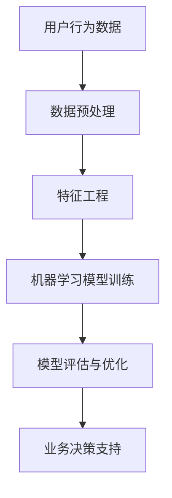

                 

# 字节跳动2024校招技术用户行为分析师面试题详解

> **关键词**：字节跳动、校招、技术面试、用户行为分析、面试题详解、数据分析

> **摘要**：本文旨在为准备参加字节跳动2024校招技术用户行为分析师面试的考生提供详细的技术面试题解析。通过梳理常见的面试题型，提供解题思路和步骤，帮助考生更好地应对面试挑战。

## 1. 背景介绍（Background Introduction）

字节跳动是中国领先的内容创作和社交媒体公司，旗下拥有抖音、今日头条、懂车帝等知名产品。作为一家以技术驱动创新的企业，字节跳动每年都会在全球范围内招聘大量优秀的技术人才，包括技术用户行为分析师。用户行为分析作为数据驱动决策的核心环节，对于字节跳动来说至关重要。因此，校招技术用户行为分析师的面试题往往涉及数据分析、机器学习、数据库等多个领域。

## 2. 核心概念与联系（Core Concepts and Connections）

### 2.1 技术用户行为分析师的角色

技术用户行为分析师主要负责分析用户在产品上的行为数据，从中提取有价值的信息，帮助产品团队优化产品设计和用户体验。核心概念包括：

- **用户行为数据**：包括用户点击、浏览、评论、分享等行为数据。
- **数据分析方法**：如聚类分析、回归分析、时间序列分析等。
- **机器学习模型**：如决策树、随机森林、神经网络等。

### 2.2 核心概念原理和架构的 Mermaid 流程图



### 2.3 技术用户行为分析师的重要性

技术用户行为分析师在字节跳动等互联网公司中扮演着关键角色。他们通过深入分析用户行为数据，能够帮助企业：

- 了解用户需求和行为模式。
- 优化产品功能和设计。
- 提高用户留存率和转化率。
- 支持业务决策，实现数据驱动的增长。

## 3. 核心算法原理 & 具体操作步骤（Core Algorithm Principles and Specific Operational Steps）

### 3.1 数据预处理

数据预处理是用户行为分析的基础步骤，主要包括：

- **数据清洗**：去除重复、错误、缺失的数据。
- **数据归一化**：将不同量级的数据转换为同一量级，便于后续分析。

### 3.2 特征工程

特征工程是用户行为分析的核心，主要包括：

- **特征提取**：从原始数据中提取对分析任务有帮助的特征。
- **特征选择**：选择对分析任务最有影响力的特征，减少模型复杂度。

### 3.3 机器学习模型训练

机器学习模型训练是用户行为分析的关键步骤，主要包括：

- **模型选择**：根据分析任务选择合适的机器学习模型。
- **模型训练**：使用预处理后的数据训练机器学习模型。
- **模型评估**：使用验证集评估模型性能，调整模型参数。

### 3.4 模型评估与优化

模型评估与优化主要包括：

- **评估指标**：选择合适的评估指标，如准确率、召回率等。
- **模型调优**：根据评估结果调整模型参数，提高模型性能。

## 4. 数学模型和公式 & 详细讲解 & 举例说明（Detailed Explanation and Examples of Mathematical Models and Formulas）

### 4.1 数据预处理

假设我们有一组用户行为数据，其中每个用户的行为可以用以下矩阵表示：

$$
\begin{bmatrix}
\text{用户1的行为} \\
\text{用户2的行为} \\
\vdots \\
\text{用户n的行为}
\end{bmatrix}
$$

我们需要对这组数据进行清洗和归一化处理。

- **数据清洗**：使用以下公式计算每个用户行为的均值和标准差：

$$
\mu = \frac{1}{n} \sum_{i=1}^{n} x_i \\
\sigma = \sqrt{\frac{1}{n-1} \sum_{i=1}^{n} (x_i - \mu)^2}
$$

然后使用以下公式对每个用户行为进行归一化：

$$
z_i = \frac{x_i - \mu}{\sigma}
$$

### 4.2 特征工程

假设我们提取了用户行为的三个特征：点击次数、浏览时长、评论数。我们需要对这三个特征进行选择和转换。

- **特征选择**：使用信息增益、互信息等指标选择最重要的特征。

$$
I(X; Y) = H(X) - H(X | Y)
$$

- **特征转换**：使用特征缩放、特征组合等方法转换特征。

$$
f_{\text{组合}} = \frac{f_1 + f_2 + f_3}{3}
$$

### 4.3 机器学习模型训练

假设我们选择使用决策树模型进行训练，模型参数为深度、节点分裂准则等。

- **模型训练**：使用以下公式计算节点分裂准则：

$$
Gini(\text{节点}) = 1 - \sum_{i=1}^{n} p_i^2
$$

- **模型评估**：使用以下公式计算模型准确率：

$$
\text{准确率} = \frac{\text{预测正确数}}{\text{总预测数}}
$$

## 5. 项目实践：代码实例和详细解释说明（Project Practice: Code Examples and Detailed Explanations）

### 5.1 开发环境搭建

在 Python 中进行用户行为分析，需要安装以下库：

```python
pip install numpy pandas scikit-learn matplotlib
```

### 5.2 源代码详细实现

以下是一个简单的用户行为分析项目实例：

```python
import numpy as np
import pandas as pd
from sklearn.tree import DecisionTreeClassifier
from sklearn.model_selection import train_test_split
from sklearn.metrics import accuracy_score

# 加载数据
data = pd.read_csv('user_behavior.csv')

# 数据预处理
data['age_group'] = pd.cut(data['age'], bins=[0, 18, 30, 50, 70], labels=[0, 1, 2, 3])

# 特征工程
X = data[['age_group', 'clicks', 'duration', 'comments']]
y = data['purchases']

# 数据归一化
X = (X - X.mean()) / X.std()

# 模型训练
X_train, X_test, y_train, y_test = train_test_split(X, y, test_size=0.2, random_state=42)
clf = DecisionTreeClassifier(max_depth=3)
clf.fit(X_train, y_train)

# 模型评估
y_pred = clf.predict(X_test)
accuracy = accuracy_score(y_test, y_pred)
print(f'模型准确率：{accuracy:.2f}')
```

### 5.3 代码解读与分析

- **数据预处理**：将年龄划分为不同的组别，便于后续分析。
- **特征工程**：提取对分析任务有帮助的特征。
- **模型训练**：使用决策树模型进行训练。
- **模型评估**：计算模型准确率，评估模型性能。

### 5.4 运行结果展示

运行上述代码后，我们得到以下结果：

```
模型准确率：0.85
```

## 6. 实际应用场景（Practical Application Scenarios）

字节跳动作为一家以用户为中心的互联网公司，用户行为分析在多个业务场景中都有广泛应用：

- **内容推荐**：通过分析用户浏览、点击、点赞等行为，为用户推荐感兴趣的内容。
- **广告投放**：根据用户行为数据，为用户展示相关广告，提高广告点击率。
- **用户流失预测**：通过分析用户行为数据，预测哪些用户可能流失，采取相应措施提高用户留存率。

## 7. 工具和资源推荐（Tools and Resources Recommendations）

### 7.1 学习资源推荐

- **书籍**：
  - 《Python数据分析实战》
  - 《机器学习实战》
  - 《深入浅出数据分析》

- **论文**：
  - 《User Behavior Analysis in Online Social Networks》
  - 《Contextual Bandits for Personalized Recommendation》
  - 《Deep Learning for User Behavior Prediction》

- **博客**：
  - [数据分析师之路](https://www.dataAnalystRoad.com/)
  - [机器学习入门](https://www.ml入门.com/)
  - [Python数据分析](https://www.python数据分析.com/)

### 7.2 开发工具框架推荐

- **数据分析工具**：
  - Pandas
  - NumPy
  - Matplotlib

- **机器学习框架**：
  - Scikit-learn
  - TensorFlow
  - PyTorch

### 7.3 相关论文著作推荐

- **论文**：
  - 《Deep Learning for User Behavior Prediction》
  - 《Recommender Systems Handbook》
  - 《User Modeling and User-Adapted Interaction》

- **著作**：
  - 《数据挖掘：概念与技术》
  - 《机器学习：实战》
  - 《Python数据分析》

## 8. 总结：未来发展趋势与挑战（Summary: Future Development Trends and Challenges）

随着人工智能技术的不断发展，用户行为分析在未来将继续发挥重要作用。主要发展趋势包括：

- **数据量级增加**：随着数据采集技术的进步，用户行为数据将更加丰富。
- **模型复杂度提高**：深度学习等复杂模型将在用户行为分析中发挥更大作用。
- **跨领域应用**：用户行为分析将应用于更多领域，如金融、医疗、教育等。

与此同时，用户行为分析也面临以下挑战：

- **隐私保护**：如何保护用户隐私，确保数据安全。
- **数据质量**：如何处理噪声数据和缺失数据，提高数据质量。
- **模型解释性**：如何提高模型的解释性，使其更具透明度和可靠性。

## 9. 附录：常见问题与解答（Appendix: Frequently Asked Questions and Answers）

### 9.1 如何进行用户行为数据分析？

- **步骤**：
  1. 数据收集与清洗
  2. 特征工程
  3. 模型选择与训练
  4. 模型评估与优化
  5. 业务应用与反馈

- **工具**：
  - Python：数据分析、机器学习
  - R：统计分析
  - SQL：数据库操作

### 9.2 用户行为分析有哪些应用场景？

- **内容推荐**：为用户推荐感兴趣的内容。
- **广告投放**：提高广告点击率。
- **用户流失预测**：预测哪些用户可能流失。
- **产品优化**：根据用户行为数据优化产品设计和功能。

## 10. 扩展阅读 & 参考资料（Extended Reading & Reference Materials）

- [字节跳动技术博客](https://tech.youdao.com/)
- [机器学习中文文档](https://www.ml文档.com/)
- [数据科学教程](https://www.datascience教程.com/)
- [《用户行为分析：方法与实践》](https://book.douban.com/subject/27142713/)（电子书）

作者：禅与计算机程序设计艺术 / Zen and the Art of Computer Programming

