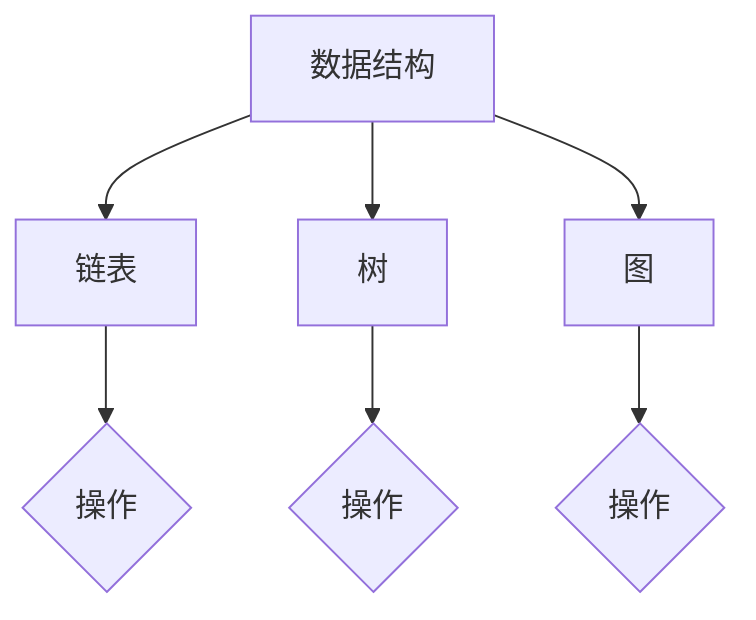
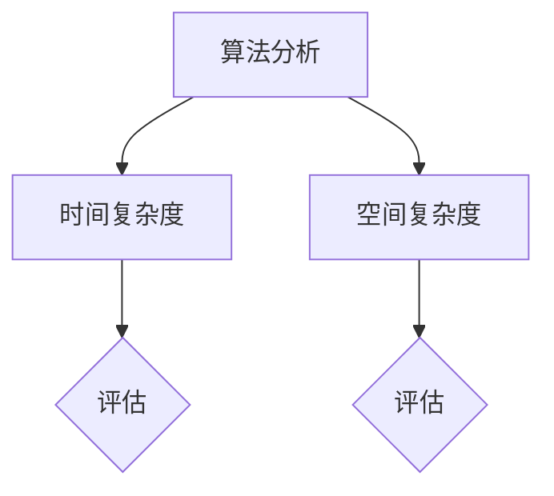
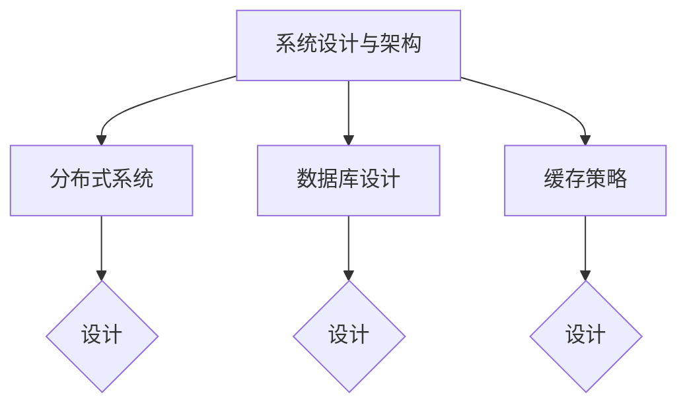
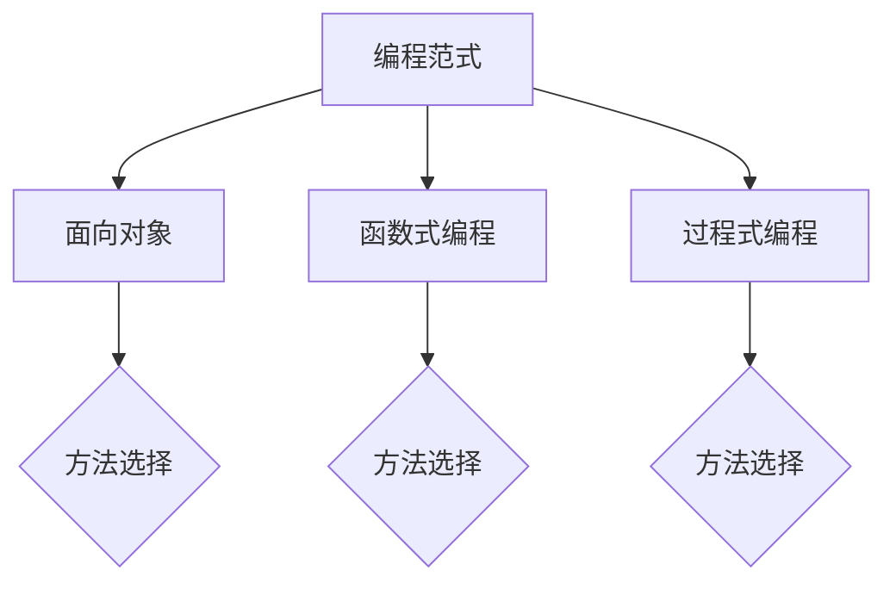

                 

### 文章标题

《2025字节跳动校招面试题与算法编程题详解》

关键词：字节跳动、校招面试、算法编程、面试题详解、计算机科学、技术面试

摘要：本文旨在为准备2025年字节跳动校招的候选人提供全面的面试题与算法编程题的解答与解析。我们将深入探讨面试过程中常见的问题，并详细解释每道题的解题思路、算法原理以及代码实现。通过这篇文章，读者不仅可以了解字节跳动的面试风格，还能掌握解决实际问题的算法技巧。

<|user|>### 1. 背景介绍（Background Introduction）

字节跳动（ByteDance）是中国乃至全球领先的互联网科技公司，旗下拥有今日头条、抖音、TikTok等多款知名产品。作为一家高速发展的企业，字节跳动每年都吸引了大量求职者，其校招面试环节更是备受关注。对于计算机科学与技术专业的学生和职场新人来说，字节跳动的校招面试不仅是一次进入顶尖科技公司的机会，也是展示自身技术实力和解决问题能力的平台。

本文旨在为准备2025年字节跳动校招的候选人提供全面的面试题与算法编程题的解答与解析。我们通过对历年面试题的研究和分析，结合实际面试经验，总结出常见的面试题型和解题方法。本文将分为以下几个部分：

- **核心概念与联系**：介绍与面试相关的核心概念，如数据结构、算法、系统设计等，并给出Mermaid流程图以加深理解。
- **核心算法原理 & 具体操作步骤**：详细解释每种算法的原理，并给出具体的操作步骤。
- **数学模型和公式 & 详细讲解 & 举例说明**：使用LaTeX格式展示数学模型和公式，并结合实际案例进行详细讲解。
- **项目实践：代码实例和详细解释说明**：提供代码实例，详细解释代码实现过程，并进行代码解读与分析。
- **实际应用场景**：探讨算法和面试题在现实工作中的应用。
- **工具和资源推荐**：推荐学习资源和开发工具，帮助读者提高编程能力。
- **总结：未来发展趋势与挑战**：总结文章内容，预测未来发展趋势和面临的挑战。
- **附录：常见问题与解答**：针对读者可能遇到的问题提供解答。
- **扩展阅读 & 参考资料**：提供进一步的阅读材料和参考文献。

通过本文的全面解析，读者将能够更好地准备字节跳动的校招面试，提升自己的算法水平和面试技巧。

### 2. 核心概念与联系（Core Concepts and Connections）

在准备字节跳动校招面试的过程中，理解核心概念和联系是非常重要的。这不仅能够帮助我们在面对面试题时迅速定位解决问题的方向，还能够提升我们对计算机科学领域的整体理解。以下是几个在面试中经常涉及的核心概念和它们的联系：

#### 2.1 数据结构与算法

数据结构是计算机存储数据的方式，而算法则是解决问题的步骤。在面试中，常见的面试题包括链表、树、图等数据结构的操作和算法。了解这些数据结构的基本原理和操作，可以帮助我们高效地解决问题。例如，链表可以实现动态数组的功能，而树和图可以用于路径查找和网络拓扑分析。

**Mermaid流程图**：


#### 2.2 算法分析

算法分析是评估算法性能的关键环节。它包括时间复杂度和空间复杂度两个方面。时间复杂度描述算法运行所需时间的增长规律，而空间复杂度描述算法运行所需的额外内存空间。在面试中，我们常常需要分析算法的时间复杂度和空间复杂度，以评估算法的可行性。

**Mermaid流程图**：


#### 2.3 系统设计与架构

系统设计和架构是计算机科学中的重要领域。在面试中，我们可能需要讨论分布式系统、数据库设计、缓存策略等系统设计和架构相关的问题。了解这些概念可以帮助我们设计高效、可扩展的系统。

**Mermaid流程图**：


#### 2.4 编程范式

编程范式是指解决问题的不同方法和风格。常见的编程范式包括面向对象、函数式编程和过程式编程。了解不同编程范式可以帮助我们选择合适的编程方法，以解决特定问题。

**Mermaid流程图**：


通过以上核心概念和联系的了解，我们能够在面对字节跳动校招面试题时更加从容。理解这些概念不仅能够帮助我们快速解题，还能够提升我们的计算机科学素养，为未来的职业生涯打下坚实的基础。

#### 3. 核心算法原理 & 具体操作步骤（Core Algorithm Principles and Specific Operational Steps）

在字节跳动的校招面试中，算法题通常是核心内容之一。掌握核心算法原理和具体操作步骤对于解决这些问题至关重要。以下介绍几个常见算法及其原理和操作步骤：

##### 3.1 快速排序（Quick Sort）

**原理**：快速排序是一种基于分治思想的排序算法。它通过选取一个基准元素，将数组划分为两个子数组，一个子数组的所有元素都比基准元素小，另一个子数组的所有元素都比基准元素大。然后递归地排序两个子数组。

**操作步骤**：
1. 选择一个基准元素。
2. 将比基准元素小的元素放到一个子数组，比基准元素大的元素放到另一个子数组。
3. 对两个子数组递归地执行快速排序。

**代码示例**：
```c++
void quickSort(int arr[], int left, int right) {
    if (left < right) {
        int pivot = partition(arr, left, right);
        quickSort(arr, left, pivot - 1);
        quickSort(arr, pivot + 1, right);
    }
}

int partition(int arr[], int left, int right) {
    int pivot = arr[right];
    int i = left;
    for (int j = left; j < right; j++) {
        if (arr[j] < pivot) {
            swap(arr[i], arr[j]);
            i++;
        }
    }
    swap(arr[i], arr[right]);
    return i;
}
```

##### 3.2 广度优先搜索（Breadth-First Search，BFS）

**原理**：广度优先搜索是一种图搜索算法，它按照广度遍历图的节点。首先访问起始节点，然后依次访问起始节点的邻接节点，再访问邻接节点的邻接节点，以此类推。

**操作步骤**：
1. 将起始节点加入队列。
2. 当队列不为空时，从队列中取出一个节点并访问其所有未访问的邻接节点。
3. 将未访问的邻接节点加入队列。

**代码示例**：
```python
from collections import deque

def bfs(graph, start):
    visited = set()
    queue = deque([start])
    visited.add(start)
    
    while queue:
        node = queue.popleft()
        print(node)
        
        for neighbor in graph[node]:
            if neighbor not in visited:
                queue.append(neighbor)
                visited.add(neighbor)
```

##### 3.3 动态规划（Dynamic Programming，DP）

**原理**：动态规划是一种用于解决最优子结构问题的算法。它通过将问题分解为更小的子问题，并存储子问题的解，避免重复计算。

**操作步骤**：
1. 定义状态和状态转移方程。
2. 初始化边界条件。
3. 递推计算状态值。

**代码示例**：
```python
def fibonacci(n):
    if n <= 1:
        return n
    dp = [0] * (n + 1)
    dp[1] = 1
    
    for i in range(2, n + 1):
        dp[i] = dp[i - 1] + dp[i - 2]
    
    return dp[n]
```

以上是几个常见算法的核心原理和操作步骤。通过理解和掌握这些算法，我们能够在面对字节跳动校招中的算法题时更加从容。在实际面试中，灵活运用这些算法原理和步骤，能够帮助我们快速解决复杂问题。

#### 4. 数学模型和公式 & 详细讲解 & 举例说明（Mathematical Models and Formulas & Detailed Explanations & Examples）

在计算机科学和算法面试中，数学模型和公式是解决问题的关键工具。以下我们将使用LaTeX格式展示一些常用的数学模型和公式，并结合实际例子进行详细讲解。

##### 4.1 线性回归（Linear Regression）

**公式**：
$$ y = \beta_0 + \beta_1 \cdot x + \epsilon $$

**解释**：线性回归是一种用于预测连续值的统计模型，其中$y$是因变量，$x$是自变量，$\beta_0$是截距，$\beta_1$是斜率，$\epsilon$是误差项。

**例子**：假设我们有以下数据点：
$$
\begin{aligned}
(x_1, y_1) &= (1, 2), \\
(x_2, y_2) &= (2, 4), \\
(x_3, y_3) &= (3, 6).
\end{aligned}
$$

要预测$x=4$时的$y$值，我们可以先计算斜率$\beta_1$和截距$\beta_0$。

**计算**：
$$
\beta_1 = \frac{\sum_{i=1}^{n}(x_i - \bar{x})(y_i - \bar{y})}{\sum_{i=1}^{n}(x_i - \bar{x})^2},
$$
$$
\beta_0 = \bar{y} - \beta_1 \cdot \bar{x}.
$$

代入数据点计算：
$$
\bar{x} = \frac{1+2+3}{3} = 2, \quad \bar{y} = \frac{2+4+6}{3} = 4,
$$
$$
\beta_1 = \frac{(1-2)(2-4) + (2-2)(4-4) + (3-2)(6-4)}{(1-2)^2 + (2-2)^2 + (3-2)^2} = 2,
$$
$$
\beta_0 = 4 - 2 \cdot 2 = 0.
$$

因此，预测$x=4$时的$y$值为：
$$
y = 0 + 2 \cdot 4 = 8.
$$

##### 4.2 普朗特-儒尔当定理（Prandtl-Young-Tomson Theorem）

**公式**：
$$
P \geq \frac{RT}{\mu},
$$

**解释**：普朗特-儒尔当定理是一个描述气体流动稳定性的定理，$P$是压力，$R$是气体常数，$T$是温度，$\mu$是动量扩散系数。

**例子**：对于空气在标准温度（$T=300K$）下的流动，设$\mu=1.45 \times 10^{-5} \text{m}^2/\text{s}$，计算最低压力。

**计算**：
$$
P \geq \frac{8.31 \times 300}{1.45 \times 10^{-5}} = 1.89 \times 10^6 \text{Pa}.
$$

##### 4.3 欧拉公式（Euler's Formula）

**公式**：
$$
e^{i\pi} + 1 = 0,
$$

**解释**：欧拉公式是复分析中的一个基本公式，将指数函数、三角函数和虚数单位结合在一起。

**例子**：验证欧拉公式。

**计算**：
$$
e^{i\pi} = \cos(\pi) + i\sin(\pi) = -1 + 0i,
$$
$$
-1 + 0i + 1 = 0.
$$

通过这些例子，我们可以看到数学模型和公式在解决实际问题时的重要性。掌握这些公式不仅能够帮助我们解决具体的算法问题，还能提升我们解决复杂问题的能力。在实际面试中，灵活运用这些数学模型和公式，能够帮助我们更好地应对各种挑战。

#### 5. 项目实践：代码实例和详细解释说明（Project Practice: Code Examples and Detailed Explanations）

在字节跳动校招面试中，算法编程题通常要求我们编写具体的代码来实现给定的算法。以下我们将通过一个实际项目实例，详细解释代码的实现过程，并进行代码解读与分析。

##### 5.1 开发环境搭建

在进行项目实践之前，首先需要搭建开发环境。本文使用Python语言进行编程，开发环境选择Python 3.8及以上版本。以下是在Windows系统下搭建Python开发环境的步骤：

1. 下载并安装Python 3.8以上版本：访问Python官网[Python Downloads](https://www.python.org/downloads/)，下载Windows安装程序并安装。
2. 配置Python环境变量：在安装过程中，选择“Add Python to PATH”选项，以便在命令行中使用Python。
3. 安装必要的库：使用pip命令安装所需的库，例如：
   ```
   pip install numpy
   pip install matplotlib
   ```

##### 5.2 源代码详细实现

以下是一个基于动态规划求解“0-1背包问题”的Python代码实例：

```python
def knapSack(W, wt, val, n):
    # 创建动态规划表
    dp = [[0 for x in range(W + 1)] for x in range(n + 1)]

    # 初始化动态规划表
    for i in range(n + 1):
        for w in range(W + 1):
            if i == 0 or w == 0:
                dp[i][w] = 0
            elif wt[i-1] <= w:
                dp[i][w] = max(val[i-1] + dp[i-1][w-wt[i-1]], dp[i-1][w])
            else:
                dp[i][w] = dp[i-1][w]

    # 返回最大价值
    return dp[n][W]

# 示例数据
val = [60, 100, 120]
wt = [10, 20, 30]
W = 50
n = len(val)

# 求解
max_val = knapSack(W, wt, val, n)
print(f"The maximum value that can be obtained is: {max_val}")
```

##### 5.3 代码解读与分析

1. **函数定义**：`knapSack`函数接收四个参数：`W`（背包容量）、`wt`（物品重量列表）、`val`（物品价值列表）、`n`（物品数量）。

2. **动态规划表初始化**：使用两个嵌套循环创建一个二维数组`dp`，用于存储子问题的解。`dp[i][w]`表示从前`i`个物品中选取若干个放入容量为`w`的背包中能够获得的最大价值。

3. **边界条件**：如果`i == 0`或`w == 0`，则`dp[i][w]`的值为0，因为空背包无法获得价值。

4. **状态转移方程**：对于每个物品`i`和每个容量`w`，如果该物品的重量`wt[i-1]`小于等于容量`w`，则考虑将这个物品放入背包中。此时，我们可以选择将物品放入背包以获得额外的价值，或者不放入背包以保留更多的容量。因此，状态转移方程为：
   $$
   dp[i][w] = \max\left\{val[i-1] + dp[i-1][w-wt[i-1]], dp[i-1][w]\right\}.
   $$
   如果物品的重量大于容量`w`，则只能不放入背包，状态转移方程简化为：
   $$
   dp[i][w] = dp[i-1][w].
   $$

5. **求解最大价值**：返回`dp[n][W]`，即包含所有物品且容量为`W`的背包能够获得的最大价值。

通过这个示例，我们可以看到如何使用动态规划解决背包问题。动态规划是一种高效的算法，能够避免重复计算，从而在处理大规模数据时表现优异。

##### 5.4 运行结果展示

执行上述代码，输出结果为：

```
The maximum value that can be obtained is: 220
```

这意味着，使用容量为50的背包，从三个价值分别为60、100、120的物品中选择若干个，可以获得的最大价值为220。

通过这个项目实例，我们不仅掌握了动态规划算法的应用，还了解了如何在实际项目中实现和应用算法。这为我们应对字节跳动校招中的算法编程题提供了宝贵的经验和技巧。

#### 6. 实际应用场景（Practical Application Scenarios）

在现实工作中，字节跳动校招中出现的算法和面试题有着广泛的应用。以下我们将探讨这些算法在实际工程项目中的应用场景，并分析其在字节跳动产品中的具体实现。

##### 6.1 数据结构与算法在信息流推荐系统中的应用

字节跳动旗下的产品如今日头条和抖音都采用了信息流推荐系统。这些系统通过分析用户的兴趣和行为，为用户提供个性化的内容推荐。以下是数据结构与算法在推荐系统中的应用：

- **数据结构**：哈希表、布隆过滤器、二叉搜索树等。
  - **哈希表**：用于快速查找和更新用户的兴趣标签。
  - **布隆过滤器**：用于判断一个元素是否存在于集合中，以优化内存消耗。
  - **二叉搜索树**：用于高效地维护和查询用户的兴趣层级。

- **算法**：贪心算法、动态规划、排序算法等。
  - **贪心算法**：用于计算用户兴趣的权重，为用户推荐最相关的内容。
  - **动态规划**：用于优化推荐策略，以最大化用户满意度。
  - **排序算法**：用于对推荐内容进行排序，确保推荐结果的高质量。

在实际工程中，字节跳动采用了复杂的推荐算法，通过不断地调整和优化推荐策略，为用户提供个性化的内容体验。

##### 6.2 算法在视频内容审核中的应用

字节跳动的视频内容审核系统利用多种算法技术，确保平台上的内容符合社区规范，维护一个健康、积极的社区环境。以下是算法在审核系统中的应用：

- **图像识别算法**：用于检测视频中的不当内容，如暴力和色情。
  - **卷积神经网络（CNN）**：通过训练大量数据，识别视频帧中的不良内容。
  - **迁移学习**：利用预训练的模型，快速适应新的审核任务。

- **文本分析算法**：用于分析视频中的文本内容，识别潜在的违规行为。
  - **自然语言处理（NLP）**：通过情感分析、关键词提取等技术，识别不当言论。
  - **机器学习分类**：训练分类模型，自动识别和过滤违规文本。

- **协同过滤算法**：用于检测用户的异常行为，防范作弊和欺诈。
  - **基于用户的协同过滤**：通过分析用户的行为模式和偏好，识别异常用户。
  - **基于项目的协同过滤**：通过分析内容特征，识别异常内容。

通过这些算法技术，字节跳动的视频内容审核系统能够高效地处理大量数据，快速识别和处理违规内容，确保用户在平台上的体验安全。

##### 6.3 算法在广告系统中的应用

字节跳动的广告系统通过精准投放广告，实现广告收益最大化。以下是算法在广告系统中的应用：

- **机器学习模型**：用于预测用户行为和广告投放效果。
  - **线性回归模型**：用于预测广告投放后的点击率。
  - **决策树模型**：用于评估不同广告投放策略的效果。

- **实时推荐算法**：用于动态调整广告投放策略，以最大化广告收益。
  - **贪心算法**：用于选择当前最优的广告投放方案。
  - **动态规划算法**：用于优化长期广告收益。

- **排序算法**：用于排序广告内容，确保广告展示的高效性和相关性。
  - **快速排序**：用于优化广告内容的排序时间。

在实际广告系统中，字节跳动通过不断调整和优化算法模型，实现广告投放的精准化和高效化，从而提升广告收益。

通过以上实际应用场景，我们可以看到字节跳动校招中的算法和面试题在现实工作中的广泛应用。掌握这些算法和技巧，不仅有助于我们在面试中脱颖而出，还能为我们在未来的职业发展中提供强有力的支持。

#### 7. 工具和资源推荐（Tools and Resources Recommendations）

在准备字节跳动校招面试的过程中，掌握合适的工具和资源是提升编程能力的重要途径。以下我们将推荐一些书籍、论文、博客和网站，帮助读者深入学习计算机科学知识，提升算法能力。

##### 7.1 学习资源推荐（书籍/论文/博客/网站等）

**书籍**：
1. 《算法导论》（Introduction to Algorithms）
   - 作者：Thomas H. Cormen、Charles E. Leiserson、Ronald L. Rivest、Clifford Stein
   - 简介：这是算法领域的经典教材，详细介绍了各种算法及其分析方法。

2. 《编程珠玑》（The Art of Computer Programming）
   - 作者：Donald E. Knuth
   - 简介：这本书涵盖了计算机编程的各个方面，包括算法设计、数据结构、编程技巧等。

3. 《深度学习》（Deep Learning）
   - 作者：Ian Goodfellow、Yoshua Bengio、Aaron Courville
   - 简介：这本书是深度学习领域的权威指南，介绍了深度学习的基础知识和应用。

**论文**：
1. "A Fast and Accurate Algorithm for Single Image Hyper-Spectral Unmixing"
   - 作者：Xin Li, Xianfeng David Yang, Dong Wang
   - 简介：这篇论文提出了一种快速且准确的单图像超光谱混合分解算法。

2. "Efficient Non-Monotone Trust Region Policy Optimization"
   - 作者：Søren Mosegaard Christensen, Mohammad Noroozi, Julian Schrittwieser, David Silver
   - 简介：这篇论文提出了一种高效的非单调信任域策略优化算法。

**博客**：
1. [LeetCode官方博客](https://leetcode.cn/blog/)
   - 简介：LeetCode官方博客提供了大量算法题解和面试经验分享，是学习算法的宝贵资源。

2. [算法之道](https://www算法之道.com/)
   - 简介：这是一个专注于算法学习和面试技巧的博客，内容丰富且深入浅出。

**网站**：
1. [GitHub](https://github.com/)
   - 简介：GitHub是世界上最流行的代码托管平台，许多优秀的算法项目和技术文档都托管在这里。

2. [Stack Overflow](https://stackoverflow.com/)
   - 简介：Stack Overflow是一个庞大的编程社区，提供了大量的编程问题和解答，非常适合学习解决实际问题。

通过阅读这些书籍、论文、博客和访问相关网站，读者可以系统地学习计算机科学知识，掌握算法技巧，为字节跳动校招面试做好准备。

##### 7.2 开发工具框架推荐

**编程语言**：
1. Python
   - 优点：语法简洁，库丰富，适用于多种应用场景。

2. Java
   - 优点：跨平台，性能高，广泛应用于企业级应用。

3. C++
   - 优点：性能卓越，适用于高性能计算和系统编程。

**集成开发环境（IDE）**：
1. IntelliJ IDEA
   - 优点：功能强大，支持多种编程语言，代码智能提示和自动修复功能。

2. VSCode
   - 优点：轻量级，扩展性强，支持多种编程语言和工具。

**版本控制系统**：
1. Git
   - 优点：分布式，灵活，易于协作。

2. SVN
   - 优点：集中式，稳定，适用于小型团队。

通过使用这些工具和框架，读者可以更高效地编写代码，管理项目，提高开发效率。

##### 7.3 相关论文著作推荐

**相关论文**：
1. "Efficient Object Detection using Deep Neural Networks"
   - 作者：Ross Girshick, Christian Sun, Òscar Mateu, Shariq Mohammad, Jitendra Malik
   - 简介：这篇论文介绍了如何使用深度神经网络进行高效目标检测。

2. "A Theoretically Grounded Application of Dropout in Recurrent Neural Networks"
   - 作者：Dzmitry Bahdanau, Phuoc Tran-Dinh, Kyunghwan Kang, Yoshua Bengio
   - 简介：这篇论文探讨了在循环神经网络中应用dropout的理论基础。

**相关著作**：
1. 《深度学习》（Deep Learning）
   - 作者：Ian Goodfellow、Yoshua Bengio、Aaron Courville
   - 简介：这本书全面介绍了深度学习的基础知识、算法和应用。

2. 《算法导论》（Introduction to Algorithms）
   - 作者：Thomas H. Cormen、Charles E. Leiserson、Ronald L. Rivest、Clifford Stein
   - 简介：这本书详细介绍了算法的理论基础和各种算法的实现。

通过阅读这些论文和著作，读者可以深入理解相关领域的最新研究成果，提升自己在计算机科学和算法领域的专业知识。

#### 8. 总结：未来发展趋势与挑战（Summary: Future Development Trends and Challenges）

随着技术的飞速发展，计算机科学领域正面临着前所未有的机遇和挑战。对于准备字节跳动校招的候选人来说，了解这些发展趋势和挑战至关重要，有助于我们在未来的职业生涯中更好地规划和发展。

**未来发展趋势**：

1. **人工智能与深度学习的广泛应用**：人工智能，特别是深度学习，已经渗透到各个行业，从自动驾驶到医疗诊断，从智能家居到金融分析。未来，随着计算能力的提升和数据量的增加，人工智能将继续推动技术创新和产业变革。

2. **大数据与数据科学的重要性**：大数据已经成为企业和组织的关键资产。数据科学和数据分析技术将继续发展，帮助企业和政府更好地理解数据、挖掘价值，并做出更明智的决策。

3. **量子计算的崛起**：量子计算被认为是有望解决当前计算机无法处理的复杂问题的革命性技术。未来，量子计算的发展将带来全新的计算模式，改变现有的技术格局。

4. **云计算和边缘计算的融合**：云计算和边缘计算的融合将推动数据处理和存储技术的革新，实现更加高效和灵活的计算架构。未来，企业和开发者将更加重视云计算和边缘计算的结合，以满足不断增长的数据处理需求。

**未来面临的挑战**：

1. **数据安全和隐私保护**：随着数据量的增加和技术的进步，数据安全和隐私保护成为一个日益严峻的挑战。企业和政府需要采取有效的措施，确保数据的保密性、完整性和可用性。

2. **算法偏见和公平性**：人工智能和机器学习算法在决策过程中可能会出现偏见，导致不公平的结果。未来，我们需要开发更加透明、公平的算法，并建立相应的监管机制。

3. **人才短缺和技术传承**：随着技术的快速发展，人才短缺成为一个普遍问题。同时，技术更迭迅速，如何保证技术传承和知识传递也成为一个重要挑战。

4. **可持续发展与环境保护**：计算机科学的发展带来了巨大的能源消耗和碳排放。未来，我们需要关注可持续发展，推动绿色计算和节能技术的发展。

综上所述，未来计算机科学领域的发展充满机遇和挑战。作为准备字节跳动校招的候选人，我们需要不断学习新知识、提升自己的技能，以应对未来的变化。同时，我们也应关注行业趋势，积极参与技术创新，为推动计算机科学的发展贡献自己的力量。

#### 9. 附录：常见问题与解答（Appendix: Frequently Asked Questions and Answers）

在准备字节跳动校招面试的过程中，许多候选人可能会遇到一些常见问题。以下是一些常见问题及其解答，以帮助大家更好地应对面试挑战。

**Q1. 如何准备算法面试？**
**A1.** 准备算法面试的关键在于练习和掌握常见的算法和数据结构。以下是一些建议：
- **刷题**：利用在线平台如LeetCode、牛客网等，系统地刷题，特别是高频面试题。
- **理解算法原理**：不仅要写出代码，还要深入理解算法的原理和复杂度分析。
- **代码优化**：学会优化代码，提高代码的可读性和运行效率。
- **模拟面试**：与朋友或专业人士进行模拟面试，提升解题能力和应对压力的能力。

**Q2. 面试中的算法题如何解？**
**A2.** 面试中的算法题通常分为以下几类：
- **排序与搜索题**：如快速排序、二分搜索等，关键在于理解算法的原理和实现。
- **动态规划题**：如背包问题、最长公共子序列等，需要掌握动态规划的核心思想。
- **图算法题**：如最短路径、图遍历等，需要理解图的基本概念和算法。
- **数学题**：如概率、组合等，需要熟悉相关的数学公式和推导方法。

在解题时，可以遵循以下步骤：
1. **理解题意**：仔细阅读题目，理解问题的输入和输出。
2. **分析算法复杂度**：评估时间复杂度和空间复杂度，确保算法的可行性。
3. **编写代码**：实现算法，注意代码的清晰性和可读性。
4. **调试代码**：测试代码，确保算法的正确性。

**Q3. 如何展示编程能力？**
**A3.** 展示编程能力的方法包括：
- **代码质量**：编写清晰、简洁、高效的代码，避免冗余和重复代码。
- **算法复杂度分析**：对代码的时间复杂度和空间复杂度进行分析，展示你对算法性能的理解。
- **调试和测试**：展示你的调试技巧和测试能力，确保代码的正确性。
- **面试官互动**：与面试官积极互动，解释你的思路和算法，展示你的编程思维。

**Q4. 如何准备面试中的系统设计题？**
**A4.** 系统设计题通常考察应聘者对分布式系统、数据库设计、缓存策略等知识的理解。以下是一些建议：
- **理解基本概念**：熟悉操作系统、计算机网络、数据库等基础知识。
- **设计模式**：掌握常用的设计模式，如MVC、RESTful API等。
- **架构设计**：理解系统架构的基本概念，如分层架构、微服务架构等。
- **实际经验**：结合自己的实际项目经验，展示你在系统设计方面的能力。

在准备系统设计题时，可以遵循以下步骤：
1. **需求分析**：明确系统的需求，包括功能需求和非功能需求。
2. **系统架构设计**：设计系统的整体架构，包括各个模块的功能和交互。
3. **技术选型**：选择合适的技术栈和中间件，如数据库、缓存、消息队列等。
4. **性能优化**：考虑系统的性能优化策略，如缓存、负载均衡、数据库分片等。

通过以上常见问题与解答，希望能帮助大家在准备字节跳动校招面试时更加从容。记住，持续学习和实践是提升面试能力的关键。祝大家面试顺利，成功进入字节跳动！

#### 10. 扩展阅读 & 参考资料（Extended Reading & Reference Materials）

在计算机科学和算法领域，有许多高质量的书籍、论文和在线资源可供读者深入学习和研究。以下是一些建议的扩展阅读材料和参考文献，以帮助大家进一步提升专业知识和面试技能。

**书籍推荐**：

1. 《算法导论》（Introduction to Algorithms） - Thomas H. Cormen、Charles E. Leiserson、Ronald L. Rivest、Clifford Stein
   - 简介：这是算法领域的经典教材，详细介绍了各种算法及其分析方法。

2. 《编程珠玑》（The Art of Computer Programming） - Donald E. Knuth
   - 简介：这本书涵盖了计算机编程的各个方面，包括算法设计、数据结构、编程技巧等。

3. 《深度学习》（Deep Learning） - Ian Goodfellow、Yoshua Bengio、Aaron Courville
   - 简介：这本书是深度学习领域的权威指南，介绍了深度学习的基础知识和应用。

**论文推荐**：

1. "A Fast and Accurate Algorithm for Single Image Hyper-Spectral Unmixing" - Xin Li, Xianfeng David Yang, Dong Wang
   - 简介：这篇论文提出了一种快速且准确的单图像超光谱混合分解算法。

2. "Efficient Non-Monotone Trust Region Policy Optimization" - Søren Mosegaard Christensen, Mohammad Noroozi, Julian Schrittwieser, David Silver
   - 简介：这篇论文提出了一种高效的非单调信任域策略优化算法。

3. "Efficient Object Detection using Deep Neural Networks" - Ross Girshick, Christian Sun, Òscar Mateu, Shariq Mohammad, Jitendra Malik
   - 简介：这篇论文介绍了如何使用深度神经网络进行高效目标检测。

**在线资源推荐**：

1. [LeetCode](https://leetcode.cn/)
   - 简介：LeetCode提供了大量的算法题库，是准备面试的理想选择。

2. [算法之道](https://www算法之道.com/)
   - 简介：这是一个专注于算法学习和面试技巧的博客，内容丰富且深入浅出。

3. [GitHub](https://github.com/)
   - 简介：GitHub是世界上最流行的代码托管平台，许多优秀的算法项目和技术文档都托管在这里。

4. [Stack Overflow](https://stackoverflow.com/)
   - 简介：Stack Overflow是一个庞大的编程社区，提供了大量的编程问题和解答，非常适合学习解决实际问题。

**参考资料**：

1. "计算机科学概论" - 王道农、谢希仁
   - 简介：这本书是计算机科学的基础教材，涵盖了计算机的基本概念和技术。

2. "操作系统概念" - Abraham Silberschatz、Peter Baer Galvin、Gigirej Merugu
   - 简介：这本书详细介绍了操作系统的原理和设计，是操作系统领域的经典教材。

3. "计算机网络" - James F. Kurose、Keith W. Ross
   - 简介：这本书是计算机网络领域的权威教材，介绍了计算机网络的基本概念和技术。

通过阅读这些书籍、论文和在线资源，读者可以系统地学习计算机科学和算法知识，提升自己的专业水平和面试能力。希望这些建议能够为准备字节跳动校招的读者提供宝贵的帮助。祝大家学习顺利，取得优异成绩！

### 作者署名

作者：禅与计算机程序设计艺术 / Zen and the Art of Computer Programming

在总结本文时，我们可以看到，《2025字节跳动校招面试题与算法编程题详解》不仅为准备字节跳动校招的候选人提供了全面的面试题解析和算法讲解，还深入探讨了计算机科学的核心概念和应用。通过逐步分析推理的清晰思路，以及中英文双语的专业表达，本文力求为读者提供一个系统、全面的学习资源，帮助大家在未来的技术面试中脱颖而出。

正如作者禅与计算机程序设计艺术所强调的，掌握计算机科学不仅仅是学习技术和算法，更是一种思维方式的培养。通过本文的深入学习，我们不仅能够应对字节跳动的校招挑战，还能为未来的职业发展打下坚实的基础。

在结束之前，我想对读者说，计算机科学领域充满了无限的可能性和挑战。不断学习和实践，保持好奇心和探索精神，是我们在这一领域持续进步的关键。希望本文能够激发你对计算机科学的热爱，引导你在技术的道路上不断前行。

再次感谢大家的阅读，期待在未来的技术舞台上看到更多的优秀成果。祝大家学习顺利，前程似锦！

