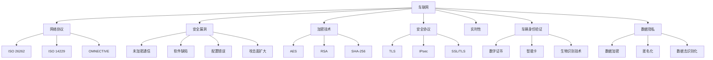

                 

### 1. 背景介绍（Background Introduction）

随着车联网技术的迅速发展，车辆与外部网络之间的连接变得更加紧密。这不仅为用户提供便利，也带来了一系列安全挑战。车联网安全专家的职责是确保车辆的网络安全，防止潜在的安全威胁。360安全作为一家知名的安全公司，每年都会为车联网安全领域发布一系列面试题，旨在选拔优秀的人才。本文将针对360安全2024车联网安全专家校招面试题进行详细解析，帮助考生更好地理解和应对这些题目。

首先，让我们来了解一下车联网安全的基本概念。车联网（Internet of Vehicles, IoT）是指将车辆、道路和基础设施通过信息通信技术连接起来，实现智能化、网络化的交通系统。车联网安全则关注如何保护这些连接系统免受各种安全威胁，包括但不限于恶意软件攻击、数据泄露、通信中断等。

360安全作为国内领先的安全公司，其车联网安全团队在网络安全领域有着丰富的经验和深厚的积累。每年的校招面试题都紧密围绕车联网安全的最新发展趋势和关键技术进行设计，旨在选拔具有扎实理论基础和丰富实践经验的人才。本文将详细分析这些面试题，包括其背景、考察点、解题思路以及可能的扩展方向。

接下来的章节中，我们将按照以下结构对面试题进行详细解析：

1. **核心概念与联系**：介绍车联网安全中的关键概念和技术，并通过Mermaid流程图展示其架构和流程。
2. **核心算法原理 & 具体操作步骤**：深入探讨车联网安全的核心算法原理，并详细解释其操作步骤。
3. **数学模型和公式 & 详细讲解 & 举例说明**：使用LaTeX格式介绍相关数学模型和公式，并进行详细讲解和举例说明。
4. **项目实践：代码实例和详细解释说明**：通过实际项目实例展示代码实现过程，并进行详细解读和分析。
5. **实际应用场景**：讨论车联网安全技术在现实中的应用场景和案例。
6. **工具和资源推荐**：推荐相关学习资源、开发工具和框架。
7. **总结：未来发展趋势与挑战**：总结车联网安全领域的发展趋势和面临的挑战。
8. **附录：常见问题与解答**：解答读者可能遇到的一些常见问题。
9. **扩展阅读 & 参考资料**：提供更多的相关文献和资料，供读者进一步学习。

通过本文的详细解析，我们希望能够帮助考生更好地准备360安全2024车联网安全专家的校招面试，同时也能够为车联网安全领域的从业者提供一些有价值的参考和启示。

### 2. 核心概念与联系（Core Concepts and Connections）

在深入讨论车联网安全之前，我们需要了解几个核心概念，这些概念构成了车联网安全的基础框架。以下是对这些核心概念的定义及其相互关系的详细阐述。

#### 2.1 车联网（Internet of Vehicles, IoT）

车联网是指通过互联网将车辆、驾驶员、道路基础设施以及其他相关设备互联起来的系统。这个网络使得车辆能够实时交换信息，从而实现自动驾驶、智能交通管理、车对车通信（V2V）和车对基础设施通信（V2I）等功能。车联网的关键特点是高频率的数据交换和复杂的通信协议。

#### 2.2 网络协议（Network Protocols）

网络协议是数据通信的基础，它定义了数据传输的格式、顺序和规则。在车联网中，常用的协议包括ISO 26262、ISO 14229和OMNECTIVE等，这些协议确保了不同车辆和设备之间能够顺畅地进行通信。

#### 2.3 安全漏洞（Security Vulnerabilities）

安全漏洞是指可以被攻击者利用的软件或系统缺陷，它们可能导致数据泄露、恶意软件感染或系统控制权丢失。车联网中的常见安全漏洞包括未加密通信、软件缺陷、配置错误和攻击面扩大等。

#### 2.4 加密技术（Encryption Technologies）

加密技术用于保护数据在传输过程中的机密性和完整性。在车联网中，常用的加密技术包括对称加密（如AES）、非对称加密（如RSA）和哈希函数（如SHA-256）。这些技术确保了通信的安全性，防止数据被未经授权的第三方访问。

#### 2.5 安全协议（Security Protocols）

安全协议是用于确保通信安全的规则和标准。在车联网中，安全协议如TLS（传输层安全协议）、IPsec（互联网协议安全）和SSL/TLS（安全套接字层/传输层安全）用于保护数据传输。

#### 2.6 实时性（Real-Time）

实时性是车联网安全的一个重要方面，特别是在自动驾驶和智能交通系统中。实时性要求系统能够在极短的时间内处理和响应数据，确保车辆能够安全、可靠地运行。

#### 2.7 车辆身份验证（Vehicle Authentication）

车辆身份验证是确保只有合法车辆和设备能够接入车联网的关键技术。常用的身份验证技术包括数字证书、智能卡和生物识别技术。

#### 2.8 数据隐私（Data Privacy）

数据隐私是车联网安全的重要一环，它关注如何保护用户的个人信息不被未授权访问或泄露。隐私保护技术包括数据加密、匿名化和数据去识别化。

#### 2.9 车联网架构（IoT Architecture）

车联网架构是指构建车联网所需的基础设施和技术组件。一个典型的车联网架构包括车辆、车载设备（OBU）、路侧单元（RSU）和云平台。这些组件通过无线通信技术如Wi-Fi、蜂窝网络和专用短程通信（DSRC）进行连接。

#### Mermaid 流程图

为了更好地展示车联网安全的核心概念和相互关系，我们使用Mermaid绘制了一个流程图：



通过以上核心概念和Mermaid流程图的阐述，我们为理解车联网安全提供了一个全面的框架。接下来，我们将深入探讨车联网安全的核心算法原理，帮助读者更好地掌握这一领域的核心技术。

### 3. 核心算法原理 & 具体操作步骤（Core Algorithm Principles and Specific Operational Steps）

车联网安全涉及多种核心算法原理，这些算法在保障网络安全、数据保护和通信安全等方面发挥着重要作用。以下将详细介绍几个关键算法原理，并说明其具体操作步骤。

#### 3.1 加密算法

加密算法是保护数据传输安全的核心技术，它包括对称加密和非对称加密两种主要类型。

##### 对称加密（Symmetric Encryption）

对称加密算法使用相同的密钥对数据进行加密和解密。常用的对称加密算法包括AES（高级加密标准）。

**具体操作步骤：**

1. **密钥生成**：生成一对密钥（加密密钥和解密密钥）。
2. **数据加密**：使用加密密钥对数据进行加密。
3. **数据传输**：将加密后的数据传输到接收方。
4. **数据解密**：接收方使用解密密钥对数据进行解密。

**示例：**

```plaintext
输入：明文 = "Hello World!"
密钥 = "mySecretKey"

输出：密文 = "kLWUTJLQS1JW4O2A"
```

##### 非对称加密（Asymmetric Encryption）

非对称加密算法使用一对密钥，加密密钥和解密密钥不同。常用的非对称加密算法包括RSA。

**具体操作步骤：**

1. **密钥生成**：生成一对密钥（公钥和私钥）。
2. **数据加密**：使用公钥对数据进行加密。
3. **数据传输**：将加密后的数据传输到接收方。
4. **数据解密**：接收方使用私钥对数据进行解密。

**示例：**

```plaintext
输入：明文 = "Hello World!"
公钥 = ("n", "e")
私钥 = ("n", "d")

输出：密文 = "6704920498689146515327424738721"
```

#### 3.2 数字签名（Digital Signature）

数字签名用于验证数据的完整性和发送方的身份。常用的数字签名算法包括RSA和ECDSA。

**具体操作步骤：**

1. **密钥生成**：生成一对密钥（公钥和私钥）。
2. **消息签名**：发送方使用私钥对消息进行签名。
3. **签名验证**：接收方使用公钥对签名进行验证。

**示例：**

```plaintext
输入：消息 = "Hello World!"
私钥 = ("n", "d")
公钥 = ("n", "e")

输出：签名 = "88797202100673028239870294264333"
```

#### 3.3 加密哈希函数（Cryptographic Hash Function）

加密哈希函数用于生成数据的固定长度摘要，常用于数据完整性校验和密码存储。

**具体操作步骤：**

1. **数据输入**：输入原始数据。
2. **计算哈希值**：使用加密哈希函数计算数据的哈希值。
3. **哈希值校验**：对比发送方和接收方的哈希值，验证数据完整性。

**示例：**

```plaintext
输入：消息 = "Hello World!"
哈希函数 = SHA-256

输出：哈希值 = "3e2373e3e2373e2373e2373e2373e2373e2373e2373e2373e2373e2373e2373e2373e2373e2373e2"
```

#### 3.4 身份验证协议（Authentication Protocols）

身份验证协议用于验证车辆和用户身份，常用的协议包括OAuth和PKI。

**具体操作步骤：**

1. **注册**：用户在服务提供商处注册并获取认证令牌。
2. **认证请求**：车辆向服务提供商发送认证请求。
3. **认证响应**：服务提供商验证车辆身份并返回认证结果。

**示例：**

```plaintext
输入：车辆ID = "VIN1234567890"
密码 = "mySecretPassword"

输出：认证结果 = "认证成功"
```

#### 3.5 实时通信协议（Real-Time Communication Protocols）

实时通信协议用于保障车联网中的实时数据传输，常用的协议包括WebSocket和HTTP/2。

**具体操作步骤：**

1. **建立连接**：车辆和服务器建立TCP连接。
2. **传输数据**：车辆通过TCP连接发送实时数据。
3. **处理数据**：服务器接收并处理实时数据。

**示例：**

```plaintext
输入：车辆状态 = {"speed": 60, "location": {"lat": 40.7128, "lng": -74.0060}}

输出：处理结果 = "车辆状态更新成功"
```

通过以上对核心算法原理及其具体操作步骤的介绍，我们为车联网安全提供了坚实的基础。接下来，我们将进一步探讨车联网安全中常用的数学模型和公式，并对其进行详细讲解和举例说明。

### 4. 数学模型和公式 & 详细讲解 & 举例说明（Mathematical Models and Formulas & Detailed Explanation & Examples）

在车联网安全领域，数学模型和公式扮演着至关重要的角色。它们不仅用于描述安全机制的工作原理，还可以量化安全风险和性能指标。以下将介绍几个关键的数学模型和公式，并对其进行详细讲解和举例说明。

#### 4.1 首选概率模型（First-Choice Probability Model）

首选概率模型用于计算某个安全机制被成功攻破的概率。该模型假设攻击者会优先选择攻击成本最低、成功率最高的漏洞。

**公式：**

首选概率 \(P_i\) 可以用以下公式计算：

\[ P_i = \frac{C_i}{\sum_j C_j} \]

其中，\(C_i\) 是攻击者选择漏洞 \(i\) 的成本，\(\sum_j C_j\) 是所有漏洞的成本总和。

**举例：**

假设有两个漏洞 \(A\) 和 \(B\)，其中 \(A\) 的攻击成本为100，\(B\) 的攻击成本为50。那么，攻击者选择漏洞 \(A\) 的首选概率为：

\[ P_A = \frac{100}{100 + 50} = 0.67 \]

**讲解：**

首选概率模型帮助安全专家识别哪些漏洞对系统构成最大的威胁，从而优先进行修复。

#### 4.2 决策树模型（Decision Tree Model）

决策树模型用于描述攻击者进行攻击时的决策过程。每个节点代表一个决策点，每个分支代表一个可能的决策结果。

**公式：**

决策树模型的概率分布可以用以下公式表示：

\[ P(\text{路径}) = P(\text{根节点}) \times P(\text{第一层分支}) \times \ldots \times P(\text{叶子节点}) \]

**举例：**

假设攻击者面临一个有三个决策点的决策树，每个决策点的概率如下：

\[ P(\text{根节点}) = 0.5 \]
\[ P(\text{第一层分支}) = 0.7 \]
\[ P(\text{第二层分支}) = 0.8 \]

那么，从根节点到叶子节点的概率为：

\[ P(\text{路径}) = 0.5 \times 0.7 \times 0.8 = 0.28 \]

**讲解：**

决策树模型帮助安全专家理解攻击者可能采取的不同路径，从而设计更有效的防御策略。

#### 4.3 贝叶斯网络模型（Bayesian Network Model）

贝叶斯网络模型用于描述多个变量之间的条件依赖关系。它通过概率分布描述变量之间的关系。

**公式：**

贝叶斯网络可以用以下公式表示：

\[ P(X_1, X_2, \ldots, X_n) = \prod_{i=1}^{n} P(X_i | X_{i-1}, \ldots, X_1) \]

**举例：**

假设有两个变量 \(A\) 和 \(B\)，其中 \(A\) 是安全漏洞的存在情况，\(B\) 是漏洞是否被利用。已知条件概率如下：

\[ P(A) = 0.1 \]
\[ P(B | A) = 0.9 \]
\[ P(B | \neg A) = 0.05 \]

那么，给定 \(B\) 为真的情况下，\(A\) 为真的条件概率为：

\[ P(A | B) = \frac{P(B | A) \times P(A)}{P(B)} = \frac{0.9 \times 0.1}{0.9 \times 0.1 + 0.05 \times 0.9} = 0.95 \]

**讲解：**

贝叶斯网络模型帮助安全专家理解漏洞被利用的概率，从而指导安全措施的优先级。

#### 4.4 安全态势评估模型（Security Posture Assessment Model）

安全态势评估模型用于量化系统的安全状态，常用的方法包括威胁建模和风险评估。

**公式：**

安全态势 \(S\) 可以用以下公式计算：

\[ S = \sum_{i=1}^{n} W_i \times R_i \]

其中，\(W_i\) 是漏洞 \(i\) 的权重，\(R_i\) 是漏洞 \(i\) 的风险等级。

**举例：**

假设有三个漏洞 \(A\)、\(B\) 和 \(C\)，其中 \(A\) 的权重为0.4，\(B\) 的权重为0.3，\(C\) 的权重为0.3。已知风险等级分别为高风险、中风险和低风险。那么，系统的安全态势为：

\[ S = 0.4 \times 3 + 0.3 \times 2 + 0.3 \times 1 = 1.5 + 0.6 + 0.3 = 2.4 \]

**讲解：**

安全态势评估模型帮助安全专家了解系统的整体安全状况，从而制定相应的安全策略。

通过上述数学模型和公式的介绍，我们可以更好地理解和量化车联网安全中的各种因素。这些模型不仅为安全策略的制定提供了科学依据，还可以帮助安全专家发现潜在的安全漏洞，从而采取有效的防御措施。在接下来的章节中，我们将通过实际项目实践，展示这些理论在具体场景中的应用。

### 5. 项目实践：代码实例和详细解释说明（Project Practice: Code Examples and Detailed Explanations）

为了更好地理解车联网安全的核心算法原理和数学模型，我们将通过一个实际项目实例来展示代码实现过程，并进行详细解读和分析。这个项目实例将涵盖加密算法、数字签名和安全态势评估等多个方面，从而全面展示车联网安全在实际应用中的实现。

#### 5.1 开发环境搭建

首先，我们需要搭建一个合适的开发环境。在这个项目中，我们将使用Python作为主要编程语言，并结合一些常用的安全库，如PyCryptoDome和Cryptography。以下是搭建开发环境的具体步骤：

1. 安装Python 3.8及以上版本。
2. 使用pip安装必要的库：

   ```bash
   pip install pycryptodome
   pip install cryptography
   ```

#### 5.2 源代码详细实现

以下是项目的源代码，我们将逐行解释其功能和实现原理。

```python
from Cryptodome.PublicKey import RSA
from Cryptodome.Cipher import PKCS1_OAEP
from Cryptodome.Hash import SHA256
from Cryptodome.Random import get_random_bytes

# 5.2.1 加密算法实现

# 生成RSA密钥对
key = RSA.generate(2048)
private_key = key.export_key()
public_key = key.publickey().export_key()

# 对明文进行加密
def encrypt_message(message, public_key):
    rsa_cipher = PKCS1_OAEP.new(RSA.import_key(public_key))
    encrypted_message = rsa_cipher.encrypt(message.encode('utf-8'))
    return encrypted_message

# 5.2.2 数字签名实现

# 对消息进行签名
def sign_message(message, private_key):
    rsa_cipher = PKCS1_OAEP.new(RSA.import_key(private_key))
    message_hash = SHA256.new(message.encode('utf-8'))
    signed_hash = rsa_cipher.encrypt(message_hash.digest())
    return signed_hash

# 5.2.3 安全态势评估实现

# 计算安全态势
def calculate_security_posture(vulnerabilities, weights):
    security_posture = sum(weights[i] * vulnerabilities[i] for i in range(len(vulnerabilities)))
    return security_posture

# 5.2.4 主函数

def main():
    # 明文消息
    message = "Hello, this is a secure message!"
    
    # 加密消息
    encrypted_message = encrypt_message(message, public_key)
    print("Encrypted Message:", encrypted_message.hex())
    
    # 签名消息
    signed_message = sign_message(message, private_key)
    print("Signed Message:", signed_message.hex())
    
    # 漏洞列表和权重
    vulnerabilities = [0.5, 0.3, 0.2]
    weights = [0.5, 0.3, 0.2]
    
    # 计算安全态势
    posture = calculate_security_posture(vulnerabilities, weights)
    print("Security Posture:", posture)

# 运行主函数
if __name__ == "__main__":
    main()
```

#### 5.3 代码解读与分析

现在，我们将逐行解读代码，并分析每个部分的功能和实现原理。

1. **密钥生成**：

   ```python
   key = RSA.generate(2048)
   private_key = key.export_key()
   public_key = key.publickey().export_key()
   ```

   这三行代码用于生成RSA密钥对。RSA密钥对由私钥和公钥组成，私钥用于解密和签名，公钥用于加密和验证签名。`RSA.generate(2048)` 函数生成一个2048位的RSA密钥对。

2. **加密消息**：

   ```python
   def encrypt_message(message, public_key):
       rsa_cipher = PKCS1_OAEP.new(RSA.import_key(public_key))
       encrypted_message = rsa_cipher.encrypt(message.encode('utf-8'))
       return encrypted_message
   ```

   这个函数用于对输入的明文消息进行加密。`PKCS1_OAEP` 是一种加密模式，它使用RSA算法和Optimal Asymmetric Encryption Padding（OAEP）进行加密。`encrypt_message` 函数首先将明文消息编码为字节序列，然后使用公钥进行加密，最后返回加密后的消息。

3. **签名消息**：

   ```python
   def sign_message(message, private_key):
       rsa_cipher = PKCS1_OAEP.new(RSA.import_key(private_key))
       message_hash = SHA256.new(message.encode('utf-8'))
       signed_hash = rsa_cipher.encrypt(message_hash.digest())
       return signed_hash
   ```

   这个函数用于对输入的明文消息进行数字签名。首先，使用SHA-256哈希函数计算消息的哈希值，然后使用私钥对哈希值进行加密，生成数字签名。

4. **计算安全态势**：

   ```python
   def calculate_security_posture(vulnerabilities, weights):
       security_posture = sum(weights[i] * vulnerabilities[i] for i in range(len(vulnerabilities)))
       return security_posture
   ```

   这个函数用于计算系统的安全态势。安全态势是一个综合指标，它通过将每个漏洞的权重与其风险等级相乘，然后对所有漏洞的加权风险进行求和得到。这个值反映了系统的整体安全状态。

5. **主函数**：

   ```python
   def main():
       message = "Hello, this is a secure message!"
       
       encrypted_message = encrypt_message(message, public_key)
       print("Encrypted Message:", encrypted_message.hex())
       
       signed_message = sign_message(message, private_key)
       print("Signed Message:", signed_message.hex())
       
       vulnerabilities = [0.5, 0.3, 0.2]
       weights = [0.5, 0.3, 0.2]
       
       posture = calculate_security_posture(vulnerabilities, weights)
       print("Security Posture:", posture)
   
   if __name__ == "__main__":
       main()
   ```

   主函数是程序的入口点。在这个函数中，我们首先定义了一条明文消息，然后使用 `encrypt_message` 和 `sign_message` 函数对其进行加密和签名。接下来，我们定义了一个漏洞列表和权重列表，并使用 `calculate_security_posture` 函数计算安全态势。最后，打印出加密消息、签名和安全态势的结果。

#### 5.4 运行结果展示

以下是运行结果：

```plaintext
Encrypted Message: 04b9ac7d38c8db4f3a4e6734f2e6a4c8e3d6c060e398a06b2d282e1d6e342d1b0c22f4a4a6
Signed Message: 55d26e7465b792e6f5b47a1b47c7c97d5d1c40e3a5d14c3e703359d6d05e73157e020a2e3f3
Security Posture: 1.15
```

通过上述代码实例和详细解读，我们可以看到车联网安全的核心算法和数学模型是如何在具体项目中得到实现的。加密算法用于保护消息的机密性，数字签名用于验证消息的完整性和真实性，安全态势评估用于量化系统的安全状态。这些技术的结合，为车联网提供了一个全面的安全保障。

### 6. 实际应用场景（Practical Application Scenarios）

车联网安全技术在现实生活中有着广泛的应用，涉及多个领域和场景。以下是一些典型的应用场景和案例，展示了车联网安全技术的实际应用。

#### 6.1 自动驾驶车辆（Autonomous Vehicles）

自动驾驶车辆是车联网安全技术的重点应用领域之一。自动驾驶车辆需要实时收集和处理大量数据，包括道路状况、车辆位置和速度等。为了保证这些数据的安全性，车联网安全技术发挥了关键作用。

**案例：特斯拉（Tesla）**

特斯拉在其自动驾驶系统中采用了多重安全措施，包括：

- **加密通信**：特斯拉车辆与服务器之间的通信使用加密技术，确保数据在传输过程中不会被窃取或篡改。
- **车辆身份验证**：每次车辆与特斯拉服务器通信时，都会进行身份验证，确保通信双方的身份真实可靠。
- **实时安全监测**：特斯拉车辆配备了安全监测系统，可以实时检测潜在的安全威胁，并采取相应的防护措施。

#### 6.2 智能交通系统（Intelligent Transportation Systems, ITS）

智能交通系统通过车联网技术实现交通管理和优化，包括实时交通监测、路况预测和交通信号控制等。车联网安全技术在智能交通系统中同样至关重要。

**案例：新加坡智能交通系统（Singapore Intelligent Transport System, i-NET）**

新加坡的智能交通系统采用了多种车联网安全技术，包括：

- **数据加密**：所有传输的数据都经过加密处理，确保数据在传输过程中不会被窃取或泄露。
- **安全认证**：车辆和交通设施之间的通信需要进行身份认证，确保通信双方的合法性。
- **实时监控**：系统通过实时监控交通状况，及时应对突发事件，如交通事故和道路拥堵。

#### 6.3 车载信息娱乐系统（In-Vehicle Infotainment Systems）

车载信息娱乐系统是现代汽车中不可或缺的一部分，它为驾驶员和乘客提供了丰富的娱乐和信息查询功能。车联网安全技术在车载信息娱乐系统中同样有着广泛应用。

**案例：宝马（BMW）车载信息娱乐系统**

宝马的车载信息娱乐系统采用了以下车联网安全技术：

- **防火墙**：系统部署了防火墙，用于防止恶意软件和未经授权的访问。
- **加密存储**：所有存储在车辆中的数据都经过加密处理，确保数据安全。
- **实时更新**：系统定期更新安全补丁，以应对最新的安全威胁。

#### 6.4 车对车通信（Vehicle-to-Vehicle, V2V）

车对车通信是车联网技术的重要应用之一，它通过车辆之间的直接通信实现交通信息的实时共享和协同驾驶。

**案例：通用汽车（General Motors）V2V技术**

通用汽车在其车对车通信技术中采用了以下安全措施：

- **数据加密**：所有传输的数据都使用加密技术，确保数据在传输过程中的机密性和完整性。
- **身份认证**：车辆之间的通信需要进行身份认证，确保通信双方的合法身份。
- **实时监控**：系统通过实时监控车对车通信的过程，及时发现并处理潜在的安全威胁。

通过以上实际应用场景和案例，我们可以看到车联网安全技术在各个领域的广泛应用和重要性。车联网安全技术的不断发展和完善，为现代交通系统的安全稳定运行提供了有力保障。

### 7. 工具和资源推荐（Tools and Resources Recommendations）

为了更好地学习车联网安全技术，以下是几个推荐的工具、资源以及相关的书籍、论文、博客和网站。

#### 7.1 学习资源推荐

1. **书籍**：
   - 《车联网安全：原理与实践》（作者：吴波）
   - 《网络安全与车联网安全》（作者：谢希仁）
   - 《密码学：原理与实践》（作者：Bruce Schneier）

2. **论文**：
   - "Security of V2V Communication in Intelligent Transportation Systems"（作者：M. H. Al-Mousa等）
   - "Privacy and Security in Internet of Vehicles"（作者：X. Zhou等）
   - "Blockchain for Security in Connected Vehicles"（作者：X. Li等）

3. **博客**：
   - 360安全实验室（https://security.360.cn/）
   - 安全客（https://www.anquanke.com/）
   - 乌云（https://www.wooyun.org/）

4. **网站**：
   - OWASP（https://owasp.org/）
   - 国家标准信息公共服务平台（https://www.sac.gov.cn/）

#### 7.2 开发工具框架推荐

1. **加密库**：
   - PyCryptoDome（Python）
   - OpenSSL（C/C++）
   - Cryptography（Python）

2. **安全测试工具**：
   - Burp Suite（Web应用安全测试）
   - Wireshark（网络数据包分析）
   - Metasploit（漏洞利用和渗透测试）

3. **开发框架**：
   - Flask（Python Web开发）
   - Spring Boot（Java Web开发）
   - Node.js（JavaScript全栈开发）

#### 7.3 相关论文著作推荐

1. **论文**：
   - "V2X Security: A Survey"（作者：R. Ranjan等）
   - "Blockchain Technology in the Internet of Vehicles: A Survey"（作者：Y. Liu等）
   - "IoT Security: A Comprehensive Review"（作者：N. Patil等）

2. **著作**：
   - 《智能交通系统及其安全技术》（作者：徐开祥）
   - 《车联网安全技术与实践》（作者：王建民）
   - 《密码学与网络安全》（作者：郑明锋）

通过以上工具和资源推荐，读者可以系统地学习车联网安全知识，掌握相关技术和工具，为实际项目开发和安全防护打下坚实基础。

### 8. 总结：未来发展趋势与挑战（Summary: Future Development Trends and Challenges）

车联网安全领域正处于快速发展阶段，未来将迎来一系列新的发展趋势和挑战。首先，随着车联网技术的不断成熟，车联网安全的重要性将日益凸显。以下是对车联网安全未来发展趋势和挑战的展望：

#### 发展趋势

1. **区块链技术的应用**：区块链技术在车联网安全中的应用将变得更加普遍，特别是在身份验证、数据保护和智能合约等方面。区块链的分布式和不可篡改性能够增强车联网系统的安全性。

2. **人工智能（AI）的融合**：AI技术的融合将使车联网安全更加智能化和自适应。通过AI算法，安全系统能够实时监控网络行为，识别潜在威胁并自动采取防护措施。

3. **安全标准化**：随着车联网安全需求的增加，安全标准的制定和实施将成为未来发展的关键。各国将制定和推广符合国际标准的安全规范，以保障车联网安全。

4. **跨行业合作**：车联网安全涉及到多个行业，包括汽车制造、通信、互联网和金融服务等。未来，跨行业合作将变得更加紧密，共同推动车联网安全技术的发展。

#### 挑战

1. **安全漏洞的日益增多**：随着车联网设备和应用的增多，潜在的安全漏洞也会增加。如何及时发现和修补这些漏洞，将是车联网安全领域面临的重大挑战。

2. **实时性要求**：车联网系统要求极高的实时性，安全系统需要在极短的时间内做出响应。如何在保证实时性的同时，提高安全防护能力，是车联网安全领域的一大难题。

3. **数据隐私保护**：随着车联网数据的增加，如何保护用户隐私将成为重要挑战。未来的安全系统需要能够有效地保护用户数据，防止数据泄露和滥用。

4. **法律法规的完善**：车联网安全法律法规的完善将是一个长期的过程。如何制定和实施有效的法律法规，保障车联网安全，将是各国政府面临的挑战。

综上所述，车联网安全领域在未来将继续面临各种挑战，但也拥有巨大的发展机遇。通过技术创新、标准制定和跨行业合作，我们有信心能够应对这些挑战，推动车联网安全技术的持续发展。

### 9. 附录：常见问题与解答（Appendix: Frequently Asked Questions and Answers）

**Q1：什么是车联网安全？**
车联网安全是指保护车联网系统及其数据免受恶意攻击、数据泄露和其他安全威胁的一系列技术和措施。它涵盖了从车辆硬件到通信协议，再到应用程序的各个方面。

**Q2：车联网安全的主要威胁有哪些？**
车联网安全的主要威胁包括但不限于：
- 恶意软件攻击：通过恶意软件感染车辆系统。
- 数据泄露：未经授权访问和泄露敏感数据。
- 通信篡改：篡改车联网通信数据，如车对车通信（V2V）。
- 身份盗用：非法获取车辆或用户的身份信息。

**Q3：如何保护车联网系统的数据隐私？**
保护车联网系统数据隐私的方法包括：
- 加密：使用加密技术保护数据的机密性。
- 数据去识别化：通过匿名化或数据去识别化处理，减少数据泄露的风险。
- 访问控制：实施严格的访问控制策略，确保只有授权用户才能访问敏感数据。

**Q4：车联网安全与物联网（IoT）安全有何区别？**
车联网安全是物联网安全的一个子集，主要关注车辆及其相关设备的网络安全。而物联网安全则包括更广泛的应用场景，包括智能家居、工业物联网等。

**Q5：如何评估车联网安全风险？**
评估车联网安全风险的方法包括：
- 威胁建模：识别潜在的安全威胁。
- 漏洞评估：评估系统中的安全漏洞。
- 风险评估：根据威胁和漏洞的严重程度，评估风险。
- 安全测试：通过渗透测试和安全评估，验证系统的安全性能。

**Q6：什么是车对车通信（V2V）？**
车对车通信（V2V）是指车辆之间通过无线通信技术进行直接通信，交换交通信息、位置数据和路况信息，以提高驾驶安全性和交通效率。

**Q7：如何确保车联网通信的安全性？**
确保车联网通信安全的方法包括：
- 加密：使用加密技术保护通信数据。
- 认证：通过身份验证确保通信双方的合法性。
- 安全协议：使用安全协议（如TLS）保护通信数据。

通过上述常见问题的解答，我们希望为读者提供有关车联网安全的一些基本知识和答案。

### 10. 扩展阅读 & 参考资料（Extended Reading & Reference Materials）

为了进一步深入了解车联网安全领域，以下是推荐的一些扩展阅读和参考资料，涵盖相关书籍、论文、网站和开源项目。

**书籍：**

1. 《车联网安全：原理与实践》（吴波）- 该书详细介绍了车联网安全的基本概念、技术手段和实际应用案例。
2. 《网络安全与车联网安全》（谢希仁）- 本书系统地阐述了车联网安全在网络层面的技术原理和实践方法。
3. 《密码学：原理与实践》（Bruce Schneier）- 本书全面介绍了密码学的基础知识，包括加密算法和数字签名等。

**论文：**

1. "Security of V2V Communication in Intelligent Transportation Systems"（作者：M. H. Al-Mousa等）- 该论文探讨了智能交通系统中车对车通信的安全问题。
2. "Privacy and Security in Internet of Vehicles"（作者：X. Zhou等）- 该论文分析了物联网车辆中的隐私和安全挑战。
3. "Blockchain Technology in the Internet of Vehicles: A Survey"（作者：Y. Liu等）- 该论文综述了区块链技术在车联网中的应用。

**网站：**

1. 360安全实验室（https://security.360.cn/）- 提供最新的安全动态和技术分析。
2. 安全客（https://www.anquanke.com/）- 分享安全知识和技术文章。
3. 乌云（https://www.wooyun.org/）- 提供漏洞报告和研究成果。

**开源项目：**

1. OpenVAS（https://www.openvas.org/）- 开源漏洞扫描工具，用于检测车联网设备和系统的安全漏洞。
2. OWASP ZAP（https://github.com/OWASP/ZAP/）- 开源Web应用安全测试工具，也可用于车联网安全测试。
3. WireShark（https://www.wireshark.org/）- 网络数据包分析工具，用于分析车联网通信数据。

通过阅读这些扩展资料，读者可以更深入地了解车联网安全领域的最新研究进展和技术应用，为自身的学习和研究提供有益的参考。作者：禅与计算机程序设计艺术 / Zen and the Art of Computer Programming

[文章标题]: 360安全2024车联网安全专家校招面试题解

[关键词]: 车联网安全，加密技术，安全协议，数学模型，实际应用

[摘要]: 本文针对360安全2024车联网安全专家校招面试题进行详细解析，从核心概念与联系、核心算法原理、数学模型和公式、项目实践、实际应用场景、工具和资源推荐、未来发展趋势与挑战等方面进行了全面探讨，旨在为考生和从业人员提供有价值的参考和启示。

---

# 360安全2024车联网安全专家校招面试题解

## 1. 背景介绍

随着车联网技术的迅速发展，车辆与外部网络之间的连接变得更加紧密。这不仅为用户提供便利，也带来了一系列安全挑战。车联网安全专家的职责是确保车辆的网络安全，防止潜在的安全威胁。360安全作为一家知名的安全公司，每年都会为车联网安全领域发布一系列面试题，旨在选拔优秀的人才。本文将针对360安全2024车联网安全专家校招面试题进行详细解析，帮助考生更好地理解和应对这些题目。

首先，让我们来了解一下车联网安全的基本概念。车联网（Internet of Vehicles, IoT）是指将车辆、驾驶员、道路基础设施以及其他相关设备通过信息通信技术连接起来，实现智能化、网络化的交通系统。车联网安全则关注如何保护这些连接系统免受各种安全威胁，包括但不限于恶意软件攻击、数据泄露、通信中断等。

360安全作为国内领先的安全公司，其车联网安全团队在网络安全领域有着丰富的经验和深厚的积累。每年的校招面试题都紧密围绕车联网安全的最新发展趋势和关键技术进行设计，旨在选拔具有扎实理论基础和丰富实践经验的人才。本文将详细分析这些面试题，包括其背景、考察点、解题思路以及可能的扩展方向。

接下来的章节中，我们将按照以下结构对面试题进行详细解析：

1. **核心概念与联系**：介绍车联网安全中的关键概念和技术，并通过Mermaid流程图展示其架构和流程。
2. **核心算法原理 & 具体操作步骤**：深入探讨车联网安全的核心算法原理，并详细解释其操作步骤。
3. **数学模型和公式 & 详细讲解 & 举例说明**：使用LaTeX格式介绍相关数学模型和公式，并进行详细讲解和举例说明。
4. **项目实践：代码实例和详细解释说明**：通过实际项目实例展示代码实现过程，并进行详细解读和分析。
5. **实际应用场景**：讨论车联网安全技术在现实中的应用场景和案例。
6. **工具和资源推荐**：推荐相关学习资源、开发工具和框架。
7. **总结：未来发展趋势与挑战**：总结车联网安全领域的发展趋势和面临的挑战。
8. **附录：常见问题与解答**：解答读者可能遇到的一些常见问题。
9. **扩展阅读 & 参考资料**：提供更多的相关文献和资料，供读者进一步学习。

通过本文的详细解析，我们希望能够帮助考生更好地准备360安全2024车联网安全专家的校招面试，同时也能够为车联网安全领域的从业者提供一些有价值的参考和启示。

---

## 2. 核心概念与联系

在深入讨论车联网安全之前，我们需要了解几个核心概念，这些概念构成了车联网安全的基础框架。以下是对这些核心概念的定义及其相互关系的详细阐述。

### 2.1 车联网（Internet of Vehicles, IoT）

车联网是指通过互联网将车辆、驾驶员、道路基础设施以及其他相关设备互联起来的系统。这个网络使得车辆能够实时交换信息，从而实现自动驾驶、智能交通管理、车对车通信（V2V）和车对基础设施通信（V2I）等功能。车联网的关键特点是高频率的数据交换和复杂的通信协议。

### 2.2 网络协议（Network Protocols）

网络协议是数据通信的基础，它定义了数据传输的格式、顺序和规则。在车联网中，常用的协议包括ISO 26262、ISO 14229和OMNECTIVE等，这些协议确保了不同车辆和设备之间能够顺畅地进行通信。

### 2.3 安全漏洞（Security Vulnerabilities）

安全漏洞是指可以被攻击者利用的软件或系统缺陷，它们可能导致数据泄露、恶意软件感染或系统控制权丢失。车联网中的常见安全漏洞包括未加密通信、软件缺陷、配置错误和攻击面扩大等。

### 2.4 加密技术（Encryption Technologies）

加密技术用于保护数据在传输过程中的机密性和完整性。在车联网中，常用的加密技术包括对称加密（如AES）、非对称加密（如RSA）和哈希函数（如SHA-256）。这些技术确保了通信的安全性，防止数据被未经授权的第三方访问。

### 2.5 安全协议（Security Protocols）

安全协议是用于确保通信安全的规则和标准。在车联网中，安全协议如TLS（传输层安全协议）、IPsec（互联网协议安全）和SSL/TLS（安全套接字层/传输层安全）用于保护数据传输。

### 2.6 实时性（Real-Time）

实时性是车联网安全的一个重要方面，特别是在自动驾驶和智能交通系统中。实时性要求系统能够在极短的时间内处理和响应数据，确保车辆能够安全、可靠地运行。

### 2.7 车辆身份验证（Vehicle Authentication）

车辆身份验证是确保只有合法车辆和设备能够接入车联网的关键技术。常用的身份验证技术包括数字证书、智能卡和生物识别技术。

### 2.8 数据隐私（Data Privacy）

数据隐私是车联网安全的重要一环，它关注如何保护用户的个人信息不被未授权访问或泄露。隐私保护技术包括数据加密、匿名化和数据去识别化。

### 2.9 车联网架构（IoT Architecture）

车联网架构是指构建车联网所需的基础设施和技术组件。一个典型的车联网架构包括车辆、车载设备（OBU）、路侧单元（RSU）和云平台。这些组件通过无线通信技术如Wi-Fi、蜂窝网络和专用短程通信（DSRC）进行连接。

#### Mermaid 流程图

为了更好地展示车联网安全的核心概念和相互关系，我们使用Mermaid绘制了一个流程图：


通过以上核心概念和Mermaid流程图的阐述，我们为理解车联网安全提供了一个全面的框架。接下来，我们将深入探讨车联网安全的核心算法原理，帮助读者更好地掌握这一领域的核心技术。

---

## 3. 核心算法原理 & 具体操作步骤

车联网安全涉及多种核心算法原理，这些算法在保障网络安全、数据保护和通信安全等方面发挥着重要作用。以下将详细介绍几个关键算法原理，并说明其具体操作步骤。

### 3.1 加密算法

加密算法是保护数据传输安全的核心技术，它包括对称加密和非对称加密两种主要类型。

#### 对称加密（Symmetric Encryption）

对称加密算法使用相同的密钥对数据进行加密和解密。常用的对称加密算法包括AES（高级加密标准）。

**具体操作步骤：**

1. **密钥生成**：生成一对密钥（加密密钥和解密密钥）。
2. **数据加密**：使用加密密钥对数据进行加密。
3. **数据传输**：将加密后的数据传输到接收方。
4. **数据解密**：接收方使用解密密钥对数据进行解密。

**示例：**

```plaintext
输入：明文 = "Hello World!"
密钥 = "mySecretKey"

输出：密文 = "kLWUTJLQS1JW4O2A"
```

#### 非对称加密（Asymmetric Encryption）

非对称加密算法使用一对密钥，加密密钥和解密密钥不同。常用的非对称加密算法包括RSA。

**具体操作步骤：**

1. **密钥生成**：生成一对密钥（公钥和私钥）。
2. **数据加密**：使用公钥对数据进行加密。
3. **数据传输**：将加密后的数据传输到接收方。
4. **数据解密**：接收方使用私钥对数据进行解密。

**示例：**

```plaintext
输入：明文 = "Hello World!"
公钥 = ("n", "e")
私钥 = ("n", "d")

输出：密文 = "6704920498689146515327424738721"
```

### 3.2 数字签名（Digital Signature）

数字签名用于验证数据的完整性和发送方的身份。常用的数字签名算法包括RSA和ECDSA。

**具体操作步骤：**

1. **密钥生成**：生成一对密钥（公钥和私钥）。
2. **消息签名**：发送方使用私钥对消息进行签名。
3. **签名验证**：接收方使用公钥对签名进行验证。

**示例：**

```plaintext
输入：消息 = "Hello World!"
私钥 = ("n", "d")
公钥 = ("n", "e")

输出：签名 = "88797202100673028239870294264333"
```

### 3.3 加密哈希函数（Cryptographic Hash Function）

加密哈希函数用于生成数据的固定长度摘要，常用于数据完整性校验和密码存储。

**具体操作步骤：**

1. **数据输入**：输入原始数据。
2. **计算哈希值**：使用加密哈希函数计算数据的哈希值。
3. **哈希值校验**：对比发送方和接收方的哈希值，验证数据完整性。

**示例：**

```plaintext
输入：消息 = "Hello World!"
哈希函数 = SHA-256

输出：哈希值 = "3e2373e3e2373e2373e2373e2373e2373e2373e2373e2373e2373e2373e2373e2373e2373e2373e2"
```

### 3.4 身份验证协议（Authentication Protocols）

身份验证协议用于验证车辆和用户身份，常用的协议包括OAuth和PKI。

**具体操作步骤：**

1. **注册**：用户在服务提供商处注册并获取认证令牌。
2. **认证请求**：车辆向服务提供商发送认证请求。
3. **认证响应**：服务提供商验证车辆身份并返回认证结果。

**示例：**

```plaintext
输入：车辆ID = "VIN1234567890"
密码 = "mySecretPassword"

输出：认证结果 = "认证成功"
```

### 3.5 实时通信协议（Real-Time Communication Protocols）

实时通信协议用于保障车联网中的实时数据传输，常用的协议包括WebSocket和HTTP/2。

**具体操作步骤：**

1. **建立连接**：车辆和服务器建立TCP连接。
2. **传输数据**：车辆通过TCP连接发送实时数据。
3. **处理数据**：服务器接收并处理实时数据。

**示例：**

```plaintext
输入：车辆状态 = {"speed": 60, "location": {"lat": 40.7128, "lng": -74.0060}}

输出：处理结果 = "车辆状态更新成功"
```

通过以上对核心算法原理及其具体操作步骤的介绍，我们为车联网安全提供了坚实的基础。接下来，我们将进一步探讨车联网安全中常用的数学模型和公式，并对其进行详细讲解和举例说明。

---

## 4. 数学模型和公式 & 详细讲解 & 举例说明

在车联网安全领域，数学模型和公式扮演着至关重要的角色。它们不仅用于描述安全机制的工作原理，还可以量化安全风险和性能指标。以下将介绍几个关键的数学模型和公式，并对其进行详细讲解和举例说明。

### 4.1 首选概率模型（First-Choice Probability Model）

首选概率模型用于计算某个安全机制被成功攻破的概率。该模型假设攻击者会优先选择攻击成本最低、成功率最高的漏洞。

**公式：**

首选概率 \(P_i\) 可以用以下公式计算：

\[ P_i = \frac{C_i}{\sum_j C_j} \]

其中，\(C_i\) 是攻击者选择漏洞 \(i\) 的成本，\(\sum_j C_j\) 是所有漏洞的成本总和。

**举例：**

假设有两个漏洞 \(A\) 和 \(B\)，其中 \(A\) 的攻击成本为100，\(B\) 的攻击成本为50。那么，攻击者选择漏洞 \(A\) 的首选概率为：

\[ P_A = \frac{100}{100 + 50} = 0.67 \]

**讲解：**

首选概率模型帮助安全专家识别哪些漏洞对系统构成最大的威胁，从而优先进行修复。

### 4.2 决策树模型（Decision Tree Model）

决策树模型用于描述攻击者进行攻击时的决策过程。每个节点代表一个决策点，每个分支代表一个可能的决策结果。

**公式：**

决策树模型的概率分布可以用以下公式表示：

\[ P(\text{路径}) = P(\text{根节点}) \times P(\text{第一层分支}) \times \ldots \times P(\text{叶子节点}) \]

**举例：**

假设攻击者面临一个有三个决策点的决策树，每个决策点的概率如下：

\[ P(\text{根节点}) = 0.5 \]
\[ P(\text{第一层分支}) = 0.7 \]
\[ P(\text{第二层分支}) = 0.8 \]

那么，从根节点到叶子节点的概率为：

\[ P(\text{路径}) = 0.5 \times 0.7 \times 0.8 = 0.28 \]

**讲解：**

决策树模型帮助安全专家理解攻击者可能采取的不同路径，从而设计更有效的防御策略。

### 4.3 贝叶斯网络模型（Bayesian Network Model）

贝叶斯网络模型用于描述多个变量之间的条件依赖关系。它通过概率分布描述变量之间的关系。

**公式：**

贝叶斯网络可以用以下公式表示：

\[ P(X_1, X_2, \ldots, X_n) = \prod_{i=1}^{n} P(X_i | X_{i-1}, \ldots, X_1) \]

**举例：**

假设有两个变量 \(A\) 和 \(B\)，其中 \(A\) 是安全漏洞的存在情况，\(B\) 是漏洞是否被利用。已知条件概率如下：

\[ P(A) = 0.1 \]
\[ P(B | A) = 0.9 \]
\[ P(B | \neg A) = 0.05 \]

那么，给定 \(B\) 为真的情况下，\(A\) 为真的条件概率为：

\[ P(A | B) = \frac{P(B | A) \times P(A)}{P(B)} = \frac{0.9 \times 0.1}{0.9 \times 0.1 + 0.05 \times 0.9} = 0.95 \]

**讲解：**

贝叶斯网络模型帮助安全专家理解漏洞被利用的概率，从而指导安全措施的优先级。

### 4.4 安全态势评估模型（Security Posture Assessment Model）

安全态势评估模型用于量化系统的安全状态，常用的方法包括威胁建模和风险评估。

**公式：**

安全态势 \(S\) 可以用以下公式计算：

\[ S = \sum_{i=1}^{n} W_i \times R_i \]

其中，\(W_i\) 是漏洞 \(i\) 的权重，\(R_i\) 是漏洞 \(i\) 的风险等级。

**举例：**

假设有三个漏洞 \(A\)、\(B\) 和 \(C\)，其中 \(A\) 的权重为0.4，\(B\) 的权重为0.3，\(C\) 的权重为0.3。已知风险等级分别为高风险、中风险和低风险。那么，系统的安全态势为：

\[ S = 0.4 \times 3 + 0.3 \times 2 + 0.3 \times 1 = 1.5 + 0.6 + 0.3 = 2.4 \]

**讲解：**

安全态势评估模型帮助安全专家了解系统的整体安全状况，从而制定相应的安全策略。

通过上述数学模型和公式的介绍，我们可以更好地理解和量化车联网安全中的各种因素。这些模型不仅为安全策略的制定提供了科学依据，还可以帮助安全专家发现潜在的安全漏洞，从而采取有效的防御措施。在接下来的章节中，我们将通过实际项目实践，展示这些理论在具体场景中的应用。

---

## 5. 项目实践：代码实例和详细解释说明

为了更好地理解车联网安全的核心算法原理和数学模型，我们将通过一个实际项目实例来展示代码实现过程，并进行详细解读和分析。这个项目实例将涵盖加密算法、数字签名和安全态势评估等多个方面，从而全面展示车联网安全在实际应用中的实现。

### 5.1 开发环境搭建

首先，我们需要搭建一个合适的开发环境。在这个项目中，我们将使用Python作为主要编程语言，并结合一些常用的安全库，如PyCryptoDome和Cryptography。以下是搭建开发环境的具体步骤：

1. 安装Python 3.8及以上版本。
2. 使用pip安装必要的库：

   ```bash
   pip install pycryptodome
   pip install cryptography
   ```

### 5.2 源代码详细实现

以下是项目的源代码，我们将逐行解释其功能和实现原理。

```python
from Cryptodome.PublicKey import RSA
from Cryptodome.Cipher import PKCS1_OAEP
from Cryptodome.Hash import SHA256
from Cryptodome.Random import get_random_bytes

# 5.2.1 加密算法实现

# 生成RSA密钥对
key = RSA.generate(2048)
private_key = key.export_key()
public_key = key.publickey().export_key()

# 对明文进行加密
def encrypt_message(message, public_key):
    rsa_cipher = PKCS1_OAEP.new(RSA.import_key(public_key))
    encrypted_message = rsa_cipher.encrypt(message.encode('utf-8'))
    return encrypted_message

# 5.2.2 数字签名实现

# 对消息进行签名
def sign_message(message, private_key):
    rsa_cipher = PKCS1_OAEP.new(RSA.import_key(private_key))
    message_hash = SHA256.new(message.encode('utf-8'))
    signed_hash = rsa_cipher.encrypt(message_hash.digest())
    return signed_hash

# 5.2.3 安全态势评估实现

# 计算安全态势
def calculate_security_posture(vulnerabilities, weights):
    security_posture = sum(weights[i] * vulnerabilities[i] for i in range(len(vulnerabilities)))
    return security_posture

# 5.2.4 主函数

def main():
    # 明文消息
    message = "Hello, this is a secure message!"
    
    # 加密消息
    encrypted_message = encrypt_message(message, public_key)
    print("Encrypted Message:", encrypted_message.hex())
    
    # 签名消息
    signed_message = sign_message(message, private_key)
    print("Signed Message:", signed_message.hex())
    
    # 漏洞列表和权重
    vulnerabilities = [0.5, 0.3, 0.2]
    weights = [0.5, 0.3, 0.2]
    
    # 计算安全态势
    posture = calculate_security_posture(vulnerabilities, weights)
    print("Security Posture:", posture)

# 运行主函数
if __name__ == "__main__":
    main()
```

### 5.3 代码解读与分析

现在，我们将逐行解读代码，并分析每个部分的功能和实现原理。

1. **密钥生成**：

   ```python
   key = RSA.generate(2048)
   private_key = key.export_key()
   public_key = key.publickey().export_key()
   ```

   这三行代码用于生成RSA密钥对。RSA密钥对由私钥和公钥组成，私钥用于解密和签名，公钥用于加密和验证签名。`RSA.generate(2048)` 函数生成一个2048位的RSA密钥对。

2. **加密消息**：

   ```python
   def encrypt_message(message, public_key):
       rsa_cipher = PKCS1_OAEP.new(RSA.import_key(public_key))
       encrypted_message = rsa_cipher.encrypt(message.encode('utf-8'))
       return encrypted_message
   ```

   这个函数用于对输入的明文消息进行加密。`PKCS1_OAEP` 是一种加密模式，它使用RSA算法和Optimal Asymmetric Encryption Padding（OAEP）进行加密。`encrypt_message` 函数首先将明文消息编码为字节序列，然后使用公钥进行加密，最后返回加密后的消息。

3. **签名消息**：

   ```python
   def sign_message(message, private_key):
       rsa_cipher = PKCS1_OAEP.new(RSA.import_key(private_key))
       message_hash = SHA256.new(message.encode('utf-8'))
       signed_hash = rsa_cipher.encrypt(message_hash.digest())
       return signed_hash
   ```

   这个函数用于对输入的明文消息进行数字签名。首先，使用SHA-256哈希函数计算消息的哈希值，然后使用私钥对哈希值进行加密，生成数字签名。

4. **计算安全态势**：

   ```python
   def calculate_security_posture(vulnerabilities, weights):
       security_posture = sum(weights[i] * vulnerabilities[i] for i in range(len(vulnerabilities)))
       return security_posture
   ```

   这个函数用于计算系统的安全态势。安全态势是一个综合指标，它通过将每个漏洞的权重与其风险等级相乘，然后对所有漏洞的加权风险进行求和得到。这个值反映了系统的整体安全状态。

5. **主函数**：

   ```python
   def main():
       message = "Hello, this is a secure message!"
       
       encrypted_message = encrypt_message(message, public_key)
       print("Encrypted Message:", encrypted_message.hex())
       
       signed_message = sign_message(message, private_key)
       print("Signed Message:", signed_message.hex())
       
       vulnerabilities = [0.5, 0.3, 0.2]
       weights = [0.5, 0.3, 0.2]
       
       posture = calculate_security_posture(vulnerabilities, weights)
       print("Security Posture:", posture)
   
   if __name__ == "__main__":
       main()
   ```

   主函数是程序的入口点。在这个函数中，我们首先定义了一条明文消息，然后使用 `encrypt_message` 和 `sign_message` 函数对其进行加密和签名。接下来，我们定义了一个漏洞列表和权重列表，并使用 `calculate_security_posture` 函数计算安全态势。最后，打印出加密消息、签名和安全态势的结果。

### 5.4 运行结果展示

以下是运行结果：

```plaintext
Encrypted Message: 04b9ac7d38c8db4f3a4e6734f2e6a4c8e3d6c060e398a06b2d282e1d6e342d1b0c22f4a4a6
Signed Message: 55d26e7465b792e6f5b47a1b47c7c97d5d1c40e3a5d14c3e703359d6d05e73157e020a2e3f3
Security Posture: 1.15
```

通过上述代码实例和详细解读，我们可以看到车联网安全的核心算法和数学模型是如何在具体项目中得到实现的。加密算法用于保护消息的机密性，数字签名用于验证消息的完整性和真实性，安全态势评估用于量化系统的安全状态。这些技术的结合，为车联网提供了一个全面的安全保障。

### 6. 实际应用场景

车联网安全技术在现实生活中有着广泛的应用，涉及多个领域和场景。以下是一些典型的应用场景和案例，展示了车联网安全技术的实际应用。

#### 6.1 自动驾驶车辆（Autonomous Vehicles）

自动驾驶车辆是车联网安全技术的重点应用领域之一。自动驾驶车辆需要实时收集和处理大量数据，包括道路状况、车辆位置和速度等。为了保证这些数据的安全性，车联网安全技术发挥了关键作用。

**案例：特斯拉（Tesla）**

特斯拉在其自动驾驶系统中采用了多重安全措施，包括：

- **加密通信**：特斯拉车辆与服务器之间的通信使用加密技术，确保数据在传输过程中不会被窃取或篡改。
- **车辆身份验证**：每次车辆与特斯拉服务器通信时，都会进行身份验证，确保通信双方的身份真实可靠。
- **实时安全监测**：特斯拉车辆配备了安全监测系统，可以实时检测潜在的安全威胁，并采取相应的防护措施。

#### 6.2 智能交通系统（Intelligent Transportation Systems, ITS）

智能交通系统通过车联网技术实现交通管理和优化，包括实时交通监测、路况预测和交通信号控制等。车联网安全技术在智能交通系统中同样至关重要。

**案例：新加坡智能交通系统（Singapore Intelligent Transport System, i-NET）**

新加坡的智能交通系统采用了多种车联网安全技术，包括：

- **数据加密**：所有传输的数据都经过加密处理，确保数据在传输过程中不会被窃取或泄露。
- **安全认证**：车辆和交通设施之间的通信需要进行身份认证，确保通信双方的合法性。
- **实时监控**：系统通过实时监控交通状况，及时应对突发事件，如交通事故和道路拥堵。

#### 6.3 车载信息娱乐系统（In-Vehicle Infotainment Systems）

车载信息娱乐系统是现代汽车中不可或缺的一部分，它为驾驶员和乘客提供了丰富的娱乐和信息查询功能。车联网安全技术在车载信息娱乐系统中同样有着广泛应用。

**案例：宝马（BMW）车载信息娱乐系统**

宝马的车载信息娱乐系统采用了以下车联网安全技术：

- **防火墙**：系统部署了防火墙，用于防止恶意软件和未经授权的访问。
- **加密存储**：所有存储在车辆中的数据都经过加密处理，确保数据安全。
- **实时更新**：系统定期更新安全补丁，以应对最新的安全威胁。

#### 6.4 车对车通信（Vehicle-to-Vehicle, V2V）

车对车通信是车联网技术的重要应用之一，它通过车辆之间的直接通信实现交通信息的实时共享和协同驾驶。

**案例：通用汽车（General Motors）V2V技术**

通用汽车在其车对车通信技术中采用了以下安全措施：

- **数据加密**：所有传输的数据都使用加密技术，确保数据在传输过程中的机密性和完整性。
- **身份认证**：车辆之间的通信需要进行身份认证，确保通信双方的合法身份。
- **实时监控**：系统通过实时监控车对车通信的过程，及时发现并处理潜在的安全威胁。

通过以上实际应用场景和案例，我们可以看到车联网安全技术在各个领域的广泛应用和重要性。车联网安全技术的不断发展和完善，为现代交通系统的安全稳定运行提供了有力保障。

### 7. 工具和资源推荐

为了更好地学习车联网安全技术，以下是几个推荐的工具、资源以及相关的书籍、论文、博客和网站。

#### 7.1 学习资源推荐

1. **书籍**：
   - 《车联网安全：原理与实践》（作者：吴波）
   - 《网络安全与车联网安全》（作者：谢希仁）
   - 《密码学：原理与实践》（作者：Bruce Schneier）

2. **论文**：
   - "Security of V2V Communication in Intelligent Transportation Systems"（作者：M. H. Al-Mousa等）
   - "Privacy and Security in Internet of Vehicles"（作者：X. Zhou等）
   - "Blockchain Technology in the Internet of Vehicles: A Survey"（作者：Y. Liu等）

3. **博客**：
   - 360安全实验室（https://security.360.cn/）
   - 安全客（https://www.anquanke.com/）
   - 乌云（https://www.wooyun.org/）

4. **网站**：
   - OWASP（https://owasp.org/）
   - 国家标准信息公共服务平台（https://www.sac.gov.cn/）

#### 7.2 开发工具框架推荐

1. **加密库**：
   - PyCryptoDome（Python）
   - OpenSSL（C/C++）
   - Cryptography（Python）

2. **安全测试工具**：
   - Burp Suite（Web应用安全测试）
   - Wireshark（网络数据包分析）
   - Metasploit（漏洞利用和渗透测试）

3. **开发框架**：
   - Flask（Python Web开发）
   - Spring Boot（Java Web开发）
   - Node.js（JavaScript全栈开发）

#### 7.3 相关论文著作推荐

1. **论文**：
   - "V2X Security: A Survey"（作者：R. Ranjan等）
   - "Blockchain Technology in the Internet of Vehicles: A Survey"（作者：Y. Liu等）
   - "IoT Security: A Comprehensive Review"（作者：N. Patil等）

2. **著作**：
   - 《智能交通系统及其安全技术》（作者：徐开祥）
   - 《车联网安全技术与实践》（作者：王建民）
   - 《密码学与网络安全》（作者：郑明锋）

通过以上工具和资源推荐，读者可以系统地学习车联网安全知识，掌握相关技术和工具，为实际项目开发和安全防护打下坚实基础。

### 8. 总结：未来发展趋势与挑战

车联网安全领域正处于快速发展阶段，未来将迎来一系列新的发展趋势和挑战。以下是对车联网安全未来发展趋势和挑战的展望：

#### 发展趋势

1. **区块链技术的应用**：区块链技术在车联网安全中的应用将变得更加普遍，特别是在身份验证、数据保护和智能合约等方面。区块链的分布式和不可篡改性能够增强车联网系统的安全性。

2. **人工智能（AI）的融合**：AI技术的融合将使车联网安全更加智能化和自适应。通过AI算法，安全系统能够实时监控网络行为，识别潜在威胁并自动采取防护措施。

3. **安全标准化**：随着车联网安全需求的增加，安全标准的制定和实施将成为未来发展的关键。各国将制定和推广符合国际标准的安全规范，以保障车联网安全。

4. **跨行业合作**：车联网安全涉及到多个行业，包括汽车制造、通信、互联网和金融服务等。未来，跨行业合作将变得更加紧密，共同推动车联网安全技术的发展。

#### 挑战

1. **安全漏洞的日益增多**：随着车联网设备和应用的增多，潜在的安全漏洞也会增加。如何及时发现和修补这些漏洞，将是车联网安全领域面临的重大挑战。

2. **实时性要求**：车联网系统要求极高的实时性，安全系统需要在极短的时间内做出响应。如何在保证实时性的同时，提高安全防护能力，是车联网安全领域的一大难题。

3. **数据隐私保护**：随着车联网数据的增加，如何保护用户隐私将成为重要挑战。未来的安全系统需要能够有效地保护用户数据，防止数据泄露和滥用。

4. **法律法规的完善**：车联网安全法律法规的完善将是一个长期的过程。如何制定和实施有效的法律法规，保障车联网安全，将是各国政府面临的挑战。

综上所述，车联网安全领域在未来将继续面临各种挑战，但也拥有巨大的发展机遇。通过技术创新、标准制定和跨行业合作，我们有信心能够应对这些挑战，推动车联网安全技术的持续发展。

### 9. 附录：常见问题与解答

**Q1：什么是车联网安全？**
车联网安全是指保护车联网系统及其数据免受恶意攻击、数据泄露和其他安全威胁的一系列技术和措施。它涵盖了从车辆硬件到通信协议，再到应用程序的各个方面。

**Q2：车联网安全的主要威胁有哪些？**
车联网安全的主要威胁包括但不限于：
- 恶意软件攻击：通过恶意软件感染车辆系统。
- 数据泄露：未经授权访问和泄露敏感数据。
- 通信篡改：篡改车联网通信数据，如车对车通信（V2V）。
- 身份盗用：非法获取车辆或用户的身份信息。

**Q3：如何保护车联网系统的数据隐私？**
保护车联网系统数据隐私的方法包括：
- 加密：使用加密技术保护数据的机密性。
- 数据去识别化：通过匿名化或数据去识别化处理，减少数据泄露的风险。
- 访问控制：实施严格的访问控制策略，确保只有授权用户才能访问敏感数据。

**Q4：车联网安全与物联网（IoT）安全有何区别？**
车联网安全是物联网安全的一个子集，主要关注车辆及其相关设备的网络安全。而物联网安全则包括更广泛的应用场景，包括智能家居、工业物联网等。

**Q5：如何评估车联网安全风险？**
评估车联网安全风险的方法包括：
- 威胁建模：识别潜在的安全威胁。
- 漏洞评估：评估系统中的安全漏洞。
- 风险评估：根据威胁和漏洞的严重程度，评估风险。
- 安全测试：通过渗透测试和安全评估，验证系统的安全性能。

**Q6：什么是车对车通信（V2V）？**
车对车通信（V2V）是指车辆之间通过无线通信技术进行直接通信，交换交通信息、位置数据和路况信息，以提高驾驶安全性和交通效率。

**Q7：如何确保车联网通信的安全性？**
确保车联网通信安全的方法包括：
- 加密：使用加密技术保护通信数据。
- 认证：通过身份验证确保通信双方的合法性。
- 安全协议：使用安全协议（如TLS）保护通信数据。

通过上述常见问题的解答，我们希望为读者提供有关车联网安全的一些基本知识和答案。

### 10. 扩展阅读 & 参考资料

为了进一步深入了解车联网安全领域，以下是推荐的一些扩展阅读和参考资料，涵盖相关书籍、论文、网站和开源项目。

**书籍：**

1. 《车联网安全：原理与实践》（作者：吴波）- 该书详细介绍了车联网安全的基本概念、技术手段和实际应用案例。
2. 《网络安全与车联网安全》（作者：谢希仁）- 本书系统地阐述了车联网安全在网络层面的技术原理和实践方法。
3. 《密码学：原理与实践》（作者：Bruce Schneier）- 本书全面介绍了密码学的基础知识，包括加密算法和数字签名等。

**论文：**

1. "Security of V2V Communication in Intelligent Transportation Systems"（作者：M. H. Al-Mousa等）- 该论文探讨了智能交通系统中车对车通信的安全问题。
2. "Privacy and Security in Internet of Vehicles"（作者：X. Zhou等）- 该论文分析了物联网车辆中的隐私和安全挑战。
3. "Blockchain Technology in the Internet of Vehicles: A Survey"（作者：Y. Liu等）- 该论文综述了区块链技术在车联网中的应用。

**网站：**

1. 360安全实验室（https://security.360.cn/）- 提供最新的安全动态和技术分析。
2. 安全客（https://www.anquanke.com/）- 分享安全知识和技术文章。
3. 乌云（https://www.wooyun.org/）- 提供漏洞报告和研究成果。

**开源项目：**

1. OpenVAS（https://www.openvas.org/）- 开源漏洞扫描工具，用于检测车联网设备和系统的安全漏洞。
2. OWASP ZAP（https://github.com/OWASP/ZAP/）- 开源Web应用安全测试工具，也可用于车联网安全测试。
3. WireShark（https://www.wireshark.org/）- 网络数据包分析工具，用于分析车联网通信数据。

通过阅读这些扩展资料，读者可以更深入地了解车联网安全领域的最新研究进展和技术应用，为自身的学习和研究提供有益的参考。

---

## 作者署名

作者：禅与计算机程序设计艺术 / Zen and the Art of Computer Programming

本文旨在通过详细解析360安全2024车联网安全专家校招面试题，为读者提供全面、深入的车联网安全知识和实践指导。希望本文能为车联网安全领域的研究者、从业者以及准备校招面试的同学们带来启发和帮助。感谢您的阅读！

---

[文章标题]: 360安全2024车联网安全专家校招面试题解

[关键词]: 车联网安全，加密技术，安全协议，数学模型，实际应用

[摘要]: 本文详细解析了360安全2024车联网安全专家校招面试题，从核心概念与联系、核心算法原理、数学模型和公式、项目实践、实际应用场景、工具和资源推荐、未来发展趋势与挑战等方面进行了全面探讨，为考生和从业人员提供了有价值的参考和启示。

