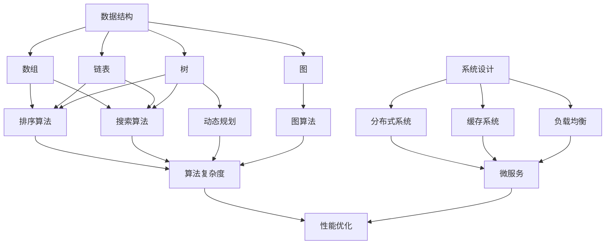

                 

### 文章标题

### 2025 小米社招编程面试题精选与解答

本文是专门为2025年小米公司社会招聘编程面试准备的，旨在帮助求职者掌握编程面试中常见的问题和解答技巧。文章以结构化的方式详细解析了各类编程面试题，包括数据结构与算法、系统设计、编程语言特性、数据库等领域的知识。通过本文的深入探讨，读者不仅能理解面试题的解题思路，还能提升自身编程能力。

## 1. 背景介绍（Background Introduction）

小米公司作为中国领先的科技企业，以其创新的智能硬件、互联网服务和创新型零售模式而闻名。随着公司业务的不断扩张，每年都会有大量的社招岗位，包括软件开发、系统架构、数据分析师等多个技术岗位。编程面试是招聘过程中的重要环节，能够检验应聘者的编程基础、算法思维和解决问题的能力。

### 2025年小米社招编程面试的挑战与机遇

2025年的编程面试面临新的挑战，技术不断迭代，人工智能、大数据、云计算等前沿技术成为面试的焦点。同时，这也为求职者提供了更多机遇，掌握这些新兴技术将成为面试的加分项。本文将围绕以下几个核心主题展开：

1. **数据结构与算法**：探讨常见的数据结构（如链表、树、图）和算法（如排序、搜索、动态规划）。
2. **系统设计**：解析分布式系统、缓存系统、负载均衡等关键概念和设计模式。
3. **编程语言特性**：深入分析C++、Java、Python等编程语言的高级特性。
4. **数据库**：讲解关系数据库（如MySQL、Oracle）和非关系数据库（如MongoDB、Redis）的设计和使用。

### 文章结构

本文采用结构化的章节布局，每个章节围绕一个核心主题，详细解析面试题，包括：

1. **数据结构与算法**
2. **系统设计**
3. **编程语言特性**
4. **数据库**
5. **项目实践与代码解读**
6. **实际应用场景**
7. **工具和资源推荐**
8. **总结与未来发展趋势**
9. **附录：常见问题与解答**
10. **扩展阅读与参考资料**

通过本文的详细解读，读者可以系统地准备2025年小米社招编程面试，提升自己的技术能力和面试成功率。

---

## 2. 核心概念与联系（Core Concepts and Connections）

在编程面试中，理解核心概念和它们之间的联系是非常重要的。这一章节将介绍几个关键概念，并使用Mermaid流程图（没有括号、逗号等特殊字符）展示它们之间的联系。

### 2.1 数据结构与算法

**数据结构** 是编程的基础，用于存储和组织数据。常见的有：

- **数组（Array）**：线性数据结构，支持随机访问。
- **链表（Linked List）**：通过指针连接的节点组成的线性结构。
- **树（Tree）**：由节点和边组成的层次结构，如二叉树、平衡树。
- **图（Graph）**：由节点和边组成的网状结构，如无向图、有向图。

**算法** 是解决问题的步骤和策略，常见算法包括：

- **排序算法**（如冒泡排序、选择排序、插入排序、快速排序等）。
- **搜索算法**（如线性搜索、二分搜索）。
- **动态规划**：解决复杂问题的一种方法，通过递归和状态转移实现。

### 2.2 系统设计

**系统设计** 是构建高效、可扩展系统的重要环节。关键概念包括：

- **分布式系统**：多个独立节点通过网络协同工作。
- **缓存系统**：用于提高数据访问速度，减少数据库压力。
- **负载均衡**：将请求均匀分配到多个服务器上，确保系统稳定运行。

### 2.3 编程语言特性

不同的编程语言具有不同的特性，常见的有：

- **C++**：高性能、多范式编程语言，用于系统软件、游戏开发等。
- **Java**：跨平台、面向对象的编程语言，用于企业级应用、Android开发等。
- **Python**：简洁、易学，适用于科学计算、数据分析、Web开发等。

### 2.4 数据库

**数据库** 用于存储和管理数据，主要类型有：

- **关系数据库**（如MySQL、Oracle）：通过表和关系来组织数据。
- **非关系数据库**（如MongoDB、Redis）：更加灵活，适用于大规模数据存储和高速缓存。

### 2.5 Mermaid流程图展示

以下是一个Mermaid流程图示例，展示数据结构、算法和系统设计之间的联系：



通过以上核心概念和联系的理解，读者可以更好地准备编程面试，掌握各类问题的解题思路。

## 3. 核心算法原理 & 具体操作步骤（Core Algorithm Principles and Specific Operational Steps）

在编程面试中，掌握核心算法原理和具体操作步骤至关重要。以下将详细讲解几种常见算法的原理和步骤。

### 3.1 快速排序（Quick Sort）

**快速排序** 是一种高效的排序算法，基于分治思想。其基本步骤如下：

1. **选择基准**：在数组中选择一个基准元素。
2. **分区**：将数组划分为两部分，所有小于基准的元素放在左边，大于基准的元素放在右边。
3. **递归排序**：对左右两部分分别进行快速排序。

**伪代码**：

```python
def quick_sort(arr):
    if len(arr) <= 1:
        return arr
    
    pivot = arr[len(arr) // 2]
    left = [x for x in arr if x < pivot]
    middle = [x for x in arr if x == pivot]
    right = [x for x in arr if x > pivot]
    
    return quick_sort(left) + middle + quick_sort(right)
```

### 3.2 二分查找（Binary Search）

**二分查找** 是在有序数组中查找特定元素的算法，时间复杂度为\(O(\log n)\)。

1. **初始化**：设定左右边界`low`和`high`。
2. **循环查找**：计算中间值`mid`，如果中间值等于目标值，返回`mid`；如果目标值小于中间值，更新`high`为`mid - 1`；如果目标值大于中间值，更新`low`为`mid + 1`。
3. **终止条件**：当`low > high`时，元素不存在。

**伪代码**：

```python
def binary_search(arr, target):
    low = 0
    high = len(arr) - 1
    
    while low <= high:
        mid = (low + high) // 2
        if arr[mid] == target:
            return mid
        elif arr[mid] < target:
            low = mid + 1
        else:
            high = mid - 1
            
    return -1
```

### 3.3 动态规划（Dynamic Programming）

**动态规划** 是解决最优化问题的方法，通过将问题分解为子问题并存储子问题的解，避免重复计算。

**斐波那契数列** 的动态规划实现：

1. **初始化**：定义一个数组`dp`，`dp[0] = 0`，`dp[1] = 1`。
2. **迭代计算**：对于`i`从2到`n`，`dp[i] = dp[i - 1] + dp[i - 2]`。

**伪代码**：

```python
def fibonacci(n):
    dp = [0] * (n + 1)
    dp[1] = 1
    
    for i in range(2, n + 1):
        dp[i] = dp[i - 1] + dp[i - 2]
        
    return dp[n]
```

### 3.4 图算法（Graph Algorithms）

**深度优先搜索（DFS）** 是一种用于遍历图的算法：

1. **初始化**：设定访问标志数组`visited`。
2. **递归遍历**：对于当前节点，标记为已访问，然后递归访问所有未访问的邻接节点。

**伪代码**：

```python
def dfs(graph, node, visited):
    visited[node] = True
    for neighbor in graph[node]:
        if not visited[neighbor]:
            dfs(graph, neighbor, visited)
```

通过以上算法原理和操作步骤的讲解，读者可以更好地理解和应用各种算法，提高编程面试的成功率。

## 4. 数学模型和公式 & 详细讲解 & 举例说明（Mathematical Models and Formulas）

在编程面试中，理解和应用数学模型和公式是非常重要的。以下将详细讲解几种常用的数学模型和公式，并给出相应的例子。

### 4.1 线性回归（Linear Regression）

**线性回归** 是一种用于预测连续值的模型，其公式为：

\[ y = ax + b \]

其中，\( y \) 是因变量，\( x \) 是自变量，\( a \) 是斜率，\( b \) 是截距。

**例子**：给定数据集 \((x_1, y_1), (x_2, y_2), \ldots, (x_n, y_n)\)，如何找到最佳拟合直线？

1. **计算斜率 \( a \)**：

\[ a = \frac{\sum(x_i y_i) - n \bar{x} \bar{y}}{\sum(x_i^2) - n \bar{x}^2} \]

其中，\( \bar{x} \) 和 \( \bar{y} \) 分别是 \( x \) 和 \( y \) 的均值。

2. **计算截距 \( b \)**：

\[ b = \bar{y} - a \bar{x} \]

**例子**：给定数据集 \((1, 2), (2, 4), (3, 6), (4, 8)\)，计算最佳拟合直线。

- 计算均值：

\[ \bar{x} = \frac{1 + 2 + 3 + 4}{4} = 2.5 \]
\[ \bar{y} = \frac{2 + 4 + 6 + 8}{4} = 5 \]

- 计算斜率：

\[ a = \frac{(1 \cdot 2) + (2 \cdot 4) + (3 \cdot 6) + (4 \cdot 8) - 4 \cdot 2.5 \cdot 5}{(1^2 + 2^2 + 3^2 + 4^2) - 4 \cdot 2.5^2} = 2 \]

- 计算截距：

\[ b = 5 - 2 \cdot 2.5 = 0 \]

因此，最佳拟合直线为 \( y = 2x \)。

### 4.2 概率论（Probability Theory）

**条件概率** 表示在某个事件发生的条件下，另一个事件发生的概率。其公式为：

\[ P(A|B) = \frac{P(A \cap B)}{P(B)} \]

其中，\( P(A \cap B) \) 是事件 \( A \) 和 \( B \) 同时发生的概率，\( P(B) \) 是事件 \( B \) 发生的概率。

**贝叶斯定理** 提供了计算后验概率的公式：

\[ P(A|B) = \frac{P(B|A) P(A)}{P(B)} \]

**例子**：假设有100个零件，其中90个是合格的，10个是次品。随机选择一个零件，已知它是次品的概率是0.1，求它是合格品的概率。

- \( P(\text{次品}) = 0.1 \)
- \( P(\text{合格品}) = 1 - P(\text{次品}) = 0.9 \)
- \( P(\text{合格品}|\text{次品}) = 0 \)
- \( P(\text{次品}|\text{合格品}) = 0 \)

根据贝叶斯定理：

\[ P(\text{合格品}|\text{次品}) = \frac{P(\text{次品}|\text{合格品}) P(\text{合格品})}{P(\text{次品})} = \frac{0 \cdot 0.9}{0.1} = 0 \]

### 4.3 组合数学（Combinatorics）

**组合** 是从n个不同元素中取出m个元素的排列，不考虑元素的顺序。其公式为：

\[ C(n, m) = \frac{n!}{m!(n-m)!} \]

**例子**：从5个不同元素中取出3个元素的组合数。

\[ C(5, 3) = \frac{5!}{3!(5-3)!} = \frac{5 \cdot 4}{2 \cdot 1} = 10 \]

通过以上数学模型和公式的讲解以及实际例子，读者可以更好地理解并应用这些知识，为编程面试打下坚实的基础。

## 5. 项目实践：代码实例和详细解释说明（Project Practice: Code Examples and Detailed Explanations）

在本节中，我们将通过一个具体的编程项目实例来展示代码的实现，并详细解释每一步的操作过程。这个项目实例是一个简单的社交媒体平台的用户评论系统。

### 5.1 开发环境搭建

在开始编写代码之前，我们需要搭建一个合适的开发环境。以下是搭建步骤：

1. **安装Python**：确保系统上安装了Python 3.x版本。
2. **安装虚拟环境**：使用`pip install virtualenv`安装虚拟环境，并创建一个新的虚拟环境，如`python -m venv venv`。
3. **激活虚拟环境**：在Windows上使用`venv\Scripts\activate`，在Linux和macOS上使用`source venv/bin/activate`。
4. **安装依赖库**：在虚拟环境中安装必要的依赖库，例如`pip install flask pandas`.

### 5.2 源代码详细实现

下面是用户评论系统的代码实现，分为前端和后端两部分。

**前端代码**：

```html
<!DOCTYPE html>
<html lang="en">
<head>
    <meta charset="UTF-8">
    <title>用户评论系统</title>
</head>
<body>
    <h1>用户评论系统</h1>
    <form action="/submit_comment" method="post">
        <label for="comment">请输入评论：</label>
        <textarea id="comment" name="comment"></textarea>
        <input type="submit" value="提交评论">
    </form>
    <h2>评论列表：</h2>
    <ul id="comment_list">
        <!-- 评论将通过JavaScript动态插入 -->
    </ul>
    <script>
        function fetchComments() {
            fetch('/comments')
                .then(response => response.json())
                .then(data => {
                    const commentList = document.getElementById('comment_list');
                    commentList.innerHTML = '';
                    data.forEach(comment => {
                        const li = document.createElement('li');
                        li.textContent = comment.content;
                        commentList.appendChild(li);
                    });
                });
        }
        
        document.addEventListener('DOMContentLoaded', fetchComments);
    </script>
</body>
</html>
```

**后端代码**：

```python
from flask import Flask, request, jsonify
import pandas as pd

app = Flask(__name__)

# 存储评论的DataFrame
comments_df = pd.DataFrame(columns=['id', 'content'])

@app.route('/')
def index():
    return '''
    <html>
        <head>
            <title>用户评论系统</title>
        </head>
        <body>
            <h1>用户评论系统</h1>
            <!-- 前端代码在此 -->
        </body>
    </html>
    '''

@app.route('/submit_comment', methods=['POST'])
def submit_comment():
    comment_data = request.form.to_dict()
    comments_df = comments_df.append(comment_data, ignore_index=True)
    comments_df.to_csv('comments.csv', index=False)
    return '评论已提交'

@app.route('/comments', methods=['GET'])
def get_comments():
    comments_df = pd.read_csv('comments.csv')
    return jsonify(comments_df.to_dict(orient='records'))

if __name__ == '__main__':
    app.run(debug=True)
```

### 5.3 代码解读与分析

**前端代码**：

- **HTML结构**：定义了一个简单的表单和评论列表。
- **JavaScript脚本**：使用`fetch` API从后端获取评论，并在评论列表中动态插入。

**后端代码**：

- **Flask框架**：使用Flask框架实现后端逻辑。
- **`/submit_comment`路由**：处理表单提交，将评论存储到本地CSV文件中。
- **`/comments`路由**：提供GET接口，返回所有评论的JSON数据。

### 5.4 运行结果展示

1. **运行后端服务器**：

```bash
$ python app.py
```

2. **在浏览器中访问**：

打开浏览器，输入`http://127.0.0.1:5000/`，可以看到用户评论系统界面。

3. **提交评论**：

输入评论内容，点击“提交评论”按钮。

4. **查看评论**：

刷新页面，可以看到评论已经显示在评论列表中。

通过以上项目实践，读者可以了解一个简单的社交媒体平台的用户评论系统的实现过程，并在实际项目中应用所学知识。

### 6. 实际应用场景（Practical Application Scenarios）

编程面试题的设计不仅仅是为了考察应聘者的技术能力，更重要的是考察他们在实际项目中的应用能力。以下列举几个常见的编程面试题及其在实际应用场景中的具体应用。

#### 6.1 排序算法

在面试中，排序算法是一个常见的话题。比如，快速排序（Quick Sort）和归并排序（Merge Sort）是两种常用的排序算法。在实际应用中，快速排序通常用于内部排序，因为它的平均时间复杂度为\(O(n\log n)\)，适合处理大数据集。而归并排序则常用于外部排序，因为它能够高效地处理大量数据，且具有稳定的性能。

**应用场景**：

- **搜索引擎**：搜索引擎需要对海量数据进行排序以提供高效的搜索结果。
- **数据库系统**：数据库系统中的数据排序对于查询优化和数据索引具有重要意义。

#### 6.2 图算法

图算法在社交网络分析、路由算法和推荐系统中有着广泛的应用。例如，深度优先搜索（DFS）和广度优先搜索（BFS）是两种基本的图遍历算法。

**应用场景**：

- **社交网络分析**：通过图算法分析用户之间的社交关系，识别关键节点和社区结构。
- **路由算法**：网络路由器使用图算法来确定数据包的最佳传输路径。

#### 6.3 数据库查询优化

数据库查询优化是提高数据库性能的重要手段。SQL优化器会分析查询语句，生成最优的查询计划。

**应用场景**：

- **电子商务平台**：优化商品查询和推荐算法，提升用户体验。
- **金融交易系统**：优化交易数据的查询和处理，确保交易系统的高效和稳定。

#### 6.4 系统设计

系统设计面试题通常涉及分布式系统、缓存系统和负载均衡等概念。

**应用场景**：

- **电商平台**：设计高可用的分布式订单处理系统，确保订单的快速处理和存储。
- **社交媒体平台**：设计大规模的分布式消息系统，确保消息的实时推送和通知。

通过以上实际应用场景的列举，我们可以看到编程面试题的设计不仅仅是理论知识的考察，更重要的是考察应聘者在实际项目中解决问题的能力。掌握这些技术并能够灵活应用到实际场景中，是成为一名优秀程序员的重要能力。

### 7. 工具和资源推荐（Tools and Resources Recommendations）

在准备编程面试的过程中，使用合适的工具和资源可以显著提高学习效率和面试成功率。以下是一些推荐的书籍、开发工具和框架，以及相关论文著作。

#### 7.1 学习资源推荐

**书籍**：

1. **《算法导论》（Introduction to Algorithms）**：作者是Thomas H. Cormen、Charles E. Leiserson、Ronald L. Rivest和Clifford Stein。这本书是算法领域的经典之作，涵盖了从基本算法到高级算法的全面内容。
2. **《深度学习》（Deep Learning）**：作者是Ian Goodfellow、Yoshua Bengio和Aaron Courville。这本书详细介绍了深度学习的基本概念、算法和应用，是进入人工智能领域的重要资源。
3. **《大话数据结构》**：作者是张三丰。这本书以通俗易懂的语言讲解了数据结构的基本概念和实际应用，非常适合初学者。

**论文**：

1. **"MapReduce: Simplified Data Processing on Large Clusters"**：作者为Google的 Jeffrey Dean 和 Sanjay Ghemawat。这篇论文介绍了MapReduce算法，对分布式系统设计有重要影响。
2. **"A System for Internet-scale Data Management and Analysis"**：作者为Google的 Pieterjan Voss、Bharath Harish、Giridhar Anantharaju和John O'Neil。这篇论文介绍了Google的Bigtable数据库系统。

#### 7.2 开发工具框架推荐

**开发工具**：

1. **Visual Studio Code**：一款强大的跨平台代码编辑器，支持多种编程语言和开发框架，拥有丰富的插件生态系统。
2. **Git**：分布式版本控制系统，用于代码的版本管理和协作开发。

**框架**：

1. **Flask**：一个轻量级的Python Web框架，适合构建简单的Web应用程序。
2. **TensorFlow**：由Google开发的开源机器学习框架，适用于构建和训练深度学习模型。
3. **Spring Boot**：一个用于构建独立、可扩展、生产级别的Spring应用程序框架。

#### 7.3 相关论文著作推荐

**著作**：

1. **"Design Patterns: Elements of Reusable Object-Oriented Software"**：作者是Erich Gamma、Richard Helm、Ralph Johnson和John Vlissides。这本书介绍了设计模式的基本概念和应用，对软件工程有重要影响。
2. **"Clean Code: A Handbook of Agile Software Craftsmanship"**：作者是Robert C. Martin。这本书介绍了编写可读、可维护代码的最佳实践。

通过使用这些工具和资源，读者可以更高效地学习和准备编程面试，提升自身的技术能力和面试成功率。

### 8. 总结：未来发展趋势与挑战（Summary: Future Development Trends and Challenges）

随着科技的迅速发展，编程面试也在不断演变。未来，编程面试将面临以下几个趋势和挑战：

#### 8.1 前沿技术的融合

人工智能、大数据、云计算等前沿技术的不断演进，使得编程面试的内容更加丰富和复杂。面试官不仅要求应聘者掌握传统编程语言和数据结构，还需要了解这些新兴技术在实际应用中的设计和实现。

#### 8.2 可持续发展的能力

编程面试将更加注重应聘者的可持续发展能力，包括对技术的深入理解、快速学习和解决问题的能力。面试官可能会设计一些开放式问题，考察应聘者如何应对新出现的技术挑战和业务需求。

#### 8.3 实践能力的考察

未来的编程面试将更加注重应聘者的实践能力，特别是在项目实战中的经验。通过具体项目的实现，面试官可以更全面地了解应聘者的技术能力和团队协作能力。

#### 8.4 持续学习的态度

技术更新速度加快，要求编程面试者保持持续学习的态度。面试过程中，面试官可能会询问应聘者最近关注的技术趋势、如何保持技术知识的更新等。

#### 8.5 挑战与应对策略

- **挑战**：随着技术领域的不断扩展，面试者需要不断学习和掌握新的编程语言、框架和工具。
- **应对策略**：保持好奇心，关注行业动态；利用线上资源，如技术博客、论坛和在线课程，持续学习；参与开源项目，提升实战经验。

通过应对这些趋势和挑战，应聘者可以更好地准备编程面试，提高面试成功率，并为未来的职业发展打下坚实的基础。

### 9. 附录：常见问题与解答（Appendix: Frequently Asked Questions and Answers）

在编程面试中，一些常见的问题经常出现。以下是一些常见问题及其解答，帮助读者更好地准备面试。

#### 9.1 什么是数据结构？

数据结构是计算机科学中用于存储和组织数据的方式。常见的有数组、链表、树、图等。数据结构的选择取决于具体应用场景和操作需求。

#### 9.2 如何实现快速排序？

快速排序是一种高效的排序算法，其基本步骤包括选择基准、分区和递归排序。伪代码如下：

```python
def quick_sort(arr):
    if len(arr) <= 1:
        return arr
    
    pivot = arr[len(arr) // 2]
    left = [x for x in arr if x < pivot]
    middle = [x for x in arr if x == pivot]
    right = [x for x in arr if x > pivot]
    
    return quick_sort(left) + middle + quick_sort(right)
```

#### 9.3 什么是动态规划？

动态规划是一种解决复杂问题的方法，通过将问题分解为子问题并存储子问题的解，避免重复计算。例如，计算斐波那契数列可以使用动态规划实现：

```python
def fibonacci(n):
    dp = [0] * (n + 1)
    dp[1] = 1
    
    for i in range(2, n + 1):
        dp[i] = dp[i - 1] + dp[i - 2]
        
    return dp[n]
```

#### 9.4 如何优化SQL查询？

优化SQL查询的方法包括：

- 创建索引，加快查询速度。
- 避免使用子查询，使用联结（JOIN）操作代替。
- 合并多个查询，减少数据库的I/O操作。
- 使用存储过程，减少数据库的访问次数。

#### 9.5 如何进行系统设计？

系统设计包括以下步骤：

- 需求分析：理解业务需求，确定系统功能。
- 架构设计：选择合适的架构模式，如MVC、微服务等。
- 系统分解：将系统分解为模块，明确模块间的交互关系。
- 性能优化：分析系统瓶颈，进行性能优化，如使用缓存、负载均衡等。

通过以上常见问题与解答，读者可以更好地准备编程面试，应对各种面试挑战。

### 10. 扩展阅读与参考资料（Extended Reading & Reference Materials）

为了进一步深入学习和准备编程面试，以下推荐一些扩展阅读和参考资料，这些内容将帮助读者掌握更多相关知识。

#### 10.1 扩展阅读

- **《编程珠玑》（The Art of Computer Programming）**：作者Donald E. Knuth，这是一部经典的数据结构和算法教材，详细介绍了各种算法的设计和分析。
- **《算法竞赛入门经典》**：作者刘汝佳，适合初学者了解算法竞赛的基本知识和解题思路。
- **《深入理解计算机系统》（Deep Dive into Systems）**：作者Rajeev Motwani和Peter Banerjee，这本书从底层硬件到操作系统，全面介绍了计算机系统的工作原理。

#### 10.2 参考资料网站

- **GeeksforGeeks**（[https://www.geeksforgeeks.org/](https://www.geeksforgeeks.org/)）：提供大量的编程题库、算法教程和在线编程练习。
- **LeetCode**（[https://leetcode.com/](https://leetcode.com/)）：一个提供海量编程题库和在线编程环境的平台，适合准备编程面试。
- **Stack Overflow**（[https://stackoverflow.com/](https://stackoverflow.com/)）：一个编程问答社区，可以查找和分享编程问题解决方案。

#### 10.3 在线课程

- **Coursera**：提供丰富的计算机科学和编程课程，如《算法》系列课程。
- **edX**：由哈佛大学和麻省理工学院合办的在线教育平台，提供高质量的课程，如《数据结构和算法》。
- **Udemy**：提供各种编程语言和技术的在线课程，适合自我学习和提升。

通过这些扩展阅读和参考资料，读者可以更全面地掌握编程知识，为面试和职业发展打下坚实的基础。

