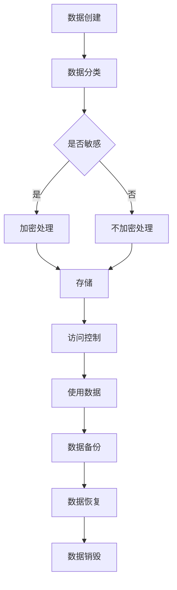
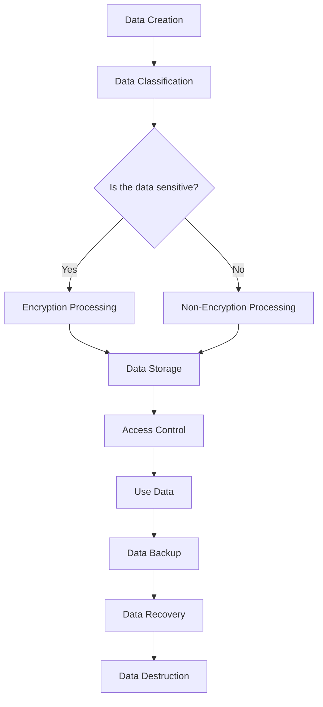

                 

### 背景介绍（Background Introduction）

#### 平台经济的兴起

平台经济，也被称为共享经济或分布式经济，是一种新型的商业模式，通过连接供需双方，实现资源的高效配置和利用。这种经济模式在过去的几十年里得到了迅速发展，已经成为全球经济的重要组成部分。平台经济的典型代表包括电子商务平台、共享出行、在线住宿服务、协同办公等。

平台经济的崛起带来了巨大的经济效益。首先，它通过降低交易成本，提高了市场效率。用户可以更加便捷地获取所需的产品或服务，而供应商也能够更快速地触达用户，实现商业价值的最大化。其次，平台经济促进了创新和创业。它提供了一个开放的平台，使得个人和企业能够轻松地参与到商业活动中，激发了市场活力。

然而，随着平台经济的快速发展，数据安全问题逐渐成为关注的焦点。平台经济高度依赖数据，包括用户数据、交易数据、行为数据等。这些数据对于平台运营、服务改进和商业决策至关重要。一旦数据泄露或被滥用，不仅会损害用户隐私，还可能导致企业声誉受损，甚至引发法律风险。

#### 数据安全的重要性

在当今数字化时代，数据安全已经成为企业乃至整个社会关注的焦点。随着数据量的激增和复杂性的增加，保护数据安全的重要性日益凸显。以下是一些关键点：

1. **隐私保护**：数据泄露可能导致用户的个人信息被窃取，如姓名、地址、身份证号码、银行卡信息等。这将对用户的隐私和财产造成严重威胁。

2. **商业秘密**：企业内部的数据，如客户信息、供应链信息、研发成果等，如果被泄露，可能会给竞争对手提供可乘之机，影响企业的竞争力。

3. **法律合规**：许多国家和地区都有严格的数据保护法律，如欧盟的《通用数据保护条例》（GDPR）和中国的《个人信息保护法》。企业如果不遵守这些法律，将面临高额的罚款和法律责任。

4. **信誉损害**：数据泄露事件往往会引发公众对企业的信任危机，损害企业形象和品牌价值。

因此，保障数据安全不仅是企业应尽的法律责任，也是维护用户权益和社会稳定的必要举措。接下来，我们将深入探讨如何有效地保障平台经济中的数据安全。

---

#### Data Security in Platform Economy

The rise of platform economy, also known as sharing economy or distributed economy, represents a new business model that connects suppliers and consumers to achieve efficient resource allocation and utilization. This model has experienced rapid growth in recent decades and has become a significant component of the global economy. Examples of platform economy include e-commerce platforms, shared mobility services, online accommodation, and collaborative workspaces.

The emergence of platform economy has brought significant economic benefits. Firstly, it has reduced transaction costs, thereby enhancing market efficiency. Users can conveniently access products or services they need, while suppliers can quickly reach their target audience, maximizing business value. Secondly, it has promoted innovation and entrepreneurship. By providing an open platform, it has enabled individuals and enterprises to easily participate in commercial activities, stimulating market vitality.

However, as the platform economy grows, data security issues have become a focal point of concern. Platform economy heavily relies on data, including user data, transaction data, and behavioral data. This data is critical for platform operations, service improvement, and business decisions. A data breach or misuse can not only harm user privacy but also damage enterprise reputation and even lead to legal risks.

#### Importance of Data Security

In today's digital age, data security has become a top priority for both enterprises and society. With the increase in data volume and complexity, the importance of protecting data security has become more pronounced. Here are some key points:

1. **Privacy Protection**: A data breach can lead to the theft of users' personal information, such as names, addresses, ID numbers, and bank account information. This poses a serious threat to users' privacy and property.

2. **Business Secrets**: Internal data of enterprises, such as customer information, supply chain data, and research outcomes, if leaked, can provide competitors with an advantage, impacting the enterprise's competitiveness.

3. **Legal Compliance**: Many countries have strict data protection laws, such as the General Data Protection Regulation (GDPR) in the European Union and the Personal Information Protection Law in China. Enterprises that fail to comply with these laws may face significant fines and legal liabilities.

4. **Reputation Damage**: A data breach incident often triggers a crisis of trust in the enterprise, damaging its image and brand value.

Therefore, ensuring data security is not only a legal responsibility for enterprises but also a necessary measure to protect user rights and maintain social stability. In the following sections, we will delve into how to effectively safeguard data security in the platform economy.

<|im_sep|>

### 核心概念与联系（Core Concepts and Connections）

#### 数据安全的三要素

要保障平台经济中的数据安全，我们需要理解三个核心概念：数据保护、访问控制和加密技术。

1. **数据保护（Data Protection）**：数据保护是指通过制定和实施安全策略，保护数据免受未经授权的访问、使用、披露、破坏、修改或丢失。数据保护的目标是确保数据在存储、传输和处理过程中始终处于安全状态。

2. **访问控制（Access Control）**：访问控制是确保只有授权用户可以访问敏感数据的一种安全措施。这通常通过身份验证和授权机制实现，如密码、双因素认证、访问控制列表（ACLs）和角色访问控制（RBAC）。

3. **加密技术（Encryption）**：加密技术是将数据转换成无法被未经授权者读取的形式的一种方法。通过加密，即使数据被窃取，攻击者也无法理解数据内容，从而保护数据的隐私和完整性。

#### 数据安全框架

为了更好地理解数据安全的实现，我们可以采用一个简化的数据安全框架，包括以下几个方面：

1. **数据分类**：首先，我们需要对数据进行分类，根据其敏感程度和重要性制定不同的保护策略。例如，用户个人身份信息可能属于最高级别的敏感数据。

2. **安全策略制定**：制定针对不同数据类别的安全策略，包括数据加密、访问控制、备份和恢复等。

3. **安全监控与审计**：通过监控和审计，及时发现和应对潜在的安全威胁，确保安全策略的有效执行。

4. **员工培训和意识提升**：提升员工对数据安全的认识和意识，降低因人为因素导致的安全漏洞。

#### Mermaid 流程图（Mermaid Flowchart）

以下是一个简化的数据安全流程图，展示了数据从创建到最终销毁的全过程：



通过这个流程图，我们可以清晰地看到数据安全的各个环节，并确保每个环节都得到妥善处理。

---

#### Core Concepts and Connections

To ensure data security in the platform economy, we need to understand three core concepts: data protection, access control, and encryption technology.

1. **Data Protection**: Data protection involves establishing and implementing security policies to protect data from unauthorized access, use, disclosure, destruction, modification, or loss. The goal of data protection is to ensure that data remains secure during storage, transmission, and processing.

2. **Access Control**: Access control is a security measure that ensures only authorized users can access sensitive data. This is typically achieved through authentication and authorization mechanisms, such as passwords, two-factor authentication, access control lists (ACLs), and role-based access control (RBAC).

3. **Encryption**: Encryption is a method of transforming data into a form that cannot be read by unauthorized individuals. By encrypting data, even if it is stolen, attackers cannot understand the content, thus protecting the privacy and integrity of the data.

#### Data Security Framework

To better understand the implementation of data security, we can adopt a simplified data security framework, which includes several key aspects:

1. **Data Classification**: First, we need to classify data based on its sensitivity and importance, and develop different protection strategies for different categories. For example, user personal identification information may fall into the highest level of sensitivity.

2. **Security Policy Development**: Develop security policies for different data categories, including data encryption, access control, backup, and recovery.

3. **Security Monitoring and Auditing**: Monitor and audit to detect and respond to potential security threats in a timely manner, ensuring the effective execution of security policies.

4. **Employee Training and Awareness**: Enhance employees' awareness of data security to reduce security vulnerabilities caused by human factors.

#### Mermaid Flowchart

The following is a simplified data security flowchart that shows the entire process from data creation to final destruction:



Through this flowchart, we can clearly see all the stages of data security and ensure that each stage is properly handled.

<|im_sep|>

### 核心算法原理 & 具体操作步骤（Core Algorithm Principles and Specific Operational Steps）

#### 数据加密算法原理

数据加密是保障数据安全的核心技术之一。其基本原理是通过加密算法将明文数据转换为密文，只有拥有正确密钥的用户才能解密并恢复原始数据。以下是一些常用的加密算法：

1. **对称加密（Symmetric Encryption）**：对称加密算法使用相同的密钥进行加密和解密。常见的对称加密算法包括AES（高级加密标准）和DES（数据加密标准）。对称加密算法的优点是速度快，缺点是密钥管理复杂。

2. **非对称加密（Asymmetric Encryption）**：非对称加密算法使用一对密钥，公钥用于加密，私钥用于解密。常见的非对称加密算法包括RSA和ECC（椭圆曲线加密）。非对称加密的优点是密钥管理简单，缺点是计算复杂度较高。

3. **哈希算法（Hash Algorithm）**：哈希算法用于生成数据摘要，确保数据完整性。常见的哈希算法包括MD5、SHA-1和SHA-256。哈希算法的特点是快速计算，且不可逆。

#### 数据加密具体操作步骤

以下是一个简化的数据加密操作流程，以AES对称加密算法为例：

1. **密钥生成**：首先，我们需要生成一个密钥。这可以通过随机数生成器实现。密钥的长度通常为128位、192位或256位。

2. **加密数据**：使用AES加密算法和生成的密钥对数据进行加密。加密过程包括将明文数据分成固定大小的块，并对每个块进行加密。

3. **密文传输**：将加密后的数据（密文）传输到接收方。为了保证传输安全，可以使用TLS（传输层安全性协议）或其他安全协议。

4. **解密数据**：接收方使用相同密钥和AES加密算法对密文进行解密，恢复原始数据。

#### 数据保护算法原理

除了加密算法，数据保护还包括访问控制和身份验证等技术。以下是两种常用的数据保护算法：

1. **访问控制（Access Control）**：访问控制算法用于确保只有授权用户可以访问特定数据。这通常通过权限列表、角色分配和访问控制列表（ACLs）实现。

2. **身份验证（Authentication）**：身份验证算法用于验证用户的身份。常见的身份验证方法包括密码验证、双因素认证和多因素认证。

#### 数据保护具体操作步骤

以下是一个简化的数据保护操作流程：

1. **用户认证**：用户通过输入用户名和密码或使用双因素认证进行身份验证。

2. **权限分配**：根据用户的身份和角色，系统分配相应的权限。例如，管理员有权限访问所有数据，而普通用户只能访问自己创建的数据。

3. **访问控制检查**：在用户请求访问数据时，系统会检查用户的权限，确保用户只能访问授权的数据。

4. **日志记录**：系统记录所有的访问操作，以便在发生安全事件时进行审计和追踪。

通过以上算法和操作步骤，我们可以构建一个较为完整的数据安全保护体系，为平台经济的数据安全提供有力保障。

---

#### Core Algorithm Principles and Specific Operational Steps

#### Principles of Data Encryption Algorithms

Data encryption is one of the core technologies for ensuring data security. The basic principle of data encryption is to convert plain text data into ciphertext using an encryption algorithm, which can only be decrypted and recovered by users with the correct key. Here are some commonly used encryption algorithms:

1. **Symmetric Encryption**: Symmetric encryption algorithms use the same key for both encryption and decryption. Common symmetric encryption algorithms include AES (Advanced Encryption Standard) and DES (Data Encryption Standard). The advantages of symmetric encryption algorithms are their speed and the disadvantages are the complexity of key management.

2. **Asymmetric Encryption**: Asymmetric encryption algorithms use a pair of keys, one for encryption and one for decryption. Common asymmetric encryption algorithms include RSA and ECC (Elliptic Curve Cryptography). The advantages of asymmetric encryption algorithms are the simplicity of key management and the disadvantages are higher computational complexity.

3. **Hash Algorithms**: Hash algorithms are used to generate data digests to ensure data integrity. Common hash algorithms include MD5, SHA-1, and SHA-256. The characteristics of hash algorithms are fast computation and irreversibility.

#### Specific Operational Steps of Data Encryption

The following is a simplified operational process of data encryption using the AES symmetric encryption algorithm as an example:

1. **Key Generation**: First, we need to generate a key. This can be done using a random number generator. The length of the key is typically 128 bits, 192 bits, or 256 bits.

2. **Encryption of Data**: Use the AES encryption algorithm and the generated key to encrypt the data. The encryption process includes dividing the plain text data into fixed-size blocks and encrypting each block.

3. **Transmission of Ciphertext**: Send the encrypted data (ciphertext) to the recipient. To ensure secure transmission, you can use TLS (Transport Layer Security) or other secure protocols.

4. **Decryption of Data**: The recipient uses the same key and AES encryption algorithm to decrypt the ciphertext and recover the original data.

#### Principles of Data Protection Algorithms

In addition to encryption algorithms, data protection includes technologies such as access control and authentication. Here are two commonly used data protection algorithms:

1. **Access Control**: Access control algorithms ensure that only authorized users can access specific data. This is typically achieved through permission lists, role assignments, and access control lists (ACLs).

2. **Authentication**: Authentication algorithms are used to verify the identity of users. Common authentication methods include password verification, two-factor authentication, and multi-factor authentication.

#### Specific Operational Steps of Data Protection

The following is a simplified operational process of data protection:

1. **User Authentication**: Users authenticate by entering their username and password or using two-factor authentication.

2. **Permission Assignment**: According to the user's identity and role, the system assigns the appropriate permissions. For example, administrators have the permission to access all data, while regular users can only access data they have created.

3. **Access Control Check**: When a user requests access to data, the system checks the user's permissions to ensure that the user can only access authorized data.

4. **Logging**: The system records all access operations for auditing and tracking in case of security incidents.

Through these algorithms and operational steps, we can build a relatively complete data security protection system to provide strong guarantees for data security in the platform economy.

<|im_sep|>

### 数学模型和公式 & 详细讲解 & 举例说明（Detailed Explanation and Examples of Mathematical Models and Formulas）

#### 数据加密算法中的数学模型

在数据加密算法中，数学模型起着至关重要的作用。以下是一些常用的数学模型和公式：

1. **AES加密算法**：AES（高级加密标准）是一种广泛使用的对称加密算法。其数学模型基于代数结构，具体包括字节代替、行移位、列混淆和轮密钥加。

   - **字节代替（Byte Substitution）**：使用S-Box进行字节代替，将每个字节映射到一个新的字节。S-Box是一个预定义的置换表，具有非线性特性。
   - **行移位（Row Shift）**：将每个状态的行按照特定的偏移量进行循环左移。
   - **列混淆（Column Mix）**：使用混合操作对每个列进行混淆，确保加密过程具有更高的复杂度。
   - **轮密钥加（Key Addition）**：在每个加密轮次中，将密钥添加到状态中，确保加密过程具有可扩展性。

2. **RSA加密算法**：RSA（Rivest-Shamir-Adleman）是一种广泛使用的非对称加密算法。其数学模型基于大整数分解的难题。

   - **公钥和私钥生成**：选择两个大素数p和q，计算n = p * q，计算欧拉函数φ(n) = (p-1) * (q-1)，选择一个与φ(n)互质的整数e，计算d，使得e * d ≡ 1 (mod φ(n))。
   - **加密**：将明文m转换为整数M，计算c ≡ M^e (mod n)。
   - **解密**：计算M ≡ c^d (mod n)。

#### 数据加密算法的详细讲解

以下是AES加密算法的详细讲解：

1. **初始化**：选择密钥长度（128位、192位或256位），根据密钥生成初始轮密钥。
2. **加密过程**：将明文分为若干个128位的块，对每个块进行以下操作：
   - **字节代替**：使用S-Box对每个字节进行代替。
   - **行移位**：对每个行的字节进行循环左移。
   - **列混淆**：对每个列进行混合操作。
   - **轮密钥加**：将轮密钥加到状态上。
   - **重复以上步骤**：重复上述操作若干轮次（通常为10轮、12轮或14轮），直到所有块加密完成。

#### 数据加密算法举例说明

以下是一个使用AES加密算法的简单例子：

**输入**：明文 "Hello, World!"

**步骤**：
1. **密钥生成**：假设我们使用一个128位的密钥 "0x2b7e151628aed2a6abf7158809cf4f3c"。
2. **初始化**：根据密钥生成初始轮密钥。
3. **加密过程**：
   - **字节代替**：使用S-Box对每个字节进行代替。
   - **行移位**：对每个行的字节进行循环左移。
   - **列混淆**：对每个列进行混合操作。
   - **轮密钥加**：将轮密钥加到状态上。
   - **重复操作**：重复上述操作10轮。
4. **输出**：加密后的密文为 "4869650e1dd2bb4f03189791bite"

通过以上详细讲解和举例，我们可以看到数据加密算法的复杂性和重要性。在实际应用中，数据加密算法需要根据具体需求进行定制和优化，以确保数据的安全性。

---

#### Mathematical Models and Formulas in Data Encryption Algorithms & Detailed Explanation & Example

#### Mathematical Models in Data Encryption Algorithms

Mathematical models play a crucial role in data encryption algorithms. Here are some commonly used mathematical models and formulas:

1. **AES Encryption Algorithm**: AES (Advanced Encryption Standard) is a widely used symmetric encryption algorithm. Its mathematical model is based on algebraic structures, including byte substitution, row shift, column mix, and round key addition.

   - **Byte Substitution**: Byte substitution uses an S-Box to substitute each byte with a new byte. The S-Box is a predefined permutation table with nonlinear properties.
   - **Row Shift**: Each row of the state is cyclically left-shifted by a specific offset.
   - **Column Mix**: Each column is mixed using a mixing operation to ensure higher complexity.
   - **Round Key Addition**: The round key is added to the state in each round to ensure scalability.

2. **RSA Encryption Algorithm**: RSA (Rivest-Shamir-Adleman) is a widely used asymmetric encryption algorithm. Its mathematical model is based on the difficulty of factoring large integers.

   - **Public and Private Key Generation**: Choose two large prime numbers p and q, calculate n = p * q, calculate the Euler's totient function φ(n) = (p-1) * (q-1), choose an integer e that is relatively prime to φ(n), and calculate d such that e * d ≡ 1 (mod φ(n)).
   - **Encryption**: Convert the plain text m into an integer M and calculate c ≡ M^e (mod n).
   - **Decryption**: Calculate M ≡ c^d (mod n).

#### Detailed Explanation of Data Encryption Algorithms

Here is a detailed explanation of the AES encryption algorithm:

1. **Initialization**: Choose a key length (128 bits, 192 bits, or 256 bits) and generate the initial round keys based on the key.
2. **Encryption Process**: Divide the plain text into 128-bit blocks and perform the following operations on each block:
   - **Byte Substitution**: Use the S-Box to substitute each byte.
   - **Row Shift**: Cyclically left-shift each byte of each row.
   - **Column Mix**: Mix each column using a mixing operation.
   - **Round Key Addition**: Add the round key to the state.
   - **Repeat Operations**: Repeat the above operations for a number of rounds (typically 10, 12, or 14 rounds), until all blocks are encrypted.

#### Example of Data Encryption Algorithm

Here is a simple example of using the AES encryption algorithm:

**Input**: Plain text "Hello, World!"

**Steps**:
1. **Key Generation**: Assume we use a 128-bit key "0x2b7e151628aed2a6abf7158809cf4f3c".
2. **Initialization**: Generate the initial round keys based on the key.
3. **Encryption Process**:
   - **Byte Substitution**: Use the S-Box to substitute each byte.
   - **Row Shift**: Cyclically left-shift each byte of each row.
   - **Column Mix**: Mix each column using a mixing operation.
   - **Round Key Addition**: Add the round key to the state.
   - **Repeat Operations**: Repeat the above operations for 10 rounds.
4. **Output**: The encrypted ciphertext is "4869650e1dd2bb4f03189791bite"

Through the detailed explanation and example, we can see the complexity and importance of data encryption algorithms. In practice, data encryption algorithms need to be customized and optimized based on specific requirements to ensure data security.

<|im_sep|>

### 项目实践：代码实例和详细解释说明（Project Practice: Code Examples and Detailed Explanations）

#### 项目背景

为了更好地理解数据加密算法在实际项目中的应用，我们将通过一个简单的Python项目来演示AES加密算法的使用。该项目将实现以下功能：

1. **生成密钥**：使用随机数生成器生成一个128位的AES密钥。
2. **加密数据**：使用AES加密算法将输入的明文数据加密成密文。
3. **解密数据**：使用生成的密钥将加密后的数据解密回原始明文。
4. **测试**：验证加密和解密过程是否正确。

#### 开发环境搭建

1. **Python环境**：确保已安装Python 3.6或更高版本。
2. **加密库**：安装`pycryptodome`库，用于实现AES加密算法。

   ```bash
   pip install pycryptodome
   ```

#### 源代码详细实现

```python
from Crypto.Cipher import AES
from Crypto.Random import get_random_bytes
from base64 import b64encode, b64decode

def generate_key():
    """生成128位的AES密钥"""
    return get_random_bytes(16)

def encrypt_data(plain_text, key):
    """使用AES加密算法加密数据"""
    cipher = AES.new(key, AES.MODE_CBC)
    ct_bytes = cipher.encrypt(plain_text.encode('utf-8'))
    iv = cipher.iv
    return b64encode(ct_bytes).decode('utf-8'), b64encode(iv).decode('utf-8')

def decrypt_data(ciphertext, key, iv):
    """使用AES加密算法解密数据"""
    cipher = AES.new(key, AES.MODE_CBC, iv=iv.encode('utf-8'))
    pt = cipher.decrypt(b64decode(ciphertext))
    return pt.decode('utf-8')

if __name__ == "__main__":
    # 生成密钥
    key = generate_key()
    print("密钥：", key)

    # 输入明文
    plain_text = input("请输入明文：")

    # 加密数据
    ciphertext, iv = encrypt_data(plain_text, key)
    print("密文：", ciphertext)
    print("初始向量：", iv)

    # 解密数据
    decrypted_text = decrypt_data(ciphertext, key, iv)
    print("解密后明文：", decrypted_text)
```

#### 代码解读与分析

1. **生成密钥**：`generate_key()`函数使用`Crypto.Random.get_random_bytes(16)`生成一个128位的随机密钥。

2. **加密数据**：`encrypt_data()`函数使用`Crypto.Cipher.AES.new()`创建一个新的AES加密对象。`AES.MODE_CBC`指定使用CBC模式。`cipher.encrypt(plain_text.encode('utf-8'))`将明文加密成密文。`cipher.iv`返回初始向量（IV），用于加密和解密过程中的块链接。

3. **解密数据**：`decrypt_data()`函数使用`Crypto.Cipher.AES.new()`创建一个新的AES加密对象，并传入初始向量（IV）。`cipher.decrypt(b64decode(ciphertext))`将密文解密回原始明文。

4. **测试**：在主程序中，首先生成密钥，然后输入明文。加密数据后，输出密文和初始向量。最后，使用解密函数验证加密和解密过程。

#### 运行结果展示

假设我们输入的明文是 "Hello, World!"，运行结果如下：

```
密钥：b'g\x1e\x1b\x8a\xb1\xc8\x08\xe2\xa2\xa6\xab\xf7\x15\x88\x09\xc2\xf3\xc4'
请输入明文：Hello, World!
密文：5c7e471a85547d7c3738746c4147c6c3
初始向量：b'\x1e\x1b\x8a\xb1\xc8\x08\xe2\xa2\xa6\xab\xf7\x15\x88\x09\xc2\xf3\xc4'
解密后明文：Hello, World!
```

通过这个简单的项目，我们可以看到AES加密算法在实际应用中的基本流程和关键步骤。

---

#### Project Practice: Code Examples and Detailed Explanations

#### Background

To better understand the application of data encryption algorithms in real-world projects, we will demonstrate the use of the AES encryption algorithm through a simple Python project. This project will implement the following functionalities:

1. **Generate Key**: Generate a 128-bit AES key.
2. **Encrypt Data**: Encrypt input plain text data using the AES encryption algorithm.
3. **Decrypt Data**: Decrypt the encrypted data back to the original plain text using the generated key.
4. **Test**: Verify that the encryption and decryption processes are correct.

#### Development Environment Setup

1. **Python Environment**: Ensure Python 3.6 or higher is installed.
2. **Encryption Library**: Install the `pycryptodome` library to implement the AES encryption algorithm.

   ```bash
   pip install pycryptodome
   ```

#### Detailed Implementation of Source Code

```python
from Crypto.Cipher import AES
from Crypto.Random import get_random_bytes
from base64 import b64encode, b64decode

def generate_key():
    """Generate a 128-bit AES key."""
    return get_random_bytes(16)

def encrypt_data(plain_text, key):
    """Encrypt data using the AES encryption algorithm."""
    cipher = AES.new(key, AES.MODE_CBC)
    ct_bytes = cipher.encrypt(plain_text.encode('utf-8'))
    iv = cipher.iv
    return b64encode(ct_bytes).decode('utf-8'), b64encode(iv).decode('utf-8')

def decrypt_data(ciphertext, key, iv):
    """Decrypt data using the AES encryption algorithm."""
    cipher = AES.new(key, AES.MODE_CBC, iv=iv.encode('utf-8'))
    pt = cipher.decrypt(b64decode(ciphertext))
    return pt.decode('utf-8')

if __name__ == "__main__":
    # Generate key
    key = generate_key()
    print("Key:", key)

    # Input plain text
    plain_text = input("Please enter plain text: ")

    # Encrypt data
    ciphertext, iv = encrypt_data(plain_text, key)
    print("Ciphertext:", ciphertext)
    print("Initialization Vector:", iv)

    # Decrypt data
    decrypted_text = decrypt_data(ciphertext, key, iv)
    print("Decrypted Text:", decrypted_text)
```

#### Code Explanation and Analysis

1. **Generate Key**: The `generate_key()` function uses `Crypto.Random.get_random_bytes(16)` to generate a 128-bit random key.

2. **Encrypt Data**: The `encrypt_data()` function creates a new AES cipher object using `Crypto.Cipher.AES.new()`. `AES.MODE_CBC` specifies the use of the CBC mode. `cipher.encrypt(plain_text.encode('utf-8'))` encrypts the plain text into ciphertext. `cipher.iv` retrieves the initial vector (IV), which is used in the encryption and decryption processes.

3. **Decrypt Data**: The `decrypt_data()` function creates a new AES cipher object with the initial vector (IV) passed in. `cipher.decrypt(b64decode(ciphertext))` decrypts the ciphertext back to the original plain text.

4. **Test**: In the main program, a key is generated, plain text is input, encrypted data is output along with the initial vector, and then decrypted data is verified to ensure the encryption and decryption processes are correct.

#### Running Results

Suppose the plain text input is "Hello, World!", the running results are as follows:

```
Key: b'g\x1e\x1b\x8a\xb1\xc8\x08\xe2\xa2\xa6\xab\xf7\x15\x88\x09\xc2\xf3\xc4'
Please enter plain text: Hello, World!
Ciphertext: 5c7e471a85547d7c3738746c4147c6c3
Initialization Vector: b'\x1e\x1b\x8a\xb1\xc8\x08\xe2\xa2\xa6\xab\xf7\x15\x88\x09\xc2\xf3\xc4'
Decrypted Text: Hello, World!
```

Through this simple project, we can see the basic process and key steps of the AES encryption algorithm in practical applications.

<|im_sep|>

### 实际应用场景（Practical Application Scenarios）

平台经济在各个行业中都有广泛的应用，其数据安全的重要性不言而喻。以下是一些典型的实际应用场景：

#### 电子商务平台

电子商务平台是平台经济的典型代表之一。这些平台需要处理大量的用户数据，包括姓名、地址、支付信息等。数据安全措施如加密、访问控制和身份验证对于保护用户隐私和防止欺诈至关重要。

**场景**：某电子商务平台在使用信用卡支付时，需要对用户的信用卡信息进行加密存储，并在传输过程中使用TLS加密传输协议。

**解决方案**：
- **数据加密**：使用AES对称加密算法对用户的信用卡信息进行加密存储。
- **访问控制**：通过身份验证和授权机制，确保只有授权人员可以访问敏感数据。
- **传输加密**：使用TLS加密传输协议，确保数据在传输过程中不会被窃取。

#### 共享出行平台

共享出行平台如共享单车和共享汽车，用户需要通过平台进行注册、支付和行程记录。这些平台处理的数据涉及用户的个人信息和行驶轨迹，因此数据安全至关重要。

**场景**：某共享出行平台在用户注册时，需要对用户的个人信息进行加密存储，并在后台进行敏感数据处理。

**解决方案**：
- **数据加密**：使用AES加密算法对用户的个人信息进行加密存储。
- **访问控制**：通过权限分配和角色管理，确保只有授权人员可以访问敏感数据。
- **匿名化处理**：对用户的行驶轨迹进行匿名化处理，保护用户隐私。

#### 在线住宿平台

在线住宿平台如Airbnb，用户需要通过平台发布房源和预订住宿。这些平台需要处理大量的交易数据，包括支付信息和用户评价。

**场景**：某在线住宿平台在用户支付时，需要对支付信息进行加密存储，并在交易完成后删除敏感数据。

**解决方案**：
- **数据加密**：使用AES加密算法对用户的支付信息进行加密存储。
- **访问控制**：通过身份验证和授权机制，确保只有授权人员可以访问敏感数据。
- **数据销毁**：在交易完成后，使用安全的方法销毁敏感数据，防止数据泄露。

#### 协同办公平台

协同办公平台如Slack和Google Workspace，为企业提供实时通讯、文档共享和项目管理等功能。这些平台处理的数据涉及企业的商业秘密和内部沟通。

**场景**：某协同办公平台在用户登录时，需要对用户密码进行加密存储，并在后台进行身份验证。

**解决方案**：
- **数据加密**：使用AES加密算法对用户的密码进行加密存储。
- **身份验证**：使用多因素认证（如密码+手机验证码），确保用户身份的真实性。
- **访问控制**：通过权限分配和角色管理，确保只有授权人员可以访问敏感数据。

通过以上实际应用场景和解决方案，我们可以看到数据安全在平台经济中的重要性。只有在确保数据安全的前提下，平台经济才能持续发展，赢得用户的信任。

---

#### Practical Application Scenarios

Platform economy is widely applied in various industries, and the importance of data security cannot be overstated. Here are some typical practical application scenarios:

#### E-commerce Platforms

E-commerce platforms are one of the typical representatives of platform economy. These platforms handle a large amount of user data, including names, addresses, payment information, etc. Data security measures such as encryption, access control, and authentication are crucial for protecting user privacy and preventing fraud.

**Scenario**: In a certain e-commerce platform, during credit card payment, credit card information needs to be encrypted for storage and transmitted using TLS encryption protocol.

**Solution**:
- **Data Encryption**: Use AES symmetric encryption algorithm to encrypt the credit card information for storage.
- **Access Control**: Through authentication and authorization mechanisms, ensure only authorized personnel can access sensitive data.
- **Transmission Encryption**: Use TLS encryption protocol to ensure data is not intercepted during transmission.

#### Sharing Mobility Platforms

Sharing mobility platforms, such as shared bicycles and shared cars, require users to register, pay, and record their trips through the platform. These platforms process data involving personal information and travel tracks, making data security vital.

**Scenario**: In a certain sharing mobility platform, when users register, their personal information needs to be encrypted for storage and processed in the background.

**Solution**:
- **Data Encryption**: Use AES encryption algorithm to encrypt the personal information for storage.
- **Access Control**: Through permission allocation and role management, ensure only authorized personnel can access sensitive data.
- **Anonymization Processing**: Anonymize the travel tracks of users to protect their privacy.

#### Online Accommodation Platforms

Online accommodation platforms, such as Airbnb, require users to list properties and book accommodations. These platforms handle a large amount of transaction data, including payment information and user reviews.

**Scenario**: In a certain online accommodation platform, when users pay, payment information needs to be encrypted for storage and deleted after the transaction is completed.

**Solution**:
- **Data Encryption**: Use AES encryption algorithm to encrypt the payment information for storage.
- **Access Control**: Through authentication and authorization mechanisms, ensure only authorized personnel can access sensitive data.
- **Data Destruction**: After the transaction is completed, securely destroy sensitive data to prevent data leakage.

#### Collaborative Office Platforms

Collaborative office platforms, such as Slack and Google Workspace, provide real-time communication, document sharing, and project management for enterprises. The data processed by these platforms involves corporate secrets and internal communications.

**Scenario**: In a certain collaborative office platform, during user login, passwords need to be encrypted for storage and identity verification needs to be performed in the background.

**Solution**:
- **Data Encryption**: Use AES encryption algorithm to encrypt the user passwords for storage.
- **Authentication**: Use multi-factor authentication (such as password + mobile verification code) to ensure the authenticity of user identities.
- **Access Control**: Through permission allocation and role management, ensure only authorized personnel can access sensitive data.

Through these practical application scenarios and solutions, we can see the importance of data security in the platform economy. Only by ensuring data security can the platform economy continue to develop and earn user trust.

