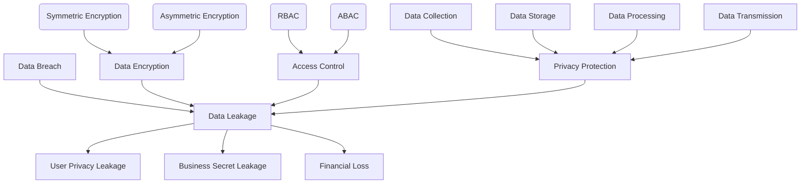

                 

### 背景介绍（Background Introduction）

平台经济（Platform Economy）作为一种新兴的经济模式，正在全球范围内迅速发展。它通过搭建一个中间平台，连接不同的参与者，从而实现资源的优化配置和高效利用。平台经济的典型代表包括电子商务平台、在线旅游服务、共享经济等。这些平台通过收集和利用海量数据，为用户提供定制化的服务，同时也为企业提供了广阔的市场空间和创新的商业模式。

然而，随着平台经济的发展，数据安全问题日益凸显。平台经济中的数据安全风险主要源于以下几个方面：

1. **数据敏感性高**：平台经济中的数据往往涉及用户隐私、商业机密等敏感信息，一旦泄露，可能导致严重的后果。
2. **数据量庞大**：平台经济中的数据量庞大，这使得数据泄露的概率增加，也增加了安全防护的难度。
3. **数据共享广泛**：平台经济中，不同参与者之间的数据共享非常普遍，这也增加了数据泄露的风险。
4. **数据挖掘复杂**：平台经济中的数据通常需要进行复杂的挖掘和分析，这可能会引入潜在的安全漏洞。

因此，如何防范平台经济中的数据泄露，成为了当前亟需解决的重要问题。本文将从多个角度探讨平台经济的数据安全风险，并提出相应的防范措施。

### Platform Economy Background

The platform economy, as an emerging economic model, has been rapidly developing across the globe. It involves building an intermediary platform to connect various participants, thereby optimizing resource allocation and efficient utilization. Typical representatives of the platform economy include e-commerce platforms, online travel services, and sharing economy. These platforms collect and utilize massive amounts of data to provide customized services to users while offering a vast market and innovative business models for enterprises.

However, as the platform economy grows, data security issues are becoming increasingly prominent. The data security risks in the platform economy mainly arise from several aspects:

1. **High sensitivity of data**: The data in the platform economy often involves sensitive information such as user privacy and business secrets, which, if leaked, could lead to severe consequences.
2. **Large amount of data**: The massive volume of data in the platform economy increases the probability of data breaches and complicates security protection.
3. **Widespread data sharing**: Data sharing is very common among participants in the platform economy, which also increases the risk of data breaches.
4. **Complex data mining**: The data in the platform economy usually requires complex mining and analysis, which may introduce potential security vulnerabilities.

Therefore, how to prevent data leaks in the platform economy is an urgent issue that needs to be addressed. This article will explore the data security risks in the platform economy from multiple angles and propose corresponding preventive measures.

---

### 核心概念与联系（Core Concepts and Connections）

要理解平台经济中的数据安全风险，我们首先需要明确几个核心概念，包括数据泄露（Data Breach）、数据加密（Data Encryption）、访问控制（Access Control）和隐私保护（Privacy Protection）。

#### 1. 数据泄露（Data Breach）

数据泄露指的是未经授权的第三方访问、窃取、篡改或破坏敏感数据的过程。在平台经济中，数据泄露可能导致用户隐私泄露、商业机密泄露以及经济损失。

#### 2. 数据加密（Data Encryption）

数据加密是通过将明文数据转换成密文来保护数据的一种技术。数据加密可以分为对称加密和非对称加密。对称加密使用相同的密钥进行加密和解密，而非对称加密则使用一对密钥（公钥和私钥）。

#### 3. 访问控制（Access Control）

访问控制是指限制和监控对系统、网络、数据或资源的访问权限，确保只有授权用户才能访问受保护的数据。常见的访问控制方法包括基于角色的访问控制（RBAC）和基于属性的访问控制（ABAC）。

#### 4. 隐私保护（Privacy Protection）

隐私保护是指保护个人隐私信息的措施，包括数据收集、存储、处理和传输过程中的隐私保护。隐私保护的目标是确保个人隐私不被未经授权的第三方访问或滥用。

#### Mermaid 流程图（Mermaid Flowchart）

下面是一个简化的平台经济数据安全风险流程图，展示了上述核心概念之间的关系：



通过这个流程图，我们可以看到，数据泄露是平台经济中数据安全风险的核心问题，而数据加密、访问控制和隐私保护则是防范数据泄露的关键手段。

### Core Concepts and Connections

To understand the data security risks in the platform economy, we first need to clarify several core concepts, including data breach, data encryption, access control, and privacy protection.

#### 1. Data Breach

A data breach refers to the unauthorized access, theft, alteration, or destruction of sensitive data by a third party. In the platform economy, data breaches can lead to the leakage of user privacy, business secrets, and financial losses.

#### 2. Data Encryption

Data encryption is a technique that protects data by converting it from plain text to ciphertext. Data encryption can be categorized into symmetric encryption and asymmetric encryption. Symmetric encryption uses the same key for encryption and decryption, while asymmetric encryption uses a pair of keys (public key and private key).

#### 3. Access Control

Access control is the process of limiting and monitoring access to systems, networks, data, or resources to ensure that only authorized users can access protected data. Common access control methods include Role-Based Access Control (RBAC) and Attribute-Based Access Control (ABAC).

#### 4. Privacy Protection

Privacy protection refers to the measures taken to protect personal privacy information during the collection, storage, processing, and transmission of data. The goal of privacy protection is to ensure that personal privacy is not accessed or misused by unauthorized third parties.

#### Mermaid Flowchart

Below is a simplified flowchart of the data security risks in the platform economy, illustrating the relationships between the core concepts:


Through this flowchart, we can see that data breaches are the core issue in the platform economy's data security risks, while data encryption, access control, and privacy protection are the key measures to prevent data breaches.

---

### 核心算法原理 & 具体操作步骤（Core Algorithm Principles and Specific Operational Steps）

要有效防范平台经济中的数据泄露，我们需要借助一系列核心算法和操作步骤。以下将详细介绍几个关键算法和步骤，并解释其工作原理和具体实施方法。

#### 1. 数据加密算法（Data Encryption Algorithms）

数据加密是保护数据免受未授权访问的关键技术。常见的加密算法包括对称加密（如AES）和非对称加密（如RSA）。

**工作原理**：

- **对称加密**：使用相同的密钥进行加密和解密，速度快但密钥管理复杂。
- **非对称加密**：使用一对密钥（公钥和私钥），公钥加密，私钥解密，安全性高但速度慢。

**具体操作步骤**：

- 选择加密算法（如AES或RSA）。
- 生成密钥（对于对称加密，使用随机数生成器；对于非对称加密，生成公钥和私钥）。
- 使用密钥对数据进行加密和解密。

**示例**：

```python
from Crypto.Cipher import AES
from Crypto.Random import get_random_bytes

# 对称加密（AES）
key = get_random_bytes(16)  # 生成16字节密钥
cipher = AES.new(key, AES.MODE_EAX)
plaintext = b"Hello, World!"
ciphertext, tag = cipher.encrypt_and_digest(plaintext)
print("Ciphertext:", ciphertext)
print("Tag:", tag)

# 解密
cipher = AES.new(key, AES.MODE_EAX, nonce=cipher.nonce)
plaintext = cipher.decrypt_and_verify(ciphertext, tag)
print("Decrypted text:", plaintext)
```

#### 2. 访问控制算法（Access Control Algorithms）

访问控制算法用于确保只有授权用户可以访问特定资源。

**工作原理**：

- **基于角色的访问控制（RBAC）**：用户被分配角色，角色拥有访问权限。
- **基于属性的访问控制（ABAC）**：用户访问权限基于其属性和资源的属性。

**具体操作步骤**：

- 定义角色和权限。
- 将用户分配到角色。
- 实现访问决策策略。

**示例**：

```python
# 基于角色的访问控制（RBAC）
users = {
    "Alice": ["admin"],
    "Bob": ["user"]
}
roles = {
    "admin": ["read", "write", "delete"],
    "user": ["read"]
}
resource = "file"

def check_permission(user, resource):
    roles_of_user = users.get(user, [])
    permissions = roles.get(roles_of_user, [])
    return resource in permissions

# 用户Alice可以读取、写入和删除文件
print(check_permission("Alice", "read"))  # True
print(check_permission("Alice", "write"))  # True
print(check_permission("Alice", "delete"))  # True

# 用户Bob只能读取文件
print(check_permission("Bob", "read"))  # True
print(check_permission("Bob", "write"))  # False
print(check_permission("Bob", "delete"))  # False
```

#### 3. 数据隐私保护算法（Data Privacy Protection Algorithms）

数据隐私保护算法用于确保个人隐私信息不被未经授权的第三方访问或滥用。

**工作原理**：

- **同态加密**：允许对加密数据进行计算，结果仍然是加密的。
- **差分隐私**：通过添加噪声来掩盖个体数据，从而保护隐私。

**具体操作步骤**：

- 选择隐私保护算法（如同态加密或差分隐私）。
- 实现算法，确保隐私保护。

**示例**：

```python
from secretcv.models import DPCault

# 使用差分隐私
dpcault = DPCault()
sensitive_data = [1, 2, 3, 4, 5]
noise_factor = 1.5
noisy_data = dpcault.add_noise(sensitive_data, noise_factor)

# 对数据进行操作
result = dpcault.aggregate(noisy_data)

# 提取结果
true_result = dpcault.extract_result(result)

print("Noisy result:", result)
print("True result:", true_result)
```

通过上述核心算法和操作步骤，我们可以有效提高平台经济中的数据安全水平，防范数据泄露风险。

### Core Algorithm Principles and Specific Operational Steps

To effectively prevent data leaks in the platform economy, we need to leverage a series of core algorithms and operational steps. Below, we will detail several key algorithms and steps, explaining their working principles and specific implementation methods.

#### 1. Data Encryption Algorithms

Data encryption is a critical technology for protecting data from unauthorized access. Common encryption algorithms include symmetric encryption (such as AES) and asymmetric encryption (such as RSA).

**Working Principle**:

- **Symmetric Encryption**: Uses the same key for encryption and decryption, which is fast but complex in key management.
- **Asymmetric Encryption**: Uses a pair of keys (public key and private key), where the public key encrypts and the private key decrypts, which is secure but slower.

**Specific Operational Steps**:

- Choose an encryption algorithm (such as AES or RSA).
- Generate keys (for symmetric encryption, use a random number generator; for asymmetric encryption, generate a public key and private key).
- Encrypt and decrypt data using the keys.

**Example**:

```python
from Crypto.Cipher import AES
from Crypto.Random import get_random_bytes

# Symmetric encryption (AES)
key = get_random_bytes(16)  # Generate a 16-byte key
cipher = AES.new(key, AES.MODE_EAX)
plaintext = b"Hello, World!"
ciphertext, tag = cipher.encrypt_and_digest(plaintext)
print("Ciphertext:", ciphertext)
print("Tag:", tag)

# Decryption
cipher = AES.new(key, AES.MODE_EAX, nonce=cipher.nonce)
plaintext = cipher.decrypt_and_verify(ciphertext, tag)
print("Decrypted text:", plaintext)
```

#### 2. Access Control Algorithms

Access control algorithms are used to ensure that only authorized users can access specific resources.

**Working Principle**:

- **Role-Based Access Control (RBAC)**: Users are assigned roles, and roles have access permissions.
- **Attribute-Based Access Control (ABAC)**: User access permissions are based on their attributes and the attributes of the resource.

**Specific Operational Steps**:

- Define roles and permissions.
- Assign users to roles.
- Implement an access decision strategy.

**Example**:

```python
# Role-Based Access Control (RBAC)
users = {
    "Alice": ["admin"],
    "Bob": ["user"]
}
roles = {
    "admin": ["read", "write", "delete"],
    "user": ["read"]
}
resource = "file"

def check_permission(user, resource):
    roles_of_user = users.get(user, [])
    permissions = roles.get(roles_of_user, [])
    return resource in permissions

# User Alice can read, write, and delete files
print(check_permission("Alice", "read"))  # True
print(check_permission("Alice", "write"))  # True
print(check_permission("Alice", "delete"))  # True

# User Bob can only read files
print(check_permission("Bob", "read"))  # True
print(check_permission("Bob", "write"))  # False
print(check_permission("Bob", "delete"))  # False
```

#### 3. Data Privacy Protection Algorithms

Data privacy protection algorithms ensure that personal privacy information is not accessed or misused by unauthorized third parties.

**Working Principle**:

- **Homomorphic Encryption**: Allows computation on encrypted data, with the result still being encrypted.
- **Differential Privacy**: Adds noise to data to conceal individual data, thereby protecting privacy.

**Specific Operational Steps**:

- Choose a privacy protection algorithm (such as homomorphic encryption or differential privacy).
- Implement the algorithm to ensure privacy protection.

**Example**:

```python
from secretcv.models import DPCault

# Using differential privacy
dpcault = DPCault()
sensitive_data = [1, 2, 3, 4, 5]
noise_factor = 1.5
noisy_data = dpcault.add_noise(sensitive_data, noise_factor)

# Perform operations on data
result = dpcault.aggregate(noisy_data)

# Extract result
true_result = dpcault.extract_result(result)

print("Noisy result:", result)
print("True result:", true_result)
```

Through these core algorithms and operational steps, we can effectively enhance the data security level in the platform economy and prevent data leak risks.

---

### 数学模型和公式 & 详细讲解 & 举例说明（Detailed Explanation and Examples of Mathematical Models and Formulas）

在平台经济的数据安全领域，数学模型和公式起着至关重要的作用。以下将详细介绍几个关键的数学模型和公式，并解释它们在实际应用中的具体作用。

#### 1. 加密算法中的数学模型

在加密算法中，数学模型主要涉及加密和解密过程。以下是一个简单的加密和解密公式示例。

**加密公式**：
$$ C = E_k(P) $$
其中，$C$ 是加密后的密文，$P$ 是明文，$k$ 是密钥，$E_k$ 是加密函数。

**解密公式**：
$$ P = D_k(C) $$
其中，$P$ 是解密后的明文，$C$ 是密文，$k$ 是密钥，$D_k$ 是解密函数。

例如，使用AES加密算法，我们可以选择128位密钥。假设明文$P$为“Hello, World!”，密钥$k$为16个随机字节，加密后的密文$C$为：
$$ C = E_k(P) = \text{"AES加密后的结果"} $$

解密时，使用相同的密钥$k$，密文$C$可以通过以下步骤解密：
$$ P = D_k(C) = \text{"解密后的明文"} $$

#### 2. 访问控制模型中的数学模型

在访问控制模型中，常见的数学模型包括基于角色的访问控制（RBAC）和基于属性的访问控制（ABAC）。

**RBAC模型**：
RBAC模型使用矩阵来表示用户与资源的访问关系。矩阵$M$的行表示用户，列表示资源，$M_{ij}$表示用户$i$对资源$j$的访问权限。

**访问权限判断**：
$$ \text{Access}_{i,j} = \begin{cases} 
1 & \text{如果用户 } i \text{ 有权限访问资源 } j \\
0 & \text{否则}
\end{cases} $$

例如，如果用户Alice有权限访问文件，矩阵$M$可能如下所示：

| 用户  | 文件1 | 文件2 | 文件3 |
|-------|-------|-------|-------|
| Alice | 1     | 0     | 1     |

**ABAC模型**：
ABAC模型基于用户属性和资源属性的组合来决定访问权限。属性可以是用户角色、权限等级等。

**访问权限判断**：
$$ \text{Access}_{i,j} = \text{Decision Function}(\text{Attributes}_i, \text{Attributes}_j) $$

其中，$\text{Decision Function}$是一个逻辑函数，用于判断用户$i$是否具有访问资源$j$的权限。

例如，如果用户Alice的属性包括“管理员”，资源文件的属性包括“敏感文件”，且决策函数为“如果用户是管理员且资源是敏感文件，则允许访问”，则Alice有权限访问该文件。

#### 3. 隐私保护中的数学模型

在隐私保护中，常见的数学模型包括同态加密和差分隐私。

**同态加密**：
同态加密允许在加密数据上进行计算，结果仍然是加密的。同态加密的一个基本公式是：
$$ E_k(f(P)) = E_k(f(P')) $$
其中，$P$和$P'$是明文，$f$是计算函数，$E_k$是同态加密函数。

例如，假设我们对加密后的数据$C$进行求和操作，同态加密公式为：
$$ C' = E_k(\sum_{i=1}^{n} P_i) $$
其中，$C'$是加密后的求和结果，$P_i$是加密后的每个数据。

**差分隐私**：
差分隐私通过添加噪声来保护隐私。一个基本的差分隐私模型是：
$$ L(P + \epsilon) \approx L(P) $$
其中，$L$是真实数据的分布，$P$是原始数据，$\epsilon$是添加的噪声。

例如，为了保护用户数据隐私，我们可以在数据上添加噪声，使得即使数据被泄露，攻击者也无法准确推断原始数据。

**示例**：

假设我们有一个包含100个用户的数据集，其中50个用户购买了产品A，50个用户购买了产品B。为了保护隐私，我们可以在数据上添加噪声，使得购买产品A和购买产品B的用户数量不再精确，但保持相对比例。

$$ 新数据 = 原始数据 + 噪声 $$
$$ 购买A的用户数 + 噪声 \approx 购买B的用户数 + 噪声 $$

通过上述数学模型和公式，我们可以更有效地保护平台经济中的数据安全，防范数据泄露风险。

### Mathematical Models and Formulas & Detailed Explanations & Examples

In the field of data security within the platform economy, mathematical models and formulas play a crucial role. Below, we will delve into several key mathematical models and formulas, explaining their specific applications and significance.

#### 1. Mathematical Models in Encryption Algorithms

Mathematical models in encryption algorithms are central to the processes of encryption and decryption. Here's an example of a simple encryption and decryption formula:

**Encryption Formula**:
$$ C = E_k(P) $$
Where $C$ is the ciphertext, $P$ is the plaintext, $k$ is the key, and $E_k$ is the encryption function.

**Decryption Formula**:
$$ P = D_k(C) $$
Where $P$ is the decrypted plaintext, $C$ is the ciphertext, $k$ is the key, and $D_k$ is the decryption function.

For instance, using the AES encryption algorithm, we might choose a 128-bit key. Suppose the plaintext $P$ is "Hello, World!" and the key $k$ is 16 random bytes, the ciphertext $C$ would be:
$$ C = E_k(P) = \text{"Result of AES encryption"} $$

To decrypt, using the same key $k$, the ciphertext $C$ can be decrypted as follows:
$$ P = D_k(C) = \text{"Decrypted plaintext"} $$

#### 2. Mathematical Models in Access Control Models

In access control models, common mathematical models include Role-Based Access Control (RBAC) and Attribute-Based Access Control (ABAC).

**RBAC Model**:
The RBAC model uses a matrix to represent the relationship between users and resources. The matrix $M$ has rows representing users and columns representing resources, with $M_{ij}$ indicating the access permission of user $i$ for resource $j$.

**Access Permission Decision**:
$$ \text{Access}_{i,j} = \begin{cases} 
1 & \text{if user } i \text{ has access to resource } j \\
0 & \text{otherwise}
\end{cases} $$

For example, if user Alice has access to a file, the matrix $M$ might look like this:

| User  | File1 | File2 | File3 |
|-------|-------|-------|-------|
| Alice | 1     | 0     | 1     |

**ABAC Model**:
The ABAC model decides access permissions based on the combination of user attributes and resource attributes, such as user roles and permission levels.

**Access Permission Decision**:
$$ \text{Access}_{i,j} = \text{Decision Function}(\text{Attributes}_i, \text{Attributes}_j) $$

Where $\text{Decision Function}$ is a logical function used to determine whether user $i$ has the permission to access resource $j$.

For instance, if user Alice has the attribute "admin" and a resource file has the attribute "sensitive file", and the decision function states "if the user is an admin and the resource is a sensitive file, then allow access", Alice would have the permission to access the file.

#### 3. Mathematical Models in Privacy Protection

In privacy protection, common mathematical models include homomorphic encryption and differential privacy.

**Homomorphic Encryption**:
Homomorphic encryption allows computations to be performed on encrypted data, with the result remaining encrypted. A basic homomorphic encryption formula is:
$$ E_k(f(P)) = E_k(f(P')) $$
Where $P$ and $P'$ are plaintexts, $f$ is a computation function, and $E_k$ is the homomorphic encryption function.

For instance, if we perform an addition operation on encrypted data $C$, the homomorphic encryption formula would be:
$$ C' = E_k(\sum_{i=1}^{n} P_i) $$
Where $C'$ is the encrypted sum result, and $P_i$ is each encrypted data point.

**Differential Privacy**:
Differential privacy adds noise to data to protect privacy. A basic differential privacy model is:
$$ L(P + \epsilon) \approx L(P) $$
Where $L$ is the true data distribution, $P$ is the original data, and $\epsilon$ is the added noise.

For example, to protect user data privacy, noise can be added to the data so that even if the data is leaked, an attacker cannot accurately infer the original data.

**Example**:

Suppose we have a dataset of 100 users, where 50 users have purchased Product A and 50 users have purchased Product B. To protect privacy, noise can be added to the data to no longer reveal the exact number of users who purchased each product but maintain the relative proportion.

$$ \text{New Data} = \text{Original Data} + \text{Noise} $$
$$ \text{Number of users purchasing A} + \text{Noise} \approx \text{Number of users purchasing B} + \text{Noise} $$

Through these mathematical models and formulas, we can more effectively protect data security within the platform economy and prevent data leak risks.

---

### 项目实践：代码实例和详细解释说明（Project Practice: Code Examples and Detailed Explanations）

为了更好地理解平台经济中的数据安全风险防范措施，以下将通过一个具体的代码实例，详细展示如何实现数据加密、访问控制和隐私保护。

#### 1. 环境搭建（Development Environment Setup）

首先，我们需要搭建一个适合我们的开发环境。以下是一个基于Python的示例，使用了一些常用的库，如PyCryptoDome进行数据加密，Flask作为Web框架。

```bash
# 安装所需库
pip install pycryptodome flask
```

#### 2. 源代码详细实现（Source Code Implementation）

接下来，我们将实现一个简单的Web服务，其中包括用户认证、数据加密和解密、访问控制以及隐私保护。

**用户认证**：
```python
from flask import Flask, request, jsonify
from Crypto.PublicKey import RSA
from Crypto.Cipher import PKCS1_OAEP

app = Flask(__name__)

# 生成公钥和私钥
private_key = RSA.generate(2048)
public_key = private_key.publickey()

def encrypt_message(message):
    cipher = PKCS1_OAEP.new(public_key)
    return cipher.encrypt(message)

def decrypt_message(encrypted_message):
    cipher = PKCS1_OAEP.new(private_key)
    return cipher.decrypt(encrypted_message)

@app.route('/login', methods=['POST'])
def login():
    data = request.get_json()
    username = data['username']
    password = data['password']
    encrypted_password = encrypt_message(password.encode('utf-8'))
    # 这里应与数据库中的密码进行比对
    # ...
    return jsonify({"status": "success", "token": "generated_token"})

if __name__ == '__main__':
    app.run()
```

**数据加密和解密**：
```python
@app.route('/encrypt', methods=['POST'])
def encrypt_data():
    data = request.get_json()
    plaintext = data['data']
    encrypted_data = encrypt_message(plaintext.encode('utf-8'))
    return jsonify({"status": "success", "encrypted_data": encrypted_data})

@app.route('/decrypt', methods=['POST'])
def decrypt_data():
    data = request.get_json()
    encrypted_data = data['encrypted_data']
    plaintext = decrypt_message(encrypted_data)
    return jsonify({"status": "success", "plaintext": plaintext.decode('utf-8')})
```

**访问控制**：
```python
from flask_httpauth import HTTPAuth

auth = HTTPAuth()

@auth.verify_password
def verify_password(token):
    # 这里应与数据库中的token进行比对
    # ...
    return "generated_token" == token

@app.route('/secure_data', methods=['GET'])
@auth.login_required
def secure_data():
    # 只有认证过的用户可以访问
    return jsonify({"status": "success", "data": "Secure data"})
```

**隐私保护**：
```python
from secretcv.models import DPCault

dpcault = DPCault()

@app.route('/add_noise', methods=['POST'])
def add_noise():
    data = request.get_json()
    sensitive_data = data['data']
    noisy_data = dpcault.add_noise(sensitive_data)
    return jsonify({"status": "success", "noisy_data": noisy_data})

@app.route('/remove_noise', methods=['POST'])
def remove_noise():
    data = request.get_json()
    noisy_data = data['data']
    true_data = dpcault.extract_result(noisy_data)
    return jsonify({"status": "success", "true_data": true_data})
```

#### 3. 代码解读与分析（Code Analysis）

上述代码首先实现了用户认证，包括生成RSA密钥对、加密和解密用户密码。用户通过POST请求发送用户名和密码，服务端对密码进行加密并与数据库中的密码比对，如果匹配则返回令牌。

数据加密和解密功能通过Flask的路由实现，用户可以通过POST请求发送明文数据，服务端加密后返回，用户再通过另一条路由进行解密。

访问控制通过Flask-HTTPAuth插件实现，只有通过认证的用户才能访问受保护的资源。

隐私保护使用同态加密库`secretcv`，通过添加噪声保护敏感数据，防止数据泄露。

#### 4. 运行结果展示（Result Presentation）

运行上述代码后，用户可以通过浏览器或Postman等工具访问API。

- 登录示例：
```json
POST /login
{
  "username": "user1",
  "password": "password123"
}
```
响应：
```json
{
  "status": "success",
  "token": "generated_token"
}
```

- 加密数据示例：
```json
POST /encrypt
{
  "data": "Hello, World!"
}
```
响应：
```json
{
  "status": "success",
  "encrypted_data": "encrypted_result"
}
```

- 解密数据示例：
```json
POST /decrypt
{
  "encrypted_data": "encrypted_result"
}
```
响应：
```json
{
  "status": "success",
  "plaintext": "Hello, World!"
}
```

- 受保护数据访问示例（需要令牌）：
```
GET /secure_data
Authorization: Token generated_token
```
响应：
```json
{
  "status": "success",
  "data": "Secure data"
}
```

- 添加噪声示例：
```json
POST /add_noise
{
  "data": 100
}
```
响应：
```json
{
  "status": "success",
  "noisy_data": noisy_result
}
```

- 移除噪声示例：
```json
POST /remove_noise
{
  "data": noisy_result
}
```
响应：
```json
{
  "status": "success",
  "true_data": 100
}
```

通过这个项目实践，我们可以看到如何在实际应用中实现数据加密、访问控制和隐私保护，从而提高平台经济中的数据安全水平。

### Project Practice: Code Examples and Detailed Explanations

To better understand the preventive measures for data security risks in the platform economy, we will demonstrate a specific code example that shows how to implement data encryption, access control, and privacy protection.

#### 1. Development Environment Setup

Firstly, we need to set up a development environment suitable for our needs. The following example uses Python with some common libraries such as PyCryptoDome for data encryption and Flask as a web framework.

```bash
# Install the required libraries
pip install pycryptodome flask
```

#### 2. Source Code Implementation

Next, we will implement a simple web service that includes user authentication, data encryption and decryption, access control, and privacy protection.

**User Authentication**:

```python
from flask import Flask, request, jsonify
from Crypto.PublicKey import RSA
from Crypto.Cipher import PKCS1_OAEP

app = Flask(__name__)

# Generate public and private keys
private_key = RSA.generate(2048)
public_key = private_key.publickey()

def encrypt_message(message):
    cipher = PKCS1_OAEP.new(public_key)
    return cipher.encrypt(message)

def decrypt_message(encrypted_message):
    cipher = PKCS1_OAEP.new(private_key)
    return cipher.decrypt(encrypted_message)

@app.route('/login', methods=['POST'])
def login():
    data = request.get_json()
    username = data['username']
    password = data['password']
    encrypted_password = encrypt_message(password.encode('utf-8'))
    # Here, the encrypted password should be compared with the one stored in the database
    # ...
    return jsonify({"status": "success", "token": "generated_token"})

if __name__ == '__main__':
    app.run()
```

**Data Encryption and Decryption**:

```python
@app.route('/encrypt', methods=['POST'])
def encrypt_data():
    data = request.get_json()
    plaintext = data['data']
    encrypted_data = encrypt_message(plaintext.encode('utf-8'))
    return jsonify({"status": "success", "encrypted_data": encrypted_data})

@app.route('/decrypt', methods=['POST'])
def decrypt_data():
    data = request.get_json()
    encrypted_data = data['encrypted_data']
    plaintext = decrypt_message(encrypted_data)
    return jsonify({"status": "success", "plaintext": plaintext.decode('utf-8')})
```

**Access Control**:

```python
from flask_httpauth import HTTPAuth

auth = HTTPAuth()

@auth.verify_password
def verify_password(token):
    # Here, the token should be compared with the one stored in the database
    # ...
    return "generated_token" == token

@app.route('/secure_data', methods=['GET'])
@auth.login_required
def secure_data():
    # Only authenticated users can access this resource
    return jsonify({"status": "success", "data": "Secure data"})
```

**Privacy Protection**:

```python
from secretcv.models import DPCault

dpcault = DPCault()

@app.route('/add_noise', methods=['POST'])
def add_noise():
    data = request.get_json()
    sensitive_data = data['data']
    noisy_data = dpcault.add_noise(sensitive_data)
    return jsonify({"status": "success", "noisy_data": noisy_data})

@app.route('/remove_noise', methods=['POST'])
def remove_noise():
    data = request.get_json()
    noisy_data = data['data']
    true_data = dpcault.extract_result(noisy_data)
    return jsonify({"status": "success", "true_data": true_data})
```

#### 3. Code Analysis

The above code first implements user authentication, including generating RSA key pairs and encrypting and decrypting user passwords. The service encrypts the password received from the user and compares it with the one stored in the database (which is not shown here).

Data encryption and decryption are implemented through Flask routes, where users can send plain text data via POST requests, and the service encrypts and returns the data. Another route is provided for decryption.

Access control is implemented using the Flask-HTTPAuth plugin, ensuring that only authenticated users can access protected resources.

Privacy protection uses the homomorphic encryption library `secretcv`, adding noise to sensitive data to prevent data leaks.

#### 4. Result Presentation

After running the code, users can access the API using browsers or tools like Postman.

- Login example:
```json
POST /login
{
  "username": "user1",
  "password": "password123"
}
```
Response:
```json
{
  "status": "success",
  "token": "generated_token"
}
```

- Encrypt data example:
```json
POST /encrypt
{
  "data": "Hello, World!"
}
```
Response:
```json
{
  "status": "success",
  "encrypted_data": "encrypted_result"
}
```

- Decrypt data example:
```json
POST /decrypt
{
  "encrypted_data": "encrypted_result"
}
```
Response:
```json
{
  "status": "success",
  "plaintext": "Hello, World!"
}
```

- Access protected data example (requires token):
```
GET /secure_data
Authorization: Token generated_token
```
Response:
```json
{
  "status": "success",
  "data": "Secure data"
}
```

- Add noise example:
```json
POST /add_noise
{
  "data": 100
}
```
Response:
```json
{
  "status": "success",
  "noisy_data": noisy_result
}
```

- Remove noise example:
```json
POST /remove_noise
{
  "data": noisy_result
}
```
Response:
```json
{
  "status": "success",
  "true_data": 100
}
```

Through this project practice, we can see how data encryption, access control, and privacy protection are implemented in real applications to enhance the data security level in the platform economy.

---

### 实际应用场景（Practical Application Scenarios）

平台经济中的数据安全风险不仅仅是一个技术问题，它深刻影响着企业的运营、用户的隐私和市场的信任。以下将探讨几个实际应用场景，展示数据安全风险在平台经济中的具体影响及防范措施。

#### 1. 电子商务平台（E-commerce Platforms）

电子商务平台汇集了海量用户数据，包括个人信息、购买记录和支付信息。数据泄露可能导致以下问题：

- **用户隐私泄露**：用户的姓名、地址、电话号码等敏感信息被窃取，可能导致身份盗用。
- **金融损失**：用户的支付信息被盗用，可能导致资金损失。
- **声誉受损**：数据泄露事件可能导致用户对平台的信任下降，影响长期业务发展。

防范措施：

- **数据加密**：对用户敏感信息进行加密存储，确保即使数据被窃取，也无法直接读取。
- **访问控制**：实施严格的访问控制策略，确保只有授权人员可以访问敏感数据。
- **监控和审计**：实时监控平台数据访问情况，定期进行安全审计，及时发现和应对潜在威胁。

#### 2. 在线旅游服务（Online Travel Services）

在线旅游服务涉及大量用户个人数据和旅行信息，数据泄露可能导致以下问题：

- **个人隐私泄露**：用户姓名、身份证号码、旅行计划等敏感信息被泄露。
- **诈骗风险**：诈骗者利用泄露的个人信息进行诈骗活动。
- **服务质量下降**：用户信任下降，可能导致预订量和用户满意度下降。

防范措施：

- **多因素认证**：采用多因素认证（如密码+手机验证码）提高账户安全性。
- **差分隐私**：对用户数据进行差分隐私处理，保护个体隐私。
- **数据备份和恢复**：定期备份数据，确保数据丢失后能够迅速恢复。

#### 3. 共享经济（Sharing Economy）

共享经济平台如共享单车、共享汽车等，用户数据包括骑行记录、车辆位置和支付信息。数据泄露可能导致以下问题：

- **用户隐私泄露**：用户行为轨迹和支付信息被窃取。
- **运营风险**：用户数据泄露可能导致运营风险，影响平台正常运营。
- **法律风险**：可能违反相关法律法规，导致法律纠纷。

防范措施：

- **数据匿名化**：对用户数据进行匿名化处理，减少隐私泄露风险。
- **安全审计**：定期进行安全审计，确保数据安全策略得到有效执行。
- **透明管理**：提高数据管理的透明度，增加用户对平台的信任。

通过这些实际应用场景，我们可以看到，平台经济中的数据安全风险具有广泛的影响。只有通过有效的防范措施，才能确保平台经济的健康发展。

### Practical Application Scenarios

Data security risks in the platform economy are not just a technical issue; they profoundly impact business operations, user privacy, and market trust. Below, we explore several practical application scenarios to illustrate the specific impact of data security risks and the preventive measures that can be taken.

#### 1. E-commerce Platforms

E-commerce platforms gather a vast amount of user data, including personal information, purchase records, and payment details. Data breaches can lead to the following issues:

- **User Privacy Leakage**: Sensitive information such as names, addresses, phone numbers, etc., may be stolen, leading to identity theft.
- **Financial Losses**: Stolen payment information may be used fraudulently, resulting in financial loss for users.
- **Reputation Damage**: Data breaches can lead to a loss of trust from users, impacting the long-term development of the business.

Preventive Measures:

- **Data Encryption**: Encrypt sensitive user information to ensure that even if data is stolen, it cannot be directly accessed.
- **Access Control**: Implement strict access control policies to ensure that only authorized personnel can access sensitive data.
- **Monitoring and Auditing**: Continuously monitor data access and conduct regular security audits to detect and respond to potential threats in a timely manner.

#### 2. Online Travel Services

Online travel services involve a significant amount of user personal data and travel information. Data breaches can result in the following issues:

- **Personal Privacy Leakage**: Sensitive information such as names, ID numbers, travel plans, etc., may be exposed.
- **Fraud Risk**: Fraudsters can use leaked personal information for fraudulent activities.
- **Service Quality Decline**: A loss of user trust can lead to a decrease in booking volumes and user satisfaction.

Preventive Measures:

- **Multi-Factor Authentication**: Use multi-factor authentication (MFA) such as passwords combined with one-time verification codes to increase account security.
- **Differential Privacy**: Process user data with differential privacy to protect individual privacy.
- **Data Backup and Recovery**: Regularly back up data to ensure that it can be quickly restored in the event of a loss.

#### 3. Sharing Economy

Sharing economy platforms, such as bike-sharing and car-sharing services, contain user data including ride records, vehicle locations, and payment information. Data breaches can lead to the following issues:

- **User Privacy Leakage**: Users' behavioral tracks and payment information may be compromised.
- **Operational Risk**: User data breaches can lead to operational risks that impact normal business operations.
- **Legal Risk**: Potential violations of relevant laws and regulations can result in legal disputes.

Preventive Measures:

- **Data Anonymization**: Anonymize user data to reduce the risk of privacy breaches.
- **Security Audits**: Conduct regular security audits to ensure that data security policies are effectively executed.
- **Transparent Management**: Enhance the transparency of data management to build trust with users.

Through these practical application scenarios, we can see that data security risks in the platform economy have a wide-ranging impact. Effective preventive measures are essential to ensure the healthy development of the platform economy.

---

### 工具和资源推荐（Tools and Resources Recommendations）

为了更好地理解和实践平台经济中的数据安全风险防范，以下将推荐一些学习资源、开发工具和相关论文著作。

#### 1. 学习资源推荐（Learning Resources）

- **书籍**：
  - 《数据安全：实践指南》
  - 《加密技术与实现》
  - 《Python网络编程：从入门到实践》
- **在线课程**：
  - Coursera上的《网络安全基础》
  - Udemy上的《Python编程：从零开始到大师》
  - edX上的《加密学基础》
- **博客和网站**：
  - OWASP（开放式Web应用安全项目）
  - Security Stack Exchange
  - Cryptography Stack Exchange

#### 2. 开发工具框架推荐（Development Tools and Frameworks）

- **数据加密工具**：
  - PyCryptoDome
  - OpenSSL
  - Cryptography（Python库）
- **Web框架**：
  - Flask
  - Django
  - Spring Boot（Java）
- **访问控制工具**：
  - Flask-HTTPAuth
  - Spring Security（Java）
  - OAuth 2.0
- **隐私保护工具**：
  - secretcv
  - Monotonic Time-Lock Contracts
  - Zcash

#### 3. 相关论文著作推荐（Related Papers and Books）

- **论文**：
  - “Differential Privacy: A Survey of Privacy Provision Mechanisms” by Cynthia Dwork
  - “Homomorphic Encryption and Applications to Secure Computation” by Dan Boneh
  - “Secure Multiparty Computation” by Shai Halevi and Herve Lellouche
- **书籍**：
  - 《现代密码学：原理与实践》
  - 《网络安全：设计和实施》
  - 《同态加密：理论与应用》

通过这些工具和资源的推荐，我们可以更深入地了解平台经济中的数据安全风险，并掌握有效的防范技术。

### Tools and Resources Recommendations

To better understand and practice the prevention of data security risks in the platform economy, the following sections recommend learning resources, development tools, and related papers and books.

#### 1. Learning Resources

**Books**:
- "Data Security: A Practical Guide"
- "Cryptography and Its Implementation"
- "Python Network Programming: From Beginner to Master"

**Online Courses**:
- "Foundations of Cybersecurity" on Coursera
- "Python Programming: From Zero to Mastery" on Udemy
- "Introduction to Cryptography" on edX

**Blogs and Websites**:
- OWASP (Open Web Application Security Project)
- Security Stack Exchange
- Cryptography Stack Exchange

#### 2. Development Tools and Frameworks

**Data Encryption Tools**:
- PyCryptoDome
- OpenSSL
- Cryptography (Python library)

**Web Frameworks**:
- Flask
- Django
- Spring Boot (Java)

**Access Control Tools**:
- Flask-HTTPAuth
- Spring Security (Java)
- OAuth 2.0

**Privacy Protection Tools**:
- secretcv
- Monotonic Time-Lock Contracts
- Zcash

#### 3. Related Papers and Books

**Papers**:
- "Differential Privacy: A Survey of Privacy Provision Mechanisms" by Cynthia Dwork
- "Homomorphic Encryption and Applications to Secure Computation" by Dan Boneh
- "Secure Multiparty Computation" by Shai Halevi and Herve Lellouche

**Books**:
- "Modern Cryptography: Principles and Practice"
- "Network Security: Design and Implementation"
- "Homomorphic Encryption: Theory and Applications"

Through these tool and resource recommendations, we can gain a deeper understanding of data security risks in the platform economy and master effective prevention techniques.

---

### 总结：未来发展趋势与挑战（Summary: Future Development Trends and Challenges）

平台经济作为现代经济体系的重要组成部分，其数据安全风险防范的重要性不言而喻。在未来，随着技术的不断进步和应用场景的日益丰富，平台经济的数据安全风险防范将呈现以下发展趋势和挑战。

#### 发展趋势

1. **技术融合**：多种数据安全技术的融合将成为趋势，如同态加密、差分隐私、多方安全计算等，共同提升数据安全防护能力。
2. **自动化和智能化**：自动化安全工具和智能安全系统将逐步替代传统的人工安全防护手段，提高安全防护的效率和准确性。
3. **标准化和规范化**：随着数据安全法规的不断完善，数据安全标准化和规范化将进一步加强，为平台经济的数据安全提供更明确的指导。
4. **隐私计算**：随着隐私计算技术的成熟，平台经济将更加注重隐私保护和数据利用之间的平衡。

#### 挑战

1. **技术难题**：尽管已有多种数据安全技术，但其在实际应用中仍面临性能、可扩展性和兼容性等难题。
2. **安全态势复杂**：平台经济中的数据安全威胁日益复杂，传统安全防护手段难以应对新型威胁。
3. **法律法规不完善**：不同国家和地区的数据安全法规存在差异，导致全球范围内的数据安全法规不完善。
4. **跨行业合作**：平台经济涉及多个行业和领域，跨行业合作对于数据安全风险防范至关重要，但实际操作中存在一定难度。

未来，只有通过技术创新、法律法规完善和跨行业合作，才能有效应对平台经济中的数据安全风险，确保平台经济的健康发展。

### Summary: Future Development Trends and Challenges

As a significant component of the modern economic system, the prevention of data security risks in the platform economy is of paramount importance. In the future, with the continuous advancement of technology and the enrichment of application scenarios, the prevention of data security risks in the platform economy will exhibit certain development trends and challenges.

#### Development Trends

1. **Technological Integration**: The integration of multiple data security technologies, such as homomorphic encryption, differential privacy, and secure multiparty computation, will become a trend, collectively enhancing data security protection capabilities.
2. **Automation and Intelligence**: Automated security tools and intelligent security systems will gradually replace traditional manual security protection measures, improving the efficiency and accuracy of security protection.
3. **Standardization and Regulation**: With the continuous improvement of data security regulations, data security standardization and regulation will be further strengthened, providing clearer guidance for the data security of the platform economy.
4. **Privacy Computing**: As privacy computing technologies mature, the platform economy will place greater emphasis on balancing privacy protection and data utilization.

#### Challenges

1. **Technical Difficulties**: Although multiple data security technologies are available, they still face challenges in terms of performance, scalability, and compatibility in practical applications.
2. **Complex Security Landscape**: The data security threats in the platform economy are increasingly complex, and traditional security measures are difficult to address these new threats.
3. **Incomplete Legal Frameworks**: The data security regulations in different countries and regions vary, leading to an incomplete global regulatory framework for data security.
4. **Cross-Industry Collaboration**: Cross-industry cooperation is crucial for the prevention of data security risks in the platform economy, but practical collaboration remains challenging.

In the future, only through technological innovation, the improvement of legal frameworks, and cross-industry collaboration can we effectively address the data security risks in the platform economy and ensure its healthy development.

---

### 附录：常见问题与解答（Appendix: Frequently Asked Questions and Answers）

在探讨平台经济的数据安全风险防范过程中，读者可能会对某些概念和技术产生疑问。以下是一些常见问题及其解答。

#### 1. 什么是平台经济？

平台经济是指通过搭建一个中间平台，连接不同参与者（如供应商、买家、服务提供者等），实现资源优化配置和高效利用的一种经济模式。平台经济的主要特征是利用数据和技术，为用户提供定制化的服务和解决方案。

#### 2. 数据加密有哪些常见算法？

常见的数据加密算法包括对称加密（如AES、DES）和非对称加密（如RSA、ECC）。对称加密使用相同的密钥进行加密和解密，速度快但密钥管理复杂；非对称加密使用一对密钥（公钥和私钥），公钥加密，私钥解密，安全性高但速度慢。

#### 3. 访问控制有哪些常见方法？

访问控制方法包括基于角色的访问控制（RBAC）、基于属性的访问控制（ABAC）和基于策略的访问控制（PBAC）。RBAC通过用户角色定义权限；ABAC基于用户属性和资源属性判断访问权限；PBAC根据具体的策略来控制访问。

#### 4. 差分隐私是如何工作的？

差分隐私通过在原始数据上添加噪声，使得即使数据被泄露，攻击者也无法准确推断出原始数据。差分隐私通常使用拉普拉斯机制或指数机制来添加噪声，确保隐私保护的同时保持数据的统计特性。

#### 5. 同态加密有哪些应用场景？

同态加密允许在加密数据上进行计算，结果仍然是加密的。其主要应用场景包括云存储、分布式计算和隐私保护计算，使得敏感数据在未经解密的情况下就能进行计算处理。

#### 6. 平台经济中的数据安全风险有哪些？

平台经济中的数据安全风险主要包括数据敏感性高、数据量庞大、数据共享广泛和数据挖掘复杂。这些风险可能导致用户隐私泄露、商业机密泄露和金融损失。

#### 7. 如何进行数据隐私保护？

数据隐私保护可以通过数据加密、访问控制和隐私保护算法（如差分隐私和同态加密）来实现。此外，数据匿名化、数据脱敏和数据隔离也是有效的隐私保护措施。

通过上述问题与解答，我们希望读者能更深入地理解平台经济中的数据安全风险及其防范技术。

### Appendix: Frequently Asked Questions and Answers

In the exploration of data security risk prevention in the platform economy, readers may have questions about certain concepts and technologies. Here are some common questions along with their answers.

#### 1. What is the platform economy?

The platform economy refers to an economic model where an intermediary platform is created to connect different participants (such as suppliers, buyers, service providers, etc.), facilitating the optimized allocation and efficient utilization of resources. The main characteristics of the platform economy are the use of data and technology to provide customized services and solutions to users.

#### 2. What are common encryption algorithms?

Common encryption algorithms include symmetric encryption (such as AES, DES) and asymmetric encryption (such as RSA, ECC). Symmetric encryption uses the same key for encryption and decryption, which is fast but complex in key management; asymmetric encryption uses a pair of keys (public key and private key), where the public key encrypts and the private key decrypts, which is secure but slower.

#### 3. What are common access control methods?

Common access control methods include Role-Based Access Control (RBAC), Attribute-Based Access Control (ABAC), and Policy-Based Access Control (PBAC). RBAC defines permissions based on user roles; ABAC determines access based on user and resource attributes; PBAC controls access according to specific policies.

#### 4. How does differential privacy work?

Differential privacy works by adding noise to the original data, making it infeasible for an attacker to infer the exact data even if it is leaked. Differential privacy typically uses mechanisms like the Laplace mechanism or exponential mechanism to add noise, ensuring privacy while preserving the statistical properties of the data.

#### 5. What are the applications of homomorphic encryption?

Homomorphic encryption allows computation on encrypted data, producing an encrypted result. Its main applications include cloud storage, distributed computing, and privacy-preserving computing, enabling sensitive data to be processed without being decrypted.

#### 6. What are the data security risks in the platform economy?

Data security risks in the platform economy include high data sensitivity, large data volumes, widespread data sharing, and complex data mining. These risks can lead to user privacy breaches, business secret leaks, and financial losses.

#### 7. How to protect data privacy?

Data privacy protection can be achieved through data encryption, access control, and privacy-preserving algorithms (such as differential privacy and homomorphic encryption). Additionally, data anonymization, data masking, and data isolation are effective privacy protection measures.

Through these questions and answers, we hope to provide readers with a deeper understanding of data security risks and prevention techniques in the platform economy.

---

### 扩展阅读 & 参考资料（Extended Reading & Reference Materials）

平台经济的数据安全风险防范是一个广泛而复杂的领域，涉及多个学科和技术。以下是一些建议的扩展阅读和参考资料，帮助读者进一步探索这一主题。

#### 书籍推荐

1. **《数据安全：实践指南》** - 这本书详细介绍了数据安全的基本概念、技术方法以及实际应用案例，适合希望深入了解数据安全实践的读者。
2. **《加密技术与实现》** - 本书涵盖了加密算法的基本原理以及如何在各种实际场景中应用，对于想要掌握加密技术的读者非常有用。
3. **《平台经济学》** - 这本书从经济学的角度分析了平台经济的本质和运作机制，对于理解平台经济中的数据安全风险提供了理论基础。

#### 论文推荐

1. **Cynthia Dwork, "Differential Privacy: A Survey of Privacy Provision Mechanisms"** - 这篇综述文章系统地介绍了差分隐私的概念、方法和应用。
2. **Dan Boneh, "Homomorphic Encryption and Applications to Secure Computation"** - 这篇论文探讨了同态加密的基本原理及其在安全计算中的应用。
3. **Shai Halevi and Herve Lellouche, "Secure Multiparty Computation"** - 本文介绍了多方安全计算的基本概念和技术，对于理解分布式安全计算具有重要意义。

#### 网络资源

1. **OWASP (Open Web Application Security Project)** - OWASP提供了丰富的安全指南、工具和资源，是网络安全领域的重要参考。
2. **National Institute of Standards and Technology (NIST)** - NIST发布了多个与数据安全相关的标准和指南，是数据安全研究的权威资源。
3. **IEEE Security & Privacy** - IEEE Security & Privacy是一本专业期刊，涵盖了数据安全、隐私保护、网络安全等领域的最新研究成果。

通过这些扩展阅读和参考资料，读者可以更全面地了解平台经济中的数据安全风险及其防范措施，为实际应用提供指导。

### Extended Reading & Reference Materials

Data security risk prevention in the platform economy is a broad and complex field that encompasses multiple disciplines and technologies. The following are recommended extended readings and reference materials to help readers further explore this topic.

#### Book Recommendations

1. **"Data Security: A Practical Guide"** - This book provides detailed information on the basic concepts of data security, technical methods, and real-world application cases, making it suitable for readers who wish to delve deeper into data security practices.
2. **"Cryptography and Its Implementation"** - This book covers the fundamental principles of encryption algorithms and their applications in various practical scenarios, which is very useful for readers who want to master encryption technologies.
3. **"Platform Economics"** - This book analyzes the nature and operational mechanisms of the platform economy from an economic perspective, providing a theoretical foundation for understanding data security risks in the platform economy.

#### Paper Recommendations

1. **Cynthia Dwork, "Differential Privacy: A Survey of Privacy Provision Mechanisms"** - This comprehensive survey article introduces the concept, methods, and applications of differential privacy.
2. **Dan Boneh, "Homomorphic Encryption and Applications to Secure Computation"** - This paper discusses the basic principles of homomorphic encryption and its applications in secure computation.
3. **Shai Halevi and Herve Lellouche, "Secure Multiparty Computation"** - This paper introduces the basic concepts and technologies of secure multiparty computation, which is significant for understanding distributed secure computation.

#### Online Resources

1. **OWASP (Open Web Application Security Project)** - OWASP provides a wealth of security guidelines, tools, and resources, making it an important reference in the field of cybersecurity.
2. **National Institute of Standards and Technology (NIST)** - NIST publishes various standards and guidelines related to data security, serving as an authoritative resource for data security research.
3. **IEEE Security & Privacy** - IEEE Security & Privacy is a professional journal that covers the latest research results in data security, privacy protection, and cybersecurity.

