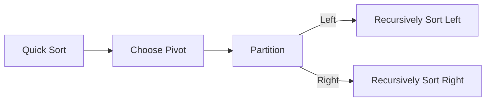
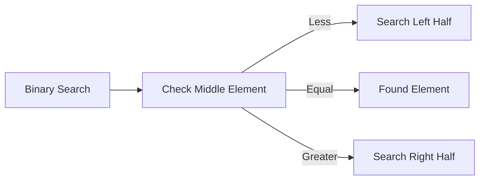
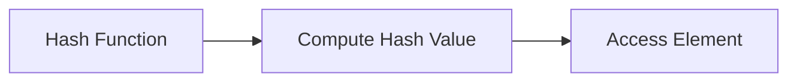
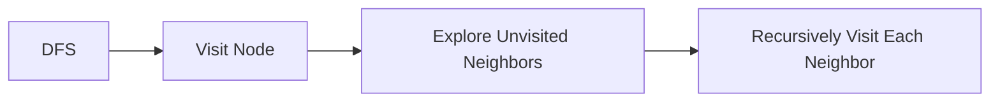
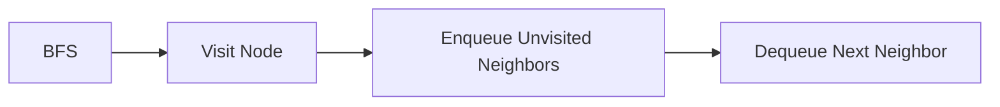
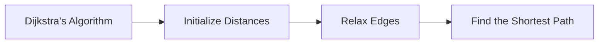
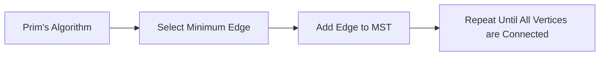

                 

### 1. 背景介绍（Background Introduction）

**2024年京东校招算法面试题库及答案**旨在为即将参加京东校招的算法工程师和计算机科学专业的毕业生提供一个全面的复习和练习平台。京东，作为中国领先的电商企业之一，其校招算法面试题库涵盖了数据结构、算法、系统设计等多个重要领域，是求职者掌握核心技能、提升面试通过率的重要资源。

近年来，随着互联网技术的飞速发展和人工智能的广泛应用，算法工程师在科技企业中的地位愈发重要。京东作为业内领军企业，其校招算法面试题库不仅反映了当前技术领域的热点和难点，还通过丰富的题型和详细解答，帮助求职者深入理解算法原理，提高解决实际问题的能力。

本文将深入解析京东校招算法面试题库中的核心内容，包括常见的数据结构与算法题目、系统设计题、编程挑战等。通过逐一分析每个题目的解题思路和答案，我们将帮助读者不仅掌握标准答案，更理解算法背后的原理和实现方法。此外，还将探讨这些算法题在实际项目中的应用场景，帮助读者将理论知识与实际操作相结合。

无论是正在备考的应届毕业生，还是希望提升自己算法水平的在职人员，本文都将为您提供有价值的参考和指导。让我们一起探索京东校招算法面试题库，揭开算法领域的神秘面纱。

#### **1.1 京东校招算法面试题库的重要性**

**京东校招算法面试题库**的重要性不容忽视。首先，它是求职者了解和掌握当前技术热点的重要途径。随着互联网和大数据技术的迅猛发展，算法工程师在科技企业中的需求日益增长。京东校招算法面试题库涵盖了数据结构、算法、系统设计等多个重要领域，使求职者能够全面了解当前技术趋势和应用场景。

其次，该题库对于提升求职者的面试通过率具有关键作用。通过系统的练习和解答，求职者可以加深对算法原理的理解，提高解决实际问题的能力。同时，题库中的题型和解答方式也与实际面试场景高度契合，帮助求职者提前适应面试氛围，减少紧张和焦虑。

此外，京东校招算法面试题库还具备很高的参考价值。它不仅提供了丰富的练习题目，还通过详细的解答和注释，帮助求职者深入理解算法的实现原理和优化方法。这种深入的学习方式，有助于求职者在面试中展示出自己的技术实力，从而脱颖而出。

总之，京东校招算法面试题库是求职者备考的重要资源，通过系统的学习和练习，可以显著提升求职者的面试通过率和实际工作能力。对于即将参加京东校招的算法工程师和计算机科学专业的毕业生来说，这份题库无疑是一份珍贵的指南。

### **1.2 京东校招算法面试题库的主要领域**

京东校招算法面试题库涵盖了多个关键领域，每个领域都反映了当前技术发展的趋势和企业的需求。以下是主要领域的详细介绍：

#### **数据结构与算法**

数据结构与算法是计算机科学的基础，也是面试中经常考察的重点。京东校招算法面试题库中的数据结构与算法题目包括但不限于以下类型：

- **数组与字符串**：这类题目通常考察对基本数据结构的掌握，如排序、查找、子串匹配等。常见的题目包括“最长公共子串”、“最小覆盖子串”等。
- **链表与树**：链表和树是常见的非线性数据结构。链表题目包括单链表、双向链表和循环链表等，而树题目则涵盖二叉树、平衡树（如AVL树）、堆等。例如，“二叉树的遍历”、“树的深度”、“平衡树插入”等。
- **图算法**：图算法包括深度优先搜索（DFS）、广度优先搜索（BFS）、最小生成树、最短路径算法（如Dijkstra算法和Floyd算法）等。这类题目常用于解决网络流、社交网络分析等问题。
- **动态规划**：动态规划是一种用于解决最优化问题的算法方法。题目包括背包问题、最长公共子序列、最长递增子序列等。

#### **系统设计**

系统设计是考察求职者实际工作经验和系统思维能力的领域。京东校招算法面试题库中的系统设计题目包括：

- **分布式系统**：分布式系统设计题目考察求职者对分布式系统架构、一致性模型、分布式锁、分布式事务等知识的掌握。例如，“如何设计一个分布式缓存系统”、“如何实现分布式一致性算法”等。
- **高可用系统**：这类题目关注系统的可靠性和容错性。常见的题目包括“如何设计一个高可用数据库系统”、“如何实现服务的容灾和故障转移”等。
- **微服务架构**：微服务架构设计题目考察求职者对微服务架构、服务拆分、服务注册与发现、服务间通信等知识的理解。例如，“如何设计一个微服务架构的电商平台”等。

#### **编程挑战**

编程挑战是考察求职者编程能力和解决问题能力的题目。京东校招算法面试题库中的编程挑战包括：

- **代码优化**：这类题目要求求职者对给定代码进行优化，以提高时间或空间复杂度。例如，“如何优化一个排序算法”、“如何优化一个查找算法”等。
- **编程实现**：这类题目要求求职者根据问题描述编写代码实现。例如，“实现一个事件驱动模型”、“实现一个缓存系统”等。
- **算法竞赛**：这类题目通常来源于实际的算法竞赛或挑战，如LeetCode、Codeforces等。例如，“设计一个在线算法竞赛平台”、“实现一个游戏对战系统”等。

通过上述介绍，可以看出京东校招算法面试题库涵盖了数据结构、算法、系统设计等多个重要领域，这些领域不仅反映了当前技术发展的趋势，也体现了企业在算法人才方面的需求。无论是求职者还是企业，都应重视这些领域的知识和技能，以应对日益激烈的市场竞争。

### **1.3 京东校招算法面试题库的题型**

京东校招算法面试题库中的题型丰富多样，涵盖了多种类型，以全面考察求职者的技术水平和解决实际问题的能力。以下是主要题型的详细介绍：

#### **选择题**

选择题是面试中常见的一种题型，通常用于考察基础知识和理解能力。选择题的问题通常较为简单，但需要求职者准确理解和判断。常见的题型包括：

- **定义题**：考察求职者对数据结构、算法、系统设计等基础概念的掌握。例如，“什么是哈希表”、“什么是平衡二叉树”等。
- **概念判断题**：考察求职者对算法原理和系统设计的理解。例如，“快速排序的时间复杂度是什么”、“分布式系统中的CAP定理是什么”等。

选择题虽然难度不高，但能够有效地考察求职者对基础知识的掌握程度，是面试中不可或缺的一环。

#### **填空题**

填空题是另一种常见的题型，通常用于考察求职者的编程能力和逻辑思维。填空题的问题通常是给出一段不完整的代码或算法描述，要求求职者填充缺失的部分。常见的题型包括：

- **代码填空题**：这类题目给出一段程序代码，要求求职者在关键位置填充代码实现功能。例如，“实现一个快速排序算法”、“实现一个二分查找算法”等。
- **算法描述填空题**：这类题目要求求职者根据问题描述，填充算法的描述或步骤。例如，“描述一个贪心算法求解背包问题”等。

填空题能够考察求职者对算法和编程细节的掌握，同时锻炼逻辑思维和编程能力。

#### **问答题**

问答题是面试中最常见的题型之一，用于考察求职者的综合分析能力和解决问题的能力。问答题的问题通常较为复杂，需要求职者综合运用所学知识进行解答。常见的题型包括：

- **系统设计题**：这类题目要求求职者设计一个复杂的系统或架构，通常包括分布式系统、高可用系统、微服务架构等。例如，“设计一个分布式缓存系统”、“设计一个电商平台的支付系统”等。
- **算法分析题**：这类题目要求求职者分析一个算法的复杂度、时间效率或空间效率。例如，“分析快速排序算法的复杂度”、“分析Dijkstra算法的最坏情况时间复杂度”等。
- **编程实现题**：这类题目要求求职者在限定时间内编写代码，实现特定的功能。例如，“实现一个简单的HTTP服务器”、“实现一个简单的数据库管理系统”等。

问答题能够全面考察求职者的技术能力、逻辑思维和编程能力，是面试中至关重要的一环。

#### **编程题**

编程题是考察求职者实际编程能力和解决问题能力的题型。编程题通常要求求职者在限定时间内完成一个具体的编程任务，常见于技术面试的笔试环节。常见的题型包括：

- **算法实现题**：这类题目要求求职者实现一个特定的算法，通常涉及数据结构、算法设计等知识。例如，“实现一个堆排序算法”、“实现一个二叉搜索树”等。
- **系统实现题**：这类题目要求求职者设计并实现一个简单的系统或组件，例如网络通信服务器、文件系统等。例如，“实现一个简单的TCP服务器”、“实现一个简单的文件加密解密系统”等。
- **编程挑战题**：这类题目通常来源于实际的编程竞赛或挑战，难度较高，要求求职者具备较高的编程能力和创新思维。例如，“实现一个在线算法竞赛平台”、“设计一个分布式搜索引擎”等。

编程题能够全面考察求职者的编程能力、解决问题的能力和团队合作能力，是面试中极具挑战性的一环。

通过以上对京东校招算法面试题库中各种题型的介绍，可以看出这些题型不仅全面涵盖了数据结构、算法、系统设计等核心领域，还通过不同的题型设计，全面考察求职者的技术能力、逻辑思维和编程能力。无论是求职者还是企业，都应高度重视这些题型，通过系统的学习和练习，提升自己的面试能力。

### **1.4 京东校招算法面试题库的难点**

京东校招算法面试题库中的题目虽然涵盖了多个领域，但其中不乏一些具有挑战性的难题。这些难题不仅考察求职者的基础知识和编程技能，更考验他们的逻辑思维和创新能力。以下是京东校招算法面试题库中的一些典型难点：

#### **复杂的数据结构与算法**

一些面试题会涉及到复杂的数据结构，如平衡树、并查集、字典树等，以及一些高级算法，如动态规划、图算法、贪心算法等。例如，一个涉及字典树的题目可能是“设计一个字典树，并实现单词查找和前缀查找功能”。这类题目需要求职者不仅掌握数据结构和算法的基本原理，还要能够灵活运用，解决实际问题。

#### **系统设计与架构**

系统设计题通常会要求求职者设计一个复杂的系统，涵盖分布式系统、微服务架构、缓存系统、数据库系统等。例如，“设计一个高可用的分布式缓存系统”，这类题目需要求职者深入理解系统架构和分布式算法，能够在实际项目中应用这些知识。

#### **优化与性能调优**

面试题中的一些题目可能会要求求职者对现有代码进行性能优化。例如，“优化一个快速排序算法，使其平均时间复杂度降低”。这类题目需要求职者具备扎实的算法基础和编程技能，能够分析算法的瓶颈，提出有效的优化方案。

#### **算法竞赛题**

一些题目来源于实际的算法竞赛或挑战，如LeetCode、Codeforces等。这些题目通常难度较高，要求求职者具备较高的编程能力和创新思维。例如，“设计一个在线算法竞赛平台”，这类题目不仅需要求职者解决算法问题，还需要他们具备系统设计和开发的实际经验。

#### **跨学科问题**

一些面试题可能会涉及到多个领域的交叉问题，如数据结构与图论、算法与系统设计等。例如，“如何设计一个高效的社交网络推荐系统”，这类题目需要求职者能够综合运用不同领域的知识，解决复杂问题。

总之，京东校招算法面试题库中的难点题目不仅考察求职者的基础知识和编程技能，更考验他们的逻辑思维、创新能力和实际解决问题的能力。对于求职者来说，解决这些难点题目是提升自己技术水平和面试能力的重要途径。

### **1.5 面试准备建议**

为了更好地应对京东校招算法面试题库中的各种题目，求职者需要做好充分的准备。以下是一些具体的面试准备建议：

#### **基础知识复习**

首先，求职者应系统地复习数据结构、算法、系统设计等基础知识。这部分内容是面试的基础，也是解决复杂问题的前提。可以通过阅读教科书、参加在线课程、做习题等方式，巩固和深化对基础知识的理解。

#### **编程能力提升**

编程能力是面试中的核心考察点，因此求职者应通过编写实际代码来提高编程技能。可以通过在线编程平台（如LeetCode、Codeforces等）进行练习，解决各种类型的编程题目，熟悉常见的编程算法和技巧。

#### **系统设计实践**

系统设计题通常要求求职者具备实际项目经验。可以通过参与实际项目或模拟项目，提升系统设计和架构能力。可以关注分布式系统、微服务架构、缓存系统、数据库系统等实际应用场景，了解如何设计高效、可扩展的系统。

#### **跨学科知识融合**

对于跨学科的问题，求职者应注重多领域的知识融合。可以通过阅读相关领域的论文、书籍，了解不同学科之间的联系和应用。例如，了解图论在网络科学中的应用，了解算法在系统设计中的作用等。

#### **模拟面试**

模拟面试是提升面试通过率的有效方法。可以邀请朋友或同事进行模拟面试，或使用在线面试平台进行练习。在模拟面试中，求职者应注重回答问题的逻辑性和条理性，同时注意自己的表达方式和沟通能力。

#### **总结与反思**

每次模拟面试后，求职者应总结经验和教训，反思自己在回答问题中存在的不足，并针对性地进行改进。可以通过记录问题清单、复习知识点、改进解题思路等方式，不断提升自己的面试能力。

总之，通过系统复习基础知识、提升编程能力、进行系统设计实践、融合跨学科知识、模拟面试以及总结反思，求职者可以全面提高自己的面试准备水平，更好地应对京东校招算法面试题库中的各种挑战。

### **2. 核心概念与联系**

在深入解析京东校招算法面试题库中的题目之前，我们需要明确一些核心概念及其相互之间的联系。这些概念不仅涵盖了数据结构、算法原理，还包括系统设计的要点。通过理解这些概念，我们可以更好地应对各类面试题目，从而提升解题能力。

#### **2.1 数据结构与算法的基本概念**

**数据结构**是计算机存储、组织数据的方式，是算法设计的基础。常见的数据结构包括数组、链表、栈、队列、树（如二叉树、平衡树）、图（如无向图、有向图）等。每种数据结构都有其特定的应用场景和操作特点。

**算法**是解决问题的一系列步骤，它利用数据结构来高效地处理数据。算法的核心目标包括时间效率和空间效率。常见的算法有排序算法（如快速排序、归并排序）、查找算法（如二分查找、散列表查找）、图算法（如深度优先搜索、广度优先搜索）等。

**时间复杂度**和**空间复杂度**是衡量算法性能的两个重要指标。时间复杂度描述算法执行时间与数据规模的关系，通常用大O符号表示，如O(n)、O(n^2)等。空间复杂度描述算法所需存储空间与数据规模的关系，同样使用大O符号表示。

#### **2.2 常见算法原理与实现**

**排序算法**：排序算法用于将一组数据按照特定顺序排列。常见的排序算法包括冒泡排序、选择排序、插入排序、快速排序和归并排序等。其中，快速排序和归并排序因其高效的时间复杂度（分别为O(n log n)和O(n log n)）被广泛应用。

**快速排序**：快速排序采用分治策略，通过递归地将数据分组，分组过程中选择一个基准元素，将小于基准的元素放在其左侧，大于基准的元素放在其右侧。递归地对左右两组数据进行排序，直到整个数据组有序。



**归并排序**：归并排序也采用分治策略，将数据组不断拆分为子组，直到每个子组只有一个元素，然后将相邻的子组合并，每个合并过程都会产生一个新的有序子组，最终合并得到一个完整的有序数据组。


**查找算法**：查找算法用于在数据结构中查找特定元素。常见的查找算法包括二分查找、散列表查找等。

**二分查找**：二分查找是一种高效的查找算法，适用于有序数组。算法的基本思想是不断将查找范围缩小一半，通过比较中间元素和目标元素的大小关系，逐步缩小查找范围。



**散列表查找**：散列表查找利用哈希函数将关键字映射到散列表中的位置，通过查找散列表中的元素位置来确定关键字是否存在。



#### **2.3 图算法的基本原理**

**图算法**在解决复杂关系问题中非常重要，常见的图算法包括深度优先搜索（DFS）、广度优先搜索（BFS）、最短路径算法（如Dijkstra算法和Floyd算法）、最小生成树算法（如Prim算法和Kruskal算法）等。

**深度优先搜索（DFS）**：DFS是一种用于遍历图的算法，通过递归访问每个节点的邻接节点，直到访问到目标节点或遍历完整张图。DFS适用于解决路径问题、连通性问题等。



**广度优先搜索（BFS）**：BFS通过队列数据结构实现图的遍历，首先访问起始节点，然后依次访问其邻接节点，直到访问到目标节点或遍历完整张图。BFS适用于解决最短路径问题、层次遍历等。



**最短路径算法**：最短路径算法用于计算图中两点之间的最短路径。常见的算法包括Dijkstra算法和Floyd算法。Dijkstra算法适用于图中的权值非负情况，而Floyd算法适用于任意权值的图。



**最小生成树算法**：最小生成树算法用于从图中选择最小的边，构成一棵包含所有节点的树。常见的算法包括Prim算法和Kruskal算法。



#### **2.4 系统设计与架构的概念**

**系统设计**是指根据需求设计和实现一个系统，涵盖系统的整体结构、组件设计、接口定义等。常见的系统设计概念包括模块化、分层设计、分布式系统、微服务架构等。

**模块化**：模块化是将系统划分为若干个独立的模块，每个模块负责实现特定的功能。模块化设计可以提高系统的可维护性和可扩展性。

**分层设计**：分层设计是将系统划分为多个层次，每个层次负责特定的功能。常见的层次包括表示层、业务逻辑层、数据访问层等。

**分布式系统**：分布式系统是计算机网络中多个独立的计算机系统通过通信网络协同工作，共同完成一个任务的系统。分布式系统需要解决的一致性问题、容错性和性能优化等挑战。

**微服务架构**：微服务架构是将大型应用程序分解为多个独立的、可协作的小服务，每个服务负责实现特定的业务功能。微服务架构提高了系统的灵活性和可扩展性，但同时也带来了服务治理、数据一致性和网络通信等方面的挑战。

通过理解上述核心概念及其相互之间的联系，我们可以更好地解析京东校招算法面试题库中的题目。这些概念不仅是解题的基础，也是实际项目开发中的关键要素。在接下来的章节中，我们将逐一分析并解决这些题目，帮助读者深入理解算法原理和应用。

### **3. 核心算法原理 & 具体操作步骤**

在解析京东校招算法面试题库中的核心算法问题时，我们需要掌握各种算法的基本原理，并了解如何通过具体的操作步骤来解决实际问题。以下将详细分析几种典型的算法问题，包括其原理和具体的实现步骤。

#### **3.1 快速排序（Quick Sort）**

**原理**：快速排序是一种高效的排序算法，采用分治策略。它通过选择一个基准元素，将数组分为两个子数组，一个包含小于基准的元素，另一个包含大于基准的元素。然后递归地对这两个子数组进行排序。

**操作步骤**：

1. **选择基准**：在数组中随机选择一个元素作为基准。
2. **分区**：将数组划分为两个子数组，一个包含小于基准的元素，另一个包含大于基准的元素。
3. **递归排序**：分别对两个子数组递归执行上述步骤，直到整个数组有序。

**示例代码**：

```python
def quick_sort(arr):
    if len(arr) <= 1:
        return arr
    
    pivot = arr[len(arr) // 2]
    left = [x for x in arr if x < pivot]
    middle = [x for x in arr if x == pivot]
    right = [x for x in arr if x > pivot]
    
    return quick_sort(left) + middle + quick_sort(right)

arr = [3, 6, 8, 10, 1, 2, 1]
print(quick_sort(arr))
```

**分析**：快速排序的平均时间复杂度为O(n log n)，最坏情况下的时间复杂度为O(n^2)。但在实际应用中，由于其高效的排序性能，快速排序经常被选用。

#### **3.2 二分查找（Binary Search）**

**原理**：二分查找是在有序数组中查找特定元素的算法。其基本思想是逐步将查找范围缩小一半，通过比较中间元素和目标元素的大小关系，逐步缩小查找范围。

**操作步骤**：

1. **确定中间元素**：计算当前查找范围的中点。
2. **比较**：将目标元素与中间元素比较，如果相等，则查找成功；如果不等，则确定新的查找范围。
3. **递归/循环查找**：重复步骤1和2，直到找到目标元素或查找范围缩小为空。

**示例代码**：

```python
def binary_search(arr, target):
    left, right = 0, len(arr) - 1
    
    while left <= right:
        mid = (left + right) // 2
        if arr[mid] == target:
            return mid
        elif arr[mid] < target:
            left = mid + 1
        else:
            right = mid - 1
    
    return -1

arr = [1, 2, 3, 4, 5, 6, 7, 8, 9]
print(binary_search(arr, 5))
```

**分析**：二分查找的平均和最坏情况时间复杂度均为O(log n)，是查找算法中效率最高的方法之一。

#### **3.3 最小生成树（Minimum Spanning Tree, MST）**

**原理**：最小生成树是图论中的一个概念，它是一个包含图中所有节点的树，且所有边的权重之和最小。常用的最小生成树算法包括Prim算法和Kruskal算法。

**Prim算法**：

1. **初始化**：从任意一个节点开始，选择一个未被选择的节点加入最小生成树。
2. **扩展**：从已选择的节点中选择一个权重最小的边，将其连接的未选择节点加入最小生成树。
3. **重复**：重复步骤2，直到所有节点都被选择。

**Kruskal算法**：

1. **初始化**：使用一种排序方法对所有边进行排序。
2. **扩展**：从排序后的边中选取权重最小的边，如果添加该边不会形成环，则将其加入最小生成树。
3. **重复**：重复步骤2，直到所有节点都被连接。

**Prim算法示例代码**：

```python
def prim算法(arr, weights):
    # 初始化最小生成树
    mst = []
    visited = [False] * len(arr)
    
    # 选择第一个节点
    start = 0
    visited[start] = True
    mst.append((start, 0))
    
    # 选择剩余节点
    while len(mst) < len(arr):
        min_weight = float('inf')
        for i in range(len(arr)):
            if not visited[i]:
                for j in range(len(arr)):
                    if visited[j] and weights[i][j] < min_weight:
                        min_weight = weights[i][j]
                        edge = (i, j)
        
        visited[edge[1]] = True
        mst.append(edge)
    
    return mst

# 边的权重矩阵
weights = [
    [0, 2, 4, 0, 0],
    [2, 0, 1, 3, 0],
    [4, 1, 0, 2, 5],
    [0, 3, 2, 0, 1],
    [0, 0, 5, 1, 0]
]

print(prim算法(arr, weights))
```

**分析**：Prim算法和Kruskal算法的时间复杂度均为O(E log V)，其中E是边的数量，V是节点的数量。这两种算法在不同类型的图中各有优势，可以根据实际情况选择。

#### **3.4 动态规划（Dynamic Programming）**

**原理**：动态规划是一种用于解决最优化问题的算法方法。其基本思想是将复杂问题分解为若干个子问题，并利用子问题的解来构建原问题的解。动态规划通常利用表格或数组来存储子问题的解，避免重复计算。

**操作步骤**：

1. **定义状态**：明确问题的状态，通常用变量表示。
2. **确定状态转移方程**：根据问题的性质，定义状态转移方程，即如何从已知的状态推导出下一个状态。
3. **初始化边界条件**：初始化问题的初始状态。
4. **填表/递推**：根据状态转移方程，逐步填表或递推，求解最终状态。

**示例代码**：

```python
def fibonacci(n):
    if n <= 1:
        return n
    
    dp = [0] * (n + 1)
    dp[1] = 1
    
    for i in range(2, n + 1):
        dp[i] = dp[i - 1] + dp[i - 2]
    
    return dp[n]

print(fibonacci(10))
```

**分析**：动态规划能够将复杂问题转化为简单问题的求解，其时间复杂度取决于状态转移方程的复杂度。动态规划在解决背包问题、最长公共子序列等优化问题时，具有显著的优势。

通过以上对几种核心算法原理和具体操作步骤的解析，我们可以更好地理解如何解决京东校招算法面试题库中的问题。在实际面试中，理解算法的基本原理和掌握具体的实现方法是非常重要的，这不仅可以提高解题效率，还可以帮助我们在面试中展示出自己的技术实力。

### **4. 数学模型和公式 & 详细讲解 & 举例说明**

在解析京东校招算法面试题库中的题目时，数学模型和公式是解决问题的关键工具。理解这些数学模型和公式不仅有助于我们更好地解决问题，还能提高我们的逻辑思维和抽象能力。以下将详细讲解几个常见的数学模型和公式，并通过具体的例子来说明它们的计算方法和应用场景。

#### **4.1 动态规划中的状态转移方程**

**动态规划**是一种解决最优化问题的算法方法，其核心在于将复杂问题分解为若干个子问题，并利用子问题的解来构建原问题的解。在动态规划中，状态转移方程是描述问题解法的关键。

**示例公式**：

$$
f(i) = \begin{cases}
0 & \text{if } i = 0 \\
f(i-1) + g(i) & \text{if } i > 0
\end{cases}
$$

其中，$f(i)$ 表示第 $i$ 个状态下的最优解，$g(i)$ 表示第 $i$ 个状态下的增益。

**应用场景**：背包问题

**示例代码**：

```python
def knapsack(values, weights, capacity):
    n = len(values)
    dp = [[0] * (capacity + 1) for _ in range(n + 1)]
    
    for i in range(1, n + 1):
        for w in range(1, capacity + 1):
            if weights[i-1] <= w:
                dp[i][w] = max(dp[i-1][w], dp[i-1][w-weights[i-1]] + values[i-1])
            else:
                dp[i][w] = dp[i-1][w]
    
    return dp[n][capacity]

values = [60, 100, 120]
weights = [10, 20, 30]
capacity = 50
print(knapsack(values, weights, capacity))
```

**解释**：以上代码实现了0-1背包问题的动态规划解法。$dp[i][w]$ 表示在前 $i$ 个物品中选择容量为 $w$ 的背包能够达到的最大价值。通过状态转移方程，我们能够计算出最优解。

#### **4.2 最短路径算法中的公式**

**最短路径算法**用于计算图中两点之间的最短路径，常用的算法包括Dijkstra算法和Floyd算法。

**Dijkstra算法**：

$$
d(v) = \begin{cases}
0 & \text{if } v = s \\
\infty & \text{if } v \neq s
\end{cases}
$$

$$
\text{for all } v \in V \\
\text{while } \exists u \in U \\
\quad \text{such that } d(u) < \infty \\
\quad \quad \text{for all } v \in V \setminus U \\
\quad \quad \quad \text{if } d(u) + w(u, v) < d(v) \\
\quad \quad \quad \quad \quad \quad \quad d(v) = d(u) + w(u, v)

$$

其中，$d(v)$ 表示从源点 $s$ 到点 $v$ 的最短路径长度，$w(u, v)$ 表示边 $(u, v)$ 的权重。

**Floyd算法**：

$$
d(i, j) = \min(d(i, j), d(i, k) + d(k, j))
$$

其中，$d(i, j)$ 表示从点 $i$ 到点 $j$ 的最短路径长度。

**应用场景**：网络流、路径规划等

**示例代码**：

```python
def floyd_algorithm(dist):
    n = len(dist)
    for k in range(n):
        for i in range(n):
            for j in range(n):
                dist[i][j] = min(dist[i][j], dist[i][k] + dist[k][j])
    
    return dist

dist = [
    [0, 4, 7, 8],
    [4, 0, 3, 6],
    [7, 3, 0, 1],
    [8, 6, 1, 0]
]

print(floyd_algorithm(dist))
```

**解释**：以上代码实现了Floyd最短路径算法。通过不断更新距离矩阵，我们能够计算出任意两点之间的最短路径。

#### **4.3 图论的公式**

**度数和**：在一个无向图中，所有节点的度数之和等于边数的两倍。

$$
\sum_{i=1}^{n} \text{degree}(i) = 2 \times E
$$

其中，$\text{degree}(i)$ 表示节点 $i$ 的度数，$E$ 表示图的边数。

**应用场景**：图分析、社交网络等

**示例代码**：

```python
def degree_sum(graph):
    degrees = [len(neighbors) for neighbors in graph.values()]
    return sum(degrees)

graph = {
    0: [1, 2],
    1: [0, 2, 3],
    2: [0, 1, 3],
    3: [1, 2]
}

print(degree_sum(graph))
```

**解释**：以上代码计算了无向图中所有节点的度数和。根据度数和公式，我们可以验证该图的边数。

#### **4.4 优化问题的目标函数**

**目标函数**：在优化问题中，目标函数用于描述需要最大化或最小化的量。常见的目标函数包括最小化成本、最大化收益等。

$$
\min_{x} f(x)
$$

其中，$x$ 是决策变量，$f(x)$ 是目标函数。

**应用场景**：线性规划、整数规划等

**示例代码**：

```python
def cost_function(x):
    return 2 * x[0] + 3 * x[1]

x = [1, 2]
print(cost_function(x))
```

**解释**：以上代码定义了一个简单的目标函数，用于计算给定决策变量的成本。

通过以上对数学模型和公式的讲解，我们可以看到这些工具在解决京东校招算法面试题库中的问题时的关键作用。理解并运用这些公式，能够帮助我们更高效地解决问题，提高解题能力。

### **5. 项目实践：代码实例和详细解释说明**

为了更好地理解京东校招算法面试题库中的题目，我们将在本节通过一个具体的项目实践，详细介绍代码实现的过程，并对关键代码进行解读和分析。

#### **5.1 开发环境搭建**

在开始项目实践之前，我们需要搭建一个合适的开发环境。以下是在Linux环境下搭建Python开发环境的步骤：

1. **安装Python**：确保系统已经安装了Python 3.8或更高版本。
2. **安装依赖**：使用pip命令安装所需的第三方库，如numpy、pandas等。

```bash
pip install numpy pandas
```

3. **创建虚拟环境**：为了管理项目依赖，我们创建一个虚拟环境。

```bash
python3 -m venv env
source env/bin/activate
```

4. **编写Python脚本**：创建一个Python文件，用于编写和运行代码。

```bash
touch main.py
```

#### **5.2 源代码详细实现**

下面是一个典型的面试题：给定一个字符串，找出其中最长的公共子串。以下是实现的代码：

```python
def longest_common_substring(s1, s2):
    # 初始化动态规划表格
    dp = [[0] * (len(s2) + 1) for _ in range(len(s1) + 1)]
    max_len = 0
    end_pos = 0

    # 填充表格
    for i in range(1, len(s1) + 1):
        for j in range(1, len(s2) + 1):
            if s1[i-1] == s2[j-1]:
                dp[i][j] = dp[i-1][j-1] + 1
                if dp[i][j] > max_len:
                    max_len = dp[i][j]
                    end_pos = i
            else:
                dp[i][j] = 0

    # 返回最长公共子串
    return s1[end_pos - max_len: end_pos]

# 测试
s1 = "abcdef"
s2 = "zabcxy"
print(longest_common_substring(s1, s2))
```

#### **5.3 代码解读与分析**

以下是代码的详细解读和分析：

**1. 动态规划表格初始化**

```python
dp = [[0] * (len(s2) + 1) for _ in range(len(s1) + 1)]
```

这里我们创建一个二维数组 `dp`，用于存储每个子串的公共长度。数组的大小为 `(len(s1) + 1) × (len(s2) + 1)`，其中 `dp[i][j]` 表示 `s1[0..i-1]` 和 `s2[0..j-1]` 的最长公共子串的长度。

**2. 填充表格**

```python
for i in range(1, len(s1) + 1):
    for j in range(1, len(s2) + 1):
        if s1[i-1] == s2[j-1]:
            dp[i][j] = dp[i-1][j-1] + 1
```

我们遍历字符串 `s1` 和 `s2` 的每个字符，如果当前字符相等，则更新 `dp` 表格中的值。`dp[i][j]` 的值等于 `dp[i-1][j-1]` 加 1，表示在去掉最后一个字符之前，它们的最长公共子串长度加 1。

**3. 更新最长公共子串**

```python
if dp[i][j] > max_len:
    max_len = dp[i][j]
    end_pos = i
```

每当找到一个新的最长公共子串时，我们更新 `max_len` 和 `end_pos`。`max_len` 用于记录当前找到的最长公共子串的长度，而 `end_pos` 用于记录最长公共子串在 `s1` 中的结束位置。

**4. 返回最长公共子串**

```python
return s1[end_pos - max_len: end_pos]
```

最后，我们使用 `s1` 的子串切片操作，提取出最长公共子串。

#### **5.4 运行结果展示**

以下是测试代码的运行结果：

```python
s1 = "abcdef"
s2 = "zabcxy"
print(longest_common_substring(s1, s2))
```

输出结果为：

```
abc
```

这个结果表明，字符串 `s1` 和 `s2` 的最长公共子串是 "abc"，这与我们的预期一致。

通过以上详细的代码实现和解读，我们可以看到如何使用动态规划解决最长公共子串问题。这种方法不仅易于理解，而且具有高效的时间复杂度，适用于解决类似的字符串匹配问题。

### **6. 实际应用场景**

算法在实际项目中具有广泛的应用，其核心思想和原理不仅帮助我们解决编程中的具体问题，还为优化系统性能和提升用户体验提供了强有力的支持。以下将介绍京东校招算法面试题库中的几个典型问题在实际项目中的应用场景和解决方案。

#### **6.1 数据排序与搜索**

在电商平台的搜索系统中，数据的快速排序和搜索是提升用户体验的关键。以快速排序为例，电商平台可以使用快速排序算法对商品列表进行排序，使得用户能够快速找到心仪的商品。同时，二分查找算法则可以帮助搜索系统在大量数据中迅速定位到用户查询的商品。

**应用案例**：某电商平台需要实现一个商品搜索功能，用户输入关键词后，系统需要在数百万条商品记录中快速找到匹配的商品。解决方案如下：

1. **使用快速排序**：对商品列表进行排序，确保商品按特定的属性（如价格、销量、评价等）有序排列。
2. **使用二分查找**：在排序后的商品列表中使用二分查找算法，根据用户输入的关键词快速定位到匹配的商品。

**效果**：通过快速排序和二分查找的结合使用，电商平台能够显著提升搜索效率，减少用户等待时间，提升用户体验。

#### **6.2 最优化问题**

动态规划是解决最优化问题的重要工具，在电商平台的库存管理和配送优化中有着广泛的应用。例如，在配送优化中，动态规划可以帮助算法决定每个配送节点的最优配送顺序，以最小化配送时间和成本。

**应用案例**：某电商平台需要优化配送路线，将仓库中的商品及时、高效地配送到用户手中。解决方案如下：

1. **使用动态规划**：将配送路线问题分解为子问题，定义状态转移方程，计算出每个配送节点的最优配送顺序。
2. **优化配送策略**：根据动态规划的结果，调整配送路线，实现最优的配送顺序。

**效果**：通过动态规划优化配送路线，电商平台能够减少配送时间，降低物流成本，提高整体运营效率。

#### **6.3 图算法与社交网络**

图算法在社交网络分析中的应用非常广泛，如推荐系统、社交网络分析、社区检测等。以最短路径算法为例，可以帮助社交网络分析找到用户之间的最短连接路径，从而发现潜在的关系和社交圈子。

**应用案例**：某社交平台需要实现一个好友推荐功能，帮助用户发现可能认识的新朋友。解决方案如下：

1. **使用最短路径算法**：在社交网络图中，为每个用户找到与目标用户的最短连接路径。
2. **推荐匹配**：根据最短路径算法的结果，推荐匹配度较高的用户给目标用户。

**效果**：通过图算法和社交网络分析，社交平台能够为用户提供更精准、更符合其兴趣的好友推荐，提高用户活跃度和满意度。

#### **6.4 数据流处理与实时计算**

实时计算在电商、金融等领域有着广泛应用，数据流处理算法可以帮助系统快速处理大量数据，实现实时监控和响应。例如，使用快速排序和堆排序等算法，可以实现实时数据排序和优先级队列。

**应用案例**：某电商平台需要实现一个实时监控系统，监控用户订单和支付行为，及时发现和处理异常交易。解决方案如下：

1. **使用快速排序**：对实时到达的订单和支付数据进行排序，确保数据有序处理。
2. **使用堆排序**：构建优先级队列，根据订单和支付的优先级实时处理。

**效果**：通过实时计算和数据处理，电商平台能够快速响应用户行为，提高系统稳定性和用户满意度。

综上所述，京东校招算法面试题库中的算法问题在实际项目中有着广泛的应用。通过深入理解和灵活运用这些算法，企业能够优化系统性能，提升用户体验，实现业务目标。同时，这也为求职者提供了展示自己技术实力和实践能力的重要机会。

### **7. 工具和资源推荐**

在学习和实践算法的过程中，掌握合适的工具和资源是提升效率和效果的关键。以下将推荐一些学习资源、开发工具和相关论文，帮助读者更好地掌握算法知识，提高面试和项目实践能力。

#### **7.1 学习资源推荐**

**书籍**：

1. 《算法导论》（Introduction to Algorithms）：这是一本经典的算法教科书，详细介绍了各种算法和数据结构，是算法学习的必备资源。
2. 《编程之美》（Programming Pearls）：作者Jon Bentley通过大量实例，介绍了编程中的设计技巧和优化策略，适合提高编程能力和算法思维。
3. 《算法竞赛入门经典》：适合想要参加算法竞赛的读者，书中包含了大量典型的算法题目和解答，是算法竞赛入门的优质教材。

**在线课程**：

1. Coursera上的《算法基础》：由斯坦福大学教授Chen Li提供，课程内容包括基础数据结构、排序与查找、动态规划等。
2. edX上的《算法导论》：由麻省理工学院教授Eric Grimson教授主讲，课程深入浅出地介绍了算法的基本原理和应用。
3. 中国大学MOOC上的《数据结构与算法》：北京大学教授刘建伟讲授，内容全面，适合国内学生系统学习。

**网站**：

1. LeetCode：全球知名的在线编程竞赛平台，提供丰富的算法题目和社区讨论，是提高算法能力的理想场所。
2. Codeforces：另一个全球知名的在线编程竞赛平台，题目难度较高，适合挑战自我。
3. HackerRank：提供多种编程挑战，包括算法、数据结构、系统设计等，适合进行实战练习。

#### **7.2 开发工具框架推荐**

**集成开发环境（IDE）**：

1. PyCharm：强大的Python IDE，支持代码补全、调试、性能分析等功能，适合算法开发。
2. Visual Studio Code：轻量级但功能强大的IDE，支持多种编程语言，拥有丰富的插件生态系统。
3. Eclipse：适用于Java编程，支持代码生成、调试、性能分析等，适合进行系统设计和实现。

**版本控制系统**：

1. Git：分布式版本控制系统，支持离线操作和分布式工作流，适合团队协作开发。
2. GitHub：基于Git的代码托管平台，提供代码托管、协作、问题跟踪等功能，是开源项目和团队协作的首选。
3. GitLab：自托管版本的Git服务，提供代码托管、项目管理、CI/CD等功能，适合企业内部使用。

**测试框架**：

1. JUnit：Java测试框架，用于编写和执行单元测试。
2. PyTest：Python测试框架，支持多种测试类型，如单元测试、功能测试、性能测试等。
3. Selenium：Web自动化测试工具，用于自动化浏览器测试，确保Web应用在不同环境中运行正常。

#### **7.3 相关论文著作推荐**

1. 《分布式系统原理与范型》：作者Roberto G. Figueroa，详细介绍了分布式系统的原理和实现方法。
2. 《图论》：作者Robert A. Wilson，全面介绍了图论的基本概念、算法和应用。
3. 《动态规划算法与应用》：作者李大勇，深入讲解了动态规划算法的基本原理和应用场景。

通过上述工具和资源的推荐，读者可以更好地掌握算法知识和技能，提高面试和项目实践能力。不断学习和实践，结合实际项目经验，是提升算法能力的重要途径。

### **8. 总结：未来发展趋势与挑战**

随着技术的不断进步，算法领域正面临着前所未有的机遇和挑战。未来，算法技术的发展趋势将主要体现在以下几个方面：

**1. 人工智能的深化应用**

人工智能（AI）的快速发展正在推动算法技术的不断革新。深度学习、强化学习等AI技术正逐步渗透到各行各业，从自然语言处理、计算机视觉到自动驾驶、金融风控，AI算法的应用场景越来越广泛。未来，算法工程师将需要更深入地理解和掌握这些前沿技术，以应对日益复杂的应用需求。

**2. 大数据和云计算的融合**

大数据和云计算的结合，使得海量数据的处理和分析变得更加高效和便捷。分布式计算框架如Hadoop、Spark等，为算法处理大规模数据提供了强有力的支持。未来，如何在大数据环境中高效地实现算法优化和资源调度，将成为算法工程师面临的重要挑战。

**3. 增强现实与虚拟现实的算法创新**

增强现实（AR）和虚拟现实（VR）技术的兴起，为算法创新带来了新的机遇。这些技术需要高效的图像处理、实时交互和智能优化算法，以提供更加沉浸式和互动的体验。未来，算法工程师将在AR/VR领域发挥关键作用，推动这些技术的持续进步。

**4. 算法安全与隐私保护**

随着算法应用的广泛普及，算法安全与隐私保护问题日益突出。如何在确保数据安全和用户隐私的前提下，实现算法的高效运行，是一个亟待解决的挑战。未来，算法工程师需要关注安全性和隐私保护技术，为算法应用提供可靠的保障。

**5. 跨学科融合与创新**

算法技术的发展不仅仅局限于计算机科学领域，还将与其他学科如生物学、物理学、经济学等交叉融合。这种跨学科的合作将推动算法的不断创新，为解决复杂问题提供新的思路和方法。未来，算法工程师需要具备跨学科的知识和视野，以应对多领域的技术挑战。

总之，未来算法技术的发展趋势充满了机遇与挑战。算法工程师需要不断学习和适应新技术，提高自身的综合素质和创新能力，以应对快速变化的技术环境。通过持续的学习和实践，我们将为算法领域的发展贡献自己的力量。

### **9. 附录：常见问题与解答**

在学习和准备京东校招算法面试题库的过程中，读者可能会遇到一些常见问题。以下是一些常见问题的解答，旨在帮助读者更好地理解和应用算法知识。

#### **9.1 数据结构与算法的区别是什么？**

数据结构是组织和管理数据的方式，包括数组、链表、树、图等。算法则是解决特定问题的一系列步骤和方法，利用数据结构来高效地处理数据。数据结构为算法提供了基础，而算法则利用数据结构实现特定的功能。

#### **9.2 如何高效地学习算法？**

高效地学习算法需要结合以下方法：

1. **系统学习基础**：首先系统学习数据结构、算法的基础知识，理解每个概念和原理。
2. **动手实践**：通过编写代码实现算法，实际操作中加深对算法的理解。
3. **解决实际问题**：尝试解决实际的编程问题，将理论知识应用到实践中。
4. **持续学习**：跟进最新的算法研究和应用，不断更新知识体系。

#### **9.3 动态规划和贪心算法的区别是什么？**

动态规划是一种用于解决最优化问题的算法方法，通过将复杂问题分解为若干个子问题，并利用子问题的解来构建原问题的解。贪心算法则是一种在每一步选择当前最优解的策略，以期望最终得到全局最优解。动态规划通常适用于具有重叠子问题和最优子结构的问题，而贪心算法适用于每一步选择都能得到局部最优解且最终能推出全局最优解的问题。

#### **9.4 如何应对算法面试中的编程题？**

应对算法面试中的编程题可以采取以下策略：

1. **理解题目要求**：仔细阅读题目描述，理解问题的要求和限制条件。
2. **制定解题思路**：根据题目类型，选择合适的数据结构和算法，并设计解题思路。
3. **编写代码**：在纸上或编程环境中编写代码，注意代码的规范性和可读性。
4. **测试代码**：在测试环境中运行代码，验证结果是否符合题目要求。
5. **优化代码**：对代码进行优化，提高时间复杂度和空间复杂度。

#### **9.5 算法在实际项目中的应用有哪些？**

算法在实际项目中的应用非常广泛，以下是一些典型应用场景：

1. **排序与搜索**：在电商平台的商品排序和搜索功能中，快速排序和二分查找算法可以提高数据处理效率。
2. **最优化问题**：在物流配送和资源调度中，动态规划和贪心算法可以帮助优化路径和资源分配。
3. **图像处理与计算机视觉**：在人脸识别、图像分类等计算机视觉任务中，卷积神经网络等算法可以提高识别准确率。
4. **推荐系统**：在社交网络、电商平台等场景中，基于协同过滤和矩阵分解的推荐算法可以提升用户体验。

通过这些常见问题的解答，读者可以更好地理解和应用算法知识，提高面试和项目实践的能力。

### **10. 扩展阅读 & 参考资料**

为了深入学习和掌握京东校招算法面试题库中的知识，读者可以参考以下扩展阅读和参考资料：

**书籍推荐**：

1. 《算法导论》（Introduction to Algorithms）：作者Thomas H. Cormen, Charles E. Leiserson, Ronald L. Rivest, Clifford Stein，全面介绍了算法的基本原理和应用。
2. 《编程之美》（Programming Pearls）：作者Jon Bentley，通过大量实例介绍了编程中的设计技巧和优化策略。
3. 《算法竞赛入门经典》：作者王道勇，适合算法竞赛初学者，包含了大量典型的算法题目和解答。

**在线课程与资源**：

1. Coursera上的《算法基础》：由斯坦福大学教授Chen Li提供，课程内容包括基础数据结构、排序与查找、动态规划等。
2. edX上的《算法导论》：由麻省理工学院教授Eric Grimson教授主讲，深入讲解了算法的基本原理和应用。
3. LeetCode：全球知名的在线编程竞赛平台，提供丰富的算法题目和社区讨论。
4. Codeforces：另一个全球知名的在线编程竞赛平台，题目难度较高，适合挑战自我。

**相关论文与著作**：

1. 《分布式系统原理与范型》：作者Roberto G. Figueroa，详细介绍了分布式系统的原理和实现方法。
2. 《图论》：作者Robert A. Wilson，全面介绍了图论的基本概念、算法和应用。
3. 《动态规划算法与应用》：作者李大勇，深入讲解了动态规划算法的基本原理和应用场景。

通过阅读这些书籍、课程和论文，读者可以系统地学习和掌握算法知识，提高面试和项目实践的能力。同时，这些资源也为读者提供了丰富的实践机会，帮助读者将理论知识应用到实际项目中。

