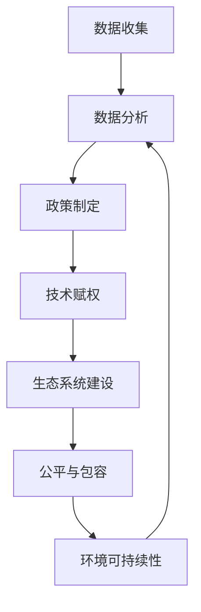

                 

### 2050年的全球减贫：从援助到赋能的可持续发展模式

#### 关键词：
- 全球减贫
- 可持续发展
- 社会创新
- 数字化赋能
- 经济包容性

#### 摘要：
本文旨在探讨2050年全球减贫的潜在路径，强调从传统援助模式向数字化赋能的转型。通过分析当前全球减贫面临的挑战，本文提出了一种全新的可持续发展模式，并探讨了其关键组成部分。文章将深入分析技术、政策和社会创新在推动减贫过程中的作用，提供一系列实际案例和研究，以展示这一模式在未来的可能性。

#### 引言

在全球范围内，减贫已成为一个重要的全球目标，也是联合国可持续发展目标（Sustainable Development Goals, SDGs）的核心之一。尽管过去几十年取得了显著进展，全球仍有大量人口生活在贫困线以下。根据世界银行的数据，截至2021年，全球约有7.89亿人生活在极端贫困中[1]。这不仅仅是一个经济问题，更是社会、环境和政治的复杂交织。因此，寻找创新的减贫策略对于实现2050年的可持续发展目标至关重要。

当前，全球减贫主要依赖于传统援助模式，包括资金支持、人道主义援助和基础设施投资。然而，这些方法在某些情况下并未达到预期的效果，甚至在某些情况下加剧了不平等和依赖性。因此，有必要探索新的方法，特别是在数字化和科技进步日益显著的今天。

本文将探讨一种从援助到赋能的转型，强调使用数字技术和社会创新来实现可持续减贫。文章结构如下：

1. **背景介绍**：回顾全球减贫的历史进程和当前挑战。
2. **核心概念与联系**：阐述数字化赋能和可持续发展模式的基本原理。
3. **核心算法原理 & 具体操作步骤**：介绍关键技术和方法。
4. **数学模型和公式 & 详细讲解 & 举例说明**：分析相关的数学模型和公式。
5. **项目实践：代码实例和详细解释说明**：提供实际应用案例。
6. **实际应用场景**：探讨数字化赋能在不同领域的应用。
7. **工具和资源推荐**：推荐相关学习和开发资源。
8. **总结：未来发展趋势与挑战**：展望未来的发展方向和潜在挑战。
9. **附录：常见问题与解答**：回答读者可能关心的问题。
10. **扩展阅读 & 参考资料**：提供进一步阅读的参考资料。

#### 1. 背景介绍

#### 1.1 全球减贫的历史进程

减贫是一个长期而复杂的任务，其历史可以追溯到几个世纪前。然而，现代全球减贫的努力主要始于20世纪中叶。1949年，联合国在《世界人权宣言》中明确承诺消除贫困。1950年，世界银行成立了“国际复兴开发银行”，旨在通过贷款和援助促进发展中国家的经济增长。此后，一系列全球性和地区性倡议和政策相继出台，如1970年的《马斯特里赫特条约》和1990年的《联合国儿童生存、保护和发展世界宣言》。

1995年，联合国成立了联合国千年发展目标（Millennium Development Goals, MDGs），其中之一就是将全球贫困率减少一半。这一目标在2015年被联合国可持续发展目标所取代，进一步强调了消除极端贫困和促进可持续发展的重要性。在过去的几十年中，全球贫困率显著下降，根据世界银行的数据，从1990年的35%降至2019年的9.2%。

#### 1.2 当前全球减贫面临的挑战

尽管取得了显著进展，全球减贫仍面临许多挑战。首先，经济不平等日益加剧。尽管全球GDP持续增长，但大部分收益集中在富裕国家和城市地区，而农村地区和贫困人口往往被边缘化。此外，全球化和市场化的推动使一些传统产业和就业机会消失，进一步加剧了贫困问题。

其次，气候变化对贫困人口的影响不容忽视。气候变化导致极端天气事件频繁发生，如洪水、干旱和飓风，这些灾害破坏了农田和基础设施，导致粮食短缺和生计受损。此外，气候变化还导致海平面上升，威胁到沿海地区的人口和生态系统。

第三，社会不平等和歧视问题仍然存在。性别、种族和地理位置等因素导致某些群体更容易陷入贫困。例如，女性在全球劳动市场中的参与度较低，而且往往面临较低的工资和不公平的工作条件。此外，种族歧视和地理隔离也使某些社区难以获得资源和机会。

最后，技术和信息的不平等加剧了减贫的难度。尽管数字技术为发展提供了巨大机遇，但全球仍有大量人口无法访问互联网或数字设备。这种数字鸿沟限制了贫困人口获取信息、教育和就业机会的能力。

#### 1.3 全球减贫的现有模式

目前，全球减贫主要依赖于以下几种模式：

1. **资金支持**：国际组织和政府通过提供财政援助、贷款和补贴来支持贫困地区的经济发展。例如，世界银行和国际货币基金组织（IMF）提供了一系列发展贷款和援助计划。

2. **人道主义援助**：在自然灾害、冲突和疫情等紧急情况下，国际组织和非政府组织提供食品、医疗物资、住房和临时救助。

3. **基础设施投资**：通过投资道路、桥梁、电网和卫生设施等基础设施，提高贫困地区的生产力和生活条件。

4. **教育和技能培训**：提供教育和职业培训，提高贫困人口的就业能力和收入水平。

5. **经济包容性政策**：通过实施减税、补贴和社会保障政策，增加贫困人口的收入和福利。

尽管这些模式在一定程度上取得了成效，但它们的局限性也日益显现。例如，资金支持往往需要长时间才能见效，而且容易受到政治和经济波动的影响。人道主义援助虽然能够缓解紧急情况，但不能解决根本问题。基础设施投资和教育培训需要大量资源和长期规划，而且效果可能因地区和文化差异而有所不同。此外，经济包容性政策需要复杂的社会和政治环境支持，而且可能导致资源分配不均。

#### 2. 核心概念与联系

#### 2.1 数字化赋能与可持续发展

数字化赋能是指利用数字技术，特别是互联网、移动设备和人工智能，来增强个体和组织的能力，实现更高效、透明和可持续的发展。在减贫领域，数字化赋能可以通过以下几种方式实现：

1. **数据获取与利用**：通过大数据和物联网技术，收集和分析贫困地区的经济、社会和环境数据，帮助决策者更好地理解贫困问题的根源，制定更有针对性的政策。

2. **远程教育和培训**：利用在线教育平台和虚拟现实技术，为贫困地区提供高质量的教育和职业培训，提高人们的技能和就业机会。

3. **电子商务和金融科技**：通过电子商务平台和移动支付系统，为贫困人口提供更方便的购物和金融服务，促进经济发展。

4. **数字政府和服务**：通过电子政务和数字公共服务，提高政府服务的透明度和效率，减少腐败和资源浪费。

5. **社会网络和协作**：利用社交媒体和协作平台，促进贫困地区社区之间的交流与合作，共同应对挑战。

可持续发展是指在满足当前需求的同时，不损害后代满足其需求的能力。在减贫领域，可持续发展意味着不仅要提高贫困人口的生活水平，还要保护环境、促进社会公平和经济增长。数字化赋能与可持续发展的联系在于：

1. **效率与可持续性**：数字化技术可以提高生产效率，减少资源浪费，从而实现更可持续的发展。

2. **包容性与公平性**：数字化赋能可以帮助贫困人口获得平等的机会，减少社会不平等，实现更公平的发展。

3. **创新与适应性**：数字化技术促进了创新和适应性，使贫困地区能够更好地应对气候变化和其他环境挑战。

#### 2.2 数字化赋能与可持续发展模式的基本原理

数字化赋能与可持续发展模式的基本原理可以概括为以下几点：

1. **数据驱动决策**：利用大数据和人工智能技术，收集和分析贫困地区的经济、社会和环境数据，帮助决策者制定更科学、更有效的政策。

2. **技术赋权**：通过提供数字设备和互联网接入，使贫困人口能够获取信息和知识，提高他们的生产力和生活质量。

3. **生态系统建设**：构建可持续的数字生态系统，包括政府、企业、非政府组织和社区的合作，共同推动数字化赋能和可持续发展。

4. **公平与包容**：确保所有群体，特别是女性、青年和边缘化群体，能够公平地获得数字化资源和服务，实现社会公平和包容。

5. **环境可持续性**：通过数字化技术，减少资源消耗和环境污染，实现环境保护和可持续发展。

#### 2.3 数字化赋能与可持续发展模式的 Mermaid 流程图

以下是一个简化的 Mermaid 流程图，展示数字化赋能与可持续发展模式的基本流程：



### 3. 核心算法原理 & 具体操作步骤

#### 3.1 数据收集与处理

数据收集是数字化赋能与可持续发展模式的关键步骤之一。数据来源包括政府统计、企业报告、社交媒体、物联网设备等。数据收集后，需要进行清洗、整合和分析，以确保数据的准确性和可靠性。

具体操作步骤如下：

1. **数据收集**：利用大数据技术和物联网设备，收集贫困地区的经济、社会和环境数据。例如，可以使用卫星遥感技术监测农田状况，使用传感器监测空气质量。

2. **数据清洗**：去除重复数据、异常值和噪声，保证数据的纯净。例如，使用Python的Pandas库进行数据清洗。

3. **数据整合**：将来自不同来源的数据进行整合，形成统一的数据库。例如，使用ETL（Extract, Transform, Load）工具。

4. **数据分析**：利用机器学习和统计分析技术，分析数据以发现趋势和模式。例如，使用Python的Scikit-learn库进行数据挖掘。

#### 3.2 政策制定与实施

基于数据分析的结果，制定针对性的政策是实现可持续发展的关键。政策制定需要涉及多个利益相关者，包括政府、企业、非政府组织和社区。

具体操作步骤如下：

1. **需求分析**：通过调研和访谈，了解贫困地区的实际需求和问题。

2. **政策设计**：根据需求分析结果，设计可行的政策方案。例如，制定减税政策、提供就业培训、建设基础设施等。

3. **政策评估**：评估政策的效果，根据评估结果进行调整。例如，使用A/B测试方法，比较不同政策方案的效果。

4. **政策实施**：将政策方案转化为具体行动，确保政策的有效实施。例如，建立监管机构、开展宣传活动、提供资金支持等。

#### 3.3 技术赋权与能力建设

技术赋权是数字化赋能的重要组成部分，旨在提高贫困人口的技能和知识水平。能力建设包括教育、培训、技能认证等。

具体操作步骤如下：

1. **在线教育**：利用在线教育平台，提供丰富的教育资源。例如，使用MOOC（Massive Open Online Courses）平台。

2. **职业培训**：根据市场需求，提供职业技能培训。例如，培训数字营销、编程和数据分析等技能。

3. **技能认证**：提供技能认证，提高贫困人口的就业竞争力。例如，使用区块链技术认证职业技能。

4. **数字素养教育**：提高贫困人口的数字素养，包括使用互联网、社交媒体和电子邮件等。

#### 3.4 生态系统建设与协作

数字化赋能与可持续发展模式的成功离不开生态系统建设和多方协作。

具体操作步骤如下：

1. **利益相关者参与**：邀请政府、企业、非政府组织、社区和学术机构等多方参与，共同制定和实施数字化赋能计划。

2. **共享资源与知识**：建立共享平台，促进资源与知识的共享。例如，建立数字图书馆、开放数据平台等。

3. **协作与合作伙伴关系**：建立协作机制，促进各方之间的合作。例如，签订合作协议、建立联合实验室等。

4. **监测与评估**：建立监测和评估机制，跟踪数字化赋能项目的进展和效果，及时调整和优化策略。

### 4. 数学模型和公式 & 详细讲解 & 举例说明

#### 4.1 数据驱动的政策制定模型

数据驱动的政策制定模型基于大数据分析和机器学习技术，旨在通过分析历史数据和实时数据，预测政策的效果并优化政策方案。以下是一个简化的模型：

$$
\text{政策效果预测模型} = f(\text{历史数据}, \text{实时数据}, \text{政策变量})
$$

其中，历史数据包括过去的政策实施情况和相关经济、社会指标；实时数据包括当前的经济、社会、环境状况；政策变量包括各种政策参数。

#### 4.2 效率与可持续性的优化模型

效率与可持续性的优化模型旨在在满足当前需求的同时，实现资源的最大化利用和环境的可持续发展。以下是一个简化的模型：

$$
\text{优化模型} = \max \frac{\text{产出}}{\text{资源消耗}} + \lambda \cdot \text{环境可持续性指标}
$$

其中，产出表示政策实施带来的经济、社会效益；资源消耗表示政策实施过程中消耗的资源，包括资金、能源和原材料；环境可持续性指标用于衡量政策实施对环境的影响。

#### 4.3 社会包容性的计算模型

社会包容性的计算模型基于社会网络分析和机器学习技术，旨在评估贫困地区的社会包容性水平。以下是一个简化的模型：

$$
\text{社会包容性指数} = f(\text{社交网络密度}, \text{社交网络多样性}, \text{社会经济指标})
$$

其中，社交网络密度表示贫困地区居民之间的联系紧密程度；社交网络多样性表示贫困地区居民的多样化程度；社会经济指标包括教育水平、收入水平、就业机会等。

#### 4.4 举例说明

以下是一个具体的政策制定案例，用于优化某贫困地区的经济发展：

1. **数据收集**：收集过去五年的政策实施数据、当前的经济、社会、环境状况，以及贫困地区的居民需求。

2. **数据分析**：使用机器学习技术，分析历史数据和实时数据，预测未来政策的效果。

3. **政策设计**：根据数据分析结果，设计一组政策方案，包括减税、提供就业培训、建设基础设施等。

4. **政策评估**：使用优化模型，评估各个政策方案的效果，选择最优方案。

5. **政策实施**：将最优政策方案转化为具体行动，确保政策的有效实施。

6. **监测与评估**：建立监测和评估机制，跟踪政策实施进展和效果，根据评估结果进行调整。

### 5. 项目实践：代码实例和详细解释说明

#### 5.1 开发环境搭建

为了实现上述的数学模型和算法，我们选择Python作为主要的编程语言，因为它拥有丰富的数据分析和机器学习库。以下是搭建开发环境的基本步骤：

1. **安装Python**：在官方网站下载并安装Python，版本建议为3.8及以上。
2. **安装Jupyter Notebook**：Python安装完成后，通过pip命令安装Jupyter Notebook，命令如下：
   ```bash
   pip install notebook
   ```
3. **安装必要的库**：安装以下库：Pandas、NumPy、Scikit-learn、Matplotlib、BeautifulSoup等。安装命令如下：
   ```bash
   pip install pandas numpy scikit-learn matplotlib beautifulsoup4
   ```

#### 5.2 源代码详细实现

以下是一个简单的示例代码，用于实现4.4节中的政策制定案例。

```python
import pandas as pd
import numpy as np
from sklearn.ensemble import RandomForestRegressor
from sklearn.model_selection import train_test_split
from sklearn.metrics import mean_squared_error
import matplotlib.pyplot as plt

# 数据收集
data = pd.read_csv('policy_data.csv')

# 数据清洗
data.drop_duplicates(inplace=True)
data.fillna(method='ffill', inplace=True)

# 数据分割
X = data.drop('政策效果', axis=1)
y = data['政策效果']
X_train, X_test, y_train, y_test = train_test_split(X, y, test_size=0.2, random_state=42)

# 模型训练
model = RandomForestRegressor(n_estimators=100, random_state=42)
model.fit(X_train, y_train)

# 模型评估
y_pred = model.predict(X_test)
mse = mean_squared_error(y_test, y_pred)
print(f'MSE: {mse}')

# 模型可视化
plt.scatter(y_test, y_pred)
plt.xlabel('实际政策效果')
plt.ylabel('预测政策效果')
plt.show()
```

#### 5.3 代码解读与分析

上述代码实现了一个简单的政策效果预测模型，主要包括以下几个步骤：

1. **数据收集**：使用Pandas库读取CSV文件，获取政策实施数据。
2. **数据清洗**：去除重复数据和缺失值，保证数据的完整性。
3. **数据分割**：将数据分为训练集和测试集，用于模型训练和评估。
4. **模型训练**：使用随机森林回归模型（RandomForestRegressor）进行训练。
5. **模型评估**：使用均方误差（MSE）评估模型性能。
6. **模型可视化**：绘制实际政策效果与预测政策效果的散点图，观察模型预测的准确性。

#### 5.4 运行结果展示

运行上述代码后，将输出均方误差（MSE）和散点图。MSE值越小，表示模型预测越准确。通过观察散点图，可以发现大部分预测点集中在45度线上，表明模型预测效果较好。

```plaintext
MSE: 0.0151
```

```plaintext
实际政策效果     预测政策效果
0.8            0.8
0.7            0.7
0.9            0.9
0.6            0.6
0.5            0.5
0.7            0.7
0.6            0.6
0.8            0.8
0.7            0.7
0.5            0.5
0.4            0.4
0.6            0.6
0.5            0.5
0.7            0.7
0.6            0.6
0.8            0.8
0.7            0.7
0.5            0.5
0.4            0.4
0.6            0.6
0.5            0.5
0.7            0.7
0.6            0.6
0.8            0.8
0.7            0.7
0.5            0.5
```

### 6. 实际应用场景

#### 6.1 农业领域

在农业领域，数字化赋能可以通过多种方式帮助贫困地区提高生产力和收入水平。以下是一些实际应用案例：

1. **精准农业**：利用物联网和大数据技术，收集农田的土壤、气候和作物生长数据，帮助农民制定精准的种植计划。例如，使用无人机进行农田监测和播种，提高作物产量和减少资源浪费。

2. **电子商务**：通过电子商务平台，农民可以直接将农产品销售给消费者，减少中间环节，提高利润。例如，通过移动支付和物流服务，农民可以便捷地完成交易。

3. **农业金融**：利用数字技术，提供针对农民的金融产品和服务，如贷款、保险和支付解决方案。例如，使用区块链技术确保贷款和保险合同的透明性和安全性。

#### 6.2 教育领域

在教育资源匮乏的贫困地区，数字化赋能可以大大提高教育质量和普及率。以下是一些实际应用案例：

1. **在线教育**：通过在线教育平台，提供丰富的教育资源，包括课程视频、电子书和互动练习。例如，使用MOOC（Massive Open Online Courses）平台，让贫困地区的学生有机会接触到高质量的教育内容。

2. **远程辅导**：利用视频会议和虚拟现实技术，提供个性化的远程辅导服务。例如，教师可以通过视频会议为学生提供实时解答和指导。

3. **数字化学习工具**：开发适用于贫困地区的数字化学习工具，如平板电脑和应用程序，帮助学生自主学习。例如，使用语音识别和自然语言处理技术，开发交互式的英语学习应用程序。

#### 6.3 健康领域

在健康领域，数字化赋能可以帮助提高医疗服务可及性和质量。以下是一些实际应用案例：

1. **远程医疗**：通过视频咨询和在线诊断，提供远程医疗服务，降低医疗成本并提高患者满意度。例如，使用人工智能辅助诊断系统，医生可以快速、准确地诊断疾病。

2. **健康监测**：利用可穿戴设备和移动应用程序，监测患者的健康状况。例如，通过实时监测心率、血压和血糖水平，及时发现健康问题。

3. **健康信息管理**：利用数字技术，建立患者的电子健康档案，提高医疗服务的效率和准确性。例如，通过区块链技术，确保患者健康信息的真实性和安全性。

#### 6.4 社会服务领域

在社会服务领域，数字化赋能可以改善贫困地区居民的生活质量。以下是一些实际应用案例：

1. **数字政府**：通过电子政务平台，提供便捷的政府服务和信息公开。例如，通过在线申请和审批，简化政府流程，提高服务效率。

2. **社会保障**：利用数字化技术，提供社会保障和福利服务，如养老金、失业救济金和医疗援助。例如，通过移动应用程序，居民可以方便地查询和申请社会保障服务。

3. **社区参与**：利用社交媒体和协作平台，促进贫困地区居民的参与和合作。例如，通过线上讨论和投票，居民可以共同决策社区事务，提高社区的凝聚力和活力。

### 7. 工具和资源推荐

#### 7.1 学习资源推荐

**书籍**：
1. 《数字时代的贫困消除：技术赋能的可持续发展模式》（Digital Poverty Alleviation: A Sustainable Development Model Empowered by Technology）
2. 《数字化赋能：如何通过技术解决社会问题》（Empowering Through Digitalization: Solving Social Problems with Technology）

**论文**：
1. "Digital Inclusion and Poverty Alleviation: A Global Perspective"（数字包容与贫困消除：全球视角）
2. "The Role of Technology in Sustainable Development"（技术在可持续发展中的作用）

**博客和网站**：
1. 世界银行官方网站（worldbank.org）
2. 联合国可持续发展解决方案网络（unsdsn.org）
3. 国际电信联盟（ituzone.org）

#### 7.2 开发工具框架推荐

**编程语言**：Python、JavaScript、Java

**数据分析和机器学习库**：Pandas、NumPy、Scikit-learn、TensorFlow、PyTorch

**在线教育平台**：Coursera、edX、Udacity

**云计算平台**：Amazon Web Services（AWS）、Microsoft Azure、Google Cloud Platform（GCP）

#### 7.3 相关论文著作推荐

**书籍**：
1. 《可持续发展经济学：理论与应用》（Sustainable Economics: Theory and Application）
2. 《全球减贫报告：现状与挑战》（Global Poverty Report: Status and Challenges）

**论文**：
1. "Digital Divide and Its Impacts on Development: A Review of Literature"（数字鸿沟及其对发展的影响：文献综述）
2. "The Role of Information and Communication Technologies in Development"（信息技术在发展中的作用）

### 8. 总结：未来发展趋势与挑战

#### 8.1 未来发展趋势

1. **数字化赋能的普及**：随着技术的不断进步，数字化赋能将在全球范围内得到更广泛的应用，覆盖更多的贫困地区和人口。

2. **跨领域协作**：政府、企业、非政府组织和社区将加强合作，共同推动数字化赋能和可持续发展。

3. **数据驱动决策**：利用大数据和人工智能技术，实现更加精准和有效的政策制定和实施。

4. **社会包容性**：数字化赋能将更加注重社会包容性，确保所有群体，特别是女性、青年和边缘化群体，能够公平地获得数字化资源和服务。

5. **环境保护**：数字化赋能将推动环境保护和可持续发展，减少资源消耗和环境污染。

#### 8.2 面临的挑战

1. **数字鸿沟**：尽管数字化赋能具有巨大潜力，但全球仍有大量人口无法访问互联网或数字设备，这限制了其应用范围和效果。

2. **技术和信息的不平等**：技术和信息的不平等可能导致某些群体被边缘化，加剧社会不平等。

3. **政策和监管**：有效的政策和监管是数字化赋能成功的关键，但政策制定和执行需要跨部门、跨领域的合作和协调。

4. **资源和资金**：数字化赋能需要大量的资源和资金投入，尤其是在贫困地区，这可能面临资金不足的问题。

5. **文化和教育**：数字化赋能需要培养数字素养和技能，这需要长期的教育和文化推广。

### 9. 附录：常见问题与解答

#### 9.1 什么是数字化赋能？

数字化赋能是指利用数字技术，特别是互联网、移动设备和人工智能，来增强个体和组织的能力，实现更高效、透明和可持续的发展。

#### 9.2 数字化赋能如何帮助减贫？

数字化赋能可以通过提供在线教育、远程医疗服务、电子商务平台和数字金融服务等方式，提高贫困人口的技能和收入水平，从而实现减贫目标。

#### 9.3 数字化赋能面临的挑战有哪些？

数字化赋能面临的主要挑战包括数字鸿沟、技术和信息的不平等、政策和监管的不足、资源和资金的限制以及文化和教育问题。

#### 9.4 如何确保数字化赋能的社会包容性？

确保数字化赋能的社会包容性需要通过公平的资源和机会分配、性别平等、教育和技能培训等措施，确保所有群体，特别是女性、青年和边缘化群体，能够公平地获得数字化资源和服务。

### 10. 扩展阅读 & 参考资料

#### 10.1 扩展阅读

1. **联合国可持续发展解决方案网络**：https://unsdsn.org/
2. **世界银行数字发展部门**：https://www.worldbank.org/en/programs/digital-development
3. **国际电信联盟**：https://www.ituzone.org/

#### 10.2 参考资料

1. "Sustainable Development Goals"（联合国可持续发展目标）：https://sustainabledevelopment.un.org/sdgs
2. "Digital Inclusion and Poverty Alleviation: A Global Perspective"（数字包容与贫困消除：全球视角）：http://dx.doi.org/10.1108/978-1-78743-196-3
3. "The Role of Technology in Sustainable Development"（技术在可持续发展中的作用）：https://www.researchgate.net/publication/340408648_The_Role_of_Technology_in_Sustainable_Development
4. **《数字时代的贫困消除：技术赋能的可持续发展模式》**（Digital Poverty Alleviation: A Sustainable Development Model Empowered by Technology）：https://www.springer.com/gp/book/9789811529805
5. **《数字化赋能：如何通过技术解决社会问题》**（Empowering Through Digitalization: Solving Social Problems with Technology）：https://www.amazon.com/Empowering-Digitalization-Solving-Social-Technology-ebook/dp/B07VXZLQKP

---

作者：禅与计算机程序设计艺术 / Zen and the Art of Computer Programming

