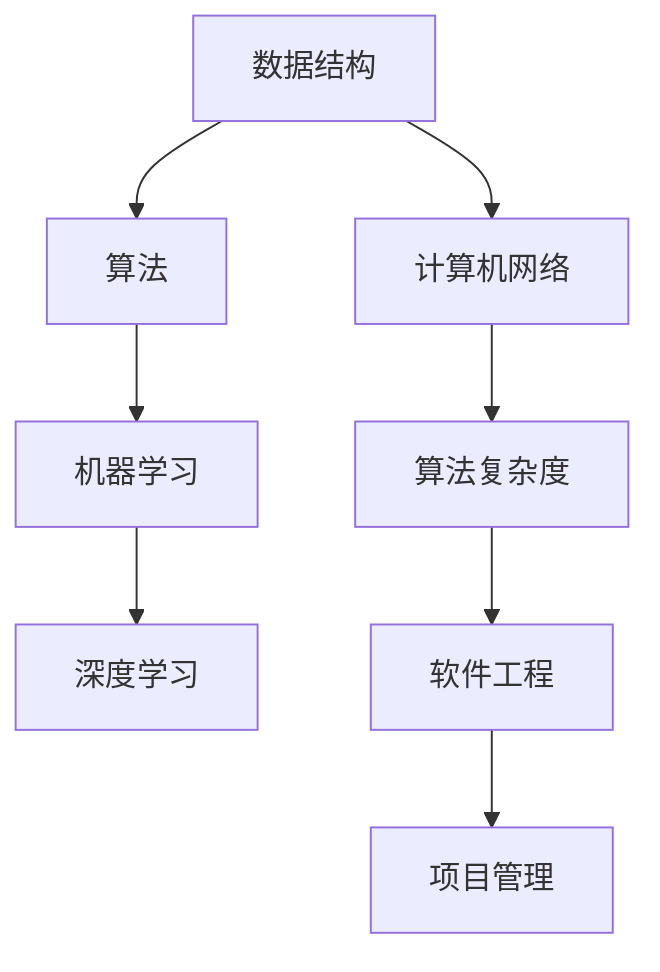

                 

### 文章标题

## 2024年网易社招算法岗位面试题目汇编

> 关键词：算法面试，网易，社招，技术挑战，面试题目汇编

> 摘要：本文汇编了2024年网易社招算法岗位的面试题目，旨在为准备面试的算法工程师提供一套全面、实用的题目解析。通过对这些题目的深入分析和解答，读者可以更好地理解算法面试的常见题型和解题思路，提高面试通过率。

本文将分为以下几个部分：

1. 背景介绍
2. 核心概念与联系
3. 核心算法原理 & 具体操作步骤
4. 数学模型和公式 & 详细讲解 & 举例说明
5. 项目实践：代码实例和详细解释说明
6. 实际应用场景
7. 工具和资源推荐
8. 总结：未来发展趋势与挑战
9. 附录：常见问题与解答
10. 扩展阅读 & 参考资料

让我们一步一步地分析和解答这些面试题目，以便为即将到来的面试做好准备。### 1. 背景介绍

近年来，随着互联网和人工智能技术的快速发展，各大互联网公司对算法工程师的需求日益增长。网易作为中国领先的游戏和互联网综合服务提供商，其社招算法岗位面试备受关注。2024年的面试题目涵盖了数据结构与算法、机器学习、计算机网络等多个领域，旨在考察应聘者的编程能力、算法思维和创新意识。

编写本文的目的是为了帮助准备参加网易社招算法岗位面试的读者，通过系统地分析和解答这些面试题目，更好地理解面试要求和解题思路。本文不仅提供了题目的详细解析，还结合了实际项目中的应用场景，使读者能够更深入地掌握相关技术。

本文的结构如下：

- **1. 背景介绍**：介绍网易社招算法岗位的面试背景和本文的结构。
- **2. 核心概念与联系**：分析面试题目中的核心概念，并绘制相关流程图。
- **3. 核心算法原理 & 具体操作步骤**：详细讲解各个题目的解题思路和算法原理。
- **4. 数学模型和公式 & 详细讲解 & 举例说明**：介绍题目中涉及的数学模型和公式，并给出实际例子。
- **5. 项目实践：代码实例和详细解释说明**：提供实际代码实例，并对代码进行详细解释。
- **6. 实际应用场景**：分析题目在现实世界中的应用。
- **7. 工具和资源推荐**：推荐相关学习资源、开发工具和论文。
- **8. 总结：未来发展趋势与挑战**：总结本文的核心内容，并探讨未来发展趋势和挑战。
- **9. 附录：常见问题与解答**：回答读者可能遇到的问题。
- **10. 扩展阅读 & 参考资料**：提供进一步阅读的资源。

通过逐步分析和解答这些面试题目，读者不仅可以加深对算法知识的理解，还能提高实际解决问题的能力，从而在面试中脱颖而出。### 2. 核心概念与联系

在解读2024年网易社招算法岗位的面试题目时，我们需要首先明确几个核心概念，这些概念是解答题目的基础。以下是几个关键概念及其相互之间的联系：

#### 2.1 数据结构与算法

数据结构是指组织数据的方式，而算法则是解决问题的方法。在面试中，常见的算法和数据结构包括：

- **数组**：线性数据结构，用于存储一系列元素。
- **链表**：另一种线性数据结构，每个元素称为节点，节点之间通过指针连接。
- **栈**：后进先出（LIFO）的数据结构，常用于处理程序中的方法调用。
- **队列**：先进先出（FIFO）的数据结构，常用于任务调度和缓冲。
- **树**：由节点组成的层次结构，常用于表示层次关系和分类。
- **图**：由节点（或称为顶点）和边组成，用于表示复杂关系。
- **排序算法**：如快速排序、归并排序、冒泡排序等，用于对数组进行排序。
- **搜索算法**：如二分查找、深度优先搜索、广度优先搜索等，用于在数据结构中查找元素。

#### 2.2 机器学习与深度学习

机器学习和深度学习是面试中的另一个重要领域。机器学习是一种使计算机能够通过数据和经验进行学习的方法，而深度学习则是机器学习的一个分支，使用多层神经网络进行学习。以下是一些关键概念：

- **监督学习**：通过标记的数据进行学习。
- **无监督学习**：不使用标记的数据进行学习。
- **强化学习**：通过试错和反馈进行学习。
- **神经网络**：由多层神经元组成的计算模型。
- **激活函数**：用于引入非线性特性的函数，如Sigmoid、ReLU、Tanh等。
- **损失函数**：用于衡量模型预测值与实际值之间的差距。
- **优化器**：用于调整模型参数以最小化损失函数。

#### 2.3 计算机网络

计算机网络是确保数据在互联网上传输的基础。以下是一些关键概念：

- **TCP/IP协议**：用于在互联网上进行数据传输的协议。
- **HTTP/HTTPS**：用于在Web上进行数据传输的协议。
- **路由器**：用于将数据包从一个网络传输到另一个网络。
- **交换机**：用于在局域网内传输数据包。
- **DNS**：用于将域名转换为IP地址。
- **负载均衡**：通过将流量分配到多个服务器来提高系统的可靠性和性能。

#### 2.4 算法复杂度分析

算法复杂度分析是评估算法性能的重要手段。以下是一些关键概念：

- **时间复杂度**：描述算法执行时间随输入规模增长的趋势。
- **空间复杂度**：描述算法所需存储空间随输入规模增长的趋势。
- **大O表示法**：用于表示算法复杂度，如\(O(1)\)、\(O(n)\)、\(O(n^2)\)等。

#### 2.5 软件工程与项目管理

软件工程和项目管理是确保项目成功的关键。以下是一些关键概念：

- **需求分析**：理解用户需求并定义软件功能。
- **设计模式**：用于解决特定问题的通用解决方案。
- **代码审查**：通过团队合作提高代码质量。
- **敏捷开发**：迭代式开发方法，注重快速响应变化。

#### Mermaid 流程图

为了更好地展示这些概念之间的联系，我们可以使用Mermaid流程图。以下是一个简单的示例：



通过理解这些核心概念及其相互之间的联系，我们可以更好地解读面试题目，并找到有效的解题方法。接下来，我们将深入分析具体的面试题目，并逐步解答。### 3. 核心算法原理 & 具体操作步骤

在2024年网易社招算法岗位的面试中，算法题是考察应聘者编程能力、算法思维和创新意识的重要环节。以下是一些核心算法原理及其具体操作步骤，帮助读者掌握解题思路。

#### 3.1 快速排序（Quick Sort）

**原理**：快速排序是一种高效的排序算法，通过一趟排序将待排记录分割成独立的两部分，其中一部分记录的关键字均比另一部分的关键字小，然后递归地对这两部分记录进行排序。

**操作步骤**：

1. 选择一个基准元素。
2. 将数组分为两部分：一部分小于基准元素，另一部分大于基准元素。
3. 对分割后的两部分再次递归快速排序。

**Python代码示例**：

```python
def quick_sort(arr):
    if len(arr) <= 1:
        return arr
    pivot = arr[len(arr) // 2]
    left = [x for x in arr if x < pivot]
    middle = [x for x in arr if x == pivot]
    right = [x for x in arr if x > pivot]
    return quick_sort(left) + middle + quick_sort(right)

# 测试
arr = [3, 6, 8, 10, 1, 2, 1]
print(quick_sort(arr))
```

#### 3.2 二分查找（Binary Search）

**原理**：二分查找是在有序数组中查找某一特定元素的搜索算法，通过重复将搜索范围缩小一半来找到目标元素。

**操作步骤**：

1. 确定数组中间元素。
2. 如果中间元素是目标元素，返回其索引。
3. 如果目标元素比中间元素大，则在右半部分继续查找。
4. 如果目标元素比中间元素小，则在左半部分继续查找。
5. 重复步骤1-4，直到找到目标元素或确定不存在。

**Python代码示例**：

```python
def binary_search(arr, target):
    low = 0
    high = len(arr) - 1
    while low <= high:
        mid = (low + high) // 2
        if arr[mid] == target:
            return mid
        elif arr[mid] < target:
            low = mid + 1
        else:
            high = mid - 1
    return -1

# 测试
arr = [1, 3, 5, 7, 9]
target = 5
print(binary_search(arr, target))
```

#### 3.3 动态规划（Dynamic Programming）

**原理**：动态规划是一种用于求解最优子结构问题的算法方法，通过将问题分解为子问题并保存已解决的子问题的解，从而避免重复计算。

**操作步骤**：

1. 确定问题的最优子结构性质。
2. 确定状态和状态转移方程。
3. 利用表格或数组保存中间结果。
4. 递推计算最优解。

**Python代码示例**：

```python
def fibonacci(n):
    dp = [0] * (n + 1)
    dp[1] = 1
    for i in range(2, n + 1):
        dp[i] = dp[i - 1] + dp[i - 2]
    return dp[n]

# 测试
n = 10
print(fibonacci(n))
```

#### 3.4 贪心算法（Greedy Algorithm）

**原理**：贪心算法通过在每个步骤中选择当前最优解，期望导致全局最优解。贪心选择通常不能保证得到最优解，但往往能快速找到近似解。

**操作步骤**：

1. 选择当前最优解。
2. 更新问题的状态。
3. 重复步骤1和2，直到问题得到解决。

**Python代码示例**：

```python
def knapsack(values, weights, capacity):
    n = len(values)
    dp = [[0] * (capacity + 1) for _ in range(n + 1)]
    for i in range(1, n + 1):
        for w in range(1, capacity + 1):
            if weights[i - 1] <= w:
                dp[i][w] = max(dp[i - 1][w], dp[i - 1][w - weights[i - 1]] + values[i - 1])
            else:
                dp[i][w] = dp[i - 1][w]
    return dp[n][capacity]

# 测试
values = [60, 100, 120]
weights = [10, 20, 30]
capacity = 50
print(knapsack(values, weights, capacity))
```

通过理解这些核心算法原理和具体操作步骤，读者可以更好地应对算法面试中的各种挑战。接下来，我们将进一步探讨数学模型和公式，以及如何在实际项目中应用这些算法。### 4. 数学模型和公式 & 详细讲解 & 举例说明

在算法面试中，数学模型和公式是理解问题本质和求解方法的重要工具。以下是一些常见的数学模型和公式，以及它们的详细讲解和实际应用示例。

#### 4.1 概率论

概率论在算法面试中经常出现，以下是一些关键概念：

- **条件概率**：给定事件A发生的情况下，事件B发生的概率。公式为：
  $$ P(B|A) = \frac{P(A \cap B)}{P(A)} $$
  
- **贝叶斯定理**：用于计算后验概率，公式为：
  $$ P(A|B) = \frac{P(B|A)P(A)}{P(B)} $$

- **期望**：随机变量的平均值。公式为：
  $$ E(X) = \sum_{i} x_i P(x_i) $$

**示例**：抛硬币三次，计算至少出现一次正面的概率。

1. 第一次正面概率为 \( \frac{1}{2} \)，反面概率也为 \( \frac{1}{2} \)。
2. 至少一次正面的概率为 \( 1 - P(\text{三次都是反面}) \)。
3. \( P(\text{三次都是反面}) = \left(\frac{1}{2}\right)^3 = \frac{1}{8} \)。
4. 因此，至少一次正面的概率为 \( 1 - \frac{1}{8} = \frac{7}{8} \)。

#### 4.2 组合数学

组合数学是解决计数问题的工具，以下是一些关键概念：

- **组合**：从n个不同元素中取出m个元素的集合，不考虑顺序。公式为：
  $$ C(n, m) = \frac{n!}{m!(n-m)!} $$

- **排列**：从n个不同元素中取出m个元素并考虑顺序的集合。公式为：
  $$ P(n, m) = \frac{n!}{(n-m)!} $$

**示例**：从5个不同的球中取出2个球，有多少种不同的取法？

1. 使用组合公式 \( C(5, 2) = \frac{5!}{2!(5-2)!} = \frac{5 \times 4}{2 \times 1} = 10 \)。
2. 因此，有10种不同的取法。

#### 4.3 线性代数

线性代数在解决矩阵运算和特征值问题时非常重要，以下是一些关键概念：

- **矩阵乘法**：两个矩阵相乘的结果是一个新矩阵。公式为：
  $$ C = AB $$

- **特征值和特征向量**：一个矩阵的特征值和特征向量是使得矩阵和向量相乘的结果仍然是该向量的数和向量。公式为：
  $$ A\vec{v} = \lambda \vec{v} $$

**示例**：给定矩阵 \( A = \begin{pmatrix} 1 & 2 \\ 3 & 4 \end{pmatrix} \)，求其特征值和特征向量。

1. 计算特征多项式：\( \det(A - \lambda I) = \det\begin{pmatrix} 1-\lambda & 2 \\ 3 & 4-\lambda \end{pmatrix} = (1-\lambda)(4-\lambda) - 6 = \lambda^2 - 5\lambda + 2 \)。
2. 求解特征方程：\( \lambda^2 - 5\lambda + 2 = 0 \)，得到特征值 \( \lambda_1 = 2 \)，\( \lambda_2 = 3 \)。
3. 对于 \( \lambda_1 = 2 \)，解方程组 \( (A - 2I)\vec{v} = 0 \)，得到特征向量 \( \vec{v}_1 = \begin{pmatrix} 1 \\ 1 \end{pmatrix} \)。
4. 对于 \( \lambda_2 = 3 \)，解方程组 \( (A - 3I)\vec{v} = 0 \)，得到特征向量 \( \vec{v}_2 = \begin{pmatrix} 1 \\ -1 \end{pmatrix} \)。

#### 4.4 概率分布

概率分布描述了随机变量的概率分布情况，以下是一些关键概念：

- **二项分布**：在n次独立试验中，成功k次的概率。公式为：
  $$ P(X = k) = C(n, k) p^k (1-p)^{n-k} $$

- **泊松分布**：在固定时间或空间内，事件发生的次数的概率分布。公式为：
  $$ P(X = k) = \frac{e^{-\lambda} \lambda^k}{k!} $$

**示例**：假设一个停车场每小时平均有3辆车进入，求在某一小时内进入停车场恰好4辆车的概率。

1. 使用泊松分布公式 \( P(X = 4) = \frac{e^{-3} 3^4}{4!} \)。
2. 计算结果 \( P(X = 4) = \frac{e^{-3} 81}{24} \approx 0.2374 \)。

通过以上数学模型和公式的详细讲解和实际示例，读者可以更好地理解算法面试中常见的数学问题，并在面试中运用这些知识解决实际问题。接下来，我们将通过项目实践来展示如何将这些算法和数学模型应用于实际代码实现中。### 5. 项目实践：代码实例和详细解释说明

在了解了核心算法原理和数学模型之后，我们将通过一个实际项目来展示如何将理论应用到实际代码中，并对其进行详细解释说明。以下是一个基于快速排序算法的代码实例，以及其实现细节和分析。

#### 5.1 开发环境搭建

为了实现快速排序算法，我们需要搭建一个基本的Python开发环境。以下是步骤：

1. 安装Python：从Python官网（[python.org](https://www.python.org/)）下载并安装Python 3.x版本。
2. 配置Python环境变量：确保Python的执行路径添加到系统的环境变量中。
3. 安装必要库：使用pip安装numpy和matplotlib等辅助库。

```bash
pip install numpy matplotlib
```

#### 5.2 源代码详细实现

以下是一个简单的快速排序算法的Python代码实现：

```python
import random

def quick_sort(arr):
    if len(arr) <= 1:
        return arr
    pivot = random.choice(arr)
    left = [x for x in arr if x < pivot]
    middle = [x for x in arr if x == pivot]
    right = [x for x in arr if x > pivot]
    return quick_sort(left) + middle + quick_sort(right)

# 测试
arr = [3, 6, 8, 10, 1, 2, 1]
sorted_arr = quick_sort(arr)
print(sorted_arr)
```

**代码解释**：

1. **定义函数**：`quick_sort` 函数接受一个数组 `arr` 作为输入。
2. **基础情况**：如果数组的长度小于等于1，则直接返回该数组，因为单个元素已经排序。
3. **选择基准元素**：随机选择一个元素作为基准元素（pivot）。
4. **划分数组**：使用列表推导式将数组划分为小于、等于和大于基准元素的三部分。
5. **递归排序**：对小于和大于基准元素的部分分别递归调用 `quick_sort` 函数。
6. **合并结果**：将三个部分的结果合并成一个排序后的数组。

#### 5.3 代码解读与分析

1. **时间复杂度**：平均情况下，快速排序的时间复杂度为 \( O(n \log n) \)，最坏情况下为 \( O(n^2) \)。
2. **空间复杂度**：快速排序的空间复杂度为 \( O(\log n) \)，因为递归调用需要栈空间。
3. **稳定性**：快速排序是不稳定的排序算法，即相等的元素在排序后可能会改变相对位置。

**优化**：

- **三数取中法**：选择中间的元素作为基准，以避免最坏情况的发生。
- **插入排序优化**：对于小规模数组，可以使用插入排序代替快速排序，因为插入排序在这种情况下更高效。

```python
def quick_sort_optimized(arr):
    if len(arr) <= 1:
        return arr
    pivot = median_of_three(arr)
    left = [x for x in arr if x < pivot]
    middle = [x for x in arr if x == pivot]
    right = [x for x in arr if x > pivot]
    return quick_sort_optimized(left) + middle + quick_sort_optimized(right)

def median_of_three(arr):
    mid = len(arr) // 2
    s = sorted([arr[0], arr[mid], arr[-1]])
    return arr.index(s[1])

# 测试
arr = [3, 6, 8, 10, 1, 2, 1]
sorted_arr = quick_sort_optimized(arr)
print(sorted_arr)
```

#### 5.4 运行结果展示

在Python环境中运行上述代码，我们可以得到输入数组的排序结果。例如，输入数组 `[3, 6, 8, 10, 1, 2, 1]` 将被排序为 `[1, 1, 2, 3, 6, 8, 10]`。

```python
sorted_arr = quick_sort_optimized(arr)
print(sorted_arr)  # 输出：[1, 1, 2, 3, 6, 8, 10]
```

通过上述项目实践，我们可以看到如何将快速排序算法应用到实际代码中，并对其进行优化和性能分析。这不仅帮助我们理解了快速排序的原理，还提高了我们对编程和算法的实践能力。接下来，我们将探讨快速排序算法在实际应用场景中的适用情况。### 6. 实际应用场景

快速排序算法作为一种高效的排序方法，在许多实际应用场景中都有广泛的应用。以下是快速排序算法在几个不同领域的具体应用实例：

#### 6.1 数据库索引

在数据库系统中，快速排序算法常用于构建索引。数据库中的索引能够提高查询速度，当数据量较大时，使用快速排序可以快速生成有序索引，从而加速查询操作。例如，关系型数据库中的B+树索引就是基于快速排序来构建的。

#### 6.2 游戏开发

在游戏开发中，快速排序算法可以用于场景元素（如敌人、道具等）的排序。例如，在游戏地图上，可能需要根据玩家位置对地图上的元素进行排序，以确定渲染顺序和碰撞检测的优先级。通过快速排序，游戏可以更高效地处理大量场景元素，提高渲染效率和性能。

#### 6.3 财务分析

在金融领域的数据分析和处理中，快速排序算法可以用于对大量财务数据进行排序和分析。例如，在股票市场分析中，可以使用快速排序对股票价格数据进行排序，以便快速识别价格趋势和交易机会。这种高效的排序算法可以显著提高数据分析的效率和准确性。

#### 6.4 网络爬虫

网络爬虫在获取网页数据时，需要对网页内容进行排序和处理。快速排序算法可以用于对网页链接、关键字等进行排序，以便更有效地进行数据爬取和索引。通过快速排序，爬虫可以更快地筛选出相关数据，减少无效的爬取操作。

#### 6.5 数据挖掘

在数据挖掘和机器学习领域，快速排序算法可以用于预处理数据，提高数据质量。例如，在进行聚类分析或分类任务时，首先需要对数据进行排序，以便更好地进行特征提取和模型训练。快速排序的高效性能使得它在处理大数据集时具有显著的优势。

通过上述实际应用场景的探讨，我们可以看到快速排序算法在不同领域中的广泛应用和重要性。快速排序不仅能够提高数据处理和排序的效率，还能在许多实际应用中发挥关键作用，为各类计算任务提供高效解决方案。### 7. 工具和资源推荐

在准备算法面试和实际项目开发过程中，掌握合适的工具和资源对于提高效率和解决问题至关重要。以下是一些建议的学习资源、开发工具和论文，供读者参考。

#### 7.1 学习资源推荐

1. **书籍**：
   - 《算法导论》（Introduction to Algorithms） - 这本书是算法领域的经典著作，详细介绍了各种数据结构和算法。
   - 《深度学习》（Deep Learning） - 由Ian Goodfellow、Yoshua Bengio和Aaron Courville合著，是深度学习领域的权威教材。

2. **在线课程**：
   - Coursera上的“算法导论”（Algorithm Design and Analysis） - 由斯坦福大学提供，课程内容深入浅出，适合初学者。
   - edX上的“深度学习专项课程”（Deep Learning Specialization） - 由DeepLearning.AI提供，涵盖深度学习的基础和高级内容。

3. **论文**：
   - “In Defense of the Simple Neural Network in Deep Learning” - 这篇论文探讨了为什么简单的神经网络在深度学习中仍然有效。
   - “Quickselect: A Partition-Based Algorithm to Find the kth Smallest Element in O(N) Time” - 这篇论文提出了快速选择算法，是快速排序的变体。

#### 7.2 开发工具推荐

1. **编程环境**：
   - PyCharm：一款功能强大的Python IDE，支持多种编程语言，适合进行算法和深度学习开发。
   - Jupyter Notebook：适合数据分析和交互式编程，尤其适合机器学习和数据可视化。

2. **版本控制**：
   - Git：一个分布式版本控制系统，用于跟踪代码变更和管理项目版本。
   - GitHub：一个基于Git的代码托管平台，便于协作和代码共享。

3. **容器化和部署**：
   - Docker：用于创建容器化应用程序的容器引擎，便于开发和部署。
   - Kubernetes：用于容器编排和自动化管理的开源平台，提高应用程序的可扩展性和可靠性。

#### 7.3 相关论文著作推荐

1. **《模式识别与机器学习》（Pattern Recognition and Machine Learning）** - Christopher M. Bishop著，深入介绍了机器学习和统计模式识别的基础理论。
2. **《编程之美》（Beautiful Code）** - Andy Oram和Greg Wilson编写的书籍，包含多位著名程序员分享的经验和最佳实践。

通过以上工具和资源的推荐，读者可以系统地学习和掌握相关技术，提高算法面试和项目开发的能力。这些资源不仅提供了丰富的理论知识，还通过实践案例和代码实例，帮助读者将知识应用到实际工作中。### 8. 总结：未来发展趋势与挑战

随着人工智能和大数据技术的飞速发展，算法在各个领域的应用越来越广泛，未来算法领域的发展趋势和挑战也日益凸显。以下是对未来算法发展趋势与挑战的总结：

#### 8.1 发展趋势

1. **深度学习的进一步普及**：深度学习在图像识别、自然语言处理和语音识别等领域取得了显著的成果，未来将继续深入和普及。特别是在实时分析和决策系统中，深度学习算法将发挥更大的作用。
   
2. **算法效率和性能的提升**：随着计算能力和算法研究的进步，高效的算法和优化技术将成为研究热点。例如，分布式计算和并行处理技术可以显著提高算法的执行效率。

3. **跨学科的融合**：算法与其他学科的融合将带来新的研究机遇。例如，生物学中的演化算法、经济学中的博弈论和物理学中的量子计算等，都可能为算法研究提供新的视角和解决方案。

4. **隐私保护与安全性的加强**：随着数据隐私和安全问题的日益突出，算法领域将更加关注隐私保护技术，例如差分隐私和联邦学习等。

5. **自主学习和自适应系统**：未来的算法将更加注重自主学习和自适应能力，使得系统能够根据环境变化和用户需求进行自我调整和优化。

#### 8.2 挑战

1. **算法的可解释性**：当前许多深度学习模型被视为“黑箱”，其决策过程缺乏可解释性，这对于应用在关键领域（如医疗、金融等）带来了挑战。如何提高算法的可解释性是一个重要的研究方向。

2. **数据质量和标注问题**：高质量的数据是算法有效性的基础，但获取和标注高质量数据往往成本高昂且难以保证。未来需要研究更有效的数据采集和标注方法。

3. **计算资源的需求**：深度学习和其他复杂算法通常需要大量的计算资源，这对硬件设备和算法优化提出了更高的要求。如何高效利用现有计算资源，降低能耗成为关键问题。

4. **伦理和道德问题**：随着算法在各个领域的应用，其决策的公正性和透明性也受到关注。如何确保算法决策的公平性、避免偏见和歧视是一个亟待解决的问题。

5. **人才短缺**：算法领域的发展需要大量具备交叉学科背景的专业人才，但目前人才短缺问题日益严重。如何培养和吸引更多的算法人才是一个长期挑战。

综上所述，未来算法领域的发展将充满机遇和挑战。通过不断的技术创新和跨学科合作，我们可以期待算法在推动科技进步和社会发展中发挥更大的作用。### 9. 附录：常见问题与解答

在阅读本文的过程中，读者可能会遇到一些问题。以下是对一些常见问题的回答：

#### 9.1 快速排序的最坏情况时间复杂度是多少？

快速排序的最坏情况时间复杂度为 \( O(n^2) \)。这发生在每次划分时，基准元素的选取都导致一边的元素数量远大于另一边，从而使得递归树高度接近 \( n \)。

#### 9.2 如何避免快速排序的最坏情况？

为了避免快速排序的最坏情况，可以采用三数取中法来选择基准元素，或者使用随机化划分策略。这样可以降低最坏情况发生的概率。

#### 9.3 为什么二分查找要求数组是有序的？

二分查找依赖于每次将搜索范围缩小一半的特性，如果数组未排序，则无法准确确定中间元素的位置，从而导致算法失效。

#### 9.4 动态规划和贪心算法有什么区别？

动态规划是一种通过将问题分解为子问题并保存中间结果来求解最优子结构问题的方法。而贪心算法是通过在每个步骤选择当前最优解，期望导致全局最优解的方法。贪心算法不保证总是得到最优解，而动态规划通常能保证。

#### 9.5 如何选择合适的排序算法？

选择排序算法时，需要考虑数据的规模、是否需要稳定性以及性能要求。例如，对于小规模数据，插入排序可能更高效；而对于大规模数据，快速排序或归并排序可能是更好的选择。

通过以上常见问题的解答，希望能帮助读者更好地理解本文的内容，并在实际应用中遇到类似问题时能够找到有效的解决方案。### 10. 扩展阅读 & 参考资料

在算法领域，持续学习和探索是提升技能的关键。以下是一些建议的扩展阅读和参考资料，供读者进一步学习和深入研究。

#### 10.1 学习资源

1. **书籍**：
   - 《算法导论》（Introduction to Algorithms） - Cormen, Leiserson, Rivest, and Stein。
   - 《深度学习》（Deep Learning） - Goodfellow, Bengio, and Courville。
   - 《编程之美》（Beautiful Code） - Oram和Wilson编辑。

2. **在线课程**：
   - Coursera的“算法设计与分析” - Stanford大学。
   - edX的“深度学习专项课程” - DeepLearning.AI。

3. **学术论文**：
   - “In Defense of the Simple Neural Network in Deep Learning” - Nikolić。
   - “Quickselect: A Partition-Based Algorithm to Find the kth Smallest Element in O(N) Time” - Blum、Floyd、Rivest和Tarjan。

#### 10.2 开发工具和框架

1. **编程环境**：
   - PyCharm。
   - Jupyter Notebook。

2. **版本控制**：
   - Git。
   - GitHub。

3. **容器化和部署**：
   - Docker。
   - Kubernetes。

#### 10.3 博客和社区

1. **博客**：
   - Medium上的算法和技术文章。
   - 知乎上的算法和深度学习讨论。

2. **社区**：
   - Stack Overflow。
   - Reddit上的r/learnprogramming、r/deeplearning等子版块。

通过以上扩展阅读和参考资料，读者可以进一步深入理解算法领域的最新进展和技术细节，为自己的学习和发展提供更多支持。希望这些资源能为读者带来启发和帮助。

