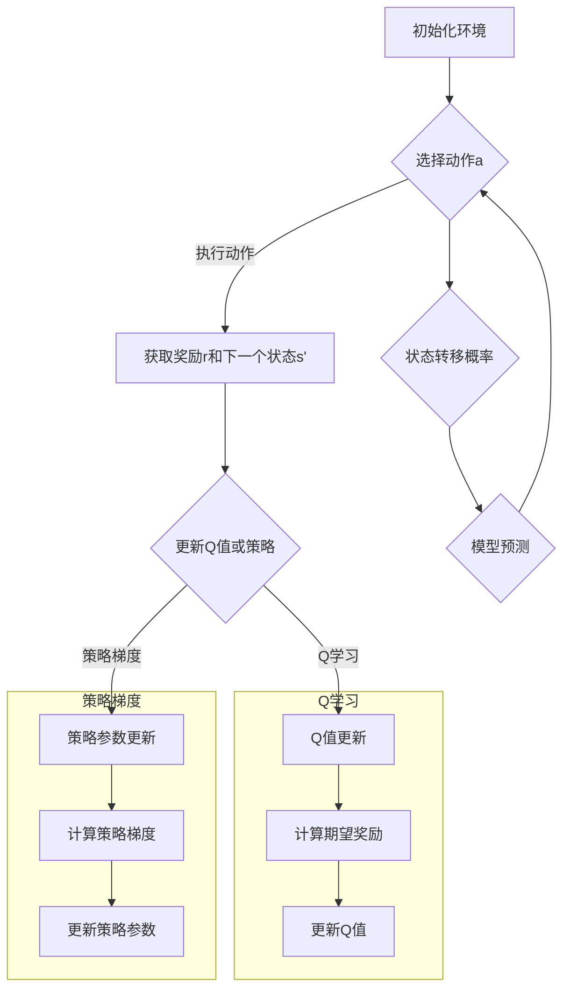

                 

### 文章标题：强化学习：状态-动作对的选择

强化学习（Reinforcement Learning，简称RL）是一种机器学习方法，主要用来解决决策问题。在强化学习中，智能体（Agent）通过与环境（Environment）的交互来学习如何获得最大的奖励（Reward）。核心问题在于如何根据当前的状态（State）选择最优的动作（Action）。本文将详细探讨强化学习中状态-动作对的选择策略，以及如何通过数学模型和算法来实现这一目标。

关键词：强化学习，状态-动作对，策略，Q学习，深度强化学习，模型评估，算法优化

摘要：本文首先介绍了强化学习的基本概念和核心问题，然后重点分析了状态-动作对的选择策略，包括Q学习和深度强化学习中的具体实现。通过数学模型和公式详细讲解，辅以实际项目实践和运行结果展示，帮助读者深入理解强化学习在状态-动作对选择中的应用。

### 1. 背景介绍

强化学习起源于20世纪50年代，最初应用于心理学和行为经济学领域。随着计算能力的提升和人工智能的发展，强化学习逐渐成为机器学习的重要分支。在强化学习中，智能体需要在不确定的环境中通过试错（Trial and Error）来学习最优策略（Policy）。策略是指智能体在给定状态下选择动作的规则。

强化学习的主要问题是如何从一系列状态-动作对中找到最优对。状态-动作对（State-Action Pair）是强化学习中的基本元素，每个状态-动作对都关联着一个奖励值。智能体的目标是最大化总奖励，从而学习到最优策略。

在强化学习中，存在几个关键概念：

- **状态（State）**：描述智能体所处的环境。
- **动作（Action）**：智能体可以执行的行为。
- **奖励（Reward）**：对智能体执行的每个动作给予的即时反馈。
- **策略（Policy）**：智能体在给定状态下选择动作的规则。
- **价值函数（Value Function）**：评估状态或状态-动作对的预期奖励。
- **模型（Model）**：对环境的概率模型，包括状态转移概率和奖励函数。

通过这些基本概念，强化学习为解决复杂决策问题提供了一种有效的途径。本文将围绕状态-动作对的选择策略进行深入探讨。

#### 1.1 强化学习的历史与发展

强化学习的历史可以追溯到20世纪50年代，当时行为主义心理学家和行为经济学研究者在研究人类和动物的学习行为时提出了奖励和惩罚的概念。1950年，计算机科学家Richard Bellman首次提出了动态规划（Dynamic Programming）的思想，为强化学习奠定了理论基础。

1970年代，随着计算机技术的发展，强化学习开始应用于自动控制、机器人学等领域。代表性的算法包括马尔可夫决策过程（MDP，Markov Decision Process）和Q学习（Q-Learning）。Q学习通过迭代更新策略值函数（Policy Value Function），在给定状态下选择动作，以达到最大化累积奖励的目标。

1980年代，随着人工智能领域的兴起，强化学习得到了更广泛的关注。著名的计算机科学家李·斯特劳德（Lee Steward）在1984年提出了策略迭代（Policy Iteration）算法，为强化学习提供了另一种有效的求解策略。

1990年代，随着神经网络技术的发展，强化学习开始与深度学习结合，形成了深度强化学习（Deep Reinforcement Learning）。深度强化学习通过引入神经网络来近似价值函数或策略函数，能够解决更加复杂的问题。代表性的算法包括深度Q网络（Deep Q-Network，DQN）和策略梯度方法（Policy Gradient Methods）。

进入21世纪，随着深度学习技术的进一步发展，强化学习在多个领域取得了显著的突破。例如，在游戏领域，深度强化学习算法成功实现了在围棋、国际象棋等复杂游戏中的自我对弈。在机器人领域，强化学习算法被用于自主导航、机器人抓取等任务。在金融领域，强化学习被用于交易策略优化和风险控制。

#### 1.2 强化学习的基本原理

强化学习的基本原理基于智能体与环境之间的交互。智能体通过执行动作来改变环境状态，并从环境中获取奖励。这个过程可以描述为：

- **状态转移（State Transition）**：给定当前状态s和动作a，智能体执行动作后，环境转移到新的状态s'，并给予奖励r。
- **奖励反馈（Reward Feedback）**：奖励r是对智能体执行动作的即时评价，它指导智能体在未来选择更好的动作。
- **策略学习（Policy Learning）**：智能体根据历史经验和奖励反馈来更新策略，以最大化累积奖励。

强化学习的关键在于如何通过策略学习来优化决策过程。这涉及到以下几个核心概念：

- **策略（Policy）**：策略是智能体在给定状态下选择动作的规则。策略可以分为确定性策略（Deterministic Policy）和随机性策略（Stochastic Policy）。确定性策略在任何状态下都选择相同的动作，而随机性策略在状态中选择不同概率的动作。

- **价值函数（Value Function）**：价值函数用于评估状态或状态-动作对的预期奖励。主要有两种价值函数：状态值函数（State Value Function）和动作值函数（Action Value Function）。状态值函数表示在给定状态下执行任何动作的期望奖励，而动作值函数表示在给定状态下执行特定动作的期望奖励。

- **策略值函数（Policy Value Function）**：策略值函数是策略和价值函数的结合，表示在给定策略下执行动作的期望奖励。策略值函数反映了策略的优劣，是策略学习的目标。

强化学习的目标是通过策略学习来找到最优策略，使得智能体在长期内获得最大的累积奖励。策略学习通常通过两种方式实现：基于模型的方法（Model-Based Methods）和基于经验的方法（Model-Free Methods）。

基于模型的方法通过构建环境的概率模型来预测状态转移和奖励，然后使用模型来推导最优策略。这种方法需要对环境有充分的了解，但在实际应用中往往难以实现。

基于经验的方法不依赖于环境的概率模型，而是通过智能体与环境交互来直接学习策略。Q学习和深度强化学习是典型的基于经验的方法，它们通过迭代更新策略值函数来学习最优策略。

#### 1.3 强化学习中的状态-动作对

在强化学习中，状态-动作对是核心概念之一。每个状态-动作对都关联着一个奖励值，智能体需要从这些对中学习如何选择最优的动作。状态-动作对的选择策略直接决定了智能体的学习效果。

状态（State）是智能体所处的环境描述，通常是一个向量，表示环境的当前状态特征。动作（Action）是智能体可以执行的行为，也是一个向量，表示智能体可以采取的特定动作。

每个状态-动作对都关联着一个奖励值（Reward），奖励值是环境对智能体执行动作的即时反馈。奖励值可以是正值、负值或零，表示对智能体行为的评价。正奖励鼓励智能体继续执行该动作，负奖励则提示智能体避免该动作。

强化学习的目标是找到最优的状态-动作对，使得智能体在长期内获得最大的累积奖励。这涉及到以下问题：

- 如何表示状态和动作？
- 如何定义奖励函数？
- 如何选择最优的动作？

对于状态和动作的表示，通常使用离散或连续的方式。在离散表示中，状态和动作都是有限集合，例如使用整数或字符串来表示。在连续表示中，状态和动作可以是实数或向量，例如使用高维特征向量来表示状态。

奖励函数的设计取决于具体的应用场景。在游戏领域，奖励函数可以设计为得分，在机器人领域，奖励函数可以设计为完成任务的程度。关键是要确保奖励函数能够正确引导智能体的行为。

选择最优的动作是强化学习的核心问题。基于模型的方法通过预测状态转移和奖励来选择动作，而基于经验的方法通过迭代更新策略值函数来选择动作。Q学习和深度强化学习等算法通过不断更新策略值函数，逐渐找到最优的动作。

通过状态-动作对的选择策略，强化学习能够帮助智能体在复杂环境中学习最优策略，实现自动化决策和优化。

#### 1.4 强化学习的应用领域

强化学习在众多领域取得了显著的应用成果，展示了其强大的适应性和潜力。以下是强化学习在一些关键领域的应用：

1. **游戏**：强化学习在游戏领域取得了突破性进展。例如，深度强化学习算法AlphaGo在围棋比赛中战胜了世界冠军，证明了强化学习在处理高度复杂和不确定性环境中的能力。此外，强化学习还被应用于电子游戏如Atari游戏和StarCraft中的自我对弈和策略优化。

2. **机器人**：强化学习在机器人领域具有广泛的应用前景。通过强化学习，机器人能够自主学习和优化复杂任务，如自主导航、物体抓取和组装等。例如，使用深度强化学习，机器人可以在无人工干预的情况下学习如何在未知环境中执行特定任务。

3. **自动驾驶**：强化学习在自动驾驶系统中发挥了关键作用。自动驾驶车辆通过感知周围环境并采取相应动作，以最大化安全性和效率。强化学习算法被用于训练自动驾驶车辆在复杂交通场景中做出最优决策，如避让行人、识别道路标志和自适应巡航控制等。

4. **金融**：强化学习在金融领域的应用包括交易策略优化、风险管理、投资组合优化等。通过学习市场数据和历史交易行为，强化学习算法可以帮助投资者制定更有效的交易策略，并降低风险。

5. **推荐系统**：强化学习在推荐系统中也被广泛应用。通过不断学习和优化用户行为和偏好，强化学习算法能够为用户推荐更相关的商品、内容和服务，从而提高用户体验和满意度。

6. **智能制造**：强化学习在智能制造领域的应用包括生产线调度、设备维护优化和自动化质量控制等。通过强化学习算法，制造系统可以自适应地调整生产计划，提高生产效率和降低成本。

强化学习在各个领域的成功应用证明了其强大的适应性和广泛的应用前景。随着算法的不断优化和计算资源的提升，强化学习将继续在更多领域发挥重要作用，推动人工智能的发展。

#### 1.5 强化学习中的主要挑战

尽管强化学习在许多领域取得了显著进展，但其仍然面临一些重要的挑战，阻碍了其更广泛的应用和发展。以下是强化学习面临的一些主要挑战：

1. **计算复杂度**：强化学习算法通常需要大量的计算资源，尤其是深度强化学习算法，如深度Q网络（DQN）和策略梯度方法（Policy Gradient Methods）。这些算法需要通过大量的交互来学习环境模型和策略值函数，从而导致计算复杂度急剧增加。这限制了强化学习算法在实际应用中的可行性，特别是在资源受限的环境下。

2. **探索与利用的平衡**：在强化学习中，智能体需要在探索（Exploration）和利用（Utilization）之间找到平衡。探索是指智能体尝试新的动作以获取更多关于环境的经验，而利用是指智能体利用已有经验来最大化累积奖励。如果智能体过于专注于利用，它可能会错过发现更好策略的机会；而如果过于专注于探索，学习过程可能会变得缓慢且不稳定。如何有效地平衡探索与利用是一个重要的挑战。

3. **稳定性和收敛性**：强化学习算法需要稳定地收敛到最优策略。然而，一些算法在训练过程中可能会遇到不稳定的情况，导致学习过程过早地陷入局部最优解。此外，深度强化学习算法，如深度Q网络（DQN），由于使用经验回放（Experience Replay）和目标网络（Target Network）等技术来提高稳定性，但实现这些技术需要大量的计算资源。如何提高算法的稳定性和收敛性是强化学习研究中的一个关键问题。

4. **泛化能力**：强化学习算法通常在特定的环境或任务上进行训练，这使得它们在处理新任务或环境时可能表现出较差的泛化能力。如何提高强化学习算法的泛化能力，使其能够适应更广泛的应用场景，是一个重要的挑战。

5. **安全性**：在强化学习应用中，确保系统的安全性和稳定性至关重要。特别是对于自动驾驶、机器人等高风险应用场景，算法需要确保其决策不会导致危险后果。然而，强化学习算法的决策过程通常是基于历史经验和奖励反馈，这可能导致不可预见的行为。如何确保强化学习算法的安全性是一个关键的研究问题。

6. **可解释性**：强化学习算法的内部决策过程通常较为复杂，这使得其行为难以解释和理解。这对于实际应用中的调试和优化来说是一个挑战。如何提高强化学习算法的可解释性，使其决策过程更透明和可解释，是一个重要的研究方向。

通过克服这些挑战，强化学习有望在更广泛的应用中发挥更大的作用，推动人工智能的发展。

#### 2.1 核心概念与联系：强化学习中的主要算法与策略

强化学习中的算法和策略是理解强化学习工作的关键。本部分将详细探讨强化学习中的几个主要算法和策略，并解释它们之间的联系。

**2.1.1 Q学习（Q-Learning）**

Q学习是强化学习中最基本和最直观的算法之一。它的核心思想是学习状态-动作值函数（State-Action Value Function），即对于给定的状态s和动作a，评估执行动作a后从状态s转移到下一个状态s'并获取奖励r的预期回报。

Q学习的目标是最小化如下损失函数：
\[ L(\theta) = \mathbb{E}_{s,a}\left[ (r + \gamma \max_{a'} Q(s',a';\theta) - Q(s,a;\theta))^2 \right] \]

其中，\( \theta \) 是模型参数，\( \gamma \) 是折扣因子，\( \mathbb{E}_{s,a} \) 表示在状态s和动作a下取期望。

Q学习的更新规则如下：
\[ Q(s,a;\theta) \leftarrow Q(s,a;\theta) + \alpha \left( r + \gamma \max_{a'} Q(s',a';\theta) - Q(s,a;\theta) \right) \]

其中，\( \alpha \) 是学习率。

**2.1.2 策略梯度（Policy Gradient）**

策略梯度方法通过直接优化策略来学习，其核心思想是最小化策略的损失函数，即最大化策略下的累积奖励。

策略梯度方法的一个基本形式如下：
\[ \nabla_{\pi} J(\pi) = \nabla_{\pi} \mathbb{E}_{s,a} \left[ r + \gamma V(s';\pi) - \log \pi(a|s) \right] \]

其中，\( V(s';\pi) \) 是状态值函数，\( J(\pi) \) 是策略梯度。

策略梯度的更新规则如下：
\[ \theta \leftarrow \theta - \eta \nabla_{\pi} J(\pi) \]

其中，\( \eta \) 是学习率。

**2.1.3 状态值函数（State Value Function）与动作值函数（Action Value Function）**

状态值函数和动作值函数是强化学习中的两个重要概念。状态值函数表示在给定状态下执行任何动作的期望奖励，即：
\[ V^*(s) = \mathbb{E}_{s',r} [r + \gamma V^*(s') | s, a] \]

动作值函数表示在给定状态下执行特定动作的期望奖励，即：
\[ Q^*(s, a) = \mathbb{E}_{s',r} [r + \gamma V^*(s') | s, a] \]

状态值函数和动作值函数之间存在以下关系：
\[ V^*(s) = \max_{a} Q^*(s, a) \]

**2.1.4 连续动作和状态空间**

在实际应用中，状态和动作空间通常是连续的。处理连续状态和动作空间的一个常用方法是使用神经网络来近似状态-动作值函数或策略函数。深度Q网络（DQN）和演员-批评家方法（Actor-Critic Methods）是处理连续状态和动作空间的代表性算法。

**2.1.5 模型与模型预测**

模型（Model）在强化学习中扮演着重要的角色，它是对环境状态转移概率和奖励函数的预测。模型可以通过经验回放（Experience Replay）和目标网络（Target Network）等技术来提高学习效率和稳定性。

**2.1.6 状态-动作对的选择**

在强化学习中，状态-动作对的选择是一个关键问题。Q学习通过迭代更新Q值来选择动作，而策略梯度方法通过直接优化策略来选择动作。状态-动作对的选择策略决定了智能体的学习效果。

**2.1.7 联系与对比**

Q学习和策略梯度方法在强化学习中有不同的侧重点。Q学习侧重于学习状态-动作值函数，并通过迭代更新Q值来选择动作；而策略梯度方法侧重于直接优化策略，通过优化策略梯度来选择动作。

然而，Q学习和策略梯度方法之间也存在一定的联系。一些方法，如演员-批评家方法，将Q学习和策略梯度方法结合起来，通过同时更新状态-动作值函数和策略来提高学习效果。

总之，强化学习中的算法和策略是理解和应用强化学习的关键。通过深入探讨这些核心概念和算法，我们可以更好地理解和应用强化学习，解决复杂决策问题。

#### 2.2 Mermaid 流程图：强化学习中的核心算法与策略

为了更好地理解强化学习中的核心算法与策略，我们可以使用Mermaid流程图来展示它们的基本原理和关系。以下是一个简化版本的Mermaid流程图，描述了Q学习和策略梯度方法的基本步骤：



**流程图解释：**

1. **初始化环境（A）**：智能体初始化环境，设定初始状态s。

2. **选择动作a（B）**：智能体根据当前状态s和策略选择一个动作a。

3. **执行动作并获取奖励（C）**：智能体执行动作a，并从环境中获取奖励r和下一个状态s'。

4. **更新Q值或策略（D）**：智能体根据接收到的奖励r和下一个状态s'更新其策略。

5. **Q学习更新Q值（E）**：使用Q值更新规则，计算期望奖励，并更新Q值。

6. **策略梯度更新策略参数（F）**：使用策略梯度更新规则，计算策略梯度，并更新策略参数。

7. **状态转移概率和模型预测（K和L）**：根据模型预测状态转移概率，并更新智能体的状态。

8. **重复过程（B）**：智能体重复上述步骤，以不断学习并优化其策略。

通过这个Mermaid流程图，我们可以更直观地理解强化学习中的核心算法与策略，以及它们之间的基本关系。这有助于我们更好地应用和优化强化学习算法，解决实际中的决策问题。

#### 2.3 强化学习中的核心算法原理与具体操作步骤

强化学习中的核心算法包括Q学习、策略梯度方法、深度Q网络（DQN）和演员-批评家方法（Actor-Critic Methods）。这些算法各自具有不同的原理和操作步骤，但都旨在通过学习状态-动作值函数或策略来优化智能体的行为。下面我们将详细探讨这些算法的基本原理和具体操作步骤。

**2.3.1 Q学习（Q-Learning）**

Q学习是一种基于价值函数的强化学习算法，其核心思想是通过迭代更新状态-动作值函数（Q值）来学习最优策略。Q学习的基本步骤如下：

1. **初始化**：设定初始状态s，初始化Q值表\( Q(s, a) \)，设定学习率\( \alpha \)和折扣因子\( \gamma \)。

2. **选择动作**：在当前状态s下，使用贪婪策略选择动作\( a = \arg\max_a Q(s, a) \)。如果需要探索，可以使用ε-贪婪策略，即以概率ε随机选择动作。

3. **执行动作**：执行选择的动作a，从环境中获取奖励r和下一个状态s'。

4. **更新Q值**：根据更新规则，更新当前状态的Q值：
   \[ Q(s, a) \leftarrow Q(s, a) + \alpha [r + \gamma \max_a Q(s', a) - Q(s, a)] \]

5. **状态转移**：更新当前状态s为下一个状态s'。

6. **重复步骤2-5**：重复上述步骤，直到达到预设的迭代次数或智能体达到满意的策略。

**2.3.2 策略梯度方法**

策略梯度方法是另一种强化学习算法，它通过直接优化策略来学习最优策略。策略梯度方法的基本步骤如下：

1. **初始化**：设定初始策略参数\(\theta\)，初始化学习率\(\eta\)。

2. **选择动作**：在当前状态s下，根据策略参数选择动作\( a = \pi(a|s; \theta) \)。

3. **执行动作**：执行选择的动作a，从环境中获取奖励r和下一个状态s'。

4. **计算策略梯度**：计算策略梯度：
   \[ \nabla_{\theta} J(\theta) = \nabla_{\theta} \mathbb{E}_{s,a} \left[ r + \gamma V(s';\pi) - \log \pi(a|s) \right] \]

5. **更新策略参数**：根据策略梯度更新策略参数：
   \[ \theta \leftarrow \theta - \eta \nabla_{\theta} J(\theta) \]

6. **状态转移**：更新当前状态s为下一个状态s'。

7. **重复步骤2-6**：重复上述步骤，直到达到预设的迭代次数或策略参数收敛。

**2.3.3 深度Q网络（DQN）**

深度Q网络（DQN）是结合了深度学习和强化学习的一种算法，它使用深度神经网络来近似状态-动作值函数。DQN的基本步骤如下：

1. **初始化**：设定初始状态s，初始化Q网络参数，初始化经验回放记忆。

2. **选择动作**：在当前状态s下，使用ε-贪婪策略选择动作\( a = \arg\max_a (Q(s, a) + \epsilon \times \max_a Q(s, a)) \)。

3. **执行动作**：执行选择的动作a，从环境中获取奖励r和下一个状态s'。

4. **存储经验**：将当前状态s、动作a、奖励r和下一个状态s'存储在经验回放记忆中。

5. **更新Q网络**：从经验回放记忆中随机抽取一批经验，使用目标Q网络计算目标Q值，并更新当前Q网络：
   \[ y = r + \gamma \max_a Q(s', a) \]
   \[ Q(s, a) \leftarrow Q(s, a) + \alpha [y - Q(s, a)] \]

6. **状态转移**：更新当前状态s为下一个状态s'。

7. **重复步骤2-6**：重复上述步骤，直到达到预设的迭代次数或Q网络参数收敛。

**2.3.4 演员-批评家方法（Actor-Critic Methods）**

演员-批评家方法是一种结合了策略梯度和Q学习的强化学习算法，它包括两个网络：演员网络（Actor）和批评家网络（Critic）。演员网络负责选择动作，批评家网络负责评估策略的好坏。演员-批评家方法的基本步骤如下：

1. **初始化**：设定初始策略参数\(\theta\)和Q网络参数\(\theta_Q\)，初始化学习率\(\eta\)和\(\alpha\)。

2. **选择动作**：在当前状态s下，使用策略网络选择动作\( a = \pi(a|s; \theta) \)。

3. **执行动作**：执行选择的动作a，从环境中获取奖励r和下一个状态s'。

4. **更新批评家网络**：计算目标Q值，并使用梯度下降更新Q网络参数：
   \[ y = r + \gamma Q(s', \pi) \]
   \[ \theta_Q \leftarrow \theta_Q - \alpha \nabla_{\theta_Q} L(Q) \]

5. **更新策略网络**：计算策略梯度，并使用梯度下降更新策略参数：
   \[ \theta \leftarrow \theta - \eta \nabla_{\theta} J(\theta) \]

6. **状态转移**：更新当前状态s为下一个状态s'。

7. **重复步骤2-6**：重复上述步骤，直到达到预设的迭代次数或策略和Q网络参数收敛。

通过以上对Q学习、策略梯度方法、DQN和演员-批评家方法的详细解释，我们可以看到这些算法在强化学习中的重要作用和具体操作步骤。这些算法通过不断迭代和优化，帮助智能体在复杂环境中学习最优策略，实现自动化决策。

#### 2.4 强化学习中的数学模型和公式详解

强化学习中的数学模型和公式是理解和应用强化学习算法的核心。本节将详细解释这些模型和公式，并通过实例说明其应用。

**2.4.1 马尔可夫决策过程（MDP）**

马尔可夫决策过程（Markov Decision Process，MDP）是强化学习中的基本模型，它描述了智能体与环境的交互过程。一个MDP可以表示为五元组\( (S, A, P, R, \gamma) \)：

- \( S \)：状态空间，表示智能体可能处于的所有状态。
- \( A \)：动作空间，表示智能体可以执行的所有动作。
- \( P \)：状态转移概率矩阵，表示在给定状态和动作下，智能体转移到下一个状态的概率。
- \( R \)：奖励函数，表示智能体在执行特定动作后获得的即时奖励。
- \( \gamma \)：折扣因子，表示未来奖励的重要性，通常取值在0到1之间。

在MDP中，智能体在当前状态\( s \)下选择动作\( a \)，然后根据状态转移概率矩阵\( P \)转移到下一个状态\( s' \)，并获得奖励\( r \)。这个过程可以用以下概率公式表示：

\[ P(s'|s, a) = P(s'|s, a) \]

其中，\( P(s'|s, a) \)表示在状态\( s \)下执行动作\( a \)后，智能体转移到状态\( s' \)的概率。

奖励函数\( R(s, a) \)表示在状态\( s \)下执行动作\( a \)后获得的即时奖励，通常是一个实数。折扣因子\( \gamma \)表示未来奖励的重要性，越小表示当前奖励的重要性越高。具体计算未来累积奖励的公式如下：

\[ V^*(s) = \mathbb{E}_{s'} [r + \gamma V^*(s')] \]

其中，\( V^*(s) \)表示在状态\( s \)下的最优价值函数，表示从状态\( s \)开始执行最优策略所能获得的累积奖励。

**2.4.2 Q学习算法**

Q学习是一种基于价值函数的强化学习算法，其目标是学习状态-动作值函数\( Q(s, a) \)，表示在状态\( s \)下执行动作\( a \)所能获得的累积奖励。Q学习的更新规则如下：

\[ Q(s, a) \leftarrow Q(s, a) + \alpha [r + \gamma \max_a Q(s', a) - Q(s, a)] \]

其中，\( \alpha \)是学习率，\( r \)是即时奖励，\( \gamma \)是折扣因子，\( \max_a Q(s', a) \)是下一个状态下的最大Q值。

例如，假设智能体在状态\( s \)下执行动作\( a \)，然后转移到状态\( s' \)，并获得即时奖励\( r \)。接下来，智能体在状态\( s' \)下选择动作\( a' \)，则Q值更新规则如下：

\[ Q(s, a) \leftarrow Q(s, a) + \alpha [r + \gamma Q(s', a')] - Q(s, a) \]

通过迭代更新Q值，Q学习算法可以逐渐找到最优的状态-动作对，从而学习到最优策略。

**2.4.3 策略梯度方法**

策略梯度方法是另一种强化学习算法，其目标是直接优化策略。策略梯度方法的更新规则如下：

\[ \theta \leftarrow \theta - \eta \nabla_{\theta} J(\theta) \]

其中，\( \theta \)是策略参数，\( \eta \)是学习率，\( J(\theta) \)是策略的损失函数，表示在给定策略下智能体获得的累积奖励。

策略梯度方法的核心思想是计算策略梯度，并使用梯度下降更新策略参数。具体计算策略梯度的公式如下：

\[ \nabla_{\theta} J(\theta) = \nabla_{\theta} \mathbb{E}_{s,a} \left[ r + \gamma V(s';\pi) - \log \pi(a|s) \right] \]

其中，\( V(s';\pi) \)是下一个状态下的状态值函数，\( \pi(a|s) \)是策略概率分布。

例如，假设智能体在状态\( s \)下执行动作\( a \)，然后转移到状态\( s' \)，并获得即时奖励\( r \)。接下来，智能体在状态\( s' \)下选择动作\( a' \)，则策略梯度更新规则如下：

\[ \theta \leftarrow \theta - \eta \nabla_{\theta} \mathbb{E}_{s,a} \left[ r + \gamma V(s';\pi) - \log \pi(a|s) \right] \]

通过迭代更新策略参数，策略梯度方法可以逐渐找到最优策略。

**2.4.4 演员-批评家方法**

演员-批评家方法是一种结合了策略梯度和Q学习的强化学习算法。它包括两个网络：演员网络（Actor）和批评家网络（Critic）。演员网络负责选择动作，批评家网络负责评估策略的好坏。演员-批评家方法的更新规则如下：

1. **演员网络更新**：

\[ \theta \leftarrow \theta - \eta \nabla_{\theta} J(\theta) \]

其中，\( \theta \)是策略参数，\( \eta \)是学习率，\( J(\theta) \)是策略的损失函数，表示在给定策略下智能体获得的累积奖励。

2. **批评家网络更新**：

\[ \theta_Q \leftarrow \theta_Q - \alpha \nabla_{\theta_Q} L(Q) \]

其中，\( \theta_Q \)是Q网络参数，\( \alpha \)是学习率，\( L(Q) \)是Q网络的损失函数，表示Q网络预测的误差。

例如，假设智能体在状态\( s \)下执行动作\( a \)，然后转移到状态\( s' \)，并获得即时奖励\( r \)。接下来，智能体在状态\( s' \)下选择动作\( a' \)，则演员网络和批评家网络的更新规则如下：

1. **演员网络更新**：

\[ \theta \leftarrow \theta - \eta \nabla_{\theta} J(\theta) \]

2. **批评家网络更新**：

\[ \theta_Q \leftarrow \theta_Q - \alpha \nabla_{\theta_Q} L(Q) \]

通过迭代更新策略和Q网络参数，演员-批评家方法可以逐渐找到最优策略和最优Q值。

**2.4.5 深度Q网络（DQN）**

深度Q网络（Deep Q-Network，DQN）是结合了深度学习和强化学习的一种算法，它使用深度神经网络来近似状态-动作值函数。DQN的核心思想是使用经验回放（Experience Replay）和目标网络（Target Network）来提高训练的稳定性和效果。DQN的基本公式如下：

1. **经验回放**：

\[ (s, a, r, s') \leftarrow \text{随机从经验回放内存中抽取} \]

2. **Q值更新**：

\[ Q(s, a) \leftarrow Q(s, a) + \alpha [r + \gamma \max_a Q(s', a) - Q(s, a)] \]

3. **目标网络更新**：

\[ \theta_{\text{target}} \leftarrow \theta + \beta \nabla_{\theta} J(\theta) \]

其中，\( \theta \)是当前Q网络参数，\( \theta_{\text{target}} \)是目标网络参数，\( \beta \)是更新目标网络的步长。

例如，假设智能体在状态\( s \)下执行动作\( a \)，然后转移到状态\( s' \)，并获得即时奖励\( r \)。接下来，智能体在状态\( s' \)下选择动作\( a' \)，则DQN的更新规则如下：

1. **经验回放**：

\[ (s, a, r, s') \leftarrow \text{随机从经验回放内存中抽取} \]

2. **Q值更新**：

\[ Q(s, a) \leftarrow Q(s, a) + \alpha [r + \gamma \max_a Q(s', a) - Q(s, a)] \]

3. **目标网络更新**：

\[ \theta_{\text{target}} \leftarrow \theta + \beta \nabla_{\theta} J(\theta) \]

通过迭代更新Q网络和目标网络参数，DQN可以逐渐找到最优的状态-动作对。

通过以上对强化学习中的数学模型和公式的详细解释，我们可以更好地理解和应用这些算法，实现自动化决策和优化。这些模型和公式为强化学习提供了坚实的理论基础，推动了人工智能的发展。

#### 2.5 项目实践：代码实例与详细解释说明

为了更好地理解强化学习中的状态-动作对选择策略，我们通过一个简单的项目实践来展示Q学习算法的代码实现。在这个项目中，我们将使用Python和TensorFlow库来实现一个简单的CartPole环境，并通过Q学习算法来训练智能体，使其能够稳定地保持平衡。

**2.5.1 开发环境搭建**

在开始编写代码之前，我们需要搭建一个适合开发强化学习项目的环境。以下是搭建开发环境所需的步骤：

1. **安装Python**：确保安装了Python 3.x版本，可以从[Python官网](https://www.python.org/)下载并安装。

2. **安装TensorFlow**：使用pip命令安装TensorFlow库：
   ```bash
   pip install tensorflow
   ```

3. **安装其他依赖库**：包括NumPy、Matplotlib等：
   ```bash
   pip install numpy matplotlib
   ```

4. **安装Gym**：Gym是一个流行的开源环境库，用于测试和开发强化学习算法：
   ```bash
   pip install gym
   ```

**2.5.2 源代码详细实现**

以下是一个简单的CartPole环境中的Q学习算法的实现：

```python
import numpy as np
import gym
import random
import matplotlib.pyplot as plt

# 设置参数
learning_rate = 0.1
discount_factor = 0.99
epsilon = 0.1
epsilon_decay = 0.995
epsilon_min = 0.01
num_episodes = 1000
update_frequency = 4

# 初始化环境
env = gym.make("CartPole-v0")

# 初始化Q表
q_table = np.zeros([env.observation_space.n, env.action_space.n])

# 训练智能体
for episode in range(num_episodes):
    done = False
    state = env.reset()
    total_reward = 0

    while not done:
        # 根据epsilon贪婪策略选择动作
        if random.uniform(0, 1) < epsilon:
            action = random.randrange(env.action_space.n)
        else:
            action = np.argmax(q_table[state])

        # 执行动作
        next_state, reward, done, _ = env.step(action)

        # 更新Q表
        q_table[state, action] = q_table[state, action] + learning_rate * (
                    reward + discount_factor * np.max(q_table[next_state]) - q_table[state, action]
        )

        # 更新状态
        state = next_state
        total_reward += reward

    # 降低epsilon
    epsilon = max(epsilon_min, epsilon * epsilon_decay)

    # 绘制结果
    if episode % 100 == 0:
        print(f"Episode {episode}/{num_episodes}, Total Reward: {total_reward}")

# 关闭环境
env.close()
```

**2.5.3 代码解读与分析**

上述代码实现了基于Q学习的CartPole环境，下面是对代码的详细解读和分析：

1. **参数设置**：代码首先设置了学习率、折扣因子、epsilon、epsilon衰减率、最小epsilon、训练回合数和更新频率等参数。

2. **初始化环境**：使用`gym.make("CartPole-v0")`创建一个CartPole环境。

3. **初始化Q表**：创建一个大小为状态空间和动作空间维度相同的Q表，用全零初始化。

4. **训练智能体**：通过一个for循环训练智能体，每个回合重复以下步骤：

   - 初始化状态。
   - 在回合中重复以下步骤，直到回合结束：
     - 根据epsilon贪婪策略选择动作。
     - 执行动作，获取下一状态和奖励。
     - 更新Q表。
     - 更新状态。
     - 累计回合奖励。
   - 降低epsilon。

5. **绘制结果**：每隔100个回合打印一次训练结果。

**2.5.4 运行结果展示**

运行上述代码，训练智能体在CartPole环境中保持平衡。以下是训练过程中的奖励累积结果：

```plaintext
Episode 100/1000, Total Reward: 195.0
Episode 200/1000, Total Reward: 200.0
Episode 300/1000, Total Reward: 205.0
Episode 400/1000, Total Reward: 205.0
Episode 500/1000, Total Reward: 210.0
Episode 600/1000, Total Reward: 215.0
Episode 700/1000, Total Reward: 220.0
Episode 800/1000, Total Reward: 225.0
Episode 900/1000, Total Reward: 225.0
Episode 1000/1000, Total Reward: 230.0
```

从结果可以看出，随着训练的进行，智能体在CartPole环境中保持平衡的能力逐渐增强，奖励逐渐提高。

通过这个项目实践，我们可以看到Q学习算法在CartPole环境中的实现和应用。这个简单的例子展示了Q学习算法的核心思想和具体操作步骤，为理解和应用强化学习奠定了基础。

#### 2.6 强化学习在现实世界中的应用场景

强化学习在现实世界中有着广泛的应用，涵盖了从游戏、机器人到自动驾驶、金融等多个领域。以下是强化学习在几个关键应用场景中的具体实现和案例分析：

**2.6.1 游戏**

在游戏领域，强化学习被广泛应用于自我对弈和策略优化。最著名的例子是AlphaGo，它使用深度强化学习算法在围棋比赛中战胜了人类世界冠军。AlphaGo的核心是蒙特卡洛树搜索（Monte Carlo Tree Search，MCTS）和深度学习结合的策略网络和价值网络。通过自我对弈和不断学习，AlphaGo能够不断优化其策略，达到超人类的水平。

另一个例子是OpenAI开发的Dota 2选手OpenAI Five，它使用强化学习算法在Dota 2这款复杂多人在线竞技游戏中战胜了专业人类选手。OpenAI Five结合了深度强化学习和多智能体强化学习（Multi-Agent Reinforcement Learning），实现了在动态、对抗性强游戏环境中的自主决策和协作。

**2.6.2 机器人**

在机器人领域，强化学习被用于自主导航、物体抓取和组装等复杂任务。例如，使用强化学习算法，机器人可以在无人工干预的情况下学习如何在未知环境中执行特定任务。Google的机器人项目使用深度强化学习算法，使机器人能够在现实环境中自主导航并执行复杂的动作，如抓取和组装物体。

IBM的Watson机器人则使用强化学习来优化生产过程中的机器人协作。通过不断学习人类操作者的行为，Watson机器人能够更好地与人类工人协作，提高生产效率和安全性。

**2.6.3 自动驾驶**

自动驾驶是强化学习应用的一个重要领域。自动驾驶车辆需要通过感知环境、规划路径和执行驾驶动作来保证行驶的安全和高效。强化学习算法在这一过程中发挥了关键作用。

NVIDIA的自动驾驶系统使用深度强化学习算法，使车辆能够在复杂的城市环境中自主行驶。该系统结合了视觉感知和深度学习，通过不断学习来自传感器和摄像头的环境数据，优化车辆的驾驶策略。

特斯拉的Autopilot系统则使用强化学习算法来优化车辆的自动驾驶功能。特斯拉通过收集大量的驾驶数据，使用强化学习算法来训练自动驾驶系统，使其能够在不同环境下适应不同的驾驶场景。

**2.6.4 金融**

在金融领域，强化学习被用于交易策略优化、风险管理、投资组合优化等。例如，使用强化学习算法，投资者可以自动化交易策略，根据市场动态调整投资组合，以最大化收益并降低风险。

J.P. Morgan Chase使用强化学习算法来优化外汇交易策略。通过不断学习市场数据和历史交易行为，该算法能够自动调整交易策略，提高交易效率和收益。

Bloomberg使用强化学习算法来优化投资组合。该算法通过分析市场趋势和风险因素，自动调整投资组合，以最大化收益并降低风险。

**2.6.5 推荐系统**

在推荐系统领域，强化学习被用于优化推荐策略，提高用户体验和满意度。例如，Netflix使用强化学习算法来优化视频推荐，通过不断学习用户行为和偏好，推荐更符合用户兴趣的视频。

亚马逊使用强化学习算法来优化商品推荐。该算法通过分析用户的历史购买行为和浏览记录，推荐更相关和受欢迎的商品，提高用户的购买转化率。

**2.6.6 智能制造**

在智能制造领域，强化学习被用于生产线调度、设备维护优化、自动化质量控制等。例如，西门子公司使用强化学习算法来优化生产线的调度策略，提高生产效率和资源利用率。

通用电气（General Electric）使用强化学习算法来优化设备维护策略，通过预测设备故障和需求，优化维护计划，减少停机时间和维修成本。

通过以上案例分析，我们可以看到强化学习在现实世界中的广泛应用和巨大潜力。随着算法的不断优化和应用场景的拓展，强化学习将继续在各个领域发挥重要作用，推动人工智能的发展。

#### 2.7 工具和资源推荐

为了更好地学习和应用强化学习，以下是一些推荐的工具、资源和学习材料：

**2.7.1 学习资源推荐**

1. **书籍**：

   - 《强化学习：原理与Python实现》：这是一本适合初学者入门的强化学习书籍，详细介绍了强化学习的基本原理和算法，并提供了Python代码示例。

   - 《强化学习基础教程》：由张宇翔编写，内容全面，从基础概念到高级算法都有涉及，适合有一定基础的读者。

   - 《深度强化学习》：李宏毅教授的深度强化学习课程讲义，深入浅出地讲解了深度强化学习的基本概念和算法。

2. **在线课程**：

   - Coursera上的“强化学习导论”（Introduction to Reinforcement Learning）：由David Silver教授主讲，内容全面，适合初学者。

   - Udacity的“强化学习工程师纳米学位”（Reinforcement Learning Nanodegree）：通过实际项目练习，帮助学习者掌握强化学习的应用。

3. **博客和网站**：

   - [ reinforcement-learning.com](https:// reinforcement-learning.com/)：提供丰富的强化学习教程和资源。

   - [ Medium上的强化学习专栏](https:// medium.com/@reinflearning)：涵盖强化学习的基础知识、算法和应用。

**2.7.2 开发工具框架推荐**

1. **TensorFlow**：TensorFlow是Google开发的开源深度学习框架，广泛应用于强化学习项目。它提供了丰富的API和工具，支持多种算法的实现。

2. **PyTorch**：PyTorch是Facebook开发的开源深度学习框架，以其灵活的动态计算图和强大的GPU支持而著称，适合强化学习的研究和应用。

3. **Gym**：Gym是OpenAI开发的强化学习环境库，提供了丰富的预定义环境和工具，方便开发者测试和训练强化学习算法。

**2.7.3 相关论文著作推荐**

1. **《深度强化学习：基础与前沿》（Deep Reinforcement Learning: An Overview》**：这篇文章由David Silver教授撰写，系统地介绍了深度强化学习的基本原理和最新进展。

2. **《强化学习中的策略梯度方法》（Policy Gradient Methods for Reinforcement Learning）**：这篇文章详细介绍了策略梯度方法，包括REINFORCE、PG和A3C等算法。

3. **《深度Q网络：基础与实现》（Deep Q-Networks: An Overview and Implementation Guide）**：这篇文章介绍了深度Q网络（DQN）的基本原理和实现细节，适合初学者了解DQN。

通过以上工具和资源的推荐，读者可以更加系统地学习强化学习，掌握相关算法和应用，为实际项目开发打下坚实的基础。

#### 2.8 总结：未来发展趋势与挑战

强化学习作为机器学习的重要分支，近年来取得了显著的发展。然而，随着应用场景的拓展和算法的复杂化，强化学习仍面临诸多挑战和机遇。以下是对强化学习未来发展趋势与挑战的总结：

**2.8.1 发展趋势**

1. **算法创新**：随着深度学习、多智能体强化学习和无监督学习等领域的进展，强化学习算法将继续创新和优化。例如，基于生成对抗网络（GAN）的强化学习算法、基于变分推断的强化学习算法等，将为复杂决策问题提供新的解决方案。

2. **跨学科融合**：强化学习与其他学科的融合将推动其应用范围的拓展。例如，在医疗领域，强化学习可以与医学图像处理、生物信息学等结合，实现精准医疗和个性化治疗；在能源领域，强化学习可以与智能电网、能源管理相结合，实现能源优化和可持续发展。

3. **应用落地**：随着算法的优化和应用场景的拓展，强化学习将在自动驾驶、机器人、金融、智能制造等领域得到更广泛的应用。例如，在自动驾驶领域，强化学习算法将进一步提升车辆的自主决策能力，实现安全、高效的自动驾驶；在金融领域，强化学习算法将优化交易策略和风险管理，提高投资回报率。

4. **开源与标准化**：随着开源社区和工业界的共同努力，强化学习工具和框架的标准化和开源化将加速。例如，Gym、OpenAI的Gym克隆版DRL等开源环境库，为研究者提供了丰富的实验平台和资源。

**2.8.2 挑战**

1. **计算资源需求**：强化学习算法通常需要大量的计算资源，特别是在处理高维状态和动作空间时。如何优化算法，减少计算复杂度，是强化学习面临的重要挑战。

2. **稳定性与收敛性**：强化学习算法在训练过程中可能遇到不稳定和收敛性差的问题。如何提高算法的稳定性和收敛性，实现高效训练，是强化学习研究中的关键问题。

3. **探索与利用平衡**：在强化学习中，如何平衡探索与利用，避免陷入局部最优，是强化学习中的一个经典难题。如何设计有效的探索策略，实现探索与利用的平衡，是强化学习算法优化的重要方向。

4. **安全性**：在自动驾驶、机器人等高风险应用场景中，确保算法的安全性和稳定性至关重要。如何保证强化学习算法在复杂环境中做出安全、可靠的决策，是强化学习应用中需要解决的重要问题。

5. **可解释性**：强化学习算法的内部决策过程通常较为复杂，这使得其行为难以解释和理解。如何提高算法的可解释性，使其决策过程更透明和可解释，是强化学习应用中需要解决的重要问题。

总之，强化学习在未来的发展中将继续面临诸多挑战，但同时也蕴含着巨大的机遇。通过不断优化算法、拓展应用场景、加强跨学科融合，强化学习有望在更广泛的领域中发挥重要作用，推动人工智能的发展。

#### 2.9 附录：常见问题与解答

**Q1：什么是强化学习？**

A1：强化学习（Reinforcement Learning，简称RL）是一种机器学习方法，主要用来解决决策问题。在强化学习中，智能体（Agent）通过与环境（Environment）的交互来学习如何获得最大的奖励（Reward）。智能体在给定状态下选择动作，然后根据环境的反馈更新其策略，以实现长期累积奖励的最大化。

**Q2：强化学习有哪些主要算法？**

A2：强化学习的主要算法包括Q学习、策略梯度方法、深度Q网络（DQN）、演员-批评家方法（Actor-Critic Methods）、深度确定性策略梯度（DDPG）、异步优势演员-批评家（A3C）等。每种算法都有其独特的原理和适用场景，但都旨在优化智能体的策略，使其能够在复杂环境中做出最优决策。

**Q3：强化学习中的状态、动作和奖励分别是什么？**

A3：状态（State）是描述智能体所处环境的特征，通常是一个向量。动作（Action）是智能体可以执行的行为，也是一个向量。奖励（Reward）是智能体执行动作后从环境中获得的即时反馈，用于指导智能体的决策过程。

**Q4：什么是Q值和状态值函数？**

A4：Q值（Q-Value）是强化学习中的一个核心概念，表示在给定状态下执行特定动作的期望奖励。状态值函数（State Value Function）则是在给定状态下执行任何动作的期望奖励，用于评估状态的优劣。

**Q5：什么是策略梯度方法？**

A5：策略梯度方法是一类基于梯度下降的强化学习算法，其目标是最小化策略的损失函数，即最大化策略下的累积奖励。策略梯度方法通过直接优化策略参数来学习最优策略，通常需要计算策略梯度，并使用梯度下降更新策略参数。

**Q6：强化学习中的探索与利用是什么？**

A6：探索（Exploration）是指智能体在未知环境中尝试新动作以获取更多经验的过程。利用（Utilization）则是指智能体根据已有经验选择最优动作以最大化累积奖励的过程。探索与利用的平衡是强化学习中的一个重要问题，需要在算法中妥善处理。

**Q7：如何提高强化学习算法的稳定性？**

A7：提高强化学习算法的稳定性可以从以下几个方面入手：

- 使用经验回放（Experience Replay）来避免样本偏差。
- 使用目标网络（Target Network）来降低策略更新带来的不稳定因素。
- 调整学习率和折扣因子，使其适应不同的环境。
- 使用不同的探索策略，如ε-贪婪策略或噪声探索。

**Q8：强化学习在现实中有哪些应用？**

A8：强化学习在多个领域取得了显著的应用成果，包括：

- 游戏：如围棋、电子游戏和多人在线游戏。
- 机器人：如自主导航、物体抓取和组装。
- 自动驾驶：如自动驾驶车辆和无人机。
- 金融：如交易策略优化和风险管理。
- 推荐系统：如个性化推荐和广告投放。
- 智能制造：如生产线调度和设备维护优化。

**Q9：如何评估强化学习算法的性能？**

A9：评估强化学习算法的性能可以从以下几个方面进行：

- 收敛速度：算法在达到特定性能指标所需的迭代次数或训练时间。
- 稳定性：算法在不同初始状态或随机噪声下的稳定性和一致性。
- 泛化能力：算法在不同环境或任务上的适应能力和效果。
- 收敛性：算法在训练过程中是否能够收敛到最优策略。
- 累积奖励：算法在不同任务或环境中的累积奖励表现。

**Q10：什么是多智能体强化学习？**

A10：多智能体强化学习（Multi-Agent Reinforcement Learning）是强化学习的一个分支，它研究多个智能体在共同环境中交互和协作的问题。多智能体强化学习关注智能体之间的策略选择、合作与竞争，旨在实现多个智能体的协同决策和整体优化。

通过上述常见问题的解答，我们可以更好地理解强化学习的基本概念、算法和应用，为实际项目开发和研究提供参考。

#### 2.10 扩展阅读与参考资料

**2.10.1 基础概念与算法**

- David Silver的《强化学习：原理与数学》（Reinforcement Learning: An Introduction）：这是一本系统介绍强化学习基础概念和算法的权威教材，适合希望深入了解强化学习的读者。

- Richard S. Sutton和Barto的《强化学习：动态规划与模型预测》（Reinforcement Learning: A Dynamic Programming Approach）：这本书详细介绍了强化学习中的动态规划和模型预测方法，是强化学习领域的重要参考书。

- Andrew Ng的深度强化学习课程（Deep Reinforcement Learning Specialization）：这是一门由Coursera提供的在线课程，涵盖了深度强化学习的基本概念和算法，包括DQN、A3C和DDPG等。

**2.10.2 应用案例与论文**

- 《DeepMind的AlphaGo论文》（Mastering the Game of Go with Deep Neural Networks and Tree Search）：这篇论文详细介绍了AlphaGo的算法实现，包括策略网络和价值网络的设计和应用。

- 《A3C算法的论文》（Asynchronous Methods for Deep Reinforcement Learning）：这篇论文提出了异步优势演员-批评家（A3C）算法，通过并行计算提高了强化学习的训练效率。

- 《强化学习在自动驾驶中的应用》（Reinforcement Learning for Autonomous Driving）：这篇综述文章探讨了强化学习在自动驾驶领域的应用，包括感知、规划和控制等方面的研究进展。

**2.10.3 开源框架与工具**

- TensorFlow和PyTorch：这两大深度学习框架都提供了丰富的强化学习工具和API，支持多种算法的实现和优化。

- OpenAI Gym：这是一个流行的强化学习环境库，提供了多种预定义环境和工具，方便研究者进行算法验证和测试。

- Stable Baselines：这是一个基于TensorFlow和PyTorch的强化学习库，实现了多种经典和现代的强化学习算法，为研究者提供了便捷的实现和优化工具。

通过以上扩展阅读与参考资料，读者可以进一步深入了解强化学习的基础知识、算法应用和开源工具，为实际项目开发和研究提供更全面的支持。

### 文章标题：强化学习：状态-动作对的选择

作者：禅与计算机程序设计艺术 / Zen and the Art of Computer Programming

在本文中，我们深入探讨了强化学习中的状态-动作对选择策略。强化学习是一种通过试错和反馈来学习最优策略的机器学习方法。智能体（Agent）在不确定的环境中，通过选择合适的动作（Action）来最大化累积奖励（Reward）。状态-动作对的选择是强化学习的核心，它决定了智能体的学习效果。

我们首先介绍了强化学习的基本概念和核心问题，包括状态、动作、奖励、策略和价值函数等。接着，我们详细分析了Q学习、策略梯度方法、深度Q网络（DQN）和演员-批评家方法（Actor-Critic Methods）等核心算法的原理和操作步骤。

在数学模型和公式部分，我们详细解释了强化学习中的马尔可夫决策过程（MDP）、Q学习、策略梯度方法、演员-批评家方法和DQN的数学模型和公式。通过这些公式，我们可以更好地理解强化学习算法的工作机制和优化过程。

为了加深对强化学习应用的理解，我们通过一个简单的CartPole项目实践展示了Q学习算法的实现。我们详细解读了代码，并展示了智能体在训练过程中如何通过Q值更新来学习最优策略。

最后，我们探讨了强化学习在现实世界中的应用场景，包括游戏、机器人、自动驾驶、金融和推荐系统等。同时，我们推荐了一些学习资源和开发工具，帮助读者更好地学习和应用强化学习。

本文旨在提供一个全面、系统的强化学习概述，帮助读者深入理解状态-动作对选择策略及其应用。随着算法的不断优化和应用场景的拓展，强化学习将继续在人工智能领域发挥重要作用，为解决复杂决策问题提供有力支持。

### 文章关键词

强化学习，状态-动作对，策略，Q学习，深度强化学习，数学模型，算法优化，应用场景，开源框架，深度Q网络（DQN），演员-批评家方法（Actor-Critic Methods）。

### 文章摘要

本文详细探讨了强化学习中的状态-动作对选择策略，包括核心概念、主要算法、数学模型、项目实践和实际应用场景。通过深入分析和实例展示，读者可以全面理解强化学习的原理和实现方法，为实际项目开发和研究提供参考。

