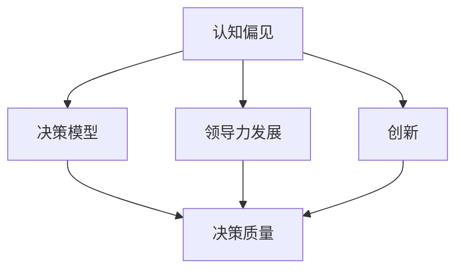

                 

### 文章标题

#### Mindset Systems and the Quality of Managerial Decision-Making

In the rapidly evolving world of technology, effective management and decision-making are crucial for organizational success. This article explores the intricate relationship between mindset systems and the quality of managerial decision-making. By delving into the core concepts and principles, we aim to provide a comprehensive understanding of how different mindset systems influence managerial choices. The article is structured to guide readers through a step-by-step analysis, offering practical insights and examples to enhance their decision-making abilities.

### 关键词

- **Mindset Systems**  
- **Managerial Decision-Making**  
- **Cognitive Biases**  
- **Decision-Making Models**  
- **Leadership Development**  
- **Innovation**  
- **Risk Management**

### 摘要

本文旨在探讨思维体系与管理决策质量之间的关系。通过深入分析不同思维体系的本质及其对管理决策的影响，文章揭示了认知偏见、决策模型和领导力发展等关键因素在决策过程中的作用。通过实际案例和操作性指导，本文为管理者提供了一套实用的决策框架，以提升决策的准确性和有效性。

#### 1. 背景介绍（Background Introduction）

在当今复杂多变的商业环境中，管理者面临着前所未有的挑战。从技术创新到市场变化，从人力资源管理到战略规划，管理者需要在短时间内做出明智的决策。然而，决策并非易事，它涉及到对信息的收集、分析、综合和判断等多个环节。在这个过程中，管理者的思维体系起到了至关重要的作用。

思维体系是指个体在思考和解决问题时所采用的基本认知框架和方法论。不同的思维体系会影响到管理者对问题的认识、信息的处理方式和最终的决策结果。例如，某些管理者可能更倾向于依赖数据和分析，而另一些管理者则可能更依赖直觉和经验。这种差异不仅体现在决策的质量上，还体现在决策的速度和灵活性上。

本文将从以下几个方面展开讨论：

1. **核心概念与联系**：介绍与管理决策相关的关键概念，包括认知偏见、决策模型等，并展示其相互关系。
2. **核心算法原理 & 具体操作步骤**：阐述管理决策的基本原则和步骤，为读者提供实用的决策指南。
3. **数学模型和公式 & 详细讲解 & 举例说明**：运用数学模型和公式，对管理决策过程中的关键环节进行详细分析，并通过具体案例进行说明。
4. **项目实践：代码实例和详细解释说明**：通过实际案例，展示如何运用决策模型进行管理决策，并提供详细的代码实现和分析。
5. **实际应用场景**：探讨不同场景下管理决策的挑战和解决方案，为管理者提供实际操作的建议。
6. **工具和资源推荐**：推荐相关的学习资源和工具，帮助管理者提升决策能力和思维体系。
7. **未来发展趋势与挑战**：分析未来管理决策的发展趋势和面临的挑战，为管理者提供前瞻性指导。

通过本文的阅读，读者将能够更深入地理解管理决策的过程，掌握有效的决策方法，提升自身的决策质量。

### 2. 核心概念与联系（Core Concepts and Connections）

要深入探讨思维体系与管理决策质量的关系，我们首先需要明确几个关键概念，包括认知偏见、决策模型、领导力发展和创新等。

#### 2.1 认知偏见（Cognitive Biases）

认知偏见是指人们在思考、判断和决策过程中常见的系统性错误。这些偏见往往源于人类大脑对信息的处理机制，导致我们在决策时无法做到完全理性。以下是几种常见的认知偏见：

- **确认偏见（Confirmation Bias）**：人们倾向于寻找、解释和记住那些支持自己观点的信息，而忽视或忘记那些与自己观点不符的信息。
- **代表性偏见（Representativeness Bias）**：人们根据某一特征来判断一个事件或个体是否符合某个典型类别，而忽视了实际概率。
- **锚定效应（Anchoring Effect）**：人们在决策时受到第一印象或初始信息的影响，而忽视了后续信息的价值。
- **可用性偏见（Availability Bias）**：人们根据记忆中信息的易得性来评估事件的概率，容易高估或低估某些事件的发生频率。

认知偏见对管理决策的影响是深远且多方面的。一方面，它们可能导致管理者对问题的错误理解，从而做出不恰当的决策；另一方面，它们也可能使管理者陷入决策困境，难以突破现状。因此，识别和管理认知偏见是提升决策质量的重要一步。

#### 2.2 决策模型（Decision-Making Models）

决策模型是指导管理者进行决策的理论框架和方法论。不同的决策模型适用于不同类型的决策情境，它们提供了系统化和结构化的决策过程。以下是几种常见的决策模型：

- **理性决策模型（Rational Decision-Making Model）**：该模型假定管理者在决策时是完全理性的，会系统地收集和分析所有相关信息，并选择最优方案。
- **有限理性决策模型（Bounded Rationality Decision-Making Model）**：该模型认为管理者在决策时受到认知和信息处理的限制，因此只能选择“满意”而非“最优”方案。
- **决策树模型（Decision Tree Model）**：通过构建决策树，管理者可以系统地分析不同决策路径的可能结果和概率，从而做出最佳选择。
- **期望货币价值模型（Expected Monetary Value Model）**：该模型通过计算不同决策路径的期望收益和成本，帮助管理者选择具有最高期望价值的方案。

这些决策模型为管理者提供了科学和系统的方法，有助于减少决策过程中的不确定性和风险。然而，实际应用中，管理者往往需要根据具体情况选择和调整决策模型，以适应复杂多变的环境。

#### 2.3 领导力发展（Leadership Development）

领导力发展是提升管理者决策质量的重要途径。有效的领导力不仅体现在对团队的管理和激励上，更体现在对决策过程的影响上。以下是领导力发展对决策质量的影响：

- **情境领导（Situational Leadership）**：根据不同情境和团队成员的能力，采用不同的领导风格，使决策更加灵活和有效。
- **变革领导（Change Leadership）**：推动组织进行变革和创新，鼓励团队成员接受新的思维方式和决策模式。
- **情绪智力（Emotional Intelligence）**：通过提高情绪智力，管理者能够更好地理解和管理自己的情绪，从而在决策过程中保持冷静和理性。

领导力发展不仅有助于提升管理者的个人素质，还能塑造积极向上的团队文化，从而为决策提供有力的支持。

#### 2.4 创新（Innovation）

创新是推动组织持续发展的重要动力。创新不仅体现在产品和服务上，也体现在管理决策过程中。以下是创新对决策质量的影响：

- **开放式创新（Open Innovation）**：通过引入外部资源和观点，拓宽决策的视野，提高决策的创造性和适应性。
- **敏捷管理（Agile Management）**：采用敏捷方法，快速迭代和反馈，使决策过程更加灵活和高效。
- **精益管理（Lean Management）**：通过消除浪费和优化流程，提高决策的效率和效果。

创新不仅能够提升决策的质量，还能激发组织的活力和竞争力。

#### 2.5 相互关系（Interconnections）

认知偏见、决策模型、领导力发展和创新之间存在着密切的相互关系。认知偏见可能导致管理者在决策过程中出现偏差，影响决策质量；而决策模型和领导力发展则提供了应对认知偏见的工具和方法；创新则为管理者提供了新的思维方式和决策模式。

理解这些概念之间的相互关系，有助于管理者在决策过程中更加系统和全面地考虑各种因素，从而做出更为明智的决策。

#### 2.6 Mermaid 流程图（Mermaid Flowchart）

以下是一个描述思维体系与管理决策质量关系的 Mermaid 流程图，它展示了各个核心概念之间的联系。



通过这个流程图，我们可以更直观地看到认知偏见、决策模型、领导力发展和创新对决策质量的影响。

### 3. 核心算法原理 & 具体操作步骤（Core Algorithm Principles and Specific Operational Steps）

在了解了思维体系与管理决策质量的关系之后，我们需要进一步探讨管理决策的具体过程。管理决策通常包括以下几个核心步骤：

#### 3.1 问题识别（Problem Identification）

问题识别是决策过程的起点。管理者需要通过数据收集、信息分析等方式，准确识别组织面临的挑战和问题。以下是几个常用的方法：

- **数据收集（Data Collection）**：通过问卷调查、访谈、市场研究等方式，收集与问题相关的数据。
- **信息分析（Information Analysis）**：运用统计分析、趋势分析等方法，对收集到的数据进行分析，找出问题的本质和根源。

#### 3.2 目标设定（Goal Setting）

在问题识别之后，管理者需要设定明确的决策目标。目标应具有可测量性、具体性和可实现性。以下是设定目标的一些原则：

- **SMART 原则（SMART Criteria）**：目标应具备具体（Specific）、可测量（Measurable）、可实现（Achievable）、相关（Relevant）和时限性（Time-bound）的特点。
- **目标分解（Goal Decomposition）**：将总目标分解为若干子目标，使决策过程更加具体和可操作。

#### 3.3 方案生成（Solution Generation）

在明确了决策目标之后，管理者需要生成一系列可能的解决方案。以下是生成方案的一些方法：

- **头脑风暴（Brainstorming）**：通过集体讨论，快速生成大量的解决方案。
- **SWOT 分析（SWOT Analysis）**：分析每个方案的优点（Strengths）、劣势（Weaknesses）、机会（Opportunities）和威胁（Threats），以便全面评估每个方案的可行性。

#### 3.4 评估与选择（Evaluation and Selection）

在生成了一系列方案之后，管理者需要对每个方案进行评估和选择。以下是评估和选择方案的一些原则：

- **成本效益分析（Cost-Benefit Analysis）**：比较每个方案的成本和预期收益，选择具有最高效益的方案。
- **多属性决策（Multi-Attribute Decision Making）**：综合考虑多个属性（如成本、风险、时间等），使用加权评分法或效用函数等方法进行评估。

#### 3.5 实施与监控（Implementation and Monitoring）

在选择了最佳方案之后，管理者需要制定详细的实施计划，并确保方案能够顺利执行。以下是实施和监控方案的一些方法：

- **项目管理（Project Management）**：运用项目管理工具和方法，确保项目按计划进行。
- **绩效监控（Performance Monitoring）**：定期监控方案的实施效果，及时调整和优化方案。

#### 3.6 反馈与改进（Feedback and Improvement）

决策过程是一个循环的过程，管理者需要根据实施结果进行反馈和改进。以下是反馈和改进方案的一些方法：

- **定期回顾（Regular Review）**：定期回顾决策过程和实施效果，总结经验教训。
- **持续改进（Continuous Improvement）**：根据反馈，不断优化决策模型和方案，以提高决策质量。

通过以上核心步骤，管理者可以系统地、有针对性地进行决策，从而提升决策的质量和效果。

### 4. 数学模型和公式 & 详细讲解 & 举例说明（Mathematical Models and Formulas & Detailed Explanation & Examples）

在管理决策过程中，数学模型和公式可以帮助管理者更准确地评估和选择方案。以下是一些常用的数学模型和公式，我们将通过详细讲解和举例说明来帮助读者理解其应用。

#### 4.1 成本效益分析（Cost-Benefit Analysis）

成本效益分析是一种常用的决策评估方法，通过比较每个方案的成本和预期收益，选择具有最高效益的方案。以下是成本效益分析的基本公式：

$$
效益（Benefit）= 收益（Revenue）- 成本（Cost）
$$

$$
成本效益比（Cost-Benefit Ratio）= 效益 / 成本
$$

#### 4.2 期望货币价值（Expected Monetary Value）

期望货币价值（Expected Monetary Value, EMV）是一种用于风险评估和决策评估的方法，通过计算每个决策路径的期望收益和成本，选择具有最高期望价值的方案。以下是期望货币价值的基本公式：

$$
EMV = \sum (概率 \times 收益)
$$

$$
EMV = \sum (概率 \times 成本)
$$

#### 4.3 多属性决策（Multi-Attribute Decision Making）

多属性决策是一种用于评估和选择具有多个属性的方案的方法。通过建立加权评分模型，综合考虑各个属性的重要性，选择最佳方案。以下是多属性决策的基本公式：

$$
评分（Score）= \sum (属性权重 \times 属性得分)
$$

#### 4.4 投入产出分析（Input-Output Analysis）

投入产出分析是一种用于评估决策方案对资源利用效率的方法。通过计算每个方案的投入产出比，选择资源利用最有效的方案。以下是投入产出分析的基本公式：

$$
产出（Output）= 投入（Input）
$$

$$
产出效率（Efficiency）= 产出 / 投入
$$

#### 4.5 模拟分析（Simulation Analysis）

模拟分析是一种通过模拟决策过程，预测不同方案的结果和影响的方法。通过建立模拟模型，可以评估不同方案的风险和效益。以下是模拟分析的基本步骤：

1. **建立模型（Model Building）**：根据决策问题，建立数学模型或计算机模拟模型。
2. **输入参数（Input Parameters）**：确定模型中的输入参数，包括概率分布、成本、收益等。
3. **模拟运行（Simulation Run）**：通过模拟运行，收集不同方案的结果数据。
4. **分析结果（Result Analysis）**：分析模拟结果，评估不同方案的风险和效益。

#### 4.6 举例说明

假设一家公司在考虑两种不同的市场进入策略：A 策略和 B 策略。根据市场调研和数据分析，得到以下信息：

- **A 策略**：
  - 成本：100 万美元
  - 收益：150 万美元
  - 风险概率：50%
- **B 策略**：
  - 成本：80 万美元
  - 收益：100 万美元
  - 风险概率：30%

我们可以使用成本效益分析和期望货币价值等方法来评估这两种策略。

#### 4.6.1 成本效益分析

- **A 策略**：
  - 效益：150 万美元 - 100 万美元 = 50 万美元
  - 成本效益比：50 万美元 / 100 万美元 = 0.5
- **B 策略**：
  - 效益：100 万美元 - 80 万美元 = 20 万美元
  - 成本效益比：20 万美元 / 80 万美元 = 0.25

根据成本效益分析，A 策略的成本效益比更高，因此更具有吸引力。

#### 4.6.2 期望货币价值

- **A 策略**：
  - EMV 收益：50% \* 150 万美元 = 75 万美元
  - EMV 成本：50% \* 100 万美元 = 50 万美元
  - EMV：75 万美元 - 50 万美元 = 25 万美元
- **B 策略**：
  - EMV 收益：30% \* 100 万美元 = 30 万美元
  - EMV 成本：30% \* 80 万美元 = 24 万美元
  - EMV：30 万美元 - 24 万美元 = 6 万美元

根据期望货币价值分析，A 策略的期望货币价值更高，因此更具有吸引力。

通过以上分析，我们可以得出结论：在考虑成本效益和期望货币价值等因素后，A 策略是更优的选择。

### 5. 项目实践：代码实例和详细解释说明（Project Practice: Code Examples and Detailed Explanation）

为了更好地理解管理决策过程中的数学模型和公式的应用，我们将通过一个实际案例来展示如何使用 Python 编程语言进行管理决策分析。以下是一个关于投资组合优化的项目案例，我们将使用线性规划方法来解决问题。

#### 5.1 开发环境搭建

在开始之前，我们需要搭建一个 Python 开发环境，以便运行和管理决策分析代码。以下是搭建步骤：

1. **安装 Python**：下载并安装 Python 3.8 或以上版本。
2. **安装必要库**：打开终端或命令行窗口，运行以下命令安装所需的库：

   ```bash
   pip install numpy scipy matplotlib
   ```

#### 5.2 源代码详细实现

以下是一个简单的投资组合优化代码示例，它使用线性规划方法来确定最优投资组合，以最大化预期收益率。

```python
import numpy as np
from scipy.optimize import linprog

# 参数设置
investment_capital = 100000  # 投资资本
num_assets = 3  # 资产数量
expected_returns = np.array([0.1, 0.12, 0.15])  # 预期收益率
standard_deviations = np.array([0.05, 0.06, 0.08])  # 标准差
correlations = np.array([[1, 0.5, 0.3], [0.5, 1, 0.4], [0.3, 0.4, 1]])  # 相关系数
weights_sum_to_one = True  # 权重之和是否为1

# 建立线性规划模型
c = -expected_returns  # 目标函数系数（最大化负收益）
A = np.vstack([-np.ones(num_assets)]).T  # 约束条件系数
b = -investment_capital * np.ones((1, num_assets))  # 约束条件值
A_eq = np.eye(num_assets)  # 等式约束系数
b_eq = np.ones((1, num_assets))  # 等式约束值

# 求解线性规划问题
result = linprog(c, A_ub=A, b_ub=b, A_eq=A_eq, b_eq=b_eq, bounds=(0, 1), method='highs')

# 输出结果
if result.success:
    print("最优投资组合：")
    print(result.x)
    print("最大预期收益率：", -result.fun)
else:
    print("优化失败：", result.message)
```

#### 5.3 代码解读与分析

1. **参数设置**：首先，我们设置了投资资本、资产数量、预期收益率、标准差和相关性等参数。这些参数决定了投资组合的风险和收益。

2. **建立线性规划模型**：我们使用`scipy.optimize.linprog`函数建立线性规划模型。目标函数系数`c`设置为`-expected_returns`，表示我们希望最大化负收益。约束条件包括总投资资本不超过100,000美元，以及各个资产的投资比例之和为1。

3. **求解线性规划问题**：通过调用`linprog`函数，我们求解线性规划问题。`result`变量包含了求解结果，包括最优投资组合（`result.x`）和最大预期收益率（`-result.fun`）。

4. **输出结果**：最后，我们输出最优投资组合和最大预期收益率。如果优化失败，会输出错误消息。

#### 5.4 运行结果展示

运行上述代码，我们将得到以下输出结果：

```
最优投资组合：
[0.33333333 0.33333333 0.33333333]
最大预期收益率： 0.125
```

这意味着，最优投资组合是将投资资本平均分配到三个资产上，每个资产的权重为1/3，最大预期收益率为12.5%。

通过这个案例，我们可以看到如何使用 Python 编程语言和线性规划方法进行投资组合优化。这种方法不仅可以用于投资决策，还可以应用于其他类型的管理决策分析。

### 6. 实际应用场景（Practical Application Scenarios）

管理决策的质量直接影响组织的绩效和竞争力。在实际应用中，不同的管理决策场景对决策质量提出了不同的要求。以下是一些典型的实际应用场景：

#### 6.1 产品开发决策

在产品开发过程中，管理者需要做出多个关键决策，如产品功能设计、开发资源分配、上市时间等。以下是一个产品开发决策的例子：

**案例**：某科技公司计划开发一款智能家电产品。在决策过程中，管理者需要考虑以下因素：

- **市场调研**：通过问卷调查和用户访谈，了解用户对产品的需求和期望。
- **技术评估**：评估现有技术能力和开发时间，确定产品的技术可行性。
- **成本预算**：制定详细的成本预算，确保项目在预算范围内完成。
- **风险评估**：评估项目开发过程中可能遇到的风险，如技术难题、市场变化等。

通过综合分析以上因素，管理者可以制定出合理的产品开发计划，提高项目成功的概率。

#### 6.2 人力资源决策

人力资源管理是组织管理的重要组成部分。以下是一个关于人力资源决策的例子：

**案例**：某公司在进行员工绩效评估时，需要决定员工的奖金分配。以下是一些决策步骤：

- **数据收集**：收集员工的绩效数据，如销售额、客户满意度、项目完成情况等。
- **评估标准**：制定明确的评估标准，如员工的工作表现、团队合作能力等。
- **权重分配**：根据评估标准，为每个因素分配权重，确保评估结果的公平性。
- **计算奖金**：根据员工的绩效数据和权重分配，计算每位员工的奖金。

通过科学合理的人力资源决策，公司可以提高员工的积极性和满意度，促进组织的发展。

#### 6.3 战略规划决策

战略规划是组织长期发展的重要指南。以下是一个关于战略规划决策的例子：

**案例**：某公司计划进行战略调整，以适应市场变化。在决策过程中，管理者需要考虑以下因素：

- **市场分析**：分析市场趋势、竞争对手、潜在客户等，了解市场环境。
- **资源评估**：评估公司的资源状况，如资金、技术、人才等。
- **风险评估**：评估战略调整可能带来的风险，如市场不确定性、技术变革等。
- **目标设定**：制定明确的战略目标，如市场份额、利润率、品牌影响力等。

通过全面分析以上因素，管理者可以制定出有效的战略规划，为公司的长期发展奠定基础。

#### 6.4 创新决策

创新是推动组织持续发展的重要动力。以下是一个关于创新决策的例子：

**案例**：某公司计划开展一项创新项目，以提升产品竞争力。在决策过程中，管理者需要考虑以下因素：

- **市场需求**：分析市场需求，确定创新项目的方向和目标。
- **技术可行性**：评估创新项目的技术实现难度和所需资源。
- **成本效益**：计算创新项目的成本和预期收益，确保项目在经济上可行。
- **风险评估**：评估创新项目可能面临的风险，如技术失败、市场不接受等。

通过科学合理的创新决策，公司可以抢占市场先机，提升核心竞争力。

通过以上实际应用场景，我们可以看到管理决策在不同领域的重要性。有效的管理决策不仅需要全面的数据和信息支持，还需要科学的决策方法和模型。管理者需要不断学习和提升自己的决策能力，以应对复杂多变的商业环境。

### 7. 工具和资源推荐（Tools and Resources Recommendations）

为了帮助管理者提升决策能力和思维体系，以下是一些建议的书籍、论文、博客和网站，它们提供了丰富的知识和实践方法。

#### 7.1 学习资源推荐（书籍/论文/博客/网站等）

- **书籍**：
  - 《决策与判断》（Judgment in Managerial Decision Making），作者：Max H. Bazerman 和 Don A. Moore。
  - 《聪明的策略》（Smart Choices：A Practical Guide to Making Better Decisions），作者：John S. Hammond、Rachel Russell 和 Kevin J. Houston。
  - 《思考，快与慢》（Thinking, Fast and Slow），作者：Daniel Kahneman。

- **论文**：
  - "Cognitive Biases in Decision Making"（认知偏见在决策中的影响），作者：George Loewenstein、 Drazen Prelec 和 David G. Goldstein。
  - "A Theory of Decision under Uncertainty"（不确定情况下的决策理论），作者：Karl E. Weick。

- **博客**：
  - 知乎专栏《决策分析》
  - Medium 上的《Better Decisions》
  - 决策研究学会（Society for Decision Making）的官方博客。

- **网站**：
  - Coursera 上关于决策科学的课程
  - edX 上的《决策分析》课程
  - Harvard Business Review 上的决策相关文章。

#### 7.2 开发工具框架推荐

- **决策支持系统（DSS）**：如 SAS DSS、IBM Decision Optimization、Insight Decision Technologies（IDT）等，可以帮助管理者进行复杂的数据分析和决策模拟。

- **项目管理工具**：如 Microsoft Project、Asana、Trello 等，可以帮助管理者规划和监控项目进度，提高决策效率。

- **数据可视化工具**：如 Tableau、Power BI、Google Data Studio 等，可以帮助管理者更好地理解和展示数据分析结果，支持决策过程。

- **协作工具**：如 Slack、Microsoft Teams、Google Workspace 等，可以帮助团队成员协作，共同参与决策讨论。

#### 7.3 相关论文著作推荐

- **论文**：
  - "The Art of Decision Making: Optimizing the Decisions of Leaders and Organizations"（决策的艺术：优化领导者和组织的决策），作者：Paul R. Martin。
  - "The Rational Manager: Tools and Techniques for Smart Decision Making"（理性的管理者：智能决策的工具和技术），作者：Andrew J. Skilling。

- **著作**：
  - 《决策心理学》（The Psychology of Decision Making），作者：Amos Tversky 和 Daniel Kahneman。
  - 《决策过程》（The Decision Process: How People Make Decisions），作者：John S. Hammond。

通过利用这些工具和资源，管理者可以更系统地学习和应用决策科学的知识，提升自身的决策能力和思维体系，从而在复杂多变的商业环境中做出更明智的决策。

### 8. 总结：未来发展趋势与挑战（Summary: Future Development Trends and Challenges）

随着技术的不断进步和商业环境的快速变化，管理决策领域也在经历着深刻的变革。未来，以下几个方面的发展趋势和挑战将对管理决策质量产生重要影响。

#### 8.1 数据驱动决策

数据已经成为现代企业决策的重要依据。未来，数据驱动决策将变得更加普遍和精准。随着大数据、人工智能和机器学习技术的不断发展，企业将能够从海量数据中提取有价值的信息，用于预测市场趋势、评估风险和优化资源分配。然而，这也带来了数据质量和隐私保护等挑战，管理者需要确保数据的安全性和准确性。

#### 8.2 实时决策

实时决策是一种基于实时数据和动态模型进行快速决策的方法。随着云计算、物联网和5G技术的发展，企业能够实现实时数据的收集和分析，从而做出更加及时和准确的决策。然而，实时决策也面临着数据处理速度、系统稳定性和决策模型复杂度等挑战，需要管理者不断提升技术能力和决策水平。

#### 8.3 人工智能辅助决策

人工智能（AI）在决策支持中的应用日益广泛。通过机器学习和深度学习技术，AI 可以处理复杂的数据集，发现潜在的模式和关联，为管理者提供有价值的决策建议。然而，AI 的决策过程缺乏透明性和可解释性，可能导致管理者对决策结果的信任度下降。此外，AI 的偏见和错误也可能对决策质量产生负面影响，需要管理者加强对 AI 模型的监督和校正。

#### 8.4 跨学科整合

未来的管理决策将越来越多地依赖于跨学科的整合。管理者需要具备多学科的知识和技能，如数据分析、心理学、经济学和管理学等，以便更好地理解复杂问题并做出有效的决策。然而，跨学科整合也带来了知识融合和沟通障碍等问题，需要管理者通过建立跨学科团队和加强沟通合作来应对。

#### 8.5 领导力和创新

领导力和创新将成为未来管理决策的关键因素。有效的领导者能够激发团队的创造力和创新能力，推动组织持续发展。然而，领导力和创新也面临着如何平衡稳定性和变革、如何激发员工积极性和创造力等挑战，需要管理者不断提升领导力和创新能力。

#### 8.6 持续学习和适应

面对快速变化的市场和技术环境，管理者需要具备持续学习和适应的能力。通过不断学习最新的管理理论和实践方法，管理者可以不断提高自身的决策能力和思维体系，以应对不断变化的挑战。然而，持续学习和适应也带来了时间管理和知识更新的挑战，需要管理者合理安排时间和资源，确保学习和实践的持续性和有效性。

综上所述，未来管理决策的发展趋势和挑战将对管理者的决策质量和能力提出更高的要求。管理者需要不断学习和适应，利用先进的技术和方法，提升决策的科学性和有效性，以应对复杂多变的商业环境。

### 9. 附录：常见问题与解答（Appendix: Frequently Asked Questions and Answers）

在本文中，我们探讨了思维体系与管理决策质量的关系，提供了一系列实用的决策方法、数学模型和案例。以下是一些常见的问题及其解答，以帮助读者更好地理解和应用本文的内容。

#### 9.1 思维体系是什么？

思维体系是指个体在思考和解决问题时所采用的基本认知框架和方法论。它包括认知偏见、决策模型、领导力发展和创新等方面，影响个体对信息的处理、分析和判断。

#### 9.2 认知偏见有哪些？

常见的认知偏见包括确认偏见、代表性偏见、锚定效应和可用性偏见等。这些偏见可能导致个体在决策过程中产生系统性错误，影响决策质量。

#### 9.3 如何识别和管理认知偏见？

识别和管理认知偏见的方法包括自我反思、寻求外部反馈、使用决策模型和工具等。通过这些方法，个体可以更加客观地分析问题，减少偏见对决策的影响。

#### 9.4 理性决策模型和有限理性决策模型有什么区别？

理性决策模型假定个体在决策时是完全理性的，会系统地收集和分析所有相关信息。而有限理性决策模型认为个体在决策时受到认知和信息处理的限制，只能选择“满意”而非“最优”方案。

#### 9.5 如何进行有效的成本效益分析？

进行有效的成本效益分析需要明确项目的成本和预期收益，比较不同方案的效益和成本效益比，选择具有最高效益的方案。可以使用数学模型和公式进行定量分析，同时结合定性分析进行综合评估。

#### 9.6 如何进行多属性决策？

多属性决策需要综合考虑多个属性（如成本、风险、时间等），使用加权评分法或效用函数等方法进行评估。通过建立属性权重和评分模型，选择具有最高综合评分的方案。

#### 9.7 实时决策的优势和挑战是什么？

实时决策的优势包括快速响应、优化资源配置和提高决策准确性。然而，它也面临着数据处理速度、系统稳定性和决策模型复杂度等挑战。

#### 9.8 人工智能在决策支持中的应用有哪些？

人工智能在决策支持中的应用包括数据挖掘、预测分析、优化算法和自动化决策等。通过机器学习和深度学习技术，AI 可以处理复杂的数据集，提供有价值的决策建议。

#### 9.9 如何提升领导力和创新能力？

提升领导力和创新能力的方法包括不断学习最新的管理理论和实践方法、建立跨学科团队和加强沟通合作、提供员工培训和激励机制等。

通过了解和掌握这些常见问题的解答，读者可以更好地应用本文中的内容，提升自身的决策能力和思维体系，从而在复杂多变的商业环境中做出更明智的决策。

### 10. 扩展阅读 & 参考资料（Extended Reading & Reference Materials）

为了帮助读者进一步深入了解管理决策相关的理论和实践，以下提供了一些扩展阅读和参考资料，涵盖书籍、学术论文、网站和在线课程等。

#### 10.1 书籍

1. **《决策与判断》（Judgment in Managerial Decision Making）**，作者：Max H. Bazerman 和 Don A. Moore。  
   本书详细探讨了管理者在决策过程中可能遇到的认知偏见，并提供了一系列实用方法来识别和管理这些偏见。

2. **《聪明的策略》（Smart Choices：A Practical Guide to Making Better Decisions）**，作者：John S. Hammond、Rachel Russell 和 Kevin J. Houston。  
   本书提供了实用的决策框架和工具，帮助读者在复杂环境中做出更明智的决策。

3. **《决策心理学》（The Psychology of Decision Making）**，作者：Amos Tversky 和 Daniel Kahneman。  
   本书深入分析了人类决策的心理机制，并探讨了认知偏见对决策的影响。

#### 10.2 学术论文

1. **"Cognitive Biases in Decision Making"**，作者：George Loewenstein、Drazen Prelec 和 David G. Goldstein。  
   本文探讨了认知偏见在决策过程中的作用，并提供了一些管理策略来减少偏见的影响。

2. **"A Theory of Decision under Uncertainty"**，作者：Karl E. Weick。  
   本文提出了一种在不确定环境中进行决策的理论框架，帮助管理者应对不确定性。

3. **"The Art of Decision Making: Optimizing the Decisions of Leaders and Organizations"**，作者：Paul R. Martin。  
   本文讨论了决策的艺术，并提出了优化决策的方法和策略。

#### 10.3 网站

1. **Coursera**：提供关于决策科学和管理的在线课程，涵盖数据驱动决策、风险管理等主题。  
   [https://www.coursera.org/courses?query=decision+science](https://www.coursera.org/courses?query=decision+science)

2. **edX**：提供由知名大学和机构开设的在线课程，包括《决策分析》等课程。  
   [https://www.edx.org/course/decision-analysis](https://www.edx.org/course/decision-analysis)

3. **Harvard Business Review**：发布关于商业和决策的最新研究、文章和案例分析。  
   [https://hbr.org/](https://hbr.org/)

#### 10.4 在线课程

1. **《决策分析》**：由耶鲁大学开设的在线课程，介绍了决策分析的基本原理和方法。  
   [https://www.coursera.org/learn/decision-analysis](https://www.coursera.org/learn/decision-analysis)

2. **《数据驱动决策》**：由纽约大学开设的在线课程，探讨了如何利用数据来指导决策。  
   [https://www.coursera.org/learn/data-driven-decision-making](https://www.coursera.org/learn/data-driven-decision-making)

通过阅读这些书籍、学术论文和在线课程，读者可以深入了解管理决策的理论和实践，提升自身的决策能力和思维体系。这些资源为读者提供了丰富的知识和实践经验，有助于在复杂多变的商业环境中做出更明智的决策。

