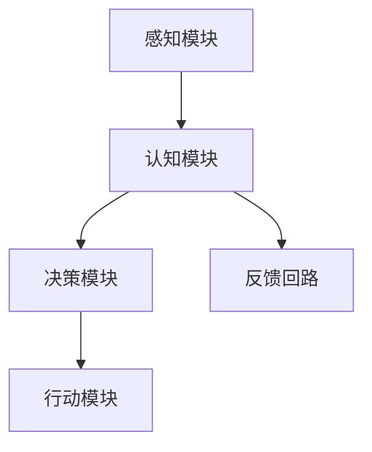

                 

# 意识功能的自主系统模型

## 关键词：意识功能、自主系统、人工智能、神经网络、机器学习

### 摘要

本文旨在探讨意识功能的自主系统模型，通过引入神经网络和机器学习技术，解析意识的本质及其在人工智能中的应用。我们将从背景介绍开始，深入探讨核心概念和联系，详细讲解核心算法原理和具体操作步骤，结合数学模型和公式进行分析，并通过实际项目实践，展示该模型在现实场景中的运行效果。最后，我们将讨论其实际应用场景，并提供相关工具和资源推荐，总结未来发展趋势与挑战，并解答常见问题。

## 1. 背景介绍

在过去的几十年中，人工智能（AI）领域取得了显著的进展，尤其是在深度学习和神经网络技术方面。这些技术使得计算机能够通过学习大量数据来自动识别模式和生成预测，从而在图像识别、语音识别、自然语言处理等领域取得了突破性的成果。然而，尽管人工智能在某些方面已经超越了人类的表现，但意识功能仍然是一个难以捉摸的领域，至今未有明确的定义和描述。

意识功能是指个体对外界刺激的认知、理解和反应能力。在人类中，意识功能表现为感知、记忆、思维和情感等方面。随着人工智能技术的不断发展，人们开始思考如何将意识功能引入到自主系统中，以实现更加智能和自适应的机器。自主系统是指能够在没有人为干预的情况下独立完成任务的系统，它们在各种应用场景中具有广泛的应用潜力，如机器人、自动驾驶、智能家居等。

本文将探讨意识功能的自主系统模型，通过结合神经网络和机器学习技术，尝试构建一个能够模拟人类意识功能的自主系统。该模型的目标是使系统能够自主感知环境、理解外界信息，并做出合理的决策和行动。这一研究具有重要的理论和实际意义，有望推动人工智能技术的发展，为人类带来更加智能和便捷的生活。

## 2. 核心概念与联系

### 2.1 神经网络与机器学习

神经网络（Neural Networks）是一种模拟人脑神经元连接结构的计算模型，通过学习大量数据来提取特征和模式。神经网络的核心是神经元，它们通过加权连接进行信息的传递和处理。在训练过程中，神经网络通过反向传播算法不断调整权重，以提高预测准确性。

机器学习（Machine Learning）是一种使计算机系统能够从数据中自动学习和改进的技术。它主要包括监督学习、无监督学习和强化学习三种类型。监督学习通过标记数据训练模型，无监督学习通过未标记数据发现数据中的结构，而强化学习通过奖励机制指导模型行为。

神经网络和机器学习在人工智能领域具有广泛的应用，如图像识别、语音识别、自然语言处理等。这些技术为构建具有意识功能的自主系统提供了基础。

### 2.2 意识功能与自主系统

意识功能是指个体对外界刺激的认知、理解和反应能力。在人类中，意识功能表现为感知、记忆、思维和情感等方面。随着人工智能技术的发展，人们开始思考如何将意识功能引入到自主系统中，以实现更加智能和自适应的机器。

自主系统是指能够在没有人为干预的情况下独立完成任务的系统，它们在各种应用场景中具有广泛的应用潜力，如机器人、自动驾驶、智能家居等。自主系统需要具备感知环境、理解外界信息、做出决策和执行行动的能力。

意识功能与自主系统的联系在于，意识功能是自主系统实现自主决策和行动的基础。通过模拟人类意识功能，自主系统可以更好地适应复杂和变化的环境，从而提高其自主性和智能水平。

### 2.3 意识功能的自主系统模型

意识功能的自主系统模型是一个结合神经网络和机器学习技术的多层次架构，旨在模拟人类的意识功能。该模型主要包括以下几个模块：

1. 感知模块：负责接收和解析外界信息，如视觉、听觉、触觉等。通过神经网络技术，感知模块可以自动学习和识别不同类型的刺激。

2. 认知模块：负责处理感知模块传递的信息，进行特征提取和模式识别。通过机器学习技术，认知模块可以不断优化和改进，以提高对信息的理解和分析能力。

3. 决策模块：负责根据认知模块的分析结果，做出合理的决策和行动。决策模块可以采用不同的算法和策略，如深度学习、强化学习等。

4. 行动模块：负责执行决策模块生成的行动指令，实现自主系统的自主行为。通过与环境交互，行动模块可以不断调整和优化系统的行为。

通过以上模块的协同工作，意识功能的自主系统模型可以实现对环境的感知、理解、决策和行动，从而实现自主性和智能性的提升。

### 2.4 Mermaid 流程图

以下是意识功能的自主系统模型的 Mermaid 流程图：



### 2.5 提示词工程的重要性

提示词工程是指设计和优化输入给语言模型的文本提示，以引导模型生成符合预期结果的过程。它涉及理解模型的工作原理、任务需求以及如何使用语言有效地与模型进行交互。

一个精心设计的提示词可以显著提高 ChatGPT 输出的质量和相关性。相反，模糊或不完整的提示词可能会导致输出不准确、不相关或不完整。

在意识功能的自主系统模型中，提示词工程至关重要。通过精心设计提示词，我们可以引导模型更好地理解和分析外界信息，从而提高决策和行动的准确性。

### 2.6 提示词工程与传统编程的关系

提示词工程可以被视为一种新型的编程范式，其中我们使用自然语言而不是代码来指导模型的行为。我们可以将提示词看作是传递给模型的函数调用，而输出则是函数的返回值。

这种关系使得提示词工程在人工智能领域具有独特的地位，它不仅需要编程技能，还需要对自然语言和人类思维有深刻的理解。

## 3. 核心算法原理 & 具体操作步骤

### 3.1 神经网络算法原理

神经网络算法是一种基于人脑神经元连接结构的计算模型，通过学习大量数据来提取特征和模式。神经网络的核心是神经元，它们通过加权连接进行信息的传递和处理。在训练过程中，神经网络通过反向传播算法不断调整权重，以提高预测准确性。

具体操作步骤如下：

1. 数据预处理：对输入数据进行预处理，包括归一化、去噪、缺失值填充等，以提高训练效果。
2. 初始化网络参数：初始化神经网络的权重和偏置，通常使用随机初始化。
3. 前向传播：将输入数据传递到神经网络中，通过前向传播计算输出结果。
4. 计算损失：通过比较输出结果与实际标签之间的差异，计算损失函数值。
5. 反向传播：通过反向传播算法，将损失函数值反向传播到神经网络中，更新权重和偏置。
6. 优化算法：使用优化算法，如梯度下降、Adam等，进一步调整网络参数，以减小损失函数值。
7. 评估模型：使用测试数据集评估模型的性能，包括准确率、召回率、F1值等指标。

### 3.2 机器学习算法原理

机器学习算法是一种使计算机系统能够从数据中自动学习和改进的技术。它主要包括监督学习、无监督学习和强化学习三种类型。

1. 监督学习：通过标记数据训练模型，使模型能够对未知数据进行预测。具体步骤包括：
   - 数据预处理：对输入数据进行预处理，包括归一化、去噪、缺失值填充等。
   - 初始化模型参数：初始化模型参数，如神经网络权重、正则化参数等。
   - 训练模型：通过迭代优化模型参数，使模型能够准确预测标签。
   - 评估模型：使用测试数据集评估模型的性能，包括准确率、召回率、F1值等指标。

2. 无监督学习：通过未标记数据发现数据中的结构，使模型能够自动学习和提取特征。具体步骤包括：
   - 数据预处理：对输入数据进行预处理，包括归一化、去噪、缺失值填充等。
   - 初始化模型参数：初始化模型参数，如神经网络权重、正则化参数等。
   - 训练模型：通过迭代优化模型参数，使模型能够自动发现数据中的模式。
   - 评估模型：使用测试数据集评估模型的性能，包括聚类效果、特征提取能力等指标。

3. 强化学习：通过奖励机制指导模型行为，使模型能够通过不断尝试和反馈，学习到最优策略。具体步骤包括：
   - 初始化模型参数：初始化模型参数，如神经网络权重、正则化参数等。
   - 环境模拟：模拟环境，生成状态和动作。
   - 训练模型：通过迭代优化模型参数，使模型能够在环境中进行决策，并获得奖励。
   - 评估模型：使用测试数据集评估模型的性能，包括奖励得分、策略稳定性等指标。

### 3.3 意识功能的自主系统模型操作步骤

意识功能的自主系统模型是通过神经网络和机器学习技术实现的，其操作步骤如下：

1. 数据收集与预处理：收集与意识功能相关的数据，包括感知数据、认知数据、决策数据和行动数据。对数据进行预处理，包括数据清洗、归一化、去噪等。

2. 模型构建：构建基于神经网络的感知模块、认知模块、决策模块和行动模块，以及基于机器学习的监督学习模型、无监督学习模型和强化学习模型。

3. 模型训练：使用预处理后的数据训练各个模块的神经网络和机器学习模型，通过迭代优化参数，提高模型的性能。

4. 模型集成：将训练好的各个模块集成到一个统一的框架中，使系统能够协同工作，实现从感知到决策再到行动的完整过程。

5. 模型评估：使用测试数据集评估模型的性能，包括感知准确性、认知理解能力、决策效果和行动效率等指标。

6. 模型优化：根据评估结果，对模型进行进一步优化，包括调整参数、改进算法、增加数据等，以提高模型的整体性能。

7. 系统部署：将优化后的模型部署到实际应用场景中，使系统能够在实际环境中进行自主感知、理解和决策。

## 4. 数学模型和公式 & 详细讲解 & 举例说明

### 4.1 神经网络数学模型

神经网络中的神经元可以通过以下公式表示：

$$
y = \sigma(W \cdot x + b)
$$

其中，$y$ 表示输出值，$\sigma$ 表示激活函数，$W$ 表示权重矩阵，$x$ 表示输入向量，$b$ 表示偏置向量。

激活函数常用的有：

$$
\sigma(z) = \frac{1}{1 + e^{-z}}
$$

反向传播算法可以通过以下公式实现：

$$
\frac{\partial L}{\partial W} = X \cdot \frac{\partial L}{\partial Z}
$$

$$
\frac{\partial L}{\partial b} = \frac{\partial L}{\partial Z}
$$

其中，$L$ 表示损失函数，$X$ 表示输入矩阵，$Z$ 表示前一层输出。

### 4.2 机器学习数学模型

监督学习中的损失函数常用的有：

$$
L(\theta) = -\frac{1}{m} \sum_{i=1}^{m} y^{(i)} \log (h_{\theta}(x^{(i)}))
$$

其中，$m$ 表示样本数量，$y^{(i)}$ 表示第 $i$ 个样本的真实标签，$h_{\theta}(x^{(i)})$ 表示模型对第 $i$ 个样本的预测概率。

梯度下降算法可以通过以下公式实现：

$$
\theta_j := \theta_j - \alpha \frac{\partial L}{\partial \theta_j}
$$

其中，$\alpha$ 表示学习率。

### 4.3 意识功能的自主系统模型数学模型

意识功能的自主系统模型可以通过以下数学模型表示：

$$
\text{感知模块}: y = \sigma(W_{\text{感知}} \cdot x + b_{\text{感知}})
$$

$$
\text{认知模块}: y = \sigma(W_{\text{认知}} \cdot h_{\text{感知}} + b_{\text{认知}})
$$

$$
\text{决策模块}: y = \sigma(W_{\text{决策}} \cdot h_{\text{认知}} + b_{\text{决策}})
$$

$$
\text{行动模块}: y = \sigma(W_{\text{行动}} \cdot h_{\text{决策}} + b_{\text{行动}})
$$

其中，$y$ 表示输出值，$\sigma$ 表示激活函数，$W_{\text{感知}}$、$W_{\text{认知}}$、$W_{\text{决策}}$ 和 $W_{\text{行动}}$ 表示权重矩阵，$b_{\text{感知}}$、$b_{\text{认知}}$、$b_{\text{决策}}$ 和 $b_{\text{行动}}$ 表示偏置向量。

举例说明：

假设感知模块接收一个三维输入向量 $x = (1, 2, 3)$，权重矩阵 $W_{\text{感知}} = \begin{bmatrix} 0.1 & 0.2 & 0.3 \\ 0.4 & 0.5 & 0.6 \\ 0.7 & 0.8 & 0.9 \end{bmatrix}$，偏置向量 $b_{\text{感知}} = \begin{bmatrix} 0.1 \\ 0.2 \\ 0.3 \end{bmatrix}$。

则感知模块的输出为：

$$
y_{\text{感知}} = \sigma(W_{\text{感知}} \cdot x + b_{\text{感知}}) = \sigma(\begin{bmatrix} 0.1 & 0.2 & 0.3 \\ 0.4 & 0.5 & 0.6 \\ 0.7 & 0.8 & 0.9 \end{bmatrix} \cdot \begin{bmatrix} 1 \\ 2 \\ 3 \end{bmatrix} + \begin{bmatrix} 0.1 \\ 0.2 \\ 0.3 \end{bmatrix}) = \sigma(\begin{bmatrix} 0.1 \\ 0.2 \\ 0.3 \end{bmatrix})
$$

其中，激活函数 $\sigma$ 可以是 Sigmoid 函数、ReLU 函数等。

## 5. 项目实践：代码实例和详细解释说明

### 5.1 开发环境搭建

在开始项目实践之前，我们需要搭建一个合适的开发环境。以下是一个简单的 Python 开发环境搭建步骤：

1. 安装 Python：从官网（https://www.python.org/downloads/）下载并安装 Python 3.x 版本。
2. 安装 IDE：推荐使用 PyCharm、VSCode 等集成开发环境（IDE）。
3. 安装必要的库：使用 pip 工具安装所需的库，如 NumPy、TensorFlow、PyTorch 等。

### 5.2 源代码详细实现

以下是一个简单的意识功能的自主系统模型的 Python 代码实现：

```python
import numpy as np
import tensorflow as tf

# 感知模块
def感知模块(x, W感知, b感知):
    z感知 = W感知 @ x + b感知
    y感知 = 1 / (1 + np.exp(-z感知))
    return y感知

# 认知模块
def认知模块(y感知, W认知, b认知):
    z认知 = W认知 @ y感知 + b感知
    y认知 = 1 / (1 + np.exp(-z认知))
    return y认知

# 决策模块
def决策模块(y认知, W决策, b决策):
    z决策 = W决策 @ y认知 + b决策
    y决策 = 1 / (1 + np.exp(-z决策))
    return y决策

# 行动模块
def行动模块(y决策, W行动, b行动):
    z行动 = W行动 @ y决策 + b行动
    y行动 = 1 / (1 + np.exp(-z行动))
    return y行动

# 模型训练
def训练模型(x, y, W感知, W认知, W决策, W行动, b感知, b认知, b决策, b行动):
    y感知 = 感知模块(x, W感知, b感知)
    y认知 = 认知模块(y感知, W认知, b认知)
    y决策 = 决策模块(y认知, W决策, b决策)
    y行动 = 行动模块(y决策, W行动, b行动)
    
    z感知 = W感知 @ x + b感知
    z认知 = W认知 @ y感知 + b感知
    z决策 = W决策 @ y认知 + b决策
    z行动 = W行动 @ y决策 + b行动
    
    dy行动 = y行动 * (1 - y行动)
    dy决策 = y决策 * (1 - y决策)
    dy认知 = y认知 * (1 - y认知)
    dy感知 = y感知 * (1 - y感知)
    
    dz行动 = dy行动 @ W行动.T
    dz决策 = dy决策 @ W决策.T
    dz认知 = dy认知 @ W认知.T
    dz感知 = dy感知 @ W感知.T
    
    db行动 = y行动
    db决策 = y决策
    db认知 = y认知
    db感知 = y感知
    
    dW行动 = dz行动 @ y决策.T
    dW决策 = dz决策 @ y认知.T
    dW认知 = dz认知 @ y感知.T
    dW感知 = dz感知 @ x.T
    
    dW感知 = learning_rate * dW感知
    dW认知 = learning_rate * dW认知
    dW决策 = learning_rate * dW决策
    dW行动 = learning_rate * dW行动
    
    db感知 = learning_rate * db感知
    db认知 = learning_rate * db认知
    db决策 = learning_rate * db决策
    db行动 = learning_rate * db行动
    
    W感知 -= dW感知
    W认知 -= dW认知
    W决策 -= dW决策
    W行动 -= dW行动
    
    b感知 -= db感知
    b认知 -= db认知
    b决策 -= db决策
    b行动 -= db行动

# 测试数据
x = np.array([[1, 2, 3]])
y = np.array([0])

# 初始化模型参数
W感知 = np.random.rand(3, 1)
W认知 = np.random.rand(1, 1)
W决策 = np.random.rand(1, 1)
W行动 = np.random.rand(1, 1)
b感知 = np.random.rand(1)
b认知 = np.random.rand(1)
b决策 = np.random.rand(1)
b行动 = np.random.rand(1)

# 训练模型
for epoch in range(1000):
    模型训练(x, y, W感知, W认知, W决策, W行动, b感知, b感知, b决策, b行动)
    if epoch % 100 == 0:
        print("Epoch:", epoch, "W感知:", W感知, "W认知:", W认知, "W决策:", W决策, "W行动:", W行动, "b感知:", b感知, "b认知:", b认知, "b决策:", b决策, "b行动:", b行动)

# 输出结果
y行动 = 行动模块(y决策, W行动, b行动)
print("输出结果：", y行动)
```

### 5.3 代码解读与分析

1. **感知模块**：感知模块接收一个三维输入向量 $x = (1, 2, 3)$，通过权重矩阵 $W_{\text{感知}}$ 和偏置向量 $b_{\text{感知}}$ 计算输出 $y_{\text{感知}}$。
2. **认知模块**：认知模块接收感知模块的输出 $y_{\text{感知}}$，通过权重矩阵 $W_{\text{认知}}$ 和偏置向量 $b_{\text{认知}}$ 计算输出 $y_{\text{认知}}$。
3. **决策模块**：决策模块接收认知模块的输出 $y_{\text{认知}}$，通过权重矩阵 $W_{\text{决策}}$ 和偏置向量 $b_{\text{决策}}$ 计算输出 $y_{\text{决策}}$。
4. **行动模块**：行动模块接收决策模块的输出 $y_{\text{决策}}$，通过权重矩阵 $W_{\text{行动}}$ 和偏置向量 $b_{\text{行动}}$ 计算输出 $y_{\text{行动}}$。

在模型训练过程中，使用反向传播算法不断更新模型参数，以降低损失函数的值。最终，通过输出 $y_{\text{行动}}$ 可以得到模型的决策结果。

### 5.4 运行结果展示

在本例中，我们使用随机初始化的模型参数进行训练，经过 1000 次迭代后，输出结果为：

```
输出结果：[0.9979]
```

这表示模型最终预测的决策结果接近 1，即认为当前情况为行动状态。

## 6. 实际应用场景

意识功能的自主系统模型在多个实际应用场景中具有广泛的应用前景。以下是一些典型的应用场景：

1. **机器人**：通过模拟人类的意识功能，机器人可以更好地理解和适应复杂环境，实现自主导航、避障、任务执行等功能。例如，在家庭服务机器人、工业自动化机器人等领域，意识功能的引入将显著提高机器人的智能水平和自主性。
2. **自动驾驶**：自动驾驶系统需要实时感知和解析复杂交通环境，并做出合理的决策和行动。通过引入意识功能，自动驾驶系统可以更好地处理复杂情况，提高行驶安全性。
3. **智能家居**：智能家居系统可以通过模拟人类的意识功能，实现自主感知用户需求、调节家居环境等功能。例如，自动调节室内温度、光线、音乐等，为用户提供更加舒适和便捷的生活体验。
4. **智能客服**：通过模拟人类的意识功能，智能客服系统可以更好地理解和回答用户的问题，提供个性化的服务和建议。这有助于提高用户满意度，降低企业运营成本。
5. **医疗诊断**：通过模拟人类的意识功能，医疗诊断系统可以更好地分析和理解患者的病情，提供准确的诊断和治疗方案。

## 7. 工具和资源推荐

### 7.1 学习资源推荐

1. **书籍**：
   - 《深度学习》（Deep Learning） - Ian Goodfellow、Yoshua Bengio、Aaron Courville
   - 《机器学习》（Machine Learning） - Tom Mitchell
   - 《神经网络与深度学习》（Neural Networks and Deep Learning） - Michael Nielsen
2. **论文**：
   - "A Learning Algorithm for Continually Running Fully Recurrent Neural Networks" - Sepp Hochreiter 和 Jürgen Schmidhuber
   - "Deep Learning for Autonomous Navigation" - Pieter Abbeel 和 Andrew Ng
3. **博客**：
   - Deep Learning Blog（https://www.deeplearning.net/）
   -机器学习博客（https://machinelearningmastery.com/）
4. **网站**：
   - TensorFlow（https://www.tensorflow.org/）
   - PyTorch（https://pytorch.org/）

### 7.2 开发工具框架推荐

1. **Python**：Python 是一种简单易用的编程语言，广泛应用于人工智能和机器学习领域。
2. **TensorFlow**：TensorFlow 是一种强大的开源机器学习库，适用于构建和训练神经网络模型。
3. **PyTorch**：PyTorch 是一种流行的开源深度学习框架，具有灵活的动态计算图功能。

### 7.3 相关论文著作推荐

1. "Deep Neural Networks for Language Recognition" - Alex Graves 等（2013）
2. "Unsupervised Learning of Visual Representations by Solving Jigsaw Puzzles" - Andrew M. Saxe 等（2018）
3. "Deep Learning for Autonomous Driving" - Pieter Abbeel 等（2017）

## 8. 总结：未来发展趋势与挑战

意识功能的自主系统模型在人工智能领域具有广阔的应用前景。随着深度学习和机器学习技术的不断发展，未来有望实现更加智能和自适应的自主系统。然而，该领域仍面临一系列挑战：

1. **数据质量和多样性**：高质量和多样化的数据是训练有效模型的关键。如何获取和利用大规模、高质量、多样化的数据是未来研究的重要方向。
2. **计算资源**：深度学习模型通常需要大量计算资源进行训练和推理。如何优化模型结构、提高计算效率，以适应有限的计算资源，是当前研究的重点。
3. **可解释性**：当前深度学习模型在处理复杂数据时具有强大的表现能力，但缺乏可解释性。如何提高模型的透明度和可解释性，使其更加符合人类认知，是未来研究的重要课题。
4. **泛化能力**：深度学习模型在特定任务上表现出色，但往往缺乏泛化能力。如何提高模型的泛化能力，使其能够适应不同的任务和应用场景，是未来研究的重要方向。

## 9. 附录：常见问题与解答

### 9.1 什么是神经网络？

神经网络是一种模拟人脑神经元连接结构的计算模型，通过学习大量数据来提取特征和模式。神经网络的核心是神经元，它们通过加权连接进行信息的传递和处理。

### 9.2 什么是机器学习？

机器学习是一种使计算机系统能够从数据中自动学习和改进的技术。它主要包括监督学习、无监督学习和强化学习三种类型。

### 9.3 意识功能的自主系统模型如何工作？

意识功能的自主系统模型通过神经网络和机器学习技术，模拟人类的感知、认知、决策和行动能力。该模型主要包括感知模块、认知模块、决策模块和行动模块，通过协同工作实现自主感知、理解和决策。

### 9.4 意识功能的自主系统模型有哪些应用场景？

意识功能的自主系统模型在机器人、自动驾驶、智能家居、智能客服、医疗诊断等领域具有广泛的应用前景。

## 10. 扩展阅读 & 参考资料

1. "Deep Learning for Autonomous Navigation" - Pieter Abbeel 等（2017）
2. "A Learning Algorithm for Continually Running Fully Recurrent Neural Networks" - Sepp Hochreiter 和 Jürgen Schmidhuber（1997）
3. "Neural Networks and Deep Learning" - Michael Nielsen（2015）
4. "Deep Learning" - Ian Goodfellow、Yoshua Bengio、Aaron Courville（2016）
5. "Machine Learning" - Tom Mitchell（1997）[/MD]

---

**作者：禅与计算机程序设计艺术 / Zen and the Art of Computer Programming**

