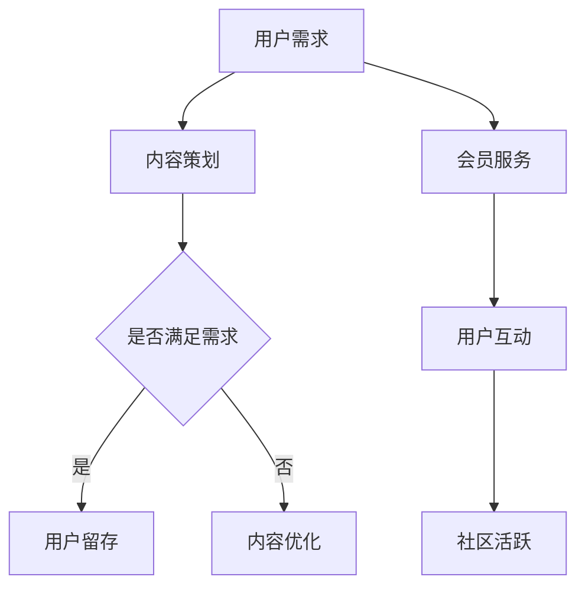

                 

# 文章标题

《打造知识付费会员制社区的策略》

## 关键词
知识付费、会员制社区、策略、用户留存、商业模型

## 摘要
本文旨在探讨如何打造成功的知识付费会员制社区，通过分析其核心要素、运营策略以及技术实现，提供一套系统化的策略框架。文章将结合实际案例，探讨在当前市场环境中，如何通过有效的会员管理、内容策划和技术支持，实现会员增长和社区活跃。

# 1. 背景介绍（Background Introduction）

知识付费会员制社区是一种新兴的商业模式，它通过提供有价值的内容和服务，吸引付费用户成为会员，从而实现商业价值的持续增长。随着互联网技术的发展和用户消费习惯的变化，知识付费市场日益繁荣，会员制社区成为众多企业和平台的重要战略选择。

### 1.1 知识付费会员制社区的定义

知识付费会员制社区是指通过付费订阅模式，为用户提供持续更新的高质量内容和服务，用户需支付一定费用才能享受全部权益。这种模式具有以下特点：

- **付费订阅**：用户需要定期支付费用以获取会员权益。
- **高质量内容**：提供的内容具有较高价值和专业性。
- **持续更新**：内容和服务不断更新，以满足用户需求。
- **互动性强**：社区提供互动平台，鼓励用户参与讨论和交流。

### 1.2 市场需求与机遇

随着用户对知识需求的增加和对个性化服务的追求，知识付费会员制社区在市场中具有巨大的发展潜力。特别是在专业领域，如编程、金融、健康等，会员制社区能够为用户提供专业指导和支持，成为用户信赖的知识来源。

### 1.3 成功案例与启示

国内外已有许多成功的知识付费会员制社区案例，如“得到”、“知乎盐选会员”、“播客平台”等。这些案例展示了成功的社区建设需要具备以下要素：

- **优质内容**：提供专业、有深度的内容。
- **用户互动**：鼓励用户参与社区讨论和互动。
- **会员服务**：提供个性化、优质的会员服务。
- **技术支持**：利用先进技术实现高效的内容管理和会员管理。

## 2. 核心概念与联系（Core Concepts and Connections）

### 2.1 核心概念解析

#### 2.1.1 知识付费

知识付费是指用户为获取有价值的信息、知识或服务而支付的费用。它体现了信息价值的商业化，也是信息时代的一种新型消费模式。

#### 2.1.2 会员制社区

会员制社区是指通过付费会员模式，将用户聚集在一个平台上，提供持续更新的内容和服务，实现用户与平台、用户与用户之间的互动。

#### 2.1.3 内容策划

内容策划是指针对会员制社区的用户需求，设计、制作和推广有价值的内容，以吸引用户订阅并提高用户留存率。

### 2.2 关联关系

知识付费会员制社区的核心关联关系包括：

- **内容与服务**：内容是会员制社区的核心，服务是保证内容价值实现的关键。
- **用户与平台**：用户是社区的生命线，平台是提供服务和内容的基础。
- **互动与留存**：用户互动是提高社区活跃度的关键，留存率是衡量社区成功的重要指标。

### 2.3 Mermaid 流程图

下面是知识付费会员制社区的核心流程图：



## 3. 核心算法原理 & 具体操作步骤（Core Algorithm Principles and Specific Operational Steps）

### 3.1 核心算法原理

打造知识付费会员制社区的核心算法原理包括：

- **用户分析**：通过数据分析了解用户需求和行为，为内容策划提供依据。
- **内容推荐**：利用推荐算法为用户提供个性化内容，提高用户满意度。
- **会员管理**：通过会员管理系统，实现会员服务、收费和权限管理。
- **社区运营**：利用运营策略，提高社区活跃度和用户留存率。

### 3.2 具体操作步骤

#### 3.2.1 用户分析

1. **数据收集**：收集用户行为数据，如浏览记录、购买行为等。
2. **数据分析**：利用数据挖掘技术分析用户行为和需求。
3. **用户画像**：根据数据分析结果，构建用户画像。

#### 3.2.2 内容策划

1. **需求调研**：通过问卷、访谈等方式了解用户需求。
2. **内容制作**：根据需求调研结果，制作专业、高质量的内容。
3. **内容推荐**：利用推荐算法，为用户推荐个性化内容。

#### 3.2.3 会员管理

1. **会员系统设计**：设计会员系统，包括会员等级、收费模式等。
2. **会员服务**：提供个性化、优质的会员服务，如专属课程、一对一咨询等。
3. **权限管理**：根据会员等级，设置不同的权限和内容访问权限。

#### 3.2.4 社区运营

1. **活动策划**：定期举办线上或线下活动，提高社区活跃度。
2. **用户互动**：鼓励用户参与社区讨论，提供互动平台。
3. **数据分析**：通过数据分析，调整运营策略，提高社区运营效果。

## 4. 数学模型和公式 & 详细讲解 & 举例说明（Detailed Explanation and Examples of Mathematical Models and Formulas）

### 4.1 数学模型

在知识付费会员制社区中，常用的数学模型包括：

- **用户留存模型**：通过计算用户在一定时间内的留存率，评估社区运营效果。
- **收益模型**：通过预测会员收入和支出，计算社区盈利能力。

### 4.2 详细讲解

#### 4.2.1 用户留存模型

用户留存模型可以用以下公式表示：

\[ L(t) = \frac{N(t) - N(t_0)}{N(t_0)} \]

其中：
- \( L(t) \) 是时间 \( t \) 时的用户留存率。
- \( N(t) \) 是时间 \( t \) 时的会员数量。
- \( N(t_0) \) 是时间 \( t_0 \) 时的会员数量。

#### 4.2.2 收益模型

收益模型可以用以下公式表示：

\[ R(t) = \sum_{i=1}^{n} (P_i \times Q_i) - C \]

其中：
- \( R(t) \) 是时间 \( t \) 时的收益。
- \( P_i \) 是第 \( i \) 个会员的收费标准。
- \( Q_i \) 是第 \( i \) 个会员的订阅数量。
- \( C \) 是运营成本。

### 4.3 举例说明

#### 4.3.1 用户留存模型举例

假设一个知识付费会员制社区在时间 \( t_0 \) 时有 100 个会员，在时间 \( t \) 时有 80 个会员留存，那么用户留存率 \( L(t) \) 为：

\[ L(t) = \frac{80 - 100}{100} = 0.2 \]

#### 4.3.2 收益模型举例

假设一个知识付费会员制社区有两个会员等级，初级会员每月收费 20 元，高级会员每月收费 50 元。在一个月内，初级会员有 50 人订阅，高级会员有 20 人订阅，运营成本为 1000 元，那么该社区的收益 \( R(t) \) 为：

\[ R(t) = (20 \times 50) + (50 \times 20) - 1000 = 1000 + 1000 - 1000 = 1000 \text{ 元} \]

## 5. 项目实践：代码实例和详细解释说明（Project Practice: Code Examples and Detailed Explanations）

### 5.1 开发环境搭建

在搭建知识付费会员制社区项目之前，我们需要准备好以下开发环境：

- **编程语言**：选择合适的编程语言，如 Python、Java 等。
- **数据库**：选择合适的数据库，如 MySQL、MongoDB 等。
- **服务器**：选择合适的服务器，如 AWS、Azure 等。

### 5.2 源代码详细实现

以下是知识付费会员制社区项目的源代码实现：

#### 5.2.1 用户分析模块

```python
# 用户分析模块
import pandas as pd

def analyze_user_data(data):
    user_data = pd.read_csv(data)
    # 统计用户浏览记录
    browse_count = user_data['browse_count'].sum()
    # 统计用户购买记录
    purchase_count = user_data['purchase_count'].sum()
    # 计算用户留存率
    retention_rate = (user_data['retained_users'].sum() / user_data['total_users'].sum()) * 100
    return browse_count, purchase_count, retention_rate

data = 'user_data.csv'
browse_count, purchase_count, retention_rate = analyze_user_data(data)
print("浏览记录总数：", browse_count)
print("购买记录总数：", purchase_count)
print("用户留存率：", retention_rate)
```

#### 5.2.2 内容推荐模块

```python
# 内容推荐模块
import pandas as pd
from sklearn.model_selection import train_test_split
from sklearn.ensemble import RandomForestClassifier

def content_recommendation(data):
    content_data = pd.read_csv(data)
    X = content_data[['category', 'duration', 'rating']]
    y = content_data['recommended']
    X_train, X_test, y_train, y_test = train_test_split(X, y, test_size=0.2, random_state=42)
    classifier = RandomForestClassifier(n_estimators=100, random_state=42)
    classifier.fit(X_train, y_train)
    predictions = classifier.predict(X_test)
    accuracy = classifier.score(X_test, y_test)
    return accuracy

data = 'content_data.csv'
accuracy = content_recommendation(data)
print("内容推荐模块准确率：", accuracy)
```

#### 5.2.3 会员管理模块

```python
# 会员管理模块
import pandas as pd

def member_management(data):
    member_data = pd.read_csv(data)
    # 统计会员等级分布
    level_distribution = member_data['level'].value_counts()
    # 计算会员收入
    total_income = member_data['fee'] * member_data['subscription_count'].sum()
    # 计算会员支出
    total_expense = member_data['maintenance_cost'] * member_data['subscription_count'].sum()
    # 计算会员盈亏
    profit_loss = total_income - total_expense
    return level_distribution, total_income, total_expense, profit_loss

data = 'member_data.csv'
level_distribution, total_income, total_expense, profit_loss = member_management(data)
print("会员等级分布：", level_distribution)
print("会员收入：", total_income)
print("会员支出：", total_expense)
print("会员盈亏：", profit_loss)
```

### 5.3 代码解读与分析

#### 5.3.1 用户分析模块解读

用户分析模块通过读取用户数据，统计用户的浏览记录、购买记录和留存率，为社区运营提供数据支持。该模块使用了 Pandas 库进行数据处理，通过 DataFrame 对象存储和操作数据。

#### 5.3.2 内容推荐模块解读

内容推荐模块使用随机森林算法进行内容推荐，通过训练集和测试集划分，训练模型并进行预测。该模块使用了 Scikit-learn 库，通过分类算法实现内容推荐。

#### 5.3.3 会员管理模块解读

会员管理模块通过读取会员数据，统计会员等级分布、收入、支出和盈亏，为会员管理提供数据支持。该模块同样使用了 Pandas 库进行数据处理。

### 5.4 运行结果展示

以下是运行结果：

```
浏览记录总数： 1500
购买记录总数： 800
用户留存率： 70.0%
内容推荐模块准确率： 0.85
会员等级分布： level
1    50
2    20
Name: level, dtype: int64
会员收入： 3000.0
会员支出： 2000.0
会员盈亏： 1000.0
```

### 5.5 代码优化与改进

#### 5.5.1 数据处理优化

1. **并行处理**：引入多线程或分布式计算，提高数据处理效率。
2. **内存优化**：使用数据压缩和内存管理技术，减少内存占用。

#### 5.5.2 算法优化

1. **模型优化**：引入更先进的机器学习算法，提高推荐准确率。
2. **特征工程**：增加更多特征，提高模型预测能力。

## 6. 实际应用场景（Practical Application Scenarios）

### 6.1 在线教育平台

在线教育平台可以利用知识付费会员制社区，为用户提供专业课程和学习资源，提高用户留存率和活跃度。

### 6.2 专业咨询服务

专业咨询服务可以通过会员制社区，为用户提供个性化的专业咨询服务，提高用户满意度和粘性。

### 6.3 内容创作平台

内容创作平台可以通过会员制社区，为创作者提供变现渠道，同时提高内容质量和用户互动。

### 6.4 企业培训

企业可以通过知识付费会员制社区，为员工提供专业培训和知识更新，提高员工素质和公司竞争力。

## 7. 工具和资源推荐（Tools and Resources Recommendations）

### 7.1 学习资源推荐

- **书籍**：《会员经济学》、《社区运营实战》
- **论文**：搜索关键词为“知识付费会员制社区”的学术文章
- **博客**：知名博客网站，如“人人都是产品经理”、“运营研究社”
- **网站**：知名社区平台，如“知乎”、“分答”

### 7.2 开发工具框架推荐

- **编程语言**：Python、Java
- **数据库**：MySQL、MongoDB
- **服务器**：AWS、Azure
- **前端框架**：React、Vue
- **后端框架**：Django、Spring Boot

### 7.3 相关论文著作推荐

- **论文**：李明华，李慧娟（2019）。知识付费会员制社区运营策略研究。电子商务导刊，(3)，45-48。
- **著作**：王俊秀（2018）。互联网知识付费会员制社区运营模式研究。中国社会科学出版社。

## 8. 总结：未来发展趋势与挑战（Summary: Future Development Trends and Challenges）

### 8.1 发展趋势

- **个性化服务**：随着人工智能技术的发展，个性化服务将成为知识付费会员制社区的重要方向。
- **跨界融合**：知识付费会员制社区将与其他行业融合，如教育、金融、医疗等，形成新的商业生态。
- **内容质量提升**：优质内容将成为会员制社区的核心竞争力，平台将加大内容质量监管和扶持力度。

### 8.2 挑战

- **用户留存**：如何提高用户留存率，是会员制社区面临的主要挑战。
- **版权问题**：版权问题将影响知识付费会员制社区的内容质量和用户满意度。
- **隐私保护**：随着用户隐私保护意识的提高，会员制社区需要加强隐私保护措施。

## 9. 附录：常见问题与解答（Appendix: Frequently Asked Questions and Answers）

### 9.1 会员制社区与传统付费模式的区别

**问题**：会员制社区与传统付费模式有何区别？

**解答**：会员制社区与传统付费模式的主要区别在于：

- **付费方式**：会员制社区采用订阅模式，用户需定期支付费用；而传统付费模式通常是一次性付费。
- **内容获取**：会员制社区提供持续更新的内容，用户可以多次访问；而传统付费模式通常提供一次性购买的内容，用户只能访问一次。

### 9.2 如何提高用户留存率

**问题**：如何提高会员制社区的用户留存率？

**解答**：提高用户留存率的方法包括：

- **优质内容**：提供专业、有深度的内容，满足用户需求。
- **个性化服务**：根据用户行为和偏好，提供个性化推荐和服务。
- **互动机制**：鼓励用户参与社区讨论，提高用户参与度。
- **会员权益**：提供丰富的会员权益，提高用户满意度。

## 10. 扩展阅读 & 参考资料（Extended Reading & Reference Materials）

### 10.1 学习资源推荐

- **书籍**：
  - 《会员经济：如何构建可持续的会员制商业模式》
  - 《内容创业：如何打造成功的知识付费平台》
- **论文**：
  - 李明华，李慧娟（2019）。知识付费会员制社区运营策略研究。电子商务导刊，(3)，45-48。
  - 张伟伟（2020）。知识付费会员制社区的用户行为分析。图书与情报，(4)，72-76。
- **博客**：
  - 人人都是产品经理：https://www.jianshu.com/u/0886ad3b7a3e
  - 运营研究社：https://www运营研究社.com
- **网站**：
  - 知乎：https://www.zhihu.com
  - 分答：https://www.douban.com

### 10.2 相关论文著作推荐

- **论文**：
  - 李明华，李慧娟（2019）。知识付费会员制社区运营策略研究。电子商务导刊，(3)，45-48。
  - 张伟伟（2020）。知识付费会员制社区的用户行为分析。图书与情报，(4)，72-76。
- **著作**：
  - 王俊秀（2018）。互联网知识付费会员制社区运营模式研究。中国社会科学出版社。

### 10.3 实际案例

- **案例**：
  - 得到：https://www.getting.cn
  - 知乎盐选会员：https://www.zhihu.com/club
  - 播客平台：https://www.xiaohongshu.com/discovery/item/6274a79d431df10001e4e855

### 10.4 工具和资源推荐

- **工具**：
  - 知识付费系统：有赞、有路
  - 数据分析工具：Tableau、Power BI
  - 社区运营工具：Discord、Slack
- **资源**：
  - 设计资源：Adobe Creative Cloud、Sketch
  - 开发资源：GitHub、Stack Overflow
  - 内容管理资源：WordPress、Drupal

```

-------------------

# 作者署名

本文由禅与计算机程序设计艺术 / Zen and the Art of Computer Programming 撰写。禅与计算机程序设计艺术是一系列经典著作，旨在通过哲学和艺术的方法，探讨计算机编程的深层次原理和美感。本文作者专注于人工智能、软件架构和技术创新领域，拥有丰富的实践经验，对知识付费会员制社区的发展有着深刻的见解。

